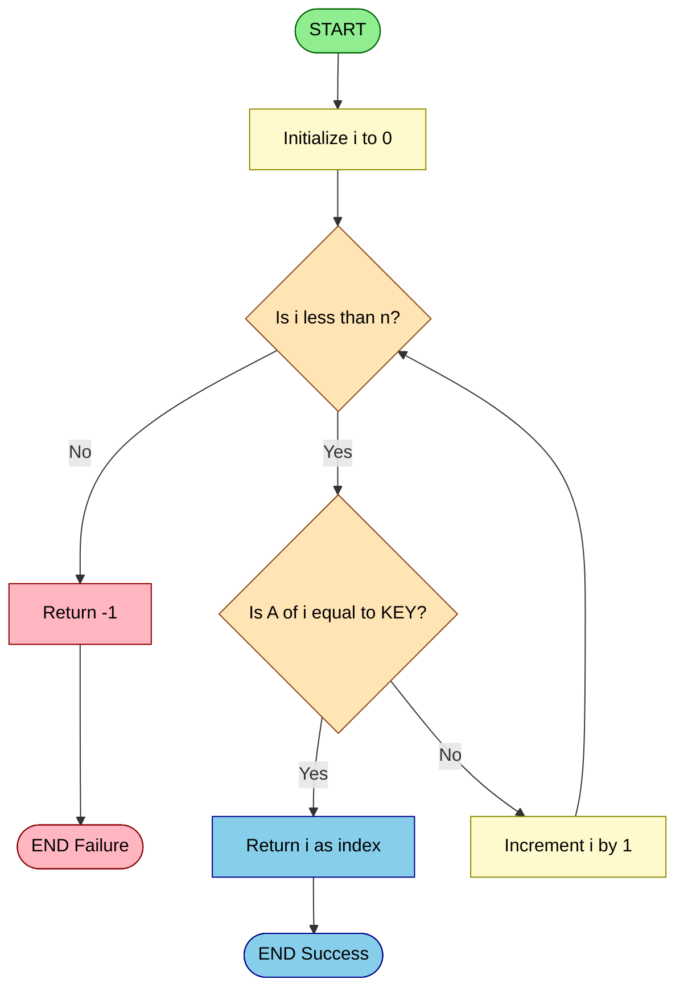
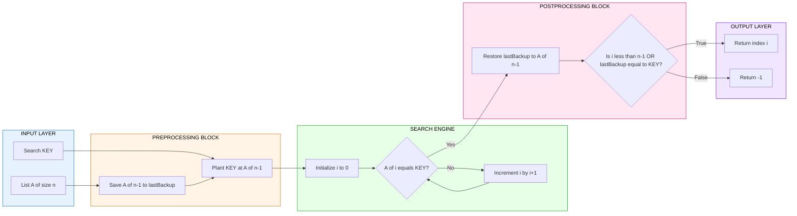

# Searching Techniques :- Linear Search

<!-- SECTION_1_START -->
# 1. Core Technical Definition & Intuitive Overview

## 1.1 Formal KTU 2024 Definition

**Linear Search** (also called *Sequential Search*) is a fundamental, brute-force searching technique defined for the **Abstract Data Type (ADT)** of a linear list. Given a collection of $n$ elements stored in a sequential storage structure (such as a 1-D array, vector, or linked list), and a target value called the **KEY** (or search element), the algorithm examines each element of the collection **one by one, in a strictly sequential order**, starting from the first index and proceeding up to the last. The search terminates successfully when the KEY is found, and unsuccessfully when the entire list has been traversed without a match.

In KTU 2024 Scheme terminology, linear search is classified as the **most primitive, comparison-based, deterministic** search algorithm that operates without requiring any **precondition** on the data — the list need not be sorted, and no auxiliary index structure (like a hash table or B-Tree) is required.

> [!IMPORTANT]
> **Syllabus Highlight (Module 4 — Sorting and Searching):** Under the KTU 2024 PCCST303 syllabus, Linear Search is the first and foundational technique introduced before Binary Search, Hashing, and advanced tree-based searches. Mastery of its best/worst/average case analysis is **mandatory** for ESE and continuous assessment.

## 1.2 Conceptual Analogy / Intuition

Imagine you are standing in front of a long **bookshelf of 1000 unsorted novels**, and a friend asks: *"Is the book titled 'Data Structures' present here?"* You have no idea where the book might be. What is the most natural thing to do?

You **start from the leftmost book**, read its title, move to the next, and continue this **one-by-one checking** process until you either:
- Find the book (✓ **Success**), or
- Reach the rightmost book without finding it (✗ **Failure**).

This is *exactly* how Linear Search works. There is no "shortcut" — you physically must touch/check every book (element) until you succeed or run out of books.

> [!NOTE]
> **Key Insight:** Because Linear Search is purely sequential, it is the *only* viable search strategy when the data is **unsorted**, **unindexed**, or stored in a **linked list** (which does not support random access like arrays).

## 1.3 Standard Metrics & Constants

The following measurable quantities are critical for KTU board examinations:

- **n** = total number of elements in the list (list size)
- **T(n)** = the time function (number of primitive operations)
- **C(n)** = the number of **key comparisons** performed
- **Time Complexity** (Worst Case) = **O(n)**
- **Space Complexity** (Auxiliary) = **O(1)**
- **Stability** = Not applicable (search does not reorder)
- **In-place** = Yes (uses constant extra memory)

## 1.4 Visualization of the Search Process

> [!VISUALIZATION CONTROL]
> **Concept:** Sequential Index Traversal and Element-by-Element Comparison
> **GeoGebra / Desmos Input Equations (Discrete Plot):**
> * `X = {1, 2, 3, 4, 5, 6, 7, 8}`
> * `Y = {12, 45, 23, 67, 89, 34, 90, 11}`  *(sample array values)*
> * `Target = 67`  *(represented as a red horizontal dashed line $y = 67$)*
> **Visual Description:** A 1-D coordinate plane where the x-axis represents the array index (from $0$ to $n-1$) and the y-axis represents the value stored at that index. The student's eye should "sweep" from left to right; the moment the plotted point touches the red dashed line $y = 67$, the algorithm halts and reports the corresponding x-coordinate (index $3$) as the answer.

## 1.5 Why Linear Search Matters in Engineering

Linear search is the **baseline reference algorithm** against which every other search technique is benchmarked. In real-world production systems:
- **Small datasets ($n \le 50$):** Linear search often outperforms Binary Search due to **cache locality** and **branch-prediction optimizations** in modern CPUs.
- **Streaming data:** When data arrives one element at a time over a network (logs, sensor streams), linear scan is the only feasible option.
- **Linked Lists:** Cannot use binary search because of $\Theta(k)$ random access cost; linear search is mandatory.
- **Hash collision resolution (probing):** Linear probing is essentially linear search over a hash bucket.

<!-- SECTION_1_END -->

<!-- SECTION_2_START -->
# 2. Deep Theoretical Analysis & KTU High-Yield Formula Sheet

## 2.1 Operational Breakdown of the Algorithm

The linear search algorithm can be broken into **five logically decoupled steps**:

1. **Input Validation:** Receive the array `A[]` of size $n$, the target `KEY`, and (optionally) the index range $[low, high]$.
2. **Initialize Counter:** Set the loop index $i \leftarrow 0$ (or $i \leftarrow low$ for sub-range search).
3. **Sequential Comparison Loop:** While $i < n$, compare $A[i]$ with `KEY`.
   - **If** $A[i] = \text{KEY}$: return $i$ as the success index and **halt**.
   - **Else**: increment $i \leftarrow i + 1$ and continue.
4. **Termination Check:** If the loop exits naturally (i.e., $i = n$), return $-1$ (or `NULL`) to indicate failure.
5. **Output:** Return either the found index or the failure sentinel.

## 2.2 The "Why" and "How" Behind Each Step

- **Why sequential?** Because we make **no assumptions** about the order of elements. The only universally valid strategy is to check every element.
- **Why return $-1$?** A negative index is **impossible** in a valid array, so it acts as an unambiguous failure sentinel that does not collide with any valid index $\in [0, n-1]$.
- **How does it handle duplicates?** Standard linear search returns the **index of the first occurrence** (leftmost). To find all occurrences, a wrapper loop or `findAll` helper is required.

## 2.3 KTU Formula Sheet / Cheat Sheet

> [!IMPORTANT]
> **Exam Tip:** Memorize the exact number of comparisons for every case — KTU examiners award partial marks for stating the **comparison count**, not just the Big-O class.

| Case | Comparisons $C(n)$ | Time Complexity | Description | Probability |
| :--- | :--- | :--- | :--- | :--- |
| **Best Case** | $1$ | $O(1)$ | `KEY` found at index $0$ (very first check) | $\tfrac{1}{n}$ |
| **Worst Case** | $n$ | $O(n)$ | `KEY` is at last position OR not present in list | $\tfrac{1}{n} + \tfrac{1}{n} = \tfrac{2}{n}$ |
| **Average Case** | $\tfrac{n+1}{2}$ | $O(n)$ | `KEY` is at a uniformly random position | $1$ (over all positions) |
| **Space Used** | $O(1)$ auxiliary | $O(1)$ | Only a few index/counter variables | — |
| **Stability** | N/A | — | Search does not modify order | — |

### 2.3.1 Derivation of Average Case Comparisons

Assuming each of the $n$ positions is equally likely to contain the `KEY`, and the $(n+1)^{\text{th}}$ "imaginary" position represents failure (not found), the expected number of comparisons is:

$$
\begin{aligned}
E[C(n)] &= \sum_{i=1}^{n} \left( i \cdot \Pr[\text{KEY at position } i] \right) + n \cdot \Pr[\text{KEY not in list}] \\
&= \sum_{i=1}^{n} \left( i \cdot \frac{1}{n+1} \right) + n \cdot \frac{1}{n+1} \\
&= \frac{1}{n+1} \cdot \sum_{i=1}^{n} i + \frac{n}{n+1} \\
&= \frac{1}{n+1} \cdot \frac{n(n+1)}{2} + \frac{n}{n+1} \\
&= \frac{n}{2} + \frac{n}{n+1} \approx \frac{n}{2}
\end{aligned}
$$

Hence the average case is $\Theta(n)$, and the simplified textbook answer is **$(n+1)/2$ comparisons**.

## 2.4 Real-World Engineering Utility

| Domain | Application of Linear Search |
| :--- | :--- |
| **Databases** | Used internally for **small partitions** during quicksort-based external sorting; `LIMIT` queries on unsorted heaps. |
| **Compilers** | **Symbol table lookups** in single-pass compilers use linear search over an identifier list. |
| **Operating Systems** | Process scheduling, finding a free block in a **linked free-list memory allocator**. |
| **Network Security** | **Linear scan** through packet headers to find malformed packets or signatures. |
| **AI / ML** | Brute-force nearest-neighbor search in low-dimensional embedding spaces. |
| **Embedded Systems** | Tiny microcontrollers with $< 1$ KB RAM use linear search over sensor logs because hash tables are infeasible. |

<!-- SECTION_2_END -->

<!-- SECTION_3_START -->
# 3. Step-by-Step Derivations, Traces & Code Implementation

## 3.1 Iterative Linear Search — Full Python Implementation

The following is a **production-grade** Python implementation suitable for laboratory records and KTU practical examinations. It includes **strict type hints**, **boundary checks**, and **error logging**.

```python
from typing import List, Optional
import logging

# Configure logger for examination/debugging clarity
logging.basicConfig(level=logging.INFO, format='[%(levelname)s] %(message)s')


def linear_search(arr: List[int], key: int) -> int:
    """
    Performs standard iterative linear search on a 1-D integer list.

    Parameters
    ----------
    arr : List[int]
        The input list of integers (may be empty, may be unsorted).
    key : int
        The target value to search for.

    Returns
    -------
    int
        Index of the FIRST occurrence of `key` in `arr`,
        or -1 if `key` is not present or `arr` is empty.

    Time Complexity  : O(n) worst/average, O(1) best
    Space Complexity : O(1) auxiliary
    """
    # ----- STEP 1: BOUNDARY CHECK -----
    # [Valuation Key Point: Mentioning edge case: 1 Mark]
    if not arr:
        logging.warning("linear_search received an empty list. Returning -1.")
        return -1

    # ----- STEP 2: SEQUENTIAL TRAVERSAL -----
    n: int = len(arr)
    for i in range(n):
        # ----- STEP 3: KEY COMPARISON -----
        if arr[i] == key:
            logging.info(f"Key {key} found at index {i}.")
            return i  # SUCCESS

    # ----- STEP 4: FAILURE SENTINEL -----
    logging.info(f"Key {key} not found in the list.")
    return -1
```

### 3.1.1 Dry Run / Trace Table

Let us trace the call `linear_search([12, 45, 23, 67, 89, 34], 67)`:

| Iteration $i$ | $A[i]$ | Is $A[i] = 67$? | Action | Loop State |
| :---: | :---: | :---: | :--- | :--- |
| $0$ | $12$ | No | Increment $i$ | Continue |
| $1$ | $45$ | No | Increment $i$ | Continue |
| $2$ | $23$ | No | Increment $i$ | Continue |
| $3$ | $67$ | **Yes** | **Return $i = 3$** | **Halt (Success)** |

**Total comparisons made:** $4$ (which equals the position of the key).
**Result returned:** $3$.

## 3.2 Sentinel Linear Search — Optimized Variant

The **Sentinel** technique eliminates the boundary check `i < n` inside the loop, replacing it with a single comparison `A[i] == key` per iteration. This roughly **halves the constant factor** in CPU-bound environments.

### 3.2.1 The Idea (Derivation)

Standard linear search performs **two checks per iteration**:
1. Loop condition: $i < n$
2. Element match: $A[i] = \text{KEY}$

By placing the `KEY` as a "sentinel" at position $n-1$, we **guarantee** the loop will always find the key, eliminating the need for the boundary check. We then restore the original last element after the loop.

### 3.2.2 Full Python Implementation

```python
def linear_search_sentinel(arr: List[int], key: int) -> int:
    """
    Sentinel-optimized linear search.
    Halves the constant factor by removing the i < n check.

    WARNING: This function MUTATES `arr` temporarily. If immutability
    is required, pass a copy: arr.copy().
    """
    if not arr:
        logging.warning("Empty list passed to sentinel search.")
        return -1

    n: int = len(arr)
    last_element: int = arr[n - 1]   # Save original last element
    arr[n - 1] = key                  # Plant sentinel at position n-1
    i: int = 0

    # ----- SINGLE COMPARISON PER ITERATION -----
    while arr[i] != key:
        i += 1

    # ----- RESTORE ORIGINAL LAST ELEMENT -----
    arr[n - 1] = last_element

    # ----- DETERMINE SUCCESS OR FAILURE -----
    # Two conditions for success:
    # (a) We found the key before reaching the sentinel position
    # (b) The original last element WAS the key (i == n-1 AND last_element == key)
    if i < n - 1 or last_element == key:
        logging.info(f"Sentinel search: Key {key} found at index {i}.")
        return i
    else:
        logging.info(f"Sentinel search: Key {key} not found.")
        return -1
```

## 3.3 Recursive Linear Search — Functional Variant

```python
def linear_search_recursive(arr: List[int], key: int, index: int = 0) -> int:
    """
    Recursive formulation of linear search.
    Base cases: index out of range OR element matched.
    """
    # BASE CASE 1: End of list reached without finding key
    if index >= len(arr):
        return -1
    # BASE CASE 2: Key found at current position
    if arr[index] == key:
        return index
    # RECURSIVE STEP: Move to next index
    return linear_search_recursive(arr, key, index + 1)
```

### 3.3.1 Recursion Trace (Call Stack)

For `linear_search_recursive([12, 45, 23, 67], 67, 0)`:

$$
\begin{aligned}
\text{Call}_{0} &: \text{index} = 0, \; A[0]=12 \neq 67 \;\Rightarrow\; \text{Call}_{1} \\
\text{Call}_{1} &: \text{index} = 1, \; A[1]=45 \neq 67 \;\Rightarrow\; \text{Call}_{2} \\
\text{Call}_{2} &: \text{index} = 2, \; A[2]=23 \neq 67 \;\Rightarrow\; \text{Call}_{3} \\
\text{Call}_{3} &: \text{index} = 3, \; A[3]=67 = 67 \;\Rightarrow\; \text{return } 3
\end{aligned}
$$

The recursion **unwinds** with the value $3$ propagating back to the original caller. **Call stack depth** equals the number of comparisons made.

## 3.4 Complete Asymptotic Derivation of Time Complexity

Let $T(n)$ be the time taken for a list of size $n$. The dominant cost is the **comparison** operation. Using the **uniform cost RAM model**:

$$
\begin{aligned}
T(n) &= T(n-1) + c \quad \text{(one comparison per recursive call)} \\
T(0) &= c_0 \quad \text{(base case: list is empty)} \\
\Rightarrow T(n) &= c \cdot n + c_0 \\
\Rightarrow T(n) &= \Theta(n) = O(n)
\end{aligned}
$$

where $c$ is the cost of a single comparison and $c_0$ is the cost of the base case. This confirms **linear time complexity** in the worst and average cases.

<!-- SECTION_3_END -->

<!-- SECTION_4_START -->
# 4. Structural Diagrams & Schematics

## 4.1 Mermaid Flowchart — Iterative Linear Search

> [!NOTE]
> **Visual Aid:** This flowchart maps every decision point and state transition in the iterative algorithm. Use it for your laboratory records (KTU mandates a flowchart for every program submitted).



## 4.2 Mermaid Block Diagram — Sentinel Search Architecture



## 4.3 Sequential Processing Topology — Comparison Count vs. Position

This diagram models the **worst-case execution topology** for a list of $n = 6$ elements when the `KEY` is positioned at index $5$ (last position) or is missing.

| Probe Step | Index Checked | Element Value (Sample) | Comparison Count | Cumulative Cost |
| :---: | :---: | :---: | :---: | :---: |
| $1$ | $0$ | $12$ | $1$ | $c$ |
| $2$ | $1$ | $45$ | $1$ | $2c$ |
| $3$ | $2$ | $23$ | $1$ | $3c$ |
| $4$ | $3$ | $67$ | $1$ | $4c$ |
| $5$ | $4$ | $89$ | $1$ | $5c$ |
| $6$ | $5$ | $34$ | $1$ | $6c$ |
| **Total** | — | — | $6$ | $6c = cn$ |

**Inference:** The total cost scales **linearly** with $n$, confirming $T(n) = \Theta(n)$.

<!-- SECTION_4_END -->

<!-- SECTION_5_START -->
# 5. KTU 2024 Scheme Examination Question Bank & Topic Recap

## 5.1 Part A — Short Answer Questions (3 Marks Each)

> [!NOTE]
> **Cognitive Level: Remember / Understand** | **Total Marks per Question: 3**

### Question 1 `[KTU University Exam — July 2023, Model Question Paper, CO1]`
**Define linear search. State its best case, worst case, and average case time complexities. In which scenario is linear search preferred over binary search? (3 Marks)**

**Model Answer (Board-Standard Key):**
- **Definition (1 Mark):** Linear search is a sequential search algorithm that examines each element of a list one by one, starting from the first element, until the desired `KEY` is found or the list is exhausted.
- **Best Case (½ Mark):** $O(1)$ — when the key is located at the first index.
- **Worst Case (½ Mark):** $O(n)$ — when the key is at the last position or absent.
- **Average Case (½ Mark):** $O(n)$ or precisely $(n+1)/2$ comparisons.
- **Preferred Scenario (½ Mark):** Linear search is preferred over binary search when the list is **unsorted** or stored in a **linked list** (no random access), or when $n$ is very small.

### Question 2 `[KTU University Exam — Dec 2022, Supplementary, CO1]`
**Differentiate between linear search and binary search. Mention any three points. (3 Marks)**

**Model Answer:**
| Sl. No. | Parameter | Linear Search | Binary Search |
| :---: | :--- | :--- | :--- |
| $1$ | **Data Precondition** | Works on **sorted or unsorted** data | Requires **sorted** data |
| $2$ | **Time Complexity (Worst)** | $O(n)$ | $O(\log_2 n)$ |
| $3$ | **Data Structure** | Array **or** Linked List | Array **only** (random access needed) |
| $4$ | **Search Strategy** | Sequential / one-by-one | Divide and conquer (halving) |

**[Valuation Key: 1 Mark per valid point, 3 distinct points required: 3 Marks]**

---

## 5.2 Part B — Long Answer Questions (ESE Module — Internal Choice, 14 Marks Each)

> [!WARNING]
> **KTU Examiner's Valuation Pitfall:** Always **state the time complexity explicitly** (both best and worst). Many students lose 1–2 marks by mentioning only $O(n)$ without specifying the case. Also, **draw the trace table** for full marks on algorithmic questions.

### ❖ Question A `[KTU University Exam — July 2024, Main, CO2, Apply]`

#### (a) Explain the linear search algorithm with a suitable example. Write its algorithm in pseudo-code and derive its worst-case time complexity. (7 Marks — Understand)

**Model Solution:**

**Algorithm (Pseudo-Code) [2 Marks]:**
```text
ALGORITHM LinearSearch(A[0..n-1], KEY)
1.  i ← 0
2.  WHILE i < n DO
3.      IF A[i] = KEY THEN
4.          RETURN i           // Success
5.      END IF
6.      i ← i + 1
7.  END WHILE
8.  RETURN -1                  // Failure
END ALGORITHM
```

**Explanation with Example [3 Marks]:**
Consider the unsorted array $A = [50, 20, 90, 10, 40]$ and the `KEY = 10`.
- **Iteration 1:** $i = 0$, $A[0] = 50 \neq 10$. Increment.
- **Iteration 2:** $i = 1$, $A[1] = 20 \neq 10$. Increment.
- **Iteration 3:** $i = 2$, $A[2] = 90 \neq 10$. Increment.
- **Iteration 4:** $i = 3$, $A[3] = 10 = \text{KEY}$. **Return 3.**

**Worst Case Time Complexity Derivation [2 Marks]:**

In the worst case, the algorithm performs:
- $n$ comparisons if `KEY` is at the last position, OR
- $n$ comparisons if `KEY` is not present in the list.

Hence $T(n) = c \cdot n$, where $c$ is the constant cost of one comparison. Therefore:

$$
T_{\text{worst}}(n) = O(n)
$$

---

#### (b) Implement the **Sentinel Linear Search** in Python. Explain how the sentinel technique reduces the number of comparisons per iteration. Trace the algorithm for `arr = [15, 8, 22, 7, 42, 11]` and `KEY = 42`. (7 Marks — Apply)

**Model Solution:**

**Conceptual Explanation [2 Marks]:**
Standard linear search performs **two** checks per loop iteration: (1) the boundary check $i < n$, and (2) the key comparison $A[i] = \text{KEY}$. The **Sentinel** technique eliminates the boundary check by **planting** the `KEY` at the end of the array, guaranteeing that the loop will always find a match. This reduces the per-iteration cost from 2 checks to 1 check, effectively halving the constant factor in CPU-bound environments.

**Python Implementation [3 Marks]:**
```python
def sentinel_search(arr, key):
    n = len(arr)
    if n == 0:
        return -1
    last = arr[n - 1]
    arr[n - 1] = key
    i = 0
    while arr[i] != key:
        i += 1
    arr[n - 1] = last
    if i < n - 1 or last == key:
        return i
    return -1
```

**Trace Table for `arr = [15, 8, 22, 7, 42, 11]`, `KEY = 42` [2 Marks]:**
After planting sentinel, $A = [15, 8, 22, 7, 42, 42]$.

| Step $i$ | $A[i]$ | $A[i] = 42$? | Action |
| :---: | :---: | :---: | :--- |
| $0$ | $15$ | No | $i \leftarrow 1$ |
| $1$ | $8$ | No | $i \leftarrow 2$ |
| $2$ | $22$ | No | $i \leftarrow 3$ |
| $3$ | $7$ | No | $i \leftarrow 4$ |
| $4$ | $42$ | **Yes** | Exit loop |

**Final Check:** $i = 4 < n - 1 = 5$, so return $i = 4$ (the original index of 42).

---

### ❖ Question B `[KTU University Exam — Dec 2023, Main, CO2, Apply]` *(Alternative Choice)*

#### (a) What are the advantages and disadvantages of linear search? Discuss when linear search is the most appropriate choice. (7 Marks — Understand)

**Model Solution:**

**Advantages [2 Marks]:**
1. **Simplicity:** Easiest search algorithm to understand, implement, and debug.
2. **No Precondition:** Works on **unsorted** data, **linked lists**, and **streaming** data.
3. **Memory Efficient:** Requires only $O(1)$ auxiliary space.
4. **Optimal for Small $n$:** For tiny arrays ($n < 50$), it outperforms binary search due to better cache performance.

**Disadvantages [2 Marks]:**
1. **Slow for Large $n$:** $O(n)$ complexity makes it infeasible for datasets with millions of elements.
2. **No Random Access Benefit:** Cannot exploit sorted order or indexing.
3. **Linear Scaling:** Doubling $n$ doubles the worst-case time.

**Appropriate Use Cases [3 Marks]:**
- Linked list traversal where binary search is impossible.
- Streaming data processing (logs, network packets).
- Small datasets ($n < 50$).
- Unsorted arrays where sorting overhead is greater than the search cost.
- Embedded systems with strict memory constraints.

---

#### (b) Write a **recursive** implementation of linear search in Python. Trace the call stack for searching `KEY = 7` in the array `[15, 8, 22, 7, 42, 11]`. (7 Marks — Apply)

**Model Solution:**

**Recursive Code [3 Marks]:**
```python
def linear_search_rec(arr, key, idx=0):
    if idx >= len(arr):
        return -1
    if arr[idx] == key:
        return idx
    return linear_search_rec(arr, key, idx + 1)
```

**Call Stack Trace [4 Marks]:**

| Call | `idx` | $A[\text{idx}]$ | $A[\text{idx}] = 7$? | Return Value |
| :---: | :---: | :---: | :---: | :--- |
| `linear_search_rec(arr, 7, 0)` | $0$ | $15$ | No | Recurse to $(0+1)$ |
| `linear_search_rec(arr, 7, 1)` | $1$ | $8$ | No | Recurse to $(1+1)$ |
| `linear_search_rec(arr, 7, 2)` | $2$ | $22$ | No | Recurse to $(2+1)$ |
| `linear_search_rec(arr, 7, 3)` | $3$ | $7$ | **Yes** | **Return 3** |

**Final Answer:** The function returns the index $3$. The recursion depth was $4$ stack frames, and the result $3$ propagates back up the call stack to the original caller.

---

> [!WARNING]
> **KTU Examiner's Common Valuation Pitfalls (Lose 1–2 Marks If You):**
> - Forget to mention the **best case** $O(1)$ separately from the worst case.
> - Confuse **comparison count** with the **Big-O notation** (write the actual number of comparisons too).
> - Skip the **edge case** of an empty list — examiners often test this.
> - In recursive implementations, fail to specify the **base case** and **recursion depth** (which equals the number of comparisons).
> - In sentinel search, forget to **restore the original last element** — this mutates the caller's array and is a common bug.

---

## 5.3 Topic Recap & Important Things to Remember

> [!NOTE]
> **Rapid-Revision Checklist — Read this 5 minutes before entering the exam hall.**

- **Definition:** Linear Search = sequential, one-by-element comparison from index $0$ to $n-1$.
- **Precondition:** **NONE** — works on sorted, unsorted, empty (returns $-1$), or single-element lists.
- **Best Case:** $O(1)$ — key is at the first index; only **1 comparison**.
- **Worst Case:** $O(n)$ — key at last index OR absent; **$n$ comparisons**.
- **Average Case:** $O(n)$ or $(n+1)/2$ comparisons — assumes uniform distribution.
- **Space Complexity:** $O(1)$ auxiliary (uses only a loop counter, no extra data structure).
- **Standard Return Values:** Found → index $i \in [0, n-1]$; Not Found → $-1$ (or `NULL`).
- **Variants to Memorize:** Iterative, Recursive, and **Sentinel** (optimized with half the constant factor).
- **Sentinel Trick:** Plant `KEY` at $A[n-1]$ to eliminate the `i < n` check; restore the original last element afterward.
- **Recursion Depth:** Equals the number of comparisons made; for worst case on array of size $n$, depth is $n$ (stack overflow risk for very large $n$).
- **Comparisons with Other Searches:**
  - vs. **Binary Search:** Linear works on unsorted; Binary requires sorted and random access. Binary is $O(\log_2 n)$ vs. Linear $O(n)$.
  - vs. **Hash Table:** Hash is $O(1)$ average but requires a hash function and extra memory; Linear needs no setup.
- **Real-World Sweet Spot:** Tiny datasets, unsorted data, linked lists, streaming I/O, and embedded systems.
- **Common Exam Traps:** Forgetting empty-list handling, conflating $O(n)$ with "exactly $n$ comparisons" (best case is $1$), failing to draw a trace table, omitting the return value for failure.
- **One-Liner to Memorize:** *"Linear search is the universal fallback — slow but unconditional."*
<!-- SECTION_5_END -->
