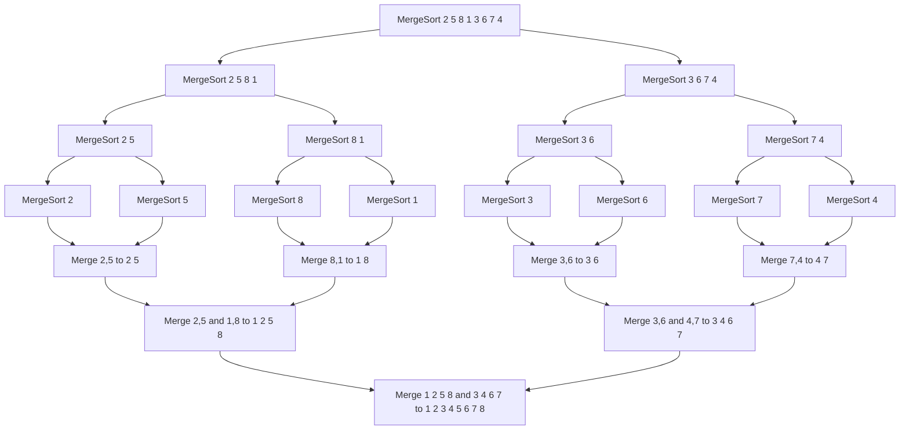
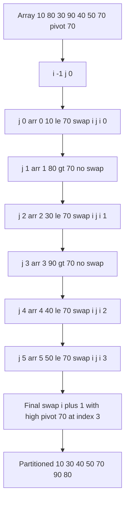
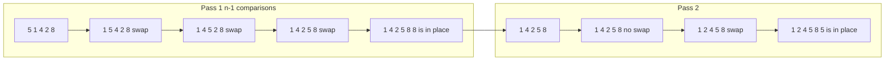
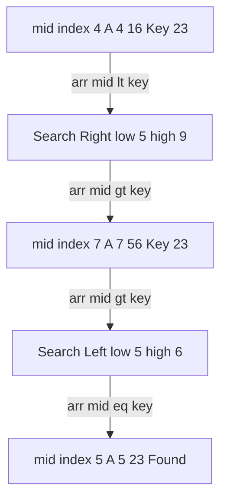
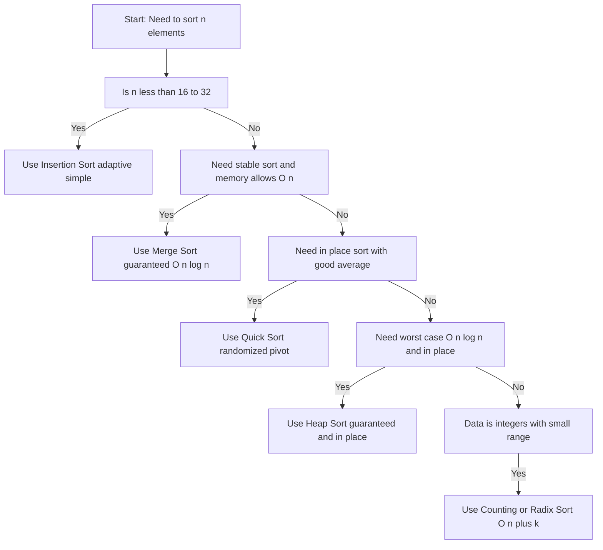
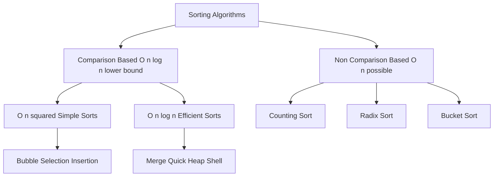

# Sorting and Searching

<!-- SECTION_1_START -->
# DATA STRUCTURES AND ALGORITHMS — Module 4: Sorting and Searching

## 1.1 Core Technical Definition & Intuitive Overview

### Formal KTU 2024 Definition

> [!IMPORTANT]
> **Sorting** is the process of rearranging a given list of elements into a specific order (ascending or descending) based on a chosen comparison key. **Searching** is the process of locating a specific element (the search key) within a given data structure and determining its position or confirming its presence/absence.

In the context of the KTU 2024 Scheme (PCCST303), Module 4 formally states:
*"Study of various internal sorting algorithms (Bubble, Selection, Insertion, Merge, Quick, Heap) and searching techniques (Linear, Binary, Interpolation) along with their time and space complexity analysis."*

### Conceptual Analogy / Intuition

> [!NOTE]
> **Sorting Analogy — "The Library Shelf":**
> Imagine a librarian has **500 unsorted books** on a table. To find a specific book, the librarian has two choices:
> 1. **Search through the pile unsorted** (Linear Search) — slow, but no upfront cost.
> 2. **Sort them alphabetically on a shelf once** (Sorting) — takes time, but every future search is lightning fast.
>
> This trade-off is the heart of Module 4: **Pre-processing cost vs. Query efficiency**.

> [!NOTE]
> **Searching Analogy — "The Phone Book":**
> A phone book is **pre-sorted alphabetically**. You don't scan page by page; you flip directly to the section. This is **Binary Search** — repeatedly halving the search space.
> If the phone book were unsorted, you'd be forced to do a **Linear Search** — checking every entry one by one.

### Standard Engineering Metrics (KTU Board Emphasis)

The following **standard metrics** are mandatory vocabulary in KTU valuation keys:

- **Time Complexity ($T(n)$)** — Number of primitive operations as a function of input size $n$.
- **Space Complexity ($S(n)$)** — Extra auxiliary memory required (in-place vs. out-of-place).
- **Stability** — A sort is **stable** if two elements with equal keys retain their original relative order after sorting.
- **In-place Sorting** — Algorithm uses $O(1)$ auxiliary space (modifies the original array).
- **Adaptive** — Algorithm performs better on partially sorted input.
- **Comparison-based** — Uses comparison operators ($\leq$, $\geq$) to decide element order.
- **Non-comparison-based** — Uses digit/key decomposition (e.g., Counting, Radix, Bucket).

> [!TIP]
> **Mnemonic for the KTU board:** *"SSS-CAS"* — **S**tability, **S**pace, **S**peed (time), **C**omparison, **A**daptive, **S**orting class.

> [!VISUALIZATION CONTROL]
> **Concept:** Comparison of $O(n \log n)$ vs. $O(n^2)$ Growth Curves
> **Desmos / GeoGebra Input Equations:**
> * $f(x) = x \log_2(x)$ — represents Merge/Quick/Heap Sort
> * $g(x) = x^2$ — represents Bubble/Selection/Insertion Sort
>
> **Visual Description:** On a coordinate plane, $g(x)$ (quadratic) eventually shoots up much steeper than $f(x)$ (linearithmic). For $n = 10$, $n^2 = 100$ but $n \log_2 n \approx 33$. For $n = 1000$, $n^2 = 1{,}000{,}000$ but $n \log_2 n \approx 9{,}966$. Students should observe that for **large datasets, $O(n \log n)$ is dramatically faster than $O(n^2)$**.

---

<!-- SECTION_1_END -->

<!-- SECTION_2_START -->
# 2. Deep Theoretical Analysis & KTU High-Yield Formula Sheet

## 2.1 The Three Algorithmic Paradigms in Module 4

### Paradigm A — Brute-Force / Simple Sorts ($O(n^2)$)

These algorithms are easy to understand, implement, and verify, but inefficient for large $n$. KTU often tests these in **Part A (3 marks)** for definitions and trace-based questions.

1. **Bubble Sort** — Repeatedly swap adjacent elements that are in the wrong order. The largest element "bubbles up" to the end in each pass.
2. **Selection Sort** — Find the minimum element from the unsorted portion and place it at the beginning.
3. **Insertion Sort** — Take each element and insert it into its correct position in the already-sorted left portion (like sorting playing cards in hand).

### Paradigm B — Divide and Conquer ($O(n \log n)$)

These algorithms recursively break the problem into sub-problems, solve them, and combine. KTU treats these as **Part B (14-mark)** territory.

1. **Merge Sort** — *Divide* the array into two halves, *conquer* by sorting recursively, *combine* by merging two sorted halves.
2. **Quick Sort** — *Partition* the array around a pivot, *conquer* by sorting the two partitions recursively.

### Paradigm C — Heap-Based ($O(n \log n)$)

1. **Heap Sort** — Build a max-heap from the array; repeatedly extract the maximum and place it at the end.

## 2.2 Searching Techniques — Conceptual Foundation

### Linear Search
- **Strategy:** Sequentially examine each element.
- **Pre-condition:** None — works on **unsorted** arrays.
- **Logic:** Compare search key $K$ with $A[0], A[1], \ldots, A[n-1]$ until a match is found or the array ends.

### Binary Search
- **Strategy:** Compare $K$ with the **middle** element; eliminate half the search space.
- **Pre-condition:** Array must be **sorted**.
- **Logic:** Let $low = 0$, $high = n - 1$. Repeat: compute $mid = \lfloor (low + high)/2 \rfloor$. If $A[mid] == K$, success. If $A[mid] < K$, search the right half ($low = mid + 1$); else, search the left half ($high = mid - 1$).

### Interpolation Search
- **Strategy:** Estimate the position of $K$ using a **linear interpolation** formula (probing position is proportional to key value).
- **Pre-condition:** Array must be **sorted and uniformly distributed**.
- **Logic:** Probe position $pos = low + \frac{(K - A[low]) \cdot (high - low)}{A[high] - A[low]}$.

> [!IMPORTANT]
> **Why Interpolation is sometimes faster than Binary Search:**
> In a uniformly distributed sorted array, if you search for `85` in `[10, 20, 30, ..., 100]`, you'd *interpolate* the position rather than always checking the middle.

## 2.3 KTU Formula Sheet / Cheat Sheet

### Master Theorem for Recurrence Relations (Crucial for Quick/Merge Sort Analysis)

For a recurrence of the form $T(n) = aT(n/b) + f(n)$ where $a \geq 1$ and $b > 1$:

$$
T(n) = \begin{cases} O(n^{\log_b a}) & \text{if } f(n) = O(n^{\log_b a - \varepsilon}) \text{ for some } \varepsilon > 0 \\ O(n^{\log_b a} \log n) & \text{if } f(n) = \Theta(n^{\log_b a}) \\ O(f(n)) & \text{if } f(n) = \Omega(n^{\log_b a + \varepsilon}) \text{ and regularity holds} \end{cases}
$$

### Master Recurrences for Common Sorts

| Algorithm | Recurrence | Result | Reasoning |
|---|---|---|---|
| Merge Sort | $T(n) = 2T(n/2) + O(n)$ | $\Theta(n \log n)$ | Case 2, $a=2, b=2, f(n)=n$ |
| Quick Sort (avg) | $T(n) = 2T(n/2) + O(n)$ | $\Theta(n \log n)$ | Balanced partition |
| Quick Sort (worst) | $T(n) = T(n-1) + O(n)$ | $\Theta(n^2)$ | Skewed partition |
| Binary Search | $T(n) = T(n/2) + O(1)$ | $\Theta(\log n)$ | Case 2, $a=1, b=2$ |

### Comprehensive Comparison Table (KTU High-Yield)

| Algorithm | Best Case | Average Case | Worst Case | Space | Stable | In-Place | Method |
|---|---|---|---|---|---|---|---|
| Bubble Sort | $O(n)$ | $O(n^2)$ | $O(n^2)$ | $O(1)$ | Yes | Yes | Comparison |
| Selection Sort | $O(n^2)$ | $O(n^2)$ | $O(n^2)$ | $O(1)$ | No | Yes | Comparison |
| Insertion Sort | $O(n)$ | $O(n^2)$ | $O(n^2)$ | $O(1)$ | Yes | Yes | Comparison |
| Merge Sort | $O(n \log n)$ | $O(n \log n)$ | $O(n \log n)$ | $O(n)$ | Yes | No | Divide & Conquer |
| Quick Sort | $O(n \log n)$ | $O(n \log n)$ | $O(n^2)$ | $O(\log n)$ | No | Yes | Divide & Conquer |
| Heap Sort | $O(n \log n)$ | $O(n \log n)$ | $O(n \log n)$ | $O(1)$ | No | Yes | Selection (Tree) |
| Shell Sort | $O(n \log n)$ | $O(n^{1.5})$ | $O(n^2)$ | $O(1)$ | No | Yes | Comparison |
| Counting Sort | $O(n+k)$ | $O(n+k)$ | $O(n+k)$ | $O(k)$ | Yes | No | Non-Comparison |
| Radix Sort | $O(nk)$ | $O(nk)$ | $O(nk)$ | $O(n+k)$ | Yes | No | Non-Comparison |
| Linear Search | $O(1)$ | $O(n)$ | $O(n)$ | $O(1)$ | N/A | Yes | Sequential |
| Binary Search | $O(1)$ | $O(\log n)$ | $O(\log n)$ | $O(1)$ iter / $O(\log n)$ rec | N/A | Yes | Divide & Conquer |
| Interpolation Search | $O(1)$ | $O(\log \log n)$ | $O(n)$ | $O(1)$ | N/A | Yes | Probing |

> [!NOTE]
> **In the above table, $k$ denotes the range of input values (Counting Sort) or digit count (Radix Sort).** Never use the vertical pipe symbol in these tables for absolute value — use $\vert \cdot \vert$ LaTeX notation.

## 2.4 Real-World Engineering Utility

| Algorithm | Production Use Case |
|---|---|
| **Merge Sort** | External sorting of massive datasets (databases, file systems) where memory is limited but stable ordering is required. Used in Java's `Arrays.sort()` for objects. |
| **Quick Sort** | Default in-memory sort in many C/C++ standard library implementations (e.g., `qsort`) due to excellent cache locality. |
| **Heap Sort** | Real-time systems with strict $O(n \log n)$ worst-case guarantees (embedded systems, OS process schedulers). |
| **Insertion Sort** | Sorting small sub-arrays ($n \leq 16$) inside hybrid algorithms like Timsort (Python) and Introsort. |
| **Counting/Radix Sort** | Sorting integers, IDs, IP addresses, or strings when keys have bounded size — used in suffix array construction and database indexing. |
| **Binary Search** | Foundation of B-trees, B+ trees, and database index lookups. Used in `git bisect`, debugging, and version control. |
| **Hashing** (implied) | Constant-time $O(1)$ lookups in compilers, network routers, and symbol tables. |

---

<!-- SECTION_2_END -->

<!-- SECTION_3_START -->
# 3. Step-by-Step Derivations, Algorithms & Code Implementation

## 3.1 BUBBLE SORT

### Algorithm Logic (Trace)

**Idea:** Repeatedly traverse the array, comparing adjacent pairs. If they are out of order, swap. After pass $i$, the $i$-th largest element is in its final position at index $n-i-1$.

### Iterative Python Implementation

```python
from typing import List, Tuple

def bubble_sort(arr: List[int], verbose: bool = False) -> Tuple[List[int], int]:
    """
    Sorts a list of integers in ascending order using Bubble Sort.
    Returns (sorted_list, number_of_swaps).
    
    Time:  O(n^2) worst/avg, O(n) best
    Space: O(1) — in-place
    Stable: Yes
    """
    n: int = len(arr)
    swap_count: int = 0
    a: List[int] = arr.copy()  # defensive copy
    
    for i in range(n - 1):
        swapped: bool = False
        # Last i elements are already in place
        for j in range(n - 1 - i):
            if a[j] > a[j + 1]:
                a[j], a[j + 1] = a[j + 1], a[j]
                swap_count += 1
                swapped = True
            if verbose:
                print(f"  Pass {i+1}, j={j}: arr={a}, swaps={swap_count}")
        # Optimization: if no swaps in a pass, array is sorted
        if not swapped:
            if verbose:
                print(f"  Early termination at pass {i+1}: array is sorted")
            break
    
    return a, swap_count


# --- Driver code for demonstration ---
if __name__ == "__main__":
    sample: List[int] = [64, 34, 25, 12, 22, 11, 90]
    print("Original array:", sample)
    sorted_arr, swaps = bubble_sort(sample, verbose=True)
    print(f"\nSorted array: {sorted_arr}")
    print(f"Total swaps performed: {swaps}")
```

### Detailed Dry-Run Trace

For input `[5, 1, 4, 2, 8]$:

$$
\begin{aligned}
\text{Pass 1: } & [5,1,4,2,8] \to [1,5,4,2,8] \to [1,4,5,2,8] \to [1,4,2,5,8] \to [1,4,2,5,8] \\
\text{Pass 2: } & [1,4,2,5,8] \to [1,4,2,5,8] \to [1,2,4,5,8] \to [1,2,4,5,8] \\
\text{Pass 3: } & [1,2,4,5,8] \to \text{(no swap, early termination)}
\end{aligned}
$$

### Time Complexity Derivation

- **Outer loop:** runs $n-1$ times.
- **Inner loop:** in iteration $i$, runs $n-1-i$ times.
- **Total comparisons:** $\sum_{i=0}^{n-2} (n-1-i) = \frac{n(n-1)}{2} = O(n^2)$.
- **Best case** (already sorted): with the `swapped` flag, only one pass occurs → $O(n)$.

## 3.2 SELECTION SORT

### Algorithm Logic

**Idea:** For position $i$ from $0$ to $n-2$, find the index $min\_idx$ of the minimum element in $A[i..n-1]$, then swap $A[i]$ and $A[min\_idx]$.

### Python Implementation

```python
from typing import List, Tuple

def selection_sort(arr: List[int]) -> Tuple[List[int], int]:
    """
    Sorts a list in ascending order using Selection Sort.
    
    Time:  O(n^2) in all cases
    Space: O(1) — in-place
    Stable: No
    """
    n: int = len(arr)
    a: List[int] = arr.copy()
    swap_count: int = 0
    
    for i in range(n - 1):
        min_idx: int = i
        # Find the index of the minimum element in the unsorted portion
        for j in range(i + 1, n):
            if a[j] < a[min_idx]:
                min_idx = j
        # Swap the found minimum with the element at position i
        if min_idx != i:
            a[i], a[min_idx] = a[min_idx], a[i]
            swap_count += 1
    
    return a, swap_count


# Driver code
if __name__ == "__main__":
    sample: List[int] = [29, 10, 14, 37, 13]
    sorted_arr, swaps = selection_sort(sample)
    print(f"Original: {sample}")
    print(f"Sorted:   {sorted_arr}")
    print(f"Swaps:    {swaps}  (exactly n-1 = {len(sample)-1} at most)")
```

### Time Complexity Derivation

- **Outer loop:** $n-1$ iterations.
- **Inner loop:** in iteration $i$, performs $n-1-i$ comparisons.
- **Total:** $\sum_{i=0}^{n-2} (n-1-i) = \frac{n(n-1)}{2} = O(n^2)$.

> [!NOTE]
> Selection sort performs **exactly $\frac{n(n-1)}{2}$ comparisons** regardless of input — it is *not* adaptive. However, it performs at most $n-1$ swaps, which can be useful when **swap cost dominates comparison cost** (e.g., sorting large records by key).

## 3.3 INSERTION SORT

### Algorithm Logic

**Idea:** Maintain a sorted sub-array $A[0..i-1]$. For each $i$ from $1$ to $n-1$, insert $A[i]$ into the correct position in the sorted portion by shifting larger elements one position to the right.

### Iterative Python Implementation

```python
from typing import List, Tuple

def insertion_sort(arr: List[int]) -> Tuple[List[int], int]:
    """
    Sorts a list in ascending order using Insertion Sort.
    
    Time:  O(n) best, O(n^2) avg/worst
    Space: O(1) — in-place
    Stable: Yes
    Adaptive: Yes
    """
    a: List[int] = arr.copy()
    n: int = len(a)
    shifts: int = 0
    
    for i in range(1, n):
        key: int = a[i]
        j: int = i - 1
        # Shift elements greater than key one position to the right
        while j >= 0 and a[j] > key:
            a[j + 1] = a[j]
            j -= 1
            shifts += 1
        a[j + 1] = key
    
    return a, shifts


# Driver code
if __name__ == "__main__":
    sample: List[int] = [12, 11, 13, 5, 6]
    sorted_arr, shifts = insertion_sort(sample)
    print(f"Original: {sample}")
    print(f"Sorted:   {sorted_arr}")
    print(f"Shifts:   {shifts}")
```

### Recursive Variant (KTU Common Exam Variant)

```python
def insertion_sort_recursive(a: List[int], n: int = None) -> List[int]:
    """Recursive insertion sort. n defaults to length of a."""
    if n is None:
        n = len(a)
    if n <= 1:
        return a
    # Sort the first n-1 elements recursively
    insertion_sort_recursive(a, n - 1)
    # Insert the nth element into the sorted portion
    key: int = a[n - 1]
    j: int = n - 2
    while j >= 0 and a[j] > key:
        a[j + 1] = a[j]
        j -= 1
    a[j + 1] = key
    return a
```

## 3.4 MERGE SORT

### Algorithm Logic — Divide, Conquer, Combine

1. **Divide:** Split the array $A[low..high]$ into two halves at $mid = \lfloor (low + high)/2 \rfloor$.
2. **Conquer:** Recursively sort $A[low..mid]$ and $A[mid+1..high]$.
3. **Combine:** Merge the two sorted halves into a single sorted array.

### Recursive Python Implementation (Full)

```python
from typing import List

def merge_sort(a: List[int]) -> List[int]:
    """
    Sorts a list using recursive Merge Sort.
    
    Time:  O(n log n) in all cases
    Space: O(n) for the auxiliary array
    Stable: Yes
    """
    n: int = len(a)
    if n <= 1:
        return a
    
    mid: int = n // 2
    left: List[int] = merge_sort(a[:mid])
    right: List[int] = merge_sort(a[mid:])
    
    return _merge(left, right)


def _merge(left: List[int], right: List[int]) -> List[int]:
    """Merges two sorted lists into one sorted list."""
    result: List[int] = []
    i: int = 0
    j: int = 0
    
    while i < len(left) and j < len(right):
        if left[i] <= right[j]:   # <= ensures stability
            result.append(left[i])
            i += 1
        else:
            result.append(right[j])
            j += 1
    
    # Append any remaining elements
    result.extend(left[i:])
    result.extend(right[j:])
    
    return result


# Driver code
if __name__ == "__main__":
    sample: List[int] = [38, 27, 43, 3, 9, 82, 10]
    print(f"Original: {sample}")
    print(f"Sorted:   {merge_sort(sample)}")
```

### Recurrence Derivation

$$
T(n) = \begin{cases} \Theta(1) & n \leq 1 \\ 2T(n/2) + \Theta(n) & n > 1 \end{cases}
$$

Applying the **Master Theorem** (Case 2): $a=2$, $b=2$, $f(n)=n = n^{\log_2 2}$. So $T(n) = \Theta(n \log n)$.

### Tree Diagram of Recursion (n=8)

$$
\begin{aligned}
\text{Level 0:} \quad & T(8) \text{ — combine 8 elements} \\
\text{Level 1:} \quad & 2 \times T(4) \text{ — combine 4 elements each} \\
\text{Level 2:} \quad & 4 \times T(2) \text{ — combine 2 elements each} \\
\text{Level 3:} \quad & 8 \times T(1) \text{ — base case}
\end{aligned}
$$

Total work per level = $O(n)$. Number of levels = $\log_2 n$. Therefore, $T(n) = O(n \log n)$.

## 3.5 QUICK SORT

### Algorithm Logic — Partition Around a Pivot

1. **Choose a pivot** (last, first, random, or median-of-three).
2. **Partition:** Re-arrange the array so that elements $\leq$ pivot are on the left, elements $>$ pivot are on the right.
3. **Recurse** on the two partitions.

### Lomuto Partition Implementation

```python
from typing import List, Tuple
import random

def quick_sort(a: List[int], low: int = 0, high: int = None) -> List[int]:
    """
    Sorts a list in-place using Quick Sort (Lomuto partition).
    
    Time:  O(n log n) avg, O(n^2) worst
    Space: O(log n) recursion stack avg
    Stable: No
    """
    if high is None:
        high = len(a) - 1
    arr: List[int] = a  # in-place
    
    if low < high:
        # Randomized pivot reduces worst-case probability
        rand_idx: int = random.randint(low, high)
        arr[rand_idx], arr[high] = arr[high], arr[rand_idx]
        
        pivot_idx: int = _lomuto_partition(arr, low, high)
        quick_sort(arr, low, pivot_idx - 1)
        quick_sort(arr, pivot_idx + 1, high)
    
    return arr


def _lomuto_partition(arr: List[int], low: int, high: int) -> int:
    """
    Lomuto partition: pivot is arr[high].
    Returns the final index of the pivot.
    """
    pivot: int = arr[high]
    i: int = low - 1  # index of the smaller element
    
    for j in range(low, high):
        if arr[j] <= pivot:
            i += 1
            arr[i], arr[j] = arr[j], arr[i]
    
    arr[i + 1], arr[high] = arr[high], arr[i + 1]
    return i + 1


# Driver code
if __name__ == "__main__":
    sample: List[int] = [10, 7, 8, 9, 1, 5]
    print(f"Original: {sample}")
    print(f"Sorted:   {quick_sort(sample)}")
```

### Hoare Partition Variant (Faster, KTU Theory)

Hoare's partition uses two pointers that move toward each other. It performs **fewer swaps** than Lomuto on average.

```python
def _hoare_partition(arr: List[int], low: int, high: int) -> int:
    pivot: int = arr[low]
    i: int = low - 1
    j: int = high + 1
    
    while True:
        # Move i right until we find element >= pivot
        i += 1
        while arr[i] < pivot:
            i += 1
        # Move j left until we find element <= pivot
        j -= 1
        while arr[j] > pivot:
            j -= 1
        if i >= j:
            return j
        arr[i], arr[j] = arr[j], arr[i]
```

### Worst-Case Recurrence

When the pivot is the smallest or largest element (e.g., already sorted with last-element pivot):

$$
T(n) = T(n-1) + \Theta(n) = T(n-1) + cn
$$

Expanding the recurrence:

$$
T(n) = c(n) + c(n-1) + \ldots + c(1) = c \cdot \frac{n(n+1)}{2} = \Theta(n^2)
$$

## 3.6 HEAP SORT

### Algorithm Logic

1. **Build a Max-Heap** from the input array in $O(n)$ time using the bottom-up heapify.
2. **Repeatedly extract max:** Swap root (max) with last element, reduce heap size by 1, heapify root. Each extraction costs $O(\log n)$. Total: $O(n \log n)$.

### Python Implementation

```python
from typing import List

def heap_sort(arr: List[int]) -> List[int]:
    """
    Sorts a list in-place using Heap Sort.
    
    Time:  O(n log n) in all cases
    Space: O(1) — in-place
    Stable: No
    """
    a: List[int] = arr.copy()
    n: int = len(a)
    
    # Phase 1: Build max-heap (bottom-up heapify)
    # Start from the last non-leaf node
    for i in range(n // 2 - 1, -1, -1):
        _max_heapify(a, n, i)
    
    # Phase 2: Extract elements from heap one by one
    for end in range(n - 1, 0, -1):
        a[0], a[end] = a[end], a[0]   # move root to end
        _max_heapify(a, end, 0)        # heapify reduced heap
    
    return a


def _max_heapify(a: List[int], heap_size: int, root_idx: int) -> None:
    """
    Ensures the subtree rooted at root_idx satisfies the max-heap property.
    Time: O(log n) — height of the heap.
    """
    largest: int = root_idx
    left: int = 2 * root_idx + 1
    right: int = 2 * root_idx + 2
    
    if left < heap_size and a[left] > a[largest]:
        largest = left
    if right < heap_size and a[right] > a[largest]:
        largest = right
    
    if largest != root_idx:
        a[root_idx], a[largest] = a[largest], a[root_idx]
        _max_heapify(a, heap_size, largest)


# Driver code
if __name__ == "__main__":
    sample: List[int] = [4, 10, 3, 5, 1]
    print(f"Original: {sample}")
    print(f"Sorted:   {heap_sort(sample)}")
```

### Heapify Recurrence

For a node at height $h$ in a heap of size $n$:

$$
T(h) = T(h-1) + T(h-2) \approx O(h) = O(\log n)
$$

> [!IMPORTANT]
> **Build-Heap Analysis:** The total work for the build phase is $\sum_{h=0}^{\log n} \frac{n}{2^{h+1}} \cdot h = O(n)$, even though the worst-case per call is $O(\log n)$. This is a classic KTU problem: *"Prove that build-heap is $O(n)$."*

## 3.7 SHELL SORT (Brief — KTU Sometimes Tests)

**Idea:** Generalization of insertion sort. Sort elements that are far apart first (using a *gap sequence*), then progressively reduce the gap to 1.

Gap sequence: $n/2, n/4, \ldots, 1$ (original Shell) or $1, 3, 7, 15, \ldots$ (Knuth).

```python
def shell_sort(arr: List[int]) -> List[int]:
    a: List[int] = arr.copy()
    n: int = len(a)
    gap: int = n // 2
    
    while gap > 0:
        for i in range(gap, n):
            temp: int = a[i]
            j: int = i
            while j >= gap and a[j - gap] > temp:
                a[j] = a[j - gap]
                j -= gap
            a[j] = temp
        gap //= 2
    
    return a
```

## 3.8 COUNTING SORT & RADIX SORT (Non-Comparison, Brief)

**Counting Sort:** For integers in range $[0, k]$, count occurrences in $O(n+k)$ time.

**Radix Sort:** Sort integers by processing digits from least significant to most significant, using a stable sub-sort (typically Counting Sort) at each digit. Time: $O(nk)$ where $k$ is the number of digits.

## 3.9 LINEAR SEARCH

### Iterative Implementation

```python
from typing import List, Optional

def linear_search(arr: List[int], key: int) -> Optional[int]:
    """
    Searches for 'key' in 'arr' sequentially.
    Returns the index of the first occurrence, or None if not found.
    
    Time:  O(n) worst/avg, O(1) best
    Space: O(1)
    """
    for i in range(len(arr)):
        if arr[i] == key:
            return i
    return None
```

### Sentinel Linear Search (Optimization, KTU)

Add the search key as a sentinel at the end to eliminate the boundary check:

```python
def sentinel_linear_search(arr: List[int], key: int) -> int:
    a: List[int] = arr + [key]   # sentinel
    n: int = len(a)
    i: int = 0
    while a[i] != key:
        i += 1
    if i < n - 1:
        return i
    return -1   # not found
```

> [!NOTE]
> Sentinel search saves **one comparison per iteration** (no need to check `i < n`). For large $n$, this is roughly **2x faster** in practice because the inner loop becomes branch-free.

## 3.10 BINARY SEARCH

### Iterative Implementation

```python
from typing import List, Optional

def binary_search(arr: List[int], key: int) -> Optional[int]:
    """
    Searches for 'key' in a sorted array 'arr' using binary search.
    Returns the index of 'key', or None if not found.
    
    Pre-condition: arr must be sorted in ascending order.
    Time:  O(log n)
    Space: O(1)
    """
    low: int = 0
    high: int = len(arr) - 1
    
    while low <= high:
        mid: int = (low + high) // 2   # safer: low + (high - low) // 2
        if arr[mid] == key:
            return mid
        elif arr[mid] < key:
            low = mid + 1
        else:
            high = mid - 1
    
    return None
```

### Recursive Implementation

```python
def binary_search_recursive(arr: List[int], key: int,
                             low: int = 0, high: int = None) -> Optional[int]:
    """Recursive binary search. Recurrence: T(n) = T(n/2) + O(1) = O(log n)."""
    if high is None:
        high = len(arr) - 1
    if low > high:
        return None
    mid: int = (low + high) // 2
    if arr[mid] == key:
        return mid
    elif arr[mid] < key:
        return binary_search_recursive(arr, key, mid + 1, high)
    else:
        return binary_search_recursive(arr, key, low, mid - 1)
```

### Detailed Trace — `binary_search([2, 5, 8, 12, 16, 23, 38, 56, 72, 91], 23)`

$$
\begin{aligned}
\text{Step 1: } & low=0,\; high=9,\; mid=4,\; A[4]=16. \; 16 < 23 \Rightarrow low = 5. \\
\text{Step 2: } & low=5,\; high=9,\; mid=7,\; A[7]=56. \; 56 > 23 \Rightarrow high = 6. \\
\text{Step 3: } & low=5,\; high=6,\; mid=5,\; A[5]=23. \; 23 = 23 \Rightarrow \text{FOUND at index } 5.
\end{aligned}
$$

> [!IMPORTANT]
> **KTU Pitfall:** Always use `mid = low + (high - low) // 2` to avoid integer overflow in languages like C/C++ (Python handles big ints, but the practice is essential for board marks).

## 3.11 INTERPOLATION SEARCH

```python
def interpolation_search(arr: List[int], key: int) -> Optional[int]:
    """
    Searches in a sorted, uniformly distributed array using interpolation.
    
    Time:  O(log log n) avg (uniform), O(n) worst
    Space: O(1)
    """
    low: int = 0
    high: int = len(arr) - 1
    
    while low <= high and arr[low] <= key <= arr[high]:
        if low == high:
            if arr[low] == key:
                return low
            return None
        
        # Linear interpolation to estimate position
        pos: int = low + ((key - arr[low]) * (high - low)) // (arr[high] - arr[low])
        
        if pos < low or pos > high:
            return None   # out of valid range — distribution assumption failed
        
        if arr[pos] == key:
            return pos
        elif arr[pos] < key:
            low = pos + 1
        else:
            high = pos - 1
    
    return None
```

### Why is Average Case $O(\log \log n)$?

Each probe reduces the search interval to a sub-interval of size $n^{1/2}$ on average (for uniform distributions). This yields the recurrence $T(n) = T(\sqrt{n}) + O(1)$, which solves to $T(n) = O(\log \log n)$.

---

<!-- SECTION_3_END -->

<!-- SECTION_4_START -->
# 4. Structural Diagrams & Schematics

## 4.1 Mermaid — Merge Sort Divide-and-Conquer Tree



## 4.2 Mermaid — Quick Sort Partition Flow (Lomuto)



## 4.3 Mermaid — Bubble Sort Pass Visualization



## 4.4 Mermaid — Binary Search Decision Tree



## 4.5 Mermaid — Algorithm Selection Flowchart (Engineering Decision)



## 4.6 Mermaid — Comparison-Based vs Non-Comparison-Based Architecture



## 4.7 Sequential Processing Topology — Search Algorithm State Machine

| State | Linear Search Transition | Binary Search Transition |
|---|---|---|
| **Init** | $i = 0$ | $low = 0,\; high = n-1$ |
| **Compare** | $A[i] \stackrel{?}{=} K$ | $A[mid] \stackrel{?}{=} K$ |
| **Match** | Return $i$ | Return $mid$ |
| **Mismatch** | $i \mathrel{+}= 1$ | Update $low$ or $high$ |
| **Terminate — Found** | $A[i] = K$ | $A[mid] = K$ |
| **Terminate — Not Found** | $i \geq n$ | $low > high$ |

---

<!-- SECTION_4_END -->

<!-- SECTION_5_START -->
# 5. KTU 2024 Scheme Examination Question Bank & Topic Recap

## 5.1 Part A — Short Answer Questions (3 Marks Each)

### Question 1: Stability in Sorting `[KTU University Exam — Dec 2023]`

> **Define a stable sorting algorithm. State with reason whether Quick Sort is stable. Give one real-world example where stability matters.**

**Model Answer:**

> A sorting algorithm is **stable** if two elements with equal keys retain their **original relative order** in the output as they appeared in the input.

**Stability of Quick Sort:** Quick Sort is **NOT stable** because the partition step (especially Lomuto or Hoare) **swaps elements across non-adjacent positions** based on pivot comparison, which can reverse the order of equal-keyed elements.

**Real-world example:** Consider sorting employee records by `salary` after they are already sorted by `name`. If the sort is **not stable**, employees with the same salary will be reordered by name — losing the alphabetical arrangement. With a **stable** sort (like Merge Sort), the original alphabetical order is preserved within each salary bracket.

> **Valuation Key:** [Definition of stability: 1 mark] [Quick Sort NOT stable with reason: 1 mark] [Real-world example: 1 mark]

---

### Question 2: Lower Bound of Comparison-Based Sorting `[KTU University Exam — July 2024]`

> **State the lower bound for comparison-based sorting algorithms. Which sorting algorithm achieves this bound in the average case? Mention the decision-tree argument.**

**Model Answer:**

> The **lower bound** for any comparison-based sorting algorithm is $\Omega(n \log n)$ comparisons in the worst case.

**Proof sketch (Decision Tree Argument):**
A comparison-based sort can be modeled as a **binary decision tree** of height $h$. Each internal node is a comparison $A[i] \leq A[j]$; each leaf represents a distinct permutation of the $n!$ possible outputs. Since the tree must have at least $n!$ leaves and a binary tree of height $h$ has at most $2^h$ leaves:

$$
2^h \geq n! \;\Rightarrow\; h \geq \log_2(n!) = \Omega(n \log n)
$$

(by Stirling's approximation, $\log_2(n!) \approx n \log_2 n - 1.44n$).

**Algorithm achieving the bound:** **Merge Sort** and **Heap Sort** achieve $O(n \log n)$ in **all cases** (best, average, worst). **Quick Sort** achieves $O(n \log n)$ on average but $O(n^2)$ in the worst case.

> **Valuation Key:** [Lower bound statement: 1 mark] [Decision tree argument: 1 mark] [Naming algorithms: 1 mark]

---

## 5.2 Part B — Long Answer Questions (14 Marks Each, Module Internal Choice)

### Question A (14 Marks): Comprehensive Merge Sort + Complexity `[KTU University Exam — Dec 2023]`

> **(a)** Write the algorithm for **Merge Sort** and sort the following array using it. Show all intermediate steps clearly:  
> **Input:** `[38, 27, 43, 3, 9, 82, 10]` **(7 marks)**  
> **(b)** Derive the time complexity of Merge Sort using the **recurrence relation method** and the **Master Theorem**. Comment on its space complexity and stability. **(7 marks)**

---

#### Part (a) — Algorithm + Trace (7 Marks)

**Algorithm (Pseudocode):**

```text
MERGE-SORT(A, low, high)
    if low < high
        mid = floor((low + high) / 2)
        MERGE-SORT(A, low, mid)
        MERGE-SORT(A, mid+1, high)
        MERGE(A, low, mid, high)

MERGE(A, low, mid, high)
    L = A[low..mid]
    R = A[mid+1..high]
    i = 1, j = 1, k = low
    while i <= length(L) and j <= length(R)
        if L[i] <= R[j]
            A[k] = L[i]; i = i + 1
        else
            A[k] = R[j]; j = j + 1
        k = k + 1
    copy remaining L[i..] to A[k..]
    copy remaining R[j..] to A[k..]
```

**Detailed Step-by-Step Trace:**

Step 1 — **Divide Phase** (recursion tree):

$$
\begin{aligned}
[38, 27, 43, 3, 9, 82, 10] &\to [38, 27, 43, 3] \mid [9, 82, 10] \\
[38, 27, 43, 3] &\to [38, 27] \mid [43, 3] \\
[9, 82, 10] &\to [9] \mid [82, 10] \\
[38, 27] &\to [38] \mid [27] \\
[43, 3] &\to [43] \mid [3] \\
[82, 10] &\to [82] \mid [10]
\end{aligned}
$$

Step 2 — **Merge Phase** (combining sorted sub-arrays):

$$
\begin{aligned}
[38] + [27] &\to [27, 38] \\
[43] + [3] &\to [3, 43] \\
[27, 38] + [3, 43] &\to [3, 27, 38, 43] \\
[82] + [10] &\to [10, 82] \\
[9] + [10, 82] &\to [9, 10, 82] \\
[3, 27, 38, 43] + [9, 10, 82] &\to [3, 9, 10, 27, 38, 43, 82]
\end{aligned}
$$

**Final Sorted Array:** `[3, 9, 10, 27, 38, 43, 82]` ✓

> **Valuation Key:** [Pseudocode: 2 marks] [Divide phase tree: 2 marks] [Merge phase trace: 2 marks] [Final sorted result: 1 mark]

---

#### Part (b) — Complexity Analysis (7 Marks)

**Recurrence Relation:**

$$
T(n) = 2T(n/2) + \Theta(n)
$$

where the $2T(n/2)$ term represents the two recursive calls on halves, and $\Theta(n)$ is the work done by the **MERGE** step (which takes linear time).

**Master Theorem Application:**

Comparing with the general form $T(n) = aT(n/b) + f(n)$:
- $a = 2$ (number of sub-problems)
- $b = 2$ (sub-problem size)
- $f(n) = n$ (cost of combine step)

Compute $n^{\log_b a} = n^{\log_2 2} = n^1 = n$.

Since $f(n) = \Theta(n) = \Theta(n^{\log_2 2})$, this is **Case 2** of the Master Theorem.

$$
\boxed{T(n) = \Theta(n \log_2 n)}
$$

**Verification by Recursion Tree (alternative method):**

$$
\begin{aligned}
\text{Level } 0: & \quad 1 \text{ node, work } cn \\
\text{Level } 1: & \quad 2 \text{ nodes, work } 2 \cdot c(n/2) = cn \\
\text{Level } 2: & \quad 4 \text{ nodes, work } 4 \cdot c(n/4) = cn \\
& \quad \vdots \\
\text{Level } \log_2 n: & \quad n \text{ nodes, work } n \cdot c = cn \\
\end{aligned}
$$

There are $\log_2 n + 1$ levels, each doing $O(n)$ work. Total: $T(n) = O(n \log n)$.

**Space Complexity:** $S(n) = O(n)$ — the merge step requires an **auxiliary array** of size $n$ to hold the combined result before copying back.

**Stability:** Merge Sort is **stable** because in the MERGE step, when $L[i] = R[j]$, we **preferentially take from $L$** (the left sub-array), preserving the original order of equal elements.

> **Valuation Key:** [Recurrence relation statement: 2 marks] [Master Theorem application: 2 marks] [Final $\Theta(n \log n)$: 1 mark] [Space & stability: 2 marks]

---

### Question B (14 Marks): Quick Sort Comprehensive + Comparison `[KTU University Exam — July 2024]`

> **(a)** Explain the **Quick Sort** algorithm. Demonstrate Quick Sort on the array `[10, 7, 8, 9, 1, 5, 3, 6]` using **Lomuto partition** with the **last element as pivot**. Show all passes. **(7 marks)**  
> **(b)** Discuss the **best, average, and worst-case time complexity** of Quick Sort. Why is the worst case $O(n^2)$? How can it be avoided using **randomized pivot selection** or **median-of-three**? **(7 marks)**

---

#### Part (a) — Quick Sort + Trace (7 Marks)

**Algorithm Overview:**

Quick Sort works by selecting a **pivot** element and **partitioning** the array into two sub-arrays — those $\leq$ pivot and those $>$ pivot — then recursively sorting the two sub-arrays.

**Lomuto Partition Code (re-stated for clarity):**

```python
def lomuto_partition(A, low, high):
    pivot = A[high]
    i = low - 1
    for j in range(low, high):
        if A[j] <= pivot:
            i += 1
            A[i], A[j] = A[j], A[i]
    A[i+1], A[high] = A[high], A[i+1]
    return i + 1
```

**Step-by-Step Trace for `[10, 7, 8, 9, 1, 5, 3, 6]`:**

**Pass 1:** Pivot = 6 (last element), sub-array `[10, 7, 8, 9, 1, 5, 3]`

| j | A[j] | A[j] ≤ 6? | i (after) | Array State |
|---|---|---|---|---|
| 0 | 10 | No | -1 | [10, 7, 8, 9, 1, 5, 3, 6] |
| 1 | 7 | No | -1 | [10, 7, 8, 9, 1, 5, 3, 6] |
| 2 | 8 | No | -1 | [10, 7, 8, 9, 1, 5, 3, 6] |
| 3 | 9 | No | -1 | [10, 7, 8, 9, 1, 5, 3, 6] |
| 4 | 1 | Yes | 0 | [1, 7, 8, 9, 10, 5, 3, 6] |
| 5 | 5 | Yes | 1 | [1, 5, 8, 9, 10, 7, 3, 6] |
| 6 | 3 | Yes | 2 | [1, 5, 3, 9, 10, 7, 8, 6] |

Final swap: place pivot 6 at index $i+1 = 3$.  
Array: `[1, 5, 3, 6, 10, 7, 8, 9]` — pivot 6 is at correct position 3.

**Pass 2a:** Left sub-array `[1, 5, 3]`, Pivot = 3

- $j=0$: 1 ≤ 3 → swap → i=0, array `[1, 5, 3]`
- $j=1$: 5 > 3 → no swap

Final swap: pivot 3 placed at index 1.  
Array: `[1, 3, 5, 6, 10, 7, 8, 9]`

**Pass 2b:** Right sub-array `[10, 7, 8, 9]`, Pivot = 9

- $j=0$: 10 > 9 → no swap
- $j=1$: 7 ≤ 9 → swap → i=0, array `[7, 10, 8, 9]`
- $j=2$: 8 ≤ 9 → swap → i=1, array `[7, 8, 10, 9]`

Final swap: pivot 9 placed at index 2.  
Array: `[1, 3, 5, 6, 7, 8, 9, 10]`

**Pass 3a:** `[1]` — base case.

**Pass 3b:** `[7, 8]` with pivot 8 → `[7, 8]` (already sorted).

**Pass 3c:** `[10]` — base case.

**Final Sorted Array:** `[1, 3, 5, 6, 7, 8, 9, 10]` ✓

> **Valuation Key:** [Algorithm explanation: 2 marks] [Lomuto code/pseudocode: 1 mark] [Pass 1 detailed trace: 2 marks] [Recursive passes: 1 mark] [Final result: 1 mark]

---

#### Part (b) — Complexity Analysis & Worst-Case Avoidance (7 Marks)

**Best Case:** Occurs when the pivot **divides the array into two equal halves** at every level.

$$
T(n) = 2T(n/2) + O(n) = \Theta(n \log n)
$$

**Average Case:** Even if the split is at any fixed ratio (e.g., 1:9), the recurrence still yields $\Theta(n \log n)$. The expected depth of the recursion tree for a **random pivot** is $O(\log n)$.

$$
T(n) = T(k) + T(n-1-k) + O(n)
$$

The expectation $E[T(n)] = O(n \log n)$ because the cost of the partitioning at each level is $cn$ and the expected recursion depth is $O(\log n)$.

**Worst Case:** Occurs when the pivot is the **smallest or largest element** at every recursive call, leading to a **highly skewed partition** (size 0 and size $n-1$).

Example: Already sorted array `[1, 2, 3, 4, 5]` with last-element pivot:
- Pivot = 5 → left part = [1,2,3,4], right part = []
- Pivot = 4 → left part = [1,2,3], right part = []
- ...

Recurrence:

$$
T(n) = T(n-1) + O(n) = T(n-1) + cn
$$

Expanding:

$$
T(n) = cn + c(n-1) + c(n-2) + \ldots + c(1) = c \cdot \frac{n(n+1)}{2} = \Theta(n^2)
$$

**Avoiding the Worst Case:**

**Method 1 — Randomized Pivot:**  
Before partitioning, randomly select any index in $[low, high]$ and swap it with $A[high]$. This makes the worst case occur with probability $\frac{1}{n!}$ — **almost impossible** for adversarial input.

**Method 2 — Median-of-Three:**  
Choose the median of $A[low]$, $A[mid]$, and $A[high]$ as the pivot. For sorted input, the median is the middle element, leading to balanced partitions.

**Method 3 — 3-Way Partition (Dutch National Flag):**  
For arrays with many duplicates, partition into three regions: less than, equal to, and greater than the pivot. This reduces work on equal elements.

**Method 4 — Introsort:**  
Start with Quick Sort, but switch to Heap Sort if recursion depth exceeds $c \log n$ (detects worst-case behavior). Used in C++ STL `std::sort`.

> **Valuation Key:** [Best/avg/worst statements: 2 marks] [Worst case derivation: 2 marks] [Randomized/median-of-three explanation: 2 marks] [Alternative methods: 1 mark]

---

## 5.3 KTU Examiner's Valuation Warning / Pitfall Callout

> [!WARNING]
> **Common Pitfalls Where Students Lose Marks in Module 4:**
>
> 1. **Stability Misconception:** Writing "Merge Sort is **not** stable" is a 1-mark deduction. Stability comes from using `L[i] <= R[j]` (not `<`) in the merge step. Always re-state **why** the algorithm is stable.
>
> 2. **Forgetting Best Case:** Bubble Sort, Insertion Sort, AND Quick Sort have a best case of $O(n)$ or $O(n \log n)$ — students often write only the worst case. Always specify **all three cases**.
>
> 3. **Pivot Confusion in Quick Sort:** Stating pivot is always the *first* or *last* element is incomplete. Different pivot strategies exist (last, first, random, median-of-three, median-of-medians). State the assumption in your answer.
>
> 4. **Binary Search Boundary Error:** Writing `low < high` instead of `low <= high` causes the **last element to be missed**. Always test edge cases with arrays of size 1.
>
> 5. **Master Theorem Parameters:** Writing "$a = 2, b = 2$" without computing $n^{\log_b a}$ explicitly loses 1 mark. Show the comparison.
>
> 6. **Heap Sort Stability:** Many students incorrectly mark Heap Sort as stable. It is **NOT stable** because swapping the root with the last element can change relative order of equal-keyed elements.
>
> 7. **In-Place vs. Out-of-Place Confusion:** Merge Sort is **NOT in-place** ($O(n)$ extra space). Quick Sort and Heap Sort **ARE in-place** ($O(\log n)$ recursion / $O(1)$).
>
> 8. **Interpolation Search Domain Error:** Without the `arr[low] <= key <= arr[high]` check, the algorithm can produce invalid indices when the key is outside the array range. Always include boundary validation.

---

## 5.4 Topic Recap & Important Things to Remember

> [!NOTE]
> **Rapid-Revision Checklist — Sorting and Searching (Module 4)**

### Core Definitions
- **Sorting:** Rearranging elements in a specific order (ascending/descending).
- **Searching:** Locating a target element within a data structure.
- **Stable Sort:** Equal-keyed elements retain original relative order.
- **In-Place Sort:** Uses $O(1)$ auxiliary space.
- **Adaptive Sort:** Performs better on partially sorted input.
- **Comparison-Based Sort:** Uses $\leq, \geq$ operators; lower bounded by $\Omega(n \log n)$.
- **Non-Comparison Sort:** Uses digit/key decomposition; can be $O(n)$.

### Sorting Algorithms — Key Properties
- **Bubble Sort:** Stable, in-place, adaptive, $O(n^2)$ avg/worst, $O(n)$ best.
- **Selection Sort:** **Unstable**, in-place, **not adaptive**, $O(n^2)$ all cases, exactly $n-1$ swaps.
- **Insertion Sort:** Stable, in-place, adaptive, $O(n)$ best, $O(n^2)$ avg/worst.
- **Merge Sort:** Stable, **not in-place** (uses $O(n)$), $O(n \log n)$ all cases.
- **Quick Sort:** **Unstable**, in-place, randomized pivot reduces worst case, $O(n \log n)$ avg, $O(n^2)$ worst.
- **Heap Sort:** **Unstable**, in-place, $O(n \log n)$ all cases, **guaranteed**.
- **Shell Sort:** **Unstable**, in-place, $O(n \log n)$ to $O(n^2)$ depending on gap sequence.
- **Counting Sort:** Stable, **not in-place**, $O(n + k)$ where $k$ = range of input.
- **Radix Sort:** Stable, **not in-place**, $O(nk)$ where $k$ = number of digits.

### Searching Algorithms — Key Properties
- **Linear Search:** $O(n)$, works on **unsorted** arrays, no pre-processing.
- **Binary Search:** $O(\log n)$, **requires sorted** array, iterative or recursive.
- **Interpolation Search:** $O(\log \log n)$ avg, $O(n)$ worst, requires **sorted and uniformly distributed**.
- **Mid Calculation (Binary):** Always use `low + (high - low) // 2` for overflow safety.
- **Binary Search Boundary:** Loop condition is `low <= high` (not `<`).

### Master Theorem — Three Cases (Quick Recall)
- $f(n) = O(n^{\log_b a - \varepsilon}) \Rightarrow T(n) = \Theta(n^{\log_b a})$
- $f(n) = \Theta(n^{\log_b a}) \Rightarrow T(n) = \Theta(n^{\log_b a} \log n)$
- $f(n) = \Omega(n^{\log_b a + \varepsilon}) \Rightarrow T(n) = \Theta(f(n))$ (if regularity holds)

### Algorithm Selection Heuristics
- $n \leq 16$ → **Insertion Sort** (low overhead, cache-friendly).
- Need stability + large $n$ → **Merge Sort**.
- Need average-case speed + in-place → **Quick Sort** (with random pivot).
- Need worst-case guarantee + in-place → **Heap Sort**.
- Integers with small range → **Counting/Radix Sort**.
- Production hybrid → **Introsort** (Quick + Heap + Insertion) — used in C++ STL.

### Engineering Best Practices
- **Java's `Arrays.sort()`** for objects uses **TimSort** (stable, hybrid merge + insertion).
- **Python's `sorted()`** uses **TimSort**.
- **C++ STL `std::sort()`** uses **Introsort** (Quick + Heap + Insertion fallback).
- **Database indexes (B+ trees)** rely on **Binary Search** principles for $O(\log n)$ lookups.
- **External sorting** (data too large for RAM) → **Merge Sort** with disk-based merging.

### Frequent KTU Board Questions
1. "Differentiate between stable and unstable sorting with examples." (3 marks)
2. "Trace Quick Sort on the given array using Lomuto partition." (7 marks)
3. "Derive the time complexity of Merge Sort using the Master Theorem." (7 marks)
4. "Compare Merge Sort and Quick Sort in terms of time, space, and stability." (7 marks)
5. "Perform Binary Search on the given sorted array and show all steps." (5 marks)
6. "Explain the lower bound of comparison-based sorting using a decision tree." (5 marks)
7. "Why is Heap Sort guaranteed $O(n \log n)$ in the worst case while Quick Sort is not?" (5 marks)

> [!TIP]
> **Last-Minute Mnemonic for the Board Exam:** *"BMS = Brilliant Minds Sort"* → **B**ubble, **M**erge, **S**election/Shell are your "core three" — know them cold, including code, traces, and complexity derivations. **Quick Sort** is the high-value 14-mark question; prepare both Lomuto and Hoare variants.

<!-- SECTION_5_END -->
