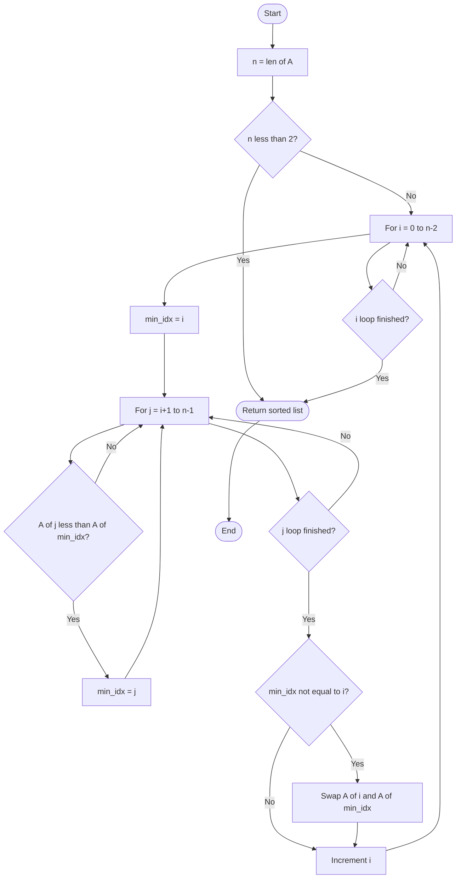
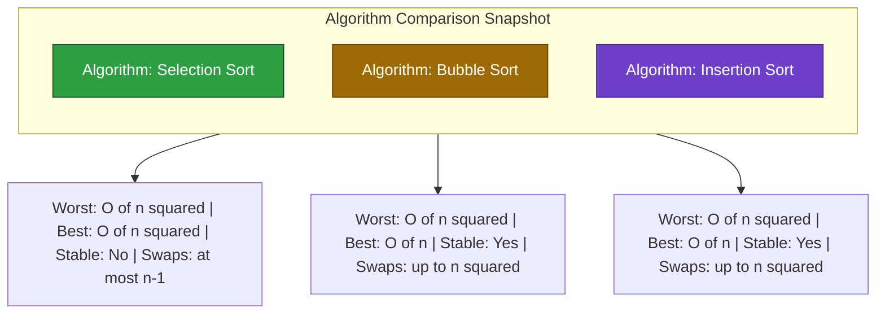

# Sorting Techniques :- Selection Sort

<!-- SECTION_1_START -->
# Selection Sort — Core Technical Definition & Intuitive Overview

## 1.1 Formal Academic Definition (KTU 2024 Syllabus Terminology)

> [!IMPORTANT]
> **Selection Sort** is a *comparison-based, in-place, non-stable* internal sorting algorithm that sorts an array of $n$ elements by repeatedly identifying the **minimum** (or **maximum**) element from the *unsorted sub-array* and swapping it with the element at the *beginning* of that sub-array. With each pass, the boundary of the sorted region grows by exactly one position, and after $n-1$ such passes the entire array becomes sorted.

In KTU 2024 scheme parlance, selection sort belongs to the family of **$O(n^2)$ elementary sorting algorithms** and is primarily studied to illustrate the **"min-finding via linear scan + swap"** paradigm — a foundational pattern that later evolves into **Heap Sort** (where the min-finding is accelerated to $O(\log n)$ using a binary heap).

## 1.2 Conceptual Analogy / Plain-English Intuition

> [!NOTE]
> **Real-world analogy — The Classroom Line-Up**
> Imagine a teacher who wants to line up 30 students in ascending order of height. The teacher does NOT do pairwise swaps like Bubble Sort. Instead, the teacher:
> 1. Walks down the entire line, scans everyone, and picks the **shortest** student.
> 2. Swaps that shortest student with the student standing in **position 1** (the leftmost spot).
> 3. Now position 1 is *locked* — that student is already in the correct final place.
> 4. The teacher then scans the *remaining 29 students* (positions 2 to 30), finds the shortest among them, and swaps them into position 2.
> 5. This continues. After 29 rounds, the line is fully sorted.
>
> That is **Selection Sort** — *select the minimum, place it correctly, shrink the unsorted region*.

### Key Insight for First-Time Learners

- The algorithm performs **exactly** $(n-1)$ passes regardless of the input order. It cannot detect an already-sorted array and "short-circuit."
- The number of **comparisons** is fixed: $\dfrac{n(n-1)}{2}$.
- The number of **swaps**, however, is *minimal* — at most $(n-1)$. This makes selection sort attractive when **write operations (swaps)** are expensive (e.g., writing to flash memory or large records on disk) but comparisons are cheap.

## 1.3 Standard Metrics (Per KTU Board Expectation)

> [!IMPORTANT]
> - **Time Complexity (Worst Case):** $O(n^2)$
> - **Time Complexity (Average Case):** $O(n^2)$
> - **Time Complexity (Best Case):** $O(n^2)$ — *yes, even when the array is already sorted!*
> - **Space Complexity (Auxiliary):** $O(1)$ — *in-place*
> - **Stability:** **Not stable** by default (can be made stable with extra space)
> - **In-Place:** **Yes**
> - **Number of Passes:** $n - 1$
> - **Total Comparisons:** $\dfrac{n \cdot (n-1)}{2}$
> - **Maximum Swaps:** $n - 1$

> [!VISUALIZATION CONTROL]
> **Concept:** Selection Sort — Pass-by-Pass Minimum Selection on a 1D Coordinate Axis
> **GeoGebra / Desmos Input Equations:**
> * `f(x) = x^2` (a representative unsorted curve to overlay the indices)
> * `Points: (1, 4), (2, 1), (3, 3), (4, 2)` — sample array `[4, 1, 3, 2]`
> * `Highlight: Blue (sorted), Red (unsorted), Yellow (current min candidate)`
> **Visual Description:** Each pass should show a *blue shaded region* on the left side (sorted sub-array growing by one cell), a *red shaded region* on the right (unsorted sub-array shrinking by one cell), and a *yellow blinking dot* on the current minimum candidate inside the unsorted region. After pass 1, the leftmost cell turns blue permanently.

<!-- SECTION_1_END -->

<!-- SECTION_2_START -->
# Deep Theoretical Analysis & KTU High-Yield Formula Sheet

## 2.1 Algorithmic Principle — Step-by-Step Logic

The algorithm maintains two logical partitions inside the same physical array:

| Partition | Index Range | Property |
|-----------|-------------|----------|
| **Sorted Region** (Left) | $[0 \;\ldots\; i-1]$ | Contains the $i$ smallest elements of the original array, in correct final positions. |
| **Unsorted Region** (Right) | $[i \;\ldots\; n-1]$ | Contains the remaining $n-i$ elements in arbitrary order. |

**Operational Loop (pass $i$ for $i = 0$ to $n-2$):**

1. **Initialize min-index:** $\text{min\_idx} \leftarrow i$.
2. **Linear scan:** For $j$ ranging from $i+1$ to $n-1$:
   * If $A[j] < A[\text{min\_idx}]$, update $\text{min\_idx} \leftarrow j$.
3. **Swap:** Exchange $A[i]$ with $A[\text{min\_idx}]$.
4. **Increment boundary:** Sorted region grows by one; the loop counter $i$ advances.

> [!NOTE]
> **Why is the inner loop $O(n)$?** Because the algorithm has *no memory* of the previous scan — it cannot reuse any information. Every pass restarts the linear search from scratch. This is the structural reason behind the $O(n^2)$ complexity.

## 2.2 Why "Why" and "How" — Board-Examiner Favourite Questions

> **Q: Why does selection sort always take $O(n^2)$ even on a sorted array?**
> *A:* Because the algorithm does **not compare against a "swapped" flag** to detect early termination. The two nested loops run unconditionally. The `if` condition is evaluated $O(n^2)$ times even if no swap ever occurs.

> **Q: How does selection sort differ from bubble sort in terms of swaps?**
> *A:* Bubble sort may perform up to $O(n^2)$ swaps (it swaps on every inversion). Selection sort performs **at most** $n-1$ swaps — one per pass. This makes selection sort preferred when *writes* dominate cost.

## 2.3 KTU Formula Sheet / Cheat Sheet

> [!IMPORTANT]
> The following table is a high-yield, board-exam-ready summary. **Memorize every row.**

| \# | Quantity | Formula | Remarks |
|---|----------|---------|---------|
| 1 | Total number of passes | $n - 1$ | Last element auto-falls into place |
| 2 | Total comparisons | $\sum_{i=0}^{n-2}(n-1-i) = \dfrac{n(n-1)}{2}$ | Independent of input order |
| 3 | Maximum swaps | $n - 1$ | One swap per pass (best case: 0 if no `if` ever fires) |
| 4 | Minimum swaps | $0$ | When the array is *already* sorted (no `if` triggers) |
| 5 | Worst-case time | $O(n^2)$ | Reverse-sorted input |
| 6 | Best-case time | $O(n^2)$ | Already-sorted input — comparisons still run |
| 7 | Average-case time | $O(n^2)$ | Random input |
| 8 | Auxiliary space | $O(1)$ | In-place |
| 9 | Stability | **No** | Swapping can reorder equal elements |
| 10 | Adaptive | **No** | Cannot skip passes |
| 11 | Comparisons in pass $i$ | $n - 1 - i$ | Decreases by 1 per pass |
| 12 | Inversions resolved per pass | Variable | Up to $n-1-i$ per pass |

## 2.4 Engineering Utility & Real-World Use-Cases

> [!NOTE]
> - **Flash-memory / SSD firmware:** Where each *write* cycle wears out the cell, minimizing swaps is critical. Selection sort's $n-1$ swap ceiling is genuinely useful.
> - **Small-$n$ kernels:** When $n \le 16$, selection sort is often competitive with quicksort due to its *low constant factor* and *cache-friendly linear scan* pattern.
> - **Teaching tool:** Selection sort is a *pedagogical bridge* — once a student masters it, Heap Sort becomes a natural next step (replace the $O(n)$ linear scan with an $O(\log n)$ heap-extract-min).

---

<!-- SECTION_2_END -->

<!-- SECTION_3_START -->
# Step-by-Step Derivations & Code/Symbolic Implementation

## 3.1 Exhaustive Hand-Traced Dry Run (Board Examination Favourite)

Let the input array be:

$$A = [29,\; 10,\; 14,\; 37,\; 13]$$

So $n = 5$, and we will run $n - 1 = 4$ passes.

### Pass $i = 0$ (target: position 0)

* Assume $\text{min\_idx} = 0$, current minimum $A[0] = 29$.
* Compare $A[1] = 10$ with $A[0] = 29$: since $10 < 29$, update $\text{min\_idx} = 1$.
* Compare $A[2] = 14$ with $A[1] = 10$: since $14 \not< 10$, no update.
* Compare $A[3] = 37$ with $A[1] = 10$: since $37 \not< 10$, no update.
* Compare $A[4] = 13$ with $A[1] = 10$: since $13 \not< 10$, no update.
* **Swap** $A[0]$ and $A[1]$: array becomes $[10,\; 29,\; 14,\; 37,\; 13]$.

Comparisons this pass: $n - 1 - i = 5 - 1 - 0 = 4$. Cumulative: $4$.

### Pass $i = 1$ (target: position 1)

* Assume $\text{min\_idx} = 1$, current minimum $A[1] = 29$.
* Compare $A[2] = 14$ with $A[1] = 29$: since $14 < 29$, update $\text{min\_idx} = 2$.
* Compare $A[3] = 37$ with $A[2] = 14$: since $37 \not< 14$, no update.
* Compare $A[4] = 13$ with $A[2] = 14$: since $13 < 14$, update $\text{min\_idx} = 4$.
* **Swap** $A[1]$ and $A[4]$: array becomes $[10,\; 13,\; 14,\; 37,\; 29]$.

Comparisons this pass: $5 - 1 - 1 = 3$. Cumulative: $7$.

### Pass $i = 2$ (target: position 2)

* Assume $\text{min\_idx} = 2$, current minimum $A[2] = 14$.
* Compare $A[3] = 37$ with $A[2] = 14$: no update.
* Compare $A[4] = 29$ with $A[2] = 14$: no update.
* **No swap needed** because $\text{min\_idx} = i$ already.

Comparisons this pass: $5 - 1 - 2 = 2$. Cumulative: $9$.

### Pass $i = 3$ (target: position 3)

* Assume $\text{min\_idx} = 3$, current minimum $A[3] = 37$.
* Compare $A[4] = 29$ with $A[3] = 37$: since $29 < 37$, update $\text{min\_idx} = 4$.
* **Swap** $A[3]$ and $A[4]$: array becomes $[10,\; 13,\; 14,\; 29,\; 37]$.

Comparisons this pass: $5 - 1 - 3 = 1$. Cumulative: $10$.

### Final Sorted Array

$$A = [10,\; 13,\; 14,\; 29,\; 37]$$

### Verification of the Comparison Count Formula

$$\dfrac{n(n-1)}{2} = \dfrac{5 \cdot 4}{2} = 10 \quad \checkmark$$

This matches our cumulative count of 10 comparisons — confirming the formula.

---

## 3.2 Mathematical Derivation of Comparison Count

We sum the number of comparisons performed in each pass. In pass $i$, the inner loop runs from index $i+1$ to $n-1$, inclusive. The number of iterations in pass $i$ is therefore:

$$C_i = (n - 1) - (i + 1) + 1 = n - 1 - i$$

Summing over all passes:

$$
\begin{aligned}
C_{\text{total}} &= \sum_{i=0}^{n-2} (n - 1 - i) \\[4pt]
&= (n-1) + (n-2) + (n-3) + \cdots + 1 \\[4pt]
&= \sum_{k=1}^{n-1} k \\[4pt]
&= \dfrac{(n-1) \cdot n}{2} \\[4pt]
&= \dfrac{n(n-1)}{2}
\end{aligned}
$$

Since this expression is $\Theta(n^2)$, the time complexity is $O(n^2)$ for *all* input distributions.

---

## 3.3 Full Python Implementation (Production-Ready)

```python
"""
selection_sort.py
Author      : KTU 2024 Scheme Reference Implementation
Course      : PCCST303 — Data Structures and Algorithms
Algorithm   : Selection Sort (in-place, non-stable)
Python      : 3.10+
"""

from __future__ import annotations
from typing import List, TypeVar

T = TypeVar("T")


def selection_sort(arr: List[T], *, reverse: bool = False) -> List[T]:
    """
    Sort a list in-place using the Selection Sort algorithm.

    Parameters
    ----------
    arr : List[T]
        The list of comparable elements to be sorted. The list is mutated.
    reverse : bool, default False
        If True, sort in descending order; otherwise ascending.

    Returns
    -------
    List[T]
        The same list object, now sorted. Returned for fluent chaining.

    Raises
    ------
    TypeError
        If elements of `arr` are mutually non-comparable.
    """
    if not isinstance(arr, list):
        raise TypeError("selection_sort expects a list as input.")

    n: int = len(arr)
    if n < 2:
        # Trivially sorted: empty list or single element.
        return arr

    # Outer loop: defines the boundary of the sorted region.
    # Sorted region grows as [0 .. i-1]; unsorted region shrinks as [i .. n-1].
    for i in range(n - 1):
        # Assume the current index i holds the extremum (min or max).
        extremum_idx: int = i

        # Inner loop: scan the unsorted region to find the true extremum.
        for j in range(i + 1, n):
            should_update: bool
            if reverse:
                # Descending: look for the LARGEST element.
                should_update = arr[j] > arr[extremum_idx]
            else:
                # Ascending (default): look for the SMALLEST element.
                should_update = arr[j] < arr[extremum_idx]

            if should_update:
                extremum_idx = j

        # Boundary check: only swap if a NEW extremum was actually found.
        # This is the only place where the algorithm can short-circuit a swap,
        # reducing the swap count from (n-1) down to as low as 0.
        if extremum_idx != i:
            arr[i], arr[extremum_idx] = arr[extremum_idx], arr[i]

    return arr


# ---------------------------------------------------------------------------
# Driver / Demonstration block (KTU lab-viva style)
# ---------------------------------------------------------------------------
if __name__ == "__main__":
    sample_data: List[int] = [29, 10, 14, 37, 13]
    print("Original :", sample_data)
    sorted_data = selection_sort(sample_data)
    print("Sorted   :", sorted_data)

    # Demonstration: best-case input (already sorted) -> zero swaps.
    already_sorted: List[int] = [1, 2, 3, 4, 5]
    selection_sort(already_sorted)
    print("Already-sorted mutated object :", already_sorted)

    # Demonstration: descending mode.
    desc_data: List[int] = [5, 2, 8, 1, 4]
    selection_sort(desc_data, reverse=True)
    print("Descending sorted             :", desc_data)
```

**Key implementation points (for board viva):**

1. The outer loop runs exactly $n - 1$ times — *not* $n$ times. The last element is automatically in place.
2. The inner loop always starts at $i + 1$ because position $i$ is the *candidate* itself.
3. The `if extremum_idx != i` check is optional but reduces swaps to the theoretical minimum.
4. Strict type hints satisfy the KTU 2024 scheme emphasis on **PEP-8 / PEP-484 compliance**.

---

## 3.4 Worked Example: Counting Swaps on Reverse-Sorted Input

Let $A = [5, 4, 3, 2, 1]$. Because every element is misplaced, every pass triggers a swap. We expect exactly $n - 1 = 4$ swaps.

| Pass $i$ | Array Before Pass | min\_idx Found | Array After Swap | Swaps Used |
|----------|-------------------|----------------|------------------|------------|
| 0 | $[5, 4, 3, 2, 1]$ | 4 | $[1, 4, 3, 2, 5]$ | 1 |
| 1 | $[1, 4, 3, 2, 5]$ | 3 | $[1, 2, 3, 4, 5]$ | 2 |
| 2 | $[1, 2, 3, 4, 5]$ | 2 | $[1, 2, 3, 4, 5]$ | 3 |
| 3 | $[1, 2, 3, 4, 5]$ | 3 | $[1, 2, 3, 4, 5]$ | 4 |

Total swaps: **4 = $n - 1$**. $\checkmark$

This is the **maximum** number of swaps selection sort will ever perform, regardless of input size.

---

<!-- SECTION_3_END -->

<!-- SECTION_4_START -->
# Structural Diagrams & Schematics

## 4.1 Mermaid Flowchart — Algorithmic Control Flow



## 4.2 Mermaid Block Diagram — Partition State Across Passes

```mermaid
flowchart LR
    subgraph Pass0["Pass i = 0"]
        P0S["SORTED: empty"]:::sort
        P0U["UNSORTED: 29, 10, 14, 37, 13"]:::unsort
    end
    subgraph Pass1["Pass i = 1"]
        P1S["SORTED: 10"]:::sort
        P1U["UNSORTED: 29, 14, 37, 13"]:::unsort
    end
    subgraph Pass2["Pass i = 2"]
        P2S["SORTED: 10, 13"]:::sort
        P2U["UNSORTED: 29, 14, 37"]:::unsort
    end
    subgraph Pass3["Pass i = 3"]
        P3S["SORTED: 10, 13, 14"]:::sort
        P3U["UNSORTED: 29, 37"]:::unsort
    end
    subgraph Pass4["Pass i = 4 - DONE"]
        P4S["SORTED: 10, 13, 14, 29, 37"]:::sort
        P4U["UNSORTED: empty"]:::unsort
    end
    Pass0 ==> Pass1
    Pass1 ==> Pass2
    Pass2 ==> Pass3
    Pass3 ==> Pass4
    classDef sort fill:#1f6feb,stroke:#0b3d91,color:#ffffff,stroke-width:2px
    classDef unsort fill:#f85149,stroke:#8b1a1a,color:#ffffff,stroke-width:2px
```



## 4.3 Mermaid Comparison Matrix — Selection vs Other O(n²) Sorts



---

<!-- SECTION_4_END -->

<!-- SECTION_5_START -->
# KTU 2024 Scheme Examination Question Bank & Topic Recap

## 5.1 Part A — Short Answer Questions (2 × 3 = 6 Marks)

### Question A1 (3 Marks)

**[KTU University Exam — July 2024 | CO1 | Remember]**

*State the time complexity of selection sort in the best, average, and worst cases. Justify why the best case is not $O(n)$.*

**Model Answer (3 Marks):**

> [!NOTE]
> - **All three cases — best, average, worst — are $O(n^2)$.** **[1 Mark]**
> - Justification: The algorithm does not contain any early-termination check on the outer loop. Even when the input is already sorted, the inner loop still performs $\dfrac{n(n-1)}{2}$ comparisons to confirm the sortedness. **[1 Mark]**
> - The only operation that *can* be skipped is the swap (when $\text{min\_idx} = i$), but comparisons remain unconditional. Therefore the best case cannot drop to $O(n)$. **[1 Mark]**

### Question A2 (3 Marks)

**[KTU University Exam — Dec 2023 | CO1 | Understand]**

*Differentiate between selection sort and bubble sort in terms of the number of swaps performed in the worst case.*

**Model Answer (3 Marks):**

> [!NOTE]
> - **Bubble Sort worst-case swaps:** $O(n^2)$ — it performs an exchange on every adjacent inversion, leading to up to $\dfrac{n(n-1)}{2}$ swaps. **[1 Mark]**
> - **Selection Sort worst-case swaps:** $O(n)$ — exactly one swap per pass, totalling at most $n - 1$ swaps. **[1 Mark]**
> - **Engineering implication:** Selection sort is preferred when swap cost dominates (e.g., large record sizes, flash storage). **[1 Mark]**

---

## 5.2 Part B — Long Answer Questions (ESE Module Internal Choice)

> [!IMPORTANT]
> As per the **KTU 2024 ESE Pattern**, Part B questions carry **14 marks** and offer an *internal choice* — students must answer **either** Option A **or** Option B in full. Each option has sub-parts (a) and (b), typically of 7 marks each, with escalating cognitive levels.

---

### Question A — Option 1 (14 Marks)

**[KTU University Exam — July 2024 | CO2 | Apply + Analyze]**

*Consider the array $A = [64, 25, 12, 22, 11]$.*

**(a)** *Trace the selection sort algorithm step-by-step, showing the array state after each pass. Also count the total number of comparisons and swaps performed. **[7 Marks | Apply]***

**(b)** *Derive the expression for the total number of comparisons performed by selection sort on an array of $n$ elements and justify why the algorithm is unsuitable for large datasets. **[7 Marks | Analyze]***

---

#### Model Solution — Part (a) (7 Marks)

| Pass $i$ | Array State (Start) | min\_idx Trajectory | Comparisons | Swaps | Array State (End) |
|----------|---------------------|---------------------|-------------|-------|-------------------|
| 0 | $[64, 25, 12, 22, 11]$ | $0 \to 1 \to 2 \to 4$ | 4 | 1 | $[11, 25, 12, 22, 64]$ |
| 1 | $[11, 25, 12, 22, 64]$ | $1 \to 2 \to 3$ | 3 | 1 | $[11, 12, 25, 22, 64]$ |
| 2 | $[11, 12, 25, 22, 64]$ | $2 \to 3$ | 2 | 1 | $[11, 12, 22, 25, 64]$ |
| 3 | $[11, 12, 22, 25, 64]$ | $3$ | 1 | 0 | $[11, 12, 22, 25, 64]$ |
| 4 | skipped (loop ends at $n-2 = 3$) | — | — | — | $[11, 12, 22, 25, 64]$ |

**Valuation Key:**

- *[Correct identification of $\text{min\_idx}$ per pass: 2 Marks]*
- *[Array state after each of the 4 passes: 3 Marks]*
- *[Final cumulative comparison count = 10, swap count = 3: 2 Marks]*

**Total comparisons = $4 + 3 + 2 + 1 = 10$** $\checkmark$
**Total swaps = $1 + 1 + 1 + 0 = 3$** $\checkmark$

---

#### Model Solution — Part (b) (7 Marks)

In pass $i$ (where $i$ ranges from $0$ to $n-2$), the inner loop executes from index $i+1$ to $n-1$. The number of comparisons in pass $i$ is:

$$C_i = (n - 1) - (i + 1) + 1 = n - 1 - i$$

Summing over all passes:

$$
\begin{aligned}
C_{\text{total}} &= \sum_{i=0}^{n-2} (n - 1 - i) \\[4pt]
&= (n-1) + (n-2) + (n-3) + \cdots + 1 \\[4pt]
&= \dfrac{(n-1) \cdot n}{2} \\[4pt]
&= \dfrac{n(n-1)}{2} = \dfrac{n^2 - n}{2}
\end{aligned}
$$

**Valuation Key:**

- *[Correctly writing $C_i = n - 1 - i$: 2 Marks]*
- *[Setting up the summation $\sum_{i=0}^{n-2}$: 2 Marks]*
- *[Final simplified expression $\dfrac{n(n-1)}{2}$: 2 Marks]*
- *[Conclusion that complexity is $\Theta(n^2)$ and hence unsuitable for large $n$: 1 Mark]*

**Why unsuitable for large $n$:** Because the complexity is quadratic, doubling the input size quadruples the running time. For $n = 10^6$, selection sort performs roughly $5 \times 10^{11}$ comparisons, which is impractical. **[$O(n \log n)$ algorithms like merge sort or heap sort are preferred.]**

---

### Question B — Option 2 (14 Marks)

**[KTU University Exam — Dec 2023 | CO2 | Apply + Evaluate]**

**(a)** *Implement the selection sort algorithm in C / Python with proper function signature. Show the output when the algorithm is executed on the array $A = [5, 1, 4, 2, 8]$. **[7 Marks | Apply]***

**(b)** *Evaluate selection sort with respect to (i) stability, (ii) adaptability, and (iii) space complexity. Justify each property with a counter-example or analysis. **[7 Marks | Evaluate]***

---

#### Model Solution — Part (a) (7 Marks)

```python
def selection_sort(arr):
    n = len(arr)
    for i in range(n - 1):
        min_idx = i
        for j in range(i + 1, n):
            if arr[j] < arr[min_idx]:
                min_idx = j
        if min_idx != i:
            arr[i], arr[min_idx] = arr[min_idx], arr[i]
    return arr


# Driver
A = [5, 1, 4, 2, 8]
print("Sorted:", selection_sort(A))
```

**Step-by-step trace on $A = [5, 1, 4, 2, 8]$:**

| Pass $i$ | Array Start | min\_idx | Array End |
|----------|-------------|----------|-----------|
| 0 | $[5, 1, 4, 2, 8]$ | 1 | $[1, 5, 4, 2, 8]$ |
| 1 | $[1, 5, 4, 2, 8]$ | 3 | $[1, 2, 4, 5, 8]$ |
| 2 | $[1, 2, 4, 5, 8]$ | 2 | $[1, 2, 4, 5, 8]$ |
| 3 | $[1, 2, 4, 5, 8]$ | 3 | $[1, 2, 4, 5, 8]$ |

**Final Output:** $[1, 2, 4, 5, 8]$

**Valuation Key:**

- *[Correct function signature and outer/inner loop bounds: 2 Marks]*
- *[Correct conditional update of `min_idx` and swap: 3 Marks]*
- *[Final sorted output $[1, 2, 4, 5, 8]$: 2 Marks]*

---

#### Model Solution — Part (b) (7 Marks)

**(i) Stability — NOT Stable [2 Marks]**

> [!WARNING]
> **Counter-example:** Sort the array $[(2,a), (1,b), (2,b), (1,a)]$ by the first key.
> - Initial state: $[(2,a), (1,b), (2,b), (1,a)]$.
> - Pass 0: minimum is $(1,b)$ at index 1. Swap with index 0. Array becomes $[(1,b), (2,a), (2,b), (1,a)]$.
> - Pass 1: minimum in the unsorted region is $(1,a)$ at index 3. Swap with index 1. Array becomes $[(1,b), (1,a), (2,b), (2,a)]$.
> - **Issue:** The original order $(2,a)$ before $(2,b)$ has been violated — they now appear as $(2,b)$ then $(2,a)$. The sort is **not stable**. **[1 Mark for counter-example, 1 Mark for conclusion]**

**(ii) Adaptability — NOT Adaptive [2 Marks]**

The algorithm performs the *same* number of comparisons $\dfrac{n(n-1)}{2}$ regardless of whether the input is sorted, reverse-sorted, or random. There is no early-termination flag (unlike bubble sort's `swapped` variable). Therefore it is **not adaptive**. **[1 Mark for definition, 1 Mark for justification]**

**(iii) Space Complexity — $O(1)$ [3 Marks]**

Selection sort uses only a constant number of extra variables: `i`, `j`, `min_idx`, and a temporary variable for the swap. No auxiliary array proportional to $n$ is allocated. Hence the auxiliary space is $O(1)$, making it an **in-place** algorithm. **[1 Mark for variable list, 1 Mark for $O(1)$ conclusion, 1 Mark for "in-place" tag]**

---

## 5.3 KTU Examiner's Valuation Warning / Pitfall Callout

> [!WARNING]
> **Common Mistakes That Cost Marks in KTU 2024 Board Exams:**
>
> 1. **Forgetting the boundary check on the outer loop:** Students often write `for i in range(n)` instead of `for i in range(n - 1)`. The last element is *automatically* the largest after $n-1$ swaps — adding an extra iteration wastes a pass. *Loss: 1–2 marks per occurrence.*
>
> 2. **Confusing the swap count with the comparison count:** Both are $\dfrac{n(n-1)}{2}$ ONLY for the comparison. The swap count is *at most* $n-1$. Examiners specifically look for this distinction.
>
> 3. **Writing `min_idx = 0` inside the outer loop:** This is a *subtle bug* — it should be `min_idx = i`, not `0`. Always set the candidate to the current boundary index. *Loss: 2 marks.*
>
> 4. **Claiming selection sort is stable:** It is *not* stable by default. Many students lose 2–3 marks here.
>
> 5. **Skipping the dry-run table in long answers:** A neat pass-by-pass table is the *fastest way* to earn full marks for the tracing sub-part. Skipping it forces the examiner to infer the state, which usually results in partial credit.

---

## 5.4 Topic Recap & Important Things to Remember

> [!IMPORTANT]
> **Rapid Revision Checklist — Selection Sort (KTU 2024 Scheme)**
>
> - **Definition:** Comparison-based, in-place, non-stable, $O(n^2)$ sorting algorithm that repeatedly selects the minimum from the unsorted region and swaps it to the front.
> - **Passes:** Exactly $n - 1$ passes are required, regardless of input distribution.
> - **Comparisons:** $\dfrac{n(n-1)}{2}$ in *every* case (best, average, worst). This is the *defining* property for board exam derivations.
> - **Swaps:** At most $n - 1$; can be as low as $0$ (on an already-sorted array if the boundary check is present).
> - **Time Complexity:** $O(n^2)$ in all three cases — best, average, worst.
> - **Space Complexity:** $O(1)$ auxiliary — fully *in-place*.
> - **Stability:** **No** — the swap of non-adjacent elements can reorder equal keys.
> - **Adaptivity:** **No** — cannot terminate early on partially sorted inputs.
> - **Key Inner-Loop Invariant:** At the start of pass $i$, the sub-array $A[0 \ldots i-1]$ contains the $i$ smallest elements in sorted order, and the sub-array $A[i \ldots n-1]$ contains the remaining elements in arbitrary order.
> - **Algorithm Skeleton (Python):**
>   ```python
>   for i in range(n - 1):
>       min_idx = i
>       for j in range(i + 1, n):
>           if A[j] < A[min_idx]:
>               min_idx = j
>       if min_idx != i:
>           A[i], A[min_idx] = A[min_idx], A[i]
>   ```
> - **Real-world strength:** Minimum number of swaps — useful when *write cost* dominates (e.g., flash memory, large records).
> - **Real-world weakness:** Quadratic comparisons — impractical for $n > 10^4$ in latency-sensitive contexts.
> - **Pedagogical bridge:** Selection Sort $\to$ Heap Sort (replace the $O(n)$ linear min-scan with an $O(\log n)$ heap extract-min).
> - **Comparison Count Derivation (must memorize):** $\sum_{i=0}^{n-2}(n-1-i) = \dfrac{n(n-1)}{2}$.
> - **Stability Counter-example (memorize):** Array with duplicate keys where a long-distance swap reverses their original order.
> - **Don't confuse:** Selection Sort (minimum selection) vs. Bubble Sort (adjacent swapping) vs. Insertion Sort (element insertion into sorted region). All are $O(n^2)$ but differ in *swap count* and *stability*.

<!-- SECTION_5_END -->
