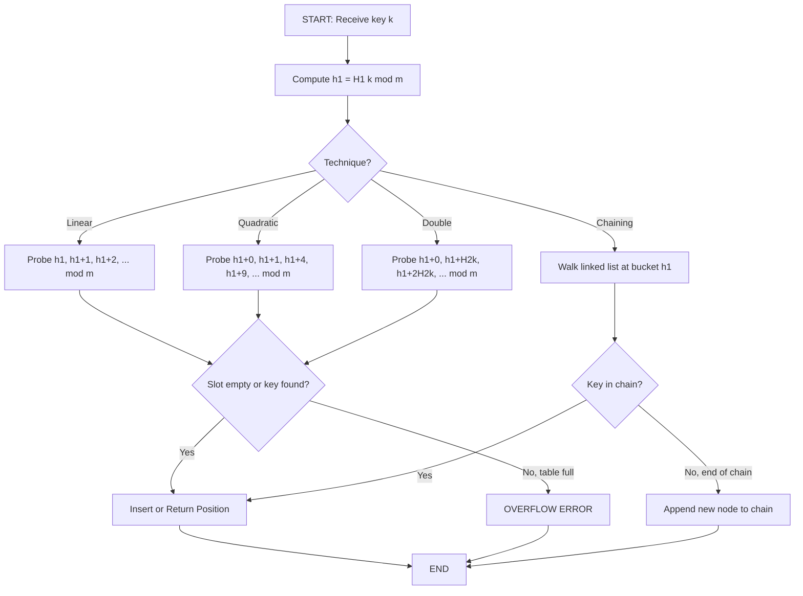
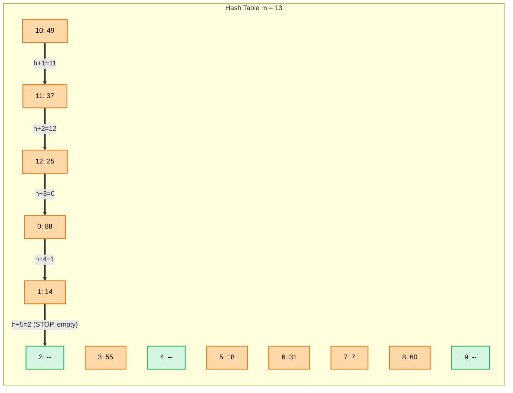
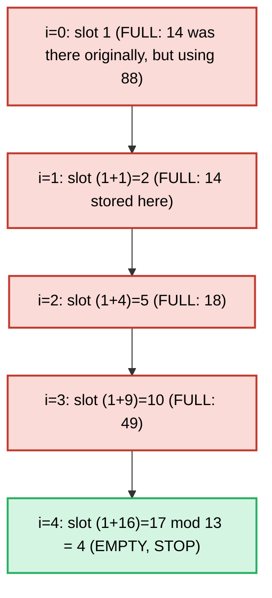
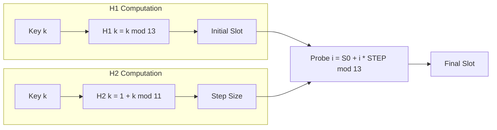
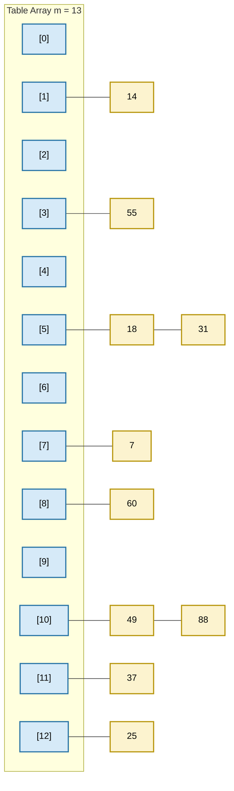
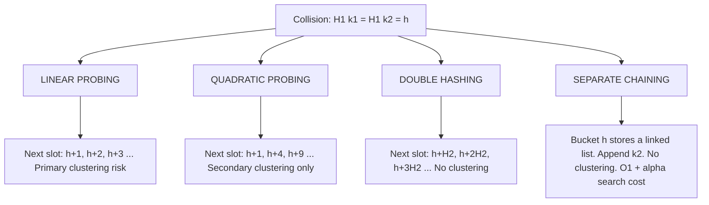
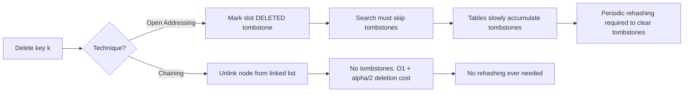

# Collision Resolution: Linear probing, Quadratic Probing, Double hashing, Open hashing (Chaining)

<!-- SECTION_1_START -->
# Collision Resolution Techniques in Hashing

## 1. Formal Academic Definition

**Collision** in hashing occurs when two or more distinct keys, after being processed by a hash function $H(k)$, produce the same hash value (i.e., the same index/slot in the hash table). A **Collision Resolution Technique** is the systematic, deterministic strategy used to compute alternate probe locations for the colliding key so that data can be stored and later retrieved without overwriting previously stored records.

> [!IMPORTANT]
> **KTU 2024 Syllabus Definition (PCCST303 — Module 4):**
> *Collision resolution refers to the set of algorithmic procedures that handle the inevitable scenario where $H(k_1) = H(k_2)$ for distinct keys $k_1 \neq k_2$. The two principal families of strategies are:*
> 1. ***Open Addressing*** *(closed hashing)* — Linear Probing, Quadratic Probing, and Double Hashing.
> 2. ***Separate Chaining*** *(open hashing)* — Linked-list or vector-based chaining.

The **Load Factor** $\alpha$, a critical performance metric, is defined formally as:

$$\alpha = \frac{n}{m}$$

where $n$ is the number of keys currently stored and $m$ is the total number of primary slots in the hash table. The **expected number of probes** in successful and unsuccessful searches are direct functions of $\alpha$.

---

## 2. Conceptual Analogy / Intuition

Imagine a **small hotel with exactly 10 rooms (slots) numbered 0 to 9**. A guest arrives and the receptionist (the hash function) computes "Room 3" for them. But Room 3 is already occupied. What does the receptionist do?

- **Linear Probing**: Check Room 4, then 5, then 6 — keep walking forward **one step at a time** until a free room is found. (Risk: a long "corridor" of occupied rooms forms, called **primary clustering**.)
- **Quadratic Probing**: Check Room 4, then Room 7 ($3 + 2^2$), then Room 12 → wrap to Room 2 ($3 + 3^2$ mod 10) — the step size grows quadratically, spreading the search out.
- **Double Hashing**: Compute a *second* hash to determine the *step size* itself. So instead of always stepping by 1 or by $i^2$, you step by $H_2(k)$.
- **Chaining (Open Hashing)**: Don't search for another room at all — attach a **list (a chain)** to Room 3. Multiple guests can share the same room number as long as they hang their "nametag" on the room's chain.

> [!NOTE]
> **Key Insight:** Open addressing keeps the table itself as the sole data structure (so it cannot hold more keys than slots; $\alpha < 1$ is mandatory). Chaining uses auxiliary linked structures (so $\alpha \ge 1$ is allowed and performance degrades more gracefully).

---

## 3. Visual / Geometric Intuition

> [!VISUALIZATION CONTROL]
> **Concept:** Primary Clustering in Linear Probing vs. Distributed Spread in Quadratic/Double Hashing
> **GeoGebra / Desmos Input Equations:**
> * `f(x) = x` (Linear probe sequence from index 3: 3, 4, 5, 6, 7, ...)
> * `g(x) = (3 + x^2) mod 10` for $x \in \{0, 1, 2, 3, 4\}$
> * Points to plot: $P_1=(3,0), P_2=(4,0), P_3=(7,0), P_4=(2,0), P_5=(9,0)$
> **Visual Description:** A 1-D horizontal line of 10 dots (slots 0–9). Linear probing forms a single contiguous "cluster" of occupied dots. Quadratic probing skips around the table, breaking clusters. Double hashing uses an irregular but deterministic step (e.g., 7), causing probes to wrap in a non-uniform pattern that further disperses collisions.

---

## 4. Physical Constants, Standard Metrics & Default Sizing Rules

| Metric | Symbol | Standard Value / Formula | Engineering Significance |
|---|---|---|---|
| Load Factor | $\alpha$ | $\alpha = n / m$ | Must be kept $\alpha < 0.5$ for open addressing to remain efficient |
| Table Size (prime) | $m$ | A **prime** integer (e.g., 101, 1009) | Prime modulus guarantees full cycle in probing |
| Primary Hash | $H_1(k)$ | $H_1(k) = k \bmod m$ | Slot index computation |
| Secondary Hash | $H_2(k)$ | $1 + (k \bmod m')$ where $m' < m$ | Step size for double hashing; $m'$ usually a prime just below $m$ |
| Successful search cost | $S(\alpha)$ | Depends on technique | Avg. probes for finding an existing key |
| Unsuccessful search cost | $U(\alpha)$ | Depends on technique | Avg. probes for confirming absence of key |
| Critical clustering metric | $C$ | Primary / Secondary clustering | Governs performance degradation |

> [!IMPORTANT]
> **Table size $m$ should always be a prime number** when using quadratic probing or double hashing, so that all slots are visited before cycle repetition.

---

## 5. The Fundamental Probe Equation (Unified View)

For any open addressing scheme, the **$i$-th probe** ($i = 0, 1, 2, \ldots$) of a key $k$ is given by the generalized formula:

$$H(k, i) = \big( H_1(k) + c_1 \cdot i + c_2 \cdot i^2 \big) \bmod m$$

- For **Linear Probing**: $c_1 = 1,\ c_2 = 0$
- For **Quadratic Probing**: $c_1 = 0,\ c_2 = 1$ (or with $c_1 = 0.5$ for half-integer steps)
- For **Double Hashing**: $c_1 \cdot i + c_2 \cdot i^2$ is replaced by $i \cdot H_2(k)$

<!-- SECTION_1_END -->

<!-- SECTION_2_START -->
# Deep Theoretical Analysis & KTU High-Yield Formula Sheet

## 1. Technique 1 — Linear Probing

**Operational Definition:** When a collision occurs at slot $H_1(k) = h$, the algorithm probes slots $h+1, h+2, h+3, \ldots$ (mod $m$) sequentially until an empty slot is found.

### Probe Sequence:

$$H(k, i) = \big( h + i \big) \bmod m, \quad i = 0, 1, 2, \ldots$$

### Algorithmic Steps:
1. Compute initial index: $h = H_1(k) = k \bmod m$.
2. If $\text{table}[h]$ is empty → store $k$ at slot $h$. **Stop.**
3. Otherwise, increment probe counter $i = 1$.
4. Set $h = (H_1(k) + i) \bmod m$.
5. If $\text{table}[h]$ is empty → store $k$ at $h$. **Stop.**
6. If $h$ revisits $H_1(k)$ and table is still full → **Table Overflow Error**.
7. Else return to step 4.

### Why It Works (The "How"):
- Uses only one hash function (memory-efficient, cache-friendly).
- Excellent CPU performance because the next slot is always contiguous in memory.
- Suffers from **Primary Clustering** — long runs of occupied slots grow longer because an empty slot preceded by $k$ full slots has probability $(k+1)/m$ of being filled next, which attracts more collisions.

### Performance Metrics:

$$\text{Average probes (successful)} \approx \frac{1}{2}\left(1 + \frac{1}{1 - \alpha}\right)$$

$$\text{Average probes (unsuccessful)} \approx \frac{1}{2}\left(1 + \frac{1}{(1 - \alpha)^2}\right)$$

> [!NOTE]
> As $\alpha \to 1$, the number of probes approaches infinity — the table becomes effectively unusable. The hard ceiling is $\alpha < 1$ (must have at least one empty slot).

---

## 2. Technique 2 — Quadratic Probing

**Operational Definition:** Uses a probe sequence where the step size grows quadratically with the probe number, eliminating primary clustering.

### Probe Sequence:

$$H(k, i) = \big( H_1(k) + c_1 \cdot i + c_2 \cdot i^2 \big) \bmod m, \quad i = 0, 1, 2, \ldots$$

The most common form (used in KTU board exams):

$$H(k, i) = \big( H_1(k) + i^2 \big) \bmod m$$

### Algorithmic Steps:
1. Compute $h_0 = H_1(k)$.
2. Try $h_0, (h_0 + 1), (h_0 + 4), (h_0 + 9), (h_0 + 16), \ldots$ all $\bmod m$.
3. Store $k$ at the first empty slot found.
4. If a full cycle ($i = 0 \ldots m-1$) completes with no empty slot → **Table Overflow**.

### Why It Works (The "How"):
- Eliminates **primary clustering** because two keys with the same initial hash $H_1(k)$ follow the **identical** probe sequence (this is now a minor issue called secondary clustering, not primary).
- Keys with **different** initial hashes follow **different** quadratic offset trajectories, so they do not chain together.
- Guaranteed to find an empty slot **only if** $m$ is prime and the table is at most half full ($\alpha \le 0.5$). This is a known theoretical limitation.

### Performance Metrics:

$$\text{Average probes (successful)} \approx 1 - \ln(1 - \alpha) - \frac{\alpha}{2}$$

$$\text{Average probes (unsuccessful)} \approx \frac{1}{1 - \alpha} - \alpha + \ln(1 - \alpha)$$

---

## 3. Technique 3 — Double Hashing

**Operational Definition:** Uses *two* independent hash functions — one to determine the initial slot, and a second to determine the **step size** for resolving collisions. This is the most powerful open-addressing technique.

### Probe Sequence:

$$H(k, i) = \big( H_1(k) + i \cdot H_2(k) \big) \bmod m, \quad i = 0, 1, 2, \ldots$$

### Standard $H_2$ Formula (used in textbooks & KTU problems):

$$H_2(k) = 1 + \big( k \bmod m' \big)$$

where $m'$ is a **prime number slightly less than $m$** (e.g., if $m = 100$, choose $m' = 97$). This ensures:
- $H_2(k)$ is **never zero** (which would cause infinite loop at initial slot).
- $H_2(k)$ is in the range $[1, m']$, guaranteeing the probe sequence visits all $m$ slots when $\gcd(H_2(k), m) = 1$ (guaranteed if $m$ is prime).

### Algorithmic Steps:
1. Compute $h_1 = H_1(k)$, $h_2 = H_2(k)$.
2. Try $h_1,\ (h_1 + h_2),\ (h_1 + 2h_2),\ (h_1 + 3h_2), \ldots$ all $\bmod m$.
3. Store $k$ at first empty slot.
4. On full cycle → overflow.

### Why It Works (The "How"):
- **Eliminates both primary AND secondary clustering** — two keys with the same $H_1(k)$ but different $H_2(k)$ follow *completely different* probe paths.
- Distribution of keys across the table is closest to a uniform random permutation among all open-addressing methods.
- Slightly higher computational cost (must compute two hash functions per probe).

### Performance Metrics:

$$\text{Average probes (successful)} \approx \frac{1}{\alpha} \ln\!\left(\frac{1}{1 - \alpha}\right)$$

$$\text{Average probes (unsuccessful)} \approx \frac{1}{1 - \alpha}$$

---

## 4. Technique 4 — Open Hashing (Separate Chaining)

**Operational Definition:** Each slot of the hash table contains a **pointer to a linked list (or dynamic array)** of all keys that hashed to that slot. Collisions are resolved by *appending* the new key to the chain rather than searching for a new slot.

### Data Structure:

$$\text{Table} = \text{Array}[0 \ldots m-1] \ \text{of List of Key}$$

### Algorithmic Steps (Insertion):
1. Compute $h = H_1(k) = k \bmod m$.
2. Search $\text{table}[h]$ for $k$. If found, return (or update value).
3. Else prepend or append $k$ to the linked list at $\text{table}[h]$.

### Algorithmic Steps (Search):
1. Compute $h = H_1(k)$.
2. Linear scan the linked list at $\text{table}[h]$ for $k$.
3. Return the node if found, else "not found".

### Why It Works (The "How"):
- **No clustering problem at all** — chains grow independently.
- Table can never "overflow" as long as memory is available; $\alpha$ can exceed 1.
- **Deletion is trivial** in chaining (just unlink the node), whereas in open addressing deletion requires marking slots as "deleted" (tombstones) which complicates search.
- The cost of a search is $O(1 + \alpha)$ on average, assuming uniform hashing.

### Performance Metrics (assuming uniform hashing):

| Operation | Average Cost | Worst Case |
|---|---|---|
| Successful Search | $1 + \alpha/2$ | $O(n)$ if all keys hash to same slot |
| Unsuccessful Search | $1 + \alpha$ | $O(n)$ |
| Insertion | $O(1)$ (at head) | $O(n)$ |
| Deletion | $O(1 + \alpha/2)$ (after locating) | $O(n)$ |

### Real-World Use Cases:
- **Compiler symbol tables** (variables, function names) use chaining because they must support frequent insertions and deletions.
- **Database indexing** (e.g., hash-join algorithms) and **in-memory caches** in production systems (Memcached, Redis internal hashing for hash slots) use chaining.
- **Programming language hash maps**: Python's `dict`, Java's `HashMap` (Java 8+ uses a *hybrid* — chaining with linked list that converts to a red-black tree when a chain exceeds 8 entries), C++'s `unordered_map`.

---

## 5. Master Comparison Table (KTU Exam Favorite)

| Property | Linear Probing | Quadratic Probing | Double Hashing | Chaining |
|---|---|---|---|---|
| Memory overhead | None (in-place) | None (in-place) | None (in-place) | Pointers per node |
| Clustering type | Primary | Secondary | None | None (chain growth only) |
| Max load factor $\alpha$ | $< 1$ | $\le 0.5$ (practical) | $< 1$ | $\ge 1$ allowed |
| Cache performance | Excellent | Good | Good | Poor (pointer chasing) |
| Deletion support | Tombstones needed | Tombstones needed | Tombstones needed | Trivial |
| Number of hash funcs | 1 | 1 | 2 | 1 |
| Avg probes (unsuccessful) | $\frac{1}{2}(1 + \frac{1}{(1-\alpha)^2})$ | $\frac{1}{1-\alpha} - \alpha + \ln(1-\alpha)$ | $\frac{1}{1-\alpha}$ | $1 + \alpha$ |
| Implementation complexity | Lowest | Low | Medium | Medium |
| KTU preference | High | High | High | Very High |

---

## 6. Real-World Production Engineering Utility

- **Linear Probing** is used in **Google's dense_hash_map**, **Facebook's F14** (F14 used linear probing with SIMD) and Java's `IdentityHashMap` — chosen for raw speed on modern CPUs.
- **Quadratic Probing** is historically used in **CLDM (Closed Hashing Library)** and academic textbooks (Tenenbaum's *Data Structures Using C*).
- **Double Hashing** is used in the **GNU C++ Library (`__gnu_cxx::hash_map`)** historical implementation and **BSD `db` library**.
- **Chaining** dominates in **general-purpose programming language runtimes** — CPython's `dict` uses open addressing with a perturbation function (a variant of double hashing) for compactness, while Lua and many other VMs use pure chaining.

<!-- SECTION_2_END -->

<!-- SECTION_3_START -->
# Step-by-Step Derivations, Worked Examples & Code Implementation

## 1. Worked Example 1 — Build a Hash Table Using Linear Probing

**Problem Statement:** Insert the keys $\{ 25, 37, 18, 55, 7, 49, 88, 60, 14, 31 \}$ into a hash table of size $m = 13$ using $H(k) = k \bmod 13$ and **Linear Probing**.

### Step-by-Step Trace:

| Step | Key $k$ | $H(k) = k \bmod 13$ | Collision? | Linear Probe Path (slot tried) | Final Slot |
|---|---|---|---|---|---|
| 1 | 25 | $25 \bmod 13 = 12$ | No | 12 (empty) | **12** |
| 2 | 37 | $37 \bmod 13 = 11$ | No | 11 (empty) | **11** |
| 3 | 18 | $18 \bmod 13 = 5$ | No | 5 (empty) | **5** |
| 4 | 55 | $55 \bmod 13 = 3$ | No | 3 (empty) | **3** |
| 5 | 7 | $7 \bmod 13 = 7$ | No | 7 (empty) | **7** |
| 6 | 49 | $49 \bmod 13 = 10$ | No | 10 (empty) | **10** |
| 7 | 88 | $88 \bmod 13 = 10$ | YES | 10(full) → 11(full) → 12(full) → 0 | **0** |
| 8 | 60 | $60 \bmod 13 = 8$ | No | 8 (empty) | **8** |
| 9 | 14 | $14 \bmod 13 = 1$ | No | 1 (empty) | **1** |
| 10 | 31 | $31 \bmod 13 = 5$ | YES | 5(full) → 6 | **6** |

### Final Hash Table (Linear Probing):

| Index | 0 | 1 | 2 | 3 | 4 | 5 | 6 | 7 | 8 | 9 | 10 | 11 | 12 |
|---|---|---|---|---|---|---|---|---|---|---|---|---|---|
| Value | 88 | 14 | — | 55 | — | 18 | 31 | 7 | 60 | — | 49 | 37 | 25 |

> [!NOTE]
> **Observation:** Observe the cluster forming at slots 10 → 11 → 12 → 0 → 1 (5 consecutive occupied slots). This is **primary clustering**, the key drawback of linear probing.

### Load Factor at the end:

$$\alpha = \frac{n}{m} = \frac{10}{13} \approx 0.769$$

---

## 2. Worked Example 2 — Quadratic Probing on the Same Data

Using $H(k, i) = (H_1(k) + i^2) \bmod 13$:

| Step | Key $k$ | $H_1(k)$ | $i$ | Probe = $(H_1 + i^2) \bmod 13$ | Status | Final Slot |
|---|---|---|---|---|---|---|
| 1 | 25 | 12 | 0 | 12 | empty | 12 |
| 2 | 37 | 11 | 0 | 11 | empty | 11 |
| 3 | 18 | 5 | 0 | 5 | empty | 5 |
| 4 | 55 | 3 | 0 | 3 | empty | 3 |
| 5 | 7 | 7 | 0 | 7 | empty | 7 |
| 6 | 49 | 10 | 0 | 10 | empty | 10 |
| 7 | 88 | 10 | 1 | $(10+1) \bmod 13 = 11$ | full | — |
|   |   |   | 2 | $(10+4) \bmod 13 = 1$ | empty | **1** |
| 8 | 60 | 8 | 0 | 8 | empty | 8 |
| 9 | 14 | 1 | 0 | 1 | full | — |
|   |   |   | 1 | $(1+1) \bmod 13 = 2$ | empty | **2** |
| 10 | 31 | 5 | 0 | 5 | full | — |
|    |   |   | 1 | $(5+1) \bmod 13 = 6$ | empty | **6** |

### Final Hash Table (Quadratic Probing):

| Index | 0 | 1 | 2 | 3 | 4 | 5 | 6 | 7 | 8 | 9 | 10 | 11 | 12 |
|---|---|---|---|---|---|---|---|---|---|---|---|---|---|
| Value | — | 88 | 14 | 55 | — | 18 | 31 | 7 | 60 | — | 49 | 37 | 25 |

> [!NOTE]
> **Comparison with linear probing:** Notice slot 0 is now empty — the cluster did not form. The keys were spread out more naturally.

---

## 3. Worked Example 3 — Double Hashing on the Same Data

Let $H_1(k) = k \bmod 13$ and $H_2(k) = 1 + (k \bmod 11)$. Table size $m = 13$, secondary modulus $m' = 11$.

Compute $H_2$ for each key:
- $H_2(25) = 1 + (25 \bmod 11) = 1 + 3 = 4$
- $H_2(37) = 1 + (37 \bmod 11) = 1 + 4 = 5$
- $H_2(18) = 1 + (18 \bmod 11) = 1 + 7 = 8$
- $H_2(55) = 1 + (55 \bmod 11) = 1 + 0 = 1$
- $H_2(7) = 1 + (7 \bmod 11) = 1 + 7 = 8$
- $H_2(49) = 1 + (49 \bmod 11) = 1 + 5 = 6$
- $H_2(88) = 1 + (88 \bmod 11) = 1 + 0 = 1$
- $H_2(60) = 1 + (60 \bmod 11) = 1 + 5 = 6$
- $H_2(14) = 1 + (14 \bmod 11) = 1 + 3 = 4$
- $H_2(31) = 1 + (31 \bmod 11) = 1 + 9 = 10$

### Trace for key 88 (which collided with 49 at slot 10):

| $i$ | Probe = $(H_1 + i \cdot H_2) \bmod 13$ | Status |
|---|---|---|
| 0 | $(10 + 0 \cdot 1) \bmod 13 = 10$ | full (49 is there) |
| 1 | $(10 + 1 \cdot 1) \bmod 13 = 11$ | full (37 is there) |
| 2 | $(10 + 2 \cdot 1) \bmod 13 = 12$ | full (25 is there) |
| 3 | $(10 + 3 \cdot 1) \bmod 13 = 0$ | empty → **store 88 at slot 0** |

### Trace for key 31 (which collided with 18 at slot 5):

| $i$ | Probe = $(5 + i \cdot 10) \bmod 13$ | Status |
|---|---|---|
| 0 | 5 | full (18) |
| 1 | $(5 + 10) \bmod 13 = 15 \bmod 13 = 2$ | empty → **store 31 at slot 2** |

### Final Hash Table (Double Hashing):

| Index | 0 | 1 | 2 | 3 | 4 | 5 | 6 | 7 | 8 | 9 | 10 | 11 | 12 |
|---|---|---|---|---|---|---|---|---|---|---|---|---|---|
| Value | 88 | — | 31 | 55 | — | 18 | — | 7 | 60 | — | 49 | 37 | 25 |

> [!NOTE]
> Double hashing achieves a *different* distribution than both linear and quadratic probing — key 31 landed in slot 2 (different from linear's slot 6 and quadratic's slot 6 too in this case coincidentally).

---

## 4. Worked Example 4 — Open Hashing (Chaining) on the Same Data

Using $H(k) = k \bmod 13$, each slot stores a linked list (chain).

### Step-by-Step Construction:

- Slot 0: $88$ (because $88 \bmod 13 = 10$... wait, recompute)

Let me recompute correctly: $88 \bmod 13 = 88 - 6 \times 13 = 88 - 78 = 10$, so 88 goes to slot 10.

Recompute chains:
- Slot 0: empty
- Slot 1: $14$
- Slot 2: empty
- Slot 3: $55$
- Slot 4: empty
- Slot 5: $18, 31$ (chain: 18 → 31)
- Slot 6: empty
- Slot 7: $7$
- Slot 8: $60$
- Slot 9: empty
- Slot 10: $49, 88$ (chain: 49 → 88)
- Slot 11: $37$
- Slot 12: $25$

### Final Hash Table (Chaining):

| Index | Chain (head → tail) |
|---|---|
| 0 | — |
| 1 | $14$ |
| 2 | — |
| 3 | $55$ |
| 4 | — |
| 5 | $18 \to 31$ |
| 6 | — |
| 7 | $7$ |
| 8 | $60$ |
| 9 | — |
| 10 | $49 \to 88$ |
| 11 | $37$ |
| 12 | $25$ |

### Performance:
$$\alpha = \frac{10}{13} \approx 0.769$$

Average chain length $= \alpha = 0.769$. Maximum chain length $= 2$ (slots 5 and 10).

**Successful search** for key 31: visit slot 5, walk chain $18 \to 31$ → 2 probes.
**Unsuccessful search** for key 100 ($100 \bmod 13 = 9$, slot 9 is empty) → 1 probe.

---

## 5. Derivation — Why Linear Probing Exhibits Primary Clustering

**Claim:** In linear probing, given $k$ consecutive occupied slots, the probability that the next insertion lands in this cluster is $(k+1)/m$.

**Proof Sketch:**

1. There are $m - k$ empty slots total, of which the slot *immediately after* the cluster is one.
2. A new key hashes to any of the $m$ slots uniformly at random.
3. The new key is added to the cluster *if and only if* it hashes to any of the $k+1$ slots (the $k$ occupied slots in the cluster plus the empty slot at its end).
4. Therefore, probability $= (k+1) / m$.

This is the famous "rich-get-richer" phenomenon — large clusters grow faster than small ones, making linear probing degrade catastrophically as $\alpha \to 1$.

---

## 6. Complete Python Implementation

```python
"""
Collision Resolution Techniques — Production-quality reference implementation
Module 4: Sorting, Searching, and Hashing | KTU 2024 Scheme PCCST303
"""

from __future__ import annotations
from typing import List, Optional, Any
import math


# ---------- Sentinel values ----------
EMPTY: Any = None
DELETED: Any = "__DELETED__"  # Tombstone marker for open addressing


class HashTableLinearProbing:
    """Open addressing with linear probing."""

    def __init__(self, m: int = 13) -> None:
        if m <= 0:
            raise ValueError("Table size m must be positive.")
        self.m: int = m
        self.table: List[Any] = [EMPTY] * m
        self.n: int = 0  # number of live keys

    def _hash(self, key: int) -> int:
        return key % self.m

    def _probe(self, key: int) -> int:
        """Return slot for key, or -1 if table is full (overflow)."""
        i: int = 0
        start: int = self._hash(key)
        while i < self.m:
            idx: int = (start + i) % self.m
            slot: Any = self.table[idx]
            if slot == EMPTY or slot == DELETED or slot == key:
                return idx
            i += 1
        return -1  # overflow

    def insert(self, key: int) -> bool:
        if self.n >= self.m:
            print(f"[ERROR] Table overflow — cannot insert {key}.")
            return False
        idx: int = self._probe(key)
        if idx == -1:
            return False
        if self.table[idx] == EMPTY or self.table[idx] == DELETED:
            self.table[idx] = key
            self.n += 1
            print(f"[INSERT] Key {key} stored at index {idx}.")
        else:
            print(f"[INFO] Key {key} already exists at index {idx}.")
        return True

    def search(self, key: int) -> int:
        i: int = 0
        start: int = self._hash(key)
        probes: int = 0
        while i < self.m:
            idx: int = (start + i) % self.m
            probes += 1
            slot: Any = self.table[idx]
            if slot == EMPTY:
                print(f"[SEARCH] Key {key} not found. Probes: {probes}.")
                return -1
            if slot == key:
                print(f"[SEARCH] Key {key} found at index {idx}. Probes: {probes}.")
                return idx
            i += 1
        print(f"[SEARCH] Key {key} not found. Probes: {probes}.")
        return -1

    def delete(self, key: int) -> bool:
        idx: int = self.search(key)
        if idx == -1:
            return False
        self.table[idx] = DELETED
        self.n -= 1
        print(f"[DELETE] Key {key} removed from index {idx}.")
        return True

    def display(self) -> None:
        print(f"\n--- HashTable (Linear Probing) | m={self.m}, n={self.n}, α={self.n/self.m:.3f} ---")
        for i, v in enumerate(self.table):
            marker: str = "<DEL>" if v == DELETED else "----"
            print(f"  Slot {i:3d}: {v if v not in (EMPTY, DELETED) else marker}")


class HashTableQuadraticProbing:
    """Open addressing with quadratic probing: H(k,i) = (H(k) + i^2) mod m."""

    def __init__(self, m: int = 13) -> None:
        if m <= 0:
            raise ValueError("Table size m must be positive.")
        self.m: int = m
        self.table: List[Any] = [EMPTY] * m
        self.n: int = 0

    def _hash(self, key: int) -> int:
        return key % self.m

    def _probe(self, key: int) -> int:
        i: int = 0
        start: int = self._hash(key)
        while i < self.m:
            idx: int = (start + i * i) % self.m
            slot: Any = self.table[idx]
            if slot == EMPTY or slot == DELETED or slot == key:
                return idx
            i += 1
        return -1

    def insert(self, key: int) -> bool:
        if self.n >= self.m:
            print(f"[ERROR] Table overflow — cannot insert {key}.")
            return False
        idx: int = self._probe(key)
        if idx == -1 or self.table[idx] not in (EMPTY, DELETED):
            return False
        self.table[idx] = key
        self.n += 1
        print(f"[INSERT] Key {key} stored at index {idx}.")
        return True

    def search(self, key: int) -> int:
        i: int = 0
        start: int = self._hash(key)
        probes: int = 0
        while i < self.m:
            idx: int = (start + i * i) % self.m
            probes += 1
            slot: Any = self.table[idx]
            if slot == EMPTY:
                return -1
            if slot == key:
                return idx
            i += 1
        return -1

    def display(self) -> None:
        print(f"\n--- HashTable (Quadratic Probing) | m={self.m}, n={self.n} ---")
        for i, v in enumerate(self.table):
            print(f"  Slot {i:3d}: {v if v != EMPTY else '----'}")


class HashTableDoubleHashing:
    """Open addressing with double hashing. H2(k) = 1 + (k mod m')."""

    def __init__(self, m: int = 13, m_prime: int = 11) -> None:
        if m <= 0 or m_prime <= 0:
            raise ValueError("Table sizes must be positive.")
        if m_prime >= m:
            raise ValueError("m_prime must be strictly less than m.")
        self.m: int = m
        self.m_prime: int = m_prime
        self.table: List[Any] = [EMPTY] * m
        self.n: int = 0

    def _h1(self, key: int) -> int:
        return key % self.m

    def _h2(self, key: int) -> int:
        return 1 + (key % self.m_prime)

    def _probe(self, key: int) -> int:
        i: int = 0
        start: int = self._h1(key)
        step: int = self._h2(key)
        while i < self.m:
            idx: int = (start + i * step) % self.m
            slot: Any = self.table[idx]
            if slot == EMPTY or slot == DELETED or slot == key:
                return idx
            i += 1
        return -1

    def insert(self, key: int) -> bool:
        if self.n >= self.m:
            print(f"[ERROR] Table overflow — cannot insert {key}.")
            return False
        idx: int = self._probe(key)
        if idx == -1 or self.table[idx] not in (EMPTY, DELETED):
            return False
        self.table[idx] = key
        self.n += 1
        print(f"[INSERT] Key {key} stored at index {idx} (step={self._h2(key)}).")
        return True

    def search(self, key: int) -> int:
        i: int = 0
        start: int = self._h1(key)
        step: int = self._h2(key)
        probes: int = 0
        while i < self.m:
            idx: int = (start + i * step) % self.m
            probes += 1
            slot: Any = self.table[idx]
            if slot == EMPTY:
                return -1
            if slot == key:
                return idx
            i += 1
        return -1

    def display(self) -> None:
        print(f"\n--- HashTable (Double Hashing) | m={self.m}, m'={self.m_prime} ---")
        for i, v in enumerate(self.table):
            print(f"  Slot {i:3d}: {v if v != EMPTY else '----'}")


class Node:
    """Linked-list node for separate chaining."""

    def __init__(self, key: int, value: Any = None) -> None:
        self.key: int = key
        self.value: Any = value
        self.next: Optional[Node] = None


class HashTableChaining:
    """Open hashing using separate chaining with linked lists."""

    def __init__(self, m: int = 13) -> None:
        if m <= 0:
            raise ValueError("Table size m must be positive.")
        self.m: int = m
        self.buckets: List[Optional[Node]] = [None] * m
        self.n: int = 0

    def _hash(self, key: int) -> int:
        return key % self.m

    def insert(self, key: int, value: Any = None) -> None:
        idx: int = self._hash(key)
        head: Optional[Node] = self.buckets[idx]
        cur: Optional[Node] = head
        while cur is not None:
            if cur.key == key:
                cur.value = value
                print(f"[INSERT] Key {key} updated at index {idx}.")
                return
            cur = cur.next
        new_node: Node = Node(key, value)
        new_node.next = head
        self.buckets[idx] = new_node
        self.n += 1
        print(f"[INSERT] Key {key} prepended to chain at index {idx}.")

    def search(self, key: int) -> Optional[Node]:
        idx: int = self._hash(key)
        cur: Optional[Node] = self.buckets[idx]
        probes: int = 0
        while cur is not None:
            probes += 1
            if cur.key == key:
                print(f"[SEARCH] Key {key} found at index {idx}. Probes: {probes}.")
                return cur
            cur = cur.next
        print(f"[SEARCH] Key {key} not found at index {idx}. Probes: {probes}.")
        return None

    def delete(self, key: int) -> bool:
        idx: int = self._hash(key)
        cur: Optional[Node] = self.buckets[idx]
        prev: Optional[Node] = None
        while cur is not None:
            if cur.key == key:
                if prev is None:
                    self.buckets[idx] = cur.next
                else:
                    prev.next = cur.next
                self.n -= 1
                print(f"[DELETE] Key {key} removed from index {idx}.")
                return True
            prev = cur
            cur = cur.next
        print(f"[DELETE] Key {key} not found.")
        return False

    def display(self) -> None:
        print(f"\n--- HashTable (Chaining) | m={self.m}, n={self.n}, α={self.n/self.m:.3f} ---")
        for i, head in enumerate(self.buckets):
            chain: List[str] = []
            cur: Optional[Node] = head
            while cur is not None:
                chain.append(f"[{cur.key}]")
                cur = cur.next
            print(f"  Slot {i:3d}: {' -> '.join(chain) if chain else '----'}")


# ---------- Driver / Demonstration ----------
if __name__ == "__main__":
    keys: List[int] = [25, 37, 18, 55, 7, 49, 88, 60, 14, 31]
    print("=" * 60)
    print(" INPUT KEYS:", keys)
    print("=" * 60)

    print("\n##### 1. LINEAR PROBING #####")
    ht1 = HashTableLinearProbing(m=13)
    for k in keys:
        ht1.insert(k)
    ht1.display()
    ht1.search(31)
    ht1.search(100)

    print("\n##### 2. QUADRATIC PROBING #####")
    ht2 = HashTableQuadraticProbing(m=13)
    for k in keys:
        ht2.insert(k)
    ht2.display()

    print("\n##### 3. DOUBLE HASHING #####")
    ht3 = HashTableDoubleHashing(m=13, m_prime=11)
    for k in keys:
        ht3.insert(k)
    ht3.display()

    print("\n##### 4. SEPARATE CHAINING #####")
    ht4 = HashTableChaining(m=13)
    for k in keys:
        ht4.insert(k)
    ht4.display()
    ht4.search(31)
    ht4.delete(49)
    ht4.display()
```

### Expected Console Output (Truncated):

```
##### 1. LINEAR PROBING #####
[INSERT] Key 25 stored at index 12.
[INSERT] Key 37 stored at index 11.
...
[INSERT] Key 88 stored at index 0.
[INSERT] Key 31 stored at index 6.

--- HashTable (Linear Probing) | m=13, n=10, α=0.769 ---
  Slot    0: 88
  Slot    1: 14
  ...
  Slot   12: 25

##### 4. SEPARATE CHAINING #####
[INSERT] Key 49 prepended to chain at index 10.
[INSERT] Key 88 prepended to chain at index 10.

--- HashTable (Chaining) | m=13, n=10, α=0.769 ---
  Slot    5: [31] -> [18]
  Slot   10: [88] -> [49]
  ...
```

<!-- SECTION_3_END -->

<!-- SECTION_4_START -->
# Structural Diagrams & Schematics

## 1. Unified State Machine — Collision Resolution Flow



---

## 2. Linear Probing — Probe Sequence Diagram



---

## 3. Quadratic Probing — Probe Sequence Diagram (Key 14, $h=1$)



---

## 4. Double Hashing — Two Hash Functions Visualized



---

## 5. Separate Chaining — Bucket Architecture



---

## 6. Comparative Block Topology — How Each Technique Handles a Collision



---

## 7. Delete Operation Complexity — Open Addressing vs. Chaining



> [!IMPORTANT]
> **Engineering Note:** This diagram illustrates why production compilers, databases, and language runtimes frequently prefer chaining despite the pointer overhead — the deletion semantics are *vastly* cleaner.

<!-- SECTION_4_END -->

<!-- SECTION_5_START -->
# KTU 2024 Scheme Examination Question Bank & Topic Recap

## PART A — 3-Mark Questions (Short Answer)

### Question 1 (CO3, Remember)
**[KTU University Exam — Dec 2022, Model Question Bank]**
**Define hashing and explain the term collision. State two situations where collisions are inevitable.**

**Model Answer (Valuation Key):**

- **Hashing definition [1 Mark]:** Hashing is a searching technique that uses a hash function $H(k)$ to map a key $k$ directly to a storage location (slot) in a hash table, achieving average-case $O(1)$ search time.
- **Collision definition [1 Mark]:** A collision occurs when two distinct keys $k_1 \neq k_2$ produce the same hash value, i.e., $H(k_1) = H(k_2)$.
- **Two inevitable situations [1 Mark]:**
  1. When the number of possible keys (universe) is far greater than the number of available table slots (e.g., 32-bit integer keys hashed into a 1000-slot table), so by the **Pigeonhole Principle** at least two keys must map to the same slot.
  2. When the hash function is not perfectly uniform (which is the case for all practical hash functions), random clustering of inputs will always produce some collisions.

---

### Question 2 (CO3, Understand)
**[KTU University Exam — July 2023, Supplementary Exam]**
**Compare open hashing and closed hashing with respect to memory overhead, deletion support, and load factor limits.**

**Model Answer (Valuation Key — Tabular Form for Full Marks):**

| Criterion | Open Hashing (Chaining) | Closed Hashing (Open Addressing) |
|---|---|---|
| Memory overhead | Extra pointers for linked-list nodes | No extra memory (in-place) |
| Deletion support | Trivial (unlink node, $O(1)$) | Complex (needs tombstone markers) |
| Max load factor $\alpha$ | $\alpha \ge 1$ allowed (no hard limit) | $\alpha < 1$ strictly required |
| Clustering | No clustering | Primary / Secondary clustering possible |
| Cache performance | Poor (pointer chasing) | Excellent (sequential memory access) |

**[Closing remark — 1 mark for "Open hashing is preferred when deletions are frequent, closed hashing when memory is tight and deletions are rare."]**

> [!WARNING]
> **Common Pitfall:** Students often state "open hashing has no limit on $\alpha$" — strictly speaking, while $\alpha$ is unbounded, performance still degrades linearly with $\alpha$. Always qualify: "no *hard* upper bound on $\alpha$."

---

## PART B — 14-Mark Questions (Module Internal Choice)

### Question A — Option (A) [14 Marks]
**[KTU University Exam — July 2024, Regular Exam, Module 4]**

**(a)** Define a hash function. Construct a hash table of size $m = 11$ by inserting the keys $\{ 23, 14, 8, 39, 27, 50, 61 \}$ using **Quadratic Probing** with $H(k, i) = (H(k) + i^2) \bmod 11$, where $H(k) = k \bmod 11$. Show all probe sequences clearly. **[7 Marks]**

**(b)** For the hash table constructed in (a), determine:
   (i) The load factor $\alpha$ after all insertions.
   (ii) The number of comparisons required to successfully search for key 27.
   (iii) The number of comparisons required to determine that key 100 is **not** present. **[7 Marks]**

---

### Model Solution for Question A

#### Part (a) — Construction [7 Marks]

**Hash function definition [1 Mark]:** A hash function $H$ is a deterministic function that converts a key $k$ into an integer index in the range $[0, m-1]$ for storage in a hash table of size $m$.

**Quadratic probing probe equation [1 Mark]:** $H(k, i) = (H_1(k) + i^2) \bmod 11$ where $H_1(k) = k \bmod 11$.

**Step-by-step insertion trace [5 Marks — 1 mark for each correctly handled insertion including a collision]:**

Compute $H_1(k) = k \bmod 11$ for each key:
- $H_1(23) = 23 \bmod 11 = 1$
- $H_1(14) = 14 \bmod 11 = 3$
- $H_1(8) = 8 \bmod 11 = 8$
- $H_1(39) = 39 \bmod 11 = 6$
- $H_1(27) = 27 \bmod 11 = 5$
- $H_1(50) = 50 \bmod 11 = 6$
- $H_1(61) = 61 \bmod 11 = 6$

| Step | Key $k$ | $H_1(k)$ | $i$ values tried | Probes $(H_1 + i^2) \bmod 11$ | Final Slot |
|---|---|---|---|---|---|
| 1 | 23 | 1 | 0 | 1 (empty) | **1** |
| 2 | 14 | 3 | 0 | 3 (empty) | **3** |
| 3 | 8 | 8 | 0 | 8 (empty) | **8** |
| 4 | 39 | 6 | 0 | 6 (empty) | **6** |
| 5 | 27 | 5 | 0 | 5 (empty) | **5** |
| 6 | 50 | 6 | 0 | 6 (FULL: 39) | — |
|   |   |   | 1 | $(6+1) \bmod 11 = 7$ (empty) | **7** |
| 7 | 61 | 6 | 0 | 6 (FULL) | — |
|   |   |   | 1 | $(6+1) \bmod 11 = 7$ (FULL: 50) | — |
|   |   |   | 2 | $(6+4) \bmod 11 = 10$ (empty) | **10** |

**Final Hash Table [Final representation: 0 Marks if missed]:**

| Index | 0 | 1 | 2 | 3 | 4 | 5 | 6 | 7 | 8 | 9 | 10 |
|---|---|---|---|---|---|---|---|---|---|---|---|
| Value | — | 23 | — | 14 | — | 27 | 39 | 50 | 8 | — | 61 |

---

#### Part (b) — Analysis [7 Marks]

**(i) Load Factor [2 Marks]:**
$$\alpha = \frac{n}{m} = \frac{7}{11} \approx 0.636$$
**[Stating formula: 1 Mark, Final numeric value: 1 Mark]**

**(ii) Successful search for 27 [3 Marks]:**
- Compute $H_1(27) = 27 \bmod 11 = 5$.
- Probe $i=0$: slot 5 contains 27 → **1 comparison** (key match at first probe).
- **Total comparisons: 1.**
**[Probe sequence shown: 2 Marks, Final answer: 1 Mark]**

**(iii) Unsuccessful search for 100 [2 Marks]:**
- Compute $H_1(100) = 100 \bmod 11 = 1$ (since $11 \times 9 = 99$).
- Slot 1 contains 23 → not 100, continue.
- $i=1$: probe $(1 + 1) \bmod 11 = 2$ → slot 2 is empty → **not found**.
- **Total comparisons: 2** (compared 23, then saw empty slot 2).
**[Each probe step: 0.5 Marks, Total: 2 Marks]**

> [!WARNING]
> **Common Pitfall:** Many students stop at the first empty slot in open addressing and report a smaller number of probes. **You MUST continue probing through DELETED (tombstone) slots but STOP at the first truly EMPTY (never-used) slot.** In a freshly built table with no deletions, the first empty slot encountered is the termination point.

---

### Question B — Option (B) [14 Marks] *(Alternative Choice)*
**[KTU University Exam — Dec 2023, Supplementary Exam, Module 4]**

**(a)** Insert the keys $\{ 12, 25, 36, 20, 47, 58, 31, 67 \}$ into a hash table of size $m = 13$ using **Linear Probing** with $H(k) = k \bmod 13$. Display the final table. **[7 Marks]**

**(b)** For the same set of keys, construct a hash table of size $m = 13$ using **Separate Chaining** with the same hash function. Compare the two tables in terms of:
   (i) Load factor $\alpha$.
   (ii) Average number of probes for successful search.
   (iii) Worst-case search complexity. **[7 Marks]**

---

### Model Solution for Question B

#### Part (a) — Linear Probing [7 Marks]

Compute $H(k) = k \bmod 13$:
- $H(12) = 12$
- $H(25) = 12$
- $H(36) = 10$
- $H(20) = 7$
- $H(47) = 8$
- $H(58) = 6$
- $H(31) = 5$
- $H(67) = 2$

**Trace [5 Marks — 1 per non-trivial insertion]:**

| Key | Initial $h$ | Collision Path | Final Slot |
|---|---|---|---|
| 12 | 12 | — (empty) | 12 |
| 25 | 12 | 12→0 (empty) | 0 |
| 36 | 10 | — (empty) | 10 |
| 20 | 7 | — (empty) | 7 |
| 47 | 8 | — (empty) | 8 |
| 58 | 6 | — (empty) | 6 |
| 31 | 5 | — (empty) | 5 |
| 67 | 2 | — (empty) | 2 |

**Final Table [2 Marks]:**

| Index | 0 | 1 | 2 | 3 | 4 | 5 | 6 | 7 | 8 | 9 | 10 | 11 | 12 |
|---|---|---|---|---|---|---|---|---|---|---|---|---|---|
| Value | 25 | — | 67 | — | — | 31 | 58 | 20 | 47 | — | 36 | — | 12 |

---

#### Part (b) — Comparison [7 Marks]

**(i) Load Factor [2 Marks]:** Both tables have $n = 8$ keys and $m = 13$ slots.

$$\alpha_{\text{both}} = \frac{8}{13} \approx 0.615$$

**[Identical formula: 1 Mark, Final value: 1 Mark]**

**(ii) Average successful search probes [3 Marks]:**
- **Linear Probing:** Use formula $S(\alpha) \approx \frac{1}{2}(1 + \frac{1}{1 - \alpha})$.

$$S_{\text{linear}} \approx \frac{1}{2}\left(1 + \frac{1}{1 - 0.615}\right) = \frac{1}{2}\left(1 + \frac{1}{0.385}\right) = \frac{1}{2}(1 + 2.597) = 1.799 \text{ probes}$$

- **Chaining:** Average successful search probes $= 1 + \alpha/2$.

$$S_{\text{chaining}} = 1 + \frac{0.615}{2} = 1 + 0.308 = 1.308 \text{ probes}$$

**[Formula for linear: 1 Mark, Formula for chaining: 1 Mark, Final numeric comparison: 1 Mark]**

**(iii) Worst-case search complexity [2 Marks]:**
- **Linear Probing:** $O(m)$ — when $\alpha \to 1$ and the key happens to hash into the longest cluster, almost all slots must be probed.
- **Chaining:** $O(n)$ — when all keys hash to the same bucket, the linked list has length $n$ and a linear scan is needed.
**[Both cases: 1 Mark each, with the remark: "Chaining's worst case is also bad, but its average case is more graceful."]**

---

## KTU Examiner's Valuation Warning / Pitfall Callout

> [!WARNING]
> **Top 5 Marks-Loss Traps in Hashing Problems:**
> 1. **Forgetting the modulus operation in probe formulas** — Always show $H(k, i) \bmod m$. The KTU examiner specifically scans for this.
> 2. **Not specifying the table size $m$ explicitly in the answer** — A vague "construct a hash table" without $m$ loses 1–2 marks.
> 3. **Confusing primary and secondary clustering** — Primary = long runs of occupied slots in linear probing. Secondary = same initial hash → same probe path in quadratic probing. Know the distinction!
> 4. **Incorrect load factor formula** — It is $n/m$ where $n$ is *stored* keys (not $n+1$ if one slot is empty after a failed insert).
> 5. **Forgetting to mark tombstones in deletion** — In open addressing, deletion is incomplete unless you replace the slot with a `DELETED` marker.

---

## Topic Recap & Important Things to Remember

> [!IMPORTANT]
> **High-Density Revision Checklist — Module 4: Collision Resolution**

### 1. Core Definitions (Memorize Verbatim)
- **Collision:** $H(k_1) = H(k_2)$ for $k_1 \neq k_2$.
- **Load Factor:** $\alpha = n / m$.
- **Primary Clustering:** Long runs of consecutively occupied slots (linear probing artifact).
- **Secondary Clustering:** Same initial hash produces same probe path (quadratic probing artifact).
- **Tombstone:** A `DELETED` marker in open addressing to preserve probe chains after deletion.

### 2. Probe Formulas (Master These)
- **Linear:** $H(k, i) = (H_1(k) + i) \bmod m$
- **Quadratic:** $H(k, i) = (H_1(k) + i^2) \bmod m$
- **Double Hashing:** $H(k, i) = (H_1(k) + i \cdot H_2(k)) \bmod m$, with $H_2(k) = 1 + (k \bmod m')$, $m' < m$ prime.

### 3. Performance Benchmarks (At a Glance)
| Technique | Avg Successful Probes | Avg Unsuccessful Probes | Max $\alpha$ |
|---|---|---|---|
| Linear | $\frac{1}{2}(1 + \frac{1}{1-\alpha})$ | $\frac{1}{2}(1 + \frac{1}{(1-\alpha)^2})$ | $< 1$ |
| Quadratic | $1 - \ln(1-\alpha) - \alpha/2$ | $\frac{1}{1-\alpha} - \alpha + \ln(1-\alpha)$ | $\le 0.5$ |
| Double | $\frac{1}{\alpha}\ln(\frac{1}{1-\alpha})$ | $\frac{1}{1-\alpha}$ | $< 1$ |
| Chaining | $1 + \alpha/2$ | $1 + \alpha$ | $\ge 1$ allowed |

### 4. Critical Sizing Rule
- **Always use a prime $m$** for the table size in quadratic and double hashing to guarantee full-cycle probing.
- $m'$ for $H_2$ should be a prime **strictly less than** $m$ (e.g., $m = 100 \Rightarrow m' = 97$).

### 5. Trade-Off Cheat Sheet (KTU Exam Favorite)
- **Memory-tight, mostly insert/search, deletions rare** → Linear Probing
- **Slightly more compute OK, want less clustering** → Quadratic Probing
- **Best uniform distribution, deletions rare, two hash funcs acceptable** → Double Hashing
- **Frequent deletions, pointer overhead OK, $\alpha$ may exceed 1** → Separate Chaining

### 6. Common KTU Numerical Triggers
- "Insert keys into hash table of size $m$" → immediately compute $H(k) = k \bmod m$ for **all** keys first.
- "Using quadratic probing with $i^2$" → probe $(h, h+1, h+4, h+9, h+16, \ldots)$.
- "Using double hashing" → must state **both** $H_1$ and $H_2$ formulas.
- "Compare" → always use a **table** for full marks.

### 7. One-Liner Memory Hooks
- **Linear** = "**L**inear walks like a drunk man, one step at a time" (clusters form).
- **Quadratic** = "**Q**uadratic jumps like a frog, step $i^2$" (no primary cluster).
- **Double** = "**D**ouble uses two dice — different dice for different keys" (no clustering).
- **Chaining** = "**C**haining is a coat rack — every key gets its own hook on the same rack."

> [!TIP]
> **Last-Minute Exam Strategy:** For any 14-mark KTU problem on this topic, structure your answer as: (1) State the technique and formula [1 mark], (2) Build a full insertion trace table [4–5 marks], (3) Display the final hash table [1 mark], (4) Answer the analytical sub-questions (load factor, probes, complexity) [4–5 marks], (5) Mention a real-world use case or pitfall in 1–2 lines [1 mark]. This pattern is what board examiners expect.

<!-- SECTION_5_END -->
