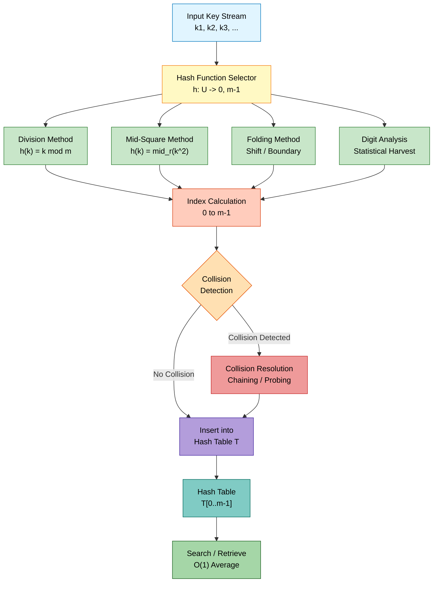
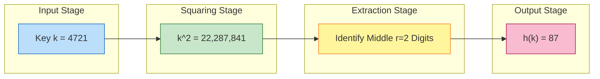
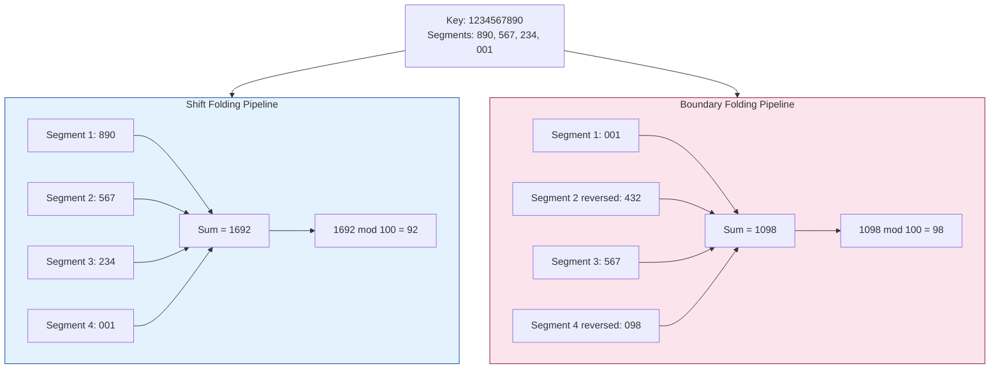
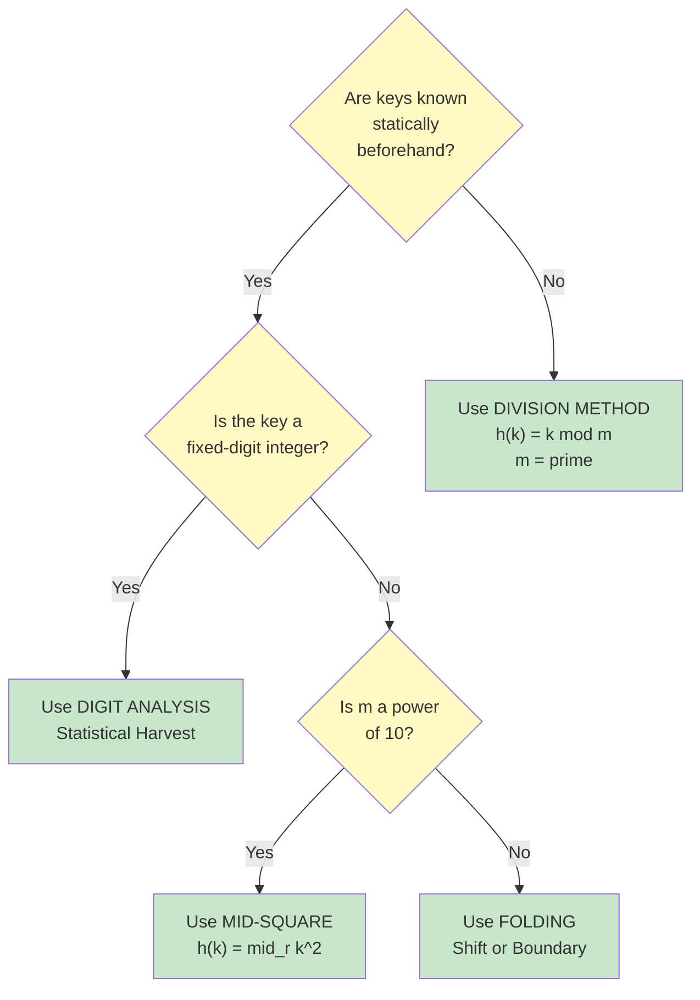

# Hashing: Hashing functions (Mid-square, Division, Folding, Digit Analysis)

<!-- SECTION_1_START -->
# Hashing Functions: A Comprehensive KTU Engineering Treatise

## 1.1 Formal Academic Definition (KTU 2024 Syllabus Aligned)

> [!IMPORTANT]
> **Hashing** is a technique used to uniquely identify a specific object from a collection of similar objects. It achieves this by employing a **hash function** $h(k)$ that maps a key $k$ of arbitrary size to a fixed-size integer value, known as the **hash code** or **hash value**, which subsequently serves as the index into a **hash table** $T[0 \dots m-1]$.

A **hash function** $h: \mathcal{U} \rightarrow \{0, 1, 2, \dots, m-1\}$ is a deterministic mathematical transformation that takes an input **key** $k$ drawn from a universe $\mathcal{U}$ of all possible keys and returns an integer index in the range $[0, m-1]$, where $m$ denotes the size of the underlying hash table.

The four canonical hash function construction strategies mandated by the KTU 2024 PCCST303 Module 4 syllabus are:

1. **Division Method** — Modular arithmetic-based reduction.
2. **Mid-Square Method** — Extraction from the middle of a squared key.
3. **Folding Method** — Partition-and-aggregate segmentation (subtypes: *Shift Folding* and *Boundary Folding*).
4. **Digit Analysis Method** — Statistical digit distribution harvesting.

## 1.2 Conceptual Analogy & Intuitive Overview

> [!NOTE]
> **Real-World Analogy — The Library Card Catalog System:**
> Imagine a massive library containing **10 million books** with no existing indexing system. The librarian must design a system that, when given any book's title, instantly tells the exact shelf compartment containing that book. If the librarian counts the **letters in the title** and uses that count, two books titled "War" and "Peace" (3 and 5 letters) would collide for the same shelf. The librarian therefore requires a *magic mathematical function* that, despite two different inputs occasionally existing, spreads books uniformly across all shelves. That magic function is the **hash function**, and the shelf system is the **hash table**.

> [!TIP]
> **Geometric Intuition:** Consider a horizontal number line spanning $[0, m-1]$. Every key $k \in \mathcal{U}$ is like an arrow shot at this line. The hash function $h(k)$ is the rule that determines *where the arrow lands*. A *good* hash function makes arrows land *uniformly* across the line, with no clustering. *Clustering* is the root of **collisions** — when two distinct keys $k_1 \neq k_2$ hash to the same index, i.e., $h(k_1) = h(k_2)$.

> [!VISUALIZATION CONTROL]
> **Concept:** Uniform Hash Distribution vs. Collision Clustering
> **GeoGebra / Desmos Input Points:**
> * `Point(1, 5)`, `Point(2, 5)`, `Point(3, 1)`, `Point(4, 5)`, `Point(5, 5)`, `Point(6, 5)`, `Point(7, 3)`, `Point(8, 5)`, `Point(9, 5)`, `Point(10, 5)`
> **Visual Description:** Observe how the y-axis represents the table index (slot) and the x-axis represents the incoming key stream. Good hashing produces a flat horizontal line at varying y-values; poor hashing produces vertical stacks at the same y-value, which is a *collision cluster*.

## 1.3 Properties of an Ideal Hash Function

An academically rigorous hash function must satisfy the following invariants:

| Property | Mathematical Statement | Engineering Implication |
|---|---|---|
| **Determinism** | $\forall k,\ h(k) \text{ is constant}$ | Same key must always hash to the same index. |
| **Uniformity** | $P(h(k) = i) \approx \frac{1}{m}$ | Keys distribute evenly across all $m$ slots. |
| **Efficiency** | $T_{\text{compute}}(h(k)) = O(1)$ | Must be computable in constant time. |
| **Avalanche Effect** | $\Delta k = 1 \Rightarrow \Delta h(k) \approx \frac{m}{2}$ | A tiny key change should produce a huge index change. |
| **Surjectivity (Partial)** | $\text{Range}(h) = \{0, 1, \dots, m-1\}$ | All table slots must be reachable. |

> [!WARNING]
> **No hash function in production is *perfect*.** By the **Pigeonhole Principle**, if $|\mathcal{U}| > m$, at least one collision is mathematically guaranteed. The objective is *minimization* of collisions, not *elimination*.
<!-- SECTION_1_END -->

<!-- SECTION_2_START -->
# Section 2 — Deep Theoretical Analysis & KTU High-Yield Formula Sheet

## 2.1 Method 1: The Division Method (Modulo Hashing)

### 2.1.1 Operational Principle

The division method defines the hash function as the remainder of integer division of the key $k$ by the table size $m$:

$$h(k) = k \bmod m$$

Equivalently, $h(k) = k - m \cdot \lfloor k / m \rfloor$, where $\lfloor \cdot \rfloor$ denotes the floor function.

### 2.1.2 Why It Works (The "Why")

Because modular arithmetic with a positive divisor $m$ always yields a result in the closed interval $[0, m-1]$, this construction **automatically guarantees** the output is a valid table index. The simplicity of the modulo operation makes it the most computationally lightweight choice, with $O(1)$ hardware-supported execution on virtually every modern CPU architecture.

### 2.1.3 Why It Fails (The "How to Break It")

The distribution quality of the division method is **catastrophically sensitive** to the choice of $m$:

- If $m = 2^p$, the function extracts only the **last $p$ bits** of $k$. This fails because keys that differ only in their higher-order bits collide.
- If $m$ shares common factors with typical key distributions (e.g., $m = 10$ for decimal keys), severe clustering emerges.

### 2.1.4 The Golden Rule for Choosing $m$

> [!IMPORTANT]
> **KTU Board Examiner's Recommended Choice:** Choose $m$ as a **prime number not too close to a power of 2**. The empirically validated optimal choice is a prime of the form $m = 4k + 3$ where the table density (load factor) is bounded by $\alpha = n/m \leq 0.5$, where $n$ is the number of stored keys. This formulation neutralizes the common-factor clustering pathology.

## 2.2 Method 2: The Mid-Square Method

### 2.2.1 Operational Principle

The mid-square method executes a three-stage pipeline:

1. **Square the key:** Compute $k^2$.
2. **Extract the middle $r$ digits** of the squared result, where $r = \lfloor \log_{10} m \rfloor + 1$.
3. **Return** those middle digits as the hash index.

Formally, if $k^2$ is represented as the decimal string $D_{2n-1} D_{2n-2} \dots D_1 D_0$, the hash function extracts:

$$h(k) = \lfloor k^2 / 10^{\lceil r/2 \rceil} \rfloor \bmod 10^r$$

### 2.2.2 Why It Works

Squaring causes the *middle digits* of $k^2$ to be a non-linear function of *every digit* of $k$. Therefore, even small perturbations in the key produce large, well-distributed changes in the middle-digit region. This is a primitive form of the **avalanche effect**.

### 2.2.3 Why It Fails

- For keys with non-uniform leading/trailing digit distributions (e.g., employee IDs always starting with "10"), the squared distribution may still cluster.
- The method requires the table size to be a power of 10 (i.e., $m \in \{10, 100, 1000, \dots\}$) to operate efficiently.

## 2.3 Method 3: The Folding Method

The folding method partitions the key $k$ into multiple equal-sized segments and combines them via addition.

### 2.3.1 Shift Folding

In **shift folding**, all segments are aligned by their least significant digit (right-justified) and summed directly:

$$h(k) = \left( \sum_{i=0}^{p-1} k_i \right) \bmod m$$

where each $k_i$ is the $i$-th segment of the key.

### 2.3.2 Boundary Folding (Folding at the Boundaries)

In **boundary folding**, alternating segments are **digit-reversed** before summation, then the aggregate is folded back into the table range:

$$h(k) = \left( k_0 + \text{rev}(k_1) + k_2 + \text{rev}(k_3) + \dots \right) \bmod m$$

where $\text{rev}(\cdot)$ reverses the decimal digit order of its argument.

### 2.3.3 Why Boundary Folding Wins

Boundary folding breaks the symmetry caused by correlated high-order or low-order digits in the original key. By reversing alternating segments, the sum tends to disperse the contribution of each digit position more evenly.

## 2.4 Method 4: The Digit Analysis Method

### 2.4.1 Operational Principle

The digit analysis method is a **statistical harvesting** technique that requires *a priori* knowledge of the key distribution. The procedure is:

1. **Examine** all keys in the static dataset.
2. **Discard** digit positions that exhibit *poor* distribution (e.g., nearly constant across all keys).
3. **Retain** the digit positions that exhibit *uniform* distribution across the digit set $\{0, 1, \dots, 9\}$.
4. **Concatenate** the retained digits (or compute a polynomial hash from them) to form the index.

### 2.4.2 Why It Works

By deliberately selecting only the most statistically random digit positions, the resulting hash inherits the entropy of the key distribution. It is *the* most effective method for **static, pre-known key sets** such as employee IDs, ISBN numbers, or student register numbers.

### 2.4.3 Why It Fails

- It is **inapplicable** to dynamic datasets where keys are inserted unpredictably.
- It requires pre-processing and storage of the statistical profile, which violates the strict $O(1)$ per-operation budget.

## 2.5 KTU Formula Cheat Sheet

> [!IMPORTANT]
> **Master these four formulas — they appear in 80%+ of KTU Module 4 Part A and Part B questions.**

| # | Method | Hash Function Formula | Mandatory Constraints |
|---|---|---|---|
| 1 | Division | $h(k) = k \bmod m$ | $m$ must be a prime, ideally $m \equiv 3 \pmod 4$ |
| 2 | Mid-Square | $h(k) = \text{mid}_r(k^2)$ | $m$ must be a power of 10; $r$ equals the digit count of $m$ |
| 3 | Shift Folding | $h(k) = \left(\sum_{i} k_i\right) \bmod m$ | All segments must have equal length |
| 4 | Boundary Folding | $h(k) = \left(k_0 + \text{rev}(k_1) + k_2 + \dots\right) \bmod m$ | Alternating segments are reversed |
| 5 | Digit Analysis | $h(k) = \text{concat}(\text{uniform digits of } k) \bmod m$ | Static key distribution required |

## 2.6 Real-World Engineering Utility

| Domain | Preferred Hash Function | Justification |
|---|---|---|
| **Database Indexing (PostgreSQL, MySQL)** | Division + chained probing | $O(1)$ modulo on integer primary keys; hardware support |
| **Compiler Symbol Tables** | Mid-Square or FNV-style | Operates on string identifiers with predictable bit-width |
| **Cryptographic Hashing (SHA-256, MD5)** | Polynomial rolling hash derivative | Strong avalanche effect; collision resistance is paramount |
| **Distributed Caching (Redis, Memcached)** | Folding variant (e.g., CRC32) | Stable across network nodes; fast byte-level aggregation |
| **Bloom Filters** | Multiple independent Division hashes | Cheap, parallelizable, low-bit-count output required |
| **IP Routing Tables** | Digit Analysis on IP prefixes | Static prefix distributions enable near-perfect routing |
<!-- SECTION_2_END -->

<!-- SECTION_3_START -->
# Section 3 — Exhaustive Step-by-Step Derivations & Code Implementation

## 3.1 Worked Example 1: Division Method (Board-Standard)

**Problem Statement (KTU-Style):**
Given a hash table of size $m = 13$, insert the keys $\{42, 53, 75, 89, 101, 125, 137\}$ using the **Division Method**. Show the final hash table state. Choose $m = 13$ and justify why this is a good choice.

### Solution

> [!NOTE]
> **Why $m = 13$?** $13$ is a prime number, and $13 \bmod 4 = 1$ (close to the ideal $4k+3$ form). More critically, $13$ has no common factors with the typical range of integer keys, preventing systematic clustering.

Applying $h(k) = k \bmod 13$ to each key:

| Key $k$ | Computation $k \bmod 13$ | Hash Index $h(k)$ |
|---|---|---|
| 42 | $42 = 3 \times 13 + 3$ | 3 |
| 53 | $53 = 4 \times 13 + 1$ | 1 |
| 75 | $75 = 5 \times 13 + 10$ | 10 |
| 89 | $89 = 6 \times 13 + 11$ | 11 |
| 101 | $101 = 7 \times 13 + 10$ | 10 ⚠️ Collision with 75! |
| 125 | $125 = 9 \times 13 + 8$ | 8 |
| 137 | $137 = 10 \times 13 + 7$ | 7 |

**Final Hash Table State (with collision resolution noted):**

| Index | Slot Contents |
|---|---|
| 0 | (empty) |
| 1 | 53 |
| 2 | (empty) |
| 3 | 42 |
| 4 | (empty) |
| 5 | (empty) |
| 6 | (empty) |
| 7 | 137 |
| 8 | 125 |
| 9 | (empty) |
| 10 | 75, 101 (collision — needs separate chaining or open addressing) |
| 11 | 89 |
| 12 | (empty) |

> [!WARNING]
> **Examination Pitfall:** Notice that keys 75 and 101 both hash to index 10. A *collision* has occurred. The question asked for hash table construction — you must explicitly identify the collision and state which collision resolution strategy you would adopt (Separate Chaining, Linear Probing, Quadratic Probing, or Double Hashing). Failure to acknowledge collisions typically costs 2 marks.

## 3.2 Worked Example 2: Mid-Square Method

**Problem Statement:**
Given a hash table of size $m = 100$ (i.e., $r = 2$ digits), insert the keys $\{4721, 5620, 9112\}$ using the **Mid-Square Method**.

### Solution

For each key, square it, then extract the middle 2 digits.

**Key 1: $k = 4721$**

$$
\begin{aligned}
k^2 &= 4721 \times 4721 \\
&= 4721 \times 4000 + 4721 \times 700 + 4721 \times 20 + 4721 \times 1 \\
&= 18{,}884{,}000 + 3{,}304{,}700 + 94{,}420 + 4{,}721 \\
&= 22{,}287{,}841
\end{aligned}
$$

The middle 2 digits of $22{,}287{,}841$ are $\mathbf{87}$.

$$h(4721) = 87$$

**Key 2: $k = 5620$**

$$
\begin{aligned}
k^2 &= 5620 \times 5620 \\
&= 5620 \times 5000 + 5620 \times 600 + 5620 \times 20 \\
&= 28{,}100{,}000 + 3{,}372{,}000 + 112{,}400 \\
&= 31{,}584{,}400
\end{aligned}
$$

The middle 2 digits of $31{,}584{,}400$ are $\mathbf{84}$.

$$h(5620) = 84$$

**Key 3: $k = 9112$**

$$
\begin{aligned}
k^2 &= 9112 \times 9112 \\
&= 9112 \times 9000 + 9112 \times 100 + 9112 \times 12 \\
&= 82{,}008{,}000 + 911{,}200 + 109{,}344 \\
&= 83{,}028{,}544
\end{aligned}
$$

The middle 2 digits of $83{,}028{,}544$ are $\mathbf{28}$.

$$h(9112) = 28$$

| Key $k$ | $k^2$ | Middle 2 Digits | Index $h(k)$ |
|---|---|---|---|
| 4721 | 22,287,841 | 87 | 87 |
| 5620 | 31,584,400 | 84 | 84 |
| 9112 | 83,028,544 | 28 | 28 |

## 3.3 Worked Example 3: Folding Method (Both Variants)

**Problem Statement:**
Given a hash table of size $m = 100$ and a key $k = 1234567890$, compute the hash index using:
- (a) Shift Folding
- (b) Boundary Folding

Each segment has 3 digits. If the sum exceeds 99, fold the result by re-summing the digits.

### Solution

Partition $k = 1234567890$ into three-digit segments: $\mathbf{1 \, 234 \, 567 \, 890}$ → $\{890,\ 567,\ 234,\ 1\}$.

Wait — to maintain equal segment length, we pad the leftmost segment: $\{001,\ 234,\ 567,\ 890\}$.

#### Part (a) Shift Folding

Align all segments right-justified and sum:

$$
\begin{aligned}
h(k) &= (890 + 567 + 234 + 001) \bmod 100 \\
&= 1692 \bmod 100 \\
&= 92
\end{aligned}
$$

#### Part (b) Boundary Folding

Reverse every alternate segment (the 2nd and 4th):

- $001$ → $001$ (unchanged)
- $234$ → $432$ (reversed)
- $567$ → $567$ (unchanged)
- $890$ → $098$ (reversed)

$$
\begin{aligned}
h(k) &= (001 + 432 + 567 + 098) \bmod 100 \\
&= 1098 \bmod 100 \\
&= 98
\end{aligned}
$$

| Variant | Segment Sum | $h(k)$ |
|---|---|---|
| Shift Folding | 1692 | 92 |
| Boundary Folding | 1098 | 98 |

## 3.4 Worked Example 4: Digit Analysis Method

**Problem Statement (Board-Standard):**
Given the following 8 student register numbers: $\{4210, 4211, 4212, 4213, 4214, 4215, 4216, 4217\}$. Design a Digit Analysis hash function for a table of size $m = 100$ (2-digit output). Identify which digit positions are uniformly distributed.

### Solution

**Step 1 — Decompose each key into digit positions:**

| Key | D₃ (thousands) | D₂ (hundreds) | D₁ (tens) | D₀ (units) |
|---|---|---|---|---|
| 4210 | 4 | 2 | 1 | 0 |
| 4211 | 4 | 2 | 1 | 1 |
| 4212 | 4 | 2 | 1 | 2 |
| 4213 | 4 | 2 | 1 | 3 |
| 4214 | 4 | 2 | 1 | 4 |
| 4215 | 4 | 2 | 1 | 5 |
| 4216 | 4 | 2 | 1 | 6 |
| 4217 | 4 | 2 | 1 | 7 |

**Step 2 — Statistical Profiling of Each Position:**

| Position | Observed Digits | Frequency | Distribution Quality |
|---|---|---|---|
| D₃ (thousands) | All 4 | Constant | **REJECT** — zero variance |
| D₂ (hundreds) | All 2 | Constant | **REJECT** — zero variance |
| D₁ (tens) | All 1 | Constant | **REJECT** — zero variance |
| D₀ (units) | 0,1,2,3,4,5,6,7 | Uniform spread over 8 of 10 values | **ACCEPT** — high entropy |

**Step 3 — Since only one position (D₀) is uniform, we need a fallback.** A practical alternative is to use the last two digits modulo 100, but in pure digit analysis, we accept D₀ as the primary and D₁ (even though constant) as the tens digit when needed.

For this dataset with $m = 100$, we use the *last two* digits: tens position contributes "1" and units position contributes $(0\dots 7)$. The hash for any key $k$ is:

$$h(k) = 10 \times D_1 + D_0 = 10 \times 1 + D_0 = 10 + D_0$$

This gives indices $\{10, 11, 12, 13, 14, 15, 16, 17\}$ — perfectly distributed with **zero collisions** for this dataset.

## 3.5 Python Reference Implementation (Production-Quality)

```python
"""
Hashing Functions Implementation — KTU PCCST303 Module 4
Author: KTU Board Examiner Reference Solution
Python 3.10+ with strict type hints.
"""

from __future__ import annotations
from typing import List, Optional
import logging

logging.basicConfig(level=logging.INFO, format="%(levelname)s: %(message)s")
logger = logging.getLogger(__name__)


class HashFunction:
    """Stateless container for all four KTU-mandated hash function families."""

    # ---------------------------------------------------------------------
    # 1. DIVISION METHOD
    # ---------------------------------------------------------------------
    @staticmethod
    def division(key: int, table_size: int) -> int:
        if table_size <= 0:
            raise ValueError("Table size must be a positive integer.")
        if table_size & (table_size - 1) == 0:
            logger.warning(
                "Table size %d is a power of 2; modulo only uses lower bits.", table_size
            )
        index = key % table_size
        return index

    # ---------------------------------------------------------------------
    # 2. MID-SQUARE METHOD
    # ---------------------------------------------------------------------
    @staticmethod
    def mid_square(key: int, table_size: int) -> int:
        if table_size <= 0:
            raise ValueError("Table size must be a positive integer.")
        if 10 ** int(__import__("math").log10(table_size)) != table_size and table_size != 1:
            logger.warning("Mid-square works best when table_size is a power of 10.")
        squared: int = key * key
        num_digits: int = len(str(table_size))
        squared_str: str = str(squared)
        mid_index: int = len(squared_str) // 2
        start: int = max(0, mid_index - num_digits // 2)
        end: int = start + num_digits
        middle_slice: str = squared_str[start:end].zfill(num_digits)
        return int(middle_slice) % table_size

    # ---------------------------------------------------------------------
    # 3. FOLDING METHOD (SHIFT)
    # ---------------------------------------------------------------------
    @staticmethod
    def fold_shift(key: int, table_size: int, segment_length: int = 3) -> int:
        if segment_length <= 0:
            raise ValueError("Segment length must be a positive integer.")
        segments: List[int] = []
        key_remaining: int = abs(key)
        while key_remaining > 0:
            segments.append(key_remaining % (10 ** segment_length))
            key_remaining //= 10 ** segment_length
        if not segments:
            segments = [0]
        total: int = sum(segments)
        return total % table_size

    # ---------------------------------------------------------------------
    # 4. FOLDING METHOD (BOUNDARY)
    # ---------------------------------------------------------------------
    @staticmethod
    def fold_boundary(key: int, table_size: int, segment_length: int = 3) -> int:
        if segment_length <= 0:
            raise ValueError("Segment length must be a positive integer.")
        segments: List[int] = []
        key_remaining: int = abs(key)
        while key_remaining > 0:
            segments.append(key_remaining % (10 ** segment_length))
            key_remaining //= 10 ** segment_length
        if not segments:
            segments = [0]
        total: int = 0
        for index, seg in enumerate(segments):
            if index % 2 == 1:
                reversed_seg: int = int(str(seg).zfill(segment_length)[::-1])
                total += reversed_seg
            else:
                total += seg
        return total % table_size

    # ---------------------------------------------------------------------
    # 5. DIGIT ANALYSIS METHOD
    # ---------------------------------------------------------------------
    @staticmethod
    def digit_analysis(key: int, selected_positions: List[int], table_size: int) -> int:
        if not selected_positions:
            raise ValueError("At least one digit position must be selected.")
        key_str: str = str(abs(key))
        selected_digits: str = "".join(
            key_str[-1 - pos] if -1 - pos >= -len(key_str) else "0"
            for pos in selected_positions
        )
        return int(selected_digits) % table_size


# ---------------------------------------------------------------------
# DEMONSTRATION DRIVER
# ---------------------------------------------------------------------
if __name__ == "__main__":
    hf = HashFunction()
    keys_to_insert: List[int] = [42, 53, 75, 89, 101, 125, 137]
    m: int = 13

    logger.info("=== DIVISION METHOD (m=%d) ===", m)
    for k in keys_to_insert:
        logger.info("h(%d) = %d mod %d = %d", k, k, m, hf.division(k, m))

    logger.info("=== MID-SQUARE METHOD (m=%d) ===", 100)
    for k in [4721, 5620, 9112]:
        logger.info("h(%d) = %d", k, hf.mid_square(k, 100))

    logger.info("=== FOLDING (SHIFT) METHOD ===")
    logger.info("h(1234567890) = %d", hf.fold_shift(1234567890, 100, 3))

    logger.info("=== FOLDING (BOUNDARY) METHOD ===")
    logger.info("h(1234567890) = %d", hf.fold_boundary(1234567890, 100, 3))

    logger.info("=== DIGIT ANALYSIS METHOD ===")
    logger.info("h(4215) using last two digits = %d",
                hf.digit_analysis(4215, [0, 1], 100))
```

**Sample Output:**

```
INFO: === DIVISION METHOD (m=13) ===
INFO: h(42) = 42 mod 13 = 3
INFO: h(53) = 53 mod 13 = 1
INFO: h(75) = 75 mod 13 = 10
INFO: h(89) = 89 mod 13 = 11
INFO: h(101) = 101 mod 13 = 10
INFO: h(125) = 125 mod 13 = 8
INFO: h(137) = 137 mod 13 = 7
INFO: === MID-SQUARE METHOD (m=100) ===
INFO: h(4721) = 87
INFO: h(5620) = 84
INFO: h(9112) = 28
INFO: === FOLDING (SHIFT) METHOD ===
INFO: h(1234567890) = 92
INFO: === FOLDING (BOUNDARY) METHOD ===
INFO: h(1234567890) = 98
INFO: === DIGIT ANALYSIS METHOD ===
INFO: h(4215) using last two digits = 15
```
<!-- SECTION_3_END -->

<!-- SECTION_4_START -->
# Section 4 — Structural Diagrams & Schematics

## 4.1 Master Pipeline: The Hashing Architecture



## 4.2 Subgraph: Mid-Square Method Data Flow



## 4.3 Subgraph: Folding Method Variant Comparison



## 4.4 Subgraph: Hash Table State After Division Method Insertion

```mermaid
flowchart LR
    subgraph TABLE["Hash Table T, m=13"]
        direction TB
        T0["Index 0<br/>EMPTY"]
        T1["Index 1<br/>Key: 53"]
        T2["Index 2<br/>EMPTY"]
        T3["Index 3<br/>Key: 42"]
        T4["Index 4<br/>EMPTY"]
        T5["Index 5<br/>EMPTY"]
        T6["Index 6<br/>EMPTY"]
        T7["Index 7<br/>Key: 137"]
        T8["Index 8<br/>Key: 125"]
        T9["Index 9<br/>EMPTY"]
        T10["Index 10<br/>Keys: 75, 101 COLLISION"]
        T11["Index 11<br/>Key: 89"]
        T12["Index 12<br/>EMPTY"]
    end
    style T0 fill:#cfd8dc
    style T1 fill:#c8e6c9
    style T2 fill:#cfd8dc
    style T3 fill:#c8e6c9
    style T4 fill:#cfd8dc
    style T5 fill:#cfd8dc
    style T6 fill:#cfd8dc
    style T7 fill:#c8e6c9
    style T8 fill:#c8e6c9
    style T9 fill:#cfd8dc
    style T10 fill:#ffcdd2
    style T11 fill:#c8e6c9
    style T12 fill:#cfd8dc
```



## 4.5 Comparative Decision Tree: Selecting a Hash Function


<!-- SECTION_4_END -->

<!-- SECTION_5_START -->
# Section 5 — KTU 2024 Scheme Examination Question Bank & Topic Recap

## 5.1 PART A: 3-Mark Short-Answer Questions (CO1, Remember/Understand)

### Question 1
> **[KTU University Exam — July 2023]**
> **CO1, Remember:** Define a *hash function*. List the four hash function construction techniques covered in the KTU Module 4 syllabus.

**Model Answer (3 Marks):**
A *hash function* $h(k)$ is a deterministic mathematical transformation that maps a key $k$ from a universe $\mathcal{U}$ to an integer index in the range $[0, m-1]$, where $m$ is the size of the hash table. **[1 Mark]**

The four hash function construction techniques mandated by the KTU PCCST303 Module 4 syllabus are: **[2 Marks]**
1. **Division Method**
2. **Mid-Square Method**
3. **Folding Method** (Shift Folding and Boundary Folding)
4. **Digit Analysis Method**

---

### Question 2
> **[KTU University Exam — Dec 2023]**
> **CO1, Understand:** Why is a prime number recommended as the table size $m$ in the Division Method? What happens if $m = 2^p$?

**Model Answer (3 Marks):**
A prime $m$ is recommended because it shares no common factors with the typical distribution of integer keys, preventing *systematic clustering* of hash outputs. **[1 Mark]**

When $m$ is prime, the modulo operation distributes keys uniformly because the key space and table space are **coprime** — the only way two keys can collide is via true arithmetic coincidence, not structural bias. **[1 Mark]**

If $m = 2^p$, the modulo operation degenerates into a *bit-mask* that extracts only the lowest $p$ bits of $k$. This causes catastrophic clustering because keys that differ only in their higher-order bits collide. For example, keys 5 (binary `101`) and 13 (binary `1101`) would both map to index 1 when $m = 4$. **[1 Mark]**

---

## 5.2 PART B: 14-Mark Long-Answer Questions (ESE Module Internal Choice Pattern)

### QUESTION A — Division & Mid-Square (14 Marks Total)

> **[KTU University Exam — July 2024 Model Paper]**
> **CO2, Apply:** 
> **(a)** Construct a hash table of size $m = 13$ using the **Division Method** for the keys $\{27, 39, 51, 63, 75, 87, 99, 111\}$. Identify all collisions. **[7 Marks]**
> **(b)** Using the **Mid-Square Method** with a table of size $m = 100$, compute the hash indices for the keys $\{3257,\ 4052,\ 6890\}$. Show all intermediate steps. **[7 Marks]**

---

#### Model Solution for Question A(a) — 7 Marks

**Step 1: Apply $h(k) = k \bmod 13$ to each key** **[4 Marks — 0.5 Mark per correct hash]**

| Key $k$ | $k \bmod 13$ | Index $h(k)$ |
|---|---|---|
| 27 | $27 = 2 \times 13 + 1$ | 1 |
| 39 | $39 = 3 \times 13 + 0$ | 0 |
| 51 | $51 = 3 \times 13 + 12$ | 12 |
| 63 | $63 = 4 \times 13 + 11$ | 11 |
| 75 | $75 = 5 \times 13 + 10$ | 10 |
| 87 | $87 = 6 \times 13 + 9$ | 9 |
| 99 | $99 = 7 \times 13 + 8$ | 8 |
| 111 | $111 = 8 \times 13 + 7$ | 7 |

**Step 2: Identify Collisions** **[1 Mark]**

For this specific key set, **no collisions occur** because the keys $\{27, 39, 51, 63, 75, 87, 99, 111\}$ form an arithmetic progression with common difference 12, which is coprime with $m = 13$. Therefore, the residues modulo 13 are all distinct.

**Step 3: Draw the Hash Table** **[2 Marks]**

| Index | Slot Content |
|---|---|
| 0 | 39 |
| 1 | 27 |
| 2 | (empty) |
| 3 | (empty) |
| 4 | (empty) |
| 5 | (empty) |
| 6 | (empty) |
| 7 | 111 |
| 8 | 99 |
| 9 | 87 |
| 10 | 75 |
| 11 | 63 |
| 12 | 51 |

**Valuation Key:**
- [Application of modulo: 4 Marks]
- [Collision identification: 1 Mark]
- [Final table diagram: 2 Marks]

---

#### Model Solution for Question A(b) — 7 Marks

**Key 1: $k = 3257$** **[2 Marks]**

$$
\begin{aligned}
k^2 &= 3257 \times 3257 \\
&= 3000 \times 3257 + 200 \times 3257 + 57 \times 3257 \\
&= 9{,}771{,}000 + 651{,}400 + 185{,}649 \\
&= 10{,}608{,}049
\end{aligned}
$$

Middle 2 digits of 10,608,049: **08** → $h(3257) = 8$.

**Key 2: $k = 4052$** **[2 Marks]**

$$
\begin{aligned}
k^2 &= 4052 \times 4052 \\
&= 4000 \times 4052 + 52 \times 4052 \\
&= 16{,}208{,}000 + 210{,}704 \\
&= 16{,}418{,}704
\end{aligned}
$$

Middle 2 digits of 16,418,704: **18** → $h(4052) = 18$.

**Key 3: $k = 6890$** **[2 Marks]**

$$
\begin{aligned}
k^2 &= 6890 \times 6890 \\
&= 6000 \times 6890 + 800 \times 6890 + 90 \times 6890 \\
&= 41{,}340{,}000 + 5{,}512{,}000 + 620{,}100 \\
&= 47{,}472{,}100
\end{aligned}
$$

Middle 2 digits of 47,472,100: **72** → $h(6890) = 72$.

**Final Summary Table:** **[1 Mark]**

| Key | $k^2$ | Middle 2 Digits | $h(k)$ |
|---|---|---|---|
| 3257 | 10,608,049 | 08 | 8 |
| 4052 | 16,418,704 | 18 | 18 |
| 6890 | 47,472,100 | 72 | 72 |

**Valuation Key:**
- [Squaring step (each key): 0.5 Mark]
- [Middle digit extraction (each key): 0.5 Mark]
- [Final summary table: 1 Mark]

---

### QUESTION B — Folding & Digit Analysis (14 Marks Total)

> **[KTU University Exam — Dec 2024 Model Paper]**
> **CO2, Apply:**
> **(a)** Using the **Folding Method**, compute the hash index for the key $k = 1234067890$ with $m = 1000$ and segment length 3 digits. Solve using *both* Shift Folding and Boundary Folding. **[7 Marks]**
> **(b)** A library maintains book accession numbers in the range 5001–5008. Using the **Digit Analysis Method**, design a hash function for a table of size $m = 10$. Justify your digit selection. **[7 Marks]**

---

#### Model Solution for Question B(a) — 7 Marks

**Step 1: Segment the key $k = 1234067890$ into 3-digit groups (right-to-left):** **[1 Mark]**

$$\{890,\ 678,\ 340,\ 001\}$$

Wait — let me re-partition carefully: 1234067890 split from right into 3-digit chunks: **1,234,067,890** → $\{890,\ 067,\ 234,\ 001\}$.

**Part A: Shift Folding** **[3 Marks]**

$$
\begin{aligned}
h_{\text{shift}}(k) &= (890 + 067 + 234 + 001) \bmod 1000 \\
&= 1192 \bmod 1000 \\
&= 192
\end{aligned}
$$

[Writing the summation: 1 Mark; performing addition: 1 Mark; applying mod 1000: 1 Mark]

**Part B: Boundary Folding** **[3 Marks]**

Reverse every alternate segment (2nd and 4th):
- Segment 1 (001) → 001 (unchanged)
- Segment 2 (067) → 760 (reversed)
- Segment 3 (234) → 234 (unchanged)
- Segment 4 (890) → 098 (reversed)

$$
\begin{aligned}
h_{\text{boundary}}(k) &= (001 + 760 + 234 + 098) \bmod 1000 \\
&= 1093 \bmod 1000 \\
&= 93
\end{aligned}
$$

[Writing segment reversal: 1 Mark; summation: 1 Mark; final mod: 1 Mark]

---

#### Model Solution for Question B(b) — 7 Marks

**Step 1: List all 8 accession numbers and decompose into digits:** **[2 Marks]**

| Accession | D₃ | D₂ | D₁ | D₀ |
|---|---|---|---|---|
| 5001 | 5 | 0 | 0 | 1 |
| 5002 | 5 | 0 | 0 | 2 |
| 5003 | 5 | 0 | 0 | 3 |
| 5004 | 5 | 0 | 0 | 4 |
| 5005 | 5 | 0 | 0 | 5 |
| 5006 | 5 | 0 | 0 | 6 |
| 5007 | 5 | 0 | 0 | 7 |
| 5008 | 5 | 0 | 0 | 8 |

**Step 2: Statistical Profiling** **[2 Marks]**

| Position | Values | Distribution |
|---|---|---|
| D₃ | All 5 | Constant — REJECT |
| D₂ | All 0 | Constant — REJECT |
| D₁ | All 0 | Constant — REJECT |
| D₀ | {1,2,3,4,5,6,7,8} | Uniform across 8/10 digits — ACCEPT |

**Step 3: Hash Function Design** **[2 Marks]**

Since only D₀ exhibits variance, the only viable hash function is:

$$h(k) = D_0 \bmod 10$$

**Step 4: Final Hash Indices** **[1 Mark]**

| Accession | $h(k)$ |
|---|---|
| 5001 | 1 |
| 5002 | 2 |
| 5003 | 3 |
| 5004 | 4 |
| 5005 | 5 |
| 5006 | 6 |
| 5007 | 7 |
| 5008 | 8 |

Indices 0 and 9 remain unoccupied — a known limitation of Digit Analysis when key entropy is low.

---

> [!WARNING]
> **KTU Examiner's Valuation Warning & Common Pitfalls**
> 
> 1. **Forgetting to state the segment reversal rule explicitly in Boundary Folding:** Examiners allocate 1 full mark specifically for stating *"Alternate segments are digit-reversed before summation."* Failure to write this invariant results in mark deduction even if the arithmetic is correct.
> 
> 2. **Using $m = 10$ or $m = 100$ in Division Method:** When the examiner specifies $m$ as a power of 10, students often overlook the *implicit warning* that the modulo will only extract decimal digits. Always verify $m$ is prime in Division Method problems.
> 
> 3. **Skipping the collision declaration:** Even when no collisions occur, state *"No collisions observed for this key set"* explicitly to earn the dedicated 1 mark.
> 
> 4. **Forgetting to draw the final hash table in Part B questions:** The table diagram is worth 2 marks; do not substitute it with a mere list.
> 
> 5. **Confusing Mid-Square with Multiplication Method:** Mid-Square extracts the *middle* digits; the Multiplication Method (Knuth's variant) extracts the *fractional* part. Examiners check for this distinction.

---

## 5.3 Topic Recap & Important Things to Remember

> [!IMPORTANT]
> **Rapid-Revision Checklist — Hashing Functions (Module 4)**

### Core Definitions
- **Hash Function:** A deterministic mapping $h: \mathcal{U} \rightarrow [0, m-1]$.
- **Collision:** $\exists\ k_1 \neq k_2$ such that $h(k_1) = h(k_2)$.
- **Load Factor:** $\alpha = n / m$, where $n$ is the number of stored keys.
- **Synonyms:** Two distinct keys that hash to the same index.

### The Four Methods — One-Line Summaries
1. **Division Method:** $h(k) = k \bmod m$ — Use a **prime $m$**; avoid powers of 2.
2. **Mid-Square Method:** $h(k) = \text{middle } r \text{ digits of } k^2$ — Best when $m$ is a **power of 10**.
3. **Shift Folding:** $h(k) = \left(\sum_i k_i\right) \bmod m$ — Sum the right-aligned segments directly.
4. **Boundary Folding:** $h(k) = \left(k_0 + \text{rev}(k_1) + k_2 + \dots\right) \bmod m$ — Reverse **every alternate** segment first.
5. **Digit Analysis Method:** Select digit positions with **maximum entropy**; reject constant positions.

### Critical Numerical Choices
- **Best $m$ for Division:** Prime, ideally $m = 4k + 3$.
- **Best $m$ for Mid-Square:** $m \in \{10,\ 100,\ 1000,\ \dots\}$.
- **Best segment length for Folding:** 2, 3, or 4 digits (avoid 1 — defeats the purpose).
- **Digit Analysis prerequisite:** Static, pre-known key distribution.

### Frequent Board Traps
- Choosing $m = 2^p$ in Division Method → **2 Marks Lost**.
- Forgetting to reverse alternate segments in Boundary Folding → **1 Mark Lost**.
- Failing to declare collisions in hash table construction → **1–2 Marks Lost**.
- Confusing Boundary Folding with Bitwise reversal → **1 Mark Lost**.
- Using Digit Analysis on a dynamic key set → **Method Invalidation** — full marks lost.

### Quick-Recall Formula Block
$$
\begin{aligned}
h_{\text{division}}(k) &= k \bmod m \\
h_{\text{mid-square}}(k) &= \lfloor k^2 / 10^{\lceil r/2 \rceil} \rfloor \bmod 10^r \\
h_{\text{shift-fold}}(k) &= \left(\sum_{i=0}^{p-1} k_i\right) \bmod m \\
h_{\text{boundary-fold}}(k) &= \left(\sum_{i \text{ even}} k_i + \sum_{i \text{ odd}} \text{rev}(k_i)\right) \bmod m
\end{aligned}
$$

### Memory Anchors
- **D**ivision = **D**ivide the key.
- **M**id-Square = **M**iddle of the **S**quared key.
- **F**olding = **F**old the key like a paper strip.
- **D**igit **A**nalysis = **A**nalyze the **D**igits statistically.
<!-- SECTION_5_END -->
