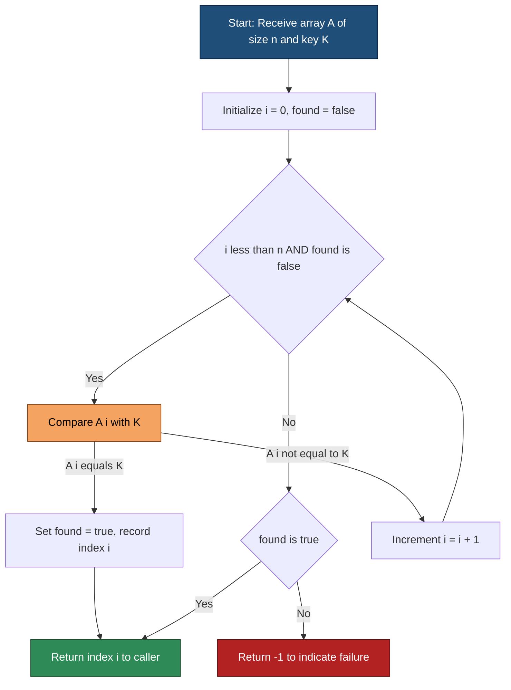
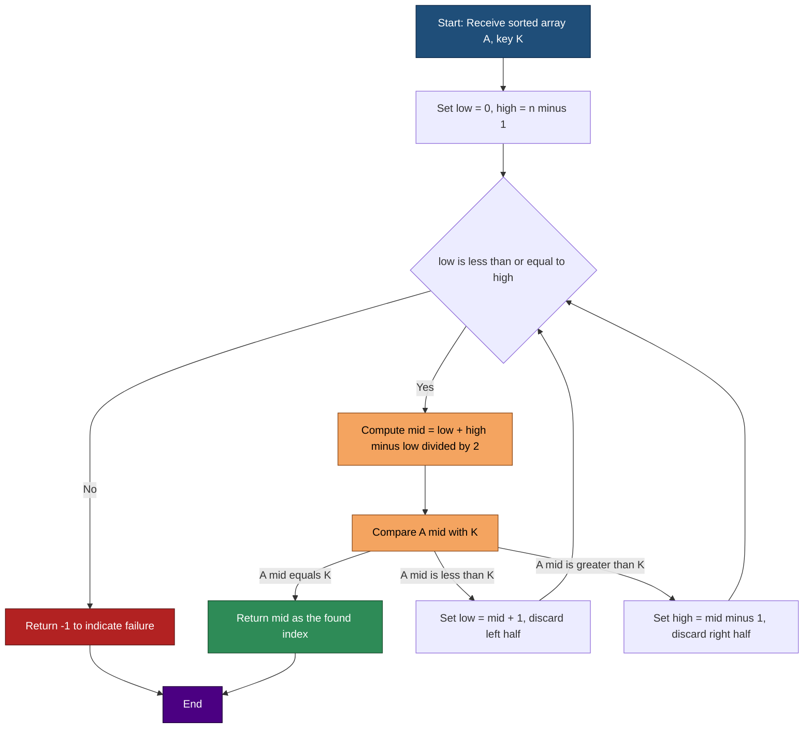
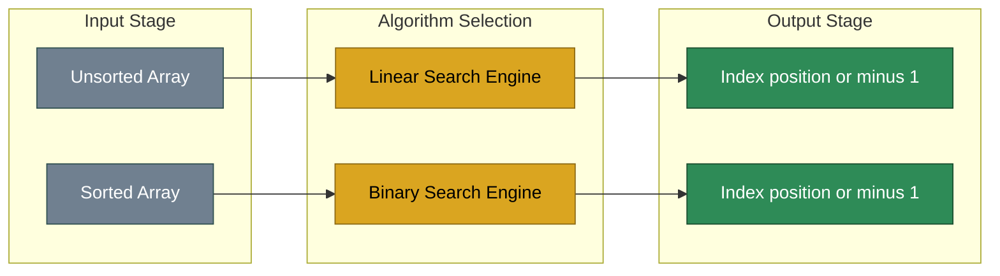

# Searching Techniques: Linear Search, Binary Search

<!-- SECTION_1_START -->
# Searching Techniques: Linear Search & Binary Search

## 1. Core Technical Definition

### 1.1 Linear Search (Sequential Search)

> [!IMPORTANT]
> **Formal Definition (KTU 2024 Syllabus Terminology):**
> *Linear Search* is a brute-force, deterministic searching algorithm that sequentially inspects each element of a linear data structure (array or linked list) from the first index to the last, comparing the target key with every element until a match is found or the entire collection is exhausted. It is the most general-purpose search technique and imposes **no preconditions** on the ordering of the underlying data.

**Geometric / Real-World Analogy:**

Imagine you dropped a specific book in a large, unsorted pile of 1000 books in a library. You have no idea where it is. The only practical strategy is to pick up the first book, check its label, set it aside, pick up the second, check, and so on — a brute-force scan. This is exactly **Linear Search**. The time taken is directly proportional to the pile size because, in the worst case, you may inspect *every single book*.

> [!NOTE]
> **KTU Highlight:** Linear Search is the **only** algorithm that works on **unsorted** data and on **non-random-access** structures (like Singly Linked Lists). Binary Search cannot be used in such cases.

### 1.2 Binary Search (Logarithmic Search)

> [!IMPORTANT]
> **Formal Definition (KTU 2024 Syllabus Terminology):**
> *Binary Search* is a divide-and-conquer searching algorithm that operates on a **pre-sorted** sequence. It repeatedly divides the search interval in half by comparing the target value with the middle element; if they mismatch, the half in which the target cannot lie is eliminated. The procedure continues on the remaining half until the element is found or the interval becomes empty ($low > high$).

**Geometric / Real-World Analogy:**

Consider a thick 1000-page English dictionary where words are alphabetized. To find the word "Programming", you don't start at page 1. You open roughly the middle, see words starting with "N", and instantly know "Programming" must be in the **right half**. You discard the left, repeat on the right. Each step **halves** the problem size. This is **Binary Search** — logarithmically fast.

The standard base-2 logarithm $\log_2(1000) \approx 10$ comparisons suffice, versus up to 1000 for Linear Search.

> [!NOTE]
> **Mandatory Precondition:** The collection **must be sorted** in monotonically non-decreasing (or non-increasing) order. Binary Search on unsorted data produces **undefined / incorrect** results.

> [!VISUALIZATION CONTROL]
> **Concept:** Binary Search halving visualization on a 16-element array
> **Plotting Description:** A horizontal bar from $i=0$ to $i=15$ with the target element at index $11$. Step 1 highlights indices $0$–$15$ and points to mid-index $7$. Step 2 eliminates indices $0$–$7$ and highlights $8$–$15$ with mid-index $11$ (the hit). Each successive step cuts the active interval in half.
> **Observation:** After $k$ steps, the interval length is $\lfloor n/2^k \rfloor$. For $n=16$, after $4$ steps the interval is $1$.

---

## 2. Key Terminology Reference

| Term | Definition |
| :--- | :--- |
| **Key (Target)** | The element value the algorithm is searching for. |
| **Index** | Position of an element in the array (0-based in C/C++/Python, 1-based in algorithm textbooks). |
| **Probe** | One comparison operation against the target. |
| **Best Case** | Scenario requiring the minimum number of comparisons. |
| **Worst Case** | Scenario requiring the maximum number of comparisons. |
| **Average Case** | Expected number of comparisons over all equally-likely input distributions. |
| **Successful Search** | The key exists in the dataset. |
| **Unsuccessful Search** | The key does not exist in the dataset. |

<!-- SECTION_1_END -->

<!-- SECTION_2_START -->
# Deep Theoretical Analysis & KTU High-Yield Formula Sheet

## 1. Linear Search — Operational Theory

### 1.1 Algorithmic Logic Steps

1. **Initialize** the search index $i \leftarrow 0$ and a sentinel flag $\text{found} \leftarrow \text{false}$.
2. **Iterate** while $i < n$ (where $n$ is the length of the list) AND $\text{found} = \text{false}$.
3. **Compare** the current element $A[i]$ with the target key $K$.
4. If $A[i] = K$, set $\text{found} \leftarrow \text{true}$ and break the loop.
5. Otherwise, increment $i \leftarrow i + 1$ and proceed to the next element.
6. **Terminate**: if found, return $i$ (the location); else return $-1$ (sentinel for "not found").

### 1.2 Complexity Derivation (Why and How)

- The loop executes at most $n$ iterations in the **worst case** (target absent or located at the last position).
- The number of comparisons is the dominant cost metric.
- Let $T(n)$ be the number of key comparisons.

$$
T(n) = \begin{cases}
1 & \text{if element is at the first position (best case)} \\
n & \text{if element is at the last position or absent (worst case)} \\
\dfrac{n+1}{2} & \text{on average (assuming uniform probability of location)}
\end{cases}
$$

### 1.3 Real-World Utility

- **Database Record Lookup** in unsorted logs (e.g., audit trails).
- **Linked List Traversal** where random access is $O(n)$ anyway.
- **Small Datasets** ($n \le 50$) where the constant factor of sorting for Binary Search outweighs its asymptotic advantage.
- **Single Occurrence** lookups in streams (one-pass scanning).

---

## 2. Binary Search — Operational Theory

### 2.1 Iterative Algorithmic Logic Steps

1. **Precondition:** The input array $A$ is sorted in ascending order of size $n$.
2. **Initialize** $low \leftarrow 0$ and $high \leftarrow n - 1$.
3. **Loop** while $low \le high$:
   - Compute $mid \leftarrow \lfloor \dfrac{low + high}{2} \rfloor$ (avoids overflow via $low + (high - low) / 2$ in low-level languages).
   - **Compare** $A[mid]$ with $K$:
     - If $A[mid] = K$, **return** $mid$ (search successful).
     - If $A[mid] < K$, the target lies in the right half $\Rightarrow$ update $low \leftarrow mid + 1$.
     - If $A[mid] > K$, the target lies in the left half $\Rightarrow$ update $high \leftarrow mid - 1$.
4. **Termination**: If $low > high$, **return** $-1$ (search unsuccessful).

### 2.2 Recursive Formulation

The recurrence relation for the number of comparisons $T(n)$ on a sorted array of size $n$ is:

$$
T(n) = \begin{cases}
1 & \text{if } n = 1 \\
1 + T\!\left(\left\lfloor \dfrac{n}{2} \right\rfloor\right) & \text{if } n > 1
\end{cases}
$$

Expanding by substitution (Master Theorem, Case 2 with $a=1$, $b=2$, $f(n)=1$):

$$
T(n) = T\!\left(\dfrac{n}{2}\right) + 1 = T\!\left(\dfrac{n}{4}\right) + 2 = \dots = T(1) + \log_2 n
$$

$$
\boxed{T(n) = \lfloor \log_2 n \rfloor + 1}
$$

### 2.3 Real-World Utility

- **Dictionary / Encyclopedia lookups**.
- **Searching in sorted database index files (B-Tree internals)**.
- **Git Bisect**, **Debugging version histories**, **Monotonic Predicate Inversion**.
- **Lower bound for comparison-based searching** (proven optimal at $\Omega(\log_2 n)$).

---

## 3. KTU High-Yield Formula / Cheat Sheet

> [!IMPORTANT]
> Master this table. Every KTU exam question on searching requires at least one of these values.

| Metric | Linear Search | Binary Search |
| :--- | :--- | :--- |
| Precondition on data | None (works on unsorted) | Must be **sorted** |
| Best Case Comparisons $T_{\min}(n)$ | $1$ (element at index 0) | $1$ (element at mid) |
| Worst Case Comparisons $T_{\max}(n)$ | $n$ (absent or last index) | $\lfloor \log_2 n \rfloor + 1$ |
| Average Case Comparisons $T_{\text{avg}}(n)$ | $\dfrac{n+1}{2}$ | $\approx \log_2 n - 1$ |
| Time Complexity (Big-O) | $O(n)$ | $O(\log_2 n)$ |
| Space Complexity (Iterative) | $O(1)$ auxiliary | $O(1)$ auxiliary |
| Space Complexity (Recursive) | $O(1)$ auxiliary | $O(\log_2 n)$ call-stack |
| Suitable Data Structure | Array, Linked List, File | Array, Random-Access structure |
| Search Direction | Sequential, one direction | Divide and conquer, half-discard |
| Stability of output index | Returns first occurrence | Returns any occurrence (implementation-dependent) |

> [!NOTE]
> **Engineering Tip:** For $n \le 16$, the constant factors of Binary Search can make Linear Search *faster* in practice due to cache locality and branch prediction. KTU may ask you to compare trade-offs — always cite the **asymptotic** behaviour as the theoretical answer.

<!-- SECTION_2_END -->

<!-- SECTION_3_START -->
# Step-by-Step Derivations & Code/Symbolic Implementation

## 1. Worked Trace — Linear Search

**Problem:** Given array $A = [12, 45, 7, 23, 89, 14]$ and target $K = 23$, find the index of $K$ using Linear Search. Also determine the number of comparisons for the **best**, **worst**, and the given **input**.

### 1.1 Trace Table (Explicit Step-by-Step)

| Step $i$ | Index $i$ | Element $A[i]$ | Compare with $K=23$? | Result | Found? |
| :---: | :---: | :---: | :---: | :---: | :---: |
| 1 | 0 | 12 | $12 = 23$? | False | No |
| 2 | 1 | 45 | $45 = 23$? | False | No |
| 3 | 2 | 7 | $7 = 23$? | False | No |
| 4 | 3 | 23 | $23 = 23$? | True | **Yes (return 3)** |

- **Number of comparisons** for this input: $4$.
- **Best case** for $K$ at index $0$: $1$ comparison.
- **Worst case** (absent or last): $n = 6$ comparisons.

---

## 2. Worked Trace — Binary Search

**Problem:** Given sorted array $A = [3, 8, 14, 23, 39, 51, 67, 84]$ and target $K = 51$, find the index of $K$ using Binary Search. Report the number of comparisons.

### 2.1 Trace Table

| Iteration | $low$ | $high$ | $mid = \lfloor (low+high)/2 \rfloor$ | $A[mid]$ | Compare | Action | Result |
| :---: | :---: | :---: | :---: | :---: | :---: | :---: | :---: |
| 1 | 0 | 7 | $\lfloor 7/2 \rfloor = 3$ | $A[3]=23$ | $23 < 51$ | $low \leftarrow 3+1$ | Continue |
| 2 | 4 | 7 | $\lfloor 11/2 \rfloor = 5$ | $A[5]=51$ | $51 = 51$ | **Return 5** | **Found** |

- **Number of comparisons**: $2$.
- Theoretical worst case for $n=8$ is $\lfloor \log_2 8 \rfloor + 1 = 3 + 1 = 4$ comparisons. Our trace confirms $T(n) \le \log_2 n + 1$.

---

## 3. Python Implementation — Linear Search

```python
from typing import List, Optional


def linear_search(arr: List[int], key: int) -> int:
    """
    Performs Linear Search on an unsorted/sorted list.

    Parameters
    ----------
    arr : List[int]
        The input collection to be searched.
    key : int
        The target value to locate.

    Returns
    -------
    int
        Zero-based index of the first occurrence of key, or -1 if not found.

    Time Complexity  : O(n)
    Space Complexity : O(1)
    """
    # Defensive boundary check: handle empty input safely.
    if not arr:
        return -1

    # Iterate sequentially through the entire collection.
    for index in range(len(arr)):
        if arr[index] == key:
            return index  # Successful search — return the position.

    # Unsuccessful search — key not present in the collection.
    return -1


# ---------------- Demonstration ----------------
if __name__ == "__main__":
    sample: List[int] = [12, 45, 7, 23, 89, 14]
    target: int = 23
    result: int = linear_search(sample, target)
    print(f"Linear Search: Key {target} found at index {result}")
    # Output: Linear Search: Key 23 found at index 3
```

---

## 4. Python Implementation — Iterative Binary Search

```python
from typing import List


def binary_search_iterative(arr: List[int], key: int) -> int:
    """
    Performs Iterative Binary Search on a SORTED (ascending) list.

    Parameters
    ----------
    arr : List[int]
        The input collection; MUST be sorted in non-decreasing order.
    key : int
        The target value to locate.

    Returns
    -------
    int
        Zero-based index of the key, or -1 if not found.

    Precondition : arr is sorted ascending. Otherwise, result is undefined.
    Time Complexity  : O(log_2 n)
    Space Complexity : O(1)
    """
    # Defensive precondition check.
    if not arr:
        return -1

    low: int = 0
    high: int = len(arr) - 1

    # Continue halving until the search interval is exhausted.
    while low <= high:
        # Compute the midpoint safely (avoids integer overflow in C/C++).
        mid: int = low + (high - low) // 2

        if arr[mid] == key:
            return mid  # Successful search.
        elif arr[mid] < key:
            low = mid + 1  # Discard the left half.
        else:  # arr[mid] > key
            high = mid - 1  # Discard the right half.

    # Unsuccessful search — interval has been fully exhausted.
    return -1


# ---------------- Demonstration ----------------
if __name__ == "__main__":
    sorted_sample: List[int] = [3, 8, 14, 23, 39, 51, 67, 84]
    target_key: int = 51
    result_index: int = binary_search_iterative(sorted_sample, target_key)
    print(f"Binary Search: Key {target_key} found at index {result_index}")
    # Output: Binary Search: Key 51 found at index 5
```

---

## 5. Python Implementation — Recursive Binary Search

```python
from typing import List


def binary_search_recursive(
    arr: List[int], key: int, low: int, high: int
) -> int:
    """
    Performs Recursive Binary Search on a SORTED (ascending) list.

    Parameters
    ----------
    arr  : List[int]
        The input collection; MUST be sorted in non-decreasing order.
    key  : int
        The target value to locate.
    low  : int
        Lower bound of the current search interval (inclusive).
    high : int
        Upper bound of the current search interval (inclusive).

    Returns
    -------
    int
        Zero-based index of the key, or -1 if not found.

    Time Complexity  : O(log_2 n)
    Space Complexity : O(log_2 n)  # Call stack depth.
    """
    # Base case: interval exhausted without a match.
    if low > high:
        return -1

    mid: int = low + (high - low) // 2

    if arr[mid] == key:
        return mid
    elif arr[mid] < key:
        # Recurse into the right half.
        return binary_search_recursive(arr, key, mid + 1, high)
    else:
        # Recurse into the left half.
        return binary_search_recursive(arr, key, low, mid - 1)


def binary_search_recursive_entry(arr: List[int], key: int) -> int:
    """Public wrapper that initializes the low and high bounds."""
    if not arr:
        return -1
    return binary_search_recursive(arr, key, 0, len(arr) - 1)


# ---------------- Demonstration ----------------
if __name__ == "__main__":
    sorted_sample: List[int] = [3, 8, 14, 23, 39, 51, 67, 84]
    target_key: int = 23
    result_index: int = binary_search_recursive_entry(sorted_sample, target_key)
    print(f"Recursive Binary Search: Key {target_key} found at index {result_index}")
    # Output: Recursive Binary Search: Key 23 found at index 3
```

---

## 6. Mathematical Derivation — Worst Case of Binary Search

We prove by induction that the worst-case number of comparisons $T(n)$ for a sorted array of $n$ elements satisfies:

$$
T(n) = \lfloor \log_2 n \rfloor + 1
$$

**Base Case:** For $n = 1$, the array has one element. One comparison either succeeds (if it is the target) or terminates. So $T(1) = 1 = \lfloor \log_2 1 \rfloor + 1 = 0 + 1 = 1$. ✓

**Inductive Hypothesis:** Assume $T(k) = \lfloor \log_2 k \rfloor + 1$ for all $k < n$.

**Inductive Step:** For an array of size $n$, the first comparison splits the array into two halves of size at most $\lfloor n/2 \rfloor$ and $\lceil n/2 \rceil - 1$. The worst case requires inspecting the larger half:

$$
\begin{aligned}
T(n) &= 1 + T\!\left(\left\lfloor \dfrac{n}{2} \right\rfloor\right) \\
&= 1 + \left\lfloor \log_2 \!\left(\left\lfloor \dfrac{n}{2} \right\rfloor\right) \right\rfloor + 1 \quad \text{(by inductive hypothesis)} \\
&= 1 + \lfloor \log_2 n - 1 \rfloor + 1 \\
&= 1 + \lfloor \log_2 n \rfloor - 1 + 1 \\
&= \lfloor \log_2 n \rfloor + 1 \qquad \blacksquare
\end{aligned}
$$

Thus, for $n = 1024 = 2^{10}$ elements, Binary Search requires at most $10 + 1 = 11$ comparisons — a dramatic improvement over Linear Search's $1024$.

<!-- SECTION_3_END -->

<!-- SECTION_4_START -->
# Structural Diagrams & Schematics

## 1. Mermaid Flowchart — Linear Search



**Reading Guide for the Diagram:**
- The **blue node** is the algorithm entry point.
- The **orange node** represents the single comparison operation (the dominant cost).
- The **green node** is the success-exit (returning a valid index).
- The **red node** is the failure-exit (returning $-1$).
- Notice the **self-loop** on the comparison node — this visually represents the sequential probing behaviour.

---

## 2. Mermaid Flowchart — Iterative Binary Search



**Reading Guide for the Diagram:**
- The **two converging feedback arrows** (from `S7` and `S8` back to `S2`) represent the **interval-halving** invariant: in every iteration, the search space is **strictly reduced**.
- The two update branches (`low = mid+1` and `high = mid-1`) are the **only** two ways the search space shrinks — this is the essence of divide-and-conquer.

---

## 3. Block-Level Functional Architecture — Comparison of Search Strategies



**Engineering Insight:** The input layer enforces the **algorithmic preconditions** (sortedness for Binary Search). A KTU exam question may present a sorted/unsorted dataset and ask you to **justify** the choice of algorithm — this diagram provides a defensible mental model.

---

## 4. Sequential Processing Topology — Search Reduction Pattern

| Iteration $k$ | Linear Search: Remaining Candidates | Binary Search: Remaining Candidates |
| :---: | :---: | :---: |
| 0 (start) | $n$ | $n$ |
| 1 | $n - 1$ | $\lfloor n/2 \rfloor$ |
| 2 | $n - 2$ | $\lfloor n/4 \rfloor$ |
| $k$ | $n - k$ | $\lfloor n / 2^k \rfloor$ |
| Termination | $0$ (after $n$ steps) | $0$ (after $\lfloor \log_2 n \rfloor + 1$ steps) |

**Key Observation:** Linear Search exhibits **arithmetic decay** of the candidate set, while Binary Search exhibits **exponential decay** — the candidate set halves every iteration. This is the geometric intuition behind why Binary Search is asymptotically superior.

<!-- SECTION_4_END -->

<!-- SECTION_5_START -->
# KTU 2024 Scheme Examination Question Bank & Topic Recap

## Part A — Short Answer Questions (2 × 3 = 6 Marks Total)

---

### Question A.1 `[KTU University Exam – July 2024]`
**(CO1, Remember/Understand, 3 Marks)**
*What is Linear Search? State one situation where Linear Search is preferred over Binary Search.*

**Model Answer (Valuation Key):**

Linear Search is a searching algorithm that sequentially examines each element of a list from the first to the last until the desired element is found or the list ends. It does not require the data to be sorted.

**Situation where Linear Search is preferred:**
- When the dataset is **unsorted** and the cost of sorting for Binary Search is not justified (e.g., a one-time lookup on a small unsorted array or a Singly Linked List where random access is not available).

> **Mark Distribution:** [Definition: 2 Marks] [Valid situation with reasoning: 1 Mark]

---

### Question A.2 `[KTU University Exam – Dec 2023]`
**(CO1, Remember/Understand, 3 Marks)**
*Write the recurrence relation for the worst-case time complexity of Binary Search and solve it.*

**Model Answer (Valuation Key):**

Recurrence relation:

$$
T(n) = T\!\left(\left\lfloor \dfrac{n}{2} \right\rfloor\right) + 1, \quad T(1) = 1
$$

Solving by repeated substitution:

$$
\begin{aligned}
T(n) &= T\!\left(\dfrac{n}{2}\right) + 1 \\
     &= T\!\left(\dfrac{n}{4}\right) + 2 \\
     &= T\!\left(\dfrac{n}{2^k}\right) + k
\end{aligned}
$$

The recursion stops when $\dfrac{n}{2^k} = 1 \Rightarrow k = \log_2 n$. Therefore:

$$
\boxed{T(n) = \log_2 n + 1}
$$

> **Mark Distribution:** [Recurrence statement: 1 Mark] [Substitution steps: 1 Mark] [Final closed form: 1 Mark]

---

## Part B — Long Answer Questions (Module Internal Choice, 14 Marks)

> **KTU 2024 Scheme Rule:** Each Part B question carries **14 marks**, split typically as **(a) 7 marks** and **(b) 7 marks**. Cognitive levels escalate from *Understand* (part a) to *Apply/Analyse* (part b).

---

### Question B.1 — Option A `[KTU University Exam – July 2024]`
**(CO1, CO2 — Understand & Apply, 14 Marks)**

**(a)** Explain the Binary Search algorithm in detail. Write its algorithm and discuss its best, average, and worst-case time complexities. **(7 Marks)**

**Model Answer (Valuation Key):**

Binary Search is a divide-and-conquer algorithm used to locate a target key in a **sorted** array. It maintains two pointers, $low$ and $high$, and repeatedly checks the middle element. Based on the comparison, the search interval is halved.

**Algorithm (Pseudo-code):**

```
Algorithm BinarySearch(A[0..n-1], K):
    low  := 0
    high := n - 1
    while low <= high do
        mid := low + (high - low) / 2
        if A[mid] = K then
            return mid
        else if A[mid] < K then
            low := mid + 1
        else
            high := mid - 1
    end while
    return -1
```

**Complexity Analysis:**
- **Best Case:** $T(n) = O(1)$ when the element is exactly at the middle index on the first comparison.
- **Average Case:** $T(n) = O(\log_2 n)$ — on average, the element is found in the middle of the remaining interval.
- **Worst Case:** $T(n) = \lfloor \log_2 n \rfloor + 1$ — when the element is absent or at the extreme edge requiring maximum splits.

> **Mark Distribution:** [Algorithm explanation with sorted precondition: 2 Marks] [Pseudo-code: 2 Marks] [Best/Avg/Worst case: 3 Marks]

---

**(b)** Apply the Binary Search algorithm to find the element **62** in the sorted array $A = [5, 12, 18, 25, 33, 42, 56, 62, 78, 91, 100]$. Show the values of $low$, $high$, $mid$, and the comparison at each step. How many comparisons are required? **(7 Marks)**

**Model Answer (Valuation Key):**

| Step | $low$ | $high$ | $mid = \lfloor (low+high)/2 \rfloor$ | $A[mid]$ | Comparison | Decision |
| :---: | :---: | :---: | :---: | :---: | :---: | :--- |
| 1 | 0 | 10 | 5 | 42 | $42 < 62$ | $low = 5 + 1 = 6$ |
| 2 | 6 | 10 | 8 | 78 | $78 > 62$ | $high = 8 - 1 = 7$ |
| 3 | 6 | 7 | 6 | 56 | $56 < 62$ | $low = 6 + 1 = 7$ |
| 4 | 7 | 7 | 7 | 62 | $62 = 62$ | **Return 7 — Found** |

**Total comparisons required: 4**

> **Mark Distribution:** [Correct computation of $mid$ at each step: 2 Marks] [Correct comparison logic: 2 Marks] [Trace table with final index: 2 Marks] [Total comparison count: 1 Mark]

---

### Question B.1 — Option B `[KTU University Exam – Dec 2023]` *(Alternative Choice)*
**(CO1, CO2 — Understand & Apply, 14 Marks)**

**(a)** Compare Linear Search and Binary Search with respect to: (i) preconditions on data, (ii) best/average/worst-case time complexity, (iii) space complexity, (iv) data structure suitability. **(7 Marks)**

**Model Answer (Valuation Key):**

| Comparison Criterion | Linear Search | Binary Search |
| :--- | :--- | :--- |
| (i) Precondition on data | None — works on unsorted/sorted | **Sorted** array is mandatory |
| (ii) Best Case | $O(1)$ (element at index 0) | $O(1)$ (element at mid) |
| (ii) Average Case | $O(n)$ | $O(\log_2 n)$ |
| (ii) Worst Case | $O(n)$ | $O(\log_2 n)$ |
| (iii) Space Complexity | $O(1)$ | $O(1)$ iterative, $O(\log_2 n)$ recursive |
| (iv) Suitable Data Structure | Array, Linked List, File | Only random-access sorted array |

**Conclusion:** Binary Search is asymptotically faster but requires a sorted, random-access structure. Linear Search is more general.

> **Mark Distribution:** [Four criteria correctly addressed: 6 Marks] [Conclusion: 1 Mark]

---

**(b)** Given an unsorted array $A = [37, 12, 55, 8, 23, 91, 4, 67]$, apply Linear Search to find the element **91**. Show the step-by-step trace and state the number of comparisons made. If the same array were sorted first and Binary Search applied, what would be the **minimum number of comparisons** required to find 91? **(7 Marks)**

**Model Answer (Valuation Key):**

**Part 1 — Linear Search Trace:**

| Step | Index $i$ | $A[i]$ | Compare with 91 | Found? |
| :---: | :---: | :---: | :---: | :--- |
| 1 | 0 | 37 | No | No |
| 2 | 1 | 12 | No | No |
| 3 | 2 | 55 | No | No |
| 4 | 3 | 8 | No | No |
| 5 | 4 | 23 | No | No |
| 6 | 5 | 91 | Yes | **Yes — return 5** |

**Linear Search comparisons: 6**

**Part 2 — After sorting the array:**

Sorted array: $A_{\text{sorted}} = [4, 8, 12, 23, 37, 55, 67, 91]$

For Binary Search, the **best case** is when the target lies at the middle index of the initial interval. The middle index is $\lfloor (0+7)/2 \rfloor = 3$, where $A[3] = 23$. Since $23 < 91$, we move right to indices $4$–$7$, where mid becomes $\lfloor (4+7)/2 \rfloor = 5$, where $A[5] = 55$. Since $55 < 91$, we move right to indices $6$–$7$, where mid is $\lfloor (6+7)/2 \rfloor = 6$, where $A[6] = 67$. Finally, $low = 7$, $high = 7$, $mid = 7$, where $A[7] = 91$. **Match found.**

**Minimum (best case) comparisons for 91 in this array: 1**, IF the target happened to be at $A[3]$. However, 91 is actually at the **rightmost** position, requiring $4$ comparisons (worst case for $n=8$ is $\lfloor \log_2 8 \rfloor + 1 = 4$).

> **Mark Distribution:** [Linear trace with all 6 steps: 3 Marks] [Linear comparison count: 1 Mark] [Sorted array and binary trace: 2 Marks] [Final comparison count for binary: 1 Mark]

---

## KTU Examiner's Valuation Warning / Pitfall Callout

> [!WARNING]
> **Common Mistakes that Cost Marks in KTU Board Exams:**
>
> 1. **Forgetting the sorted precondition for Binary Search.** If the examiner gives an unsorted array, you **must** state that Binary Search is inapplicable, OR sort the array first and account for the sorting cost.
> 2. **Off-by-one errors in `mid` computation.** Always use $mid = low + (high - low)/2$ to avoid both overflow and off-by-one bugs. Writing $mid = (low+high)/2$ may be penalised in low-level language questions.
> 3. **Incorrect loop condition.** The condition must be `low <= high` (inclusive), not `low < high`. Forgetting the `=` causes the search to terminate one step early, missing the boundary case.
> 4. **Mixing up return conventions.** KTU follows the C/C++ convention of returning $-1$ for "not found". In some textbooks, $0$ is used. **Stick to $-1$ unless the question explicitly states otherwise.**
> 5. **Not showing trace tables.** A 7-mark question on Binary/Liner Search **requires** a complete trace table. Skipping the table can cost 3–4 marks even if the final answer is correct.
> 6. **Confusing best/worst case.** The best case is $O(1)$ (element at the first probed position). The worst case is $O(n)$ for Linear and $O(\log_2 n)$ for Binary. The **average** case is **never** equal to the best case.

---

## Topic Recap & Important Things to Remember

> [!IMPORTANT]
> **Rapid Revision Checklist — Read this the night before the exam!**

- **Linear Search** scans sequentially, requires **no sorting**, works on **arrays and linked lists**, has time complexity $O(n)$ and space complexity $O(1)$.

- **Binary Search** uses the **divide-and-conquer** paradigm, requires the data to be **sorted in monotonic order**, has time complexity $O(\log_2 n)$ and space complexity $O(1)$ iterative / $O(\log_2 n)$ recursive.

- **Recurrence for Binary Search:** $T(n) = T(\lfloor n/2 \rfloor) + 1$, with closed-form solution $T(n) = \lfloor \log_2 n \rfloor + 1$.

- **Best case** for both: $1$ comparison. **Worst case** for Linear: $n$ comparisons. **Worst case** for Binary: $\lfloor \log_2 n \rfloor + 1$ comparisons.

- **Loop invariant** for Binary Search: if the key exists, it must lie within the **current interval** $[low, high]$. Each iteration either returns the key or strictly reduces the interval size.

- **Mid computation** must use $mid = low + (high - low) / 2$ to avoid integer overflow in low-level languages.

- **Return value convention:** $-1$ for "not found" (KTU/C/C++/Java standard).

- **Lower bound theorem:** $\Omega(\log_2 n)$ is the **theoretical lower bound** for comparison-based searching. Binary Search achieves this bound and is therefore **optimal** in the comparison model.

- **Practical consideration:** For very small arrays ($n \le 16$), Linear Search may outperform Binary Search in real wall-clock time due to cache effects and branch prediction.

- **Stability:** Binary Search does not guarantee finding the **first** or **last** occurrence unless explicitly implemented with tie-breaking logic. Standard textbook Binary Search finds **any** occurrence.

- **Trace table is mandatory** for KTU Part B questions on searching — never skip it.

- **Always state the precondition** (sortedness) when writing the Binary Search algorithm, as KTU examiners award marks for this.

- **Mermaid-safe keywords:** `end`, `subgraph`, `graph`, `style` must never be used as node identifiers in flowcharts.

<!-- SECTION_5_END -->
