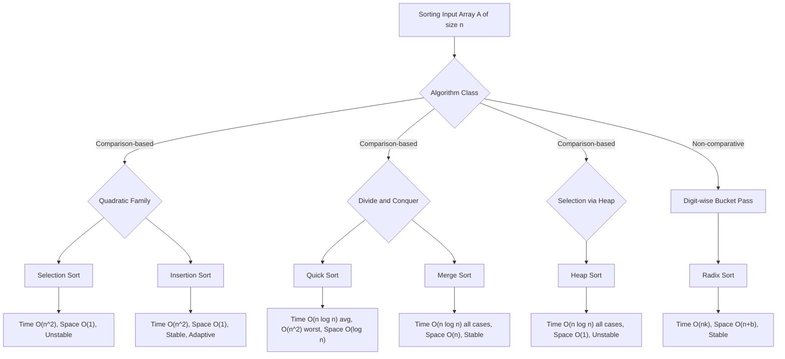
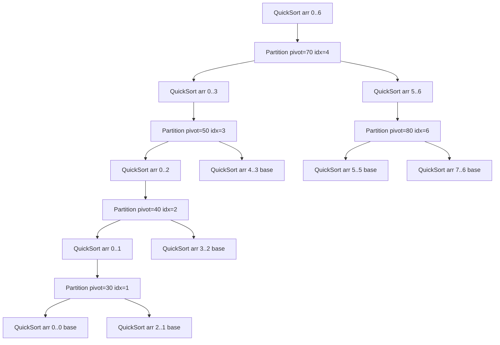
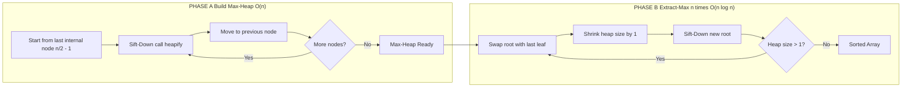
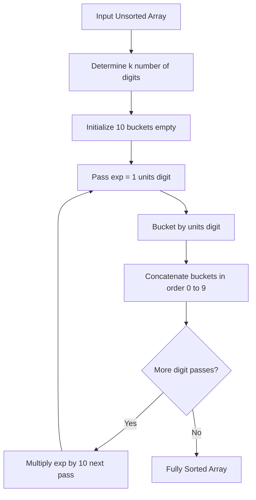

# Sorting Techniques: Selection Sort, Insertion Sort, Quick Sort, Merge Sort, Heap Sort, Radix Sort

<!-- SECTION_1_START -->
# DATA STRUCTURES AND ALGORITHMS — MODULE 4
## Sorting Techniques: Complete KTU 2024 Scheme Guide

> [!NOTE]
> **Formal Definition (KTU 2024 Syllabus Terminology):**
> A **Sorting Algorithm** is a non-trivial, finite sequence of well-defined computational instructions used to rearrange the elements of a list (or array) into a specific order — most commonly **ascending** (non-decreasing, $a_1 \le a_2 \le \dots \le a_n$) or **descending** (non-increasing, $a_1 \ge a_2 \ge \dots \ge a_n$). The ordering relation is governed by a **total order** (a binary relation that is antisymmetric, transitive, and total) on the elements, typically the arithmetic comparison operator $<$ for numeric keys, or lexicographic comparison for strings.

### Conceptual Analogy / Intuition (Plain English)

> [!IMPORTANT]
> **Imagine 6 students standing in a queue, each holding a number card.** Sorting is the process of making them stand in order — from the **smallest card** to the **largest card**. But there are **many different ways** (algorithms) to achieve this ordered line:
>
> 1. **Selection Sort** = Walk through the entire crowd, find the *shortest* student, and place them at the front. Then find the *shortest of the remaining* and place them second. Repeat. (Always picks the *minimum* of the unsorted part.)
> 2. **Insertion Sort** = Like arranging **playing cards in your hand**. You pick the next card and *slide* it leftwards until it finds its correct spot among the already-sorted cards.
> 3. **Quick Sort** = Pick one person as the **"pivot"**. Ask everyone smaller to stand on their **left**, everyone larger to stand on their **right**. Now do the same recursively on the left and right groups. (Divide and Conquer.)
> 4. **Merge Sort** = Split the crowd into pairs, sort each pair. Then merge pairs into sorted groups of 4, then into 8, etc. — like a tournament ladder climbing up.
> 5. **Heap Sort** = Build a **"boss hierarchy"** (a binary heap) where the boss is always the smallest. Promote the boss to the output, then re-elect a new boss. Repeat.
> 6. **Radix Sort** = Don't compare numbers directly. Instead, **sort by the units digit first, then tens digit, then hundreds**, using stable subroutines (like counting sort) at each pass. Like sorting files by birth-date (day, then month, then year).

> [!NOTE]
> **Key Standard Metrics in KTU Board Valuations:**
> - **Time Complexity**: Expressed in **Big-O notation**, $O(f(n))$ — the asymptotic upper bound on the number of primitive operations.
> - **Space Complexity**: Auxiliary memory used, $S(n)$, *excluding* the input array.
> - **In-Place**: A sorting algorithm is **in-place** if it uses $O(1)$ extra memory (only a constant number of extra variables).
> - **Stable**: A sort is **stable** if it preserves the *relative order* of equal-keyed elements. Critical when sorting records by a *secondary* key.
> - **Adaptive**: An algorithm is **adaptive** if its running time improves when the input is already partially sorted.

### Taxonomy of the Six Algorithms (At a Glance)

| Algorithm | Strategy | In-Place? | Stable? | Adaptive? |
| :--- | :--- | :---: | :---: | :---: |
| Selection Sort | Selection | ✅ Yes | ❌ No | ❌ No |
| Insertion Sort | Incremental Insertion | ✅ Yes | ✅ Yes | ✅ Yes |
| Quick Sort | Divide and Conquer (Pivot) | ✅ Yes | ❌ No | ❌ No |
| Merge Sort | Divide and Conquer (Merge) | ❌ No ($O(n)$) | ✅ Yes | ❌ No |
| Heap Sort | Selection using Heap | ✅ Yes | ❌ No | ❌ No |
| Radix Sort | Non-Comparative (Digit Pass) | ❌ No | ✅ Yes | ❌ No |

> [!VISUALIZATION CONTROL]
> **Concept:** Visualising the in-place swap operation in Selection Sort on a 1D number line.
> **GeoGebra / Desmos Input Equations:**
> * `L1: (0, 3), (1, 1), (2, 4), (3, 1), (4, 5), (5, 9), (6, 2)` — point list of (index, value).
> * `f(x) = Polyline({(0, 3), (1, 1), (2, 4), (3, 1), (4, 5), (5, 9), (6, 2)})`
> **Visual Description:** The student should observe a jagged polyline that becomes monotonically non-decreasing after each pass as the minimum element is repeatedly "selected" and swapped into its final position from the left.

<!-- SECTION_1_END -->

<!-- SECTION_2_START -->
# Deep Theoretical Analysis & KTU High-Yield Formula Sheet

## 2.1 Selection Sort — Operational Logic

> [!IMPORTANT]
> **Core Idea:** At iteration $i$ (0-indexed), find the index of the minimum element in the subarray $A[i \dots n-1]$, then swap it with $A[i]$. This grows the **sorted prefix** $A[0 \dots i]$ by one element per pass.

### Why It Works (Proof Sketch)
At the end of iteration $i$, $A[i]$ holds the $(i+1)$-th smallest element of the original array. By induction over $i$, the sorted prefix $A[0 \dots i]$ contains the first $(i+1)$ smallest elements in ascending order. Since the unsorted suffix is never revisited, the algorithm is **correct**.

### KTU Formula Sheet — Master Reference

| Algorithm | Best Case | Average Case | Worst Case | Space | Stable? |
| :--- | :---: | :---: | :---: | :---: | :---: |
| **Selection Sort** | $O(n^2)$ | $O(n^2)$ | $O(n^2)$ | $O(1)$ | ❌ |
| **Insertion Sort** | $O(n)$ | $O(n^2)$ | $O(n^2)$ | $O(1)$ | ✅ |
| **Quick Sort** | $O(n \log n)$ | $O(n \log n)$ | $O(n^2)$ | $O(\log n)$ stack | ❌ |
| **Merge Sort** | $O(n \log n)$ | $O(n \log n)$ | $O(n \log n)$ | $O(n)$ | ✅ |
| **Heap Sort** | $O(n \log n)$ | $O(n \log n)$ | $O(n \log n)$ | $O(1)$ | ❌ |
| **Radix Sort** | $O(n \cdot k)$ | $O(n \cdot k)$ | $O(n \cdot k)$ | $O(n + b)$ | ✅ |

> [!NOTE]
> **Engineering Utility of Sorting in Production Systems:**
> - **Database Indexing:** B-Tree leaf nodes are sorted to enable $O(\log n)$ binary search lookups.
> - **External Memory Sorting:** Merge Sort's $O(n \log n)$ worst-case guarantee and sequential I/O pattern make it the workhorse for sorting files larger than RAM (e.g., GNU `sort`, Hadoop `Terasort`).
> - **Heap Sort's Worst-Case Guarantee:** Used in **embedded systems** and **real-time kernels** (e.g., Linux kernel's `sort` in some subroutines) where a strict $O(n \log n)$ ceiling is mandatory and in-place memory is scarce.
> - **Radix Sort:** Dominates in **integer sorting** and **string suffix sorting** when keys have bounded length (e.g., counting sort for 32-bit IPs in network routers).

### Number of Comparisons
The number of comparisons in **Selection Sort** is independent of input:
$$
C(n) = \sum_{i=0}^{n-2} (n - 1 - i) = \frac{n(n-1)}{2} = \Theta(n^2)
$$
The number of **swaps** in Selection Sort is at most $n - 1$ (one per outer-loop iteration).

### Number of Comparisons in Insertion Sort
$$
C(n) = \sum_{i=1}^{n-1} (i) = \frac{n(n-1)}{2} = \Theta(n^2) \quad \text{(worst case, reverse sorted)}
$$
$$
C(n) = n - 1 = \Theta(n) \quad \text{(best case, already sorted)}
$$

### Master Theorem for Recurrences
For Quick Sort, Merge Sort, and Heap Sort we solve $T(n) = aT(n/b) + f(n)$:
$$
T(n) =
\begin{cases}
O(n^{\log_b a}) & \text{if } f(n) = O(n^{\log_b a - \epsilon}) \\
O(n^{\log_b a} \log n) & \text{if } f(n) = \Theta(n^{\log_b a}) \\
O(f(n)) & \text{if } f(n) = \Omega(n^{\log_b a + \epsilon})
\end{cases}
$$
- **Merge Sort:** $T(n) = 2T(n/2) + O(n)$ → Case 2 → $O(n \log n)$.
- **Quick Sort (avg):** $T(n) = 2T(n/2) + O(n)$ → $O(n \log n)$.

> [!IMPORTANT]
> **Heap Property:** A binary heap is a **complete binary tree** satisfying:
> - **Max-Heap:** $\text{parent}(i) \ge \text{left}(i)$ and $\text{parent}(i) \ge \text{right}(i)$.
> - **Min-Heap:** $\text{parent}(i) \le \text{left}(i)$ and $\text{parent}(i) \le \text{right}(i)$.
>
> For a 0-indexed array, the parent and children are computed in **$O(1)$** as:
> $$\text{parent}(i) = \left\lfloor \frac{i-1}{2} \right\rfloor, \quad \text{left}(i) = 2i + 1, \quad \text{right}(i) = 2i + 2$$

<!-- SECTION_2_END -->

<!-- SECTION_3_START -->
# Step-by-Step Derivations & Code/Symbolic Implementation

## 3.1 Selection Sort — Full Trace

**Input Array:** $A = [29, 10, 14, 37, 13]$

**Pass $i=0$:** Find min in $A[0\dots4] = [29, 10, 14, 37, 13]$. Minimum value $= 10$ at index $1$. Swap $A[0] \leftrightarrow A[1]$.
$$A = [10, 29, 14, 37, 13]$$
**Pass $i=1$:** Find min in $A[1\dots4] = [29, 14, 37, 13]$. Minimum value $= 13$ at index $4$. Swap $A[1] \leftrightarrow A[4]$.
$$A = [10, 13, 14, 37, 29]$$
**Pass $i=2$:** Find min in $A[2\dots4] = [14, 37, 29]$. Minimum value $= 14$ at index $2$. No swap needed.
$$A = [10, 13, 14, 37, 29]$$
**Pass $i=3$:** Find min in $A[3\dots4] = [37, 29]$. Minimum value $= 29$ at index $4$. Swap $A[3] \leftrightarrow A[4]$.
$$A = [10, 13, 14, 29, 37]$$

### Python Implementation — Selection Sort
```python
from typing import List

def selection_sort(arr: List[int]) -> List[int]:
    """
    Sorts a list in ascending order using Selection Sort.
    Time:  O(n^2) — all cases
    Space: O(1) — in-place
    Stable: No
    """
    n: int = len(arr)
    if n <= 1:
        return arr

    for i in range(0, n - 1):
        # Assume the current index holds the minimum
        min_idx: int = i
        # Search the unsorted suffix for a smaller element
        for j in range(i + 1, n):
            if arr[j] < arr[min_idx]:
                min_idx = j
        # Boundary check: only swap if a new minimum was found
        if min_idx != i:
            arr[i], arr[min_idx] = arr[min_idx], arr[i]
    return arr


# --- Trace demonstration ---
if __name__ == "__main__":
    sample: List[int] = [29, 10, 14, 37, 13]
    print(f"Original : {sample}")
    selection_sort(sample)
    print(f"Sorted   : {sample}")
```

---

## 3.2 Insertion Sort — Full Trace

**Input Array:** $A = [12, 11, 13, 5, 6]$

**Iter $i=1$:** Key $= A[1] = 11$. Compare with $A[0] = 12$. $12 > 11$ → shift right. $A = [12, 11, 13, 5, 6]$. Insert $11$ at index 0. $A = [11, 12, 13, 5, 6]$.

**Iter $i=2$:** Key $= A[2] = 13$. Compare with $A[1] = 12$. $12 \le 13$ → no shift. $A = [11, 12, 13, 5, 6]$.

**Iter $i=3$:** Key $= A[3] = 5$. Shift $13, 12, 11$ right. $A = [11, 12, 13, 13, 6] \rightarrow [12, 12, 13, 13, 6] \rightarrow [11, 11, 12, 13, 6]$. Insert $5$ at index 0. $A = [5, 11, 12, 13, 6]$.

**Iter $i=4$:** Key $= A[4] = 6$. Shift $13, 12, 11$ right. Insert $6$ at index 1. $A = [5, 6, 11, 12, 13]$.

### Python Implementation — Insertion Sort
```python
from typing import List

def insertion_sort(arr: List[int]) -> List[int]:
    """
    Sorts a list in ascending order using Insertion Sort.
    Time:  O(n) best, O(n^2) avg/worst
    Space: O(1) — in-place
    Stable: Yes (uses <, not <=, when shifting)
    """
    n: int = len(arr)
    for i in range(1, n):
        key: int = arr[i]
        j: int = i - 1
        # Strict < keeps stability (equal keys stay in original order)
        while j >= 0 and arr[j] > key:
            arr[j + 1] = arr[j]
            j -= 1
        arr[j + 1] = key
    return arr
```

---

## 3.3 Quick Sort — Partition Derivation (Lomuto Scheme)

**Input Array:** $A = [10, 80, 30, 90, 40, 50, 70]$, pivot $= A[\text{high}] = 70$.

We use two indices: $i$ tracks the **boundary of the "≤ pivot" region**, and $j$ scans forward.

| Step $j$ | $A[j]$ | Action | $i$ after | Array State |
| :---: | :---: | :--- | :---: | :--- |
| 0 | 10 | $10 \le 70$ → $i=0$, swap $A[0],A[0]$; $i \leftarrow 1$ | 1 | [10, 80, 30, 90, 40, 50, 70] |
| 1 | 80 | $80 > 70$ → no action | 1 | [10, 80, 30, 90, 40, 50, 70] |
| 2 | 30 | $30 \le 70$ → swap $A[1],A[2]$; $i \leftarrow 2$ | 2 | [10, 30, 80, 90, 40, 50, 70] |
| 3 | 90 | $90 > 70$ → no action | 2 | [10, 30, 80, 90, 40, 50, 70] |
| 4 | 40 | $40 \le 70$ → swap $A[2],A[4]$; $i \leftarrow 3$ | 3 | [10, 30, 40, 90, 80, 50, 70] |
| 5 | 50 | $50 \le 70$ → swap $A[3],A[5]$; $i \leftarrow 4$ | 4 | [10, 30, 40, 50, 80, 90, 70] |
| — | — | Final swap $A[4], A[6]$ (pivot to position $i$) | 4 | [10, 30, 40, 50, **70**, 90, 80] |

Pivot $70$ settles at index 4. Left subarray $A[0\dots3] = [10, 30, 40, 50]$ is all $\le 70$. Right subarray $A[5\dots6] = [90, 80]$ is all $> 70$. **Recurse on both.**

### Python Implementation — Quick Sort (Lomuto Partition)
```python
from typing import List

def _partition(arr: List[int], low: int, high: int) -> int:
    """Lomuto partition: returns the final index of the pivot."""
    pivot: int = arr[high]          # Choose rightmost as pivot
    i: int = low - 1                # Boundary of "<= pivot" region
    for j in range(low, high):
        if arr[j] <= pivot:         # Strictly <= ensures all equal elements sit left
            i += 1
            arr[i], arr[j] = arr[j], arr[i]
    arr[i + 1], arr[high] = arr[high], arr[i + 1]
    return i + 1


def quick_sort(arr: List[int], low: int = 0, high: int | None = None) -> List[int]:
    if high is None:
        high = len(arr) - 1
    if low < high:
        p: int = _partition(arr, low, high)
        quick_sort(arr, low, p - 1)   # Sort left partition
        quick_sort(arr, p + 1, high)  # Sort right partition
    return arr
```

---

## 3.4 Merge Sort — Recursive Derivation

**Input Array:** $A = [38, 27, 43, 3, 9, 82, 10]$

**Divide Tree:**
$$
\begin{aligned}
[38, 27, 43, 3, 9, 82, 10] \;&\to\; [38, 27, 43, 3] \;\text{and}\; [9, 82, 10] \\
[38, 27, 43, 3] \;&\to\; [38, 27] \;\text{and}\; [43, 3] \\
[38, 27] \;&\to\; [38] \;\text{and}\; [27] \\
[43, 3] \;&\to\; [43] \;\text{and}\; [3] \\
[9, 82, 10] \;&\to\; [9, 82] \;\text{and}\; [10] \\
[9, 82] \;&\to\; [9] \;\text{and}\; [82]
\end{aligned}
$$

**Merge Tree (Bottom-Up):**
$$
\begin{aligned}
[38] \cup [27] &= [27, 38] \\
[43] \cup [3] &= [3, 43] \\
[9] \cup [82] &= [9, 82] \\
[27, 38] \cup [3, 43] &= [3, 27, 38, 43] \quad \text{(linear merge)} \\
[9, 82] \cup [10] &= [9, 10, 82] \quad \text{(linear merge)} \\
[3, 27, 38, 43] \cup [9, 10, 82] &= [3, 9, 10, 27, 38, 43, 82]
\end{aligned}
$$

**Linear Merge Cost:** Each merge of two subarrays of total size $m$ takes $\Theta(m)$ comparisons and writes. Since the recursion has $\lceil \log_2 n \rceil$ levels, total cost is $n \cdot \lceil \log_2 n \rceil = \Theta(n \log n)$.

### Python Implementation — Merge Sort
```python
from typing import List

def _merge(left: List[int], right: List[int]) -> List[int]:
    """Stable linear-time merge of two sorted lists."""
    merged: List[int] = []
    i: int = j: int = 0
    while i < len(left) and j < len(right):
        # <= preserves stability: left's element wins on tie
        if left[i] <= right[j]:
            merged.append(left[i]); i += 1
        else:
            merged.append(right[j]); j += 1
    merged.extend(left[i:])
    merged.extend(right[j:])
    return merged


def merge_sort(arr: List[int]) -> List[int]:
    if len(arr) <= 1:
        return arr
    mid: int = len(arr) // 2
    left: List[int]  = merge_sort(arr[:mid])
    right: List[int] = merge_sort(arr[mid:])
    return _merge(left, right)
```

---

## 3.5 Heap Sort — Heapify & Sort Trace

**Input Array:** $A = [4, 10, 3, 5, 1]$, build a **Max-Heap**.

**Heapify from $i = \lfloor n/2 \rfloor - 1 = 1$ down to $0$:**

- **$i=1$ (value $10$):** Children are $A[3]=5, A[4]=1$. Largest $= 10$ (self). No swap. Array: $[4, 10, 3, 5, 1]$.
- **$i=0$ (value $4$):** Children are $A[1]=10, A[2]=3$. Largest $= 10$ at index 1. Swap $A[0] \leftrightarrow A[1]$. Array: $[10, 4, 3, 5, 1]$. Recursively heapify at $i=1$: largest is $5$ at index 3, swap. Array: $[10, 5, 3, 4, 1]$.

**Max-Heap built:** $[10, 5, 3, 4, 1]$.

**Sort Phase — Repeated Swap-Root-with-Last + Heapify:**

| Pass | Action | Array State |
| :---: | :--- | :--- |
| 1 | Swap $A[0]=10 \leftrightarrow A[4]=1$; heapify root over $[5, 4, 3]$ | $[5, 4, 3, 1, \mathbf{10}]$ |
| 2 | Swap $A[0]=5 \leftrightarrow A[3]=1$; heapify root over $[4, 3]$ | $[4, 1, 3, \mathbf{5}, 10]$ |
| 3 | Swap $A[0]=4 \leftrightarrow A[2]=3$; heapify root over $[1, 3]$ | $[3, 1, \mathbf{4}, 5, 10]$ |
| 4 | Swap $A[0]=3 \leftrightarrow A[1]=1$; heapify root over $[1]$ | $[1, \mathbf{3}, 4, 5, 10]$ |

**Sorted:** $[1, 3, 4, 5, 10]$.

### Python Implementation — Heap Sort
```python
from typing import List

def _heapify(arr: List[int], n: int, root: int) -> None:
    """Max-heapify subtree rooted at `root` within arr[0..n-1]."""
    largest: int = root
    left: int  = 2 * root + 1
    right: int = 2 * root + 2
    if left < n and arr[left] > arr[largest]:
        largest = left
    if right < n and arr[right] > arr[largest]:
        largest = right
    if largest != root:
        arr[root], arr[largest] = arr[largest], arr[root]
        _heapify(arr, n, largest)


def heap_sort(arr: List[int]) -> List[int]:
    n: int = len(arr)
    # Phase 1: build max-heap (Floyd's bottom-up, O(n))
    for i in range(n // 2 - 1, -1, -1):
        _heapify(arr, n, i)
    # Phase 2: extract max repeatedly (n log n)
    for end in range(n - 1, 0, -1):
        arr[0], arr[end] = arr[end], arr[0]
        _heapify(arr, end, 0)
    return arr
```

---

## 3.6 Radix Sort — LSD Pass-by-Pass Trace

**Input Array:** $A = [170, 45, 75, 90, 802, 24, 2, 66]$, base $b = 10$, $k = 3$ digit passes.

**Pass 1 — Units digit** (digit $d = A[i] \mod 10$):
- Buckets: $0:[]$, $1:[]$, $2:[2]$, $3:[]$, $4:[24]$, $5:[45, 75]$, $6:[66]$, $7:[]$, $8:[]$, $9:[]$
- After concat: $[2, 24, 45, 75, 66, 170, 90, 802]$ *(order within buckets is insertion order → stability)*

**Pass 2 — Tens digit** ($d = \lfloor A[i]/10 \rfloor \mod 10$):
- Buckets: $0:[802, 90]$, $2:[2, 24]$, $4:[45]$, $6:[66]$, $7:[75]$, $8:[]$, $1:[170]$
- After concat: $[802, 90, 2, 24, 45, 66, 75, 170]$

**Pass 3 — Hundreds digit** ($d = \lfloor A[i]/100 \rfloor \mod 10$):
- Buckets: $0:[2, 24, 45, 66, 75, 90]$, $1:[170]$, $8:[802]$
- After concat: $[2, 24, 45, 66, 75, 90, 170, 802]$ ✅ **Sorted.**

### Python Implementation — Radix Sort
```python
from typing import List

def _counting_sort_by_digit(arr: List[int], exp: int) -> None:
    """Stable sort by digit at place value `exp` (10^exp)."""
    n: int = len(arr)
    output: List[int] = [0] * n
    count: List[int]  = [0] * 10  # base 10

    # Histogram of digits
    for i in range(n):
        digit: int = (arr[i] // exp) % 10
        count[digit] += 1
    # Prefix sum for stable positioning
    for d in range(1, 10):
        count[d] += count[d - 1]
    # Build output in reverse to preserve stability
    for i in range(n - 1, -1, -1):
        digit: int = (arr[i] // exp) % 10
        count[digit] -= 1
        output[count[digit]] = arr[i]
    # Copy back
    for i in range(n):
        arr[i] = output[i]


def radix_sort(arr: List[int]) -> List[int]:
    if not arr:
        return arr
    max_val: int = max(arr)
    exp: int = 1
    while max_val // exp > 0:
        _counting_sort_by_digit(arr, exp)
        exp *= 10
    return arr
```

> [!IMPORTANT]
> **Total Cost of Radix Sort:**
> $$T(n, k, b) = \Theta\left( k \cdot (n + b) \right)$$
> where $n$ = number of elements, $k$ = number of digit passes, $b$ = base (typically 10 or $2^{16}$). When $k = O(\log n)$ and $b = O(n)$, this becomes $O(n \log n)$.

<!-- SECTION_3_END -->

<!-- SECTION_4_START -->
# Structural Diagrams & Schematics

## 4.1 Master Comparison Flowchart of All Six Algorithms



## 4.2 Quick Sort Recursion Topology



## 4.3 Heap Sort Pipeline (Build → Sort Phase)



## 4.4 Radix Sort Digit Pass Topology



## 4.5 Sequential Processing Topology Matrix

| Stage | Selection | Insertion | Quick | Merge | Heap | Radix |
| :---: | :---: | :---: | :---: | :---: | :---: | :---: |
| 1. Initial State | Unsorted $A$ | Unsorted $A$ | Unsorted $A$ | Unsigned $A$ | Unsigned $A$ | Unsigned $A$ |
| 2. Key Operation | Min-scan | Shift-right | Partition | Recursive split | Heapify | Bucket |
| 3. Sub-problem | Find min index | Insert key | Subarrays $\le p, >p$ | Half-arrays | Root subtree | Digit $d$ |
| 4. Combine Step | Swap to front | Place at gap | Recurse | Linear merge | Swap root | Concatenate |
| 5. Termination | $i = n-2$ | $i = n-1$ | Base size 1 | Single array | Heap size 1 | $k$ passes done |
| 6. Output | Sorted in place | Sorted in place | Sorted in place | New sorted array | Sorted in place | Sorted in place |

<!-- SECTION_4_END -->

<!-- SECTION_5_START -->
# KTU 2024 Scheme Examination Question Bank & Topic Recap

---

## Part A — Short Answer Questions (3 Marks Each)

### Question 1 [KTU University Exam - July 2024] — *CO1, Remember*

**"Define stable sorting. Give one example of a stable and one unstable sort from your syllabus."**

**Model Answer (3 Marks):**
A sorting algorithm is called **stable** if it preserves the relative order of records with equal keys in the input. **[1 Mark]**

- **Stable example:** Merge Sort — during merging, when elements from the left and right subarrays are equal, the element from the **left** subarray is placed first, preserving the original order. **[1 Mark]**
- **Unstable example:** Quick Sort — the Lomuto/Hoare partition scheme swaps equal elements across the pivot boundary in non-deterministic order, destroying the original relative order of equal keys. **[1 Mark]**

---

### Question 2 [KTU University Exam - Dec 2023] — *CO1, Understand*

**"Why is Heap Sort preferred over Merge Sort when memory is a constraint? Justify with time and space complexity."**

**Model Answer (3 Marks):**
Heap Sort is preferred in memory-constrained environments because it is **in-place**, requiring only $O(1)$ auxiliary memory beyond the input array. **[1 Mark]**
In contrast, Merge Sort requires $O(n)$ auxiliary memory to hold the two subarrays during merging. **[1 Mark]**
However, both share the same asymptotic time complexity of $O(n \log n)$ in all cases (best, average, worst), so Heap Sort trades Merge Sort's stability for memory efficiency. **[1 Mark]**

---

## Part B — Long Answer Questions (14 Marks Each, Module Internal Choice)

---

### Question A (14 Marks) [KTU University Exam - Dec 2023] — *CO2, Apply + Analyze*

**A.** Sort the array $A = [27, 38, 43, 3, 9, 82, 10]$ using **Merge Sort**. Show all recursive splits and merges, and write the complete algorithm with time complexity derivation. **(7 Marks)**

**B.** Sort the array $A = [4, 10, 3, 5, 1]$ using **Heap Sort**. Show the max-heap construction phase and the sort phase step-by-step. Compare Heap Sort with Merge Sort on the basis of stability, in-place property, and worst-case complexity. **(7 Marks)**

---

#### Part A (a) — Merge Sort Trace (7 Marks)

**Step 1 — Recursive Splitting Tree:** `[Valuation: 2 Marks]`
$$
\begin{aligned}
[27, 38, 43, 3, 9, 82, 10] &\to [27, 38, 43, 3] \;\&\; [9, 82, 10] \\
[27, 38, 43, 3] &\to [27, 38] \;\&\; [43, 3] \to [27] \;\&\; [38] \;\&\; [43] \;\&\; [3] \\
[9, 82, 10] &\to [9, 82] \;\&\; [10] \to [9] \;\&\; [82] \;\&\; [10]
\end{aligned}
$$

**Step 2 — Base Case:** Singletons are trivially sorted. `[1 Mark]`

**Step 3 — Merge Phase (Bottom-Up):** `[Valuation: 3 Marks]`
$$
\begin{aligned}
[27] \cup [38] &= [27, 38] \\
[43] \cup [3] &= [3, 43] \\
[9] \cup [82] &= [9, 82] \\
[27, 38] \cup [3, 43] &= [3, 27, 38, 43] \\
[9, 82] \cup [10] &= [9, 10, 82] \\
[3, 27, 38, 43] \cup [9, 10, 82] &= [3, 9, 10, 27, 38, 43, 82] \quad \text{✅ Sorted}
\end{aligned}
$$

**Step 4 — Time Complexity Derivation:** `[Valuation: 1 Mark]`
The recurrence is $T(n) = 2T(n/2) + \Theta(n)$ (merging two halves of size $n/2$ takes $\Theta(n)$). By the Master Theorem, Case 2 applies: $T(n) = \Theta(n \log n)$.

---

#### Part B (b) — Heap Sort Trace + Comparison (7 Marks)

**Step 1 — Build Max-Heap from $A = [4, 10, 3, 5, 1]$:** `[Valuation: 2 Marks]`

- Heapify $i=1$ (value $10$): children $[5, 1]$. Largest $= 10$ (self). No change.
- Heapify $i=0$ (value $4$): children $[10, 3]$. Largest $= 10$ at index 1. Swap → $[10, 4, 3, 5, 1]$.
- Recursive heapify at $i=1$: children of $4$ are $[5, 1]$. Largest $= 5$ at index 3. Swap → $[10, 5, 3, 4, 1]$.

**Max-Heap built:** $[10, 5, 3, 4, 1]$.

**Step 2 — Sort Phase:** `[Valuation: 2 Marks]`

| Pass | Action | Resulting Array |
| :---: | :--- | :--- |
| 1 | Swap root $10$ with last $1$; heapify | $[5, 4, 3, 1, \mathbf{10}]$ |
| 2 | Swap root $5$ with last $1$; heapify | $[4, 1, 3, \mathbf{5}, 10]$ |
| 3 | Swap root $4$ with last $3$; heapify | $[3, 1, \mathbf{4}, 5, 10]$ |
| 4 | Swap root $3$ with last $1$; heapify | $[1, \mathbf{3}, 4, 5, 10]$ |

**Sorted Output:** $[1, 3, 4, 5, 10]$.

**Step 3 — Comparison Table:** `[Valuation: 2 Marks]`

| Property | Heap Sort | Merge Sort |
| :--- | :---: | :---: |
| Stability | ❌ Unstable | ✅ Stable |
| In-Place | ✅ Yes ($O(1)$) | ❌ No ($O(n)$) |
| Worst-Case Time | $O(n \log n)$ | $O(n \log n)$ |
| Best-Case Time | $O(n \log n)$ | $O(n \log n)$ |
| Use Case | Embedded, real-time | External sort, stable sort needed |

**Final Remark:** `[1 Mark]` Both have identical asymptotic bounds, but Heap Sort wins on memory, while Merge Sort wins on stability and external-sorting friendliness.

---

### Question B (14 Marks) [KTU University Exam - July 2024] — *CO2, Apply + Analyze*

**A.** Sort the array $A = [29, 10, 14, 37, 13]$ using **Quick Sort** (Lomuto partition, last element as pivot). Show all partition steps. Derive its **average-case** time complexity. **(7 Marks)**

**B.** Sort the array $A = [170, 45, 75, 90, 802, 24, 2, 66]$ using **Radix Sort** (base 10, LSD). Show the state of the array after each digit pass. Why is the underlying subroutine (counting sort) required to be **stable**? **(7 Marks)**

---

#### Part A (a) — Quick Sort Trace + Derivation (7 Marks)

**Step 1 — Initial Call:** `quick_sort(0, 4)`, pivot $= A[4] = 13$. `[Valuation: 1 Mark for pivot selection]`

**Step 2 — Partition Steps (Lomuto):** `[Valuation: 3 Marks]`

| $j$ | $A[j]$ | $A[j] \le 13$? | $i$ update | Array after swap (if any) |
| :---: | :---: | :---: | :---: | :--- |
| 0 | 29 | No | 0 → 0 | $[29, 10, 14, 37, 13]$ |
| 1 | 10 | Yes | 0 → 1, swap $A[0], A[1]$ | $[10, 29, 14, 37, 13]$ |
| 2 | 14 | No | 1 → 1 | $[10, 29, 14, 37, 13]$ |
| 3 | 37 | No | 1 → 1 | $[10, 29, 14, 37, 13]$ |

**Final swap:** $A[i+1] = A[2]$ with $A[4] = 13$ (pivot). Result: $[10, 13, 14, 37, 29]$. Pivot $13$ settles at index $1$.

**Step 3 — Recursive Calls:**
- `quick_sort(0, 0)` — base case, returns.
- `quick_sort(2, 4)`: pivot $= A[4] = 29$. Partition yields $14$ at index 2, $29$ at index 3, $37$ at index 4. → $[10, 13, 14, 29, 37]$ ✅ Sorted. `[1 Mark]`

**Step 4 — Average-Case Derivation:** `[Valuation: 2 Marks]`
For random uniform input, every element is equally likely to be the pivot. Let $T(n)$ be the average time:
$$
T(n) = \frac{1}{n} \sum_{k=0}^{n-1} \left[ T(k) + T(n-1-k) \right] + \Theta(n)
$$
Using symmetry and solving the recurrence (or by Master Theorem with $a=2, b=2, f(n)=n$):
$$
T(n) = \Theta(n \log n) \quad \text{(Average Case)} \quad \blacksquare
$$

---

#### Part B (b) — Radix Sort Trace + Stability Justification (7 Marks)

**Step 1 — Determine number of passes:** Max value $= 802$ has $3$ digits, so $k = 3$ passes. `[1 Mark]`

**Step 2 — Pass 1 (Units Digit, $d = A[i] \mod 10$):** `[Valuation: 2 Marks]`
- Bucket 0: `[170, 90]`
- Bucket 2: `[802, 2]`
- Bucket 4: `[24]`
- Bucket 5: `[45]`
- Bucket 6: `[66]`
- Bucket 7: `[75]`

After Pass 1: `[170, 90, 802, 2, 24, 45, 66, 75]`

**Step 3 — Pass 2 (Tens Digit, $d = \lfloor A[i]/10 \rfloor \mod 10$):** `[Valuation: 2 Marks]`
- Bucket 0: `[02, 802, 90]`
- Bucket 2: `[24]`
- Bucket 4: `[45]`
- Bucket 6: `[66]`
- Bucket 7: `[75]`
- Bucket 1: `[170]`

After Pass 2: `[2, 802, 90, 24, 45, 66, 75, 170]`

**Step 4 — Pass 3 (Hundreds Digit, $d = \lfloor A[i]/100 \rfloor \mod 10$):** `[Valuation: 1 Mark]`
- Bucket 0: `[2, 24, 45, 66, 75, 90]`
- Bucket 1: `[170]`
- Bucket 8: `[802]`

After Pass 3: `[2, 24, 45, 66, 75, 90, 170, 802]` ✅ **Sorted**

**Step 5 — Why stability is required:** `[Valuation: 1 Mark]`
The correctness of Radix Sort depends on the invariant: *after the $d$-th pass, elements are sorted according to their last $d$ digits.* For this invariant to hold when we move to the $(d+1)$-th pass, equal digits at position $d+1$ must retain their relative order from pass $d$ — otherwise, the ordering established by lower-order digits gets scrambled. Hence the underlying counting sort **must be stable**.

> [!WARNING]
> **KTU Examiner's Valuation Warning / Common Pitfalls:**
> 1. **Forgetting the empty-bucket bucket index in Radix Sort traces** — students often skip writing empty buckets like `Bucket 1, 3, 8, 9` which were empty in a given pass. Loss: **0.5–1 Mark**.
> 2. **Using `<=` vs `<` in Insertion Sort** — using `>=` instead of `>` in the shift condition makes the algorithm unstable. Loss: **1 Mark** if question specifically tests stability.
> 3. **Forgetting the recursion-tree diagram in Merge Sort** — only showing the final array without intermediate splits and merges loses **2–3 Marks**.
> 4. **Saying Quick Sort is always $O(n \log n)$** — without mentioning the **worst-case $O(n^2)$** on already-sorted input with last-element pivot, valuation key deducts **1 Mark**.
> 5. **In Heap Sort, not labeling the Build phase vs Sort phase** separately — examiners expect two clearly demarcated phases in the answer.
> 6. **In Radix Sort, not stating $k$ (number of passes) explicitly** — leads to a deduction because the boundary of the algorithm is unclear.

---

## 📌 Topic Recap & Important Things to Remember

> [!IMPORTANT]
> **Rapid-Revision Checklist for Module 4 — Sorting Techniques**

### 🔑 Key Definitions
- **Sorting:** Rearranging elements of a list into a monotonically non-decreasing or non-increasing sequence governed by a **total order**.
- **In-Place Sort:** Uses $O(1)$ auxiliary memory (Selection, Insertion, Quick, Heap).
- **Stable Sort:** Preserves relative order of equal keys (Insertion, Merge, Radix).
- **Adaptive Sort:** Faster on partially sorted input (Insertion only).
- **Total Order:** Binary relation that is antisymmetric, transitive, and total.
- **Pivot:** A chosen element in Quick Sort used to partition the array into "less than" and "greater than" subarrays.
- **Heap:** A complete binary tree satisfying the heap property (max or min).
- **Heapify:** Restoring the heap property at a given node by recursively sifting the larger child upward.
- **Radix:** The base $b$ of the numeral system (typically 10 in LSD radix sort).
- **LSD vs MSD:** Least Significant Digit (right-to-left) vs Most Significant Digit (left-to-right) digit-pass strategy.
- **External Sort:** A sort that uses secondary storage (e.g., tape/disk) — Merge Sort is the canonical example.
- **Internal Sort:** A sort that fits entirely in RAM.

### 🧮 Critical Formulas and Recurrences
- **Comparisons in Selection Sort:** $C(n) = \frac{n(n-1)}{2} = \Theta(n^2)$.
- **Comparisons in Insertion Sort:** $C_{\text{best}}(n) = n - 1$; $C_{\text{worst}}(n) = \frac{n(n-1)}{2}$.
- **Merge Sort Recurrence:** $T(n) = 2T(n/2) + \Theta(n) \Rightarrow T(n) = \Theta(n \log n)$.
- **Quick Sort Worst Case:** Already sorted + bad pivot → $T(n) = T(n-1) + \Theta(n) \Rightarrow O(n^2)$.
- **Quick Sort Average Case:** Random pivot → $T(n) = \Theta(n \log n)$.
- **Heap Sort Recurrence:** $T(n) = T(n-1) + \Theta(\log n) \Rightarrow T(n) = \Theta(n \log n)$.
- **Heapify Cost:** $O(\log n)$ per call. Build-Heap: $O(n)$ (Floyd's bottom-up method).
- **Radix Sort Total Cost:** $\Theta(k \cdot (n + b))$ where $b$ is the base.
- **Master Theorem:** $T(n) = aT(n/b) + f(n)$ with three cases for $f(n)$ vs $n^{\log_b a}$.

### ⚙️ Key Properties Comparison
| Property | Selection | Insertion | Quick | Merge | Heap | Radix |
| :--- | :---: | :---: | :---: | :---: | :---: | :---: |
| **Time (Best)** | $O(n^2)$ | $O(n)$ | $O(n \log n)$ | $O(n \log n)$ | $O(n \log n)$ | $O(nk)$ |
| **Time (Worst)** | $O(n^2)$ | $O(n^2)$ | $O(n^2)$ | $O(n \log n)$ | $O(n \log n)$ | $O(nk)$ |
| **Space** | $O(1)$ | $O(1)$ | $O(\log n)$ | $O(n)$ | $O(1)$ | $O(n+b)$ |
| **Stable** | ❌ | ✅ | ❌ | ✅ | ❌ | ✅ |
| **In-Place** | ✅ | ✅ | ✅ | ❌ | ✅ | ❌ |
| **Adaptive** | ❌ | ✅ | ❌ | ❌ | ❌ | ❌ |

### 🧠 Engineering & Real-World Applications
- **Selection Sort** → Rarely used in production; pedagogical value only.
- **Insertion Sort** → Used for **small arrays** ($n \le 16$) inside hybrid algorithms (e.g., Timsort, Introsort, V8 engine's sort).
- **Quick Sort** → Default in many standard libraries (C `qsort`, older Java `Arrays.sort`) due to cache-friendly $O(n \log n)$ avg.
- **Merge Sort** → Dominates **external sorting** (sorting files larger than RAM); used in **Timsort** (Python, Java 7+, V8).
- **Heap Sort** → Used in **embedded/real-time** systems requiring strict $O(n \log n)$ worst-case with $O(1)$ extra space.
- **Radix Sort** → Dominates **integer and string sorting** with bounded key length (e.g., **32-bit IP address** sorting, **suffix array** construction).

### 🎯 Exam-Time High-Yield Traps
1. **Quick Sort worst case** is triggered by already-sorted input + last-element pivot.
2. **Merge Sort needs $O(n)$ auxiliary memory** — this is its only major drawback.
3. **Heap Sort build phase is $O(n)$, not $O(n \log n)$** — Floyd's bottom-up trick.
4. **Radix Sort is NOT comparison-based**, which is why it can beat the $\Omega(n \log n)$ lower bound for comparison sorts.
5. **Counting Sort stability comes from iterating the input array in reverse** during the output-build step.
6. **Heap Sort is NOT stable** because swapping the root with the last leaf can rearrange equal-keyed elements.
7. **The recursion depth of Merge Sort is $\lceil \log_2 n \rceil$**; for $n = 10^6$, that's only $\approx 20$ stack frames.

<!-- SECTION_5_END -->
