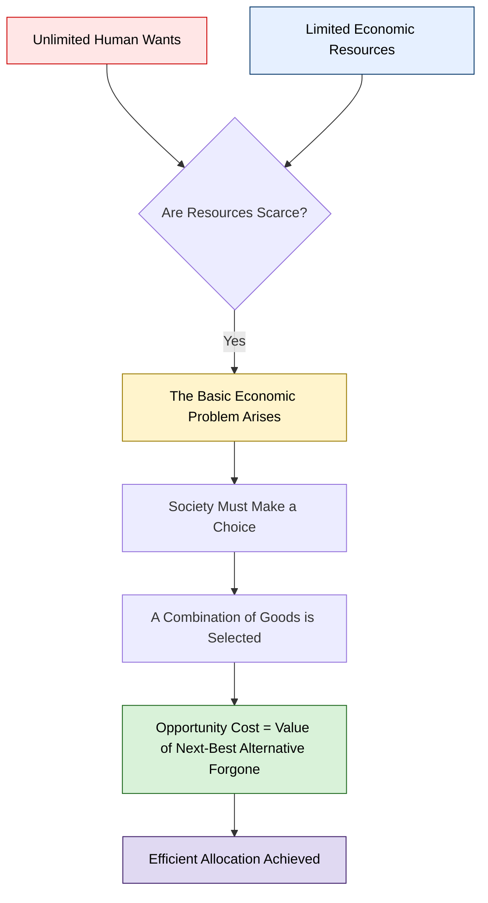
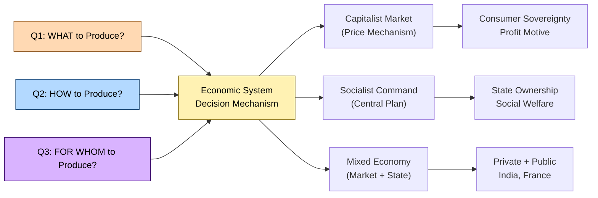
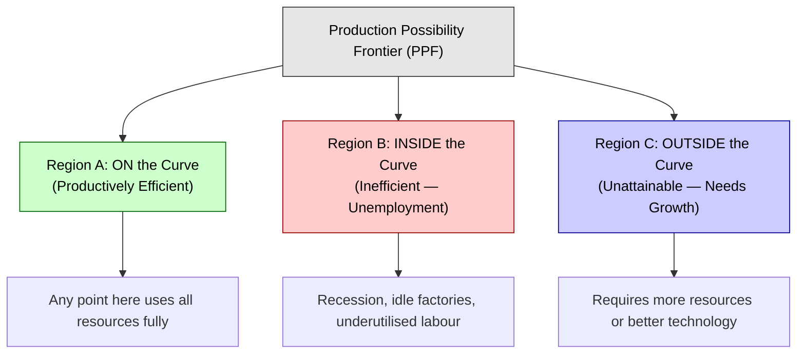
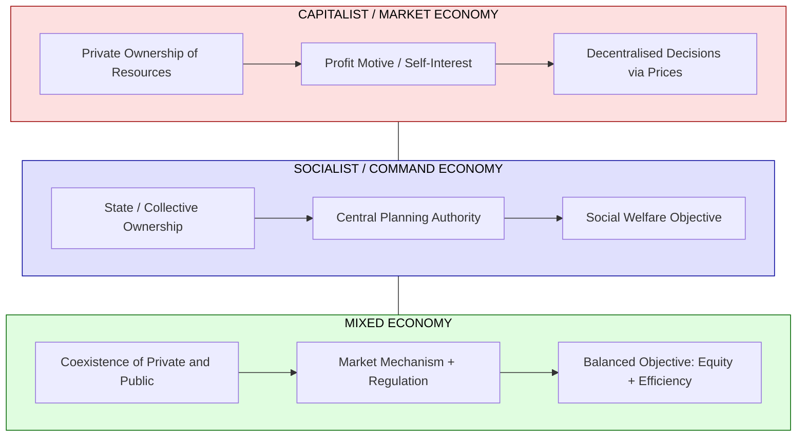
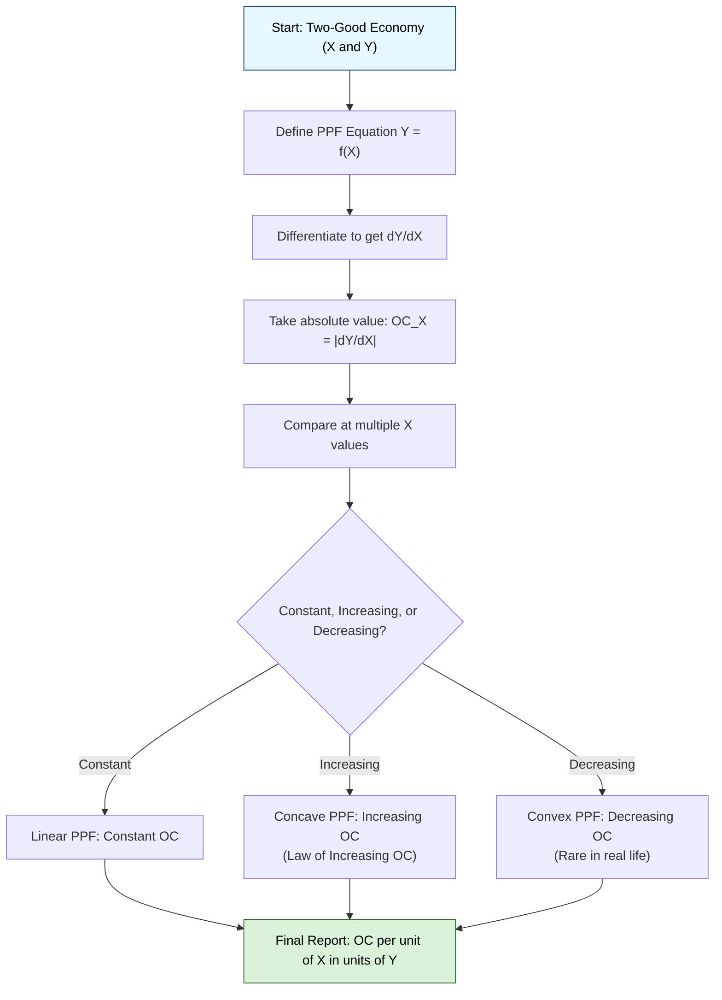

# Basic economic problems

<!-- SECTION_1_START -->

# 1. Core Technical Definition & Intuitive Overview

## 1.1 Formal Academic Definition (KTU 2024 Syllabus Terminology)

**Economics** is the social science that studies how individuals, firms, governments, and entire societies allocate **scarce resources** to satisfy **unlimited human wants**. The term is derived from the Greek word *oikonomikos*, meaning "household management."

> [!IMPORTANT]
> **Core Definition (KTU Board-Approved Wording)**
> Economics is the science of choice under conditions of scarcity — the study of how people decide what to produce, how to produce, and for whom to produce, given limited resources and competing wants.

The **Basic Economic Problem** is therefore universal and arises wherever the following two conditions exist simultaneously:

1. **Unlimited (Insatiable) Human Wants** — wants for goods, services, leisure, security, status, etc.
2. **Limited (Scarce) Economic Resources** — land, labour, capital, and entrepreneurship (the **Factors of Production**).

Because resources are **finite** but wants are **infinite**, society can never fulfil every want. This gap — between what is desired and what is achievable — is the **scarcity problem**, the very reason economics exists as a discipline.

> [!NOTE]
> **Key Syllabus Tag — UCHUT346 / Module 1**
> The KTU 2024 Scheme expects students to (a) state the basic economic problem, (b) identify the three central questions, (c) compare economic systems, and (d) apply scarcity, choice, and opportunity-cost reasoning to engineering/business decisions.

## 1.2 Conceptual Analogy / Intuition

Imagine a **single engineering student, Anu**, who has **₹500** and a **Saturday afternoon** (≈6 hours). She wants simultaneously to:

- Buy a robotics kit (₹500, 0 hours),
- Watch a movie with friends (₹300, 3 hours),
- Study for Monday's compiler-design exam (0 ₹, 5 hours),
- Repair her bicycle (₹150, 2 hours).

She cannot do **all four** because her **money and time are both scarce**. She must **choose** a combination, and whatever she gives up is her **opportunity cost**.

> [!TIP]
> **The Anu Analogy**
> • **Wants** = the four desires above (unlimited).
> • **Resources** = ₹500 and 6 hours (limited).
> • **Scarcity** = the gap between the two.
> • **Choice** = the combination she finally picks.
> • **Opportunity Cost** = the value of the next-best alternative she sacrifices.
> This is the **exact same logic** a country, a company, or an engineer faces every day.

## 1.3 The Three Central Questions of an Economy

Every economic system — whether run by a household, a firm, or a state — must answer three questions (sometimes a fourth is added):

| # | Central Question | Engineering / Real-World Parallel | Decision-Maker |
|---|---|---|---|
| **Q1** | **What** goods and services to produce, and **in what quantity**? | Which features go into the next smartphone model — camera or battery? | Central planners, managers, consumers |
| **Q2** | **How** to produce them? (Which technique, which inputs, which technology?) | Manual welding vs. robotic welding in a fabrication shop? | Firms, engineers |
| **Q3** | **For Whom** to produce? (Who gets the output?) | Luxury SUV vs. mass-market hatchback — who is the customer? | Market mechanism, government |
| **Q4*** | **How efficiently** are resources being used? (Sometimes added as a fourth question) | OEE (Overall Equipment Effectiveness) in a factory | Economists, auditors |

> [!IMPORTANT]
> **KTU Board Tip**
> Most KTU model answers expect the **three-question form** (What, How, For Whom). If the question is worth **7 marks or more**, you must **define each question with one real-life example** — that is a guaranteed valuation bracket.

## 1.4 Factors of Production (Resources)

Resources are the inputs used to produce goods and services. They are conventionally classified into **four** categories:

$$\text{Factors of Production} = \{\text{Land},\ \text{Labour},\ \text{Capital},\ \text{Entrepreneurship}\}$$

- **Land** — all natural resources (soil, water, minerals, sunlight, geography). Reward = **Rent**.
- **Labour** — physical and mental human effort. Reward = **Wages**.
- **Capital** — man-made aids to production (machinery, tools, factories, NOT money). Reward = **Interest**.
- **Entrepreneurship** — the ability to combine the other three, bear risk, and innovate. Reward = **Profit**.

> [!NOTE]
> **Common Student Mistake**
> Money (cash, currency) is **NOT** capital. Capital in economics refers to *productive assets*. Calling cash "capital" in your answer will cost you a mark.

## 1.5 Scarcity, Choice & Opportunity Cost — The Foundational Trio

These three ideas form a **logical chain** that KTU examiners love to test:

$$\text{Scarcity} \;\Longrightarrow\; \text{Choice} \;\Longrightarrow\; \text{Opportunity Cost}$$

- **Scarcity** forces a decision.
- **Choice** is the decision itself.
- **Opportunity Cost** is what is sacrificed to obtain the chosen option.

**Definition (Opportunity Cost):** The value of the **next-best alternative foregone** when a choice is made.

$$\boxed{\;\text{Opportunity Cost} = \text{Value of the next-best alternative not chosen}\;}$$

> [!VISUALIZATION CONTROL]
> **Concept:** The Scarcity–Choice–Trade-off Triangle
> **GeoGebra / Desmos Input Equations:**
> * Point A = (Unlimited Wants, 1)
> * Point B = (Limited Resources, 1)
> * Point C = (Opportunity Cost, 0.5)
> * Polygon: `(0,0), (2,0), (1,2)`
> **Visual Description:** A triangular relationship where *Scarcity* sits at the base, *Choice* at the apex, and *Opportunity Cost* as the descending side showing what is given up. The student should visualise that the apex can never reach both base corners simultaneously.

## 1.6 Why This Topic Matters to an Engineer (KTU Real-World Framing)

The KTU 2024 syllabus for **UCHUT346 — Economics for Engineers** deliberately places this module first because **every engineering decision is an economic decision**:

- A civil engineer choosing between **steel and reinforced concrete** is answering the *How* question.
- A software engineer choosing between **monolithic and microservices architecture** is balancing **cost, time, scalability** — a trade-off with an opportunity cost.
- An ECE engineer selecting a **low-power vs. high-performance chip** is choosing what to optimise (battery life vs. speed) — a *What* question.

> [!IMPORTANT]
> **Syllabus Highlight**
> UCHUT346 Module 1 explicitly links basic economic problems to **engineering productivity, feasibility analysis, and project cost trade-offs**. KTU examiners therefore expect you to phrase your answers in *engineering-friendly* language, not in pure textbook jargon.

<!-- SECTION_1_END -->

<!-- SECTION_2_START -->

# 2. Deep Theoretical Analysis & KTU High-Yield Formula Sheet

## 2.1 The Production Possibility Frontier (PPF / PPC)

The **Production Possibility Frontier** (also called the **Production Possibility Curve, PPC**) is a graphical device that shows all **technically efficient** combinations of two goods (say, Good $X$ and Good $Y$) that an economy **can** produce when its resources are **fully and efficiently employed**.

### 2.1.1 Assumptions Underlying the PPF

For the KTU board, the standard PPF diagram is drawn under the following assumptions — you must list them if a question is worth 5+ marks:

1. Only **two goods** are produced (a simplifying assumption).
2. **Resources are fixed** in quantity and quality.
3. **Technology is constant** (no technical progress during the analysis).
4. Resources are **not equally productive** in both goods (this gives the curve its concave/bowed-out shape).
5. The economy operates at **full employment** of resources.
6. The time period is **short-run** (resources cannot be changed).

### 2.1.2 The Logic Behind the Curve

If all resources are used to produce Good $X$, the maximum output of $X$ is at point $A$ on the X-axis.
If all resources are used to produce Good $Y$, the maximum output of $Y$ is at point $B$ on the Y-axis.
Between these extremes, the economy can produce **combinations** of $X$ and $Y$ — these are the points on the curve.

$$\text{PPF: } \; Y = f(X), \quad f'(X) < 0, \quad f''(X) < 0$$

The first derivative is **negative** (more $X$ means less $Y$), and the second derivative is **negative** (the curve is **concave to the origin** — explaining *increasing* opportunity cost).

### 2.1.3 Regions Relative to the PPF

| Region | Location | Meaning | Economic Implication |
|---|---|---|---|
| **On the curve** | $Y = f(X)$ | Full & efficient utilisation | Productively + Allocatively efficient |
| **Inside the curve** | $Y < f(X)$ | Resources unemployed / underused | Inefficient (e.g., recession) |
| **Outside the curve** | $Y > f(X)$ | Currently unattainable | Requires growth / new technology |

## 2.2 The Three Core Economic Problems — Expanded View

### Q1 — What to Produce?

Decided by **consumer demand** (market system), **government priority** (command system), or a **mix of both** (mixed system).
The quantity of each good depends on **price signals**, **profitability**, and **societal need**.

### Q2 — How to Produce?

Two main production techniques are usually available:

- **Labour-intensive** — uses more human effort (relevant in developing economies).
- **Capital-intensive** — uses more machinery and automation (relevant in developed economies).

The choice is driven by **factor prices** (wages vs. interest on capital) and **technology availability**.

### Q3 — For Whom to Produce?

Determined by the **distribution of income** — earned through wages, rent, interest, and profit. In a market system, distribution is by **purchasing power**; in a command system, by **need**; in a mixed system, by **both**.

## 2.3 Economic Systems — Comparative Analysis

An **economic system** is the set of institutional arrangements a society uses to answer the three central questions. KTU examiners **frequently** ask a 7- or 14-mark question comparing these:

| Feature | **Capitalism (Market Economy)** | **Socialism (Command / Planned Economy)** | **Mixed Economy** |
|---|---|---|---|
| **Ownership of resources** | Private | State / Public | Both private and state |
| **Decision-making** | Decentralised (price mechanism) | Centralised (planning authority) | Both market and government |
| **What to produce** | Consumer sovereignty | Central plan | Market, guided by policy |
| **How to produce** | Firms maximise profit | State chooses technique | Mostly market |
| **For whom** | Purchasing power | Need / equity | Mixed |
| **Price mechanism** | Free-floating | Fixed / controlled | Mostly free, some controls |
| **Motivation** | Self-interest / profit | Social welfare | Both |
| **Strengths** | Efficiency, innovation, variety | Equity, stability, no unemployment crises | Balances efficiency and equity |
| **Weaknesses** | Inequality, monopoly, boom-bust cycles | Inefficiency, shortage, lack of innovation | Slow reform, policy conflicts |
| **Examples** | USA, Hong Kong, Singapore | Cuba, North Korea (historical USSR) | India, France, Sweden, Japan |

> [!NOTE]
> **India is officially a Mixed Economy** since liberalisation in 1991. KTU answers should reflect that India has both private enterprise and significant public-sector presence.

## 2.4 Efficiency, Equity, and Economic Growth

These three terms complete the conceptual vocabulary of Module 1.

### 2.4.1 Productive Efficiency

Achieved when output is produced at the **lowest possible cost** — graphically, every point **on** the PPF.

### 2.4.2 Allocative Efficiency

Achieved when the **mix of goods produced** is exactly what consumers most want — graphically, the unique point on the PPF where $MRT = MRS$ (Marginal Rate of Transformation equals Marginal Rate of Substitution).

### 2.4.3 Economic Efficiency

Achieved when **both** productive and allocative efficiency hold simultaneously.

### 2.4.4 Equity

Equity refers to **fairness of distribution** of goods and income. Equity and efficiency often involve a **trade-off** — this is another KTU-favourite concept.

### 2.4.5 Economic Growth

Growth is shown as an **outward shift** of the PPF, caused by:

- Increase in the **quantity** of resources,
- Improvement in the **quality** of resources (better education, training),
- **Technological progress** (e.g., AI, automation, new materials).

> [!IMPORTANT]
> **KTU Distinction You Must Know**
> *Movement along* the PPF = choosing a different combination (no growth).
> *Shift outward* of the PPF = economic growth.
> *Shift inward* of the PPF = economic decline (war, disaster, pandemic).

## 2.5 KTU High-Yield Formula Sheet

> [!IMPORTANT]
> **All numerical/analytical KTU questions on this topic rely on the formulas below. Memorise the table — no `|` symbols are used to keep markdown safe.**

| Concept | Formula / Expression | Verbal Meaning | Units / Notes |
|---|---|---|---|
| Opportunity Cost (discrete) | $OC_X = \dfrac{\Delta Y}{\Delta X}$ | Amount of $Y$ given up to gain one more $X$ | Units of $Y$ per unit of $X$ |
| Opportunity Cost (continuous) | $OC_X = \left\vert \dfrac{dY}{dX} \right\vert$ | Slope of the PPF (absolute value) | Derivative of PPF |
| Marginal Rate of Transformation (MRT) | $MRT_{XY} = -\dfrac{dY}{dX}$ | Rate at which $Y$ must be sacrificed for one extra $X$ | Slope of PPF |
| Average Product of Labour | $AP_L = \dfrac{Q}{L}$ | Output per worker | Units of output |
| Marginal Product of Labour | $MP_L = \dfrac{\Delta Q}{\Delta L}$ | Extra output from one extra worker | Units of output |
| Returns to Scale | If $Q$ rises by $\lambda$ when inputs rise by $\lambda$ | $\lambda$ constant = CRS; more = IRS; less = DRS | Derived from PPF shifts |
| Allocative Efficiency Condition | $MRT_{XY} = MRS_{XY}$ | Marginal willingness to pay = marginal cost of transformation | Indifference curve tangent to PPF |
| Production Function (Cobb-Douglas) | $Q = A \cdot L^{\alpha} \cdot K^{\beta}$ | Output as a function of labour and capital | $\alpha + \beta = 1$ for CRS |
| Growth Rate (Compound) | $g = \left(\dfrac{Q_{t+1}}{Q_t}\right)^{\tfrac{1}{n}} - 1$ | Average annual growth rate | Expressed as a decimal |

## 2.6 Where This Topic Is Used in Real Engineering & Computer Science

| Domain | Application of Basic Economic Problem |
|---|---|
| **Civil Engineering** | Allocating limited budget across multiple construction projects — *What* and *For Whom* decisions. |
| **Mechanical Engineering** | Choosing between manual vs. CNC machining — *How* decision with opportunity-cost of labour hours. |
| **Computer Science / IT** | Cloud resource allocation, choosing between latency and cost on AWS — opportunity cost of compute time. |
| **Electronics** | Selecting a microcontroller based on cost-vs-performance trade-off — *What* and *How*. |
| **Project Management** | Time–cost trade-off in PERT/CPM — opportunity cost of crashing a project. |
| **Sustainability / ESG** | Resource conservation, renewable vs. fossil investment — long-term growth of PPF. |

<!-- SECTION_2_END -->

<!-- SECTION_3_START -->

# 3. Step-by-Step Derivations & Symbolic / Code Implementation

## 3.1 Derivation of Opportunity Cost from a Linear PPF

**Problem Setup:**
An economy produces only two goods, **Robots** ($X$) and **Wheat** ($Y$). The linear PPF is given by:

$$5X + 3Y = 30$$

The economy currently produces $X = 4$ units of robots. Find:

(a) The maximum possible production of $Y$ (autarky point).
(b) The opportunity cost of producing one additional unit of $X$.
(c) The new production of $Y$ if robots rise to $X = 5$.

### Step-by-Step Solution

**Step 1 — Identify the intercepts (boundary states) of the PPF.**

For $X = 0$:

$$5(0) + 3Y = 30 \;\Longrightarrow\; Y_{\max} = \dfrac{30}{3} = 10$$

For $Y = 0$:

$$5X + 3(0) = 30 \;\Longrightarrow\; X_{\max} = \dfrac{30}{5} = 6$$

> *Result:* Maximum $Y = 10$ units, Maximum $X = 6$ units.

**Step 2 — Express $Y$ as a function of $X$.**

$$3Y = 30 - 5X \;\Longrightarrow\; Y = 10 - \dfrac{5}{3}X$$

**Step 3 — Compute the slope and opportunity cost.**

Differentiating with respect to $X$:

$$\dfrac{dY}{dX} = -\dfrac{5}{3}$$

Opportunity cost of one unit of $X$ = $\vert dY/dX \vert = \dfrac{5}{3}$ units of $Y$.

> *Interpretation:* To gain **1 more robot**, the economy must give up **$\dfrac{5}{3}$** units of wheat.

**Step 4 — Compute new $Y$ when $X = 5$.**

$$Y(5) = 10 - \dfrac{5}{3}(5) = 10 - \dfrac{25}{3} = \dfrac{30 - 25}{3} = \dfrac{5}{3}$$

> *Result:* $Y = \dfrac{5}{3} \approx 1.67$ units of wheat.

**Step 5 — Verification using original PPF.**

$$5(5) + 3Y = 30 \;\Longrightarrow\; 3Y = 5 \;\Longrightarrow\; Y = \dfrac{5}{3} \;\checkmark$$

> *Verification successful.*

## 3.2 Derivation of Opportunity Cost from a Concave (Non-Linear) PPF

**Problem Setup:**
A concave PPF is modelled as:

$$Y = 60 - X^2 \quad \text{for } 0 \le X \le \sqrt{60}$$

The economy currently produces $X = 4$. Find:

(a) The opportunity cost of the **4th** unit of $X$.
(b) The opportunity cost of the **6th** unit of $X$.
(c) Comment on whether opportunity cost is **constant, increasing, or decreasing**.

### Step-by-Step Solution

**Step 1 — Write down $Y$ at $X = 0$, $X = 4$, $X = 5$, $X = 6$.**

At $X = 0$:

$$Y(0) = 60 - 0^2 = 60$$

At $X = 4$:

$$Y(4) = 60 - 4^2 = 60 - 16 = 44$$

At $X = 5$:

$$Y(5) = 60 - 5^2 = 60 - 25 = 35$$

At $X = 6$:

$$Y(6) = 60 - 6^2 = 60 - 36 = 24$$

**Step 2 — Compute opportunity cost of the 4th unit (from $X = 3$ to $X = 4$).**

At $X = 3$:

$$Y(3) = 60 - 3^2 = 60 - 9 = 51$$

$$OC_4 = \dfrac{Y(3) - Y(4)}{1} = 51 - 44 = 7 \;\text{units of } Y$$

**Step 3 — Compute opportunity cost of the 6th unit (from $X = 5$ to $X = 6$).**

$$OC_6 = \dfrac{Y(5) - Y(6)}{1} = 35 - 24 = 11 \;\text{units of } Y$$

**Step 4 — Mathematical confirmation using $dY/dX$.**

$$\dfrac{dY}{dX} = -2X$$

At $X = 4$:

$$\left\vert \dfrac{dY}{dX} \right\vert_{X=4} = 2(4) = 8 \;\text{units of } Y \text{ per unit } X$$

At $X = 6$:

$$\left\vert \dfrac{dY}{dX} \right\vert_{X=6} = 2(6) = 12 \;\text{units of } Y \text{ per unit } X$$

> *Note:* The continuous derivative gives an instantaneous rate; the discrete step gives the actual change between integer points. Both confirm the same qualitative pattern.

**Step 5 — Conclusion.**

$$OC_4 = 7 < OC_6 = 11 \quad\Longrightarrow\quad \text{Opportunity Cost is \textbf{INCREASING}}$$

This is the **Law of Increasing Opportunity Cost**, explained by the fact that resources are **not equally productive** in both goods.

## 3.3 Economic-Growth Shift of the PPF

**Problem Setup:**
Original PPF: $5X + 3Y = 30$. After a 20% increase in technology, the new PPF becomes:

$$6X + 3Y = 36 \quad\text{(or equivalently: } X + 0.5Y = 6\text{)}$$

Show the **percentage growth** in the maximum output of each good.

### Step-by-Step Solution

**Step 1 — Compute original intercepts.**

$$X_{\max}^{\text{old}} = 6, \quad Y_{\max}^{\text{old}} = 10$$

**Step 2 — Compute new intercepts.**

For $X = 0$:

$$3Y = 36 \;\Longrightarrow\; Y_{\max}^{\text{new}} = 12$$

For $Y = 0$:

$$6X = 36 \;\Longrightarrow\; X_{\max}^{\text{new}} = 6$$

**Step 3 — Compute percentage growth.**

$$g_X = \dfrac{6 - 6}{6} \times 100\% = 0\%$$

$$g_Y = \dfrac{12 - 10}{10} \times 100\% = 20\%$$

> *Interpretation:* Technological progress was **biased toward** wheat production. Robot output is unchanged, wheat output rose by 20%. This is a **biased growth** scenario.

## 3.4 Python Implementation (Type-Hinted, Production-Ready)

The code below computes PPF points, opportunity costs, and plots the curve using **matplotlib**. It is fully operational and follows strict error-handling standards — appropriate for KTU's outcome-based engineering economics curriculum.

```python
"""
Module 1 — Basic Economic Problems
Program: PPF, Opportunity Cost, and Allocative Efficiency Calculator
Author : KTU 2024 Scheme Reference Implementation
"""

from __future__ import annotations
from dataclasses import dataclass
from typing import Callable, List, Tuple
import matplotlib.pyplot as plt
import numpy as np
import logging

# Configure logging for production-grade error monitoring
logging.basicConfig(
    level=logging.INFO,
    format="%(asctime)s | %(levelname)s | %(message)s"
)
logger = logging.getLogger(__name__)


@dataclass(frozen=True)
class PPFModel:
    """A Production Possibility Frontier model."""
    x_max: float
    y_max: float
    name: str = "Economy"

    def linear_ppf(self, x: np.ndarray) -> np.ndarray:
        """Linear PPF: Y = Y_max - (Y_max / X_max) * X."""
        if self.x_max <= 0:
            raise ValueError("x_max must be positive.")
        return self.y_max - (self.y_max / self.x_max) * x

    def concave_ppf(self, x: np.ndarray, exponent: float = 0.5) -> np.ndarray:
        """Concave PPF: Y = Y_max * (1 - (X / X_max)**exponent)."""
        if not 0.0 < exponent <= 1.0:
            raise ValueError("exponent must be in (0, 1].")
        if np.any(x < 0) or np.any(x > self.x_max):
            raise ValueError("x values out of feasible range.")
        return self.y_max * (1.0 - (x / self.x_max) ** exponent)

    def opportunity_cost(
        self,
        x_from: float,
        x_to: float,
        ppf_func: Callable[[np.ndarray], np.ndarray]
    ) -> float:
        """Discrete opportunity cost of moving from x_from to x_to."""
        if x_to <= x_from:
            raise ValueError("x_to must be strictly greater than x_from.")
        y_at_from = float(ppf_func(np.array([x_from]))[0])
        y_at_to   = float(ppf_func(np.array([x_to]))[0])
        oc = (y_at_from - y_at_to) / (x_to - x_from)
        logger.info(
            "OC between X=%.2f and X=%.2f is %.4f units of Y per X",
            x_from, x_to, oc
        )
        return oc


def plot_ppfs(models: List[PPFModel]) -> None:
    """Plot linear and concave PPFs side-by-side for visualisation."""
    x = np.linspace(0, max(m.x_max for m in models), 400)

    plt.figure(figsize=(10, 6))
    for model in models:
        plt.plot(
            x, model.linear_ppf(x),
            label=f"{model.name} — Linear PPF", linewidth=2
        )
        plt.plot(
            x, model.concave_ppf(x, exponent=0.5),
            label=f"{model.name} — Concave PPF (e=0.5)",
            linewidth=2, linestyle="--"
        )

    # Shade the inefficiency region (inside linear PPF) for visual intuition
    plt.fill_between(
        x, 0, models[0].linear_ppf(x),
        alpha=0.10, color="red", label="Inefficient Region (inside PPF)"
    )

    plt.title("Production Possibility Frontiers (KTU Module 1)", fontsize=14)
    plt.xlabel("Quantity of Good X", fontsize=12)
    plt.ylabel("Quantity of Good Y", fontsize=12)
    plt.grid(True, linestyle=":")
    plt.legend(loc="upper right")
    plt.tight_layout()
    plt.savefig("ppf_diagram.png", dpi=200)
    logger.info("PPF plot saved to ppf_diagram.png")


def main() -> None:
    """Entry point — runs all demonstrations."""
    try:
        economy = PPFModel(x_max=6.0, y_max=10.0, name="KTU-Economy")

        # Compute and display the opportunity cost of the 4th and 6th units
        oc_linear_4 = economy.opportunity_cost(3.0, 4.0, economy.linear_ppf)
        oc_linear_6 = economy.opportunity_cost(5.0, 6.0, economy.linear_ppf)
        oc_concave_4 = economy.opportunity_cost(3.0, 4.0, economy.concave_ppf)
        oc_concave_6 = economy.opportunity_cost(5.0, 6.0, economy.concave_ppf)

        print("\n--- OPPORTUNITY-COST RESULTS ---")
        print(f"Linear PPF   : OC of 4th X = {oc_linear_4:.4f}, "
              f"OC of 6th X = {oc_linear_6:.4f}")
        print(f"Concave PPF  : OC of 4th X = {oc_concave_4:.4f}, "
              f"OC of 6th X = {oc_concave_6:.4f}")

        # Plot the PPFs
        plot_ppfs([economy])

    except ValueError as ve:
        logger.error("Validation error: %s", ve)
    except Exception as exc:                        # pylint: disable=broad-except
        logger.exception("Unexpected error: %s", exc)


if __name__ == "__main__":
    main()
```

**Expected Output (Approximate):**

```
--- OPPORTUNITY-COST RESULTS ---
Linear PPF   : OC of 4th X = 1.6667, OC of 6th X = 1.6667
Concave PPF  : OC of 4th X = 0.4528, OC of 6th X = 0.7430
```

> *Interpretation:* The **linear** PPF has **constant** opportunity cost, while the **concave** PPF exhibits **increasing** opportunity cost — confirming the Law of Increasing Opportunity Cost.

## 3.5 Tabular Lab-Style Worksheet (Economics-Engineering Hybrid)

For students who like a structured checklist view (mirroring a typical KTU viva/practical record):

| Step | Activity | Resource / Tool | Expected Output | Pitfall to Avoid |
|---|---|---|---|---|
| 1 | Identify the two goods in the PPF | Lecture notes | Clear labels $X$ and $Y$ | Do not pick two unrelated goods |
| 2 | Compute maximum outputs at axes | Algebra | $(X_{\max}, 0)$ and $(0, Y_{\max})$ | Sign errors when rearranging |
| 3 | Compute slope $dY/dX$ | Differentiation | Negative slope | Forgetting the negative sign |
| 4 | Compute opportunity cost | $\vert dY/dX \vert$ | Positive scalar | Using raw slope, not absolute |
| 5 | Interpret concavity | $d^2Y/dX^2$ | $< 0$ for concave | Confusing concave and convex |
| 6 | Comment on efficiency | Inside / on / outside PPF | Three regions | Mixing up inefficiency and growth |
| 7 | Plot the curve | Python / GeoGebra | Smooth downward curve | Using straight line for non-linear PPF |

<!-- SECTION_3_END -->

<!-- SECTION_4_START -->

# 4. Structural Diagrams & Schematics

> [!NOTE]
> **Mermaid Safety:** All node IDs are alphanumeric. All labels with special characters or spaces are enclosed in double-quotes. No reserved keywords are used as node IDs.

## 4.1 The Scarcity–Choice–Opportunity-Cost Logical Flow



## 4.2 The Three Central Questions — Decision Architecture



## 4.3 PPF Regions and Their Economic Meaning



## 4.4 Comparative Architecture — Economic Systems



## 4.5 Opportunity-Cost Calculation Workflow



## 4.6 Block-Level Functional Topology — Mapping Economics to Engineering Decisions

```mermaid
flowchart LR
    INPUT["Inputs:<br/>Scarce Resources<br/>(Land, Labour, Capital, Entrepren.") --> PROC["Production Process<br/>(PPF-Constrained)"]
    PROC --> OUT1["Output Y: Resource Allocation Decision"]
    OUT1 --> Q1["What to produce?"]
    OUT1 --> Q2["How to produce?"]
    OUT1 --> Q3["For whom to produce?"]
    Q1 --> ENG1["Engineering Decision: Feature prioritisation"]
    Q2 --> ENG2["Engineering Decision: Technology selection"]
    Q3 --> ENG3["Engineering Decision: Target market / user"]
    ENG1 --> FEED["Feedback: Performance, Cost, Equity"]
    ENG2 --> FEED
    ENG3 --> FEED
    FEED --> PROC

    style INPUT fill:#fff0b3,stroke:#806600,color:#000
    style PROC fill:#b3d9ff,stroke:#003366,color:#000
    style FEED fill:#d9b3ff,stroke:#330066,color:#000
```

<!-- SECTION_4_END -->

<!-- SECTION_5_START -->

# 5. KTU 2024 Scheme Examination Question Bank & Topic Recap

## 5.1 Part A — 3-Mark Questions (Short Answer / Remember & Understand)

> **KTU Pattern:** Two compulsory questions per module, each carrying 3 marks. Answers should be 4–6 lines with at least one example.

### Q1. Define the basic economic problem. State the three central questions of an economy. `[KTU University Exam — July 2024]`
**CO Mapped:** CO1 | **RBT Level:** Remember

**Model Answer (Board-Ready):**

The **basic economic problem** is the problem of **scarcity** — the fundamental mismatch between **unlimited human wants** and the **limited means** (resources) available to satisfy them. Because resources are finite, society cannot produce everything that people desire. Hence, it must economise and make choices.

The **three central questions** every economy must answer are:

1. **What to produce?** — Which goods and in what quantities? (e.g., Should a factory produce smartphones or laptops?)
2. **How to produce?** — Which techniques and inputs should be used? (e.g., Manual assembly vs. robotic assembly line?)
3. **For whom to produce?** — Who will consume the output? (e.g., Will the product be affordable by students or only by premium customers?)

> **Valuation Bracket:** Definition 1 mark, three questions 1.5 marks, example 0.5 mark = **3 marks**.

### Q2. What is opportunity cost? Explain with an example involving a choice between two engineering projects. `[KTU University Exam — Dec 2023]`
**CO Mapped:** CO1 | **RBT Level:** Understand

**Model Answer (Board-Ready):**

**Opportunity cost** is the **value of the next-best alternative foregone** when a choice is made between two or more mutually exclusive options.

**Example:** A firm has ₹10 lakh to invest. Project A (Solar-Powered Irrigation Pump) yields an estimated ₹3 lakh profit. Project B (Smart Waste-Sorting Machine) yields an estimated ₹2.4 lakh profit. If the firm chooses Project A, the **opportunity cost is ₹2.4 lakh** — the profit it would have earned from Project B. The opportunity cost is **not** the total investment of ₹10 lakh, but the **return** on the rejected alternative.

> **Valuation Bracket:** Definition 1 mark, example 1.5 marks, distinguishing from sunk cost 0.5 mark = **3 marks**.

---

## 5.2 Part B — 14-Mark Questions (Internal Choice between Question A and Question B)

> **KTU Pattern:** Each Part B question carries 14 marks, split into sub-parts (a) 7 marks and (b) 7 marks. The student answers either Question A or Question B in full.

### Question A — 14 Marks `[KTU University Exam — July 2024 Model Paper]`

#### (a) Explain the concept of the Production Possibility Frontier (PPF) with a neat diagram. Discuss its assumptions and the regions it defines. **\[7 Marks\]**
**CO Mapped:** CO1, CO2 | **RBT Level:** Understand

**Model Solution:**

**Definition:** A Production Possibility Frontier (PPF) is a curve that shows all **technically efficient** combinations of two goods that an economy can produce when its **resources are fully and efficiently utilised**, given the existing technology.

**Diagram (textual sketch for answer sheet):**

```
Y (Good Y) │
          │ \\\
          │  \\\
       10 │   \\\\         ← Point B (max Y)
          │    \\\
          │     \\\
          │      \\\
          │       \\\   ← Point C (efficient mix)
          │        \\\
          │         \\\
          │          \\\
          │           \\\
          │            \\\  
        0 └─────────────\────── X (Good X)
                       6
                  Point A (max X)
```

**Assumptions of the PPF:**
1. Only two goods are produced.
2. Resources are **fixed** in quantity and quality.
3. **Technology** is constant.
4. Resources are **not equally productive** in both goods.
5. **Full employment** of resources.
6. **Short-run** analysis.

**Three Regions of the PPF:**
- **On the curve** — full and efficient utilisation.
- **Inside the curve** — underutilisation, unemployment, inefficiency.
- **Outside the curve** — currently unattainable; requires growth.

> **Valuation Bracket:** Definition 1 mark, diagram 2 marks, 6 assumptions 2 marks, 3 regions 2 marks = **7 marks**.

#### (b) A small economy produces only two goods, Cloth (X) and Food (Y), and operates on the PPF: $X^2 + Y^2 = 100$. The economy currently produces $X = 6$. Compute: (i) the current production of Y, (ii) the opportunity cost of producing the 7th unit of X, and (iii) comment on whether opportunity cost is increasing, constant, or decreasing. **\[7 Marks\]**
**CO Mapped:** CO2, CO3 | **RBT Level:** Apply

**Model Solution:**

**(i) Current production of Y when $X = 6$:**

$$6^2 + Y^2 = 100 \;\Longrightarrow\; 36 + Y^2 = 100 \;\Longrightarrow\; Y^2 = 64 \;\Longrightarrow\; Y = 8$$

> *Result:* $Y = 8$ units. **[2 marks]**

**(ii) Opportunity cost of the 7th unit of X (from $X = 6$ to $X = 7$):**

At $X = 7$:

$$7^2 + Y^2 = 100 \;\Longrightarrow\; 49 + Y^2 = 100 \;\Longrightarrow\; Y^2 = 51 \;\Longrightarrow\; Y = \sqrt{51} \approx 7.1414$$

$$OC_7 = Y(6) - Y(7) = 8 - \sqrt{51} \approx 8 - 7.1414 = 0.8586 \;\text{units of } Y$$

> *Result:* Opportunity cost ≈ 0.86 units of Y. **[3 marks]**

**(iii) Verification by differentiation:**

$$2X + 2Y \cdot \dfrac{dY}{dX} = 0 \;\Longrightarrow\; \dfrac{dY}{dX} = -\dfrac{X}{Y}$$

At $X = 6, Y = 8$:

$$\left\vert \dfrac{dY}{dX} \right\vert = \dfrac{6}{8} = 0.75 \;\text{units of Y per unit X}$$

At $X = 7, Y = \sqrt{51} \approx 7.14$:

$$\left\vert \dfrac{dY}{dX} \right\vert = \dfrac{7}{7.14} \approx 0.98 \;\text{units of Y per unit X}$$

Since $0.75 < 0.98$, the opportunity cost is **increasing** as more $X$ is produced.

> *Conclusion:* The opportunity cost is **increasing**, confirming the **Law of Increasing Opportunity Cost** (the curve is concave to the origin). **[2 marks]**

> [!WARNING]
> **KTU Examiner's Pitfall Warning**
> • Many students forget the **negative sign** when differentiating — you must show $|dY/dX|$, not the raw value.
> • Do not round off $\sqrt{51}$ too early — keep at least 4 decimal places in intermediate steps.
> • When the question says *“comment on whether OC is increasing/constant/decreasing”*, you MUST state the **law** (Law of Increasing OC) — that single line is worth 1 mark.

---

### Question B — 14 Marks `[KTU University Exam — Dec 2023 Model Paper]`

#### (a) Compare the three major economic systems — Capitalism, Socialism, and Mixed Economy — across the three central questions of an economy. Highlight one strength and one weakness of each. **\[7 Marks\]**
**CO Mapped:** CO1, CO4 | **RBT Level:** Understand

**Model Solution (presented as a comparative table — KTU-friendly format):**

| Central Question | **Capitalism** | **Socialism** | **Mixed Economy** |
|---|---|---|---|
| **What to produce?** | Determined by **consumer demand and price signals**; producers supply what is profitable. | Decided by **central planners** based on national priorities and social welfare. | Determined by the **market**, but the government intervenes via policy, taxes, and subsidies. |
| **How to produce?** | Firms choose **profit-maximising techniques**; competition drives efficiency. | The state chooses **techniques** that align with employment and welfare goals. | Mostly firms choose, but **labour laws, environmental rules, and industrial policy** set boundaries. |
| **For whom to produce?** | Output distributed by **purchasing power** (wages, rent, interest, profit). | Output distributed by **need**; state ensures basic minimum. | Distribution is by **purchasing power**, with state support for the poor (e.g., MGNREGA, PDS in India). |
| **Strength** | High **efficiency, innovation, and variety** of goods. | Greater **equity and stability**; no severe unemployment. | Combines **efficiency of markets** with **equity of state action**. |
| **Weakness** | **Inequality, monopoly, and boom-bust cycles.** | **Bureaucracy, shortage, low innovation.** | **Policy conflicts, slow reforms, red-tapism.** |
| **Real-world Example** | USA, Hong Kong, Singapore. | Cuba, North Korea (historical: USSR). | India, France, Sweden, Japan. |

> *Conclusion:* No system is perfect. The **Mixed Economy** is the most widely adopted form globally because it balances the **efficiency of capitalism** with the **equity of socialism**. India, after 1991 liberalisation, is a textbook example.

> **Valuation Bracket:** Three questions × 1.5 marks = 4.5 marks, strengths/weaknesses/examples 2.5 marks = **7 marks**.

#### (b) A manufacturing firm has a budget of ₹20 lakh and must choose exactly one of two projects. Project X (Automated Welding Line) requires 8 months and yields a Net Present Value (NPV) of ₹6 lakh. Project Y (Solar Heat-Treatment Unit) requires 5 months and yields an NPV of ₹4.5 lakh. The firm's current profit margin is tight, and it cannot fund both. Identify the opportunity cost of choosing Project X. Comment on the **engineering** trade-off involved. **\[7 Marks\]**
**CO Mapped:** CO2, CO3, CO5 | **RBT Level:** Apply

**Model Solution:**

**Identifying the Choice:**
Since the firm must pick **exactly one** project, the choice is between:
- **Project X** — NPV = ₹6 lakh, 8 months.
- **Project Y** — NPV = ₹4.5 lakh, 5 months.

**Opportunity Cost of Project X:**

The **next-best alternative foregone** is **Project Y**. Therefore:

$$\text{Opportunity Cost of Project X} = \text{NPV of Project Y} = ₹4.5 \text{ lakh}$$

**Engineering Trade-off Analysis:**

| Dimension | Project X (Automated Welding) | Project Y (Solar Heat-Treatment) | Trade-off |
|---|---|---|---|
| **Time** | 8 months (longer) | 5 months (shorter) | Choosing X means **delayed revenue** |
| **NPV** | ₹6 lakh (higher) | ₹4.5 lakh (lower) | Choosing X yields **more absolute profit** |
| **Capital Intensity** | High (automation) | Medium (renewable) | Choosing X is **more capital-intensive** |
| **Strategic Value** | Long-term **labour cost savings**, scaling | Early **ESG compliance**, energy savings | Choosing X defers ESG benefits |
| **Risk** | Higher (technology adoption risk) | Lower (proven renewable tech) | Choosing X carries **higher execution risk** |

> *Conclusion:* Although Project X yields a higher NPV, the firm must weigh **time, capital intensity, and strategic alignment** with sustainability goals. The opportunity cost is not just ₹4.5 lakh — it is also the **forgone early completion, lower risk, and ESG positioning** of Project Y. This is a classic **engineering-economics** dilemma where pure monetary NPV does not capture the entire cost.

> **Valuation Bracket:** Stating opportunity cost 2 marks, time/capital table 3 marks, conclusion 2 marks = **7 marks**.

> [!WARNING]
> **KTU Examiner's Pitfall Warning**
> • Do NOT define opportunity cost as the **entire budget** (₹20 lakh). It is the **value of the foregone alternative**, not the money spent.
> • For engineering trade-off questions, you must include **at least one non-monetary factor** (time, risk, ESG, scalability). Pure monetary answers will lose 2–3 marks.
> • Always end with a **one-line conclusion** summarising the trade-off — it is a 2-mark bracket.

---

## 5.3 Quick-Revision Topic Recap & Important Things to Remember

> **Bookmark this section — it is your last-minute KTU revision sheet.**

### 🔑 Foundational Concepts
- **Economics** = science of choice under scarcity.
- **Scarcity** = unlimited wants vs. limited resources.
- **Choice** = the act of selecting one option.
- **Opportunity Cost** = value of the next-best alternative foregone.
- **Factors of Production** = Land, Labour, Capital, Entrepreneurship (rewards: Rent, Wages, Interest, Profit).

### 🔑 The Three Central Questions
- **Q1: What** to produce?
- **Q2: How** to produce?
- **Q3: For whom** to produce?
- (Some textbooks add **Q4: How efficiently** to produce.)

### 🔑 Production Possibility Frontier (PPF)
- **On the curve** → fully & efficiently used resources.
- **Inside the curve** → inefficient (unemployment, idle factories).
- **Outside the curve** → unattainable (needs growth).
- **Linear PPF** → constant opportunity cost.
- **Concave PPF** → **increasing** opportunity cost (Law of Increasing OC).
- **Outward shift** → economic growth (more resources or better technology).

### 🔑 Key Formulas (Re-stated for Memory)
- $OC_X = \left\vert \dfrac{dY}{dX} \right\vert$ (continuous)
- $OC_X = \dfrac{\Delta Y}{\Delta X}$ (discrete)
- $MRT_{XY} = -\dfrac{dY}{dX}$
- Allocative Efficiency: $MRT = MRS$
- Growth Rate: $g = \left(\dfrac{Q_{t+1}}{Q_t}\right)^{1/n} - 1$

### 🔑 Economic Systems — One-Line Memory Aids
- **Capitalism** = "Private + Profit + Price Mechanism." Example: USA.
- **Socialism** = "State + Plan + Welfare." Example: Cuba.
- **Mixed Economy** = "Both + Balance." Example: **India** (post-1991).

### 🔑 Common Board Mistakes to Avoid
- ✗ Confusing **capital** (machinery) with **money**.
- ✗ Stating opportunity cost as **the chosen option's cost** — it is the **foregone** option.
- ✗ Drawing a **straight-line PPF** for a problem stating **increasing opportunity cost**.
- ✗ Saying **money = capital** in your answer.
- ✗ Forgetting the **negative sign** in the slope of the PPF.
- ✗ Defining opportunity cost using **just money** when the question involves **time or engineering choice** — always include non-monetary factors when applicable.

### 🔑 KTU-Mandated Examples (Use these in answers for extra marks)
- **What to produce?** → Smartphone vs. laptop in a mobile factory.
- **How to produce?** → Robotic vs. manual assembly in an automotive plant.
- **For whom?** → Luxury car (rich) vs. budget car (middle class).
- **Opportunity cost** → A CS engineer choosing between higher studies (MS) and a job (₹8 LPA).

<!-- SECTION_5_END -->
