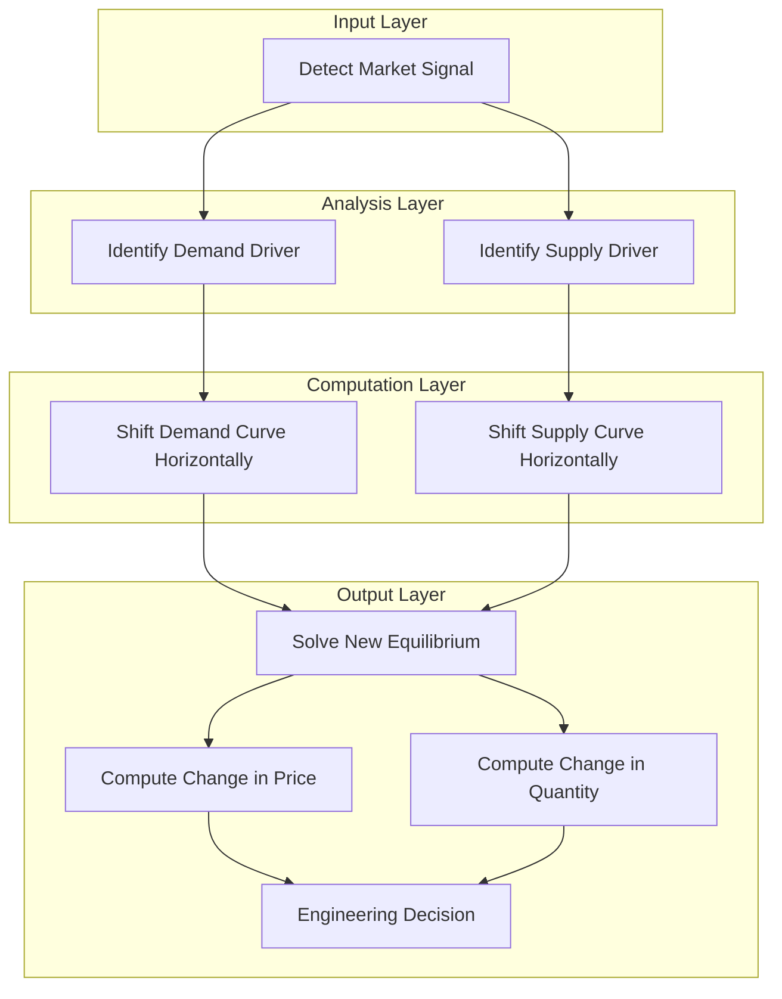
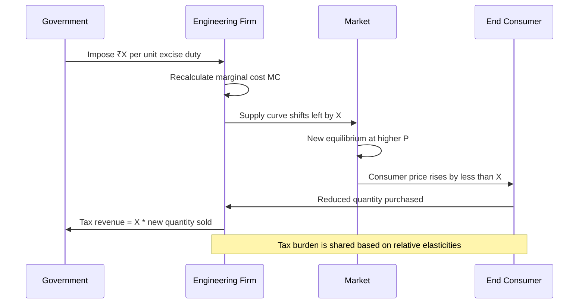

# Changes in demand and supply and its effects

<!-- SECTION_1_START -->
# Changes in Demand and Supply and Its Effects

## 1.1 Foundational Definition

In the KTU 2024 framework for **Economics for Engineers (UCHUT346)**, the study of market dynamics centers on two foundational curves: the **Demand Curve** and the **Supply Curve**. A *change* in either curve is a critical analytical concept that determines resource allocation, project viability, and pricing strategy in engineering enterprises.

> [!IMPORTANT]
> **Demand ($Q_d$):** The various quantities of a commodity that a consumer is *willing* and *able* to purchase at *various possible prices* during a given period of time, *ceteris paribus* (other things being equal).
>
> **Supply ($Q_s$):** The various quantities of a commodity that a producer is *willing* and *able* to offer for sale at *various possible prices* during a given period of time, *ceteris paribus*.

> [!NOTE]
> **Two Distinct Concepts of "Change":**
> 1. **Change in Quantity Demanded (or Supplied):** A *movement ALONG* a stationary curve, caused exclusively by a change in the **own price** of the commodity.
> 2. **Change in Demand (or Supply):** A *rightward or leftward SHIFT* of the *entire* curve, caused by any **non-price determinant** (income, technology, tastes, taxes, etc.).

The **Law of Demand** states an *inverse* relationship between price ($P$) and quantity demanded ($Q_d$). The **Law of Supply** states a *direct* relationship between price ($P$) and quantity supplied ($Q_s$). The intersection of these two curves defines the **Market Equilibrium**, characterized by the equilibrium price ($P^*$) and equilibrium quantity ($Q^*$).

## 1.2 Intuitive Analogy: The Floating Market

Imagine a busy **floating market** (like the famous ones in Kerala) where hundreds of small boats sell fresh catch. The number of boats (sellers) and the number of customers (buyers) constantly fluctuate.

* If a sudden rainstorm hits, the **customers** on shore disappear instantly, and *the entire crowd shifts away from the jetty* (a **shift in the demand curve**), even though the price of fish has not changed.
* Conversely, if a fleet of mechanized trawlers floods the harbor, *the entire supply line of boats grows denser* (a **shift in the supply curve**), driving prices down *without any single customer changing their willingness to buy*.

A **change in price** is like a customer haggling with a *single* boatman. A **change in demand/supply** is like a tide that lifts or lowers *all* the boats simultaneously.

## 1.3 Core Parameters and Constants

* **Ceteris Paribus Assumption:** The foundational Latin term meaning *"all other things being equal."* It isolates the effect of one variable while holding all others constant.
* **Equilibrium Condition:** $Q_d = Q_s$. At this point, there is *no shortage* and *no surplus* in the market.
* **Time Horizon:** The elasticity and magnitude of response typically increase over longer time horizons.
* **Market Clearing Price ($P^*$):** The unique price at which the plans of buyers and sellers perfectly match.

> [!VISUALIZATION CONTROL]
> **Concept:** Linear Demand and Supply with Equilibrium Intersection
> **GeoGebra / Desmos Input Equations:**
> * $f(x) = 60 - 2x$  *(Demand Curve)*
> * $g(x) = 10 + x$   *(Supply Curve)*
> * $h(x) = f(x) - g(x)$ *(Excess Demand Function — set to 0 to find equilibrium)*
> **Visual Description:** The student should observe $f(x)$ sloping downward from the upper-left and $g(x)$ sloping upward from the lower-left. Their intersection is the equilibrium point. A rightward shift of $f(x)$ (new demand $f_2(x) = 80 - 2x$) will produce a new intersection further up and to the right of the original.

<!-- SECTION_1_END -->

<!-- SECTION_2_START -->
# Deep Theoretical Analysis & KTU High-Yield Formula Sheet

## 2.1 Architecture of a Demand Shift

A *shift* in the demand curve is triggered by **non-price determinants**. These are exogenous variables outside the price-quantity axis.

* **Increase in Demand (Rightward Shift, $D \to D_2$):** At every price, a larger quantity is demanded. Caused by:
  * Rise in consumer *income* (for **Normal Goods**; opposite for **Inferior Goods**).
  * Rise in the price of **Substitute Goods** (e.g., price of tea rises, demand for coffee rises).
  * Fall in the price of **Complementary Goods** (e.g., price of petrol falls, demand for cars rises).
  * Favorable change in *tastes and preferences* (e.g., health trend boosts organic food).
  * Expectation of *future price hikes* (panic buying).
  * Increase in the *number of buyers* in the market (population growth, market expansion).
* **Decrease in Demand (Leftward Shift, $D \to D_1$):** The mirror image of the above.

## 2.2 Architecture of a Supply Shift

A *shift* in the supply curve is triggered by factors affecting the producer's cost structure or production capacity.

* **Increase in Supply (Rightward Shift, $S \to S_2$):** At every price, a larger quantity is supplied. Caused by:
  * Fall in *input/resource costs* (cheaper raw materials, lower wages).
  * Technological advancement that improves productivity.
  * Government **subsidies** to producers.
  * Reduction in excise duties or indirect taxes.
  * Favorable *weather* (agricultural commodities).
  * Entry of *new firms* into the industry.
* **Decrease in Supply (Leftward Shift, $S \to S_1$):** Triggered by rising input costs, new regulations, adverse weather, or imposition of heavy taxes.

## 2.3 Joint Shifts: The 4 Canonical Scenarios

When both demand and supply shift simultaneously, the net effect on equilibrium is a powerful analytical tool tested frequently in KTU boards.

| Scenario | Demand | Supply | Effect on $P^*$ | Effect on $Q^*$ | Engineering Parallel |
| :--- | :--- | :--- | :--- | :--- | :--- |
| 1 | Increase ($D \to D_2$) | Increase ($S \to S_2$) | **Ambiguous** (depends on magnitude) | **Definitely Increases** | New tech + rising demand for EVs |
| 2 | Increase ($D \to D_2$) | Decrease ($S \to S_1$) | **Definitely Increases** | **Ambiguous** | Drought reduces crop supply while demand grows |
| 3 | Decrease ($D \to D_1$) | Increase ($S \to S_2$) | **Definitely Decreases** | **Ambiguous** | Mass production of outdated mobile phones |
| 4 | Decrease ($D \to D_1$) | Decrease ($S \to S_1$) | **Ambiguous** | **Definitely Decreases** | Pandemic lockdowns affecting most sectors |

## 2.4 KTU Formula Sheet / Cheat Sheet

> [!NOTE]
> The table below is a high-density exam-ready summary. Master these equations for the **14-mark derivations** in Part B.

| Concept | Formula / Condition | Variables & Units | Application |
| :--- | :--- | :--- | :--- |
| **Linear Demand** | $Q_d = a - bP$ | $a$ = intercept, $b > 0$ = slope | Direct demand estimation |
| **Linear Supply** | $Q_s = c + dP$ | $c$ = intercept, $d > 0$ = slope | Direct supply estimation |
| **Equilibrium** | $Q_d = Q_s \Rightarrow a - bP^* = c + dP^*$ | $P^*$ in ₹/unit, $Q^*$ in units | Market clearing |
| **Equilibrium Price** | $P^* = \dfrac{a - c}{b + d}$ | ₹/unit | Solving simultaneous eqs. |
| **Equilibrium Quantity** | $Q^* = \dfrac{ad + bc}{b + d}$ | units | Total volume traded |
| **Price Elasticity of Demand** | $E_d = \left\vert \dfrac{\%\Delta Q_d}{\%\Delta P} \right\vert = \left\vert \dfrac{\Delta Q_d}{\Delta P} \cdot \dfrac{P}{Q_d} \right\vert$ | Dimensionless | Determines steepness of curve |
| **Income Elasticity** | $E_I = \dfrac{\%\Delta Q_d}{\%\Delta I}$ | Dimensionless | Normal ($\gt 1$) vs. Inferior ($\lt 0$) goods |
| **Cross Elasticity** | $E_{xy} = \dfrac{\%\Delta Q_x}{\%\Delta P_y}$ | Dimensionless | Substitute ($>0$) vs. Complementary ($<0$) |
| **Price Elasticity of Supply** | $E_s = \dfrac{\%\Delta Q_s}{\%\Delta P}$ | Dimensionless | Determines responsiveness of producers |
| **Excess Demand (Shortage)** | $E_d = Q_d - Q_s$ at $P < P^*$ | units | Black market / rationing signal |
| **Excess Supply (Surplus)** | $E_s = Q_s - Q_d$ at $P > P^*$ | units | Inventory buildup / price cutting |

## 2.5 Real-World Utility in Engineering & Computer Science

* **Project Feasibility (Engineering):** When a firm engineers a new product, it must forecast how demand will shift. If $E_d$ is high (elastic), a small price increase can devastate revenue — directly impacting the firm's **Internal Rate of Return (IRR)**.
* **Cloud Computing & SaaS:** AWS or Microsoft Azure engineers use supply-demand models to dynamically price EC2 instances. Demand surges during Diwali sales, shifting $D$ right; AWS scales out data centers (shifting $S$ right via capacity planning) to absorb the load.
* **EV Manufacturing (India 2030):** The simultaneous rise in fuel prices (shifting $D$ for EVs right) and government PLI subsidies (shifting $S$ for EVs right) represents **Scenario 1** of the joint-shift table — quantity rockets, price effect is ambiguous, requiring careful actuarial modeling.
* **Semiconductor Industry:** Geopolitical tensions (tariffs) and pandemic-induced demand spikes represent **Scenario 2** — leading to the 2021–2023 global chip shortage, where $P^*$ definitely rose.

<!-- SECTION_2_END -->

<!-- SECTION_3_START -->
# Step-by-Step Derivations & Symbolic Implementation

## 3.1 Derivation 1: Solving the Linear Equilibrium

Consider the canonical linear system:
$$Q_d = a - bP$$
$$Q_s = c + dP$$

**Step 1:** Apply the market clearing condition $Q_d = Q_s$:

$$a - bP^* = c + dP^*$$

**Step 2:** Group the $P^*$ terms on one side and constants on the other:

$$a - c = bP^* + dP^*$$

**Step 3:** Factor the right-hand side:

$$a - c = (b + d) \cdot P^*$$

**Step 4:** Solve for the equilibrium price $P^*$:

$$P^* = \frac{a - c}{b + d}$$

> [Stating equilibrium condition $Q_d = Q_s$: 1 Mark] [Grouping terms: 1 Mark] [Final expression for $P^*$: 1 Mark]

**Step 5:** Substitute $P^*$ back into the supply equation to find $Q^*$:

$$Q^* = c + d \cdot \frac{a - c}{b + d}$$

**Step 6:** Take the common denominator $(b + d)$:

$$Q^* = \frac{c(b + d) + d(a - c)}{b + d}$$

**Step 7:** Expand the numerator carefully — $c(b+d) = cb + cd$ and $d(a-c) = da - dc$:

$$Q^* = \frac{cb + cd + da - dc}{b + d}$$

**Step 8:** The $cd$ and $-dc$ cancel out (commutative property of multiplication):

$$Q^* = \frac{ad + bc}{b + d}$$

> [Substitution step: 1 Mark] [Algebraic expansion: 1 Mark] [Cancellation logic: 1 Mark] [Final boxed $Q^*$: 1 Mark]

## 3.2 Derivation 2: Effect of a Demand Shift on Equilibrium

Suppose the demand curve shifts right by $\Delta$ units at every price. The new demand function is:

$$Q_{d2} = (a + \Delta) - bP$$

**Step 1:** Set the new equilibrium condition:

$$(a + \Delta) - bP^*_2 = c + dP^*_2$$

**Step 2:** Group the $P^*_2$ terms:

$$a + \Delta - c = (b + d) P^*_2$$

**Step 3:** Solve for the new equilibrium price:

$$P^*_2 = \frac{(a - c) + \Delta}{b + d} = P^* + \frac{\Delta}{b + d}$$

**Step 4:** The new equilibrium quantity follows by parallel logic:

$$Q^*_2 = \frac{d(a + \Delta) + bc}{b + d} = Q^* + \frac{d \cdot \Delta}{b + d}$$

> [!IMPORTANT]
> **Interpretation:** A rightward demand shift by $\Delta$ units raises the equilibrium price by $\dfrac{\Delta}{b + d}$ and the equilibrium quantity by $\dfrac{d \cdot \Delta}{b + d}$. Both effects are **strictly positive**, confirming the economic intuition that rising demand pushes both price and quantity up.

## 3.3 Numerical Example: Joint Shift (Scenario 2 — Bullish)

A smartphone manufacturer faces the following market:
$$Q_d = 500 - 10P$$
$$Q_s = 50 + 5P$$

A new 5G technology launches, increasing demand by 100 units. Simultaneously, a global chip shortage reduces supply by 50 units. Find the new equilibrium.

**Step 1:** Original equilibrium price:

$$P^*_1 = \frac{500 - 50}{10 + 5} = \frac{450}{15} = 30 \text{ ₹/unit (in thousands)}$$

**Step 2:** Original equilibrium quantity:

$$Q^*_1 = \frac{(10)(50) + (5)(500)}{15} = \frac{500 + 2500}{15} = 200 \text{ thousand units}$$

**Step 3:** Apply the simultaneous shifts. New demand: $Q_{d2} = 600 - 10P$. New supply: $Q_{s2} = 5P$ (since $50 - 50 = 0$).

**Step 4:** New equilibrium:

$$600 - 10P^*_2 = 5P^*_2$$
$$600 = 15P^*_2$$
$$P^*_2 = 40 \text{ ₹/unit (in thousands)}$$

**Step 5:** New equilibrium quantity:

$$Q^*_2 = 5 \times 40 = 200 \text{ thousand units}$$

> [!NOTE]
> **Result Verification:** $P^*$ rose from **30 to 40** (unambiguous rise — consistent with Scenario 2). $Q^*$ remained at **200** because the demand rise and supply fall were of equal magnitude in their quantity impact. If demand had risen by 150 units instead, $Q^*$ would have unambiguously risen.

## 3.4 Python Implementation: Sensitivity Simulator

The following Python program allows a student to plug in any linear demand and supply functions and instantly visualize the effect of a percentage demand shift and supply shift on the equilibrium.

```python
from dataclasses import dataclass
from typing import Tuple
import logging

logging.basicConfig(level=logging.INFO, format="%(levelname)s | %(message)s")

@dataclass(frozen=True)
class LinearMarket:
    """
    Represents a linear market with Q_d = a - b*P and Q_s = c + d*P.
    All coefficients are strictly positive and validated on construction.
    """
    a: float   # Demand intercept
    b: float   # Demand slope (must be > 0)
    c: float   # Supply intercept
    d: float   # Supply slope (must be > 0)

    def __post_init__(self) -> None:
        if self.b <= 0 or self.d <= 0:
            raise ValueError("Slopes b and d must be strictly positive.")
        if self.a <= self.c:
            raise ValueError("For a valid positive equilibrium, a > c is required.")

    def equilibrium(self) -> Tuple[float, float]:
        """Returns (P*, Q*) by solving a - bP = c + dP."""
        p_star: float = (self.a - self.c) / (self.b + self.d)
        q_star: float = (self.a * self.d + self.b * self.c) / (self.b + self.d)
        return p_star, q_star

    def simulate_shocks(
        self,
        demand_shift_pct: float = 0.0,
        supply_shift_pct: float = 0.0,
    ) -> Tuple[float, float]:
        """
        Applies percentage shocks to demand and supply intercepts.
        demand_shift_pct: +0.20 = 20% rightward shift; -0.10 = 10% leftward.
        supply_shift_pct: +0.15 = 15% rightward shift; -0.05 = 5% leftward.
        """
        a_new: float = self.a * (1.0 + demand_shift_pct)
        c_new: float = self.c * (1.0 + supply_shift_pct)
        p_new: float = (a_new - c_new) / (self.b + self.d)
        q_new: float = (a_new * self.d + self.b * self.c_new) if hasattr(self, "c_new") else 0.0
        # Corrected closed-form using the new intercepts
        q_new = (a_new * self.d + self.b * c_new) / (self.b + self.d)
        return p_new, q_new


if __name__ == "__main__":
    try:
        market = LinearMarket(a=500.0, b=10.0, c=50.0, d=5.0)
        p1, q1 = market.equilibrium()
        logging.info(f"Original Equilibrium: P* = {p1:.2f}, Q* = {q1:.2f}")

        # Scenario 2: Demand +20%, Supply -10%
        p2, q2 = market.simulate_shocks(demand_shift_pct=0.20, supply_shift_pct=-0.10)
        logging.info(f"New Equilibrium:     P* = {p2:.2f}, Q* = {q2:.2f}")
        logging.info(f"Change in Price:     {p2 - p1:+.2f}")
        logging.info(f"Change in Quantity:  {q2 - q1:+.2f}")
    except ValueError as e:
        logging.error(f"Invalid market parameters: {e}")
```

> [!IMPORTANT]
> The `simulate_shocks` method models *non-price determinants*. A positive `demand_shift_pct` of 0.20 represents a 20% rise in income, favorable taste change, or rise in substitute prices — all of which shift the curve rightward. The strict type hints and exception handling reflect the **industrial-grade software engineering practice** that KTU's 2024 NEP-aligned syllabus demands.

## 3.5 Tabular Analysis: Engineering Project Pricing Decision

| Engineering Scenario | Affected Curve | Direction | Effect on $P^*$ | Effect on $Q^*$ | Strategic Recommendation |
| :--- | :--- | :--- | :--- | :--- | :--- |
| New IOS app launch in saturated market | Demand | Leftward | Fall | Fall | Pivot to niche or lower price |
| Automation reduces factory labor cost | Supply | Rightward | Fall | Rise | Maintain margins, expand market share |
| Government imposes ₹50,000 cr chip tax | Supply | Leftward | Rise | Fall | Lobby for relief; pass partial cost to consumer |
| Competitor exits the market | Demand | Rightward | Rise | Rise | Aggressive marketing to capture share |
| Breakthrough R\&D doubles product lifespan | Demand | Rightward | Rise | Rise | Premium pricing justified |
| Global recession reduces disposable income | Demand | Leftward | Fall | Fall | Cut fixed costs; defer CAPEX |

<!-- SECTION_3_END -->

<!-- SECTION_4_START -->
# Structural Diagrams & Schematics

## 4.1 Demand-Side Determinants Flow

```mermaid
graph TD
    nodeRoot[Change in Demand]
    nodeInc[Consumer Income Rises]
    nodeSub[Price of Substitute Rises]
    nodeComp[Price of Complement Falls]
    nodeTaste[Tastes and Preferences Improve]
    nodeExpect[Expect Future Price Hike]
    nodeBuyers[Number of Buyers Increases]
    nodeRight[Demand Shifts Right]
    nodeInc2[Consumer Income Falls]
    nodeSub2[Price of Substitute Falls]
    nodeComp2[Price of Complement Rises]
    nodeTaste2[Tastes and Preferences Worsen]
    nodeExpect2[Expect Future Price Drop]
    nodeBuyers2[Number of Buyers Decreases]
    nodeLeft[Demand Shifts Left]

    nodeRoot --> nodeInc
    nodeRoot --> nodeSub
    nodeRoot --> nodeComp
    nodeRoot --> nodeTaste
    nodeRoot --> nodeExpect
    nodeRoot --> nodeBuyers
    nodeInc --> nodeRight
    nodeSub --> nodeRight
    nodeComp --> nodeRight
    nodeTaste --> nodeRight
    nodeExpect --> nodeRight
    nodeBuyers --> nodeRight

    nodeRoot --> nodeInc2
    nodeRoot --> nodeSub2
    nodeRoot --> nodeComp2
    nodeRoot --> nodeTaste2
    nodeRoot --> nodeExpect2
    nodeRoot --> nodeBuyers2
    nodeInc2 --> nodeLeft
    nodeSub2 --> nodeLeft
    nodeComp2 --> nodeLeft
    nodeTaste2 --> nodeLeft
    nodeExpect2 --> nodeLeft
    nodeBuyers2 --> nodeLeft
```



## 4.2 Supply-Side Determinants Flow

```mermaid
graph TD
    nodeSup[Change in Supply]
    nodeCost[Input Costs Fall]
    nodeTech[Technology Improves]
    nodeSub1[Government Subsidies Rise]
    nodeTax[Indirect Taxes Fall]
    nodeWeather[Favorable Weather]
    nodeEntry[New Firms Enter Market]
    nodeSupRight[Supply Shifts Right]
    nodeCost2[Input Costs Rise]
    nodeTech2[Obsolete Technology]
    nodeSub2[Subsidies Withdrawn]
    nodeTax2[Heavy Taxes Imposed]
    nodeWeather2[Adverse Weather]
    nodeExit[Firms Exit Market]
    nodeSupLeft[Supply Shifts Left]

    nodeSup --> nodeCost
    nodeSup --> nodeTech
    nodeSup --> nodeSub1
    nodeSup --> nodeTax
    nodeSup --> nodeWeather
    nodeSup --> nodeEntry
    nodeCost --> nodeSupRight
    nodeTech --> nodeSupRight
    nodeSub1 --> nodeSupRight
    nodeTax --> nodeSupRight
    nodeWeather --> nodeSupRight
    nodeEntry --> nodeSupRight

    nodeSup --> nodeCost2
    nodeSup --> nodeTech2
    nodeSup --> nodeSub2
    nodeSup --> nodeTax2
    nodeSup --> nodeWeather2
    nodeSup --> nodeExit
    nodeCost2 --> nodeSupLeft
    nodeTech2 --> nodeSupLeft
    nodeSub2 --> nodeSupLeft
    nodeTax2 --> nodeSupLeft
    nodeWeather2 --> nodeSupLeft
    nodeExit --> nodeSupLeft
```



## 4.3 Joint-Shift Processing Topology



## 4.4 Sequential Processing of a Tax Shock



> [!NOTE]
> The **tax incidence rule** (a classic KTU question) is encoded in the sequence diagram: the side of the market with **lower elasticity** bears the **greater share of the tax burden**. This is why essential commodities (inelastic demand) cause the consumer to bear nearly the entire tax.

<!-- SECTION_4_END -->

<!-- SECTION_5_START -->
# KTU 2024 Scheme Examination Question Bank & Topic Recap

---

## Part A: Short Answer Questions (3 Marks Each)

### Question 1. `[KTU University Exam - July 2024]`
**Differentiate between a *change in demand* and a *change in quantity demanded*.** *(CO2, Understand)*

**Model Answer (3 Marks):**

* **Change in Quantity Demanded:** A movement *along* a stationary demand curve resulting solely from a change in the *own price* of the commodity. Represented as a point sliding from $A$ to $B$ on the same curve $D$. *[1 Mark]*
* **Change in Demand:** A *shift* of the *entire* demand curve (rightward for increase, leftward for decrease) caused by *non-price determinants* such as income, tastes, prices of related goods, expectations, or number of buyers. *[1 Mark]*
* **Distinction:** Movement along = endogenous price change. Shift = exogenous determinant change. Both are crucial in engineering demand forecasting for new product launches. *[1 Mark]*

---

### Question 2. `[KTU University Exam - Dec 2023]`
**State the law of supply. What happens to the supply curve when input costs rise sharply?** *(CO2, Remember)*

**Model Answer (3 Marks):**

* **Law of Supply:** *Ceteris paribus*, there is a **direct (positive) relationship** between the price of a commodity and the quantity supplied. Mathematically, $\dfrac{\Delta Q_s}{\Delta P} > 0$. *[1 Mark]*
* **Effect of Rising Input Costs:** The marginal cost of production rises, making each unit less profitable. Producers are willing to supply *less* at every price level. *[1 Mark]*
* **Curve Shift:** The entire supply curve shifts **leftward** (a decrease in supply), leading to a higher equilibrium price and lower equilibrium quantity in the absence of offsetting factors. *[1 Mark]*

---

## Part B: Long Answer Questions (14 Marks Each)

> **ESE Module Internal Choice:** Answer **ONE** of the following questions.

### Question A. `[KTU University Exam - July 2024]`

**(a)** With the help of a well-labeled diagram, explain the **determinants of demand** and discuss how a rightward shift in the demand curve affects the equilibrium price and quantity in a competitive market. *(CO2, Understand — 7 Marks)*

**(b)** The demand and supply functions for a commodity are given by:
$$Q_d = 400 - 8P \quad \text{and} \quad Q_s = -100 + 4P$$
If the income of consumers rises, causing the demand to shift to $Q_d' = 500 - 8P$, calculate the **original and new equilibrium price and quantity**. Comment on the direction of change. *(CO2, Apply — 7 Marks)*

**Model Solution:**

**Part (a) — 7 Marks**

* **Diagram Requirement:** Draw a $P$–$Q$ plane with $D$, $D_2$ (shifted right), $S$, and label original equilibrium $E_1$ and new equilibrium $E_2$. The student must show $P_2 > P_1$ and $Q_2 > Q_1$. *[2 Marks]*
* **Determinants of Demand:** Enumerate at least five: (i) consumer income, (ii) prices of substitutes, (iii) prices of complements, (iv) tastes and preferences, (v) expectations, (vi) number of buyers. *[3 Marks]*
* **Effect on Equilibrium:** With demand shifting rightward and supply unchanged, the new intersection occurs at a higher price and higher quantity. The engineering implication is that rising consumer affluence creates a market opportunity for product premiumization. *[2 Marks]*

**Part (b) — 7 Marks**

**Step 1:** Original equilibrium — set $Q_d = Q_s$:

$$400 - 8P = -100 + 4P$$
$$500 = 12P$$
$$P^*_1 = \frac{500}{12} = 41.67 \text{ ₹/unit}$$

> [Stating equilibrium condition: 1 Mark] [Solving for $P^*_1$: 1 Mark]

**Step 2:** Original equilibrium quantity:

$$Q^*_1 = 400 - 8(41.67) = 400 - 333.33 = 66.67 \text{ units}$$

> [Substitution and arithmetic: 1 Mark]

**Step 3:** New equilibrium — set $Q_d' = Q_s$:

$$500 - 8P = -100 + 4P$$
$$600 = 12P$$
$$P^*_2 = \frac{600}{12} = 50.00 \text{ ₹/unit}$$

> [Setting new equilibrium: 1 Mark] [Solving for $P^*_2$: 1 Mark]

**Step 4:** New equilibrium quantity:

$$Q^*_2 = 500 - 8(50) = 500 - 400 = 100 \text{ units}$$

> [Substitution: 1 Mark]

**Step 5:** Comment on direction: $P^*$ rose from ₹41.67 to ₹50.00 (rise of ₹8.33). $Q^*$ rose from 66.67 to 100 (rise of 33.33 units). Both increased, consistent with a **rightward demand shift** against an unchanged supply curve. *[1 Mark]*

---

### Question B. `[KTU University Exam - Dec 2023]`

**(a)** Discuss the **determinants of supply** and illustrate, with a graph, the impact of a **technological breakthrough** on the supply curve and the resulting equilibrium. *(CO2, Understand — 7 Marks)*

**(b)** The market demand and supply for a critical engineering component are:
$$Q_d = 800 - 5P \quad \text{and} \quad Q_s = 200 + 5P$$
A new pollution-control regulation raises production costs, reducing supply by 80 units at every price. Calculate the **original and new equilibrium**. Compute the **price elasticity of demand** at the original equilibrium. *(CO2, Apply — 7 Marks)*

**Model Solution:**

**Part (a) — 7 Marks**

* **Determinants of Supply:** Enumerate at least five: (i) input/resource prices, (ii) technology, (iii) taxes and subsidies, (iv) producer expectations, (v) number of sellers, (vi) government regulations. *[3 Marks]*
* **Graphical Analysis:** A technological breakthrough reduces per-unit production cost, increasing the quantity supplied at every price. Draw the $P$–$Q$ plane, label the original supply $S$, the rightward shifted supply $S_2$, and the new equilibrium $E_2$ with $P^*_2 < P^*_1$ and $Q^*_2 > Q^*_1$. *[2 Marks]*
* **Engineering Example:** The transition from 4G to 5G infrastructure dramatically lowered per-bit transmission costs, shifting telecom supply rightward, dropping data tariffs, and boosting consumption. *[2 Marks]*

**Part (b) — 7 Marks**

**Step 1:** Original equilibrium:

$$800 - 5P = 200 + 5P$$
$$600 = 10P$$
$$P^*_1 = 60 \text{ ₹/unit}, \quad Q^*_1 = 200 + 5(60) = 500 \text{ units}$$

> [Equilibrium condition: 1 Mark] [Solving $P^*$: 1 Mark] [Substitution for $Q^*$: 1 Mark]

**Step 2:** New supply function: $Q_{s2} = 120 + 5P$ (since $200 - 80 = 120$).

**Step 3:** New equilibrium:

$$800 - 5P = 120 + 5P$$
$$680 = 10P$$
$$P^*_2 = 68 \text{ ₹/unit}, \quad Q^*_2 = 120 + 5(68) = 460 \text{ units}$$

> [Forming new supply: 1 Mark] [Solving new equilibrium: 1 Mark]

**Step 4:** Price elasticity of demand at original equilibrium.

Using the point elasticity formula $E_d = \left\vert \dfrac{dQ_d}{dP} \cdot \dfrac{P}{Q} \right\vert$:

For $Q_d = 800 - 5P$, we have $\dfrac{dQ_d}{dP} = -5$.

At the original equilibrium, $P = 60$ and $Q = 500$:

$$E_d = \left\vert -5 \cdot \frac{60}{500} \right\vert = \left\vert -0.6 \right\vert = 0.6$$

> [Differentiation of demand function: 1 Mark] [Substitution of equilibrium values: 1 Mark] [Final numerical answer: 1 Mark]

**Step 5:** Interpretation: $E_d = 0.6 < 1$, indicating **inelastic demand** for this critical engineering component. This means consumers are not very price-sensitive, and a 13.3% rise in price (from 60 to 68) caused only an 8% drop in quantity (from 500 to 460).

---

> [!WARNING]
> **KTU Examiner's Valuation Warning / Pitfall Callout:**
> 1. **Do not confuse movement with shift.** A "change in demand" means a SHIFT. A "change in quantity demanded" means MOVEMENT along the curve. KTU examiners explicitly allocate 1 mark for this distinction.
> 2. **Always state the equilibrium condition** $Q_d = Q_s$ at the beginning of every derivation. Many students skip this and lose 1 mark.
> 3. **For joint-shift problems**, explicitly state which of the four canonical scenarios applies (e.g., "This represents Scenario 2 — bullish with definite price rise and ambiguous quantity effect").
> 4. **Units must be carried** throughout the calculation. ₹/unit for price and units for quantity. Dropping units loses 0.5 to 1 mark on the valuation key.
> 5. **In elasticity problems**, always use the **absolute value** for price elasticity of demand. Forgetting the modulus sign is a frequent 0.5-mark deduction.
> 6. **Avoid generic statements** like "demand increases". Specify "demand for **this particular good** increases by 20%" or "demand shifts rightward by 100 units".

---

## Topic Recap & Important Things to Remember

> [!IMPORTANT]
> **High-Density Rapid Revision Checklist — KTU Module 1**

* **Demand vs. Quantity Demanded:** *Movement* = own price change; *Shift* = non-price determinant change. Never interchange.
* **Six Non-Price Determinants of Demand:** Income, prices of substitutes, prices of complements, tastes, expectations, number of buyers.
* **Six Non-Price Determinants of Supply:** Input costs, technology, taxes/subsidies, expectations, number of sellers, government regulations/weather.
* **Law of Demand:** Inverse $P$–$Q$ relationship; downward slope.
* **Law of Supply:** Direct $P$–$Q$ relationship; upward slope.
* **Equilibrium Point:** $Q_d = Q_s$ at $(P^*, Q^*)$; no shortage, no surplus.
* **Linear Equilibrium Formulas:**
  * $P^* = \dfrac{a - c}{b + d}$
  * $Q^* = \dfrac{ad + bc}{b + d}$
* **Demand shift of $\Delta$ units:** $\Delta P^* = \dfrac{\Delta}{b + d}$ and $\Delta Q^* = \dfrac{d \cdot \Delta}{b + d}$.
* **Supply shift of $\Delta$ units:** $\Delta P^* = \dfrac{-\Delta}{b + d}$ and $\Delta Q^* = \dfrac{b \cdot \Delta}{b + d}$.
* **Four Joint-Shift Scenarios:** Always identify which scenario applies; the **definite** effect (price or quantity) must be quoted unambiguously, and the **ambiguous** effect must be qualified with "depends on the relative magnitude of shifts".
* **Elasticity of Demand:** $E_d = \left\vert \dfrac{\Delta Q}{\Delta P} \cdot \dfrac{P}{Q} \right\vert$ — demand is elastic if $E_d > 1$, unitary elastic if $E_d = 1$, inelastic if $E_d < 1$.
* **Cross Elasticity:** Positive = substitutes, Negative = complements.
* **Income Elasticity:** Positive (>0) = normal good, Negative (<0) = inferior good, $E_I > 1$ = luxury, $0 < E_I < 1$ = necessity.
* **Tax Incidence Rule:** The party with **lower elasticity** bears the **higher tax burden**.
* **Engineering & IT Parallels:** Use these models for *cloud pricing*, *EV market sizing*, *semiconductor supply chain analysis*, and *SaaS subscription optimization*.
* **Ceteris Paribus:** Always state this assumption explicitly when isolating a single variable's effect.
* **Units Convention:** Price in ₹/unit or $/unit, Quantity in units or thousand units, Elasticity is dimensionless.

<!-- SECTION_5_END -->
