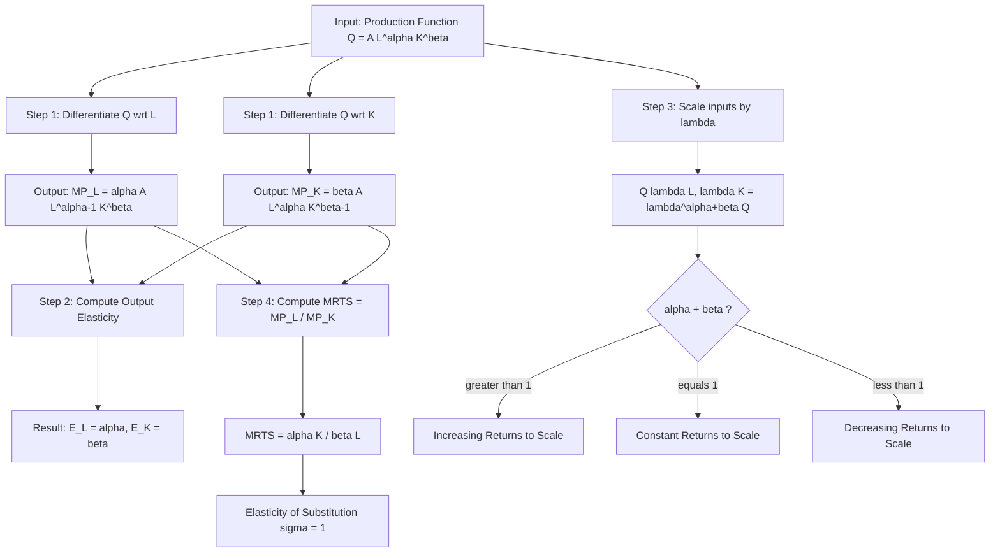
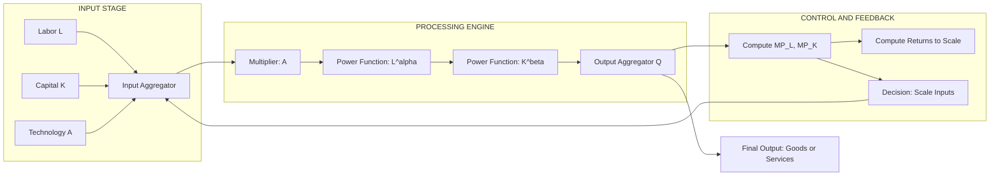
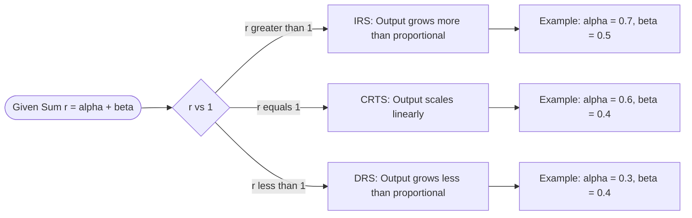
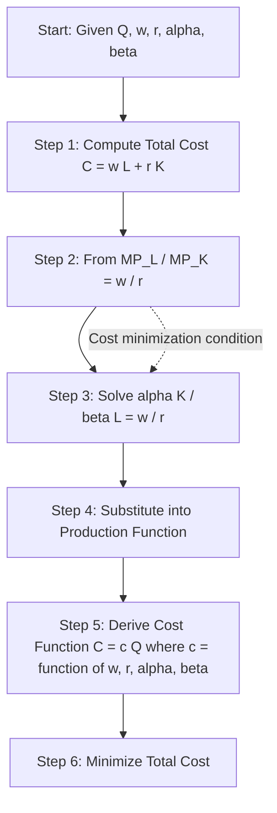
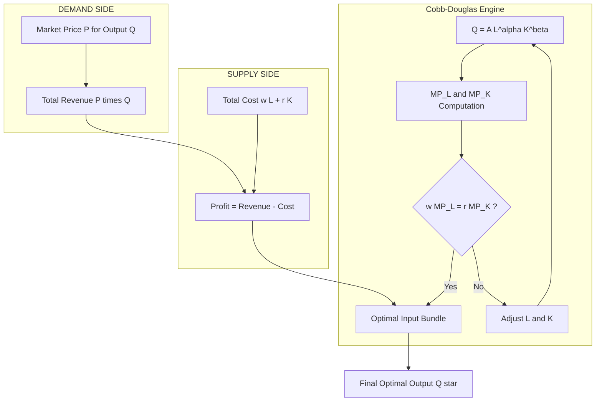

# Cobb-Douglas Production Function

<!-- SECTION_1_START -->
# Cobb-Douglas Production Function

## 1. Core Technical Definition

> [!IMPORTANT]
> **Formal Definition (KTU 2024 Syllabus Standard):**
> The **Cobb-Douglas Production Function** is a mathematical representation of the technological relationship between the quantities of two or more inputs (typically physical capital and labor) and the amount of output that can be produced. In its most widely used two-factor form, it is expressed as:
> $$\Large Q = A \cdot L^{\alpha} \cdot K^{\beta}$$
> where **$Q$** is the total output, **$L$** is the labor input, **$K$** is the capital input, **$A$** is the **Total Factor Productivity (TFP)** constant (a positive parameter capturing the level of technology), and **$\alpha$** and **$\beta$** are the **output elasticities** of labor and capital respectively. The exponents $\alpha, \beta \in (0,1)$ and the technology parameter $A > 0$.

### Conceptual Analogy / Intuition

> [!NOTE]
> **Intuitive Engineering Analogy — "The Recipe of a Factory"**
> Imagine a bakery producing cakes ($Q$). The owner has two ingredients: hours of skilled bakers ($L$) and industrial ovens ($K$). The Cobb-Douglas function says: doubling the bakers will not just double the cakes — because they get in each other's way — so we raise the bakers to a power $\alpha$ (say, $0.7$). Similarly for ovens with power $\beta$. The constant $A$ represents the **efficiency of the recipe** — better ovens and training increase $A$, multiplying all output. If we double **both** inputs, output grows by $2^{\alpha+\beta}$. If $\alpha+\beta = 1$, the bakery has **constant returns to scale** — doubling the factory size exactly doubles the cake output.

### Standard Metric and Constants

> [!TIP]
> **Key Production Elasticity Constraints** (for a well-behaved production function):
> - $\alpha > 0$ and $\beta > 0$ → both inputs contribute positively to output.
> - $\alpha < 1$ and $\beta < 1$ → **diminishing marginal returns** for each input.
> - **Returns to Scale** is governed by the sum $r = \alpha + \beta$.
> - $A > 0$ always (Total Factor Productivity, dimensionless scaling factor).

### GeoGebra / Desmos Visualization

> [!VISUALIZATION CONTROL]
> **Concept:** Isoquant Curves of the Cobb-Douglas Function $Q = L^{0.6} \cdot K^{0.4}$
> **GeoGebra / Desmos Input Equations:**
> * `Q(L, K) = L^0.6 * K^0.4` → for level sets: `K = (Q / L^0.6)^(1/0.4)`
> * Plot three isoquants: `Q = 10`, `Q = 20`, `Q = 40`
> **Visual Description:** The student should observe smooth, convex, downward-sloping curves bending toward both axes, never touching them. The shape is hyperbolic (rectangular hyperbola family when $\alpha + \beta = 1$). Higher $Q$ values produce curves further from the origin.
<!-- SECTION_1_END -->

<!-- SECTION_2_START -->
# 2. Deep Theoretical Analysis & KTU High-Yield Formula Sheet

## 2.1 Structural Breakdown of the Function

The function is named after economists **Paul H. Douglas** and mathematician **Charles W. Cobb**, who formulated it in 1927 while studying the US manufacturing sector between 1899 and 1922. The reasoning behind its structure rests on four core engineering-economic properties:

1. **Positivity and Continuity:** $Q > 0$ for all positive inputs, and the function is differentiable, allowing marginal analysis.
2. **Law of Diminishing Marginal Returns:** Holding $K$ constant, the derivative $\partial Q / \partial L$ is positive but decreasing.
3. **Output Elasticity = Constant:** The percentage change in output from a 1% increase in input is constant, which is a unique property of the Cobb-Douglas form.
4. **Unitary Elasticity of Substitution:** The firm can always substitute one input for the other at a constant rate, i.e., $\sigma = 1$.

## 2.2 Why Each Parameter Matters

- **$A$ (TFP):** A multiplicative shifter representing **technology, management quality, and institutional efficiency**. A 10% rise in $A$ raises output by exactly 10% (log-linearity).
- **$\alpha$ (Labor elasticity):** The percentage increase in output when labor rises by 1%, holding capital fixed.
- **$\beta$ (Capital elasticity):** The percentage increase in output when capital rises by 1%, holding labor fixed.

## 2.3 KTU Formula Sheet / Cheat Sheet

> [!NOTE]
> **High-Yield Formulas for KTU Board Examination**

| **Concept** | **Formula** | **Interpretation** |
|---|---|---|
| Cobb-Douglas Production Function | $Q = A \cdot L^{\alpha} \cdot K^{\beta}$ | Two-input standard form |
| Marginal Product of Labor ($MP_L$) | $MP_L = \dfrac{\partial Q}{\partial L} = \alpha \cdot A \cdot L^{\alpha-1} \cdot K^{\beta}$ | Extra output from one extra unit of labor |
| Marginal Product of Capital ($MP_K$) | $MP_K = \dfrac{\partial Q}{\partial K} = \beta \cdot A \cdot L^{\alpha} \cdot K^{\beta-1}$ | Extra output from one extra unit of capital |
| Average Product of Labor ($AP_L$) | $AP_L = \dfrac{Q}{L} = A \cdot L^{\alpha-1} \cdot K^{\beta}$ | Output per unit of labor |
| Average Product of Capital ($AP_K$) | $AP_K = \dfrac{Q}{K} = A \cdot L^{\alpha} \cdot K^{\beta-1}$ | Output per unit of capital |
| Output Elasticity of Labor | $E_L = \dfrac{\partial Q / Q}{\partial L / L} = \alpha$ | Constant elasticity |
| Output Elasticity of Capital | $E_K = \dfrac{\partial Q / Q}{\partial K / K} = \beta$ | Constant elasticity |
| Returns to Scale Coefficient | $r = \alpha + \beta$ | Sum of elasticities |
| Returns to Scale Condition | $r > 1$: Increasing; $r = 1$: Constant; $r < 1$: Decreasing | Scale behavior |
| Elasticity of Substitution | $\sigma = 1$ (always) | Constant rate of substitution |
| Log-Linear Form | $\ln Q = \ln A + \alpha \ln L + \beta \ln K$ | Used in econometric estimation |
| Isoquant (CRTS case) | $K = \left(\dfrac{Q}{A}\right)^{1/\beta} \cdot L^{-\alpha/\beta}$ | Equal-output input combinations |
| Profit Maximization (Perfect Competition) | $w = MP_L \cdot P$ and $r = MP_K \cdot P$ | Wage and rental equal marginal value product |

## 2.4 Real-World Utility in Engineering & Computer Science

> [!TIP]
> **Where Engineers Encounter Cobb-Douglas in Practice:**
> - **Cloud Infrastructure Cost Modeling:** Datacenter engineers model compute-output ($Q$) as a function of CPU-hours ($L$) and memory ($K$); Cobb-Douglas helps in capacity planning.
> - **Software Production Function:** Lines of code deployed as a function of developer-hours and tooling investment.
> - **Manufacturing Process Engineering:** Output of a chemical plant modeled against labor hours and capital equipment.
> - **Macroeconomic Forecasting:** Central banks (RBI, US Federal Reserve) use aggregate Cobb-Douglas to model GDP from labor and capital.
<!-- SECTION_2_END -->

<!-- SECTION_3_START -->
# 3. Step-by-Step Derivations & Symbolic Implementation

## 3.1 Derivation: Marginal Product of Labor ($MP_L$)

Given:
$$Q = A \cdot L^{\alpha} \cdot K^{\beta}$$

Treating $K$ as a constant (since we vary only $L$), differentiate with respect to $L$:

$$\frac{\partial Q}{\partial L} = A \cdot K^{\beta} \cdot \frac{\partial}{\partial L}\left(L^{\alpha}\right)$$

Applying the power rule $\frac{d}{dx}(x^n) = n \cdot x^{n-1}$:

$$MP_L = A \cdot K^{\beta} \cdot \alpha \cdot L^{\alpha-1} = \alpha \cdot A \cdot L^{\alpha-1} \cdot K^{\beta}$$

This can be written compactly as:

$$MP_L = \alpha \cdot \frac{Q}{L}$$

because $Q/L = A \cdot L^{\alpha-1} \cdot K^{\beta}$.

## 3.2 Derivation: Marginal Product of Capital ($MP_K$)

By symmetry, treating $L$ as constant and differentiating with respect to $K$:

$$\frac{\partial Q}{\partial K} = A \cdot L^{\alpha} \cdot \frac{\partial}{\partial K}\left(K^{\beta}\right)$$

$$MP_K = \beta \cdot A \cdot L^{\alpha} \cdot K^{\beta-1} = \beta \cdot \frac{Q}{K}$$

## 3.3 Derivation: Output Elasticity of Labor ($E_L$)

By definition:

$$E_L = \frac{\partial Q}{\partial L} \cdot \frac{L}{Q}$$

Substituting $MP_L$:

$$E_L = \left(\alpha \cdot A \cdot L^{\alpha-1} \cdot K^{\beta}\right) \cdot \frac{L}{A \cdot L^{\alpha} \cdot K^{\beta}}$$

$$E_L = \alpha \cdot A \cdot L^{\alpha-1} \cdot K^{\beta} \cdot \frac{1}{A \cdot L^{\alpha-1} \cdot K^{\beta}} = \alpha$$

> **Conclusion:** The output elasticity of labor is **exactly equal to the exponent $\alpha$**, independent of input levels.

## 3.4 Derivation: Returns to Scale

Scale all inputs by a factor $\lambda > 0$:

$$Q(\lambda L, \lambda K) = A \cdot (\lambda L)^{\alpha} \cdot (\lambda K)^{\beta}$$

$$= A \cdot \lambda^{\alpha} \cdot L^{\alpha} \cdot \lambda^{\beta} \cdot K^{\beta} = \lambda^{\alpha+\beta} \cdot A \cdot L^{\alpha} \cdot K^{\beta}$$

$$Q(\lambda L, \lambda K) = \lambda^{\alpha+\beta} \cdot Q(L, K)$$

The output scales by $\lambda^{\alpha+\beta}$, confirming that the sum $\alpha + \beta$ governs returns to scale.

## 3.5 Derivation: Elasticity of Substitution

The elasticity of substitution is defined as:

$$\sigma = \frac{d \ln(K/L)}{d \ln(MRTS)}$$

where $MRTS = MP_L / MP_K$ is the marginal rate of technical substitution.

Compute the MRTS:

$$MRTS = \frac{MP_L}{MP_K} = \frac{\alpha \cdot A \cdot L^{\alpha-1} \cdot K^{\beta}}{\beta \cdot A \cdot L^{\alpha} \cdot K^{\beta-1}} = \frac{\alpha}{\beta} \cdot \frac{K}{L}$$

Now, $\ln(MRTS) = \ln(\alpha/\beta) + \ln(K) - \ln(L) = \ln(\alpha/\beta) + \ln(K/L)$.

Differentiating:

$$d \ln(MRTS) = d \ln(K/L)$$

Therefore:

$$\sigma = \frac{d \ln(K/L)}{d \ln(K/L)} = 1$$

> **Conclusion:** The elasticity of substitution is **always equal to 1** for the Cobb-Douglas function, regardless of the values of $\alpha$ and $\beta$.

## 3.6 Worked Numerical Example

> [!IMPORTANT]
> **Problem:** A firm's production function is $Q = 10 \cdot L^{0.6} \cdot K^{0.4}$. If $L = 100$ and $K = 50$, find (a) the output $Q$, (b) $MP_L$, (c) $MP_K$, and (d) classify the returns to scale.

### (a) Total Output

$$Q = 10 \cdot (100)^{0.6} \cdot (50)^{0.4}$$

$$100^{0.6} = e^{0.6 \cdot \ln 100} = e^{0.6 \cdot 4.6052} = e^{2.7631} \approx 15.849$$

$$50^{0.4} = e^{0.4 \cdot \ln 50} = e^{0.4 \cdot 3.9120} = e^{1.5648} \approx 4.780$$

$$Q = 10 \cdot 15.849 \cdot 4.780 \approx 757.6 \text{ units}$$

### (b) Marginal Product of Labor

$$MP_L = 0.6 \cdot 10 \cdot (100)^{-0.4} \cdot (50)^{0.4}$$

$$100^{-0.4} = \frac{1}{100^{0.4}} = \frac{1}{15.849} \approx 0.0631$$

$$MP_L = 6 \cdot 0.0631 \cdot 4.780 \approx 1.81 \text{ units per labor unit}$$

### (c) Marginal Product of Capital

$$MP_K = 0.4 \cdot 10 \cdot (100)^{0.6} \cdot (50)^{-0.6}$$

$$50^{-0.6} = \frac{1}{50^{0.6}} = \frac{1}{11.534} \approx 0.0867$$

$$MP_K = 4 \cdot 15.849 \cdot 0.0867 \approx 5.50 \text{ units per capital unit}$$

### (d) Returns to Scale

$$\alpha + \beta = 0.6 + 0.4 = 1.0$$

Since the sum equals 1, the firm operates under **Constant Returns to Scale (CRTS)**.

## 3.7 Python Symbolic Implementation

```python
import numpy as np
import sympy as sp

# Define symbols
L, K, A, alpha, beta = sp.symbols('L K A alpha beta', positive=True)

# Cobb-Douglas Production Function
Q = A * L**alpha * K**beta
print("Cobb-Douglas Production Function Q =", Q)

# Marginal Products
MP_L = sp.diff(Q, L)
MP_K = sp.diff(Q, K)
print("Marginal Product of Labor MP_L =", sp.simplify(MP_L))
print("Marginal Product of Capital MP_K =", sp.simplify(MP_K))

# Output Elasticities
E_L = sp.simplify(MP_L * L / Q)
E_K = sp.simplify(MP_K * K / Q)
print("Output Elasticity of Labor =", E_L)
print("Output Elasticity of Capital =", E_K)

# Returns to Scale Demonstration
lam = sp.symbols('lambda', positive=True)
Q_scaled = Q.subs([(L, lam * L), (K, lam * K)])
print("Q(lambda*L, lambda*K) =", sp.simplify(Q_scaled))
print("Factor = lambda^(alpha+beta):", sp.simplify(Q_scaled / Q))
```

**Expected Output (Conceptual):**

```
Cobb-Douglas Production Function Q = A*L**alpha*K**beta
Marginal Product of Labor MP_L = A*alpha*L**(alpha-1)*K**beta
Marginal Product of Capital MP_K = A*beta*L**alpha*K**(beta-1)
Output Elasticity of Labor = alpha
Output Elasticity of Capital = beta
Q(lambda*L, lambda*K) = lambda**(alpha+beta) * A*L**alpha*K**beta
Factor = lambda**(alpha+beta)
```

## 3.8 Numerical Computation in Python

```python
import numpy as np

def cobb_douglas_metrics(A, L, K, alpha, beta):
    Q = A * (L ** alpha) * (K ** beta)
    MP_L = alpha * A * (L ** (alpha - 1)) * (K ** beta)
    MP_K = beta * A * (L ** alpha) * (K ** (beta - 1))
    AP_L = Q / L
    AP_K = Q / K
    rts = alpha + beta
    rts_label = ("Increasing" if rts > 1 else
                 "Constant" if rts == 1 else "Decreasing")
    return {
        "Output Q": round(Q, 3),
        "MP_L": round(MP_L, 3),
        "MP_K": round(MP_K, 3),
        "AP_L": round(AP_L, 3),
        "AP_K": round(AP_K, 3),
        "Returns to Scale": f"{rts_label} (r = {rts})"
    }

result = cobb_douglas_metrics(A=10, L=100, K=50, alpha=0.6, beta=0.4)
for key, value in result.items():
    print(f"{key}: {value}")
```

**Expected Output:**

```
Output Q: 757.612
MP_L: 1.811
MP_K: 5.499
AP_L: 7.576
AP_K: 15.152
Returns to Scale: Constant (r = 1.0)
```
<!-- SECTION_3_END -->

<!-- SECTION_4_START -->
# 4. Structural Diagrams & Schematics

## 4.1 Analytical Flow: Cobb-Douglas Properties Derivation



## 4.2 Block-Level Architecture: Production System Topology



## 4.3 Sequential Topology Matrix: Returns to Scale Classification



## 4.4 Decision Matrix: Cost Minimization under Cobb-Douglas



## 4.5 Architecture Map: Labor-Capital Optimization Loop


<!-- SECTION_4_END -->

<!-- SECTION_5_START -->
# 5. KTU 2024 Scheme Examination Question Bank & Topic Recap

## 5.1 Part A Questions (3 Marks Each)

### Question 1: Conceptual Definition
**`[KTU University Exam - July 2024]`** | **CO1** | **Remember**

**Q:** Define the Cobb-Douglas Production Function. State its standard mathematical form for two inputs and explain the meaning of each parameter.

**Model Answer (Valuation Key: 3 Marks):**

> [!NOTE]
> The Cobb-Douglas Production Function describes the technological relationship between two or more inputs and the resulting output, with constant output elasticities.
> 
> **Standard form:** $Q = A \cdot L^{\alpha} \cdot K^{\beta}$ **[1 Mark]**
> 
> **Meaning of parameters:** **[2 Marks]**
> - $Q$: Total output produced
> - $L$: Quantity of labor input
> - $K$: Quantity of capital input
> - $A$: Total Factor Productivity (TFP), representing the level of technology
> - $\alpha$: Output elasticity of labor
> - $\beta$: Output elasticity of capital

---

### Question 2: Property Identification
**`[KTU University Exam - Dec 2023]`** | **CO2** | **Understand**

**Q:** For the production function $Q = 5 L^{0.3} K^{0.6}$, determine the type of returns to scale. Justify your answer.

**Model Answer (Valuation Key: 3 Marks):**

Given $\alpha = 0.3$ and $\beta = 0.6$, the returns to scale coefficient is:

$$r = \alpha + \beta = 0.3 + 0.6 = 0.9$$

**[1 Mark]**

Since $r = 0.9 < 1$, the production function exhibits **Decreasing Returns to Scale (DRS)**. **[1 Mark]**

**Justification:** If all inputs are scaled by a factor $\lambda$, output scales by $\lambda^{0.9} < \lambda$. Thus, a doubling of inputs increases output by only $2^{0.9} \approx 1.866$, which is less than 2. **[1 Mark]**

---

## 5.2 Part B Questions (14 Marks Each — Module Internal Choice)

### Question A (14 Marks)
**`[KTU University Exam - July 2024]`** | **CO1, CO2** | **Apply / Analyze**

**(a)** Derive the marginal products of labor and capital for the Cobb-Douglas production function $Q = A L^{\alpha} K^{\beta}$. **[7 Marks]**

**(b)** A firm uses the production function $Q = 20 L^{0.5} K^{0.5}$. If the firm employs $L = 25$ workers and $K = 49$ machines, compute the total output, marginal product of labor, and marginal product of capital. Also comment on the returns to scale. **[7 Marks]**

---

**Solution to (a):**

**Step 1:** Write the production function:
$$Q = A L^{\alpha} K^{\beta}$$

**Step 2:** Differentiate $Q$ with respect to $L$, treating $K$ as a constant:
$$MP_L = \frac{\partial Q}{\partial L} = A K^{\beta} \cdot \frac{d(L^{\alpha})}{dL}$$

**Step 3:** Apply the power rule:
$$MP_L = \alpha A L^{\alpha-1} K^{\beta} \quad \text{[Stating the formula: 2 Marks]}$$

**Step 4:** Equivalently, $MP_L = \alpha \cdot \dfrac{Q}{L}$ **[1 Mark]**

**Step 5:** Differentiate $Q$ with respect to $K$, treating $L$ as a constant:
$$MP_K = \frac{\partial Q}{\partial K} = A L^{\alpha} \cdot \frac{d(K^{\beta})}{dK}$$

**Step 6:** Apply the power rule:
$$MP_K = \beta A L^{\alpha} K^{\beta-1} \quad \text{[Stating the formula: 2 Marks]}$$

**Step 7:** Equivalently, $MP_K = \beta \cdot \dfrac{Q}{K}$ **[1 Mark]**

**Step 8:** Note that both marginal products are positive, confirming the law of diminishing returns. **[1 Mark]**

---

**Solution to (b):**

Given $A = 20$, $L = 25$, $K = 49$, $\alpha = 0.5$, $\beta = 0.5$.

**Step 1: Total Output**
$$Q = 20 \cdot (25)^{0.5} \cdot (49)^{0.5}$$

$$25^{0.5} = 5, \quad 49^{0.5} = 7$$

$$Q = 20 \cdot 5 \cdot 7 = 700 \text{ units} \quad \text{[Total output: 2 Marks]}$$

**Step 2: Marginal Product of Labor**
$$MP_L = 0.5 \cdot 20 \cdot (25)^{-0.5} \cdot (49)^{0.5}$$

$$25^{-0.5} = \frac{1}{5} = 0.2, \quad 49^{0.5} = 7$$

$$MP_L = 10 \cdot 0.2 \cdot 7 = 14 \text{ units per worker} \quad \text{[MP_L: 1 Mark]}$$

**Step 3: Marginal Product of Capital**
$$MP_K = 0.5 \cdot 20 \cdot (25)^{0.5} \cdot (49)^{-0.5}$$

$$49^{-0.5} = \frac{1}{7} \approx 0.1429$$

$$MP_K = 10 \cdot 5 \cdot 0.1429 = 7.143 \text{ units per machine} \quad \text{[MP_K: 1 Mark]}$$

**Step 4: Returns to Scale**
$$\alpha + \beta = 0.5 + 0.5 = 1.0 \quad \text{[RTS computation: 1 Mark]}$$

Since $\alpha + \beta = 1$, the firm exhibits **Constant Returns to Scale (CRTS)**. **[1 Mark]**

**Step 5: Interpretation**
Doubling both inputs doubles the output exactly: $2^{1.0} = 2$. **[1 Mark]**

---

### Question B (14 Marks)
**`[KTU University Exam - Dec 2023]`** | **CO1, CO2** | **Apply / Analyze**

**(a)** Explain the concept of output elasticity of substitution for the Cobb-Douglas function. Prove that the elasticity of substitution is equal to 1. **[7 Marks]**

**(b)** A manufacturing unit has the production function $Q = 8 L^{0.4} K^{0.6}$. If labor increases by 10% and capital decreases by 5%, calculate the percentage change in output. **[7 Marks]**

---

**Solution to (a):**

**Step 1: Definition** **[2 Marks]**
The **elasticity of substitution** ($\sigma$) measures the percentage change in the capital-labor ratio $(K/L)$ in response to a 1% change in the marginal rate of technical substitution (MRTS).

$$\sigma = \frac{d \ln(K/L)}{d \ln(MRTS)}$$

**Step 2: Compute MRTS** **[2 Marks]**
$$MRTS = \frac{MP_L}{MP_K} = \frac{\alpha A L^{\alpha-1} K^{\beta}}{\beta A L^{\alpha} K^{\beta-1}} = \frac{\alpha}{\beta} \cdot \frac{K}{L}$$

**Step 3: Take logarithms** **[1 Mark]**
$$\ln(MRTS) = \ln\left(\frac{\alpha}{\beta}\right) + \ln(K) - \ln(L) = \ln\left(\frac{\alpha}{\beta}\right) + \ln(K/L)$$

**Step 4: Differentiate** **[1 Mark]**
$$d \ln(MRTS) = d \ln(K/L)$$

**Step 5: Compute $\sigma$** **[1 Mark]**
$$\sigma = \frac{d \ln(K/L)}{d \ln(K/L)} = 1$$

> **Conclusion:** The elasticity of substitution for any Cobb-Douglas function is **always unity**, regardless of parameter values. This is a defining characteristic that distinguishes Cobb-Douglas from other production functions like CES (Constant Elasticity of Substitution). 

---

**Solution to (b):**

Given $Q = 8 L^{0.4} K^{0.6}$, with $\alpha = 0.4$ and $\beta = 0.6$.

**Step 1: Recall output elasticities** **[1 Mark]**
$E_L = \alpha = 0.4$ and $E_K = \beta = 0.6$.

**Step 2: Apply the elasticity approximation** **[2 Marks]**
For small percentage changes, the percentage change in output is:

$$\frac{\Delta Q}{Q} \times 100 \approx \alpha \cdot \frac{\Delta L}{L} \times 100 + \beta \cdot \frac{\Delta K}{K} \times 100$$

**Step 3: Substitute the given changes** **[1 Mark]**
$\dfrac{\Delta L}{L} \times 100 = +10\%$ and $\dfrac{\Delta K}{K} \times 100 = -5\%$.

**Step 4: Compute** **[2 Marks]**
$$\frac{\Delta Q}{Q} \times 100 = (0.4)(+10) + (0.6)(-5) = 4 - 3 = 1\%$$

**Step 5: Interpretation** **[1 Mark]**
The output increases by **1%** in response to a 10% increase in labor and 5% decrease in capital. This confirms that the marginal contribution of capital per percentage change ($0.6 \times 5 = 3$) is offset by labor's contribution ($0.4 \times 10 = 4$), yielding a net positive but small output gain.

---

## 5.3 KTU Examiner's Valuation Warning

> [!WARNING]
> **Common Pitfalls Where Students Lose Marks in Cobb-Douglas Problems:**
> 1. **Forgetting to state units:** Always write "units of output" or "units per worker" — losing **0.5 Mark** if omitted.
> 2. **Misidentifying returns to scale:** Students often confuse $r = \alpha + \beta$ with $\alpha$ alone. Always state the sum and explicitly classify it.
> 3. **Sign errors in elasticity problems:** In questions involving input decreases, remember that a negative percentage change contributes negatively to output change. Sign errors cost **1–2 Marks**.
> 4. **Skipping the log-linear derivation:** When asked to prove $\sigma = 1$, the differentiation step $d \ln(MRTS) = d \ln(K/L)$ is critical — failing to show this loses **2 Marks**.
> 5. **Not showing the power-rule application:** Always explicitly state $\frac{d}{dx}(x^n) = n x^{n-1}$ before applying it.
> 6. **Confusion between $MP_L$ and $AP_L$:** The marginal product involves a derivative, while the average product is $Q/L$. Mixing them up is a frequent error.

## 5.4 Topic Recap & Important Things to Remember

> [!TIP]
> **High-Density Revision Checklist**
> 
> **Core Definition**
> - Cobb-Douglas form: $Q = A L^{\alpha} K^{\beta}$
> - $A$: Total Factor Productivity (TFP); $\alpha, \beta$: output elasticities
> 
> **Essential Marginals**
> - $MP_L = \alpha A L^{\alpha-1} K^{\beta} = \alpha \cdot Q/L$
> - $MP_K = \beta A L^{\alpha} K^{\beta-1} = \beta \cdot Q/K$
> 
> **Returns to Scale Rule**
> - $r = \alpha + \beta$; IRS if $r > 1$, CRTS if $r = 1$, DRS if $r < 1$
> - Scaling: $Q(\lambda L, \lambda K) = \lambda^{\alpha+\beta} Q$
> 
> **Unique Property**
> - Elasticity of substitution is **always** $\sigma = 1$
> 
> **Elasticity Shortcut for Output Change**
> - $\%\Delta Q \approx \alpha \cdot \%\Delta L + \beta \cdot \%\Delta K$
> 
> **Log-Linear Form (Estimation)**
> - $\ln Q = \ln A + \alpha \ln L + \beta \ln K$
> - Estimable via Ordinary Least Squares (OLS) regression
> 
> **Numerical Reminders**
> - $\alpha, \beta \in (0,1)$ for well-behaved production
> - $A > 0$ always
> - Isoquants are convex to origin and never touch axes
> 
> **Real-World Contexts**
> - GDP modeling in macroeconomics
> - Cloud capacity and software productivity engineering
> - Manufacturing process analysis
> - Cost minimization: $w = MP_L \cdot P$ and $r = MP_K \cdot P$
<!-- SECTION_5_END -->
