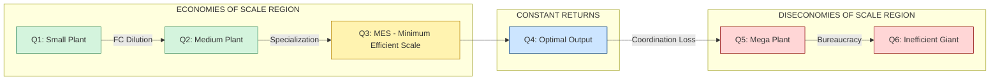
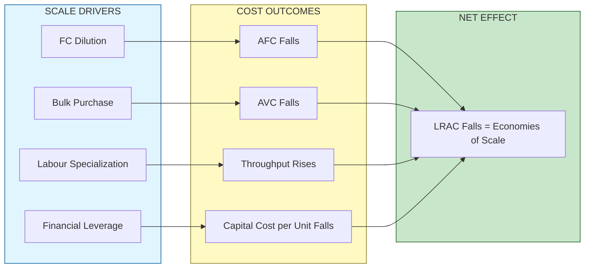

# Economies of Scale

<!-- SECTION_1_START -->
# Economies of Scale — Core Definition & Intuitive Overview

## 📘 Formal Academic Definition (KTU 2024 Syllabus Terminology)

**Economies of Scale** is a fundamental concept in engineering economics that describes the phenomenon wherein the **long-run average cost (LRAC)** of producing a good or service **decreases** as the **scale of output** (or firm size) increases, holding all input prices and technology constant. Formally, it is the cost advantage reaped by a firm when it increases its level of production such that the **cost per unit of output falls**.

Mathematically, economies of scale exist when:

$$
E_s = \frac{\%\,\Delta\,\text{Long-Run Average Cost}}{\%\,\Delta\,\text{Output}} < 0
$$

When $E_s < 0$, every additional percentage increase in output leads to a *negative* percentage change in average cost, signaling that larger scale is *cheaper per unit*.

> [!IMPORTANT]
> **KTU Syllabus Highlight (Module 1 — Basic Economic Problems):** Economies of scale is treated as a *production-side* mechanism that determines **supply behavior**, **market structure**, and the **optimal plant size** for an engineering enterprise. The concept directly feeds into Break-Even Analysis, Cost-Volume-Profit (CVP) studies, and Make-or-Buy decisions in later modules.

---

## 🧠 Conceptual Analogy — The "Water Bucket" Intuition

Imagine filling a **square water tank** with a fixed number of bricks. As the tank gets bigger, the *number of bricks per litre of water stored drops*. The outer walls are shared by more water. In a factory, the same logic applies:

- The **fixed costs** (factory rent, machinery, CEO salary) are like the bricks of the tank's walls.
- As you produce **more units**, these fixed costs are *spread* (or "diluted") across a larger output base.
- Hence **cost-per-unit falls** — the tank holds more water using proportionally fewer bricks.

A real-world example: A semiconductor fab (fabrication plant) costs nearly **\$10 billion** to build, but producing **one chip** vs. **one billion chips** spreads that cost dramatically — from millions of dollars per chip to just a few dollars per chip.

> [!NOTE]
> **Standard Metric Used in Engineering Economics:**
> - **Economies of Scale Index** = $\%\Delta LRAC \,/\, \%\Delta Q$
> - **Minimum Efficient Scale (MES)** = the smallest output level at which LRAC is minimized.
> - A related production-side metric: **Returns to Scale**, which describes *output behavior* when *all* inputs are scaled proportionally.

---

## 📊 Visual Intuition — The Long-Run Average Cost Curve

> [!VISUALIZATION CONTROL]
> **Concept:** U-Shaped Long-Run Average Cost (LRAC) Curve with Region of Economies & Diseconomies of Scale
>
> **GeoGebra / Desmos Input Equations:**
> - LRAC: $f(x) = 0.00005\,x^2 - 0.02\,x + 8$ (sample U-shape)
> - Output $Q$ on x-axis, Cost per unit on y-axis
>
> **Visual Description:** A U-shaped curve descending from upper-left, reaching a minimum at the **Minimum Efficient Scale (MES)**, then rising to the upper-right. The **left descending limb** = region of **Economies of Scale**. The **right ascending limb** = region of **Diseconomies of Scale**. The bottom of the U = **Constant Returns to Scale**.

---

## 🎯 Why This Topic Matters for an Engineer

Engineers designing production systems, factories, software platforms, or supply chains must answer the question: *"Should we build one big plant or several small ones?"* The answer hinges on **economies of scale**.

| Engineering Field | Application of Economies of Scale |
|---|---|
| **Manufacturing** | Mass production lines in automotive (e.g., Maruti Suzuki plant) |
| **Software** | Cloud platforms (AWS) — fixed dev cost, near-zero marginal cost per user |
| **Telecom** | Tower infrastructure — fixed cost spread over millions of subscribers |
| **Semiconductors** | Fabs with massive fixed capex but tiny per-chip marginal cost |
| **Civil Engineering** | Mega-dams and bridges — high fixed cost, very low per-unit service cost |

<!-- SECTION_1_END -->

<!-- SECTION_2_START -->
# Deep Theoretical Analysis & KTU High-Yield Formula Sheet

## 🧩 The Underlying Economic Logic

The existence of economies of scale is explained by several **interlocking micro-foundations**, which KTU 2024 examiners frequently test as 3-mark short-answer questions.

### Step 1: Fixed Cost Dilution (Spreading Effect)
- Fixed costs (FC) like plant, equipment, R\&D, and overheads **do not vary** with output.
- As output $Q$ rises, $\text{FC} / Q$ (average fixed cost) **falls monotonically**.
- This is the **single most important driver** of economies of scale and the most tested concept in KTU.

### Step 2: Bulk Purchasing Power
- Larger firms buy **raw materials, components, and energy** in higher volumes.
- Suppliers offer **quantity discounts** (e.g., 5\% discount for orders above 10,000 units).
- This reduces **average variable cost (AVC)**.

### Step 3: Specialization & Division of Labour
- Larger operations permit **task specialization** (Adam Smith's pin-factory example).
- Specialized workers and machines are **faster and more productive** → labour cost per unit falls.

### Step 4: Indivisibilities & Technical Efficiency
- Some equipment (e.g., a CNC machine, a blast furnace) is **lumpy** — it cannot be scaled down proportionally.
- A single large machine often produces output equivalent to **multiple smaller ones** at lower total cost.

### Step 5: Financial & Marketing Leverage
- Larger firms access **cheaper credit** (lower interest rates on bonds).
- They spread **advertising and R\&D** across more units.
- **Risk-bearing capacity** increases (losses in one product line offset by gains in another).

---

## 📋 KTU Formula Sheet / Cheat Sheet

> [!NOTE]
> The table below contains every formula you need to solve numerical problems on economies of scale in the KTU ESE.

| # | Concept | Formula / Expression | Unit | Remarks |
|---|---|---|---|---|
| 1 | Average Cost (AC) | $AC = \dfrac{TC}{Q}$ | ₹/unit | Total cost divided by output |
| 2 | Total Cost (TC) | $TC = FC + VC = FC + (VC \cdot Q)$ | ₹ | Sum of fixed and variable costs |
| 3 | Average Fixed Cost (AFC) | $AFC = \dfrac{FC}{Q}$ | ₹/unit | Falls continuously as $Q$ rises |
| 4 | Average Variable Cost (AVC) | $AVC = \dfrac{VC \cdot Q}{Q} = VC$ | ₹/unit | May rise or fall with $Q$ |
| 5 | Long-Run Average Cost (LRAC) | $LRAC = \dfrac{LTC(Q)}{Q}$ | ₹/unit | Used in economies-of-scale analysis |
| 6 | Economies of Scale Coeff. ($E_s$) | $E_s = \dfrac{\%\,\Delta LRAC}{\%\,\Delta Q}$ | dimensionless | $E_s < 0$ ⇒ economies; $E_s > 0$ ⇒ diseconomies |
| 7 | Returns to Scale (Output) | $\dfrac{\Delta Q}{\%\,\Delta \text{All Inputs}}$ | dimensionless | > 1 = increasing; = 1 = constant; < 1 = decreasing |
| 8 | Minimum Efficient Scale (MES) | $Q$ at which $\dfrac{d(LRAC)}{dQ} = 0$ | units | Bottom of the U-curve |
| 9 | Cost Elasticity ($\varepsilon_c$) | $\varepsilon_c = \dfrac{d(\ln TC)}{d(\ln Q)}$ | dimensionless | $\varepsilon_c < 1$ ⇒ economies of scale exist |
| 10 | Learning Curve | $Y = a \cdot X^{-b}$ | hours/unit | $b$ = learning rate index (0 < b < 1) |

---

## 🏭 Real-World Utility for Engineers

1. **Plant Sizing Decisions:** Engineers use economies of scale to decide whether to build a single large plant (subject to diseconomies beyond MES) or multiple smaller ones (more transport cost, less specialization).
2. **Software Scalability:** Cloud architects design systems expecting "cost per user" to fall as user count grows — a direct application of scale economics.
3. **Network Effects (Telecom):** A telephone network with $n$ users has potential connections equal to $n(n-1)/2$, so per-user *value* rises with scale (Metcalfe's Law).
4. **Mass Customization Trade-off:** Modern engineering balances economies of scale (cheap uniform products) with customization (premium pricing) — a key theme in Industry 4.0.
5. **Project Cost Estimation:** In cost engineering, larger projects often have lower per-unit costs but face coordination diseconomies — engineers must locate the **MES optimum**.

---

## ⚖️ Economies vs. Diseconomies of Scale — The Two Regimes

| Regime | LRAC Behavior | Output Range | Engineering Implication |
|---|---|---|---|
| **Economies of Scale** | Falling as $Q \uparrow$ | $Q < Q_{MES}$ | Build bigger; exploit fixed-cost dilution |
| **Constant Returns to Scale** | Flat (minimum LRAC) | $Q = Q_{MES}$ | Optimal scale — design target |
| **Diseconomies of Scale** | Rising as $Q \uparrow$ | $Q > Q_{MES}$ | Coordination loss; split into smaller units |

<!-- SECTION_2_END -->

<!-- SECTION_3_START -->
# Step-by-Step Derivations & Case-Framework Implementation

## 🧮 Numerical Derivation: Cost Behavior Across Output Levels

**Worked Problem (KTU Module 1 Standard):**

A small engineering firm has the following cost structure for manufacturing electric motors:

- Fixed Cost: $FC = \text{₹} \, 1{,}00{,}000$
- Variable Cost per unit: $VC = \text{₹} \, 200$ per motor

**Task:** Compute Total Cost, Average Cost, Average Fixed Cost, and Average Variable Cost at $Q = 100$, $Q = 500$, and $Q = 1000$ motors. Verify that economies of scale exist by showing AC falls as $Q$ rises.

### Step 1: Build the Cost Functions

$$
TC(Q) = FC + (VC \cdot Q) = 1{,}00{,}000 + 200Q
$$

$$
AC(Q) = \dfrac{TC(Q)}{Q} = \dfrac{1{,}00{,}000}{Q} + 200
$$

$$
AFC(Q) = \dfrac{FC}{Q} = \dfrac{1{,}00{,}000}{Q}
$$

$$
AVC(Q) = VC = 200
$$

### Step 2: Evaluate at $Q = 100$

$$
TC(100) = 1{,}00{,}000 + 200(100) = 1{,}00{,}000 + 20{,}000 = \text{₹} \, 1{,}20{,}000
$$

$$
AC(100) = \dfrac{1{,}20{,}000}{100} = \text{₹} \, 1{,}200 \text{ per unit}
$$

$$
AFC(100) = \dfrac{1{,}00{,}000}{100} = \text{₹} \, 1{,}000 \text{ per unit}
$$

$$
AVC(100) = \text{₹} \, 200 \text{ per unit}
$$

### Step 3: Evaluate at $Q = 500$

$$
TC(500) = 1{,}00{,}000 + 200(500) = 1{,}00{,}000 + 1{,}00{,}000 = \text{₹} \, 2{,}00{,}000
$$

$$
AC(500) = \dfrac{2{,}00{,}000}{500} = \text{₹} \, 400 \text{ per unit}
$$

$$
AFC(500) = \dfrac{1{,}00{,}000}{500} = \text{₹} \, 200 \text{ per unit}
$$

$$
AVC(500) = \text{₹} \, 200 \text{ per unit}
$$

### Step 4: Evaluate at $Q = 1000$

$$
TC(1000) = 1{,}00{,}000 + 200(1000) = 1{,}00{,}000 + 2{,}00{,}000 = \text{₹} \, 3{,}00{,}000
$$

$$
AC(1000) = \dfrac{3{,}00{,}000}{1000} = \text{₹} \, 300 \text{ per unit}
$$

$$
AFC(1000) = \dfrac{1{,}00{,}000}{1000} = \text{₹} \, 100 \text{ per unit}
$$

$$
AVC(1000) = \text{₹} \, 200 \text{ per unit}
$$

### Step 5: Verification — Economies of Scale Confirmed

| Output ($Q$) | Total Cost (₹) | Average Cost (₹/unit) | AFC (₹/unit) | AVC (₹/unit) |
|---|---|---|---|---|
| 100 | 1,20,000 | **1,200** | 1,000 | 200 |
| 500 | 2,00,000 | **400** | 200 | 200 |
| 1000 | 3,00,000 | **300** | 100 | 200 |

**Conclusion:** As $Q$ rises from 100 to 1000, AC falls from ₹1,200 to ₹300. The decline is driven **entirely by AFC dilution** (1000 → 100), since AVC remains constant at ₹200. This is a textbook demonstration of **economies of scale due to fixed cost spreading**.

### Step 6: Compute the Economies of Scale Coefficient

From $Q = 500$ to $Q = 1000$:

$$
\%\,\Delta Q = \dfrac{1000 - 500}{500} \times 100 = 100\%
$$

$$
\%\,\Delta LRAC = \dfrac{300 - 400}{400} \times 100 = -25\%
$$

$$
E_s = \dfrac{-25}{100} = -0.25
$$

Since $E_s < 0$, **economies of scale are confirmed** in this range.

---

## 📑 Tabular Comparative Analysis — Real-World Engineering Case Frameworks

> [!NOTE]
> KTU Module 1 expects engineers to map theory to **production systems**. The matrix below maps eight real engineering industries to the **type of economies of scale** they primarily exploit and the **regulatory/strategic factors** governing their scale.

| Industry / Engineering Case | Primary Scale Driver | Type of Economy | Fixed-Cost Share | Diseconomy Risk | Strategic Response |
|---|---|---|---|---|---|
| **Semiconductor Fabs (e.g., Intel, TSMC)** | Indivisible capital equipment | Technical / Engineering | Very High (\>70\%) | R\&D coordination | Modular fab + offshoring |
| **Automobile Assembly (e.g., Tata Motors)** | Assembly-line specialization | Labour / Technical | High | Supply-chain congestion | Multiple regional plants |
| **Cloud SaaS (e.g., AWS, Azure)** | Software replication | Marketing / Financial | Low (code), High (data centres) | Server over-utilization | Auto-scaling architecture |
| **Telecom Operators (e.g., Jio)** | Tower + spectrum sharing | External (localization) | Very High | Spectrum scarcity | Network sharing agreements |
| **Civil Mega-Projects (e.g., metros, airports)** | Indivisible infrastructure | Technical | Very High | Bureaucratic delays | PPP + phased construction |
| **Pharmaceutical Bulk Drugs** | R\&D amortization | Risk-bearing / Financial | Very High | Regulatory delays | Patent licensing |
| **Renewable Energy (Solar Farms)** | Panel + inverter bulk-buy | Purchasing | Moderate | Land + grid limits | Distributed rooftop model |
| **E-commerce Platforms (e.g., Flipkart)** | Network effects on demand side | External (information) | Moderate | Logistics diseconomies | Hyperlocal dark stores |

---

## 🔍 Returns to Scale vs. Economies of Scale — Worked Comparison

A firm uses two inputs — capital ($K$) and labour ($L$) — in a Cobb-Douglas production function:

$$
Q = A \cdot K^{\alpha} \cdot L^{\beta}
$$

Returns to scale is determined by $\alpha + \beta$:

- If $\alpha + \beta > 1$ ⇒ **Increasing Returns to Scale (IRS)**
- If $\alpha + \beta = 1$ ⇒ **Constant Returns to Scale (CRS)**
- If $\alpha + \beta < 1$ ⇒ **Decreasing Returns to Scale (DRS)**

Suppose $A = 10$, $\alpha = 0.6$, $\beta = 0.5$, so $\alpha + \beta = 1.1 > 1$.

| Scale | $K$ | $L$ | Output $Q = 10K^{0.6}L^{0.5}$ | \% $\Delta Q$ |
|---|---|---|---|---|
| Initial | 100 | 100 | $10 \cdot 100^{0.6} \cdot 100^{0.5} = 10 \cdot 15.85 \cdot 10 = 1585$ | — |
| Scale 1.5× | 150 | 150 | $10 \cdot 150^{0.6} \cdot 150^{0.5} = 10 \cdot 26.05 \cdot 12.25 = 3191$ | +101.3\% |
| Scale 2× | 200 | 200 | $10 \cdot 200^{0.6} \cdot 200^{0.5} = 10 \cdot 36.42 \cdot 14.14 = 5151$ | +225\% |

Output grew **more than proportionally** to inputs — confirming **IRS** and the production-side analogue of economies of scale.

<!-- SECTION_3_END -->

<!-- SECTION_4_START -->
# Structural Diagrams & Schematics

## 🔁 Diagram 1 — The U-Shaped Long-Run Average Cost Curve

**Reading Guide:** From left to right, the firm first experiences **falling AC** (Economies), reaches a **flat bottom** at the MES, and then **rising AC** (Diseconomies). The MES is the engineering target plant size.

---

## 🌳 Diagram 2 — Taxonomy of Economies & Diseconomies of Scale

```mermaid
graph TD
    Root["Economies of Scale"]
    Root --> Internal["Internal Economies"]
    Root --> External["External Economies"]
    Internal --> I1["Labour Economies"]
    Internal --> I2["Technical Economies"]
    Internal --> I3["Purchasing Economies"]
    Internal --> I4["Managerial Economies"]
    Internal --> I5["Marketing Economies"]
    Internal --> I6["Financial Economies"]
    Internal --> I7["Risk-Bearing Economies"]
    External --> E1["Economies of Concentration"]
    External --> E2["Economies of Information"]
    External --> E3["Economies of Localization"]
    External --> E4["Economies of Vertical Disintegration"]
    Root2["Diseconomies of Scale"]
    Root2 --> D1["Internal Diseconomies"]
    Root2 --> D2["External Diseconomies"]
    D1 --> D1a["Managerial Inefficiency"]
    D1 --> D1b["Labour Discontent"]
    D1 --> D1c["Communication Failure"]
    D2 --> D2a["Higher Input Prices"]
    D2 --> D2b["Traffic Congestion"]
    D2 --> D2c["Pollution Externalities"]
    style Root fill:#b3e5fc,stroke:#01579b
    style Root2 fill:#ffccbc,stroke:#bf360c
    style Internal fill:#c8e6c9,stroke:#1b5e20
    style External fill:#c8e6c9,stroke:#1b5e20
```

---

## 🏗️ Diagram 3 — Sequential Decision Flow for Selecting Optimal Plant Size

```mermaid
graph TD
    S1["Step 1: Forecast Demand Q"] --> S2["Step 2: Estimate Total Cost Function TC"]
    S2 --> S3["Step 3: Derive AC = TC / Q"]
    S3 --> S4{"d AC / d Q ?"}
    S4 -->|"Negative"| S5["Economies of Scale - Expand Q"]
    S4 -->|"Zero"| S6["MES - Optimal Scale Reached"]
    S4 -->|"Positive"| S7["Diseconomies - Consider Splitting Plant"]
    S5 --> S8["Re-evaluate at new Q"]
    S6 --> S9["Lock plant capacity"]
    S7 --> S10["Build satellite plants"]
    style S4 fill:#fff59d,stroke:#f57f17
    style S6 fill:#a5d6a7,stroke:#1b5e20
    style S7 fill:#ef9a9a,stroke:#b71c1c
```

---

## 🧩 Diagram 4 — Block-Level Functional Architecture Mapping Scale Drivers to Cost Outcomes

<!-- SECTION_4_END -->

<!-- SECTION_5_START -->
# KTU 2024 Scheme Examination Question Bank & Topic Recap

## 📝 Part A — Short Answer Questions (3 Marks Each)

### **Q1.** [KTU University Exam — July 2024] — CO1, Remember
**Define economies of scale. Mention any two internal economies of scale.**

**Model Answer (Valuation Key — 3 Marks):**

**Definition (1 Mark):** Economies of scale refer to the cost advantages wherein the **long-run average cost (LRAC)** of production **declines** as the firm's output or scale of operation increases, with input prices and technology held constant.

**Two Internal Economies (2 × 1 = 2 Marks):**
1. **Labour Economies:** Larger firms permit greater specialization and division of labour, raising worker productivity and reducing per-unit labour cost.
2. **Purchasing Economies:** Bulk buying of raw materials and components enables the firm to obtain quantity discounts, lowering per-unit material cost.

> [!NOTE]
> Examiners also accept *Technical, Managerial, Marketing, Financial,* or *Risk-bearing economies* as valid answers.

---

### **Q2.** [KTU University Exam — Dec 2023] — CO1, Understand
**Distinguish between internal and external economies of scale with one example each.**

**Model Answer (Valuation Key — 3 Marks):**

| Aspect | Internal Economies | External Economies |
|---|---|---|
| **Origin (1 Mark)** | Arise from within the firm due to its own growth | Arise from outside the firm due to growth of the industry |
| **Example (1 Mark)** | A firm installs a high-capacity CNC machine that lowers its per-unit cost | A cluster of garment firms in Tirupur benefits from shared infrastructure and skilled-labour pool |
| **Scope (1 Mark)** | Firm-specific and controllable | Industry-wide and outside individual control |

---

## 📚 Part B — Long Answer Questions (14 Marks Each)

> **Internal Choice: Answer ANY ONE of the following.**

---

### **Question A** [KTU University Exam — July 2024, Module 1] — CO1, Apply + Analyze
**(a)** Explain the **internal economies of scale** in detail, classifying them into production, marketing, financial, and managerial economies. (7 Marks)

**(b)** A manufacturing firm has a fixed cost of **₹5,00,000** and a variable cost of **₹150 per unit**. Compute the total cost, average cost, and average fixed cost at output levels of **500, 1000, and 2000 units**. Comment on whether economies of scale are present. (7 Marks)

#### **Solution (Valuation Key)**

### Part (a) — Internal Economies of Scale (7 Marks)

1. **Production / Technical Economies (2 Marks):** Specialization of labour and machinery; use of large, indivisible, more efficient equipment; longer production runs reduce per-unit setup cost.
2. **Marketing Economies (1.5 Marks):** Bulk advertising, centralized sales force, and brand investment spread over larger output; per-unit selling cost falls.
3. **Financial Economies (1.5 Marks):** Larger firms raise capital at lower interest rates (better credit rating); access to wider capital markets; lower cost of funds.
4. **Managerial Economies (1 Mark):** Specialization of managerial functions (HR, finance, production managers); use of expert consultants and modern management tools.
5. **Risk-Bearing Economies (1 Mark):** Diversification of product lines reduces business risk; losses in one line can be offset by gains in another.

### Part (b) — Numerical Computation (7 Marks)

**Cost Functions:**

$$
TC(Q) = 5{,}00{,}000 + 150Q
$$

$$
AC(Q) = \dfrac{5{,}00{,}000}{Q} + 150
$$

$$
AFC(Q) = \dfrac{5{,}00{,}000}{Q}
$$

**Table of Computations (4 Marks):**

| $Q$ | $TC$ (₹) | $AC$ (₹/unit) | $AFC$ (₹/unit) |
|---|---|---|---|
| 500 | $5{,}00{,}000 + 150(500) = 5{,}00{,}000 + 75{,}000 = 5{,}75{,}000$ | $5{,}75{,}000 / 500 = 1{,}150$ | $5{,}00{,}000 / 500 = 1{,}000$ |
| 1000 | $5{,}00{,}000 + 150(1000) = 5{,}00{,}000 + 1{,}50{,}000 = 6{,}50{,}000$ | $6{,}50{,}000 / 1000 = 650$ | $5{,}00{,}000 / 1000 = 500$ |
| 2000 | $5{,}00{,}000 + 150(2000) = 5{,}00{,}000 + 3{,}00{,}000 = 8{,}00{,}000$ | $8{,}00{,}000 / 2000 = 400$ | $5{,}00{,}000 / 2000 = 250$ |

**Comment on Economies of Scale (2 Marks):**
- As $Q$ rises from 500 to 2000, AC falls from ₹1,150 to ₹400.
- Decline is driven by **AFC dilution** (₹1,000 → ₹250), since AVC is constant at ₹150.
- **Conclusion:** Economies of scale are clearly present in this range; expansion is economically justified.
- **Economies of Scale Coefficient (1 Mark):**

$$
E_s = \dfrac{(400 - 650) / 650}{(2000 - 1000) / 1000} = \dfrac{-0.385}{1.0} = -0.385
$$

Since $E_s < 0$, economies of scale are confirmed.

> [!WARNING]
> **KTU Examiner's Pitfall Callout:**
> - **Do not** compute AVC incorrectly — since $VC = 150$ is *constant per unit*, AVC stays at ₹150 throughout.
> - **Do not** state "economies of scale exist" without showing either falling AC or a negative $E_s$ coefficient. Always **quantify** the conclusion.
> - Students often forget to include the FC term in $TC$ — losing 1 mark per row.

---

### **Question B** [KTU University Exam — Dec 2023, Module 1] — CO1, Understand + Apply
**(a)** With the help of a **U-shaped LRAC curve**, explain the concepts of economies of scale, constant returns to scale, and diseconomies of scale. (7 Marks)

**(b)** Discuss in detail the **external economies of scale** and explain how they benefit firms in an industrial cluster like the **Kerala IT park** or **Bangalore electronics cluster**. (7 Marks)

#### **Solution (Valuation Key)**

### Part (a) — The U-Shaped LRAC Curve (7 Marks)

1. **Sketching the curve (2 Marks):** Draw a U-shaped Long-Run Average Cost (LRAC) curve with output $Q$ on the x-axis and cost per unit on the y-axis. Label the Minimum Efficient Scale (MES) at the bottom of the U.
2. **Economies of Scale — left limb (2 Marks):** As the firm expands from a small plant to a larger one, LRAC **falls** because fixed costs get spread over more units, specialization improves, and bulk discounts apply. This is the **economies-of-scale region** ($Q < Q_{MES}$).
3. **Constant Returns to Scale — bottom (1.5 Marks):** Near the MES, the curve is **flat**. Cost per unit stays constant as output rises. The firm has reached the **optimal scale**.
4. **Diseconomies of Scale — right limb (1.5 Marks):** Beyond the MES, LRAC **rises** due to managerial complexity, communication breakdown, and rising coordination costs. The plant is now *too large* to be efficient.

### Part (b) — External Economies of Scale (7 Marks)

1. **Definition (1 Mark):** External economies arise from factors *outside* the individual firm but within the industry or region.
2. **Economies of Concentration (1.5 Marks):** A cluster of firms in one area creates a large market for specialized suppliers and services — e.g., a dedicated component vendor industry grows around Bangalore's electronics sector.
3. **Economies of Information (1.5 Marks):** Firms in a cluster share knowledge, R\&D spillovers, and market intelligence — e.g., Kerala IT park's startup ecosystem.
4. **Economies of Localization (1.5 Marks):** Shared infrastructure — roads, power, broadband — reduces per-unit infrastructure cost for every firm in the cluster.
5. **Economies of Vertical Disintegration (1.5 Marks):** Large firms outsource specialized tasks to nearby smaller firms, creating a healthy supply-chain ecosystem — e.g., Maruti's Tier-2 vendors in Gurgaon.

> [!WARNING]
> **KTU Examiner's Pitfall Callout:**
> - **Do not confuse** external economies with *externalities* (negative spillovers like pollution). External economies of scale are **positive industry-wide benefits**.
> - **Do not** skip the U-curve diagram in part (a) — it carries **2 marks on its own**. Always label axes, MES, and the three regions.
> - For part (b), avoid generic answers like "better infrastructure." Specify the **mechanism** (e.g., "shared power substation reduces per-firm capex by 30\%").

---

## 🧠 Topic Recap & Important Things to Remember

- ✅ **Economies of scale** = LRAC falls as output rises; mathematically $E_s < 0$ or $\varepsilon_c < 1$.
- ✅ **Diseconomies of scale** = LRAC rises as output rises; $E_s > 0$ — caused by managerial and coordination failures.
- ✅ **Minimum Efficient Scale (MES)** = the smallest output at which LRAC is minimized — the engineer's design target.
- ✅ **Internal economies** are *firm-controlled* (labour, technical, managerial, financial, marketing, purchasing, risk-bearing).
- ✅ **External economies** are *industry-controlled* (concentration, information, localization, vertical disintegration).
- ✅ **Fixed Cost Dilution** is the single most-tested driver of economies of scale in KTU papers — always compute $AFC = FC/Q$.
- ✅ **Returns to scale** (output side) and **economies of scale** (cost side) are *related but not identical* — the former concerns input-output ratio, the latter concerns unit cost.
- ✅ **Engineering applications:** Mass production, fabs, cloud platforms, telecom networks, mega civil projects.
- ✅ **Diseconomies** kick in beyond MES due to bureaucracy, communication breakdown, and labour alienation — splitting the plant is often the remedy.
- ✅ **U-shaped LRAC curve** must be drawn for any 7-mark question — label MES, the three regions, and both axes.
- ✅ **Numerical format for KTU:** Build cost functions → tabulate $TC$, $AC$, $AFC$ at three $Q$ levels → compute $E_s$ → conclude.

<!-- SECTION_5_END -->
