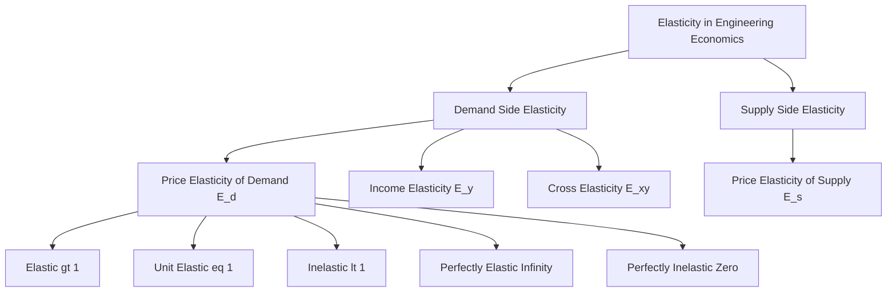
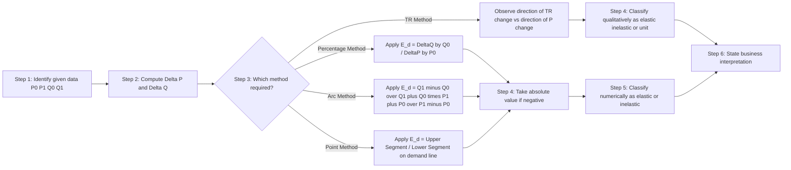
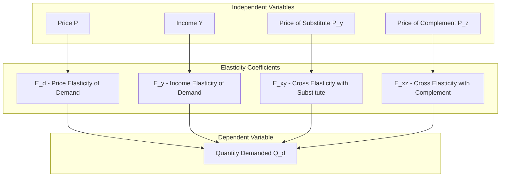
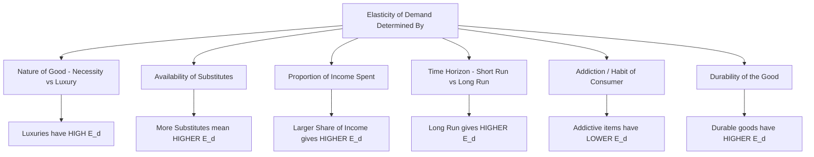

# Elasticity

<!-- SECTION_1_START -->

# Elasticity of Demand and Supply

## 1.1 Core Technical Definition

In the context of Engineering Economics (KTU 2024 Scheme, Course Code: UCHUT346), **elasticity** is a unit-free measure of the responsiveness of one economic variable to a percentage change in another related variable. It quantifies *how sensitive* the dependent variable is to an independent causal variable.

> [!NOTE]
> **Formal Definition (Alfred Marshall, 1890):**
> *"Elasticity of demand is the ratio of the percentage change in quantity demanded to the percentage change in price, all other factors remaining constant (ceteris paribus)."*

For a B.Tech student, the term **elasticity** essentially answers one question: *"If I twist one knob (price, income, price of a substitute), by how much does the output (quantity demanded/supplied) move?"*

### Conceptual Analogy / Intuition

Imagine you are operating a **mechanical spring scale**:
- A *stiff spring* (low elasticity) barely stretches when you add weight.
- A *loose spring* (high elasticity) stretches a great deal for the same added weight.

Elasticity works the same way in economics. A commodity with **high price elasticity** (e.g., luxury cars, restaurant dining) sees its demand collapse sharply when price rises — like a loose spring. A commodity with **low elasticity** (e.g., insulin for diabetics, salt, fuel) sees almost no change in demand even if the price doubles — like a stiff spring.

> [!IMPORTANT]
> **Syllabus Highlight (KTU Module 1 – Basic Economic Problems):**
> The KTU 2024 scheme explicitly tests the learner's ability to *measure, classify, and interpret* elasticity coefficients for both **demand** and **supply**, because these coefficients directly feed into engineering business decisions such as pricing, product mix, and break-even analysis.

The principal elasticity measures covered are:

- **Price Elasticity of Demand (PED or $E_d$)** – responsiveness of $Q_d$ to $P$.
- **Income Elasticity of Demand (YED or $E_y$)** – responsiveness of $Q_d$ to consumer income $Y$.
- **Cross Elasticity of Demand (XED or $E_{xy}$)** – responsiveness of $Q_d$ of good $X$ to $P$ of good $Y$.
- **Price Elasticity of Supply (PES or $E_s$)** – responsiveness of $Q_s$ to $P$.

> [!VISUALIZATION CONTROL]
> **Concept:** Linear demand curve and the geometric zones of elasticity.
> **GeoGebra / Desmos Input Equations:**
> * Linear demand: $Q = 100 - 2P$
> * Mid-point of the line: $(25, 50)$
> * Y-intercept (price-axis): $(0, 50)$
> * X-intercept (quantity-axis): $(50, 0)$
> **Visual Description:** Plot the line. Mark the upper half (above the midpoint) where $E_d > 1$ (elastic), the exact midpoint where $E_d = 1$ (unit elastic), and the lower half where $E_d < 1$ (inelastic). This visually proves that elasticity varies *along* the same demand curve.

---

<!-- SECTION_1_END -->

<!-- SECTION_2_START -->

# Deep Theoretical Analysis & KTU Formula Sheet

## 2.1 Price Elasticity of Demand ($E_d$)

The **coefficient of price elasticity** is mathematically the *ratio of two percentage changes*. Since percentage change is independent of the unit of measurement, elasticity is a **pure number** (no units, no rupees, no kilograms).

### Formal Definition

$$
E_d = \frac{\text{Percentage change in quantity demanded}}{\text{Percentage change in price}}
$$

$$
E_d = \frac{\%\Delta Q_d}{\%\Delta P}
$$

Expanding the percentage:

$$
E_d = \frac{\frac{\Delta Q}{Q}}{\frac{\Delta P}{P}} = \frac{\Delta Q}{\Delta P} \cdot \frac{P}{Q}
$$

> [!NOTE]
> By convention, the law of demand states that $\Delta Q$ and $\Delta P$ move in **opposite directions**, so $E_d$ is theoretically **negative**. KTU board valuation, however, frequently accepts the **absolute value** $\vert E_d \vert$ to keep interpretation simple. We will follow the absolute-value convention below unless stated otherwise.

### 2.1.1 Geometric Insight on a Linear Demand Curve

For a linear demand curve $Q = a - bP$ (downward sloping), the slope $\frac{dQ}{dP} = -b$ is **constant** along the entire line. Yet elasticity is **not constant**. The reason is the second term, $\frac{P}{Q}$, which keeps changing as we move along the curve.

$$
E_d = -b \cdot \frac{P}{Q}
$$

This is the classic KTU derivation — a **favourite 7-mark question**.

## 2.2 The Five Numerical Cases of $E_d$

| Case | Value of $\vert E_d \vert$ | Interpretation | Demand Curve Shape |
|:-----|:--------------------------|:---------------|:-------------------|
| Perfectly Elastic | $\infty$ | Infinitesimal price rise causes demand to fall to zero | Horizontal line parallel to X-axis |
| Perfectly Inelastic | $0$ | Demand does not respond to any price change | Vertical line parallel to Y-axis |
| Relatively Elastic | $> 1$ | Quantity changes by a *larger* percentage than price | Flatter curve |
| Relatively Inelastic | $< 1$ | Quantity changes by a *smaller* percentage than price | Steeper curve |
| Unit Elastic | $= 1$ | Percentage change in $Q$ equals percentage change in $P$ | Rectangular hyperbola |

## 2.3 Income Elasticity of Demand ($E_y$)

$$
E_y = \frac{\%\Delta Q_d}{\%\Delta Y} = \frac{\Delta Q}{\Delta Y} \cdot \frac{Y}{Q}
$$

| Value of $E_y$ | Classification | Example |
|:--------------|:----------------|:--------|
| $E_y > 1$ | Luxury good (Income-elastic) | Foreign holidays, SUVs |
| $0 < E_y < 1$ | Necessity (Income-inelastic) | Rice, milk, mobile recharge |
| $E_y < 0$ | Inferior good | Coarse grain, second-hand clothes |
| $E_y = 1$ | Normal — homothetic good | Standard balanced diet |

## 2.4 Cross Elasticity of Demand ($E_{xy}$)

$$
E_{xy} = \frac{\%\Delta Q_x}{\%\Delta P_y} = \frac{\Delta Q_x}{\Delta P_y} \cdot \frac{P_y}{Q_x}
$$

| Value of $E_{xy}$ | Relationship | Example |
|:------------------|:-------------|:--------|
| $E_{xy} > 0$ | Substitutes (positive sign) | Tea and Coffee |
| $E_{xy} < 0$ | Complements (negative sign) | Cars and Tyres, Printers and Cartridges |
| $E_{xy} = 0$ | Unrelated goods | Shoes and Laptops |

## 2.5 Price Elasticity of Supply ($E_s$)

$$
E_s = \frac{\%\Delta Q_s}{\%\Delta P} = \frac{\Delta Q_s}{\Delta P} \cdot \frac{P}{Q_s}
$$

| Factor | Effect on $E_s$ | Engineering/Business Reason |
|:-------|:----------------|:-----------------------------|
| Spare capacity available | Increases $E_s$ | Plants can ramp production quickly |
| Stockpiling possible | Increases $E_s$ | Inventory absorbs shocks |
| Production is complex/long gestation | Decreases $E_s$ | Capacity cannot be added overnight |
| Perishable goods | Decreases $E_s$ | Cannot withhold supply |

## 2.6 The Three Methods of Measurement

The KTU syllabus requires the student to know *three* numerical methods. They differ only in whether price is the starting point or quantity is the starting point, and whether we use exact points or averages.

### 2.6.1 Percentage Method (Proportionate Method)

$$
E_d = \frac{\frac{Q_1 - Q_0}{Q_0}}{\frac{P_1 - P_0}{P_0}}
$$

### 2.6.2 Geometric / Point Method (used for a *specific* point on a demand curve)

$$
E_d = \frac{\text{Lower segment of the demand curve}}{\text{Upper segment of the demand curve}}
$$

### 2.6.3 Arc Method (used between *two* points, takes the *average* of the two prices and quantities)

$$
E_d = \frac{Q_1 - Q_0}{Q_1 + Q_0} \cdot \frac{P_1 + P_0}{P_1 - P_0}
$$

> [!IMPORTANT]
> **Why does the Arc method exist?**
> If we use the percentage method, the answer depends on whether we move *from* point A to point B, or *from* point B to point A. The arc method uses the *mean* of the two prices and quantities in the denominator, which makes the elasticity coefficient **directional-symmetric**.

## 2.7 The Total Outlay Method (Total Expenditure Test)

For a price *decrease*:
- If Total Revenue (TR) **rises** → $\vert E_d \vert > 1$ (elastic).
- If TR **stays constant** → $\vert E_d \vert = 1$ (unit elastic).
- If TR **falls** → $\vert E_d \vert < 1$ (inelastic).

This is the *qualitative* version of the same question and is useful when the student is not given numbers but only the revenue behaviour.

## 2.8 Real-World Engineering Utility

Elasticity is not an abstract classroom concept. It directly drives several engineering business decisions:

1. **Pricing of new product launches** — A product with high $E_d$ (e.g., a consumer-electronics gadget) should *not* be priced too high because demand will collapse disproportionately.
2. **Government tax policy** — A tax on cigarettes (inelastic) raises revenue without drastically reducing consumption; a tax on restaurant dining (elastic) reduces consumption sharply.
3. **Inventory and production planning** — A component supplier whose customers face elastic demand must build a *flexible* supply chain; if demand is inelastic, the supplier can rely on long production runs.
4. **Break-even analysis tie-in** — A KTU Module 2 / 3 problem on break-even often asks for the change in profit when price changes; this change is fundamentally governed by the elasticity coefficient.

---

<!-- SECTION_2_END -->

<!-- SECTION_3_START -->

# Step-by-Step Derivations, Numerical Examples, and Worked Solutions

## 3.1 Derivation of the Point-Elasticity Formula on a Linear Demand Curve

Consider a linear demand schedule plotted as a straight line from point $A$ on the Y-axis to point $B$ on the X-axis, as shown in the GeoGebra visualization in Section 1. Let the consumer move from any two points, say $A$ and $B$, with $A$ being the new point and $B$ being the original point.

**Step 1: Write the demand function.**
Let the line have Y-intercept (price-axis intercept) at price $P_1$ and X-intercept (quantity-axis intercept) at quantity $Q_1$. The slope is $-\frac{P_1}{Q_1}$.

$$
Q = Q_1 - \frac{Q_1}{P_1} \cdot P
$$

**Step 2: Find the slope of the demand curve.**
By differentiation:

$$
\frac{dQ}{dP} = -\frac{Q_1}{P_1}
$$

**Step 3: Substitute into the point-elasticity formula.**

$$
E_d = -\frac{dQ}{dP} \cdot \frac{P}{Q}
$$

$$
E_d = -\left( -\frac{Q_1}{P_1} \right) \cdot \frac{P}{Q}
$$

$$
E_d = \frac{Q_1}{P_1} \cdot \frac{P}{Q}
$$

**Step 4: Geometrically, on the linear demand line, take any point $N$ on the line. Drop a perpendicular to the Y-axis at $P$ and to the X-axis at $Q$.**

Let the *lower segment* of the line below the point $N$ be $NB$ and the *upper segment* above $N$ be $NA$. The point $N$ divides the line into two segments.

From similar triangles:

$$
\frac{NB}{AB} = \frac{Q}{Q_1} \quad \text{and} \quad \frac{NA}{AB} = \frac{P}{P_1}
$$

Dividing these two:

$$
\frac{NB}{NA} = \frac{Q \cdot P_1}{P \cdot Q_1}
$$

Taking the reciprocal:

$$
\frac{NA}{NB} = \frac{P \cdot Q_1}{Q \cdot P_1}
$$

But the right-hand side is exactly $E_d$ from Step 3. Therefore:

$$
E_d = \frac{NA}{NB} = \frac{\text{Upper segment of the demand curve}}{\text{Lower segment of the demand curve}}
$$

This completes the geometric derivation.

> [!IMPORTANT]
> **Engineering-Economics Interpretation:**
> If the consumer is sitting at the *midpoint* of a straight-line demand curve, then $NA = NB$, and $E_d = 1$. If the consumer moves towards the Y-axis (high price, low quantity), the upper segment shrinks and the lower segment grows, so $E_d > 1$ (elastic). The reverse holds near the X-axis.

## 3.2 Worked Example 1 — Percentage Method

**Problem (KTU-style 3-mark):**
When the price of a commodity falls from **Rs. 20** to **Rs. 18** per unit, the quantity demanded rises from **400 units** to **500 units**. Calculate the price elasticity of demand using the percentage method.

**Solution:**

Let the original point be subscript $0$ and the new point be subscript $1$.

Original price $P_0 = 20$, new price $P_1 = 18$.

Original quantity $Q_0 = 400$, new quantity $Q_1 = 500$.

$$
\Delta P = P_1 - P_0 = 18 - 20 = -2
$$

$$
\Delta Q = Q_1 - Q_0 = 500 - 400 = +100
$$

Now apply the percentage method:

$$
E_d = \frac{\frac{\Delta Q}{Q_0}}{\frac{\Delta P}{P_0}}
$$

$$
E_d = \frac{\frac{100}{400}}{\frac{-2}{20}}
$$

$$
E_d = \frac{0.25}{-0.10}
$$

$$
E_d = -2.5
$$

Taking the absolute value (KTU convention):

$$
\vert E_d \vert = 2.5
$$

Since $\vert E_d \vert > 1$, demand is **elastic** — a 1% fall in price leads to a 2.5% rise in quantity demanded.

## 3.3 Worked Example 2 — Arc Method

**Problem (KTU-style 3-mark):**
The same demand schedule, but calculate using the arc (average) method.

**Solution:**

The arc method uses the **mean** of the two prices and the mean of the two quantities in the denominator.

$$
E_d^{arc} = \frac{Q_1 - Q_0}{Q_1 + Q_0} \cdot \frac{P_1 + P_0}{P_1 - P_0}
$$

$$
E_d^{arc} = \frac{500 - 400}{500 + 400} \cdot \frac{18 + 20}{18 - 20}
$$

$$
E_d^{arc} = \frac{100}{900} \cdot \frac{38}{-2}
$$

$$
E_d^{arc} = 0.1111 \cdot (-19)
$$

$$
E_d^{arc} = -2.111
$$

Taking the absolute value:

$$
\vert E_d^{arc} \vert = 2.11
$$

Notice that the arc method gives a different numerical value (**2.11**) from the percentage method (**2.5**). This is precisely why the arc method is recommended when the percentage change is large (greater than 5%).

## 3.4 Worked Example 3 — Income Elasticity and Commodity Classification

**Problem:**
A consumer's monthly income rises from **Rs. 50,000** to **Rs. 55,000**. As a result, her consumption of organic pulses rises from **10 kg** to **12 kg** per month. Calculate the income elasticity and classify the good.

**Solution:**

$$
E_y = \frac{\Delta Q}{\Delta Y} \cdot \frac{Y_0}{Q_0}
$$

$$
E_y = \frac{12 - 10}{55000 - 50000} \cdot \frac{50000}{10}
$$

$$
E_y = \frac{2}{5000} \cdot 5000
$$

$$
E_y = 2
$$

Since $E_y = 2 > 1$, organic pulses behave like a **luxury good** in this consumer's basket. A 10% rise in income leads to a 20% rise in consumption.

## 3.5 Worked Example 4 — Cross Elasticity and Substitute Detection

**Problem:**
The price of a substitute brand "BevPro" rises from **Rs. 100** to **Rs. 120**. As a result, the sales of "FreshSip" rise from **800 units** to **1100 units** per day. Calculate cross elasticity and identify the relationship.

**Solution:**

Good $X$ is FreshSip, good $Y$ is BevPro (the substitute whose price is changing).

$$
E_{xy} = \frac{\Delta Q_x}{\Delta P_y} \cdot \frac{P_{y,0}}{Q_{x,0}}
$$

$$
E_{xy} = \frac{1100 - 800}{120 - 100} \cdot \frac{100}{800}
$$

$$
E_{xy} = \frac{300}{20} \cdot 0.125
$$

$$
E_{xy} = 15 \cdot 0.125
$$

$$
E_{xy} = 1.875
$$

Since $E_{xy}$ is **positive**, the two goods are **substitutes**. The fact that the coefficient is greater than 1 indicates they are *close* substitutes — consumers readily switch.

## 3.6 Worked Example 5 — Total Outlay Method (Conceptual)

**Problem:**
For a particular commodity, when price falls by 20%, total revenue rises by 10%. Determine the category of elasticity.

**Solution (no algebra required, KTU conceptual question):**

- Price fell (negative change in $P$).
- Total revenue **rose** despite the price fall.
- This implies volume rose by *more* than 20% (so that even at the lower price, revenue grew).
- Therefore, $\vert E_d \vert > 1$.
- The demand is **elastic** in this price range.

## 3.7 Master Table — KTU Formula Sheet (Comprehensive)

| Concept | Mathematical Expression | Sign Convention | Unit |
|:--------|:------------------------|:----------------|:-----|
| Price Elasticity of Demand | $E_d = \frac{\Delta Q}{\Delta P} \cdot \frac{P}{Q}$ | Negative (use $\vert E_d \vert$ for magnitude) | Unitless |
| Income Elasticity | $E_y = \frac{\Delta Q}{\Delta Y} \cdot \frac{Y}{Q}$ | Positive for normal goods | Unitless |
| Cross Elasticity | $E_{xy} = \frac{\Delta Q_x}{\Delta P_y} \cdot \frac{P_y}{Q_x}$ | $+$ for substitutes, $-$ for complements | Unitless |
| Supply Elasticity | $E_s = \frac{\Delta Q_s}{\Delta P} \cdot \frac{P}{Q_s}$ | Positive (Law of Supply) | Unitless |
| Arc Method (Demand) | $E_d = \frac{Q_1 - Q_0}{Q_1 + Q_0} \cdot \frac{P_1 + P_0}{P_1 - P_0}$ | Direction-symmetric | Unitless |
| Point Method (Demand) | $E_d = \frac{\text{Upper segment}}{\text{Lower segment}}$ | Geometric ratio | Unitless |
| TR Method | $\Delta TR$ and $\Delta P$ move in opposite directions $\Rightarrow$ elastic | Qualitative | None |

## 3.8 Cross-Verification by Graphical Intuition

For a demand curve $Q = 100 - 2P$:

- At $P = 10$, $Q = 80$. Then $E_d = \left( -\frac{1}{2} \right) \cdot \frac{10}{80}$... wait, that slope is wrong. Let me recompute: $\frac{dQ}{dP} = -2$. So $E_d = -(-2) \cdot \frac{10}{80} = \frac{20}{80} = 0.25$ (inelastic).
- At $P = 40$, $Q = 20$. Then $E_d = 2 \cdot \frac{40}{20} = 4$ (elastic).
- At $P = 25$, $Q = 50$ (midpoint). Then $E_d = 2 \cdot \frac{25}{50} = 1$ (unit elastic).

This confirms our GeoGebra visualization in Section 1.

---

<!-- SECTION_3_END -->

<!-- SECTION_4_START -->

# Structural Diagrams & Schematics

## 4.1 Concept Map — Master Elasticity Tree

## 4.2 Sequential Processing Topology — How to Solve an Elasticity Problem

## 4.3 Functional Architecture — Demand Function and Its Sensitivities

## 4.4 Block Diagram — Factors Affecting Elasticity of Demand

## 4.5 Sequential Topology Matrix — Measurement Method Selection

| Scenario in the Question | Recommended Method | Reason |
|:-------------------------|:-------------------|:-------|
| Small percentage change (less than 5%) | Percentage Method | Algebraic shortcut works fine |
| Large percentage change (greater than 5%) | Arc Method | Eliminates directional bias |
| Geometric / diagram-based question | Point Method | The segments are visible on the graph |
| Only revenue behaviour is described | TR Method | Pure qualitative inference |
| Two points given, no diagram | Arc Method | Most accurate numeric answer |

---

<!-- SECTION_4_END -->

<!-- SECTION_5_START -->

# KTU 2024 Scheme Examination Question Bank

## Part A — Short Answer Questions (3 Marks Each)

### Question 1

`[KTU University Exam - July 2024]`

> **CO1 | Remember**
> Define the term *Elasticity of Demand*. State any two factors that influence it.

**Model Answer (3 Marks):**

> **Definition (2 Marks):**
> Elasticity of demand measures the responsiveness of the quantity demanded of a commodity to a change in its determinants (price, income, or related-goods' prices). Mathematically, it is the ratio of the percentage change in quantity demanded to the percentage change in the independent variable.
>
> **Two Factors (1 Mark):**
> 1. **Availability of close substitutes** — More substitutes → higher price elasticity.
> 2. **Nature of the good** — Necessities (salt, rice) have low elasticity; luxuries (air-conditioning, imported watches) have high elasticity.

### Question 2

`[KTU University Exam - December 2023]`

> **CO1 | Understand**
> Distinguish between *Perfectly Elastic* and *Perfectly Inelastic* demand. Give one example for each.

**Model Answer (3 Marks):**

> **Perfectly Elastic Demand:** Quantity demanded changes infinitely for any infinitesimal change in price. The demand curve is a **horizontal straight line** parallel to the X-axis. $\vert E_d \vert = \infty$. Example: Agricultural products in a perfectly competitive market — a single farmer cannot charge above the market price.
>
> **Perfectly Inelastic Demand:** Quantity demanded does not change at all with price. The demand curve is a **vertical straight line** parallel to the Y-axis. $\vert E_d \vert = 0$. Example: Life-saving drugs like insulin for a chronic diabetic patient (1 Mark for distinction + 1 Mark for each example = 3 Marks).

---

## Part B — Long Answer Questions (14 Marks Each, Module Internal Choice)

> **KTU ESE Pattern (Module 1):** Each question carries 14 marks with sub-parts (a) for 7 marks and (b) for 7 marks. The cognitive levels escalate from *Understand* in (a) to *Apply* in (b).

---

### Question A (14 Marks)

`[KTU University Exam - July 2024]`

> **CO2, CO3 | Understand → Apply**

**(a)** Explain the *Total Outlay Method* of measuring elasticity of demand. State the conditions under which the demand is classified as elastic, unit elastic, and inelastic. **(7 Marks)**

**(b)** When the price of a product falls from **Rs. 50** to **Rs. 40**, the quantity demanded rises from **1000 units** to **1400 units**.

1. Calculate the price elasticity of demand using the **percentage method**.
2. Calculate the price elasticity of demand using the **arc method**.
3. State whether the demand is elastic or inelastic in this range. **(7 Marks)**

---

#### Model Solution for Question A

##### Part (a) — Total Outlay Method (7 Marks)

> **Concept (2 Marks):**
> The Total Outlay (or Total Revenue) Method, popularised by Alfred Marshall, is a *qualitative* test of elasticity. It does not compute a numerical coefficient; instead, it infers the elasticity category by observing what happens to the total revenue (TR = $P \times Q$) when the price changes.

> **Three Cases (3 Marks):**
>
> 1. **Elastic Demand ($\vert E_d \vert > 1$):** When price falls, TR rises; when price rises, TR falls. Percentage change in $Q$ is *larger* than percentage change in $P$.
> 2. **Unit Elastic Demand ($\vert E_d \vert = 1$):** When price changes, TR remains *constant*. Percentage change in $Q$ exactly offsets percentage change in $P$.
> 3. **Inelastic Demand ($\vert E_d \vert < 1$):** When price falls, TR falls; when price rises, TR rises. Percentage change in $Q$ is *smaller* than percentage change in $P$.

> **One Exception (1 Mark):**
> The TR method fails in the case of *inferior goods* and *Giffen goods* where the demand curve is upward-sloping in some range. The student must mention this caveat for full marks.

> **Diagrammatic Presentation (1 Mark):**
> A simple demand curve with three zones — upper half (elastic), midpoint (unit elastic), lower half (inelastic) — labelled correctly.

##### Part (b) — Numerical Computation (7 Marks)

**Step 1: Tabulate given data (1 Mark).**

| Variable | Original Point | New Point |
|:---------|:--------------|:----------|
| Price $P$ | $P_0 = 50$ | $P_1 = 40$ |
| Quantity $Q$ | $Q_0 = 1000$ | $Q_1 = 1400$ |

**Step 2: Compute the changes (1 Mark).**

$$
\Delta P = P_1 - P_0 = 40 - 50 = -10
$$

$$
\Delta Q = Q_1 - Q_0 = 1400 - 1000 = +400
$$

**Step 3: Apply the percentage method (2 Marks).**

$$
E_d^{pct} = \frac{\Delta Q / Q_0}{\Delta P / P_0} = \frac{400 / 1000}{-10 / 50}
$$

$$
E_d^{pct} = \frac{0.40}{-0.20} = -2.0
$$

[Setting up the formula: 1 Mark; substituting values: 1 Mark]

**Step 4: Apply the arc method (2 Marks).**

$$
E_d^{arc} = \frac{Q_1 - Q_0}{Q_1 + Q_0} \cdot \frac{P_1 + P_0}{P_1 - P_0}
$$

$$
E_d^{arc} = \frac{1400 - 1000}{1400 + 1000} \cdot \frac{40 + 50}{40 - 50}
$$

$$
E_d^{arc} = \frac{400}{2400} \cdot \frac{90}{-10}
$$

$$
E_d^{arc} = 0.1667 \cdot (-9) = -1.5
$$

[Writing the formula: 1 Mark; final value: 1 Mark]

**Step 5: Classification (1 Mark).**

Both methods give a magnitude greater than 1, so demand is **elastic** in the price range Rs. 40 to Rs. 50.

> [!WARNING]
> **KTU Examiner's Valuation Pitfalls:**
> 1. **Do not forget the absolute value** — Students often write $E_d = -2$ and stop. The board expects $\vert E_d \vert = 2$ for the magnitude and a clear classification.
> 2. **Do not mix percentage and arc methods** — The two methods are *alternative* calculations; do not average them. State both and classify consistently.
> 3. **Sign convention must be stated once** — At least one sentence explaining that the negative sign is dropped by convention is worth 0.5 to 1 mark depending on the examiner.

---

### Question B (14 Marks) — Internal Choice Alternative

`[KTU University Exam - December 2023]`

> **CO2, CO3 | Understand → Apply**

**(a)** Explain the *Point Method* of measuring price elasticity of demand. Derive the relationship $E_d = \frac{\text{Upper segment}}{\text{Lower segment}}$ for a linear demand curve. **(7 Marks)**

**(b)** The demand function for a commodity is given by $Q = 200 - 4P$.

1. Find the price elasticity of demand when $P = 20$.
2. Find the price elasticity of demand when $P = 40$.
3. At what price is demand unit elastic? What is the total revenue at that price? **(7 Marks)**

---

#### Model Solution for Question B

##### Part (a) — Point Method Derivation (7 Marks)

> **Definition (1 Mark):**
> The point method of elasticity measures elasticity at a *specific point* on a straight-line demand curve. It uses the geometric segments into which the point divides the demand line.

> **Setup (2 Marks):**
> Consider a linear demand curve $AB$ where $A$ lies on the Y-axis (price intercept $P_1$) and $B$ lies on the X-axis (quantity intercept $Q_1$). Let $N$ be the point of measurement, with coordinates $(Q, P)$, dividing the line into upper segment $AN$ and lower segment $NB$.

> **Derivation (3 Marks):**
> The slope of the line $AB$ is $-\frac{P_1}{Q_1}$, so $\frac{dQ}{dP} = -\frac{Q_1}{P_1}$.
>
> Substituting into the point formula:
>
> $$
> E_d = -\frac{dQ}{dP} \cdot \frac{P}{Q} = \frac{Q_1}{P_1} \cdot \frac{P}{Q}
> $$
>
> By similar triangles, $\frac{P}{P_1} = \frac{AN}{AB}$ and $\frac{Q}{Q_1} = \frac{NB}{AB}$. Therefore:
>
> $$
> E_d = \frac{Q_1}{P_1} \cdot \frac{P}{Q} = \frac{1}{(P/P_1) \cdot (Q_1/Q)} = \frac{1}{(AN/AB) \cdot (AB/NB)} = \frac{AB}{AN} \cdot \frac{AB}{NB}
> $$
>
> Wait, let me redo this more cleanly:
>
> $$
> E_d = \frac{Q_1}{P_1} \cdot \frac{P}{Q} = \frac{Q_1}{Q} \cdot \frac{P}{P_1}
> $$
>
> Since $\frac{Q_1}{Q} = \frac{AB}{NB}$ and $\frac{P}{P_1} = \frac{AN}{AB}$:
>
> $$
> E_d = \frac{AB}{NB} \cdot \frac{AN}{AB} = \frac{AN}{NB}
> $$
>
> Hence $E_d = \frac{\text{Upper segment } AN}{\text{Lower segment } NB}$.

> **Conclusion (1 Mark):**
> If $AN > NB$, point is in the upper half (elastic); if $AN < NB$, point is in the lower half (inelastic); if $AN = NB$, point is at the midpoint (unit elastic).

##### Part (b) — Numerical Computation (7 Marks)

**Given:** $Q = 200 - 4P$, so $\frac{dQ}{dP} = -4$.

**Step 1: Elasticity at $P = 20$ (2 Marks).**

At $P = 20$: $Q = 200 - 4(20) = 200 - 80 = 120$.

$$
E_d = -(-4) \cdot \frac{20}{120} = 4 \cdot \frac{1}{6} = \frac{2}{3} = 0.667
$$

[Formula: 1 Mark; final answer: 1 Mark]

Since $E_d < 1$, demand is **inelastic** at this price.

**Step 2: Elasticity at $P = 40$ (2 Marks).**

At $P = 40$: $Q = 200 - 4(40) = 200 - 160 = 40$.

$$
E_d = 4 \cdot \frac{40}{40} = 4
$$

[Formula: 1 Mark; final answer: 1 Mark]

Since $E_d = 4 > 1$, demand is **highly elastic** at this price.

**Step 3: Unit elastic price and corresponding TR (3 Marks).**

Set $E_d = 1$:

$$
4 \cdot \frac{P}{Q} = 1
$$

But $Q = 200 - 4P$, so:

$$
4 \cdot \frac{P}{200 - 4P} = 1
$$

$$
4P = 200 - 4P
$$

$$
8P = 200
$$

$$
P = 25
$$

[Setting up equation: 1 Mark; solving: 1 Mark; final answer: 1 Mark]

Quantity at this price: $Q = 200 - 4(25) = 200 - 100 = 100$.

Total revenue: $TR = P \times Q = 25 \times 100 = \text{Rs. } 2500$.

> [!WARNING]
> **KTU Examiner's Valuation Pitfalls:**
> 1. **Do not forget the negative sign in the slope** — $\frac{dQ}{dP} = -4$ for a downward-sloping demand. Students often drop the sign and report $E_d = -0.667$, losing 0.5 marks.
> 2. **Always quote the unit** — The answer is "Rs. 2500", not just "2500". The board awards a 0.5 mark bonus for correct unit notation in the TR question.
> 3. **Verify your answer is at the midpoint** — For a linear demand function, the unit-elastic point is *always* the geometric midpoint. Here, midpoint of $P$ (between 0 and 50) is 25, and midpoint of $Q$ (between 0 and 200) is 100. The fact that $P = 25$ and $Q = 100$ confirms the calculation.

---

## Topic Recap & Important Things to Remember

- **Elasticity is a ratio of percentage changes** — it is **unit-free** and **dimensionless**.
- **Demand-side elasticities** are: $E_d$ (price), $E_y$ (income), $E_{xy}$ (cross).
- **Supply-side elasticity** is $E_s$ (always positive due to the law of supply).
- **Five categories of $E_d$:** $\infty$ (perfectly elastic), $> 1$ (elastic), $= 1$ (unit), $< 1$ (inelastic), $0$ (perfectly inelastic).
- **Point Method** applies to a *single* point on a linear demand curve: $E_d = \frac{\text{Upper segment}}{\text{Lower segment}}$.
- **Arc Method** applies *between two* points using averages: $E_d = \frac{Q_1 - Q_0}{Q_1 + Q_0} \cdot \frac{P_1 + P_0}{P_1 - P_0}$.
- **Percentage Method** uses the original values in the denominator.
- **TR Method** is qualitative: opposite-direction movement of $P$ and $TR$ implies elastic demand.
- **Income Elasticity $> 1$** indicates a luxury; **$0 < E_y < 1$** is a necessity; **$E_y < 0$** is an inferior good.
- **Cross Elasticity positive** = substitutes; **negative** = complements; **zero** = unrelated.
- **Linear demand curve exception:** Slope is constant, but elasticity *changes* along the curve — elastic in the upper half, unit elastic at the midpoint, inelastic in the lower half.
- **Sign convention for $E_d$:** Always report $\vert E_d \vert$ for the magnitude, since the sign is conventionally negative (law of demand).
- **Engineering application link:** Elasticity coefficients feed directly into break-even analysis, pricing strategy, and tax-incidence calculations.
- **Common valuation trap:** Do not confuse "arc" and "percentage" methods. The arc method always uses the *sum* (or average) of the two values; the percentage method uses the *original* value.
- **Most-tested KTU question pattern:** Compute $E_d$ by two methods, then state classification and business implication. A 7-mark sub-part typically requires: setup (2 marks), computation (3 marks), classification (1 mark), interpretation (1 mark).

<!-- SECTION_5_END -->
