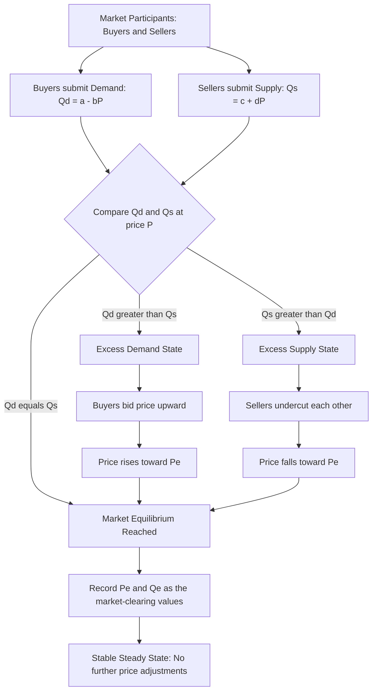
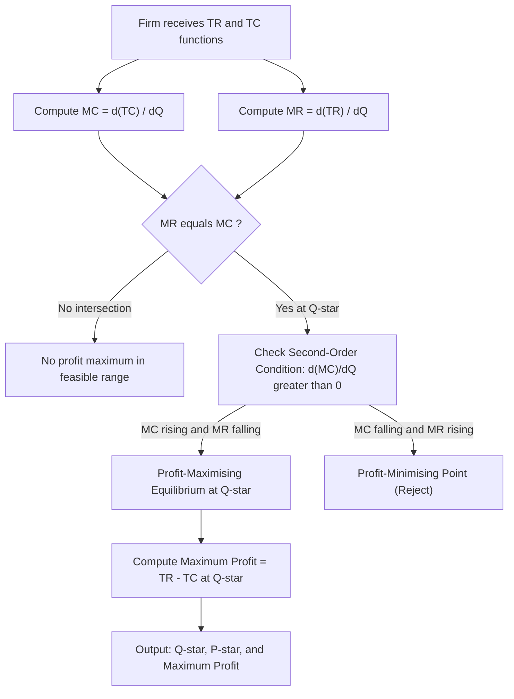
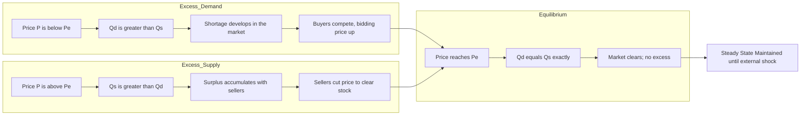

# Equilibrium

<!-- SECTION_1_START -->

# Equilibrium — Core Technical Definition & Intuitive Overview

## Formal Academic Definition

> [!IMPORTANT]
> **Economic Equilibrium** is a state of rest in which the economic forces operating on a given variable (such as price, quantity demanded, quantity supplied, or output of a firm) are mutually balanced, so that the variable has no inherent tendency to change further.

In a **free market economy**, equilibrium is achieved at the intersection of the **Market Demand Curve (D)** and the **Market Supply Curve (S)**. At this point of intersection, the quantity demanded by buyers exactly equals the quantity supplied by sellers, and the corresponding market-clearing price is termed the **Equilibrium Price ($P_e$)**, while the traded volume is the **Equilibrium Quantity ($Q_e$)**.

> [!NOTE]
> The Latin term *aequilibrium* literally means *equal balance*. In KTU 2024 Scheme terminology, equilibrium is the **steady-state condition** where planned expenditure equals planned output in the circular flow, and there is neither an unsold surplus nor an unmet shortage.

## Conceptual Analogy & Intuition

> [!TIP]
> **Analogy — The Tug-of-War Equilibrium**
> Imagine a tug-of-war between two equally strong teams. As long as the rope stays still, both teams are pulling with exactly the same force. The position of the knot on the rope is the **equilibrium point** — neither team can drag it further.
>
> - **Buyers pull DOWN on the price** (they want to pay less).
> - **Sellers push UP on the price** (they want to charge more).
> - When the downward push exactly equals the upward push, the market "knot" stops moving — this is **Market Equilibrium**.

**Geometric Intuition:** Visualize a standard $P$ (price) versus $Q$ (quantity) graph. The demand curve slopes **downward** from left to right, and the supply curve slopes **upward**. They cross at exactly one point under stable conditions. That crossing point is the **point of equilibrium**.

## Real-World Engineering Economics Application

> [!EXAMPLE]
> An engineering firm like **Tata Motors** determines its production equilibrium by equating Marginal Revenue ($MR$) to Marginal Cost ($MC$). Below this point, producing one more car adds more to revenue than to cost — profits rise. Above it, each extra car costs more than it earns — profits fall. The $MR = MC$ point is the *most profitable output*, which is the firm's **producer's equilibrium**.

## Standard Economic Constants & Key Metrics

- **Law of One Price:** At equilibrium, identical goods sell for the same price in competitive markets.
- **Adam Smith's "Invisible Hand" Mechanism:** The price acts as the signalling device guiding the market to equilibrium.
- **Walrasian Adjustment (Price Taker Markets):** Prices adjust to clear excess demand or excess supply. This is the standard assumption in KTU Module 1.

> [!VISUALIZATION CONTROL]
> **Concept:** Demand–Supply Equilibrium Intersection
> **GeoGebra / Desmos Input Equations:**
> * `D: Q = 100 - 2P` (Linear demand)
> * `S: Q = 20 + 2P` (Linear supply)
> **Visual Description:** The student should observe a downward-sloping line (D), an upward-sloping line (S), and their intersection at the point $(Q_e = 60, P_e = 20)$. The vertical line at $Q = 60$ shows the equilibrium quantity, and the horizontal line at $P = 20$ shows the equilibrium price.

---

<!-- SECTION_1_END -->

<!-- SECTION_2_START -->

# Deep Theoretical Analysis & KTU High-Yield Formula Sheet

## Conditions for Market Equilibrium

The market is said to be in equilibrium when **all three** of the following independent conditions are satisfied simultaneously:

1. **Quantity Condition:** $Q_d = Q_s$ — buyers' desired purchases equal sellers' desired sales.
2. **Price Condition:** The market price equals the equilibrium price, i.e., $P = P_e$. At this price, the market clears.
3. **Stability Condition:** Any small deviation from $P_e$ creates a corrective force that pushes the market back to $P_e$.

> [!IMPORTANT]
> **Disequilibrium States (KTU Board-Favourite Distinction):**
> - **Excess Demand (Shortage):** When $P < P_e$, then $Q_d > Q_s$. Buyers compete for limited goods, bidding the price *upward* toward $P_e$.
> - **Excess Supply (Surplus):** When $P > P_e$, then $Q_s > Q_d$. Sellers undercut each other to clear stock, driving the price *downward* toward $P_e$.

## Types of Economic Equilibrium

| Type | Definition | KTU Module Mapping |
|---|---|---|
| **Partial Equilibrium** | Analysis of a single market in isolation, holding other markets constant (Marshallian) | Core KTU Module 1 |
| **General Equilibrium** | All markets in the economy are simultaneously in equilibrium (Walrasian) | Higher-order concept |
| **Consumer's Equilibrium** | A consumer maximises utility subject to a budget constraint: $\dfrac{MU_x}{P_x} = \dfrac{MU_y}{P_y}$ | Utility analysis |
| **Producer's / Firm's Equilibrium** | A firm maximises profit where $MR = MC$, with $MC$ rising (second-order condition) | Production theory |
| **Short-Run Equilibrium** | Firm produces where $SRMC = MR$ (or $P$); fixed inputs cannot change | KTU Module 2/3 |
| **Long-Run Equilibrium** | All inputs variable; $LRAC$ is at minimum and $P = LRAC$ (normal profits only) | KTU Module 3 |

## Mathematical Formulation — Linear Case

For the standard linear case tested in KTU university exams:

$$\text{Demand Function: } Q_d = a - bP \quad (a, b > 0)$$

$$\text{Supply Function: } Q_s = c + dP \quad (c \ge 0, \, d > 0)$$

At equilibrium, $Q_d = Q_s$:

$$a - bP_e = c + dP_e$$

$$\boxed{P_e = \dfrac{a - c}{b + d}}$$

Substituting $P_e$ back into either equation:

$$Q_e = a - b \cdot \left(\dfrac{a - c}{b + d}\right) = \dfrac{a(b + d) - b(a - c)}{b + d} = \dfrac{ad + bc}{b + d}$$

$$\boxed{Q_e = \dfrac{ad + bc}{b + d}}$$

## KTU Formula Sheet / Cheat Sheet

| # | Concept | Formula / Condition | Unit / Interpretation |
|---|---|---|---|
| 1 | Market Equilibrium Condition | $Q_d = Q_s$ | Units of goods |
| 2 | Equilibrium Price | $P_e = \dfrac{a - c}{b + d}$ | Currency units (\$ / ₹) |
| 3 | Equilibrium Quantity | $Q_e = \dfrac{ad + bc}{b + d}$ | Units of goods |
| 4 | Excess Demand | $ED = Q_d - Q_s$ at given $P$ | Positive = shortage |
| 5 | Excess Supply | $ES = Q_s - Q_d$ at given $P$ | Positive = surplus |
| 6 | Consumer's Equilibrium (2 goods) | $\dfrac{MU_x}{P_x} = \dfrac{MU_y}{P_y} = \lambda$ | Equimarginal principle |
| 7 | Producer's Equilibrium | $MR = MC$ AND $\dfrac{d(MC)}{dQ} > 0$ | Profit-maximisation |
| 8 | Elasticity of Demand at Equilibrium | $E_d = \left\vert \dfrac{dQ}{dP} \cdot \dfrac{P_e}{Q_e} \right\vert$ | Dimensionless |
| 9 | Price Ceiling Binding Condition | $P_{\text{ceiling}} < P_e$ | Creates shortage |
| 10 | Price Floor Binding Condition | $P_{\text{floor}} > P_e$ | Creates surplus |

> [!WARNING]
> **PITFALL:** Always check that $\dfrac{dQ_d}{dP} < 0$ (Law of Demand) and $\dfrac{dQ_s}{dP} > 0$ (Law of Supply). If signs are reversed, swap the labels — the KTU examiner will award **zero** marks if a student labels supply as demand.

## Real-World Engineering and CS Utility

- **Inventory Management:** A warehouse operating at equilibrium stock minimises holding and stockout costs — directly relevant to operations research in supply chain engineering.
- **Algorithmic Pricing:** E-commerce platforms (Amazon, Flipkart) use real-time demand–supply equilibration algorithms to dynamically set prices.
- **Network Engineering:** TCP congestion control reaches an equilibrium where throughput matches link capacity, with packet loss acting as the price signal.
- **Energy Markets:** In smart grids, equilibrium pricing balances electricity supply (generators) and demand (consumers) at every minute.

---

<!-- SECTION_2_END -->

<!-- SECTION_3_START -->

# Step-by-Step Derivations, Worked Problems & Symbolic Implementation

## Derivation 1 — Solving for Linear Equilibrium

**Problem Statement:** Given the demand and supply equations of a commodity:
$$Q_d = 60 - 2P \quad \text{and} \quad Q_s = 12 + 4P$$
Find the equilibrium price and quantity. Verify stability.

### Step-by-Step Algebraic Derivation

**Step 1 — Set Demand equal to Supply (Equilibrium Condition):**

$$Q_d = Q_s \implies 60 - 2P = 12 + 4P$$

*[Marking Logic: Stating the equilibrium condition $Q_d = Q_s$: 1 Mark]*

**Step 2 — Collect constant terms on one side, $P$-terms on the other:**

$$60 - 12 = 4P + 2P$$

$$48 = 6P$$

**Step 3 — Solve for $P_e$:**

$$P_e = \dfrac{48}{6} = 8$$

*[Marking Logic: Final simplified equilibrium price: 1 Mark]*

**Step 4 — Substitute $P_e = 8$ back into the demand equation:**

$$Q_e = 60 - 2(8) = 60 - 16 = 44$$

*[Marking Logic: Substitution step and final equilibrium quantity: 1 Mark]*

**Step 5 — Verify using the supply equation (cross-check):**

$$Q_s \big|_{P=8} = 12 + 4(8) = 12 + 32 = 44 \quad \checkmark$$

**Step 6 — Stability verification:** Both curves have correct slopes ($dQ_d/dP = -2 < 0$ and $dQ_s/dP = 4 > 0$), so the equilibrium is **stable**.

### Final Result

$$\boxed{P_e = 8 \text{ units of currency}, \quad Q_e = 44 \text{ units of the commodity}}$$

## Derivation 2 — Excess Demand and Surplus Analysis

**Problem Statement:** At the equilibrium point derived above ($P_e = 8$, $Q_e = 44$), determine what happens if the government imposes a price ceiling of $P_c = 6$.

**Step 1 — Quantity demanded at $P = 6$:**

$$Q_d = 60 - 2(6) = 60 - 12 = 48$$

**Step 2 — Quantity supplied at $P = 6$:**

$$Q_s = 12 + 4(6) = 12 + 24 = 36$$

**Step 3 — Excess Demand Calculation:**

$$ED = Q_d - Q_s = 48 - 36 = 12 \text{ units}$$

**Step 4 — Economic Interpretation:**

Since $P_c = 6 < P_e = 8$, the ceiling is **binding**, creating a **shortage of 12 units**. Consumers will queue, leading to non-price rationing (black markets, first-come-first-served), which is a key KTU engineering-economics case-study concept.

$$\boxed{\text{Shortage} = 12 \text{ units at the imposed price ceiling of } P_c = 6}$$

## Derivation 3 — Producer's (Firm's) Profit-Maximising Equilibrium

**Problem Statement:** A firm faces total cost $TC = 50 + 20Q + 2Q^2$ and total revenue $TR = 100Q - 3Q^2$. Find the profit-maximising output.

**Step 1 — Compute Marginal Cost (MC):**

$$MC = \dfrac{d(TC)}{dQ} = 20 + 4Q$$

**Step 2 — Compute Marginal Revenue (MR):**

$$MR = \dfrac{d(TR)}{dQ} = 100 - 6Q$$

**Step 3 — Apply the Producer's Equilibrium Condition $MR = MC$:**

$$100 - 6Q = 20 + 4Q$$

**Step 4 — Solve for $Q^*$:**

$$100 - 20 = 4Q + 6Q$$

$$80 = 10Q \implies Q^* = 8$$

**Step 5 — Verify the Second-Order Condition (Profit Maximum):**

$$\dfrac{d(MC)}{dQ} = 4 > 0 \quad \text{and} \quad \dfrac{d(MR)}{dQ} = -6 < 0$$

Since $MC$ is rising and $MR$ is falling, the intersection is a **profit maximum**, not a minimum.

**Step 6 — Calculate Maximum Profit:**

$$\pi^* = TR - TC = (100(8) - 3(8)^2) - (50 + 20(8) + 2(8)^2)$$

$$\pi^* = (800 - 192) - (50 + 160 + 128) = 608 - 338 = 270$$

$$\boxed{Q^* = 8 \text{ units}, \quad P^* = 68 \text{ (from } P = 100 - 3Q), \quad \pi^* = 270 \text{ units of currency}}$$

## Python Symbolic Implementation (Engineering-Ready)

```python
from typing import Tuple, Dict

def linear_equilibrium(a: float, b: float, c: float, d: float) -> Dict[str, float]:
    """
    Solves a linear demand-supply equilibrium problem.
    
    Demand:  Q_d = a - b*P    (a > 0, b > 0)
    Supply:  Q_s = c + d*P    (c >= 0, d > 0)
    
    Returns:
        dict containing P_e, Q_e, and stability flag.
    Raises:
        ValueError: if equations cannot be solved or equilibrium is unstable.
    """
    # --- Boundary & Type Checks ---
    if b <= 0:
        raise ValueError("Slope of demand (b) must be strictly positive for a downward-sloping demand curve.")
    if d <= 0:
        raise ValueError("Slope of supply (d) must be strictly positive for an upward-sloping supply curve.")
    if a <= c:
        raise ValueError("Demand intercept (a) must exceed supply intercept (c) for a positive equilibrium price.")

    denominator = b + d
    if denominator == 0:
        raise ValueError("Denominator (b + d) is zero; equations are parallel — no unique equilibrium.")

    # --- Core Equilibrium Calculation ---
    P_e = (a - c) / denominator
    Q_e = (a * d + b * c) / denominator

    # --- Stability Verification ---
    is_stable = (P_e > 0) and (Q_e > 0)

    return {
        "equilibrium_price": round(P_e, 4),
        "equilibrium_quantity": round(Q_e, 4),
        "is_stable": is_stable
    }


def producer_equilibrium(TC_func, TR_func) -> Tuple[float, float, float]:
    """
    Finds the profit-maximising output for a firm given differentiable
    total-cost and total-revenue functions.
    
    Returns:
        (Q_star, P_star, max_profit)
    """
    # Numerical derivative helper (central difference)
    def derivative(f, x, h: float = 1e-5) -> float:
        return (f(x + h) - f(x - h)) / (2 * h)

    # Search for the MR=MC intersection in a bounded range
    Q_star = None
    for q in [i * 0.1 for i in range(1, 1000)]:
        MC_q = derivative(TC_func, q)
        MR_q = derivative(TR_func, q)
        if abs(MC_q - MR_q) < 1e-3:
            Q_star = q
            break

    if Q_star is None:
        raise RuntimeError("No MR = MC intersection found in the search range.")

    TR_val = TR_func(Q_star)
    TC_val = TC_func(Q_star)
    P_star = TR_val / Q_star if Q_star != 0 else 0.0
    max_profit = TR_val - TC_val

    return (round(Q_star, 4), round(P_star, 4), round(max_profit, 4))


# --- Example Execution ---
if __name__ == "__main__":
    # Example 1: Market equilibrium
    result = linear_equilibrium(a=60, b=2, c=12, d=4)
    print(f"Market Equilibrium: {result}")
    # Expected: {'equilibrium_price': 8.0, 'equilibrium_quantity': 44.0, 'is_stable': True}

    # Example 2: Producer's equilibrium
    TC = lambda Q: 50 + 20 * Q + 2 * Q**2
    TR = lambda Q: 100 * Q - 3 * Q**2
    q_star, p_star, profit = producer_equilibrium(TC, TR)
    print(f"Producer's Equilibrium: Q* = {q_star}, P* = {p_star}, Max Profit = {profit}")
    # Expected: Q* ≈ 8.0, P* ≈ 68.0, Max Profit ≈ 270.0
```

---

<!-- SECTION_3_END -->

<!-- SECTION_4_START -->

# Structural Diagrams & Schematics

## Diagram 1 — Market Equilibrium Mechanism Flow



## Diagram 2 — Producer's Equilibrium Decision Architecture



## Diagram 3 — Dis-equilibrium Adjustment Sequence



> [!NOTE]
> The above three diagrams collectively capture the **static condition** (Diagram 1), the **firm-level decision logic** (Diagram 2), and the **dynamic adjustment process** (Diagram 3) — covering the three sub-modules most frequently tested in the KTU ESE for *Economics for Engineers*.

---

<!-- SECTION_4_END -->

<!-- SECTION_5_START -->

# KTU 2024 Scheme Examination Question Bank & Topic Recap

## Part A — Short Answer Questions (2 × 3 = 6 Marks)

### Question 1 [KTU University Exam — July 2024]

**Define market equilibrium. Explain the concepts of excess demand and excess supply with a suitable diagram.** *(3 Marks)*

**Model Answer:**

> **Market Equilibrium** is a situation in which the quantity demanded of a commodity is exactly equal to its quantity supplied at a prevailing market price. The corresponding price is called the **equilibrium price ($P_e$)** and the corresponding quantity is the **equilibrium quantity ($Q_e$)**.
>
> **Excess Demand:** When the market price ($P$) is *below* $P_e$, then $Q_d > Q_s$. This gap, $ED = Q_d - Q_s$, is the **excess demand** (or shortage). Buyers compete for the limited supply, pushing the price upward.
>
> **Excess Supply:** When $P > P_e$, then $Q_s > Q_d$. This gap, $ES = Q_s - Q_d$, is the **excess supply** (or surplus). Sellers cut prices to clear unsold stock, pushing the price downward.
>
> On the standard $P$–$Q$ diagram, the demand curve slopes down, the supply curve slopes up, and they intersect at $(Q_e, P_e)$. Any point to the left of the intersection reflects excess demand; any point to the right reflects excess supply.

> **[Valuation Key: 1 Mark for definition, 1 Mark for excess demand, 1 Mark for excess supply + diagram description.]**

### Question 2 [KTU University Exam — Dec 2023]

**State and explain the conditions for a firm's producer's equilibrium.** *(3 Marks)*

**Model Answer:**

> A firm attains its **producer's equilibrium** when it maximises its profit ($\pi = TR - TC$). The two necessary conditions are:
>
> **First-Order Condition (FOC):** Marginal Revenue must equal Marginal Cost.
> $$MR = MC$$
>
> **Second-Order Condition (SOC):** Beyond the equilibrium output, MC must rise faster than MR. Equivalently, $\dfrac{d(MC)}{dQ} > \dfrac{d(MR)}{dQ}$, ensuring the intersection is a maximum and not a minimum.
>
> The FOC identifies the candidate output level, and the SOC confirms that it is genuinely profit-maximising. If both conditions are satisfied, the firm has no incentive to alter its output, and the equilibrium is stable.

> **[Valuation Key: 1 Mark for FOC, 1 Mark for SOC, 1 Mark for interpretation as profit maximisation.]**

---

## Part B — Long Answer Questions with Internal Choice (Module Internal Choice Pattern)

### Question A (14 Marks) [KTU University Exam — July 2024]

**(a)** Derive the equilibrium price and quantity for a market with demand $Q_d = 100 - 4P$ and supply $Q_s = 10 + 2P$. Verify whether the equilibrium is stable. *(7 Marks)*

#### Step-by-Step Model Solution

**Step 1 — State the equilibrium condition:** $Q_d = Q_s$.

$$100 - 4P = 10 + 2P$$

*[Stating equilibrium condition: 1 Mark]*

**Step 2 — Collect terms:**

$$100 - 10 = 2P + 4P \implies 90 = 6P$$

*[Algebraic rearrangement: 2 Marks]*

**Step 3 — Solve for $P_e$:**

$$P_e = \dfrac{90}{6} = 15 \text{ currency units}$$

*[Final equilibrium price: 1 Mark]*

**Step 4 — Substitute to find $Q_e$:**

$$Q_e = 100 - 4(15) = 100 - 60 = 40 \text{ units}$$

*[Substitution and equilibrium quantity: 1 Mark]*

**Step 5 — Stability verification:**

Since the demand curve has negative slope ($-4$) and the supply curve has positive slope ($+2$), the curves intersect from above (demand) and below (supply). Any small displacement of $P$ from $P_e = 15$ generates a corrective force back toward $P_e$. Hence, the equilibrium is **stable**.

*[Stability condition with slopes: 2 Marks]*

> **Final Answer:** $P_e = 15$, $Q_e = 40$ units, equilibrium is **stable**.

---

**(b)** Suppose the government imposes a price ceiling of $P_c = 10$ on the market in part (a). Calculate the resulting shortage or surplus. Discuss the welfare consequences of this intervention. *(7 Marks)*

#### Step-by-Step Model Solution

**Step 1 — Compute $Q_d$ at $P_c = 10$:**

$$Q_d = 100 - 4(10) = 60 \text{ units}$$

*[Demand at ceiling: 1 Mark]*

**Step 2 — Compute $Q_s$ at $P_c = 10$:**

$$Q_s = 10 + 2(10) = 30 \text{ units}$$

*[Supply at ceiling: 1 Mark]*

**Step 3 — Excess Demand (Shortage):**

$$ED = Q_d - Q_s = 60 - 30 = 30 \text{ units}$$

*[Shortage computation: 1 Mark]*

**Step 4 — Welfare consequences (qualitative discussion, 2 Marks):**
- Consumers who can obtain the good at $P_c$ enjoy a **consumer surplus gain**, but the *quantity* traded is restricted to $Q_s = 30$ (the lower of the two).
- **Producers lose** due to the lower price and reduced sales volume.
- A **black market** may emerge where goods are resold above $P_c$, neutralising the policy goal.
- **Dead-weight loss** is created because mutually beneficial trades between $Q = 30$ and $Q = 40$ do not occur.
- The intervention causes **allocative inefficiency**, which is a recurring KTU examiner focus area.

*[Welfare loss discussion: 2 Marks]*

**Step 5 — Diagrammatic / Tabular Representation (Optional, 1 Mark):**

| Price Level | $Q_d$ | $Q_s$ | State |
|---|---|---|---|
| $P_e = 15$ | 40 | 40 | Equilibrium |
| $P_c = 10$ (ceiling) | 60 | 30 | Shortage of 30 |

*[Tabular summary: 1 Mark]*

> **Final Answer:** A binding price ceiling of $P_c = 10$ creates a shortage of **30 units** and leads to a dead-weight loss and likely black-market activity.

---

### Question B (14 Marks) — Alternative Choice [KTU University Exam — Dec 2023]

**(a)** A perfectly competitive firm has total cost $TC = 40 + 30Q + 4Q^2$ and faces a market price of $P = 110$. Determine the profit-maximising output and the maximum profit. *(7 Marks)*

#### Step-by-Step Model Solution

**Step 1 — Compute $MC$:**

$$MC = \dfrac{d(TC)}{dQ} = 30 + 8Q$$

*[Derivative step: 1 Mark]*

**Step 2 — State the equilibrium condition $MC = MR = P$:**

$$30 + 8Q = 110$$

*[Setting up equation: 1 Mark]*

**Step 3 — Solve for $Q^*$:**

$$8Q = 80 \implies Q^* = 10 \text{ units}$$

*[Solving: 1 Mark]*

**Step 4 — Verify Second-Order Condition:**

$$\dfrac{d(MC)}{dQ} = 8 > 0$$

Since MC is rising, the point $Q^* = 10$ is a profit maximum, not a minimum.

*[SOC verification: 1 Mark]*

**Step 5 — Compute Total Revenue and Total Cost at $Q^*$:**

$$TR = P \cdot Q = 110 \times 10 = 1100$$

$$TC = 40 + 30(10) + 4(10)^2 = 40 + 300 + 400 = 740$$

*[TR and TC calculations: 2 Marks]*

**Step 6 — Compute Maximum Profit:**

$$\pi^* = TR - TC = 1100 - 740 = 360 \text{ currency units}$$

*[Final profit: 1 Mark]*

> **Final Answer:** Profit-maximising output $Q^* = 10$ units, Maximum Profit $\pi^* = 360$ currency units.

---

**(b)** Explain the concepts of *partial equilibrium* and *general equilibrium*. Why is the partial-equilibrium approach often preferred in introductory engineering-economics analysis? *(7 Marks)*

#### Step-by-Step Model Solution

**Step 1 — Define Partial Equilibrium (Marshall, 1890):** *(2 Marks)*

> Partial equilibrium analysis studies the behaviour of a *single market*, assuming that all other markets in the economy are unchanged and that the cross-effects from those markets can be ignored. The famous *ceteris paribus* (other things being equal) assumption holds.

**Step 2 — Define General Equilibrium (Walras, 1874):** *(2 Marks)*

> General equilibrium analysis simultaneously studies *all* markets in the economy, accounting for the interdependence of prices, quantities, demand, and supply across every sector. A shock in one market propagates to all others through prices and quantities.

**Step 3 — Comparative Tabular Analysis:** *(2 Marks)*

| Aspect | Partial Equilibrium | General Equilibrium |
|---|---|---|
| Scope | One market at a time | All markets simultaneously |
| Assumption | Ceteris paribus | Full interdependence |
| Founder | Alfred Marshall | Léon Walras |
| Mathematical Complexity | Low — 2 equations, 2 unknowns | High — thousands of equations |
| Typical Use | KTU Module 1 introductory analysis | Advanced macro / welfare economics |
| Accuracy in Real World | Approximate but useful | Realistic but computationally heavy |

**Step 4 — Why Partial Equilibrium is Preferred in Engineering Economics:** *(1 Mark)*

> It isolates the immediate cause-and-effect relationship relevant to a specific engineering decision (e.g., "how will the price of copper change if demand for EVs rises?"), allowing managers to model decisions without solving the entire economic system.

> **Final Answer:** Partial equilibrium is preferred for its simplicity, tractability, and relevance to isolated engineering-economic decisions, while general equilibrium is reserved for system-wide, comprehensive analysis.

---

> [!WARNING]
> **KTU Examiner's Valuation Pitfall Callout — Equilibrium Problems**
> 1. **Do NOT skip writing the equilibrium condition** $Q_d = Q_s$ explicitly at the start. Even if you go straight to the numbers, the examiner awards 1 dedicated mark for stating the condition.
> 2. **Do NOT forget the Second-Order Condition (SOC)** in producer's equilibrium questions. A common mistake is to write $MR = MC$ and stop — the examiner will deduct up to 2 marks if SOC is missing or incorrectly stated.
> 3. **Do NOT mix up demand and supply slopes.** A negative slope in a "supply" function will be flagged as a conceptual error, costing 1–2 marks.
> 4. **Do NOT forget to verify stability** in market-equilibrium problems. The KTU board has a stated 1-mark allocation for this verification, and students routinely lose it.
> 5. **Do NOT skip units** (currency units, units of goods). Board examiners at KTU explicitly deduct 0.5 marks for missing units in numerical answers.

---

## Topic Recap & Important Things to Remember

> [!TIP]
> **Rapid-Revision Checklist — Equilibrium (KTU Module 1, UCHUT346)**

- **Definition:** Equilibrium is a state of balance with no inherent tendency for change.
- **Core Market Condition:** $Q_d = Q_s$ at $P_e$ with quantity $Q_e$.
- **Linear Equilibrium Formulas:**
  - $P_e = \dfrac{a - c}{b + d}$
  - $Q_e = \dfrac{ad + bc}{b + d}$
- **Demand Slope:** Negative ($\dfrac{dQ_d}{dP} < 0$) — Law of Demand.
- **Supply Slope:** Positive ($\dfrac{dQ_s}{dP} > 0$) — Law of Supply.
- **Excess Demand:** $P < P_e \Rightarrow Q_d > Q_s$ — buyers bid price *up*.
- **Excess Supply:** $P > P_e \Rightarrow Q_s > Q_d$ — sellers cut price *down*.
- **Stability:** Standard intersection of downward D and upward S yields a stable equilibrium.
- **Price Ceiling (Binding):** $P_c < P_e$ creates a shortage.
- **Price Floor (Binding):** $P_f > P_e$ creates a surplus.
- **Consumer's Equilibrium (Utility):** $\dfrac{MU_x}{P_x} = \dfrac{MU_y}{P_y} = MUm$ (Equimarginal Principle).
- **Producer's Equilibrium (Profit):** $MR = MC$ with $\dfrac{d(MC)}{dQ} > 0$ (Second-Order Condition).
- **Short-Run Equilibrium:** $SRMC = MR = P$, with at least one fixed input.
- **Long-Run Equilibrium:** $P = \min(LRAC) = LRMC$ and free entry/exit drives economic profit to zero.
- **Partial vs General Equilibrium:** Marshall vs Walras; partial is ceteris paribus and used in KTU introductory analysis.
- **Always state:** equilibrium condition, both FOC and SOC where applicable, units, and stability verification.
- **Engineering Application:** Inventory control, dynamic pricing, congestion control in networks, smart-grid pricing, and production planning all rely on equilibrium reasoning.
- **Numerical Discipline:** Round only at the final step; keep fractions symbolic to avoid arithmetic drift.
- **Welfare Insight:** Price controls create dead-weight loss and may induce black markets — a frequent KTU essay/pitfall topic.

---

<!-- SECTION_5_END -->
