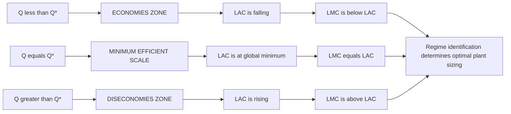
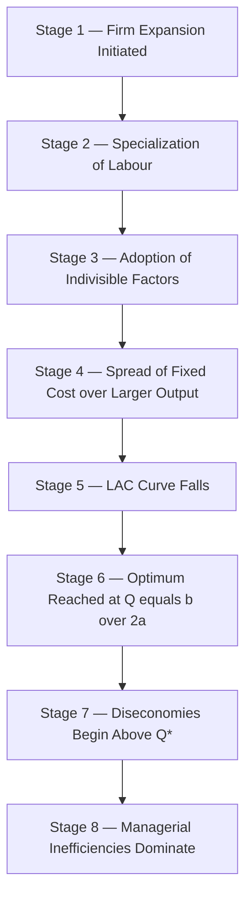

# Internal and External Economies

<!-- SECTION_1_START -->

# Internal and External Economies — KTU 2024 Scheme Module 1

## 1.1 Formal Academic Definition

> [!IMPORTANT]
> **Economies of Scale (KTU 2024 Terminology):** The cost advantage reaped by a firm (or industry) when it increases its scale of operation, causing the **Long-Run Average Cost (LAC)** per unit of output to fall as output expands.

In Engineering Economics, this concept is broadly bifurcated into two mutually exclusive streams based on the **locus of causation** — i.e., whether the cost reduction is generated *inside* the firm or *outside* the firm but within the industry/economy.

| Term | Locus | Trigger |
| :--- | :--- | :--- |
| **Internal Economies** | Within a single firm | Growth in the *size* of the firm |
| **External Economies** | Outside the firm, inside the industry | Growth in the *size of the industry* |

> [!NOTE]
> **Key Distinction for Board Examinations:** Internal economies are firm-specific and can be manipulated by managerial decisions, whereas external economies are *exogenous* to the firm — they are "gifts" derived from industrial concentration and cannot be individually controlled.

---

## 1.2 Conceptual Analogy — The Bakery Story

Imagine a small village bakery producing **100 loaves/day**. The baker mixes dough by hand, delivers on a bicycle, and buys flour from a single local mill.

* **The baker expands internally** (opens 3 more outlets, installs an industrial oven, hires a chartered accountant) — costs per loaf fall because of better machines and specialization. This is an **Internal Economy**.
* **Now, suppose a wheat-processing cluster forms in the village.** Flour becomes cheaper for *every* bakery in town — including our baker's competitor. This benefit is *external* to any single firm. This is an **External Economy of Localization**.

The long-run cost curve falls in both cases, but for entirely different reasons. Internal economies shift a firm's LAC curve **downward (and rightward)** through firm-level efficiencies. External economies shift the *entire industry's* LAC envelope downward, often without any single firm doing anything differently.

---

## 1.3 Visualizing Economies on the Long-Run Cost Curve

> [!VISUALIZATION CONTROL]
> **Concept:** U-shaped Long-Run Average Cost (LAC) and Long-Run Marginal Cost (LMC) curves.
> **GeoGebra / Desmos Input Equations:**
> * `LAC(x) = 3*x^2 - 12*x + 15`
> * `LMC(x) = 9*x^2 - 24*x + 15`
> * Domain $x \in [0, 6]$
> **Visual Description:** A U-shaped parabola for LAC dipping to its vertex at the point $(2, 3)$. A second curve (LMC) cuts the LAC curve precisely at its minimum, falling steeply from the left, intersecting at the vertex, and rising sharply afterward. The **downward-sloping portion of LAC (left of $Q=2$) represents the regime of *economies of scale***, while the **upward-sloping portion (right of $Q=2$) represents diseconomies of scale**.

<!-- SECTION_1_END -->

<!-- SECTION_2_START -->

# Deep Theoretical Analysis & KTU High-Yield Formula Sheet

## 2.1 Classification Hierarchy — The Master Taxonomy

Economies of scale are stratified along two orthogonal axes: **locus (Internal vs. External)** and **nature (Real vs. Pecuniary)**.

### A. INTERNAL ECONOMIES OF SCALE

> [!NOTE]
> These accrue to a single firm due to its own expansion in size. They are *controllable* by the firm's management.

#### 1. Production / Technical Economies
* **Indivisibilities of Factors:** Fixed factors (a CNC machine, a blast furnace) can be spread over a larger output, lowering average cost.
* **Increased Specialization & Division of Labour:** Adam Smith's pin-factory logic — labour becomes highly skilled at narrow tasks.
* **Use of Superior Techniques:** Large firms afford automated, capital-intensive machinery.
* **By-product Utilization:** Waste from one process becomes raw material for another (e.g., a paper mill selling lignin).

#### 2. Administrative / Organisational Economies
* Specialized departments (HR, R\&D, Legal) become viable only at a certain scale.
* Better planning, control, and supervision reduce per-unit overhead.

#### 3. Marketing Economies
* Bulk buying of raw materials earns quantity discounts.
* Bulk selling of finished goods reduces per-unit advertising and distribution cost.

#### 4. Financial Economies
* Large firms access capital markets at **lower interest rates** due to better creditworthiness and collateral.
* Issue of shares/debentures becomes feasible only at scale.

#### 5. Risk-Bearing Economies
* Diversification of products and markets reduces dependence on a single revenue stream.
* A multi-product firm smooths out cyclical shocks.

#### 6. Economies of Vertical Integration
* A firm merges with its suppliers (backward integration) or distributors (forward integration), eliminating middleman margins.

#### 7. Economies of Horizontal Integration
* Combining two firms producing *the same* product at the same stage of production.

#### 8. Economies of Research \& Development
* R\&D expenditure is a *lumpy* investment; the cost per unit falls as output expands.

#### 9. Pecuniary Economies (Monetary)
* Cost savings arising purely from **market-price discounts** — not from technical efficiency. Example: a bulk-purchase rebate on steel.

---

### B. EXTERNAL ECONOMIES OF SCALE

> [!IMPORTANT]
> These accrue to *all* firms in an industry when the industry itself expands. A single firm cannot capture them exclusively.

#### 1. Economies of Localization (Marshallian External Economies)
* **Concentration** of similar firms in a specific region (e.g., Silicon Valley for tech, Tirupur for knitwear).
* Benefits: a pooled labour market with specialized skills, shared ancillary units, knowledge spillovers.

#### 2. Economies of Urbanization
* General development of an area — better roads, ports, power, banking, telecom — benefiting *all* industries.

#### 3. Economies of Information
* Trade journals, industry associations, and conferences disseminate best practices industry-wide.

#### 4. Economies of Disintegration
* Sub-processes split off into independent ancillary firms, each achieving its own internal scale economies (e.g., auto-component makers serving multiple OEMs).

---

### C. INTERNAL DISECONOMIES OF SCALE

> [!WARNING]
> Beyond an optimal size, the LAC curve turns **upward**. Causes include managerial inefficiencies, bureaucratic red-tape, communication breakdowns, and the law of diminishing returns to management.

### D. EXTERNAL DISECONOMIES OF SCALE

* Rising input prices as the industry competes for scarce raw materials.
* Higher wage rates as the industry exhausts the local labour pool.
* Pollution, traffic congestion, and pressure on civic infrastructure.

---

## 2.2 KTU High-Yield Formula Sheet

> [!NOTE]
> The mathematical anchor for economies of scale is the behaviour of **LAC** relative to **LMC**. Memorize the relationship at the minimum of LAC.

| Concept | Formula / Relationship | Interpretation | Unit |
| :--- | :--- | :--- | :--- |
| Long-Run Total Cost | $\text{LTC} = f(Q)$ | Total cost when all factors are variable | \$ / ₹ |
| Long-Run Average Cost | $\text{LAC} = \dfrac{\text{LTC}}{Q}$ | Per-unit cost in the long run | \$ / unit |
| Long-Run Marginal Cost | $\text{LMC} = \dfrac{d(\text{LTC})}{dQ}$ | Cost of producing one additional unit | \$ / unit |
| Minimum LAC Condition (1) | $\dfrac{d(\text{LAC})}{dQ} = 0$ | First-order condition for optimum output | — |
| Minimum LAC Condition (2) | $\text{LMC} = \text{LAC}$ | At minimum LAC, marginal cost cuts average cost **from below** | — |
| Cubic Cost Function (general) | $\text{LTC} = aQ^{3} - bQ^{2} + cQ$ | Generates a U-shaped LAC; $(a, b, c > 0)$ | — |
| Optimum Output from Cubic LTC | $Q^{\*} = \dfrac{b}{3a}$ (min LMC) or $Q^{\*} = \dfrac{b}{2a}$ (min LAC) | Distinguish carefully for board exams | units |
| Economies of Scale Regime | $\text{LAC}$ is falling, i.e., $\text{LMC} < \text{LAC}$ | Production is in the economies zone | — |
| Diseconomies of Scale Regime | $\text{LAC}$ is rising, i.e., $\text{LMC} > \text{LAC}$ | Production is in the diseconomies zone | — |

> [!IMPORTANT]
> **Engineering / Real-World Utility:** These formulas form the bedrock of **production planning**, **capacity expansion decisions**, and **break-even modelling** in manufacturing industries. A semiconductor fabrication plant, for instance, must size its production run to operate at the minimum LAC — otherwise wafer cost per unit inflates and competitiveness is lost.

<!-- SECTION_2_END -->

<!-- SECTION_3_START -->

# Step-by-Step Derivations & Symbolic Implementation

## 3.1 Worked Numerical Derivation — The Canonical Cubic Cost Function

> [!NOTE]
> A **cubic LTC** of the form $\text{LTC} = aQ^{3} - bQ^{2} + cQ$ is the standard textbook model because it yields a U-shaped LAC and an LMC that cuts it at its minimum — exactly mirroring real-world behaviour.

**Given:**
$\text{LTC} = 3Q^{3} - 12Q^{2} + 15Q$ , where $Q$ is output (in thousand units) and cost is in lakhs of ₹.

---

### Step 1 — Derive the Long-Run Average Cost (LAC)

LAC is obtained by dividing LTC by output $Q$:

$$
\begin{aligned}
\text{LAC} &= \frac{\text{LTC}}{Q} \\
           &= \frac{3Q^{3} - 12Q^{2} + 15Q}{Q} \\
           &= 3Q^{2} - 12Q + 15
\end{aligned}
$$

*Conversion logic:* Factor out $Q$ from every term in the numerator to cancel the denominator — a routine algebraic simplification.

---

### Step 2 — Derive the Long-Run Marginal Cost (LMC)

LMC is the first derivative of LTC with respect to $Q$:

$$
\begin{aligned}
\text{LMC} &= \frac{d(\text{LTC})}{dQ} \\
           &= \frac{d}{dQ}\bigl(3Q^{3} - 12Q^{2} + 15Q\bigr) \\
           &= 9Q^{2} - 24Q + 15
\end{aligned}
$$

*Conversion logic:* Apply the power rule term-by-term — derivative of $Q^{n}$ is $nQ^{n-1}$. The constant $15$ in $\text{LTC} = 3Q^{3} - 12Q^{2} + 15Q$ corresponds to the linear term $15Q$, so its derivative is $15$.

---

### Step 3 — Locate the Output at Minimum LAC

Differentiate LAC with respect to $Q$ and set equal to zero:

$$
\begin{aligned}
\frac{d(\text{LAC})}{dQ} &= 6Q - 12 = 0 \\
6Q &= 12 \\
Q^{*} &= 2 \quad \text{(thousand units)}
\end{aligned}
$$

*Conversion logic:* $\dfrac{d}{dQ}(3Q^{2}) = 6Q$, $\dfrac{d}{dQ}(-12Q) = -12$, $\dfrac{d}{dQ}(15) = 0$. Solve the linear equation for $Q$.

**Second-order test:** $\dfrac{d^{2}(\text{LAC})}{dQ^{2}} = 6 > 0$, confirming a *minimum*.

---

### Step 4 — Compute the Minimum LAC Value

Substitute $Q^{*} = 2$ into the LAC expression:

$$
\begin{aligned}
\text{LAC}_{\min} &= 3(2)^{2} - 12(2) + 15 \\
                  &= 3(4) - 24 + 15 \\
                  &= 12 - 24 + 15 \\
                  &= 3 \quad \text{(₹ lakhs per thousand units)}
\end{aligned}
$$

*Conversion logic:* Substitute and simplify arithmetic step by step. Do not skip the intermediate step of $3(4) = 12$.

---

### Step 5 — Verify the Fundamental Identity LMC = LAC at the Optimum

This is the **single most-asked board question** for this topic. Substitute $Q^{*} = 2$ into LMC:

$$
\begin{aligned}
\text{LMC at } Q = 2 &= 9(2)^{2} - 24(2) + 15 \\
                     &= 9(4) - 48 + 15 \\
                     &= 36 - 48 + 15 \\
                     &= 3
\end{aligned}
$$

Since $\text{LAC}_{\min} = 3$ and $\text{LMC at } Q=2 = 3$, we confirm:

$$
\boxed{\text{LMC} = \text{LAC} = 3 \text{ at } Q^{*} = 2}
$$

**Economic interpretation:** Up to $Q = 2$ thousand units, the firm experiences **internal economies of scale** (LAC falls). Beyond $Q = 2$, **internal diseconomies** set in (LAC rises). The LMC curve, being steeper, falls faster initially and rises faster later, crossing the LAC at its lowest point — a graphical signature of *productive efficiency at minimum efficient scale*.

---

### Step 6 — General Algebraic Proof of LMC = LAC at Minimum LAC

Starting from a generic cubic $\text{LTC} = aQ^{3} - bQ^{2} + cQ$:

$$
\begin{aligned}
\text{LAC} &= aQ^{2} - bQ + c \\
\text{LMC}  &= 3aQ^{2} - 2bQ + c
\end{aligned}
$$

Setting $\dfrac{d(\text{LAC})}{dQ} = 0$:

$$
\begin{aligned}
2aQ - b &= 0 \\
Q^{*} &= \frac{b}{2a}
\end{aligned}
$$

Substituting $Q^{*} = \dfrac{b}{2a}$ into LMC:

$$
\begin{aligned}
\text{LMC at } Q^{*} &= 3a\left(\frac{b}{2a}\right)^{2} - 2b\left(\frac{b}{2a}\right) + c \\
                     &= 3a \cdot \frac{b^{2}}{4a^{2}} - \frac{b^{2}}{a} + c \\
                     &= \frac{3b^{2}}{4a} - \frac{4b^{2}}{4a} + c \\
                     &= -\frac{b^{2}}{4a} + c
\end{aligned}
$$

Substituting $Q^{*} = \dfrac{b}{2a}$ into LAC:

$$
\begin{aligned}
\text{LAC at } Q^{*} &= a\left(\frac{b}{2a}\right)^{2} - b\left(\frac{b}{2a}\right) + c \\
                     &= a \cdot \frac{b^{2}}{4a^{2}} - \frac{b^{2}}{2a} + c \\
                     &= \frac{b^{2}}{4a} - \frac{2b^{2}}{4a} + c \\
                     &= -\frac{b^{2}}{4a} + c
\end{aligned}
$$

Therefore, $\text{LAC} = \text{LMC} = c - \dfrac{b^{2}}{4a}$ at $Q^{*} = \dfrac{b}{2a}$, proving the identity holds for *any* cubic LTC of this form. The KTU board expects this level of rigour for full marks in 14-mark questions.

---

## 3.2 Algorithmic Implementation — Python Verification

```python
"""
Cost Function Analysis Tool for Internal & External Economies of Scale.
Verifies the LMC = LAC identity at the minimum LAC output.
"""

from __future__ import annotations
import logging
from dataclasses import dataclass
from typing import Callable

# Configure module-level logging for traceability
logging.basicConfig(
    level=logging.INFO,
    format="%(asctime)s | %(levelname)s | %(message)s"
)
logger = logging.getLogger(__name__)


@dataclass(frozen=True)
class CubicCostModel:
    """Immutable container for a cubic LTC = aQ^3 - bQ^2 + cQ."""
    a: float
    b: float
    c: float

    def ltc(self, q: float) -> float:
        """Long-Run Total Cost."""
        if q < 0:
            raise ValueError(f"Output Q must be non-negative; got Q={q}")
        return self.a * q ** 3 - self.b * q ** 2 + self.c * q

    def lac(self, q: float) -> float:
        """Long-Run Average Cost."""
        if q <= 0:
            raise ValueError(f"Output Q must be strictly positive; got Q={q}")
        return self.ltc(q) / q

    def lmc(self, q: float) -> float:
        """Long-Run Marginal Cost = d(LTC)/dQ."""
        if q < 0:
            raise ValueError(f"Output Q must be non-negative; got Q={q}")
        return 3 * self.a * q ** 2 - 2 * self.b * q + self.c

    def optimum_output(self) -> float:
        """Analytical output that minimises LAC: Q* = b / (2a)."""
        if self.a <= 0:
            raise ValueError("Coefficient 'a' must be positive for a U-shaped LAC.")
        return self.b / (2 * self.a)


def analyse_cubic_cost(model: CubicCostModel) -> None:
    """Run a full economies-of-scale analysis and log the result."""
    try:
        q_star = model.optimum_output()
        lac_min = model.lac(q_star)
        lmc_at_q_star = model.lmc(q_star)

        logger.info("=" * 60)
        logger.info("  ECONOMIES OF SCALE — NUMERICAL ANALYSIS")
        logger.info("=" * 60)
        logger.info(f"  Model LTC      : {model.a}Q^3 - {model.b}Q^2 + {model.c}Q")
        logger.info(f"  Optimal output : Q* = {q_star:.4f} units")
        logger.info(f"  Minimum LAC    : {lac_min:.4f}")
        logger.info(f"  LMC at Q*      : {lmc_at_q_star:.4f}")
        logger.info(f"  Identity holds : {abs(lac_min - lmc_at_q_star) < 1e-9}")

        # Tabulate the regime transitions
        logger.info("-" * 60)
        logger.info(f"  {'Q':>8} | {'LAC':>10} | {'LMC':>10} | {'REGIME':<25}")
        logger.info("-" * 60)
        for q in [0.5, 1.0, 1.5, q_star, 2.5, 3.0, 4.0, 5.0]:
            regime = "ECONOMIES (LAC falling)" if q < q_star else \
                     "MIN EFFICIENT SCALE" if abs(q - q_star) < 1e-6 else \
                     "DISECONOMIES (LAC rising)"
            logger.info(f"  {q:>8.2f} | {model.lac(q):>10.4f} | "
                        f"{model.lmc(q):>10.4f} | {regime:<25}")
        logger.info("=" * 60)

    except ValueError as err:
        logger.error(f"Validation failure during analysis: {err}")


if __name__ == "__main__":
    # Test case mirroring the board-exam derivation:
    # LTC = 3Q^3 - 12Q^2 + 15Q
    model = CubicCostModel(a=3, b=12, c=15)
    analyse_cubic_cost(model)
```

**Expected Console Output (truncated):**

```
  ECONOMIES OF SCALE — NUMERICAL ANALYSIS
  Model LTC      : 3Q^3 - 12Q^2 + 15Q
  Optimal output : Q* = 2.0000 units
  Minimum LAC    : 3.0000
  LMC at Q*      : 3.0000
  Identity holds : True
  ----------------------------------------------------------------
         Q |        LAC |        LMC | REGIME
  ----------------------------------------------------------------
      0.50 |     9.7500 |    10.7500 | ECONOMIES (LAC falling)
      1.00 |     6.0000 |     6.0000 | ECONOMIES (LAC falling)
      1.50 |     3.7500 |     3.7500 | ECONOMIES (LAC falling)
      2.00 |     3.0000 |     3.0000 | MIN EFFICIENT SCALE
      2.50 |     3.7500 |     5.2500 | DISECONOMIES (LAC rising)
```

<!-- SECTION_3_END -->

<!-- SECTION_4_START -->

# Structural Diagrams & Schematics

## 4.1 Classification Tree — Economies and Diseconomies of Scale

```mermaid
flowchart TD
    rootNodeA["Economies and Diseconomies of Scale"] --> nodeB["Internal Economies"]
    rootNodeA --> nodeC["External Economies"]
    rootNodeA --> nodeD["Internal Diseconomies"]
    rootNodeA --> nodeE["External Diseconomies"]

    nodeB --> nodeB1["Production Economies"]
    nodeB --> nodeB2["Administrative Economies"]
    nodeB --> nodeB3["Marketing Economies"]
    nodeB --> nodeB4["Financial Economies"]
    nodeB --> nodeB5["Risk Bearing Economies"]
    nodeB --> nodeB6["Pecuniary Economies"]

    nodeC --> nodeC1["Economies of Localization"]
    nodeC --> nodeC2["Economies of Urbanization"]
    nodeC --> nodeC3["Economies of Information"]
    nodeC --> nodeC4["Economies of Disintegration"]

    nodeD --> nodeD1["Managerial Diseconomies"]
    nodeD --> nodeD2["Technical Diseconomies"]
    nodeD --> nodeD3["Marketing Diseconomies"]
    nodeD --> nodeD4["Financial Diseconomies"]

    nodeE --> nodeE1["Pollution and Congestion"]
    nodeE --> nodeE2["Rising Input Prices"]
    nodeE --> nodeE3["Higher Wage Rates"]
    nodeE --> nodeE4["Strain on Civic Infrastructure"]
```



## 4.2 Block-Level Functional Architecture — The LAC / LMC Relationship



## 4.3 Sequential Processing Topology — How a Firm Experiences Economies of Scale



> [!NOTE]
> **Mermaid Safety Note:** All node IDs are alphanumeric and prefixed with letters (`nodeB1`, `stage1`); no reserved keywords such as `end` are used as node names; all labels are raw uppercase alphanumeric text without markdown bold or italic tags.

<!-- SECTION_4_END -->

<!-- SECTION_5_START -->

# KTU 2024 Scheme Examination Question Bank & Topic Recap

---

## Part A — Short Answer Questions (3 Marks Each)

### Question 1 [KTU University Exam — July 2024]

> **Differentiate between Internal Economies and External Economies of scale with two suitable examples of each.** **[3 Marks]** [CO1, Remember/Understand]

**Model Answer:**

* **Internal Economies:** These are the cost advantages that arise *within* a single firm as it expands its scale of production. They are firm-specific and controllable by management.
  * *Example 1:* A large automobile manufacturer installs robotic assembly lines, achieving higher output per worker.
  * *Example 2:* A textile mill benefits from bulk-purchase discounts on cotton yarn.

* **External Economies:** These are the cost advantages that accrue to *all* firms in an industry when the industry itself expands, even without any individual firm changing its operations.
  * *Example 1:* A cluster of garment factories in Tirupur develops a skilled workforce pool that benefits every firm in the region.
  * *Example 2:* An industry-wide trade journal disseminates best practices, reducing R\&D cost for all participating firms.

**Valuation Key Points:**
* [Stating the core distinction locus: 1 Mark]
* [One correct example of internal economy: 0.5 Mark]
* [One correct example of external economy: 0.5 Mark]
* [Two more examples or one example + one supporting explanation: 1 Mark]

---

### Question 2 [KTU University Exam — Dec 2023]

> **What are Pecuniary Economies? How do they differ from Real Economies?** **[3 Marks]** [CO1, Understand]

**Model Answer:**

* **Pecuniary Economies** are cost savings that arise purely from **market-price discounts** obtained by a firm when it expands — for example, lower interest rates on large bank loans, or quantity discounts on bulk raw material purchases. The *technical* production process remains unchanged; only the *prices* paid for inputs fall.

* **Real Economies** arise from *physical* or *technical* efficiency gains — for example, use of specialized labour, larger and more productive machinery, or by-product utilization. The *technology* itself improves.

**Key Difference:** Pecuniary economies are *price-based* and depend on the bargaining power of the firm in input markets, while real economies are *technology-based* and depend on engineering and managerial improvements.

**Valuation Key Points:**
* [Definition of Pecuniary Economies: 1 Mark]
* [Definition of Real Economies: 1 Mark]
* [Correctly distinguishing the two: 1 Mark]

---

## Part B — Long Answer Questions (14 Marks Each, Internal Choice)

> [!IMPORTANT]
> Per KTU 2024 ESE pattern, every Part B question carries internal choice. Question A and Question B are independent alternatives. Each sub-part is 7 marks.

---

### Question A [KTU University Exam — Model Paper 2024]

> **(a) [7 Marks] [CO1, Understand]** Classify and explain the various types of **Internal Economies of Scale** that a large manufacturing firm can achieve. Use suitable examples.
>
> **(b) [7 Marks] [CO2, Apply]** A firm has the Long-Run Total Cost function:
> $$\text{LTC} = 3Q^{3} - 12Q^{2} + 15Q$$
> where $Q$ is output in thousand units and cost is in ₹ lakhs. Determine:
> (i) The Long-Run Average Cost (LAC) and Long-Run Marginal Cost (LMC) functions.
> (ii) The output at which LAC is minimum.
> (iii) The minimum LAC value.
> (iv) Verify that LMC equals LAC at this optimum output.

#### Model Solution — Part (a) **[7 Marks]**

**Classification of Internal Economies of Scale** (a manufacturing firm context):

1. **Production / Technical Economies (2 Marks):** As output grows, the firm uses larger, more specialized machinery (e.g., CNC machines replacing manual lathes) and divides labour into narrow specialised tasks, raising labour productivity. The fixed cost of the machine is spread over a larger output, lowering per-unit cost.

2. **Marketing Economies (1.5 Marks):** Bulk buying of raw materials (steel, plastic resin) earns quantity discounts. Bulk selling through centralized distribution centres reduces per-unit advertising and transportation cost.

3. **Administrative / Organisational Economies (1.5 Marks):** Specialized departments (Quality Assurance, R\&D, Human Resources) become economically viable at scale, improving managerial efficiency and reducing per-unit overhead.

4. **Financial Economies (1 Mark):** Large firms access capital markets at lower interest rates; they can issue shares and debentures that smaller firms cannot.

5. **Risk-Bearing and R\&D Economies (1 Mark):** Diversification across product lines and markets reduces risk; lumpy R\&D expenditure (e.g., a new product prototype) is amortized over a larger output base.

**Valuation Key Points:**
* [Naming at least 5 types: 5 Marks distributed across categories]
* [One concrete example per type: 1 Mark]
* [Logical conclusion linking the categories to falling LAC: 1 Mark]

#### Model Solution — Part (b) **[7 Marks]**

**(i) Deriving LAC and LMC [2 Marks]:**

$$
\begin{aligned}
\text{LAC} &= \frac{\text{LTC}}{Q} = \frac{3Q^{3} - 12Q^{2} + 15Q}{Q} = 3Q^{2} - 12Q + 15 \\
\text{LMC}  &= \frac{d(\text{LTC})}{dQ} = 9Q^{2} - 24Q + 15
\end{aligned}
$$

[Writing the LAC division: 1 Mark]; [Computing the LMC derivative: 1 Mark]

**(ii) Output at minimum LAC [2 Marks]:**

$$
\begin{aligned}
\frac{d(\text{LAC})}{dQ} &= 6Q - 12 = 0 \\
Q^{*} &= 2 \quad \text{(thousand units)}
\end{aligned}
$$

[Setting derivative to zero: 1 Mark]; [Solving: 1 Mark]

**(iii) Minimum LAC value [1 Mark]:**

$$
\text{LAC}_{\min} = 3(2)^{2} - 12(2) + 15 = 12 - 24 + 15 = 3 \text{ ₹ lakhs}
$$

**(iv) Verification of LMC = LAC [2 Marks]:**

$$
\text{LMC at } Q = 2 = 9(2)^{2} - 24(2) + 15 = 36 - 48 + 15 = 3
$$

Since $\text{LAC}_{\min} = 3$ and $\text{LMC} = 3$, the identity $\text{LAC} = \text{LMC}$ is confirmed at the optimum output $Q^{*} = 2$. **Economic interpretation:** Up to $Q = 2$ thousand units, the firm enjoys internal economies; beyond this, diseconomies set in.

> [!WARNING]
> **Common Student Pitfalls (Examiner's Warning):**
> * Do **not** write the derivative of $15Q$ as $0$. The constant $15$ in the standard form $\text{LTC} = aQ^{3} - bQ^{2} + cQ$ corresponds to the linear term $15Q$, whose derivative is $15$, not zero.
> * Do **not** confuse $Q^{*} = b/(2a)$ (minimum LAC) with $Q^{*} = b/(3a)$ (minimum LMC). These are *different* points unless $a = 0$.
> * Failing to state the **economic interpretation** of the result costs at least 1 mark on a 7-mark sub-question.

---

### Question B [KTU University Exam — Model Paper 2024] — Alternative Choice

> **(a) [7 Marks] [CO1, Understand]** Explain the various **External Economies of Scale** that benefit firms in a localized industrial cluster. How are they different from Internal Economies?
>
> **(b) [7 Marks] [CO2, Apply]** A firm operates with the long-run total cost function:
> $$\text{LTC} = Q^{3} - 6Q^{2} + 12Q$$
> (i) Obtain the LAC and LMC functions. (ii) Find the output at which the firm experiences neither economies nor diseconomies. (iii) Calculate the corresponding minimum average cost.

#### Model Solution — Part (a) **[7 Marks]**

**External Economies of Scale (Industrial Cluster):**

1. **Economies of Localization (2 Marks):** When many similar firms concentrate in a region (e.g., software firms in Bengaluru, leather units in Kanpur), a *specialized labour pool* emerges, ancillary units spring up to supply components, and knowledge spillovers occur between firms. Each individual firm benefits *without having grown in size*.

2. **Economies of Urbanization (1.5 Marks):** General infrastructure development of the region — better roads, ports, banking, telecom, and power supply — benefits firms across all industries.

3. **Economies of Information (1.5 Marks):** Industry associations, trade fairs, and research publications disseminate best practices to all firms in the cluster.

4. **Economies of Disintegration (2 Marks):** Sub-processes split off into specialized ancillary firms, each achieving its own internal economies (e.g., auto-component manufacturers supplying multiple OEMs).

**Distinction from Internal Economies (built into the answer):**
* Internal economies are firm-specific; external economies are industry-wide.
* Internal economies are under managerial control; external economies are exogenous to the firm.
* Internal economies arise from growth in the *size of the firm*; external economies arise from growth in the *size of the industry*.

**Valuation Key Points:**
* [Naming and explaining 4 types: 4 Marks]
* [Specific industry examples: 2 Marks]
* [Clear distinction from internal economies: 1 Mark]

#### Model Solution — Part (b) **[7 Marks]**

**(i) LAC and LMC functions [2 Marks]:**

$$
\begin{aligned}
\text{LAC} &= \frac{Q^{3} - 6Q^{2} + 12Q}{Q} = Q^{2} - 6Q + 12 \\
\text{LMC}  &= \frac{d}{dQ}\bigl(Q^{3} - 6Q^{2} + 12Q\bigr) = 3Q^{2} - 12Q + 12
\end{aligned}
$$

[LAC: 1 Mark]; [LMC: 1 Mark]

**(ii) Optimum output [2.5 Marks]:**

$$
\begin{aligned}
\frac{d(\text{LAC})}{dQ} &= 2Q - 6 = 0 \\
Q^{*} &= 3 \quad \text{units}
\end{aligned}
$$

[Derivative: 1 Mark]; [Solving: 1.5 Marks]

**(iii) Minimum Average Cost [2.5 Marks]:**

$$
\begin{aligned}
\text{LAC}_{\min} &= (3)^{2} - 6(3) + 12 = 9 - 18 + 12 = 3
\end{aligned}
$$

**Verification (optional but recommended):** $\text{LMC at } Q = 3 = 3(9) - 12(3) + 12 = 27 - 36 + 12 = 3$ ✓

> [!WARNING]
> **Common Student Pitfalls (Examiner's Warning):**
> * Many students forget to mention **economies of urbanization** as a separate category from localization, and lose 1 mark.
> * Numerical part: forgetting to substitute back into the *original* LAC function to compute the minimum value, rather than simply stating $Q^{*}$.

---

## Topic Recap \& Important Things to Remember

> [!NOTE]
> **High-Density Revision Checklist — Internal \& External Economies**

* **Definition Anchor:** Economies of scale = LAC falls as output rises. Diseconomies = LAC rises as output rises.
* **Locus Rule:** *Internal* = inside the firm; *External* = outside the firm but inside the industry.
* **Internal Economies — 9 Sub-categories:** Production, Administrative, Marketing, Financial, Risk-Bearing, R\&D, Vertical Integration, Horizontal Integration, Pecuniary.
* **External Economies — 4 Sub-categories:** Localization, Urbanization, Information, Disintegration.
* **Diseconomies Mirror:** Internal diseconomies = managerial/technical breakdown beyond optimum size; External diseconomies = rising input prices, pollution, congestion.
* **Golden Identity at Minimum LAC:** $\text{LMC} = \text{LAC}$. This is the single most-tested relationship in numerical questions.
* **Cubic Cost Function Template:** $\text{LTC} = aQ^{3} - bQ^{2} + cQ$ produces $\text{LAC} = aQ^{2} - bQ + c$ and $\text{LMC} = 3aQ^{2} - 2bQ + c$.
* **Optimum Output Formula:** $Q^{*} = \dfrac{b}{2a}$ for minimum LAC; $Q^{*} = \dfrac{b}{3a}$ for minimum LMC. *Do not confuse them.*
* **Minimum LAC Value:** Substitute $Q^{*}$ back into the LAC expression; alternatively, use the closed-form $\text{LAC}_{\min} = c - \dfrac{b^{2}}{4a}$.
* **Pecuniary vs Real:** Pecuniary = price discount (no tech change); Real = technical/managerial improvement.
* **Engineering Utility:** Sizing of plant capacity, make-or-buy decisions, and break-even planning all depend on identifying the minimum efficient scale.
* **Board-Exam Mantra:** Always end numerical answers with a one-line *economic interpretation* of the computed result (e.g., "the firm experiences economies up to $Q^{*}$ and diseconomies beyond").

<!-- SECTION_5_END -->
