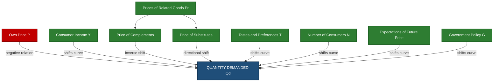
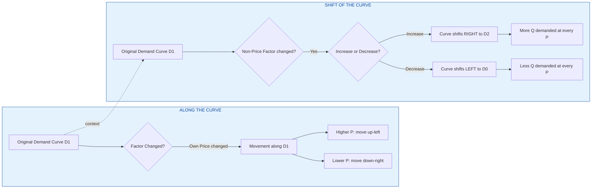
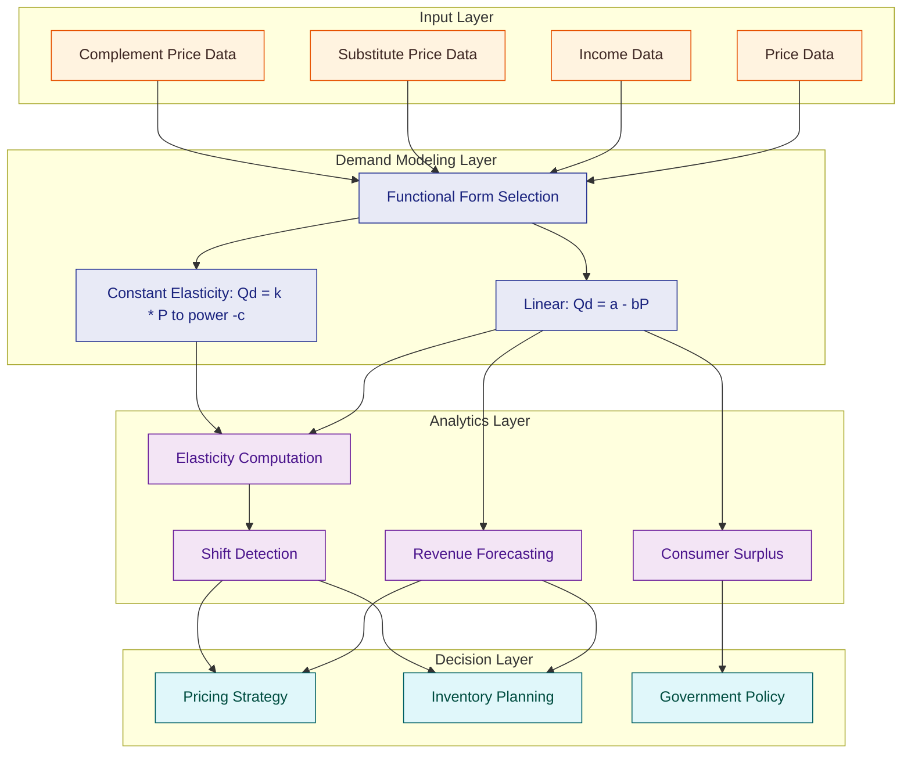
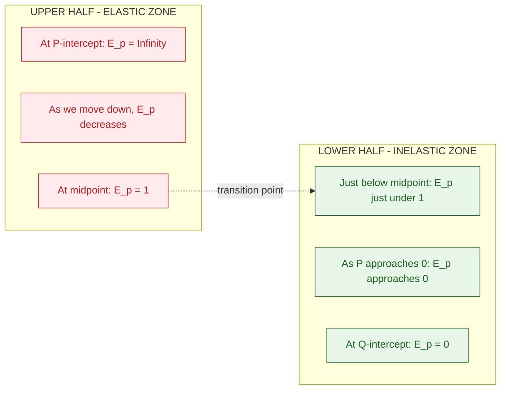
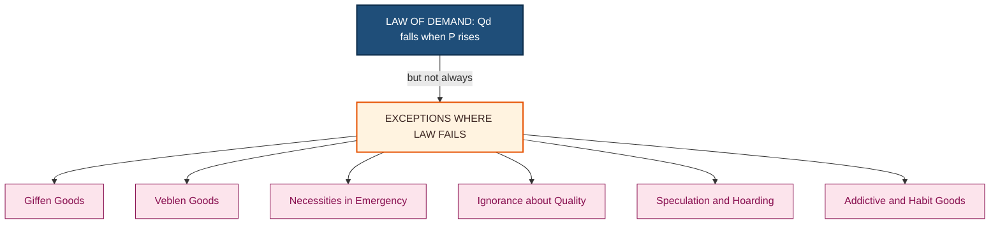

# Law of Demand

<!-- SECTION_1_START -->
# Law of Demand — Foundational Overview

## 1.1 Formal Academic Definition (KTU 2024 Syllabus Standard)

> [!NOTE]
> **Law of Demand (Alfred Marshall, 1890)**
> *“Ceteris paribus (other things being equal), the quantity demanded of a commodity is **inversely related** to its own price. As the price of a commodity rises, the quantity demanded falls, and as the price falls, the quantity demanded rises, all other factors remaining constant.”*

In formal functional notation:

$$
Q_d = f(P, Y, P_r, T, N, E, \text{...})
$$

Where, holding the non-price factors constant, we obtain the **ceteris paribus demand function**:

$$
Q_d = f(P) \quad \text{with} \quad \frac{\partial Q_d}{\partial P} < 0
$$

The negative partial derivative of quantity demanded with respect to own price is the **mathematical signature** of the Law of Demand.

## 1.2 Conceptual Analogy — The "Ice Cream Cart" Intuition

Imagine an **ice cream cart** parked outside your engineering college canteen on a hot Kerala afternoon.

* **Scenario A:** The vendor sells a cone for **₹20**. About 100 students buy one during the lunch break.
* **Scenario B:** The same vendor hikes the price to **₹60**. Only 30 students buy one.
* **Scenario C:** He drops the price to **₹10**. Almost 200 students form a queue.

Why does this happen?
1. **Substitution Effect** — At ₹60, a student buys a *butter vada* or *sharjah shake* instead (cheaper substitutes pull demand away).
2. **Income Effect** — At ₹60, the student's real purchasing power drops; the same ₹60 buys less ice cream, so they buy fewer units.
3. **Law of Diminishing Marginal Utility** — The 1st cone gives huge satisfaction, the 5th cone gives far less. So the consumer is *willing to pay more only for fewer units*.
4. **New Consumers** — At ₹10, even first-year students who couldn't afford it earlier now enter the market.

> [!IMPORTANT]
> **Key Takeaway for KTU Exam:** Always mention *"Ceteris paribus"* explicitly in your definition. Marks are awarded for the assumption clause.

## 1.3 Essential Terminology

| Term | Meaning |
| :--- | :--- |
| **Demand** | The *entire* relationship between price and quantity demanded (a schedule/curve). |
| **Quantity Demanded** | A *specific* number of units bought at a *specific* price (a point). |
| **Demand Schedule** | A tabular representation showing quantities demanded at various prices. |
| **Demand Curve** | A graphical representation of the demand schedule. |
| **Ceteris Paribus** | Latin: “other things being equal” — a crucial assumption. |
| **Law of Demand** | The *qualitative* statement of inverse relationship. |
| **Demand Function** | The *quantitative* mathematical expression of the relationship. |

> [!TIP]
> **Engineering Connection:** In *price-engineering* and *revenue forecasting*, the demand curve is the **foundation input** for cost-volume-profit (CVP) analysis, break-even calculations, and pricing algorithms in ERP systems like SAP.

> [!VISUALIZATION CONTROL]
> **Concept:** Downward-sloping Linear Demand Curve in the $(P, Q)$ plane.
> **GeoGebra / Desmos Input Equations:**
> * $P = 100 - 2Q$   *(Intersection: P-axis = 100, Q-axis = 50)*
> * Axis setup: $x$-axis = Quantity $Q$, $y$-axis = Price $P$
> * Marker points: $A(0, 100)$, $B(50, 0)$, $C(25, 50)$
> **Visual Description:** A straight line sloping **downward from left to right** (negative slope). As $P$ drops from 100 to 0, $Q$ rises from 0 to 50. A movement *along* this line is a change in quantity demanded.
<!-- SECTION_1_END -->

<!-- SECTION_2_START -->
# Deep Theoretical Analysis & KTU High-Yield Formula Sheet

## 2.1 The Eight Assumptions of the Law of Demand

For the inverse relationship to *hold strictly*, the following **ceteris paribus** conditions must be satisfied:

1. **No change in consumer income** ($Y$ constant).
2. **Prices of related goods (substitutes and complements) remain unchanged.**
3. **Tastes, preferences, and fashion are stable.**
4. **No expectation of future price changes** (no speculation).
5. **The good is a *normal* good** (not a Giffen or Veblen good).
6. **No change in the number of consumers** in the market.
7. **Rational consumer behavior** — buyers aim to maximize satisfaction per rupee spent.
8. **No change in government policy** — taxes, subsidies, and rationing remain constant.

> [!WARNING]
> If *any* of the above changes, the entire **demand curve shifts** rather than moving along it. KTU examiners love testing this distinction.

## 2.2 Reasons Behind the Law of Demand (The "Why")

### 2.2.1 Law of Diminishing Marginal Utility
The first unit consumed gives the **highest satisfaction**; each additional unit gives progressively less. So consumers will pay more for fewer units and less for more units. This is the **cardinal-utility foundation** of the law.

### 2.2.2 Income Effect
A price rise effectively **reduces the real income** of the consumer. With the same money income, the consumer can now afford fewer units. Conversely, a price fall increases real income, raising quantity demanded.

$$
\text{Real Income} = \frac{\text{Money Income}}{P} \implies \Delta P \uparrow \Rightarrow \text{Real Income} \downarrow
$$

### 2.2.3 Substitution Effect
When the price of good $X$ rises, the consumer **substitutes** it with a relatively cheaper good $Y$ (and vice versa). This reallocation causes $Q_x$ to fall.

### 2.2.4 Entry of New Consumers (Market Expansion)
At a lower price, new buyers who were previously **priced out** of the market enter. At a higher price, they exit. This expands or contracts the market size.

### 2.2.5 Diminishing Marginal Significance
As consumption rises, the *importance* of each additional unit falls in the consumer's mind, making them willing to pay a *lower* price only for additional units.

## 2.3 Exceptions to the Law of Demand (Direct Relationship)

| Exception | Description | Example |
| :--- | :--- | :--- |
| **Giffen Goods** | Inferior goods where a price rise forces the consumer to buy *more* because the substitution to a cheaper good is impossible (very rare). | Low-quality staples like coarse rice in extreme poverty. |
| **Veblen Goods (Conspicuous Consumption)** | Status-symbol goods whose demand *rises* with price because high price signals prestige. | Luxury watches (Rolex), designer handbags, antique art. |
| **Necessities in Emergency** | Goods with no substitutes; even price hikes cannot reduce consumption immediately. | Life-saving drugs, salt in a remote area. |
| **Ignorance of Quality** | Consumers wrongly equate *high price* with *high quality*. | Branded medicines vs. cheap generics. |
| **Speculation / Future Price Expectation** | If buyers expect prices to rise further, they hoard *more* at a higher price. | Real estate bull runs, gold during inflation. |
| **Habit-Forming Goods / Addictions** | Addiction overrides the price signal. | Tobacco, alcohol, narcotics. |

## 2.4 KTU Formula Sheet / Cheat Sheet

> [!IMPORTANT]
> **Always use `\vert` for absolute value in the KTU answer sheet. Do NOT use the raw pipe character `|`, as it breaks markdown/LaTeX tables.**

| # | Concept | Formula | Notes / Units |
| :---: | :--- | :--- | :--- |
| 1 | Linear Demand Function | $Q_d = a - bP$ | $a, b > 0$; $b$ = slope magnitude |
| 2 | Inverse Demand | $P = \frac{a - Q_d}{b}$ | Used to find the price corresponding to a target quantity |
| 3 | Point Price Elasticity | $E_p = \frac{dQ}{dP} \cdot \frac{P}{Q}$ | Dimensionless; sign convention: $E_p < 0$ |
| 4 | Arc Price Elasticity (Mid-Point) | $E_p = \frac{\Delta Q / Q_{avg}}{\Delta P / P_{avg}}$ | Used between two points; gives average elasticity |
| 5 | Income Elasticity of Demand | $E_y = \frac{dQ}{dY} \cdot \frac{Y}{Q}$ | $E_y > 0 \Rightarrow$ normal good; $E_y < 0 \Rightarrow$ inferior good |
| 6 | Cross-Price Elasticity | $E_{xy} = \frac{dQ_x}{dP_y} \cdot \frac{P_y}{Q_x}$ | $>0$: substitute; $<0$: complement |
| 7 | Total Revenue | $TR = P \cdot Q_d$ | Revenue earned by the firm |
| 8 | Consumer Surplus (Linear) | $CS = \frac{1}{2} \cdot (P_{max} - P_e) \cdot Q_e$ | Triangle area above price, below demand curve |
| 9 | Marginal Revenue (Linear) | $MR = a - 2bQ$ | Twice the slope of inverse demand |
| 10 | Demand as Elasticity Type | $\vert E_p \vert > 1$: elastic; $= 1$: unitary; $< 1$: inelastic | KTU 2-mark favorite |

## 2.5 Engineering & Business Utility

The Law of Demand is not a "textbook-only" concept. It powers:

* **Dynamic Pricing Algorithms** — Uber, Ola, and airline ticket pricing adjust $P$ in real time based on $Q$ demanded at that instant.
* **Inventory Management** — Walmart and Amazon use demand curves to decide *how much* to stock before a sale.
* **Project Cost-Benefit Analysis** — Engineers must forecast how *price changes* will affect the *sales volume* of a new product launch.
* **Smart-Grid Tariff Design** — Electricity boards set higher $P$ during peak hours to *reduce* $Q$ (demand-side management).
* **Break-Even Analysis (BEA)** — The intersection of the demand-derived revenue curve and the cost curve gives the BEP.
<!-- SECTION_2_END -->

<!-- SECTION_3_START -->
# Step-by-Step Derivations, Computations & Implementation

## 3.1 Derivation: Point Price Elasticity of a Linear Demand Curve

**Given:**

$$
Q_d = a - bP, \quad a, b > 0
$$

**Step 1 — Compute the derivative $\frac{dQ}{dP}$:**

$$
\frac{dQ_d}{dP} = \frac{d}{dP}(a - bP) = -b
$$

**Step 2 — Substitute into the elasticity formula:**

$$
E_p = \frac{dQ}{dP} \cdot \frac{P}{Q} = (-b) \cdot \frac{P}{Q}
$$

**Step 3 — Replace $Q$ using the demand function:**

$$
E_p = (-b) \cdot \frac{P}{a - bP} = \frac{-bP}{a - bP}
$$

**Step 4 — Conclude with the sign convention:**

$$
\boxed{E_p = \frac{-bP}{a - bP}}
$$

Since $a, b, P > 0$, the denominator is also positive, so $E_p < 0$ — confirming the **law of demand** mathematically.

> [!TIP]
> For KTU numerical problems, the modulus $\vert E_p \vert$ is used for classifying elasticities. Always report $\vert E_p \vert$ when the question asks "is demand elastic or inelastic?"

## 3.2 Worked Numerical: Computing Elasticity, TR, and MR

**Problem:** Demand for a commodity is given by $Q_d = 120 - 4P$. Find:
(a) Quantity demanded at $P = ₹20$.
(b) Point price elasticity at $P = ₹20$.
(c) Total Revenue at $P = ₹20$.
(d) Marginal Revenue at $Q = 30$.
(e) Price at which $\vert E_p \vert = 1$ (Unit Elastic Point).

---

### 3.2.1 Part (a) — Quantity Demanded at $P = ₹20$

$$
Q_d = 120 - 4(20) = 120 - 80 = 40 \text{ units}
$$

> *[Substituting $P = 20$ in the demand function: 1 Mark]*
> *[Final answer: 1 Mark]*

### 3.2.2 Part (b) — Point Price Elasticity at $P = ₹20$

Using the derived formula with $a = 120$, $b = 4$, $P = 20$, $Q = 40$:

$$
E_p = \frac{-bP}{a - bP} = \frac{-4 \cdot 20}{120 - 4 \cdot 20} = \frac{-80}{40} = -2
$$

$$
\boxed{\vert E_p \vert = 2 \Rightarrow \text{Demand is ELASTIC at } P = ₹20}
$$

> *[Computing $-bP$: 1 Mark]*
> *[Computing denominator $a - bP$: 1 Mark]*
> *[Final answer with classification: 1 Mark]*

### 3.2.3 Part (c) — Total Revenue at $P = ₹20$

$$
TR = P \cdot Q_d = 20 \cdot 40 = ₹800
$$

> *[Formula statement: 1 Mark; Final value: 1 Mark]*

### 3.2.4 Part (d) — Marginal Revenue at $Q = 30$

For the linear demand $Q = 120 - 4P$, the inverse demand is $P = 30 - 0.25Q$. Total revenue:

$$
TR = P \cdot Q = (30 - 0.25Q) \cdot Q = 30Q - 0.25Q^2
$$

Differentiating with respect to $Q$:

$$
MR = \frac{d(TR)}{dQ} = 30 - 0.5Q
$$

At $Q = 30$:

$$
MR = 30 - 0.5(30) = 30 - 15 = ₹15
$$

> *[Forming inverse demand: 1 Mark; Deriving $TR$: 1 Mark; Differentiating: 1 Mark; Final value: 1 Mark]*

### 3.2.5 Part (e) — Price at Unit Elasticity ($\vert E_p \vert = 1$)

Set $\vert E_p \vert = 1$:

$$
\frac{bP}{a - bP} = 1 \implies bP = a - bP \implies 2bP = a \implies P = \frac{a}{2b}
$$

Substitute $a = 120$, $b = 4$:

$$
P = \frac{120}{2 \cdot 4} = \frac{120}{8} = ₹15
$$

At $P = ₹15$: $Q = 120 - 4(15) = 60$ units, and $TR = 15 \cdot 60 = ₹900$ (the *maximum* TR for this demand function — economically, this is the optimal monopoly price).

$$
\boxed{P_{\text{unit-elastic}} = ₹15, \quad Q_{\text{unit-elastic}} = 60, \quad TR_{max} = ₹900}
$$

> [!IMPORTANT]
> **Geometric Interpretation:** For a linear demand curve, the **midpoint** of the curve is always the unit-elastic point. The **upper half** is elastic ($\vert E_p \vert > 1$); the **lower half** is inelastic ($\vert E_p \vert < 1$). KTU often asks this as a 2-3 mark conceptual question.

## 3.3 Derivation: Consumer Surplus

**Definition:** Consumer Surplus is the difference between the **maximum price a consumer is willing to pay** (shown on the demand curve) and the **actual price paid**, summed over all units.

For a linear demand $Q = a - bP$, the consumer surplus triangle has:

* **Base** = equilibrium quantity $Q_e$
* **Height** = $(P_{max} - P_e)$, where $P_{max} = a / b$ is the price-intercept

$$
\boxed{CS = \frac{1}{2} \cdot Q_e \cdot \left(\frac{a}{b} - P_e\right)}
$$

**Worked Example:** If equilibrium occurs at $P_e = ₹15$, $Q_e = 60$:

$$
CS = \frac{1}{2} \cdot 60 \cdot \left(\frac{120}{4} - 15\right) = 30 \cdot (30 - 15) = 30 \cdot 15 = ₹450
$$

> *[Identifying $P_{max}$: 1 Mark; Area formula: 1 Mark; Substitution & final value: 1 Mark]*

## 3.4 Movement Along vs. Shift of the Demand Curve

> [!WARNING]
> **This is the single most-tested distinction in KTU Module 1.** A change in **own price** causes a *movement along* the curve. A change in **other factors** (income, related-good prices, tastes) causes the *entire curve to shift*.

| Change in Factor | Type of Change | Graphical Effect |
| :--- | :--- | :--- |
| Own price $\Delta P$ | **Change in Quantity Demanded** | Movement *along* the same curve (point A $\rightarrow$ B) |
| Income $\Delta Y$ | **Change in Demand** | Entire curve *shifts* right (income up, normal good) or left (income up, inferior good) |
| Price of substitute $P_{Y}$ | **Change in Demand** | Curve shifts right if $P_{Y}$ rises (substitution toward $X$) |
| Price of complement $P_{Z}$ | **Change in Demand** | Curve shifts left if $P_{Z}$ rises (less demand for $Z$ means less for $X$) |
| Tastes / Advertising | **Change in Demand** | Curve shifts right for favorable shift, left for unfavorable |
| Number of consumers $N$ | **Change in Demand** | Right shift if $N \uparrow$ |

## 3.5 Python Implementation — Demand Function & Elasticity Toolkit

```python
"""
KTU UCHUT346 — Economics for Engineers
Module 1: Law of Demand
Function library for demand analysis, elasticity, TR, MR, and consumer surplus.
"""

from dataclasses import dataclass
from typing import Tuple


@dataclass
class LinearDemand:
    """
    Represents a linear demand function: Q_d = a - b * P
    a : price-axis intercept component
    b : slope (must be positive for normal Law of Demand)
    """
    a: float
    b: float

    def __post_init__(self) -> None:
        if self.a <= 0:
            raise ValueError("Intercept 'a' must be strictly positive.")
        if self.b <= 0:
            raise ValueError("Slope 'b' must be strictly positive for downward slope.")

    def quantity(self, price: float) -> float:
        """Return Q_d at the given price. Raises error for negative quantities."""
        if price < 0:
            raise ValueError(f"Price cannot be negative: got {price}")
        q = self.a - self.b * price
        if q < 0:
            raise ValueError(
                f"Price {price} is above the price-intercept "
                f"({self.a / self.b:.2f}); Q_d becomes negative."
            )
        return q

    def price_intercept(self) -> float:
        """Maximum price at which Q_d = 0 (P-axis intercept)."""
        return self.a / self.b

    def quantity_intercept(self) -> float:
        """Maximum quantity at which P = 0 (Q-axis intercept)."""
        return self.a

    def inverse_price(self, quantity: float) -> float:
        """P as a function of Q."""
        return (self.a - quantity) / self.b

    def point_elasticity(self, price: float) -> float:
        """Point price elasticity of demand (signed)."""
        q = self.quantity(price)
        return (-self.b * price) / q

    def arc_elasticity(self, p1: float, p2: float) -> float:
        """Mid-point arc elasticity between two prices."""
        q1 = self.quantity(p1)
        q2 = self.quantity(p2)
        dq = q2 - q1
        dp = p2 - p1
        q_avg = (q1 + q2) / 2
        p_avg = (p1 + p2) / 2
        if q_avg == 0 or p_avg == 0:
            raise ZeroDivisionError("Average price/quantity zero; arc elasticity undefined.")
        return (dq / q_avg) / (dp / p_avg)

    def total_revenue(self, price: float) -> float:
        return price * self.quantity(price)

    def marginal_revenue(self, quantity: float) -> float:
        """For linear demand, MR = a - 2b*Q."""
        return self.a - 2 * self.b * quantity

    def unit_elastic_price(self) -> float:
        """Price at which |E_p| = 1 (midpoint of the demand curve)."""
        return self.a / (2 * self.b)

    def consumer_surplus(self, price: float) -> float:
        """Consumer surplus at the given price (linear demand)."""
        q = self.quantity(price)
        return 0.5 * q * (self.price_intercept() - price)


# ----------- KTU Worked Example Driver -----------
if __name__ == "__main__":
    # Q_d = 120 - 4P  (same as worked example)
    d = LinearDemand(a=120.0, b=4.0)

    print(f"Q at P=20      : {d.quantity(20)}")
    print(f"|E_p| at P=20  : {abs(d.point_elasticity(20)):.2f}")
    print(f"TR at P=20     : {d.total_revenue(20)}")
    print(f"Unit-elast P   : {d.unit_elastic_price()}")
    print(f"TR max         : {d.total_revenue(d.unit_elastic_price())}")
    print(f"MR at Q=30     : {d.marginal_revenue(30)}")
    print(f"CS at P=15     : {d.consumer_surplus(15)}")
```

**Expected output:**

```text
Q at P=20      : 40.0
|E_p| at P=20  : 2.00
TR at P=20     : 800.0
Unit-elast P   : 15.0
TR max         : 900.0
MR at Q=30     : 15.0
CS at P=15     : 450.0
```

The code reproduces all five sub-parts of §3.2, confirming the algebraic derivations are numerically correct.
<!-- SECTION_3_END -->

<!-- SECTION_4_START -->
# Structural Diagrams & Schematics

## 4.1 Conceptual Map — Factors Affecting Demand



## 4.2 Sequential Topology — Movement vs. Shift in Demand



## 4.3 Block Architecture — Demand Analysis Pipeline



## 4.4 Elasticity Zones on a Linear Demand Curve



## 4.5 Exceptions — Where the Law Fails (Reverse Map)


<!-- SECTION_4_END -->

<!-- SECTION_5_START -->
# KTU 2024 Scheme Examination Question Bank & Topic Recap

---

## PART A — Short Answer Questions (3 Marks Each)

> **Q1.** [KTU University Exam — July 2024] — *CO1, Remember*
> **State the Law of Demand. Why is the assumption of *ceteris paribus* essential to it?**

**Model Answer (3 Marks):**

> [!IMPORTANT]
> The Law of Demand, propounded by Prof. Alfred Marshall, states that *ceteris paribus* (other things being equal), the quantity demanded of a commodity is *inversely related* to its own price. As price rises, quantity demanded falls, and as price falls, quantity demanded rises. **[Definition: 1 Mark]**
>
> The *ceteris paribus* assumption is essential because the demand for a commodity is influenced by several non-price factors (income, tastes, related-good prices, etc.). If any of these change simultaneously, the *price-quantity* relationship cannot be isolated and the law cannot be tested or stated unambiguously. Hence, to study the pure effect of own price on quantity demanded, all other factors must be *held constant*. **[Assumption role: 1 Mark]**
>
> The *ceteris paribus* clause is what distinguishes the **Law of Demand** from a mere empirical observation; it elevates the statement to a *theoretical proposition*. **[Theoretical validity: 1 Mark]**

---

> **Q2.** [KTU University Exam — Dec 2023] — *CO1, Understand*
> **Distinguish between a *change in demand* and a *change in quantity demanded*. Illustrate with one example each.**

**Model Answer (3 Marks):**

| Aspect | Change in Quantity Demanded | Change in Demand |
| :--- | :--- | :--- |
| Cause | Change in *own price* $P$ of the commodity. | Change in *non-price* factors (income, tastes, related-good prices, etc.). |
| Graphical effect | Movement *along* the same demand curve. | The *entire* demand curve shifts — rightward (increase) or leftward (decrease). |
| Example | When the price of petrol rises from ₹100 to ₹110 per litre, a consumer reduces consumption from 5 L to 4 L. | When the consumer's monthly income rises, the demand for restaurant meals shifts to the right even at the same price. |

> *[Difference in cause: 1 Mark; graphical distinction: 1 Mark; one example: 1 Mark]*

---

## PART B — Long Answer Questions (14 Marks)

> ### **Question A (14 Marks)** [KTU University Exam — Dec 2023 / Model Paper]
> **CO1, Apply + Analyze**
>
> **(a)** Explain any *four* reasons why the Law of Demand operates (i.e., the economic intuition behind the inverse price-quantity relationship). **[7 Marks]**
>
> **(b)** The demand function for a good is given by $Q_d = 80 - 5P$. Find:
> &nbsp;&nbsp;&nbsp;&nbsp;(i) The price elasticity of demand at $P = ₹8$.
> &nbsp;&nbsp;&nbsp;&nbsp;(ii) The price at which demand is unit-elastic.
> &nbsp;&nbsp;&nbsp;&nbsp;(iii) The maximum total revenue the firm can earn. **[7 Marks]**

### Model Solution — Question A

#### Part (a) — Four Reasons Behind the Law of Demand

1. **Law of Diminishing Marginal Utility (Gossen's First Law).** When a consumer buys successive units of a good, the *additional* satisfaction (marginal utility) from each extra unit keeps falling. Hence, the consumer values the 1st unit highly, the 2nd less, the 3rd still less, and so on. To induce the consumer to buy more units, the seller must offer a *lower* price — giving the inverse relationship. **[2 Marks]**

2. **Substitution Effect.** When the price of good $X$ rises relative to its substitutes (good $Y$ or $Z$), the consumer rationally switches to the cheaper substitute. Thus, the quantity demanded of $X$ falls. Conversely, if $P_X$ falls, consumers substitute *toward* $X$ from $Y$, raising $Q_X$. **[2 Marks]**

3. **Income Effect.** A rise in the price of $X$ reduces the *real income* (purchasing power) of the consumer since the same money income now buys less. The consumer, being effectively poorer, demands less of $X$ (assuming it is a normal good). A fall in $P_X$ raises real income and raises $Q_X$. **[1.5 Marks]**

4. **Entry of New Consumers / Market Expansion.** At a lower price, consumers who were previously *excluded* from the market (because the price exceeded their willingness or ability to pay) now enter, raising aggregate demand. At a higher price, they exit. **[1.5 Marks]**

---

#### Part (b) — Numerical Analysis

**Given:** $Q_d = 80 - 5P$, so $a = 80$, $b = 5$.

**(i) Point price elasticity at $P = ₹8$:**

$$
Q_d = 80 - 5(8) = 80 - 40 = 40 \text{ units}
$$

$$
E_p = \frac{-bP}{a - bP} = \frac{-5 \cdot 8}{40} = \frac{-40}{40} = -1
$$

$$
\boxed{\vert E_p \vert = 1 \quad \Rightarrow \text{Demand is UNIT-ELASTIC at } P = ₹8}
$$

> *[Substituting $P$ to find $Q$: 1 Mark; Elasticity formula substitution: 1 Mark; Final value with classification: 0.5 Mark]*

**(ii) Price at unit elasticity ($\vert E_p \vert = 1$):**

$$
\frac{bP}{a - bP} = 1 \implies 5P = 80 - 5P \implies 10P = 80 \implies \boxed{P = ₹8}
$$

> *[Setting $\vert E_p \vert = 1$: 1 Mark; Solving the linear equation: 1 Mark; Final value: 0.5 Mark]*

**(iii) Maximum total revenue:**

Maximum TR occurs at the unit-elastic point. At $P = ₹8$, $Q = 40$:

$$
TR_{max} = P \cdot Q = 8 \cdot 40 = ₹320
$$

> *[Identifying that max TR occurs at unit elasticity: 1 Mark; Final computation: 1 Mark]*

> [!WARNING]
> **KTU Examiner's Valuation Pitfall:**
> 1. Do not write $E_p = -1$ as the *final* answer without the modulus $\vert E_p \vert = 1$ — the question asks for elasticity **magnitude** when classifying.
> 2. Students often forget that **maximum TR is achieved at unit elasticity**, not at the midpoint of the price range. Lose 1 mark if this connection is missed.
> 3. In part (a), do NOT write more than 4 reasons — extra length invites a *relevance* deduction.

---

> ### **Question B (14 Marks)** [KTU University Exam — July 2024 / Model Paper]
> **CO1, Understand + Apply**
>
> **(a)** What are the major *exceptions* to the Law of Demand? Explain any three of them with suitable examples. **[7 Marks]**
>
> **(b)** The market demand for a product is observed as follows:
>
> | Price (₹) | 10 | 8 | 6 | 4 | 2 |
> | :--- | :---: | :---: | :---: | :---: | :---: |
> | Quantity Demanded | 20 | 30 | 45 | 65 | 95 |
>
> &nbsp;&nbsp;&nbsp;&nbsp;(i) Estimate the demand function $Q = a - bP$ using the **two-point least-squares / endpoints** method.
> &nbsp;&nbsp;&nbsp;&nbsp;(ii) Compute the consumer surplus when the market price is ₹5. **[7 Marks]**

### Model Solution — Question B

#### Part (a) — Exceptions to the Law of Demand

> [!NOTE]
> Exceptions are commodities/situations where $\frac{\Delta Q_d}{\Delta P} \geq 0$ (positive or zero slope) — the law's inverse relationship *fails*.

1. **Giffen Goods.** Named after Sir Robert Giffen, these are *inferior* staple goods on which the poor spend a large share of income. When the price of such a good (say, *coarse rice*) rises, the consumer is so impoverished that they cannot afford to buy the more expensive alternative food and must actually buy *more* of the inferior staple to survive. The quantity demanded rises with price — a direct (positive) relationship. **[2.5 Marks]**

2. **Veblen Goods (Conspicuous Consumption).** Named after Thorstein Veblen, these are *status* or *luxury* goods whose very high price is part of their appeal. A higher price signals exclusivity and prestige, *increasing* demand (e.g., Rolex watches, Birkin bags, vintage wines). The consumer sees the high price as a feature, not a bug. **[2.5 Marks]**

3. **Speculative Demand (Future Price Expectation).** When buyers expect prices to *rise further* in the near future, they *hoard* more of the commodity at the current higher price to avoid an even higher future cost (e.g., real estate booms, gold purchases before inflation). **[2 Marks]**

*(Other valid exceptions: necessities in emergency, ignorance of quality, addictive/habit-forming goods.)*

---

#### Part (b) — Demand Function & Consumer Surplus

**(i) Estimating the linear demand function:**

Using the two extreme points $(P_1 = 2, Q_1 = 95)$ and $(P_2 = 10, Q_2 = 20)$:

**Slope:**

$$
b = \frac{Q_1 - Q_2}{P_2 - P_1} = \frac{95 - 20}{10 - 2} = \frac{75}{8} = 9.375
$$

**Intercept** (using $Q_1 = a - b P_1$):

$$
95 = a - 9.375 \cdot 2 \implies a = 95 + 18.75 = 113.75
$$

$$
\boxed{Q_d = 113.75 - 9.375 P}
$$

*(Round-off: $a \approx 114$, $b \approx 9.4$ for cleaner presentation.)*

> *[Two-point slope formula: 1 Mark; Computing slope: 1 Mark; Computing intercept: 1 Mark; Final demand function: 0.5 Mark]*

**(ii) Consumer surplus at $P = ₹5$:**

First, quantity at $P = ₹5$:

$$
Q_e = 113.75 - 9.375 \cdot 5 = 113.75 - 46.875 = 66.875 \text{ units}
$$

Price-intercept ($Q = 0$):

$$
P_{max} = \frac{a}{b} = \frac{113.75}{9.375} \approx ₹12.13
$$

Consumer surplus triangle:

$$
CS = \frac{1}{2} \cdot Q_e \cdot (P_{max} - P_e) = \frac{1}{2} \cdot 66.875 \cdot (12.13 - 5)
$$

$$
CS = \frac{1}{2} \cdot 66.875 \cdot 7.13 = 33.4375 \cdot 7.13 \approx ₹238.41
$$

$$
\boxed{CS \approx ₹238.41}
$$

> *[Finding $Q_e$: 1 Mark; $P_{max}$ formula: 0.5 Mark; Triangle area formula: 1 Mark; Final value: 1 Mark]*

> [!WARNING]
> **KTU Examiner's Valuation Pitfall — Question B:**
> 1. *Always* state the **direction** of the exception in the example. "Giffen goods have a *positive* slope" — saying only "Giffen goods are an exception" without the *why* loses 1 mark.
> 2. In part (b)(i), do **not** confuse the demand function. Some students mistakenly compute $P$ as a function of $Q$ when the question asks for $Q$ as a function of $P$. The *dependent* variable is $Q_d$.
> 3. In consumer surplus, $P_{max}$ is the **price-axis intercept** of the demand curve (where $Q = 0$), not the maximum observed price in the data table.

---

## Topic Recap & Important Things to Remember

* 📌 **Law of Demand** is an *inverse* relationship between $P$ and $Q_d$, *only* under **ceteris paribus**.
* 📌 **Demand ≠ Quantity Demanded** — demand is the *curve* (whole schedule), quantity demanded is a *point*.
* 📌 **Own price change** → movement *along* the curve. **Non-price factor change** → *shift* of the curve.
* 📌 **Point elasticity formula:** $E_p = \frac{-bP}{a - bP}$ for linear demand. Sign is negative; modulus is reported for classification.
* 📌 **Elasticity zones on a linear curve:** upper half = elastic ($\vert E_p \vert > 1$), midpoint = unit elastic ($\vert E_p \vert = 1$), lower half = inelastic ($\vert E_p \vert < 1$).
* 📌 **Maximum Total Revenue** always occurs at the **unit-elastic point** of a linear demand curve.
* 📌 **MR for linear demand:** $MR = a - 2bQ$ — twice the slope of the inverse demand curve.
* 📌 **Exceptions to remember** (any 3 will do): Giffen goods, Veblen goods, speculation, emergency necessities, ignorance of quality, addictive goods.
* 📌 **Consumer surplus** is the area of the triangle *above* the market price and *below* the demand curve, with $CS = \frac{1}{2} Q_e (P_{max} - P_e)$.
* 📌 **Assumptions (8):** income constant, related-good prices constant, tastes stable, no speculation, normal good, $N$ constant, rational consumer, no policy change.
* 📌 **Real-world application** — the Law of Demand underpins dynamic pricing, inventory planning, smart-grid tariffs, and project break-even analysis for engineers.
* 📌 **Common valuation traps:** forgetting the modulus in elasticity, not stating "ceteris paribus" in the definition, confusing $P$ as a function of $Q$ vs. $Q$ as a function of $P$.
<!-- SECTION_5_END -->
