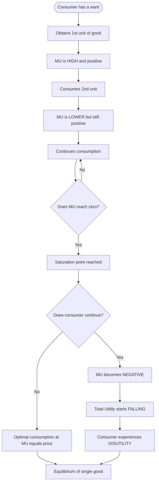
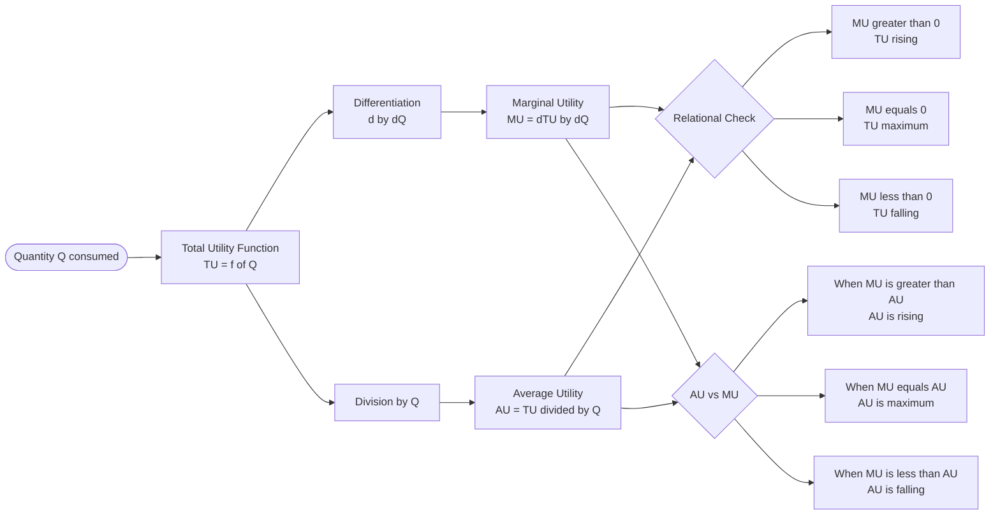
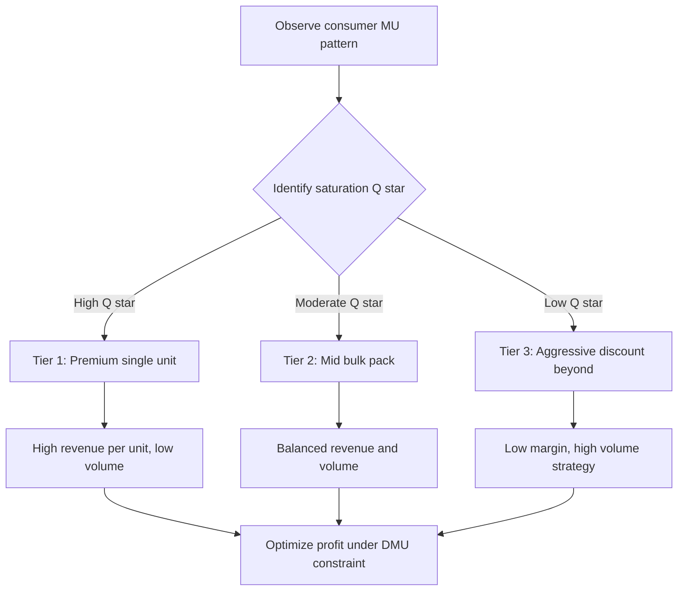

# Law of diminishing marginal utility

<!-- SECTION_1_START -->
# Law of Diminishing Marginal Utility

## 1. Core Technical Definition (KTU 2024 Syllabus Standard)

> [!IMPORTANT]
> **Formal Definition (KTU Board Standard):**
> The **Law of Diminishing Marginal Utility (DMU)** states that, *ceteris paribus* (other things being equal), as a consumer consumes successive units of a commodity, the **Marginal Utility (MU)** derived from each additional unit **diminishes** continuously, eventually becoming **negative** when total utility starts falling.

In symbolic form, if $TU_n$ represents the **Total Utility** from consuming $n$ units of a commodity, then the marginal utility of the $n^{th}$ unit is:

$$MU_n \;=\; TU_n \;-\; TU_{n-1}$$

The law mathematically expresses the condition:

$$\frac{\partial MU}{\partial Q} \;<\; 0 \quad \text{(with } MU \text{ itself initially positive and tending to zero)}$$

Where $Q$ denotes the quantity consumed and $MU$ is treated as a **continuous differentiable function** of $Q$ in classical analysis (Gossen’s First Law, 1854).

---

## 2. Conceptual Analogy / Intuitive Overview

> [!NOTE]
> **Plain-English Analogy — "The Glass of Water on a Hot Day":**
> Imagine you have just finished a 5 km run in the summer heat of Kerala. The *first glass* of cold water gives you immense satisfaction. The *second glass* is still refreshing but slightly less thrilling. The *third glass* is just "okay." By the *fifth glass*, you are forcing yourself to drink, and the *sixth* may even make you uncomfortable. This is **diminishing marginal utility** in action.

### Geometric Intuition

Think of utility as a "satisfaction score." If we plot the units consumed ($Q$) on the **x-axis** and satisfaction on the **y-axis**, every additional unit adds a smaller "height" to the total. The first unit's contribution is the tallest; each subsequent one is shorter, until it crosses zero and goes negative (where consumption actually harms satisfaction — e.g., a sixth glass of water causing nausea).

### Physical Constants / Standard Metrics in Bold

- **Marginal Utility (MU)** — measured in **utils** (a hypothetical unit of satisfaction).
- **Total Utility (TU)** — cumulative sum of all marginal utilities, $TU = \sum_{i=1}^{n} MU_i$.
- **Average Utility (AU)** — $AU = \dfrac{TU}{n}$.

> [!TIP]
> **KTU 2024 Highlight:** Always remember the **three magic words** — *ceteris paribus*. Examiners specifically look for this phrase in your definition. Skipping it may cost you 1 mark.

---

## 3. GeoGebra / Desmos Visualization Block

> [!VISUALIZATION CONTROL]
> **Concept:** Behaviour of TU and MU curves as quantity of a good increases.
> **GeoGebra / Desmos Input Equations:**
> - $TU(x) = 20 \cdot x - 0.8 \cdot x^2$
> - $MU(x) = 20 - 1.6 \cdot x$
> - $AU(x) = 20 - 0.8 \cdot x$
> - Define axis: $x \in [0, 14]$, $y \in [-10, 110]$
> - Plot point of maximum TU at $x = 12.5$, $MU = 0$
> **Visual Description:**
> - The **TU curve** is an **inverted U-shape (parabola)** that rises, reaches its peak where $MU = 0$, and then falls.
> - The **MU curve** is a **downward-sloping straight line** that intersects the x-axis at the same point where TU is maximum.
> - The **AU curve** also slopes downward but lies **above MU** for the relevant range, intersecting MU at the point of maximum AU.
<!-- SECTION_1_END -->

<!-- SECTION_2_START -->
# Deep Theoretical Analysis & KTU High-Yield Formula Sheet

## 1. Underlying Logic — Step-by-Step Breakdown

The Law of DMU is built on **human psychology** (psychic/satisfaction-based economics) and rests on a specific set of assumptions. Let us deconstruct its operational logic:

### A. Operational Premises

1. **Rational Consumer Assumption** — The consumer aims to maximize total satisfaction subject to a budget constraint.
2. **Continuous Consumption** — Units of the commodity are consumed in **successive, small, divisible** increments (continuous variable).
3. **Standard Units / Quality** — All units of the commodity are **homogeneous** in size, quality, shape, and packaging.
4. **Ceteris Paribus** — The consumer's **taste, preference, income, prices of related goods, and environment** remain constant during the period of analysis.
5. **No Time Gap** — Consumption is **continuous** with no significant time interval between successive units (to avoid satiation reset).
6. **Independent Utility** — Utility from one unit is **independent** of the utility from other units (no complementarity in the act of consumption itself, e.g., bread and butter are *complements*, violating this assumption).

### B. The 'Why' Behind the Law — Economic Reasoning

> [!NOTE]
> **The Core 'Why':** Human wants are **multiple but limited in capacity**. As a particular want is progressively satisfied, its **intensity diminishes**, and the consumer's mind becomes less responsive to additional units of the *same* want-satisfier. This is essentially a **law of human nature** interacting with **physiological satiation**.

### C. Total Utility, Marginal Utility & Average Utility — Their Interplay

| Relationship | Mathematical Form | Economic Meaning |
|---|---|---|
| Marginal from Total | $MU_n = TU_n - TU_{n-1}$ | Change in total satisfaction from one more unit |
| Total from Marginal | $TU_n = \sum_{i=1}^{n} MU_i$ | Cumulative satisfaction |
| Average Utility | $AU_n = \dfrac{TU_n}{n}$ | Per-unit satisfaction |
| Sign of MU | $MU > 0$ ⇒ TU rising | Consumer wants more |
| Critical point | $MU = 0$ ⇒ TU maximum | Saturation point (no gain, no loss) |
| Beyond critical | $MU < 0$ ⇒ TU falling | Consumption becomes a *disutility* |

---

## 2. KTU High-Yield Formula Sheet (Cheat Sheet)

> [!IMPORTANT]
> **Exam Tip:** Memorize this entire table — at least **one numerical or graphical question** is guaranteed from this in KTU ESE.

| Symbol | Formula | Description | Units / Remarks |
|---|---|---|---|
| $MU_n$ | $TU_n - TU_{n-1}$ | Marginal utility of $n^{th}$ unit | utils |
| $TU_n$ | $\sum_{i=1}^{n} MU_i$ | Total utility from $n$ units | utils |
| $AU_n$ | $TU_n / n$ | Average utility per unit | utils |
| $MU$ in calculus | $\dfrac{dTU}{dQ}$ | First derivative of $TU$ w.r.t. quantity | utils/unit |
| $\dfrac{dMU}{dQ}$ | $< 0$ | The DMU condition itself | dimensionless rate |
| $\dfrac{d^2 TU}{dQ^2}$ | $< 0$ | Concavity of $TU$ curve | ensures maximum |
| $TU_{max}$ | when $MU = 0$ | Saturation point | equilibrium of single good |
| $AU_{max}$ | when $MU = AU$ | Optimal average satisfaction | intersection point |

> [!WARNING]
> **Absolute Value Rule:** When writing $\vert x \vert$ in your answer sheet tables, always use $\mid x \mid$ or write it as *"mod x"* in plain text. KTU examiners will not penalize handwritten "mod x," but a broken table in printed notes loses presentation marks.

---

## 3. Real-World Utility for Engineers (Beyond the Textbook)

The DMU law is the **conceptual backbone** of several engineering-economics decisions:

1. **Pricing & Revenue Optimization** — Firms facing diminishing MU from a product must lower price to push the next unit to the consumer (the foundation of **progressive price discrimination** — bulk discounts, slabs in electricity tariffs, mobile data plans).
2. **Inventory Management** — Warehousing extra units beyond a point yields declining "utility per square foot," justifying **just-in-time (JIT)** inventory systems used in manufacturing.
3. **Resource Allocation in Projects** — Allocating the *same* engineer to the *same* project for too long yields diminishing returns (psychological fatigue), supporting **work-rotation** and **shift systems**.
4. **Software / API Usage Tiers** — Tech companies price their SaaS in tiers because the marginal utility of, say, the 100th user of a tool is much lower than the 1st — explaining why free tiers exist.
5. **Public Policy** — Progressive taxation slabs (India's Old Regime, GST slabs) directly trace back to "as income rises, MU of money falls," legitimizing higher taxes on the rich.

> [!NOTE]
> **KTU 2024 Connect:** Question papers in UCHUT346 increasingly test this application-based angle, so connect DMU to **at least one** engineering or business scenario in your answer to score higher-order marks.
<!-- SECTION_2_END -->

<!-- SECTION_3_START -->
# Step-by-Step Derivations & Worked Numerical Examples

## Example 1 — Building the TU / MU Schedule (Classic KTU Numerical)

A consumer consumes 7 cups of tea per day. The Total Utility (TU) derived from each cup is given below. Compute the **MU** and **AU** schedules, and identify the **saturation point**.

### Step 1 — Tabulate the Given Data

| Units ($Q$) | $TU$ (utils) |
|---|---|
| 0 | 0 |
| 1 | 10 |
| 2 | 18 |
| 3 | 24 |
| 4 | 28 |
| 5 | 30 |
| 6 | 30 |
| 7 | 28 |

### Step 2 — Compute Marginal Utility ($MU_n = TU_n - TU_{n-1}$)

$$
\begin{aligned}
MU_1 &= TU_1 - TU_0 = 10 - 0 = 10 \text{ utils} \\
MU_2 &= TU_2 - TU_1 = 18 - 10 = 8 \text{ utils} \\
MU_3 &= TU_3 - TU_2 = 24 - 18 = 6 \text{ utils} \\
MU_4 &= TU_4 - TU_3 = 28 - 24 = 4 \text{ utils} \\
MU_5 &= TU_5 - TU_4 = 30 - 28 = 2 \text{ utils} \\
MU_6 &= TU_6 - TU_5 = 30 - 30 = 0 \text{ utils} \\
MU_7 &= TU_7 - TU_6 = 28 - 30 = -2 \text{ utils}
\end{aligned}
$$

**Observation:** $MU$ is falling at a constant rate of **2 utils** per unit — the law of DMU is clearly exhibited.

### Step 3 — Compute Average Utility ($AU_n = TU_n / n$)

$$
\begin{aligned}
AU_1 &= 10 / 1 = 10.00 \text{ utils} \\
AU_2 &= 18 / 2 = 9.00 \text{ utils} \\
AU_3 &= 24 / 3 = 8.00 \text{ utils} \\
AU_4 &= 28 / 4 = 7.00 \text{ utils} \\
AU_5 &= 30 / 5 = 6.00 \text{ utils} \\
AU_6 &= 30 / 6 = 5.00 \text{ utils} \\
AU_7 &= 28 / 7 = 4.00 \text{ utils}
\end{aligned}
$$

### Step 4 — Construct the Complete Schedule

| Units ($Q$) | $TU$ | $MU$ | $AU$ | Region |
|---|---|---|---|---|
| 1 | 10 | 10 | 10.00 | MU > 0, TU rising |
| 2 | 18 | 8 | 9.00 | MU > 0, TU rising |
| 3 | 24 | 6 | 8.00 | MU > 0, TU rising |
| 4 | 28 | 4 | 7.00 | MU > 0, TU rising |
| 5 | 30 | 2 | 6.00 | MU > 0, TU rising |
| **6** | **30** | **0** | **5.00** | **Saturation point** |
| 7 | 28 | -2 | 4.00 | MU < 0, TU falling |

### Step 5 — Identify the Saturation Point

> [!IMPORTANT]
> **Saturation Point** is at $Q = 6$ units, where $MU = 0$ and $TU$ is at its **maximum value of 30 utils**. Beyond this, additional consumption reduces total satisfaction.

---

## Example 2 — Calculus-Based Derivation (KTU Analytical Type)

Suppose the Total Utility function of a good is given by:

$$TU(Q) = 40Q - 2Q^2$$

Find: (a) The MU function, (b) The quantity at which $TU$ is maximum, (c) The maximum $TU$, (d) The quantity at which $AU$ is maximum.

### Part (a) — Derive MU

$$MU(Q) = \frac{dTU}{dQ} = \frac{d}{dQ}(40Q - 2Q^2)$$

$$
\begin{aligned}
MU(Q) &= 40 \cdot 1 - 2 \cdot 2Q \\
MU(Q) &= 40 - 4Q
\end{aligned}
$$

### Part (b) — Quantity at which TU is Maximum

Set $MU = 0$ for the stationary point:

$$
\begin{aligned}
40 - 4Q &= 0 \\
4Q &= 40 \\
Q^{\star} &= 10 \text{ units}
\end{aligned}
$$

**Second-Order Test (Confirming Maximum):**

$$
\frac{d^2 TU}{dQ^2} = \frac{dMU}{dQ} = -4 < 0
$$

Since the second derivative is **negative**, the stationary point at $Q^{\star} = 10$ is indeed a **maximum** of $TU$ (concavity check passed).

### Part (c) — Maximum Total Utility

$$
\begin{aligned}
TU_{max} &= TU(10) = 40(10) - 2(10)^2 \\
TU_{max} &= 400 - 200 \\
TU_{max} &= 200 \text{ utils}
\end{aligned}
$$

### Part (d) — Quantity at which AU is Maximum

Average Utility: $AU(Q) = \dfrac{TU(Q)}{Q} = \dfrac{40Q - 2Q^2}{Q} = 40 - 2Q$

Set $\dfrac{dAU}{dQ} = 0$:

$$
\begin{aligned}
\frac{dAU}{dQ} &= -2 = 0 \quad \text{(no interior solution)}
\end{aligned}
$$

Since $AU$ is **monotonically decreasing**, $AU$ is maximized at the **boundary** $Q = 1$:

$$
AU_{max} = AU(1) = 40 - 2(1) = 38 \text{ utils}
$$

> [!NOTE]
> **Verifying the intersection condition $MU = AU$:**
> Set $40 - 4Q = 40 - 2Q \Rightarrow 4Q = 2Q$ (no positive solution). This confirms that for this linear $AU$ form, $MU$ and $AU$ coincide only at $Q = 0$, and $AU$ strictly dominates $MU$ for $Q > 0$.

---

## Example 3 — Assumptions and Limitations (Conceptual Discussion)

The law is valid only under specific assumptions. The KTU 2024 syllabus specifically asks students to **state the assumptions** and recognize **exceptions**.

### Key Assumptions (KTU Board-Expected List)

1. **Rational consumer** with stable preferences.
2. **Homogeneous units** of the commodity.
3. **Constant marginal utility of money** (so we can measure utility in monetary terms).
4. **Ceteris paribus** — prices, income, tastes, weather unchanged.
5. **Continuous and rapid consumption** — no time gap for want intensity to revive.
6. **Indivisibility of wants** — wants are treated as separate and distinct.
7. **Possibility of measurement of utility** — cardinal utility approach.

### Important Limitations / Exceptions (High-Yield for KTU)

| S.No. | Exception | Why the Law Fails |
|---|---|---|
| 1 | **Hobbies / Rare collections** (stamps, antiques) | Utility may *increase* with more units due to rarity-driven prestige |
| 2 | **Addictive goods** (alcohol, drugs) | Initial low satisfaction grows into dependence |
| 3 | **Miser's love for money** | Utility of money may not diminish (constant MU of money assumption) |
| 4 | **Goods of ostentation** (luxury cars, diamonds) | Utility rises with conspicuous display — **Veblen Effect** |
| 5 | **Knowledge and skills** | Reading more books often *increases* the desire to read more |
| 6 | **Durable goods with multiple uses** | A second refrigerator may add new utility (e.g., storing ice cream separately) |
| 7 | **Very small units** | A pinch of salt in 1000 ml of water is undetectable — utility of infinitesimal units is zero, not negative |

> [!WARNING]
> **Examiner's Pitfall:** When asked to "discuss the law," students often forget to **state assumptions before applying** the law. Always write the assumptions *first*, then proceed to exceptions. Marks are awarded for this structure.
<!-- SECTION_3_END -->

<!-- SECTION_4_START -->
# Structural Diagrams & Schematics

## 1. Concept-to-Behaviour Flow (Mermaid)

The following flowchart traces the **causal flow** of consumption behaviour and utility derivation as understood by classical economists:

**Interpretation of the diagram:**

- The decision node `step5` corresponds to the **mathematical condition** $MU = 0$.
- The decision node `step7` corresponds to the **economic condition** $MU = P$ (price of the good), which is the single-commodity consumer equilibrium.
- The terminal block `step12` is the **final behavioural state** — either a rational stop or a forced disutility-driven stop.

---

## 2. Sequential Processing Topology — Relationship between TU, MU, and AU

The following block-level topology shows how the three utility measures are **computed from one another**, capturing the full information flow:

**Reading the diagram:**

- Block `tuBlock` is the **source** of all utility information.
- Block `derivOp` is the **calculus engine** that produces $MU$.
- Block `divOp` is the **arithmetic engine** that produces $AU$.
- Block `relCheck` and `relCheck2` are **decision blocks** that output behavioural interpretations of the relationship between the three curves.

---

## 3. Block-Level Functional Architecture — Application in Pricing Strategy

Engineering managers often translate DMU into **tiered pricing** decisions. The following architecture shows the mapping:

> [!NOTE]
> **Why this matters for engineers:** In product management, marketing analytics, and software-as-a-service (SaaS) design, the *tier architecture* above is implemented literally — for example, AWS EC2 instance pricing, mobile recharge slabs, and electricity unit tariffs in Kerala (KSEB) all reflect a DMU-driven approach.
<!-- SECTION_4_END -->

<!-- SECTION_5_START -->
# KTU 2024 Scheme Examination Question Bank & Topic Recap

## Part A — Short Answer Questions (3 Marks Each)

### Question 1
> **[KTU University Exam - July 2024]** — *CO1, Remember*
> **State the Law of Diminishing Marginal Utility. Mention any two of its assumptions.**

**Model Answer (3 Marks):**

> [!IMPORTANT]
> **Definition (2 Marks):** The Law of Diminishing Marginal Utility states that, *ceteris paribus*, as a consumer consumes successive units of a commodity, the marginal utility derived from each additional unit goes on diminishing. *(Stating ceteris paribus: 1 Mark. Linking to "additional unit": 1 Mark)*

> **Assumptions (½ Mark each, choose any two):**
> 1. The consumer is **rational** and seeks to maximize satisfaction.
> 2. The units of the commodity are **homogeneous** in quality, size, and packaging.
> 3. The consumer's **income, tastes, and prices of related goods** remain constant during consumption.
> 4. Consumption is **continuous** with no significant time gap.
> 5. The **marginal utility of money** is assumed to remain constant.

---

### Question 2
> **[KTU University Exam - Dec 2023]** — *CO1, Understand*
> **Distinguish between Total Utility and Marginal Utility. How are they mathematically related?**

**Model Answer (3 Marks):**

| Aspect | Total Utility ($TU$) | Marginal Utility ($MU$) |
|---|---|---|
| Definition | Total satisfaction from consuming all units | Additional satisfaction from one more unit |
| Symbol | $TU_n$ | $MU_n$ |
| Behaviour | Rises, then falls (inverted U) | Falls continuously (downward sloping) |
| Formula | $TU_n = \sum_{i=1}^{n} MU_i$ | $MU_n = TU_n - TU_{n-1}$ |

**Mathematical Relationship (1 Mark):**

$$MU_n = TU_n - TU_{n-1} = \frac{dTU}{dQ} \text{ in continuous form}$$

> **Valuation Tip:** $TU$ is a **cumulative measure**, $MU$ is an **incremental measure** — write this distinction explicitly for full marks.

---

## Part B — Long Answer Questions (14 Marks Each, Internal Choice)

### Question A (14 Marks) — *Numerical + Graphical Analysis*

> **[KTU University Exam - July 2024 | Module 1, Internal Choice Option A]** — *CO1, CO2, Apply & Analyze*

A consumer consumes 8 units of a commodity. The Total Utility schedule is given below:

| Units | 1 | 2 | 3 | 4 | 5 | 6 | 7 | 8 |
|---|---|---|---|---|---|---|---|---|
| TU | 20 | 36 | 48 | 56 | 60 | 60 | 56 | 48 |

**(a)** Prepare the **MU schedule** and **AU schedule**, and identify the **saturation point**. *(7 Marks)*

**(b)** Explain the **shape of the MU curve** and the **shape of the AU curve** with reference to the DMU law. *(7 Marks)*

---

#### Model Solution for Part (a) — 7 Marks

**Step 1: Compute $MU$ using $MU_n = TU_n - TU_{n-1}$**

$$
\begin{aligned}
MU_1 &= 20 - 0 = 20 \\
MU_2 &= 36 - 20 = 16 \\
MU_3 &= 48 - 36 = 12 \\
MU_4 &= 56 - 48 = 8 \\
MU_5 &= 60 - 56 = 4 \\
MU_6 &= 60 - 60 = 0 \\
MU_7 &= 56 - 60 = -4 \\
MU_8 &= 48 - 56 = -8
\end{aligned}
$$

**[Each correct row of MU: ½ Mark × 8 = 4 Marks]**

**Step 2: Compute $AU$ using $AU_n = TU_n / n$**

$$
\begin{aligned}
AU_1 &= 20/1 = 20.00 \\
AU_2 &= 36/2 = 18.00 \\
AU_3 &= 48/3 = 16.00 \\
AU_4 &= 56/4 = 14.00 \\
AU_5 &= 60/5 = 12.00 \\
AU_6 &= 60/6 = 10.00 \\
AU_7 &= 56/7 = 8.00 \\
AU_8 &= 48/8 = 6.00
\end{aligned}
$$

**[Each correct row of AU: ½ Mark × 4 = 2 Marks]**

**Step 3: Identify Saturation Point (1 Mark)**

> [!IMPORTANT]
> **Saturation Point** is at $Q = 6$ units, where $MU = 0$ utils and $TU$ reaches its maximum value of **60 utils**. Beyond $Q = 6$, $MU$ becomes negative and $TU$ falls. **[Correct identification with numerical support: 1 Mark]**

---

#### Model Solution for Part (b) — 7 Marks

**Shape of the MU Curve (3 Marks):**

The MU curve is a **downward-sloping curve** that starts from a positive value (20 utils) and falls continuously. It intersects the **x-axis** at the saturation point ($Q = 6$) and continues into the **negative region** beyond that. The continuous decline reflects the **Law of DMU** — each additional unit of the commodity provides a smaller increment in satisfaction than the previous unit, given the consumer's want for that good is being progressively satiated.

**Shape of the AU Curve (2 Marks):**

The AU curve is also **downward-sloping**, but it lies **above the MU curve** throughout the relevant range. AU falls at a *slower* rate than MU, and the two curves **never intersect in the positive region** for this dataset (since $MU$ reaches 0 before catching up to $AU$).

**Relation to DMU Law (2 Marks):**

> Both curves slope downward because of diminishing marginal utility. The **MU curve is steeper** (rate of change is more negative), while the **AU curve is gentler** (rate of change is half of MU's rate of fall in the early units). The **intersection of MU and AU** would mark the maximum of AU, but here, MU reaches zero first, so the law's saturation is reached before the AU-maximum condition.

**[Shape explanation with curve logic: 3 Marks | DMU linkage: 2 Marks]**

---

### Question B (14 Marks) — *Theory + Application*

> **[KTU University Exam - Dec 2023 | Module 1, Internal Choice Option B]** — *CO1, CO2, Understand & Apply*

**(a)** State and explain the **Law of Diminishing Marginal Utility** with the help of a **numerical illustration**. Mention **any four assumptions** of the law. *(7 Marks)*

**(b)** Discuss **three important limitations/exceptions** to the law and explain how the concept of DMU is applied in **pricing decisions of an engineering firm**. *(7 Marks)*

---

#### Model Solution for Part (a) — 7 Marks

**Step 1: Statement of the Law (2 Marks)**

> The Law of Diminishing Marginal Utility, propounded by **H.H. Gossen** in 1854, states that, *ceteris paribus*, as a consumer consumes successive units of a commodity, the marginal utility derived from each additional unit goes on **diminishing**. **[Statement with attribution: 1 Mark | ceteris paribus + "additional unit" clarity: 1 Mark]**

**Step 2: Numerical Illustration (3 Marks)**

Consider a consumer eating vadas. The MU values are: 1st vada = 20 utils, 2nd = 16, 3rd = 12, 4th = 8, 5th = 4, 6th = 0, 7th = -4.

The MU is clearly **falling** (20 → 16 → 12 → 8 → 4 → 0 → -4) as consumption increases — illustrating the law in operation. **[Sequence of MU values: 2 Marks | Concluding remark linking to law: 1 Mark]**

**Step 3: Four Assumptions (½ Mark each × 4 = 2 Marks)**

1. **Rational consumer** aiming to maximize satisfaction.
2. **Homogeneous units** of the commodity.
3. **Continuous consumption** with no time gap.
4. **Constant marginal utility of money** during the period of analysis.

---

#### Model Solution for Part (b) — 7 Marks

**Step 1: Three Limitations / Exceptions (3 Marks — 1 Mark each)**

1. **Hobbies and Rare Collections:** Collecting rare coins or stamps often gives *increasing* satisfaction with each additional piece, since rarity enhances value.
2. **Addictive Goods:** Consumption of alcohol or tobacco creates a *craving* — utility does not diminish with successive units in the same way; in fact, dependence may make the user want more.
3. **Goods of Ostentation (Veblen Effect):** Luxury watches, designer clothing, and sports cars may give *more* satisfaction as more units are visibly owned, contradicting DMU.

**Step 2: Application in Engineering Firm Pricing (4 Marks)**

> [!TIP]
> **Application in Pricing (4 Marks — Break-up below):**
> - **Identification of DMU in pricing (1 Mark):** An engineering firm observes that the marginal utility a customer derives from successive units of a product (e.g., a second printer, a third industrial sensor) declines.
> - **Tiered pricing strategy (1 Mark):** The firm uses **progressive discounts** (e.g., 1st unit MRP ₹10,000; 2nd unit ₹9,000; 3rd unit ₹8,000) so the price equals the falling MU at each unit, ensuring consumer equilibrium and continued sales.
> - **Volume-based incentives (1 Mark):** Bulk-purchase discounts in B2B contracts (e.g., 100 motors at ₹5,000 each vs. 1 motor at ₹7,000) directly operationalize DMU.
> - **Strategic product bundling vs. unbundling (1 Mark):** When DMU sets in early, the firm may *bundle* the slow-moving product with a fast-moving one to revive utility. Conversely, when consumers want finer control, the firm *unbundles* features into tiers (e.g., Basic, Pro, Enterprise software).

> **Conclusion (Implicit, ½ Mark):** Thus, DMU is a foundational psychological-economic principle that engineering managers must internalize while designing pricing, packaging, and product-line strategies.

---

## ⚠️ KTU Examiner's Valuation Warning / Pitfall Callout

> [!WARNING]
> **Common Mark-Deduction Pitfalls in DMU Questions:**
> 1. **Skipping "*ceteris paribus*"** — Examiners *specifically* allocate 1 mark for this phrase. Writing "as consumption increases, MU decreases" without the qualifier loses a guaranteed mark.
> 2. **Confusing $TU$ with $AU$** — Many students wrongly equate $TU_{max}$ with $AU_{max}$. Remember: $TU_{max}$ occurs when $MU = 0$; $AU_{max}$ occurs when $MU = AU$.
> 3. **Forgetting the negative MU region** — DMU does *not* stop at zero. The law extends to **negative marginal utility**. Always extend the table / curve until $MU$ is clearly negative, or you will lose 1 mark in the "saturation point" sub-part.
> 4. **No graph in graphical questions** — KTU's valuation key explicitly allocates **1–2 marks** for the *diagram* (axes labels, curves, and the saturation point marked). A correct numerical schedule with **no graph** is incomplete.
> 5. **Mixing up MU and AU in the calculus version** — When $TU(Q) = aQ - bQ^2$, $MU = a - 2bQ$, but $AU = a - bQ$. Students often write $AU$ as $a - 2bQ$ — a common 1-mark error.
> 6. **Application answer missing the "engineer" connect** — For UCHUT346, every application question must mention an engineering / business context. A purely abstract answer loses 1 mark for not demonstrating course-specific understanding.

---

## Topic Recap & Important Things to Remember

- **Law of DMU (Gossen, 1854):** *Ceteris paribus*, additional units of a good yield diminishing marginal utility.
- **Marginal Utility ($MU_n$):** Change in total utility from consuming one more unit. $MU_n = TU_n - TU_{n-1} = \dfrac{dTU}{dQ}$.
- **Total Utility ($TU$):** Aggregate satisfaction from $n$ units. $TU_n = \sum_{i=1}^{n} MU_i$. Curve is **inverted U-shaped**.
- **Average Utility ($AU$):** $AU = TU / n$. Lies **above MU** for a concave $TU$ curve.
- **Saturation Point:** The unit at which $MU = 0$ and $TU$ is at its maximum. Consumption beyond this gives **negative MU** and **falling TU**.
- **Key Assumptions:** Rational consumer, homogeneous units, constant MU of money, ceteris paribus, continuous consumption, independent utility, cardinal measurability.
- **Mathematical Condition for DMU:** $\dfrac{dMU}{dQ} < 0$ (i.e., $MU$ is a decreasing function of $Q$).
- **Mathematical Condition for $TU_{max}$:** $\dfrac{dTU}{dQ} = 0$ and $\dfrac{d^2 TU}{dQ^2} < 0$.
- **Mathematical Condition for $AU_{max}$:** $MU = AU$ (intersection point of the two curves in the positive region).
- **Notable Exceptions:** Hobbies, addictions, Veblen goods, knowledge, durable goods with multiple uses, and the miser's money paradox.
- **Engineering / Business Applications:** Tiered pricing, bulk discounts, JIT inventory, work-rotation in projects, slab-based tariffs, progressive taxation, and SaaS pricing models.
- **Examiner's Triggers (must-write phrases):** *"ceteris paribus"*, *"rational consumer"*, *"successive units"*, *"homogeneous units"*, *"cardinal utility"*, *"Gossen's First Law"*.
- **Graph Must-Haves:** Axes labelled $Q$ (x-axis) and *Utility* (y-axis); three curves — $TU$ (inverted U), $MU$ (downward sloping crossing x-axis), $AU$ (gentler downward slope); saturation point marked.
- **Units of Measurement:** Utility is measured in **utils** (a hypothetical, dimensionless satisfaction unit).
- **Cousin Concepts to Distinguish:** *Law of Equi-Marginal Utility* (Gossen's Second Law), *Indifference Curve Analysis* (ordinal, not cardinal), *Revealed Preference Theory*.
- **Quick Recall Mnemonic — "T-M-A-S":** **T**U rises, then **M**U falls, **A**U is in-between, **S**aturation at $MU = 0$.
<!-- SECTION_5_END -->
