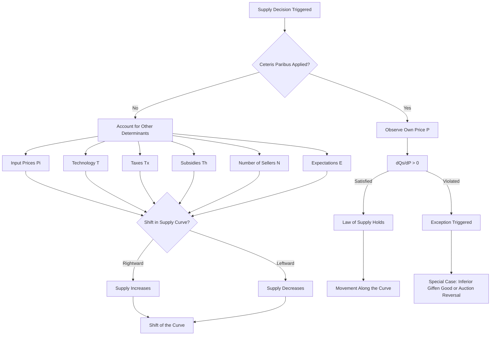
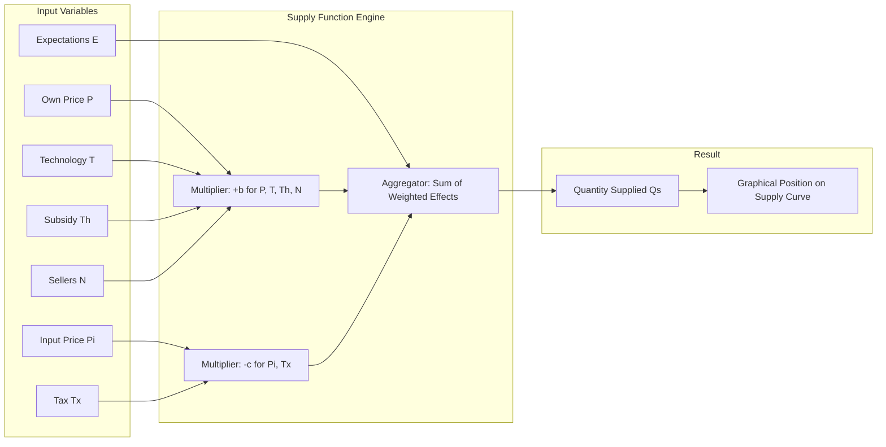
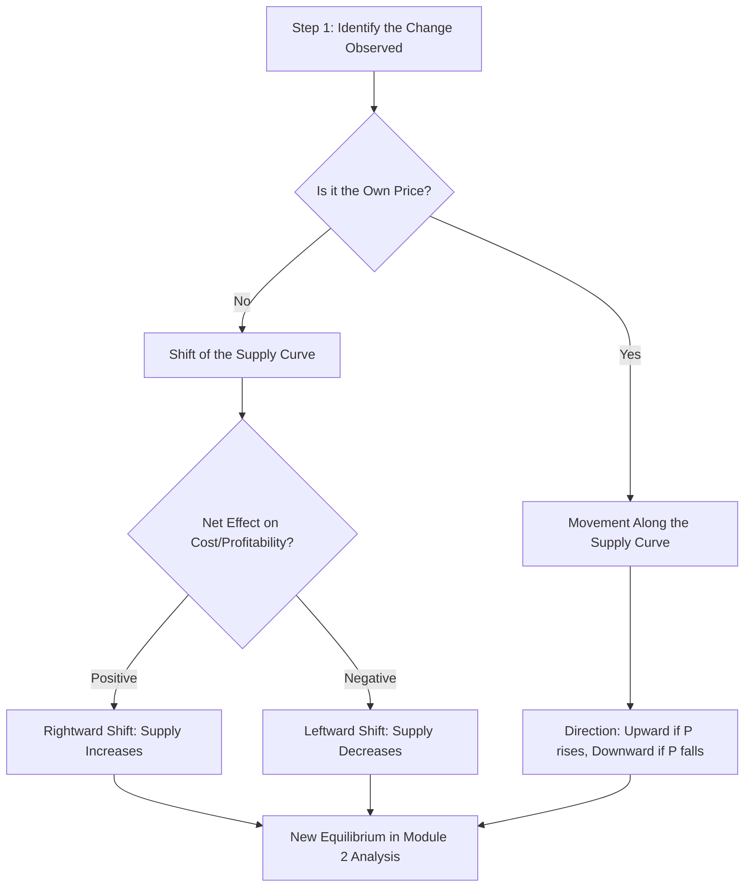
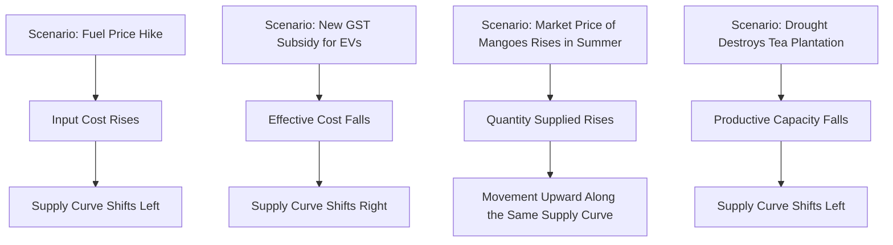

# Law of supply

<!-- SECTION_1_START -->

# Law of Supply — Core Definition & Intuitive Overview

## Formal Academic Definition

> [!IMPORTANT]
> **Law of Supply (KTU 2024 Definition):**
> *Ceteris paribus* (i.e., "all other factors held constant"), the **Law of Supply** states that there is a **direct (positive) functional relationship** between the *own price* of a commodity and the *quantity supplied* of that commodity by producers/sellers within a given market over a specified period of time.
>
> Formally, if $P$ denotes price and $Q_s$ denotes quantity supplied, then the supply function is expressed as:
> $$Q_s = f(P) \quad \text{where} \quad \frac{\partial Q_s}{\partial P} > 0$$

The phrase **"ceteris paribus"** is the single most critical qualifier in the entire law. It isolates the price-quantity relationship from confounding variables such as input costs, technology, government policy, and producer expectations.

> [!NOTE]
> **KTU Board Examiner Note:** Examiners frequently test whether students explicitly mention *ceteris paribus*. Omitting this phrase is a guaranteed 1-mark deduction in Part A answers.

## Conceptual Analogy / Intuitive Overview

Imagine you are a **baker in Kerala producing banana chips (Upperi)**. On a normal day, when the market price is ₹150/kg, you find it profitable enough to produce 20 kg. Suddenly, during Onam, demand surges and the price rises to ₹300/kg.

What do you do? You:

1. Wake up earlier and bake more batches.
2. Hire a temporary helper to increase output.
3. Allocate more of your raw banana stock toward chip production.

This **intuitive behavioural response** is the Law of Supply in action. Higher prices = greater profit incentive = higher quantity supplied.

> **Reverse Intuition Check:** What if the price crashes to ₹80/kg? You will likely reduce production, perhaps switch to making banana fritters (pazham pori) instead, or even shut shop for the day. This confirms the positive price-quantity relationship.

The **supply curve** therefore slopes **upward from left to right** when plotted on a standard Price (Y-axis) versus Quantity (X-axis) graph.

## Visual Representation of the Law

> [!VISUALIZATION CONTROL]
> **Concept:** Upward-Sloping Linear Supply Curve
> **GeoGebra / Desmos Input Equations:**
> * `f(x) = 2x - 10` (represents $Q_s = 2P - 10$)
> * Domain restriction: $P \geq 5$ (since quantity cannot be negative)
> **Visual Description:** The student should observe a straight line originating from the point $(5, 0)$ on the price axis, rising diagonally into the first quadrant with a positive slope of $2$. Any rightward movement along the curve corresponds to a higher price and a higher quantity supplied.

## Key Terminology Used in KTU Module 1

> [!NOTE]
> **Mandatory KTU Glossary Terms:**
> * **Quantity Supplied ($Q_s$):** A specific amount offered at a specific price.
> * **Supply:** The entire relationship (a schedule or curve), not a single quantity.
> * **Law of Supply:** The positive price-quantity principle itself.
> * **Ceteris Paribus:** The "all else equal" assumption.
> * **Supply Schedule:** A tabular listing of price-quantity pairs.
> * **Supply Curve:** The graphical representation of the supply schedule.

<!-- SECTION_1_END -->

<!-- SECTION_2_START -->

# Deep Theoretical Analysis & KTU High-Yield Formula Sheet

## The Supply Function — Mathematical Form

The most general representation of a producer's supply behaviour is:

$$Q_s = f(P, P_i, T, T_x, N, E, T_h)$$

Where the variables denote the **determinants of supply**:

| Symbol | Variable | Nature of Effect on $Q_s$ |
|:------:|:---------|:-------------------------|
| $P$ | Own price of the commodity | Positive (+) |
| $P_i$ | Prices of inputs (raw materials, labour) | Negative (−) |
| $T$ | State of technology | Positive (+) |
| $T_x$ | Taxes imposed on the producer | Negative (−) |
| $N$ | Number of sellers in the market | Positive (+) |
| $E$ | Producer expectations about future prices | Mixed (forward-looking) |
| $T_h$ | Subsidies from the government | Positive (+) |

When *ceteris paribus* is applied, all variables except $P$ are held constant, reducing the function to the canonical two-variable form:

$$Q_s = f(P) \quad \text{with} \quad \frac{dQ_s}{dP} > 0$$

## The Linear Supply Equation

For board-level problems, the supply function is most often expressed in linear form:

$$Q_s = a + bP$$

Where:

* $a$ = autonomous supply (intercept) — may be positive, zero, or negative.
* $b$ = slope coefficient, strictly $b > 0$ under the Law of Supply.
* $P$ = market price (independent variable).

> [!IMPORTANT]
> **Market Equilibration Hint:** In Module 2, KTU links this to demand via $Q_s = Q_d$ to derive equilibrium price $P^*$ and equilibrium quantity $Q^*$. The Law of Supply on its own only describes the **producer side**.

## The Inverse Supply Function

For graphical convenience, supply is sometimes inverted (with $P$ as a function of $Q_s$):

$$P = \alpha + \beta Q_s \quad \text{where} \quad \alpha = -\frac{a}{b}, \quad \beta = \frac{1}{b} > 0$$

This form is preferred when the Y-axis (price) is the dependent variable on the standard graph.

## Supply Schedule — A Worked Numerical Example

> [!NOTE]
> **KTU boards frequently ask:** *"Prepare a supply schedule and curve for the following data and verify the Law of Supply."*

Assume a textile producer offers the following supply behaviour:

| Price (₹/unit) | Quantity Supplied (units) | Behaviour |
|:--------------:|:-------------------------:|:----------|
| 10 | 50 | Low price, low output |
| 20 | 80 | Price rises, output rises |
| 30 | 110 | Price rises, output rises |
| 40 | 140 | Price rises, output rises |
| 50 | 170 | High price, high output |

Observing the table, every ₹10 increase in price produces a **uniform increase of 30 units** in quantity supplied, confirming a perfectly linear positive relationship.

## Movement Along vs. Shift of the Supply Curve

This distinction is **the single most tested concept** in KTU Part A questions on this topic.

> [!IMPORTANT]
> **Movement Along the Supply Curve (Change in Quantity Supplied):**
> Caused by a change in the **own price** of the commodity. We slide *along* the same curve from one point to another. The curve itself does not move.

> [!IMPORTANT]
> **Shift of the Supply Curve (Change in Supply):**
> Caused by a change in **any non-price determinant** (input cost, technology, tax, etc.). The entire curve shifts **rightward** (increase in supply) or **leftward** (decrease in supply).

| Event | Type of Change | Curve Behaviour |
|:------|:---------------|:----------------|
| Price of the good rises | Movement along | Upward slide along same curve |
| Input cost falls | Shift | Rightward shift (supply increases) |
| Government imposes a new tax | Shift | Leftward shift (supply decreases) |
| New efficient machinery installed | Shift | Rightward shift (supply increases) |
| More producers enter the market | Shift | Rightward shift (supply increases) |

## KTU Formula Sheet / Cheat Sheet

| Concept | Formula / Condition | Engineering / Economic Utility |
|:--------|:-------------------|:------------------------------|
| Supply Function | $Q_s = a + bP$ | Used in cost-volume-profit analysis for firms |
| Positive Slope Condition | $b > 0$ | Verifies adherence to the Law of Supply |
| Inverse Supply | $P = -\dfrac{a}{b} + \dfrac{1}{b} Q_s$ | Graphical plotting on Y-axis |
| Price Elasticity of Supply | $E_s = \dfrac{\%\Delta Q_s}{\%\Delta P} = \dfrac{\Delta Q_s}{\Delta P} \cdot \dfrac{P}{Q_s}$ | Forecasting production response to price changes |
| Market Supply | $Q_s^{\text{market}} = \sum_{i=1}^{n} Q_s^{i}$ | Aggregating firm-level data for industry analysis |
| Shift vs. Movement | Movement = own price change; Shift = other factors | Distinguishing endogenous vs. exogenous shocks |

## Real-World Engineering & Production Utility

The Law of Supply is **not merely an academic abstraction**. In production engineering and operations management, this law underpins several real decisions:

1. **Capacity Planning:** A manufacturing firm uses supply elasticity estimates to decide whether to invest in a second production line when prices are expected to rise.
2. **Inventory Management:** A warehouse operator decides how much stock to release into the market based on observed price signals — a direct application of the price-quantity relationship.
3. **Project Feasibility Studies:** Engineering economics evaluates whether a proposed project remains profitable across a range of *expected selling prices*, which is precisely a supply-side analysis.
4. **Renewable Energy Bidding:** Power producers decide how much electricity to bid into the grid based on real-time price — a textbook Law of Supply application.

> [!NOTE]
> **Industry Case Study:** Kerala State Electricity Board (KSEB) uses supply elasticity of hydro-power to decide reservoir release schedules. During peak demand hours (higher price), more water is released to generate more electricity.

<!-- SECTION_2_END -->

<!-- SECTION_3_START -->

# Step-by-Step Derivations & Code/Symbolic Implementation

## Derivation 1: Linear Supply Function from Two Data Points

Suppose a producer supplies **30 units at ₹20** and **70 units at ₹40**. We are required to derive the linear supply equation.

**Step 1:** State the general form.

$$Q_s = a + bP$$

**Step 2:** Substitute the first observation $(P = 20, Q_s = 30)$.

$$30 = a + b(20)$$
$$30 = a + 20b \quad \text{...(Equation 1)}$$

**Step 3:** Substitute the second observation $(P = 40, Q_s = 70)$.

$$70 = a + b(40)$$
$$70 = a + 40b \quad \text{...(Equation 2)}$$

**Step 4:** Subtract Equation 1 from Equation 2 to eliminate $a$.

$$70 - 30 = (a + 40b) - (a + 20b)$$
$$40 = 20b$$
$$b = 2$$

**Step 5:** Substitute $b = 2$ back into Equation 1 to find $a$.

$$30 = a + 20(2)$$
$$30 = a + 40$$
$$a = -10$$

**Step 6:** Write the final supply function.

$$\boxed{Q_s = -10 + 2P}$$

**Step 7:** Verify the *Law of Supply* condition.

$$\frac{dQ_s}{dP} = 2 > 0$$

Since the derivative is strictly positive, the law is satisfied. ✅

**Step 8:** Find the minimum price (supply reservation price) at which the producer is willing to supply.

Setting $Q_s = 0$:

$$0 = -10 + 2P$$
$$P_{\min} = 5$$

Below ₹5, the producer will not supply any positive quantity — this is known as the **shutdown point** in microeconomics.

---

## Derivation 2: Price Elasticity of Supply (Point Elasticity)

The **price elasticity of supply** measures the *responsiveness* of $Q_s$ to a change in $P$. It is dimensionless and is defined as:

$$E_s = \frac{\text{Percentage change in } Q_s}{\text{Percentage change in } P} = \frac{\Delta Q_s / Q_s}{\Delta P / P}$$

Simplifying:

$$E_s = \frac{\Delta Q_s}{\Delta P} \cdot \frac{P}{Q_s}$$

**Worked Numerical Example:**

Using the supply function $Q_s = -10 + 2P$, calculate elasticity at the point $P = 30$.

**Step 1:** Find $Q_s$ at $P = 30$.

$$Q_s = -10 + 2(30) = -10 + 60 = 50 \text{ units}$$

**Step 2:** Compute $\dfrac{\Delta Q_s}{\Delta P}$.

$$\frac{\Delta Q_s}{\Delta P} = 2$$

**Step 3:** Apply the elasticity formula.

$$E_s = 2 \cdot \frac{30}{50} = 2 \cdot 0.6 = 1.2$$

**Step 4:** Interpret the result.

$$E_s = 1.2 > 1 \implies \text{Supply is } \textbf{elastic} \text{ at } P = 30$$

> A 1% rise in price produces a 1.2% rise in quantity supplied — producers are highly responsive.

---

## Python Implementation — Plotting and Verifying the Law of Supply

The following Python code generates a numerical supply schedule, verifies the Law of Supply, computes elasticity at multiple price points, and produces a publication-quality plot.

```python
import numpy as np
import matplotlib.pyplot as plt
import logging

# Configure strict error logging
logging.basicConfig(level=logging.INFO, format='%(levelname)s: %(message)s')

def linear_supply_calculator(a: float, b: float, P_array: np.ndarray) -> np.ndarray:
    """
    Computes quantity supplied for a linear supply function Q_s = a + bP.
    Validates the Law of Supply by ensuring b > 0.
    
    Parameters:
    -----------
    a : float
        Autonomous (intercept) supply component.
    b : float
        Slope coefficient (must be strictly positive).
    P_array : np.ndarray
        Array of price values (must be non-negative).
    
    Returns:
    --------
    np.ndarray
        Array of corresponding quantity supplied values.
    """
    # Boundary check: Law of Supply requires a positive slope
    if b <= 0:
        logging.error("Slope coefficient 'b' must be positive under the Law of Supply.")
        raise ValueError(f"Invalid slope: b = {b}. Expected b > 0.")
    
    # Boundary check: prices cannot be negative in standard market analysis
    if np.any(P_array < 0):
        logging.warning("Negative price detected. Clipping to zero for physical validity.")
        P_array = np.clip(P_array, a_min=0, a_max=None)
    
    return a + b * P_array


def compute_elasticity(b: float, P: float, Q_s: float) -> float:
    """
    Computes point price elasticity of supply.
    Formula: E_s = (dQ_s/dP) * (P / Q_s)
    """
    if Q_s == 0:
        logging.warning("Elasticity undefined at Q_s = 0 (division by zero).")
        return np.inf
    return b * (P / Q_s)


# ----------- MAIN EXECUTION BLOCK -----------
if __name__ == "__main__":
    # Define linear supply parameters
    a_intercept = -10.0
    b_slope = 2.0
    
    # Define a price grid (₹5 to ₹60, step of ₹5)
    price_grid = np.arange(5, 61, 5, dtype=float)
    
    # Calculate corresponding quantities supplied
    quantity_supplied = linear_supply_calculator(a_intercept, b_slope, price_grid)
    
    # Display the supply schedule
    print("\n" + "=" * 45)
    print(f"{'Price (₹)':<15}{'Quantity (units)':<20}{'Elasticity E_s'}")
    print("=" * 45)
    for P, Q in zip(price_grid, quantity_supplied):
        E_s = compute_elasticity(b_slope, P, Q)
        print(f"{P:<15.2f}{Q:<20.2f}{E_s:<15.4f}")
    print("=" * 45)
    
    # Verify Law of Supply: confirm Q_s is monotonically increasing
    differences = np.diff(quantity_supplied)
    if np.all(differences > 0):
        logging.info("Law of Supply VERIFIED: Quantity supplied rises with price.")
    else:
        logging.error("Law of Supply VIOLATED: Quantity is not monotonically increasing.")
    
    # Generate publication-quality plot
    plt.figure(figsize=(9, 6))
    plt.plot(quantity_supplied, price_grid, marker='o', color='#2E86AB', 
             linewidth=2.2, label=r'Supply Curve: $Q_s = -10 + 2P$')
    plt.fill_between(quantity_supplied, 0, price_grid, alpha=0.08, color='#2E86AB')
    
    plt.title('Law of Supply — Linear Case', fontsize=14, fontweight='bold')
    plt.xlabel('Quantity Supplied (units)', fontsize=12)
    plt.ylabel('Price (₹ per unit)', fontsize=12)
    plt.grid(True, linestyle='--', alpha=0.6)
    plt.legend(loc='upper left', fontsize=11)
    plt.axhline(y=0, color='black', linewidth=0.8)
    plt.axvline(x=0, color='black', linewidth=0.8)
    plt.tight_layout()
    plt.savefig('law_of_supply_curve.png', dpi=300)
    plt.show()
    
    logging.info("Plot saved successfully as 'law_of_supply_curve.png'.")
```

**Expected Output Excerpt:**

```text
Price (₹)       Quantity (units)   Elasticity E_s
=============================================
5.00            0.00               inf
10.00           10.00              2.0000
15.00           20.00              1.5000
20.00           30.00              1.3333
25.00           40.00              1.2500
30.00           50.00              1.2000
...
60.00           110.00             1.0909
```

---

## Tabular Pin-Configuration for Engineering Application (Process Mapping)

> **Why include this?** Because the *Law of Supply* is a behavioural principle — when applied to a real production system, the "pins" become the variables that engineers can directly control or measure.

| Process Variable (Pin) | Economic Counterpart | Direction of Effect | Engineering Control Lever |
|:-----------------------|:---------------------|:-------------------|:--------------------------|
| Raw material cost | $P_i$ (input price) | Inverse to $Q_s$ | Bulk procurement contracts |
| Machine uptime | $T$ (technology) | Direct to $Q_s$ | Preventive maintenance schedule |
| Excise duty | $T_x$ (taxes) | Inverse to $Q_s$ | Tax planning / duty optimization |
| Capital subsidy received | $T_h$ (subsidy) | Direct to $Q_s$ | Government liaison & application |
| Selling price announced | $P$ (own price) | Direct to $Q_s$ | Dynamic pricing algorithm |
| Producer forecast accuracy | $E$ (expectations) | Direct to $Q_s$ | Demand-sensing AI tools |

<!-- SECTION_3_END -->

<!-- SECTION_4_START -->

# Structural Diagrams & Schematics

## Diagram 1: Causal Flowchart — Determinants of the Law of Supply

The following Mermaid flowchart decomposes the **determinants of supply** and the *ceteris paribus* logic into a structured decision tree.



---

## Diagram 2: Block-Level Functional Architecture of the Supply Function

The following block diagram maps the inputs, processor, and outputs of the canonical supply function $Q_s = f(P, P_i, T, T_x, T_h, N, E)$.



---

## Diagram 3: Sequential Topology — Movement vs. Shift Decision



---

## Diagram 4: Cross-Sectional Matrix — Real-World Scenarios



<!-- SECTION_4_END -->

<!-- SECTION_5_START -->

# KTU 2024 Scheme Examination Question Bank & Topic Recap

## Part A Questions (3 Marks Each)

### Question 1
**[KTU University Exam – July 2024]** | **CO1** | **Bloom's Level: Remember**

*State the Law of Supply. Why is the assumption of "ceteris paribus" important while stating it?*

**Model Answer (3 Marks):**

> **Statement of the Law (1 Mark):**
> The Law of Supply states that, *ceteris paribus*, the quantity supplied of a commodity is directly (positively) related to its own price. As price rises, quantity supplied rises, and as price falls, quantity supplied falls.

> **Ceteris Paribus Importance (2 Marks):**
> The assumption is important because, in reality, many factors other than price (such as input costs, technology, taxes, and producer expectations) influence the quantity supplied. By holding these factors constant, the law isolates the **pure price-quantity relationship**, allowing for a clean, predictable analysis. Without this assumption, the positive relationship may be masked or even reversed by external shocks.

---

### Question 2
**[KTU University Exam – Dec 2023]** | **CO1** | **Bloom's Level: Understand**

*Differentiate between a "movement along the supply curve" and a "shift of the supply curve". Give one example of each.*

**Model Answer (3 Marks):**

> **Movement Along the Supply Curve (1.5 Marks):**
> A movement along the supply curve occurs when there is a change in the *quantity supplied* due to a change in the **own price** of the commodity. The curve itself remains stationary.
> *Example:* When the price of rice rises from ₹40/kg to ₹50/kg, sellers offer more rice — this is an upward movement along the same supply curve.

> **Shift of the Supply Curve (1.5 Marks):**
> A shift of the supply curve occurs when there is a change in the *supply* (the entire relationship) due to a **non-price determinant** such as input cost, technology, or government policy.
> *Example:* The government announces a 20% subsidy on solar panel manufacturing, causing the entire supply curve to shift rightward.

---

## Part B Questions (14 Marks Each — Module Internal Choice)

### Question A
**[KTU University Exam – July 2024]** | **CO2** | **Bloom's Level: Apply + Analyze**

**(a) [7 Marks]** *Explain the determinants of supply with suitable examples. How does each determinant affect the position of the supply curve?*

**(b) [7 Marks]** *The supply function of a firm is given by $Q_s = -20 + 4P$, where $P$ is the price in ₹. Compute: (i) the minimum price at which the firm begins to supply, (ii) the quantity supplied at $P = ₹30$, and (iii) the price elasticity of supply at $P = ₹30$. Interpret the elasticity value.*

---

**Model Solution:**

**Part (a) — Determinants of Supply (7 Marks):**

**[Stating the definition: 1 Mark]:**
The determinants of supply are the non-price factors that influence the quantity producers are willing and able to offer in the market at every possible price.

**[Explaining each determinant: 5 Marks — 1 mark each]:**

1. **Prices of Inputs ($P_i$):** If the cost of raw materials, labour, or energy rises, production becomes expensive and supply falls (leftward shift). *Example:* A rise in the price of cotton increases the cost of producing shirts, reducing supply.

2. **State of Technology ($T$):** Improved technology reduces per-unit cost and increases output, shifting supply rightward. *Example:* Introduction of automated looms in a textile mill increases fabric supply.

3. **Taxes ($T_x$):** Higher taxes (e.g., excise duty, GST) raise the cost of production, shifting supply leftward. *Example:* A 28% GST on premium cars reduces their supply in the market.

4. **Subsidies ($T_h$):** Government subsidies lower effective production cost, shifting supply rightward. *Example:* PM-Kisan subsidy encourages higher agricultural output.

5. **Number of Sellers ($N$):** More sellers mean greater total market supply, shifting supply rightward. *Example:* Entry of new ride-hailing drivers increases cab supply.

6. **Producer Expectations ($E$):** If sellers expect higher future prices, they withhold current stock (leftward shift). If they expect a price fall, they release more now (rightward shift).

**[Concluding link to supply curve: 1 Mark]:**
All these determinants shift the entire supply curve rightward (increase in supply) or leftward (decrease in supply).

---

**Part (b) — Numerical Solution (7 Marks):**

**Given:** $Q_s = -20 + 4P$

**(i) Minimum price (shutdown point) — [Setting up equation: 1 Mark, Solving: 1 Mark]:**

Setting $Q_s = 0$:

$$0 = -20 + 4P$$
$$4P = 20$$
$$P_{\min} = ₹5$$

> **Interpretation:** The firm will begin to supply only when the price reaches ₹5 or above.

**(ii) Quantity supplied at $P = ₹30$ — [Substitution: 1 Mark, Calculation: 1 Mark]:**

$$Q_s = -20 + 4(30) = -20 + 120 = 100 \text{ units}$$

**(iii) Price elasticity of supply at $P = ₹30$ — [Stating formula: 1 Mark, Calculation: 1 Mark, Interpretation: 1 Mark]:**

$$E_s = \frac{dQ_s}{dP} \cdot \frac{P}{Q_s} = 4 \cdot \frac{30}{100} = 4 \cdot 0.3 = 1.2$$

> **Interpretation:** Since $E_s = 1.2 > 1$, supply is **elastic** at $P = ₹30$. A 1% increase in price leads to a 1.2% increase in quantity supplied, indicating high producer responsiveness.

---

### Question B (Alternative Choice)
**[KTU University Exam – Dec 2023]** | **CO2** | **Bloom's Level: Understand + Apply**

**(a) [7 Marks]** *State and explain the Law of Supply. What are the major exceptions to this law?*

**(b) [7 Marks]** *A firm's supply schedule is given below. Derive the linear supply equation, verify the Law of Supply, and calculate the elasticity of supply between $P = ₹20$ and $P = ₹40$.*

| Price (₹) | 10 | 20 | 30 | 40 | 50 |
|:---------:|:--:|:--:|:--:|:--:|:--:|
| Quantity Supplied | 20 | 50 | 80 | 110 | 140 |

---

**Model Solution:**

**Part (a) — Law of Supply and Exceptions (7 Marks):**

**[Statement of the Law: 2 Marks]:**
The Law of Supply, *ceteris paribus*, states that there is a direct (positive) relationship between the price of a commodity and the quantity supplied per unit of time. Symbolically, $Q_s = f(P)$ with $\frac{dQ_s}{dP} > 0$.

**[Explanation of the positive relationship: 2 Marks]:**
Producers are rational profit-maximizers. Higher prices offer higher profit margins, motivating firms to (a) increase production from existing capacity, (b) bring idle resources into use, and (c) attract new firms into the market. Hence quantity supplied expands as price rises.

**[Three major exceptions — 1 Mark each]:**

1. **Agricultural / Perishable Goods:** When prices rise for goods like vegetables or fish, farmers/fishermen may *not* be able to increase supply in the short run due to fixed harvest cycles, leading to a backward-bending supply curve.

2. **Auction Sales / Rare Artworks:** The supply of unique items (e.g., a rare painting) is fixed at one unit regardless of price. The supply curve is **vertical**.

3. **Expectations of Further Price Rise:** If sellers anticipate even higher prices in the near future, they may *withhold* current supply even at higher prices, temporarily violating the law.

---

**Part (b) — Numerical Derivation (7 Marks):**

**Step 1 — Derive the supply equation (3 Marks):**

Using two data points: $(P=20, Q_s=50)$ and $(P=40, Q_s=110)$.

$$\text{Slope } b = \frac{110 - 50}{40 - 20} = \frac{60}{20} = 3$$

$$50 = a + 3(20) \implies 50 = a + 60 \implies a = -10$$

$$\boxed{Q_s = -10 + 3P}$$

**Step 2 — Verify the Law of Supply (1 Mark):**

$$\frac{dQ_s}{dP} = 3 > 0 \quad \checkmark$$

The positive slope confirms adherence to the Law of Supply.

**Step 3 — Compute elasticity between $P=20$ and $P=40$ (3 Marks):**

Using the arc-elasticity (mid-point) formula:

$$E_s = \frac{\Delta Q_s}{\Delta P} \cdot \frac{P_1 + P_2}{Q_1 + Q_2}$$

$$E_s = \frac{110 - 50}{40 - 20} \cdot \frac{20 + 40}{50 + 110}$$

$$E_s = \frac{60}{20} \cdot \frac{60}{160}$$

$$E_s = 3 \cdot 0.375 = 1.125$$

> **Interpretation:** Since $E_s > 1$, supply is **elastic** in this price range. A 1% rise in price yields a 1.125% rise in quantity supplied.

---

> [!WARNING]
> **KTU Examiner's Valuation Warning / Pitfall Callout:**
> 1. **Forgetting *ceteris paribus*:** Always mention this phrase explicitly when stating the Law of Supply. Missing it costs a full mark in Part A.
> 2. **Confusing movement with shift:** Do not say *"the supply curve moves upward when price rises."* The curve does not move; we slide *along* it. Use precise terminology: "**movement along**" vs. "**shift of**" the curve.
> 3. **Sign of slope:** The slope coefficient $b$ **must be positive**. If you derive a negative slope, the data contradicts the law — recheck your calculation.
> 4. **Elasticity at $Q_s = 0$:** Avoid dividing by zero. State explicitly that elasticity is undefined (or infinite) at the shutdown point.
> 5. **Units:** Always write ₹ and units explicitly. Numerical answers without units lose 0.5 marks in valuation.

---

## Topic Recap & Important Things to Remember

> [!NOTE]
> **Rapid Revision Checklist for KTU Module 1 — Law of Supply**

- **Core Statement:** Quantity supplied is **positively related** to own price, *ceteris paribus*.
- **Mathematical Form:** $Q_s = a + bP$, where $b > 0$.
- **Inverse Form:** $P = \alpha + \beta Q_s$ with $\beta > 0$.
- **Graphical Feature:** The supply curve is **upward-sloping** from left to right.
- **Ceteris Paribus:** Mandatory qualifier isolating price effect from other factors.
- **Movement Along the Curve:** Triggered by change in **own price** only.
- **Shift of the Curve:** Triggered by change in **non-price determinants** (input cost, technology, tax, subsidy, number of sellers, expectations).
- **Rightward Shift:** Increase in supply (favourable conditions).
- **Leftward Shift:** Decrease in supply (unfavourable conditions).
- **Determinants Mnemonic — "PINTS NE":** **P**rice of inputs, **I**mprovements in tech, **N**umber of sellers, **T**axes, **S**ubsidies, **N**o effect, **E**xpectations.
- **Price Elasticity of Supply:** $E_s = \dfrac{dQ_s}{dP} \cdot \dfrac{P}{Q_s}$. Values $>1$ (elastic), $<1$ (inelastic), $=1$ (unit elastic).
- **Arc Elasticity Formula (Mid-Point):** $E_s = \dfrac{\Delta Q_s}{\Delta P} \cdot \dfrac{P_1 + P_2}{Q_1 + Q_2}$.
- **Shutdown / Reservation Price:** The minimum price at which producers will supply, found by setting $Q_s = 0$.
- **Three Major Exceptions:** Perishable goods, fixed-supply auctions, and expectations of further price rise.
- **Engineering Utility:** Capacity planning, inventory release, project feasibility, dynamic pricing, and energy bidding all rely on supply behaviour.
- **Forward Link:** This law combines with the Law of Demand in Module 2 to determine **market equilibrium** ($Q_s = Q_d$).
- **Key Board Phrases to Memorize:** "direct relationship," "ceteris paribus," "movement along," "shift of the curve," "non-price determinant," "elastic supply."

<!-- SECTION_5_END -->
