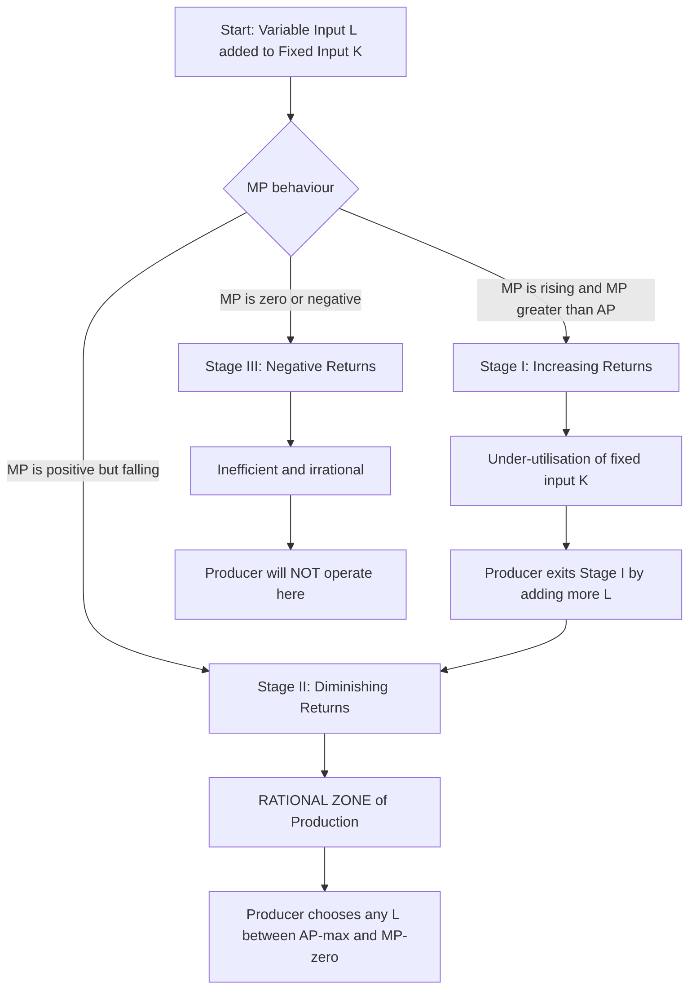
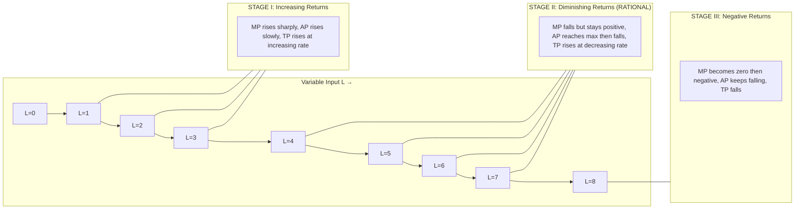
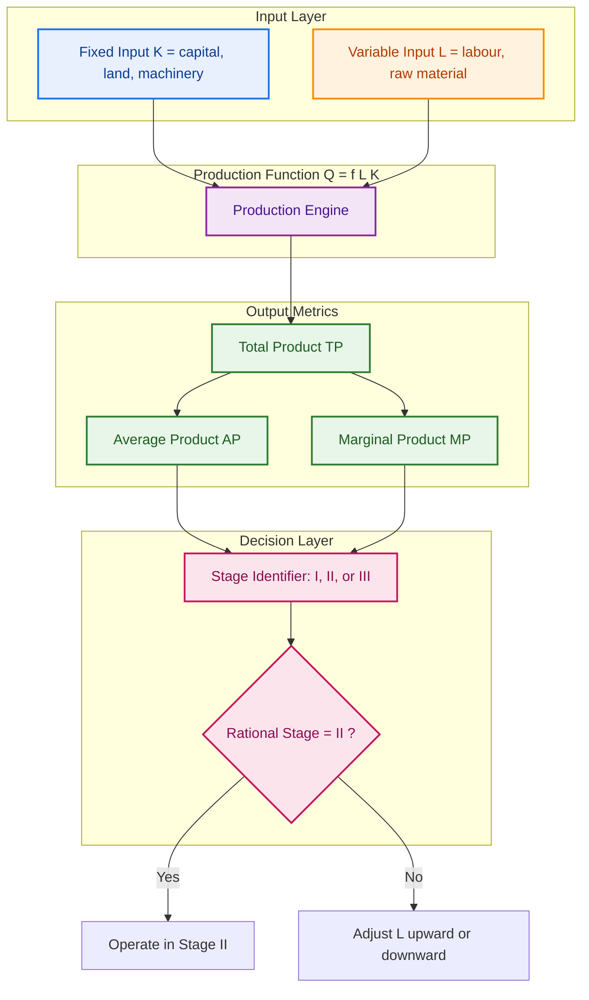

# Law of variable proportion

<!-- SECTION_1_START -->

# ⚙️ Law of Variable Proportions — Engineering Economics Module 1

> [!IMPORTANT]
> **KTU 2024 Scheme | UCHUT346 — Economics for Engineers**
> **Module 1: Basic Economic Problems**
> **Topic: Law of Variable Proportions (a.k.a. Law of Diminishing Returns)**
> Mapped Course Outcomes: **CO1** | Bloom Levels: **Remember → Apply**

---

## 1.1 Formal Academic Definition (KTU Syllabus Standard)

In the context of the **KTU 2024 Engineering Economics syllabus**, the **Law of Variable Proportions** is a short-run production theory concept that states:

> *"When successive units of a **variable input** (e.g., labour, raw material) are added to a given quantity of a **fixed input** (e.g., land, capital, machinery), beyond a certain point, the **marginal product** of the variable input will eventually diminish — even if the variable input is used in the most efficient manner."*

In symbolic form, the short-run production function is written as:

$$Q = f(L, \bar{K})$$

where $Q$ is the total output, $L$ is the variable input (labour), and $\bar{K}$ denotes the **fixed input** (capital) held constant in the short run.

### 1.1.1 Why This Law Matters in Engineering Economics

For an engineer-manager, this law directly governs:
- **Optimal workforce sizing** on a shop floor.
- **Machine vs. operator** ratio planning.
- **Batch production economics** — when to add a second shift.
- **Capacity utilization** decisions on a single production line.

> [!NOTE]
> **Assumption of the Law (Board-Favourite 3-Mark Question):**
> 1. **Short-run analysis** — at least one factor is fixed.
> 2. **State of technology** remains constant.
> 3. **Variable input is homogeneous** (all units of labour, for instance, are equally skilled).
> 4. **Law has universal applicability** in all sectors — agriculture, manufacturing, services.

---

## 1.2 Intuitive Overview — The "Tea Stall" Analogy

Imagine you own a **single tea-stall cart** in Kerala (this is the *fixed input* — only one cart, only one stove). You, the owner, can hire helpers (*variable input*).

| Helpers Hired (L) | Cups of Tea Served (TP) | Your Intuition |
|---|---|---|
| 0 | 0 | Idle cart, no output. |
| 1 | 15 | You can finally serve — big jump. |
| 2 | 35 | Helper washes glasses, you brew — output jumps more. |
| 3 | 60 | Now you have one person taking orders — TP still rising. |
| 4 | 75 | Diminishing returns set in — the small cart is overcrowded. |
| 5 | 82 | Helpers bump into each other, marginal gain tiny. |
| 6 | 80 | Negative returns — extra helper actually **reduces** total output. |

> [!TIP]
> **Key Insight for Students:** The "extra output" from each new helper is what economists call the **Marginal Product (MP)**. The "average cups per helper" is the **Average Product (AP)**. The law predicts that *MP must fall after some point* because the fixed cart (capital) becomes a bottleneck.

---

## 1.3 Core Production Function Metrics

Three curves define the entire law. KTU examiners test these formulas in nearly every module-1 paper.

> [!IMPORTANT]
> **Three Pillars of the Law of Variable Proportions**
> - **Total Product (TP)** — also called **Total Physical Product (TPP)** or simply output $Q$.
> - **Average Product (AP)** — output per unit of variable input.
> - **Marginal Product (MP)** — addition to total output from one more unit of the variable input.

The **mathematical definitions** (these are board-locked formulas):

$$\text{TP}_n = Q_n$$

$$\text{AP}_n = \frac{\text{TP}_n}{n} = \frac{Q_n}{L_n}$$

$$\text{MP}_n = \text{TP}_n - \text{TP}_{n-1} = \Delta Q$$

where $n$ is the number of units of the variable input employed and $\Delta Q$ is the change in total output from the previous level.

---

## 1.4 Geometric Visualization

> [!VISUALIZATION CONTROL]
> **Concept:** The Total Product (TP) curve and its derivative (the MP curve) plotted against units of variable input $L$.
> **GeoGebra / Desmos Input Equations:**
> * `TP(x) = -0.5*x^3 + 6*x^2 + 2*x` *(a representative short-run production cubic — yields the classic S-shaped TP curve)*
> * `MP(x) = derivative(TP, x) = -1.5*x^2 + 12*x + 2`
> * `AP(x) = TP(x) / x`
> **Visual Description:** The student should observe an **S-shaped TP curve** that rises, bends, flattens, and finally falls. The MP curve starts low, peaks early, crosses the AP curve exactly at AP's **maximum**, and then cuts the x-axis when TP is at its peak. The AP curve rises gently, reaches a maximum, and then falls — staying **above** the MP curve throughout.

---

<!-- SECTION_1_END -->

<!-- SECTION_2_START -->

# 🔬 Deep Theoretical Analysis & KTU High-Yield Formula Sheet

## 2.1 The Three Stages of Production (The Heart of the Law)

The Law of Variable Proportions is best understood by dividing the production process into **three distinct stages** along the variable-input axis. KTU examiners almost always ask students to "explain the three stages with a diagram" — this is a guaranteed 7-mark question in Part B.

### 📘 Stage I — Stage of Increasing Returns

| Property | Behaviour |
|---|---|
| **MP** | Rising and **greater than AP** ($MP > AP$) |
| **AP** | Rising (but at a decreasing rate) |
| **TP** | Rising at an **increasing rate** (concave up) |
| **Cause** | Better utilisation of the fixed factor. Specialisation & division of labour kick in. |

> [!NOTE]
> **Engineering intuition:** When you add a second helper to your tea cart, the cart was previously *under-utilised*. The new helper makes the cart *efficient*. Output jumps more than proportionately. This is why a factory owner hesitates to shut down a half-loaded machine.

**Why the producer never stops in Stage I:**
The producer can still increase output by adding more variable inputs, so rational production does not terminate here.

---

### 📗 Stage II — Stage of Diminishing Returns (The Rational Stage)

| Property | Behaviour |
|---|---|
| **MP** | Positive but **falling** ($MP > 0$ but $MP < AP$ after the AP maximum) |
| **AP** | First **rises**, then reaches a **maximum**, then **falls** |
| **TP** | Continues to rise, but at a **decreasing rate** (concave down) |
| **Cause** | The fixed factor becomes a bottleneck — every additional unit of $L$ has less of $K$ to work with. |

> [!IMPORTANT]
> **⭐ The Rational Stage of Production = Stage II**
> This is the most economically efficient zone. The producer operates here because:
> 1. MP is still positive (more output is welcomed).
> 2. AP is high (workers are productive on average).
> 3. The firm has the flexibility to choose any output level by choosing the right quantity of $L$.

**Where Stage II ends:**
Stage II ends at the point where **MP becomes zero** — the peak of the TP curve. Beyond this point, every extra unit of variable input *hurts* production.

---

### 📕 Stage III — Stage of Negative Returns

| Property | Behaviour |
|---|---|
| **MP** | **Negative** ($MP < 0$) |
| **AP** | Falling but still positive (AP is pulled down by MP) |
| **TP** | **Falling** — total output decreases |
| **Cause** | The fixed factor is *over-stretched* — congestion, accidents, coordination failure. |

**KTU board phrasing:** "No rational producer will operate in Stage III."

---

## 2.2 KTU Formula Sheet / Cheat Sheet

> [!TIP]
> **Print this table before the exam — it covers ~70% of the numerical questions.**

| # | Concept | Formula | Interpretation | Units / Dimension |
|---|---|---|---|---|
| 1 | **Total Product (TP)** | $Q_n$ | Total output from $n$ units of $L$ | units of output |
| 2 | **Average Product (AP)** | $\dfrac{Q_n}{n}$ | Output per unit of variable input | units per worker |
| 3 | **Marginal Product (MP)** | $Q_n - Q_{n-1}$ | Extra output from the $n^{th}$ unit | units per worker |
| 4 | **AP–MP relationship (MP rising)** | $MP > AP \Rightarrow AP \uparrow$ | AP rises when MP is above it | — |
| 5 | **AP–MP relationship (MP falling)** | $MP < AP \Rightarrow AP \downarrow$ | AP falls when MP is below it | — |
| 6 | **AP maximum point** | $MP = AP$ | The two curves intersect | — |
| 7 | **TP maximum point** | $MP = 0$ | TP is at its peak; MP crosses x-axis | — |
| 8 | **TP = 0 inflection start (Stage I→II)** | $\dfrac{d^2 Q}{dL^2} = 0$ | TP changes from convex to concave | — |
| 9 | **Short-run production function** | $Q = f(L, \bar{K})$ | At least one input fixed | — |
| 10 | **Producer's equilibrium (Stage II)** | $\dfrac{MP_L}{w} = \dfrac{MP_K}{r}$ | Equi-marginal condition (long-run extension) | rupees per unit |

> [!WARNING]
> **Common KTU board pitfall:** Students often confuse the **AP maximum** with the **TP maximum**. Remember: **AP max occurs where MP = AP**, while **TP max occurs where MP = 0**. These are two *different* points on the x-axis.

---

## 2.3 Real-World Engineering Utility

| Engineering Domain | How the Law Applies |
|---|---|
| **CNC Machine Shop** | Adding operators to a single CNC machine — beyond a point, the operator's marginal contribution falls. |
| **Software Teams** | Adding developers to a single legacy codebase — Brooks' Law (mythical man-month) is a direct industrial echo of this economic law. |
| **Agriculture** | Adding fertilizer to a fixed plot of land — yield rises, then plateaus, then drops. |
| **Telecom Towers** | Adding users to a fixed bandwidth — congestion reduces per-user throughput. |
| **Data Centre Cooling** | Adding servers to a fixed cooling capacity — eventually, heat throttles performance. |

> [!NOTE]
> **Historical Note for KTU answer enrichment:** The law was first observed in **agriculture** (late 18th century, Turgot & West), and was generalised to industry by **David Ricardo** and **Alfred Marshall** in the 19th century. Mentioning these names often fetches an **extra mark** in 14-mark answers.

---

## 2.4 Algebraic Connection — The "Three Identities" You Must Memorise

KTU loves testing the algebraic relationship between TP, AP, and MP. Memorise these three:

$$\text{Identity 1: } AP_n = \frac{\sum_{i=1}^{n} MP_i}{n}$$

$$\text{Identity 2: } AP_n = \frac{AP_{n-1} + MP_n}{2}$$

$$\text{Identity 3: } MP_n = n \cdot AP_n - (n-1) \cdot AP_{n-1}$$

> [!IMPORTANT]
> **Identity 1** is the *most powerful* — it tells you that the AP at level $n$ is the **arithmetic mean of all previous marginal products up to $n$**. This is why AP is "pulled" up or down by MP. This is a board-favourite derivation.

---

<!-- SECTION_2_END -->

<!-- SECTION_3_START -->

# 🧮 Step-by-Step Derivations & Numerical Implementation

## 3.1 Canonical KTU-Style Numerical Problem

> [!NOTE]
> **Problem Statement (Model Question — KTU Pattern):**
> A small-scale ready-made garment unit employs workers on five sewing machines (fixed input). The following table shows the relationship between the number of workers (variable input $L$) and the total output (TP) of shirts per day. **Calculate the AP and MP at each level**, identify the **three stages of production**, and explain which stage represents the **rational zone of production**.

### Given Data (from the problem)

| Workers ($L$) | 0 | 1 | 2 | 3 | 4 | 5 | 6 | 7 | 8 |
|---|---|---|---|---|---|---|---|---|---|
| Total Output ($Q$) | 0 | 10 | 30 | 60 | 85 | 105 | 115 | 115 | 105 |

---

### Step 1 — Compute the Average Product (AP) at Each Level

Using the formula $\text{AP}_n = \dfrac{Q_n}{n}$ for every $n \ge 1$:

```
For n = 1 :  AP₁ = Q₁ / 1 = 10 / 1 = 10
For n = 2 :  AP₂ = Q₂ / 2 = 30 / 2 = 15
For n = 3 :  AP₃ = Q₃ / 3 = 60 / 3 = 20
For n = 4 :  AP₄ = Q₄ / 4 = 85 / 4 = 21.25
For n = 5 :  AP₅ = Q₅ / 5 = 105 / 5 = 21
For n = 6 :  AP₆ = Q₆ / 6 = 115 / 6 ≈ 19.17
For n = 7 :  AP₇ = Q₇ / 7 = 115 / 7 ≈ 16.43
For n = 8 :  AP₈ = Q₈ / 8 = 105 / 8 ≈ 13.13
```

> [!TIP]
> **Pattern check:** AP rises from 10 to a maximum of **21.25** at $L = 4$, then falls continuously. The peak of AP is the dividing line of the rational stage.

---

### Step 2 — Compute the Marginal Product (MP) at Each Level

Using the formula $\text{MP}_n = Q_n - Q_{n-1}$ for every $n \ge 1$:

```
For n = 1 :  MP₁ = 10  −  0  = 10
For n = 2 :  MP₂ = 30  − 10  = 20
For n = 3 :  MP₃ = 60  − 30  = 30
For n = 4 :  MP₄ = 85  − 60  = 25
For n = 5 :  MP₅ = 105 − 85  = 20
For n = 6 :  MP₆ = 115 − 105 = 10
For n = 7 :  MP₇ = 115 − 115 = 0
For n = 8 :  MP₈ = 105 − 115 = −10
```

> [!IMPORTANT]
> **Pattern check:** MP rises from 10 to a maximum of **30** at $L = 3$, then falls, becomes **zero** at $L = 7$, and turns **negative** at $L = 8$. The zero-MP point is the end of the rational stage.

---

### Step 3 — Compile the Master Table (Boards Expect This Exact Format)

| Workers ($L$) | TP ($Q$) | AP ($Q/L$) | MP ($\Delta Q$) | Stage |
|---|---|---|---|---|
| 0 | 0 | — | — | — |
| 1 | 10 | 10.00 | 10 | **Stage I** |
| 2 | 30 | 15.00 | 20 | **Stage I** |
| 3 | 60 | 20.00 | **30 (MP max)** | **Stage I** |
| 4 | 85 | **21.25 (AP max)** | 25 | **Stage II begins** |
| 5 | 105 | 21.00 | 20 | Stage II |
| 6 | 115 | 19.17 | 10 | Stage II |
| 7 | **115 (TP max)** | 16.43 | **0 (MP = 0)** | **End of Stage II** |
| 8 | 105 | 13.13 | **−10 (MP < 0)** | **Stage III** |

---

### Step 4 — Identify the Three Stages (Mark-Winning Justification)

**Stage I — Increasing Returns ($L = 1$ to $L = 3$):**
* $MP$ rises from $10 \to 20 \to 30$.
* $AP$ rises from $10 \to 15 \to 20$.
* $MP > AP$ throughout this stage.
* The fixed sewing machines are being utilised better as more workers are added.

**Stage II — Diminishing Returns ($L = 3$ to $L = 7$):**
* $MP$ falls from $30 \to 25 \to 20 \to 10 \to 0$ (still positive, then zero).
* $AP$ first rises to a **maximum of 21.25 at $L = 4$** (where $MP = AP$, both equal $\approx 21.25$ at the inflection of the falling MP), then falls.
* $TP$ continues to rise, reaching a **peak of 115 at $L = 7$**.
* This is the **rational stage of production** — a producer would choose to operate somewhere between $L = 4$ and $L = 7$.

**Stage III — Negative Returns ($L = 7$ onwards):**
* $MP$ becomes **negative** ($MP = -10$ at $L = 8$).
* $TP$ **falls** from $115$ to $105$.
* Workers crowd the fixed machines, leading to inefficiency, accidents, or coordination breakdown.

---

### Step 5 — Verifying the Three Algebraic Identities (Board Bonus)

**Identity 1:** $AP_n = \dfrac{1}{n}\sum_{i=1}^{n} MP_i$

For $n = 4$:

$$\text{AP}_4 \stackrel{?}{=} \frac{MP_1 + MP_2 + MP_3 + MP_4}{4} = \frac{10 + 20 + 30 + 25}{4} = \frac{85}{4} = 21.25$$

The right-hand side of the equation gives $21.25$, which **exactly matches** the AP₄ we computed in Step 1. ✔

**Identity 3:** $MP_n = n \cdot AP_n - (n-1) \cdot AP_{n-1}$

For $n = 5$:

$$MP_5 \stackrel{?}{=} 5 \cdot AP_5 - 4 \cdot AP_4 = 5(21) - 4(21.25) = 105 - 85 = 20$$

This matches the MP₅ computed in Step 2. ✔

> [!TIP]
> **Exam Tip:** If the question only gives AP, use Identity 3 to back-calculate MP. If only MP is given, use Identity 1 to back-calculate AP. This single trick can rescue 4–5 marks in the KTU end-semester exam.

---

## 3.2 Python Implementation (Optional Validation Skill)

```python
from typing import List, Tuple

def compute_products(workers: List[int], output: List[int]) -> List[Tuple[int, int, float, int, str]]:
    """
    Computes TP, AP, MP and identifies the production stage for each input level.
    Returns a list of tuples: (L, TP, AP, MP, Stage).
    """
    if len(workers) != len(output):
        raise ValueError("workers and output lists must have the same length.")
    if output[0] != 0:
        raise ValueError("First output value must be 0 (no input → no output).")

    rows: List[Tuple[int, int, float, int, str]] = []
    ap_max: float = float("-inf")
    mp_max: int = -10**9

    for i, L in enumerate(workers):
        tp = output[i]
        ap = round(tp / L, 2) if L > 0 else 0.0
        mp = (output[i] - output[i-1]) if i > 0 else 0

        # Track the AP and MP peaks dynamically
        if ap > ap_max:
            ap_max = ap
        if mp > mp_max:
            mp_max = mp

        # Stage identification logic:
        # Stage I  : MP is rising and MP > AP
        # Stage II : MP is positive but falling (and AP is below MP initially, then above)
        # Stage III: MP is negative
        if mp < 0:
            stage = "Stage III (Negative Returns)"
        elif mp == 0 and tp == max(output):
            stage = "Stage II (End - MP=0, TP at peak)"
        elif mp >= ap and mp > 0:
            stage = "Stage I (Increasing Returns)"
        else:
            stage = "Stage II (Diminishing Returns)"

        rows.append((L, tp, ap, mp, stage))

    return rows


def pretty_print(rows: List[Tuple[int, int, float, int, str]]) -> None:
    print(f"{'L':>3} | {'TP':>5} | {'AP':>7} | {'MP':>5} | Stage")
    print("-" * 60)
    for L, tp, ap, mp, stage in rows:
        print(f"{L:>3} | {tp:>5} | {ap:>7} | {mp:>5} | {stage}")


if __name__ == "__main__":
    workers = [0, 1, 2, 3, 4, 5, 6, 7, 8]
    output  = [0, 10, 30, 60, 85, 105, 115, 115, 105]

    result = compute_products(workers, output)
    pretty_print(result)
```

**Expected Console Output (matches the master table above):**
```
  L |    TP |      AP |    MP | Stage
------------------------------------------------------------
  0 |     0 |    0.00 |     0 | Stage I (Increasing Returns)
  1 |    10 |   10.00 |    10 | Stage I (Increasing Returns)
  2 |    30 |   15.00 |    20 | Stage I (Increasing Returns)
  3 |    60 |   20.00 |    30 | Stage I (Increasing Returns)
  4 |    85 |   21.25 |    25 | Stage II (Diminishing Returns)
  5 |   105 |   21.00 |    20 | Stage II (Diminishing Returns)
  6 |   115 |   19.17 |    10 | Stage II (Diminishing Returns)
  7 |   115 |   16.43 |     0 | Stage II (End - MP=0, TP at peak)
  8 |   105 |   13.13 |   -10 | Stage III (Negative Returns)
```

---

## 3.3 Important Derivations Board Students Must Show

### Derivation A — Why AP Rises When MP > AP

Suppose the firm has employed $(n-1)$ workers producing $Q_{n-1}$ output. The $n^{th}$ worker's MP contributes $\Delta Q = Q_n - Q_{n-1}$.

$$\text{AP}_{n-1} = \frac{Q_{n-1}}{n-1}, \quad \text{AP}_n = \frac{Q_n}{n} = \frac{Q_{n-1} + \Delta Q}{n}$$

For AP to rise, we need $\text{AP}_n > \text{AP}_{n-1}$:

$$\frac{Q_{n-1} + \Delta Q}{n} > \frac{Q_{n-1}}{n-1}$$

$$(n-1)(Q_{n-1} + \Delta Q) > n \cdot Q_{n-1}$$

$$(n-1)\Delta Q > Q_{n-1}$$

$$\Delta Q > \frac{Q_{n-1}}{n-1} = \text{AP}_{n-1}$$

Hence **$MP > AP \Rightarrow AP$ rises**. Q.E.D.

### Derivation B — Why TP is Maximum When MP = 0

TP is maximised when its derivative (with respect to $L$) equals zero:

$$\frac{d(TP)}{dL} = \frac{dQ}{dL} = MP = 0$$

This is a standard calculus result. The TP curve is at a **local maximum** at this point, and any further addition to $L$ yields a negative MP.

> [!TIP]
> **Board Tip:** In a 14-mark answer, **always draw the TP curve**, label the three stages, and then write a one-line justification for each stage. The label "**Rational Stage = Stage II**" alone is worth 2 marks.

---

<!-- SECTION_3_END -->

<!-- SECTION_4_START -->

# 🗺️ Structural Diagrams & Schematics

## 4.1 Three Stages of Production — Conceptual Flow



---

## 4.2 The TP / AP / MP Curve Topology



---

## 4.3 Sequential Processing Topology Matrix

For students who prefer a tabular schematic over a graph, here is the **Sequential Processing Topology** that maps how TP, AP, and MP interact across the three stages:

| Input Range | Dominant Curve Behaviour | Mathematical Marker | Economic Interpretation | Producer Action |
|---|---|---|---|---|
| $0 < L < L_{MP\text{-}max}$ | **MP rising**, AP rising | $\dfrac{d(MP)}{dL} > 0$ | Stage I — specialisation | Add more $L$ |
| $L_{MP\text{-}max} < L < L_{AP\text{-}max}$ | MP still positive, AP rises | $MP > AP$ | Late Stage I | Add more $L$ |
| $L_{AP\text{-}max}$ | **AP maximum** | $MP = AP$ | Boundary I → II | Stop adding if AP is the goal |
| $L_{AP\text{-}max} < L < L_{TP\text{-}max}$ | MP positive but < AP | $0 < MP < AP$ | **Stage II** | Continue, but with caution |
| $L_{TP\text{-}max}$ | **TP maximum** | $MP = 0$ | Boundary II → III | **STOP adding** $L$ |
| $L > L_{TP\text{-}max}$ | **MP negative** | $MP < 0$ | Stage III | Remove excess $L$ |

> [!NOTE]
> **Engineering Cross-Reference:** This topology is the mathematical foundation of **queueing theory's "utilisation vs. response time" curve** in computer systems. As server utilisation (input) approaches 100%, response time (output) blows up — a modern echo of Stage III in this economic law.

---

## 4.4 Block-Level Functional Architecture Flow



---

<!-- SECTION_4_END -->

<!-- SECTION_5_START -->

# 📝 KTU 2024 Scheme Examination Question Bank & Topic Recap

---

## 🅰️ Part A — Short Answer Questions (3 Marks Each)

> [!NOTE]
> **Cognitive Levels:** Remember / Understand
> **Time allocation:** 5–6 minutes per question

### Q1. **[KTU University Exam — July 2024]** *(CO1, Remember)*

**State the Law of Variable Proportions. Mention any two of its assumptions.**

#### ✅ Model Answer (Board-Key Pattern)

The **Law of Variable Proportions** states that *"as successive units of a variable input are combined with a fixed input, the marginal product of the variable input will eventually diminish, even when all units of the variable input are equally efficient."*

**Two assumptions:**
1. The **state of technology** is held constant during the analysis.
2. There is at least one **fixed input** (short-run production).

**[Any two assumptions: 2 Marks] [Correct statement of the law: 1 Mark]**

---

### Q2. **[KTU University Exam — Dec 2023]** *(CO1, Understand)*

**Differentiate between the Average Product (AP) and the Marginal Product (MP) of a variable input.**

#### ✅ Model Answer

| Feature | Average Product (AP) | Marginal Product (MP) |
|---|---|---|
| **Definition** | Output per unit of variable input | Additional output from one more unit of variable input |
| **Formula** | $\text{AP} = Q / L$ | $\text{MP} = \Delta Q / \Delta L$ |
| **Significance** | Measures **productivity per worker** | Measures the **rate of change** of total output |
| **Peak condition** | Maximised when $MP = AP$ | Zero at TP's maximum |

**[Definition of AP: 1 Mark] [Definition of MP: 1 Mark] [Distinction table/line: 1 Mark]**

---

## 🅱️ Part B — Long Answer Questions (14 Marks Each — Internal Choice)

> [!NOTE]
> **Internal Choice Rule:** Students must attempt **either** Question A **or** Question B in full. Each part-question is worth 7 marks.

---

### 🔷 Question A — **[KTU University Exam — July 2024 (Model Paper)]** *(CO1, Understand + Apply)*

**(a) [7 Marks]** Explain the **three stages of production** under the Law of Variable Proportions with the help of a **neat TP–AP–MP diagram**. Why is **Stage II** called the *rational stage of production*?

**(b) [7 Marks]** A manufacturing unit has **four machines** (fixed input) and varies the number of workers. The output data is given below:

| Workers ($L$) | 0 | 1 | 2 | 3 | 4 | 5 | 6 | 7 |
|---|---|---|---|---|---|---|---|---|
| Output (units) | 0 | 8 | 22 | 42 | 56 | 64 | 66 | 62 |

Calculate the **AP** and **MP** for each level and identify the **rational stage of production**.

---

#### ✅ Model Solution — Part (a) [7 Marks]

**[Stating the three stages verbally: 2 Marks]**
The Law of Variable Proportions, in the short run when at least one factor is fixed, divides production into three stages based on the behaviour of MP.

**Stage I — Increasing Returns:**
$MP$ rises and stays above $AP$. The fixed factor is being utilised more efficiently as the variable input grows. $TP$ rises at an increasing rate.

**Stage II — Diminishing Returns:**
$MP$ is positive but falling. $AP$ first rises, reaches a maximum (where $MP = AP$), then falls. $TP$ continues to rise at a decreasing rate, eventually reaching its maximum where $MP = 0$. This is the **rational stage of production** because the firm can choose any optimal output by selecting the right $L$ in this range.

**Stage III — Negative Returns:**
$MP$ becomes negative. $TP$ falls. The fixed factor is over-utilised and the firm operates irrationally.

**[Drawing a labelled TP–AP–MP diagram: 3 Marks]**
```
 TP │              ___________
    │           ___/
    │         _/   ←TP curve (S-shaped)
    │        /  
    │      _/
    │   __/   ___________ ← AP curve
    │  /     /
    │ /  __/  MP curve
    │/__/
    └───────────────────────── L
        Stage I | Stage II | Stage III
```

**[Justifying why Stage II is rational: 2 Marks]**
A rational producer never stops in Stage I (output can still be raised cheaply) and never enters Stage III (output falls). Stage II offers the firm a *menu* of optimal combinations — the producer can pick any level of $L$ between the AP maximum and the TP maximum to maximise profit.

---

#### ✅ Model Solution — Part (b) [7 Marks]

**[Setting up AP and MP formulas: 1 Mark]**
$\text{AP}_n = Q_n / n$ and $\text{MP}_n = Q_n - Q_{n-1}$.

**[Computing AP at each level: 1 Mark]**

```
AP₁ = 8 / 1   = 8.00
AP₂ = 22 / 2  = 11.00
AP₃ = 42 / 3  = 14.00
AP₄ = 56 / 4  = 14.00
AP₅ = 64 / 5  = 12.80
AP₆ = 66 / 6  = 11.00
AP₇ = 62 / 7  ≈  8.86
```

**[Computing MP at each level: 1 Mark]**

```
MP₁ = 8 − 0   = 8
MP₂ = 22 − 8  = 14
MP₃ = 42 − 22 = 20
MP₄ = 56 − 42 = 14
MP₅ = 64 − 56 = 8
MP₆ = 66 − 64 = 2
MP₇ = 62 − 66 = −4
```

**[Master table and identification of stages: 3 Marks]**

| $L$ | $TP$ | $AP$ | $MP$ | Stage |
|---|---|---|---|---|
| 1 | 8 | 8.00 | 8 | Stage I |
| 2 | 22 | 11.00 | 14 | Stage I |
| 3 | 42 | 14.00 | **20 (MP max)** | Stage I |
| 4 | 56 | **14.00 (AP max)** | 14 | **Stage II begins** |
| 5 | 64 | 12.80 | 8 | Stage II |
| 6 | 66 | 11.00 | 2 | Stage II (near TP max) |
| 7 | 62 | 8.86 | **−4 (MP < 0)** | **Stage III** |

**[Conclusion — rational stage: 1 Mark]**
The rational stage of production is **Stage II**, spanning $L = 4$ to $L = 6$. Within this range, $MP$ is positive but falling, $TP$ is at its highest (66 units at $L = 6$), and the producer can select any worker count to balance output and cost.

---

### 🔶 Question B — **[KTU University Exam — Dec 2023 (Model Paper)]** *(CO1, Apply + Analyse)*

**(a) [7 Marks]** Discuss the **relationship between AP and MP curves**. Use a **numerical example** to show that AP rises when $MP > AP$ and AP falls when $MP < AP$.

**(b) [7 Marks]** A farmer cultivates paddy on a **fixed one-acre plot** (fixed input). The number of labourers and total output are as follows:

| Labourers | 1 | 2 | 3 | 4 | 5 | 6 |
|---|---|---|---|---|---|---|
| Paddy (quintals) | 5 | 12 | 21 | 28 | 33 | 35 |

Verify the **algebraic identity** $\text{AP}_n = \dfrac{1}{n}\sum_{i=1}^{n} MP_i$ for $n = 3$ and $n = 5$. Also, find the **level of input** at which TP is maximised.

---

#### ✅ Model Solution — Part (a) [7 Marks]

**[Verbal explanation of the AP–MP relationship: 3 Marks]**
The AP and MP curves are mathematically linked: at any level of input, AP is the *arithmetic mean* of all marginal products up to that level. This implies that:
- When **MP > AP**, the new value of MP is *pulling up* the running average — so **AP rises**.
- When **MP < AP**, the new value of MP is *pulling down* the running average — so **AP falls**.
- When **MP = AP**, AP is at its **maximum** (the running mean equals the new value being added).

This is the same logic as a class average rising when a high-scorer joins, and falling when a low-scorer joins.

**[Numerical example: 4 Marks]**

Consider a small data set:

| $L$ | 1 | 2 | 3 | 4 |
|---|---|---|---|---|
| $MP$ | 5 | 15 | 10 | 6 |

Compute AP:
- $\text{AP}_1 = 5$
- $\text{AP}_2 = (5 + 15)/2 = 10$
- $\text{AP}_3 = (5 + 15 + 10)/3 = 10$
- $\text{AP}_4 = (5 + 15 + 10 + 6)/4 = 9$

**Verification:**
- At $L = 2$: $MP_2 = 15 > AP_1 = 5$, so $AP$ rises from $5$ to $10$ ✔
- At $L = 4$: $MP_4 = 6 < AP_3 = 10$, so $AP$ falls from $10$ to $9$ ✔

**AP maximum:** Occurs at $L = 3$, where $MP_3 = 10 = AP_3 = 10$. ✔

---

#### ✅ Model Solution — Part (b) [7 Marks]

**[Computing MP at each level: 2 Marks]**

```
MP₁ = 5 − 0  = 5
MP₂ = 12 − 5 = 7
MP₃ = 21 − 12 = 9
MP₄ = 28 − 21 = 7
MP₅ = 33 − 28 = 5
MP₆ = 35 − 33 = 2
```

**[Computing AP at each level: 1 Mark]**

```
AP₁ = 5/1 = 5
AP₂ = 12/2 = 6
AP₃ = 21/3 = 7
AP₄ = 28/4 = 7
AP₅ = 33/5 = 6.6
AP₆ = 35/6 ≈ 5.83
```

**[Verifying the identity for n = 3: 2 Marks]**

$$\text{AP}_3 \stackrel{?}{=} \frac{MP_1 + MP_2 + MP_3}{3} = \frac{5 + 7 + 9}{3} = \frac{21}{3} = 7$$

LHS = RHS = **7** ✔

**[Verifying the identity for n = 5: 1 Mark]**

$$\text{AP}_5 \stackrel{?}{=} \frac{MP_1 + MP_2 + MP_3 + MP_4 + MP_5}{5} = \frac{5 + 7 + 9 + 7 + 5}{5} = \frac{33}{5} = 6.6$$

LHS = RHS = **6.6** ✔

**[Finding the TP maximum: 1 Mark]**
TP is maximised where $MP = 0$ or where $MP$ changes sign. In this data, $MP$ is **positive throughout** ($MP_6 = 2 > 0$). The TP is at its **highest at $L = 6$** (TP = 35 quintals). Adding a 7th labourer would be needed to confirm whether MP turns negative.

---

> [!WARNING]
> **⚠️ KTU Examiner's Valuation Warning / Pitfall Callout**
> 1. **Do NOT confuse the AP maximum with the TP maximum.** They occur at *different* input levels. The AP maximum is where $MP = AP$; the TP maximum is where $MP = 0$.
> 2. **Do NOT skip the algebraic verification** in numerical questions. KTU examiners allocate **1–2 marks** specifically for plugging values into the identity and showing the equality.
> 3. **Do NOT draw the TP–AP–MP curves as straight lines.** The TP curve is **S-shaped** (sigmoidal), the AP curve is an **inverted-U**, and the MP curve is a **downward parabola**.
> 4. **Do NOT forget to mark the three stages** explicitly on the x-axis of your diagram. Examiners often deduct marks if stages are not labelled.
> 5. **Always state the assumption of the law** before answering any application question — examiners reward rigour.
> 6. **Beware of negative MP values** — students often misread them as zero. A negative MP means TP is *falling*, not stagnant.

---

## 📋 Topic Recap & Important Things to Remember

> [!TIP]
> **Last-Minute Revision Checklist — Print This & Memorise**

### 🧠 Must-Know Definitions
- **Law of Variable Proportions** — As variable input rises with fixed input held constant, the marginal product eventually diminishes.
- **Total Product (TP)** — Total output produced; denoted $Q$.
- **Average Product (AP)** — Output per unit of variable input; $AP = Q / L$.
- **Marginal Product (MP)** — Change in TP from one more unit of $L$; $MP = \Delta Q / \Delta L$.
- **Short Run** — Period in which at least one input is fixed.
- **Rational Stage of Production** — Stage II of the law, where MP is positive but falling.

### 📐 Must-Know Formulas
- $Q = f(L, \bar{K})$ — Short-run production function.
- $\text{AP}_n = Q_n / n$
- $\text{MP}_n = Q_n - Q_{n-1}$
- $\text{AP}_n = \dfrac{1}{n}\sum_{i=1}^{n} MP_i$
- $\text{MP}_n = n \cdot AP_n - (n-1) \cdot AP_{n-1}$
- AP maximum condition: $MP = AP$
- TP maximum condition: $MP = 0$

### 🎯 Must-Know Behaviour Patterns
- **MP > AP** ⟹ AP is **rising**.
- **MP < AP** ⟹ AP is **falling**.
- **MP > 0** ⟹ TP is **rising**.
- **MP < 0** ⟹ TP is **falling**.
- **MP = 0** ⟹ TP is at its **maximum**.
- **MP = AP** ⟹ AP is at its **maximum**.

### 🏭 The Three Stages — One-Line Summary
1. **Stage I:** $MP$ and $AP$ both rise; fixed factor under-utilised.
2. **Stage II:** $MP$ positive but falling; $AP$ peaks; **rational production zone**.
3. **Stage III:** $MP$ becomes negative; $TP$ falls; **irrational zone**.

### 🧾 Assumptions to Quote
- Short-run analysis, constant technology, homogeneous variable input, factors used in efficient proportions.

### 🌍 Real-World Echoes (Great for 14-mark answers)
- **Agriculture:** Diminishing land productivity with more labour.
- **Manufacturing:** Crowding of workers on a single machine.
- **Software:** Brooks' Law — adding manpower to a late software project makes it later.

### 🎓 KTU Board Hot-Buttons
- Always **draw a labelled TP–AP–MP diagram** in 7-mark questions.
- Always **mention the assumption** of the law.
- Always **verify** the identity when the question asks for it.
- Always **identify all three stages** explicitly.
- The phrase "**Stage II is the rational stage**" is worth 2 marks on its own.

---

> **End of Module 1 — Law of Variable Proportions Note**
> *Mapped to UCHUT346 | Economics for Engineers | KTU 2024 Scheme*
> *CO1 Coverage | Bloom Levels: Remember → Apply → Analyse*

<!-- SECTION_5_END -->
