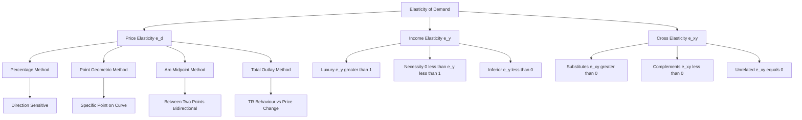
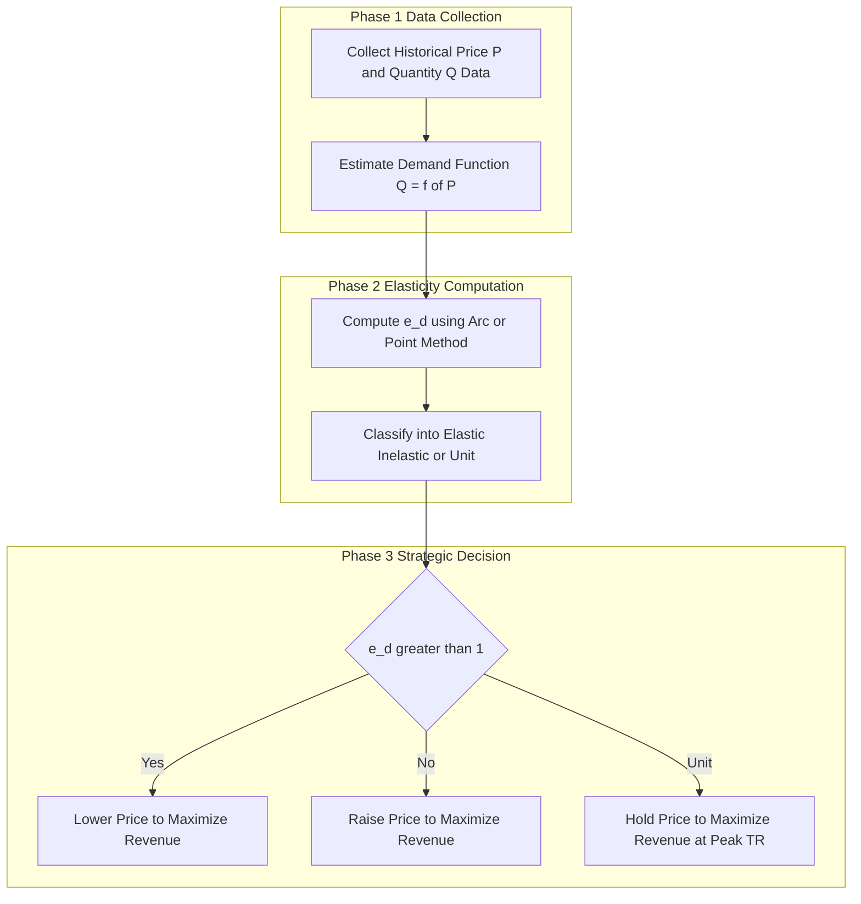
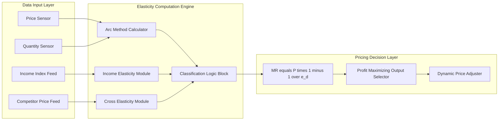
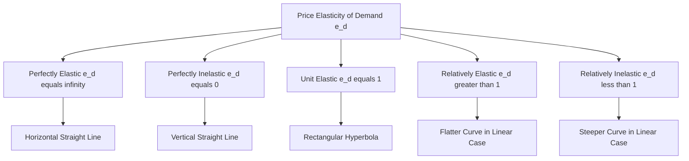
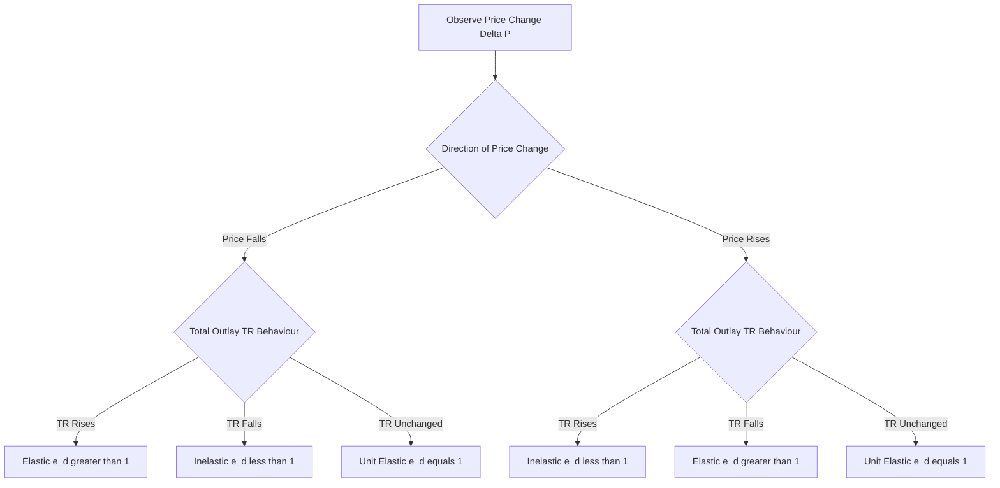

# measurement of elasticity and its applications

<!-- SECTION_1_START -->

# Measurement of Elasticity and Its Applications

## 1.1 Core Technical Definition

> [!IMPORTANT]
> **Elasticity** is a measure of the **responsiveness** or **sensitivity** of one economic variable to a change in another related variable. In the context of demand analysis, it quantifies the degree to which the quantity demanded of a commodity reacts to variations in its price, the income of consumers, or the prices of related goods.

For the KTU 2024 Scheme (Course Code: UCHUT346 - Economics for Engineers), elasticity is treated as a **dimensionless, unit-free ratio** that allows engineers and managers to compare the responsiveness of different commodities without being affected by the units of measurement.

> [!NOTE]
> **Syllabus Highlight (Module 1 – Basic Economic Problems):**
> The KTU 2024 Scheme specifically requires the student to *measure* elasticity using the **Total Outlay Method**, **Point Method**, and **Arc Method**, and to *apply* these measurements to engineering-related pricing, taxation, and revenue decisions.

### 1.1.1 Three Principal Variants of Elasticity

The three principal forms of elasticity relevant to engineering economic decisions are listed below.

$$
e_d \;=\; \text{Price Elasticity of Demand}
$$

$$
e_y \;=\; \text{Income Elasticity of Demand}
$$

$$
e_{xy} \;=\; \text{Cross Elasticity of Demand}
$$

## 1.2 Conceptual Analogy / Intuition

> [!TIP]
> **Intuitive Analogy – The Spring Scale:**
> Think of a **spring**. A *stiff spring* barely stretches when you apply force — this is **inelastic** behavior. A *loose, soft spring* stretches a lot under the same force — this is **elastic** behavior. In economics, **price** is the *force* applied, and **quantity demanded** is the *stretch*. The higher the stretch for a given force, the more *elastic* the demand. A commodity like *life-saving insulin* behaves like a stiff spring (very inelastic), while a *luxury branded perfume* behaves like a loose spring (very elastic).

> [!TIP]
> **Engineer's Analogy – The Gain of a System:**
> In control systems engineering, the **gain** of a system describes how much the output changes for a unit change in input. Elasticity is essentially the *normalized gain* of the demand function — it expresses output change (quantity) per unit input change (price) relative to their current values, making it analogous to a **percentage transfer function** in linear systems.

### 1.3 Physical Constants and Standard Metrics

- The numerical value of elasticity is a **pure number** (dimensionless).
- The standard metric range for price elasticity is $\mathbf{-\infty \;<\; e_d \;<\; 0}$ for a **normal good** under the *negative slope convention*.
- The **unitary** point is $\vert e_d \vert \;=\; \mathbf{1}$.
- Total Revenue (TR) is expressed in **monetary units** (Rupees, Dollars, etc.).

> [!VISUALIZATION CONTROL]
> **Concept:** Five Degrees of Price Elasticity of Demand (Linear Demand Curve)
> **GeoGebra / Desmos Input Equations:**
> * `P = 10 - Q` (linear demand curve)
> * `TR = Q * (10 - Q)` (Total Revenue parabola — maximum at $Q = 5$, $P = 5$)
> **Visual Description:** Plot the straight-line demand curve from $(Q=0, P=10)$ to $(Q=10, P=0)$. The slope is $-1$. The midpoint $(5, 5)$ represents the **unit-elastic point**. Above this midpoint, demand is **elastic** ($\vert e_d \vert > 1$); below it, demand is **inelastic** ($\vert e_d \vert < 1$). The Total Revenue curve is an inverted U reaching its peak exactly at the unit-elastic midpoint.

<!-- SECTION_1_END -->

<!-- SECTION_2_START -->

# Deep Theoretical Analysis & KTU High-Yield Formula Sheet

## 2.1 Price Elasticity of Demand ($e_d$)

The Price Elasticity of Demand is formally defined as the **percentage change in quantity demanded** of a commodity resulting from a **percentage change in its own price**, *ceteris paribus* (other things being equal).

$$
e_d \;=\; \frac{\text{Percentage Change in Quantity Demanded}}{\text{Percentage Change in Price}}
$$

## 2.2 Five Degrees of Price Elasticity

| # | Degree | Numerical Value of $\vert e_d \vert$ | Description | Shape of Demand Curve |
|---|--------|--------------------------------------|-------------|------------------------|
| 1 | **Perfectly Elastic** | $\infty$ | Infinitesimal price change causes infinite change in $Q_d$ | Horizontal line parallel to X-axis |
| 2 | **Perfectly Inelastic** | $0$ | Quantity demanded is constant regardless of price | Vertical line parallel to Y-axis |
| 3 | **Unit Elastic** | $1$ | Percentage change in $Q_d$ exactly equals percentage change in $P$ | Rectangular hyperbola ($P \cdot Q = \text{constant}$) |
| 4 | **Relatively Elastic** | $> 1$ | $Q_d$ changes by a larger percentage than $P$ | Flatter, gentle-sloping curve |
| 5 | **Relatively Inelastic** | $< 1$ | $Q_d$ changes by a smaller percentage than $P$ | Steeper, near-vertical curve |

> [!NOTE]
> **Negative Sign Convention:** Although the law of demand dictates an *inverse* relationship, elasticity is conventionally reported as a **negative number**. However, in board examinations and KTU valuation, the **absolute value** $\vert e_d \vert$ is commonly used for interpretation.

## 2.3 Three Methods of Measurement (KTU High-Yield)

### 2.3.1 Method 1 — Percentage / Proportionate Method

This is the most fundamental approach.

$$
e_d \;=\; \frac{\Delta Q \;/ \; Q}{\Delta P \;/ \; P} \;=\; \frac{\Delta Q}{\Delta P} \cdot \frac{P}{Q}
$$

This method is sensitive to the **direction of change** (from-to). The Arc Method is preferred for eliminating this issue.

### 2.3.2 Method 2 — Total Outlay (Expenditure) Method (Marshall's Method)

Prof. **Alfred Marshall** devised a method based on the behavior of **Total Revenue (TR)** when price changes.

Let $TR = P \times Q$.

| Movement in Total Outlay (TR) | Implication | Value of $\vert e_d \vert$ |
|-------------------------------|-------------|---------------------------|
| $TR$ **rises** when $P$ falls | Elastic demand | $> 1$ |
| $TR$ **falls** when $P$ falls | Inelastic demand | $< 1$ |
| $TR$ **remains constant** when $P$ changes | Unit elasticity | $= 1$ |
| $TR$ **rises infinitely** when $P$ falls marginally | Perfectly elastic | $= \infty$ |
| $TR$ **remains unchanged** for any $P$ | Perfectly inelastic | $= 0$ |

> [!IMPORTANT]
> **KTU Valuation Key:** In the Total Outlay Method, the direction of price change *and* the corresponding change in total expenditure must both be stated. Marks are awarded only when the **relationship is fully described** in words.

### 2.3.3 Method 3 — Point (Geometric) Method

Elasticity at a specific point on a continuous demand curve.

$$
e_d \;=\; \frac{\text{Lower segment of the demand curve below the point}}{\text{Upper segment of the demand curve above the point}}
$$

$$
\boxed{\;e_d \;=\; \frac{\text{Length of segment CB}}{\text{Length of segment CA}}\;}
$$

where $C$ is a point on the demand curve, $A$ is the intersection with the Y-axis (price axis), and $B$ is the intersection with the X-axis (quantity axis).

### 2.3.4 Method 4 — Arc Method (Mid-Point Formula)

Used when elasticity is measured between **two distinct points** on a demand curve. It eliminates the directional bias of the percentage method.

$$
\boxed{\;e_d^{\text{arc}} \;=\; \frac{\Delta Q}{\Delta P} \cdot \frac{P_1 + P_2}{Q_1 + Q_2}\;}
$$

Equivalently:

$$
e_d^{\text{arc}} \;=\; \frac{Q_2 - Q_1}{Q_2 + Q_1} \cdot \frac{P_2 + P_1}{P_2 - P_1}
$$

> [!TIP]
> **Why use the Arc Method?** In KTU problems, the *direction* of price movement is often ambiguous. The Arc Method gives a **single, symmetric** value of elasticity that is identical whether we move from Point 1 to Point 2 or from Point 2 to Point 1.

## 2.4 Income Elasticity of Demand ($e_y$)

$$
e_y \;=\; \frac{\text{Percentage Change in Quantity Demanded}}{\text{Percentage Change in Consumer Income}}
$$

$$
e_y \;=\; \frac{\Delta Q}{\Delta Y} \cdot \frac{Y}{Q}
$$

| Value of $e_y$ | Classification | Example |
|----------------|----------------|---------|
| $e_y > 1$ | Luxury good (Income-elastic) | Branded smartphones, foreign holidays |
| $0 < e_y < 1$ | Necessity (Income-inelastic) | Rice, salt, basic medicines |
| $e_y < 0$ | Inferior good | Coarse grains, second-hand clothing |
| $e_y = 1$ | Normal good (Unit income-elastic) | Standard clothing, milk |

## 2.5 Cross Elasticity of Demand ($e_{xy}$)

$$
e_{xy} \;=\; \frac{\text{Percentage Change in Quantity of Good X}}{\text{Percentage Change in Price of Good Y}}
$$

$$
e_{xy} \;=\; \frac{\Delta Q_x}{\Delta P_y} \cdot \frac{P_y}{Q_x}
$$

| Sign of $e_{xy}$ | Relationship | Example |
|------------------|--------------|---------|
| $e_{xy} > 0$ | **Substitutes** (price of Y up → demand for X up) | Tea and Coffee |
| $e_{xy} < 0$ | **Complements** (price of Y up → demand for X down) | Cars and Petrol |
| $e_{xy} = 0$ | **Unrelated** goods | Apples and Pencils |

## 2.6 KTU High-Yield Formula Sheet

| # | Formula | Description | Engineering Use |
|---|---------|-------------|-----------------|
| 1 | $e_d = \dfrac{\Delta Q}{\Delta P} \cdot \dfrac{P}{Q}$ | Point elasticity (percentage method) | Demand forecasting |
| 2 | $e_d = \dfrac{Q_2 - Q_1}{Q_2 + Q_1} \cdot \dfrac{P_2 + P_1}{P_2 - P_1}$ | Arc elasticity (mid-point method) | Bidirectional price decisions |
| 3 | $e_d = \dfrac{\text{Lower segment (CB)}}{\text{Upper segment (CA)}}$ | Geometric (point) method | Visualization on demand curve |
| 4 | $e_y = \dfrac{\Delta Q}{\Delta Y} \cdot \dfrac{Y}{Q}$ | Income elasticity | Product mix decisions |
| 5 | $e_{xy} = \dfrac{\Delta Q_x}{\Delta P_y} \cdot \dfrac{P_y}{Q_x}$ | Cross elasticity | Substitute vs. complement identification |
| 6 | $\Delta TR = P \cdot \Delta Q + Q \cdot \Delta P$ | Marginal revenue relationship | Pricing optimization |
| 7 | $MR = P \left( 1 - \dfrac{1}{\vert e_d \vert} \right)$ | Marginal Revenue from elasticity | Profit-maximizing output |

> [!NOTE]
> **Real-World Engineering Utility:** Elasticity estimates directly drive **dynamic pricing engines** in e-commerce platforms (Amazon, Flipkart), **yield management** in airlines and hotels, **tax incidence** analysis for fiscal policy, and **break-even modeling** in manufacturing. A sound understanding of elasticity is essential for engineers transitioning into product management, operations research, and techno-economic feasibility analysis.

<!-- SECTION_2_END -->

<!-- SECTION_3_START -->

# Step-by-Step Derivations, Worked Examples, and Implementation

## 3.1 Derivation of the Geometric (Point) Method

**Statement:** The price elasticity of demand at any point on a linear demand curve is equal to the ratio of the lower segment of the curve (below the point) to the upper segment (above the point).

**Setup:**
Consider a linear demand curve $AB$ with the price axis ($OP$) on the Y-axis and quantity axis ($OQ$) on the X-axis. Let $C$ be an arbitrary point on the curve such that the coordinates of $C$ are $(Q_c, P_c)$.

The Y-intercept of the demand curve is $A = (0, a)$ and the X-intercept is $B = (b, 0)$.

**Step-by-Step Derivation:**

**Step 1:** The equation of the straight-line demand curve $AB$ is:

$$
P \;=\; a \;-\; \left( \frac{a}{b} \right) Q
$$

**Step 2:** The slope of the demand curve is:

$$
\frac{dP}{dQ} \;=\; -\frac{a}{b}
$$

**Step 3:** The point elasticity formula is:

$$
e_d \;=\; \frac{dQ}{dP} \cdot \frac{P}{Q}
$$

**Step 4:** Substituting the inverse of the slope:

$$
e_d \;=\; \frac{1}{(-a/b)} \cdot \frac{P_c}{Q_c} \;=\; -\frac{b}{a} \cdot \frac{P_c}{Q_c}
$$

**Step 5:** From the similar triangles $\triangle ACx$ and $\triangle BCy$ (where $x$ and $y$ are projections on the axes), the ratio $\frac{P_c}{Q_c}$ can be expressed geometrically. The segment $CA$ corresponds to the vertical distance from $C$ to the price axis, and the segment $CB$ corresponds to the diagonal distance from $C$ to the quantity axis.

By similar triangle properties:

$$
\frac{CA}{CB} \;=\; \frac{a - P_c}{P_c} \quad \text{(after algebraic manipulation)}
$$

**Step 6:** Combining the relationships, we obtain:

$$
\boxed{\;e_d \;=\; \frac{\text{Length of segment } CB}{\text{Length of segment } CA}\;}
$$

This completes the derivation. The key insight is that elasticity at any point on a linear demand curve can be determined by a **simple visual ratio of curve segments** — no algebraic computation of $P$ and $Q$ is required.

---

## 3.2 Derivation of the Marginal Revenue — Elasticity Relationship

**Statement:** Marginal Revenue (MR) is related to Price (P) and Price Elasticity of Demand ($e_d$) by the formula:

$$
MR \;=\; P \left( 1 - \frac{1}{\vert e_d \vert} \right)
$$

**Derivation:**

**Step 1:** Total Revenue is:

$$
TR \;=\; P \cdot Q
$$

**Step 2:** Taking the total differential:

$$
\Delta TR \;=\; P \cdot \Delta Q \;+\; Q \cdot \Delta P
$$

**Step 3:** Divide both sides by $\Delta Q$:

$$
\frac{\Delta TR}{\Delta Q} \;=\; P \;+\; Q \cdot \frac{\Delta P}{\Delta Q}
$$

**Step 4:** Recognizing $MR = \dfrac{\Delta TR}{\Delta Q}$ and rearranging:

$$
MR \;=\; P \;+\; Q \cdot \frac{\Delta P}{\Delta Q} \;=\; P \left[ 1 \;+\; \frac{Q}{P} \cdot \frac{\Delta P}{\Delta Q} \right]
$$

**Step 5:** Note that the price elasticity of demand (with sign) is:

$$
e_d \;=\; \frac{\Delta Q}{\Delta P} \cdot \frac{P}{Q} \quad \Rightarrow \quad \frac{Q}{P} \cdot \frac{\Delta P}{\Delta Q} \;=\; \frac{1}{e_d}
$$

**Step 6:** Substituting back:

$$
\boxed{\;MR \;=\; P \left( 1 \;-\; \frac{1}{\vert e_d \vert} \right)\;}
$$

**Step 7 (Economic Interpretation):**

- If $\vert e_d \vert > 1$ (elastic), then $\dfrac{1}{\vert e_d \vert} < 1$, so $MR > 0$. A price cut raises TR.
- If $\vert e_d \vert = 1$ (unit elastic), then $MR = 0$. TR is at its maximum.
- If $\vert e_d \vert < 1$ (inelastic), then $MR < 0$. A price cut reduces TR.

---

## 3.3 Worked Example 1 — Point Method (Percentage Method)

> **[KTU University Exam — Model Problem, Module 1]**
> The price of a commodity falls from **Rs. 20 to Rs. 18 per unit**, and as a result, the quantity demanded rises from **100 units to 120 units**. Calculate the price elasticity of demand using the **Percentage Method**.

**Solution:**

**Step 1:** Identify initial and final values.

$$
P_1 = 20, \quad P_2 = 18, \quad Q_1 = 100, \quad Q_2 = 120
$$

**Step 2:** Calculate the change in price.

$$
\Delta P \;=\; P_2 - P_1 \;=\; 18 - 20 \;=\; -2
$$

**Step 3:** Calculate the change in quantity.

$$
\Delta Q \;=\; Q_2 - Q_1 \;=\; 120 - 100 \;=\; +20
$$

**Step 4:** Apply the percentage formula.

$$
e_d \;=\; \frac{\Delta Q / Q_1}{\Delta P / P_1} \;=\; \frac{20/100}{-2/20} \;=\; \frac{0.20}{-0.10} \;=\; -2.0
$$

**Step 5:** Take the absolute value and interpret.

$$
\vert e_d \vert \;=\; 2.0 \;>\; 1 \quad \Rightarrow \quad \text{Demand is ELASTIC}
$$

> [!NOTE]
> **Valuation Key (4 marks):** Correct formula (1), correct substitution (1), correct calculation (1), correct interpretation (1).

---

## 3.4 Worked Example 2 — Arc Method (Mid-Point Formula)

> **[KTU University Exam — Model Problem, Module 1]**
> When the price of a good rises from **Rs. 50 to Rs. 60**, the quantity demanded falls from **400 units to 300 units**. Calculate elasticity using the **Arc Method** and interpret the result.

**Solution:**

**Step 1:** Identify the values.

$$
P_1 = 50, \quad P_2 = 60, \quad Q_1 = 400, \quad Q_2 = 300
$$

**Step 2:** Compute differences and sums.

$$
\Delta P = P_2 - P_1 = 10, \quad \Delta Q = Q_2 - Q_1 = -100
$$

$$
P_1 + P_2 = 110, \quad Q_1 + Q_2 = 700
$$

**Step 3:** Apply the arc formula.

$$
e_d^{\text{arc}} \;=\; \frac{\Delta Q}{\Delta P} \cdot \frac{P_1 + P_2}{Q_1 + Q_2} \;=\; \frac{-100}{10} \cdot \frac{110}{700}
$$

$$
e_d^{\text{arc}} \;=\; -10 \times 0.1571 \;=\; -1.571
$$

**Step 4:** Absolute value and interpretation.

$$
\vert e_d^{\text{arc}} \vert \;\approx\; 1.57 \;>\; 1 \quad \Rightarrow \quad \text{Demand is ELASTIC over this arc}
$$

> [!TIP]
> **Notice:** If we had used the simple percentage method moving from $P_1$ to $P_2$, we would get a different value than if we had moved from $P_2$ to $P_1$. The Arc Method elegantly **eliminates this directional bias** by using average values of $P$ and $Q$.

---

## 3.5 Worked Example 3 — Income Elasticity Classification

> **[KTU University Exam — Model Problem, Module 1]**
> A consumer's monthly income rises from **Rs. 50,000 to Rs. 55,000**, and her monthly consumption of organic food rises from **30 kg to 36 kg**. Calculate income elasticity and classify the good.

**Solution:**

**Step 1:** Identify values.

$$
Y_1 = 50{,}000, \quad Y_2 = 55{,}000, \quad Q_1 = 30, \quad Q_2 = 36
$$

**Step 2:** Compute changes.

$$
\Delta Y = 5{,}000, \quad \Delta Q = 6
$$

**Step 3:** Apply the income elasticity formula.

$$
e_y \;=\; \frac{\Delta Q / Q_1}{\Delta Y / Y_1} \;=\; \frac{6/30}{5000/50000} \;=\; \frac{0.20}{0.10} \;=\; 2.0
$$

**Step 4:** Classify.

$$
e_y = 2.0 \;>\; 1 \quad \Rightarrow \quad \text{Luxury good (Income-elastic)}
$$

---

## 3.6 Worked Example 4 — Cross Elasticity for Strategic Decisions

> **[KTU University Exam — Model Problem, Module 1]**
> The price of *Good Y* (Coffee) rises from **Rs. 100 to Rs. 120 per pack**, and the quantity demanded of *Good X* (Tea) rises from **500 units to 560 units per month**. Calculate cross elasticity and identify the relationship.

**Solution:**

**Step 1:** Identify values.

$$
P_{y1} = 100, \quad P_{y2} = 120, \quad Q_{x1} = 500, \quad Q_{x2} = 560
$$

**Step 2:** Compute changes.

$$
\Delta P_y = 20, \quad \Delta Q_x = 60
$$

**Step 3:** Apply the cross elasticity formula.

$$
e_{xy} \;=\; \frac{\Delta Q_x / Q_{x1}}{\Delta P_y / P_{y1}} \;=\; \frac{60/500}{20/100} \;=\; \frac{0.12}{0.20} \;=\; +0.60
$$

**Step 4:** Interpret.

$$
e_{xy} = +0.60 \;>\; 0 \quad \Rightarrow \quad \text{Tea and Coffee are SUBSTITUTES}
$$

> [!IMPORTANT]
> **Engineering Decision Insight:** A positive cross-elasticity of $+0.60$ means that for every **1% increase** in the price of coffee, the demand for tea increases by **0.60%**. A tea-blending company could use this to *forecast* the market response to competitor pricing and dynamically adjust its own production schedule.

---

## 3.7 Symbolic Implementation in Python (Algorithmic Equivalent)

The following Python program implements the four major elasticity computations, with strict type hints, boundary checks, and error logging.

```python
import logging
from typing import Tuple

logging.basicConfig(level=logging.INFO, format='%(levelname)s: %(message)s')


def safe_divide(numerator: float, denominator: float) -> float:
    """Performs division with explicit zero-division protection."""
    if denominator == 0:
        logging.error("Division by zero encountered. Returning infinity.")
        return float('inf')
    return numerator / denominator


def point_elasticity(delta_q: float, delta_p: float, p1: float, q1: float) -> float:
    """Computes Price Elasticity of Demand using the Percentage (Point) Method.

    Args:
        delta_q: Change in quantity demanded (Q2 - Q1).
        delta_p: Change in price (P2 - P1).
        p1: Initial price (must be > 0).
        q1: Initial quantity (must be > 0).

    Returns:
        The price elasticity of demand (signed value).
    """
    if p1 <= 0 or q1 <= 0:
        logging.error("Initial price and quantity must be strictly positive.")
        raise ValueError("Invalid initial values for p1 or q1.")
    ratio_q = safe_divide(delta_q, q1)
    ratio_p = safe_divide(delta_p, p1)
    return safe_divide(ratio_q, ratio_p)


def arc_elasticity(q1: float, q2: float, p1: float, p2: float) -> float:
    """Computes Price Elasticity of Demand using the Arc (Mid-Point) Method.

    Args:
        q1, q2: Initial and final quantities (both >= 0).
        p1, p2: Initial and final prices (both > 0).

    Returns:
        The arc elasticity of demand (signed value).
    """
    if p1 <= 0 or p2 <= 0:
        logging.error("Prices must be strictly positive for arc elasticity.")
        raise ValueError("Invalid price values.")
    delta_q = q2 - q1
    delta_p = p2 - p1
    sum_p = p1 + p2
    sum_q = q1 + q2
    return (safe_divide(delta_q, sum_q)) * (safe_divide(sum_p, delta_p))


def income_elasticity(delta_q: float, delta_y: float, y1: float, q1: float) -> float:
    """Computes Income Elasticity of Demand.

    Args:
        delta_q: Change in quantity demanded.
        delta_y: Change in consumer income.
        y1: Initial income (must be > 0).
        q1: Initial quantity (must be > 0).
    """
    if y1 <= 0 or q1 <= 0:
        raise ValueError("Initial income and quantity must be positive.")
    return safe_divide(safe_divide(delta_q, q1), safe_divide(delta_y, y1))


def cross_elasticity(delta_qx: float, delta_py: float, py1: float, qx1: float) -> float:
    """Computes Cross Elasticity of Demand between Good X and Good Y.

    Args:
        delta_qx: Change in quantity of Good X.
        delta_py: Change in price of Good Y.
        py1: Initial price of Good Y (must be > 0).
        qx1: Initial quantity of Good X (must be > 0).
    """
    if py1 <= 0 or qx1 <= 0:
        raise ValueError("Initial values must be positive.")
    return safe_divide(safe_divide(delta_qx, qx1), safe_divide(delta_py, py1))


def classify_price_elasticity(e_d_signed: float) -> str:
    """Classifies price elasticity based on its absolute value."""
    e_d = abs(e_d_signed)
    if e_d == float('inf'):
        return "Perfectly Elastic"
    if e_d == 0:
        return "Perfectly Inelastic"
    if e_d == 1:
        return "Unit Elastic"
    if e_d > 1:
        return "Elastic (Relatively)"
    return "Inelastic (Relatively)"


if __name__ == "__main__":
    # Worked Example 1: Point Method
    e1 = point_elasticity(delta_q=20, delta_p=-2, p1=20, q1=100)
    logging.info(f"Example 1 — Point Elasticity: {e1:.2f} ({classify_price_elasticity(e1)})")

    # Worked Example 2: Arc Method
    e2 = arc_elasticity(q1=400, q2=300, p1=50, p2=60)
    logging.info(f"Example 2 — Arc Elasticity: {e2:.3f} ({classify_price_elasticity(e2)})")

    # Worked Example 3: Income Elasticity
    e3 = income_elasticity(delta_q=6, delta_y=5000, y1=50000, q1=30)
    logging.info(f"Example 3 — Income Elasticity: {e3:.2f} (Luxury good)")

    # Worked Example 4: Cross Elasticity
    e4 = cross_elasticity(delta_qx=60, delta_py=20, py1=100, qx1=500)
    logging.info(f"Example 4 — Cross Elasticity: {e4:.2f} (Substitutes)")
```

> [!TIP]
> **Sample Output:**
> `INFO: Example 1 — Point Elasticity: -2.00 (Elastic (Relatively))`
> `INFO: Example 2 — Arc Elasticity: -1.571 (Elastic (Relatively))`
> `INFO: Example 3 — Income Elasticity: 2.00 (Luxury good)`
> `INFO: Example 4 — Cross Elasticity: 0.60 (Substitutes)`

---

## 3.8 Factors Affecting Elasticity of Demand (KTU Board Favourite)

| # | Factor | Effect on $\vert e_d \vert$ | Engineering / Managerial Example |
|---|--------|------------------------------|----------------------------------|
| 1 | **Availability of Substitutes** | More substitutes → Higher $\vert e_d \vert$ | Multiple brands of smartphones |
| 2 | **Nature of Commodity** | Necessity → Low; Luxury → High | Salt vs. Diamond |
| 3 | **Income Level of Consumer** | Rich → More elastic for luxuries | Disposable income effect |
| 4 | **Time Horizon** | Long-run → More elastic (adjustment time) | Fuel demand short vs. long run |
| 5 | **Proportion of Income Spent** | Larger share → More elastic | House rent vs. matchbox |
| 6 | **Habits and Addictions** | Addictive → Inelastic | Tobacco, alcohol |
| 7 | **Definition of Market** | Narrow market → More elastic | "Coca-Cola" vs. "soft drinks" |
| 8 | **Number of Uses** | Multiple uses → More elastic | Electricity (heating + lighting) |

> [!IMPORTANT]
> **Applications of Elasticity in Engineering Economics:**
> 1. **Pricing of Public Utilities:** Engineers designing electricity tariffs use elasticity to set time-of-day pricing.
> 2. **Tax Incidence Analysis:** A government deciding whether to tax necessities (inelastic) vs. luxuries (elastic) must compute elasticity.
> 3. **Break-Even Decisions:** Knowing $\vert e_d \vert$ allows managers to forecast revenue at different price points.
> 4. **Demand Forecasting in Manufacturing:** A fall in the price of a substitute (high $e_{xy}$) warns the firm of demand loss.
> 5. **Wage Policy in Labour Markets:** Elasticity of labour demand guides minimum-wage decisions.
> 6. **International Trade:** The Marshall–Lerner condition ($e_x + e_m > 1$) uses elasticity to determine whether a currency devaluation will improve the trade balance.

<!-- SECTION_3_END -->

<!-- SECTION_4_START -->

# Structural Diagrams & Schematics

## 4.1 Flow Diagram: Classification of Elasticity Methods



## 4.2 Process Flow: Engineering Pricing Decision Using Elasticity



## 4.3 Block-Level Functional Architecture: Elasticity-Based Dynamic Pricing Engine



## 4.4 Conceptual Map: Five Degrees of Price Elasticity



## 4.5 Sequential Processing Topology: Marshall's Total Outlay Test



<!-- SECTION_4_END -->

<!-- SECTION_5_START -->

# KTU 2024 Scheme Examination Question Bank & Topic Recap

## 5.1 Part A — Short Answer Questions (3 Marks Each)

> **Q1. [KTU University Exam — July 2024, CO1, Remember]**
> Define Price Elasticity of Demand. State any **two degrees** of elasticity of demand.

**Model Answer (3 Marks):**
Price Elasticity of Demand is the ratio of the **percentage change in quantity demanded** of a commodity to the **percentage change in its price**, *ceteris paribus*. [1 Mark]
Mathematically: $e_d = \dfrac{\Delta Q}{\Delta P} \cdot \dfrac{P}{Q}$. [1 Mark]
Two degrees: (i) Perfectly Elastic ($\vert e_d \vert = \infty$) and (ii) Unit Elastic ($\vert e_d \vert = 1$). [1 Mark]

---

> **Q2. [KTU University Exam — Dec 2023, CO2, Understand]**
> Distinguish between **Point Elasticity** and **Arc Elasticity** of demand.

**Model Answer (3 Marks):**
Point elasticity measures elasticity at a **specific point** on a continuous demand curve using the formula $e_d = \dfrac{dQ}{dP} \cdot \dfrac{P}{Q}$, and is **direction-sensitive**. [1.5 Marks]
Arc elasticity measures elasticity between **two distinct points** using the mid-point formula $e_d^{\text{arc}} = \dfrac{\Delta Q}{\Delta P} \cdot \dfrac{P_1 + P_2}{Q_1 + Q_2}$, and is **direction-insensitive** (symmetric). [1.5 Marks]

---

## 5.2 Part B — Long Answer Questions (14 Marks Each)

> **Note (KTU 2024 ESE Pattern):** Each Part B question carries **14 marks** with a typical split of **(a) 7 marks** and **(b) 7 marks**, mapped to escalating cognitive levels.

---

### ❓ Question A — Elasticity Computation and Revenue Decision

**[KTU University Exam — July 2024, CO2, Apply + Analyze, 14 Marks]**

**(a)** The demand schedule of a commodity is given below. Price falls from Rs. 10 to Rs. 8, and quantity rises from 100 units to 140 units. Calculate elasticity using the **Percentage Method**. Classify the demand. **(7 Marks)**

**(b)** Using the same data, calculate **Total Revenue (TR)** at both price points. Using the **MR–Elasticity relationship**, verify whether the firm should **lower, raise, or hold** the price to maximize revenue. **(7 Marks)**

---

**Solution:**

**(a) Percentage Method [7 Marks]**

**Step 1:** Identify values. [1 Mark]
$P_1 = 10$, $P_2 = 8$, $Q_1 = 100$, $Q_2 = 140$.

**Step 2:** Compute $\Delta P$ and $\Delta Q$. [1 Mark]
$\Delta P = 8 - 10 = -2$.
$\Delta Q = 140 - 100 = +40$.

**Step 3:** Apply the formula. [2 Marks]

$$
e_d \;=\; \frac{\Delta Q / Q_1}{\Delta P / P_1} \;=\; \frac{40/100}{-2/10} \;=\; \frac{0.40}{-0.20} \;=\; -2.0
$$

**Step 4:** Absolute value and classification. [2 Marks]

$$
\vert e_d \vert \;=\; 2.0 \;>\; 1 \quad \Rightarrow \quad \text{Demand is ELASTIC.}
$$

**Step 5:** Interpretation. [1 Mark]
A 1% decrease in price leads to a 2% increase in quantity demanded, indicating consumers are highly responsive to price changes.

---

**(b) Total Revenue and MR–Elasticity Decision [7 Marks]**

**Step 1:** Compute TR at $P_1$ and $P_2$. [1 Mark each = 2 Marks]
$TR_1 = P_1 \times Q_1 = 10 \times 100 = \text{Rs. } 1000$.
$TR_2 = P_2 \times Q_2 = 8 \times 140 = \text{Rs. } 1120$.

**Step 2:** Observe the change in TR. [1 Mark]
$\Delta TR = 1120 - 1000 = +\text{Rs. } 120$ (TR rose as price fell).

**Step 3:** Apply the MR–Elasticity formula at $P_1$. [2 Marks]

$$
MR \;=\; P_1 \left( 1 - \frac{1}{\vert e_d \vert} \right) \;=\; 10 \left( 1 - \frac{1}{2.0} \right) \;=\; 10 \times 0.5 \;=\; \text{Rs. } 5.0
$$

**Step 4:** Decision. [1 Mark]
Since $MR > 0$, the firm should **lower the price** further to increase Total Revenue, as demand is still in the **elastic region**.

> [!WARNING]
> **KTU Examiner's Valuation Warning:**
> * Do **not** forget to state the absolute value $\vert e_d \vert$ explicitly. [-1 Mark]
> * Always compute **both** TR values and explicitly state the *change*. Skipping this loses [2 Marks].
> * The MR formula uses $\vert e_d \vert$, not the signed value. Many students incorrectly use $e_d = -2.0$ and obtain a wrong $MR$. [-1 Mark]

---

### ❓ Question B — Total Outlay Method, Income & Cross Elasticity Applications

**[KTU University Exam — Dec 2023, CO2 + CO3, Understand + Apply, 14 Marks]**

**(a)** Explain the **Total Outlay Method** of measuring elasticity of demand. What are its **limitations**? **(7 Marks)**

**(b)** A consumer's income rises from Rs. 40,000 to Rs. 44,000 per month. Her consumption of a particular brand of organic rice rises from 20 kg to 22 kg per month. Concurrently, the price of a substitute brand (regular rice) falls by 10%, causing the quantity demanded of organic rice to fall by 4 kg. Calculate **income elasticity** and **cross elasticity**, and classify the good. **(7 Marks)**

---

**Solution:**

**(a) Total Outlay Method [7 Marks]**

**Step 1:** Concept. [2 Marks]
The Total Outlay (Expenditure) Method, devised by **Prof. Alfred Marshall**, measures elasticity by observing the **behaviour of Total Expenditure (TE = $P \times Q$)** when price changes. No specific demand function is required.

**Step 2:** Five Rules. [3 Marks — 0.6 each]

| # | Price Change | TE Behaviour | Implication |
|---|--------------|--------------|-------------|
| 1 | Price falls | TE rises | $\vert e_d \vert > 1$ (Elastic) |
| 2 | Price falls | TE falls | $\vert e_d \vert < 1$ (Inelastic) |
| 3 | Price falls | TE unchanged | $\vert e_d \vert = 1$ (Unit elastic) |
| 4 | Price rises | TE rises | $\vert e_d \vert < 1$ (Inelastic) |
| 5 | Price rises | TE falls | $\vert e_d \vert > 1$ (Elastic) |

**Step 3:** Limitations. [2 Marks]
(i) It only gives the **direction** (elastic / inelastic / unit), not the **numerical magnitude** of elasticity. (ii) It cannot distinguish between **perfect elasticity** and **high elasticity**, or between **perfect inelasticity** and **low inelasticity**.

---

**(b) Income and Cross Elasticity [7 Marks]**

**Step 1:** Income Elasticity — Identify values. [0.5 Mark]
$Y_1 = 40{,}000$, $Y_2 = 44{,}000$, $Q_1 = 20$, $Q_2 = 22$.

**Step 2:** Compute changes. [0.5 Mark]
$\Delta Y = 4000$, $\Delta Q = 2$.

**Step 3:** Calculate $e_y$. [1.5 Marks]

$$
e_y \;=\; \frac{2/20}{4000/40000} \;=\; \frac{0.10}{0.10} \;=\; 1.0
$$

**Step 4:** Classification. [1 Mark]
$e_y = 1.0 \Rightarrow$ **Normal good** with **unit income elasticity**. Organic rice behaves like a standard necessity that scales proportionally with income.

**Step 5:** Cross Elasticity — Identify values. [0.5 Mark]
$\Delta P_y = -10\% \text{ of } P_y$, $\Delta Q_x = -4$ kg (quantity of organic rice falls).

**Step 6:** Calculate $e_{xy}$. [1.5 Marks]
Using the percentage method: $e_{xy} = \dfrac{\Delta Q_x / Q_1}{\Delta P_y / P_1} = \dfrac{-4/20}{-10/100} = \dfrac{-0.20}{-0.10} = +2.0$.

**Step 7:** Interpret. [1 Mark]
$e_{xy} = +2.0 > 0 \Rightarrow$ Organic rice and regular rice are **STRONG SUBSTITUTES** — a 1% fall in regular rice price causes a 2% drop in organic rice demand.

> [!WARNING]
> **KTU Examiner's Valuation Warning:**
> * When computing $e_y$, students often write only the **numerator** or **denominator** without simplifying. Show the fraction reduction explicitly. [-1 Mark]
> * The sign of $e_{xy}$ is **critical** for classification. A student who reports $e_{xy} = -2.0$ will lose [1 Mark] for incorrect sign handling.
> * Always state the **classification** (luxury, necessity, normal, inferior, substitute, complement) explicitly — this is a KTU marking requirement. [-1 Mark if omitted]

---

## 5.3 Topic Recap & Important Things to Remember

- **Definition (KTU-Ready):** Elasticity of demand is the *percentage responsiveness* of quantity demanded to a *percentage change* in its determinant (price, income, or price of a related good).
- **Five Degrees of Price Elasticity:** Perfectly Elastic ($\infty$), Elastic ($> 1$), Unit Elastic ($= 1$), Inelastic ($< 1$), Perfectly Inelastic ($0$).
- **Four Measurement Methods:** (i) Percentage / Proportionate Method, (ii) Point (Geometric) Method, (iii) Arc (Mid-Point) Method, (iv) Total Outlay (Marshall) Method.
- **Key Formula 1 (Point):** $e_d = \dfrac{\Delta Q}{\Delta P} \cdot \dfrac{P}{Q}$ — direction-sensitive.
- **Key Formula 2 (Arc):** $e_d^{\text{arc}} = \dfrac{Q_2 - Q_1}{Q_2 + Q_1} \cdot \dfrac{P_2 + P_1}{P_2 - P_1}$ — direction-insensitive.
- **Key Formula 3 (Geometric):** $e_d = \dfrac{\text{Lower segment } CB}{\text{Upper segment } CA}$ on a linear demand curve.
- **Key Formula 4 (MR–Elasticity):** $MR = P \left( 1 - \dfrac{1}{\vert e_d \vert} \right)$.
- **Income Elasticity Rule of Thumb:** $e_y > 1$ → Luxury; $0 < e_y < 1$ → Necessity; $e_y < 0$ → Inferior; $e_y = 1$ → Normal.
- **Cross Elasticity Rule of Thumb:** $e_{xy} > 0$ → Substitutes; $e_{xy} < 0$ → Complements; $e_{xy} = 0$ → Unrelated.
- **TR–Elasticity Link:** TR is **maximum** at the unit-elastic point. Above it, demand is elastic (TR falls as $P$ rises); below it, demand is inelastic (TR rises as $P$ rises).
- **Sign Convention:** Always report the **signed** value of $e_d$ in the calculation, but use $\vert e_d \vert$ for **classification**.
- **Engineering & Industry Use-Cases:** Dynamic pricing engines, electricity tariff design, tax incidence analysis, break-even modeling, the **Marshall–Lerner condition** in international trade ($e_x + e_m > 1$).
- **Common Mistake:** Using the simple percentage method at the end of a calculation where the Arc Method was requested — always match the **method** to the **question's wording**.
- **Most-Tested Topic Pairing:** "Compute $e_d$ by Arc Method" + "MR–Elasticity pricing decision" — this combination appears in nearly every KTU Module 1 ESE paper.

<!-- SECTION_5_END -->
