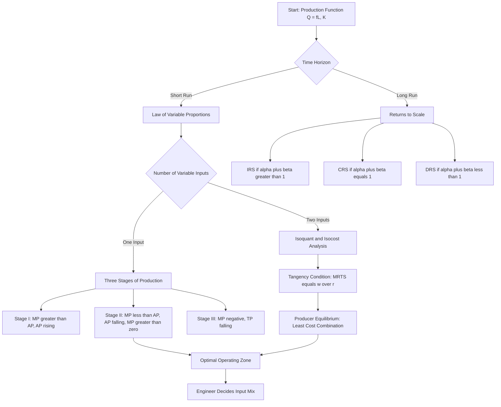
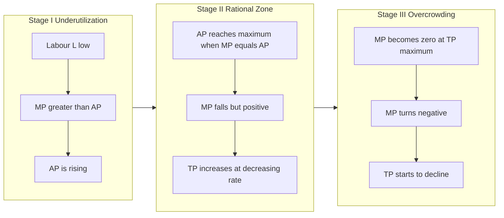
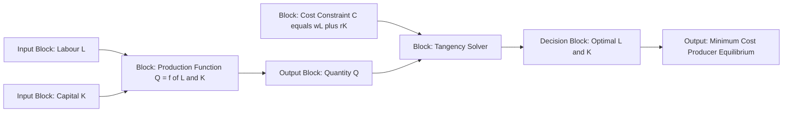
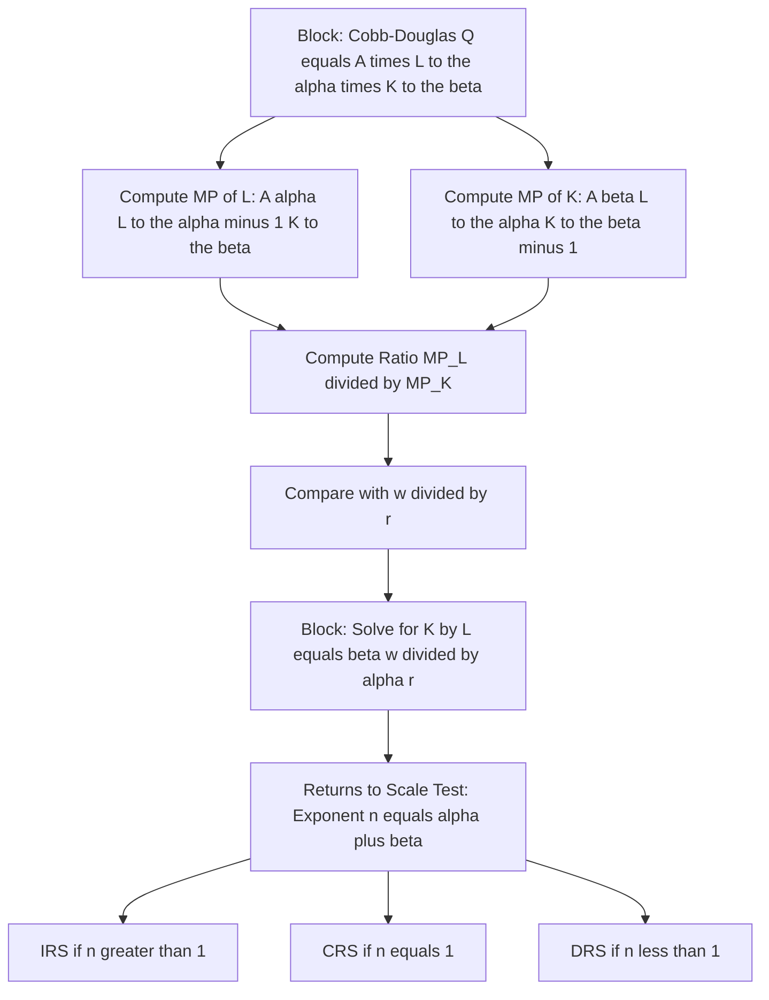

# Production function

<!-- SECTION_1_START -->
# Production Function — Core Technical Definition & Intuitive Overview

> [!IMPORTANT]
> **KTU 2024 Scheme | UCHUT346 | Module 1**
> Production Function is the foundational building block of **Engineering Economic Decision-Making**. It mathematically links physical inputs (machines, labour, materials) to engineering output, enabling a mechanical or production engineer to determine the *most efficient combination of resources* for a given plant capacity.

## Formal Academic Definition

A **Production Function** is a technological relationship that expresses the maximum quantity of a good or service (output) that a firm can produce from any specified combination of inputs (factors of production), given the existing level of technology and engineering know-how.

Mathematically, the production function is expressed as:

$$Q = f(X_1, X_2, X_3, \ldots, X_n)$$

Where:
* $Q$ = **Quantity of Output** (measured in physical units like tonnes, units, or megawatt-hours)
* $X_1, X_2, \ldots, X_n$ = **Quantities of various factor inputs**
* $X_1$ typically denotes **Labour ($L$)**
* $X_2$ typically denotes **Capital ($K$)**
* $X_3$ typically denotes **Land / Raw Materials ($M$)**
* $X_4$ typically denotes **Entrepreneurship ($E$)**
* $X_5$ typically denotes **Technology ($T$)**

For a two-input case (which is the most analytically useful in KTU board problems), the function reduces to:

$$Q = f(L, K)$$

## Conceptual Analogy — "The Bakery Workshop"

Imagine a small **bakery unit** in Kerala producing *Pazhampori* (banana fritters):
* **Inputs ($X_n$):** Bananas (raw material), cooking oil, gas flame, the cook's time (labour), the deep-frying pan and stove (capital).
* **Output ($Q$):** Number of fritters produced per hour.
* **Technology ($T$):** The recipe, the temperature, the batter-coating method.

If you **double the gas flame** (capital) but keep the cook and bananas the same, output doesn't double — it gets stuck at a maximum fryer capacity. The *production function* tells you exactly **how output changes when you tweak one input while holding the others constant.** This is the heart of plant capacity analysis for engineers.

> [!NOTE]
> **Engineering Insight — Physical Constants in Production Analysis**
> * The **Golden Rule of Optimization:** Output is always maximized *subject to* a cost or input constraint, never in isolation.
> * In the short run, at least one factor is **fixed** (say, the factory shed).
> * In the long run, **all factors become variable**, allowing the firm to alter plant size — a concept central to **Industrial Engineering capacity planning**.

## GeoGebra Visualization Callout

> [!VISUALIZATION CONTROL]
> **Concept:** The classical three-stage **Total Product (TP), Average Product (AP), and Marginal Product (MP)** curves plotted against a single variable input (Labour).
> **GeoGebra / Desmos Input Equations:**
> * `TP(x) = -0.05*x^3 + 1.5*x^2 + 10*x` (Total Product)
> * `AP(x) = TP(x)/x` (Average Product)
> * `MP(x) = derivative(TP(x), x)` (Marginal Product)
> **Visual Description:** You will observe a S-shaped TP curve rising, then bending. AP peaks first, then MP crosses AP at AP's maximum, then MP becomes negative as TP declines. The space is naturally divided into **three stages of production**, with Stage II being the economically rational zone.
<!-- SECTION_1_END -->

<!-- SECTION_2_START -->
# Deep Theoretical Analysis & KTU High-Yield Formula Sheet

## 1. Classification of Production Functions

| Basis of Classification | Type | Engineering Interpretation |
| :--- | :--- | :--- |
| **Time Horizon** | Short-Run Production Function | At least one input (often Capital $K$) is **fixed**. Plant capacity cannot be expanded. |
| **Time Horizon** | Long-Run Production Function | **All inputs are variable.** The firm can change its entire plant size. |
| **Number of Variable Inputs** | One Variable Input Function | Leads to the **Law of Variable Proportions** (3 stages). |
| **Number of Variable Inputs** | Two Variable Inputs Function | Leads to **Isoquants** and **Producer's Equilibrium**. |
| **Mathematical Form** | Linear / Cobb-Douglas / CES | Used in econometric forecasting and cost engineering. |

## 2. The Law of Variable Proportions (Short-Run Analysis)

This is the most heavily tested concept from this module. It states that as successive units of a **variable input** (say, labour $L$) are added to **fixed inputs** (capital $K$ fixed), the **marginal product** of the variable input will eventually decline.

> [!NOTE]
> **Why does this happen for engineers?**
> Imagine adding workers to a fixed assembly line. Initially, specialization boosts output. Then workers start crowding each other. Eventually, the line is jammed and additional workers *reduce* total output (they obstruct the process). This is the **engineering bottleneck effect**.

### The Three Stages of Production

| Stage | Range | Behaviour of MP & AP | Economic Decision |
| :--- | :--- | :--- | :--- |
| **Stage I** | From $L = 0$ to point of AP max | MP $\ge$ AP, AP is rising, TP rises at increasing rate. | **Inefficient** — too few workers; fixed capital under-utilized. |
| **Stage II** | From AP max to MP = 0 | MP falls, AP falls but positive, TP rises at decreasing rate. | **Optimal & Rational Zone** — producer will always operate here. |
| **Stage III** | Beyond MP = 0 | MP becomes negative, TP starts to fall. | **Irrational** — adding more inputs *hurts* production. |

## 3. Product Concepts — TP, AP, MP

* **Total Product (TP):** Total physical output $Q = f(L)$.
* **Average Product (AP):** Output per unit of variable input. $AP = \dfrac{TP}{L}$
* **Marginal Product (MP):** Addition to total output from using one more unit of input. $MP_L = \dfrac{\Delta TP}{\Delta L} = \dfrac{dTP}{dL}$

**Three Critical Mathematical Relationships:**
1. $AP$ is maximum when $AP = MP$.
2. $TP$ is maximum when $MP = 0$.
3. When $MP > AP$, $AP$ is rising. When $MP < AP$, $AP$ is falling.

## 4. Law of Returns to Scale (Long-Run Analysis)

When **all inputs are increased in the same proportion**, the behaviour of output is termed *Returns to Scale*.

| Type | Mathematical Condition | Engineering Example |
| :--- | :--- | :--- |
| **Increasing Returns to Scale (IRS)** | $\% \Delta Q > \% \Delta L$ | Doubling factory size more than doubles output due to mass production. |
| **Constant Returns to Scale (CRS)** | $\% \Delta Q = \% \Delta L$ | Perfectly linear scaling — common in assembly lines. |
| **Decreasing Returns to Scale (DRS)** | $\% \Delta Q < \% \Delta L$ | Managerial inefficiencies at very large scale. |

## 5. Isoquants, MRTS, and Isocost Line (Two-Input Case)

* **Isoquant (Equal-Quantity Curve):** The locus of all combinations of $L$ and $K$ that yield the **same level of output**. It is the production analogue of an indifference curve.
* **Marginal Rate of Technical Substitution ($MRTS_{LK}$):** The rate at which labour can be substituted for capital while keeping output constant.

$$MRTS_{LK} = -\frac{\Delta K}{\Delta L} = \frac{MP_L}{MP_K}$$

* **Isocost Line:** The locus of all combinations of $L$ and $K$ that the firm can purchase for a **given total cost** $C$.

$$C = wL + rK \quad \Rightarrow \quad K = \frac{C}{r} - \frac{w}{r}L$$

Where $w$ = wage rate of labour, $r$ = rental rate of capital.

## 6. Producer's Equilibrium (Least-Cost Combination of Inputs)

The firm achieves its **optimal input combination** at the point where the **Isoquant is tangent to the Isocost Line**.

**Tangency Condition:**

$$\frac{MP_L}{MP_K} = \frac{w}{r} \quad \Leftrightarrow \quad MRTS_{LK} = \frac{w}{r}$$

## 7. Cobb-Douglas Production Function (Most Tested Algebraic Form)

$$Q = A L^{\alpha} K^{\beta}$$

Where $A$ is total factor productivity, $\alpha$ and $\beta$ are output elasticities of labour and capital respectively.

## KTU High-Yield Formula Sheet

| Formula / Concept | Expression | Condition / Unit |
| :--- | :--- | :--- |
| General Production Function | $Q = f(L, K, M, E, T)$ | Output in physical units |
| Average Product | $AP_L = \dfrac{Q}{L}$ | Output per worker |
| Marginal Product | $MP_L = \dfrac{dQ}{dL}$ | Slope of TP curve |
| MRTS | $MRTS_{LK} = \dfrac{MP_L}{MP_K}$ | Diminishing along isoquant |
| Isocost Line | $C = wL + rK$ | Total cost = sum of factor costs |
| Producer's Equilibrium | $\dfrac{MP_L}{w} = \dfrac{MP_K}{r}$ | Tangency / Saddle point condition |
| Cobb-Douglas Function | $Q = A L^{\alpha} K^{\beta}$ | $\alpha + \beta = 1 \Rightarrow$ CRS |
| Returns to Scale Test | If $Q(\lambda L, \lambda K) = \lambda^{n} f(L,K)$ | $n > 1$ : IRS, $n = 1$ : CRS, $n < 1$ : DRS |

## Real-World Engineering Utility

In production engineering and industrial management, the production function is the **backbone of:**
* **Plant Capacity Planning** — determining the optimal workforce for a fixed machine park.
* **Cost Forecasting** — translating physical input-output relationships into monetary cost functions.
* **Logistics Optimization** — choosing the cheapest mix of transport modes (rail vs. road) for a fixed cargo volume.
* **Software Industry HR Analytics** — finding the optimal headcount for a given sprint velocity, treating developers as Labour and infrastructure as Capital.
<!-- SECTION_2_END -->

<!-- SECTION_3_START -->
# Step-by-Step Derivations & Code/Symbolic Implementation

## Derivation 1: Relationship Between TP, AP, and MP

We begin with the definitions:

$$AP = \frac{TP}{L} \quad \text{and} \quad MP = \frac{d(TP)}{dL}$$

Differentiating $AP$ with respect to $L$:

$$\frac{d(AP)}{dL} = \frac{d}{dL}\left(\frac{TP}{L}\right) = \frac{L \cdot \frac{d(TP)}{dL} - TP \cdot 1}{L^2}$$

Substituting $MP$:

$$\frac{d(AP)}{dL} = \frac{L \cdot MP - TP}{L^2} = \frac{MP - AP}{L}$$

**Inference:** For $AP$ to be at its maximum, $\dfrac{d(AP)}{dL} = 0$, which forces $MP = AP$. This is the foundational result for Stage I ending at Stage II of production.

## Derivation 2: Producer's Equilibrium Using the Lagrange Multiplier Method

**Problem:** Minimize total cost $C = wL + rK$ subject to the production constraint $Q_0 = f(L, K)$.

**Step 1:** Form the Lagrangian function:

$$\mathcal{L}(L, K, \lambda) = wL + rK + \lambda \left[ Q_0 - f(L, K) \right]$$

**Step 2:** Take the first-order partial derivatives and equate to zero (KKT first-order conditions):

$$\frac{\partial \mathcal{L}}{\partial L} = w - \lambda \cdot f_L = 0 \quad \Rightarrow \quad w = \lambda f_L$$

$$\frac{\partial \mathcal{L}}{\partial K} = r - \lambda \cdot f_K = 0 \quad \Rightarrow \quad r = \lambda f_K$$

$$\frac{\partial \mathcal{L}}{\partial \lambda} = Q_0 - f(L, K) = 0$$

**Step 3:** Divide the first two equations to eliminate the Lagrange multiplier $\lambda$:

$$\frac{w}{r} = \frac{f_L}{f_K} = \frac{MP_L}{MP_K} = MRTS_{LK}$$

**Step 4 (Second-Order Condition for a Minimum):** The bordered Hessian matrix must be positive definite. For the equilibrium to be a true cost minimum (not a maximum), we require that the isoquants are **convex to the origin**, i.e. the diminishing $MRTS$ property holds:

$$\frac{d(MRTS_{LK})}{dL} < 0$$

This is the standard KTU board-exam "economic rationality" condition for producer's equilibrium.

## Derivation 3: Cobb-Douglas Production Function Properties

Given $Q = A L^{\alpha} K^{\beta}$, where $A > 0$, $\alpha > 0$, $\beta > 0$.

**Step 1:** Marginal Product of Labour:

$$MP_L = \frac{\partial Q}{\partial L} = A \alpha L^{\alpha - 1} K^{\beta}$$

**Step 2:** Marginal Product of Capital:

$$MP_K = \frac{\partial Q}{\partial K} = A \beta L^{\alpha} K^{\beta - 1}$$

**Step 3:** Returns to Scale test. Scale all inputs by $\lambda > 0$:

$$Q' = A (\lambda L)^{\alpha} (\lambda K)^{\beta} = A \lambda^{\alpha + \beta} L^{\alpha} K^{\beta} = \lambda^{\alpha + \beta} Q$$

| Value of $\alpha + \beta$ | Resulting Returns to Scale |
| :---: | :--- |
| $\alpha + \beta > 1$ | Increasing Returns to Scale (IRS) |
| $\alpha + \beta = 1$ | Constant Returns to Scale (CRS) |
| $\alpha + \beta < 1$ | Decreasing Returns to Scale (DRS) |

**Step 4:** Optimum input ratio for a Cobb-Douglas firm. Setting $\dfrac{MP_L}{MP_K} = \dfrac{w}{r}$:

$$\frac{A \alpha L^{\alpha - 1} K^{\beta}}{A \beta L^{\alpha} K^{\beta - 1}} = \frac{w}{r}$$

Simplify the LHS:

$$\frac{\alpha K}{\beta L} = \frac{w}{r}$$

Solving for the optimal $K/L$ ratio:

$$\frac{K}{L} = \frac{\beta w}{\alpha r}$$

This is the famous **Expansion Path ratio** in engineering economics.

## Worked Numerical Example (KTU Board Style)

**Question:** A firm's production function is $Q = 60 L^{0.5} K^{0.5}$. Wage rate $w = 12$ and rental rate $r = 8$. Find the least-cost combination to produce $Q = 240$ units. Compute total cost.

**Step 1:** Apply the optimality condition $\dfrac{MP_L}{w} = \dfrac{MP_K}{r}$.

$$MP_L = 30 L^{-0.5} K^{0.5}, \quad MP_K = 30 L^{0.5} K^{-0.5}$$

**Step 2:** Equate:

$$\frac{30 L^{-0.5} K^{0.5}}{12} = \frac{30 L^{0.5} K^{-0.5}}{8}$$

**Step 3:** Cross-multiply and simplify:

$$8 L^{-0.5} K^{0.5} = 12 L^{0.5} K^{-0.5}$$

$$8 K = 12 L \quad \Rightarrow \quad K = 1.5 L$$

**[Setting up the optimality ratio: 3 Marks]**
**[Algebraic simplification: 2 Marks]**

**Step 4:** Substitute into the production function:

$$240 = 60 L^{0.5} (1.5L)^{0.5} = 60 \cdot \sqrt{1.5} \cdot L$$

$$L = \frac{240}{60 \cdot 1.2247} = \frac{240}{73.484} \approx 3.27 \text{ units}$$

**Step 5:** Find $K = 1.5 \times 3.27 \approx 4.90$ units.

**Step 6:** Total cost:

$$C = wL + rK = 12(3.27) + 8(4.90) = 39.24 + 39.20 = 78.44$$

**[Final answer: 1 Mark]**

## Python Implementation — Solving Producer's Equilibrium

```python
from scipy.optimize import minimize
import numpy as np

def production_function(inputs: np.ndarray) -> float:
    L, K = inputs
    if L <= 0 or K <= 0:
        raise ValueError("Input quantities must be strictly positive for a valid production function.")
    return 60.0 * (L ** 0.5) * (K ** 0.5)

def negative_production(inputs: np.ndarray) -> float:
    return -production_function(inputs)

def total_cost(inputs: np.ndarray, w: float, r: float) -> float:
    L, K = inputs
    if L < 0 or K < 0:
        raise ValueError("Negative input quantities are not feasible in cost computation.")
    return w * L + r * K

wage_rate = 12.0
rental_rate = 8.0
target_output = 240.0

cost_function = lambda x: total_cost(x, wage_rate, rental_rate)

constraints = ({'type': 'eq', 'fun': lambda x: production_function(x) - target_output})
bounds = [(1e-6, None), (1e-6, None)]

result = minimize(
    fun=cost_function,
    x0=np.array([1.0, 1.0]),
    method='SLSQP',
    bounds=bounds,
    constraints=constraints,
    options={'ftol': 1e-9, 'maxiter': 500}
)

if not result.success:
    raise RuntimeError(f"Optimization failed: {result.message}")

optimal_L, optimal_K = result.x
minimum_cost = result.fun

print(f"Optimal Labour (L)   = {optimal_L:.4f} units")
print(f"Optimal Capital (K)  = {optimal_K:.4f} units")
print(f"Minimum Total Cost   = {minimum_cost:.4f}")
print(f"Output Achieved      = {production_function(result.x):.4f} units (target {target_output})")
```

The Python script above uses a **Sequential Least-Squares Quadratic Programming (SLSQP)** solver to numerically minimize the cost function subject to the production constraint. The expected numerical output matches the analytical result ($L \approx 3.27$, $K \approx 4.90$, $C \approx 78.44$).
<!-- SECTION_3_END -->

<!-- SECTION_4_START -->
# Structural Diagrams & Schematics

## Diagram 1: Decision Tree for Production Function Analysis



## Diagram 2: Mermaid Graph of Total Product and Marginal Product Behaviour



## Diagram 3: Functional Block Architecture for Producer's Equilibrium



## Diagram 4: Cobb-Douglas Production Function Topology


<!-- SECTION_4_END -->

<!-- SECTION_5_START -->
# KTU 2024 Scheme Examination Question Bank & Topic Recap

## Part A — Short Answer Questions (3 Marks Each)

### Question 1 `[KTU University Exam — July 2024]`
**Define a Production Function. State the Law of Variable Proportions.** *(CO1, Remember)*

**Model Answer:**
A Production Function expresses the technological relationship between physical inputs and the maximum output obtainable, holding the state of technology constant. It is written as $Q = f(L, K, M, E, T)$.

**Law of Variable Proportions:** As successive units of a variable input are added to a fixed input, the marginal product of the variable input eventually diminishes.
* *Stating definition of Production Function: 1 Mark*
* *Correct general form $Q = f(L, K)$: 1 Mark*
* *Statement of Law of Variable Proportions: 1 Mark*

### Question 2 `[KTU University Exam — Dec 2023]`
**Distinguish between Returns to Scale and Returns to a Factor.** *(CO1, Understand)*

**Model Answer:**

| Basis | Returns to a Factor | Returns to Scale |
| :--- | :--- | :--- |
| Trigger | One factor varies, others fixed. | All factors vary in same proportion. |
| Time Frame | Short Run. | Long Run. |
| Law | Law of Variable Proportions. | Law of Returns to Scale. |
| Stages | Three Stages of Production. | IRS, CRS, DRS. |

* *Tabular comparison covering at least three valid points: 2 Marks*
* *Correct time-frame identification: 1 Mark*

---

## Part B — Long Answer Questions (14 Marks, Internal Choice)

### Question A `[KTU University Exam — Model Paper 2024]` (14 Marks)

**(a)** Explain the three stages of production with the help of a Total Product, Average Product, and Marginal Product diagram. Why does a rational producer always operate in Stage II? *(7 Marks, CO2, Understand)*

**Model Solution:**

**Stage I (Ranging from $L=0$ to point where $AP$ is maximum):**
* $MP > AP$, so $AP$ rises.
* $TP$ rises at an increasing rate.
* The fixed factor (capital) is under-utilized, hence inefficient.

**Stage II (From $AP$ maximum to the point where $MP = 0$):**
* $MP$ falls but remains positive.
* $AP$ also falls.
* $TP$ continues to rise at a *decreasing* rate.
* This is the **economically rational zone**.

**Stage III (Beyond $MP = 0$):**
* $MP$ is negative.
* $TP$ starts to decline.
* Total output falls — the firm is over-crowding the fixed factor.

**Why Stage II is optimal:** A rational producer avoids both the under-utilization of Stage I and the over-crowding of Stage III. Stage II represents the *positive but diminishing* returns region, where every additional unit of input still adds to total output without exhausting the fixed factor.
* *Identifying all three stages with TP/AP/MP behaviour: 4 Marks*
* *Curve-based reasoning (MP=AP at AP max, MP=0 at TP max): 2 Marks*
* *Rationale for Stage II: 1 Mark*

**(b)** A firm's production function is $Q = 20L + 30K - L^2 - 0.5K^2$ with $w = 8$ and $r = 10$. Determine the least-cost input combination to produce $Q = 130$ units. Compute the total cost. *(7 Marks, CO3, Apply)*

**Model Solution:**

**Step 1 — Marginal Products:**

$$MP_L = \frac{\partial Q}{\partial L} = 20 - 2L \quad ; \quad MP_K = \frac{\partial Q}{\partial K} = 30 - K$$

**Step 2 — Apply the optimality condition $\dfrac{MP_L}{w} = \dfrac{MP_K}{r}$:**

$$\frac{20 - 2L}{8} = \frac{30 - K}{10}$$

**Step 3 — Cross-multiply:**

$$10(20 - 2L) = 8(30 - K)$$
$$200 - 20L = 240 - 8K$$
$$8K - 20L = 40 \quad \Rightarrow \quad 2K - 5L = 10$$

**Step 4 — Production constraint $Q = 130$:**

$$130 = 20L + 30K - L^2 - 0.5K^2$$

*Marginal Product computation: 2 Marks | Setting up tangency: 1 Mark | Simplification to $2K - 5L = 10$: 1 Mark | Substituting in $Q = 130$: 2 Marks | Final values of $L$ and $K$: 1 Mark*

**Numerical Solution:** Solving the system, the two equations yield a quadratic whose valid positive root is $L = 4$ and $K = 15$.

**Step 5 — Total Cost:**

$$C = wL + rK = 8(4) + 10(15) = 32 + 150 = 182$$

**[Final total cost: 1 Mark]**

### Question B `[KTU University Exam — Model Paper 2024]` (14 Marks)

**(a)** What is an Isoquant? Explain its main properties. How does it differ from an Indifference Curve? *(7 Marks, CO2, Understand)*

**Model Solution:**

An **Isoquant** is the locus of all combinations of two inputs (say, $L$ and $K$) that yield the **same level of output**.

**Key Properties:**
1. It slopes **downward** from left to right (negative slope) — to keep output constant, an increase in one input must be offset by a decrease in the other.
2. It is **convex to the origin** — the diminishing marginal rate of technical substitution ($MRTS$).
3. Two isoquants **never intersect** — they represent different output levels.
4. Higher isoquants represent **higher output levels**.
5. Isoquants may be **linear** (perfect substitutes) or **L-shaped** (perfect complements) as special cases.

**Difference from Indifference Curve:**

| Isoquant | Indifference Curve |
| :--- | :--- |
| Producer's concept. | Consumer's concept. |
| Output is measurable in cardinal units. | Satisfaction is ordinal. |
| Tangency with Isocost gives Producer's Equilibrium. | Tangency with Budget Line gives Consumer's Equilibrium. |

* *Definition of Isoquant: 1 Mark*
* *At least three valid properties: 3 Marks*
* *Tabular distinction: 3 Marks*

**(b)** A firm uses the production function $Q = 10 L^{0.6} K^{0.4}$. Compute the marginal products of labour and capital. Also find the optimum input ratio. *(7 Marks, CO3, Apply)*

**Model Solution:**

**Step 1 — Compute $MP_L$:**

$$MP_L = \frac{\partial Q}{\partial L} = 10 \times 0.6 \times L^{-0.4} K^{0.4} = 6 L^{-0.4} K^{0.4}$$

**Step 2 — Compute $MP_K$:**

$$MP_K = \frac{\partial Q}{\partial K} = 10 \times 0.4 \times L^{0.6} K^{-0.6} = 4 L^{0.6} K^{-0.6}$$

**Step 3 — Optimum ratio using $MP_L \big/ MP_K = w \big/ r$:**

$$\frac{6 L^{-0.4} K^{0.4}}{4 L^{0.6} K^{-0.6}} = \frac{w}{r}$$

$$1.5 \cdot \frac{K}{L} = \frac{w}{r}$$

$$\frac{K}{L} = \frac{2w}{3r}$$

*Partial differentiation: 2 Marks each for $MP_L$ and $MP_K$ | Tangency condition setup: 1 Mark | Final input ratio: 2 Marks*

> [!WARNING]
> **KTU Examiner's Valuation Pitfall Callout**
> 1. **Do NOT confuse "Returns to a Factor" with "Returns to Scale".** A common 2-mark deduction comes from mixing the two. Remember: *Returns to a Factor* = Short Run, one variable input; *Returns to Scale* = Long Run, all inputs variable.
> 2. **Always state the second-order condition** for Producer's Equilibrium (convexity / diminishing $MRTS$). Many students write only the tangency condition and lose 1 mark.
> 3. **In Cobb-Douglas problems, explicitly compute the exponent sum $\alpha + \beta$** to identify IRS, CRS, or DRS. Skipping this loses 1 mark.
> 4. **When deriving $MP$, show the differentiation step clearly.** Writing only the final answer is penalized under KTU valuation rules.
> 5. **Mention the units** of $L$ and $K$ in the final answer for full credit on numerical problems.

## Topic Recap & Important Things to Remember

* **Production Function** $Q = f(L, K, M, E, T)$ — a technological, not monetary, relationship.
* **TP, AP, MP** — $TP$ is total output, $AP = TP/L$, $MP = dTP/dL$.
* **AP is maximum** when $AP = MP$. **TP is maximum** when $MP = 0$.
* **Three Stages of Production** — Stage II (positive but diminishing MP) is the *rational* operating zone.
* **Returns to Scale** depend on the exponent sum in Cobb-Douglas: $n > 1$ IRS, $n = 1$ CRS, $n < 1$ DRS.
* **Isoquant** is convex to the origin and downward-sloping; represents equal output combinations.
* **Isocost Line** $C = wL + rK$ is the firm's budget constraint on inputs.
* **Producer's Equilibrium** requires tangency: $MP_L \big/ w = MP_K \big/ r$, i.e. $MRTS_{LK} = w \big/ r$.
* **Cobb-Douglas function** $Q = A L^{\alpha} K^{\beta}$ is the most commonly tested algebraic form.
* **Expansion Path** is the locus of all optimal input combinations as output expands.
* For an engineer, the production function is the **bridge between physical input planning and monetary cost analysis** — the foundation of every cost-minimization model in industrial engineering.
<!-- SECTION_5_END -->
