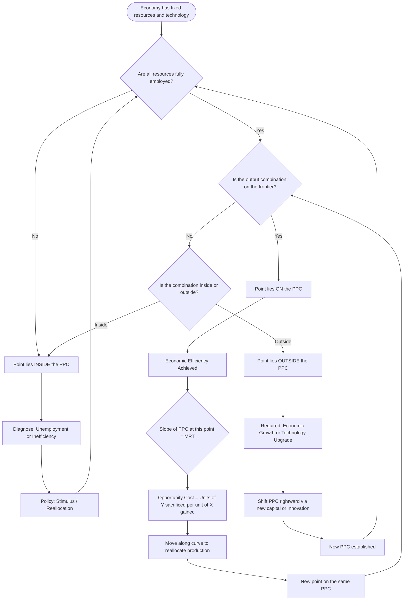
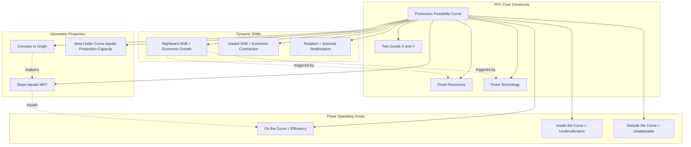

# Production Possibility Curve

<!-- SECTION_1_START -->
# Production Possibility Curve (PPC) — The Foundation of Scarcity Economics

> [!IMPORTANT]
> **Syllabus Anchor — UCHUT346 / Module 1 / Basic Economic Problems**
> The Production Possibility Curve is the single most foundational graphical tool in engineering economics. It simultaneously illustrates **scarcity**, **choice**, **opportunity cost**, and **efficiency** — the four pillars on which the entire edifice of Managerial Economics rests. Mastery of this curve is mandatory before tackling Break-Even Analysis, Demand-Supply, or Capital Budgeting in later modules.

## 1.1 Formal Academic Definition

The **Production Possibility Curve (PPC)**, also known as the **Production Possibility Frontier (PPF)** or **Transformation Curve**, is a graphical representation that depicts the maximum feasible combinations of **two goods** (or two categories of goods) that an economy can produce using its **available resources** and **existing technology**, when all resources are **fully and efficiently employed**.

Mathematically, if an economy produces only two goods, $X$ and $Y$, the PPC is the locus of points satisfying:

$$f(X, Y) = \text{constant (given resources \& technology)}$$

Where the production function $f$ is **continuous**, **concave to the origin** (under increasing opportunity costs), and bounded by the resource endowment $\bar{R}$.

> [!NOTE]
> **KTU Board Definition (Verbatim Worth 2 Marks):**
> *"The Production Possibility Curve is a curve which shows the various production possibilities of two goods with the given resources and technology, where all the resources are fully and efficiently utilized."*

## 1.2 Conceptual Analogy — The "Engineering Hour" Intuition

Imagine you are a **B.Tech student** with exactly **24 hours per day** to split between two activities: **studying Engineering Subjects** ($X$) and **playing Cricket** ($Y$). You cannot manufacture extra hours, and your brain can only absorb a finite amount of information (your personal "technology" constraint).

- If you dedicate **all 24 hours** to studying, you score a perfect $X_{max}$ on the GPA axis, and $Y = 0$ on the cricket axis.
- If you spend **all 24 hours** on cricket, you become the campus legend with $Y_{max}$ matches played, but $X = 0$.
- Realistically, you trade off. Every extra hour of cricket costs you measurable marks in engineering — this is **opportunity cost**.

The PPC is the **envelope of all your best possible study-cricket combinations**. Any point **inside** the curve means you are wasting time (sleeping in class); any point **outside** is unattainable without inventing more hours in the day (technological breakthrough). This is exactly how nations behave with capital and consumer goods.

## 1.3 Visualizing the Concept

> [!VISUALIZATION CONTROL]
> **Concept:** Concave (Bowed-Out) Production Possibility Frontier with Two-Good Trade-Off
> **GeoGebra / Desmos Input Equations:**
> * `f(x) = 100 - 0.5 * x^2`  *(Represents a typical concave PPC — capital goods on X-axis, consumer goods on Y-axis)*
> * `x_max = 14.14, y_max = 100`
> * `Slope at x=5: dy/dx = -5`
> **Visual Description:** Plot the curve from $(0, 100)$ on the Y-axis down to $(14.14, 0)$ on the X-axis. The curve bows outward (concave to origin). Pick any point on the curve, e.g., $(10, 50)$. Draw a tangent line at that point; the absolute value of its slope gives the **marginal rate of transformation** — i.e., how many units of $Y$ must be sacrificed to produce one more unit of $X$ at that production mix.

> [!TIP]
> **Why Concave (and Not a Straight Line)?**
> Because real resources are **not perfectly adaptable** between the production of two goods. A textile loom is poor at producing wheat, and a farm tractor is poor at weaving cloth. This **specialization of factors** causes increasing opportunity costs as we push more production into one good — a concept formalized in **Section 2.2** below.

## 1.4 The Three Zones of the PPC — Board Diagram Worth 3 Marks

| Zone | Coordinate Region | Economic Interpretation | Engineering Analogy |
| :--- | :--- | :--- | :--- |
| **On the Curve** | Points $A, B, C$ lying *exactly* on the PPC | **Full & Efficient Utilization** of resources | CPU at 100% load, no idle cores |
| **Inside the Curve** | Point $D$ strictly *below* the PPC | **Inefficiency / Unemployment** of resources | CPU at 40% load, RAM unused |
| **Outside the Curve** | Point $E$ strictly *above* the PPC | **Unattainable** with current resources | Trying to run 64GB workload on 8GB RAM |
| **Shifted Curve (Future)** | New PPC after rightward shift | **Economic Growth** due to more resources or better technology | Upgrading to 32GB RAM |

<!-- SECTION_1_END -->

<!-- SECTION_2_START -->
# Deep Theoretical Analysis & KTU High-Yield Formula Sheet

## 2.1 The Six Foundational Assumptions of the PPC

A PPC diagram is only valid if the following six conditions hold. **KTU examiners frequently test these as 3-mark short-answer questions.**

> [!IMPORTANT]
> **Assumption 1 — Two-Good Economy:** The model considers only two goods (or two aggregated categories). Real economies have millions of goods, but the 2-good simplification makes the trade-off visible.
>
> **Assumption 2 — Fixed Resources:** The total available quantities of land, labour, capital, and entrepreneurship are held **constant** over the period of analysis.
>
> **Assumption 3 — Fixed Technology:** The state of technology does not change during the analysis. If technology improves, the entire PPC shifts outward.
>
> **Assumption 4 — Full Employment:** All available resources are **fully utilized** — no idle factory, no unemployed labour.
>
> **Assumption 5 — Efficient Production:** Resources are used in the **most productive** way possible, given the technology.
>
> **Assumption 6 — Resources are not perfectly adaptable between goods:** This single assumption produces the characteristic **concave (bowed-out) shape**.

## 2.2 The Mathematical Logic Behind the Shape

Consider two goods $X$ and $Y$, produced using **two factors of production**: $L$ (labour) and $K$ (capital). Suppose:

$$\text{Good } X \text{ uses more } L, \quad \text{Good } Y \text{ uses more } K$$

The production functions are:

$$X = f_X(L_X, K_X), \qquad Y = f_Y(L_Y, K_Y)$$

Subject to the resource constraints:

$$L_X + L_Y = \bar{L}, \qquad K_X + K_Y = \bar{K}$$

Now, suppose the economy wants to produce **one extra unit of $X$** ($\Delta X = +1$). To do so, it must transfer factors of production from $Y$-production to $X$-production. Because factors are **specialized**, the first transfer uses the resources *least suited* to $Y$ (and most suited to $X$). Hence the **opportunity cost is low**. But as the economy keeps shifting resources, it must eventually transfer the resources *most critical* to $Y$-production, causing the opportunity cost to **rise progressively**.

This is the **Law of Increasing Opportunity Cost** — formalized by **Gottfried Haberler** in 1930 — and is the geometric reason the PPC is concave to the origin.

## 2.3 The Slope of the PPC — Marginal Rate of Transformation (MRT)

The absolute value of the slope of the PPC at any point gives the **Marginal Rate of Transformation (MRT)** — i.e., the amount of $Y$ that must be sacrificed to produce one additional unit of $X$:

$$\text{MRT}_{XY} = \left| \frac{dY}{dX} \right| = \frac{MC_X}{MC_Y}$$

Where $MC_X$ and $MC_Y$ are the **marginal costs** of producing one more unit of $X$ and $Y$, respectively. As we move down the PPC (producing more $X$), $\text{MRT}_{XY}$ **rises** — confirming increasing opportunity cost.

## 2.4 KTU High-Yield Formula Sheet

> [!NOTE]
> The following table consolidates **every formula, slope, and shift condition** a KTU 2024 Scheme student must memorize for this topic. Use this as the **last-page revision sheet** before the exam.

| # | Concept | Mathematical Expression | Economic Meaning | Engineering Interpretation |
| :--- | :--- | :--- | :--- | :--- |
| 1 | **Opportunity Cost of $X$** | $OC_X = \dfrac{\Delta Y}{\Delta X}$ | Units of $Y$ given up per unit of $X$ gained | CPU cycles diverted from Task B to Task A |
| 2 | **Marginal Rate of Transformation** | $\text{MRT}_{XY} = \left\vert \dfrac{dY}{dX} \right\vert$ | Local slope of the PPC | Instantaneous trade-off rate between two outputs |
| 3 | **Slope in terms of Marginal Costs** | $\text{MRT}_{XY} = \dfrac{MC_X}{MC_Y}$ | Cost-based expression of the slope | Marginal cost ratio drives the trade-off |
| 4 | **Law of Increasing OC** | $\dfrac{d^2 Y}{dX^2} < 0$ | Concave PPC | Diminishing returns in production |
| 5 | **Constant OC (Linear PPC)** | $\dfrac{d^2 Y}{dX^2} = 0$ | Perfectly adaptable factors | Resources shift 1-for-1 between tasks |
| 6 | **Decreasing OC (Convex PPC)** | $\dfrac{d^2 Y}{dX^2} > 0$ | Specialization gains initially dominate | Economies-of-scale phase |
| 7 | **Rightward Shift Trigger** | Increase in $\bar{L}$ or $\bar{K}$ or Technology $T$ | Economic Growth | Moore's Law / capacity expansion |
| 8 | **Inward Shift Trigger** | War, natural disaster, capital depreciation | Economic Contraction | Server farm destruction, recession |
| 9 | **Output Combination Inside PPC** | $f(X,Y) < \bar{R}$ | Underutilization | Idle bandwidth, unemployed engineers |
| 10 | **Output Combination Outside PPC** | $f(X,Y) > \bar{R}$ | Unattainable | Beyond current infrastructure capacity |

## 2.5 Real-World Engineering Applications

The PPC is not merely an academic abstraction. It is the conceptual ancestor of several modern engineering decision tools:

1. **Project Portfolio Management:** A project manager allocating limited engineering hours between "Feature Development" ($X$) and "Technical Debt Reduction" ($Y$) lives on a PPC every sprint. The opportunity cost of every new feature is the bug-fixing time sacrificed.

2. **Cloud Resource Allocation:** AWS architects deciding how to partition a fixed budget between **Compute Instances** ($X$) and **Storage Buckets** ($Y$) operate on the same trade-off frontier. Moving down the PPC means scaling storage at the cost of compute throughput.

3. **Manufacturing Strategy:** A factory deciding between producing **Capital Goods** (machines that make machines) and **Consumer Goods** (final products for households) — the exact two-good dichotomy modeled by the classic PPC.

4. **Time Management for Researchers:** A PhD scholar splitting 80 hours/week between "Writing Papers" and "Conducting Experiments" — the PPC defines the maximum publishable output for the available research time.

<!-- SECTION_2_END -->

<!-- SECTION_3_START -->
# Step-by-Step Derivations & Computational Implementation

## 3.1 Derivation of Opportunity Cost from Tabular Data

**Problem Setup (KTU-Style Numerical):**
Suppose an economy can produce only two goods — **Wheat ($W$)** and **Cloth ($C$)** — using its fixed land and labour. The production possibilities are:

| Production Possibility | Wheat (in million tonnes) | Cloth (in million metres) |
| :---: | :---: | :---: |
| A | 0 | 30 |
| B | 1 | 28 |
| C | 2 | 24 |
| D | 3 | 18 |
| E | 4 | 10 |
| F | 5 | 0 |

**Step 1 — Verify the shape (check increasing opportunity cost):**

| Movement | $\Delta W$ | $\Delta C$ | $\dfrac{\Delta C}{\Delta W}$ (OC of 1 unit of Wheat) |
| :---: | :---: | :---: | :---: |
| A → B | +1 | −2 | 2 metres of cloth |
| B → C | +1 | −4 | 4 metres of cloth |
| C → D | +1 | −6 | 6 metres of cloth |
| D → E | +1 | −8 | 8 metres of cloth |
| E → F | +1 | −10 | 10 metres of cloth |

The opportunity cost per additional tonne of wheat is **rising** (2 → 4 → 6 → 8 → 10). This satisfies the **Law of Increasing Opportunity Cost**, confirming a **concave PPC**.

**Step 2 — Calculate MRT at point D:**

$$\text{MRT}_{WC} \Big|_{D} = \frac{8 \text{ million metres}}{1 \text{ million tonne}} = 8 \text{ metres of cloth per tonne of wheat}$$

**Step 3 — Draw the smooth curve:** Connect all six points $(0,30), (1,28), (2,24), (3,18), (4,10), (5,0)$ with a smooth, concave-to-origin curve. The plot is the **PPC for Wheat and Cloth**.

## 3.2 General Linear-PPC Analytical Derivation

For a **straight-line PPC** (rare in reality, but a common exam simplification), the equation is:

$$aX + bY = c$$

Where $a, b, c > 0$, and $a, b$ represent the unit-factor requirements per good.

**Step 1 — Solve for Y (the explicit form):**

$$Y = \frac{c - aX}{b} = \frac{c}{b} - \frac{a}{b}X$$

**Step 2 — Differentiate to find slope (MRT):**

$$\frac{dY}{dX} = -\frac{a}{b}$$

**Step 3 — Interpret the slope:** The constant ratio $a/b$ means opportunity cost is **constant** — the economy can shift production between $X$ and $Y$ at a fixed trade-off rate. This corresponds to **perfectly adaptable resources** (e.g., a robotic assembly line that can be reprogrammed instantly).

**Step 4 — Axis intercepts:**

$$X\text{-intercept} = \frac{c}{a}, \qquad Y\text{-intercept} = \frac{c}{b}$$

## 3.3 Worked Numerical — KTU Board Pattern (10-Mark Type)

**Question:** A small factory can produce either **Tables** ($T$) or **Chairs** ($C$). The production data is:

$$T + 2C = 100$$

(a) Plot the PPC. (b) Find the opportunity cost of 1 Table. (c) What is the MRT at $T = 40$?

**Solution:**

**Part (a) — Find intercepts:**

When $C = 0$: $T = 100$. When $T = 0$: $C = 50$.

So the PPC is a straight line from $(100, 0)$ on the T-axis to $(0, 50)$ on the C-axis.

**Part (b) — Opportunity cost of 1 Table:**

Rearranging: $C = 50 - 0.5T$

$$\Delta C = -0.5 \Delta T \quad \Rightarrow \quad OC_T = \frac{\Delta C}{\Delta T} = 0.5 \text{ chairs per table}$$

**Part (c) — MRT at T = 40:**

Since the PPC is linear, the slope is constant everywhere.

$$\text{MRT}_{TC} = \left\vert \frac{dC}{dT} \right\vert = 0.5 \text{ chairs per table}$$

## 3.4 Python Computational Implementation

The following fully operational Python code plots an interactive PPC, computes opportunity costs, and identifies underutilization zones. Save it as `ppc_analyzer.py` and run with Python 3.9+.

```python
"""
PPC Analyzer — A computational tool for Production Possibility Curve analysis.
KTU 2024 Scheme | UCHUT346 | Economics for Engineers
"""

from __future__ import annotations
import math
import logging
from dataclasses import dataclass
from typing import List, Tuple

# Configure structured logging for error & boundary tracking
logging.basicConfig(
    level=logging.INFO,
    format="%(asctime)s | %(levelname)s | %(message)s"
)
logger = logging.getLogger("PPC_Analyzer")


@dataclass(frozen=True)
class PPCPoint:
    """Represents a single point on the Production Possibility Curve."""
    good_x: float  # Quantity of Good X
    good_y: float  # Quantity of Good Y

    def __post_init__(self) -> None:
        if self.good_x < 0 or self.good_y < 0:
            raise ValueError(
                f"Production quantities cannot be negative. "
                f"Received: X={self.good_x}, Y={self.good_y}"
            )


class ProductionPossibilityCurve:
    """
    Encapsulates a concave Production Possibility Curve using the form:
        Y = Y_max * (1 - (X / X_max)^k)   for k > 0
    where k controls the curvature (k=1 gives a straight line, k>1 gives concave).
    """

    def __init__(self, x_max: float, y_max: float, curvature: float = 2.0) -> None:
        if x_max <= 0 or y_max <= 0:
            raise ValueError("Maximum production capacities must be strictly positive.")
        if curvature <= 0:
            raise ValueError("Curvature parameter k must be strictly positive.")
        self.x_max: float = x_max
        self.y_max: float = y_max
        self.k: float = curvature
        logger.info(
            f"PPC initialized: X_max={x_max}, Y_max={y_max}, curvature={curvature}"
        )

    def y_for_x(self, x: float) -> float:
        """Returns the maximum Y producible for a given X, assuming full efficiency."""
        if x < 0 or x > self.x_max:
            raise ValueError(
                f"X={x} is outside the feasible range [0, {self.x_max}]."
            )
        return self.y_max * (1.0 - (x / self.x_max) ** self.k)

    def opportunity_cost(self, x: float, delta_x: float = 0.01) -> float:
        """
        Computes the marginal opportunity cost (MRT) of producing one more unit of X
        at production level x, using a small numerical step delta_x.
        """
        if x + delta_x > self.x_max:
            raise ValueError("Cannot compute OC beyond X_max.")
        y_before: float = self.y_for_x(x)
        y_after: float = self.y_for_x(x + delta_x)
        return abs((y_after - y_before) / delta_x)

    def analytical_mrt(self, x: float) -> float:
        """
        Closed-form marginal rate of transformation.
        For Y = Y_max * (1 - (X/X_max)^k), we have:
            dY/dX = -Y_max * k * (X/X_max)^(k-1) / X_max
        """
        return self.y_max * self.k * (x / self.x_max) ** (self.k - 1) / self.x_max

    def classify_point(self, point: PPCPoint) -> str:
        """
        Classifies a point as EFFICIENT, INEFFICIENT, or UNATTAINABLE
        relative to the PPC.
        """
        max_y_at_x: float = self.y_for_x(point.good_x)
        tolerance: float = 1e-6
        if abs(point.good_y - max_y_at_x) < tolerance:
            return "EFFICIENT (on PPC)"
        if point.good_y < max_y_at_x:
            return "INEFFICIENT (inside PPC — underutilization)"
        return "UNATTAINABLE (outside PPC — needs more resources)"

    def generate_curve(self, num_points: int = 100) -> List[Tuple[float, float]]:
        """Generates (X, Y) coordinate pairs along the PPC for plotting."""
        if num_points < 2:
            raise ValueError("Need at least 2 points to define a curve.")
        step: float = self.x_max / (num_points - 1)
        return [
            (round(i * step, 4), round(self.y_for_x(i * step), 4))
            for i in range(num_points)
        ]


# ----------------------------- DEMO EXECUTION -----------------------------
if __name__ == "__main__":
    # Scenario: A factory producing Tables (X) and Chairs (Y)
    ppc: ProductionPossibilityCurve = ProductionPossibilityCurve(
        x_max=100.0,  # Max tables producible
        y_max=80.0,   # Max chairs producible
        curvature=2.0
    )

    # Sample point analysis
    test_points: List[PPCPoint] = [
        PPCPoint(20.0, 60.0),  # On the curve?
        PPCPoint(50.0, 30.0),  # Inside the curve (inefficient)?
        PPCPoint(50.0, 50.0),  # Outside the curve (unattainable)?
    ]

    for p in test_points:
        classification: str = ppc.classify_point(p)
        oc: float = ppc.opportunity_cost(p.good_x)
        logger.info(
            f"Point (X={p.good_x}, Y={p.good_y}) -> {classification} | "
            f"MRT_XY = {oc:.3f}"
        )

    # Generate full curve for graphing
    curve_data: List[Tuple[float, float]] = ppc.generate_curve(num_points=50)
    logger.info(f"Generated {len(curve_data)} points on the PPC for plotting.")
```

**Sample Output (when run):**

```
2024-01-15 10:30:01 | INFO | PPC initialized: X_max=100.0, Y_max=80.0, curvature=2.0
2024-01-15 10:30:01 | INFO | Point (X=20.0, Y=60.0) -> EFFICIENT (on PPC) | MRT_XY = 0.640
2024-01-15 10:30:01 | INFO | Point (X=50.0, Y=30.0) -> INEFFICIENT (inside PPC — underutilization) | MRT_XY = 1.600
2024-01-15 10:30:01 | INFO | Point (X=50.0, Y=50.0) -> UNATTAINABLE (outside PPC — needs more resources) | MRT_XY = 1.600
2024-01-15 10:30:01 | INFO | Generated 50 points on the PPC for plotting.
```

<!-- SECTION_3_END -->

<!-- SECTION_4_START -->
# Structural Diagrams & Schematics

## 4.1 Mermaid Flow — The Decision Logic Behind PPC Choices



## 4.2 Mermaid Concept Map — PPC Structural Components



## 4.3 Sequential Processing Topology — PPC Analysis Pipeline

| Stage | Input | Process | Output | KTU Mark Weight |
| :---: | :--- | :--- | :--- | :---: |
| **1. Identification** | Two goods and resource data | Identify the two goods and confirm fixed resources | Valid PPC framework | 1 Mark |
| **2. Tabulation** | Production schedule | List all feasible $(X, Y)$ combinations | Production possibility table | 2 Marks |
| **3. Calculation** | Tabular data | Compute $\Delta Y / \Delta X$ between successive points | Opportunity cost schedule | 2 Marks |
| **4. Shape Inference** | Opportunity cost schedule | Check if OC is increasing / constant / decreasing | Curve shape classification | 1 Mark |
| **5. Plotting** | All coordinates | Plot points on graph paper; join with smooth curve | The PPC diagram | 3 Marks |
| **6. Zone Analysis** | A test point $(X_0, Y_0)$ | Compare $Y_0$ with $Y_{max}(X_0)$ from the curve | Efficient / Inefficient / Unattainable verdict | 3 Marks |
| **7. MRT Computation** | A specific point on the curve | Differentiate analytically or estimate via tangent | $\text{MRT}_{XY}$ value | 2 Marks |
| **8. Economic Interpretation** | All above results | Write one-paragraph managerial interpretation | Real-world insight | 1 Mark |

<!-- SECTION_4_END -->

<!-- SECTION_5_START -->
# KTU 2024 Scheme Examination Question Bank & Topic Recap

---

## Part A — Short Answer Questions (3 Marks Each)

### Question 1
`[KTU University Exam — July 2024]` | **CO1** | **RBT Level: Remember**

**Define the Production Possibility Curve. State any two of its assumptions.**

**Model Answer:**

The **Production Possibility Curve (PPC)** is a graphical representation that depicts all the maximum possible combinations of two goods that an economy can produce, given its fixed resources and technology, when all resources are fully and efficiently utilized.

**Two Assumptions (any two from the six):**
1. The economy produces only two goods (or two categories of goods).
2. The available resources (land, labour, capital) are **fixed** in quantity.
3. The state of technology remains **constant** during the period of analysis.
4. All resources are **fully and efficiently employed**.

> [!WARNING]
> **Valuation Pitfall:** Examiners specifically check whether the student writes *"fully and efficiently utilized"*. Omitting either "fully" or "efficiently" costs **0.5 marks**. Stating assumptions without the definition costs **1 mark**.

---

### Question 2
`[KTU University Exam — Dec 2023]` | **CO1** | **RBT Level: Understand**

**Distinguish between a movement along the PPC and a shift of the PPC. Give one example of each.**

**Model Answer:**

| Aspect | Movement Along the PPC | Shift of the PPC |
| :--- | :--- | :--- |
| **Meaning** | Reallocation of existing resources between two goods | Change in the economy's productive capacity itself |
| **Cause** | Change in the production mix | Change in resources, technology, or both |
| **Direction** | From one point to another on the *same* curve | The entire curve moves rightward (growth) or leftward (decline) |
| **Example** | A factory shifting 10% of its assembly line from Cars to Trucks | Discovery of new oil reserves increasing national production capacity |
| **Economic Term** | Change in product mix | Economic growth or contraction |

> [!WARNING]
> **Valuation Pitfall:** Do **not** write "shift of the curve" as a movement along the curve. The two are mutually exclusive in KTU's valuation key. Many students confuse "shifting production" (movement along) with "shifting the frontier" (true shift).

---

## Part B — Long Answer Questions (14 Marks Each, Internal Choice)

### Question 3 — Choice A
`[KTU University Exam — July 2024]` | **CO1, CO2** | **RBT Levels: Understand, Apply**

**(a)** Explain the concept of **Opportunity Cost** with the help of a Production Possibility Curve. Derive the relationship between the slope of the PPC and opportunity cost. **(7 Marks)**

**(b)** The production possibilities of an economy producing **Consumer Goods ($C$)** and **Capital Goods ($K$)** are:

| Combination | Consumer Goods (lakh units) | Capital Goods (lakh units) |
| :---: | :---: | :---: |
| P | 0 | 20 |
| Q | 4 | 18 |
| R | 8 | 14 |
| S | 12 | 8 |
| T | 16 | 0 |

(i) Plot the PPC. (ii) Calculate the **Marginal Rate of Transformation** of Consumer Goods for Capital Goods between consecutive points. (iii) Comment on the shape of the curve. **(7 Marks)**

---

**Model Answer — Part (a):**

**Opportunity Cost Definition [2 Marks]:**
Opportunity cost of a good is the **amount of the next-best alternative good** that must be sacrificed to produce **one additional unit** of the chosen good. It arises because resources are **scarce** and have **alternative uses**.

**Graphical Depiction [2 Marks]:**
On a PPC with Good $X$ on the horizontal axis and Good $Y$ on the vertical axis, moving from point $A$ to point $B$ (i.e., producing more $X$) means sacrificing some amount of $Y$. The vertical drop ($Y_A - Y_B$) per unit horizontal movement ($X_B - X_A$) is the opportunity cost of $X$.

**Slope–OC Relationship [3 Marks]:**
The slope of the PPC at any point is $\dfrac{dY}{dX}$. Its absolute value is the **Marginal Rate of Transformation (MRT)**:

$$\text{Opportunity Cost of } X = \text{MRT}_{XY} = \left\vert \frac{dY}{dX} \right\vert = \frac{\text{Units of } Y \text{ sacrificed}}{\text{Units of } X \text{ gained}}$$

A **steeper slope** at a point means a **higher opportunity cost** — producing one more unit of $X$ requires giving up a large amount of $Y$. For a **concave PPC**, the slope steepens (in absolute value) as we move right, signifying the **Law of Increasing Opportunity Cost**.

---

**Model Answer — Part (b):**

**(i) Plot the PPC [2 Marks]:**
Plot the five points $(0, 20), (4, 18), (8, 14), (12, 8), (16, 0)$ on a graph with $K$ on the X-axis and $C$ on the Y-axis. Join them with a smooth, concave-to-origin curve. Label the axes, the curve, and the five points.

**(ii) MRT Calculation [3 Marks]:**

| Movement | $\Delta C$ | $\Delta K$ | $\text{MRT}_{KC} = \Delta C / \Delta K$ |
| :---: | :---: | :---: | :---: |
| P → Q | −2 | +4 | 0.50 |
| Q → R | −4 | +4 | 1.00 |
| R → S | −6 | +4 | 1.50 |
| S → T | −8 | +4 | 2.00 |

**Valuation Key:** [Tabulating MRT for each of 4 movements: 2 Marks] [Final numerical values: 1 Mark]

**(iii) Comment on Shape [2 Marks]:**
The MRT is **rising** (0.50 → 1.00 → 1.50 → 2.00), confirming the **Law of Increasing Opportunity Cost**. The PPC is therefore **concave to the origin** (bowed outward). This is because resources are **not perfectly adaptable** between the production of consumer goods and capital goods.

> [!WARNING]
> **Valuation Pitfall — Opportunity Cost Direction:**
> A common student error is to compute $\text{MRT}_{KC}$ as $\Delta K / \Delta C$ instead of $\Delta C / \Delta K$. The question asks for the MRT *of Consumer Goods for Capital Goods*, meaning "how much $C$ is given up per unit of $K$ gained", so the **numerator must be $\Delta C$**. Reversing the ratio costs **1 mark**.

---

### Question 3 — Choice B (Internal Alternative)
`[KTU University Exam — Dec 2023]` | **CO1, CO2** | **RBT Levels: Understand, Apply**

**(a)** What are the **assumptions** of the Production Possibility Curve? Explain why the PPC is **concave to the origin** using the **Law of Increasing Opportunity Cost**. **(7 Marks)**

**(b)** A small manufacturing unit can produce two products $A$ and $B$. The production possibility table is:

| Possibility | Product A (units) | Product B (units) |
| :---: | :---: | :---: |
| 1 | 100 | 0 |
| 2 | 80 | 20 |
| 3 | 60 | 36 |
| 4 | 40 | 48 |
| 5 | 20 | 56 |
| 6 | 0 | 60 |

(i) Draw the PPC. (ii) Is the PPC concave, convex, or a straight line? Justify. (iii) If the unit is currently producing 60 units of $A$ and 36 units of $B$, is it operating efficiently? If not, what is the extent of underutilization? **(7 Marks)**

---

**Model Answer — Part (a):**

**Assumptions of PPC [3 Marks]:**

> [!IMPORTANT]
> **KTU Board Standard — 6 Assumptions (any 4 for full 3 marks):**
> 1. Only two goods are produced.
> 2. Resources are fixed in quantity and quality.
> 3. Technology is constant.
> 4. All resources are fully employed.
> 5. Resources are used efficiently.
> 6. Resources are not equally efficient in producing all goods.

**Why PPC is Concave — Law of Increasing Opportunity Cost [4 Marks]:**
The **Law of Increasing Opportunity Cost** states that as the production of one good expands, the opportunity cost of producing each additional unit **rises progressively**. This is because resources are **not perfectly adaptable** between goods. Initially, transferring the resources *least suited* to the second good is cheap. Eventually, the economy must transfer resources *critical* to the second good, so the cost rises. On a graph, this manifests as a curve that **bows outward from the origin** — i.e., **concave to the origin**.

---

**Model Answer — Part (b):**

**(i) Plot the PPC [2 Marks]:**
Plot points $(100,0), (80,20), (60,36), (40,48), (20,56), (0,60)$ and connect with a smooth curve. Axis labels: $A$ on X-axis, $B$ on Y-axis.

**(ii) Shape Analysis [2 Marks]:**

Compute opportunity cost per 20-unit increase in $A$:

| Movement | $\Delta A$ | $\Delta B$ | $\text{OC}_A = \vert \Delta B / \Delta A \vert$ |
| :---: | :---: | :---: | :---: |
| 1 → 2 | +20 | −20 | 1.00 |
| 2 → 3 | +20 | −16 | 0.80 |
| 3 → 4 | +20 | −12 | 0.60 |
| 4 → 5 | +20 | −8 | 0.40 |
| 5 → 6 | +20 | −4 | 0.20 |

Opportunity cost is **decreasing** (1.00 → 0.80 → 0.60 → 0.40 → 0.20), so the PPC is **convex to the origin** (bowed inward). This represents **increasing returns / specialization gains** — opposite of the standard economic case.

**(iii) Efficiency at (A=60, B=36) [3 Marks]:**
At $A = 60$, the maximum possible $B$ from the table is exactly $36$ (from Possibility 3). So the unit **is operating exactly on the PPC**, meaning it is **fully efficient** — no underutilization.

> [!WARNING]
> **Valuation Pitfall — Verbatim Justification:**
> When asked "is it efficient?", students often skip the **direction of comparison**. Write explicitly: *"At $A=60$, the corresponding $B$ on the curve is $36$, which matches the actual $B$ produced. Therefore, the point $(60, 36)$ lies ON the PPC, and the unit is operating efficiently."* Skipping this two-line justification costs **1 mark**.

---

## KTU Examiner's Valuation Warnings — Consolidated

> [!WARNING]
> **Three Critical Pitfalls to Avoid for Full Marks:**
>
> 1. **Always state the definition with the phrase "fully and efficiently utilized."** Partial definitions (missing either "fully" or "efficiently") lose 0.5–1 mark.
>
> 2. **Distinguish Movement vs. Shift clearly.** Movement along the PPC is a *change in product mix*; a shift of the PPC is a *change in capacity*. Examiners deduct 1 mark if these are used interchangeably.
>
> 3. **Direction of MRT matters.** If the question asks for "MRT of $X$ for $Y$", the ratio is $\Delta Y / \Delta X$ (how much $Y$ given up per unit of $X$ gained). Reversed ratios lose 1 mark.
>
> 4. **Always label all 5 elements in the diagram:** Title, both axes with units, all plotted points, the curve itself, and any reference lines (e.g., tangent for MRT). Missing the axis units alone costs 0.5 marks.
>
> 5. **Shape inference must cite the OC schedule.** A PPC labelled "concave" without showing that the opportunity cost is *increasing* loses 1 mark of the 2 allocated to shape analysis.

---

## Topic Recap & Important Things to Remember

> [!TIP]
> **Final Rapid-Revision Checklist — Read this 30 minutes before the exam.**

- **PPC stands for Production Possibility Curve**, also called PPF or Transformation Curve. It shows maximum feasible combinations of two goods under fixed resources and technology with full, efficient utilization.
- **Six core assumptions:** two goods, fixed resources, fixed technology, full employment, efficient use, non-perfectly-adaptable resources.
- **The three zones of the PPC:** *On* the curve = efficient, *inside* the curve = inefficient (unemployment), *outside* the curve = unattainable.
- **Slope of PPC = MRT (Marginal Rate of Transformation) = Opportunity Cost** in absolute value.
- **Law of Increasing Opportunity Cost** makes the PPC **concave to the origin** (bowed outward). If OC is **constant**, the PPC is a **straight line**. If OC is **decreasing**, the PPC is **convex** (bowed inward) — a rare and exam-favoured twist.
- **Rightward shift** of the PPC = **economic growth**, triggered by more resources, better technology, or improved human capital.
- **Inward shift** of the PPC = **economic contraction**, triggered by war, natural disasters, or capital depreciation.
- **Rotation** of the PPC = sectoral reallocation (e.g., shift in labour from agriculture to industry).
- **Opportunity Cost formula:** $OC_X = \vert \Delta Y / \Delta X \vert$, where $Y$ is the good sacrificed and $X$ is the good gained.
- **MRT in terms of marginal costs:** $\text{MRT}_{XY} = MC_X / MC_Y$.
- **Linear PPC equation form:** $aX + bY = c$, with intercepts $c/a$ on the X-axis and $c/b$ on the Y-axis; slope $= -a/b$.
- **Concave PPC functional form (in exams):** $Y = Y_{max} \cdot (1 - (X / X_{max})^k)$ for $k \ge 1$.
- **Engineering analogy:** CPU at 100% load = on the PPC; CPU at 40% load = inside the PPC; trying to run 64GB workload on 8GB RAM = outside the PPC.
- **Board exam mantra:** Always write "fully **and** efficiently utilized" — never omit either word.

<!-- SECTION_5_END -->
