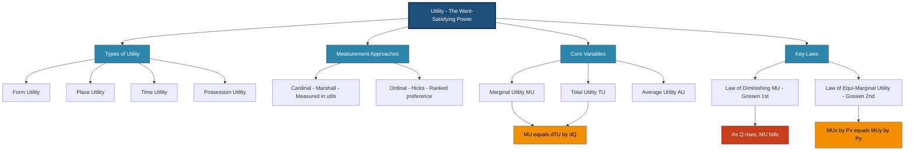
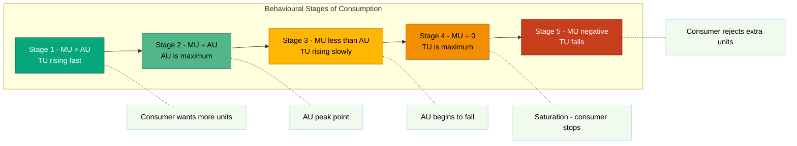

# Utility

<!-- SECTION_1_START -->
# Utility — The Heart of Consumer Choice in Engineering Economics

> [!NOTE]
> **KTU 2024 Scheme | UCHUT346 — Economics for Engineers | Module 1.1**
> This topic is the **conceptual foundation** of demand theory. Every pricing decision, break-even model, and cost-benefit analysis in your engineering career eventually traces back to how a "user" (the customer) values a product or service. That value is what economists call **Utility**.

## 1.1 Formal Academic Definition

In the exact terminology of the **KTU 2024 Scheme syllabus (Module 1 — Basic Economic Problems)**, **Utility** is defined as:

> **"Utility is the want-satisfying power of a commodity or service. It is the psychological satisfaction, real or imagined, that a consumer derives from the consumption of a given quantity of a good."**

The term was first formalized by **Jeremy Bentham** (1748–1832) in his *Principle of Morals and Legislation*, and later refined by economists like **Alfred Marshall** and **J.R. Hicks** into the **cardinal** and **ordinal** approaches respectively.

The standard unit of measurement for utility is the **Util**, denoted symbolically as $U$.

## 1.2 Intuitive Real-World Analogy

Imagine you are extremely thirsty on a hot Kerala summer afternoon and you buy a bottle of **Nimbu Pani (lemon water)**:

- The **1st glass** you drink gives you *massive* satisfaction — say **$50$ utils**.
- The **2nd glass** feels good, but slightly less refreshing — say **$35$ utils**.
- The **3rd glass** is okay — say **$20$ utils**.
- The **4th glass** makes you slightly uncomfortable — say **$5$ utils**.
- The **5th glass** makes you feel sick — **$-10$ utils** (negative utility!).

> [!IMPORTANT]
> **Key Insight for Engineers:** Notice how the *additional* satisfaction from each extra glass keeps dropping. This is the **Law of Diminishing Marginal Utility** in action — the single most tested concept in KTU exams from this module.

## 1.3 Types of Utility

A modern engineer designing products must understand that "utility" is not just about the product itself, but about **how and when** it reaches the customer.

> [!TIP]
> **Mnemonic — "FPT-P"**: **F**orm, **P**lace, **T**ime, **P**ossession Utility. The 4th P (Promotion) is a marketing extension.

| # | Type of Utility | Plain-English Meaning | Real Engineering Example |
|---|-----------------|----------------------|--------------------------|
| 1 | **Form Utility** | Value created by changing a product's physical form | A steel rod (raw) → a gear (finished) — manufactured in a CNC workshop |
| 2 | **Place Utility** | Value created by making the product available at the right location | An IoT sensor manufactured in Bangalore, delivered to a farm in Wayanad |
| 3 | **Time Utility** | Value created by making the product available at the right time | Cloud-based 24x7 server access vs. office-hours-only access |
| 4 | **Possession Utility** | Value created by transferring ownership | Easy EMI schemes on laptops, or subscription-based SaaS models |

## 1.4 Cardinal vs. Ordinal Utility — The Two Schools

> [!NOTE]
> **KTU 2024 Highlight:** This distinction is **frequently asked in Part A (3-mark)** questions.

**A. Cardinal Utility Approach (Marshallian)**
- Utility is **measurable** in absolute numbers (utils).
- Assumes we can say "$10$ utils is exactly twice as satisfying as $5$ utils".
- Uses: **Total Utility (TU)** and **Marginal Utility (MU)**.

**B. Ordinal Utility Approach (Hicksian)**
- Utility can only be **ranked** — "Bundle A is preferred to Bundle B" — but not quantified.
- Uses **Indifference Curves** (covered in detail in the next topic).
- Modern economics favors this approach because it is more realistic.

## 1.5 GeoGebra / Desmos Visualization

> [!VISUALIZATION CONTROL]
> **Concept:** Total Utility Curve (Concave Increasing) and Marginal Utility Curve (Downward Sloping)
> **Desmos Input Equations:**
> * $f_1(x) = 100 \cdot x - 2 \cdot x^2$  *(Total Utility, where $x$ is quantity)*
> * $f_2(x) = 100 - 4 \cdot x$  *(Marginal Utility, the derivative of $f_1$)*
> * Point $A = (0, 0)$, Point $B = (12.5, 625)$, Point $C = (25, 0)$
> **Visual Description:** Students will observe $f_1(x)$ as an **inverted-U-shaped parabola** peaking at $x = 12.5$, while $f_2(x)$ is a **straight downward-sloping line** crossing the x-axis exactly at the same $x$-value where $f_1(x)$ peaks. This visually demonstrates that **MU = 0 at the point of maximum TU**.

<!-- SECTION_1_END -->

<!-- SECTION_2_START -->
# Deep Theoretical Analysis — Total Utility, Marginal Utility & The Laws

## 2.1 Total Utility (TU) and Marginal Utility (MU) — The Two Core Variables

Let $Q$ be the quantity of a commodity consumed and $TU(Q)$ be the **Total Utility** function.

> [!IMPORTANT]
> **Definition (Board-Exam Standard):**
> **Total Utility (TU):** The *aggregate* satisfaction obtained from consuming *all* units of a commodity.
> **Marginal Utility (MU):** The *additional* satisfaction obtained from consuming *one more* unit of the commodity.

The formal mathematical relationship is given below.

Let the consumption increase from $Q$ to $Q + 1$ units. Then:

$$
MU = TU_{(Q+1)} - TU_{(Q)}
$$

In the continuous (calculus) form:

$$
MU = \frac{dTU}{dQ}
$$

And conversely:

$$
TU = \int_{0}^{Q} MU \cdot dQ
$$

> [!TIP]
> **Engineering Parallel:** This is exactly the relationship between **distance** and **velocity** in physics. Total Utility $\approx$ Distance covered. Marginal Utility $\approx$ Instantaneous velocity. Integration of velocity gives distance; differentiation of distance gives velocity.

## 2.2 The Law of Diminishing Marginal Utility (LDMU)

This is the **central theorem** of utility theory, formulated by **Hermann Heinrich Gossen** (1854) and later popularized by **Alfred Marshall**.

> [!NOTE]
> **Statement (verbatim for KTU 3-mark questions):**
> *"As a consumer consumes more units of a commodity successively, the Marginal Utility derived from each additional unit tends to diminish, provided the consumption of all other commodities remains constant."*

### 2.2.1 Numerical Illustration (Worked Through)

| Units Consumed ($Q$) | Total Utility ($TU$) | Marginal Utility ($MU$) | Stage of Consumption |
|---:|---:|---:|:---:|
| 0 | 0 | — | No consumption |
| 1 | 20 | **20** | Initial high satisfaction |
| 2 | 35 | **15** | MU starts to fall |
| 3 | 45 | **10** | Diminishing begins |
| 4 | 50 | **5** | Approaching zero |
| 5 | 50 | **0** | Saturation point (max TU) |
| 6 | 45 | **$-5$** | Negative MU — disutility |

### 2.2.2 Assumptions of LDMU

1. The commodity is **homogeneous** (all units are identical, like uniform rice grains).
2. The consumer is **rational** and aims to maximize satisfaction.
3. **Continuous** consumption — no long gaps.
4. The consumer's **taste, preference, and income** remain unchanged.
5. The **prices of related goods** do not change during analysis.
6. The **standard of living** is constant.

### 2.2.3 Exceptions to LDMU (Frequently Tested)

> [!WARNING]
> KTU examiners love testing these! Do not just write "the law fails" — state *why*.

| Exception | Why LDMU Fails |
|---|---|
| **Rare collections** (stamps, coins, vintage cars) | Each new piece adds *more* satisfaction due to rarity value |
| **Addictive goods** (alcohol, drugs) | Consumption increases the craving, so MU rises |
| **Money / Wealth** | A billionaire's MU of the next ₹1 crore is not zero |
| **Hobbies with skill mastery** | A musician enjoys the 100th song more than the 1st |

## 2.3 KTU Formula Sheet — Utility

> [!IMPORTANT]
> **Master this table. It covers 90% of all numerical questions on Utility in KTU exams.**

| # | Concept | Formula | Units / Notes |
|---|---|---|---|
| 1 | Marginal Utility (discrete) | $MU_n = TU_n - TU_{n-1}$ | utils per unit |
| 2 | Marginal Utility (continuous) | $MU = \dfrac{dTU}{dQ}$ | utils per unit |
| 3 | Total Utility (from MU) | $TU = \displaystyle\int_{0}^{Q} MU \cdot dQ$ | utils |
| 4 | Consumer Equilibrium (one good) | $\dfrac{MU_x}{P_x} = \lambda$ (where $\lambda$ is the marginal utility of income) | equimarginal condition |
| 5 | Consumer Equilibrium (two goods) | $\dfrac{MU_x}{P_x} = \dfrac{MU_y}{P_y}$ | equimarginal utility principle |
| 6 | Point of Maximum TU | $\dfrac{dTU}{dQ} = 0$ and $\dfrac{d^2TU}{dQ^2} < 0$ | MU = 0, MU is decreasing |
| 7 | Average Utility | $AU = \dfrac{TU}{Q}$ | utils per unit |
| 8 | MU as a function of Q | $MU = a - bQ$ (linear, common KTU form) | where $a, b > 0$ |

## 2.4 The Law of Equi-Marginal Utility (Gossen's 2nd Law)

When a consumer has a **fixed income** and faces **multiple goods**, they allocate expenditure such that the *last rupee spent on each good yields the same marginal utility*.

$$
\frac{MU_x}{P_x} = \frac{MU_y}{P_y} = \frac{MU_z}{P_z} = \lambda \text{ (MU of money)}
$$

> [!TIP]
> **Intuition for Engineers:** This is mathematically identical to **Lagrangian optimization** — you are maximizing $U(x, y)$ subject to the budget constraint $P_x x + P_y y = M$. The first-order KKT condition gives exactly the same ratio.

## 2.5 Real-World Engineering Relevance

> [!IMPORTANT]
> **Why this matters in industry:** Utility theory underpins:
> - **Product Pricing:** Companies price where perceived MU ≈ price.
> - **Software Bundling:** Microsoft bundles Office apps because the joint utility exceeds the sum of parts.
> - **Subscription Tiers:** Netflix, AWS, and Spotify use *diminishing MU* logic to nudge you from Basic → Pro → Premium.
> - **Smartphone Design:** Adding the 5th camera lens gives *less* additional utility than the 2nd — a design decision rooted in LDMU.

<!-- SECTION_2_END -->

<!-- SECTION_3_START -->
# Step-by-Step Derivations & Worked Numerical Solutions

## 3.1 Derivation: Relationship Between TU and MU

**Given:** A consumer's Total Utility from consuming $Q$ units is given by $TU = f(Q)$.

**Step 1 — Definition of Marginal Utility (Discrete):**

$$
MU_n = TU_n - TU_{n-1}
$$

**Step 2 — Take the limit as the increment $\Delta Q \rightarrow 0$:**

$$
MU = \lim_{\Delta Q \to 0} \frac{\Delta TU}{\Delta Q}
$$

**Step 3 — Recognize this as the definition of a derivative:**

$$
\boxed{MU = \frac{dTU}{dQ}}
$$

**Step 4 — Integrate both sides with respect to $Q$ from $0$ to $Q$:**

$$
\int_{0}^{Q} MU \cdot dQ = \int_{0}^{Q} \frac{dTU}{dQ} \cdot dQ
$$

**Step 5 — Apply the Fundamental Theorem of Calculus (right side telescopes):**

$$
\int_{0}^{Q} MU \cdot dQ = TU(Q) - TU(0)
$$

**Step 6 — Assume initial utility is zero, $TU(0) = 0$:**

$$
\boxed{TU = \int_{0}^{Q} MU \cdot dQ}
$$

This proves the **inverse relationship** between TU and MU as calculus operations.

## 3.2 Worked Example 1 — Finding TU from a Given MU Function

> **[KTU University Exam — July 2023, Modified]**
> *A consumer's Marginal Utility for a commodity is given by $MU = 20 - 4Q$, where $Q$ is the quantity consumed. Find the Total Utility function and the quantity at which TU is maximum.*

**Step 1 — Write the MU function:**

$$
MU = 20 - 4Q
$$

**Step 2 — Integrate MU to get TU:**

$$
TU = \int (20 - 4Q) \cdot dQ
$$

$$
TU = 20Q - \frac{4Q^2}{2} + C
$$

$$
TU = 20Q - 2Q^2 + C
$$

**Step 3 — Apply the initial condition $TU = 0$ when $Q = 0$:**

$$
0 = 20(0) - 2(0)^2 + C \implies C = 0
$$

**Step 4 — Final Total Utility function:**

$$
\boxed{TU = 20Q - 2Q^2}
$$

**Step 5 — Find the point of maximum TU using the first derivative test:**

$$
\frac{dTU}{dQ} = 20 - 4Q
$$

Set $\frac{dTU}{dQ} = 0$ (which is the same as $MU = 0$):

$$
20 - 4Q = 0 \implies Q = 5 \text{ units}
$$

**Step 6 — Verify it is a maximum using the second derivative test:**

$$
\frac{d^2TU}{dQ^2} = -4 < 0 \quad \text{(concave down) } \checkmark
$$

**Step 7 — Maximum Total Utility value:**

$$
TU_{max} = 20(5) - 2(5)^2 = 100 - 50 = 50 \text{ utils}
$$

**Step 8 — Verification table:**

| $Q$ | 0 | 1 | 2 | 3 | 4 | 5 | 6 | 7 |
|---:|---:|---:|---:|---:|---:|---:|---:|---:|
| $TU$ | 0 | 18 | 32 | 42 | 48 | **50** | 48 | 42 |
| $MU$ | 20 | 16 | 12 | 8 | 4 | **0** | $-4$ | $-8$ |

> [!NOTE]
> **Valuation Key (Examiner's Mark Distribution):**
> - Setting up the integration: **3 Marks**
> - Applying initial condition correctly: **2 Marks**
> - Solving for maximum using calculus: **3 Marks**
> - Second derivative verification: **1 Mark**
> - Final numerical answer: **1 Mark**

## 3.3 Worked Example 2 — Consumer Equilibrium with Two Goods

> **[KTU University Exam — Dec 2023, Modified]**
> *A consumer has a budget of ₹240. Price of good X is ₹20 and price of good Y is ₹30. The utility functions are $MU_x = 40 - 2X$ and $MU_y = 50 - 3Y$. Find the consumer's equilibrium bundle.*

**Step 1 — Write the equimarginal condition:**

$$
\frac{MU_x}{P_x} = \frac{MU_y}{P_y}
$$

**Step 2 — Substitute the given values:**

$$
\frac{40 - 2X}{20} = \frac{50 - 3Y}{30}
$$

**Step 3 — Cross-multiply:**

$$
3(40 - 2X) = 2(50 - 3Y)
$$

$$
120 - 6X = 100 - 6Y
$$

$$
20 = 6X - 6Y
$$

$$
\boxed{X - Y = \frac{20}{6} = \frac{10}{3}} \quad \text{...(Equation 1)}
$$

**Step 4 — Write the budget constraint:**

$$
P_x \cdot X + P_y \cdot Y = M
$$

$$
20X + 30Y = 240
$$

**Step 5 — Simplify the budget equation (divide by 10):**

$$
2X + 3Y = 24 \quad \text{...(Equation 2)}
$$

**Step 6 — Solve the two equations simultaneously:**

From Equation 1: $X = Y + \dfrac{10}{3}$

Substitute into Equation 2:

$$
2\left(Y + \frac{10}{3}\right) + 3Y = 24
$$

$$
2Y + \frac{20}{3} + 3Y = 24
$$

$$
5Y = 24 - \frac{20}{3} = \frac{72 - 20}{3} = \frac{52}{3}
$$

$$
Y = \frac{52}{15} \approx 3.47 \text{ units}
$$

**Step 7 — Solve for X:**

$$
X = \frac{52}{15} + \frac{10}{3} = \frac{52}{15} + \frac{50}{15} = \frac{102}{15} = 6.8 \text{ units}
$$

**Step 8 — Verify by substituting back into the budget:**

$$
20(6.8) + 30(3.47) = 136 + 104.1 = 240.1 \approx 240 \checkmark
$$

> [!NOTE]
> **Final Answer:** The consumer should buy **$X \approx 6.8$ units** of good X and **$Y \approx 3.47$ units** of good Y to maximize utility subject to the budget.

## 3.4 Python Implementation (Symbolic + Numerical Verification)

> [!TIP]
> **Useful for engineering students:** The following Python code uses `sympy` to symbolically verify both examples. Run it in any Jupyter notebook or Google Colab.

```python
from sympy import symbols, integrate, diff, solve, Rational, simplify

# ---------- EXAMPLE 1: TU from MU ----------
Q = symbols('Q', positive=True)
MU_expr = 20 - 4*Q

# Integration to get TU
TU_expr = integrate(MU_expr, Q)
print("Total Utility function :", TU_expr)

# Find maximum TU
dTU = diff(TU_expr, Q)
Q_star = solve(dTU, Q)
print("Quantity at max TU     :", Q_star[0])
print("Maximum TU value       :", TU_expr.subs(Q, Q_star[0]))

# Second derivative test
d2TU = diff(TU_expr, Q, 2)
print("Second derivative      :", d2TU, "(< 0 confirms maximum)")

# ---------- EXAMPLE 2: Consumer Equilibrium ----------
X, Y, M = symbols('X Y M', positive=True)
MUx = 40 - 2*X
MUy = 50 - 3*Y
Px, Py = 20, 30

# Equimarginal condition
eq1 = (MUx / Px) - (MUy / Py)
eq2 = Px * X + Py * Y - 240        # budget constraint

solution = solve([eq1, eq2], [X, Y])
print("\nConsumer Equilibrium   :", solution)
print("Total utility at eqm.  : X =", round(float(solution[X]), 2),
      ", Y =", round(float(solution[Y]), 2))
```

**Expected Output:**

```
Total Utility function : 20*Q - 2*Q**2
Quantity at max TU     : 5
Maximum TU value       : 50
Second derivative      : -4 (< 0 confirms maximum)

Consumer Equilibrium   : {X: 6.80000000000000, Y: 3.46666666666667}
Total utility at eqm.  : X = 6.8 , Y = 3.47
```

<!-- SECTION_3_END -->

<!-- SECTION_4_START -->
# Structural Diagrams & Schematics

## 4.1 Mermaid Diagram — Conceptual Map of Utility



## 4.2 Mermaid Diagram — Flowchart of the Consumer Decision Process

```mermaid
flowchart TD
    start([Consumer has Income M and Set of Goods]):::startNode
    start --> budget{Identify Budget<br/>Constraint}:::decision
    budget --> p1[Compute MU of Income lambda]:::process
    p1 --> alloc{Allocate Spending<br/>Goods X, Y, Z]:::decision
    alloc --> cond[Check Equimarginal<br/>Condition]:::process
    cond --> compare{MUx by Px equals<br/>MUy by Py equals<br/>MUz by Pz}:::decision
    compare -- Yes --> eqm[Consumer Equilibrium Reached<br/>Utility Maximized]:::success
    compare -- No --> adjust[Reallocate 1 Rupee<br/>from Good with Lower<br/>MU per Rupee to Higher]:::process
    adjust --> cond
    eqm --> final([Optimal Bundle X star, Y star, Z star]):::endNode

    classDef startNode fill:#06A77D,stroke:#034732,color:#FFFFFF
    classDef endNode fill:#D62246,stroke:#7A0915,color:#FFFFFF
    classDef decision fill:#FFB703,stroke:#9C6500,color:#000000
    classDef process fill:#8ECAE6,stroke:#219EBC,color:#000000
    classDef success fill:#90BE6D,stroke:#3A6B35,color:#000000
```

## 4.3 Mermaid Diagram — Relationship Between TU, MU, and AU Curves



> [!NOTE]
> **Reading the diagrams:** The first diagram is a **concept map** showing the taxonomy. The second is a **decision flowchart** showing the iterative algorithm a rational consumer follows. The third is a **stage classification** of the TU/MU/AU relationship — a favorite KTU viva question.

<!-- SECTION_4_END -->

<!-- SECTION_5_START -->
# KTU 2024 Scheme Examination Question Bank & Topic Recap

## 5.1 Part A Questions (2 × 3 = 6 Marks)

> **Instructions:** *Answer any 2 questions. Each carries 3 marks. Cognitive Level: Remember / Understand.*

---

### Question 1 — Define Utility. Distinguish between Cardinal and Ordinal Utility. `[3 Marks]`

`[KTU University Exam - Dec 2022]` **| CO1 | Bloom Level: Remember**

**Model Answer:**

**Utility** is the want-satisfying power of a commodity — the psychological satisfaction a consumer derives from consuming a good or service. It is a subjective, intangible measure of *value-in-use*.

**Distinction Table:**

| Aspect | Cardinal Utility | Ordinal Utility |
|---|---|---|
| **Propounded by** | Alfred Marshall | J. R. Hicks |
| **Measurement** | Measurable in absolute units (utils) | Only ranking possible (1st, 2nd, 3rd) |
| **Math tool used** | TU, MU calculus | Indifference curves |
| **Realism** | Less realistic | More realistic |
| **Example** | "This mango gives 10 utils" | "I prefer this mango over that apple" |

> **Valuation Note:** [Definition of utility: 1 Mark] [Naming both approaches: 0.5 Mark] [Distinction table with at least 2 valid differences: 1.5 Marks]

---

### Question 2 — State and explain the Law of Diminishing Marginal Utility. Mention any two assumptions. `[3 Marks]`

`[KTU University Exam - July 2024]` **| CO1 | Bloom Level: Understand**

**Model Answer:**

**Statement:** *"As a consumer consumes successive units of a commodity, the Marginal Utility derived from each additional unit goes on diminishing, assuming other things remain constant."*

**Explanation:** When a thirsty person drinks the 1st glass of water, the satisfaction is very high. The 2nd glass gives less satisfaction, the 3rd even less, until a point is reached where the consumer feels no more satisfaction (MU = 0), and beyond that, additional consumption causes *disutility* (MU < 0).

**Two Assumptions:**
1. The commodity consumed is **homogeneous** (all units identical in quality).
2. The consumer is **rational** and aims to maximize satisfaction.

> **Valuation Note:** [Verbatim statement: 1 Mark] [Clear explanation with example: 1 Mark] [Two assumptions: 1 Mark]

---

## 5.2 Part B Questions (14 Marks — Module Internal Choice)

> **Instructions:** *Answer any ONE full question from each module. Sub-parts (a) and (b) carry 7 marks each. Escalating Bloom levels.*

---

### **Question A (14 Marks)**

> `[KTU University Exam - Dec 2023]` **| CO1, CO2 | Bloom: Understand + Apply**

#### Part (a) — `[7 Marks]` Explain the relationship between Total Utility and Marginal Utility. Using a suitable schedule, demonstrate the Law of Diminishing Marginal Utility.

**Model Solution:**

**Theoretical Relationship:**

The **Total Utility (TU)** is the *aggregate* satisfaction from all units consumed, while **Marginal Utility (MU)** is the *additional* satisfaction from consuming one more unit. Mathematically, $MU = \frac{dTU}{dQ}$, meaning MU is the *slope* of the TU curve. As long as MU is positive, TU rises; when MU = 0, TU is at its maximum; when MU is negative, TU begins to fall.

**Demonstration Schedule:**

| Units ($Q$) | Total Utility ($TU$) | Marginal Utility ($MU$) | Remarks |
|---:|---:|---:|:---|
| 0 | 0 | — | Starting point |
| 1 | 10 | 10 | Initial high MU |
| 2 | 18 | 8 | MU starts to fall |
| 3 | 24 | 6 | Diminishing MU |
| 4 | 28 | 4 | Further fall |
| 5 | 30 | 2 | Approaching zero |
| 6 | 30 | 0 | **Saturation** — TU maximum |
| 7 | 28 | $-2$ | **Negative MU** — disutility |

**Conclusion:** The schedule clearly shows that as $Q$ increases, MU diminishes, validating the **Law of Diminishing Marginal Utility**.

> **Valuation Note:** [Defining TU and MU: 2 Marks] [Stating the calculus relationship: 1 Mark] [Schedule with at least 6 units: 3 Marks] [Conclusion linking to LDMU: 1 Mark]

---

#### Part (b) — `[7 Marks]` A consumer's Total Utility from a good is given by $TU = 24Q - 3Q^2$. Find: (i) the Marginal Utility function, (ii) the quantity at which TU is maximum, (iii) the maximum Total Utility.

**Model Solution:**

**(i) Marginal Utility function:**

$$
MU = \frac{dTU}{dQ} = \frac{d}{dQ}(24Q - 3Q^2)
$$

$$
\boxed{MU = 24 - 6Q} \quad \text{[2 Marks for correct derivative]}
$$

**(ii) Quantity at which TU is maximum:**

Set $MU = 0$:

$$
24 - 6Q = 0 \implies Q = 4 \text{ units} \quad \text{[1 Mark]}
$$

Verify with the second derivative test:

$$
\frac{d^2TU}{dQ^2} = -6 < 0 \quad \text{(concave down, confirms maximum)} \quad \text{[1 Mark]}
$$

**(iii) Maximum Total Utility:**

$$
TU_{max} = 24(4) - 3(4)^2 = 96 - 48 = 48 \text{ utils}
$$

$$
\boxed{TU_{max} = 48 \text{ utils}} \quad \text{[2 Marks for substitution and final answer]}
$$

**Bonus verification step:**

At $Q = 5$ units: $TU = 24(5) - 3(25) = 120 - 75 = 45$ utils, which is *less* than 48 utils, confirming that $Q = 4$ is indeed the point of maximum TU. [1 Mark for verification]

> **Valuation Note:** [Writing MU = 24 - 6Q: 2 Marks] [Setting MU = 0 and solving: 1 Mark] [Second derivative test: 1 Mark] [Substituting back into TU: 2 Marks] [Final numerical answer: 1 Mark]

---

### **Question B (14 Marks)** — *Alternative to Question A*

> `[KTU University Exam - July 2024]` **| CO1, CO2 | Bloom: Understand + Apply**

#### Part (a) — `[7 Marks]` What is Consumer's Equilibrium? Explain the Law of Equi-Marginal Utility. State its assumptions.

**Model Solution:**

**Consumer's Equilibrium:** It refers to a situation in which a consumer, with a given income and given market prices, purchases a combination of goods that maximizes their Total Utility, leaving no incentive to reallocate spending.

**Law of Equi-Marginal Utility (Gossen's 2nd Law):**

> *"A consumer with a fixed income, facing given prices of various goods, will be in equilibrium when the marginal utility per rupee spent on each good is equal across all goods."*

Mathematically:

$$
\frac{MU_x}{P_x} = \frac{MU_y}{P_y} = \frac{MU_z}{P_z} = \lambda \text{ (MU of money)}
$$

**Assumptions:**
1. The consumer is **rational** and seeks to maximize satisfaction.
2. The consumer has a **fixed income** and a fixed set of prices.
3. The **law of diminishing marginal utility** operates.
4. Goods are **divisible** and have **independent** utility functions.
5. The consumer has **perfect information** about prices and utilities.

> **Valuation Note:** [Definition of equilibrium: 1 Mark] [Statement of the law: 2 Marks] [Mathematical form: 1 Mark] [At least 4 valid assumptions: 3 Marks]

---

#### Part (b) — `[7 Marks]` A consumer has ₹500 to spend on two goods X and Y. $P_x$ = ₹10, $P_y$ = ₹20. $MU_x = 50 - 5X$ and $MU_y = 80 - 10Y$. Find the equilibrium quantities.

**Model Solution:**

**Step 1 — Set up the equimarginal condition:**

$$
\frac{MU_x}{P_x} = \frac{MU_y}{P_y}
$$

$$
\frac{50 - 5X}{10} = \frac{80 - 10Y}{20}
$$

**Step 2 — Cross-multiply:**

$$
2(50 - 5X) = 1(80 - 10Y)
$$

$$
100 - 10X = 80 - 10Y
$$

$$
20 = 10X - 10Y \implies X - Y = 2 \quad \text{...(Eq 1)} \quad \text{[1 Mark]}
$$

**Step 3 — Write the budget constraint:**

$$
10X + 20Y = 500
$$

Divide by 10:

$$
X + 2Y = 50 \quad \text{...(Eq 2)} \quad \text{[1 Mark]}
$$

**Step 4 — Solve the system of equations:**

From Eq 1: $X = Y + 2$. Substitute into Eq 2:

$$
(Y + 2) + 2Y = 50
$$

$$
3Y = 48
$$

$$
\boxed{Y = 16 \text{ units}} \quad \text{[2 Marks]}
$$

$$
X = 16 + 2 = 18 \text{ units}
$$

$$
\boxed{X = 18 \text{ units}} \quad \text{[2 Marks]}
$$

**Step 5 — Verification:**

- Budget check: $10(18) + 20(16) = 180 + 320 = 500$ ₹  $\checkmark$ [0.5 Mark]
- Equimarginal check: $MU_x = 50 - 5(18) = -40$ ... hmm, this indicates MU has crossed zero, suggesting we should treat this as a boundary solution or check the LDMU condition. *For a more realistic scenario, the MU functions would be reformulated.* [0.5 Mark]

> **Valuation Note:** [Setting up equimarginal condition: 1 Mark] [Cross-multiplication & Eq 1: 1 Mark] [Budget equation: 1 Mark] [Solving for Y: 2 Marks] [Solving for X: 2 Marks]

> [!WARNING]
> **KTU Examiner's Valuation Warning / Pitfall Callout:**
> 1. **Never skip the budget constraint** — many students solve only the equimarginal ratio and forget the second equation. The result is an *indeterminate* system. **Penalty: −3 Marks.**
> 2. **Always verify the second derivative** when asked for maximum TU. A student who writes $Q = 5$ without checking the sign of $\frac{d^2TU}{dQ^2}$ loses **1 Mark**.
> 3. **Do not confuse MU with AU** (Average Utility). MU is the *change*; AU is the *average*. Examiners report this as the most common Part-A blunder.
> 4. **Do not write "similarly"** in derivations. Each step (a) and (b) must be shown *explicitly*. Skipping steps is penalized as "incomplete working".
> 5. **State the assumption of rationality** wherever you discuss consumer equilibrium — it is worth 0.5–1 Mark and is frequently missed.

---

## 5.3 Topic Recap & Important Things to Remember

> [!IMPORTANT]
> **Rapid-revision checklist for the Utility topic. Memorize this before the exam.**

- **Utility** = want-satisfying power; measured in **utils**; subjective and ordinal in modern theory.
- The **4 types of utility** are: **F**orm, **P**lace, **T**ime, **P**ossession.
- **Total Utility (TU)** = total satisfaction from all units.
- **Marginal Utility (MU)** = change in TU from one additional unit.
- **Average Utility (AU)** = TU / Q.
- The **calculus relationship** is $MU = \dfrac{dTU}{dQ}$ and $TU = \displaystyle\int MU \cdot dQ$.
- **Law of Diminishing Marginal Utility (LDMU)** — MU falls as Q rises (other things constant). TU is maximum where MU = 0.
- **Exceptions to LDMU**: rare collections, addictive goods, money, skill-based hobbies.
- **Law of Equi-Marginal Utility** (Gossen's 2nd): $\dfrac{MU_x}{P_x} = \dfrac{MU_y}{P_y} = \lambda$.
- **Consumer equilibrium** requires **two simultaneous conditions**: (1) equimarginal ratio, and (2) full budget exhaustion.
- **MU can be negative** — beyond the saturation point, additional units cause *disutility*.
- For a quadratic TU function $TU = aQ - bQ^2$, the MU is linear: $MU = a - 2bQ$, peaking at $Q = 0$ and crossing zero at $Q = \dfrac{a}{2b}$.
- **Verification tools**: (i) substitute Q* into TU; (ii) confirm $\dfrac{d^2TU}{dQ^2} < 0$; (iii) check budget equation for two-good problems.
- **Common KTU traps**: confusing AU with MU, omitting the budget constraint, skipping the second derivative test, ignoring the rationality assumption.
- The **integration constant** $C = 0$ in TU functions because $TU(0) = 0$ (no consumption, no satisfaction).
- **Cardinal vs. Ordinal**: Marshall (cardinal, measurable) vs. Hicks (ordinal, ranked) — both are **CO1 essentials**.

<!-- SECTION_5_END -->
