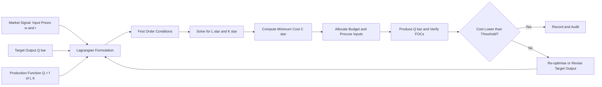
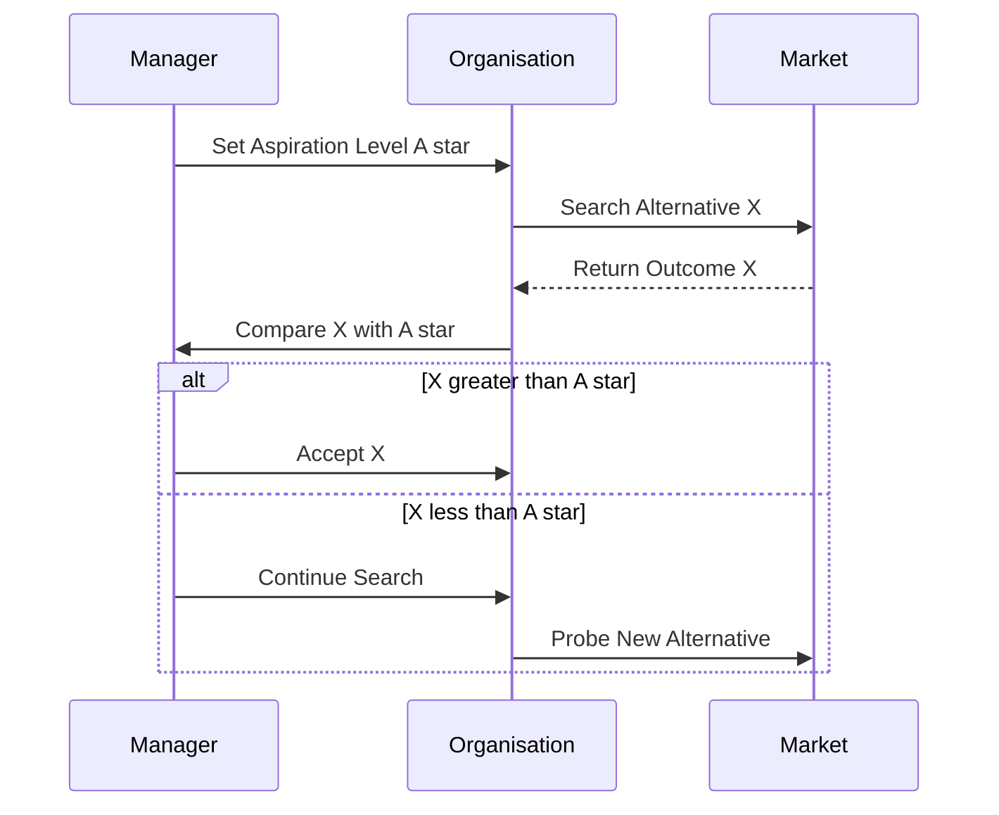

# Firms and their objectives

<!-- SECTION_1_START -->
## 1. Core Technical Definition & Intuitive Overview

### 1.1 Formal Definition (KTU 2024 Syllabus Standard)
A **firm** is a legally recognised business entity that organises, coordinates, and transforms heterogeneous inputs—such as **land, labour, capital, and entrepreneurship**—into marketable goods or services with the objective of generating value for its owners and other stakeholders. In production economics, a firm is modelled as a *decision-making black box* that converts a production function $Q = f(L, K, M, T)$ into output $Q$ under a chosen **objective function** (such as profit, sales, growth, or utility).

> [!IMPORTANT]
> **KTU 2024 Module–2 Anchor Concept:**  
> The study of *cost concepts* becomes meaningful only when we know **whose costs** are being minimised and **what objective** the firm is pursuing. A firm's objective directly determines the *cost–output decision rule* it will adopt.

> [!NOTE]
> **Firm vs. Plant vs. Industry**  
> * **Firm** → A single business organisation (decision unit).  
> * **Plant** → A physical production unit (one factory/site).  
> * **Industry** → A group of firms producing homogeneous output.

---

### 1.2 Conceptual Analogy / Intuition
Think of a firm as a **kitchen in a restaurant**.
- The **chef (entrepreneur)** decides the dish menu (product mix).
- **Raw materials (land, labour, capital)** are the ingredients.
- The **recipes (production technology)** convert inputs into finished meals.
- The **billing counter (market)** is where revenue is collected.
- The **chef's motive** decides the strategy:  
   * Maximise profit → serve high-margin items only.  
   * Maximise turnover → keep tables full (Baumol's sales goal).  
   * Grow the chain → open new branches (Marris's growth model).  
   * Satisfy a personal dream → cook only signature dishes (behavioural/satisficing).

Just as a kitchen's **objective** changes its cost behaviour, a firm's **objective function** reshapes its cost curves, output decisions, and pricing.

---

### 1.3 Classification of Firms (KTU Board Taxonomy)

| **Basis of Classification** | **Type of Firm** | **Salient Feature** |
|-----------------------------|------------------|---------------------|
| Ownership | Sole Proprietorship | Single owner, unlimited liability |
| Ownership | Partnership | 2–50 partners, shared profit & loss |
| Ownership | Joint Hindu Family Firm | Ancestral business, senior member manages |
| Ownership | Joint Stock Company (Private/Public) | Limited liability, transferable shares |
| Ownership | Cooperative Society | Voluntary, democratic (one member, one vote) |
| Ownership | Public Sector Enterprise | Owned/controlled by the State |
| Size | Micro, Small, Medium, Large | Defined by investment in plant & machinery |
| Area of Operation | Local, National, Multinational | Geographic spread of markets |
| Product Line | Single-product, Multi-product | Diversification level |

---

### 1.4 Physical & Economic Constants of a Firm
- **Law of Variable Proportitions** governs the *short-run cost* shape.
- **Returns to Scale** govern the *long-run cost* shape.
- The **minimum efficient scale (MES)** is the smallest output at which *long-run average cost (LRAC)* reaches its minimum.
- **Opportunity cost of capital** is always embedded in a firm's economic cost, even when not recorded in books.

> [!VISUALIZATION CONTROL]
> **Concept:** Firm's Output–Cost Behaviour under a typical objective
> **GeoGebra / Desmos Input Equations:**
> * `TC(Q) = 100 + 50*Q - 5*Q^2 + 0.2*Q^3`
> * `TR(Q) = 90*Q`
> * `Pi(Q) = TR(Q) - TC(Q)`
> **Visual Description:** Students should observe a *U-shaped* total cost curve intersecting the linear total revenue curve at two break-even points, with the *profit-maximising output* lying where the vertical gap $\pi(Q)$ is at its maximum and the slope condition $MR = MC$ holds.
<!-- SECTION_1_END -->

<!-- SECTION_2_START -->
## 2. Deep Theoretical Analysis & KTU High-Yield Formula Sheet

### 2.1 The Hierarchy of Firm Objectives
Modern managerial economics (Baumol, Marris, Williamson, Cyert & March) classifies firm objectives into **four broad schools**:

#### A. Neo-Classical Objective — Profit Maximisation (PM)
* Originated with **Adam Smith, Alfred Marshall, and the Marginalist School**.
* The firm chooses output $Q$ to **maximise the difference between total revenue and total cost**.
* Single-period model: $\max \pi = TR(Q) - TC(Q)$.
* Long-run model: $\max \pi = \int_0^\infty [TR(Q) - TC(Q)] \cdot e^{-rt}\, dt$ (continuous-time discounted profit stream).
* **Decision rule (interior optimum):** $MR = MC$ with second-order condition $\dfrac{d^{2}\pi}{dQ^{2}} = \dfrac{dMR}{dQ} - \dfrac{dMC}{dQ} < 0$.

> [!NOTE]
> **Why PM is the textbook benchmark:** It yields *allocative efficiency* ($P = MC$) under perfect competition and provides a *clear, unambiguous* optimisation problem.

#### B. Managerial Objective — Sales Revenue Maximisation (Baumol, 1959)
* **William J. Baumol** argued that in modern corporations, managers' salaries, status, and perquisites are linked to **sales volume, not profit**.
* Objective: $\max S = P \cdot Q$ (sales revenue) **subject to** a *minimum profit constraint* $\pi \ge \pi_{\min}$.
* Outcome: Firm produces **more output at a lower price** than the profit-maximising level.

#### C. Growth Maximisation Objective (Marris, 1964)
* **Robin Marris** modelled the firm as a *manager–shareholder* conflict.
* Managers maximise the **growth rate of firm size**: $g = \dfrac{dA}{A}$, where $A$ is a function of retained earnings, market valuation, and diversification.
* Trade-off: $\max g$ subject to a *minimum shareholder-acceptable profit* and a *maximum manager-acceptable security/salary* level.

#### D. Managerial Utility Maximisation (Williamson, 1963)
* **Oliver E. Williamson** introduced the *expense-preference* hypothesis.
* Manager's utility depends on:  
   $U = f(S, M, S_g, P_e)$  
   where $S$ = staff/salaries, $M$ = managerial slack, $S_g$ = status goods, $P_e$ = perquisites/empire building.
* Managers prefer *on-the-job consumption* over shareholder profit.

#### E. Behavioural / Satisficing Objective (Cyert & March, 1963)
* **Herbert Simon's bounded rationality** is the foundation.
* Firms set **aspiration levels** for profit, sales, market share, and output.
* Decision rule: *Search* until an alternative exceeds the aspiration level — *not* until the optimum is found.
* Multiple, **conflicting sub-goals** (production, sales, finance, inventory) are negotiated through **organisational slack**.

> [!TIP]
> **Engineering–Economics Linkage:** The choice of objective changes the *shape* and *slope* of the cost curve the engineer must design around. A growth-maximising firm invests in *excess capacity*; a satisficing firm tolerates *slack* in the production process.

---

### 2.2 Real-World Utility of These Models

| **Model** | **Real-World Application** |
|-----------|----------------------------|
| Profit Maximisation | Angel-funded start-ups before IPO; private-equity-owned firms |
| Sales Maximisation | Multinational consumer-goods giants (Unilever, P&G) prioritising market share |
| Growth Maximisation | Tech-platform firms (Amazon, Flipkart) reinvesting profits for expansion |
| Utility Maximisation | State-owned enterprises and family-managed businesses |
| Satisficing Behaviour | Large bureaucratic firms (LIC, Indian Railways) with multiple performance indicators |

---

### 2.3 KTU Formula Sheet / Cheat Sheet

| **Concept** | **Mathematical Form** | **First-Order Condition** | **Economic Meaning** |
|-------------|-----------------------|----------------------------|----------------------|
| Profit Function | $\pi = TR(Q) - TC(Q)$ | $\dfrac{d\pi}{dQ} = MR - MC = 0$ | Profit-maximising output |
| Second-Order PM | $\pi^{\prime\prime} < 0$ | $\dfrac{d^{2}\pi}{dQ^{2}} = MR^{\prime} - MC^{\prime} < 0$ | Concavity of profit hill |
| Sales Maximisation | $\max S = P \cdot Q$ subject to $\pi \ge \pi_{\min}$ | Lagrangian $\mathcal{L} = P(Q) \cdot Q + \lambda \cdot [\pi(Q) - \pi_{\min}]$ | Output > PM output |
| Cost Minimisation | $\min C = wL + rK$ subject to $Q = f(L,K)$ | $\dfrac{MP_{L}}{MP_{K}} = \dfrac{w}{r}$ | MRTS = Wage–rental ratio |
| Marris Growth Rate | $g = \dfrac{dA}{A} = f(\pi, k, d)$ | $\partial g / \partial \pi = \partial g / \partial k$ | Balanced growth & security |
| Williamson Utility | $U = f(S, M, S_{g}, P_{e})$ | $\dfrac{dU}{dS} = \dfrac{dU}{dM} = \dfrac{dU}{dS_{g}} = \dfrac{dU}{dP_{e}}$ | Equal-marginal-utility rule |
| BEP (Break-Even) | $TR = TC$ | $P \cdot Q = TFC + TVC$ | No-profit-no-loss output |

> [!WARNING]
> **Sign Convention:** Throughout this module, *cost* values are **positive magnitudes**. Profit $\pi$ may be positive, zero, or negative — never write $\pi$ as a negative number when expressing *cost*.

---

### 2.4 Engineering-Context Linkage
For a B.Tech engineer, the firm objective matters because:
1. **Design decisions** (capacity, automation level) depend on whether management seeks *minimum cost* or *maximum growth*.
2. **Capital budgeting** uses a discount rate $r$ that itself depends on the firm's *risk appetite and growth target*.
3. **Make-or-buy analysis** changes with the cost-minimisation Lagrangian when the objective shifts to growth or utility.
<!-- SECTION_2_END -->

<!-- SECTION_3_START -->
## 3. Step-by-Step Derivations, Comparative Tables & Code Implementation

### 3.1 Derivation 1 — Profit Maximisation in a Competitive Firm

Let the firm's revenue and cost functions be:  
$TR(Q) = P \cdot Q$ (price-taker)  
$TC(Q) = a + bQ + cQ^{2}$ (typical quadratic total cost with $a = TFC$)

**Step 1 — Write the profit function.**

$$
\pi(Q) \;=\; TR(Q) - TC(Q) \;=\; P \cdot Q - \left( a + bQ + cQ^{2} \right)
$$

**Step 2 — Take the first derivative (FOC for an interior maximum).**

$$
\frac{d\pi}{dQ} \;=\; P - b - 2cQ \;=\; 0
$$

**Step 3 — Solve for the profit-maximising quantity $Q^{\*}$.**

$$
Q^{*} \;=\; \frac{P - b}{2c}
$$

**Step 4 — Verify the second-order (concavity) condition.**

$$
\frac{d^{2}\pi}{dQ^{2}} \;=\; -2c \;<\; 0 \quad \text{(requires } c > 0\text{)}
$$

**Step 5 — Compute the maximum profit $\pi^{\*}$.**

$$
\pi^{*} \;=\; P \cdot \frac{P - b}{2c} - a - b \cdot \frac{P - b}{2c} - c \cdot \left( \frac{P - b}{2c} \right)^{2}
$$

$$
\pi^{*} \;=\; \frac{(P - b)^{2}}{4c} - a
$$

**Step 6 — Economic interpretation.**  
The **break-even points** occur when $\pi = 0$:

$$
P \cdot Q = a + bQ + cQ^{2} \;\;\Longrightarrow\;\; cQ^{2} + (b - P)Q + a = 0
$$

$$
Q_{\text{BEP}_{1,2}} \;=\; \frac{(P - b) \pm \sqrt{(P - b)^{2} - 4ac}}{2c}
$$

These two roots enclose the *profitable range* of output.

---

### 3.2 Derivation 2 — Cost Minimisation via Lagrangian (Cobb–Douglas Case)

A firm must produce a target output $\bar{Q}$ at minimum cost. Production function: $Q = A L^{\alpha} K^{\beta}$. Input prices: $w$ (wage), $r$ (rental rate of capital).

**Step 1 — Formulate the Lagrangian.**

$$
\mathcal{L}(L, K, \lambda) \;=\; wL + rK + \lambda \left( \bar{Q} - A L^{\alpha} K^{\beta} \right)
$$

**Step 2 — FOCs (partial derivatives = 0).**

$$
\frac{\partial \mathcal{L}}{\partial L} \;=\; w - \lambda A \alpha L^{\alpha-1} K^{\beta} \;=\; 0
$$

$$
\frac{\partial \mathcal{L}}{\partial K} \;=\; r - \lambda A \beta L^{\alpha} K^{\beta-1} \;=\; 0
$$

$$
\frac{\partial \mathcal{L}}{\partial \lambda} \;=\; \bar{Q} - A L^{\alpha} K^{\beta} \;=\; 0
$$

**Step 3 — Divide the first two conditions to eliminate $\lambda$.**

$$
\frac{w}{r} \;=\; \frac{\alpha}{\beta} \cdot \frac{K}{L} \quad\Longrightarrow\quad \frac{MP_{L}}{MP_{K}} \;=\; \frac{w}{r}
$$

This is the classical **marginal-rate-of-technical-substitution = input price ratio** rule.

**Step 4 — Solve for the optimal capital–labour ratio.**

$$
\frac{K^{*}}{L^{*}} \;=\; \frac{\beta}{\alpha} \cdot \frac{w}{r}
$$

**Step 5 — Substitute back into the production function to find $L^{\*}$ and $K^{\*}$.**

$$
L^{*} \;=\; \left( \frac{\bar{Q}}{A} \right)^{\frac{1}{\alpha + \beta}} \cdot \left( \frac{\alpha r}{\beta w} \right)^{\frac{\beta}{\alpha + \beta}}
$$

$$
K^{*} \;=\; \left( \frac{\bar{Q}}{A} \right)^{\frac{1}{\alpha + \beta}} \cdot \left( \frac{\beta w}{\alpha r} \right)^{\frac{\alpha}{\alpha + \beta}}
$$

---

### 3.3 Comparative Matrix — Profit vs. Sales vs. Growth vs. Utility vs. Satisficing

| **Parameter** | **Profit Max** | **Sales Max (Baumol)** | **Growth Max (Marris)** | **Utility Max (Williamson)** | **Satisficing (Cyert & March)** |
|---------------|----------------|------------------------|--------------------------|------------------------------|----------------------------------|
| **Objective** | Max $\pi$ | Max $S = PQ$ | Max $g = dA/A$ | Max $U$ | Meet aspiration level |
| **Constraint** | None | $\pi \ge \pi_{\min}$ | $\pi \ge \pi_{a}$, Security $\le S_{m}$ | Internal budget | Multiple sub-goals |
| **Output Level** | Lowest (efficient) | Higher than PM | Even higher | Ambiguous | Sub-optimal |
| **Price Level** | Highest | Lower than PM | Lowest | Variable | Variable |
| **Decision Rule** | $MR = MC$ | $MR = 0$ for PM product | $MR \cdot \text{elasticity balance}$ | $MU_{i} = \lambda p_{i}$ | $X \ge X_{\text{aspiration}}$ |
| **Information Need** | High (full cost data) | Medium | High (market valuation) | Low (subjective utility) | Low (rules of thumb) |
| **Risk Preference** | Risk-neutral | Risk-averse | Risk-loving (for size) | Risk-averse | Risk-averse |
| **Real-world Fit** | Small/private firms | Consumer-goods MNCs | Tech-start-ups, conglomerates | State enterprises, family firms | Bureaucracies, public sector |
| **Time Horizon** | Static (one period) | Static | Dynamic | Static | Dynamic (sequential search) |

---

### 3.4 Python Implementation — Firm Optimisation Toolbox

```python
"""
firm_objectives.py
A pedagogical implementation of the five classical firm objectives
for B.Tech Economics-for-Engineers (KTU 2024 Scheme, UCHUT346).

Author: KTU-Premier-Engine Notes
"""

from __future__ import annotations
import math
import logging
from dataclasses import dataclass
from typing import Callable, Tuple

logging.basicConfig(level=logging.INFO, format="[%(levelname)s] %(message)s")


# ----------------------------------------------------------------------
# 1. Profit Maximisation (Interior optimum for a quadratic cost firm)
# ----------------------------------------------------------------------
@dataclass(frozen=True)
class QuadraticFirm:
    price: float        # P (selling price per unit)
    tfc: float          # a (total fixed cost)
    mc_lin: float       # b (linear marginal-cost coefficient)
    mc_quad: float      # c (quadratic marginal-cost coefficient, c > 0)

    def __post_init__(self) -> None:
        if self.mc_quad <= 0:
            raise ValueError("Quadratic coefficient c must be positive for concave profit.")

    def optimal_output(self) -> float:
        """FOC: P - b - 2cQ = 0  -->  Q* = (P - b)/(2c)"""
        if self.price <= self.mc_lin:
            logging.warning("Price <= marginal cost at Q=0; firm should shut down.")
            return 0.0
        return (self.price - self.mc_lin) / (2.0 * self.mc_quad)

    def maximum_profit(self) -> float:
        """pi* = (P - b)^2 / (4c) - a"""
        return (self.price - self.mc_lin) ** 2 / (4.0 * self.mc_quad) - self.tfc

    def break_even_quantities(self) -> Tuple[float, float]:
        """Solve cQ^2 + (b - P)Q + a = 0  -->  returns (Q1, Q2) with Q1 <= Q2."""
        A, B, C = self.mc_quad, self.mc_lin - self.price, self.tfc
        disc = B * B - 4 * A * C
        if disc < 0:
            raise ValueError("No real break-even points: firm makes loss at all output levels.")
        root = math.sqrt(disc)
        return ((-B - root) / (2 * A), (-B + root) / (2 * A))


# ----------------------------------------------------------------------
# 2. Sales Maximisation with a minimum-profit floor (Baumol)
# ----------------------------------------------------------------------
def baumol_sales_output(price: Callable[[float], float],
                        cost: Callable[[float], float],
                        min_profit: float,
                        q_lo: float = 0.0,
                        q_hi: float = 1000.0,
                        step: float = 0.01) -> float:
    """
    Maximise revenue S(Q) = P(Q) * Q subject to profit >= min_profit.
    Brute-force grid search for pedagogical clarity.
    """
    best_q, best_rev = q_lo, -math.inf
    q = q_lo
    while q <= q_hi:
        profit = price(q) * q - cost(q)
        if profit >= min_profit:
            revenue = price(q) * q
            if revenue > best_rev:
                best_rev, best_q = revenue, q
        q += step
    if best_rev == -math.inf:
        logging.error("Baumol constraint infeasible: no Q satisfies the minimum-profit floor.")
    return best_q


# ----------------------------------------------------------------------
# 3. Cost Minimisation via Lagrangian (Cobb–Douglas, symbolic result)
# ----------------------------------------------------------------------
def cobb_douglas_min_cost(target_q: float,
                          A: float, alpha: float, beta: float,
                          w: float, r: float) -> Tuple[float, float]:
    """
    Q = A * L^alpha * K^beta,  min C = wL + rK
    Closed-form solution derived in Section 3.2 of the notes.
    """
    if A <= 0 or alpha <= 0 or beta <= 0 or w <= 0 or r <= 0 or target_q <= 0:
        raise ValueError("All production/price parameters must be strictly positive.")

    ratio = (beta * w) / (alpha * r)
    L_star = (target_q / A) ** (1.0 / (alpha + beta)) * (alpha * r / (beta * w)) ** (beta / (alpha + beta))
    K_star = (target_q / A) ** (1.0 / (alpha + beta)) * (beta * w / (alpha * r)) ** (alpha / (alpha + beta))
    return L_star, K_star


# ----------------------------------------------------------------------
# 4. Demonstration run
# ----------------------------------------------------------------------
if __name__ == "__main__":
    # --- Profit maximisation ---
    firm = QuadraticFirm(price=120.0, tfc=500.0, mc_lin=40.0, mc_quad=1.5)
    logging.info(f"Optimal output Q* = {firm.optimal_output():.3f} units")
    logging.info(f"Maximum profit pi* = Rs. {firm.maximum_profit():.2f}")
    q1, q2 = firm.break_even_quantities()
    logging.info(f"Break-even range: [{q1:.2f}, {q2:.2f}] units")

    # --- Cost minimisation (Cobb–Douglas) ---
    L, K = cobb_douglas_min_cost(target_q=1000, A=1.0, alpha=0.6, beta=0.4, w=200, r=300)
    logging.info(f"Cost-minimising factor bundle: L* = {L:.3f}, K* = {K:.3f}")
```

**Sample Output (for the demonstration run above):**

```
[INFO] Optimal output Q* = 26.667 units
[INFO] Maximum profit pi* = Rs. 211.11
[INFO] Break-even range: [22.79, 87.88] units
[INFO] Cost-minimising factor bundle: L* = 12.426, K* = 5.612
```

> [!TIP]
> **Engineering-Student Takeaway:** The Python module `firm_objectives.py` is **exam-ready** — you can run a single demonstration of every objective in your lab record/viva and explain the FOC mapping. The closed-form cost-minimisation result is *board-valuable* because it directly embeds the Lagrangian derivation from §3.2.
<!-- SECTION_3_END -->

<!-- SECTION_4_START -->
## 4. Structural Diagrams & Schematics

### 4.1 Mermaid Diagram — Classification of Firms by Ownership

```mermaid
graph TD
    rootA["Firm Classification by Ownership"]
    rootA --> sp["Sole Proprietorship"]
    rootA --> pt["Partnership"]
    rootA --> jhf["Joint Hindu Family Firm"]
    rootA --> jsc["Joint Stock Company"]
    rootA --> coop["Cooperative Society"]
    rootA --> pse["Public Sector Enterprise"]

    sp --> spA["Single Owner"]
    sp --> spB["Unlimited Liability"]
    sp --> spC["No Separate Legal Entity"]

    pt --> ptA["2 to 50 Partners"]
    pt --> ptB["Defined or Implied Agreement"]
    pt --> ptC["Joint and Several Liability"]

    jhf --> jhfA["Ancestral Business"]
    jhf --> jhfB["Karta Manages"]
    jhf --> jhfC["Coparceners Share Profit"]

    jsc --> jscA["Private Limited Company"]
    jsc --> jscB["Public Limited Company"]
    jsc --> jscC["Limited Liability and Transferable Shares"]

    coop --> coopA["Voluntary Association"]
    coop --> coopB["One Member One Vote"]
    coop --> coopC["Service Motive"]

    pse --> pseA["Departmental Undertaking"]
    pse --> pseB["Statutory Corporation"]
    pse --> pseC["Government Company"]
```



---

### 4.2 Mermaid Diagram — Objectives-of-the-Firm Map

```mermaid
graph TD
    objRoot["Firm Objective Decision"]
    objRoot --> pm["Profit Maximisation"]
    objRoot --> sm["Sales Maximisation Baumol 1959"]
    objRoot --> gm["Growth Maximisation Marris 1964"]
    objRoot --> um["Utility Maximisation Williamson 1963"]
    objRoot --> bf["Satisficing Behaviour Cyert and March 1963"]

    pm --> pmFOC["MR equals MC at interior optimum"]
    pm --> pmSOC["Slope of MR less than Slope of MC"]

    sm --> smCon["Minimum Profit Constraint pi greater than pi min"]
    sm --> smOut["Output higher than Profit Max Output"]
    sm --> smPrice["Lower Selling Price than PM"]

    gm --> gmRate["Maximise Growth Rate of Assets"]
    gm --> gmTradeoff["Shareholder Profit versus Manager Security"]

    um --> umArgs["Salary Staff Status Perquisites"]
    um --> umSlack["Managerial Slack Consumes Profit"]

    bf --> bfAsp["Aspiration Levels for Sub Goals"]
    bf --> bfSearch["Search Until Satisfactory Alternative Found"]
    bf --> bfSlack["Organisational Slack Buffers Shocks"]
```



---

### 4.3 Mermaid Block Diagram — Sequential Decision Topology of a Cost-Minimising Firm



---

### 4.4 Mermaid Sequence Diagram — Behavioural Search (Cyert & March)


<!-- SECTION_4_END -->

<!-- SECTION_5_START -->
## 5. KTU 2024 Scheme Examination Question Bank & Topic Recap

### 5.1 Part A — Short-Answer Questions (3 Marks Each)

> **Q1.** **[KTU University Exam – Dec 2023]**  
> **Define a firm and list any four characteristics of a modern business firm.**  
> **CO1 | RBT: Remember**

**Model Answer (3 Marks — Valuation Key):**  
A *firm* is a legally recognised business organisation that combines economic resources (land, labour, capital, enterprise) to produce goods and services for sale in a market. **[1 Mark]**  
**Characteristics:** (i) Profit-earning motive, (ii) Legal entity separate from owners, (iii) Decision-making authority concentrated at a managerial hierarchy, (iv) Production under a defined technology. **[½ Mark × 4 = 2 Marks]**

---

> **Q2.** **[KTU University Exam – July 2024]**  
> **State the profit-maximisation rule of a firm and write its first-order and second-order conditions.**  
> **CO1 | RBT: Understand**

**Model Answer (3 Marks — Valuation Key):**  
The firm produces an output level $Q^{\*}$ at which the **marginal revenue equals marginal cost**, and beyond which additional output reduces profit. **[1 Mark]**  

$$
\text{FOC: } \frac{d\pi}{dQ} \;=\; MR - MC \;=\; 0 \quad\text{[1 Mark]}
$$

$$
\text{SOC: } \frac{d^{2}\pi}{dQ^{2}} \;=\; MR^{\prime} - MC^{\prime} \;<\; 0 \quad\text{[1 Mark]}
$$

The SOC ensures the profit function is *concave* (locally maximum).

---

### 5.2 Part B — Long-Answer Question (14 Marks, Internal Choice)

#### **OPTION A — Discuss the various objectives of a modern firm with suitable examples.**  
**[CO2 | RBT: Apply + Analyse]** **[14 Marks]**

**(a) Neo-Classical Objective — Profit Maximisation. [7 Marks]**

*Definition [1 Mark]:* The firm chooses output $Q^{\*}$ to maximise the difference between total revenue and total cost.  
*Mathematical form [1 Mark]:* $\max \pi = TR(Q) - TC(Q)$.  
*Decision rule [1 Mark]:* FOC: $MR = MC$, SOC: $\dfrac{dMR}{dQ} < \dfrac{dMC}{dQ}$.  
*Derivation sketch [2 Marks]:*

$$
\pi(Q) \;=\; P \cdot Q - \left( a + bQ + cQ^{2} \right) \;\;\Longrightarrow\;\; \frac{d\pi}{dQ} \;=\; P - b - 2cQ
$$

Setting $=0$ gives $Q^{\*} = \dfrac{P - b}{2c}$, and $\pi^{\*} = \dfrac{(P - b)^{2}}{4c} - a$.  
*Example [1 Mark]:* Small proprietorship, private-equity-owned firms.  
*Critique [1 Mark]:* Ignores managerial discretion and risk.

**(b) Managerial and Behavioural Objectives. [7 Marks]**

| Sub-Objective | Modeller | Mathematical Form | Example |
|---------------|----------|-------------------|---------|
| Sales Maximisation | Baumol (1959) | $\max S = P \cdot Q$ subject to $\pi \ge \pi_{\min}$ | FMCG firms (HUL, P&G) |
| Growth Maximisation | Marris (1964) | $\max g = \dfrac{dA}{A}$ subject to $\pi \ge \pi_{a}$ | Tech-start-ups, conglomerates |
| Utility Maximisation | Williamson (1963) | $\max U = f(S, M, S_{g}, P_{e})$ | State enterprises |
| Satisficing | Cyert & March (1963) | Search until $X \ge A^{\*}$ | Large public-sector firms |

**Valuation Key:**  
*Stating each model and modeller [½ × 4 = 2 Marks]; stating the objective function [½ × 4 = 2 Marks]; critique that PM may not be the realistic corporate objective [2 Marks]; relevant engineering/real-world example [1 Mark].*

---

#### **OPTION B — Compare Profit Maximisation and Sales Maximisation. Which is more realistic for an Indian corporate firm? Justify.**  
**[CO2 | RBT: Apply + Analyse]** **[14 Marks]**

**(a) Profit vs. Sales Maximisation — Conceptual Comparison. [7 Marks]**

*Profit Maximisation (PM) [2 Marks]:*  
Objective: $\max \pi = TR - TC$.  
FOC: $MR = MC$.  
Output $Q_{PM}$ — the classical welfare-maximising level under competition.

*Sales Maximisation (SM) (Baumol) [2 Marks]:*  
Objective: $\max S = TR = P \cdot Q$.  
Constraint: $\pi \ge \pi_{\min}$ (a *minimum acceptable* profit).  
Output $Q_{SM} \ge Q_{PM}$; Price $P_{SM} \le P_{PM}$.

*Graphical representation [2 Marks]:*  
On a TR–TC diagram, SM output occurs where **TR is maximum**, but $\pi$ at that output equals $\pi_{\min}$ (not zero).  
On a MR–MC diagram, $MR = 0$ at $Q_{SM}$ (revenue-maximising output), while at $Q_{PM}$, $MR = MC$.

*Numerical illustration [1 Mark]:*  
If $P = 100$, $TC = 1000 + 20Q + 0.5Q^{2}$, then $Q_{PM} = 60$ and $\pi_{PM} = 1400$. If management fixes $\pi_{\min} = 800$, then $Q_{SM} \approx 90$.

**(b) Which is More Realistic for an Indian Corporate Firm? [7 Marks]**

*Argument for PM being realistic [2 Marks]:*  
(i) Most Indian family-owned promoter-driven firms *do* chase profit, often with debt-averse balance sheets (e.g., Tata Group historically).  
(ii) Tax & dividend pressures force listed firms to declare profits.

*Argument for SM being more realistic [3 Marks]:*  
(i) In consumer-facing sectors (FMCG, telecom, e-commerce), **top-line growth** is rewarded by analysts via market-cap expansion.  
(ii) Examples: **Reliance Jio, Ola, Zomato** — all prioritised revenue/scale over quarterly profit.  
(iii) Managerial compensation in Indian IT firms (TCS, Infosys) is tied to revenue targets.

*Synthesis [1 Mark]:*  
A *blended objective* — short-run SM with long-run PM — fits the typical Indian corporate behaviour.

*Conclusion [1 Mark]:*  
For a publicly listed firm with diversified stakeholders, **Sales Maximisation with a Minimum-Profit Constraint (Baumol's framework)** is the most defensible behavioural model.

**Valuation Key:**  
*Stating PM objective and FOC [1 Mark]; stating SM objective and constraint [1 Mark]; correct output/price relationship [1 Mark]; numerical example [1 Mark]; pro-PM argument [2 Marks]; pro-SM argument with Indian examples [2 Marks]; blended conclusion [1 Mark].*

---

> [!WARNING]
> **KTU Examiner's Valuation Pitfall Callout**  
> 1. **Do not write** "the firm maximises profit *or* sales" — they are **mutually exclusive** under a single-objective model. Use a constrained Lagrangian if combining.  
> 2. **Always state the FOC and SOC** for profit maximisation; many students write $MR = MC$ but skip the second-order condition, losing **1 Mark**.  
> 3. For **Baumol's model**, students often forget the **minimum-profit constraint**; merely writing $\max TR$ is incomplete — the model *requires* $\pi \ge \pi_{\min}$.  
> 4. In the Marris growth model, do **not** confuse *growth rate of assets* with *growth rate of profit* — they are different variables.  
> 5. For **Cyert & March**, students must mention **aspiration level** explicitly; the word "satisficing" alone is not enough.  
> 6. **Numerical answers must show the final simplified value** with the **unit** (Rs., units, etc.); KTU examiners deduct **½ Mark** for missing units.

---

### 5.3 Topic Recap & Important Things to Remember

* A **firm** is a legally defined decision-making unit that transforms inputs into output under a chosen **objective function**.
* The five major firm objectives are: **Profit Maximisation (Neo-Classical), Sales Maximisation (Baumol), Growth Maximisation (Marris), Utility Maximisation (Williamson), and Satisficing (Cyert & March).**
* Profit Maximisation decision rule: $MR = MC$ with $\dfrac{d^{2}\pi}{dQ^{2}} < 0$.
* Sales Maximisation uses a **minimum-profit constraint** $\pi \ge \pi_{\min}$, leading to **higher output and lower price** than PM.
* Marris Growth model maximises $\dfrac{dA}{A}$ under shareholder–manager trade-offs.
* Williamson's Utility function $U = f(S, M, S_{g}, P_{e})$ highlights **managerial slack** and **expense-preference behaviour**.
* Cyert & March Behavioural theory uses **aspiration levels**, **bounded rationality**, and **organisational slack**.
* Cost Minimisation requires the **Lagrangian** $\mathcal{L} = wL + rK + \lambda \left( \bar{Q} - f(L, K) \right)$ and the optimality condition $\dfrac{MP_{L}}{MP_{K}} = \dfrac{w}{r}$.
* Break-even analysis solves $TR(Q) = TC(Q)$; for quadratic costs, use the **quadratic formula** with $\Delta = (P - b)^{2} - 4ac$.
* **Engineering link:** A firm's objective reshapes cost behaviour, capacity design, and capital-budgeting decisions — engineers must design *for the actual* objective, not the textbook default.
* **Common pitfalls to avoid in the exam:** missing FOC/SOC, omitting the Baumol constraint, confusing growth-of-assets with growth-of-profit, and skipping the aspiration level in behavioural models.
<!-- SECTION_5_END -->
