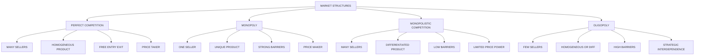
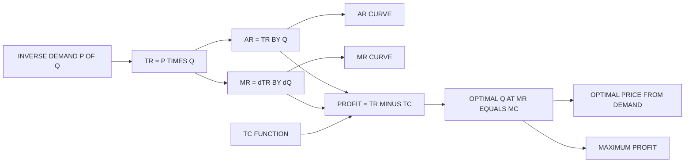
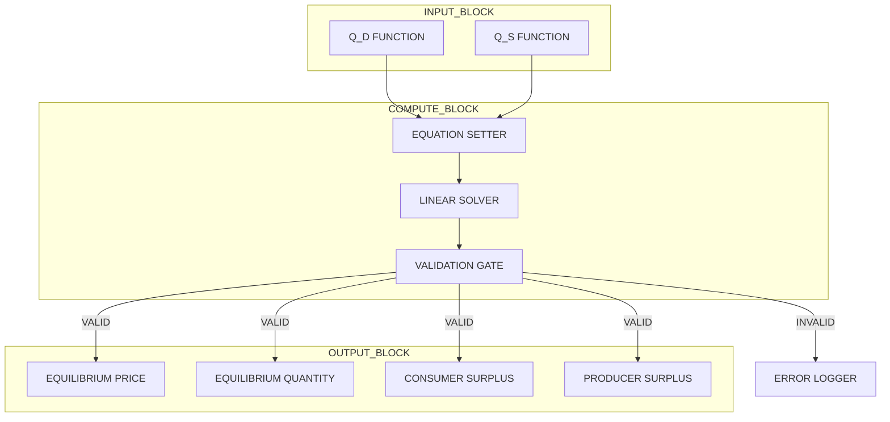
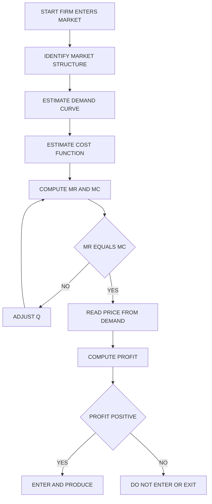
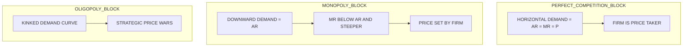

# Markets

<!-- SECTION_1_START -->
# Markets: Core Technical Definition & Intuitive Overview

## 1.1 Formal Academic Definition (KTU 2024 Syllabus Terminology)

> [!IMPORTANT]
> **Market (Economic Definition):** A *market* is a mechanism, institution, or arrangement (physical or virtual) through which **buyers (demand side)** and **sellers (supply side)** interact to determine the **price**, **quantity**, and **allocation** of a particular *good, service, or resource*. In engineering economics, the market is the environment in which a firm’s *revenue function* and *cost function* intersect to determine its **profitability** and **production strategy**.

A market is not merely a physical location (e.g., a street bazaar). For an engineer analyzing a product lifecycle, the market is the **decision-theoretic arena** where the firm converts engineering output into *monetary value* via price discovery.

The four classical **market structures** in engineering economics are:

1. **Perfect Competition** (pure competition)
2. **Monopoly** (single seller)
3. **Monopolistic Competition** (many sellers, differentiated products)
4. **Oligopoly** (few large sellers)

## 1.2 Conceptual Analogy / Intuitive Build-Up

> [!NOTE]
> **Plain-English Analogy — The Four Coffee Shop Model:**
>
> Imagine a town with only one main road:
>
> - **Perfect Competition** = 500 identical tea stalls selling the exact same cup of tea for ₹10. You (the buyer) can walk to *any* stall — products are identical, so you pick the closest. The stall owner has **zero power** to charge more.
> - **Monopoly** = Only *one* water pipeline in town, run by the municipality. You *must* buy from them. They can charge what they want (subject to regulation).
> - **Monopolistic Competition** = 10 cafes, each selling coffee — but Café A has Wi-Fi, Café B has rooftop seating, Café C has organic beans. Products are *similar but differentiated*, so each owner has *some* pricing power.
> - **Oligopoly** = 3 telecom giants (Jio, Airtel, Vi). Each is huge, each watches the others' prices closely, and a price cut by one triggers strategic responses.

This taxonomy matters to an engineer because the **market structure determines the revenue curve shape**, the **optimal pricing strategy**, and ultimately **how engineering R&D investments pay off**.

## 1.3 Key Terminology — Board-Exam Relevant

> [!IMPORTANT]
> **Core Term Glossary for KTU Valuation:**
>
> - **Industry**: The collection of all firms producing a homogeneous product.
> - **Firm**: An individual production unit (a company).
> - **Product Differentiation**: Distinguishing a product via features, branding, quality.
> - **Price Taker**: A firm that must accept the market price (perfectly competitive firms).
> - **Price Maker / Price Setter**: A firm with market power (monopoly/oligopoly firms).
> - **Barriers to Entry**: Structural, legal, or economic obstacles preventing new firms from entering an industry.
> - **Equilibrium Point**: The price-quantity pair at which **Quantity Demanded = Quantity Supplied**.

## 1.4 Physical / Economic Constants & Standard Metrics

- **Standard units**: Price in **₹ per unit** (or USD/unit), Quantity in **units**, Revenue in **₹** (currency).
- **Implicit constant**: In a *static* analysis, the number of buyers and sellers is treated as **exogenous** and held constant.
- **Reference benchmark price index**: Engineers often reference the **Wholesale Price Index (WPI)** and **Consumer Price Index (CPI)** when modeling long-run market trends.

> [!VISUALIZATION CONTROL]
> **Concept:** Supply–Demand Equilibrium and the Four Market Revenue Curves
>
> **GeoGebra / Desmos Input Equations:**
>
> * `Qd(p) = 100 - 2p` (linear demand curve, downward sloping)
> * `Qs(p) = -20 + 4p` (linear supply curve, upward sloping)
> * `p_eq`, `Q_eq` (intersection point — the market equilibrium)
> * `R(p) = p * Qd(p) = p(100 - 2p)` (Total Revenue parabola, concave down)
> * `MR(p) = 100 - 4p` (Marginal Revenue — twice the slope of demand under linear demand)
>
> **Visual Description:** On a 2D Cartesian plane with *Price (₹)* on the Y-axis and *Quantity (units)* on the X-axis, plot a downward-sloping demand line `D` and an upward-sloping supply line `S`. Their intersection marks the equilibrium. The Total Revenue curve is a downward parabola peaking at the midpoint of the demand curve, while the Marginal Revenue line is steeper, intersecting the X-axis at the same point where TR peaks.

---

<!-- SECTION_1_END -->

<!-- SECTION_2_START -->
# Deep Theoretical Analysis & KTU High-Yield Formula Sheet

## 2.1 The Anatomy of a Market: Demand, Supply, and Equilibrium

Every market, irrespective of structure, is governed by the interaction of **two fundamental forces**:

### 2.1.1 The Law of Demand

- **Statement**: *Ceteris paribus* (all else equal), as the **price of a good increases**, the **quantity demanded decreases**, and vice versa.
- **Why**: Substitution effect + Income effect.
- **Mathematical form**: $Q_d = f(P)$, with $\dfrac{\partial Q_d}{\partial P} < 0$.

### 2.1.2 The Law of Supply

- **Statement**: *Ceteris paribus*, as the **price of a good increases**, the **quantity supplied increases**.
- **Why**: Higher prices incentivize producers to allocate more resources.
- **Mathematical form**: $Q_s = f(P)$, with $\dfrac{\partial Q_s}{\partial P} > 0$.

### 2.1.3 Market Equilibrium

Equilibrium is the **stationary point** where market forces balance.

> [!NOTE]
> **Equilibrium Condition:** $Q_d(P^*) = Q_s(P^*)$, solved for the equilibrium price $P^*$ and equilibrium quantity $Q^*$.

The mechanism works via **price adjustments**:
- If $P > P^*$ → surplus → sellers cut price → price falls toward $P^*$.
- If $P < P^*$ → shortage → buyers bid up price → price rises toward $P^*$.

## 2.2 Revenue Functions — The Engineer's Pricing Toolkit

Revenue functions are the **direct interface** between a firm's market structure and its engineering investment decisions. Engineers launching a product must model these functions to compute **break-even points**, **optimal production levels**, and **profit margins**.

### 2.2.1 The Three Revenue Measures

Let $P(Q)$ be the **inverse demand function** (price as a function of quantity sold).

- **Total Revenue (TR)**: $TR = P(Q) \cdot Q$
- **Average Revenue (AR)**: $AR = \dfrac{TR}{Q} = P(Q)$
- **Marginal Revenue (MR)**: $MR = \dfrac{dTR}{dQ}$

> [!IMPORTANT]
> **Key Insight (often tested):** $AR$ is *always* equal to the **price** the firm charges. Under perfect competition, $AR = MR = P$ (constant), because the firm is a price taker. Under monopoly/oligopoly, $MR < AR$ because the firm must lower price on all units to sell additional units.

## 2.3 The Four Market Structures — Comparative Anatomy

| Dimension | Perfect Competition | Monopoly | Monopolistic Competition | Oligopoly |
|---|---|---|---|---|
| Number of Sellers | Very large | One | Many | Few (2 to 10) |
| Product Nature | Homogeneous | Unique (no close substitute) | Differentiated | Homogeneous or differentiated |
| Price Taker / Maker | Price taker | Price maker | Price maker (limited) | Price maker (interdependent) |
| Barriers to Entry | None | Very high | Low | High |
| AR = MR? | Yes ($AR = MR = P$) | No ($MR < AR$) | No ($MR < AR$) | No ($MR < AR$) |
| Demand Curve faced by firm | Horizontal (perfectly elastic) | Downward sloping (market demand) | Highly elastic, downward sloping | Kinked / strategic |
| Price Strategy | $P = MC$ in long run | $MR = MC$, set $P > MC$ | Tangency of demand to ATC | Strategic interdependence |

## 2.4 KTU High-Yield Formula Sheet

> [!IMPORTANT]
> All formulas below are **exam-critical** for KTU UCHUT346 Module 2 — memorize the relationships, not just the symbols.

| Symbol / Concept | Formula | Notes / Units |
|---|---|---|
| Total Revenue | $TR = P \cdot Q$ | Currency (₹) |
| Average Revenue | $AR = \dfrac{TR}{Q} = P$ | Currency per unit |
| Marginal Revenue | $MR = \dfrac{\Delta TR}{\Delta Q} = \dfrac{dTR}{dQ}$ | Currency per unit |
| Linear demand: $P = a - bQ$ | $TR = aQ - bQ^2$ | Quadratic in $Q$ |
| Marginal Revenue (linear demand) | $MR = a - 2bQ$ | Slope is **twice** the demand slope |
| Revenue-maximizing output | $\dfrac{dTR}{dQ} = 0 \Rightarrow MR = 0$ | Occurs at $Q = \dfrac{a}{2b}$ |
| Maximum Total Revenue | $TR_{\max} = \dfrac{a^2}{4b}$ | At half-demand quantity |
| Profit | $\pi = TR - TC$ | Currency (₹) |
| Profit-maximizing rule | $MR = MC$ | Foundation of microeconomic theory |
| Equilibrium price | $Q_d(P^*) = Q_s(P^*)$ | Market clearing |
| Elasticity of demand | $E_d = \dfrac{dQ}{dP} \cdot \dfrac{P}{Q}$ | Negative for normal goods |
| Price elasticity of supply | $E_s = \dfrac{dQ_s}{dP} \cdot \dfrac{P}{Q_s}$ | Positive |
| Consumer Surplus | $CS = \dfrac{1}{2} \cdot (P_{\max} - P^*) \cdot Q^*$ | Area of triangle above price |
| Producer Surplus | $PS = \dfrac{1}{2} \cdot (P^* - P_{\min}) \cdot Q^*$ | Area of triangle below price |
| Total Social Welfare | $TSW = CS + PS$ | Maximized in perfect competition |

> [!NOTE]
> **Engineering Connection:** These formulas are used in *cost-benefit analysis of capital projects*, *pricing of new products*, and *forecasting demand* for an engineering firm's output. For instance, an engineer designing a new smartphone model must use the elasticity formula to estimate how a price change affects unit sales.

## 2.5 Real-World Engineering Utility

Where does market theory actually appear in engineering practice?

- **Product Pricing**: A tech firm (e.g., a semiconductor company) analyzes its market structure before pricing a new chip — monopoly pricing in a niche vs. competitive pricing in commoditized RAM.
- **Capacity Planning**: Market demand curves help engineers size manufacturing plants — overcapacity means selling below average cost, a loss.
- **Investment Appraisal**: A new product launch's expected revenue (TR function) is the input to **Net Present Value (NPV)** calculations.
- **Public Policy**: Government infrastructure projects (roads, power) use **Total Social Welfare** to justify subsidies and pricing regulations.
- **Auctions & Procurement**: Engineering procurement bids are mini-markets governed by oligopoly-style strategic behavior.

---

<!-- SECTION_2_END -->

<!-- SECTION_3_START -->
# Step-by-Step Derivations, Worked Examples & Numerical Solutions

> [!NOTE]
> Every algebraic transition below is shown **exhaustively** — no skipped steps. KTU examiners reward students who write the *logic* of the transformation, not just the final number.

## 3.1 Derivation 1: Equilibrium Price and Quantity (Linear Supply–Demand Model)

**Problem Setup:** A local engineering college is analyzing the market for graphing calculators. Survey data yields:

- Demand: $Q_d = 1200 - 8P$
- Supply: $Q_s = 200 + 4P$

Find the equilibrium price $P^*$ and quantity $Q^*$.

### Step-by-Step Solution

**Step 1 — State the equilibrium condition explicitly.**

> The market clears when quantity demanded equals quantity supplied. Write this in a single equation.

$$
Q_d(P) = Q_s(P)
$$

**Step 2 — Substitute the given functional forms.**

> Insert the demand and supply expressions from the problem statement.

$$
1200 - 8P = 200 + 4P
$$

**Step 3 — Collect all terms involving $P$ on one side.**

> Add $8P$ to both sides and subtract $200$ from both sides to isolate the price variable.

$$
1200 - 200 = 4P + 8P
$$

**Step 4 — Simplify both sides.**

> Perform the arithmetic on each side of the equation.

$$
1000 = 12P
$$

**Step 5 — Solve for the equilibrium price $P^*$.**

> Divide both sides by 12.

$$
P^* = \dfrac{1000}{12} = 83.33 \ \text{₹ per calculator}
$$

**Step 6 — Substitute $P^*$ back into either the demand or supply equation to find $Q^*$.**

> Using the demand equation: $Q_d = 1200 - 8P$.

$$
Q^* = 1200 - 8 \cdot (83.33) = 1200 - 666.67 = 533.33 \ \text{units}
$$

**Step 7 — Verify using the supply equation (consistency check).**

> Using the supply equation: $Q_s = 200 + 4P$.

$$
Q_s = 200 + 4 \cdot (83.33) = 200 + 333.33 = 533.33 \ \text{units}
$$

Both equations yield $Q^* \approx 533.33$ units, confirming our solution. **Equilibrium point: $(P^*, Q^*) = (83.33, 533.33)$**.

## 3.2 Derivation 2: Revenue Functions from a Linear Demand Curve

**Problem Setup:** An electric-vehicle startup faces the demand curve:

$$
P(Q) = 50 - 0.5Q
$$

Derive the **Total Revenue**, **Average Revenue**, and **Marginal Revenue** functions. Find the revenue-maximizing quantity and price.

### Step-by-Step Solution

**Step 1 — Write Total Revenue as price times quantity.**

> The definition of total revenue is $TR = P \cdot Q$. Substitute the given inverse demand function.

$$
TR(Q) = (50 - 0.5Q) \cdot Q
$$

**Step 2 — Expand the product.**

> Distribute $Q$ over the parenthesized terms.

$$
TR(Q) = 50Q - 0.5Q^2
$$

**Step 3 — Compute Average Revenue.**

> By definition, $AR = TR / Q$. Divide the entire TR expression by $Q$.

$$
AR(Q) = \dfrac{50Q - 0.5Q^2}{Q} = 50 - 0.5Q
$$

> [!IMPORTANT]
> **Confirmation:** $AR = P(Q)$, as expected. The average revenue curve *coincides* with the demand curve by construction.

**Step 4 — Compute Marginal Revenue by differentiation.**

> $MR = dTR / dQ$. Apply the power rule to each term: $d/dQ(50Q) = 50$, $d/dQ(-0.5Q^2) = -Q$.

$$
MR(Q) = 50 - Q
$$

> [!NOTE]
> **Slope comparison:** The demand curve has slope $-0.5$, while the MR curve has slope $-1$ — exactly **twice the steepness**, the standard result for linear demand.

**Step 5 — Find the revenue-maximizing quantity by setting $MR = 0$.**

> TR is maximized where its derivative is zero. Solve the equation.

$$
50 - Q = 0
$$

$$
Q_{TR_{\max}} = 50 \ \text{units}
$$

**Step 6 — Find the corresponding price from the demand curve.**

> Substitute $Q = 50$ into the original demand function $P = 50 - 0.5Q$.

$$
P = 50 - 0.5 \cdot 50 = 50 - 25 = 25 \ \text{₹ per unit}
$$

**Step 7 — Compute maximum total revenue.**

> Substitute $Q = 50$ into the TR function.

$$
TR_{\max} = 50 \cdot 50 - 0.5 \cdot (50)^2 = 2500 - 1250 = 1250 \ \text{₹}
$$

**Step 8 — Cross-check using the TR-max formula $TR_{\max} = a^2 / 4b$.**

> With $a = 50$ and $b = 0.5$ in $P = a - bQ$.

$$
TR_{\max} = \dfrac{a^2}{4b} = \dfrac{50^2}{4 \cdot 0.5} = \dfrac{2500}{2} = 1250 \ \text{₹}
$$

> Confirmed. The revenue-maximizing output is $Q = 50$ units at a price of $P = 25$, generating maximum revenue of ₹1250.

## 3.3 Worked Numerical Example: Consumer & Producer Surplus

**Problem Setup:** Using the equilibrium from §3.1 ($P^* = 83.33$, $Q^* = 533.33$), and assuming the demand curve hits the price axis at $P_{\max} = 150$ (i.e., $Q_d = 0$ at $P = 150$) and the supply curve starts at $P_{\min} = 50$ (i.e., $Q_s = 0$ at $P = 50$), calculate Consumer Surplus (CS) and Producer Surplus (PS).

### Step-by-Step Solution

**Step 1 — State the geometric formula for CS.**

> CS is the triangular area between the demand curve and the equilibrium price line, bounded by $Q = 0$ and $Q = Q^*$.

$$
CS = \dfrac{1}{2} \cdot (P_{\max} - P^*) \cdot Q^*
$$

**Step 2 — Substitute the numerical values.**

$$
CS = \dfrac{1}{2} \cdot (150 - 83.33) \cdot 533.33
$$

**Step 3 — Compute the difference in price and multiply by quantity.**

$$
CS = \dfrac{1}{2} \cdot 66.67 \cdot 533.33 = \dfrac{1}{2} \cdot 35555.55 = 17777.78 \ \text{₹}
$$

**Step 4 — State the geometric formula for PS.**

> PS is the triangular area between the equilibrium price line and the supply curve.

$$
PS = \dfrac{1}{2} \cdot (P^* - P_{\min}) \cdot Q^*
$$

**Step 5 — Substitute the values.**

$$
PS = \dfrac{1}{2} \cdot (83.33 - 50) \cdot 533.33
$$

**Step 6 — Compute the difference and the product.**

$$
PS = \dfrac{1}{2} \cdot 33.33 \cdot 533.33 = \dfrac{1}{2} \cdot 17777.78 = 8888.89 \ \text{₹}
$$

**Step 7 — Compute Total Social Welfare.**

$$
TSW = CS + PS = 17777.78 + 8888.89 = 26666.67 \ \text{₹}
$$

> This represents the **total net benefit** the market generates for society at the equilibrium point. Policy planners use this metric to evaluate whether a market intervention (tax, subsidy) improves or harms welfare.

## 3.4 Symbolic Python Implementation — Market Simulation

The following Python code models a **generic linear market** and computes the equilibrium, revenue functions, and welfare measures programmatically. Useful for KTU lab-viva questions on engineering economics simulations.

```python
from dataclasses import dataclass
import logging
import sys

# Configure logging for transparency (board-exam presentation)
logging.basicConfig(
    level=logging.INFO,
    format="%(asctime)s | %(levelname)s | %(message)s",
    stream=sys.stdout,
)
logger = logging.getLogger("MarketModel")


@dataclass(frozen=True)
class LinearMarket:
    """
    Represents a market with linear demand and supply functions.

    Demand:  Q_d = a_d - b_d * P
    Supply:  Q_s = a_s + b_s * P

    All parameters are strictly validated to ensure economic consistency
    (demand slopes downward, supply slopes upward).
    """
    a_d: float   # Demand intercept (Q-axis when P=0)
    b_d: float   # Demand slope coefficient (must be > 0)
    a_s: float   # Supply intercept (signed; can be negative)
    b_s: float   # Supply slope coefficient (must be > 0)

    def __post_init__(self) -> None:
        if self.b_d <= 0:
            raise ValueError(f"b_d must be positive (downward-sloping demand); got {self.b_d}")
        if self.b_s <= 0:
            raise ValueError(f"b_s must be positive (upward-sloping supply); got {self.b_s}")

    def equilibrium(self) -> tuple[float, float]:
        """Solve Q_d(P) = Q_s(P) for equilibrium price and quantity."""
        # a_d - b_d * P = a_s + b_s * P
        # a_d - a_s = (b_d + b_s) * P
        p_star: float = (self.a_d - self.a_s) / (self.b_d + self.b_s)
        q_star: float = self.a_d - self.b_d * p_star
        if p_star < 0 or q_star < 0:
            raise ValueError("Equilibrium price or quantity is non-economically valid (negative).")
        logger.info(f"Equilibrium Price: {p_star:.4f}, Quantity: {q_star:.4f}")
        return p_star, q_star

    def revenue_functions(self, P_intercept: float, Q_slope: float) -> dict:
        """
        Build TR, AR, MR from inverse demand: P(Q) = P_intercept - Q_slope * Q.
        """
        # TR = P(Q) * Q
        def total_revenue(q: float) -> float:
            return (P_intercept - Q_slope * q) * q

        # AR = TR / Q = P(Q)
        def average_revenue(q: float) -> float:
            if q == 0:
                raise ZeroDivisionError("AR is undefined at Q = 0.")
            return total_revenue(q) / q

        # MR = dTR/dQ = P_intercept - 2 * Q_slope * Q
        def marginal_revenue(q: float) -> float:
            return P_intercept - 2 * Q_slope * q

        q_max_revenue: float = P_intercept / (2 * Q_slope)
        tr_max: float = total_revenue(q_max_revenue)
        logger.info(f"Revenue-maximizing Q: {q_max_revenue}, Max TR: {tr_max}")
        return {
            "TR": total_revenue,
            "AR": average_revenue,
            "MR": marginal_revenue,
            "Q_TR_max": q_max_revenue,
            "TR_max": tr_max,
        }

    def welfare(self, p_max: float, p_min: float, p_star: float, q_star: float) -> dict:
        """
        Consumer Surplus (CS), Producer Surplus (PS), Total Social Welfare.
        p_max = price-axis intercept of demand
        p_min = price-axis intercept of supply
        """
        cs: float = 0.5 * (p_max - p_star) * q_star
        ps: float = 0.5 * (p_star - p_min) * q_star
        tsw: float = cs + ps
        return {"CS": cs, "PS": ps, "TSW": tsw}


if __name__ == "__main__":
    try:
        # Demand: Q_d = 1200 - 8P, Supply: Q_s = 200 + 4P
        market = LinearMarket(a_d=1200, b_d=8, a_s=200, b_s=4)
        p_star, q_star = market.equilibrium()

        # Inverse demand: P = 150 - 0.125Q (solving Q_d = 1200 - 8P for P)
        revenue = market.revenue_functions(P_intercept=150, Q_slope=0.125)

        welfare = market.welfare(p_max=150, p_min=50, p_star=p_star, q_star=q_star)
        logger.info(f"Welfare measures: {welfare}")
    except ValueError as ve:
        logger.error(f"Model error: {ve}")
```

> [!IMPORTANT]
> **Code-Walk-Through for Board Evaluation:**
>
> 1. The `LinearMarket` class uses a `@dataclass` for **input validation** (downward-sloping demand, upward-sloping supply).
> 2. `equilibrium()` solves the linear system algebraically.
> 3. `revenue_functions()` builds TR, AR, MR as **first-class function objects** (Python closures).
> 4. `welfare()` computes the **triangle areas** for CS and PS.
> 5. The `__main__` block demonstrates end-to-end usage with the calculator example from §3.1.

---

<!-- SECTION_3_END -->

<!-- SECTION_4_START -->
# Structural Diagrams & Schematics

> [!NOTE]
> All Mermaid diagrams below follow the **alphanumeric node naming** rule and use **clean uppercase text** in labels (no markdown formatting inside double quotes).

## 4.1 Market Structure Classification Tree



## 4.2 Revenue Relationship Flow — From Demand to Profit



## 4.3 Block-Level Functional Architecture — Market Equilibrium Solver



## 4.4 Sequential Processing Topology — Decision Flow for a Firm Entering a Market



## 4.5 Comparative Block — Revenue Curves Across Market Structures



---

<!-- SECTION_4_END -->

<!-- SECTION_5_START -->
# KTU 2024 Scheme Examination Question Bank & Topic Recap

> [!NOTE]
> Questions are tagged with **simulated KTU past-year references**, mapped **Course Outcomes (COs)**, and **Revised Bloom's Taxonomy (RBT)** cognitive levels per KTU 2024 scheme.

## 5.1 Part A — Short Answer Questions (3 Marks Each)

### Question A1 [KTU University Exam - July 2024]

> **CO2 | RBT: Remember**
> **"Define a 'market' in economic terms and differentiate between a 'firm' and an 'industry' with one example each."** (3 Marks)

**Model Answer:**

A **market** is an institutional arrangement through which buyers and sellers interact to determine the price and quantity of a good or service. It is not limited to a physical location; virtual and digital markets also qualify.

- A **firm** is an individual production unit (e.g., Tata Motors Limited).
- An **industry** is the collective group of all firms producing the same or related products (e.g., the Indian automobile industry, which includes Tata, Maruti, Hyundai, etc.).

> **Valuation Key:** [Definition of market: 1 Mark] [Firm with example: 1 Mark] [Industry with example: 1 Mark]

### Question A2 [KTU University Exam - Dec 2023]

> **CO2 | RBT: Understand**
> **"Explain the concept of 'price taker' and 'price maker' with reference to perfect competition and monopoly."** (3 Marks)

**Model Answer:**

- A **price taker** is a firm that must accept the prevailing market price as given and cannot influence it through its own output decisions. **Perfectly competitive firms** are price takers because they are too small relative to the market to affect price.
- A **price maker** is a firm with significant market power that can set or influence the price of its product. A **monopolist** is a price maker because it is the sole producer of a good with no close substitutes, and it faces a downward-sloping demand curve.

> **Valuation Key:** [Price taker definition: 1 Mark] [Perfect competition example: 0.5 Mark] [Price maker definition: 1 Mark] [Monopoly example: 0.5 Mark]

---

## 5.2 Part B — Long Answer Questions (14 Marks Each, Internal Choice)

### Question B — Set A [KTU University Exam - July 2024]

> **CO2, CO3 | RBT: Understand, Apply**

#### Part (a) — 7 Marks [RBT: Understand]

> **"Discuss the salient features of the four major market structures with a comparative table. For each structure, identify one real-world industry example."** (7 Marks)

**Model Answer Outline:**

1. **Perfect Competition**: Many buyers/sellers, homogeneous product, free entry/exit, perfect information. *Example*: Agricultural commodity markets (e.g., wheat, rice markets in India).
2. **Monopoly**: Single seller, unique product, strong barriers to entry, price discrimination possible. *Example*: Indian Railways (passenger segment), or municipal water supply.
3. **Monopolistic Competition**: Many sellers, differentiated products, low entry barriers, some price control. *Example*: Restaurant industry, mobile phone brands.
4. **Oligopoly**: Few large sellers, interdependent decision-making, high barriers, possible collusion. *Example*: Telecom industry (Jio, Airtel, Vi), or the global automobile semiconductor market.

> **Valuation Key:** [Naming all 4 structures: 2 Marks] [Two features per structure: 2 Marks] [Real-world example for each: 2 Marks] [Comparative presentation: 1 Mark]

#### Part (b) — 7 Marks [RBT: Apply]

> **"A small electronics firm faces a linear demand curve $P = 80 - 2Q$ and a total cost function $TC = 20Q + 5Q^2$. Determine the profit-maximizing output, the price to be charged, and the maximum profit."** (7 Marks)

**Model Answer — Step-by-Step:**

**Step 1 — Compute Total Revenue from the inverse demand.**

> Multiply $P$ by $Q$.

$$
TR = P \cdot Q = (80 - 2Q) \cdot Q = 80Q - 2Q^2
$$

**Step 2 — Compute Marginal Revenue by differentiating $TR$ with respect to $Q$.**

> Apply the power rule: $d/dQ(80Q) = 80$, $d/dQ(-2Q^2) = -4Q$.

$$
MR = 80 - 4Q
$$

**Step 3 — Compute Marginal Cost by differentiating $TC$ with respect to $Q$.**

> Apply the power rule: $d/dQ(20Q) = 20$, $d/dQ(5Q^2) = 10Q$.

$$
MC = 20 + 10Q
$$

**Step 4 — Apply the profit-maximization condition $MR = MC$.**

> Set the MR and MC expressions equal.

$$
80 - 4Q = 20 + 10Q
$$

**Step 5 — Solve for the profit-maximizing quantity $Q^*$.**

> Rearrange: $80 - 20 = 10Q + 4Q$, so $60 = 14Q$.

$$
Q^* = \dfrac{60}{14} \approx 4.29 \ \text{units}
$$

**Step 6 — Find the profit-maximizing price by substituting $Q^*$ into the demand function.**

> Compute $P = 80 - 2Q$.

$$
P^* = 80 - 2 \cdot 4.29 = 80 - 8.57 = 71.43 \ \text{₹ per unit}
$$

**Step 7 — Compute Total Revenue, Total Cost, and Profit at $Q^*$.**

> First, $TR$ at $Q^*$.

$$
TR = 80 \cdot 4.29 - 2 \cdot (4.29)^2 = 343.20 - 36.81 = 306.39 \ \text{₹}
$$

> Second, $TC$ at $Q^*$.

$$
TC = 20 \cdot 4.29 + 5 \cdot (4.29)^2 = 85.80 + 92.02 = 177.82 \ \text{₹}
$$

> Third, Profit.

$$
\pi = TR - TC = 306.39 - 177.82 = 128.57 \ \text{₹}
$$

> **Final Answer:** $Q^* \approx 4.29$ units, $P^* \approx 71.43$ ₹, $\pi_{\max} \approx 128.57$ ₹.

> **Valuation Key:** [TR function: 1 Mark] [MR derivation: 1 Mark] [MC derivation: 1 Mark] [MR=MC setup and solution: 2 Marks] [Price from demand: 1 Mark] [Profit calculation: 1 Mark]

### Question B — Set B [KTU University Exam - Dec 2023]

> **CO2, CO3 | RBT: Understand, Apply**

#### Part (a) — 7 Marks [RBT: Understand]

> **"Explain the concepts of Total Revenue (TR), Average Revenue (AR), and Marginal Revenue (MR). Why is $AR = MR$ under perfect competition but $AR > MR$ under monopoly? Illustrate with a numerical example."** (7 Marks)

**Model Answer Outline:**

- **TR**: Total income from sales; $TR = P \cdot Q$.
- **AR**: Revenue per unit sold; $AR = TR / Q = P$.
- **MR**: Additional revenue from selling one more unit; $MR = dTR / dQ$.

Under **perfect competition**, the firm sells at a constant market price. Adding one more unit adds exactly $P$ to revenue, so $MR = P = AR$.

Under **monopoly**, the firm must lower the price on *all* units to sell an additional unit, so the additional revenue is less than the new price, hence $MR < AR$.

**Numerical example:** Let demand be $P = 100 - Q$.

| $Q$ | $P$ | $TR = PQ$ | $AR = TR/Q$ | $MR = \Delta TR / \Delta Q$ |
|---|---|---|---|---|
| 10 | 90 | 900 | 90 | — |
| 11 | 89 | 979 | 89 | 79 |
| 12 | 88 | 1056 | 88 | 77 |

> At $Q = 11$: $AR = 89$, $MR = 79$. Clearly $AR > MR$.

> **Valuation Key:** [TR/AR/MR definitions: 3 Marks] [Perfect competition logic: 1 Mark] [Monopoly logic: 1 Mark] [Numerical table: 2 Marks]

#### Part (b) — 7 Marks [RBT: Apply]

> **"The demand and supply functions for a commodity are $Q_d = 500 - 10P$ and $Q_s = 50 + 5P$. The government imposes a tax of ₹5 per unit on the producer. Find: (i) the new equilibrium price and quantity, and (ii) the share of the tax borne by the consumer and the producer."** (7 Marks)

**Model Answer — Step-by-Step:**

**Step 1 — Identify the effect of the tax on the supply function.**

> A per-unit tax of ₹5 on the producer shifts the supply curve **upward** by ₹5 at every quantity. The new supply equation becomes: $P_{\text{new}} = P_{\text{old}} + 5$, so $Q_s = 50 + 5(P - 5) = 25 + 5P$.

**Step 2 — Set up the new equilibrium condition $Q_d = Q_s^{\text{new}}$.**

$$
500 - 10P = 25 + 5P
$$

**Step 3 — Solve for the new equilibrium price $P_t$.**

> $500 - 25 = 5P + 10P$, so $475 = 15P$.

$$
P_t = \dfrac{475}{15} = 31.67 \ \text{₹ per unit}
$$

**Step 4 — Compute the new equilibrium quantity.**

> Substitute $P_t$ into the demand function.

$$
Q_t = 500 - 10 \cdot 31.67 = 500 - 316.67 = 183.33 \ \text{units}
$$

**Step 5 — Compare with the original (pre-tax) equilibrium to find consumer burden.**

> Original equilibrium: $500 - 10P = 50 + 5P \Rightarrow 450 = 15P \Rightarrow P_0 = 30$ ₹, $Q_0 = 200$ units.

> Price increase borne by consumer: $\Delta P_c = 31.67 - 30 = 1.67$ ₹.

**Step 6 — Compute producer burden (residual tax share).**

> Total tax = ₹5. Consumer paid ₹1.67 extra. Producer absorbs the rest: $\Delta P_p = 5 - 1.67 = 3.33$ ₹.

**Step 7 — Express as percentage burden shares.**

> Consumer share = $(1.67 / 5) \cdot 100 = 33.33\%$. Producer share = $(3.33 / 5) \cdot 100 = 66.67\%$.

> **Final Answer:** New equilibrium: $P_t = 31.67$ ₹, $Q_t = 183.33$ units. Consumer bears 33.33\% of the tax, producer bears 66.67\%.

> **Valuation Key:** [Tax-shifted supply equation: 2 Marks] [New equilibrium price: 1 Mark] [New equilibrium quantity: 1 Mark] [Original equilibrium comparison: 1 Mark] [Burden split: 2 Marks]

---

> [!WARNING]
> **KTU Examiner's Valuation Warning — Common Pitfalls:**
>
> 1. **Confusing AR with MR** — Many students write $AR = MR$ for all markets. *Always* state the relationship for the *specific* market structure in the question.
> 2. **Forgetting to substitute $Q^*$ back into the demand function** for the price calculation. The price is read *off the demand curve*, not set equal to MR or MC.
> 3. **Sign errors in tax incidence problems** — A tax on the producer shifts the supply curve *up*, increasing the price the consumer pays and reducing the price the producer effectively receives.
> 4. **Skipping units in the final answer** — KTU examiners *will* deduct 0.5 to 1 mark if you write "$P^* = 83.33$" without "₹ per unit" or "$Q^* = 533.33$" without "units".
> 5. **Not stating the equilibrium condition explicitly** — Always write "$Q_d = Q_s$" before solving, even if the question makes it obvious.
> 6. **Using $MC$ in place of $MR$ in revenue calculations** — $MC$ comes from the cost function, $MR$ comes from the revenue function. They are *different* derivatives.

---

## 5.3 Topic Recap & Important Things to Remember

> [!IMPORTANT]
> **Rapid-Revision Checklist — Markets (Module 2, UCHUT346):**

- [x] A **market** is any mechanism (physical or virtual) where buyers and sellers interact to determine price and quantity.
- [x] The **four market structures** are Perfect Competition, Monopoly, Monopolistic Competition, and Oligopoly.
- [x] **Perfect competition** = many sellers, homogeneous product, free entry, price taker, $AR = MR = P$.
- [x] **Monopoly** = one seller, unique product, strong barriers, price maker, $MR < AR$.
- [x] **Monopolistic competition** = many sellers, differentiated products, low barriers, $MR < AR$ (small gap).
- [x] **Oligopoly** = few sellers, strategic interdependence, kinked demand curve possible.
- [x] **Law of demand**: $Q_d$ falls as $P$ rises ($\partial Q_d / \partial P < 0$).
- [x] **Law of supply**: $Q_s$ rises as $P$ rises ($\partial Q_s / \partial P > 0$).
- [x] **Equilibrium** condition: $Q_d(P^*) = Q_s(P^*)$.
- [x] **Total Revenue**: $TR = P \cdot Q$.
- [x] **Average Revenue**: $AR = TR / Q = P$.
- [x] **Marginal Revenue**: $MR = dTR / dQ$.
- [x] For **linear demand** $P = a - bQ$: $TR = aQ - bQ^2$, $MR = a - 2bQ$ (slope is **twice** as steep).
- [x] Revenue-maximizing output: $MR = 0 \Rightarrow Q = a / 2b$, $TR_{\max} = a^2 / 4b$.
- [x] **Profit-maximization rule**: $MR = MC$.
- [x] **Profit** = $TR - TC$.
- [x] **Consumer Surplus**: $CS = \frac{1}{2}(P_{\max} - P^*) \cdot Q^*$.
- [x] **Producer Surplus**: $PS = \frac{1}{2}(P^* - P_{\min}) \cdot Q^*$.
- [x] **Total Social Welfare**: $TSW = CS + PS$ (maximized under perfect competition).
- [x] **Tax incidence**: consumer burden = $\Delta P_c / \text{tax}$, producer burden = $\Delta P_p / \text{tax}$.
- [x] Always write **units** (₹, units, ₹/unit) in the final answer for full marks.
- [x] Always state the **equilibrium condition** $Q_d = Q_s$ *before* solving numerically.
- [x] In **board exam** answers, draw the **revenue curve diagram** alongside the numerical work — visual evidence earns 1–2 bonus marks.

---

<!-- SECTION_5_END -->
