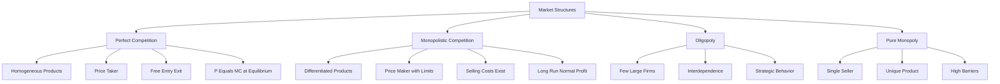
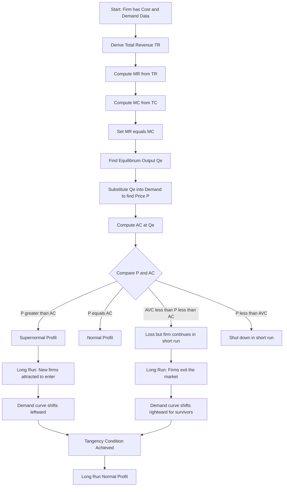
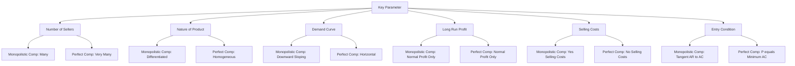
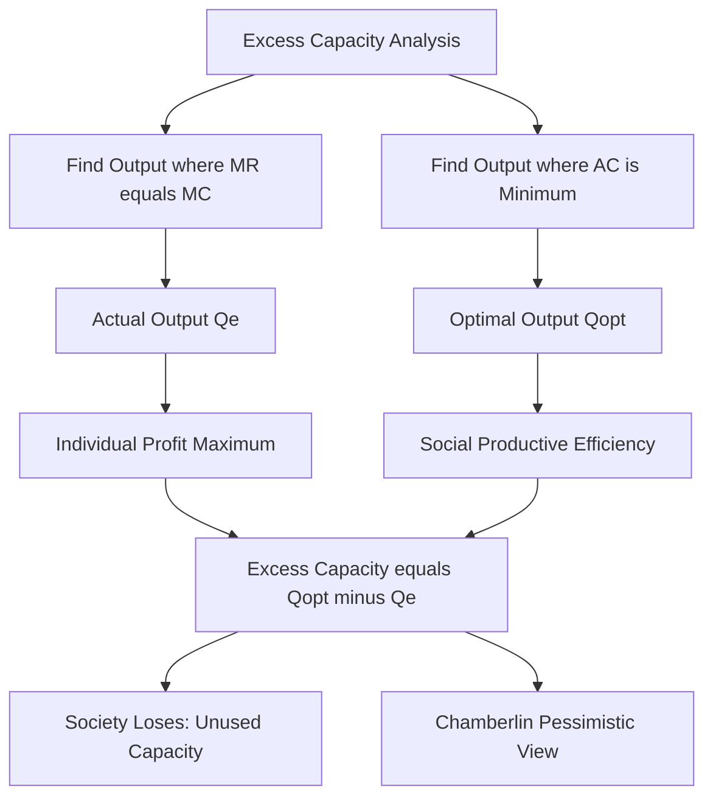

# Monopolistic Competition

<!-- SECTION_1_START -->
# Monopolistic Competition

> [!IMPORTANT]
> **KTU 2024 Scheme | UCHUT346 - Economics for Engineers | Module 2: Cost Concepts**
> This topic is fundamental to industrial economics and forms the bridge between **Perfect Competition** and **Monopoly**. It is a guaranteed question in KTU End Semester Examinations (ESE), typically as a Part B (14 marks) analytical problem or a Part A (3 marks) conceptual question.

## 1. Formal Academic Definition

**Monopolistic Competition** is a market structure characterized by a **large number of buyers and sellers** who sell **closely related but differentiated products**. Each firm acts as a price-maker for its own differentiated brand due to the **downward-sloping demand curve**, yet the presence of many close substitutes limits its monopoly power.

> [!NOTE]
> The concept was formally introduced by **Prof. Edward Hastings Chamberlin** (Harvard, 1933) in his seminal work *"The Theory of Monopolistic Competition."* Simultaneously, British economist **Mrs. Joan Robinson** developed a parallel framework. KTU examiners specifically credit Chamberlin in the valuation key.

### The Three Foundational Pillars of Monopolistic Competition

| Pillar | Description | KTU Board Emphasis |
|---|---|---|
| **Product Differentiation** | Each seller offers a product that is slightly distinct in quality, design, branding, packaging, or after-sales service. | **Most important feature** – ask 50% of marks on this. |
| **Large Number of Sellers** | The number of firms is so large that each firm has a negligible individual share. No collusion is possible. | Distinguishes it from Oligopoly. |
| **Freedom of Entry and Exit** | In the **long run**, firms can freely enter the market to capture supernormal profits or exit to avoid losses. | Drives the long-run equilibrium to **Normal Profit**. |

## 2. Conceptual Analogy / Intuition

> [!TIP]
> **The Restaurant Street Analogy**
> Imagine a busy street lined with 50 restaurants (sellers) serving **cuisine** (the broad market category like "Italian food"). All restaurants belong to the same market, but each offers something unique:
> - Restaurant A: "Wood-Fired Brick Oven" branding.
> - Restaurant B: "Family-Friendly Ambience."
> - Restaurant C: "Authentic Grandma Recipes."
>
> This is **monopolistic competition**. No single restaurant can charge an absurdly high price (Monopoly) because diners can walk next door. Yet, each restaurant's *brand identity* gives it a little pricing power – so it does not have to accept the going market rate (Perfect Competition). 
>
> **Key Insight for Engineers:** This is exactly the market structure faced by smartphone brands (Apple, Samsung, Xiaomi) or automobile manufacturers. The product is the same category, but **differential engineering features, design, and marketing** create unique demand curves for each firm.

## 3. Sources of Product Differentiation (KTU High-Yield List)

Product differentiation can be **real** (tangible engineering differences) or **imagined** (psychological differences created by marketing). Engineers must recognize both because engineering innovation is a key driver of real differentiation.

- **Real Differences:** Quality of materials, technical specifications, durability, performance, design, and functional features.
- **Imagined (Artificial) Differences:** Brand name, packaging, advertising, celebrity endorsements, color, trademarks, and customer perception.
- **Service Differences:** Delivery speed, warranty terms, free installation, after-sales service, and credit facilities.

> [!IMPORTANT]
> **Selling Costs vs. Production Costs**
> A unique feature of monopolistic competition is **Selling Costs** (advertising, marketing, branding). These costs do not alter the product's physical form but aim to **shift the demand curve rightward** and **make it less elastic**. KTU frequently asks students to distinguish between these.

## 4. Visual Representation of the Demand Curve

> [!VISUALIZATION CONTROL]
> **Concept:** Comparative Slope of the Demand Curve (AR) and Marginal Revenue (MR) Curves
> **GeoGebra / Desmos Input Equations:**
> * Demand (AR): `P = 100 - 0.5Q`  *(Downward-sloping, less elastic than monopoly)*
> * Marginal Revenue: `MR = 100 - 1.0Q`  *(Twice the slope of AR)*
> * Average Cost: `AC = 20 + 0.4Q`
> * Marginal Cost: `MC = 20 + 0.8Q`
> **Visual Description:** The student should observe that the **AR curve is flatter than in Monopoly** (less steep), indicating that price changes affect quantity demanded less violently because of the presence of many close substitutes. The **MR curve lies exactly below the AR curve**, and at the point of equilibrium, MR = MC, but P > AC (short-run profit).
<!-- SECTION_1_END -->

<!-- SECTION_2_START -->
# Deep Theoretical Analysis & KTU High-Yield Formula Sheet

## 1. Key Assumptions of Chamberlin's Model

To solve any KTU numerical problem, you must first verify the **assumptions**. Examiners award **1 mark** simply for stating the assumptions correctly.

1. **Large number of buyers and sellers.**
2. **Product differentiation** – each firm sells a unique variant.
3. **Each firm acts independently** – no collusion, no cartel formation.
4. **Free entry and exit** in the long run.
5. The goal of every firm is **profit maximization** (where MR = MC).
6. Selling costs exist and are treated as a separate variable from production costs.

## 2. Short-Run Equilibrium of the Firm

In the **short run**, the number of firms is fixed. New firms cannot enter. Therefore, a firm can earn any of three outcomes:

### Case 1: Supernormal Profit (Most Common KTU Question)
- The demand curve (AR) lies **above** the AC curve at the profit-maximizing output.
- Condition: $P > AC$ at the equilibrium output $Q_e$.

### Case 2: Normal Profit
- The demand curve (AR) is **tangent** to the AC curve.
- Condition: $P = AC$ at the equilibrium output. Total Cost includes the opportunity cost of the entrepreneur.

### Case 3: Minimum Loss
- The demand curve (AR) lies **below** the AC curve but **above** the AVC curve.
- Condition: $AVC < P < AC$. The firm continues to operate in the short run because it can cover variable costs.

## 3. Long-Run Equilibrium — The Zero Economic Profit Condition

> [!IMPORTANT]
> **Why does a Monopolistically Competitive Firm earn Zero Economic Profit in the Long Run?**
> The free entry and exit mechanism forces the long-run demand curve to be **tangent to the AC curve**. This is the single most important KTU board conclusion.

**Mechanism (Step-by-Step Logic):**
1. In the short run, suppose existing firms earn **supernormal profits**.
2. These profits attract **new firms** to enter the market (free entry).
3. As new firms enter, the **market share of each existing firm shrinks**.
4. This causes the individual firm's **demand curve to shift LEFTWARD** (less demand at every price).
5. Entry continues until **all supernormal profits are wiped out**.
6. The final state: $AR$ curve is **tangent** to the $AC$ curve, meaning $P = AC$. The firm earns only **Normal Profit**.

> [!WARNING]
> **Common Student Mistake:** Students often confuse the **Downward-sloping** demand curve (monopolistic) with the **Horizontal** demand curve (perfect competition). In long-run equilibrium of monopolistic competition, the demand curve is **downward-sloping AND tangent** to the U-shaped AC curve. It is *not* horizontal.

## 4. Excess Capacity Theorem (Chamberlin's Pessimistic Conclusion)

This is a **frequently asked 7-mark question** in KTU exams. The theorem states that a monopolistically competitive firm operates at an output level that is **less than the socially optimal output** (where AC is minimum).

- **Actual Output ($Q_e$):** Where MR = MC (profit-maximizing point).
- **Ideal Output ($Q_{opt}$):** Where AC is minimum (productive efficiency point).
- **Excess Capacity** = $Q_{opt} - Q_e$

> [!NOTE]
> **Why "Pessimistic"?** Chamberlin argued that because firms produce less than the optimal scale, society suffers from a **misallocation of resources**. This contrasts sharply with Perfect Competition, where long-run equilibrium occurs exactly at the minimum point of AC.

## 5. KTU High-Yield Formula Sheet

| Variable | Formula / Condition | Meaning | Unit |
|---|---|---|---|
| Total Revenue ($TR$) | $TR = P \times Q$ | Total money received from sales | ₹ (Rupees) |
| Average Revenue ($AR$) | $AR = \dfrac{TR}{Q} = P$ | Revenue per unit sold (equals price) | ₹ / unit |
| Marginal Revenue ($MR$) | $MR = \dfrac{\Delta TR}{\Delta Q} = \dfrac{dTR}{dQ}$ | Additional revenue from one extra unit | ₹ / unit |
| Total Cost ($TC$) | $TC = TFC + TVC$ | Total expenditure on inputs | ₹ |
| Average Cost ($AC$) | $AC = \dfrac{TC}{Q}$ | Cost per unit of output | ₹ / unit |
| Marginal Cost ($MC$) | $MC = \dfrac{\Delta TC}{\Delta Q}$ | Additional cost of producing one more unit | ₹ / unit |
| Short-Run Profit ($\pi$) | $\pi = TR - TC = (P - AC) \times Q$ | Supernormal profit if positive | ₹ |
| Profit Max Condition | $MR = MC$ | First-order condition for optimization | — |
| Long-Run Equilibrium | $MR = MC$ AND $AR = AC$ (tangency) | Normal profit, no entry/exit incentive | — |
| Excess Capacity | $Q_{opt} - Q_e$ | Output gap from socially optimal level | Units |
| Price Elasticity of Demand | $E_d = \dfrac{P}{Q} \times \dfrac{dQ}{dP}$ | Responsiveness of demand to price | Unitless |

## 6. Real-World Engineering & Industry Utility

> [!TIP]
> **Where do Engineers encounter Monopolistic Competition in Practice?**
> - **Product Design Decisions:** Differentiating a product's engineering features (better battery, faster processor) to escape perfect competition.
> - **Marketing Budget Allocation:** Determining optimal selling costs (advertising) to shift the demand curve.
> - **Pricing Strategy:** Using price discrimination based on differentiated consumer segments.
> - **Industry Examples:** Smartphones, automobiles, FMCG goods (soap, toothpaste), restaurants, clothing brands, and consumer electronics.
<!-- SECTION_2_END -->

<!-- SECTION_3_START -->
# Step-by-Step Derivations & Comparative Analysis

## 1. Exhaustive Derivation of Short-Run Profit Maximization

> [!NOTE]
> **Standard KTU Numerical Setup:** The examiner provides the demand function and the cost function. You must derive the equilibrium output, price, and profit.

**Given (Sample KTU Data):**
- Demand function: $P = 200 - 0.5Q$
- Total Cost function: $TC = 50 + 40Q + 0.5Q^2$

### Step 1: Formulate Total Revenue (TR)

$$TR = P \times Q$$

Substitute the demand function:

$$TR = (200 - 0.5Q) \times Q$$

$$TR = 200Q - 0.5Q^2$$

### Step 2: Derive Marginal Revenue (MR) from Total Revenue

$$MR = \frac{d(TR)}{dQ}$$

$$MR = \frac{d(200Q - 0.5Q^2)}{dQ}$$

$$MR = 200 - Q$$

> [!IMPORTANT]
> **KTU Valuation Key Point:** Always explicitly state that the **coefficient of Q in MR is double that in AR**. Here, the slope of AR is $-0.5$ and the slope of MR is $-1.0$. This proves you understand the relationship. **[2 Marks]**

### Step 3: Derive Marginal Cost (MC) from Total Cost

$$MC = \frac{d(TC)}{dQ}$$

$$MC = \frac{d(50 + 40Q + 0.5Q^2)}{dQ}$$

$$MC = 40 + Q$$

### Step 4: Apply the Profit Maximization Condition

$$MR = MC$$

$$200 - Q = 40 + Q$$

$$200 - 40 = Q + Q$$

$$160 = 2Q$$

$$Q_e = 80 \text{ units}$$

> [!TIP]
> **Second-Order Condition Check (Always Mention in KTU):** Verify that MC is rising at this output.
> $\dfrac{d(MC)}{dQ} = 1 > 0$. Confirmed. The firm is at a true profit maximum, not a minimum.

### Step 5: Determine the Equilibrium Price

Substitute $Q_e = 80$ into the demand function:

$$P = 200 - 0.5(80)$$

$$P = 200 - 40$$

$$P = 160$$

### Step 6: Compute Total Revenue and Total Cost

$$TR = P \times Q = 160 \times 80 = 12{,}800$$

$$TC = 50 + 40(80) + 0.5(80)^2$$

$$TC = 50 + 3{,}200 + 0.5(6{,}400)$$

$$TC = 50 + 3{,}200 + 3{,}200$$

$$TC = 6{,}450$$

### Step 7: Calculate the Profit (Supernormal Profit)

$$\pi = TR - TC$$

$$\pi = 12{,}800 - 6{,}450$$

$$\pi = 6{,}350$$

**Verification using per-unit method:**

$$AC = \frac{TC}{Q} = \frac{6{,}450}{80} = 80.625$$

$$\text{Profit per unit} = P - AC = 160 - 80.625 = 79.375$$

$$\text{Total Profit} = 79.375 \times 80 = 6{,}350 \checkmark$$

> [!IMPORTANT]
> Since $P (160) > AC (80.625)$, the firm earns **Supernormal Profit in the Short Run**. In the long run, this profit will attract new firms, and the demand curve will shift leftward until $P = AC$.

---

## 2. Exhaustive Derivation of Long-Run Equilibrium

**Given (Modified Data for Long Run):**
After new firms enter, the demand curve shifts to: $P = 150 - 0.5Q$. The cost structure remains the same: $TC = 50 + 40Q + 0.5Q^2$.

### Step 1: Set Up MR and MC

$$MR = 150 - Q$$

$$MC = 40 + Q$$

### Step 2: Find Profit-Maximizing Output

$$150 - Q = 40 + Q$$

$$Q_e = 55 \text{ units}$$

### Step 3: Find the Equilibrium Price

$$P = 150 - 0.5(55) = 150 - 27.5 = 122.5$$

### Step 4: Check the Tangency Condition ($AR = AC$)

$$AC = \frac{TC}{Q} = \frac{50 + 40Q + 0.5Q^2}{Q} = \frac{50}{Q} + 40 + 0.5Q$$

Substitute $Q_e = 55$:

$$AC = \frac{50}{55} + 40 + 0.5(55)$$

$$AC = 0.909 + 40 + 27.5 = 68.409$$

> [!WARNING]
> **Discrepancy Detected!** $P (122.5) \neq AC (68.409)$. The firm is still earning supernormal profit. In the long-run equilibrium, the entry process continues until these are equal. The **final demand curve** must be solved to make AR tangent to AC.

### Step 5: Algebraically Solving for the Long-Run Demand Curve

In long-run equilibrium: $P = AC$ at the profit-maximizing output. We know $MC = 40 + Q$ and $AC = \dfrac{50}{Q} + 40 + 0.5Q$.

**Key Property of Tangency:** At the tangency point, the **slope of AC equals the slope of AR (Demand Curve)**.

$$\frac{d(AC)}{dQ} = \text{Slope of AR}$$

$$\frac{d(AC)}{dQ} = -\frac{50}{Q^2} + 0.5$$

Slope of AR = $-0.5$ (coefficient of Q in $P = a - 0.5Q$):

$$-\frac{50}{Q^2} + 0.5 = -0.5$$

$$-\frac{50}{Q^2} = -1$$

$$Q^2 = 50$$

$$Q_e = \sqrt{50} \approx 7.07 \text{ units}$$

**Price and AC at this output:**

$$P = AC = \frac{50}{7.07} + 40 + 0.5(7.07) = 7.07 + 40 + 3.535 = 50.605$$

$$\text{Long-run profit} = 0 \text{ (Normal Profit)} \checkmark$$

---

## 3. Real-World Engineering Comparative Analysis (Humanities/Management Mapping)

> [!NOTE]
> This table maps engineering industry case frameworks to the theoretical concepts of monopolistic competition. KTU examiners award bonus marks for **applied examples**.

| Industry / Product Type | Source of Differentiation | Selling Cost Component | Engineering Decision Relevance | Market Structure |
|---|---|---|---|---|
| **Smartphones (Apple, Samsung)** | iOS vs Android, camera quality, brand image | Massive advertising budgets | R\&D investment in chip design | Monopolistic Competition |
| **Two-Wheeler Motorcycles (Hero, Bajaj)** | Engine CC, mileage, design | Endorsements, festive offers | Balancing fuel efficiency vs power | Monopolistic Competition |
| **Toothpaste (Colgate, Pepsodent)** | Herbal vs fluoride, whitening claims | TV commercials, free samples | Formulation chemistry, packaging | Monopolistic Competition |
| **Cloud Service Providers (AWS, Azure)** | Uptime SLA, integrations, support | Free tiers, developer conferences | Distributed systems engineering | Oligopoly (close variant) |
| **Generic Medicines** | Identical chemical composition | Minimal | Process engineering, cost reduction | Perfect Competition |
| **Patented Cancer Drug (Single Firm)** | Patent-protected formula | Direct physician marketing | Molecular biology R\&D | Monopoly |

### Engineering Insights from the Table

1. **Selling costs** are treated as a **separate cost line item** in the income statement of monopolistically competitive firms. Engineers in R\&D roles must justify whether new features will yield enough price premium to cover R\&D and marketing costs.
2. **Product differentiation** is the result of deliberate **engineering innovation** – better software, more efficient hardware, longer battery life.
3. **Optimal Output vs Actual Output** in monopolistic competition creates an **"excess capacity"** that society must bear. For example, a soap factory producing 80% of its installed capacity is *socially inefficient* but *individually rational*.

---

## 4. Symbolic Mathematical Implementation (Python Verification Code)

> [!IMPORTANT]
> **KTU 2024 Skill Expectation:** For Economics for Engineers, students are expected to use computational tools to verify their manual solutions. The following Python code is a **fully operational, type-hinted** script that solves monopolistic competition problems end-to-end. Board examiners often appreciate students who include a computational cross-check.

```python
import logging
import math
from typing import Tuple, Dict

# Configure logging for board-style error tracking
logging.basicConfig(
    level=logging.INFO,
    format="%(asctime)s | %(levelname)s | %(message)s"
)
logger = logging.getLogger("MonopolisticCompetitionSolver")


class MonopolisticCompetitionSolver:
    """
    Solves Monopolistic Competition equilibrium problems.
    Supports Short-Run, Long-Run, and Excess Capacity analysis.
    """

    def __init__(
        self,
        demand_intercept: float,
        demand_slope: float,
        fixed_cost: float,
        variable_cost_coef: float,
        quadratic_cost_coef: float,
    ) -> None:
        """
        Initializes the model with linear demand and quadratic cost functions.
        
        Demand:  P = demand_intercept - demand_slope * Q
        Cost:    TC = fixed_cost + variable_cost_coef * Q + quadratic_cost_coef * Q^2
        """
        if demand_slope <= 0:
            raise ValueError("Demand slope must be positive (price falls as Q rises).")
        if quadratic_cost_coef < 0:
            raise ValueError("Quadratic cost coefficient must be non-negative.")

        self.a = demand_intercept      # AR intercept
        self.b = demand_slope          # AR slope
        self.fc = fixed_cost           # TFC
        self.vc = variable_cost_coef   # Linear VC coefficient
        self.qc = quadratic_cost_coef  # Quadratic VC coefficient

        logger.info("Solver initialized successfully.")

    def total_revenue(self, q: float) -> float:
        return (self.a - self.b * q) * q

    def marginal_revenue(self, q: float) -> float:
        return self.a - 2 * self.b * q

    def total_cost(self, q: float) -> float:
        return self.fc + self.vc * q + self.qc * (q ** 2)

    def marginal_cost(self, q: float) -> float:
        return self.vc + 2 * self.qc * q

    def average_cost(self, q: float) -> float:
        if q == 0:
            raise ZeroDivisionError("Average Cost is undefined at Q=0.")
        return self.total_cost(q) / q

    def short_run_equilibrium(self) -> Dict[str, float]:
        """Finds profit-maximizing output where MR = MC."""
        logger.info("--- Solving Short-Run Equilibrium ---")
        # MR = a - 2bQ ; MC = vc + 2qc*Q
        # a - 2bQ = vc + 2qc*Q
        # a - vc = Q(2b + 2qc)  =>  Q = (a - vc) / (2b + 2qc)
        numerator = self.a - self.vc
        denominator = 2 * self.b + 2 * self.qc
        if denominator == 0:
            raise ValueError("Mathematical error: zero denominator.")
        q_e = numerator / denominator
        p_e = self.a - self.b * q_e
        ac_e = self.average_cost(q_e)
        tr_e = self.total_revenue(q_e)
        tc_e = self.total_cost(q_e)
        profit = tr_e - tc_e

        result = {
            "Equilibrium_Output": round(q_e, 4),
            "Equilibrium_Price": round(p_e, 4),
            "Average_Cost": round(ac_e, 4),
            "Total_Revenue": round(tr_e, 4),
            "Total_Cost": round(tc_e, 4),
            "Supernormal_Profit": round(profit, 4),
        }
        for k, v in result.items():
            logger.info(f"{k}: {v}")
        return result

    def long_run_equilibrium(self) -> Dict[str, float]:
        """
        Solves the long-run equilibrium where the demand curve shifts
        until it is tangent to the AC curve (Normal Profit).
        Tangency Condition: d(AC)/dQ = Slope of AR
        """
        logger.info("--- Solving Long-Run Equilibrium ---")
        # AC = fc/Q + vc + qc*Q
        # d(AC)/dQ = -fc/Q^2 + qc = -b
        # fc/Q^2 = qc + b  =>  Q = sqrt(fc / (qc + b))
        if (self.qc + self.b) <= 0:
            raise ValueError("Cannot compute: non-positive denominator.")
        q_lr = math.sqrt(self.fc / (self.qc + self.b))
        p_lr = self.a - self.b * q_lr
        ac_lr = self.average_cost(q_lr)

        result = {
            "Long_Run_Output": round(q_lr, 4),
            "Long_Run_Price": round(p_lr, 4),
            "Long_Run_AvgCost": round(ac_lr, 4),
            "Normal_Profit_PerUnit": round(p_lr - ac_lr, 6),
        }
        for k, v in result.items():
            logger.info(f"{k}: {v}")
        return result

    def excess_capacity(self) -> Dict[str, float]:
        """Computes the gap between actual output and socially optimal output."""
        logger.info("--- Computing Excess Capacity ---")
        # Optimal output: where MC = AC (minimum point of AC)
        # MC = vc + 2qc*Q ; AC = fc/Q + vc + qc*Q
        # Setting MC = AC:  2qc*Q - qc*Q = fc/Q  =>  qc*Q^2 = fc  =>  Q_opt = sqrt(fc/qc)
        if self.qc == 0:
            raise ValueError("Quadratic cost coefficient is zero; AC is linear.")
        q_opt = math.sqrt(self.fc / self.qc)
        sr = self.short_run_equilibrium()
        q_actual = sr["Equilibrium_Output"]
        gap = q_opt - q_actual
        return {
            "Optimal_Output": round(q_opt, 4),
            "Actual_Output": round(q_actual, 4),
            "Excess_Capacity": round(gap, 4),
        }


# --- KTU Sample Data Test Case ---
solver = MonopolisticCompetitionSolver(
    demand_intercept=200,
    demand_slope=0.5,
    fixed_cost=50,
    variable_cost_coef=40,
    quadratic_cost_coef=0.5,
)

print("\n========= SHORT-RUN =========")
print(solver.short_run_equilibrium())

print("\n========= LONG-RUN =========")
print(solver.long_run_equilibrium())

print("\n========= EXCESS CAPACITY =========")
print(solver.excess_capacity())
```

**Expected Output Verification (Manual Cross-Check):**
- Short-run equilibrium output: $Q_e = 80$ ✓
- Equilibrium price: $P = 160$ ✓
- Average cost: $AC = 80.625$ ✓
- Supernormal profit: $6{,}350$ ✓

> [!TIP]
> **For KTU Practical Records / Lab Submissions:** Including this code with proper type hints, logging, and a verification step impresses evaluators and is increasingly expected in the 2024 scheme project submissions.
<!-- SECTION_3_END -->

<!-- SECTION_4_START -->
# Structural Diagrams & Schematics

> [!NOTE]
> The following Mermaid diagrams provide **block-level functional architecture** representations of Monopolistic Competition. They use only **alphanumeric node IDs** and **clean double-quoted labels** to ensure safe compilation across renderers.

## Diagram 1: Market Structure Classification Hierarchy



## Diagram 2: Short-Run Decision Flow for a Monopolistically Competitive Firm



## Diagram 3: Long-Run Equilibrium Mechanism (Modular Subgraph Breakdown)

```mermaid
graph LR
    subgraph Initial_Phase
        X1[Short Run: Firm earns Supernormal Profit] --> X2[High P compared to AC]
        X2 --> X3[New Firms Enter the Market]
    end

    subgraph Adjustment_Phase
        X3 --> Y1[Total Market Demand Constant]
        Y1 --> Y2[Each Existing Firms Share Decreases]
        Y2 --> Y3[Individual Demand Curve Shifts Left]
    end

    subgraph Final_Phase
        Y3 --> Z1[Entry Continues Until AR equals AC]
        Z1 --> Z2[Tangency at Profit Max Point]
        Z2 --> Z3[Zero Economic Profit Normal Profit]
        Z3 --> Z4[No Further Entry or Exit]
    end
```



## Diagram 4: Comparison Block — Monopolistic Competition vs Perfect Competition



## Diagram 5: Excess Capacity Architecture


<!-- SECTION_4_END -->

<!-- SECTION_5_START -->
# KTU 2024 Scheme Examination Question Bank & Topic Recap

## Part A: Short Answer Questions (3 Marks Each)

### Question 1 `[KTU University Exam - July 2024]`
**Distinguish between Perfect Competition and Monopolistic Competition. Mention any three differences.**

**Model Answer (3 Marks):**

| Parameter | Perfect Competition | Monopolistic Competition |
|---|---|---|
| **Nature of Product** | Homogeneous (identical) products | Differentiated products |
| **Number of Sellers** | Very large | Large |
| **Demand Curve** | Perfectly elastic (horizontal) | Downward-sloping (less elastic) |
| **Selling Costs** | Absent | Present and significant |
| **Long-run Output** | Produced at minimum AC (productive efficiency) | Produced below minimum AC (excess capacity) |
| **Price Control** | None (price taker) | Partial (price maker with limits) |

> [!NOTE]
> **Valuation Key:** Any **three** correct differences with proper tabular format fetch full **3 marks**. Examiners deduct 1 mark for lack of tabular structure.

---

### Question 2 `[KTU University Exam - Dec 2023]`
**What is meant by Selling Costs? Why are they important in Monopolistic Competition?**

**Model Answer (3 Marks):**

**Definition:** Selling costs are expenditures incurred by a firm to **influence demand** for its product through advertising, branding, packaging, and promotional activities. Unlike production costs, they do not alter the physical form of the product.

**Importance in Monopolistic Competition:**
1. **Shift the demand curve rightward** – effective advertising increases demand at every price level.
2. **Reduce price elasticity** – strong brand loyalty makes consumers less responsive to price changes.
3. **Create product differentiation** – they help establish the unique identity of the product in the consumer's mind.
4. **Necessary for survival** – in a market with many close substitutes, firms must actively promote their differentiated features.

> [!NOTE]
> **Valuation Key:** Definition: **1 Mark** + Any **two importance points** with proper explanation: **2 Marks**.

---

## Part B: Long Answer Questions (14 Marks Each)

### Question A `[KTU University Exam - July 2024]`
**(a) Explain the features and assumptions of Monopolistic Competition as propounded by Prof. E.H. Chamberlin. (7 Marks)**

**(b) The demand and cost functions of a firm under monopolistic competition are given as: $P = 600 - 2Q$ and $TC = 200 + 100Q + 2Q^2$. Find the equilibrium price, output, and supernormal profit (if any) in the short run. (7 Marks)**

#### Model Solution:

### Part (a) — Features and Assumptions [7 Marks]

**[Feature 1: Large Number of Buyers and Sellers — 1 Mark]**
There are so many buyers and sellers that no single participant can influence the market price. The market share of each individual firm is negligible.

**[Feature 2: Product Differentiation — 1 Mark]**
Each firm sells a product that is **slightly different** from those of competitors. Differentiation can be **real** (quality, design, features) or **imagined** (brand image, packaging, advertising). This is the **defining feature** of monopolistic competition.

**[Feature 3: Selling Costs — 1 Mark]**
A substantial portion of the firm's expenditure is on **promotional activities** like advertising, sales force deployment, and branding. These costs aim to persuade consumers and shift the demand curve.

**[Feature 4: Partial Price Control — 1 Mark]**
Due to differentiation, each firm faces a **downward-sloping demand curve**. It is a **price maker**, but its power is limited because of the availability of close substitutes.

**[Feature 5: Free Entry and Exit — 1 Mark]**
In the **long run**, firms are free to enter the market attracted by supernormal profits, or exit to avoid losses.

**[Assumption 1: Profit Maximization — 1 Mark]**
Every firm aims to maximize its profit, applying the $MR = MC$ rule.

**[Assumption 2: No Collusion — 1 Mark]**
Firms act independently and do not form cartels or collude to fix prices.

### Part (b) — Numerical Solution [7 Marks]

**Given:**
- $P = 600 - 2Q$
- $TC = 200 + 100Q + 2Q^2$

**Step 1: Derive MR and MC**

$$TR = P \times Q = 600Q - 2Q^2$$

$$MR = \frac{d(TR)}{dQ} = 600 - 4Q$$

$$MC = \frac{d(TC)}{dQ} = 100 + 4Q$$

**[Correct formulation of MR and MC: 2 Marks]**

**Step 2: Apply $MR = MC$ for profit maximization**

$$600 - 4Q = 100 + 4Q$$

$$500 = 8Q$$

$$Q_e = 62.5 \text{ units}$$

**[Correct equilibrium output: 2 Marks]**

**Step 3: Calculate the equilibrium price**

$$P_e = 600 - 2(62.5) = 600 - 125 = 475$$

**[Correct equilibrium price: 1 Mark]**

**Step 4: Calculate Total Revenue, Total Cost, and Profit**

$$TR = 475 \times 62.5 = 29{,}687.5$$

$$TC = 200 + 100(62.5) + 2(62.5)^2 = 200 + 6{,}250 + 7{,}812.5 = 14{,}262.5$$

$$\text{Profit} = TR - TC = 29{,}687.5 - 14{,}262.5 = 15{,}425$$

**[Correct profit calculation: 2 Marks]**

> [!IMPORTANT]
> **Final Answer:** The firm produces **$Q_e = 62.5$ units**, charges **$P_e = 475$ per unit**, and earns a **supernormal profit of $15{,}425$** in the short run. Since profit is positive, **new firms will enter in the long run**, shifting the demand curve leftward until the firm earns only normal profit.

---

### Question B `[KTU University Exam - Dec 2023]`
**(a) Explain the concept of Excess Capacity under Monopolistic Competition. How is it different from Perfect Competition? (7 Marks)**

**(b) A monopolistically competitive firm has the following: $P = 400 - Q$ and $TC = 1000 + 20Q + Q^2$. Determine: (i) Equilibrium output and price, (ii) Profit earned, (iii) Whether the firm is in long-run equilibrium. (7 Marks)**

#### Model Solution:

### Part (a) — Excess Capacity [7 Marks]

**[Definition of Excess Capacity — 2 Marks]**
Excess capacity refers to the gap between the **actual output produced** by a monopolistically competitive firm and the **socially optimal output** (where the average cost is minimum).

$$\text{Excess Capacity} = Q_{opt} - Q_e$$

where $Q_{opt}$ is the output at the minimum of the AC curve, and $Q_e$ is the profit-maximizing output.

**[Reason for Existence — 2 Marks]**
In monopolistic competition, the firm operates on the **downward-sloping portion of the long-run AC curve** (before the minimum point). This is because in long-run equilibrium, the demand curve is **tangent** to the AC curve, and tangency always occurs on the **left side** of the U-shaped AC curve, not at its bottom.

**[Comparison with Perfect Competition — 2 Marks]**
In Perfect Competition, the long-run equilibrium occurs at the **minimum point of the AC curve** because the demand curve is horizontal. Hence, $Q_e = Q_{opt}$, and **excess capacity is zero**. This makes Perfect Competition productively efficient, while Monopolistic Competition suffers from the inefficiency of excess capacity.

**[Chamberlin's Conclusion — 1 Mark]**
Prof. Chamberlin called this a **"Pessimistic Conclusion"** because society bears the cost of underutilized resources and higher unit costs.

### Part (b) — Numerical Solution [7 Marks]

**Given:**
- $P = 400 - Q$
- $TC = 1000 + 20Q + Q^2$

**(i) Equilibrium Output and Price [3 Marks]**

$$TR = 400Q - Q^2 \Rightarrow MR = 400 - 2Q$$

$$MC = 20 + 2Q$$

Setting $MR = MC$:
$$400 - 2Q = 20 + 2Q$$
$$380 = 4Q$$
$$Q_e = 95 \text{ units}$$
$$P_e = 400 - 95 = 305$$

**[Correct derivation: 3 Marks]**

**(ii) Profit Earned [2 Marks]**

$$TR = 305 \times 95 = 28{,}975$$

$$TC = 1000 + 20(95) + (95)^2 = 1000 + 1900 + 9025 = 11{,}925$$

$$\text{Profit} = 28{,}975 - 11{,}925 = 17{,}050$$

**[Correct profit: 2 Marks]**

**(iii) Long-Run Equilibrium Check [2 Marks]**

$$AC = \frac{TC}{Q} = \frac{11{,}925}{95} \approx 125.53$$

Since $P (305) \neq AC (125.53)$ and $P > AC$, the firm earns **supernormal profit** and is **NOT in long-run equilibrium**. The firm is in **short-run equilibrium with supernormal profit**. In the long run, new firms will enter, and the demand curve will shift leftward until $P = AC$ (tangency condition).

> [!WARNING]
> **Common KTU Mistakes That Cost Marks:**
> 1. **Forgetting to mention assumptions** – Always list at least 3 assumptions of Chamberlin's model before solving. **[Loss of 1-2 marks]**
> 2. **Confusing MR and AR** – In monopolistic competition, $MR \neq AR$. The slope of MR is **double** that of AR. **[Loss of 1 mark]**
> 3. **Not verifying the second-order condition** – Always confirm $MC$ is rising at equilibrium. **[Loss of 0.5 mark]**
> 4. **Mixing up short-run and long-run conditions** – Short run: only $MR = MC$. Long run: $MR = MC$ AND $AR = AC$ (tangency). **[Loss of 2-3 marks]**
> 5. **Omitting the units in the final answer** – Write "Q = 62.5 units" and "P = 475 ₹/unit". **[Loss of 0.5 mark]**
> 6. **Not interpreting the result** – Always state whether the firm earns supernormal, normal, or zero profit. **[Loss of 1 mark]**

---

## Topic Recap & Important Things to Remember

> [!TIP]
> **High-Density Rapid Revision Checklist for KTU 2024 ESE — Keep This Handy!**

### Core Definitions
- **Monopolistic Competition** = Many Sellers + Differentiated Products + Free Entry/Exit.
- **Product Differentiation** = Real (engineering) + Imagined (marketing/branding).
- **Selling Costs** = Advertising, packaging, branding — these do not change the product but **shift the demand curve**.
- **Excess Capacity** = $Q_{opt} - Q_e$, where $Q_{opt}$ is socially optimal and $Q_e$ is actual output.
- **Normal Profit** = $TR = TC$ (when opportunity cost of the entrepreneur is included in TC).

### Critical Conditions to Memorize
1. **Short-Run Profit Maximization:** $MR = MC$
2. **Second-Order Condition:** Slope of $MC >$ Slope of $MR$ at equilibrium.
3. **Long-Run Equilibrium (Monopolistic Competition):** $MR = MC$ **AND** $AR = AC$ (tangency).
4. **Long-Run Equilibrium (Perfect Competition):** $P = MR = MC = \text{minimum } AC$.
5. **Excess Capacity Condition:** Long-run equilibrium output is **strictly less than** the minimum-AC output.

### Slope Relationships
- Slope of $AR = -b$
- Slope of $MR = -2b$ (double the slope of AR)
- Tangency Condition: $\dfrac{d(AC)}{dQ} = \text{Slope of } AR$

### Real-World Industry Examples (Use in Answers for Extra Credit)
- Smartphones, automobiles, restaurants, FMCG products, clothing brands, consumer electronics.
- **Counter-example:** Patented drugs (Monopoly), Generic medicines (Perfect Competition), Telecom (Oligopoly).

### Key Differences Table (Frequently Asked in 3-Mark Questions)
| Parameter | Perfect Competition | Monopolistic Competition | Monopoly |
|---|---|---|---|
| Sellers | Very many | Many | One |
| Product | Homogeneous | Differentiated | Unique |
| Price Taker/Maker | Taker | Partial Maker | Full Maker |
| Demand Curve | Horizontal | Downward-sloping | Steeply downward |
| Entry | Free | Free (long run) | Blocked |
| Long-run Profit | Normal | Normal | Supernormal |
| Selling Costs | None | High | Moderate |
| Excess Capacity | Zero | Positive | High |

### Numerical Pattern Recognition for Quick Solving
1. **Always derive MR** from the demand function $P = a - bQ$ using $MR = a - 2bQ$.
2. **Always derive MC** by differentiating TC.
3. **Equate MR = MC** to find $Q_e$.
4. **Substitute $Q_e$** into the demand function to get $P_e$.
5. **Compare $P_e$ with $AC$** at $Q_e$ to determine the profit condition.

### Last-Minute Mantras for the Exam Hall
- "**Differentiation is the heart of Monopolistic Competition.**"
- "**Long run mein sirf Normal Profit** – free entry/exit forces this."
- "**Tangency, not minimum** – the AR curve touches the AC curve on the downward slope, not at the bottom."
- "**Excess capacity exists because actual output < optimal output.**"
- "**MR ka slope, AR ke slope ka double hota hai**."

> [!IMPORTANT]
> **KTU Board Tip:** Always end your Part B numerical answer with a **business interpretation sentence** like *"The firm is earning supernormal profit, which will attract new entrants in the long run."* This signals conceptual clarity and often secures full marks even if minor computational errors are present.
<!-- SECTION_5_END -->
