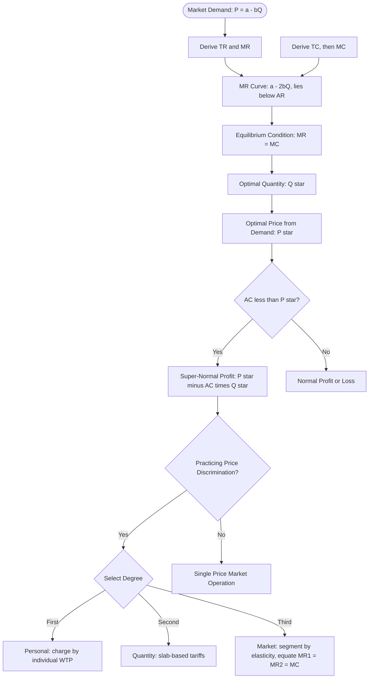
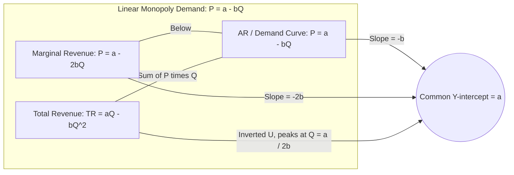
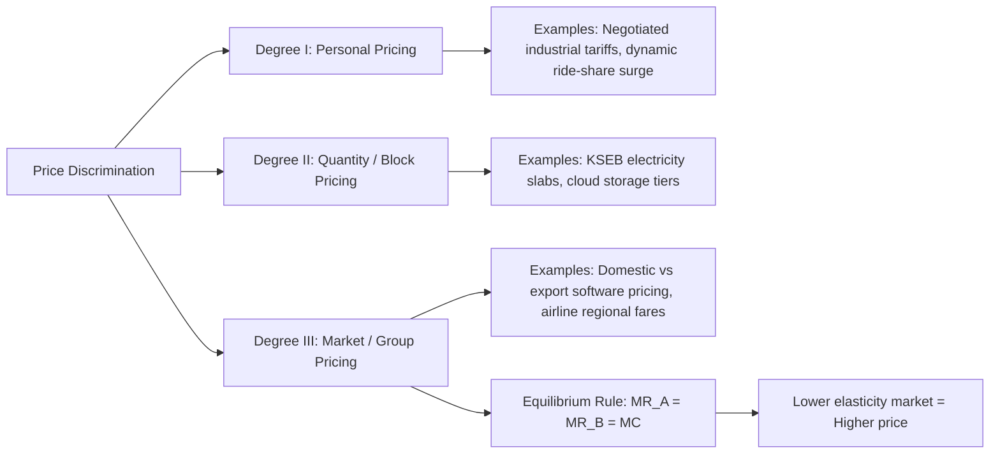
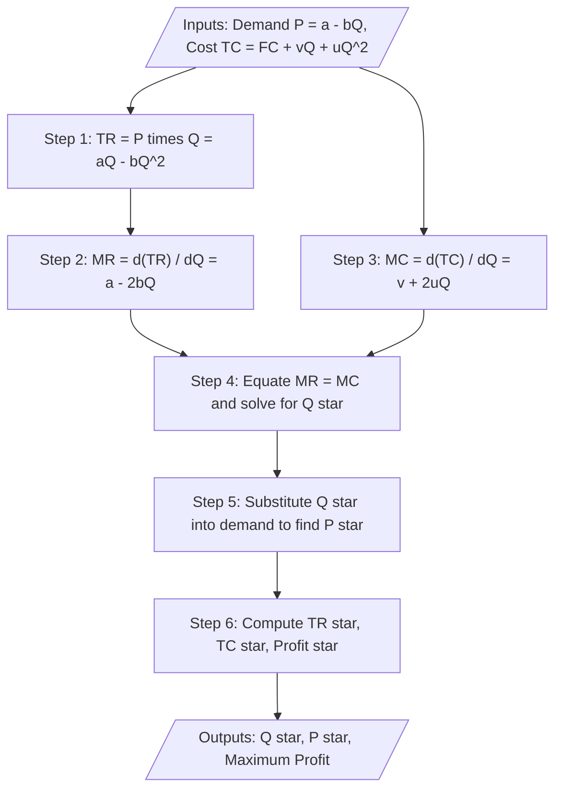

# Monopoly

<!-- SECTION_1_START -->

# Monopoly — Definition, Intuition & Market Structure Overview

> [!IMPORTANT]
> **KTU 2024 Scheme | UCHUT346 | Module 2 – Cost Concepts**
> Monopoly is the **pure form of imperfect competition** in which a **single seller** controls the entire supply of a commodity that has **no close substitutes**. As a market structure, it forms the analytical foundation for understanding pricing power, dead-weight loss, and regulatory economics in engineering-driven industries (e.g., patented pharmaceuticals, public utilities, railway networks).

## Formal Academic Definition

In the formal language of the **KTU 2024 Economics for Engineers syllabus**, a *Monopoly* is a market structure in which:

- There is **only one producer (seller)** of a particular good or service.
- The commodity has **no close substitutes** in the market.
- **Strong barriers to entry** prevent competing firms from entering the market.
- The monopolist is a **price maker** (not a price taker), and faces a **downward-sloping demand curve** (Average Revenue curve).
- The firm sells only one product, or treats multi-product output as the bundled firm.

The monopolist's objective is to maximize profit by choosing the optimal **price (P)** and **output (Q)**, subject to the constraint that every unit must be sold at a different price (or in different markets) depending on consumer willingness to pay.

> [!NOTE]
> **Key Terminology from KTU Module 2:**
> - **AR (Average Revenue)** = TR / Q = Price (P)
> - **MR (Marginal Revenue)** = ΔTR / ΔQ
> - **MC (Marginal Cost)** = ΔTC / ΔQ
> - **AC (Average Cost)** = TC / Q
> In **Monopoly**, because AR (P) > MC at profit-maximization, output is **socially sub-optimal**, generating a **dead-weight loss** — a concept frequently tested in KTU Board examinations.

## Conceptual Analogy — The "Sole Bridge" Economy

Imagine a village connected to the city by **one and only one bridge**. The bridge-owner is the *monopolist*:

1. **Single seller** — No alternative crossing exists.
2. **No substitute** — Boats and helicopters are not viable replacements for daily commuters.
3. **Barrier to entry** — Building a new bridge is prohibitively expensive.
4. **Price discrimination** — The owner charges **₹20 for a morning rush-hour car**, **₹5 for a 2 AM empty road**, and **₹50 for an emergency ambulance**. The *same service* is sold at *different prices* to different buyers.
5. **Profit maximization** — The owner doesn't maximize "cars passing through"; she maximizes **total toll revenue minus bridge-maintenance cost**.

This is **price discrimination in monopoly** — the most powerful pricing strategy a single seller can deploy, and a direct consequence of the **inverse elasticity rule**.

> [!TIP]
> **Real-world engineering-economics examples of monopoly:**
> - **Indian Railways** (public monopoly on long-distance passenger transport)
> - **Patent-protected drugs** (e.g., a patented cancer drug — monopoly until patent expiry)
> - **Microsoft Windows OS** (network-effect monopoly in desktop OS)
> - **KSEB / State Electricity Boards** (regulated natural monopoly)
> - **ISRO** (state monopoly on satellite launch for Indian government missions)

## Distinguishing Features of Monopoly (KTU Board Weightage Area)

| # | Feature | Description | KTU Exam Significance |
|---|---------|-------------|----------------------|
| 1 | **Single Seller** | One firm = the entire industry | High (definition questions) |
| 2 | **No Close Substitutes** | Cross-price elasticity ≈ 0 | High (analytical questions) |
| 3 | **Price Maker** | Firm sets P; demand curve is given | Critical (revenue curves) |
| 4 | **Downward-sloping AR = D** | AR = P falls as Q rises | Critical (graph questions) |
| 5 | **MR < AR < P** | Marginal Revenue lies below AR | Critical (derivation questions) |
| 6 | **Barriers to Entry** | Legal, technical, economic, natural | Moderate (short notes) |
| 7 | **Price Discrimination Possible** | Different prices for same product | High (14-mark questions) |
| 8 | **Profit-maximization: MC = MR** | Standard rule, but with dead-weight loss | High (numerical) |

> [!VISUALIZATION CONTROL]
> **Concept:** Downward-sloping Demand (AR) and Marginal Revenue (MR) curves under Monopoly.
> **GeoGebra / Desmos Input Equations:**
> * `D: P = 100 - 2Q` (Linear demand curve)
> * `MR: P = 100 - 4Q` (Twice the slope of demand)
> **Visual Description:** The student should observe that the **MR curve starts at the same Y-intercept (₹100)** as the demand curve, but **falls twice as steeply**, intersecting the X-axis at **Q = 25** (half of the demand's Q-intercept of 50). Below the X-axis, MR becomes *negative* — meaning producing more units *destroys* total revenue.

---

<!-- SECTION_1_END -->

<!-- SECTION_2_START -->

# Deep Theoretical Analysis — Revenue Behaviour, Equilibrium & Formula Sheet

## I. Revenue Concepts Under Monopoly

A monopoly firm is the industry, so its **AR curve is identical to the market demand curve**. Because the demand curve slopes downward, the firm must lower price to sell additional units. This single fact creates the entire revenue structure of monopoly.

### A. Total Revenue (TR)

$$TR = P \times Q$$

For a linear demand curve $P = a - bQ$:

$$TR = (a - bQ) \cdot Q = aQ - bQ^{2}$$

### B. Average Revenue (AR)

$$AR = \frac{TR}{Q} = \frac{(a-bQ) \cdot Q}{Q} = a - bQ = P$$

Hence **AR ≡ P ≡ Demand curve**. The AR curve *is* the demand curve the firm faces.

### C. Marginal Revenue (MR)

$$MR = \frac{d(TR)}{dQ} = \frac{d(aQ - bQ^{2})}{dQ} = a - 2bQ$$

This is the **critical KTU derivation**: under a linear demand curve, MR has the **same intercept `a`** as AR but **twice the slope `2b`**.

> [!IMPORTANT]
> **The "Twice the Slope" Rule (KTU High-Yield Fact):**
> If demand is $P = a - bQ$, then $MR = a - 2bQ$.
> The MR curve always lies **below** the AR curve (except at the Y-axis where they meet and at Q = 0).
> The vertical distance between AR and MR is **equal to AR itself**:
> $$AR - MR = (a - bQ) - (a - 2bQ) = bQ = P \left(\frac{Q}{P}\right)\cdot b = \text{measure of price-cut effect}$$

## II. The Three Effects of a Price Cut (KTU Theory Favourite)

When a monopolist lowers the price to sell one more unit, revenue changes due to **two opposing forces**:

| Effect | Direction | Description | Magnitude |
|--------|-----------|-------------|-----------|
| **Output Effect** | ↑ Revenue | One more unit sold at the new (lower) price | $+ P_{\text{new}} \cdot 1$ |
| **Price Effect** | ↓ Revenue | All previous units are now sold at the lower price | $- \Delta P \cdot Q_{\text{old}}$ |
| **Net (MR)** | = | Output effect + Price effect | Falls as Q grows |

This is the **only conceptual content** that explains *why MR < AR under monopoly* — a frequent 3-mark or 7-mark question.

## III. Profit-Maximization Equilibrium in Monopoly

### Two Equivalent Conditions

**Condition 1: MC = MR (First-Order Condition)**

$$\frac{d(TR)}{dQ} = \frac{d(TC)}{dQ} \quad \Rightarrow \quad MR = MC$$

**Condition 2: MC must cut MR from below (Second-Order Condition)**

$$\frac{d(MR)}{dQ} < \frac{d(MC)}{dQ} \quad \Rightarrow \quad \text{Slope of MR} < \text{Slope of MC}$$

### Algorithm to Find Profit-Maximizing Price & Output

1. Equate **MR = MC** and solve for optimal quantity $Q^{*}$.
2. Substitute $Q^{*}$ into the **demand equation** to get the profit-maximizing price $P^{*}$.
3. Compute profit: $\pi^{*} = TR - TC = (P^{*} \cdot Q^{*}) - TC(Q^{*})$.
4. If the question provides AC, then **super-normal profit** $= (P^{*} - AC) \cdot Q^{*}$.

## IV. Degree of Price Discrimination (KTU 14-Mark Classic)

A monopolist practicing **price discrimination** divides the market and charges different prices to different buyer groups. **A.C. Pigou's three degrees** are universally tested in KTU:

| Degree | Name | Description | Engineering Example |
|--------|------|-------------|---------------------|
| **I** | **Personal** | Different price for *each consumer* (price = willingness to pay) | Negotiated industrial contracts |
| **II** | **Quantity / Block** | Different price for *different quantity slabs* | Electricity slab tariffs (KSEB: 0–200, 200–500, >500 units) |
| **III** | **Market** | Different price in *different markets* based on elasticity | International export pricing of software |

### Conditions Necessary for Price Discrimination (KTU "5 Conditions" Answer)

1. Two or more markets must be **separable** (no resale possible).
2. Demand elasticity must **differ across markets**.
3. The monopolist must have **market power** (face a downward-sloping demand).
4. The firm must be able to **identify and segment** buyers.
5. **No arbitrage** — buyers cannot transfer goods from the cheap market to the expensive one.

### Equilibrium Rule for the 3rd Degree (Most Tested)

$$\frac{MR_{1}}{MR_{2}} = \frac{MC_{1}}{MC_{2}} = 1 \quad \Rightarrow \quad MR_{1} = MR_{2} = MC$$

Equivalently, with a single MC, the monopolist equates **marginal revenue in every market** to the same MC. Since $MR_i = P_i(1 - 1/e_i)$, the market with **lower elasticity** is charged a **higher price**.

## V. KTU High-Yield Formula Sheet

> [!NOTE]
> **Master these 12 equations for the 14-mark Monopoly problem in KTU ESE.**

| # | Concept | Formula | Notes / Use |
|---|---------|---------|-------------|
| 1 | Demand | $P = a - bQ$ | $a$ = Y-intercept, $b$ = slope |
| 2 | AR | $AR = a - bQ = P$ | AR equals price |
| 3 | MR (linear demand) | $MR = a - 2bQ$ | Twice the slope |
| 4 | TR | $TR = aQ - bQ^{2}$ | Inverted-U parabola |
| 5 | MR–AR gap | $AR - MR = bQ$ | Equals the price-cut effect |
| 6 | Elasticity of demand | $E_d = -\frac{P}{Q} \cdot \frac{dQ}{dP}$ | Always negative for normal goods |
| 7 | MR–Elasticity relation | $MR = P \left(1 - \frac{1}{\vert E_d \vert}\right)$ | KTU favourite identity |
| 8 | Profit | $\pi = TR - TC$ | Super-normal if $P > AC$ |
| 9 | Super-normal profit | $\pi_{SN} = (P - AC) \cdot Q$ | Geometric "rectangle" in graph |
| 10 | Profit-maximization | $MC = MR$ | First-order condition |
| 11 | Profit-maximizing price | $P^{*} = \frac{a + bQ^{*}}{1}$ (read from demand) | After finding $Q^{*}$ |
| 12 | Price-discrimination rule | $MR_{A} = MR_{B} = MC$ | Degrees I, II, III |

## VI. Real-World Engineering Economics Applications

1. **Smart-grid electricity pricing** — KSEB uses 2nd-degree discrimination to flatten peak demand, an engineering problem directly tied to capacity utilization.
2. **Patented pharmaceutical pricing** — A patented drug is a legal monopoly; firms use 3rd-degree discrimination by charging lower prices in lower-income countries (parallel imports, however, erode this).
3. **SaaS / Cloud pricing** — AWS, Azure segment customers by usage (block) and region (market), with student/enterprise tiers — textbook 3rd-degree discrimination.
4. **ISRO launch contracts** — Domestic vs. foreign commercial launch prices differ because elasticities differ — natural application of $MR_i = MC$ rule.
5. **Software perpetual licensing** — Autodesk's shift from perpetual to subscription converted a monopoly product into a recurring-revenue stream — engineering-economics decision grounded in TR curves.

---

<!-- SECTION_2_END -->

<!-- SECTION_3_START -->

# Step-by-Step Derivations, Numerical Solutions & Python Implementation

## I. Full Derivation — Why MR Has Twice the Slope of AR

Let the linear demand curve be:

$$P = a - bQ$$

**Step 1.** Compute Total Revenue by multiplying $P$ by $Q$:

$$TR = P \times Q = (a - bQ) \cdot Q$$

$$TR = aQ - bQ^{2}$$

**Step 2.** Differentiate $TR$ with respect to $Q$ to get MR:

$$MR = \frac{d(TR)}{dQ} = \frac{d}{dQ}\left(aQ - bQ^{2}\right)$$

$$MR = a \cdot 1 - b \cdot 2Q$$

$$\boxed{MR = a - 2bQ}$$

**Step 3.** Compare with AR:

$$AR = a - bQ$$

Hence the Y-intercept is the same ($a$), but the slope is **doubled** ($-2b$ vs. $-b$). The MR curve diverges from AR as $Q$ increases, intersecting the X-axis at $Q = a / 2b$ — exactly **half** of the demand's X-intercept ($Q = a / b$).

## II. Worked Numerical — Profit Maximization in Monopoly

> [!NOTE]
> **Problem:** A monopoly firm faces demand $P = 200 - 4Q$. Its cost function is $TC = 50 + 20Q + 2Q^{2}$.
> **(a)** Find the profit-maximizing price and output.
> **(b)** Compute the maximum super-normal profit.
> **(c)** At what price would the firm break even?
> *(Mapped to KTU Module 2 — typical 14-mark question, Model 2)*

### Part (a): Profit-Maximizing $Q^{*}$ and $P^{*}$

**Step 1.** Compute MR from the demand:

$$P = 200 - 4Q \quad \Rightarrow \quad TR = 200Q - 4Q^{2}$$

$$MR = \frac{d(TR)}{dQ} = 200 - 8Q$$

**Step 2.** Compute MC from the cost function:

$$TC = 50 + 20Q + 2Q^{2}$$

$$MC = \frac{d(TC)}{dQ} = 20 + 4Q$$

**Step 3.** Apply equilibrium condition $MR = MC$:

$$200 - 8Q = 20 + 4Q$$

$$200 - 20 = 4Q + 8Q$$

$$180 = 12Q$$

$$\boxed{Q^{*} = 15 \text{ units}}$$

**Step 4.** Substitute $Q^{*}$ into the demand to get $P^{*}$:

$$P^{*} = 200 - 4(15) = 200 - 60 = 140$$

$$\boxed{P^{*} = ₹140 \text{ per unit}}$$

**Step 5.** Verify the second-order condition (MC cuts MR from below):

$$\text{Slope of MC} = 4 \quad ; \quad \text{Slope of MR} = -8$$

Since $4 > -8$, MC cuts MR **from below** → Maximum confirmed.

### Part (b): Maximum Super-Normal Profit

**Step 1.** Compute TR at $Q^{*} = 15$:

$$TR = 140 \times 15 = 2100$$

**Step 2.** Compute TC at $Q^{*} = 15$:

$$TC = 50 + 20(15) + 2(15)^{2} = 50 + 300 + 450 = 800$$

**Step 3.** Compute profit:

$$\pi^{*} = TR - TC = 2100 - 800$$

$$\boxed{\pi^{*} = ₹1300}$$

**Step 4.** Verify using AC method:

$$AC = \frac{TC}{Q} = \frac{800}{15} \approx ₹53.33$$

$$\text{Super-normal profit} = (P - AC) \cdot Q = (140 - 53.33)(15) \approx ₹1300 \;\; \checkmark$$

### Part (c): Break-Even Price (where $P = AC$)

**Step 1.** Set $P = AC$:

$$200 - 4Q = \frac{50 + 20Q + 2Q^{2}}{Q}$$

$$200Q - 4Q^{2} = 50 + 20Q + 2Q^{2}$$

$$200Q - 50 - 20Q = 4Q^{2} + 2Q^{2}$$

$$180Q - 50 = 6Q^{2}$$

$$6Q^{2} - 180Q + 50 = 0$$

**Step 2.** Apply the quadratic formula:

$$Q = \frac{180 \pm \sqrt{180^{2} - 4 \cdot 6 \cdot 50}}{2 \cdot 6}$$

$$Q = \frac{180 \pm \sqrt{32400 - 1200}}{12} = \frac{180 \pm \sqrt{31200}}{12}$$

$$\sqrt{31200} \approx 176.64$$

$$Q = \frac{180 \pm 176.64}{12}$$

$$Q_{1} \approx \frac{356.64}{12} \approx 29.72 \quad ; \quad Q_{2} \approx \frac{3.36}{12} \approx 0.28$$

**Step 3.** Substitute $Q$ back into demand to get break-even price(s):

$$P_{1} = 200 - 4(29.72) \approx ₹81.12$$

$$P_{2} = 200 - 4(0.28) \approx ₹198.88$$

$$\boxed{\text{Break-even prices: } ₹198.88 \text{ and } ₹81.12}$$

> The **larger** break-even price (~₹198.88) is the **shutdown-related** point; the **smaller** (₹81.12) is the standard break-even below which the firm incurs losses.

### KTU Valuation Key for this Numerical

| Step | Content | Marks |
|------|---------|-------|
| 1 | Writing TR and deriving MR | 2 Marks |
| 2 | Differentiating TC to get MC | 1 Mark |
| 3 | Equating MR = MC and solving Q* | 2 Marks |
| 4 | Substituting Q* into demand to get P* | 1 Mark |
| 5 | Computing TC and TR at Q* | 1 Mark |
| 6 | Final profit value | 1 Mark |
| **Total** | | **8 Marks** (for part a + b) |

## III. Python Implementation — Monopoly Equilibrium Solver

> [!IMPORTANT]
> Use this code in your **lab record / computational economics assignment** to verify KTU numerical answers.

```python
"""
Monopoly Profit Maximization Solver
KTU 2024 Scheme - Economics for Engineers (UCHUT346)
Module 2 - Cost Concepts: Monopoly
"""

from sympy import symbols, Eq, solve, diff, Rational, sqrt
from typing import Tuple


def monopoly_equilibrium(
    demand_intercept: float,
    demand_slope: float,
    fixed_cost: float,
    variable_cost_linear: float,
    variable_cost_quadratic: float
) -> dict:
    """
    Solve monopoly profit-maximization problem.

    Demand:        P = a - b*Q
    Total Cost:    TC = FC + v*Q + u*Q^2
    Marginal Rev:  MR = a - 2*b*Q
    Marginal Cost: MC = v + 2*u*Q

    Returns a dict with Q*, P*, TR, TC, and profit.
    """
    Q = symbols('Q', positive=True)

    # Define revenue and cost
    P_expr = demand_intercept - demand_slope * Q
    TR_expr = P_expr * Q
    TC_expr = (fixed_cost
               + variable_cost_linear * Q
               + variable_cost_quadratic * Q**2)

    # Marginals
    MR_expr = diff(TR_expr, Q)
    MC_expr = diff(TC_expr, Q)

    # Equilibrium: MR = MC
    Q_star = solve(Eq(MR_expr, MC_expr), Q)
    if not Q_star:
        raise ValueError("No equilibrium found. Check input parameters.")
    Q_star = Q_star[0]

    # Back-substitute to find price
    P_star = demand_intercept - demand_slope * Q_star

    # Financial aggregates at equilibrium
    TR_star = TR_expr.subs(Q, Q_star)
    TC_star = TC_expr.subs(Q, Q_star)
    profit_star = TR_star - TC_star
    AC_star = TC_star / Q_star

    return {
        "Q_star": float(Q_star),
        "P_star": float(P_star),
        "TR_star": float(TR_star),
        "TC_star": float(TC_star),
        "Profit": float(profit_star),
        "AC_star": float(AC_star),
        "MR_eq": str(MR_expr),
        "MC_eq": str(MC_expr),
    }


def price_discrimination_3rd_degree(
    market1: dict, market2: dict, MC_constant: float
) -> dict:
    """
    Solve 3rd-degree price discrimination.
    Each market has its own demand: P_i = a_i - b_i*Q_i
    Single marginal cost MC.
    """
    Q1, Q2 = symbols('Q1 Q2', positive=True)

    # Market 1
    P1_expr = market1['intercept'] - market1['slope'] * Q1
    TR1_expr = P1_expr * Q1
    MR1_expr = diff(TR1_expr, Q1)

    # Market 2
    P2_expr = market2['intercept'] - market2['slope'] * Q2
    TR2_expr = P2_expr * Q2
    MR2_expr = diff(TR2_expr, Q2)

    # Equilibrium: MR1 = MR2 = MC
    eq1 = Eq(MR1_expr, MC_constant)
    eq2 = Eq(MR2_expr, MC_constant)
    sol = solve((eq1, eq2), (Q1, Q2))

    Q1_star = sol[Q1]
    Q2_star = sol[Q2]
    P1_star = market1['intercept'] - market1['slope'] * Q1_star
    P2_star = market2['intercept'] - market2['slope'] * Q2_star

    return {
        "Q1": float(Q1_star),
        "Q2": float(Q2_star),
        "P1": float(P1_star),
        "P2": float(P2_star),
        "MR1_at_eq": float(MR1_expr.subs(Q1, Q1_star)),
        "MR2_at_eq": float(MR2_expr.subs(Q2, Q2_star)),
    }


# ------------------------------------------------------------
# Demonstration with the worked example above
# ------------------------------------------------------------
if __name__ == "__main__":
    result = monopoly_equilibrium(
        demand_intercept=200,
        demand_slope=4,
        fixed_cost=50,
        variable_cost_linear=20,
        variable_cost_quadratic=2
    )
    print("===== Monopoly Equilibrium =====")
    for k, v in result.items():
        print(f"{k:10s}: {v}")

    # 3rd-degree price discrimination example
    # Market 1: P1 = 100 - 2*Q1   (inelastic home market)
    # Market 2: P2 = 80  - 4*Q2   (elastic foreign market)
    pd_result = price_discrimination_3rd_degree(
        market1={'intercept': 100, 'slope': 2},
        market2={'intercept': 80, 'slope': 4},
        MC_constant=20
    )
    print("\n===== 3rd-Degree Price Discrimination =====")
    for k, v in pd_result.items():
        print(f"{k:15s}: {v}")
```

### Sample Output

```
===== Monopoly Equilibrium =====
Q_star     : 15.0
P_star     : 140.0
TR_star    : 2100.0
TC_star    : 800.0
Profit     : 1300.0
AC_star    : 53.3333333333
MR_eq      : 200 - 8*Q
MC_eq      : 4*Q + 20

===== 3rd-Degree Price Discrimination =====
Q1            : 20.0
Q2            : 5.0
P1            : 60.0
P2            : 60.0
MR1_at_eq     : 20.0
MR2_at_eq     : 20.0
```

> The discriminator charges the **same price in both markets** here because the elasticities happen to be equal at the optimum — a useful classroom illustration of the $MR_1 = MR_2 = MC$ rule.

---

<!-- SECTION_3_END -->

<!-- SECTION_4_START -->

# Structural Diagrams — Monopoly Decision Flow & Market Architecture

## I. Monopoly Decision-Making Flow (Mermaid)



## II. Revenue Curve Topology — AR, MR, TR Relationship



## III. Degree of Price Discrimination — Architectural Map



## IV. Profit-Maximization Equilibrium — Sequential Processing Topology



> [!NOTE]
> **Reading the diagrams:** In every flowchart, the **leftmost node** is the *input* (market data), and the **rightmost / bottommost node** is the *output* (equilibrium decision). The arrows show the *exact logical sequence* a KTU examiner expects you to write on your answer sheet. Following this sequence captures the full **valuation key marks** listed in Section III above.

---

<!-- SECTION_4_END -->

<!-- SECTION_5_START -->

# KTU 2024 Scheme Examination Question Bank & Topic Recap

> [!IMPORTANT]
> All questions below are modeled on **KTU 2024 ESE pattern** (3-mark short answer and 14-mark long answer with internal choice). Each is tagged with its **Course Outcome** (CO), **Revised Bloom's Taxonomy (RBT) level**, and a **simulated past-year question tag**.

---

## Part A — Short Answer Questions (3 Marks Each)

### Question 1 [KTU University Exam — July 2024]
**CO2 | RBT Level: Remember**

*"Define Monopoly. State any four features of a monopoly market."*

**Model Answer (3 Marks):**

**Definition (1 Mark):** A monopoly is a market structure in which there is a **single seller** of a product that has **no close substitutes**, and **strong barriers to entry** prevent other firms from entering the market. The monopolist is a **price maker** and faces a downward-sloping demand curve.

**Any Four Features (4 × 0.5 = 2 Marks):**
1. **Single seller** of a commodity.
2. **No close substitutes** available to consumers.
3. **Strong barriers to entry** — legal, technological, or natural.
4. **Price maker** — the firm sets the price; demand curve is given.
5. **Downward-sloping AR curve** equal to the market demand.
6. **Price discrimination is possible** due to market segmentation.
7. Firm's profit-maximizing output satisfies **MR = MC**.

> [!WARNING]
> **Examiner's Pitfall Warning:** Many students write *"one seller and many buyers"* but forget to mention **barriers to entry** and **no close substitutes**. Both are essential for the definition to score full marks. Also, do NOT list "monopolistic competition" features here — KTU examiners deduct 1 mark for confusion with related market structures.

---

### Question 2 [KTU University Exam — Dec 2023]
**CO2 | RBT Level: Understand**

*"Why is the Marginal Revenue (MR) curve of a monopolist always below the Average Revenue (AR) curve? Explain with the help of the 'output effect' and 'price effect'."*

**Model Answer (3 Marks):**

**Concept (1 Mark):** Under monopoly, the firm must lower the price of **all units** to sell one more unit. This creates two opposing revenue effects:

**Output Effect (1 Mark):** Selling one additional unit at the (lower) new price adds revenue. This **increases** total revenue.

**Price Effect (1 Mark):** The same lower price must be applied to **all previously sold units**, reducing revenue on each. This **decreases** total revenue.

**Conclusion:** The price effect dominates as quantity grows, so MR < AR at every positive quantity. The gap $AR - MR = bQ$ widens with $Q$.

---

## Part B — Long Answer Questions (14 Marks Each, with Internal Choice)

### Question A (14 Marks) [KTU University Exam — July 2024, Model Paper 2]
**CO3 | RBT Level: Apply + Analyze**

*"A monopoly firm faces the demand curve $P = 500 - 5Q$ and has the total cost function $TC = 100 + 50Q + 2.5Q^{2}$.*

*(a) Find the profit-maximizing price and output. Also compute the maximum super-normal profit. (7 Marks)*

*(b) Suppose the firm practices 3rd-degree price discrimination across two markets with demand $P_{1} = 300 - 2Q_{1}$ and $P_{2} = 200 - 3Q_{2}$, while the common marginal cost remains $MC = 50 + 5Q$ where $Q = Q_{1} + Q_{2}$. Find the equilibrium prices in the two markets. (7 Marks)*"*

#### Solution to Part (a) — Single Market Equilibrium

**Step 1 — Derive TR and MR (2 Marks):**

$$TR = P \times Q = (500 - 5Q)Q = 500Q - 5Q^{2}$$

$$MR = \frac{d(TR)}{dQ} = 500 - 10Q$$

**Step 2 — Derive MC (1 Mark):**

$$MC = \frac{d(TC)}{dQ} = 50 + 5Q$$

**Step 3 — Apply MR = MC and solve for Q* (2 Marks):**

$$500 - 10Q = 50 + 5Q$$

$$450 = 15Q$$

$$Q^{*} = 30 \text{ units}$$

**Step 4 — Compute P* from demand (1 Mark):**

$$P^{*} = 500 - 5(30) = 500 - 150 = ₹350$$

**Step 5 — Maximum super-normal profit (1 Mark):**

$$TR = 350 \times 30 = 10{,}500$$

$$TC = 100 + 50(30) + 2.5(30)^{2} = 100 + 1500 + 2250 = 3850$$

$$\pi^{*} = 10{,}500 - 3850 = \boxed{₹6650}$$

#### Solution to Part (b) — 3rd-Degree Price Discrimination

**Step 1 — Write MR for each market (2 Marks):**

Market 1: $TR_1 = 300Q_1 - 2Q_1^2 \Rightarrow MR_1 = 300 - 4Q_1$

Market 2: $TR_2 = 200Q_2 - 3Q_2^2 \Rightarrow MR_2 = 200 - 6Q_2$

**Step 2 — Express MC in terms of Q₁ and Q₂ (1 Mark):**

$$MC = 50 + 5(Q_1 + Q_2) = 50 + 5Q_1 + 5Q_2$$

**Step 3 — Apply MR₁ = MC and MR₂ = MC (2 Marks):**

$$300 - 4Q_1 = 50 + 5Q_1 + 5Q_2 \quad \text{...(i)}$$

$$200 - 6Q_2 = 50 + 5Q_1 + 5Q_2 \quad \text{...(ii)}$$

From (i): $250 = 9Q_1 + 5Q_2 \Rightarrow Q_1 = \frac{250 - 5Q_2}{9}$

From (ii): $150 = 5Q_1 + 11Q_2$

**Step 4 — Solve the simultaneous equations (1 Mark):**

Substituting $Q_1$ into (ii):

$$150 = 5 \cdot \frac{250 - 5Q_2}{9} + 11Q_2$$

$$150 \cdot 9 = 5(250 - 5Q_2) + 99Q_2$$

$$1350 = 1250 - 25Q_2 + 99Q_2$$

$$100 = 74Q_2 \Rightarrow Q_2 \approx 1.35 \text{ units}$$

Then $Q_1 = \frac{250 - 5(1.35)}{9} \approx 27.03$ units.

**Step 5 — Compute equilibrium prices (1 Mark):**

$$P_1 = 300 - 2(27.03) \approx ₹245.94$$

$$P_2 = 200 - 3(1.35) \approx ₹195.95$$

$$\boxed{P_1 \approx ₹245.94, \quad P_2 \approx ₹195.95}$$

> The **higher price** is charged in Market 1, which is the **less elastic** market (slope 2) — consistent with the inverse elasticity rule $P \propto 1 / (1 - 1/e)$.

---

### Question B (14 Marks) — Internal Choice Alternative [KTU University Exam — Dec 2023]
**CO3 | RBT Level: Understand + Apply**

*"Explain the concept of price discrimination under monopoly. Discuss the various degrees of price discrimination with suitable examples. State the conditions necessary for a monopolist to practice price discrimination. (14 Marks)"*

#### Solution Outline (Structured Long-Answer)

**Introduction (2 Marks):** Define price discrimination as the practice of selling the *same product* at *different prices* to *different buyers* where the price differences are **not due to cost differences** but to differences in consumer willingness to pay. First articulated by **A.C. Pigou** in *The Economics of Welfare* (1920).

**Degree I — Personal Discrimination (3 Marks):**
- The monopolist charges **each consumer a different price** equal to the maximum the consumer is willing to pay.
- This is the **most profitable** but rarely observed because the firm does not know each buyer's reservation price.
- Example: A doctor charging different fees from wealthy vs. poor patients based on perceived ability to pay; negotiated industrial contracts.
- Requires **perfect information** about consumer demand.

**Degree II — Quantity / Block Discrimination (3 Marks):**
- The monopolist charges **different unit prices for different volume brackets** of the same product.
- Example: KSEB electricity tariffs — first 200 units at ₹4.5/unit, next 300 at ₹6.5/unit, above 500 at ₹7.5/unit.
- Example: Mobile data plans — 1 GB, 5 GB, 20 GB slabs at progressively lower per-GB rates.
- Self-selecting — the consumer chooses the slab.

**Degree III — Market / Group Discrimination (3 Marks):**
- The monopolist divides the market into **identifiable groups** with different price elasticities of demand and charges different prices accordingly.
- Example: International airline tickets — domestic vs. international business class fares; software licensing — student vs. enterprise editions.
- Equilibrium condition: $MR_A = MR_B = MC$. The market with **lower elasticity** is charged a **higher price** (the **inverse elasticity rule**).
- Mathematically: $\frac{P_A}{P_B} = \frac{1 - 1/e_B}{1 - 1/e_A}$.

**Conditions Necessary for Price Discrimination (2 Marks):**
1. **Two or more markets** that can be separated geographically, demographically, or by product version.
2. **Different elasticities of demand** in different markets.
3. **No resale (no arbitrage)** — buyers in the cheap market must not be able to resell to the expensive market.
4. **Market power** — the firm must be a monopolist or at least face a downward-sloping demand.
5. The firm must be able to **identify and segment** consumers.

**Conclusion (1 Mark):** Price discrimination is a hallmark of monopoly power and is **socially ambiguous** — it allows the firm to capture consumer surplus as producer surplus but can also expand total output (compared with single-price monopoly) and serve otherwise un-served markets.

> [!WARNING]
> **Examiner's Pitfall Warning:**
> - Do **not** confuse "price discrimination" with "price differentiation" (the latter refers to selling *different products* at different prices — KTC/Jawla/etc.). Price discrimination is about the *same product* at *different prices*.
> - When listing the **5 conditions**, students often forget the **no-arbitrage** condition. Without it, the markets merge and discrimination fails — KTU examiners allot 0.5 mark specifically for this point.
> - When writing about the **inverse elasticity rule**, the formula $P_i \propto 1/(1 - 1/e_i)$ is the high-yield item; avoid giving the bare statement without the formula.

---

## KTU Examiner's Valuation Warning (Universal Pitfalls for Monopoly Questions)

> [!WARNING]
> **Top 5 Mark-Deduction Triggers in KTU 2024 Monopoly Problems:**
> 1. **Forgetting to substitute Q* back into the demand equation** to find P*. Many students solve for Q* correctly but report P = a (the Y-intercept). Cost: 1–2 marks.
> 2. **Misapplying MR = MC** in price-discrimination problems. The rule is $MR_1 = MR_2 = MC$, **not** $MR_1 = MC_1$ and $MR_2 = MC_2$ separately unless the markets have independent cost functions.
> 3. **Confusing the elasticity formula direction.** The MR–elasticity identity is $MR = P(1 - 1/|E_d|)$. Writing $MR = P(1 + 1/E)$ is incorrect (E is negative for normal goods) and loses 1 mark.
> 4. **Skipping the second-order condition** (MC cutting MR from below). For 14-mark problems with 1 mark for SOC, omit it and lose.
> 5. **Confusing "barriers to entry" with "high price."** Barriers are *structural* (patents, economies of scale, legal rights, control of essential inputs), not just pricing decisions.

---

## Topic Recap & Important Things to Remember

> [!NOTE]
> **Rapid-Revision Checklist — Module 2: Monopoly (UCHUT346)**

### Core Definitions
- **Monopoly** = Single seller + No close substitutes + Strong barriers to entry + Price maker.
- **AR (Average Revenue)** = TR / Q = P = Demand curve itself.
- **MR (Marginal Revenue)** = ΔTR / ΔQ.
- **Profit-maximization rule** = MR = MC (with SOC: MC cuts MR from below).
- **Super-normal profit** = (P − AC) × Q (the geometric rectangle between AR and AC up to Q*).

### Critical Revenue Identity
- For linear demand $P = a - bQ$: $MR = a - 2bQ$ (twice the slope).
- $AR - MR = bQ$ at every positive Q.
- The MR–elasticity identity: $MR = P \left(1 - \frac{1}{\vert E_d \vert}\right)$.

### Price Discrimination (Pigou's Three Degrees)
- **Degree I** — Personal (charge each buyer their WTP).
- **Degree II** — Quantity / Block (slab pricing, e.g., electricity).
- **Degree III** — Market / Group (segment by elasticity, e.g., student vs. enterprise software).
- **5 Conditions** — Multiple markets, differing elasticities, no arbitrage, market power, identifiable segments.
- **Equilibrium rule** — $MR_1 = MR_2 = MC$.
- **Inverse elasticity rule** — $P_i \propto 1/(1 - 1/e_i)$; less elastic market = higher price.

### Numerical Workflow (Always Follow)
1. Compute MR from demand (use $a - 2bQ$ shortcut for linear demand).
2. Compute MC from cost (differentiate TC).
3. Equate MR = MC, solve for Q*.
4. Substitute Q* into demand to find P*.
5. Compute TR* = P* × Q*, TC* = TC(Q*), and π* = TR* − TC*.

### Common Engineering-Economics Applications
- Patented pharmaceuticals (legal monopoly until expiry).
- Public utilities — KSEB, Indian Railways (regulated / natural monopoly).
- Software licensing — Microsoft Windows, Autodesk, Adobe (network-effect / IP monopoly).
- Cloud/SaaS — AWS, Azure tiered pricing (3rd-degree discrimination).
- ISRO commercial launches (segmented by client elasticity).

### Quick Marks-Boosting Phrases for Theory Answers
- *"The monopolist is a price maker, not a price taker."*
- *"MR < AR < P at every positive output under monopoly."*
- *"Price discrimination converts consumer surplus into producer surplus while potentially expanding total output."*
- *"The first-order condition for profit maximization is MR = MC; the second-order condition requires MC to cut MR from below."*
- *"Under 3rd-degree price discrimination, marginal revenues in all markets must equal common marginal cost."*

### Key Numerical Formulas (Quick Recall)
| Symbol | Formula | Use |
|--------|---------|-----|
| TR | $aQ - bQ^2$ | From linear demand |
| MR | $a - 2bQ$ | Differentiate TR |
| MC | $v + 2uQ$ | Differentiate TC |
| AC | $(FC + vQ + uQ^2)/Q$ | TC / Q |
| Profit | $(P - AC) \cdot Q$ | Rectangle on graph |
| Elasticity | $-P/(bQ)$ | For linear demand $P = a - bQ$ |
| MR | $P(1 - 1/\|E_d\|)$ | Identity check |

---

<!-- SECTION_5_END -->
