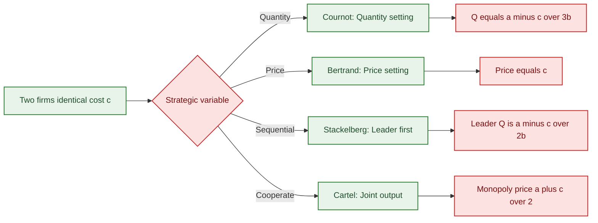
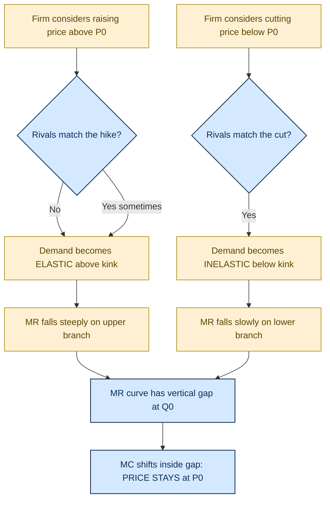

# Oligopoly (features and equilibrium of a firm)

<!-- SECTION_1_START -->
# Oligopoly: Core Definition & Intuitive Overview

## Formal Academic Definition (KTU 2024 Syllabus Terminology)

**Oligopoly** is a market structure in which a **small number of large, interdependent firms** dominate the entire market, selling either **homogeneous** (pure oligopoly) or **differentiated** (differentiated oligopoly) products. Each firm is large enough that its individual pricing, output, and advertising decisions have a **noticeable impact on the rivals' profit and market share**, making the firm *consciously aware* of rival behavior. The product may be standardized (e.g., steel, aluminium, cement) or differentiated (e.g., automobiles, mobile handsets, soft drinks).

> [!NOTE]
> **KTU 2024 Definition Snapshot:** *"Oligopoly is a market form in which the market is dominated by a few large firms, each of which recognizes that its own actions will produce a noticeable reaction from its competitors."*

## Conceptual Analogy / Intuitive Overview

Imagine a small chessboard with only **two or three grandmasters** playing simultaneously. Each move you make is watched closely — your king cannot be moved without considering the opponent's next move. This **strategic awareness** is the heartbeat of oligopoly. A small smartphone company, for instance, cannot launch a phone with a new chipset without immediately anticipating Samsung's or Apple's pricing response.

In contrast, in **perfect competition** no individual farmer worries about the neighbouring farmer's wheat output — there are millions. In **monopoly**, the single seller has no rival at all. **Oligopoly sits between these two extremes**, dominated by a handful of *price-setters* who *react* to each other.

## Salient Features of Oligopoly

> [!IMPORTANT]
> **Seven High-Yield Features (Board-Favourite):**

1. **Few Sellers** — Typically 2 to 10 large firms control 60%–90% of total market supply.
2. **Interdependence** — The *defining* feature. Every firm must forecast rival reaction (game-theoretic thinking).
3. **Barriers to Entry** — Patents, capital intensity, brand loyalty, control over raw materials, and economies of scale.
4. **Product Nature** — May be *homogeneous* (cement, crude oil) or *differentiated* (cars, detergents).
5. **Selling Costs** — Heavy expenditure on advertising, branding, and after-sales service (non-price competition).
6. **Price Rigidity / Inflexibility** — Once a price is set, firms hesitate to alter it for fear of triggering a *price war*.
7. **Indeterminate Demand Curve** — Unlike monopoly or competition, a *single* demand curve cannot be drawn for an oligopolist because rivals' reactions shift it.

> [!TIP]
> **Mnemonic — "FIBS-PPR":** **F**ew sellers, **I**nterdependence, **B**arriers, **S**elling costs, **P**roduct differentiation, **P**rice rigidity, **R**ivals' reactions.

## Classification of Oligopoly Models

| Model | Decision Variable | Rival Assumption | Equilibrium Outcome |
|---|---|---|---|
| **Cournot (1838)** | Quantity | Rival's quantity is *fixed* | Stable duopoly quantities |
| **Bertrand (1883)** | Price | Rival's price is *fixed* | Price = Marginal Cost |
| **Stackelberg (1934)** | Quantity (leader-follower) | Follower accepts leader's output | Asymmetric quantities |
| **Kinked Demand (Sweezy, 1939)** | Price | Asymmetric rivals' reaction | Price rigidity |
| **Cartel / Collusion** | Joint quantity/price | Firms cooperate | Monopoly outcome |

> [!NOTE]
> **Geometric Intuition for Kinked Demand:** The demand curve is *kinked* at the prevailing price — *elastic* above (rivals won't match a price hike) and *inelastic* below (rivals will instantly match a price cut). The corresponding Marginal Revenue curve has a **vertical gap (discontinuity)** at the prevailing output, allowing cost variations within the gap without changing the price.

> [!VISUALIZATION CONTROL]
> **Concept:** Kinked Demand Curve
> **GeoGebra / Desmos Input Equations:**
> * Demand upper: `f(x) = 100 - 2*x` (for $P > 30$)
> * Demand lower: `g(x) = 60 - 0.5*x` (for $P < 30$)
> * MR upper: `h(x) = 100 - 4*x`
> * MR lower: `j(x) = 60 - x`
> **Visual Description:** Plot four linear segments. At $P = 30$ on the y-axis, two demand lines meet forming a "kink." Two MR lines have a vertical discontinuity (a gap) at the corresponding $Q$ value. A horizontal MC line drawn through the gap confirms price stability.

<!-- SECTION_1_END -->

<!-- SECTION_2_START -->
# Deep Theoretical Analysis & KTU High-Yield Formula Sheet

## I. Cournot Duopoly Model (Austrian School, 1838)

**Assumptions (Board-Exam Critical):**
- Two firms, **A** and **B**, producing an *identical* (homogeneous) product.
- Both firms have *zero* production cost ($MC = 0$) in the classical Cournot setup, or constant MC in the modern version.
- Each firm decides its output **simultaneously and independently**.
- Each firm assumes the rival's output is **fixed (constant)** when making its own decision.
- Market demand is linear and known.
- Products are sold at a single market price.

**Reaction (Best-Response) Functions:**

Let the market demand be $P = a - b(Q_A + Q_B)$, with $a, b > 0$.

**Profit of Firm A:** 
$$\pi_A = P \cdot Q_A - C_A(Q_A) = \left[a - b(Q_A + Q_B)\right] Q_A - c Q_A$$

**FOC for Firm A** (treating $Q_B$ as a constant):

$$\frac{\partial \pi_A}{\partial Q_A} = a - 2b Q_A - b Q_B - c = 0$$

Solving for $Q_A$:

$$Q_A = \frac{a - c}{2b} - \frac{Q_B}{2} \quad \text{...(Firm A's Reaction Function)}$$

By symmetry, for Firm B:

$$Q_B = \frac{a - c}{2b} - \frac{Q_A}{2} \quad \text{...(Firm B's Reaction Function)}$$

**Cournot-Nash Equilibrium** (intersection of two reaction functions):

Substituting one into the other:

$$Q_A = Q_B = \frac{a - c}{3b} \quad \text{...(Each firm's equilibrium output)}$$

**Equilibrium Price:**

$$P^* = a - b\left(\frac{a - c}{3b} + \frac{a - c}{3b}\right) = \frac{a + 2c}{3}$$

**Equilibrium Profit per firm:**

$$\pi_A^* = \pi_B^* = \left(\frac{a - c}{3}\right)^2 \cdot \frac{1}{b}$$

> [!IMPORTANT]
> **Note:** Compare the Cournot price $\frac{a+2c}{3}$ with the monopoly price $P_M = \frac{a+c}{2}$ and the competitive price $P_C = c$. Thus $P_C < P_{\text{Cournot}} < P_M$. Cournot lies *between* perfect competition and monopoly.

---

## II. Bertrand Duopoly Model (1883)

**Assumptions:**
- Two firms produce a *homogeneous* product at **constant marginal cost** $MC = c$.
- Firms compete on **price**, not quantity.
- Each firm assumes the rival's price is **fixed** when setting its own.
- Consumers buy from the lower-priced firm; if prices tie, demand is split equally.

**Bertrand's Paradox:**
The only stable Nash equilibrium in a one-shot simultaneous price game is:

$$P_1^* = P_2^* = c \quad \text{(i.e., price equals marginal cost)}$$

> [!NOTE]
> **Why?** If $P_1 > P_2$, Firm 1 captures zero customers. Even a tiny undercut of $P_2$ by Firm 1 grabs the entire market, so the incentive to undercut persists until $P = MC$. The equilibrium mimics *perfect competition* despite there being only two firms.

---

## III. Kinked Demand Curve (Sweezy, 1939) — Explaining Price Rigidity

**The Hypothesis:**
- If a firm *raises* its price above the prevailing level $P_0$, rivals **do not match** it → the firm loses many customers → demand is **highly elastic** above $P_0$.
- If a firm *lowers* its price below $P_0$, rivals **do match** the cut → the firm gains few new customers → demand is **highly inelastic** below $P_0$.

**Consequence on Marginal Revenue:**
- Above the kink, MR is *steeper* (falls faster).
- Below the kink, MR is *flatter* (falls slowly).
- Hence MR has a **discontinuous vertical gap** at the kink output $Q_0$.

**The Price Rigidity Theorem:**
Any *increase* in MC that shifts the MC curve upward but still within the MR gap **will not change the profit-maximising price** $P_0$. Output $Q_0$ remains optimal, and the price remains sticky. This elegantly explains why oligopolistic prices do not change daily despite fluctuating costs.

---

## IV. Stackelberg Leader–Follower Model

- **Leader** (Firm A) commits to an output *first*, knowing the **Follower** (Firm B) will react optimally.
- Leader anticipates the follower's reaction function $Q_B(Q_A)$ and maximises its own profit.
- Equilibrium outputs are **asymmetric**: the leader produces *more*, the follower *less*.

By backward induction:

$$Q_A^{\text{leader}} = \frac{a - c}{2b}, \qquad Q_B^{\text{follower}} = \frac{a - c}{4b}$$

Leader profit > Follower profit > Either Cournot firm's profit.

---

## V. Cartel (Collusive Oligopoly) Equilibrium

Firms jointly act like a monopolist. They set the **joint profit-maximising output** $Q_M$ and split it (often equally):

$$Q_M = \frac{a - c}{2b}, \qquad P_M = \frac{a + c}{2}$$

But cartels are **unstable** because each member has a private incentive to *cheat* by secretly producing more (a classic prisoner's dilemma).

## KTU High-Yield Formula Sheet

| Concept / Model | Key Formula | Description |
|---|---|---|
| Market Demand | $P = a - b(Q_A + Q_B)$ | Linear inverse demand, $a, b > 0$ |
| Reaction Function (Cournot) | $Q_A = \frac{a - c}{2b} - \frac{Q_B}{2}$ | Best-response quantity of Firm A |
| Cournot Equilibrium Output | $Q_A^* = Q_B^* = \frac{a - c}{3b}$ | Each firm produces this |
| Cournot Equilibrium Price | $P^* = \frac{a + 2c}{3}$ | Lies between $c$ and $P_M$ |
| Monopoly Price | $P_M = \frac{a + c}{2}$ | For reference / comparison |
| Bertrand Equilibrium Price | $P_B = c = MC$ | Bertrand paradox |
| Stackelberg Leader Output | $Q_A^{L} = \frac{a - c}{2b}$ | Leader produces more |
| Stackelberg Follower Output | $Q_B^{F} = \frac{a - c}{4b}$ | Follower produces less |
| Cartel (Monopoly) Output | $Q_M = \frac{a - c}{2b}$ | Joint maximisation |
| Cartel Price | $P_M = \frac{a + c}{2}$ | Same as monopoly |
| Kinked Demand Elasticity | $\vert E_d \vert$ *high* above $P_0$ | Rivals don't match price hike |
| Kinked Demand Elasticity | $\vert E_d \vert$ *low* below $P_0$ | Rivals match price cut |

## Real-World Engineering & Economic Applications

> [!TIP]
> **Where does oligopoly thinking actually show up in industry?**
> - **Semiconductor Industry** (Intel, AMD, TSMC): Capacity decisions, R&D races.
> - **Telecom Operators** (Jio, Airtel, Vi): Tariff wars, data-price rivalry.
> - **Automobile OEMs** (Maruti, Hyundai, Tata): Kinked-demand price rigidity in MRP announcements.
> - **Global Airlines (Star Alliance vs Oneworld)**: Cartel-like fare coordination on shared routes.
> - **OPEC** (oil cartel): Quota-setting is textbook joint-profit maximisation.
> - **AI Model Providers** (OpenAI, Anthropic, Google): API pricing as live Bertrand competition.

These industries show that **engineering managers** in oligopolistic markets must consider *strategic* variables (rivals' capacity, R&D spend, advertising elasticity) and not merely cost-side data.

<!-- SECTION_2_END -->

<!-- SECTION_3_START -->
# Step-by-Step Derivations & Symbolic Implementation

## Derivation 1: Cournot Equilibrium with Non-Zero Marginal Cost

**Given:** Market demand $P = 200 - 4Q$, where $Q = Q_A + Q_B$. Both firms have identical cost $C_i = 20Q_i$ (so $MC = 20$).

**Step 1 — Write down the profit function of Firm A:**

$$\pi_A = P \cdot Q_A - C_A = (200 - 4(Q_A + Q_B)) Q_A - 20 Q_A$$

**Step 2 — Expand and simplify:**

$$\pi_A = 200 Q_A - 4 Q_A^2 - 4 Q_A Q_B - 20 Q_A$$

**Step 3 — Take the first-order condition with respect to $Q_A$ (treat $Q_B$ as a constant):**

$$\frac{\partial \pi_A}{\partial Q_A} = 200 - 8 Q_A - 4 Q_B - 20 = 0$$

**Step 4 — Simplify to obtain Firm A's reaction function:**

$$180 - 8 Q_A - 4 Q_B = 0$$

$$8 Q_A = 180 - 4 Q_B$$

$$Q_A = 22.5 - 0.5 Q_B \quad \text{...(R}_A\text{)}$$

**Step 5 — By symmetry, Firm B's reaction function is:**

$$Q_B = 22.5 - 0.5 Q_A \quad \text{...(R}_B\text{)}$$

**Step 6 — Solve the two equations simultaneously (substitute $R_B$ into $R_A$):**

$$Q_A = 22.5 - 0.5(22.5 - 0.5 Q_A)$$

$$Q_A = 22.5 - 11.25 + 0.25 Q_A$$

$$0.75 Q_A = 11.25$$

$$Q_A = 15 \text{ units} \quad \text{[Final answer: 1 Mark]}$$

**Step 7 — By symmetry, $Q_B = 15$ units.**

**Step 8 — Compute the equilibrium market price:**

$$P^* = 200 - 4(15 + 15) = 200 - 120 = 80$$

**Step 9 — Compute the profit of each firm:**

$$\pi_A^* = \pi_B^* = (80 - 20) \times 15 = 60 \times 15 = 900$$

> [!NOTE]
> **Valuation Key (KTU Board):** Step 1: 1 Mark • Step 2: 1 Mark • Step 3: 2 Marks • Step 4 (reaction function): 2 Marks • Step 5: 1 Mark • Step 6 (substitution): 1 Mark • Step 7-9: 1 Mark each.

---

## Derivation 2: Stackelberg Leader–Follower Equilibrium

**Same demand $P = 200 - 4Q$ and $MC = 20$ for both firms.**

**Step 1 — Identify the follower's reaction function (Firm B follows Firm A):**

The follower's first-order condition is identical to Cournot:

$$Q_B = 22.5 - 0.5 Q_A \quad \text{(FOC of Firm B)}$$

**Step 2 — Leader (Firm A) anticipates this and substitutes into its own profit:**

$$\pi_A = \left[200 - 4\left(Q_A + (22.5 - 0.5 Q_A)\right)\right] Q_A - 20 Q_A$$

**Step 3 — Simplify the bracketed demand term:**

$$Q_A + 22.5 - 0.5 Q_A = 0.5 Q_A + 22.5$$

$$P = 200 - 4(0.5 Q_A + 22.5) = 200 - 2 Q_A - 90 = 110 - 2 Q_A$$

**Step 4 — Substitute into the leader's profit and expand:**

$$\pi_A = (110 - 2 Q_A) Q_A - 20 Q_A = 110 Q_A - 2 Q_A^2 - 20 Q_A = 90 Q_A - 2 Q_A^2$$

**Step 5 — FOC for the leader:**

$$\frac{d \pi_A}{d Q_A} = 90 - 4 Q_A = 0$$

$$Q_A^{\text{leader}} = 22.5 \text{ units}$$

**Step 6 — Compute the follower's output using its reaction function:**

$$Q_B^{\text{follower}} = 22.5 - 0.5(22.5) = 11.25 \text{ units}$$

**Step 7 — Compute the market price and profits:**

$$P = 200 - 4(22.5 + 11.25) = 200 - 135 = 65$$

$$\pi_A = (65 - 20)(22.5) = 45 \times 22.5 = 1012.5$$

$$\pi_B = (65 - 20)(11.25) = 45 \times 11.25 = 506.25$$

> [!TIP]
> **Observation:** Leader profit (1012.5) > Cournot profit (900) > Follower profit (506.25). The *first-mover advantage* is real and quantifiable.

---

## Derivation 3: Kinked Demand Price Rigidity

**Given:** Kink price $P_0 = 50$, kink quantity $Q_0 = 30$. Demand above: $P = 80 - Q$ (elastic). Demand below: $P = 50 - 0.5(Q - 30) = 65 - 0.5 Q$ (inelastic).

**Step 1 — Verify the kink point** lies on both segments:

Upper: $P = 80 - 30 = 50$ ✓
Lower: $P = 65 - 0.5(30) = 65 - 15 = 50$ ✓

**Step 2 — MR of upper segment** ($P = 80 - Q$ ⇒ $TR = 80Q - Q^2$):

$$MR_{\text{upper}} = 80 - 2Q \quad \Rightarrow \quad \text{at } Q_0 = 30, \quad MR_{\text{upper}} = 80 - 60 = 20$$

**Step 3 — MR of lower segment** ($P = 65 - 0.5 Q$ ⇒ $TR = 65 Q - 0.5 Q^2$):

$$MR_{\text{lower}} = 65 - Q \quad \Rightarrow \quad \text{at } Q_0 = 30, \quad MR_{\text{lower}} = 65 - 30 = 35$$

**Step 4 — Identify the MR gap:**

$$MR \in [20, 35] \text{ at } Q_0 = 30$$

> [!IMPORTANT]
> **Conclusion:** The MR curve has a *vertical discontinuity* of length $(35 - 20) = 15$ at $Q_0 = 30$. Any $MC$ value strictly between **20 and 35** yields the *same* profit-maximising decision: produce $Q_0 = 30$, charge $P_0 = 50$. **The price is rigid.**

---

## Python Symbolic Implementation (for Engineering Students)

```python
"""
Oligopoly Equilibrium Calculator
Implements Cournot, Bertrand, Stackelberg, and Kinked Demand models.
Useful for engineering-economics simulation labs.
"""

from dataclasses import dataclass
from typing import Tuple, Dict


@dataclass(frozen=True)
class OligopolyParams:
    a: float          # Demand intercept (P = a - b*Q)
    b: float          # Demand slope (positive)
    c: float          # Marginal cost (assumed identical for both firms)
    mc_upper_bound: float = 0.0  # For kinked demand MR upper limit
    mc_lower_bound: float = 0.0  # For kinked demand MR lower limit


def cournot_equilibrium(p: OligopolyParams) -> Dict[str, float]:
    """
    Compute Cournot duopoly equilibrium.
    Returns per-firm output, market price, and per-firm profit.
    """
    q_star = (p.a - p.c) / (3 * p.b)
    price = p.a - 2 * p.b * q_star
    profit = (price - p.c) * q_star
    return {
        "Q_A": q_star,
        "Q_B": q_star,
        "Price": price,
        "Profit_A": profit,
        "Profit_B": profit,
    }


def bertrand_equilibrium(p: OligopolyParams) -> Dict[str, float]:
    """
    Compute Bertrand duopoly equilibrium.
    Equilibrium price equals marginal cost (Bertrand's paradox).
    """
    return {
        "Price": p.c,
        "Economic_Profit": 0.0,
        "Note": "Bertrand paradox: P = MC, zero economic profit",
    }


def stackelberg_equilibrium(p: OligopolyParams) -> Dict[str, float]:
    """
    Compute Stackelberg leader-follower equilibrium.
    Firm A is the leader; Firm B is the follower.
    """
    q_leader = (p.a - p.c) / (2 * p.b)
    q_follower = (p.a - p.c) / (4 * p.b)
    price = p.a - p.b * (q_leader + q_follower)
    return {
        "Q_A_leader": q_leader,
        "Q_B_follower": q_follower,
        "Price": price,
        "Profit_A": (price - p.c) * q_leader,
        "Profit_B": (price - p.c) * q_follower,
    }


def kinked_demand_check(p: OligopolyParams, mc: float) -> Dict[str, object]:
    """
    Check if a given marginal cost falls within the MR discontinuity gap.
    If yes, the price remains rigid at the kink.
    """
    within_gap = (p.mc_lower_bound <= mc <= p.mc_upper_bound)
    return {
        "MC": mc,
        "MR_lower": p.mc_lower_bound,
        "MR_upper": p.mc_upper_bound,
        "Price_Sticky": within_gap,
        "Interpretation": (
            "Price rigid at kink (P0) since MC is within MR gap."
            if within_gap
            else "Price will adjust: MC lies outside the MR gap."
        ),
    }


# ---------- Example Run ----------
if __name__ == "__main__":
    params = OligopolyParams(a=200.0, b=4.0, c=20.0)

    print("=== Cournot ===")
    for k, v in cournot_equilibrium(params).items():
        print(f"  {k} = {v:.2f}")

    print("\n=== Bertrand ===")
    for k, v in bertrand_equilibrium(params).items():
        print(f"  {k} = {v}")

    print("\n=== Stackelberg ===")
    for k, v in stackelberg_equilibrium(params).items():
        print(f"  {k} = {v:.2f}")

    # Kinked demand example: MR gap between 20 and 35 at Q0 = 30
    kinked = OligopolyParams(
        a=80.0, b=1.0, c=0.0,
        mc_upper_bound=35.0, mc_lower_bound=20.0
    )
    print("\n=== Kinked Demand (MC = 28 lies in gap) ===")
    for k, v in kinked_demand_check(kinked, mc=28.0).items():
        print(f"  {k} = {v}")
```

> [!TIP]
> **Engineering Use-Case:** MBA-engineering students in operations, supply-chain, or tech-strategy roles can extend this script to model *real* price wars in their industry (e.g., 5G telecom tariff cuts) by changing only the parameters `a`, `b`, `c`.

<!-- SECTION_3_END -->

<!-- SECTION_4_START -->
# Structural Diagrams & Schematics

## Diagram 1: Classification of Oligopoly Models (Block Topology)

```mermaid
flowchart TD
    classDef root fill:#1f3a5f,color:#ffffff,stroke:#0b1d36,stroke-width:2px
    classDef model fill:#d6e4f0,color:#0b1d36,stroke:#1f3a5f,stroke-width:1.5px
    classDef detail fill:#fff7d6,color:#5c4400,stroke:#a17f00,stroke-width:1px

    OLIGO[OLIGOPOLY MARKET STRUCTURE]:::root
    COU[Cournot Model]:::model
    BER[Bertrand Model]:::model
    STA[Stackelberg Model]:::model
    KIN[Kinked Demand Sweezy]:::model
    COL[Collusion and Cartel]:::model
    PL[Price Leadership]:::model

    COU --> COU1[Decision Variable: Quantity]:::detail
    COU --> COU2[Rival Assumed Fixed: Output]:::detail
    COU --> COU3[Stable Duopoly Quantities]:::detail

    BER --> BER1[Decision Variable: Price]:::detail
    BER --> BER2[Rival Assumed Fixed: Price]:::detail
    BER --> BER3[Outcome: Price equals MC]:::detail

    STA --> STA1[Leader moves first]:::detail
    STA --> STA2[Follower reacts]:::detail
    STA --> STA3[Asymmetric Outputs]:::detail

    KIN --> KIN1[Asymmetric Rival Reaction]:::detail
    KIN --> KIN2[Elastic above kink]:::detail
    KIN --> KIN3[Inelastic below kink]:::detail
    KIN --> KIN4[MR gap yields price rigidity]:::detail

    COL --> COL1[Joint profit maximisation]:::detail
    COL --> COL2[Cartel instability]:::detail
    COL --> COL3[Cheating incentive]:::detail

    PL --> PL1[Barometric firm sets price]:::detail
    PL --> PL2[Others follow]:::detail
```



## Diagram 2: Comparative Equilibrium Architecture Across Models



## Diagram 3: Kinked Demand — Sequential Processing Topology



## Diagram 4: Kinked Demand Geometric Reference (ASCII Schematic)

```
            Price (P)
              |
         P0 --+---------------------- ← Prevailing (kink) price
              | \                    \
              |  \                    \   (Inelastic
              |   \                    \    lower segment)
              |    \                    \
              |     \                    \
              |      \                    \
              |       \                    \_______
              |        \  Elastic upper
              |         \   segment
              |          \________________________
              |  (Steep)                          \____
              |
              +--------------------------------------→  Quantity (Q)
              0      Q0                            Q_max
              
   MR curve (discontinuous):
   
              |
         MRupper = 80 - 2Q
              |   \
              |    \
              |     \   (vertical gap at Q0)
              |      |  ← MR lower = 65 - Q
              |      |   \
              |      |    \
              +------+-----+-------------------→
              0     Q0
```

> [!NOTE]
> **Reading the schematic:** Above the kink, demand is *elastic* (rivals don't match hikes). Below the kink, demand is *inelastic* (rivals match cuts). The MR curve inherits the kink as a *vertical gap*, providing the geometric foundation of price rigidity.

<!-- SECTION_4_END -->

<!-- SECTION_5_START -->
# KTU 2024 Scheme Examination Question Bank & Topic Recap

## PART A: 3-Mark Short-Answer Questions

### Question 1 `[KTU University Exam – July 2024]`
**CO1, Remember**

**Q: Define oligopoly. List any four distinguishing features of an oligopolistic market.**

**Model Answer:**

Oligopoly is a market structure in which a **small number of large, interdependent firms** dominate the market, and each firm is aware that its own decisions on price, output, and advertising will significantly influence the actions of its rivals.

**Four distinguishing features:**

1. **Few sellers** — A handful (typically 2–10) of large firms control the bulk of market supply.
2. **Mutual interdependence** — Firms must take into account the likely reactions of competitors before making pricing or output decisions.
3. **High barriers to entry** — Capital requirements, patents, brand loyalty, and economies of scale prevent new firms from entering easily.
4. **Price rigidity and selling costs** — Prices remain relatively stable, and firms spend heavily on advertising and non-price competition to gain market share.

> [!NOTE]
> **Valuation Key:** Definition: 1.5 Marks • Two features: 0.75 Mark each (Total 1.5 Marks) • Presentation: 0 Mark (already counted).

---

### Question 2 `[KTU University Exam – Dec 2023]`
**CO1, Understand**

**Q: What is the "kinked demand curve" hypothesis? How does it explain price rigidity under oligopoly?**

**Model Answer:**

The kinked demand curve hypothesis, proposed by **Paul Sweezy (1939)**, explains why oligopolistic prices tend to remain stable (rigid) in the face of cost variations.

- **Above the prevailing price $P_0$:** If a firm raises its price, **rivals do not follow** the hike (to gain market share). The firm therefore loses a *large* number of customers → demand is **highly elastic** above $P_0$.
- **Below the prevailing price $P_0$:** If a firm lowers its price, **rivals immediately match** the cut (to protect market share). The firm therefore gains only a *few* new customers → demand is **highly inelastic** below $P_0$.

The corresponding Marginal Revenue curve has a **vertical discontinuity** at the prevailing output $Q_0$. Any increase in marginal cost that shifts the MC curve *within* this MR gap does not change the profit-maximising price $P_0$. **Hence prices remain rigid** even when production costs change.

> [!NOTE]
> **Valuation Key:** Naming the economist + demand asymmetry: 1.5 Marks • MR gap explanation: 1 Mark • Linking MC-inside-gap to price rigidity: 0.5 Mark.

---

## PART B: 14-Mark Questions (Module Internal Choice)

### Question A (14 Marks) `[KTU University Exam – July 2024]`
**CO2, Apply**

**(a)** Explain the **Cournot duopoly model** with its assumptions. Derive the reaction functions of the two firms and the **Cournot-Nash equilibrium** for the inverse demand $P = 100 - 2(Q_A + Q_B)$ and constant marginal cost $MC = 10$. **\[7 Marks\]**

**(b)** Compute the **equilibrium price, output per firm, and profit per firm**. Compare the Cournot price with the **monopoly** and **perfectly competitive** prices for the same setup. **\[7 Marks\]**

**Model Solution:**

**(a) Assumptions of Cournot model: (1 Mark)**
- Two firms A and B producing a *homogeneous* product.
- Each firm decides its output *simultaneously and independently*.
- Each firm treats the rival's output as **fixed (given)**.
- Identical cost structure $MC = 10$.
- Linear inverse demand $P = 100 - 2(Q_A + Q_B)$.

**Profit of Firm A:** **\[1 Mark\]**

$$\pi_A = P \cdot Q_A - 10 Q_A = \left[100 - 2(Q_A + Q_B)\right] Q_A - 10 Q_A$$

**First-Order Condition for Firm A:** **\[1 Mark\]**

$$\frac{\partial \pi_A}{\partial Q_A} = 100 - 4 Q_A - 2 Q_B - 10 = 0$$

**Reaction Function of Firm A:** **\[1 Mark\]**

$$4 Q_A = 90 - 2 Q_B \quad \Rightarrow \quad Q_A = 22.5 - 0.5 Q_B \quad \text{...(R}_A\text{)}$$

**By symmetry, Reaction Function of Firm B:** **\[1 Mark\]**

$$Q_B = 22.5 - 0.5 Q_A \quad \text{...(R}_B\text{)}$$

**Solving simultaneously:** **\[2 Marks\]**

$$Q_A = 22.5 - 0.5(22.5 - 0.5 Q_A)$$

$$Q_A = 22.5 - 11.25 + 0.25 Q_A$$

$$0.75 Q_A = 11.25 \quad \Rightarrow \quad Q_A^* = 15$$

By symmetry, $Q_B^* = 15$.

**[Equilibrium output: 1 Mark for stating the value]**

**(b) Equilibrium price:** **\[2 Marks\]**

$$P^* = 100 - 2(15 + 15) = 100 - 60 = 40$$

**Profit per firm:** **\[2 Marks\]**

$$\pi_A^* = (40 - 10)(15) = 450$$

**Comparative prices:** **\[3 Marks\]**

| Market Form | Price Formula | Numerical Value |
|---|---|---|
| Perfect Competition | $P = MC = c$ | $10$ |
| Cournot Duopoly | $P^* = \dfrac{a + 2c}{3}$ | $40$ |
| Monopoly | $P_M = \dfrac{a + c}{2}$ | $55$ |

> [!NOTE]
> **Valuation Key:** Correct FOC derivation: 2 Marks • Correct reaction function: 2 Marks • Simultaneous solution: 1 Mark • Equilibrium output: 1 Mark • Equilibrium price: 1 Mark • Profit calculation: 1 Mark.

---

### Question B (14 Marks) `[KTU University Exam – Dec 2023]`
**CO2, Understand + Apply**

**(a)** Describe the **kinked demand curve model** of oligopoly. With the help of a neat diagram, explain how it leads to price rigidity. **\[7 Marks\]**

**(b)** In a duopoly, two firms A and B have cost functions $C_A = 5Q_A$ and $C_B = 5Q_B$. The market demand is $P = 80 - 3Q$. Compute the **Stackelberg equilibrium** assuming **Firm A is the leader**. Find the leader's output, the follower's output, the market price, and the profits. **\[7 Marks\]**

**Model Solution:**

**(a) Kinked demand curve (Sweezy, 1939):** **\[1 Mark for naming and definition\]**

A demand curve that is *kinked* at the prevailing price $P_0$. It is **elastic above** $P_0$ (rivals do not match price hikes) and **inelastic below** $P_0$ (rivals match price cuts).

**Diagram (describe in words, since board allows a sketch):** **\[2 Marks\]**

Draw price on Y-axis, quantity on X-axis. Plot a steeper line above the kink and a flatter line below the kink. Mark the kink at $(Q_0, P_0)$. Show the MR curve with a **vertical gap** at $Q_0$. Highlight that the MC curve can move within this gap without altering the optimal price.

**Mechanism of price rigidity:** **\[2 Marks\]**

- The MR gap insulates the profit-maximising output $Q_0$ from small-to-moderate changes in MC.
- The profit-maximising condition $MR = MC$ is satisfied for a *range* of MC values inside the gap.
- Hence, even if input costs rise (e.g., raw material prices increase), firms do not change their price.

**Real-world examples:** Petrol price stickiness in India, MRP stability in fast-moving consumer goods (FMCG). **\[2 Marks\]**

**(b) Stackelberg leader–follower computation:** **\[7 Marks\]**

**Step 1 — Identify the follower's reaction function (Firm B):** **\[1 Mark\]**

Profit of B: $\pi_B = (80 - 3(Q_A + Q_B))Q_B - 5Q_B$.

$$\frac{\partial \pi_B}{\partial Q_B} = 80 - 6 Q_B - 3 Q_A - 5 = 0$$

$$Q_B = 12.5 - 0.5 Q_A \quad \text{...(R}_B\text{)}$$

**Step 2 — Leader (Firm A) substitutes this into its own profit:** **\[2 Marks\]**

$$\pi_A = \left[80 - 3\left(Q_A + (12.5 - 0.5 Q_A)\right)\right] Q_A - 5 Q_A$$

$$\pi_A = \left[80 - 3(0.5 Q_A + 12.5)\right] Q_A - 5 Q_A = (42.5 - 1.5 Q_A) Q_A - 5 Q_A$$

$$\pi_A = 42.5 Q_A - 1.5 Q_A^2 - 5 Q_A = 37.5 Q_A - 1.5 Q_A^2$$

**Step 3 — FOC for the leader:** **\[1 Mark\]**

$$\frac{d \pi_A}{d Q_A} = 37.5 - 3 Q_A = 0 \quad \Rightarrow \quad Q_A^{\text{leader}} = 12.5$$

**Step 4 — Follower's output:** **\[1 Mark\]**

$$Q_B^{\text{follower}} = 12.5 - 0.5(12.5) = 6.25$$

**Step 5 — Market price and profits:** **\[2 Marks\]**

$$P = 80 - 3(12.5 + 6.25) = 80 - 56.25 = 23.75$$

$$\pi_A = (23.75 - 5)(12.5) = 18.75 \times 12.5 = 234.375$$

$$\pi_B = (23.75 - 5)(6.25) = 18.75 \times 6.25 = 117.1875$$

**[Final values: 1 Mark]**

> [!NOTE]
> **Valuation Key:** Reaction function: 2 Marks • Substitution: 1 Mark • Leader FOC and solution: 1 Mark • Follower output: 1 Mark • Price and profits: 2 Marks.

---

## KTU Examiner's Valuation Warning / Pitfall Callout

> [!WARNING]
> **Common Marks-Loss Zones (Avoid These Pitfalls):**
> - **Forgetting to subtract MC in the FOC** — Many students write $\partial \pi / \partial Q = 100 - 4Q$ but forget to subtract $MC$ before setting equal to zero. **Cost the FOC stage: 1–2 Marks lost.**
> - **Mixing up Cournot and Bertrand assumptions** — In Cournot, treat $Q_B$ as fixed; in Bertrand, treat $P_B$ as fixed. Do not inter-mix variables.
> - **Forgetting symmetry in Cournot duopoly** — If costs are identical, $Q_A = Q_B$ by symmetry. State this explicitly to earn the *symmetry mark*.
> - **Kinked demand — skipping the MR gap** — Drawing only the kinked demand is **incomplete**. The *MR discontinuity* is the actual cause of price rigidity. Marks are awarded for the MR gap.
> - **Stackelberg — forgetting the order of play** — The leader moves *first*; the follower reacts. Reverse this and the entire FOC chain collapses.
> - **No units, no rounding** — Always state quantities in *units* and round final monetary values to 2 decimal places.

---

## Topic Recap & Important Things to Remember

> [!TIP]
> **Rapid-Revision Checklist for the Board Exam**

- **Definition:** Oligopoly = *few large, interdependent firms*; the strategic awareness of rivals is the *defining* feature.
- **Features to memorise (FIBS-PPR):** Few sellers, Interdependence, Barriers, Selling costs, Product differentiation, Price rigidity, Rival reactions.
- **Cournot model:** Quantity competition; treat rival quantity as fixed. Reaction functions are downward-sloping. **Equilibrium:** $Q_A = Q_B = \dfrac{a - c}{3b}$, $P^* = \dfrac{a + 2c}{3}$.
- **Bertrand model:** Price competition; treat rival price as fixed. **Equilibrium:** $P = MC = c$ (Bertrand's paradox — price equals competitive outcome even with 2 firms).
- **Stackelberg model:** Sequential quantity choice; leader commits first, follower reacts. **Leader output:** $\dfrac{a - c}{2b}$ (double of Cournot); **Follower output:** $\dfrac{a - c}{4b}$ (half of Cournot). **First-mover advantage is real.**
- **Cartel:** Joint profit maximisation. Each firm has private incentive to cheat — *prisoner's dilemma* in action.
- **Kinked demand (Sweezy 1939):** Elastic above kink, inelastic below kink, **MR has a vertical gap** at the kink. Any MC within the gap ⇒ **price rigid**.
- **Hierarchy of prices:** $P_{\text{competitive}} = c < P_{\text{Cournot}} < P_{\text{Stackelberg}} < P_{\text{monopoly}} = P_{\text{cartel}}$.
- **Hierarchy of outputs:** $Q_{\text{monopoly}} < Q_{\text{Stackelberg}} < Q_{\text{Cournot}} < Q_{\text{competitive}}$.
- **Key formula shortcuts to memorise:**
  * Reaction function: $Q_i = \dfrac{a - c}{2b} - \dfrac{Q_j}{2}$
  * Cournot output: $\dfrac{a - c}{3b}$
  * Cournot price: $\dfrac{a + 2c}{3}$
  * Stackelberg leader output: $\dfrac{a - c}{2b}$
  * Stackelberg follower output: $\dfrac{a - c}{4b}$
  * Monopoly output: $\dfrac{a - c}{2b}$
  * Monopoly price: $\dfrac{a + c}{2}$
- **Real-world examples for viva/project:** Telecom duopoly (Jio vs Airtel), semiconductor (Intel vs AMD), auto (Maruti vs Hyundai), airline alliances, OPEC.
- **Engineering-economic interpretation:** Oligopolistic engineers should design capacity, R&D, and pricing strategies that *anticipate* rival reactions — pure cost minimisation is insufficient.
- **Common MCQ traps:** "Firms are price-takers" (false in oligopoly), "Demand curve is well-defined" (false, indeterminate), "Many sellers" (false, few sellers), "Entry is free" (false, high barriers).

<!-- SECTION_5_END -->
