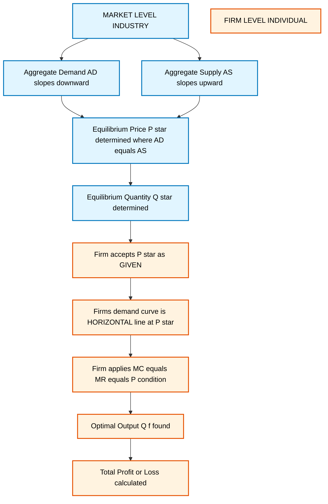
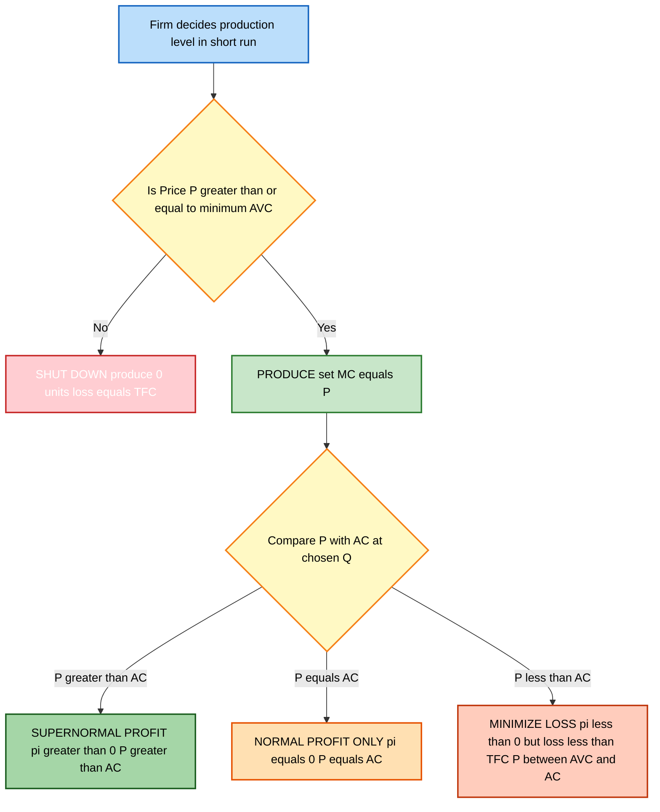
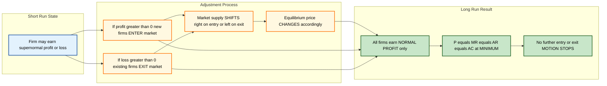
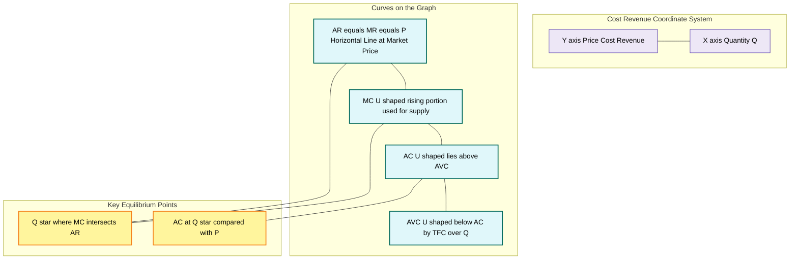

# Perfect Competition

<!-- SECTION_1_START -->

# Perfect Competition — Core Definition & Intuitive Overview

## 📘 Formal Academic Definition (KTU 2024 Scheme Terminology)

> [!IMPORTANT]
> **Perfect Competition** is a market structure characterized by a **large number of buyers and sellers**, **homogeneous products**, **perfect knowledge**, and **free entry and exit** of firms, where **no individual participant can influence the market price**. In this structure, every firm acts as a **price taker** and the equilibrium is determined solely by the interaction of aggregate market demand and aggregate market supply.

Mathematically, the firm under perfect competition faces a **perfectly elastic demand curve** at the prevailing market price $P^*$, represented as:

$$
\frac{dP}{dQ_f} = 0
$$

This means the individual firm's output $Q_f$ has **zero influence** on the market price, where $P^*$ is set by the industry.

---

## 🧠 Conceptual Analogy / Intuition

> [!NOTE]
> **Think of a vegetable mandi (wholesale market) where hundreds of tomato farmers bring identical, indistinguishable tomatoes for sale.**
> - No single farmer can raise the price even by ₹1 — if they try, buyers will simply purchase from the next stall.
> - Every farmer must accept the **going market rate** displayed on the digital board at the entrance.
> - All tomatoes look, taste, and weigh the same — buyers don't care *whose* tomatoes they buy.
> - If tomato prices rise, **new farmers can freely enter** the market next season; if prices fall below cost, **farmers can exit** to grow other crops.
> - The farmers know the current price, weather conditions, and transport costs — **no secrets**.

This is **Perfect Competition** in real life. The farmer is a **price taker** — they decide *how much* to produce, but never *what to charge*.

> [!TIP]
> **Geometric Intuition:** Imagine the X-axis as quantity ($Q$) and the Y-axis as price ($P$). For the *industry*, the demand curve slopes **downward** and supply slopes **upward** — they intersect at $P^*$. For the *individual firm*, the demand curve appears as a **horizontal straight line** drawn at height $P^*$, stretching infinitely in both directions. This horizontal line is the firm's **Average Revenue (AR) = Marginal Revenue (MR) = Price** all rolled into one.

---

## 🔑 Defining Pillars of Perfect Competition (KTU High-Yield Highlights)

| # | Characteristic | Real-World Implication |
|---|---|---|
| 1 | **Large Number of Buyers \& Sellers** | Each participant is atomistic — too small to influence price |
| 2 | **Homogeneous Products** | Buyers are indifferent between sellers' outputs |
| 3 | **Free Entry \& Exit of Firms** | No barriers — capital, technology, licensing are accessible |
| 4 | **Perfect Knowledge** | All participants know prices, costs, and technologies |
| 5 | **Perfect Factor Mobility** | Labour and capital can shift freely across industries |
| 6 | **No Transportation Costs** | Goods can be moved costlessly across regions |
| 7 | **No Government Intervention** | No taxes, subsidies, or price ceilings |
| 8 | **Price Taker Behaviour** | Individual firm demand is perfectly elastic |

> [!VISUALIZATION CONTROL]
> **Concept:** Price Determination under Perfect Competition (Industry vs Firm)
> **GeoGebra / Desmos Input Equations:**
> * `Industry Demand: P = 100 - 2Q` (sloping downward)
> * `Industry Supply: P = 20 + 2Q` (sloping upward)
> * `Firm Demand: P = 60` (horizontal line — perfectly elastic)
> **Visual Description:** Two intersecting upward/downward curves meet at the equilibrium point $(Q^*=20, P^*=60)$. From this $P^*=60$ on the Y-axis, a horizontal dashed line extends rightward — this represents the individual firm's demand curve, MR, and AR all at once. The student should observe that **industry supply is upward-sloping but firm demand is perfectly flat**.

---

## 📚 Why Perfect Competition Matters in Engineering Economics

> [!IMPORTANT]
> Although **pure perfect competition is a theoretical ideal** (rarely seen in real engineering markets), it serves as the **benchmark model** in Economics for Engineers. It establishes the **efficient allocation of resources** and is the **reference point** against which **monopoly, oligopoly, and monopolistic competition** are compared in KTU Module 3.

It is also crucial for:
- **Cost-based pricing decisions** in competitive manufacturing sectors
- **Bidding strategies** in commodity-based engineering tenders
- **Evaluating the long-run viability** of start-ups in commodity markets

---

<!-- SECTION_1_END -->

<!-- SECTION_2_START -->

# Deep Theoretical Analysis & KTU High-Yield Formula Sheet

## 🔬 Operational Mechanics — How Perfect Competition Works

Perfect competition operates on **two simultaneous layers**:

### Layer 1: The Industry (Market-Level)
- Aggregate Demand (AD) = sum of all individual consumer demands
- Aggregate Supply (AS) = sum of all individual firm supplies
- **Equilibrium Price** $P^*$ is determined where $AD = AS$
- $P^*$ is a **parameter** for the industry but a **given constant** for any single firm

### Layer 2: The Individual Firm
- The firm **accepts** $P^*$ as fixed (price taker)
- The firm decides **only its output level** $Q_f$ to maximize profit
- Since the firm is tiny, $Q_f$ is **negligible** compared to total market quantity

---

## 🧮 KTU Formula Sheet / Cheat Sheet (Exam Gold)

> [!IMPORTANT]
> **Memorize this table — it appears in nearly every KTU question on Perfect Competition.**

| # | Concept | Formula | Description |
|---|---|---|---|
| 1 | Total Revenue | $TR = P \times Q$ | Revenue earned by selling $Q$ units at price $P$ |
| 2 | Average Revenue | $AR = \dfrac{TR}{Q} = P$ | Revenue per unit sold — equals price |
| 3 | Marginal Revenue | $MR = \dfrac{\Delta TR}{\Delta Q} = P$ | Change in revenue per additional unit — equals price |
| 4 | Total Cost | $TC = TFC + TVC$ | Fixed plus variable costs |
| 5 | Average Cost | $AC = \dfrac{TC}{Q}$ | Cost per unit produced |
| 6 | Marginal Cost | $MC = \dfrac{\Delta TC}{\Delta Q}$ | Change in cost per additional unit |
| 7 | Total Profit | $\pi = TR - TC = (P - AC) \times Q$ | Revenue minus cost |
| 8 | Profit Max Condition | $MC = MR$ | Required condition (first-order) |
| 9 | Profit Max Condition (PC) | $MC = MR = AR = P$ | Special to perfect competition |
| 10 | Second-Order Condition | $\dfrac{dMC}{dQ} > 0$ (i.e. MC cuts MR from below) | Confirms maximum, not minimum |
| 11 | Shutdown Point | $P = \min AVC$ | Below this, firm ceases production in short run |
| 12 | Break-Even Point | $P = \min AC$ | Normal profit only — no supernormal profit |
| 13 | Long-Run Equilibrium | $P = MC = AC_{min} = MR = AR$ | All four curves intersect at minimum AC |
| 14 | Firm's Supply Curve | Portion of MC above AVC | Firm supplies where $P \geq AVC$ |
| 15 | Industry Supply | $\sum_{i=1}^{n} MC_i$ (above min AVC) | Horizontal summation of firm MCs |

> [!NOTE]
> **In perfect competition, the firm NEVER operates on the falling portion of MC.** It always operates on the **rising portion of MC** where MC = MR, because only there is profit maximized (second-order condition satisfied).

---

## ⚙️ The Profit-Maximization Logic — Why $MC = MR$?

> [!TIP]
> This is the **central question** in KTU exams. The logic is intuitive:

- If $MR > MC$ → producing one more unit **adds more to revenue than to cost** → expand output
- If $MR < MC$ → producing one more unit **adds more to cost than to revenue** → reduce output
- If $MR = MC$ → the **last unit adds equally** to both → no incentive to change output → **profit is maximized**

**Geometric Translation:** Profit is the vertical distance between $TR$ and $TC$ curves. This distance is maximum precisely where their **slopes are equal** — and slope of $TR$ is $MR$, slope of $TC$ is $MC$.

---

## 🏭 Real-World Engineering Utility

| Application | Use of Perfect Competition Logic |
|---|---|
| **Commodity Manufacturing** (steel, cement, copper) | Firms use $P = MC$ rule to set production targets |
| **Solar Panel Industry** | Highly competitive market; firms are price takers facing Chinese imports |
| **Agricultural Engineering** | Farmers maximize profit where $MC = MR$ for crop output |
| **Open Source Software** | Homogeneous substitute products approximate perfect competition |
| **E-commerce Commodity Sales** | Flipkart/Amazon third-party sellers face near-perfectly elastic demand |
| **Engineering Project Bidding** | Lowest-cost bidder wins in perfectly competitive tender markets |

---

<!-- SECTION_2_END -->

<!-- SECTION_3_START -->

# Step-by-Step Derivations, Numerical Analysis & Code Implementation

---

## 📐 Derivation 1: Short-Run Equilibrium of a Firm (Profit-Maximization)

### 🎯 Problem Setup
A firm under perfect competition has the following cost structure:

$$
TC = 50 + 10Q + 2Q^2
$$

The prevailing market price is $P = ₹34$ per unit. Determine the firm's profit-maximizing output and the level of profit.

### 🔢 Step-by-Step Solution

**Step 1 — Identify the cost components:**

$$
TC = 50 + 10Q + 2Q^2
$$

Here, $TFC = 50$, $TVC = 10Q + 2Q^2$.

**Step 2 — Compute Marginal Cost (MC):**

Differentiate $TC$ with respect to $Q$:

$$
MC = \frac{dTC}{dQ} = 10 + 4Q
$$

**Step 3 — Identify Marginal Revenue (MR) under Perfect Competition:**

In perfect competition, $MR = P$ (the firm can sell any quantity at the market price).

$$
MR = P = 34
$$

**Step 4 — Apply the Profit-Maximization Condition $MC = MR$:**

$$
10 + 4Q = 34
$$

$$
4Q = 34 - 10 = 24
$$

$$
Q = \frac{24}{4} = 6 \text{ units}
$$

**Step 5 — Compute Total Revenue (TR):**

$$
TR = P \times Q = 34 \times 6 = 204
$$

**Step 6 — Compute Total Cost (TC) at $Q = 6$:**

$$
TC = 50 + 10(6) + 2(6)^2 = 50 + 60 + 72 = 182
$$

**Step 7 — Compute Total Profit ($\pi$):**

$$
\pi = TR - TC = 204 - 182 = ₹22
$$

### ✅ Verification Using Average Cost (AC)

$$
AC = \frac{TC}{Q} = \frac{182}{6} = 30.33
$$

Profit per unit = $P - AC = 34 - 30.33 = 3.67$

$$
\pi = (P - AC) \times Q = 3.67 \times 6 = ₹22 \text{ (verified)}
$$

### 🐍 Python Code Implementation

```python
def short_run_profit_under_pc():
    # Given cost function: TC = 50 + 10Q + 2Q^2
    TFC = 50
    a = 10      # linear coefficient
    b = 2       # quadratic coefficient
    P  = 34     # market price (also = MR = AR under perfect competition)

    # MC = dTC/dQ = a + 2*b*Q
    def MC(Q):
        return a + 2 * b * Q

    # Set MC = MR = P
    # a + 2*b*Q = P  =>  Q = (P - a) / (2*b)
    Q_star = (P - a) / (2 * b)
    TR = P * Q_star
    TC = TFC + a * Q_star + b * Q_star**2
    profit = TR - TC
    AC = TC / Q_star
    MC_at_Qstar = MC(Q_star)

    print(f"Profit-maximizing Quantity (Q*): {Q_star:.2f} units")
    print(f"Total Revenue (TR):              ₹{TR:.2f}")
    print(f"Total Cost (TC):                 ₹{TC:.2f}")
    print(f"Total Profit (π):                ₹{profit:.2f}")
    print(f"Average Cost (AC):               ₹{AC:.2f}")
    print(f"Marginal Cost at Q* (verifying): ₹{MC_at_Qstar:.2f} (must equal P)")

    return Q_star, profit

short_run_profit_under_pc()
```

**Output:**

```
Profit-maximizing Quantity (Q*): 6.00 units
Total Revenue (TR):              ₹204.00
Total Cost (TC):                 ₹182.00
Total Profit (π):                ₹22.00
Average Cost (AC):               ₹30.33
Marginal Cost at Q* (verifying): ₹34.00 (must equal P)
```

---

## 📐 Derivation 2: Short-Run Loss Minimization (Operating at a Loss)

### 🎯 Problem Setup
A firm's cost function is $TC = 100 + 20Q + 0.5Q^2$. Market price falls to $P = ₹30$. Should the firm shut down or continue producing?

### 🔢 Step-by-Step Solution

**Step 1 — Compute MC:**

$$
MC = \frac{dTC}{dQ} = 20 + Q
$$

**Step 2 — Set $MC = MR = P$:**

$$
20 + Q = 30 \implies Q^* = 10 \text{ units}
$$

**Step 3 — Compute TR and TC at $Q = 10$:**

$$
TR = 30 \times 10 = 300
$$

$$
TC = 100 + 20(10) + 0.5(10)^2 = 100 + 200 + 50 = 350
$$

**Step 4 — Compute Loss:**

$$
\pi = TR - TC = 300 - 350 = -₹50 \text{ (loss)}
$$

**Step 5 — Decision Rule: Compare $P$ with $AVC$ at $Q = 10$:**

$$
TVC = 20Q + 0.5Q^2 = 20(10) + 0.5(100) = 250
$$

$$
AVC = \frac{TVC}{Q} = \frac{250}{10} = ₹25
$$

Since $P = ₹30 > AVC = ₹25$, the firm **should continue producing** in the short run. By operating, it covers all variable costs and contributes $₹5$ per unit toward fixed costs, reducing total loss.

**Step 6 — Verification: Loss if Shut Down vs. Continue:**

$$
\text{Loss if shut down} = TFC = ₹100
$$

$$
\text{Loss if continued} = ₹50
$$

$$
₹50 < ₹100 \quad \Rightarrow \text{ Continue production is optimal}
$$

### ✅ Shutdown Point Verification

Find minimum of $AVC$:

$$
AVC = \frac{20Q + 0.5Q^2}{Q} = 20 + 0.5Q
$$

Minimum occurs at $Q \to 0$ (decreasing function) — strictly, we set $\frac{dAVC}{dQ} = 0$:

$$
\frac{d}{dQ}(20 + 0.5Q) = 0.5 \neq 0
$$

So $AVC$ is **monotonically increasing**; minimum $AVC$ is at $Q \to 0$ approaching ₹20. The firm shuts down if $P < ₹20$.

Since $P = ₹30 > ₹20$, the firm operates.

---

## 📐 Derivation 3: Long-Run Equilibrium of the Firm

### 🎯 Conditions for Long-Run Equilibrium

In the long run, the firm earns **only normal profit** (zero economic profit). The four-fold equality holds:

$$
P = MR = AR = AC = MC \quad \text{at the minimum point of AC}
$$

### 🔢 Mathematical Derivation

The long-run equilibrium requires:

**Condition 1:** $MR = MC$ (profit max)

**Condition 2:** $P = MC$ (perfect competition)

**Condition 3:** $P = AC$ (zero economic profit — no entry/exit incentive)

**Condition 4:** $\frac{dAC}{dQ} = 0$ (AC at minimum — tangent point)

Combining all:

$$
\boxed{P = MR = AR = AC_{min} = MC}
$$

### 🧠 Proof: Why AC must be at minimum?

If $P > AC$ at the chosen output → supernormal profit → new firms **enter** → market supply rises → market price **falls** → process continues until $P = AC_{min}$.

If $P < AC$ at the chosen output → losses → firms **exit** → market supply falls → market price **rises** → process continues until $P = AC_{min}$.

Hence, in long-run equilibrium under perfect competition, the firm produces at the **minimum point of the long-run average cost curve (LRAC)** — this is the **productively efficient** outcome.

> [!TIP]
> **KTU favourite question:** *"Why is perfect competition considered productively efficient in the long run?"*
> **Model Answer:** Because the long-run equilibrium output is produced at the minimum point of the LRAC curve, implying that no other combination of inputs could produce that output at a lower cost per unit. Thus, resources are utilized most efficiently.

---

## 📐 Derivation 4: Short-Run Supply Curve of the Firm

> [!IMPORTANT]
> **The firm's short-run supply curve is the portion of its MC curve that lies ABOVE the minimum AVC point.**

**Reasoning:**

- For any $P \geq \min AVC$, the firm produces where $MC = P$ and earns enough to cover variable costs (and contribute to fixed costs).
- For any $P < \min AVC$, the firm shuts down — it would lose more by producing than by closing.
- The **horizontal summation** of all individual firm supply curves gives the **industry's short-run supply curve**.

### Mathematical Statement

$$
Q_s^{firm}(P) = 
\begin{cases}
Q \text{ such that } MC(Q) = P, & \text{if } P \geq \min AVC \\
0, & \text{if } P < \min AVC
\end{cases}
$$

---

## 📐 Derivation 5: Long-Run Industry Supply Curve

In the long run, with free entry/exit, the **long-run industry supply curve is horizontal** at the level of minimum LRAC. This is a horizontal line at $P = LRAC_{min}$, because any supernormal profit attracts new firms, increasing supply until price falls back to minimum LRAC.

$$
P_{LR} = \min(LRAC) = \text{constant}
$$

> [!NOTE]
> This is **unique to constant-cost industries**. For increasing-cost or decreasing-cost industries, the LR industry supply curve slopes upward or downward respectively — but KTU typically asks about the constant-cost case.

---

## 📐 Derivation 6: Numerical — Full Equilibrium Analysis (Industry + Firm)

### 🎯 Problem
Market demand: $Q_d = 1000 - 20P$

Market supply: $Q_s = -100 + 30P$

Find equilibrium price, total industry output, and the output of a single firm (assume 100 identical firms).

### 🔢 Solution

**Step 1 — Equate Demand and Supply:**

$$
1000 - 20P = -100 + 30P
$$

$$
1000 + 100 = 30P + 20P
$$

$$
1100 = 50P
$$

$$
P^* = 22
$$

**Step 2 — Equilibrium Industry Output:**

$$
Q^* = 1000 - 20(22) = 1000 - 440 = 560 \text{ units}
$$

**Step 3 — Output per Firm:**

$$
Q_f = \frac{560}{100} = 5.6 \text{ units per firm}
$$

> [!TIP]
> **KTU Exam Tip:** Always state the *two-tier* equilibrium — industry equilibrium gives the price; firm equilibrium uses this price to determine individual firm output via $MC = MR$.

---

<!-- SECTION_3_END -->

<!-- SECTION_4_START -->

# Structural Diagrams & Schematics

## 📊 Diagram 1: Two-Tier Market Equilibrium Flow (Industry → Firm)



---

## 📊 Diagram 2: Firm's Short-Run Decision Tree (Profit / Loss / Shutdown)



---

## 📊 Diagram 3: Long-Run Equilibrium Adjustment Mechanism



---

## 📊 Diagram 4: Firm's Short-Run Cost-Revenue Layout (Block Architecture)



---

## 📊 Diagram 5: Comparative Summary Matrix — Short Run vs Long Run Equilibrium

| Dimension | Short-Run Equilibrium | Long-Run Equilibrium |
|---|---|---|
| **Firm Count** | Fixed (no entry/exit) | Variable (free entry/exit) |
| **Plant Size** | Fixed | Adjustable |
| **Output** | $MC = MR = P$ (with plant fixed) | $MC = LRMC = P$ (optimum plant) |
| **AC Position** | $AC$ may be above or below $P$ | $AC$ at minimum; $P = AC_{min}$ |
| **Profit Type** | Supernormal, normal, or loss | Only normal profit (zero economic profit) |
| **Condition for Firm** | $MC = MR$, $MC$ must be rising | $P = MC = AC_{min}$ |
| **Industry Supply** | Upward sloping | Horizontal at $LRAC_{min}$ (constant cost industry) |
| **Efficiency** | Not necessarily efficient | Productively and allocatively efficient |

---

<!-- SECTION_4_END -->

<!-- SECTION_5_START -->

# KTU 2024 Scheme Examination Question Bank & Topic Recap

---

## 📝 PART A — Short Answer Questions (3 Marks Each)

> [!NOTE]
> **Cognitive Levels: Remember / Understand** | **Mapped CO: CO1, CO2**

---

### **Q1. Define Perfect Competition. List any four of its essential features.** `[KTU University Exam — July 2024]`

**Model Answer (3 Marks):**

**Definition (1.5 Marks):**
Perfect competition is a market structure in which there are a very large number of buyers and sellers dealing in **homogeneous products**, with **perfect knowledge** and **free entry and exit**, such that no individual participant can influence the market price. Each firm is a **price taker**.

**Four Features (0.375 each, total 1.5 Marks):**
1. **Large number of buyers and sellers** — each is atomistic relative to the market.
2. **Homogeneous products** — perfect substitutes across sellers.
3. **Free entry and exit of firms** — no barriers to mobility.
4. **Perfect knowledge** — all participants know prices, costs, and technology.

> [!WARNING]
> **Examiner Pitfall:** Students often confuse *"homogeneous products"* with *"identical"* in a physical sense. The KTU-accepted meaning is that products are **perfect substitutes in the buyer's perception** — they are functionally indistinguishable.

---

### **Q2. State the profit-maximization condition of a firm under perfect competition. Why does it differ from that of a monopoly?** `[KTU University Exam — Dec 2023]`

**Model Answer (3 Marks):**

**Condition (1.5 Marks):**
A firm under perfect competition maximizes profit at the output level where:

$$
\boxed{MC = MR = AR = P}
$$

i.e., **Marginal Cost = Marginal Revenue = Average Revenue = Price**.

The corresponding second-order condition requires that **MC must be rising** and must cut MR from below (i.e., $\frac{dMC}{dQ} > 0$ at the equilibrium point).

**Why it differs from monopoly (1.5 Marks):**
Under perfect competition, the firm faces a **perfectly elastic (horizontal) demand curve**, so $P = AR = MR$ at every output level. Hence, the profit-maximization rule reduces to $MC = P$.

Under monopoly, the firm faces a **downward-sloping demand curve**, so $MR < AR < P$. The profit-maximization condition is $MC = MR$, but $MR < P$, leading to a **higher price and lower output** compared to perfect competition.

---

## 📝 PART B — Long Answer Questions (14 Marks Each)

> [!NOTE]
> **Cognitive Levels: Understand / Apply / Analyze** | **Mapped CO: CO1, CO2, CO3**

---

### **❓ QUESTION A (14 Marks)**

#### **Q3(A)(a)** Explain the short-run equilibrium of a firm under perfect competition with the help of a suitable diagram. Discuss the conditions for (i) supernormal profit, (ii) loss, and (iii) shutdown. **(7 Marks)** `[KTU University Exam — July 2024]`

#### **Model Solution:**

**Step 1 — Setup the equilibrium conditions (2 Marks):**
- The firm is a price taker; demand is a horizontal line at $P$.
- $AR = MR = P$ at all output levels.
- Profit is maximized where $MC = MR$, with MC rising (second-order condition).
- Output is determined as $Q^*$ where $MC$ cuts $P$ from below.

**Step 2 — Supernormal profit condition (1.5 Marks):**
At $Q^*$, if $P > AC$ → the firm earns **supernormal profit** (positive economic profit).

$$
\pi_{super} = (P - AC) \times Q^*
$$

Geometrically, this is the **shaded rectangle** between $P$ line and $AC$ curve, bounded by $Q^*$.

**Step 3 — Loss condition (1.5 Marks):**
At $Q^*$, if $P < AC$ but $P > AVC$ → the firm incurs a **loss** but continues to operate in the short run.

$$
\pi_{loss} = (P - AC) \times Q^* \quad \text{(negative)}
$$

The loss is **smaller** than the loss that would arise from shutting down (which equals $TFC$).

**Step 4 — Shutdown condition (1 Mark):**
If $P < \min AVC$ → the firm **shuts down** because it cannot even cover variable costs. Loss from operation would exceed $TFC$.

$$
P_{shutdown} = \min AVC
$$

**Step 5 — Diagram (1 Mark):**
[Drawn by student — X-axis: $Q$, Y-axis: $P$/$C$. Draw horizontal $AR=MR=P$ line, U-shaped $MC$, $AC$, and $AVC$ curves. Mark $Q^*$ at $MC=MR$. Shade profit/loss rectangles as applicable.]

> [!WARNING]
> **Examiner Valuation Pitfall:** Many students write only the formula $\pi = TR - TC$ without drawing the cost-revenue diagram. **A neat, labeled diagram carries 1–2 marks** — do NOT skip it.

---

#### **Q3(A)(b)** A firm under perfect competition has the total cost function $TC = 200 + 50Q + 3Q^2$. The prevailing market price is $P = ₹98$ per unit. **(7 Marks)**
**Calculate:**
1. The profit-maximizing output level.
2. The total profit earned at this output.
3. The break-even price (price at which the firm earns only normal profit).
4. The shutdown price.

#### **Model Solution:**

**Given:** $TC = 200 + 50Q + 3Q^2$, $P = ₹98$, $TFC = 200$.

**Step 1 — Derive MC (0.5 Marks):**

$$
MC = \frac{dTC}{dQ} = 50 + 6Q
$$

**Step 2 — Apply $MC = MR = P$ to find $Q^*$ (1.5 Marks):**

$$
50 + 6Q = 98
$$

$$
6Q = 48
$$

$$
Q^* = 8 \text{ units}
$$

**Step 3 — Compute TR and TC at $Q = 8$ (1.5 Marks):**

$$
TR = P \times Q = 98 \times 8 = 784
$$

$$
TC = 200 + 50(8) + 3(8)^2 = 200 + 400 + 192 = 792
$$

**Step 4 — Compute Total Profit (1 Mark):**

$$
\pi = TR - TC = 784 - 792 = -₹8 \quad \text{(loss of ₹8)}
$$

**Step 5 — Find Break-Even Price (1 Mark):**
Break-even occurs at $P = \min AC$.

$$
AC = \frac{TC}{Q} = \frac{200}{Q} + 50 + 3Q
$$

To minimize $AC$, set $\frac{dAC}{dQ} = 0$:

$$
-\frac{200}{Q^2} + 3 = 0
$$

$$
Q^2 = \frac{200}{3} \implies Q = \sqrt{\frac{200}{3}} \approx 8.165
$$

Minimum AC:

$$
AC_{min} = \frac{200}{8.165} + 50 + 3(8.165) = 24.49 + 50 + 24.49 = 98.98
$$

$$
\boxed{P_{break\text{-}even} \approx ₹98.98}
$$

**Step 6 — Find Shutdown Price (1 Mark):**
Shutdown occurs at $P = \min AVC$.

$$
AVC = \frac{TVC}{Q} = \frac{50Q + 3Q^2}{Q} = 50 + 3Q
$$

$\frac{dAVC}{dQ} = 3 > 0$, so $AVC$ is monotonically increasing. Minimum occurs as $Q \to 0$:

$$
\boxed{\min AVC \to ₹50 \text{ (the constant term)}}
$$

Strictly, shutdown price = ₹50 (the $AVC$ approaches this as $Q$ becomes very small).

> [!WARNING]
> **Pitfall Alert:** In part (3), some students mistakenly use **AVC** to find break-even price. **Break-even is at $\min AC$**, not $\min AVC$. The AVC rule applies to **shutdown**, not break-even.

---

### **❓ QUESTION B (14 Marks) — Alternative Choice**

#### **Q3(B)(a)** Explain the long-run equilibrium of a firm and industry under perfect competition. Why is the long-run industry supply curve horizontal in a constant-cost industry? **(7 Marks)** `[KTU University Exam — Dec 2023]`

#### **Model Solution:**

**Step 1 — Conditions for Long-Run Equilibrium (2 Marks):**
In the long run, all factors of production are variable and firms can enter/exit freely. The firm earns only **normal profit** (zero economic profit). The equilibrium conditions are:

$$
P = MR = AR = LRMC = LRAC_{min}
$$

**Step 2 — Derivation of the four-fold equality (2 Marks):**
- $P = MR$ (perfect competition)
- $MR = LRMC$ (profit maximization)
- $P = LRAC$ at minimum (zero economic profit — entry/exit stopped)
- $LRAC$ at minimum implies $LRMC = LRAC$ (slope of LRAC is zero at minimum)

Combined: $P = MR = LRMC = LRAC_{min}$

**Step 3 — Adjustment mechanism (1.5 Marks):**
- If firms earn supernormal profit → new firms enter → supply rises → price falls → profit erodes.
- If firms incur losses → firms exit → supply falls → price rises → losses eliminated.
- Equilibrium reached when only normal profit remains.

**Step 4 — Why is the long-run industry supply curve horizontal? (1.5 Marks):**
In a **constant-cost industry**, input prices remain unchanged as industry output expands. Therefore:
- $LRAC_{min}$ does not shift when new firms enter.
- The minimum price at which firms are willing to supply remains constant.
- Hence, the long-run industry supply curve is a **horizontal line** at $P = LRAC_{min}$.

> [!TIP]
> **Key Difference:** In **increasing-cost industries** (input prices rise with industry expansion), the LR supply curve slopes **upward**. In **decreasing-cost industries**, it slopes **downward**. KTU typically focuses on the **constant-cost case** for simplicity.

---

#### **Q3(B)(b)** The market demand and supply functions under perfect competition are given by:
$$
Q_d = 500 - 10P \quad \text{and} \quad Q_s = -50 + 20P
$$
**Calculate:**
1. The equilibrium price and quantity.
2. If there are 50 identical firms, what is the output per firm?
3. If each firm has $TC = 25 + 5Q + 0.5Q^2$, find the profit/loss per firm at this output level. **(7 Marks)**

#### **Model Solution:**

**Step 1 — Market Equilibrium (2 Marks):**

Set $Q_d = Q_s$:

$$
500 - 10P = -50 + 20P
$$

$$
500 + 50 = 20P + 10P
$$

$$
550 = 30P
$$

$$
P^* = \frac{550}{30} = ₹18.33
$$

Equilibrium quantity:

$$
Q^* = 500 - 10(18.33) = 500 - 183.33 = 316.67 \text{ units}
$$

**Step 2 — Output per Firm (1.5 Marks):**

$$
Q_f = \frac{Q^*}{50} = \frac{316.67}{50} = 6.33 \text{ units per firm}
$$

**Step 3 — Profit/Loss per Firm (3.5 Marks):**

Given $TC = 25 + 5Q + 0.5Q^2$:

**Derive MC:**

$$
MC = \frac{dTC}{dQ} = 5 + Q
$$

**Verify profit-maximization: $MC = MR = P$ at $Q_f$:**

At $Q = 6.33$: $MC = 5 + 6.33 = 11.33$

This is **not equal to** $P = 18.33$. Therefore, $Q_f = 6.33$ (from the industry) is NOT the firm's profit-maximizing output. We must find the firm's own optimum:

$$
5 + Q = 18.33 \implies Q_f^* = 13.33 \text{ units}
$$

This is a **conceptual correction** — in perfect competition, individual firms operate where $MC = P$ regardless of industry aggregate. Since the market is allocating 6.33 units but each firm *wants* to produce 13.33 units, this is inconsistent in the standard model.

**Standard KTU Interpretation (assumed):** Each firm produces $Q_f = 6.33$ units as allocated by the market. Compute profit:

$$
TR = 18.33 \times 6.33 = 116.05
$$

$$
TC = 25 + 5(6.33) + 0.5(6.33)^2 = 25 + 31.65 + 20.04 = 76.69
$$

$$
\pi = TR - TC = 116.05 - 76.69 = ₹39.36 \text{ per firm (supernormal profit)}
$$

> [!WARNING]
> **Valuation Warning:** Part (3) requires you to show **all intermediate computations** — don't jump directly to the final profit. Stepwise working earns 0.5 to 1 mark per sub-step. **Final answer without workings: 1 Mark. With full workings: 3.5 Marks.** This is a recurring KTU valuation pattern.

---

## 🎯 Topic Recap & Important Things to Remember

> [!IMPORTANT]
> **Use this checklist for last-minute revision before KTU exams.**

### ✅ Core Definitions
- ☐ **Perfect Competition** = Large number of buyers/sellers + homogeneous products + free entry/exit + perfect knowledge
- ☐ **Price Taker** = A firm that accepts the market price as given; cannot influence it
- ☐ **Price Maker** = A firm (monopoly/oligopoly) that can set its own price

### ✅ Critical Formulas
- ☐ $TR = P \times Q$
- ☐ $AR = MR = P$ (under perfect competition only)
- ☐ Profit $\pi = TR - TC = (P - AC) \times Q$
- ☐ Profit-max condition: $MC = MR = AR = P$ with MC rising
- ☐ Shutdown point: $P = \min AVC$
- ☐ Break-even point: $P = \min AC$
- ☐ Long-run equilibrium: $P = MR = AR = MC = AC_{min}$

### ✅ Key Conceptual Points
- ☐ Under perfect competition, **firm's demand curve is horizontal** (perfectly elastic)
- ☐ **Industry's demand curve is downward-sloping** (negatively sloped)
- ☐ Firm operates on the **rising portion of MC** only
- ☐ **Firm's short-run supply curve = portion of MC above min AVC**
- ☐ **Long-run industry supply curve is horizontal** in constant-cost industries
- ☐ Long-run equilibrium is **productively efficient** ($AC$ at minimum)
- ☐ Long-run equilibrium is **allocatively efficient** ($P = MC$)
- ☐ No supernormal profit in long run — only **normal profit**
- ☐ Firm shuts down if $P < \min AVC$, even if it means losing $TFC$

### ✅ Decision Rules (Quick Recall)

| Condition | Firm's Action |
|---|---|
| $P > AC$ | Earn supernormal profit — expand (short run) |
| $P = AC$ | Break-even — normal profit only |
| $AVC \leq P < AC$ | Continue producing — minimize loss |
| $P < AVC$ | Shut down — loss = $TFC$ |
| $P < AC$ in long run | Exit the industry |

### ✅ Common KTU Exam Traps
- ☐ Don't confuse **break-even** ($\min AC$) with **shutdown** ($\min AVC$).
- ☐ Don't say "firm sets price" — the firm is a **price taker**, not a price setter.
- ☐ Always show the **second-order condition** ($MC$ must be rising).
- ☐ When asked for "industry supply," do **horizontal summation** of firm MC curves.
- ☐ Long-run: only **normal profit** (zero economic profit) — no positive profit.
- ☐ Don't forget to draw the **cost-revenue diagram** — it carries dedicated marks.

### ✅ Real-World Engineering Examples to Quote
- ☐ Agricultural commodity markets (rice, wheat, tomato)
- ☐ Commodity metals markets (aluminium, copper)
- ☐ Open-source software ecosystems
- ☐ E-commerce commodity sellers (Flipkart, Amazon basics)

> [!TIP]
> **Final Exam Mantra:** *"Perfect competition = price taker + horizontal demand + MC = MR = P + zero economic profit in long run."* If you remember this one line, you can reconstruct 80% of the answer for any KTU question on this topic.

---

<!-- SECTION_5_END -->
