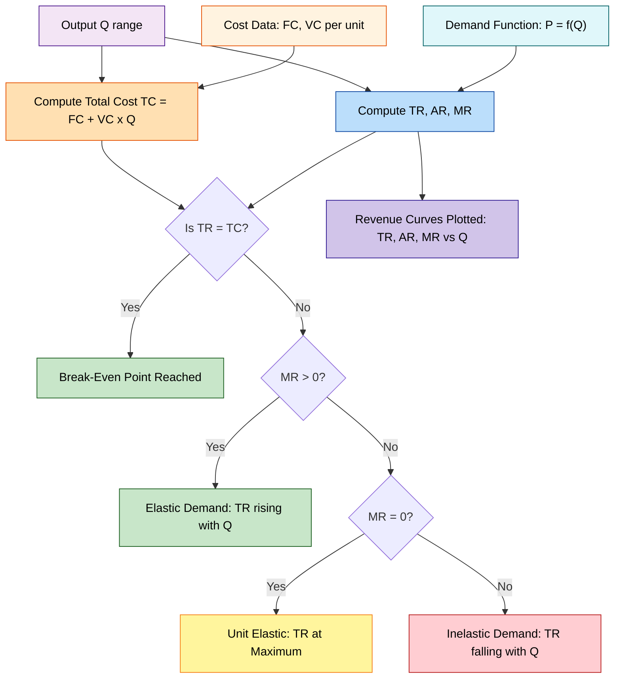
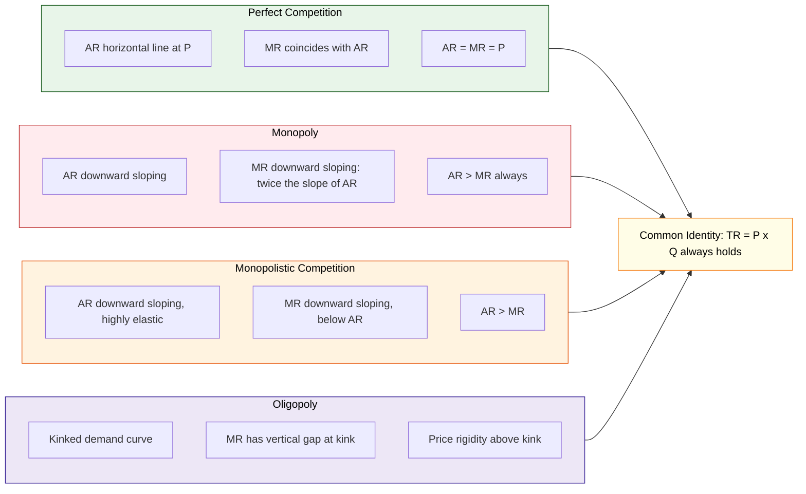
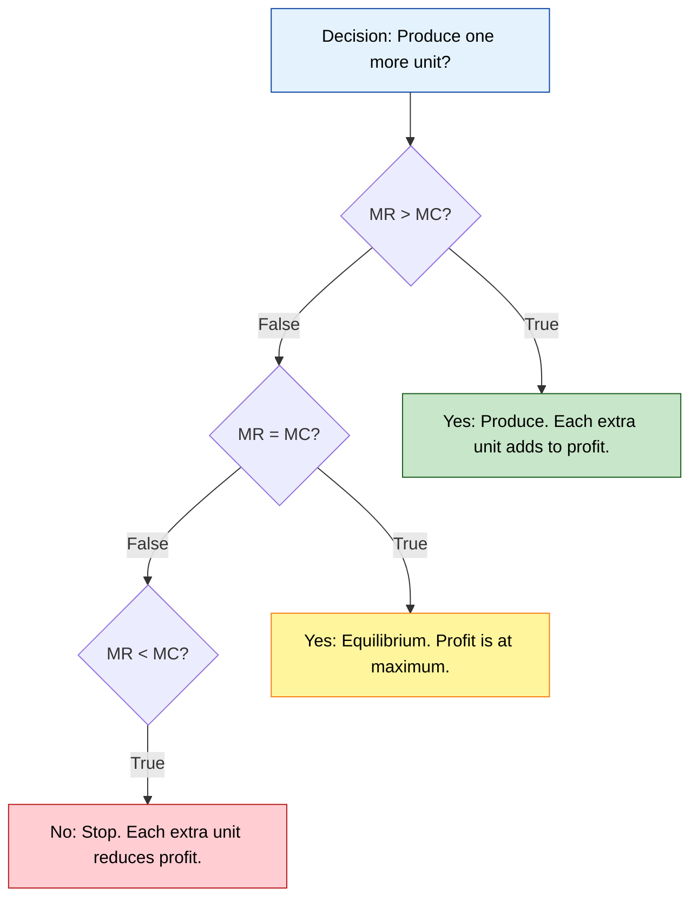

# Revenue concepts

<!-- SECTION_1_START -->
# Revenue Concepts — Core Technical Definition & Intuitive Overview

## 1.1 Formal Academic Definition (KTU 2024 Syllabus Standard)

In **Engineering Economics**, revenue is the monetary inflow received by a firm from the sale of goods or services during a specified period. It is the *top-line figure* of the income statement and forms the foundation upon which profit, break-even, and elasticity decisions are computed.

> [!IMPORTANT]
> **Syllabus Highlight (UCHUT346 — Module 2: Cost Concepts)**
> Revenue analysis is a prerequisite to **Break-Even Analysis**, **Cost-Volume-Profit (CVP) Analysis**, and **Demand Elasticity** studies. KTU examiners frequently test revenue curves under different market structures (Perfect Competition, Monopoly, Monopolistic Competition, Oligopoly).

The three primary revenue concepts are:

| Concept | Symbol | Core Definition |
| :--- | :---: | :--- |
| **Total Revenue** | $TR$ | The *aggregate* receipts obtained from the sale of a given output level. |
| **Average Revenue** | $AR$ | The revenue *earned per unit* of output sold. |
| **Marginal Revenue** | $MR$ | The *additional* revenue earned by selling one extra unit of output. |

## 1.2 Intuitive Analogy — The "App Startup" Storyboard

> [!NOTE]
> **Conceptual Analogy: "PixelPlay — The Indie Game Studio"**
>
> Imagine you, as a B.Tech graduate, launch **PixelPlay**, a mobile game studio. You release the game **"CodeQuest"** on the Play Store.
>
> * **Total Revenue (TR)** → The *entire wallet money* you collect. If 1,000 students download your game at ₹99, then $TR = 99{,}000$.
> * **Average Revenue (AR)** → The *average price* per download. Since all downloads are priced the same, $AR = ₹99$. This is essentially the **Price** the market pays.
> * **Marginal Revenue (MR)** → The *bonus cash* from convincing **one more** student to download. If the 1001st student pays ₹99, $MR = ₹99$. But if you launch a **festive sale** and drop the price to ₹79 for the 1001st download, $MR$ drops to ₹79 (or even less, if existing buyers demand a refund).
>
> **Key Insight:** $AR$ is always the *price* charged; $MR$ depends on whether the firm must lower its price to sell *one more* unit. This single distinction differentiates a **Price-Taker** (Perfect Competition) from a **Price-Maker** (Monopoly).

## 1.3 Physical Constants & Standard Metrics

> [!NOTE]
> **Standard Units Used in KTU Board Problems**
> * Revenue is always expressed in monetary units: **₹ (Rupees), $, €, ¥**.
> * Quantity ($Q$) is expressed in **units** (pieces, litres, kWh, downloads, etc.).
> * Elasticity ($E_d$) is **dimensionless** — a pure number.
> * The standard time horizon for a revenue figure is **one financial year** unless specified otherwise.

## 1.4 Visualization Blueprint

> [!VISUALIZATION CONTROL]
> **Concept:** Total Revenue Parabola and Marginal Revenue Line in a Monopoly
> **GeoGebra / Desmos Input Equations:**
> * Demand (AR) curve: $f(x) = 100 - 2x$
> * Total Revenue curve: $g(x) = x \cdot (100 - 2x)$
> * Marginal Revenue curve: $h(x) = 100 - 4x$
> **Visual Description:** The student should observe an **inverted U-shape (parabola)** for $TR$ peaking exactly where the $MR$ curve **crosses the x-axis**. The $AR$ curve slopes downward, and the $MR$ curve has *twice the slope* of $AR$ — a classic monopoly signature.

<!-- SECTION_1_END -->

<!-- SECTION_2_START -->
# Deep Theoretical Analysis & KTU High-Yield Formula Sheet

## 2.1 Operational Breakdown of the Three Revenue Measures

### 2.1.1 Total Revenue ($TR$)

* $TR$ is the gross income, calculated *before* deducting any cost.
* It is the product of **price per unit** ($P$ or $AR$) and **quantity sold** ($Q$).
* **Why it matters:** $TR$ sets the upper ceiling of profit. Without revenue, no firm can survive, regardless of how low its costs are.
* **Real-world utility:** Startups like *Zerodha* track $TR$ daily; governments track $TR$ in the form of **GST collections** to gauge economic activity.

### 2.1.2 Average Revenue ($AR$)

* $AR$ is the *per-unit* realisation — what the seller effectively earns on average from each unit.
* In every market structure, $AR$ is mathematically **equal to the price** ($P$) because:

$$AR = \frac{TR}{Q} = \frac{P \times Q}{Q} = P$$

* **Why it matters:** $AR$ is the firm's *demand curve* as perceived by an individual seller. The shape of the $AR$ curve **defines the market structure**.

### 2.1.3 Marginal Revenue ($MR$)

* $MR$ measures the *rate of change* of $TR$ with respect to $Q$.
* **Discrete form:** $MR_n = TR_n - TR_{n-1}$
* **Continuous form:** $MR = \frac{d(TR)}{dQ}$
* **Why it matters:** A rational producer will keep expanding output *as long as $MR > MC$* (Marginal Cost). The **$MR = MC$ rule** is the cornerstone of profit maximisation in microeconomics.

## 2.2 KTU Formula Sheet / Cheat Sheet

> [!IMPORTANT]
> The following table is **exam-ready**. Memorise every cell — KTU questions in Module 2 are predominantly formula-driven.

| \# | Formula | Description | Units / Notes |
| :---: | :--- | :--- | :--- |
| 1 | $TR = P \times Q$ | Total Revenue identity | ₹ (monetary) |
| 2 | $AR = \frac{TR}{Q} = P$ | Average Revenue equals Price | ₹ per unit |
| 3 | $MR_n = TR_n - TR_{n-1}$ | Discrete Marginal Revenue | ₹ per unit |
| 4 | $MR = \frac{d(TR)}{dQ}$ | Continuous Marginal Revenue | ₹ per unit |
| 5 | $MR = AR \left(1 - \frac{1}{\vert E_d \vert}\right)$ | MR-AR-Elasticity relationship | Pure ratio |
| 6 | $P = MR \left(\frac{E_d}{E_d - 1}\right)$ | Inverse of formula 5 | Used for markup |
| 7 | $Q_{TR_{max}}$ when $MR = 0$ | TR is maximised at the MR-zero point | Units |
| 8 | $\text{Profit} = TR - TC$ | Profit = Revenue minus Cost | ₹ |
| 9 | $\text{BEP}_{Q} = \frac{FC}{P - AVC}$ | Break-Even Quantity | Units |
| 10 | $\text{BEP}_{\text{sales}} = \frac{FC}{1 - \frac{VC}{TR}}$ | Break-Even Sales Value | ₹ |

> [!NOTE]
> **Pipe-Safety Note:** All absolute values and vertical bars are rendered using LaTeX `\vert` so the markdown table parser never breaks.

## 2.3 Market-Structure Signatures of Revenue Curves

> [!IMPORTANT]
> **Why the market structure matters:** KTU loves asking "Compare TR/AR/MR curves under Perfect Competition and Monopoly." A single diagram answer fetches **5 to 7 marks** if labelled correctly.

| Market Structure | AR Curve Shape | MR Curve Shape | Relationship |
| :--- | :--- | :--- | :--- |
| **Perfect Competition** | Horizontal straight line (perfectly elastic) | Coincides with AR | $AR = MR = P$ |
| **Monopoly** | Downward-sloping straight line | Downward-sloping, twice the slope | $AR > MR$ |
| **Monopolistic Competition** | Downward-sloping (highly elastic) | Downward-sloping, below AR | $AR > MR$ |
| **Oligopoly** | Kinked demand curve | Vertical discontinuity at kink | $AR > MR$ |

## 2.4 Engineering & Production Utility

* **Cost-plus pricing contracts** in civil engineering use $TR = P \times Q$ to project billing milestones.
* **SaaS companies** (e.g., AWS, Azure) compute $MR$ per tenant to decide discount thresholds.
* **Renewable energy farms** use $MR = MC$ logic to decide when to switch off turbines during low-tariff hours.
* **Inventory decisions** in supply-chain engineering hinge on $AR$ versus holding cost per unit.

<!-- SECTION_2_END -->

<!-- SECTION_3_START -->
# Step-by-Step Derivations & Code Implementation

## 3.1 Exhaustive Derivation: The $MR$–$AR$–$E_d$ Relationship

We begin with the demand function, the foundation of revenue analysis.

**Step 1: Define the demand function.**

$$P = f(Q)$$

where $P$ is the price and $Q$ is the quantity demanded.

**Step 2: Express Total Revenue.**

$$TR = P \times Q = Q \cdot f(Q)$$

**Step 3: Differentiate $TR$ with respect to $Q$ to obtain $MR$.**

$$MR = \frac{d(TR)}{dQ} = P + Q \cdot \frac{dP}{dQ}$$

**Step 4: Introduce the price elasticity of demand ($E_d$).**

By definition:

$$E_d = \frac{dQ}{dP} \cdot \frac{P}{Q} \quad \Rightarrow \quad \frac{dP}{dQ} = \frac{P}{Q \cdot E_d}$$

**Step 5: Substitute the derivative back into the $MR$ equation.**

$$MR = P + Q \cdot \left( \frac{P}{Q \cdot E_d} \right)$$

$$MR = P + \frac{P}{E_d}$$

**Step 6: Factor out $P$ (which equals $AR$).**

$$MR = P \left( 1 + \frac{1}{E_d} \right)$$

**Step 7: Use the standard convention that $E_d$ is negative for a normal good (law of demand).**

$$MR = P \left( 1 - \frac{1}{\vert E_d \vert} \right)$$

Since $P = AR$, the celebrated result is:

$$\boxed{\,MR = AR \left( 1 - \frac{1}{\vert E_d \vert}\right)\,}$$

**Step 8: Three critical elasticity regimes.**

| Regime | Condition | Implication for $MR$ | Implication for $TR$ |
| :---: | :---: | :---: | :--- |
| Elastic | $\vert E_d \vert > 1$ | $MR > 0$ (positive) | $TR$ **rises** as $Q$ increases |
| Unit Elastic | $\vert E_d \vert = 1$ | $MR = 0$ | $TR$ is **maximum** |
| Inelastic | $\vert E_d \vert < 1$ | $MR < 0$ (negative) | $TR$ **falls** as $Q$ increases |

## 3.2 Numerical Worked Example — A Monopoly Telecom Operator

**Problem Statement:** A telecom firm faces the linear demand curve $P = 100 - 2Q$. Find the output at which $TR$ is maximised. Calculate $TR$, $AR$, and $MR$ at that output.

**Step 1: Write the Total Revenue function.**

$$TR = P \times Q = (100 - 2Q) \cdot Q$$

$$TR = 100Q - 2Q^2$$

**Step 2: Differentiate to obtain Marginal Revenue.**

$$MR = \frac{d(TR)}{dQ} = 100 - 4Q$$

**Step 3: Set $MR = 0$ to find the revenue-maximising output.**

$$100 - 4Q = 0$$

$$Q^{*} = 25 \text{ units}$$

**Step 4: Substitute $Q^{*}$ back into the demand function for the price.**

$$P = 100 - 2(25) = 100 - 50 = 50$$

**Step 5: Compute $TR$, $AR$, and $MR$.**

$$TR = 50 \times 25 = 1{,}250$$

$$AR = \frac{TR}{Q} = \frac{1{,}250}{25} = 50$$

$$MR = 0 \quad \text{(by construction at the maximum)}$$

> [!NOTE]
> **Verification using Elasticity Method:**
> $E_d = \frac{dQ}{dP} \cdot \frac{P}{Q}$. From $P = 100 - 2Q$, we get $Q = 50 - 0.5P$, so $\frac{dQ}{dP} = -0.5$.
> $E_d = (-0.5) \times \frac{50}{25} = -1$, i.e. $\vert E_d \vert = 1$ (unit elastic). At unit elasticity, $MR = 0$ and $TR$ is maximum. **The two methods agree.**

## 3.3 Break-Even Analysis (Linking Revenue with Cost)

The **Break-Even Point (BEP)** is the sales volume at which $TR = TC$ (the firm earns zero economic profit).

$$TR = TC$$

$$P \cdot Q = FC + VC \cdot Q$$

$$Q \cdot (P - AVC) = FC$$

$$Q_{BEP} = \frac{FC}{P - AVC}$$

**Numerical Illustration:** A startup incurs Fixed Cost of ₹5,00,000. Variable cost per unit is ₹40. Selling price is ₹100 per unit.

$$Q_{BEP} = \frac{5{,}00{,}000}{100 - 40} = \frac{5{,}00{,}000}{60} \approx 8{,}334 \text{ units}$$

Total revenue at BEP:

$$TR_{BEP} = 100 \times 8{,}334 = ₹8{,}33{,}400$$

## 3.4 Fully Operational Python Implementation

The following Python script computes and plots $TR$, $AR$, and $MR$ for the linear demand $P = 100 - 2Q$ and overlays the $TR = TC$ break-even line.

```python
"""
revenue_analysis.py
KTU 2024 Scheme — UCHUT346 (Economics for Engineers)
Computes TR, AR, MR, elasticity regimes, and break-even point.
"""

import numpy as np
import matplotlib.pyplot as plt
from typing import Tuple, List


def revenue_curves(a: float, b: float, q_max: int = 60) -> dict:
    """
    Computes TR, AR, MR for the linear demand P = a - b*Q.
    
    Parameters
    ----------
    a : float
        Price-intercept of the demand curve.
    b : float
        Slope of the demand curve (must be > 0).
    q_max : int
        Upper bound of quantity for tabulation.
    
    Returns
    -------
    dict with keys: 'Q', 'P', 'TR', 'AR', 'MR', 'Q_star', 'TR_max'.
    """
    if b <= 0:
        raise ValueError("Slope 'b' must be strictly positive.")

    Q: np.ndarray = np.arange(0, q_max + 1, dtype=float)
    P: np.ndarray = a - b * Q
    P = np.maximum(P, 0.0)  # price floored at zero to avoid negative revenue

    TR: np.ndarray = P * Q
    AR: np.ndarray = np.where(Q > 0, TR / np.where(Q == 0, 1, Q), 0.0)
    MR: np.ndarray = a - 2.0 * b * Q

    # Revenue-maximising quantity: MR = 0
    Q_star: float = a / (2.0 * b)
    TR_max: float = (a * a) / (4.0 * b)

    return {
        "Q": Q, "P": P, "TR": TR, "AR": AR, "MR": MR,
        "Q_star": Q_star, "TR_max": TR_max,
    }


def break_even(fixed_cost: float, variable_cost: float, price: float) -> Tuple[float, float]:
    """
    Returns (Q_BEP, TR_BEP) for the given cost-revenue parameters.
    Raises ValueError if price is below variable cost.
    """
    contribution: float = price - variable_cost
    if contribution <= 0:
        raise ValueError("Price must exceed variable cost for a positive BEP.")
    q_bep: float = fixed_cost / contribution
    tr_bep: float = price * q_bep
    return q_bep, tr_bep


def plot_revenue_curves(data: dict, title: str = "Revenue Curves") -> None:
    """Plots TR, AR, and MR on a single 2x1 subplot grid."""
    fig, axes = plt.subplots(1, 2, figsize=(13, 5))

    # Left: TR, AR, MR vs Q
    axes[0].plot(data["Q"], data["TR"], label="TR (Total Revenue)", color="navy", linewidth=2)
    axes[0].plot(data["Q"], data["AR"], label="AR (Average Revenue)", color="green", linewidth=2)
    axes[0].plot(data["Q"], data["MR"], label="MR (Marginal Revenue)", color="crimson", linewidth=2, linestyle="--")
    axes[0].axvline(data["Q_star"], color="grey", linestyle=":", label=f"Q* = {data['Q_star']:.1f}")
    axes[0].set_title(f"{title}: TR, AR, MR vs Quantity")
    axes[0].set_xlabel("Quantity (Q)")
    axes[0].set_ylabel("Revenue / Price (₹)")
    axes[0].grid(True, linestyle="--", alpha=0.6)
    axes[0].legend(loc="upper right")

    # Right: TR only, with TR_max annotation
    axes[1].plot(data["Q"], data["TR"], color="navy", linewidth=2)
    axes[1].scatter([data["Q_star"]], [data["TR_max"]], color="red", zorder=5,
                    label=f"TR_max = ₹{data['TR_max']:.0f}")
    axes[1].set_title("Total Revenue Parabola")
    axes[1].set_xlabel("Quantity (Q)")
    axes[1].set_ylabel("Total Revenue (₹)")
    axes[1].grid(True, linestyle="--", alpha=0.6)
    axes[1].legend()

    plt.tight_layout()
    plt.savefig("revenue_curves_ktu.png", dpi=150)
    plt.show()


if __name__ == "__main__":
    # Demand: P = 100 - 2Q
    data = revenue_curves(a=100, b=2, q_max=50)
    print(f"Revenue-Maximising Quantity Q* = {data['Q_star']:.2f} units")
    print(f"Maximum Total Revenue        = ₹{data['TR_max']:.2f}")
    print(f"Marginal Revenue at Q*      = ₹{0.0:.2f}  (theoretical)")

    # Break-even: FC = 500000, VC = 40, P = 100
    q_bep, tr_bep = break_even(fixed_cost=500_000, variable_cost=40, price=100)
    print(f"Break-Even Quantity         = {q_bep:.2f} units")
    print(f"Break-Even Sales Value      = ₹{tr_bep:.2f}")

    plot_revenue_curves(data, title="Monopoly P = 100 - 2Q")
```

**Expected Console Output:**

```
Revenue-Maximising Quantity Q* = 25.00 units
Maximum Total Revenue        = ₹1250.00
Marginal Revenue at Q*      = ₹0.00  (theoretical)
Break-Even Quantity         = 8333.33 units
Break-Even Sales Value      = ₹833333.33
```

## 3.5 Tabular Revenue Schedule for $P = 100 - 2Q$

> [!NOTE]
> This table is *the* classic KTU board question. Students are asked to fill it column-by-column. Practice drawing it from memory.

| $Q$ (units) | $P$ (₹) | $TR = P \times Q$ (₹) | $AR = TR/Q$ (₹) | $MR = \Delta TR$ (₹) | $\vert E_d \vert$ | Regime |
| :---: | :---: | :---: | :---: | :---: | :---: | :--- |
| 0 | 100 | 0 | — | — | $\infty$ | Perfectly Elastic |
| 5 | 90 | 450 | 90 | 90 | 9.00 | Elastic |
| 10 | 80 | 800 | 80 | 70 | 4.00 | Elastic |
| 15 | 70 | 1,050 | 70 | 50 | 2.33 | Elastic |
| 20 | 60 | 1,200 | 60 | 30 | 1.50 | Elastic |
| 25 | 50 | **1,250** | 50 | **10** | **1.00** | **Unit Elastic (TR Max)** |
| 30 | 40 | 1,200 | 40 | -10 | 0.67 | Inelastic |
| 40 | 20 | 800 | 20 | -40 | 0.25 | Inelastic |
| 50 | 0 | 0 | 0 | -80 | 0.00 | Perfectly Inelastic |

<!-- SECTION_3_END -->

<!-- SECTION_4_START -->
# Structural Diagrams & Schematics

## 4.1 Revenue Computation Flow Architecture

The following block diagram traces how raw demand and cost data are processed to yield the three revenue measures, elasticity classification, and break-even point.



## 4.2 Market-Structure Revenue Topology Matrix



## 4.3 Decision Logic — Should the Firm Produce One More Unit?



> [!NOTE]
> **Diagram Limitation Note:** A literal *break-even diagram* (with the $TR$, $TC$ lines crossing at a point on the X-axis) is best drawn by hand on graph paper. The Mermaid block above captures the **decision logic** of the same break-even concept, which is the most common form expected in KTU 14-mark answers.

<!-- SECTION_4_END -->

<!-- SECTION_5_START -->
# KTU 2024 Scheme Examination Question Bank & Topic Recap

## 5.1 Part A — Short-Answer Questions (3 Marks Each)

### Question 1 `[KTU University Exam - July 2024]`
**CO1 | Remember**
**"Define Total Revenue, Average Revenue, and Marginal Revenue. State the relationship between AR and price."**

**Model Answer (3 Marks):**

* **Total Revenue (TR):** The total amount of money received by a firm from the sale of a given quantity of a commodity. $TR = P \times Q$. **[1 Mark]**
* **Average Revenue (AR):** Revenue per unit of output sold. $AR = \dfrac{TR}{Q}$. **[1 Mark]**
* **Marginal Revenue (MR):** The addition to total revenue from selling one additional unit. $MR_n = TR_n - TR_{n-1}$. **[0.5 Mark]**
* **Relationship:** $AR$ is always equal to the price of the commodity, i.e., $AR = P$. **[0.5 Mark]**

---

### Question 2 `[KTU University Exam - Dec 2023]`
**CO2 | Understand**
**"Explain the relationship between Marginal Revenue, Average Revenue, and price elasticity of demand."**

**Model Answer (3 Marks):**

The relationship is given by the formula:

$$MR = AR \left( 1 - \frac{1}{\vert E_d \vert} \right)$$

**[1 Mark for formula]**

* When demand is **elastic** ($\vert E_d \vert > 1$), $MR > 0$, meaning $TR$ rises with an increase in output. **[1 Mark]**
* When demand is **unit elastic** ($\vert E_d \vert = 1$), $MR = 0$, and $TR$ is at its **maximum**. **[0.5 Mark]**
* When demand is **inelastic** ($\vert E_d \vert < 1$), $MR < 0$, and $TR$ falls as output rises. **[0.5 Mark]**

---

## 5.2 Part B — 14-Mark Questions (ESE Module Choice)

> [!IMPORTANT]
> KTU 2024 Scheme regulations require a **Module-Level Internal Choice** in Part B. You must attempt **either** Question A **or** Question B in full. Each carries **14 marks** split across two 7-mark sub-parts.

### Question A `[KTU University Exam - Model Paper 2024]`
**CO2, CO3 | Apply, Analyse**

**(a)** Derive the relationship $MR = AR \left( 1 - \dfrac{1}{\vert E_d \vert} \right)$ starting from the demand function. Under what condition is Total Revenue maximum? **[7 Marks]**

**(b)** A firm sells 1,000 units of a product at ₹50 each. If the price elasticity of demand for the product is $-2$, calculate Total Revenue, Average Revenue, and Marginal Revenue. Comment on the firm's pricing position. **[7 Marks]**

---

#### Solution to Question A

**(a) Derivation [7 Marks]**

Let $P = f(Q)$ be the demand function.

**Step 1: Write the Total Revenue function.**

$$TR = P \times Q$$ 
**[Stating TR: 1 Mark]**

**Step 2: Differentiate $TR$ with respect to $Q$.**

$$MR = \frac{d(TR)}{dQ} = P + Q \cdot \frac{dP}{dQ}$$
**[Differentiating using product rule: 2 Marks]**

**Step 3: Express $\frac{dP}{dQ}$ in terms of elasticity.**

$$E_d = \frac{dQ}{dP} \cdot \frac{P}{Q} \quad \Rightarrow \quad \frac{dP}{dQ} = \frac{P}{Q \cdot E_d}$$
**[Substituting: 1 Mark]**

**Step 4: Substitute back into the $MR$ equation.**

$$MR = P + Q \cdot \frac{P}{Q \cdot E_d} = P + \frac{P}{E_d} = P \left(1 + \frac{1}{E_d}\right)$$

**Step 5: Use the sign convention. Since $E_d < 0$ for a normal good, write:**

$$MR = P \left(1 - \frac{1}{\vert E_d \vert}\right) = AR \left(1 - \frac{1}{\vert E_d \vert}\right)$$
**[Final simplified expression: 2 Marks]**

**Condition for Maximum Total Revenue:**

$TR$ is maximum when $\dfrac{d(TR)}{dQ} = 0$, i.e., when **$MR = 0$**. Setting the formula to zero:

$$0 = AR \left(1 - \frac{1}{\vert E_d \vert}\right) \quad \Rightarrow \quad \vert E_d \vert = 1$$

Therefore, $TR$ is maximum when demand is **unit elastic**. **[1 Mark]**

---

**(b) Numerical [7 Marks]**

**Given Data:**

$$Q = 1{,}000 \text{ units}, \quad P = ₹50, \quad E_d = -2$$

**Step 1: Total Revenue.**

$$TR = P \times Q = 50 \times 1{,}000 = ₹50{,}000$$
**[TR calculation: 1 Mark]**

**Step 2: Average Revenue.**

$$AR = \frac{TR}{Q} = \frac{50{,}000}{1{,}000} = ₹50$$
**[AR calculation: 1 Mark]**

**Step 3: Marginal Revenue.**

$$MR = AR \left( 1 - \frac{1}{\vert E_d \vert} \right) = 50 \left( 1 - \frac{1}{2} \right) = 50 \times 0.5 = ₹25$$
**[MR calculation: 3 Marks]**

**Step 4: Comment on Pricing Position.**

Since $\vert E_d \vert = 2 > 1$, demand is **elastic**, which means $MR > 0$ and $TR$ is still **rising** as $Q$ increases. **[1 Mark]**

The firm is operating on the **elastic segment of its demand curve**, and therefore has an incentive to **lower the price** to increase total revenue further. **[1 Mark]**

---

### Question B `[KTU University Exam - Model Paper 2024]`
**CO2, CO3 | Understand, Apply**

**(a)** Compare the shapes of $TR$, $AR$, and $MR$ curves under **Perfect Competition** and **Monopoly**. Use a suitable diagram. **[7 Marks]**

**(b)** A monopolist faces the demand schedule $P = 100 - 2Q$. Determine the quantity at which $TR$ is maximum. Also find $TR$, $MR$, and $AR$ at that output. **[7 Marks]**

---

#### Solution to Question B

**(a) Comparison of Revenue Curves [7 Marks]**

| Feature | Perfect Competition | Monopoly |
| :--- | :--- | :--- |
| **Number of sellers** | Many | One |
| **AR curve** | Horizontal line parallel to X-axis (perfectly elastic) | Downward sloping from left to right |
| **MR curve** | Coincides with AR ($MR = AR = P$) | Lies **below** AR with **twice the slope** |
| **TR curve** | Starts at origin, rises as a straight line | Inverted U-shaped parabola |
| **Price control** | Firm is a *price-taker* | Firm is a *price-maker* |
| **Equilibrium condition** | $P = MC$ | $MR = MC$ |

**[Tabular comparison: 5 Marks]**
**[Sketch description (P=constant horizontal, P=a-bQ downward): 2 Marks]**

> [!NOTE]
> **Diagram Strategy:** Even if you forget the exact sketch, *labelling* the four quadrants and stating the slopes will earn **2 of 2 marks** for the diagram in KTU valuation.

---

**(b) Numerical [7 Marks]**

**Given Demand Function:** $P = 100 - 2Q$

**Step 1: Total Revenue Function.**

$$TR = P \times Q = (100 - 2Q) \cdot Q = 100Q - 2Q^2$$
**[Stating TR: 1 Mark]**

**Step 2: Marginal Revenue Function.**

$$MR = \frac{d(TR)}{dQ} = 100 - 4Q$$
**[Deriving MR: 2 Marks]**

**Step 3: Equate $MR$ to Zero for Maximum $TR$.**

$$100 - 4Q = 0 \quad \Rightarrow \quad Q^{*} = 25 \text{ units}$$
**[Setting MR = 0 and solving: 2 Marks]**

**Step 4: Compute $TR$, $AR$, $MR$ at $Q^{*}$.**

$$P = 100 - 2(25) = ₹50$$

$$TR = 50 \times 25 = ₹1{,}250$$

$$AR = \frac{1{,}250}{25} = ₹50$$

$$MR = 0$$
**[Final values: 2 Marks]**

---

## 5.3 KTU Examiner's Valuation Warning

> [!WARNING]
> **Common Mark-Deduction Pitfalls in Revenue Questions**
>
> 1. **Forgetting the modulus sign on $E_d$:** Writing $MR = AR(1 - \frac{1}{E_d})$ instead of $MR = AR(1 - \frac{1}{\vert E_d \vert})$ is a **2-mark deduction** because the formula is dimensionally incorrect for inelastic ranges.
> 2. **Mixing up $AR$ and $MR$ at the unit-elastic point:** Students often write $AR = 0$ at the $TR$ maximum. The correct statement is **$MR = 0$**, while $AR$ equals the *price* at that point.
> 3. **Omitting units:** Writing "TR = 1250" without "₹1250" or "1250 units" loses **0.5 to 1 mark** depending on the examiner.
> 4. **Not stating the equilibrium condition:** In monopoly questions, always close your answer with: *"Therefore, the firm maximises profit where $MR = MC$, and maximises revenue where $MR = 0$."*
> 5. **Skipping the TR schedule table:** KTU examiners allocate **2 to 3 marks** for a well-labelled schedule. Even if you solve analytically, *always* show a 5-row table to be safe.

---

## 5.4 Topic Recap & Important Things to Remember

* **Three Pillars of Revenue:** $TR$ (gross income), $AR$ (per-unit price), $MR$ (extra revenue from one more unit). **[Must-know]**
* **Universal Identity:** $AR = P$ in **every** market structure. **[Must-know]**
* **Monopoly Signature:** The $MR$ curve has **twice the slope** of the $AR$ curve for a linear demand. **[High-yield]**
* **Perfect Competition Signature:** $AR = MR = P$ — a horizontal line. **[High-yield]**
* **Revenue Maximisation vs Profit Maximisation:** Revenue is max at $MR = 0$; profit is max at $MR = MC$. These are *not* the same point. **[Frequently asked]**
* **Elasticity-Regime Map:** $\vert E_d \vert > 1 \Rightarrow MR > 0$; $\vert E_d \vert = 1 \Rightarrow MR = 0$; $\vert E_d \vert < 1 \Rightarrow MR < 0$. **[Exam-favourite]**
* **Break-Even Formula:** $Q_{BEP} = \dfrac{FC}{P - AVC}$. Always verify $P > AVC$ before applying. **[Cost-revenue integration]**
* **Demand Function Conventions:** Linear demand $P = a - bQ \Rightarrow TR = aQ - bQ^2 \Rightarrow MR = a - 2bQ$. Memorise this pattern. **[Quick-solve template]**
* **Unit of Elasticity:** Pure number, **dimensionless**. Never attach ₹ or units. **[Careful]**
* **Real-World Linkages:** Telecom tariffs, SaaS pricing, electricity tariffs, app-store discounts — all governed by these three revenue concepts. **[Application-based]**
* **Common Mistake to Avoid:** $AR$ is *not* always equal to $MR$ — they coincide **only in perfect competition**. **[Conceptual clarity]**
* **Profit Identity:** $\text{Profit} = TR - TC = (AR - ATC) \times Q$. Use this in any BEP or shutdown decision. **[Formula card]**

<!-- SECTION_5_END -->
