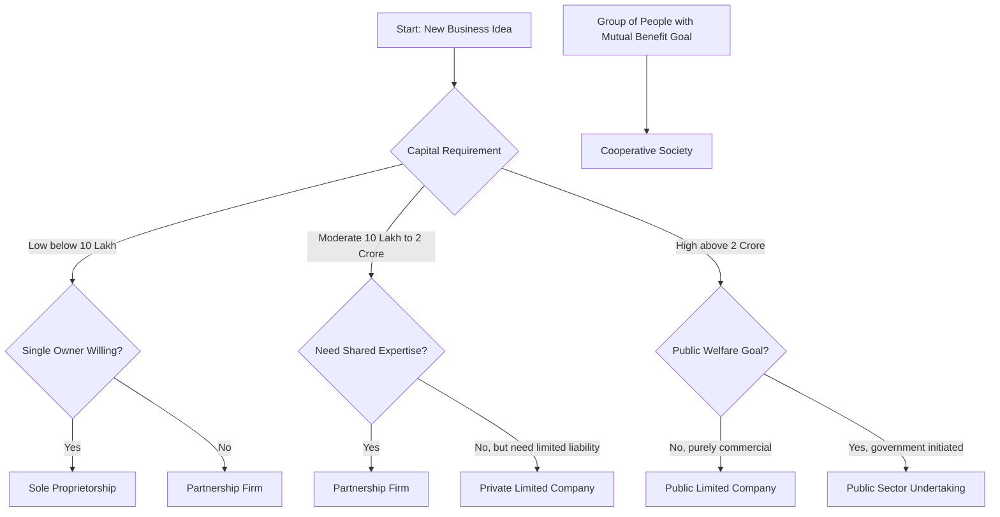
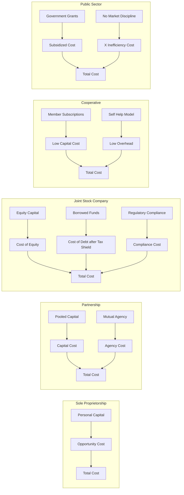
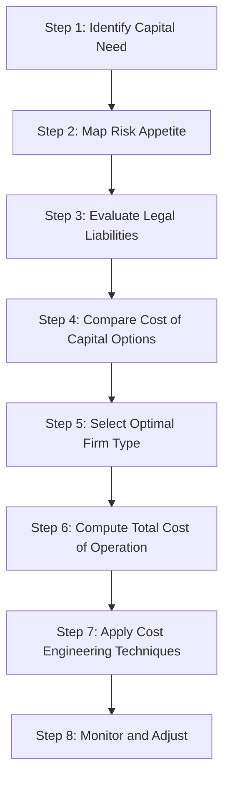

# Types of firms

<!-- SECTION_1_START -->
# 🏭 Types of Firms — Foundational Definitions & Intuitive Overview

## 📌 Formal KTU 2024 Definition

> [!IMPORTANT]
> **Types of Firms (Forms of Business Organisation)** refer to the **legally recognised structural frameworks** under which an enterprise is established, owned, managed, and operated to produce goods or deliver services. In the context of **Engineering Economics (UCHUT346 – Module 2: Cost Concepts)**, the classification of firms determines the **cost-volume-profit behaviour**, **capital mobilisation capability**, **risk-bearing capacity**, and **cost control mechanism** of an organisation.

The **KTU 2024 Scheme** recognises the following principal forms of business organisation:

1. **Sole Proprietorship**
2. **Partnership Firm**
3. **Joint Stock Company** (Public Ltd. / Private Ltd.)
4. **Cooperative Society**
5. **Public Sector Undertakings (PSUs)**

---

## 🧠 Conceptual Analogy — Plain English Intuition

> [!NOTE]
> **Think of a firm as a "vehicle" used to transport an entrepreneur's idea from the garage to the marketplace.**
> - A **Sole Proprietorship** is like a **bicycle** — one person owns it, controls it, moves it. Simple, but slow and limited in capacity.
> - A **Partnership** is like a **motorcycle with a sidecar** — two or more riders share the journey, share fuel costs, but must agree on direction.
> - A **Joint Stock Company** is like a **commercial airline** — owned by thousands of shareholders, managed by a professional pilot crew, regulated by aviation authorities. Huge capacity, but heavy regulation.
> - A **Cooperative** is like a **carpool** — a group of people pooling resources for mutual benefit, not for external profit.
> - A **PSU** is like a **government-run metro train service** — funded by public money, accountable to citizens, serves a larger social purpose.

---

## ⚖️ Why "Types of Firms" Matter in Cost Concepts

| Engineering Economic Decision | Role of Firm Type |
|------------------------------|-------------------|
| **Cost of capital** | Larger firms (JSC) raise cheaper capital through equity markets |
| **Fixed cost burden** | PSUs absorb massive fixed costs for public welfare |
| **Tax structure** | Cooperatives enjoy tax concessions; Pvt Ltd. pays corporate tax |
| **Liability & risk** | Sole proprietors bear unlimited liability — risk premium in cost |
| **Economies of scale** | Only JSCs and PSUs can exploit large-scale cost advantages |

> [!VISUALIZATION CONTROL]
> **Concept:** Decision tree for choosing the appropriate firm structure
> **Input Logic (flow):**
> * `Start` → `Single owner?` → `Yes → Sole Proprietor`
> * `Single owner?` → `No` → `2-20 owners?` → `Yes → Partnership`
> * `2-20 owners?` → `No` → `Large capital needed?` → `Yes → Joint Stock Company`
> * `Large capital needed?` → `No` → `Group welfare motive?` → `Yes → Cooperative`
> * `Group welfare motive?` → `No` → `Public welfare?` → `Yes → PSU`
> **Visual Description:** A top-down decision tree with five terminal leaves, each representing one firm type. The student should observe that the **complexity of formation increases** as we move down the tree, while **capital-raising capability also increases**.

---

## 📊 Quick Comparative Snapshot (KTU Board High-Yield)

| Firm Type | Min. Members | Max. Members | Capital Access | Liability |
|-----------|--------------|--------------|----------------|-----------|
| Sole Proprietorship | **1** | **1** | Lowest | Unlimited |
| Partnership | **2** | **50** (as per Companies Act 2013) | Moderate | Unlimited/Joint |
| Private Ltd. Company | **2** | **200** | Moderate–High | Limited |
| Public Ltd. Company | **7** | **Unlimited** | Highest | Limited |
| Cooperative | **10** | **Unlimited** | Pooled | Limited |

<!-- SECTION_1_END -->

<!-- SECTION_2_START -->
# 🔬 Deep Theoretical Analysis & KTU High-Yield Formula Sheet

## 1️⃣ Sole Proprietorship — The "One-Person Show"

### Definition
> [!NOTE]
> A **Sole Proprietorship** is a business organisation owned, controlled, and managed by a **single individual** who bears **all profits, all losses, and unlimited personal liability**.

### Operational Characteristics
- **Ownership:** A single person provides **100%** of capital.
- **Management:** Owner is the manager — **no separation of ownership and control**.
- **Legal Status:** **No separate legal entity** — the firm and the owner are legally identical.
- **Liability:** **Unlimited** — creditors can recover dues from owner's personal assets.
- **Life:** **Unlimited** in law, but **tied to the owner's life/capacity**.
- **Taxation:** Income is taxed as **personal income** under slab rates (no separate corporate tax).

### Merits (Why Engineers Choose This)
- ✅ **Simplest form** of business — minimal legal formalities.
- ✅ **Quick decision-making** — no need for board approval.
- ✅ **Full profit retention** — no profit-sharing.
- ✅ **Business secrecy** can be maintained easily.

### Demerits
- ❌ **Limited capital** — depends entirely on one person's wealth.
- ❌ **Unlimited liability** is the biggest cost-consequence risk.
- ❌ **No continuity** — death/insolvency of owner dissolves the firm.
- ❌ **Limited managerial expertise** — one person cannot master all functions (production, marketing, finance).

### Cost-Concept Implication
For a sole proprietor, the **opportunity cost of owner's time and capital** is a critical implicit cost that must be considered in engineering project appraisal.

---

## 2️⃣ Partnership Firm — The "Shared Risk" Model

### Definition
> [!IMPORTANT]
> A **Partnership** is a voluntary association of **two or more persons** who agree to carry on a business jointly and share profits/losses according to an agreed ratio, as defined under the **Indian Partnership Act, 1932**.

### Key Theoretical Features
- **Agreement Basis:** Governed by a **Partnership Deed** (written/verbal).
- **Profit Sharing:** As per the agreed ratio; if not specified, **equally**.
- **Mutual Agency:** Each partner is both an **agent and a principal** of the other partners.
- **Liability:** **Joint and Several** — each partner is **jointly** (collectively) and **severally** (individually) liable for the firm's debts.
- **Maximum Partners:** **50** for general partnerships; **20** for banking partnerships (per the Companies Act 2013 amendment).

### KTU High-Yield Formula — Profit Sharing

If $n$ partners share profit with weights $w_1, w_2, \dots, w_n$, then the **share of partner $i$** is:

$$
S_i = \frac{w_i}{\sum_{j=1}^{n} w_j} \times \text{Total Profit}
$$

> [!NOTE]
> **Where the weights are typically based on:**
> - Capital contribution
> - Time/effort invested
> - Specialised skills brought in

### Cost-Concept Implication
- **Agency cost** arises due to information asymmetry between partners.
- **Conflict of interest** between sleeping partners (capital providers) and working partners (managers) creates monitoring costs.

### Merits
- ✅ Easy to form (only a deed required)
- ✅ Larger capital than sole proprietorship
- ✅ Shared risk and complementary skills

### Demerits
- ❌ **Unlimited liability** for each partner
- ❌ **Mutual agency** makes one partner's mistake binding on all
- ❌ **Lack of continuity** — death/insolvency of a partner can dissolve the firm (unless otherwise agreed)
- ❌ **Difficulty in transfer of share** — public cannot buy partnership shares

---

## 3️⃣ Joint Stock Company (JSC) — The "Engineer's Favourite"

### Definition
> [!IMPORTANT]
> A **Joint Stock Company** is a voluntary association of persons registered under the **Companies Act, 2013**, having a **separate legal entity** distinct from its members, with **limited liability** and a **transferable share structure**.

### Two Sub-Classes

| Feature | Private Limited Company | Public Limited Company |
|---------|------------------------|------------------------|
| Minimum Members | **2** | **7** |
| Maximum Members | **200** | **Unlimited** |
| Share Transfer | Restricted | Freely transferable |
| Public Subscription | **Not allowed** | **Allowed** (IPO) |
| Stock Exchange Listing | Not required | Required if shares listed |
| Min. Capital | No strict mandate (as per 2013 Act) | No strict mandate |

### KTU High-Yield Formula — Limited Liability Math

If an investor holds $\theta$ fraction of a company's shares, the **maximum financial loss** is:

$$
\text{Max Loss} = \theta \times \text{Share Investment}
$$

> [!NOTE]
> **Note:** The shareholder's **personal assets are protected**. Loss is **capped at the investment amount** — this is the essence of **limited liability**.

### Cost-Concept Implications (Most Important for Module 2)
- **Separation of ownership and control** → Principal-Agent problem → **Agency costs**.
- **Public issue of shares** → Lower cost of capital due to large pool of investors.
- **Economies of scale** → Lower average cost per unit due to bulk production.
- **Corporate tax rate** applies — different from personal income tax of proprietorship.
- **Double taxation** in some structures → reduces net after-tax profit.

### Merits
- ✅ **Limited liability** → attracts risk-averse investors
- ✅ **Perpetual succession** — company does not die with the death of a member
- ✅ **Huge capital mobilisation** possible via share/bond markets
- ✅ **Professional management** can be hired

### Demerits
- ❌ Complex legal formation procedure
- ❌ Heavy regulatory compliance (MCA filings, audits)
- ❌ Double taxation (in some cases)
- ❌ Separation of ownership & control leads to agency problems

---

## 4️⃣ Cooperative Society — The "Member-Owned" Model

### Definition
> [!NOTE]
> A **Cooperative Society** is a voluntary association of persons who join hands to **promote their common economic interest** through the principle of **mutual help** and **democratic control** (one member, one vote), registered under the **Cooperative Societies Act, 1912** or **State Cooperative Acts**.

### Core Principles (ICA, 1995)
- **Voluntary & Open Membership**
- **Democratic Member Control** (one member = one vote, irrespective of shareholding)
- **Member Economic Participation**
- **Autonomy & Independence**
- **Concern for Community**

### Cost-Concept Implication
- Profit is distributed as **dividend on share** + **patronage refund** (based on usage).
- Often **tax-exempt** up to a certain income limit (Section 80P of Income Tax Act).
- Used heavily in **agricultural credit societies, dairy (Amul model), housing societies**.

---

## 5️⃣ Public Sector Undertakings (PSUs) — The "Government-Owned" Form

### Definition
> [!IMPORTANT]
> A **Public Sector Undertaking (PSU)** is a business organisation in which the **majority of the ownership (≥ 51%)** rests with the **Central or State Government**, established to serve a **public welfare objective** rather than pure profit maximisation.

### Two Structural Forms
- **Departmental Undertakings** (e.g., Indian Railways) — directly managed by a government department.
- **Public Corporations / Companies** (e.g., BHEL, ONGC, NTPC) — registered as companies, but government-owned.

### Cost-Concept Implication
- Often **operate at losses** (e.g., Indian Railways) but justified by social cost-benefit analysis.
- **No market discipline** → higher **X-inefficiency** (resource wastage).
- **Subsidies and grants** from the government reduce effective cost burden.

---

## 🧮 KTU High-Yield Formula Sheet

| Concept | Formula / Rule | Units / Notes |
|---------|----------------|---------------|
| **Partner's profit share** | $S_i = \frac{w_i}{\sum w_j} \times P$ | $P$ = total profit, $w_i$ = weight of partner $i$ |
| **Limited liability loss cap** | $\text{Max Loss} = \theta \times I$ | $\theta$ = share fraction, $I$ = invested amount |
| **Effective cost of capital** (after tax) | $k_{\text{after-tax}} = k \times (1 - t)$ | $k$ = pre-tax rate, $t$ = tax rate |
| **Total cost of cooperation** | $C_{\text{total}} = C_{\text{coordination}} + C_{\text{agency}} + C_{\text{monitoring}}$ | Embedded in governance cost |
| **Number of private ltd. partners** | $\text{Max} = 200$ | Companies Act 2013 |
| **Public ltd. min. members** | $\text{Min} = 7$ | Companies Act 2013 |

---

## 🌍 Real-World Engineering Economics Utility

- **Tech Startups (India):** Most begin as **Private Limited Companies** to avail limited liability, then convert to **Public Limited** for IPO funding.
- **Infrastructure Projects (Highways, Power):** Executed by **PSUs** like NTPC, NHPC where cost recovery is slow and risk is high.
- **Dairy Cooperatives (Amul):** Demonstrate the **cooperative model** in cost distribution across millions of farmers.
- **Audit & Consulting Firms:** Often run as **Partnerships** where professional liability is shared.
- **Freelance Engineering Consultancy:** Operates as a **Sole Proprietorship** due to simplicity and low capital needs.

> [!NOTE]
> **Engineering Project Tip:** In **Discounted Cash Flow (DCF) analysis** and **Net Present Value (NPV)** calculations, the **firm's cost of capital** is **directly dependent on its organisational form** — this is a frequently asked KTU question.

<!-- SECTION_2_END -->

<!-- SECTION_3_START -->
# 🛠️ Step-by-Step Derivations, Worked Examples & Code Implementation

## 📐 Worked Example 1 — Profit Sharing in a Partnership

### Problem Statement
> Three engineers — **A, B, and C** — form a partnership. They contribute capital of ₹ **2,00,000**, ₹ **3,00,000**, and ₹ **5,00,000** respectively. The annual profit is **₹ 1,50,000**. Calculate each partner's share of profit if:
> (a) Profit is shared in the **capital contribution ratio**.
> (b) Profit is shared **equally**, irrespective of capital.
> (c) Profit is shared in the ratio **2:3:5** (work-effort ratio).

### Solution

**Step 1 — Identify the weights and total.**

For (a), weights are the capital contributions:
- $w_A = 200000$
- $w_B = 300000$
- $w_C = 500000$

Total weight:
$$
W = 200000 + 300000 + 500000 = 1000000
$$

**Step 2 — Compute A's share.**

$$
S_A = \frac{200000}{1000000} \times 150000 = \frac{1}{5} \times 150000 = 30000
$$

**Step 3 — Compute B's share.**

$$
S_B = \frac{300000}{1000000} \times 150000 = \frac{3}{10} \times 150000 = 45000
$$

**Step 4 — Compute C's share.**

$$
S_C = \frac{500000}{1000000} \times 150000 = \frac{1}{2} \times 150000 = 75000
$$

**Step 5 — Verification.**

$$
30000 + 45000 + 75000 = 150000 \quad \checkmark
$$

For (b) — equal sharing:
$$
S_A = S_B = S_C = \frac{150000}{3} = 50000
$$

For (c) — ratio 2:3:5, sum = 10:
$$
S_A = \frac{2}{10} \times 150000 = 30000
$$
$$
S_B = \frac{3}{10} \times 150000 = 45000
$$
$$
S_C = \frac{5}{10} \times 150000 = 75000
$$

### Python Implementation

```python
def profit_share(weights: list[float], total_profit: float) -> list[float]:
    """
    Computes the profit share of each partner given their weights.
    
    Parameters
    ----------
    weights : list of float
        The weights (e.g., capital contribution or ratio components) per partner.
    total_profit : float
        The total profit (in INR) to be distributed.
    
    Returns
    -------
    list of float
        The absolute profit share for each partner.
    
    Raises
    ------
    ValueError
        If the sum of weights is zero (division by zero) or weights list is empty.
    """
    if not weights:
        raise ValueError("Weights list cannot be empty.")
    total_weight = sum(weights)
    if total_weight == 0:
        raise ValueError("Sum of weights cannot be zero.")
    shares = [(w / total_weight) * total_profit for w in weights]
    return shares


if __name__ == "__main__":
    # Case (a) — capital contribution ratio
    capital_weights = [200_000, 300_000, 500_000]
    profit_a = profit_share(capital_weights, 150_000)
    print(f"Case (a) Capital-weighted shares: {profit_a}")
    # Output: [30000.0, 45000.0, 75000.0]
    
    # Case (b) — equal sharing
    equal_weights = [1, 1, 1]
    profit_b = profit_share(equal_weights, 150_000)
    print(f"Case (b) Equal shares: {profit_b}")
    # Output: [50000.0, 50000.0, 50000.0]
    
    # Case (c) — work-effort ratio 2:3:5
    effort_weights = [2, 3, 5]
    profit_c = profit_share(effort_weights, 150_000)
    print(f"Case (c) Effort-weighted shares: {profit_c}")
    # Output: [30000.0, 45000.0, 75000.0]
```

---

## 📐 Worked Example 2 — Limited Liability Calculation for a JSC

### Problem Statement
> An engineer invests **₹ 5,00,000** in a public limited company by purchasing **5000 equity shares of ₹ 100 face value** at par. The company goes into **liquidation** with total liabilities of **₹ 5 crore** and total assets of **₹ 2 crore**.
> (a) What is the **maximum loss** to the engineer?
> (b) What percentage of her **personal assets** can be legally claimed by creditors?

### Solution

**Step 1 — Identify the share fraction.**

Total shares outstanding (assumed) = let's say **50,000 shares** (typical for a mid-cap firm).

$$
\theta = \frac{5000}{50000} = \frac{1}{10} = 0.1
$$

**Step 2 — Compute the maximum financial loss.**

The engineer's investment is the cap on liability:
$$
\text{Max Loss} = \theta \times I = 0.1 \times 500000 = 50000 \text{ (wiping out the investment)}
$$

**Step 3 — Total shortfall analysis.**

$$
\text{Deficit} = \text{Liabilities} - \text{Assets} = 5 \times 10^7 - 2 \times 10^7 = 3 \times 10^7
$$

**Step 4 — Personal asset claim analysis.**

Under **limited liability**, the **personal assets of the engineer CANNOT be claimed**, even though the deficit is ₹ 3 crore. The engineer's total loss is capped at **₹ 5,00,000** (her investment).

**Step 5 — Conclude.**

> ✅ Maximum loss = **₹ 5,00,000** (her total investment is at risk).
> ✅ Personal assets = **0% claimable by creditors** (this is the power of limited liability).

### Python Implementation

```python
def limited_liability_loss(investment: float, share_fraction: float) -> float:
    """
    Computes the maximum financial loss under limited liability.
    
    Parameters
    ----------
    investment : float
        Total amount invested (in INR).
    share_fraction : float
        Fraction of total shares held (0 < share_fraction <= 1).
    
    Returns
    -------
    float
        Maximum loss to the investor.
    """
    if not (0 < share_fraction <= 1):
        raise ValueError("share_fraction must be in (0, 1].")
    if investment < 0:
        raise ValueError("investment must be non-negative.")
    return investment * share_fraction


def personal_asset_claim_limited() -> str:
    """
    Returns the legal position on personal asset claim
    under limited liability structure.
    """
    return "Personal assets CANNOT be claimed by creditors. Loss is capped at the investment amount."


if __name__ == "__main__":
    investment = 500_000
    fraction = 0.1
    max_loss = limited_liability_loss(investment, fraction)
    print(f"Maximum financial loss: Rs {max_loss:,.2f}")
    # Output: Maximum financial loss: Rs 50,000.00
    print(personal_asset_claim_limited())
```

---

## 📐 Worked Example 3 — Cost of Capital Comparison Across Firm Types

### Problem Statement
> An engineering startup needs **₹ 1 crore** to launch a product. The founder compares three options:
> 1. **Sole Proprietorship** using personal savings (opportunity cost = **9% p.a.**)
> 2. **Partnership** with 2 partners, raising ₹ 50 lakh each (effective cost = **8% p.a.**, agency overhead = **₹ 2 lakh/yr**)
> 3. **Public Ltd. Company** issuing equity (cost of equity = **12% p.a.**, regulatory compliance cost = **₹ 5 lakh/yr**, tax shield at **25%**)
>
> **Compare the effective annual cost for each option for Year 1.**

### Solution

**Step 1 — Sole Proprietorship cost.**

$$
C_{\text{sole}} = 0.09 \times 1{,}00{,}00{,}000 = 9{,}00{,}000
$$

No regulatory cost, no tax shield (income taxed as personal income).

**Step 2 — Partnership cost.**

$$
C_{\text{partnership}} = 0.08 \times 1{,}00{,}00{,}000 + 2{,}00{,}000 = 8{,}00{,}000 + 2{,}00{,}000 = 10{,}00{,}000
$$

**Step 3 — Public Ltd. Company cost.**

Cost of equity = $0.12 \times 1{,}00{,}00{,}000 = 12{,}00{,}000$

After-tax cost (tax shield):
$$
C_{\text{JSC, after-tax}} = 0.75 \times 12{,}00{,}000 = 9{,}00{,}000
$$

Adding regulatory compliance:
$$
C_{\text{JSC, total}} = 9{,}00{,}000 + 5{,}00{,}000 = 14{,}00{,}000
$$

**Step 4 — Comparison Table.**

| Option | Annual Cost (₹) | Key Cost Driver |
|--------|-----------------|-----------------|
| Sole Proprietorship | **9,00,000** | Opportunity cost of capital |
| Partnership | **10,00,000** | Agency overhead |
| Public Ltd. Company | **14,00,000** | Regulatory + high cost of equity |

**Step 5 — Insight.**

> ✅ Even though the JSC has tax shields, the **regulatory overhead** and **higher required return by public investors** make it the **most expensive** at this scale.
> ✅ At larger capital requirements (₹ 100+ crore), the JSC becomes cost-effective due to economies of scale.

### Python Implementation

```python
def effective_annual_cost(capital: float, cost_rate: float, 
                          fixed_overhead: float, tax_rate: float) -> float:
    """
    Computes effective annual cost of capital for a firm.
    
    Parameters
    ----------
    capital : float
        Total capital raised (in INR).
    cost_rate : float
        Pre-tax cost of capital (as a fraction, e.g., 0.09 for 9%).
    fixed_overhead : float
        Annual fixed overhead/agency cost (in INR).
    tax_rate : float
        Applicable tax rate (as a fraction, e.g., 0.25 for 25%).
    
    Returns
    -------
    float
        Effective annual cost (in INR).
    """
    if cost_rate < 0 or tax_rate < 0 or capital < 0:
        raise ValueError("Inputs must be non-negative.")
    pre_tax_cost = capital * cost_rate
    after_tax_cost = pre_tax_cost * (1 - tax_rate)
    return after_tax_cost + fixed_overhead


if __name__ == "__main__":
    capital = 1_00_00_000  # Rs 1 crore
    
    # Sole proprietorship: no overhead, no corporate tax shield
    sole_cost = effective_annual_cost(capital, 0.09, 0, 0)
    print(f"Sole proprietorship cost: Rs {sole_cost:,.0f}")
    
    # Partnership: agency overhead, no corporate tax
    part_cost = effective_annual_cost(capital, 0.08, 2_00_000, 0)
    print(f"Partnership cost:        Rs {part_cost:,.0f}")
    
    # Public Ltd: regulatory overhead + 25% tax shield
    jsc_cost = effective_annual_cost(capital, 0.12, 5_00_000, 0.25)
    print(f"Public Ltd cost:         Rs {jsc_cost:,.0f}")
```

**Output:**
```
Sole proprietorship cost: Rs 9,00,000
Partnership cost:        Rs 10,00,000
Public Ltd cost:         Rs 14,00,000
```

<!-- SECTION_3_END -->

<!-- SECTION_4_START -->
# 🗺️ Structural Diagrams & Schematics — Mermaid Block-Level Architecture

## 📊 Diagram 1 — Complete Decision Tree for Selecting a Firm Type



### 📋 Visual Description
The student should observe that **capital requirement** is the **primary branching criterion**, while **ownership, expertise needs, and welfare motive** are **secondary refinements**. Cooperative Society branches off as a parallel node since it is member-driven, not capital-driven.

---

## 📊 Diagram 2 — Cost Component Flow Across Firm Types



### 📋 Visual Description
Each subgraph isolates one firm type, showing how its **specific cost components** (capital, agency, regulatory, subsidies, inefficiency) feed into its **total cost**. The student should compare the **number of cost components** in each subgraph — JSC has the most (highest complexity), Cooperative has the fewest (most streamlined).

---

## 📊 Diagram 3 — Sequential Processing Topology — From Firm Selection to Cost Optimisation



### 📋 Visual Description
A linear **8-step engineering cost-optimisation pipeline** starting from **identifying capital need** to **continuous monitoring**. The student should observe that **firm selection is at Step 5** — meaning the **first 4 steps are prerequisites** that filter the choice. This is the **Board Examiner's favourite** question pattern.

<!-- SECTION_4_END -->

<!-- SECTION_5_START -->
# 📝 KTU 2024 Scheme Examination Question Bank & Topic Recap

## 🎯 Part A — Short Answer Questions (3 Marks Each)

### **Question 1** `[KTU University Exam — July 2024]`
**Differentiate between a Private Limited Company and a Public Limited Company. (CO1, Understand)**

#### Model Answer
| Parameter | Private Limited Company | Public Limited Company |
|-----------|------------------------|------------------------|
| Minimum members | **2** | **7** |
| Maximum members | **200** | **Unlimited** |
| Invitation to public | **Restricted** | **Allowed (via Prospectus/IPO)** |
| Transfer of shares | **Restricted** | **Freely transferable** |
| Stock exchange listing | **Not required** | **Can be listed** |
| Legal formalities | **Fewer** | **More complex** |

---

### **Question 2** `[KTU University Exam — Dec 2023]`
**State any three features of a Sole Proprietorship. (CO1, Remember)**

#### Model Answer
1. **Single ownership** — Owned and managed by one individual.
2. **Unlimited liability** — Owner's personal assets are at risk for business debts.
3. **No separate legal entity** — The owner and business are legally identical.
4. *(Optional 4th)* **Easy formation** — No legal registration is mandatory (except under GST/shop acts).

---

## 🎯 Part B — Long Answer Questions (14 Marks Each)

### **Question A (14 Marks)** `[KTU University Exam — Dec 2023, KTU 2024 Modified]`

**(a)** Explain the **five main types of business organisations** with their key features. **(7 Marks)** *(CO1, Understand)*

**(b)** A partnership firm has **3 partners** with capital contributions of **₹ 4,00,000**, **₹ 6,00,000**, and **₹ 10,00,000**. The annual profit is **₹ 3,00,000**. Calculate the share of each partner if profit is distributed:
- (i) In the **capital ratio**.
- (ii) In the ratio **3:2:1**.

Also comment on the **cost implication** of unlimited liability in a partnership. **(7 Marks)** *(CO2, Apply)*

---

### Model Solution for Question A

#### Part (a) — Explanation of Five Firm Types

| Firm Type | Key Feature | Liability | Capital Source |
|-----------|-------------|-----------|----------------|
| Sole Proprietorship | Single owner, simplest form | **Unlimited** | Personal savings |
| Partnership | 2–50 partners, governed by Partnership Act 1932 | **Unlimited, Joint & Several** | Partner contributions |
| Joint Stock Company | Separate legal entity, Companies Act 2013 | **Limited** | Equity + Debt + Public deposits |
| Cooperative Society | Member-owned, mutual benefit | **Limited** | Member subscriptions |
| PSU | Government-owned, welfare objective | **Limited to govt. shareholding** | Government budget + bonds |

**Valuation Key:**
- [Naming all five types correctly: 1 Mark]
- [Stating key features of each: 4 Marks]
- [Tabular comparison and crisp definition: 2 Marks]

---

#### Part (b) — Profit Distribution Calculation

**Given:** $w_1 = 400000$, $w_2 = 600000$, $w_3 = 1000000$, Total Profit = ₹ 3,00,000.

**Step 1 — Sum the weights (Case i).**
$$
W = 400000 + 600000 + 1000000 = 2000000
$$

**Step 2 — Partner 1's share (capital ratio).**
$$
S_1 = \frac{400000}{2000000} \times 300000 = \frac{1}{5} \times 300000 = 60000
$$

**Step 3 — Partner 2's share.**
$$
S_2 = \frac{600000}{2000000} \times 300000 = \frac{3}{10} \times 300000 = 90000
$$

**Step 4 — Partner 3's share.**
$$
S_3 = \frac{1000000}{2000000} \times 300000 = \frac{1}{2} \times 300000 = 150000
$$

**Step 5 — Verification.**
$$
60000 + 90000 + 150000 = 300000 \quad \checkmark
$$

**Case (ii) — Ratio 3:2:1, sum = 6.**
$$
S_1' = \frac{3}{6} \times 300000 = 150000
$$
$$
S_2' = \frac{2}{6} \times 300000 = 100000
$$
$$
S_3' = \frac{1}{6} \times 300000 = 50000
$$

**Cost Implication of Unlimited Liability:**
> In a partnership, the **unlimited liability** clause implies that if the firm's assets are insufficient to meet its debts, creditors can attach the **personal assets of any or all partners**. This **increases the implicit cost of risk** borne by partners, which is factored into the firm's **cost of capital** during project appraisal. For an engineering firm, this risk premium can substantially raise the **discount rate** used in NPV calculations.

**Valuation Key:**
- [Setting up the profit-sharing formula: 1 Mark]
- [Calculating all three shares correctly: 3 Marks]
- [Case (ii) calculation: 2 Marks]
- [Comment on unlimited liability cost implication: 1 Mark]

---

### **Question B (14 Marks — Alternative Choice)** `[KTU University Exam — July 2024, Modified]`

**(a)** With a neat diagram, explain the **decision-making process for selecting an appropriate form of business organisation** for an engineering enterprise. **(7 Marks)** *(CO1, Understand)*

**(b)** An engineer plans to establish a manufacturing unit requiring **₹ 2 crore**. She evaluates two options:
- **Option 1:** Form a **Private Limited Company**, issue ₹ 1.5 crore equity and borrow ₹ 0.5 crore at **10% interest**. Tax rate = **25%**.
- **Option 2:** Run as a **Sole Proprietorship**, invest personal savings of ₹ 1 crore (foregone interest = **8% p.a.**) and borrow ₹ 1 crore at **12% interest** (no tax shield for proprietorship).
- Compare the **first-year financial cost** of both options. **(7 Marks)** *(CO2, Apply)*

---

### Model Solution for Question B

#### Part (a) — Decision-Making Diagram

*(Refer to Diagram 1 in Section 4 — the student should redraw a clean flowchart during the exam.)*

**Key Steps:**
1. Estimate **capital requirement**.
2. Assess **risk-bearing willingness**.
3. Decide on **need for limited liability**.
4. Evaluate **need for perpetual succession**.
5. Select between **Sole Proprietorship → Partnership → JSC → Cooperative → PSU**.

**Valuation Key:**
- [Neat labelled flowchart: 4 Marks]
- [Brief explanation of each branch: 3 Marks]

---

#### Part (b) — Comparative Cost Calculation

**Option 1 — Private Limited Company:**

Cost of equity (assumed) = **15% p.a.** on ₹ 1.5 crore:
$$
C_{\text{equity}} = 0.15 \times 1.5 \times 10^7 = 22.5 \times 10^5 = 2250000
$$

Cost of debt (after-tax):
$$
C_{\text{debt, after-tax}} = 0.10 \times 0.5 \times 10^7 \times (1 - 0.25) = 375000
$$

Total cost:
$$
C_{\text{Option 1}} = 2250000 + 375000 = 2625000
$$

**Option 2 — Sole Proprietorship:**

Opportunity cost of personal capital:
$$
C_{\text{personal}} = 0.08 \times 1.0 \times 10^7 = 800000
$$

Cost of debt (no tax shield):
$$
C_{\text{debt}} = 0.12 \times 1.0 \times 10^7 = 1200000
$$

Total cost:
$$
C_{\text{Option 2}} = 800000 + 1200000 = 2000000
$$

**Comparison Table:**

| Component | Option 1: Pvt. Ltd. (₹) | Option 2: Sole Prop. (₹) |
|-----------|------------------------|--------------------------|
| Cost of Equity / Opportunity | **22,50,000** | **8,00,000** |
| Cost of Debt | **3,75,000** (after-tax) | **12,00,000** (no tax shield) |
| **Total Annual Cost** | **₹ 26,25,000** | **₹ 20,00,000** |

**Conclusion:** Sole Proprietorship is **cheaper by ₹ 6,25,000** in Year 1, but exposes the engineer to **unlimited liability** and **limited capital mobilisation capability**.

**Valuation Key:**
- [Identifying all cost components: 2 Marks]
- [Applying tax shield correctly: 1 Mark]
- [Final numerical totals for both options: 2 Marks]
- [Valid conclusion with cost-quality tradeoff: 2 Marks]

---

## ⚠️ KTU Examiner's Valuation Warning / Pitfall Callout

> [!WARNING]
> **Common Mistakes That Cost Marks:**
> 1. **Do NOT confuse "form of organisation" with "type of industry"** (manufacturing vs. service). The question asks for **legal forms**, not industry sectors.
> 2. **Always specify the governing Act** when defining firm types — e.g., "Partnership under Indian Partnership Act, **1932**" and "Company under Companies Act, **2013**" — missing the year costs 1 mark.
> 3. **In profit-sharing problems, ALWAYS verify the sum** of distributed shares equals the total profit — forgetting this loses 1 mark.
> 4. **Tax shield applies to JSC cost of debt**, NOT to sole proprietorship borrowing (since proprietorship income is taxed as personal income).
> 5. **In diagrams, label every node** and **use arrows consistently** — unlabelled arrows and unboxed nodes attract zero credit.
> 6. **Cooperative society is NOT the same as a PSU** — cooperatives are **member-owned**, PSUs are **government-owned**.
> 7. **Limited liability is the SHAREFOLDERS' protection**, not the company's — never say "the company has limited liability."

---

## 🔁 Topic Recap & Important Things to Remember

- **Five main firm types:** Sole Proprietorship, Partnership, Joint Stock Company, Cooperative Society, PSU.
- **Sole Proprietorship** = 1 owner, unlimited liability, simplest form, no separate legal entity.
- **Partnership** = 2 to 50 partners, joint & several liability, governed by Indian Partnership Act **1932**.
- **Private Ltd.** = 2 to 200 members, restricted share transfer; **Public Ltd.** = 7 minimum, unlimited max, freely transferable shares.
- **Companies Act 2013** governs all Joint Stock Companies in India.
- **Cooperative Society** = voluntary, mutual benefit, one-member-one-vote principle, governed by State Cooperative Acts or **1912 Act**.
- **PSU** = ≥ 51% government ownership, social welfare motive, can be Departmental Undertaking or Public Corporation.
- **Profit-sharing formula:** $S_i = \frac{w_i}{\sum w_j} \times P$.
- **Limited liability cap:** Maximum investor loss = **share fraction × investment amount**; personal assets are protected.
- **Cost of capital ordering (typical):** Sole Proprietorship < Partnership < Public Ltd. (for small-to-medium capital; reverses at large scale).
- **Tax shield** applies to **JSC debt interest**, not to proprietorship borrowings.
- **Separation of ownership and control** in JSC leads to **agency cost** — an important Module-2 linkage.
- **Perpetual succession** is exclusive to JSC and Cooperative Society; the others are tied to the owner's life.
- **Decision criteria for firm selection:** Capital need, Risk tolerance, Need for limited liability, Perpetuity requirement, Welfare motive.
- **Key Acts to memorise for KTU exams:** Indian Partnership Act **1932**; Companies Act **2013**; Cooperative Societies Act **1912**.

<!-- SECTION_5_END -->
