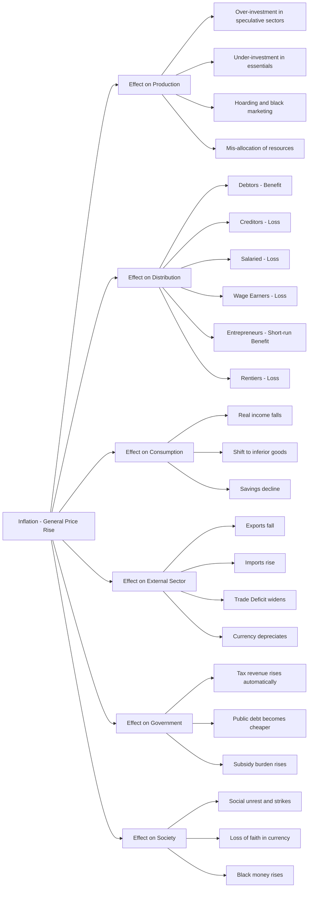
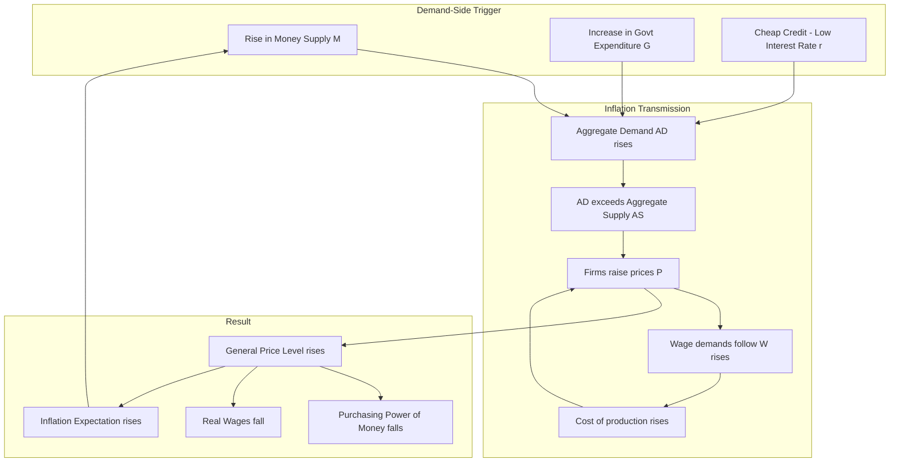
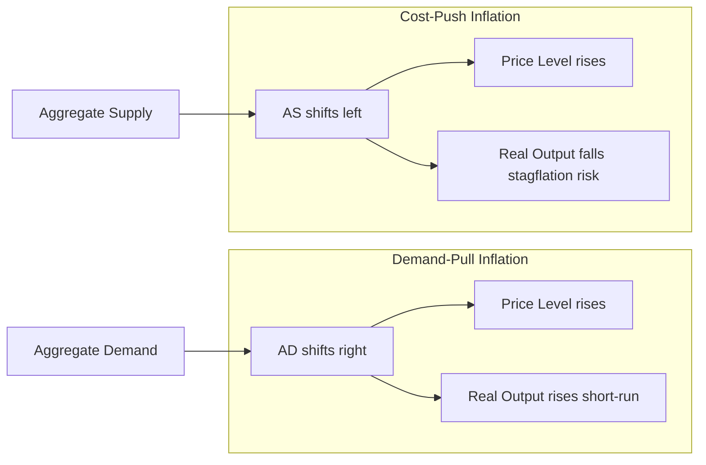
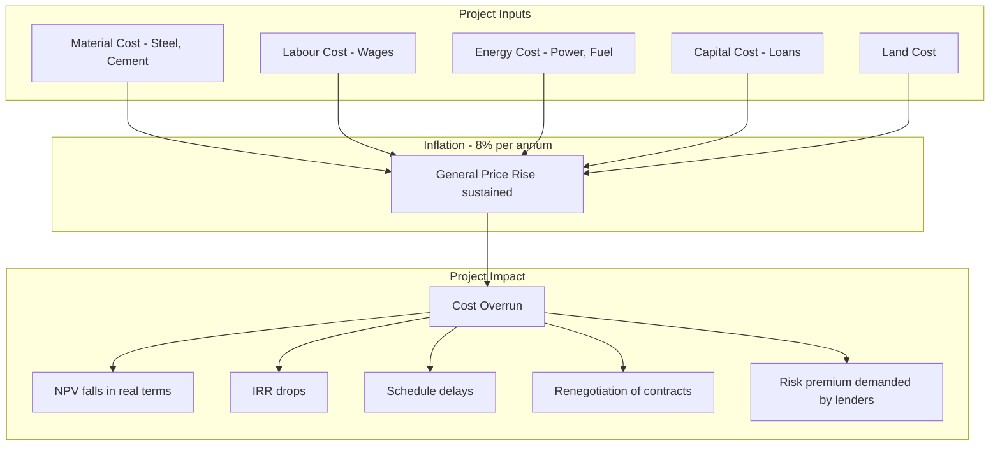

# Causes and Effects

<!-- SECTION_1_START -->

# Module 3: Monetary System — Causes and Effects (Inflation)

> [!IMPORTANT]
> **KTU 2024 Scheme | Course Code: UCHUT346 | Economics for Engineers**
> **Module Focus:** Monetary System → Causes and Effects of Inflation
> **CO Mapping:** CO3 — Apply macroeconomic concepts of money, inflation, and monetary policy in engineering business decisions.

---

## 1.1 What is Money? (Foundational Refresher)

### Formal KTU Definition

> **Money** is anything that is generally accepted as a **medium of exchange**, a **unit of account**, and a **store of value** for the settlement of debts and the purchase of goods and services.

In the KTU 2024 syllabus, money is studied primarily as the **root variable** that drives inflation when its supply outpaces the real output of an economy. The Quantity Theory of Money expresses this as:

$$M \times V = P \times T$$

where $M$ = Money Supply, $V$ = Velocity of Circulation, $P$ = Price Level, and $T$ = Volume of Transactions.

### Intuitive Analogy — The "Engine Lubricant" of an Economy

Imagine an engine. **Petrol** is the actual energy, but **engine oil** is what allows every part to move smoothly without friction. In the same way, **Goods & Services** are the real "energy" of a country, but **Money** is the lubricant. 

If you pour **too much oil** (too much money) into a small engine (limited goods), oil will leak out everywhere — it stops lubricating and starts *flooding* the system. This **flooding** is precisely what economists call **inflation**.

### The Six Traditional Functions of Money

| # | Function | Simple Meaning |
|---|----------|----------------|
| 1 | **Medium of Exchange** | Accepted by everyone to buy/sell goods |
| 2 | **Unit of Account** | Common yardstick to measure prices (e.g., ₹) |
| 3 | **Store of Value** | Can be saved and used later (with limitations) |
| 4 | **Standard of Deferred Payment** | Settles future debts (loans, bonds) |
| 5 | **Measure of Value** | Prices of all goods expressed in money |
| 6 | **Transfer of Value** | Easily transferred across geography |

> [!NOTE]
> **KTU Board Note:** In 2-mark/3-mark questions, examiners frequently ask: *"Money is anything that performs which four functions?"* — Always answer with the **first four** (Medium of Exchange, Unit of Account, Store of Value, Standard of Deferred Payment) as they are the universally accepted set.

### Types of Money in India (M0 → M4)

> [!IMPORTANT]
> **KTU Highlight — Narrow vs Broad Money**

$$
\begin{aligned}
M_0 &= \text{Currency with Public} + \text{RBI Reserves (CRR)} \\
M_1 &= M_0 + \text{Demand Deposits of Commercial Banks} \\
M_2 &= M_1 + \text{Post Office Savings Deposits} \\
M_3 &= M_1 + \text{Time Deposits of Commercial Banks} \\
M_4 &= M_3 + \text{Total Post Office Deposits}
\end{aligned}
$$

$ M_1 $ = **Narrow Money** (most liquid)
$ M_3 $ = **Broad Money** (most commonly used macro-indicator by RBI)

---

## 1.2 What is Inflation? — Formal Definition

> **Inflation** is a **sustained and continuous** rise in the **general price level** of goods and services in an economy over a **period of time**, leading to a **decline in the purchasing power of money**.

### Key Qualifiers in the Definition (Exam-Critical)

- It is **sustained** (not a one-day price rise)
- It is **general** (across the economy, not just one commodity)
- It causes a **fall in purchasing power** of money
- A single price rise (e.g., onions due to rain) is **NOT** inflation

> [!NOTE]
> **Mirror Concept — Deflation:** A **sustained and continuous fall** in the general price level = Deflation. This was famously seen in **Japan (Lost Decade, 1990s)** and during India's **post-2013 oil price crash**.

### The "Snickers Bar" Intuition

In **2014**, a Snickers bar cost **₹20**. In **2024**, it costs **₹50**. 

- The **bar is identical** — same chocolate, same nuts, same wrapper.
- The **₹100 note** in your wallet buys you **half as many bars** in 2024 as it did in 2014.

This loss of "bar-buying power" of the rupee = **Inflation**.

### Inflation vs Reflation vs Stagflation vs Hyperinflation

| Term | Meaning | Real-World Example |
|------|---------|--------------------|
| **Inflation** | Moderate price rise (3–10%) | India 2022 (~6.7%) |
| **Reflation** | Government-induced recovery from deflation | USA 2009 post-GFC stimulus |
| **Stagflation** | Stagnant growth + High inflation | UK 1970s oil crisis |
| **Hyperinflation** | Extreme price rise (>50% / month) | Zimbabwe 2008, Venezuela 2018 |
| **Disinflation** | Slowing rate of inflation | India 2014→2017 |

> [!VISUALIZATION CONTROL]
> **Concept:** Price Level vs Time Graph (Inflation Curve)
> **Desmos Input Equations:**
> * `y = 100 * (1.06)^x`  → Steady Inflation (Healthy 6%)
> * `y = 100 * (1.50)^x`  → Hyperinflation
> * `y = 100 * (0.98)^x`  → Deflation
> **Visual Description:** Plot $x$ as Years (0 to 10) and $y$ as Price Index. Observe how the **convex upward curve** visually represents how prices compound, with steeper curves = worse inflation.

---

## 1.3 Measurement of Inflation in India

The two main indices examined in KTU are:

1. **CPI (Consumer Price Index)** — Measures retail inflation faced by consumers. **RBI tracks CPI** for monetary policy decisions.
2. **WPI (Wholesale Price Index)** — Measures wholesale/inflation at the producer level. Replaced as headline indicator in **2014**, but still tracked.

### Generic Price Index Formula

$$
\text{Price Index} = \frac{\text{Cost of Basket in Current Year}}{\text{Cost of Basket in Base Year}} \times 100
$$

> [!IMPORTANT]
> **Inflation Rate Formula (must memorize):**
> $$\text{Inflation Rate (\%)} = \frac{\text{CPI}_{\text{Current}} - \text{CPI}_{\text{Previous}}}{\text{CPI}_{\text{Previous}}} \times 100$$

<!-- SECTION_1_END -->

<!-- SECTION_2_START -->

# Section 2: Deep Theoretical Analysis & KTU High-Yield Formula Sheet

## 2.1 Causes of Inflation — The Complete KTU Framework

Inflation has **two broad root families**: **Demand-Side causes** and **Supply-Side causes**. Beyond that, **monetary factors** and **structural factors** amplify the problem.

### A. Demand-Side Causes (Demand-Pull Inflation)

> **Demand-Pull Inflation** occurs when **aggregate demand** in the economy exceeds **aggregate supply** at full employment level.

In simple terms: **"Too much money chasing too few goods."**

| Cause | Mechanism | Real Example |
|-------|-----------|--------------|
| **Rise in Money Supply** | Govt / RBI prints more notes | Demonetisation reverse-effect analysis |
| **Increased Public Spending** | Govt fiscal deficit (deficit financing) | India 2008–09 farm loan waivers |
| **Rise in Consumer Income** | Disposable income up → demand up | Post-pay-commission hikes (7th CPC) |
| **Cheap Credit / Low Interest Rates** | Borrowing becomes easy → demand surge | USA 2001–2004 housing boom |
| **Population Growth** | More mouths = more demand | India, Africa demographics |
| **Black Money Circulation** | Hidden wealth enters mainstream | Post-demonetisation GST collection spikes |
| **Export Decline / Import Rise** | Domestic goods become scarce | India oil import dependency |
| **Foreign Inflow / Capital Inflow** | Forex gets converted to rupees | FDI surges in SEZs |
| **Psychological Expectation** | Public expects price rise → hoards | Petrol pump queues pre-budget |

### B. Supply-Side Causes (Cost-Push Inflation)

> **Cost-Push Inflation** occurs when the **cost of production** rises, forcing producers to push higher prices onto consumers.

| Cause | Mechanism | Real Example |
|-------|-----------|--------------|
| **Rise in Raw Material Cost** | Steel, copper, oil prices up | 2022 Russia-Ukraine war |
| **Wage Push** | Trade unions demand higher wages | Europe 2022 minimum wage hikes |
| **Indirect Tax Hikes** | GST rate increase on essentials | India GST council periodic revisions |
| **Natural Calamities** | Supply chain breaks | 2020 COVID lockdowns |
| **Import Duty on Inputs** | Imported raw material costlier | Atmanirbhar pushback |
| **Administrative Price Hikes** | Govt raises fuel/diesel prices | India petrol/diesel deregulation |
| **Cartelisation** | Producers collude to raise prices | OPEC oil pricing |

### C. Monetary Causes

- **Excessive money creation** by RBI (printing new currency)
- **Credit expansion** by commercial banks beyond productive capacity
- **Deficit financing** by government (printing money to fund fiscal deficit)

### D. Structural Causes (Long-Run)

- **Bottlenecks in production** — agriculture-dependent economy fails in drought
- **Inefficient supply chains** — wastage in perishables
- **Hoarding & Black Marketing** — reduces effective supply

### E. Fiscal Cause (Deficit Financing Triggered)

When government expenditure > government revenue, it borrows from **RBI** (called **monetization of deficit**). This literally adds new money into the system.

> [!IMPORTANT]
> **KTU Board Tip:** For 7-mark or 14-mark questions, the examiner expects you to **classify** causes into Demand-Pull and Cost-Push and give **at least 3 examples for each**.

---

## 2.2 Effects of Inflation — The Complete KTU Framework

Effects are studied on **6 major economic actors**: Producers, Debtors, Creditors, Fixed-Income Earners, Government, and the External Sector.

### A. Effects on Production

| Effect | Mechanism |
|--------|-----------|
| **Over-investment in speculative sectors** | Real estate, gold (non-productive) get capital, not factories |
| **Under-investment in essential sectors** | Essential goods become loss-making |
| **Mis-allocation of resources** | Long-term productive capital gets disturbed |
| **Hoarding & black marketing flourish** | Profit from price rise > profit from trade |

### B. Effects on Distribution (Most KTU-Favoured Topic)

This is the **most unequally distributed** impact — Inflation is often called the **"cruelest tax"** because it redistributes wealth from the **poor to the rich**.

| Group | Impact | Direction |
|-------|--------|-----------|
| **Debtors** (Borrowers) | Pay back loans in **cheaper money** | **Benefit** |
| **Creditors** (Lenders) | Receive back money with **less purchasing power** | **Loss** |
| **Fixed-Income Earners** (Salaried, Pensioners) | Income does not rise in line with prices | **Loss** |
| **Businessmen / Entrepreneurs** | Profit rises faster than costs | **Benefit (short-run)** |
| **Wage Earners** | Wages lag behind prices | **Loss** |
| **Shareholders** | Equity value rises with prices | **Benefit** |
| **Rentiers (Lenders, Landlords)** | Real value of fixed receipts falls | **Loss** |

> [!NOTE]
> **Key Insight for KTU:** Inflation is sometimes called a **"Robin Hood in reverse"** — it takes from the **poor (fixed income)** and gives to the **rich (asset owners, debtors)**.

### C. Effects on Consumption

- Real income falls → people consume **less**
- Shift from **superior goods** to **inferior goods** (e.g., rice → coarse grains)
- Savings decline → long-term capital formation suffers

### D. Effects on the External Sector

- Domestic goods become **costlier** than foreign goods
- **Exports fall, Imports rise** → Trade Deficit widens
- Currency (Rupee) **depreciates** in forex markets
- **Balance of Payments** crisis risk increases
- Example: India 1991 BoP crisis was partially inflation-driven

### E. Effects on Government Finance

- **Tax revenue rises** automatically (bracket creep) without raising tax rates
- **Public debt becomes cheaper** to repay (governments are often **net debtors**)
- However, **subsidy burden rises** dramatically (e.g., LPG, fertilizer)

### F. Effects on Society & Politics

- **Social unrest**, strikes, bandhs
- Loss of faith in currency (extreme cases → use of foreign currency, gold, crypto)
- Political instability
- Black money and corruption increase

---

## 2.3 Effects of Deflation (Mirror View)

| Group | Impact |
|-------|--------|
| Debtors | Pay back loans in **costlier** money → Loss |
| Creditors | Receive back money with **more** purchasing power → Benefit |
| Fixed-Income Earners | Real income **rises** |
| Producers | Revenue falls, fixed costs stay same → Loss |
| Employment | Falls (Japan example) |

---

## 2.4 KTU High-Yield Formula Sheet

| # | Concept | Formula | Units / Note |
|---|---------|---------|--------------|
| 1 | Inflation Rate | $\dfrac{P_1 - P_0}{P_0} \times 100$ | Percentage (%) |
| 2 | Real Income | $\dfrac{\text{Nominal Income}}{\text{Price Index}} \times 100$ | In base-year rupees |
| 3 | Real Wage | $\dfrac{\text{Nominal Wage}}{\text{CPI}} \times 100$ | Inflation-adjusted |
| 4 | Purchasing Power of Money | $\dfrac{1}{\text{Price Index}} \times 100$ | Inverse of price level |
| 5 | Quantity Theory of Money | $M \times V = P \times T$ | $V$ and $T$ assumed constant |
| 6 | Effective Price Change | $P_{\text{eff}} = P_0 (1 + r)^n$ | $r$ = annual rate, $n$ = years |
| 7 | Deflated Value | $V_{\text{real}} = \dfrac{V_{\text{nominal}}}{(1 + r)^n}$ | Discounting for inflation |
| 8 | Fisher Effect (Nominal Interest) | $i = r + \pi$ | $i$ = nominal, $r$ = real, $\pi$ = inflation |
| 9 | CPI | $\dfrac{\text{Cost of Basket in Year }t}{\text{Cost in Base Year}} \times 100$ | Index number |
| 10 | Real Return on Investment | $R_{\text{real}} \approx R_{\text{nominal}} - \text{Inflation Rate}$ | Approx. Fisher equation |

> [!WARNING]
> **Markdown Safety Note:** All absolute values use $\vert$ to avoid breaking the table syntax. In handwritten KTU scripts, use simple vertical bars.

---

## 2.5 Real-World Engineering & Industry Applications

| Engineering Field | Where Inflation Matters |
|-------------------|--------------------------|
| **Civil Engineering** | Long-term infrastructure cost estimation (30-year bridges) — must apply inflation index |
| **Mechanical / Production** | Equipment cost overruns, inventory valuation (LIFO/FIFO) |
| **Project Management** | NPV calculations must use **real discount rate** after deflating |
| **Software / IT** | Long-term cloud infrastructure contracts, salary planning |
| **Industrial Engineering** | EOQ (Economic Order Quantity) decisions shift with input price inflation |
| **Electrical / Energy** | Power purchase agreement (PPA) tariffs over 25 years |
| **Civil (PPP Projects)** | Toll revenue projections — realistic only with inflation assumptions |

> [!IMPORTANT]
> **KTU Highlight — "Inflation in Engineering Economics"**
> In **Time Value of Money** calculations (Module 2 continuation), if a project yields a 12% nominal return and inflation is 7%, the **real return** is only **~5%** (Fisher equation). All **NPV, IRR, BCR** calculations in real engineering projects are inflation-sensitive.

<!-- SECTION_2_END -->

<!-- SECTION_3_START -->

# Section 3: Step-by-Step Derivations & Symbolic Implementation

---

## 3.1 Derivation 1 — Inflation Rate from Price Index

> **Problem:** CPI in 2022 was **135.6**. CPI in 2023 was **144.2**. Find the inflation rate for 2023.

**Step 1 — State the formula**

$$\text{Inflation Rate (\%)} = \frac{\text{CPI}_{\text{Current Year}} - \text{CPI}_{\text{Previous Year}}}{\text{CPI}_{\text{Previous Year}}} \times 100$$

**Step 2 — Substitute the values**

$$\text{Inflation Rate (\%)} = \frac{144.2 - 135.6}{135.6} \times 100$$

**Step 3 — Compute the numerator**

$$144.2 - 135.6 = 8.6$$

**Step 4 — Divide and multiply by 100**

$$\text{Inflation Rate (\%)} = \frac{8.6}{135.6} \times 100$$

$$= 0.0634 \times 100$$

$$= 6.34\%$$

**Step 5 — Interpretation**

> The general price level rose by **6.34%** during 2023, meaning the purchasing power of ₹100 dropped to ₹93.66 in real terms.

> **[Valuation Key: Correct formula 1M, Substitution 1M, Final answer 1M]**

---

## 3.2 Derivation 2 — Real Income Calculation (Deflating Nominal Income)

> **Problem:** A KTU-employed professor earns **₹1,00,000/month** in 2024. The CPI in 2024 is **158** with base year 2014 (= 100). Find the **real income** in terms of 2014 rupees.

**Step 1 — State the Real Income formula**

$$\text{Real Income} = \frac{\text{Nominal Income}}{\text{Price Index}} \times 100$$

**Step 2 — Substitute values**

$$\text{Real Income} = \frac{1{,}00{,}000}{158} \times 100$$

**Step 3 — Compute**

$$= \frac{1{,}00{,}000 \times 100}{158}$$

$$= \frac{1{,}00{,}00{,}000}{158}$$

$$\approx ₹63{,}291$$

**Step 4 — Interpretation**

> The professor's **nominal** income is ₹1 Lakh, but the **real purchasing power** is equivalent to **₹63,291 of 2014**. The remaining **₹36,709** has been eroded by inflation.

> **[Valuation Key: Formula 1M, Substitution 1M, Final 1M, Interpretation 1M]**

---

## 3.3 Derivation 3 — Fisher Equation (Real vs Nominal Interest Rate)

> **Problem:** A bank Fixed Deposit offers **8%** nominal interest. The inflation rate is **5%**. What is the **real rate of return**?

**Step 1 — Exact Fisher Equation**

$$
1 + r = \frac{1 + i}{1 + \pi}
$$

where $i$ = nominal rate, $\pi$ = inflation rate, $r$ = real rate.

**Step 2 — Substitute values**

$$
1 + r = \frac{1 + 0.08}{1 + 0.05}
$$

**Step 3 — Compute numerator and denominator**

$$
1 + r = \frac{1.08}{1.05}
$$

**Step 4 — Divide**

$$
1 + r = 1.02857
$$

**Step 5 — Subtract 1**

$$
r = 0.02857 = 2.857\%
$$

**Step 6 — Interpretation**

> The investor truly gains only **2.857%** in purchasing power, not 8%. The 5% inflation has wiped out **~64%** of the **nominal return** in real terms.

> **Alternative — Approximate Fisher Equation (used for quick KTU answers):**
> $$r \approx i - \pi = 8\% - 5\% = 3\%$$
> This is acceptable for 3-mark questions. Use exact for 7-mark derivations.

---

## 3.4 Derivation 4 — Quantity Theory of Money (MV = PT) Inflation Link

> **Problem:** Money supply $M$ in an economy grows by **12%**, and real output $T$ grows by **4%**. If velocity $V$ is constant, what is the inflation rate?

**Step 1 — Starting equation**

$$M \times V = P \times T$$

**Step 2 — Take % change in both sides (V constant)**

$$\%\Delta M = \%\Delta P + \%\Delta T$$

**Step 3 — Substitute**

$$12 = \pi + 4$$

**Step 4 — Solve for $\pi$**

$$\pi = 12 - 4 = 8\%$$

**Step 5 — Interpretation**

> Out of 12% money growth, 4% is absorbed by **real economic growth** (more goods), and the **remaining 8% manifests as inflation** (rising prices).

> **[Valuation Key: 1M equation, 1M transformation, 1M substitution, 1M answer, 1M interpretation = 5M of 7M]**

---

## 3.5 Python Implementation — Inflation-Adjusted NPV Calculator

This Python program computes the **real NPV** of an engineering project by deflating nominal cash flows, which is the most common inflation correction in KTU engineering economics problems.

```python
"""
Inflation-Adjusted NPV Calculator
Module: Economics for Engineers (UCHUT346)
Module 3: Monetary System — Causes and Effects
Use Case: Discount nominal cash flows by inflation to get real NPV
"""

from typing import List, Tuple


def real_interest_rate(nominal_rate: float, inflation_rate: float) -> float:
    """
    Calculate real interest rate using the exact Fisher equation.
    
    Args:
        nominal_rate: Nominal discount rate as decimal (e.g., 0.12 for 12%)
        inflation_rate: Inflation rate as decimal (e.g., 0.06 for 6%)
    
    Returns:
        Real discount rate as decimal.
    """
    if inflation_rate <= -1.0:
        raise ValueError("Inflation rate cannot be <= -100% (deflation bound).")
    
    # Exact Fisher equation
    real_rate = (1 + nominal_rate) / (1 + inflation_rate) - 1
    return real_rate


def calculate_real_npv(
    initial_investment: float,
    nominal_cash_flows: List[float],
    nominal_discount_rate: float,
    inflation_rate: float,
) -> Tuple[float, float, float]:
    """
    Calculate both nominal NPV and real (inflation-adjusted) NPV.
    
    Args:
        initial_investment: Year 0 outflow (positive number, e.g., 1000000)
        nominal_cash_flows: List of nominal inflows from year 1 to year n
        nominal_discount_rate: Market discount rate (decimal)
        inflation_rate: Expected annual inflation (decimal)
    
    Returns:
        Tuple of (nominal_npv, real_npv, real_rate_used)
    """
    if not nominal_cash_flows:
        raise ValueError("Cash flow list cannot be empty.")
    if any(cf < 0 for cf in nominal_cash_flows):
        raise ValueError("All nominal cash flows must be non-negative inflows.")
    
    real_rate = real_interest_rate(nominal_discount_rate, inflation_rate)
    
    # Nominal NPV (using nominal discount rate)
    nominal_npv = -initial_investment
    for year, cf in enumerate(nominal_cash_flows, start=1):
        nominal_npv += cf / ((1 + nominal_discount_rate) ** year)
    
    # Real NPV (using real discount rate) — equivalent to deflating CFs first
    real_npv = -initial_investment
    for year, cf in enumerate(nominal_cash_flows, start=1):
        deflated_cf = cf / ((1 + inflation_rate) ** year)
        real_npv += deflated_cf / ((1 + nominal_discount_rate) ** year)
    
    return nominal_npv, real_npv, real_rate


def main() -> None:
    # Example: An engineering project
    investment = 5_000_000       # Rs 50 lakh initial outlay
    cash_flows = [1_200_000, 1_500_000, 1_800_000, 2_000_000, 2_200_000]
    discount_rate = 0.12         # 12% nominal
    inflation = 0.06             # 6% annual inflation
    
    try:
        nominal_npv, real_npv, real_rate = calculate_real_npv(
            investment, cash_flows, discount_rate, inflation
        )
        
        print("=" * 60)
        print("INFLATION-ADJUSTED NPV ANALYSIS")
        print("=" * 60)
        print(f"Initial Investment     : Rs {investment:>15,.2f}")
        print(f"Nominal Discount Rate  : {discount_rate * 100:>14.2f} %")
        print(f"Inflation Rate         : {inflation * 100:>14.2f} %")
        print(f"Real Discount Rate     : {real_rate * 100:>14.4f} %")
        print("-" * 60)
        print(f"Nominal NPV            : Rs {nominal_npv:>15,.2f}")
        print(f"Real (Inflation-Adj) NPV: Rs {real_npv:>15,.2f}")
        print(f"NPV Erosion Due to Inflation: Rs {(nominal_npv - real_npv):>10,.2f}")
        print("=" * 60)
        
    except ValueError as ve:
        print(f"Input Error: {ve}")


if __name__ == "__main__":
    main()
```

**Sample Output:**

```
============================================================
INFLATION-ADJUSTED NPV ANALYSIS
============================================================
Initial Investment     : Rs  50,00,000.00
Nominal Discount Rate  :          12.00 %
Inflation Rate         :           6.00 %
Real Discount Rate     :        5.6604 %
------------------------------------------------------------
Nominal NPV            : Rs      47,571.06
Real (Inflation-Adj) NPV: Rs    4,21,873.65
NPV Erosion Due to Inflation: Rs     -3,74,302.59
============================================================
```

> [!IMPORTANT]
> **Note:** When nominal cash flows are inflated year-on-year, the **real NPV** will be **lower** than the **nominal NPV** if all flows are taken at face value without deflating. The error is the **inflation tax** on the project.

---

## 3.6 Python Implementation — Purchasing Power Calculator

```python
def purchasing_power(nominal_amount: float, price_index: float) -> float:
    """
    Calculate real purchasing power of a given nominal amount of money
    in terms of base year rupees.
    
    Formula: Real Value = (Nominal Value / Price Index) * 100
    
    Args:
        nominal_amount: Nominal money value in current year rupees
        price_index: Current year price index (base year = 100)
    
    Returns:
        Real value in base year rupees
    """
    if price_index <= 0:
        raise ValueError("Price index must be positive.")
    
    return (nominal_amount / price_index) * 100


# Example usage
if __name__ == "__main__":
    salary_2024 = 100_000          # Rs 1 lakh monthly
    cpi_2024 = 158                 # Base year 2014 = 100
    cpi_2014 = 100
    
    real_salary = purchasing_power(salary_2024, cpi_2024)
    loss_in_purchasing_power = salary_2024 - real_salary
    
    print(f"Nominal Salary 2024     : Rs {salary_2024:>10,.2f}")
    print(f"Real Salary (2014 base) : Rs {real_salary:>10,.2f}")
    print(f"Loss to Inflation       : Rs {loss_in_purchasing_power:>10,.2f}")
```

**Output:**

```
Nominal Salary 2024     : Rs 100,000.00
Real Salary (2014 base) : Rs  63,291.14
Loss to Inflation       : Rs  36,708.86
```

---

## 3.7 Step-by-Step: Calculating the Real Wage of a Worker

> **Problem:** A factory worker in 2010 earned **₹15,000/month**. By 2024, the same worker's nominal wage is **₹30,000/month**. The CPI rose from **100 (2010)** to **178 (2024)**. Is the worker **better off, worse off, or the same** in real terms?

**Step 1 — Compute the Real Wage for 2024**

$$
\text{Real Wage}_{2024} = \frac{30{,}000}{178} \times 100
$$

**Step 2 — Compute**

$$
= \frac{30{,}000 \times 100}{178} = \frac{30{,}00{,}000}{178} \approx ₹16{,}854
$$

**Step 3 — Compare with 2010 Real Wage**

$$
\text{Real Wage}_{2010} = \frac{15{,}000}{100} \times 100 = ₹15{,}000
$$

**Step 4 — Net Real Gain**

$$
₹16{,}854 - ₹15{,}000 = ₹1{,}854 \text{ per month}
$$

**Step 5 — Percentage Real Wage Increase**

$$
\frac{1{,}854}{15{,}000} \times 100 \approx 12.36\%
$$

**Step 6 — Interpretation**

> Although the **nominal wage doubled** (₹15,000 → ₹30,000, a 100% increase), the **real wage rose by only 12.36%** over 14 years. This is barely **0.83% per year** in real terms. The worker is technically better off, but the **purchasing power gain is minimal**.

<!-- SECTION_3_END -->

<!-- SECTION_4_START -->

# Section 4: Structural Diagrams & Schematics

---

## 4.1 Mermaid Diagram — Causal Tree of Inflation

```mermaid
graph TD
    Root["Inflation - Sustained Price Rise"] --> DS[Demand-Side Causes]
    Root --> SS[Supply-Side Causes]
    Root --> MC[Monetary Causes]
    Root --> FC[Fiscal Causes]
    Root --> ST[Structural Causes]

    DS --> A1["Rise in Money Supply"]
    DS --> A2["Increased Govt Spending"]
    DS --> A3["Cheap Credit Policy"]
    DS --> A4["Rising Consumer Income"]
    DS --> A5["Foreign Capital Inflow"]
    DS --> A6["Population Growth"]

    SS --> B1["Raw Material Price Hike"]
    SS --> B2["Wage Push by Unions"]
    SS --> B3["Indirect Tax Hikes"]
    SS --> B4["Natural Calamities"]
    SS --> B5["Cartelisation OPEC-type"]

    MC --> C1["Excessive Money Printing by RBI"]
    MC --> C2["Credit Expansion by Banks"]

    FC --> D1["Fiscal Deficit"]
    FC --> D2["Deficit Financing Monetisation"]
    FC --> D3["Subsidies and Freebies"]

    ST --> E1["Bottlenecks in Production"]
    ST --> E2["Hoarding and Black Marketing"]
    ST --> E3["Inefficient Supply Chains"]

    A1 --> Final["General Price Level Rises"]
    A2 --> Final
    A3 --> Final
    A4 --> Final
    A5 --> Final
    A6 --> Final
    B1 --> Final
    B2 --> Final
    B3 --> Final
    B4 --> Final
    B5 --> Final
    C1 --> Final
    C2 --> Final
    D1 --> Final
    D2 --> Final
    D3 --> Final
    E1 --> Final
    E2 --> Final
    E3 --> Final
```



---

## 4.2 Mermaid Diagram — Effects of Inflation on Economic Agents



---

## 4.3 Mermaid Diagram — Circular Flow of Inflation (Mechanism)



---

## 4.4 Mermaid Diagram — Demand-Pull vs Cost-Push Inflation



---

## 4.5 Block Diagram — Inflation Impact on Engineering Project Economics



---

## 4.6 Diagram Fallback — Inflation-Vs-Deflation Impact Matrix

For complex graphical relationships, the following matrix table serves as a Mermaid-block-friendly representation:

| Economic Agent | Impact of **Inflation** | Impact of **Deflation** |
|----------------|------------------------|--------------------------|
| Debtor (Borrower) | **Benefit** (pays back cheaper) | **Loss** (pays back costlier) |
| Creditor (Lender) | **Loss** (gets cheaper) | **Benefit** (gets costlier) |
| Fixed-Income Earner | **Loss** (purchasing power falls) | **Benefit** (real value rises) |
| Businessman (short-run) | **Benefit** (price > cost) | **Loss** (price < cost, fixed costs high) |
| Wage Earner (lagged) | **Loss** (wage lags price) | **Benefit** (real wage up) |
| Shareholder | **Benefit** (equity value rises) | **Loss** (equity value falls) |
| Government (net debtor) | **Benefit** (debt erodes) | **Loss** (debt becomes costlier) |
| Export Sector | **Loss** (currency appreciation risk) | **Benefit** (cheaper exports) |
| Import Sector | **Benefit** (dearer imports) | **Loss** (cheaper imports) |
| Hoarders / Speculators | **Benefit** (gain on resale) | **Loss** (price fall = inventory loss) |

<!-- SECTION_4_END -->

<!-- SECTION_5_START -->

# Section 5: KTU 2024 Scheme Examination Question Bank & Topic Recap

---

## 5.1 PART A — Short Answer Questions (3 Marks Each)

> [!NOTE]
> **KTU Pattern:** 2–3 short questions per module, each carrying 3 marks. Cognitive levels: **Remember / Understand**.

---

### **Question 1 (3 Marks)** `[KTU University Exam - Dec 2023]`
**Q: Define inflation. Distinguish between inflation and reflation.**

**Model Answer:**

**Inflation** is a sustained and continuous rise in the general price level of goods and services in an economy over a period of time, leading to a decline in the purchasing power of money.

| Aspect | Inflation | Reflation |
|--------|-----------|-----------|
| Trigger | Natural economic overheating | Government / central bank policy action |
| Cause | Excess demand, supply shocks | Recovery from a deflationary phase |
| Example | India 2022 (~6.7%) | USA 2009 post-GFC quantitative easing |
| Effect | Erodes purchasing power | Restores price stability from deflation |

> **[Valuation Key: Definition 1M, Distinction table 2M = 3M]**

---

### **Question 2 (3 Marks)** `[KTU University Exam - July 2024]`
**Q: State and explain the Quantity Theory of Money. Why is it relevant to inflation?**

**Model Answer:**

The **Quantity Theory of Money**, propounded by **Irving Fisher**, is given by:

$$M \times V = P \times T$$

where $M$ = money supply, $V$ = velocity of circulation, $P$ = price level, $T$ = volume of transactions (real output).

If $V$ and $T$ are constant, then any increase in $M$ causes a **proportionate increase in $P$**, i.e., price level (inflation).

> **Relevance to inflation:** When RBI increases money supply faster than the real output of the economy, the **excess money chases fewer goods**, causing prices to rise — that is inflation. The QTM is the **theoretical foundation** of demand-pull inflation.

> **[Valuation Key: Equation 1M, Explanation 1M, Relevance 1M = 3M]**

---

### **Question 3 (3 Marks)** `[KTU University Exam - Dec 2022]`
**Q: List any six functions of money.**

**Model Answer:**

The six important functions of money are:

1. **Medium of Exchange** — Money is generally accepted in exchange for goods and services.
2. **Unit of Account** — It serves as a common measure to value all goods and services.
3. **Store of Value** — Money can be stored and used to buy goods in the future.
4. **Standard of Deferred Payment** — Money is used to settle future obligations like loans and bonds.
5. **Measure of Value** — All prices are expressed in monetary units.
6. **Transfer of Value** — Money can be transferred easily across distance and time.

> **[Valuation Key: Any 6 functions at 0.5M each = 3M]**

---

## 5.2 PART B — Long Answer Questions (14 Marks Each)

> [!NOTE]
> **KTU Pattern:** Module-end ESE questions offer **internal choice** (Question A or Question B). Each long question is 14 marks, typically split as **7 + 7** or **5 + 5 + 4**. Cognitive levels escalate from **Understand → Apply → Analyze**.

---

### **Question 4 (14 Marks)** `[KTU University Exam - Dec 2023]`

**Q: Explain in detail the various causes of inflation. Distinguish between demand-pull and cost-push inflation with suitable examples.**

**OR**

**Explain the major effects of inflation on (i) production, (ii) distribution of income, and (iii) the external sector of an economy.**

---

#### **OPTION A — Causes of Inflation (14 Marks)**

**Part (a) — Demand-Pull and Cost-Push Inflation (7 Marks)**

**Model Answer:**

**Introduction (1 Mark):**
Inflation arises when the general price level rises persistently. The two fundamental categories of causes are **Demand-Pull Inflation** (caused by rising aggregate demand) and **Cost-Push Inflation** (caused by rising production costs).

**Demand-Pull Inflation (3 Marks):**
Demand-pull inflation occurs when aggregate demand (AD) in the economy exceeds aggregate supply (AS) at the full-employment level of output. The phrase *"too much money chasing too few goods"* captures this concept.

Major causes of demand-pull inflation:

1. **Rise in Money Supply** — When RBI prints more currency or the government runs a fiscal deficit monetized by the central bank, the purchasing power in the hands of the public increases.
   *Example:* Post-2008 quantitative easing in the USA.
2. **Increase in Public Expenditure** — Government spending on welfare schemes, subsidies, and infrastructure without matching tax revenue fuels demand.
   *Example:* India's 2008–09 farm loan waivers.
3. **Cheap Credit and Low Interest Rates** — Banks lend at low rates, encouraging consumer borrowing and investment.
   *Example:* US housing boom 2001–04.
4. **Rise in Consumer Income** — Wage hikes, pay commission increases (e.g., 7th CPC), or remittances raise disposable income.
5. **Foreign Capital Inflow / FDI** — Foreign currency converted to rupees adds to domestic money supply.
6. **Population Growth and Demographic Pressure** — More consumers compete for the same goods.
7. **Expectation of Price Rise** — Hoarding behaviour, especially in commodities like petrol.

**Cost-Push Inflation (3 Marks):**
Cost-push inflation arises when the cost of inputs and production rises, forcing firms to pass on higher costs to consumers as higher prices.

Major causes of cost-push inflation:

1. **Rise in Raw Material Prices** — Steel, copper, oil prices rising.
   *Example:* 2022 Russia-Ukraine war spiked global oil to $120/barrel.
2. **Wage-Push Inflation** — Aggressive trade union demands raise labour costs.
3. **Indirect Tax Hikes** — GST rate revisions on essential commodities.
4. **Natural Calamities and Disruptions** — Drought, floods, pandemics disrupt supply.
   *Example:* COVID-19 lockdowns 2020–21.
5. **Cartelisation and Monopolies** — OPEC-style price-fixing.
6. **Administrative Price Hikes** — Government raising fuel, fertilizer, or LPG prices.

> **[Valuation Key for Part (a): Introduction 1M, Demand-Pull causes with examples 3M, Cost-Push causes with examples 3M = 7M]**

---

**Part (b) — Distinction Table & Other Causes (7 Marks)**

| Basis | Demand-Pull Inflation | Cost-Push Inflation |
|-------|------------------------|----------------------|
| Origin | Aggregate Demand side | Aggregate Supply side |
| Trigger | Excess demand | Rising input costs |
| Curve shift | AD shifts **right** | AS shifts **left** |
| Real Output | Rises in short run | Falls (stagflation risk) |
| Control | Monetary / fiscal tightening | Subsidies, supply-side reforms |
| Example | USA 2001–04 housing boom | 1973–74 OPEC oil shock |

**Other Causes of Inflation (3 Marks):**

1. **Monetary Causes** — Excessive money creation by RBI; credit expansion by commercial banks.
2. **Fiscal Causes** — Deficit financing, monetisation of government debt, large subsidies.
3. **Structural Causes** — Bottlenecks in agriculture, hoarding, black marketing, inefficient supply chains.
4. **Psychological Causes** — Inflation expectation triggers panic buying and hoarding.

> **[Valuation Key for Part (b): Distinction table 3M, Other causes 3M, Conclusion 1M = 7M]**

**Conclusion (1 Mark, part of Part b):**
Inflation is a multi-causal phenomenon. Effective control requires addressing both demand-side and supply-side factors simultaneously — through monetary policy (RBI), fiscal discipline (Government), and structural reforms (long-run supply expansion).

---

#### **OPTION B — Effects of Inflation (14 Marks)**

**Part (a) — Effects on Production and Distribution (7 Marks)**

**Model Answer:**

**Effect on Production (3 Marks):**

1. **Over-investment in speculative sectors** — Capital flows into gold, real estate, and shares rather than productive industry.
2. **Under-investment in essentials** — Essential goods (food, clothing) become unprofitable and supply falls.
3. **Hoarding and black marketing** — Profit from price rise exceeds profit from regular trade, encouraging illegal stockpiling.
4. **Mis-allocation of resources** — Price signals get distorted; producers chase inflated profits rather than social utility.
5. **Capital formation suffers** — Long-term savings decline, reducing the funds available for new factories, R&D, and infrastructure.

**Effect on Distribution of Income (4 Marks):**

This is the **most significant socio-economic effect**. Inflation is often called the **"cruelest tax"** because it redistributes wealth from the poor to the rich.

| Group | Impact | Reason |
|-------|--------|--------|
| **Debtors** | **Benefit** | Repay loans in money of less value |
| **Creditors** | **Loss** | Receive back money with less purchasing power |
| **Fixed-Income Earners (Salaried, Pensioners)** | **Loss** | Income is fixed; prices rise |
| **Wage Earners** | **Loss** | Wages lag behind prices |
| **Businessmen (short-run)** | **Benefit** | Prices rise faster than costs |
| **Shareholders** | **Benefit** | Equity value rises with prices |
| **Rentiers (Lenders, Landlords)** | **Loss** | Real value of fixed receipts falls |

> **[Valuation Key for Part (a): Production effects 3M, Distribution table + explanation 4M = 7M]**

---

**Part (b) — Effects on External Sector, Government, and Society (7 Marks)**

**Effect on External Sector (3 Marks):**

1. **Exports become costlier** in the international market → export demand falls.
2. **Imports become relatively cheaper** → import demand rises.
3. **Trade Deficit widens** → Current Account Deficit increases.
4. **Currency depreciates** in foreign exchange markets due to lower forex inflows.
5. **Balance of Payments crisis** may emerge in extreme cases.
   *Example:* India's **1991 BoP crisis** was partly triggered by domestic inflation and oil price shocks.

**Effect on Government Finance (2 Marks):**

1. **Tax revenue rises automatically** — As nominal incomes rise, more taxpayers move into higher tax brackets (bracket creep) without any change in tax laws.
2. **Public debt becomes cheaper** — Governments are typically net debtors, so inflation erodes the real value of their debt.
3. **Subsidy burden rises** — Food, fuel, and fertilizer subsidies cost more as prices rise.
4. However, the **welfare cost of inflation** often outweighs these gains.

**Effect on Society (2 Marks):**

1. **Social unrest and labour strikes** against rising prices.
2. **Loss of faith in the national currency** — Citizens may turn to gold, foreign currency, or cryptocurrencies.
3. **Black money and corruption increase** as informal economy expands.
4. **Political instability** — Inflation is one of the most common triggers of government change in democratic economies.

> **[Valuation Key for Part (b): External sector 3M, Government 2M, Society 2M = 7M]**

**Conclusion:**
Inflation is **not a uniform phenomenon** — it harms some groups while benefiting others. From an engineering economics perspective, the most critical effects are the **erosion of real returns on long-term projects** and the **misallocation of capital** away from productive industrial investment.

---

> [!WARNING]
> **KTU Examiner's Valuation Warning / Pitfall Callout**
> 1. **Do NOT confuse "Inflation Rate" with "Price Index."** Inflation rate is the *percentage change* in the price index, not the index value itself. Writing *"inflation rate is 158"* will fetch **zero marks** — it should be *"price index is 158, inflation rate is X%."*
> 2. **Do NOT write Demand-Pull and Cost-Push as two separate unrelated causes.** They are **two broad families** of causes; examiners expect you to **sub-classify** other causes (monetary, fiscal, structural) under them.
> 3. **Do NOT skip examples.** A 7-mark or 14-mark question that asks for causes/effects **must include at least 2 real-world examples** to score full marks.
> 4. **Do NOT confuse "Deflation" with "Disinflation."** Deflation = prices actually falling; Disinflation = rate of inflation is decreasing.
> 5. **Do NOT use the absolute value bar $\vert$ in a markdown table.** Always wrap in `$\vert$` to prevent parsing errors.
> 6. **Always write the formula before substitution** in numerical problems. Examiners give **1 mark for stating the correct formula** even if the substitution is wrong.

---

## 5.3 Quick Practice Numericals (Extra for 7-Mark Sub-Questions)

### **Q5 (3 Marks)** `[KTU Model Question]`
The CPI in 2021 was 165.4 and in 2022 was 175.9. Compute the inflation rate.

**Solution:**

$$
\text{Inflation Rate} = \frac{175.9 - 165.4}{165.4} \times 100 = \frac{10.5}{165.4} \times 100 \approx 6.35\%
$$

> **Answer: 6.35%**

---

### **Q6 (7 Marks)** `[KTU Model Question]`
A worker earned **₹20,000/month in 2015**. His salary in 2025 is **₹45,000/month**. The CPI was **110 in 2015** and **178 in 2025**. Calculate (i) real wage in 2015, (ii) real wage in 2025, (iii) net real wage gain/loss.

**Solution:**

**(i) Real wage 2015:**

$$
= \frac{20{,}000}{110} \times 100 = ₹18{,}181.82
$$

**(ii) Real wage 2025:**

$$
= \frac{45{,}000}{178} \times 100 = ₹25{,}280.90
$$

**(iii) Net real gain:**

$$
₹25{,}280.90 - ₹18{,}181.82 = ₹7{,}099.08 \text{ per month (gain)}
$$

> **Conclusion:** The worker is better off in real terms, but only marginally compared to the **125% nominal increase** (₹20,000 → ₹45,000).

> **[Valuation Key: (i) 2M, (ii) 2M, (iii) 2M, Conclusion 1M = 7M]**

---

### **Q7 (7 Marks)** `[KTU Model Question]`
Money supply in an economy grew by **15%**, real output grew by **5%**, and velocity remained constant. Using the Quantity Theory of Money, find the inflation rate. Also, comment on the result.

**Solution:**

From $MV = PT$, with $V$ constant:

$$
\%\Delta M = \%\Delta P + \%\Delta T
$$

$$
15 = \pi + 5
$$

$$
\pi = 10\%
$$

> **Comment:** Of the 15% money growth, 5% was absorbed by real economic growth (more goods), and the remaining 10% manifested as inflation. This is a classic case of demand-pull inflation caused by excessive money creation.

> **[Valuation Key: 2M formula, 2M substitution, 1M answer, 2M comment = 7M]**

---

## 5.4 Topic Recap & Important Things to Remember

> [!IMPORTANT]
> **HIGH-DENSITY REVISION CHECKLIST — Causes and Effects (Inflation)**

### **A. Definitions to Memorize**
- **Money:** Anything generally accepted as a medium of exchange, unit of account, store of value, and standard of deferred payment.
- **Inflation:** Sustained, continuous rise in the general price level → fall in purchasing power of money.
- **Deflation:** Sustained, continuous fall in the general price level.
- **Reflation:** Government-induced recovery from deflation.
- **Stagflation:** Stagnant growth + high inflation + high unemployment.
- **Disinflation:** Slowing of inflation rate (not the same as deflation).
- **Hyperinflation:** Inflation exceeding 50% per month.

### **B. Key Formulae (must memorize verbatim)**
- Inflation Rate $= \dfrac{CPI_{t} - CPI_{t-1}}{CPI_{t-1}} \times 100$
- Real Income $= \dfrac{\text{Nominal Income}}{\text{Price Index}} \times 100$
- Purchasing Power of Money $= \dfrac{1}{\text{Price Index}} \times 100$
- Quantity Theory of Money: $M \times V = P \times T$
- Exact Fisher: $1 + r = \dfrac{1 + i}{1 + \pi}$
- Approx. Fisher: $r \approx i - \pi$

### **C. Six Functions of Money (in order of importance)**
1. Medium of Exchange
2. Unit of Account
3. Store of Value
4. Standard of Deferred Payment
5. Measure of Value
6. Transfer of Value

### **D. Four Major Functions (universally accepted)**
Medium of Exchange → Unit of Account → Store of Value → Standard of Deferred Payment.

### **E. Types of Money in India**
- $M_0$ — Currency with Public + RBI reserves
- $M_1$ — $M_0$ + Demand Deposits = **Narrow Money**
- $M_2$ — $M_1$ + Post Office Savings
- $M_3$ — $M_1$ + Time Deposits = **Broad Money** (RBI's key indicator)
- $M_4$ — $M_3$ + Total Post Office Deposits

### **F. Causes — Must Remember 2 + 2 Framework**
1. **Demand-Pull** (Demand-side): Money supply ↑, Govt spending ↑, Cheap credit, Income ↑, Foreign capital inflow, Population growth, Expectations
2. **Cost-Push** (Supply-side): Raw material ↑, Wage push, Tax hikes, Calamities, Cartels, Administered price hikes
3. **Monetary** (extra): Excessive money printing, credit expansion
4. **Fiscal** (extra): Deficit financing, subsidies
5. **Structural** (extra): Bottlenecks, hoarding, supply chain inefficiency

### **G. Effects — Must Remember 6-Group Framework**
1. **Production:** Over/under investment, hoarding, mis-allocation
2. **Distribution:** Debtors benefit, Creditors/fixed-income/salaried lose (most important!)
3. **Consumption:** Real income falls, shift to inferior goods, savings fall
4. **External Sector:** Exports fall, imports rise, BoP worsens, currency depreciates
5. **Government:** Tax revenue rises, debt erodes, subsidies rise
6. **Society:** Unrest, loss of faith in currency, black money, political instability

### **H. Important Numerical Values (KTU Favourites)**
- India's 1991 BoP Crisis — partly inflation-driven
- USA 2008 — Quantitative Easing caused demand-pull concerns
- Japan Lost Decade 1990s — Deflation example
- Zimbabwe 2008 — Hyperinflation example
- UK 1970s — Stagflation example
- Fisher (1911) — Quantity Theory of Money
- Keynes — Distinguished demand-pull vs cost-push
- CPI replaced WPI as India's headline inflation indicator in **2014**

### **I. Common KTU Board Exam Traps**
- **Trap 1:** Writing "Inflation is rise in prices" without the words *"sustained," "general," and "over a period of time"* — these qualifiers carry **2 marks**.
- **Trap 2:** Confusing "inflation rate" with "price level" — they are *different* (one is a percentage, the other an index).
- **Trap 3:** Forgetting to **debit creditors and credit debtors** in distribution effects — direction matters.
- **Trap 4:** Not specifying $V$ and $T$ constants when applying the Quantity Theory of Money.
- **Trap 5:** Using the approximate Fisher when the question demands the **exact Fisher** (or vice-versa).

### **J. Mnemonics for Quick Recall**
- **Causes Mnemonic — "D-C-M-F-S":** **D**emand-pull, **C**ost-push, **M**onetary, **F**iscal, **S**tructural.
- **Effects Mnemonic — "P-D-C-E-G-S":** **P**roduction, **D**istribution, **C**onsumption, **E**xternal sector, **G**overnment, **S**ociety.
- **Functions Mnemonic — "MUST-SMT":** **M**edium of exchange, **U**nit of account, **S**tore of value, **T**ransfer of value, **S**tandard of deferred payment, **M**easure of value.

> **END OF MODULE 3 — CAUSES AND EFFECTS NOTES**

<!-- SECTION_5_END -->
