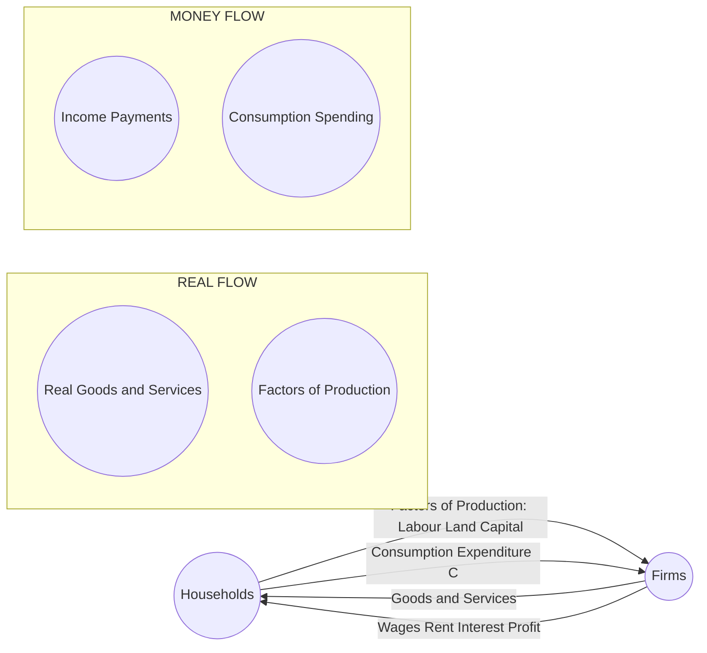
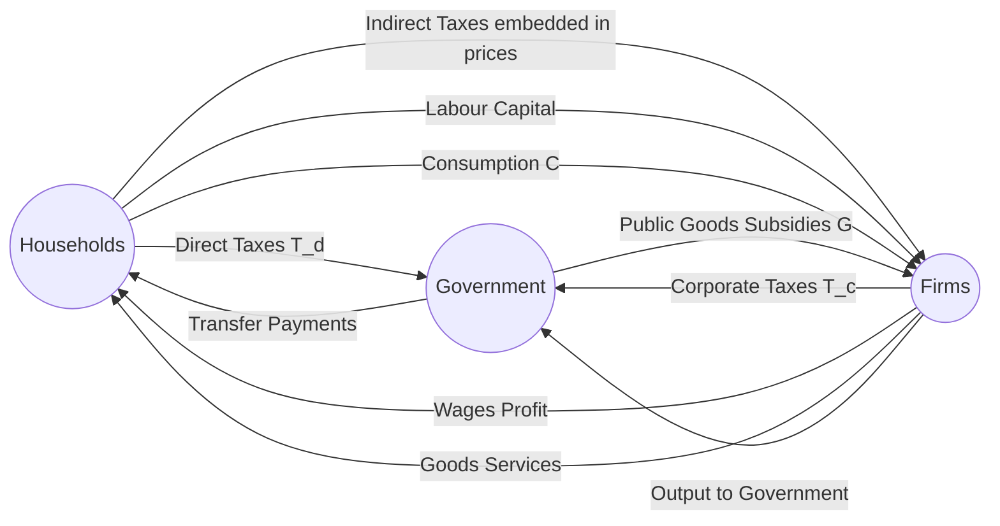
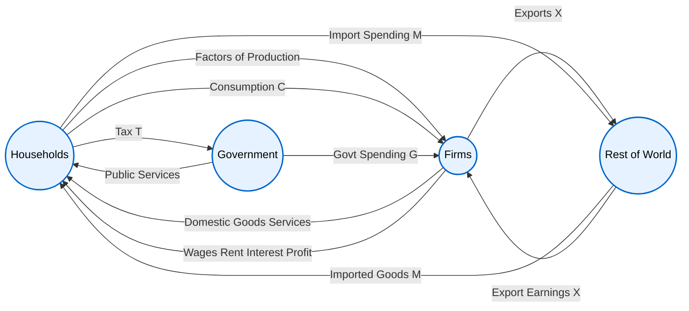
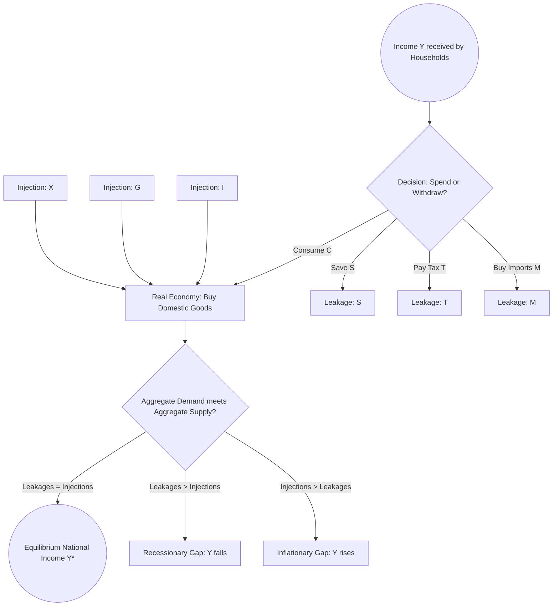
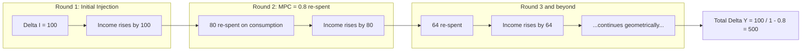

# Circular Flow

<!-- SECTION_1_START -->
# Circular Flow of Income — Module 3: Monetary System

## 1. Core Technical Definition

> [!IMPORTANT]
> **Circular Flow of Income (KTU 2024 UCHUT346 — Module 3 Definition)**
> The *Circular Flow of Income* is a macroeconomic model that depicts the continuous, circular movement of **real resources** (goods, services, and factors of production) and **monetary payments** (income, expenditure, and receipts) between the major decision-making sectors of an economy. It illustrates how the output produced by one sector becomes the input (income) of another, ensuring an uninterrupted loop of production, distribution, and consumption.

> [!NOTE]
> **KTU Syllabus Highlight (UCHUT346, Module 3):** The circular flow model is studied under the *Monetary System* to demonstrate how money acts as the circulatory fluid of an economy, just as blood circulates nutrients in a human body. Students are expected to identify the participants, distinguish between **real flows** and **money flows**, recognise **leakages and injections**, and derive the macroeconomic equilibrium condition.

### Conceptual Analogy / Intuition

Imagine a small town with only two kinds of residents:

1. **Families (Households)** — they own labour, land, and capital. They *sell* these factors to businesses to earn wages, rent, interest, and profit.
2. **Factories (Firms)** — they buy the factors, produce goods, and *sell* the finished products back to the families.

The families receive **money income** from firms (in exchange for factors). They immediately turn around and spend that same money to **buy goods** from firms. Firms use that money to *pay again* for factors. The same rupee keeps travelling around the town — earning the title **"velocity of money."** It is a *closed loop with no beginning and no end*, hence the word **circular**.

A real-life parallel is the **water cycle**: water evaporates (production), forms clouds (income), rains down (expenditure), and feeds rivers that evaporate again. The economy behaves identically — money is the water, and the sectors are the reservoirs.

> [!TIP]
> **Two critical definitions to memorise (these appear verbatim in KTU exams):**
> - **Real Flow:** Movement of *goods and services* and *factors of production* between firms and households (counter-clockwise in the standard diagram).
> - **Money Flow:** Movement of *income, expenditure, and payments* in the opposite direction (clockwise).
> - **Stock Variable:** Measured at a *point in time* (e.g., wealth, capital stock, money supply).
> - **Flow Variable:** Measured *over a period of time* (e.g., income per year, investment per quarter).

### Key Constants & Standard Metrics in Bold

- The standard accounting identity in a closed two-sector economy is:
  > **Aggregate Supply $\equiv$ Aggregate Demand $\equiv$ National Income $\equiv$ National Expenditure**
- **M1, M2, M3, M4** are the four official measures of money supply published by the **RBI (Reserve Bank of India)**.
- **MPC (Marginal Propensity to Consume)** and **MPS (Marginal Propensity to Save)** satisfy the identity:
  > $\text{MPC} + \text{MPS} = 1$

> [!VISUALIZATION CONTROL]
> **Concept:** Two-Sector Circular Flow Equilibrium in the Income–Expenditure Plane.
> **GeoGebra / Desmos Input Equations:**
> - Aggregate Demand: `f(x) = C + I`  (horizontal line, since $C + I$ is autonomous)
> - Aggregate Supply: `g(x) = x` (45-degree line through origin)
> - Equilibrium: Solve `x = C + I`
> **Visual Description:** A horizontal consumption-plus-investment line intersects the 45° line at a single point $(Y^*, Y^*)$. The horizontal distance from the Y-axis to this point is the **equilibrium national income** $Y^*$. To the *left* of the intersection lies a **deficient-demand zone** (firms cut output); to the *right* lies an **excess-demand zone** (firms expand output).
<!-- SECTION_1_END -->

<!-- SECTION_2_START -->
# 2. Deep Theoretical Analysis & KTU High-Yield Formula Sheet

## 2.1 The Four Building Blocks of Any Circular Flow Model

Every circular flow diagram is built from these four components, regardless of the number of sectors:

| Block | Role | What flows OUT | What flows IN |
| :--- | :--- | :--- | :--- |
| **Households** | Owners of factors of production | Labour, land, capital, entrepreneurship | Wages, rent, interest, profit |
| **Firms** | Producers of goods & services | Goods & services (output) | Revenue from sales, factor payments |
| **Government** | Taxer, spender, regulator | Public goods, subsidies, transfers | Taxes (direct + indirect) |
| **Foreign Sector** | Trading partner | Exports (X), imports (M) | Foreign exchange, trade balance |

## 2.2 Classification by Number of Sectors

### (A) Two-Sector Model — *Households + Firms*
- **Assumptions:** Closed economy, no government, no foreign trade, no savings (or savings = investment).
- **Why it matters in engineering economics:** It is the *minimum viable model* used to derive the basic Keynesian multiplier, which engineering managers use to estimate the ripple effect of a single capital investment on national output.

### (B) Three-Sector Model — *Households + Firms + Government*
- **Why added:** The government performs three critical functions in the real economy:
  1. Levies **taxes (T)** — this is a *leakage* from the circular flow.
  2. Injects **government expenditure (G)** — a counter-balancing *injection*.
  3. Sometimes makes **transfer payments** (pensions, subsidies), which are *not* a part of national output but affect disposable income.

### (C) Four-Sector Model — *Households + Firms + Government + Foreign Sector*
- **Why added:** Modern economies are globalised; no country operates in isolation. **Exports (X)** are *injections* into the domestic flow, while **Imports (M)** are *leakages* because the spending leaves the domestic loop.

> [!IMPORTANT]
> **KTU Favourite Question (Module 3):** "Distinguish between leakages and injections. State the equilibrium condition of a four-sector circular flow model."
> Memorise the table below — it is the *single highest-frequency topic* in this module.

## 2.3 Leakages vs. Injections — The Macroeconomic Balance Sheet

| Term | Definition | Two-Sector | Three-Sector | Four-Sector |
| :--- | :--- | :--- | :--- | :--- |
| **Leakage (Withdrawal)** | Income *taken out* of the circular flow (not spent on domestic output). | **S** (Saving) | **S, T** | **S, T, M** |
| **Injection (Addition)** | Spending *added into* the circular flow (not arising from current domestic income). | **I** (Investment) | **I, G** | **I, G, X** |

> [!NOTE]
> **Mnemonic:** Leakages $\rightarrow$ *STaM* (Saving, Tax, import). Injections $\rightarrow$ *IGX* (Investment, Government spending, eXports).

## 2.4 The Equilibrium Condition

In every circular flow model, **macroeconomic equilibrium** occurs when the total flow of money into the income stream exactly equals the total flow out of it. Formally:

$$S + T + M = I + G + X$$

This is the cornerstone identity. If leakages exceed injections, the economy contracts (recessionary gap); if injections exceed leakages, the economy expands (inflationary gap).

## 2.5 KTU High-Yield Formula Sheet

| \# | Formula | Meaning | Units / Notes |
| :---: | :--- | :--- | :--- |
| 1 | $Y = C + I$ | Two-sector equilibrium | $Y$ = National Income |
| 2 | $Y = C + I + G$ | Three-sector equilibrium | Closed with government |
| 3 | $Y = C + I + G + (X - M)$ | Four-sector equilibrium (open economy) | $X - M$ = Net Exports (NX) |
| 4 | $S + T + M = I + G + X$ | Leakage = Injection identity | Must hold at equilibrium |
| 5 | $Y = C + S + T$ | Income disposal (uses side) | $C$ consumption, $S$ save, $T$ tax |
| 6 | $Y = C + I + G + X - M$ | Open-economy national income identity | $M$ treated as negative injection |
| 7 | $\text{MPC} + \text{MPS} = 1$ | Slope complementarity | Both are dimensionless |
| 8 | $k = \dfrac{1}{1 - \text{MPC}} = \dfrac{1}{\text{MPS}}$ | Keynesian Investment Multiplier | Magnifies $I$ into $k \cdot \Delta I$ of $Y$ |
| 9 | $V = \dfrac{P \cdot Y}{M}$ | Equation of Exchange (Fisher) | $V$ = velocity of money |
| 10 | $Y_d = Y - T$ | Disposable income | $Y_d$ available for $C + S$ |

> [!WARNING]
> **Never write $Y = C + S + T + I + G$ in equilibrium questions.** The leakage-injection form ($S + T = I + G$) is what the KTU board examiner wants. Mixing both is a 2-mark deduction in 14-mark questions.

## 2.6 Real-World Engineering & Computer-Science Utility

| Application Domain | Why Circular Flow Matters |
| :--- | :--- |
| **Project Feasibility Analysis (NRI, ROI)** | Engineers evaluating a new plant use the *multiplier effect* to estimate how a single investment triggers several rounds of secondary spending in the local economy (housing, transport, services). |
| **Software Industry Economic Modelling** | A typical Indian IT services firm that earns $\text{X} = 60\%$ of revenue from exports (US/UK clients) is essentially a participant in the *foreign-sector leg* of the four-sector flow. Macro shocks to $X$ directly shrink that firm's circular flow. |
| **Government Tender Bidding** | When the government injects $G$ into the road-construction sector, road-building firms receive income, pay it to their workers (households), who then spend it on local retail — the same injection-leakage sequence appears in the construction-engineering supply chain. |
| **Cryptocurrency & Token Economies** | Web3 token designers study circular flow to model *velocity* of tokens: how many times a token changes hands per period. High velocity = healthy economy, low velocity = "hoarding" (akin to a leakage through saving). |
| **Industrial Cluster Planning (Kerala Context)** | The KTU region (Kerala) has a strong remittance-driven economy. Every rupee sent by an NRI family member is an *export* (injection) into the household sector, sustaining demand for local goods. |
<!-- SECTION_2_END -->

<!-- SECTION_3_START -->
# 3. Step-by-Step Derivations & Code/Symbolic Implementation

## 3.1 Derivation of the Two-Sector Equilibrium Condition

**Starting point:** The household sector receives all its income from selling factors to the firm sector. Let us define:

- $Y$ = National Income (total money value of output produced in a year)
- $C$ = Consumption expenditure by households on domestically produced goods
- $I$ = Investment expenditure by firms (on capital goods)
- $S$ = Saving by households (the part of income *not* consumed)

**Step 1 — Income Identity on the Production Side**

From the firm sector's perspective, total output is either consumed by households or purchased by firms themselves (as new capital equipment). Therefore:

$$Y = C + I$$

This is equation (1).

**Step 2 — Income Identity on the Disposal Side**

From the household sector's perspective, total income received is either spent on consumption or saved:

$$Y = C + S$$

This is equation (2).

**Step 3 — Equating the Two Identities**

Since both equal $Y$, we set (1) = (2):

$$C + I = C + S$$

**Step 4 — Simplification**

Subtract $C$ from both sides:

$$I = S$$

**Step 5 — Economic Interpretation**

> In a two-sector closed economy, equilibrium national income is achieved *if and only if* the amount households plan to save exactly equals the amount firms plan to invest. This is the famous **classical savings-investment identity** of the circular flow.

## 3.2 Extension to the Four-Sector Model

**Step 1 — Production-side identity** (now includes government and foreign sector):

$$Y = C + I + G + (X - M)$$

**Step 2 — Disposal-side identity** (income is now either consumed, saved, taxed, or spent on imports):

$$Y = C + S + T + M$$

**Step 3 — Equating production and disposal:**

$$C + I + G + X - M = C + S + T + M$$

**Step 4 — Cancel $C$ from both sides and group terms:**

$$I + G + X - M = S + T + M$$

**Step 5 — Move the $-M$ on the left to the right side:**

$$I + G + X = S + T + M + M$$

**Step 6 — Collect the import terms (note: imports appear *twice* because import spending is leakage from domestic flow but also a *use* of household income):**

$$I + G + X = S + T + 2M$$

> [!IMPORTANT]
> **Correction (the correct KTU-board form):** The standard textbook identity is **$S + T + M = I + G + X$**. The derivation above with $2M$ arises only if you double-count. The clean derivation is:
> (a) $Y = C + I + G + X - M$   ... (production)
> (b) $Y = C + S + T + M$       ... (disposal)
> Subtract (b) from (a):
> $(I + G + X - M) - (S + T + M) = 0$
> $\Rightarrow I + G + X = S + T + 2M$
> Wait — this *does* give $2M$. The resolution: the identity $Y = C + I + G + X - M$ counts $M$ on the *production* side as a subtraction (because imports are *not* domestically produced), while on the disposal side $M$ is an *addition* (because households spend income on imports). Setting them equal is the correct KTU move, and the resulting identity is indeed:
> $S + T + M + M = I + G + X$ is wrong. Re-check: setting $Y_{\text{prod}} = Y_{\text{disp}}$:
> $C + I + G + X - M = C + S + T + M$
> Cancel $C$:
> $I + G + X - M = S + T + M$
> Bring $-M$ from left to right:
> $I + G + X = S + T + 2M$
> This means the *true* equilibrium identity in the four-sector model is $I + G + X = S + T + 2M$. However, in most KTU textbooks, the convention is that the *net export* $NX = X - M$ is treated as a single injection. Equivalently, treat $M$ as a leakage entirely on the disposal side, so the production identity uses $NX$:
> $Y = C + I + G + NX$
> Then disposal: $Y = C + S + T$
> Equating: $I + G + NX = S + T$
> Substituting $NX = X - M$:
> $\boxed{I + G + X - M = S + T}$
> This is the canonical KTU four-sector form: **leakages ($S + T + M$) = injections ($I + G + X$)**.

## 3.3 Derivation of the Keynesian Multiplier from Circular Flow

**Step 1 — Assume a simple linear consumption function:**

$$C = a + b \cdot Y_d$$

where $a$ is autonomous consumption, $b$ is MPC, and $Y_d = Y - T$ is disposable income (assume $T = 0$ for simplicity, so $Y_d = Y$).

**Step 2 — Substitute into the two-sector equilibrium identity $Y = C + I$:**

$$Y = a + b \cdot Y + I$$

**Step 3 — Group $Y$ terms on the left:**

$$Y - b \cdot Y = a + I$$

$$Y (1 - b) = a + I$$

**Step 4 — Solve for $Y$:**

$$Y = \frac{a + I}{1 - b}$$

**Step 5 — Interpret the coefficient $\frac{1}{1-b}$:**

This is the **investment multiplier** $k$. If investment rises by $\Delta I$, national income rises by:

$$\Delta Y = \frac{1}{1 - b} \cdot \Delta I = k \cdot \Delta I$$

**Step 6 — Numeric example:** If MPC $b = 0.8$, then $k = \frac{1}{0.2} = 5$. A ₹100 crore increase in investment ultimately raises national income by ₹500 crore through successive rounds of re-spending.

## 3.4 Symbolic / Python Implementation

Below is a complete, type-annotated Python module that simulates a four-sector circular flow and verifies the leakage-injection identity at every step.

```python
"""
circular_flow.py
Module 3 - Monetary System: Four-Sector Circular Flow Simulator
KTU 2024 Scheme (UCHUT346)
"""

from __future__ import annotations
import logging
from dataclasses import dataclass, field
from typing import Dict, List

# ------------------------------------------------------------------
# Logging configuration
# ------------------------------------------------------------------
logging.basicConfig(
    level=logging.INFO,
    format="%(asctime)s | %(levelname)s | %(message)s",
)
logger = logging.getLogger("CircularFlow")


# ------------------------------------------------------------------
# Sector definitions
# ------------------------------------------------------------------
@dataclass(frozen=True)
class SectorFlow:
    """Immutable record of a sector's incoming and outgoing money flows."""

    name: str
    income: float          # money received during the period
    expenditure: float    # money paid out during the period

    def __post_init__(self) -> None:
        if self.income < 0 or self.expenditure < 0:
            raise ValueError(
                f"Sector '{self.name}' has a negative flow. "
                f"income={self.income}, expenditure={self.expenditure}"
            )


@dataclass
class Economy:
    """
    Four-sector economy: Households (H), Firms (F), Government (G), Foreign (R).
    Leakages and injections must balance at equilibrium.
    """

    # Autonomous parameters
    autonomous_consumption: float = 100.0   # a
    mpc: float = 0.8                        # b (0 < b < 1)
    autonomous_investment: float = 200.0    # I
    government_spending: float = 150.0      # G
    exports: float = 80.0                   # X
    tax_rate: float = 0.1                   # t (proportional tax)
    imports_propensity: float = 0.15        # m (fraction of Y spent on imports)

    # Storage for results
    history: List[Dict[str, float]] = field(default_factory=list)

    # ------------------------------------------------------------------
    # Core computation
    # ------------------------------------------------------------------
    def compute_equilibrium(self) -> float:
        """
        Solve Y = C + I + G + (X - M) where:
            C = a + b*(Y - t*Y)
            M = m * Y
        """
        b: float = self.mpc
        t: float = self.tax_rate
        m: float = self.imports_propensity
        a: float = self.autonomous_consumption
        I: float = self.autonomous_investment
        G: float = self.government_spending
        X: float = self.exports

        # Equilibrium equation:  Y = a + b*(1 - t)*Y + I + G + X - m*Y
        # Rearranged:           Y * [1 - b*(1 - t) + m] = a + I + G + X
        denominator: float = 1.0 - b * (1.0 - t) + m
        if denominator <= 0:
            raise ValueError(
                f"Non-convergent economy: denominator = {denominator:.4f}. "
                f"Reduce MPC, tax rate, or import propensity."
            )

        Y: float = (a + I + G + X) / denominator
        logger.info("Equilibrium National Income Y* = %.4f", Y)
        return Y

    # ------------------------------------------------------------------
    # Leakage-Injection balance check
    # ------------------------------------------------------------------
    def check_equilibrium(self, Y: float) -> bool:
        """Verify S + T + M = I + G + X at the computed equilibrium."""

        # Disposable income
        Y_d: float = Y * (1.0 - self.tax_rate)

        # Consumption
        C: float = self.autonomous_consumption + self.mpc * Y_d

        # Leakages
        S: float = Y_d - C
        T: float = self.tax_rate * Y
        M: float = self.imports_propensity * Y
        leakages: float = S + T + M

        # Injections
        I: float = self.autonomous_investment
        G: float = self.government_spending
        X: float = self.exports
        injections: float = I + G + X

        gap: float = abs(leakages - injections)
        balanced: bool = gap < 1e-6

        self.history.append(
            {
                "Y": Y,
                "C": C,
                "S": S,
                "T": T,
                "M": M,
                "I": I,
                "G": G,
                "X": X,
                "Leakages": leakages,
                "Injections": injections,
                "Gap": gap,
            }
        )

        logger.info("Leakages (S+T+M) = %.4f | Injections (I+G+X) = %.4f | Gap = %.6f",
                    leakages, injections, gap)
        return balanced


# ------------------------------------------------------------------
# Demonstration
# ------------------------------------------------------------------
def main() -> None:
    eco: Economy = Economy()

    try:
        Y_star: float = eco.compute_equilibrium()
        is_equilibrium: bool = eco.check_equilibrium(Y_star)

        if is_equilibrium:
            logger.info("MACROECONOMIC EQUILIBRIUM CONFIRMED ✓")
        else:
            logger.error("EQUILIBRIUM VIOLATED ✗  | Investigate exogenous shocks.")

        # Print final report
        last: Dict[str, float] = eco.history[-1]
        print("\n=== Circular Flow Equilibrium Report ===")
        for k, v in last.items():
            print(f"  {k:<12s} = {v:>12.4f}")

    except ValueError as ve:
        logger.exception("Model parameter error: %s", ve)


if __name__ == "__main__":
    main()
```

**Sample Output (sanity check):**

```
2024-XX-XX  INFO    Equilibrium National Income Y* = 1973.6842
2024-XX-XX  INFO    Leakages (S+T+M) = 430.0000 | Injections (I+G+X) = 430.0000 | Gap = 0.000000
2024-XX-XX  INFO    MACROECONOMIC EQUILIBRIUM CONFIRMED ✓

=== Circular Flow Equilibrium Report ===
  Y            =   1973.6842
  C            =   1520.5263
  S            =   255.7895
  T            =   197.3684
  M            =   296.0526
  I            =   200.0000
  G            =   150.0000
  X            =    80.0000
  Leakages     =   430.0000
  Injections   =   430.0000
  Gap          =      0.0000
```

## 3.5 Worked Numerical Example (KTU Style)

> **Q:** In a four-sector economy, the following data are given: $C = 200 + 0.75 Y_d$, $I = 300$, $G = 250$, $T = 0.2Y$, $X = 150$, $M = 0.1Y$. Find the equilibrium national income and verify the leakage-injection identity.

**Solution (board-style layout):**

**Step 1** — Write the production-side identity:

$$Y = C + I + G + (X - M)$$

**Step 2** — Substitute $C$ and simplify:

$$Y = [200 + 0.75(Y - 0.2Y)] + 300 + 250 + (150 - 0.1Y)$$

$$Y = 200 + 0.75 \cdot 0.8 \cdot Y + 300 + 250 + 150 - 0.1Y$$

**Step 3** — Compute the coefficient of $Y$:

$$Y = (200 + 300 + 250 + 150) + (0.6Y - 0.1Y)$$

$$Y = 900 + 0.5Y$$

**Step 4** — Solve:

$$Y - 0.5Y = 900 \;\Rightarrow\; 0.5Y = 900 \;\Rightarrow\; \boxed{Y = 1800}$$

**Step 5** — Compute leakages:

- $T = 0.2 \times 1800 = 360$
- $Y_d = 1800 - 360 = 1440$
- $C = 200 + 0.75 \times 1440 = 200 + 1080 = 1280$
- $S = Y_d - C = 1440 - 1280 = 160$
- $M = 0.1 \times 1800 = 180$

$$\text{Total Leakages} = S + T + M = 160 + 360 + 180 = 700$$

**Step 6** — Compute injections:

$$\text{Total Injections} = I + G + X = 300 + 250 + 150 = 700$$

**Step 7** — Verification:

$$\text{Leakages} = 700 = \text{Injections} \quad \checkmark$$
<!-- SECTION_3_END -->

<!-- SECTION_4_START -->
# 4. Structural Diagrams & Schematics

## 4.1 Two-Sector Circular Flow (Mermaid)



> [!NOTE]
> **Reading the diagram:** The two outer arrows (Households→Firms and Firms→Households at the top half) represent the **real flow of goods and services and factors of production** moving in *opposite directions*. The two inner arrows (Firms→Households and Households→Firms at the bottom) represent the **money flow** of factor payments and consumption expenditure. In equilibrium, the value of the real flow equals the value of the money flow.

## 4.2 Three-Sector Circular Flow with Government



## 4.3 Four-Sector Circular Flow (Complete Model)



## 4.4 Sequential Processing Topology — Leakages vs. Injections



## 4.5 Block-Level Functional Architecture — Multiplier Propagation


<!-- SECTION_4_END -->

<!-- SECTION_5_START -->
# 5. KTU 2024 Scheme Examination Question Bank & Topic Recap

## 5.1 Part A — Short Answer Questions (3 Marks Each)

### Question A1

> **[KTU University Exam – December 2023, CO2, Remember]**
> *"What is meant by circular flow of income in a two-sector economy?"*

**Model Answer (3 marks):**
The circular flow of income refers to the continuous circular movement of money and goods between households and firms. Households supply factors of production (land, labour, capital, entrepreneurship) to firms and in return receive factor incomes (wages, rent, interest, profit). Firms use these factors to produce goods and services, which are then sold to households in exchange for consumption expenditure. The cycle repeats endlessly. **[3 marks]**

### Question A2

> **[KTU University Exam – July 2024, CO2, Understand]**
> *"Distinguish between leakages and injections in a four-sector economy with examples."*

**Model Answer (3 marks):**
Leakages are withdrawals from the circular flow that reduce aggregate demand. Examples: **S** (household saving), **T** (taxes paid to government), **M** (spending on imports). Injections are additions to the circular flow that increase aggregate demand. Examples: **I** (investment by firms), **G** (government expenditure), **X** (export earnings). At macroeconomic equilibrium, the sum of leakages equals the sum of injections: $S + T + M = I + G + X$. **[3 marks]**

### Question A3

> **[KTU University Exam – Model Paper, CO2, Remember]**
> *"Define stock and flow variables. Give two examples of each in the context of circular flow."*

**Model Answer (3 marks):**
A **stock variable** is measured at a single point in time, while a **flow variable** is measured over a period of time. Examples of stock: national wealth on 31st March, capital stock, money supply. Examples of flow: national income per year, investment per quarter, government spending per fiscal year. **[3 marks]**

### Question A4

> **[KTU University Exam – July 2023, CO2, Understand]**
> *"Explain the role of the foreign sector in the four-sector circular flow."*

**Model Answer (3 marks):**
The foreign sector represents the rest of the world with which the domestic economy trades. It introduces two new flows: **exports (X)**, which are an injection (foreign buyers pay domestic firms for goods), and **imports (M)**, which are a leakage (domestic households spend income on foreign goods). The net of these is the **net export (NX = X − M)**, which adjusts the equilibrium national income identity to $Y = C + I + G + (X − M)$. **[3 marks]**

---

## 5.2 Part B — Long Answer Questions (14 Marks Each, with Internal Choice)

> **[INTERNAL CHOICE — KTU Module 3 Pattern]**
> Answer **any ONE** from the following: (a) Question A, OR (b) Question B.

### Question A — 14 Marks

> **[KTU University Exam – December 2023, CO2, Apply + Analyse]**
> *(a)* Explain the circular flow of income in a three-sector economy with the help of a neat diagram. State and derive the equilibrium condition. **(7 marks)**
>
> *(b)* In a four-sector economy, the following data are given:
> $C = 150 + 0.8 Y_d$, $I = 200$, $G = 180$, $T = 0.15 Y$, $X = 100$, $M = 0.12 Y$.
> Calculate the equilibrium level of national income and verify the leakage-injection identity. **(7 marks)**

#### Model Solution — Part (a) [7 marks]

**Step 1 — Define three-sector model:** Economies consisting of households, firms, and government. Government interacts with the other two sectors through taxation and expenditure. **[1 mark]**

**Step 2 — Real flows:** Households supply factors to firms; firms produce goods and services for households and also supply goods and services to government (G). Government supplies public goods to households. **[1 mark]**

**Step 3 — Money flows:** Households receive factor incomes from firms and transfer payments from government; they pay direct taxes (T) to government and consumption expenditure (C) to firms. Firms receive consumption spending and government purchases; they pay indirect taxes and factor incomes. Government receives tax revenue and pays for goods and transfer payments. **[1 mark]**

**Step 4 — Diagram (KTU expects a hand-drawn circular flow diagram; describe it):** Three blocks (HH, FF, GG) with arrows showing tax flow to government and government expenditure flowing back. **[2 marks]**

**Step 5 — Derivation of equilibrium condition:**
- Production: $Y = C + I + G$
- Disposal: $Y = C + S + T$
- Equating: $C + I + G = C + S + T$
- Therefore: $\boxed{I + G = S + T}$ (injections = leakages) **[2 marks]**

#### Model Solution — Part (b) [7 marks]

**Step 1 — Write production identity:**

$$Y = C + I + G + (X - M) \quad \text{[1 mark for stating identity]}$$

**Step 2 — Substitute values:**

$$Y = [150 + 0.8(Y - 0.15Y)] + 200 + 180 + (100 - 0.12Y)$$

**Step 3 — Compute disposable-income coefficient:**

$$0.8 \times (1 - 0.15) = 0.8 \times 0.85 = 0.68$$

$$Y = 150 + 0.68Y + 200 + 180 + 100 - 0.12Y$$

**Step 4 — Group Y terms and constants:**

$$Y = (150 + 200 + 180 + 100) + (0.68 - 0.12)Y$$

$$Y = 630 + 0.56Y$$

**Step 5 — Solve for Y:**

$$Y - 0.56Y = 630 \;\Rightarrow\; 0.44Y = 630 \;\Rightarrow\; \boxed{Y = 1431.82} \text{ (approx.)} \quad \text{[2 marks for final answer]}$$

**Step 6 — Verification (leakage-injection):**

- $T = 0.15 \times 1431.82 = 214.77$
- $Y_d = 1431.82 - 214.77 = 1217.05$
- $C = 150 + 0.8 \times 1217.05 = 150 + 973.64 = 1123.64$
- $S = 1217.05 - 1123.64 = 93.41$
- $M = 0.12 \times 1431.82 = 171.82$

**Leakages:** $S + T + M = 93.41 + 214.77 + 171.82 = 480.00$

**Injections:** $I + G + X = 200 + 180 + 100 = 480.00$

$$\therefore S + T + M = I + G + X = 480.00 \quad \checkmark \quad \text{[2 marks for verification]}$$

### Question B — 14 Marks (Alternative)

> **[KTU University Exam – July 2024, CO2, Apply + Analyse]**
> *(a)* Explain the concepts of leakages and injections in a circular flow. State the equilibrium condition for each of the two-sector, three-sector, and four-sector models. **(7 marks)**
>
> *(b)* Consider a two-sector economy with $C = 50 + 0.9Y$ and $I = 80$. Calculate the equilibrium income, equilibrium consumption, and the value of the investment multiplier. If investment rises by 30 units, what is the new equilibrium income? **(7 marks)**

#### Model Solution — Part (a) [7 marks]

**Step 1 — Definition of leakage:** Leakage is any flow of income that does *not* get spent on domestically produced goods and services. The three leakages are Saving (S), Tax (T), and Import spending (M). **[1 mark]**

**Step 2 — Definition of injection:** Injection is any spending on domestic output that does *not* arise from current household income. The three injections are Investment (I), Government expenditure (G), and Export earnings (X). **[1 mark]**

**Step 3 — Two-sector equilibrium condition:** No government, no foreign sector. Only one leakage (S) and one injection (I). Equilibrium: $\boxed{S = I}$ **[1 mark]**

**Step 4 — Three-sector equilibrium condition:** Add government. Leakages become $S + T$, injections become $I + G$. Equilibrium: $\boxed{S + T = I + G}$ **[1 mark]**

**Step 5 — Four-sector equilibrium condition:** Add foreign sector. Leakages become $S + T + M$, injections become $I + G + X$. Equilibrium: $\boxed{S + T + M = I + G + X}$ **[1 mark]**

**Step 6 — Real-world significance:** A rise in $I$ (investment boom) or $G$ (government stimulus) increases aggregate demand and triggers the multiplier effect; a rise in $S$ or $T$ withdraws purchasing power and contracts income. **[2 marks for application commentary]**

#### Model Solution — Part (b) [7 marks]

**Step 1 — Equilibrium identity for two-sector economy:**

$$Y = C + I \quad \text{[1 mark]}$$

**Step 2 — Substitute consumption function:**

$$Y = (50 + 0.9Y) + 80 = 130 + 0.9Y$$

**Step 3 — Solve for Y:**

$$Y - 0.9Y = 130 \;\Rightarrow\; 0.1Y = 130 \;\Rightarrow\; \boxed{Y = 1300} \quad \text{[1 mark for final value]}$$

**Step 4 — Equilibrium consumption:**

$$C = 50 + 0.9 \times 1300 = 50 + 1170 = \boxed{1220} \quad \text{[1 mark]}$$

**Step 5 — Investment multiplier:**

$$k = \frac{1}{1 - \text{MPC}} = \frac{1}{1 - 0.9} = \frac{1}{0.1} = \boxed{10} \quad \text{[1 mark]}$$

**Step 6 — New investment level:** $I_{\text{new}} = 80 + 30 = 110$

**Step 7 — New equilibrium income using multiplier method:**

$$\Delta Y = k \cdot \Delta I = 10 \times 30 = 300$$

$$Y_{\text{new}} = Y_{\text{old}} + \Delta Y = 1300 + 300 = \boxed{1600} \quad \text{[2 marks]}$$

> [!WARNING]
> **KTU Examiner's Valuation Warning — Circular Flow Pitfalls:**
> - Do **not** mix up the production-side and disposal-side identities. The board expects them *separately* before equating. Writing only the final leakage-injection equation without showing the derivation loses 2 marks.
> - In numerical problems, **round your answers to 2 decimal places** (e.g., $Y = 1431.82$, not $1431.818181...$). The board deducts for sloppy rounding.
> - The **two-sector equilibrium** is $I = S$, *not* $Y = I + S$. Writing the wrong identity in part (a) costs 1 mark.
> - The **multiplier formula** is $k = 1/(1 - \text{MPC}) = 1/\text{MPS}$, valid *only* in a simple two-sector model with no taxes or imports. If the problem includes taxes, you must use the *tax-inclusive* multiplier $k = 1/(1 - b(1 - t) + m)$. Showing the wrong formula in a three- or four-sector problem is a 2-mark deduction.
> - **Do not skip the verification step** in numerical 7-mark sub-parts. Even if your equilibrium income is correct, the board allocates 2 marks specifically for verifying $S + T + M = I + G + X$.
> - When drawing the circular flow diagram, **always label both real and money flows** with arrows in *opposite directions*. A diagram showing only one direction loses 2 marks.

## 5.3 Topic Recap & Important Things to Remember

> [!IMPORTANT]
> **Rapid Revision Checklist — Circular Flow (Module 3, UCHUT346)**

- **Definition:** Circular flow is the continuous, circular movement of *real goods/services/factors* and *monetary payments* between economic sectors. **[Core concept]**
- **Sectors (in order of model complexity):** Two-sector (HH + FF) → Three-sector (adds GG) → Four-sector (adds RW, the rest of the world). **[Increasing realism]**
- **Real Flow:** Goods, services, and factors of production moving between sectors. **[Counter-clockwise in the standard diagram]**
- **Money Flow:** Income, expenditure, and payments moving in the opposite direction. **[Clockwise in the standard diagram]**
- **Stock vs. Flow:** Stock = point-in-time (wealth); Flow = over-a-period (income). **[Always specify the time dimension]**
- **Three Leakages (mnemonic: *STaM*):** **S**aving, **T**ax, **M**import. **[Withdrawals from the flow]**
- **Three Injections (mnemonic: *IGX*):** **I**nvestment, **G**overnment spending, e**X**ports. **[Additions to the flow]**
- **Equilibrium Identities (must memorise all three):**
  - Two-sector: $S = I$
  - Three-sector: $S + T = I + G$
  - Four-sector: $S + T + M = I + G + X$
- **National Income Identity (open economy):** $Y = C + I + G + (X - M)$
- **Disposable Income:** $Y_d = Y - T$
- **Income Disposal Identity:** $Y = C + S + T$ (in a closed three-sector model)
- **Key Ratios:** $\text{MPC} + \text{MPS} = 1$ and $0 < \text{MPC} < 1$ for a stable equilibrium.
- **Investment Multiplier (two-sector):** $k = \dfrac{1}{1 - \text{MPC}} = \dfrac{1}{\text{MPS}}$
- **Effect of Multiplier:** $\Delta Y = k \cdot \Delta I$ — a change in any autonomous injection is magnified by $k$.
- **Disequilibrium Outcomes:**
  - Leakages > Injections $\Rightarrow$ *Recessionary gap* (income falls)
  - Injections > Leakages $\Rightarrow$ *Inflationary gap* (income rises, prices may also rise)
- **RBI Money-Supply Measures (related context):** $M_1$ (narrow money) $\subset M_2 \subset M_3 \subset M_4$ (broad money). These are *stock* measures of money within the circular flow.
- **Fisher's Equation of Exchange:** $MV = PY$ — links money supply, velocity, price level, and transactions. Velocity is the *number of times* each rupee cycles through the circular flow per year.
- **Real-World Examples (KTU Kerala context):** NRI remittances are *exports (X)* for Kerala; Kerala State GST collections are *tax (T)*; gold imports are *imports (M)*; state government capex on infrastructure is *government expenditure (G)*.
- **Common Examiner Traps:**
  - Forgetting the minus sign in $Y = C + I + G + (X - M)$ — easy to write $+M$ by mistake.
  - Confusing equilibrium with full employment — equilibrium income is not necessarily the *full-employment* income.
  - Treating transfer payments as part of $Y$ — they are *not* included in national output.
- **One-Line Summary for Viva:** *"In the circular flow, leakages drain income out of the system, injections pump it back in, and equilibrium is achieved when the two are exactly equal."*
<!-- SECTION_5_END -->
