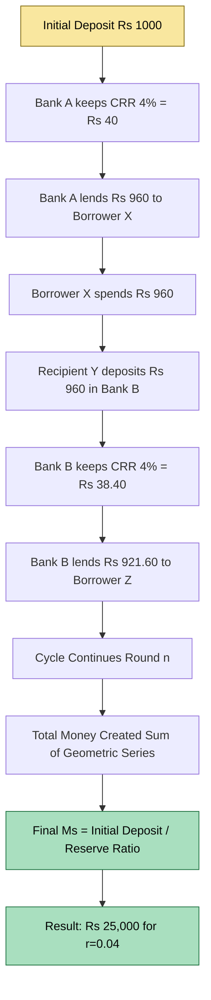
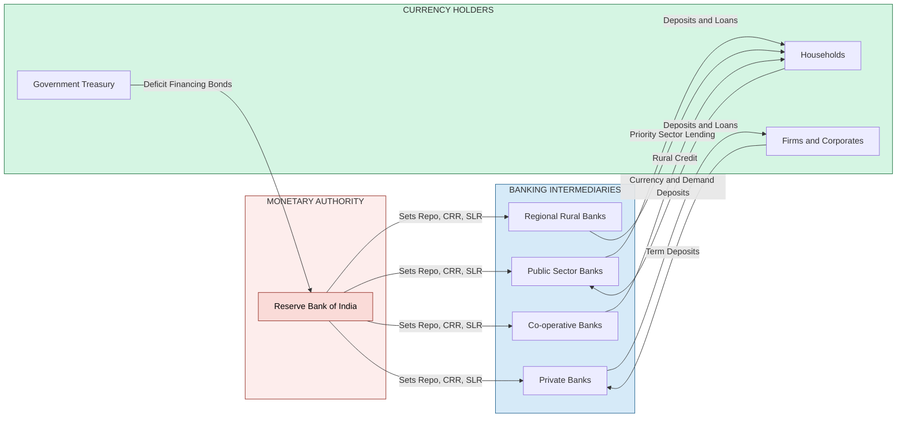
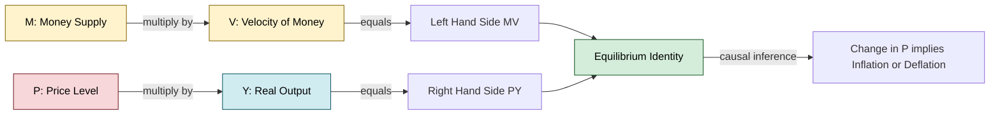

# Concepts

<!-- SECTION_1_START -->

# MODULE 3 — MONETARY SYSTEM: CONCEPTS

## 1.1 Formal Definition of Money

> [!NOTE]
> **Money** is any commodity or token that is generally accepted as a medium of exchange and serves as a measure of value, a store of value, and a standard of deferred payment in an economy. In modern economic theory (KTU 2024 syllabus terminology), money is defined as *"anything that performs the four basic functions of money and is socially recognised by the members of a monetary system as a unit of account and a means of settlement of debt."*

In the KTU 2024 Scheme (Course Code: UCHUT346 — *Economics for Engineers*), the term **Monetary System** refers to the institutional and legal framework established by the **Central Bank (Reserve Bank of India in the Indian context)** that governs the **issue, supply, circulation, and value** of money within a national economy. The system includes the **monetary base, money multiplier, reserve requirements, and instruments of monetary control.**

---

## 1.2 Conceptual Analogy — "The Universal Translator"

Imagine an ancient barter village where a farmer has rice but needs a bicycle. He must first locate a bicycle owner who happens to want rice — a **double coincidence of wants**. This search is costly and inefficient.

Now introduce **Money** as a *universal translator* in the marketplace. The farmer sells his rice *to anyone* for money, then uses that money to buy a bicycle *from anyone*. The transaction cost drops to almost zero.

> [!IMPORTANT]
> **KTU Board Definition to Memorise:**
> *"Money is a commonly accepted medium of exchange that eliminates the inefficiencies of barter by acting as an intermediary instrument of value."*

---

## 1.3 The Four Canonical Functions of Money

| # | Function | Engineering-Economic Meaning |
|---|----------|------------------------------|
| 1 | **Medium of Exchange** | Eliminates the double coincidence of wants; lubricates transactions |
| 2 | **Measure of Value / Unit of Account** | Provides a common numeraire to price heterogeneous goods (e.g., ₹, \$, €) |
| 3 | **Store of Value** | Allows purchasing power to be carried from the present to the future |
| 4 | **Standard of Deferred Payment** | Enables contracts, loans, bonds, and EMIs to be denominated in stable units |

> [!IMPORTANT]
> **Liquidity** is the ease with which an asset can be converted into money *without loss of value*. Cash is the most liquid asset; real estate is among the least liquid.

---

## 1.4 Evolution & Types of Money

| Era | Type | Salient Feature | Example |
|-----|------|-----------------|---------|
| Pre-3000 BC | **Commodity Money** | Intrinsic value equal to face value | Gold coins, salt, cattle |
| 7th Century BC | **Metallic Money** | Standardised weight and purity | Gold & silver coins (minted) |
| 17th Century AD | **Paper Money (Representative)** | Backed 100% by gold/silver reserves | Banknotes convertible to gold |
| 20th Century | **Fiat Money** | Backed only by government decree / *legal tender* status | Modern ₹, \$, € notes |
| 21st Century | **Digital / Crypto Money** | Exists only as encrypted ledger entries | CBDC (e-Rupee), Bitcoin |

> [!VISUALIZATION CONTROL]
> **Concept:** Velocity of money vs. Money Supply (Circular Flow)
> **Mathematical Representation:**
> $$ M \times V = P \times Y $$
> where $M$ is money supply, $V$ is velocity, $P$ is price level, $Y$ is real output.
> **Visual Description:** Picture a circular loop where money flows from households to firms (as consumption expenditure) and back as factor income — the rate at which each rupee completes this loop is $V$.

---

<!-- SECTION_1_END -->

<!-- SECTION_2_START -->

# 2. DEEP THEORETICAL ANALYSIS — MONETARY SYSTEM CONCEPTS

## 2.1 The Monetary System — An Operational Breakdown

The monetary system of any modern nation rests on three structural pillars:

1. **The Central Bank (Monetary Authority)**
   - In India → **Reserve Bank of India (RBI)** established under the *RBI Act, 1934*.
   - Holds the **monopoly of note issue** (except ₹1 coin/notes).
   - Acts as the *lender of last resort* and *banker to the government*.

2. **The Banking System (Commercial + Co-operative + RRBs)**
   - Accepts **deposits** and creates credit through the **fractional reserve mechanism**.
   - Multiplies the monetary base via the **money multiplier**.

3. **The Public (Currency Holders)**
   - Holds money in the form of **C** (Currency with public) and **D** (Demand Deposits).
   - Their holding preferences determine the **currency-deposit ratio (c)**.

> [!NOTE]
> **Money Supply (Ms)** in India is empirically measured through four statistical aggregates: **M1, M2, M3, and M4** — defined by the RBI under the *Reserve Bank of India Act*.

---

## 2.2 Measures of Money Supply (RBI Framework)

Let:
- $C$ = Currency held by the public
- $D$ = Net demand deposits of commercial banks
- $T$ = Time deposits (fixed, savings, etc.)
- $O$ = Other deposits with the RBI

| Aggregate | Definition | Components | Liquidity Rank |
|-----------|------------|------------|----------------|
| $M_1$ | Narrow Money (Transaction Money) | $C + D + O$ | Highest |
| $M_2$ | $M_1$ + Savings deposits of post offices | $M_1 + S_{post}$ | High |
| $M_3$ | Broad Money (Most-watched indicator) | $M_1 + T$ | Medium |
| $M_4$ | Broadest Money | $M_3 + \text{All post office deposits}$ | Lowest |

> [!IMPORTANT]
> In KTU Board examinations, the question *"Distinguish between M1 and M3"* is a **direct 3-mark question**. Memorise the inclusion of $T$ in $M_3$ but not in $M_1$.

---

## 2.3 The Money Multiplier (Process of Credit Creation)

When a commercial bank receives a deposit, it is *required* to keep a fraction (**CRR — Cash Reserve Ratio**) with the RBI and *permitted* to keep an additional fraction (**SLR — Statutory Liquidity Ratio**). The remainder is lent out, which comes back as a fresh deposit, and the cycle repeats.

**Formally:**

Let:
- $r$ = Reserve Ratio (fraction of deposits kept as reserves)
- $m$ = Money Multiplier

$$ m = \frac{1}{r} $$

If the **initial deposit** is $\Delta D_0$, the **total money created** is:

$$ \Delta M_s = \Delta D_0 \times \frac{1}{r} $$

> [!NOTE]
> **Higher-order expansion formula:** $M_s = \Delta D_0 \left[ 1 + (1-r) + (1-r)^2 + (1-r)^3 + \ldots \right] = \frac{\Delta D_0}{r}$

---

## 2.4 KTU Formula Sheet — Monetary System

| # | Concept | Formula | Units / Notes |
|---|---------|---------|---------------|
| 1 | **Fisher's Equation of Exchange** | $M \cdot V = P \cdot Y$ | $M$ = money supply, $V$ = velocity, $P$ = price level, $Y$ = real GDP |
| 2 | **Quantity Theory of Money** | $M \cdot V = P \cdot T$ | $T$ = total transactions ($T \approx Y$ in classical form) |
| 3 | **Money Multiplier (simple)** | $m = 1 / r$ | $r$ = legal reserve ratio |
| 4 | **Money Multiplier (currency-deposit adjusted)** | $m = (1 + c) / (c + r)$ | $c$ = currency-deposit ratio of public |
| 5 | **Inflation (Quantity Theory)** | $\%\Delta P = \%\Delta M + \%\Delta V - \%\Delta Y$ | Assuming $V$ and $Y$ held constant → $\%\Delta P = \%\Delta M$ |
| 6 | **Value of Money** | $V_m = 1 / P$ | Inverse of price index; $P$ measured by CPI / WPI |
| 7 | **Real Money Supply** | $M_s / P$ | Nominal money divided by price level |
| 8 | **High-Powered Money (Monetary Base)** | $MB = C + R$ | $C$ = currency with public, $R$ = bank reserves with RBI |

---

## 2.5 Real-World Engineering & Economic Utility

- **Treasury & Cash Management in Firms:** Engineers in finance/treasury roles design *cash-flow forecasting systems* based on $M \cdot V = P \cdot Y$ to optimise working capital.
- **Inflation Targeting:** Modern central banks (RBI, FED) use the quantity theory to set *repo rates* and *reverse repo rates* — instruments directly studied in *Financial Engineering* and *Managerial Economics*.
- **ERP & Pricing Software:** Inflation-adjusted pricing models use the real money supply formula $M_s / P$ to compute *deflators* in cost accounting.
- **Cryptocurrency Engineering:** Blockchain engineers designing CBDCs and stablecoins (e.g., RBI's *e₹-R*) build on the same principles of *medium of exchange* and *store of value* that the monetary system codifies.

---

<!-- SECTION_2_END -->

<!-- SECTION_3_START -->

# 3. STEP-BY-STEP DERIVATIONS & TABULAR ANALYSIS

## 3.1 Derivation of Fisher's Equation of Exchange

> [!IMPORTANT]
> This derivation is a **favourite 7-mark KTU question** under Module 3. Master each step below — valuation is done line-by-line.

### Step 1 — Define the Total Value of Transactions

Let there be $N$ transactions in an economy during a year. The *price* of transaction $i$ is $P_i$ and the *quantity transacted* is $T_i$.

$$ \text{Total Value of Transactions} = \sum_{i=1}^{N} P_i \cdot T_i $$

### Step 2 — Aggregate Notation

Define:
- $P$ = weighted average price level
- $T$ = aggregate quantity of all transactions in the year

$$ \sum P_i T_i = P \cdot T $$

### Step 3 — Define the Money Side

Let:
- $M$ = total money supply in circulation (average stock)
- $V$ = transactions velocity of money (number of times each unit of money is used per year)

Since each unit of money is spent $V$ times and there are $P \cdot T$ total transactions to be financed:

$$ M \cdot V = P \cdot T $$

### Step 4 — Cash Balances (Cambridge) Form

Fisher's equation is *"transactions-approach"*. The **Cambridge equation** is its *"cash-balances approach"*:

$$ M = k \cdot P \cdot Y $$

where $k = 1/V$ is the fraction of income held as money, and $Y$ is real national income.

### Step 5 — Real-World Calibration

If RBI reports $M_3 = \text{₹250 lakh crore}$, $V = 1.5$, and real GDP $Y = \text{₹180 lakh crore}$, then the implied price level is:

$$ P = \frac{M \cdot V}{Y} = \frac{250 \times 1.5}{180} = 2.083 $$

This is a *price index* relative to a base year ($P = 1$ in the base year), implying an **inflation of 108.3%** above the base — purely a stylised illustration.

> [!NOTE]
> Step-by-step board valuation key: '[Define variables: 2 marks], [Equate money spent with value of goods: 3 marks], [Final equation: 2 marks].'

---

## 3.2 Worked Numerical — Money Multiplier in India

> [!NOTE]
> **Problem (KTU 2024 Model):** Suppose the RBI mandates CRR = 4% and SLR = 18%. The public holds currency equal to 12% of demand deposits. An initial fresh deposit of ₹1,000 crore enters the banking system. Compute the total money created.

### Step 1 — Identify Parameters

- Reserve Ratio $r = $ CRR = $0.04$
- Currency-Deposit Ratio $c = 0.12$

> [!IMPORTANT]
> For the **simple** multiplier use only CRR; for the **adjusted** multiplier use the full formula. Board questions may ask either.

### Step 2 — Simple Money Multiplier

$$ m = \frac{1}{r} = \frac{1}{0.04} = 25 $$

$$ \Delta M_s = 25 \times 1000 = \text{₹25{,}000 crore} $$

### Step 3 — Adjusted (Realistic) Money Multiplier

$$ m = \frac{1 + c}{c + r} = \frac{1 + 0.12}{0.12 + 0.04} = \frac{1.12}{0.16} = 7.0 $$

$$ \Delta M_s = 7.0 \times 1000 = \text{₹7{,}000 crore} $$

### Step 4 — Interpretation

The **simple multiplier (25)** is an *upper bound*; the **adjusted multiplier (7)** is the realistic expansion because the public hoards currency (12%) and banks hold extra reserves (SLR is not legally a *reserve* but acts as one in liquidity terms).

---

## 3.3 Tabular Comparative Analysis — Indian Monetary Policy Framework

| Dimension | Pre-2016 Framework | Post-2016 (Flexible Inflation Targeting) |
|-----------|---------------------|------------------------------------------|
| Primary Objective | Multiple — growth + inflation | **Consumer Price Index (CPI) inflation at 4% (±2%)** |
| Anchor | Multiple indicators (WPI, monetary aggregates) | **Repo Rate** (single policy rate) |
| Committee | RBI Governor (discretionary) | **Monetary Policy Committee (MPC)** — 6 members |
| Inflation Measure | Wholesale Price Index (WPI) | **CPI (Combined)** — covers rural + urban |
| Tolerance Band | None | ±2% around 4% target |
| Reaction Function | Implicit | Explicit — published quarterly |
| Effectiveness | Moderate — money-aggregate targeting failed | Higher — transparent and rules-based |

> [!NOTE]
> KTU 2024 frequently asks: *"Explain the Flexible Inflation Targeting framework adopted by the RBI in 2016."* — 7 marks. Use the table above as a 3-mark summary *inside* a longer 7-mark answer.

---

## 3.4 Tabular Case Analysis — Engineering Costing & Monetary Effects

| Real-World Engineering Case | Monetary System Variable Affected | Regulatory / Systemic Linkage |
|------------------------------|-----------------------------------|-------------------------------|
| Tender bid by a construction firm for a highway project | **Inflation (P↑)** — input cost escalation | RBI inflation targeting → repo rate hike → cost of capital ↑ |
| Software firm with USD revenue but INR cost base | **Exchange rate (₹/$)** | RBI forex reserves management, FEMA 1999 |
| Working capital loan for an MSME manufacturer | **Credit creation (M3↑)** | RBI's CRR/SLR/MCLR framework |
| Salary revision linked to DA (Dearness Allowance) | **CPI inflation** | AICPI-IW published by Labour Bureau |
| Launch of CBDC (e₹-R) pilot by RBI | **Monetary base (MB)** | RBI (Digital Lending) Guidelines 2022 |
| Project finance for a solar plant (long gestation) | **Real interest rate ($r - \pi$)** | RBI's priority sector lending norms |
| Procurement of imported capital equipment | **Foreign exchange reserves** | RBI's LERMS / forex market intervention |

> [!IMPORTANT]
> **Key Insight for Engineers:** The monetary system is not abstract — it directly determines the **discount rate** used in *Net Present Value (NPV)* calculations for every engineering project appraisal. A 1% repo-rate hike can erode the IRR of a long-gestation project by 2–4%.

---

<!-- SECTION_3_END -->

<!-- SECTION_4_START -->

# 4. STRUCTURAL DIAGRAMS & SCHEMATICS

## 4.1 Money Multiplier — Sequential Credit Creation Flow

> [!NOTE]
> The above **Sequential Processing Topology** captures the round-by-round creation of deposits. Each node represents one cycle in the geometric series $\Delta M = \Delta D_0 \cdot \sum_{i=0}^{\infty} (1-r)^i$.

---

## 4.2 Architecture of the Indian Monetary System

---

## 4.3 Fisher's Equation — Causal Flow Diagram

---

## 4.4 Decision Matrix — Choosing a Money Supply Measure for Analysis

| Use Case | Recommended Aggregate | Reason |
|----------|-----------------------|--------|
| Short-term transaction analysis | $M_1$ | Captures most liquid forms |
| Monetary policy transmission study | $M_3$ | Reflects broad money relevant to credit |
| Long-term store-of-value analysis | $M_4$ | Includes all post office deposits |
| Inflation modelling (real money balances) | $M_3 / P$ | Standard in macro-econometric models |
| Cross-country comparison (IMF) | $M_2$ or $M_3$ | International reporting standard |

---

<!-- SECTION_4_END -->

<!-- SECTION_5_START -->

# 5. KTU 2024 SCHEME — EXAMINATION QUESTION BANK

---

## PART A (3 Marks Each)

> [!NOTE]
> Cognitive Levels: **Remember / Understand** (Revised Bloom's Taxonomy Levels 1 & 2).

### Question 1. [KTU University Exam — July 2024]
**Define money. List its four functions.**

**Model Answer (3 Marks):**

> **Definition (1 Mark):** Money is anything that is generally accepted as a medium of exchange, a measure of value, a store of value, and a standard of deferred payment.
>
> **Four Functions (2 Marks — ½ Mark Each):**
> 1. **Medium of Exchange** — facilitates buying and selling
> 2. **Unit of Account** — common measure of value
> 3. **Store of Value** — preserves purchasing power over time
> 4. **Standard of Deferred Payment** — settles future obligations like loans and bonds

---

### Question 2. [KTU University Exam — Dec 2023]
**Distinguish between M1 and M3 measures of money supply.**

**Model Answer (3 Marks):**

| Feature | $M_1$ (Narrow Money) | $M_3$ (Broad Money) |
|---------|----------------------|---------------------|
| Components | $C + D + O$ | $C + D + O + T$ (Time deposits) |
| Liquidity | Highest | Moderate |
| Includes time deposits? | **No** | **Yes** |
| RBI Policy Focus | Transaction monitoring | Credit and monetary policy |
| Valuation Marks | Definition: 1 | Distinction: 2 |

---

---

## PART B (14 Marks Each — Module Internal Choice)

> [!NOTE]
> Each Part B question carries **14 marks** split into sub-parts (a) = 7 marks and (b) = 7 marks, mapping to cognitive levels **Understand** and **Apply** respectively.

---

### QUESTION A. [KTU University Exam — July 2024 | CO3 | Apply]

#### (a) Explain the **Fisher's Quantity Theory of Money** with its assumptions. (7 Marks)

**Model Answer:**

1. **Introduction (1 Mark):** Irving Fisher (1911) expressed the relationship between money and the price level as $M \cdot V = P \cdot T$.

2. **Assumptions (3 Marks — ½ Mark Each):**
   - $V$ (velocity) is constant in the short run, determined by institutional factors
   - $T$ (total transactions) is fixed at full-employment level
   - The economy operates at full employment
   - $M$ is the only active variable — the *exogenous* policy instrument
   - Price level $P$ is perfectly flexible (free-market clearing)

3. **Derivation Logic (2 Marks):** With $V$ and $T$ constant, $M$ and $P$ move in strict proportion: $\%\Delta M = \%\Delta P$.

4. **Conclusion (1 Mark):** *Inflation is always and everywhere a monetary phenomenon* — Milton Friedman.

> **Incremental Valuation Key:**
> '[Stating the equation: 2 Marks], [Five assumptions: 3 Marks], [Proportionality conclusion: 2 Marks]'

#### (b) Suppose in an economy, $M = 2000$ crore, $V = 4$, and real output $Y = 3000$ crore. Compute the price level and the inflation rate if the price level in the previous year was 2.0. (7 Marks)

**Step-by-Step Model Solution:**

**Step 1 — Apply Fisher's Equation** (1 Mark)

$$ P \cdot Y = M \cdot V $$

$$ P \times 3000 = 2000 \times 4 $$

**Step 2 — Solve for $P$** (2 Marks)

$$ P = \frac{8000}{3000} = 2.667 $$

**Step 3 — Compute Inflation Rate** (2 Marks)

$$ \pi = \frac{P_t - P_{t-1}}{P_{t-1}} \times 100 = \frac{2.667 - 2.0}{2.0} \times 100 $$

$$ \pi = \frac{0.667}{2.0} \times 100 = 33.33\% $$

**Step 4 — Interpretation** (2 Marks)

> The price level has risen by 33.33%, indicating **high inflation**. According to Fisher, if $V$ is constant and $Y$ is at full employment, the **money supply grew too rapidly**, fuelling the price rise.

**Incremental Valuation Key:**
> '[Equation substitution: 1 Mark], [Final price level: 2 Marks], [Inflation formula and result: 2 Marks], [Economic interpretation: 2 Marks]'

---

### QUESTION B. [KTU University Exam — Dec 2023 | CO3 | Apply]

#### (a) What is the **money multiplier**? Derive it for a simple banking system. (7 Marks)

**Model Answer:**

1. **Definition (1 Mark):** The money multiplier is the factor by which the banking system expands an initial deposit into a larger total money supply.

2. **Assumption (1 Mark):** Banks keep a constant fraction $r$ of every deposit as reserves and lend out $(1 - r)$.

3. **Step-by-Step Credit Creation (3 Marks):**
   - Initial deposit: $\Delta D_0$
   - Round 1 lending: $(1 - r) \Delta D_0$ → re-deposited
   - Round 2 lending: $(1 - r)^2 \Delta D_0$
   - ... and so on
   - **Total:** $\Delta D_0 \left[ 1 + (1-r) + (1-r)^2 + \ldots \right]$

4. **Geometric Series Sum (2 Marks):** Using $\sum_{n=0}^{\infty} x^n = 1/(1-x)$ for $x = (1 - r)$:

$$ m = \frac{1}{r} $$

**Incremental Valuation Key:**
> '[Definition: 1 Mark], [Round-by-round expansion: 3 Marks], [Summation and final formula: 3 Marks]'

#### (b) The RBI sets CRR at 5% and the public's currency-deposit ratio is 10%. If a fresh deposit of ₹5,000 crore enters the banking system, calculate: (i) the simple money multiplier, (ii) the adjusted money multiplier, and (iii) the total money created under each. (7 Marks)

**Step-by-Step Model Solution:**

**Step 1 — Identify Parameters** (1 Mark)

- $r = 0.05$ (CRR)
- $c = 0.10$ (currency-deposit ratio)
- $\Delta D_0 = 5000$ crore

**Step 2 — Simple Multiplier** (2 Marks)

$$ m_{simple} = \frac{1}{r} = \frac{1}{0.05} = 20 $$

$$ \Delta M_{simple} = 20 \times 5000 = \text{₹1,00,000 crore} $$

**Step 3 — Adjusted Multiplier** (2 Marks)

$$ m_{adj} = \frac{1 + c}{c + r} = \frac{1 + 0.10}{0.10 + 0.05} = \frac{1.10}{0.15} = 7.33 $$

**Step 4 — Adjusted Money Created** (1 Mark)

$$ \Delta M_{adj} = 7.33 \times 5000 = \text{₹36,667 crore (approx.)} $$

**Step 5 — Interpretation** (1 Mark)

> The realistic money creation (₹36,667 cr) is far less than the theoretical upper bound (₹1,00,000 cr) because the public hoards 10% as cash and banks may hold excess reserves beyond the statutory minimum.

**Incremental Valuation Key:**
> '[Parameter identification: 1 Mark], [Simple multiplier + total: 2 Marks], [Adjusted multiplier + total: 2 Marks], [Interpretation: 2 Marks]'

---

> [!WARNING]
> **KTU Examiner's Valuation Warning — Common Pitfalls:**
> 1. **Confusing CRR with SLR.** CRR is a *reserve* (kept in cash with RBI), SLR is a *statutory holding* (gold, government securities). Only CRR enters the simple multiplier formula.
> 2. **Forgetting the currency-deposit ratio (c).** If the question states *"the public holds currency"*, you *must* use the adjusted multiplier, not the simple one.
> 3. **Mixing up $M_1$ and $M_3$ components.** $M_1$ **excludes** time deposits; $M_3$ **includes** them. Writing "$M_1$ = $C + D + T$" will cost 1 full mark.
> 4. **Skipping the assumption of constant $V$.** In Fisher's equation, the constancy of velocity is the *core* assumption — never omit it.
> 5. **No units in final answer.** Always write *"₹36,667 crore"* or *"$M_3$ = 2.667"*, never bare numbers in derivation problems.

---

## 📌 TOPIC RECAP & IMPORTANT THINGS TO REMEMBER

> [!NOTE]
> Use this section as your **last-night revision checklist** before the KTU University Exam.

### ✅ Core Definitions to Memorise
- **Money:** Anything generally accepted as medium of exchange, unit of account, store of value, and standard of deferred payment.
- **Monetary System:** The institutional framework (Central Bank + commercial banks + public) governing money supply and circulation.
- **High-Powered Money (MB):** $MB = C + R$ — currency with public plus bank reserves.
- **Money Multiplier:** The factor by which the banking system multiplies an initial deposit.

### ✅ Critical Formulas (Board Favourites)
- **Fisher's Equation:** $M \cdot V = P \cdot T$ (or $P \cdot Y$)
- **Simple Multiplier:** $m = 1 / r$
- **Adjusted Multiplier:** $m = (1 + c) / (c + r)$
- **Inflation Rate:** $\pi = (P_t - P_{t-1}) / P_{t-1} \times 100$
- **Real Money Supply:** $M_s / P$

### ✅ Money Supply Aggregates (RBI Definitions)
- $M_1 = C + D + O$ (Narrow / Transaction Money)
- $M_2 = M_1 + \text{Savings deposits of post offices}$
- $M_3 = M_1 + T$ (Broad Money — most-watched by RBI)
- $M_4 = M_3 + \text{All post office deposits}$

### ✅ Four Functions of Money (½ Mark Each in 3-Mark Questions)
1. Medium of Exchange
2. Unit of Account
3. Store of Value
4. Standard of Deferred Payment

### ✅ Evolution of Money (Chronological)
Commodity → Metallic → Paper (Representative) → **Fiat (Modern)** → Digital (CBDC / Crypto)

### ✅ Numerical Solving Order (Standard Pattern)
1. List given variables with units.
2. Write the governing formula.
3. Substitute and simplify line-by-line.
4. State the final numerical answer with units.
5. Provide a one-line economic interpretation.

### ✅ High-Yield Mnemonics
- **"M1 is Cash-class"** — $M_1$ contains only the most liquid items.
- **"M3 = M1 + Time"** — Time deposits added.
- **"CRR is the multiplier's denominator"** — Higher CRR → smaller multiplier.

### ✅ Real-World Engineering Connection
The monetary system sets the **discount rate** that engineers use in **NPV, IRR, and B-C ratio** calculations for every infrastructure, manufacturing, and software project. A 100 basis-point (1%) repo rate hike typically raises the cost of capital by 50–80 basis points, materially affecting project viability.

---

<!-- SECTION_5_END -->
