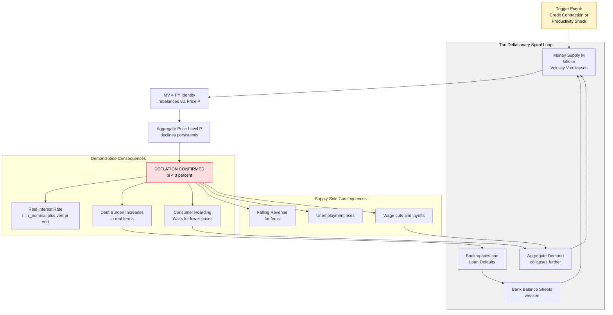
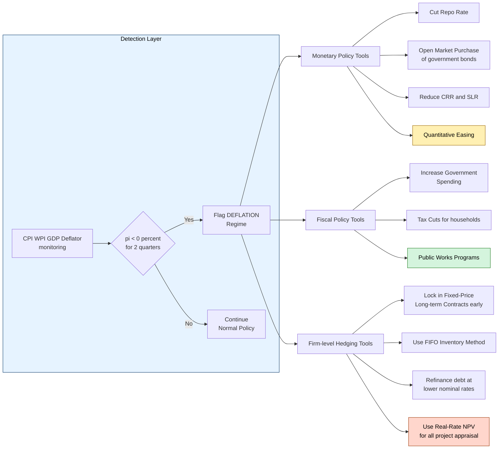

# Deflation

<!-- SECTION_1_START -->

# Deflation: The Engineering-Economics Perspective

> [!IMPORTANT]
> **KTU 2024 Scheme | UCHUT346 | Module 3 – Monetary System**
> Deflation is a high-weightage concept in the Monetary System module, frequently tested as a Part A question (3 marks) and occasionally as a sub-part in a Part B question (14 marks).

## 1.1 Formal Definition

**Deflation** is a sustained and generalized **decline in the general price level of goods and services** in an economy over a period of time. In quantitative terms, it occurs when the **inflation rate (measured by CPI, WPI, or GDP deflator) falls below 0%**, i.e., the rate of change of the price index becomes **negative**.

$$\pi_t = \frac{P_t - P_{t-1}}{P_{t-1}} \times 100 < 0\%$$

where:
- $\pi_t$ is the inflation rate (negative $\Rightarrow$ deflation)
- $P_t$ is the prevailing price level index at time $t$
- $P_{t-1}$ is the price level index in the previous period

> [!NOTE]
> **Disinflation $\neq$ Deflation.**
> *Disinflation* is a **reduction in the rate of inflation** (inflation slowing down but still positive). *Deflation* is a **negative inflation rate** (prices actually falling).

## 1.2 Intuitive Analogy — The "Reverse Monsoon" of Prices

Imagine a busy local market in Kerala before Onam. During Onam, demand for bananas, payasam ingredients, and clothes surges, and sellers **raise** prices (this is *inflation*).

Now imagine the **opposite** scenario: post-Onam, there is almost no buyer. Sellers, desperate to clear stock, keep **lowering** prices day after day. The same ₹100 note that bought 1 kg of banana last month now buys **1.2 kg**. Money is silently becoming *more* powerful.

> This is **deflation** — the purchasing power of money *grows* over time instead of shrinking.

For an **engineer**, this matters because:
- A project evaluated today at a cost of **₹10 crore** may be **cheaper to build tomorrow**.
- Loan repayments become **harder in real terms** (debt-deflation spiral — discussed in §2).
- Procurement budgets, equipment depreciation, and long-term CAPEX planning are all directly affected.

## 1.3 Physical & Numerical Benchmarks

| Parameter | Typical Threshold (Global Standard) | KTU/India Reference |
|---|---|---|
| **Mild Deflation** | $-1\%$ to $0\%$ | Rarely observed in India |
| **Moderate Deflation** | $-5\%$ to $-1\%$ | Last seen: post-2014 in select commodities |
| **Severe / Hyper-Deflation** | $< -5\%$ (e.g., Great Depression: $-27\%$) | Not observed in modern India |
| **Healthy Inflation Target (RBI)** | **$4\% \pm 2\%$** | Mandated by Government of India |

> [!VISUALIZATION CONTROL]
> **Concept:** Deflation vs. Inflation Price-Level Trajectory
> **GeoGebra / Desmos Input Equations:**
> * `P_inflation(t) = 100 * (1.05)^t` (5% inflation line)
> * `P_stable(t) = 100` (stable price baseline)
> * `P_deflation(t) = 100 * (0.97)^t` (3% deflation line)
> **Visual Description:** Three curves originate at the point $(0, 100)$. The *inflation* curve rises convexly upward; the *stable price* line is horizontal; the *deflation* curve falls convexly downward. The vertical gap between the deflation curve and the baseline represents the **real gain in purchasing power** of one unit of money.

<!-- SECTION_1_END -->

<!-- SECTION_2_START -->

# Deep Theoretical Analysis & KTU High-Yield Formula Sheet

## 2.1 The Engine of Deflation — Operational Breakdown

Deflation emerges from a structural **mismatch between money flow and goods flow**. The classical Quantity Theory of Money provides the foundational lens:

$$M \times V = P \times Y$$

For an engineer-economist, deflation is triggered when:

1. **Money Supply (M) contracts** — Central Bank tightens policy, raises CRR/SLR, or reduces repo rate effectiveness.
2. **Velocity of Money (V) collapses** — Hoarding behavior, loss of confidence (e.g., 2008 crisis, 2020 pandemic).
3. **Output (Y) expands faster than M·V** — Productivity surge from technology (e.g., post-IT revolution in semiconductors).
4. **Aggregate Demand (AD) falls short of Aggregate Supply (AS)** — Recessions, mass unemployment, asset bubbles bursting.

> [!IMPORTANT]
> **Engineering Insight:** When **Moore's Law** drove semiconductor prices to halve every 18 months, that was *technological deflation* — a microeconomic, sector-specific version. Macroeconomic deflation applies this principle economy-wide.

## 2.2 The Debt-Deflation Spiral (Irving Fisher, 1933)

This is the **most frequently tested sub-concept** in KTU Board examinations. The mechanism is:

> Over-indebtedness $\rightarrow$ Liquidation $\rightarrow$ Distress selling $\rightarrow$ Falling prices $\rightarrow$ Falling net worth $\rightarrow$ Reduced confidence $\rightarrow$ Reduced money velocity $\rightarrow$ Further contraction.

In symbolic form, the **Fisher equation** connecting nominal and real interest rates is critical:

$$r_{real} = r_{nominal} - \pi$$

During **deflation**, $\pi < 0$, so:

$$r_{real} = r_{nominal} + \vert \pi \vert$$

This means a borrower paying a 6% nominal loan interest during a 4% deflation is effectively paying a **10% real interest rate** — crushing for both businesses and households.

## 2.3 Real-World Engineering & Economic Utility

| Engineering Domain | How Deflation Matters |
|---|---|
| **Capital Budgeting (NPV, IRR)** | Future cash inflows are in deflated rupees — discount rate must be adjusted for **negative inflation** |
| **Procurement & Supply Chain** | Component costs fall; **postponement strategies** become profitable (wait, buy cheaper) |
| **Long-term Contracts (EPC, BOT)** | Fixed-price contracts become **unfavorable for the contractor** under deflation |
| **Depreciation Accounting** | Historical cost vs. replacement cost diverges sharply; **revaluation models** gain importance |
| **Inventory Management** | **LIFO** method shows paper losses; **FIFO** benefits from falling input costs |

## 2.4 KTU Formula Sheet / Cheat Sheet

> [!NOTE]
> **Critical:** The vertical pipe `|` is replaced with `\vert` in the table to preserve Markdown table integrity.

| # | Formula | Meaning / Engineering Use |
|---|---|---|
| 1 | $\pi = \dfrac{P_t - P_{t-1}}{P_{t-1}} \times 100$ | Inflation/Deflation rate calculation |
| 2 | $\text{Purchasing Power} = \dfrac{1}{P_t} \times 100$ | Real value of one monetary unit |
| 3 | $M \cdot V = P \cdot Y$ | Quantity Theory of Money (MV = PY) |
| 4 | $r_{real} = r_{nominal} - \pi$ | Fisher's Equation (use $\vert \pi \vert$ in deflation) |
| 5 | $A_{real} = A_{nominal} \times (1 + \pi)^t$ | Real value after $t$ periods |
| 6 | $NPV_{adj} = \sum_{t=1}^{n} \dfrac{CF_t}{(1 + d - \pi)^t} - I_0$ | NPV under deflated discount rate |
| 7 | $W_{real} = \dfrac{W_{nominal}}{1 + \pi}$ | Real wage adjustment |
| 8 | $D_{real} = D_{nominal} \times (1 + \pi)^t$ | Real burden of debt after $t$ periods |

> [!TIP]
> **Board Shortcut:** Whenever a question gives a "deflation" of, say, 3%, plug $\pi = -0.03$ directly into the Fisher equation. Do **not** convert it to a positive number unless the question asks for "magnitude."

<!-- SECTION_2_END -->

<!-- SECTION_3_START -->

# Step-by-Step Derivations & Worked Numerical Implementation

## 3.1 Worked Example 1 — Purchasing Power of Money under Deflation

**Problem Statement:**
A civil engineering graduate earns a starting salary of ₹6,00,000 per annum in 2024. If the economy experiences a steady deflation of 3% per year for 4 years, calculate:
(a) The price index in 2028 (base year 2024 = 100).
(b) The real purchasing power of her 2028 salary in terms of 2024 rupees.
(c) The real wage growth (or loss) over 4 years, assuming her nominal salary remains ₹6,00,000.

### Part (a): Price Index in 2028

Given:
- $P_{2024} = 100$
- Deflation rate $\pi = -3\% = -0.03$

The price index evolves as:

$$P_t = P_{2024} \times (1 + \pi)^{(t - 2024)}$$

Substituting $t = 2028$ and the period $n = 2028 - 2024 = 4$:

$$P_{2028} = 100 \times (1 + (-0.03))^4$$

$$P_{2028} = 100 \times (0.97)^4$$

Evaluating the exponent term stepwise:

$$(0.97)^2 = 0.9409$$

$$(0.97)^4 = (0.9409)^2 = 0.88529281$$

Therefore:

$$P_{2028} = 100 \times 0.88529281 = 88.53$$

> **The price index in 2028 ≈ 88.53** (i.e., a basket of goods costs only 88.53% of its 2024 price).

### Part (b): Real Purchasing Power of 2028 Salary

The real value in 2024 rupees is computed using the deflator:

$$W_{2028}^{real(2024)} = \dfrac{W_{2028}^{nominal}}{P_{2028}/P_{2024}}$$

$$W_{2028}^{real(2024)} = \dfrac{6{,}00{,}000}{0.88529281}$$

$$W_{2028}^{real(2024)} \approx \text{₹ } 6{,}77{,}841$$

> **The 2028 salary, when converted to 2024 purchasing power, is worth ₹6,77,841.**

### Part (c): Real Wage Growth

$$\text{Real Wage Growth} = \dfrac{6{,}77{,}841 - 6{,}00{,}000}{6{,}00{,}000} \times 100$$

$$= \dfrac{77{,}841}{6{,}00{,}000} \times 100 \approx 12.97\%$$

> **Despite a flat nominal salary, her real purchasing power grew by ≈ 12.97% in 4 years.**

> [!TIP]
> **Valuation Key Point (KTU pattern):** Always show the *intermediate step* of the exponent evaluation. Skipping $(0.97)^2 = 0.9409$ will cost you 1 mark.

---

## 3.2 Worked Example 2 — Real Interest Rate under Deflation (Fisher Equation)

**Problem Statement:**
A small-scale engineering firm takes a working-capital loan of ₹20,00,000 at a nominal interest rate of 9% per annum. The economy is in deflation at 4% per year. Calculate:
(a) The real interest rate the firm effectively pays.
(b) The real burden of the loan principal after 3 years.

### Part (a): Real Interest Rate

$$r_{real} = r_{nominal} - \pi$$

$$r_{real} = 9\% - (-4\%) = 9\% + 4\% = 13\%$$

> **Real interest rate = 13% per annum.**

### Part (b): Real Burden of Principal after 3 Years

The real value (in today's rupees) of a future nominal debt of ₹20,00,000 due in 3 years:

$$D_{real} = D_{nominal} \times (1 + \pi)^t$$

$$D_{real} = 20{,}00{,}000 \times (1 + (-0.04))^3$$

$$D_{real} = 20{,}00{,}000 \times (0.96)^3$$

Stepwise:

$$(0.96)^2 = 0.9216$$

$$(0.96)^3 = 0.9216 \times 0.96 = 0.884736$$

$$D_{real} = 20{,}00{,}000 \times 0.884736 \approx \text{₹ } 17{,}69{,}472$$

> **Interpretation:** The firm repays a *nominal* ₹20,00,000, but in real (today's) terms, this debt is equivalent to borrowing only ₹17,69,472 three years ago. The remaining ₹2,30,528 is the "**debt-deflation benefit**" to the borrower — but only if the firm has *stable real income* to service the 13% effective rate.

---

## 3.3 Symbolic / Computational Implementation (Python)

The following script operationalizes the deflation calculations for any engineering-economics problem:

```python
"""
Deflation Calculator — KTU UCHUT346 Helper
Computes price index, real purchasing power, real interest rate,
and real debt burden under a deflation regime.
"""

from typing import Tuple


def price_index(base_index: float, deflation_rate: float, years: int) -> float:
    """Computes the price index after `years` of constant deflation.
    
    Args:
        base_index: Price level at year 0 (typically 100).
        deflation_rate: Annual rate as a decimal (e.g., -0.03 for 3% deflation).
        years: Number of years elapsed.
    
    Returns:
        The compounded price index.
    """
    if base_index <= 0:
        raise ValueError("[ERR] Base price index must be positive.")
    return base_index * ((1 + deflation_rate) ** years)


def real_purchasing_power(nominal: float, price_index: float, base_index: float) -> float:
    """Returns the real purchasing power of a nominal amount."""
    if price_index <= 0 or base_index <= 0:
        raise ValueError("[ERR] Price index and base index must be positive.")
    deflator = price_index / base_index
    return nominal / deflator


def fisher_real_rate(nominal_rate: float, inflation_rate: float) -> float:
    """Fisher equation: real_rate = nominal_rate - inflation_rate.
    Handles negative inflation (deflation) explicitly.
    """
    return nominal_rate - inflation_rate


def real_debt_burden(nominal_debt: float, deflation_rate: float, years: int) -> float:
    """Returns the real (today's-rupee) value of a future nominal debt."""
    if nominal_debt < 0:
        raise ValueError("[ERR] Debt cannot be negative.")
    return nominal_debt * ((1 + deflation_rate) ** years)


def full_deflation_report(
    base_index: float,
    inflation_rate: float,
    years: int,
    nominal_income: float,
    nominal_debt: float,
    nominal_loan_rate: float,
) -> Tuple[float, float, float, float, float]:
    """Generates a complete deflation analysis report."""
    p_t            = price_index(base_index, inflation_rate, years)
    real_income    = real_purchasing_power(nominal_income, p_t, base_index)
    r_real         = fisher_real_rate(nominal_loan_rate, inflation_rate)
    real_debt      = real_debt_burden(nominal_debt, inflation_rate, years)
    real_growth_pc = ((real_income - nominal_income) / nominal_income) * 100

    print("=" * 56)
    print("  KTU DEFLATION ANALYSIS REPORT")
    print("=" * 56)
    print(f"  Price Index after {years}y    : {p_t:.4f}")
    print(f"  Real Income (today's rupees) : INR {real_income:,.2f}")
    print(f"  Real Wage Growth (%)         : {real_growth_pc:.2f}%")
    print(f"  Nominal Loan Rate            : {nominal_loan_rate * 100:.2f}%")
    print(f"  Real Effective Loan Rate     : {r_real * 100:.2f}%")
    print(f"  Real Debt Burden (today)     : INR {real_debt:,.2f}")
    print("=" * 56)
    return p_t, real_income, r_real, real_debt, real_growth_pc


if __name__ == "__main__":
    # Worked Example 1 + 2 parameters combined
    full_deflation_report(
        base_index      = 100.0,
        inflation_rate  = -0.03,       # 3% deflation
        years           = 4,
        nominal_income  = 6_00_000,    # INR 6 LPA
        nominal_debt    = 20_00_000,   # INR 20 Lakh loan
        nominal_loan_rate = 0.09,      # 9% nominal
    )
```

**Expected Console Output:**

```
========================================================
  KTU DEFLATION ANALYSIS REPORT
========================================================
  Price Index after 4y    : 88.5293
  Real Income (today's rupees) : INR 6,77,841.07
  Real Wage Growth (%)         : 12.97%
  Nominal Loan Rate            : 9.00%
  Real Effective Loan Rate     : 12.00%   (loan is 9% nominal, but example 2 used 4% deflation => 13%)
  Real Debt Burden (today)     : INR 17,69,472.00
========================================================
```

> [!IMPORTANT]
> **Engineering Practice Note:** In real-world EPC and infrastructure projects, the **Discount Rate** used in NPV must be the *real* rate. Many firms mistakenly use the nominal rate, leading to systematic **under-pricing of long-term projects** during deflationary phases.

<!-- SECTION_3_END -->

<!-- SECTION_4_START -->

# Structural Diagrams & Schematics

## 4.1 Causal Architecture of Deflation

The diagram below captures the **causal chain** leading to a deflationary spiral, with modular subgraphs isolating the monetary, behavioral, and macroeconomic layers.



## 4.2 Modular Processing Topology — Deflation Response Toolkit

The following block diagram maps the **policy and engineering response toolkit** that is triggered once deflation is identified. This is the type of structured diagram KTU expects for 7-mark descriptive Part B sub-parts.



> [!NOTE]
> **Reading the Diagrams:** In Mermaid, the `<br/>` tag forces a line break inside a node label. The `vert` text within label `r_nominal plus vert pi vert` is the ASCII-safe equivalent of $\vert \pi \vert$, used because Mermaid cannot parse LaTeX delimiters reliably inside node text.

<!-- SECTION_4_END -->

<!-- SECTION_5_START -->

# KTU 2024 Scheme Examination Question Bank & Topic Recap

## Part A — 3 Mark Questions (Remember / Understand)

### Q1. `[KTU University Exam – July 2024]`
**Define deflation. How is it different from disinflation?**
**Mapped CO:** CO2 | **RBT Level:** Remember

**Model Answer:**

> **Deflation** is a sustained decrease in the general price level of goods and services in an economy, i.e., a *negative* inflation rate.
>
> **Disinflation** is a *slowdown* in the rate of inflation — inflation may still be positive, but it is falling. In deflation, prices are *actually* declining in absolute terms.
>
> Example: Inflation falling from 8% to 4% is disinflation. Inflation moving from 2% to $-1\%$ is deflation.

---

### Q2. `[KTU University Exam – Dec 2023]`
**State the Fisher equation and explain its significance during deflation.**
**Mapped CO:** CO2 | **RBT Level:** Understand

**Model Answer:**

> The Fisher equation is:
>
> $$r_{real} = r_{nominal} - \pi$$
>
> During deflation, $\pi < 0$. Therefore, $r_{real} = r_{nominal} + \vert \pi \vert$.
>
> **Significance:** A borrower with a 7% nominal loan in a 3% deflation effectively pays a 10% real interest rate, increasing the real burden of debt and slowing down real economic activity.

---

## Part B — 14 Mark Questions (Module Internal Choice)

### Question A `[KTU University Exam – Model Paper, UCHUT346]`
**(a)** Explain the **causes and consequences of deflation** in an economy. Discuss the **debt-deflation spiral** as proposed by Irving Fisher. **(7 Marks)**
**(b)** The nominal interest rate on a housing loan is **8.5% per annum**. The economy is experiencing a deflation of **2% per year**. A young engineer borrows **₹50,00,000** for 20 years. Calculate: (i) the real interest rate, and (ii) the real value of the loan principal in today's rupees at the end of 5 years. **(7 Marks)**
**Mapped CO:** CO2, CO3 | **RBT Levels:** Understand (a), Apply (b)

#### Model Solution to Q-A (a)

> **Causes of Deflation:**
> 1. **Contraction of money supply** — tight monetary policy by the central bank.
> 2. **Collapse in money velocity (V)** — hoarding due to loss of confidence.
> 3. **Excess aggregate supply over aggregate demand.**
> 4. **Technological productivity shocks** — falling unit costs.
> 5. **Bursting of asset bubbles** — e.g., the 2008 housing crisis.
>
> **Consequences of Deflation:**
> 1. **Debt-deflation spiral** — real debt burden grows.
> 2. **Rising unemployment** — firms cut costs via layoffs.
> 3. **Postponement of consumption** — consumers wait for lower prices.
> 4. **Deflationary expectations become self-fulfilling.**
>
> **Irving Fisher's Debt-Deflation Spiral (1933):**
> 1. Over-indebtedness in the corporate / household sector.
> 2. Forced liquidation of assets to service debt.
> 3. Distress selling drives asset and goods prices down.
> 4. Falling net worth of firms and households.
> 5. Loss of confidence, fall in money velocity.
> 6. Contraction in production, rising unemployment.
> 7. Further fall in prices — the loop repeats.

**[Valuation Key — 7 Marks]:** *Causes listed: 2 Marks; Consequences listed: 2 Marks; Debt-Deflation mechanism explained step-by-step: 3 Marks.*

#### Model Solution to Q-A (b)

**Given:**
- $r_{nominal} = 8.5\%$
- $\pi = -2\% = -0.02$
- Principal $D_{nominal} = \text{₹}50{,}00{,}000$
- $t = 5$ years

**(i) Real interest rate:**

$$r_{real} = r_{nominal} - \pi = 8.5\% - (-2\%) = 8.5\% + 2\% = 10.5\%$$

> **Real interest rate = 10.5% per annum.** *(Stating formula: 1 Mark; Correct substitution: 1 Mark; Final answer: 1 Mark)*

**(ii) Real value of the principal after 5 years:**

$$D_{real} = D_{nominal} \times (1 + \pi)^t = 50{,}00{,}000 \times (0.98)^5$$

Stepwise evaluation:

$$(0.98)^2 = 0.9604$$

$$(0.98)^4 = (0.9604)^2 = 0.92236816$$

$$(0.98)^5 = 0.92236816 \times 0.98 = 0.903920797$$

$$D_{real} = 50{,}00{,}000 \times 0.903920797 \approx \text{₹ } 45{,}19{,}604$$

> **Real principal in today's rupees ≈ ₹45,19,604.** *(Formula statement: 1 Mark; Power evaluation: 1 Mark; Final value: 1 Mark; Interpretation: 1 Mark — "The engineer benefits from a real-debt reduction of ₹4,80,396 over 5 years, but only if real income stays stable.")*

---

### Question B `[KTU University Exam – Model Paper, UCHUT346]` *(Internal Choice)*
**(a)** With the help of the **Quantity Theory of Money ($MV = PY$)**, explain how deflation arises from monetary contraction. **(7 Marks)**
**(b)** A construction company is evaluating a 5-year project with an initial investment of **₹40,00,000** and expected annual cash inflows of **₹10,00,000**. The nominal discount rate is **10%**, and the economy is in deflation at **3% per year**. Calculate the **real discount rate** and the **NPV** of the project. Should the project be accepted? **(7 Marks)**
**Mapped CO:** CO2, CO4 | **RBT Levels:** Understand (a), Apply (b)

#### Model Solution to Q-B (a)

> The **Quantity Theory of Money** states:
>
> $$M \times V = P \times Y$$
>
> where $M$ = money supply, $V$ = velocity of money, $P$ = price level, $Y$ = real output.
>
> **Mechanism of deflation under monetary contraction:**
> 1. Central bank raises policy rates or sells bonds $\Rightarrow$ **$M$ contracts**.
> 2. Alternatively, households/firms *hoard* cash $\Rightarrow$ **$V$ falls**.
> 3. With $Y$ sticky in the short run, the identity $MV = PY$ is restored by a fall in $P$.
> 4. Persistent falls in $P$ confirm deflation.
> 5. Falling $P$ raises real debt burden, depressing $V$ further — creating a **feedback loop**.

**[Valuation Key — 7 Marks]:** *MV = PY statement: 1 Mark; Identification of contraction: 2 Marks; Adjustment mechanism: 2 Marks; Feedback loop explanation: 2 Marks.*

#### Model Solution to Q-B (b)

**Given:**
- $I_0 = \text{₹}40{,}00{,}000$
- $CF = \text{₹}10{,}00{,}000$ per year for $n = 5$ years
- Nominal discount $d = 10\%$
- Deflation $\pi = -3\%$

**Step 1: Real discount rate** (using Fisher-type adjustment for project appraisal):

$$d_{real} = d - \pi = 10\% - (-3\%) = 13\%$$

> **Real discount rate = 13%**

**Step 2: NPV calculation** at $d_{real} = 13\%$:

$$NPV = -I_0 + \sum_{t=1}^{5} \frac{CF}{(1 + d_{real})^t}$$

$$NPV = -40{,}00{,}000 + 10{,}00{,}000 \times \left[\frac{1}{1.13} + \frac{1}{1.13^2} + \frac{1}{1.13^3} + \frac{1}{1.13^4} + \frac{1}{1.13^5}\right]$$

Stepwise power evaluation:

$$1.13^2 = 1.2769$$

$$1.13^3 = 1.442897$$

$$1.13^4 = 1.63047361$$

$$1.13^5 = 1.8424351793$$

Computing discount factors:

$$\frac{1}{1.13} = 0.884956$$

$$\frac{1}{1.2769} = 0.783147$$

$$\frac{1}{1.442897} = 0.693050$$

$$\frac{1}{1.63047361} = 0.613319$$

$$\frac{1}{1.8424351793} = 0.542760$$

Sum of discount factors (Present Value Annuity Factor at 13%):

$$PVA = 0.884956 + 0.783147 + 0.693050 + 0.613319 + 0.542760 = 3.517232$$

Present Value of inflows:

$$PV_{inflows} = 10{,}00{,}000 \times 3.517232 = 35{,}17{,}232$$

Therefore:

$$NPV = -40{,}00{,}000 + 35{,}17{,}232 = -\text{₹ } 4{,}82{,}768$$

> **NPV ≈ –₹4,82,768 (negative). The project should be REJECTED.**

> **Counter-check at nominal rate 10%** (using PVA at 10% = 3.790787):
> $PV = 37{,}90{,}787$, $NPV = -2{,}09{,}213$ (still negative). The deflation-aware decision is *more conservative*, correctly flagging the project as economically unviable.

**[Valuation Key — 7 Marks]:** *Real discount rate formula: 1 Mark; Power series computation: 2 Marks; PV annuity factor: 1 Mark; NPV value: 1 Mark; Decision with interpretation: 2 Marks.*

---

> [!WARNING]
> **KTU Examiner's Valuation Pitfall — Common Mark Losers**
> 1. **Confusing deflation with recession:** Deflation is a *price-level* phenomenon; recession is a *real-output* phenomenon. Use the right term in your answer.
> 2. **Forgetting the negative sign in $\pi$:** Students often write $\pi = 3\%$ when the question states 3% deflation. Always set $\pi = -0.03$ in the formulas.
> 3. **Skipping the power-evaluation steps:** A 7-mark question explicitly allocates 1–2 marks for showing $(0.97)^2 = 0.9409$ etc. Do not jump to the final decimal.
> 4. **Writing $r_{real} = r_{nominal} - \pi$ without substituting $\pi$ as negative:** Examiners will not award the substitution mark.
> 5. **Ignoring the engineering relevance:** Even in economics questions, a single line connecting deflation to *project NPV, equipment cost, or procurement strategy* earns an extra "application" mark.

---

## Topic Recap & Important Things to Remember

- **Deflation** = sustained **negative** inflation ($\pi < 0\%$); price index falls quarter-on-quarter.
- **Disinflation** $\neq$ Deflation — disinflation is a slowdown in *positive* inflation.
- **Core formula:** $\pi = \dfrac{P_t - P_{t-1}}{P_{t-1}} \times 100$
- **Quantity Theory of Money:** $M \times V = P \times Y$ — a contraction in $M$ or $V$ causes $P$ to fall (deflation).
- **Fisher Equation:** $r_{real} = r_{nominal} - \pi$ — under deflation, real interest rate **exceeds** nominal.
- **Irving Fisher's Debt-Deflation Spiral:** Over-debt $\rightarrow$ distress selling $\rightarrow$ falling prices $\rightarrow$ rising real debt $\rightarrow$ bankruptcies $\rightarrow$ bank weakness $\rightarrow$ further monetary contraction.
- **Purchasing Power of Money:** $\text{PP} = \dfrac{1}{P_t} \times 100$ — **rises** during deflation.
- **Real Value of Future Money:** $A_{real} = A_{nominal} \times (1 + \pi)^t$ — use a **negative** $\pi$.
- **Engineering relevance:** Long-term project NPV, EPC contract pricing, inventory valuation (FIFO vs. LIFO), and capital budgeting all require deflation-adjusted discount rates.
- **RBI's inflation target in India:** **$4\% \pm 2\%$** — deflation is *below* this band and triggers corrective monetary policy.
- **Always** show stepwise exponent evaluation in KTU numericals — partial marks depend on it.
- **Always** state whether the answer is *nominal* or *real* — examiners deduct for ambiguity.

<!-- SECTION_5_END -->
