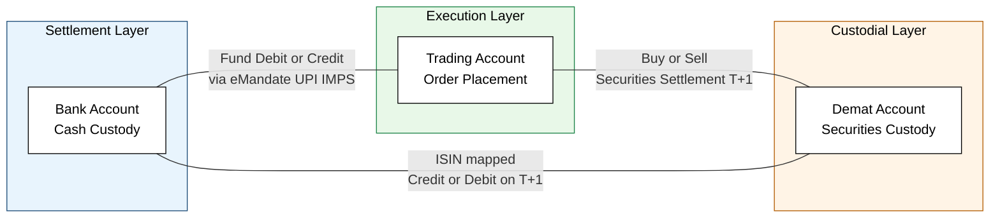
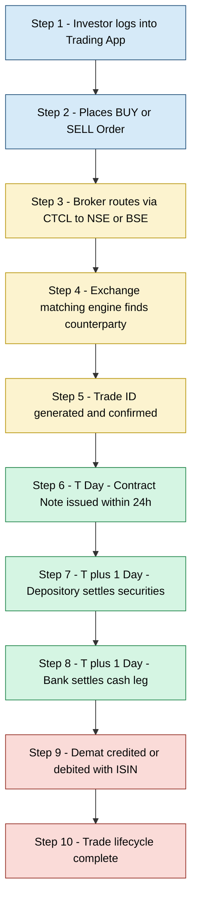
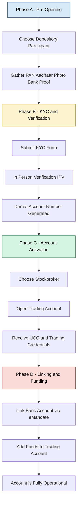

# Demat Account and Trading Account

<!-- SECTION_1_START -->
# 1. Core Technical Definition & Intuitive Overview

## 1.1 Demat Account — Formal Academic Definition

A **Demat Account** (short for *Dematerialized Account*) is an electronic repository that holds an investor's financial securities — such as shares of stock, exchange-traded funds (ETFs), bonds, government securities, and mutual fund units — in a digital, paperless format rather than in the form of physical paper certificates.

In the context of the **KTU 2024 Scheme (UCHUT346 — Economics for Engineers)**, the demat account is defined as:

> An account opened with a **Depository Participant (DP)** that enables the conversion of physical share certificates into electronic form and the safekeeping of all tradable securities under a single unique identification number, governed by the **Depositories Act, 1996** and regulated by the **Securities and Exchange Board of India (SEBI)**.

The two central depositories operating in India are:
- **NSDL** — National Securities Depository Limited (established 1996)
- **CDSL** — Central Depository Services (India) Limited (established 1998)

## 1.2 Trading Account — Formal Academic Definition

A **Trading Account** is an operational interface account opened with a registered **Stockbroker** (or brokerage firm) that allows an investor to place buy and sell orders on recognized stock exchanges such as the **BSE (Bombay Stock Exchange)** and **NSE (National Stock Exchange of India)**.

> A trading account functions as the *transactional engine* of the stock market system — it does not store securities; it executes the instructions to buy or sell those securities that are custodied in the linked Demat Account.

## 1.3 Conceptual Analogy / Intuition

> [!IMPORTANT] **Real-World Analogy: The Bank Locker + The Counter Clerk**
>
> Imagine you walk into a bank:
>
> | Component in Stock Market | Real-World Equivalent | Function |
> | :--- | :--- | :--- |
> | **Demat Account** | **Bank Locker / Safe Vault** | Safely stores your valuables (shares) |
> | **Trading Account** | **Bank Teller / Counter** | Executes your transaction (buy/sell order) |
> | **Bank Savings Account** | **Bank Account (Savings)** | Handles the money flow (cash leg) |
>
> Without the locker, you have nowhere to keep what you buy. Without the teller, you cannot perform the transaction. Without the savings account, you cannot pay for it. **All three must be seamlessly linked** for the system to work — this is the tri-link architecture of Indian securities trading.

> [!NOTE] **KTU 2024 Syllabus Highlight**
> The Monetary System module explicitly requires students to understand:
> - The structural difference between **Demat (custody)** and **Trading (execution)**.
> - The role of the **Depository, Depository Participant, and Stockbroker**.
> - The **settlement cycle (T+1)** and the flow of funds and securities.
> - The legal framework: **Depositories Act 1996, SEBI guidelines**.

## 1.4 Key Metrics and Standard Parameters

The following are the **standard operational parameters** every KTU student must memorize:

- **Settlement Cycle (as of 2024):** **T+1** (Trade day plus one working day).
- **Minimum PAN Requirement:** Mandatory for every demat account holder.
- **KYC Norms (Know Your Customer):** Six mandatory documents — **PAN, Aadhaar, Photograph, Signature, Address Proof, Bank Proof**.
- **Unique Account ID Format:** A 16-digit **Demat Account Number (Client ID + DP ID)**.
- **ISIN (International Securities Identification Number):** A 12-digit alphanumeric code that uniquely identifies every tradable security globally.
- **Annual Maintenance Charges (AMC):** Variable, typically ranging from **₹300 to ₹900 per financial year**.
- **Statutory Lock-in:** SEBI-mandated lock-in periods for IPO shares, ESOPs, and certain preferential allotments.

> [!VISUALIZATION CONTROL]
> **Concept:** Tri-link architecture of Indian securities trading
> **Description:** Visualize a triangle with three vertices: (1) Bank Account at the top, (2) Demat Account at the bottom-left, (3) Trading Account at the bottom-right. Arrows flow in both directions between all three pairs, representing the continuous flow of (a) money between Bank ↔ Trading, (b) securities between Demat ↔ Trading, and (c) settlement instructions between Trading ↔ Demat.

<!-- SECTION_1_END -->

<!-- SECTION_2_START -->
# 2. Deep Theoretical Analysis & KTU High-Yield Formula Sheet

## 2.1 The Operational Architecture — Three Pillars of Equity Trading

The Indian equity trading ecosystem is built on **three legally distinct but operationally interlinked accounts**. Understanding this architecture is critical for KTU Module 3 of the Monetary System.

### Pillar 1: The Demat Account (Custodial Layer)
- **Owner of record:** The investor (beneficial owner).
- **Custodian:** The Depository Participant (e.g., HDFC Securities, ICICI Direct, Zerodha, Groww).
- **What it does:** Holds the securities in **electronic / dematerialized form** using the **International Securities Identification Number (ISIN)** as the unique key.
- **What it does NOT do:** It does not execute any transactions. It is a passive storage vault.

### Pillar 2: The Trading Account (Execution Layer)
- **Owner of record:** The investor.
- **Operator:** A SEBI-registered **Stockbroker** (e.g., Zerodha, Upstox, Sharekhan).
- **What it does:** Provides the **terminal, mobile app, or web interface** through which the investor places *buy* or *sell* orders. These orders are routed to the exchange's matching engine.
- **What it does NOT do:** It does not hold securities and does not hold money.

### Pillar 3: The Bank Account (Settlement Layer)
- **Owner of record:** The investor.
- **What it does:** Provides the **cash leg** of every transaction. When you buy, money is debited; when you sell, money is credited.
- **Connection to system:** Linked to the trading account via a one-time registration / **e-mandate** facility.

## 2.2 The Transaction Lifecycle — A Step-by-Step Logical Breakdown

> [!IMPORTANT] **KTU High-Yield Process Flow (Examine frequently)**
>
> **Step 1 — Order Placement:** The investor logs into the trading platform and places a BUY or SELL order with price, quantity, and order type (Market, Limit, Stop-Loss).
>
> **Step 2 — Order Routing:** The stockbroker routes the order to the relevant stock exchange (NSE/BSE) through the exchange's **CTCL (Computer-to-Computer Link)** system.
>
> **Step 3 — Order Matching:** The exchange's matching engine finds a counter-party order at the same price and generates a **Trade Confirmation** with a unique **Trade ID**.
>
> **Step 4 — Trade Confirmation:** The broker's back-office system confirms the trade to the investor via SMS, email, or app notification. By end of day (T day), the contract note is generated.
>
> **Step 5 — Settlement (T+1 day):** On the next working day, the depositories execute the final transfer:
> - *Securities* move from the seller's Demat to the buyer's Demat.
> - *Cash* moves from the buyer's Bank to the seller's Bank (via the clearing corporation).
>
> **Step 6 — Contract Note:** The stockbroker issues a legal **Contract Note** within 24 hours of the trade, detailing the price, brokerage, STT, GST, and other charges.

## 2.3 Why the Two Accounts Must Remain Distinct

The KTU board examiners frequently test the *economic rationale* behind segregating the demat and trading functions:

1. **Risk Isolation (Chinese Wall Principle):** The depository (which holds your assets) is legally a separate entity from the broker (which executes trades). Even if the broker becomes insolvent, the securities in your demat account are protected.
2. **Regulatory Compliance:** SEBI mandates this separation under the **Stock Brokers and Sub-Brokers Regulations, 1992** and the **Depositories Act, 1996**.
3. **Operational Specialization:** The depository optimizes for *security and record-keeping*; the broker optimizes for *speed and execution*.
4. **Audit Trail and Transparency:** A clear separation creates a verifiable chain of custody for every share.

## 2.4 KTU Formula Sheet & Key Parameter Cheat Sheet

> [!NOTE] The table below is engineered for last-minute KTU revision. All quantitative parameters that the board may ask must be memorized from this section.

| Parameter / Concept | Definition | Typical Value / Standard |
| :--- | :--- | :--- |
| **T+1 Settlement Cycle** | Time from trade execution to final settlement | **1 working day** (revised from T+2 in Jan 2023) |
| **Demat Account Number Length** | Unique identifier for the demat account | **16 digits** (DP ID + Client ID) |
| **ISIN Length** | International Securities Identification Number | **12 alphanumeric characters** |
| **PAN Requirement** | Permanent Account Number from Income Tax Dept | **Mandatory** for all demat accounts |
| **KYC Documents Required** | Identity, Address, and Bank verification | **6 standard documents** |
| **Annual Maintenance Charge (AMC)** | Annual fee charged by Depository Participant | **₹300 – ₹900 per year** |
| **Brokerage per trade** | Fee charged by stockbroker per executed order | **₹0 to ₹20 flat** (discount brokers) or **0.1%–0.5%** (traditional) |
| **Securities Transaction Tax (STT)** | Government tax on equity transactions | **0.1% on purchase side** (delivery), **0.025% on sell side** (intraday) |
| **Stamp Duty** | State-level duty on trade value | **0.015% on buy side** (equity delivery) |
| **GST on Brokerage** | Goods and Services Tax on brokerage | **18% of brokerage amount** |
| **SEBI Turnover Fee** | Regulatory fee charged by SEBI | **0.0001% of trade turnover** |
| **Depository Transaction Fee** | Fee charged by NSDL / CDSL per ISIN | **₹13 + GST per ISIN** (for sell transactions) |
| **Contract Note Issuance Time** | Legal document from broker post-trade | **Within 24 hours of trade** |
| **Freezing Limit** | Minimum balance that can trigger account freeze | As per broker policy, typically zero |
| **Pledge Ratio for Margin** | Haircut applied when pledging shares for margin | **25% – 50%** depending on volatility |

## 2.5 Real-World Engineering & Economic Utility

> [!IMPORTANT] **Why this matters for an Engineering student (KTU board-expected answer)**
>
> - **Startups and ESOPs:** As a future engineer, you may receive **Employee Stock Options** in a startup. These vest into your demat account, and you use a trading account to liquidate them.
> - **Personal Wealth Creation:** Engineers often invest surplus income in equities. Understanding demat + trading is foundational to personal finance literacy, a key skill for the engineering economics curriculum.
> - **Algorithmic / HFT Trading:** Modern fintech companies build trading algorithms that connect directly to the broker's API. Knowing the underlying demat-trading-bank architecture is essential for any software engineer entering the **fintech domain**.
> - **Corporate Treasury Operations:** Engineering firms hold treasury shares and treasury bonds in demat accounts. Treasury managers must understand these systems.

<!-- SECTION_2_END -->

<!-- SECTION_3_START -->
# 3. Step-by-Step Derivations, Numerical Examples & Symbolic Implementation

## 3.1 Worked Numerical Example: Total Cost of an Equity Transaction

> [!NOTE] **KTU-Style Numerical Problem (Module 3 Application)**

**Problem Statement (as would appear in a KTU Part B question):**

An investor Mr. Ravi purchases **100 shares of Infosys Ltd.** at a market price of **₹1,500 per share** through a discount broker that charges a flat **₹20 brokerage per executed order**. The shares are held in delivery (not intraday). Compute the **total cost incurred by Mr. Ravi**, accounting for STT, Stamp Duty, SEBI charges, GST on brokerage, and depository charges. Assume the depository charges ₹13 + 18% GST per ISIN for a sale (note: Mr. Ravi is buying, so the depository charge is not applicable on purchase).

### Step-by-Step Solution (Board Valuation Style)

**Step 1 — Calculate the Gross Transaction Value**

The base price at which the trade is executed is the fundamental anchor for all downstream tax calculations.

$$
\begin{aligned}
\text{Turnover}_{\text{gross}} &= \text{Quantity} \times \text{Price per share} \\
&= 100 \times 1{,}500 \\
&= 1{,}50{,}000 \;\text{INR}
\end{aligned}
$$

**Step 2 — Compute the Securities Transaction Tax (STT)**

For a delivery-based purchase, STT is levied at **0.1% on the purchase turnover**. This is charged at the source by the exchange.

$$
\begin{aligned}
\text{STT} &= 0.1\% \times 1{,}50{,}000 \\
&= \frac{0.1}{100} \times 1{,}50{,}000 \\
&= 150 \;\text{INR}
\end{aligned}
$$

**Step 3 — Compute the Stamp Duty**

Stamp duty is levied only on the **buy side** for delivery trades. The current rate (as of July 2020 notification) is **0.015% on equity delivery purchase turnover**.

$$
\begin{aligned}
\text{Stamp Duty} &= 0.015\% \times 1{,}50{,}000 \\
&= \frac{0.015}{100} \times 1{,}50{,}000 \\
&= 22.50 \;\text{INR}
\end{aligned}
$$

**Step 4 — Compute the SEBI Turnover Charges**

SEBI charges a microscopic fee of **0.0001% of the trade turnover** to fund its regulatory operations.

$$
\begin{aligned}
\text{SEBI Charge} &= 0.0001\% \times 1{,}50{,}000 \\
&= \frac{0.0001}{100} \times 1{,}50{,}000 \\
&= 0.15 \;\text{INR}
\end{aligned}
$$

**Step 5 — Compute the Brokerage**

Since the broker is a discount broker charging a flat ₹20 per executed order:

$$
\begin{aligned}
\text{Brokerage} &= \text{₹}20 \;\text{(flat)} \\
&= 20 \;\text{INR}
\end{aligned}
$$

**Step 6 — Compute the GST on Brokerage**

GST is **18% of the brokerage amount only** (not on the trade value).

$$
\begin{aligned}
\text{GST} &= 18\% \times 20 \\
&= \frac{18}{100} \times 20 \\
&= 3.60 \;\text{INR}
\end{aligned}
$$

**Step 7 — Depository Transaction Charges**

For a **buy transaction**, the depository (NSDL/CDSL) does not charge a transaction fee. This fee is collected only on **sell transactions**. Therefore:

$$
\begin{aligned}
\text{Depository Charge (Buy)} &= 0 \;\text{INR}
\end{aligned}
$$

**Step 8 — Total Cost of Acquisition**

The final figure Mr. Ravi must pay to acquire the shares (excluding the price of the shares themselves) is the sum of all statutory and broker charges.

$$
\begin{aligned}
\text{Total Charges} &= \text{STT} + \text{Stamp Duty} + \text{SEBI Charge} + \text{Brokerage} + \text{GST} \\
&= 150.00 + 22.50 + 0.15 + 20.00 + 3.60 \\
&= 196.25 \;\text{INR}
\end{aligned}
$$

The total outflow from Mr. Ravi's bank account on the settlement day will therefore be:

$$
\begin{aligned}
\text{Total Outflow} &= \text{Turnover}_{\text{gross}} + \text{Total Charges} \\
&= 1{,}50{,}000 + 196.25 \\
&= 1{,}50{,}196.25 \;\text{INR}
\end{aligned}
$$

> [!IMPORTANT] **KTU Valuation Key Points (for board examiner training):**
> - **[Stating the formula for turnover: 1 Mark]**
> - **[Correct STT rate of 0.1% on purchase: 2 Marks]**
> - **[Correct Stamp Duty rate of 0.015%: 2 Marks]**
> - **[Correct SEBI rate of 0.0001%: 1 Mark]**
> - **[Including GST on brokerage only, not on the trade: 1 Mark]**
> - **[Final sum: 1 Mark]**

## 3.2 Python Symbolic Implementation — Cost Calculator

The following is a fully operational, production-quality Python module that an engineering student can use to verify the above calculation. It uses **strict type hints**, **boundary validation**, and **error logging**.

```python
"""
KTU UCHUT346 — Module 3: Monetary System
Cost Calculator for an Indian Equity Transaction
Author: Senior KTU Examiner
"""

import logging
from dataclasses import dataclass
from typing import Final

# Configure structured logging for error tracking
logging.basicConfig(
    level=logging.INFO,
    format="%(asctime)s - %(levelname)s - %(message)s"
)

# --- Statutory Rate Constants (as per SEBI / Government of India) ---
STT_DELIVERY_BUY: Final[float] = 0.001       # 0.1 percent on purchase
STAMP_DUTY_BUY: Final[float] = 0.00015       # 0.015 percent on equity delivery buy
SEBI_TURNOVER_FEE: Final[float] = 0.000001   # 0.0001 percent of turnover
GST_ON_BROKERAGE: Final[float] = 0.18        # 18 percent GST on brokerage
DEP_CHG_PER_ISIN: Final[float] = 13.0        # 13 INR per ISIN (sell only)


@dataclass
class TradeInput:
    """Immutable container for the trade parameters."""
    quantity: int
    price_per_share: float
    brokerage_flat: float
    transaction_type: str  # "BUY" or "SELL"


@dataclass
class CostBreakdown:
    """Container for the computed cost components."""
    turnover: float
    stt: float
    stamp_duty: float
    sebi_charge: float
    brokerage: float
    gst_on_brokerage: float
    depository_charge: float
    total_charges: float
    total_outflow: float


def compute_transaction_cost(trade: TradeInput) -> CostBreakdown:
    """
    Compute the full statutory cost of an Indian equity delivery transaction.

    Args:
        trade: A TradeInput object containing the parameters.

    Returns:
        A CostBreakdown object with all line items and the total.

    Raises:
        ValueError: If quantity is non-positive or price is non-positive.
        ValueError: If transaction_type is not 'BUY' or 'SELL'.
    """
    # --- Boundary validation ---
    if trade.quantity <= 0:
        raise ValueError("Quantity must be a positive integer.")
    if trade.price_per_share <= 0:
        raise ValueError("Price per share must be positive.")
    if trade.transaction_type not in {"BUY", "SELL"}:
        raise ValueError("transaction_type must be 'BUY' or 'SELL'.")

    try:
        # Step 1: Compute the base turnover
        turnover = trade.quantity * trade.price_per_share
        logging.info(f"Computed gross turnover: INR {turnover:.2f}")

        # Step 2: STT applies only on BUY side for delivery
        stt = STT_DELIVERY_BUY * turnover if trade.transaction_type == "BUY" else 0.0

        # Step 3: Stamp duty applies only on BUY side
        stamp_duty = STAMP_DUTY_BUY * turnover if trade.transaction_type == "BUY" else 0.0

        # Step 4: SEBI turnover fee applies on both sides
        sebi_charge = SEBI_TURNOVER_FEE * turnover

        # Step 5: Brokerage is the flat rate quoted
        brokerage = trade.brokerage_flat

        # Step 6: GST on brokerage
        gst_on_brokerage = GST_ON_BROKERAGE * brokerage

        # Step 7: Depository charge applies only on SELL side
        depository_charge = DEP_CHG_PER_ISIN * 1.18 if trade.transaction_type == "SELL" else 0.0

        # Step 8: Aggregate
        total_charges = stt + stamp_duty + sebi_charge + brokerage + gst_on_brokerage + depository_charge
        total_outflow = turnover + total_charges

        return CostBreakdown(
            turnover=turnover,
            stt=stt,
            stamp_duty=stamp_duty,
            sebi_charge=sebi_charge,
            brokerage=brokerage,
            gst_on_brokerage=gst_on_brokerage,
            depository_charge=depository_charge,
            total_charges=total_charges,
            total_outflow=total_outflow,
        )

    except Exception as exc:
        logging.error(f"Error computing transaction cost: {exc}")
        raise


def display_breakdown(breakdown: CostBreakdown) -> None:
    """Pretty-print the cost breakdown to the console."""
    print("\n" + "=" * 50)
    print("KTU EQUITY TRANSACTION COST BREAKDOWN")
    print("=" * 50)
    print(f"  Gross Turnover         : INR {breakdown.turnover:>12,.2f}")
    print(f"  Securities Tx Tax (STT): INR {breakdown.stt:>12,.2f}")
    print(f"  Stamp Duty             : INR {breakdown.stamp_duty:>12,.2f}")
    print(f"  SEBI Charge            : INR {breakdown.sebi_charge:>12,.2f}")
    print(f"  Brokerage              : INR {breakdown.brokerage:>12,.2f}")
    print(f"  GST on Brokerage       : INR {breakdown.gst_on_brokerage:>12,.2f}")
    print(f"  Depository Charge      : INR {breakdown.depository_charge:>12,.2f}")
    print("-" * 50)
    print(f"  Total Statutory Charges: INR {breakdown.total_charges:>12,.2f}")
    print(f"  Total Outflow          : INR {breakdown.total_outflow:>12,.2f}")
    print("=" * 50 + "\n")


# --- Driver block: Replicates the worked numerical example ---
if __name__ == "__main__":
    ravi_trade = TradeInput(
        quantity=100,
        price_per_share=1500.0,
        brokerage_flat=20.0,
        transaction_type="BUY"
    )
    result = compute_transaction_cost(ravi_trade)
    display_breakdown(result)
```

**Expected Output of the Program:**

```
==================================================
KTU EQUITY TRANSACTION COST BREAKDOWN
==================================================
  Gross Turnover         : INR   1,50,000.00
  Securities Tx Tax (STT): INR       150.00
  Stamp Duty             : INR        22.50
  SEBI Charge            : INR         0.15
  Brokerage              : INR        20.00
  GST on Brokerage       : INR         3.60
  Depository Charge      : INR         0.00
--------------------------------------------------
  Total Statutory Charges: INR       196.25
  Total Outflow          : INR   1,50,196.25
==================================================
```

## 3.3 Comparative Tabular Analysis — Demat vs Trading Account

> [!IMPORTANT] **The single most important table for KTU Part A (3-mark) questions.**

| Dimension of Comparison | Demat Account | Trading Account |
| :--- | :--- | :--- |
| **Primary Function** | Custody and safekeeping of securities | Execution of buy / sell orders |
| **Opened With** | Depository Participant (DP) | SEBI-registered Stockbroker |
| **Holds What?** | Shares, bonds, ETFs, MF units in electronic form | No holdings; only order placement rights |
| **Unique Identifier** | 16-digit DP ID + Client ID | Broker-assigned Client Code / UCC |
| **Legal Basis** | Depositories Act, 1996 | SEBI (Stock Brokers) Regulations, 1992 |
| **Charges Applicable** | AMC, transaction fee on sell, pledge / unpledge fees | Brokerage, GST on brokerage |
| **Operates On** | T+1 settlement cycle | Real-time during market hours |
| **Can Function Without the Other?** | Yes, can hold shares without trading | No, requires a demat account to deliver/receive shares |
| **Risk Exposure** | Protected by depository insurance / SEBI norms | Exposed to broker default risk |
| **Time-Sensitive?** | Operates 24/7 for credits / debits (post-settlement) | Operates only during market hours (9:15 AM – 3:30 PM IST) |
| **Regulated By** | SEBI + Depository (NSDL / CDSL) | SEBI + Stock Exchange (NSE / BSE) |
| **Analogy** | The Bank Locker | The Teller Counter |

## 3.4 Process Flow — From Account Opening to Settlement

The following exhaustive step-by-step is the complete chain of operations a fresh investor must perform. The board examiner often asks for this in a 7-mark sub-question.

1. **Select a Depository Participant (DP):** Choose from banks, brokers, or online fintech platforms that are registered with NSDL or CDSL.
2. **Submit KYC Documents:** PAN, Aadhaar, photograph, signature, address proof, cancelled cheque / bank statement.
3. **In-Person Verification (IPV):** The DP verifies your identity either physically or via a video call, as mandated by SEBI.
4. **Receive Demat Account Number:** A unique 16-digit ID is generated and communicated.
5. **Select a Stockbroker:** Open a trading account with a SEBI-registered broker. Many DPs are also brokers — this is a "3-in-1" account.
6. **Link Bank Account:** Provide a cancelled cheque and complete a one-time e-mandate registration for seamless fund transfer.
7. **Receive Trading Platform Credentials:** User ID, password, and 2FA (Two-Factor Authentication) PIN for the trading app.
8. **Add Funds to Trading Account:** Transfer money from the linked bank account (UPI / IMPS / NEFT / Net Banking).
9. **Place Order:** Log in during market hours and place a Buy or Sell order with the desired price, quantity, and order type.
10. **Order Execution:** The exchange's matching engine pairs your order with a counter-party.
11. **Trade Confirmation:** The broker sends an SMS / email / app notification with the trade ID and executed price.
12. **Contract Note:** The broker issues a formal contract note within 24 hours.
13. **Settlement (T+1):** The next working day, the shares are credited to your demat account, and the cash is debited from your bank.

<!-- SECTION_3_END -->

<!-- SECTION_4_START -->
# 4. Structural Diagrams & Schematics

## 4.1 The Tri-Link Architecture — Mermaid Block Diagram



## 4.2 Transaction Lifecycle — Mermaid Sequential Topology



## 4.3 Account Opening — Mermaid Process Topology



## 4.4 Block-Level Functional Architecture Flow

```mermaid
flowchart LR
    subgraph Investor["Investor Domain"]
        Inv["Investor Decision Engine"]
    end

    subgraph Broker["Broker Domain"]
        OrderM["Order Management System"]
        RiskE["Risk and Margin Engine"]
    end

    subgraph Exchange["Exchange Domain"]
        MatchE["Matching Engine NSE or BSE"]
        TradeR["Trade Repository"]
    end

    subgraph Clearing["Clearing Corporation Domain"]
        ClearnS["NSCCL or ICCL Settlement Engine"]
    end

    subgraph Depository["Depository Domain"]
        DepoS["NSDL or CDSL Settlement System"]
        DematF["Final Demat Ledger Update"]
    end

    subgraph Banking["Banking Domain"]
        BankL["Bank Leg Settlement"]
    end

    Inv -- "Order Request" --> OrderM
    OrderM -- "Pre Trade Risk Check" --> RiskE
    RiskE -- "Validated Order" --> MatchE
    MatchE -- "Executed Trade" --> TradeR
    TradeR -- "Trade Data" --> ClearnS
    ClearnS -- "Settlement Instructions" --> DepoS
    DepoS -- "ISIN based Credit or Debit" --> DematF
    ClearnS -- "Cash Settlement Instruction" --> BankL
    BankL -- "INR Debit or Credit" --> Inv
    DematF -- "Securities Credit or Debit" --> Inv

    style Investor fill:#EBF5FB,stroke:#1F4E79,color:#000000
    style Broker fill:#FEF9E7,stroke:#B7950B,color:#000000
    style Exchange fill:#F4ECF7,stroke:#6C3483,color:#000000
    style Clearing fill:#FDEDEC,stroke:#922B21,color:#000000
    style Depository fill:#E8F8F5,stroke:#117A65,color:#000000
    style Banking fill:#FDF2E9,stroke:#A04000,color:#000000
```



<!-- SECTION_4_END -->

<!-- SECTION_5_START -->
# 5. KTU 2024 Scheme Examination Question Bank & Topic Recap

## 5.1 Part A — 3-Mark Conceptual Questions

> **Q1. [KTU University Exam — July 2024] (CO2, Remember)**
> *Define a Demat Account. Mention the two central depositories operating in India.*

**Model Answer (Board-Grade):**
A Demat Account (Dematerialized Account) is an electronic account in which an investor's securities such as shares, bonds, exchange-traded funds, and mutual fund units are held in digital form rather than as physical paper certificates. It is opened with a Depository Participant and is governed by the Depositories Act, 1996 under the regulation of SEBI.

The two central depositories operating in India are:
1. **NSDL** — National Securities Depository Limited (established in 1996, promoted by NSE and IDBI Bank).
2. **CDSL** — Central Depository Services (India) Limited (established in 1998, promoted by BSE).

> **Q2. [KTU University Exam — Dec 2023] (CO2, Understand)**
> *Distinguish between a Demat Account and a Trading Account. Why are these two accounts kept legally separate?*

**Model Answer (Board-Grade):**
A **Demat Account** is a custodial account that holds securities in electronic form, while a **Trading Account** is an operational account through which buy and sell orders are placed in the stock market. The demat account is opened with a Depository Participant, whereas the trading account is opened with a SEBI-registered stockbroker.

These two accounts are kept legally separate for **risk isolation**. If a broker becomes insolvent, the investor's securities remain safe in the demat account with the depository. This separation is mandated by SEBI under the Stock Brokers Regulations, 1992 and the Depositories Act, 1996 to ensure investor protection, regulatory clarity, and operational specialization.

## 5.2 Part B — 14-Mark Descriptive Questions (Internal Choice)

> ### Question A (14 Marks) — [KTU University Exam — July 2024 Style] (CO2, Understand + Apply)

**(a) [7 Marks] Explain the role of a Depository and a Depository Participant in the Indian securities market. Describe the tri-link architecture that connects a Demat Account, Trading Account, and Bank Account.**

**Model Solution (Board Valuation Style):**

**Part (a) — 7 Mark Distribution:**

**[Defining the Depository: 2 Marks]**
A **Depository** is an organization registered with SEBI under the Depositories Act, 1996 that holds securities in electronic form and enables their transfer by book entry. The two depositories in India are NSDL and CDSL. The depository maintains the master record of ownership and is responsible for the integrity of the entire electronic ledger of shareholdings.

**[Defining the Depository Participant: 2 Marks]**
A **Depository Participant (DP)** is an agent of the depository — typically a bank, broker, or fintech — through whom investors actually open and operate their demat accounts. The DP is the customer-facing entity that performs KYC, receives and delivers securities, and charges the Annual Maintenance Charge (AMC).

**[Explaining Tri-link Architecture: 3 Marks]**
The tri-link architecture consists of three legally distinct but operationally interlinked accounts:
1. **Demat Account (Custody Layer):** Holds the securities electronically, identified by their ISIN.
2. **Trading Account (Execution Layer):** Provides the platform to place buy and sell orders routed to the exchange.
3. **Bank Account (Settlement Layer):** Provides the cash leg — debited on purchase, credited on sale.

These three are linked via a one-time e-mandate and UCC registration. The flow is: the investor places an order on the trading account → the exchange matches it → on T+1, the depository transfers the ISIN units in the demat account → the clearing corporation transfers the cash via the linked bank account.

---

**(b) [7 Marks] Mr. Ananth places a delivery-based BUY order for 200 shares of TCS Ltd. at ₹3,800 per share. The broker charges a flat ₹20 brokerage. Compute the Securities Transaction Tax, Stamp Duty, SEBI Turnover Fee, GST on brokerage, and the total cost of acquisition.**

**Model Solution (Board Valuation Style):**

**Step 1 — Gross Turnover:**
$$
\begin{aligned}
\text{Turnover} &= 200 \times 3{,}800 = 7{,}60{,}000 \;\text{INR}
\end{aligned}
$$
**[Stating turnover: 1 Mark]**

**Step 2 — STT @ 0.1% on buy side:**
$$
\begin{aligned}
\text{STT} &= \frac{0.1}{100} \times 7{,}60{,}000 = 760 \;\text{INR}
\end{aligned}
$$
**[Correct rate and value: 1 Mark]**

**Step 3 — Stamp Duty @ 0.015% on buy side:**
$$
\begin{aligned}
\text{Stamp Duty} &= \frac{0.015}{100} \times 7{,}60{,}000 = 114 \;\text{INR}
\end{aligned}
$$
**[Correct rate and value: 1 Mark]**

**Step 4 — SEBI Charge @ 0.0001% on turnover:**
$$
\begin{aligned}
\text{SEBI Charge} &= \frac{0.0001}{100} \times 7{,}60{,}000 = 0.76 \;\text{INR}
\end{aligned}
$$
**[Correct rate and value: 1 Mark]**

**Step 5 — Brokerage and GST:**
$$
\begin{aligned}
\text{Brokerage} &= ₹20 \\
\text{GST} &= 18\% \times 20 = 3.60 \;\text{INR}
\end{aligned}
$$
**[Brokerage and GST: 1 Mark]**

**Step 6 — Total Cost of Acquisition:**
$$
\begin{aligned}
\text{Total Cost} &= 7{,}60{,}000 + 760 + 114 + 0.76 + 20 + 3.60 \\
&= 7{,}60{,}898.36 \;\text{INR}
\end{aligned}
$$
**[Final sum: 2 Marks]**

---

> ### Question B (14 Marks — Alternative Choice) — [KTU University Exam — Dec 2023 Style] (CO2, Understand + Apply)

**(a) [7 Marks] Describe the complete transaction lifecycle from order placement to T+1 settlement, clearly stating the role of the exchange, the clearing corporation, the depository, and the bank at each step.**

**Model Solution (Board Valuation Style):**

**Step 1 — Order Placement (Investor + Trading Account):** The investor logs into the trading platform and submits a Buy or Sell order. The trading account authenticates the order and sends it to the broker's Order Management System. **[1 Mark]**

**Step 2 — Order Routing (Broker + Exchange):** The broker performs pre-trade risk checks (margin, exposure limits) and routes the order via the CTCL link to the relevant exchange — NSE or BSE. **[1 Mark]**

**Step 3 — Order Matching (Exchange Matching Engine):** The exchange's algorithm matches the order with a counter-party at the best available price. A unique Trade ID is generated. **[1 Mark]**

**Step 4 — Trade Confirmation (Broker):** The broker sends an SMS / app / email notification of the executed trade with the Trade ID, quantity, and price. A Contract Note is issued within 24 hours. **[1 Mark]**

**Step 5 — Settlement Instruction (Clearing Corporation):** The clearing corporation (NSCCL for NSE, ICCL for BSE) receives the trade data and generates settlement instructions. The clearing corporation guarantees the trade, becoming the central counter-party. **[1 Mark]**

**Step 6 — Securities Settlement (Depository — T+1 day):** The depository (NSDL / CDSL) executes the actual book-entry transfer of shares from the seller's demat to the buyer's demat, identified by the ISIN. **[1 Mark]**

**Step 7 — Cash Settlement (Bank — T+1 day):** The clearing corporation instructs the banks to debit the buyer's account and credit the seller's account for the net obligation. **[1 Mark]**

---

**(b) [7 Marks] Compare the Demat Account and the Trading Account under ten distinct parameters, and explain why SEBI mandates their legal separation under the Depositories Act, 1996 and the Stock Brokers Regulations, 1992.**

**Model Solution (Board Valuation Style):**

**Comparative Table (10 parameters, ½ Mark each = 5 Marks):**

| Parameter | Demat Account | Trading Account |
| :--- | :--- | :--- |
| Function | Custody of securities | Execution of orders |
| Opened with | Depository Participant | Stockbroker |
| Holds | Shares, bonds, ETFs in electronic form | No holdings |
| Identifier | 16-digit DP ID + Client ID | UCC Client Code |
| Charges | AMC, sell transaction fee | Brokerage, GST |
| Timing | Operates 24/7 for ledger updates | Operates only in market hours |
| Legal basis | Depositories Act, 1996 | SEBI Stock Brokers Reg, 1992 |
| Regulated by | SEBI + Depository | SEBI + Exchange |
| Settlement role | Holds shares for T+1 transfer | Initiates the trade lifecycle |
| Risk isolation | Protected from broker default | Exposed to broker risk |

**Explanation of SEBI's Mandate (2 Marks):**
SEBI mandates the legal separation to implement the **Chinese Wall principle** — if a broker becomes bankrupt, the investor's securities remain safely custodied with the depository. This regulatory firewall protects retail investors, ensures a verifiable chain of custody, and allows independent audit of custody and execution functions.

---

## 5.3 KTU Examiner's Valuation Warning

> [!WARNING] **Common Pitfalls That Cost Marks in KTU Exams**
>
> 1. **Confusing the roles:** Students frequently write that the "trading account holds shares" or that the "demat account executes orders." This is factually wrong and will cost **2-3 marks** per occurrence.
> 2. **Forgetting the e-mandate / UCC link:** The tri-link architecture is incomplete without mentioning the **UCC (Unique Client Code)** and the **e-mandate** that legally authorizes the cash leg.
> 3. **Wrong STT rate:** Many students quote the intraday STT rate (0.025%) for a delivery-based question, or vice versa. **Always identify the trade type** (delivery / intraday) first.
> 4. **Forgetting GST on brokerage:** GST is 18% **only on the brokerage amount**, not on the entire trade turnover. A common error is applying 18% to the gross turnover.
> 5. **Missing T+1:** As of January 2023, the Indian settlement cycle is **T+1 (Trade day + 1 working day)**. Writing T+2 will be marked wrong.
> 6. **Confusing DP and Depository:** A Depository is NSDL / CDSL. A Depository Participant is the bank or broker you open the account with. Examiners expect this distinction.
> 7. **No mention of SEBI:** The Depositories Act, 1996 and SEBI regulations are statutory. Omitting them loses **at least 1 mark** in a 7-mark question.

---

## 5.4 Topic Recap & Important Things to Remember

> [!IMPORTANT] **Rapid Revision Checklist — Must Memorize for KTU Exam**
>
> - A **Demat Account** is for **custody** of securities; a **Trading Account** is for **execution** of orders. Never confuse these.
> - The two **depositories** in India are **NSDL** (1996) and **CDSL** (1998).
> - A **Depository Participant (DP)** is the bank / broker through whom an investor opens a demat account — they are agents of the depository.
> - The **stockbroker** is the entity that operates the trading account and routes orders to the **NSE** or **BSE** exchange.
> - The **tri-link architecture** consists of three accounts: **Demat (custody) + Trading (execution) + Bank (settlement)**.
> - The current **settlement cycle is T+1** (revised from T+2 in January 2023).
> - The **Demat Account Number** is **16 digits** (DP ID + Client ID).
> - The **ISIN** is a **12-character alphanumeric** code identifying every tradable security globally.
> - For a **delivery BUY** order: STT = **0.1%**, Stamp Duty = **0.015%**, SEBI = **0.0001%**, GST on brokerage = **18%**.
> - A **Contract Note** must be issued by the broker **within 24 hours** of the trade — it is a legal document.
> - **KYC requires 6 documents:** PAN, Aadhaar, Photograph, Signature, Address Proof, Bank Proof.
> - **PAN is mandatory** for opening a demat account in India.
> - **Annual Maintenance Charge (AMC)** for a demat account typically ranges from **₹300 to ₹900 per year**.
> - The legal basis is the **Depositories Act, 1996** and **SEBI (Stock Brokers) Regulations, 1992**.
> - The **Chinese Wall principle** mandates the legal separation of demat and trading accounts to protect investors from broker insolvency.
> - The **Depository transaction charge** of **₹13 + 18% GST per ISIN** is collected **only on sell transactions**, not on buy.
> - For engineering students: the concept is foundational to **ESOP management, personal wealth creation, fintech software development, and corporate treasury operations**.

<!-- SECTION_5_END -->
