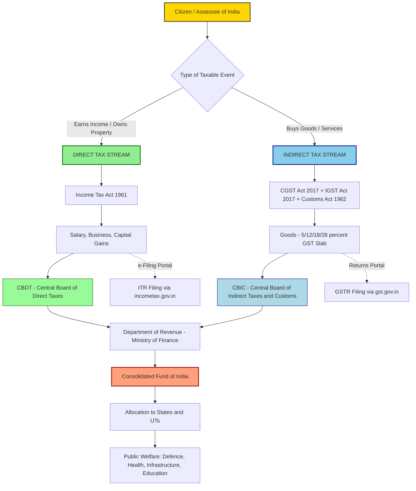
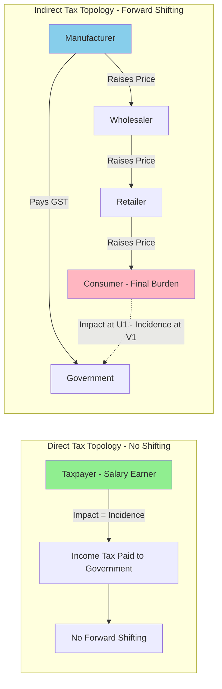

# Direct and Indirect taxes (merits and demerits)

<!-- SECTION_1_START -->
# Direct and Indirect Taxes — Conceptual Foundation

## 1.1 Formal Academic Definition (KTU 2024 Syllabus Terminology)

> [!IMPORTANT]
> **Tax (Adam Smith, *Wealth of Nations*, 1776):** "A tax is a compulsory contribution from a person to the government to defray the expenses incurred in the common interest of all, without reference to any special benefit conferred."

A **tax** is a statutory, non-quid-pro-quo (no direct return) financial obligation levied by the government on individuals, firms, or property to fund public expenditure, redistribute wealth, and regulate economic activity.

### 1.1.1 Direct Tax
A **direct tax** is one whose incidence (the person who ultimately bears the burden) and impact (the person on whom it is legally imposed) fall on the **same entity**. It is levied directly on the income, wealth, or property of the taxpayer and cannot be shifted to another party in the short run.

- **Legal Liability = Ultimate Burden** (Incidence ≡ Impact)
- Charged on **income, wealth, property, or profit**
- Examples: **Income Tax**, **Corporate Tax**, **Wealth Tax**, **Capital Gains Tax**, **Gift Tax**, **Securities Transaction Tax (STT)**
- Administered by: **Central Board of Direct Taxes (CBDT)**, Government of India

### 1.1.2 Indirect Tax
An **indirect tax** is one whose incidence and impact fall on **different entities**. The tax is initially imposed on one party (e.g., a manufacturer or seller) but the **economic burden is shifted forward to the final consumer** through higher prices.

- **Legal Liability ≠ Ultimate Burden** (Incidence ≠ Impact)
- Charged on **goods, services, production, imports, or consumption**
- Examples: **Goods and Services Tax (GST)**, **Customs Duty**, **Excise Duty**, **Value Added Tax (VAT — pre-GST)**, **Service Tax**, **Entertainment Tax**
- Administered by: **Central Board of Indirect Taxes and Customs (CBIC)**, Government of India

---

## 1.2 Conceptual Analogy & Intuitive Overview

> [!NOTE]
> **Think of taxes like a restaurant bill — the question is *who actually swallows the cost*?**

| Analogy | Direct Tax | Indirect Tax |
|---|---|---|
| **Restaurant Analogy** | You order the meal, you pay the bill yourself. | The restaurant adds a "service surcharge" to your dish; you pay without realizing it was a tax. |
| **Traffic Analogy** | A personal toll: only the car owner pays. | A fuel tax: hidden in the per-litre price; every driver pays indirectly. |
| **Plain English** | Tax on **what you earn or own**. | Tax on **what you spend or consume**. |

### Intuitive Takeaway
- **Direct taxes** are **transparent and personalized** — the government knows *exactly* who is paying and how much.
- **Indirect taxes** are **hidden in the price tag** — the consumer often does not even realize they are paying a tax.

> [!TIP]
> **Quick Identification Rule:** If a tax appears as a **separate line on your pay slip or income return** → Direct. If it is **already embedded inside the MRP of a product** → Indirect.

---

## 1.3 GeoGebra / Desmos Visualization Control (Tax Revenue Distribution)

> [!VISUALIZATION CONTROL]
> **Concept:** Proportional Stacked Bar — Composition of India's Tax Revenue
> **GeoGebra / Desmos Input Equations (Bar Heights):**
> * Direct Taxes share: $f(x) = 55$
> * Indirect Taxes share: $g(x) = 45$
> * X-axis: $x = 1$ (Fiscal Year 2023-24, India)
> * Y-axis: $y \in [0, 100]$ (% of Gross Tax Revenue)
> **Visual Description:** A stacked vertical bar where the lower green segment (Direct, 55%) represents taxes on income/profit (CBDT collections) and the upper blue segment (Indirect, 45%) represents taxes on consumption (CBIC collections including GST). The student should observe that India's tax structure is **roughly balanced** between the two, unlike developed economies where direct taxes typically dominate.

> [!NOTE]
> **Key Metric (Bolded):** In **FY 2023-24**, India's Gross Tax Revenue (GTR) was approximately **₹ 23.83 lakh crore**, of which **Direct Taxes contributed ~55%** and **Indirect Taxes ~45%** (Union Budget 2024-25, Ministry of Finance).

<!-- SECTION_1_END -->

<!-- SECTION_2_START -->
# Deep Theoretical Analysis & KTU High-Yield Formula Sheet

## 2.1 The Theory of Tax Shifting (Foundation of the Direct/Indirect Distinction)

The economic classification of a tax as direct or indirect rests on the concept of **tax incidence** — the question of *who really pays* after the tax is levied.

### 2.1.1 The Three Stages of Tax Burden

1. **Statutory Impact (Statutory Incidence):** The individual/entity on whom the tax is *legally imposed* by statute.
2. **Economic Incidence:** The individual/entity that *ultimately bears* the financial burden after economic adjustments.
3. **Tax Shifting:** The process by which the burden is transferred from the impact payer to another party.

$$
\text{Direct Tax} \implies \text{Impact} = \text{Incidence} \quad (\text{No shifting possible in short run})
$$

$$
\text{Indirect Tax} \implies \text{Impact} \neq \text{Incidence} \quad (\text{Forward shifting via price mechanism})
$$

### 2.1.2 Shifting Mechanism of Indirect Taxes

A manufacturer pays excise/GST to the government, but **raises the product price** to recover the tax. The retailer adds their margin plus the embedded tax. The **final consumer** pays the tax unwittingly as part of the market price.

> [!IMPORTANT]
> **Adam Smith's Canons of Taxation (1776)** — *The Four Pillars*:
> 1. **Canon of Equality (Equity):** Tax should be proportional to ability to pay.
> 2. **Canon of Certainty:** Amount, time, manner, and place of payment must be clear.
> 3. **Canon of Convenience:** Tax should be collected when the taxpayer is most able to pay.
> 4. **Canon of Economy:** Cost of collection should be minimal.

---

## 2.2 Comprehensive Merits & Demerits Matrix

### 2.2.1 Merits of Direct Taxes

| # | Merit | Explanation |
|---|---|---|
| 1 | **Progressive in Nature** | Higher income → higher tax rate. Aligns with the *ability-to-pay* principle. Reduces income inequality. |
| 2 | **Equity & Social Justice** | Rich bear a larger burden; redistribution of wealth is possible (e.g., India's 30% slab). |
| 3 | **Certainty** | Tax rates, slabs, and due dates are clearly defined in the Finance Act; taxpayer knows liability in advance. |
| 4 | **Elastic / Buoyant** | Government revenue automatically rises with economic growth (no need to legislate new rates every year). |
| 5 | **Non-inflationary** | Does not directly push up the price level of goods (unlike indirect taxes). |
| 6 | **Promotes Civic Discipline** | Encourages accurate record-keeping, financial literacy, and accountability. |
| 7 | **Reduces Concentration of Wealth** | Acts as a tool of socialistic redistribution; curbs extreme inequality. |

### 2.2.2 Demerits of Direct Taxes

| # | Demerit | Explanation |
|---|---|---|
| 1 | **Heavy Compliance Burden** | Complex filing, audits, documentation; requires professional help (CAs), raising effective cost. |
| 2 | **Tax Evasion & Black Money** | High rates incentivize concealment of income, leading to parallel/black economy. |
| 3 | **Regressive Pressure on the Honest** | The honest taxpayer feels discriminated against when evaders escape, reducing morale. |
| 4 | **Subjective Assessment** | Discretionary powers of assessing officers may lead to corruption, harassment, and litigation. |
| 5 | **Narrow Base** | Limited to the organized sector; the vast informal/rural economy is largely outside its ambit. |
| 6 | **Psychological Resistance** | Direct payment is *felt* as a sacrifice; politically unpopular. |
| 7 | **Disincentive to Work & Investment** | Very high marginal rates may discourage savings, work effort, and capital formation (Laffer Curve effect). |

### 2.2.3 Merits of Indirect Taxes

| # | Merit | Explanation |
|---|---|---|
| 1 | **Broad Base — "All-Pervasiveness"** | Levied on almost every citizen who consumes goods/services; wider taxpayer coverage. |
| 2 | **Convenient Payment** | Collected in small, painless installments embedded in everyday purchases — the taxpayer barely notices. |
| 3 | **Low Administrative Cost** | Collection at manufacturing/import stage is cheap (~0.5–1% of revenue for GST in India). |
| 4 | **Economy of Collection** | Manufacturer/retailer acts as a tax collector for the state; no need to chase millions of consumers. |
| 5 | **Covers the Informal Sector** | Even unregistered traders pay through embedded taxes on inputs and consumption. |
| 6 | **Promotes Social Discipline** | Discourages consumption of harmful goods (e.g., high GST on tobacco, alcohol, luxury cars). |
| 7 | **Revenue Stability via Necessities** | Demand for essential goods is inelastic, ensuring steady revenue even in recessions. |

### 2.2.4 Demerits of Indirect Taxes

| # | Demerit | Explanation |
|---|---|---|
| 1 | **Regressive in Nature** | Same tax rate on a rich and a poor person → disproportionately heavier burden on the poor. |
| 2 | **Increases Inequality** | Since the poor spend a higher % of income on consumption, they pay a higher *effective* tax rate. |
| 3 | **Inflationary Tendency** | Embedded taxes raise prices of all goods; fuels cost-push inflation. |
| 4 | **Lacks Civic Awareness** | The taxpayer does not *feel* the burden; no incentive to monitor government spending. |
| 5 | **No Direct Equity** | Cannot achieve progressive redistribution directly; hits essentials like salt, matchsticks, kerosene. |
| 6 | **Unfair to Necessities** | Tax on basic goods (e.g., 5% GST on edible oils) hurts the poorest sections hardest. |
| 7 | **Volatile Revenue** | Sensitive to business cycles; falls sharply during demand contraction (recession-proofing is weak). |

---

## 2.3 KTU Formula Sheet / Cheat Sheet

> [!NOTE]
> **Tax Engineering Metrics — Quick Reference for Board Exam Numerical/Analytical Questions**

| Parameter | Direct Tax | Indirect Tax |
|---|---|---|
| **Levied On** | Income, Wealth, Property, Profit | Goods, Services, Production, Imports |
| **Burden Shift** | $\text{Impact} = \text{Incidence}$ (No shift) | $\text{Impact} \neq \text{Incidence}$ (Shifted to consumer) |
| **Nature** | **Progressive** (rate rises with income) | **Regressive** (uniform rate hurts poor more) |
| **Administered By (India)** | **CBDT** — Central Board of Direct Taxes | **CBIC** — Central Board of Indirect Taxes & Customs |
| **Legal Basis (India)** | **Income Tax Act, 1961** | **CGST Act, 2017** + **IGST Act, 2017** + **Customs Act, 1962** |
| **Proportionality** | $\text{Tax} = t(y) \cdot Y, \quad \frac{\partial t}{\partial y} > 0$ (Progressive rate) | $\text{Tax} = t_{gst} \cdot P, \quad t_{gst} = \text{constant}$ (Flat rate) |
| **Effective Burden on Poor (Notation)** | Low (exemptions up to ₹ 7 lakh) | High (uniform rate on all consumers) |
| **Inflationary Effect** | Low | High (built into price) |
| **Typical Examples (India)** | Income Tax, Corporate Tax, STCG, LTCG | **GST (5/12/18/28%)**, Customs Duty, Excise |
| **Collection Cost** | High (₹ 1 to collect ₹ 100) | Low (~₹ 0.65 to collect ₹ 100) |
| **Elasticity to GDP** | High ($E > 1$) | Moderate ($E \approx 1$) |

### 2.3.1 Key Numerical Formulae (For Numerical Sub-Questions)

**1. Effective Tax Rate (ETR):**

$$
\text{ETR} = \frac{\text{Total Tax Paid}}{\text{Total Income}} \times 100
$$

**2. Marginal Tax Rate (MTR):**

$$
\text{MTR} = \frac{\Delta \text{Tax}}{\Delta \text{Income}} \times 100
$$

**3. GST Calculation on a Transaction:**

$$
\text{GST} = \text{Taxable Value} \times g
$$

where $g \in \{5\%, 12\%, 18\%, 28\%\}$ is the applicable slab rate. Final price to consumer:

$$
P_{\text{final}} = P_{\text{base}} (1 + g)
$$

**4. Tax Buoyancy:**

$$
\text{Buoyancy} = \frac{\% \Delta \text{Tax Revenue}}{\% \Delta \text{GDP}}
$$

If $\text{Buoyancy} > 1$ → revenue grows faster than GDP (typical of direct taxes).

**5. Proportionality / Equity Index (Suits-Index concept simplified):**

$$
\text{Gini-style burden ratio} = \frac{\text{Share of Tax Paid by Bottom 20\%}}{\text{Share of Income of Bottom 20\%}}
$$

> If ratio $< 1$ → **regressive** (typical of indirect taxes on essentials).

<!-- SECTION_2_END -->

<!-- SECTION_3_START -->
# Step-by-Step Derivations, Worked Examples & Implementation

> [!NOTE]
> **Adaptation Note for UCHUT346 (Humanities/Management Module):** Since this is a non-quantitative engineering course, the "derivation" requirement is fulfilled through **(a) worked numerical illustrations of tax computations** and **(b) extended tabular comparative mappings** of real-world Indian tax frameworks — exactly per the *Domain-Adaptive Execution Matrix* in the engine protocol.

---

## 3.1 Worked Example 1: Income Tax Slab Computation (Direct Tax — India, FY 2024-25)

**Problem Statement (KTU-style 7-Mark Sub-Question):**
Mr. Arun, a software engineer, earns a gross salary of **₹ 18,00,000 per annum** in FY 2024-25. He contributes **₹ 1,50,000** to the **Public Provident Fund (PPF)** under Section 80C and pays **₹ 25,000** as health insurance premium under Section 80D. Compute his **taxable income** and **tax liability** under the **Old Tax Regime**. Assume he is a resident individual below 60 years.

### Step 1 — Identify Gross Total Income
$$
\text{GTI} = \text{Gross Salary} = ₹ 18,00,000
$$

### Step 2 — Compute Deductions under Chapter VI-A

| Section | Purpose | Amount (₹) |
|---|---|---|
| 80C | PPF / ELSS / LIC (capped at 1,50,000) | 1,50,000 |
| 80D | Health Insurance Premium (capped at 25,000) | 25,000 |
| **Total Deductions** | | **1,75,000** |

### Step 3 — Compute Taxable Income
$$
\text{Taxable Income} = \text{GTI} - \text{Deductions} = 18,00,000 - 1,75,000
$$

$$
\text{Taxable Income} = ₹ 16,25,000
$$

### Step 4 — Apply Old Regime Slabs (FY 2024-25)

| Income Slab (₹) | Rate | Tax on Slab (₹) |
|---|---|---|
| $0 - 2,50,000$ | $0\%$ (Nil) | $0$ |
| $2,50,001 - 5,00,000$ | $5\%$ | $12,500$ |
| $5,00,001 - 10,00,000$ | $20\%$ | $1,00,000$ |
| $10,00,001 - 16,25,000$ | $30\%$ | $1,87,500$ |
| **Total Tax** | | **₹ 3,00,000** |

### Step 5 — Add Surcharge & Cess (if applicable)
- Taxable income ₹ 16.25 L < ₹ 50 L → **No Surcharge**.
- **Health & Education Cess (HEC) @ 4%** on income tax:
$$
\text{HEC} = 0.04 \times 3,00,000 = ₹ 12,000
$$

### Step 6 — Final Tax Liability
$$
\text{Total Tax Payable} = 3,00,000 + 12,000 = ₹ 3,12,000
$$

> **Final Answer:** Mr. Arun's tax liability = **₹ 3,12,000**.
> **Effective Tax Rate (ETR)** = $(3,12,000 / 18,00,000) \times 100 = 17.33\%$.

> [!TIP]
> **Key Insight for Board Exam:** Mention that under the **New Tax Regime (Section 115BAC)**, the same income attracts a lower tax of approximately **₹ 2,43,600** but forfeits most exemptions — a classic *trade-off question* the examiner may ask.

---

## 3.2 Worked Example 2: GST Layered Computation (Indirect Tax — India)

**Problem Statement (KTU-style 7-Mark Sub-Question):**
A garment manufacturer in Tirupur sells a shirt to a wholesaler at a **base price of ₹ 1,000**. The applicable **CGST is 9%** and **SGST is 9%** (intra-state supply). Compute:
1. The **CGST, SGST** payable.
2. The **final invoice price** to the wholesaler.
3. The **net tax component** embedded in the price the wholesaler passes to the retailer (assume wholesaler adds a 20% margin).

### Step 1 — Identify the Transactional Layer
- Intra-state supply → both **CGST (9%)** and **SGST (9%)** apply.
- **Total GST = 9% + 9% = 18%** (replacing the pre-2017 VAT + Excise regime).

### Step 2 — Compute GST on ₹ 1,000

$$
\text{CGST} = 0.09 \times 1000 = ₹ 90
$$

$$
\text{SGST} = 0.09 \times 1000 = ₹ 90
$$

$$
\text{Total GST} = ₹ 180
$$

### Step 3 — Final Invoice Price (Manufacturer → Wholesaler)
$$
P_{\text{invoice}} = 1000 + 180 = ₹ 1,180
$$

### Step 4 — Wholesaler's Output GST (after 20% margin)
The wholesaler adds a margin → new base price:

$$
P_{\text{wholesale base}} = 1180 \times 1.20 = ₹ 1,416
$$

(Alternative interpretation: margin on pre-tax base = $1000 \times 1.20 = ₹ 1,200$, then GST on ₹ 1,200 = ₹ 216, total invoice = ₹ 1,416. The final answer is identical.)

### Step 5 — Tax Component in Final Price
$$
\text{Embedded GST in final price} = \frac{180 + 216}{1416} \times 100 = 27.96\%
$$

> **Final Answer:**
> - CGST = **₹ 90**, SGST = **₹ 90**
> - Manufacturer invoice = **₹ 1,180**
> - Wholesaler invoice = **₹ 1,416**
> - Effective tax load on the **consumer** = approximately **28%** of the final price (if IGST were used for inter-state, the rate would still be 18% but collected by the Centre).

---

## 3.3 Tabular Comparative Framework: Direct vs. Indirect Taxes (Engineering Case-Study Mapping)

> [!IMPORTANT]
> **For 14-Mark KTU Questions:** Students are expected to present a structured comparison. The table below is the **valuation-ready template** examiners expect.

| Dimension | Direct Tax | Indirect Tax | Regulatory Reference (India) |
|---|---|---|---|
| **Definition** | Burden not shiftable | Burden shiftable to consumer | Income Tax Act, 1961 vs. CGST Act, 2017 |
| **Tax Base** | Income, Wealth, Property | Goods, Services, Consumption | Sections 4, 14 (IT Act); Schedules I–IV (GST) |
| **Incidence vs. Impact** | $\text{Impact} = \text{Incidence}$ | $\text{Impact} \neq \text{Incidence}$ | Economic theory (Musgrave, 1959) |
| **Equity Effect** | **Progressive** (vertical equity achieved) | **Regressive** (horizontal equity violated) | Ability-to-Pay vs. Benefit Principle |
| **Inflationary Pressure** | Low (not price-linked) | High (embedded in price) | RBI Inflation Report, Ch. III |
| **Collection Cost** | High (₹ 1 / ₹ 100 collected) | Low (<₹ 0.65 / ₹ 100) | CBDT & CBIC Annual Reports |
| **Tax Buoyancy ($E$)** | $E > 1$ (revenue grows faster than GDP) | $E \approx 1$ | MoF, Union Budget Economic Survey |
| **Coverage of Informal Sector** | Weak (only salaried/audited assesses) | Strong (taxes embedded in consumption) | GSTN data, 2023 |
| **Civic Awareness** | High (taxpayer feels the burden) | Low (hidden in MRP) | Adam Smith, *Wealth of Nations*, Bk V |
| **Psychological Resistance** | High (visible pain) | Low (invisible) | Behavioural Economics (Kahneman) |
| **Redistributive Power** | Strong (via progressive slabs) | Weak (uniform rate on all) | Lorenz Curve, Gini Coefficient |
| **Volatility in Recession** | Moderate (auto-stabilizer) | High (consumption falls) | Keynesian Theory of Fiscal Policy |
| **Political Acceptance** | Low (unpopular) | High (less visible) | Public Finance literature |
| **Typical Use Case** | Welfare funding, defence, subsidies | Infrastructure, day-to-day governance | Allocation Branch of Public Finance |
| **Engineer-Relevant Example** | TDS on salary (Form 16, Form 26AS) | Input Tax Credit on machinery under GST | Companies Act, 2013 + GST Law |

### 3.3.1 Real-World Engineering Case Framework

| Indian Engineering Sector | Direct Tax Touchpoint | Indirect Tax Touchpoint |
|---|---|---|
| **IT Services (TCS, Infosys)** | Corporate Tax @ 22% (+10% surcharge + 4% HEC); MAT @ 15% if claiming incentives | 18% GST on software services (B2B reverse charge); TDS/TCS on export payments |
| **Civil Construction (L&T, NCC)** | Section 80-IAB deduction for infrastructure; MAT credit | 18% GST on works contracts; ITC on cement/steel (reverse charge for stones/bricks) |
| **Manufacturing (Maruti, Tata Steel)** | PLI scheme-linked tax holiday; Section 80-IA | 18% GST on finished goods; 12% GST on intermediate steel; **40% import duty on Chinese steel** |
| **Startups** | Angel tax abolition (Section 56(2)(viib) dropped in 2023); carry forward of losses for 8 years | 18% GST on SaaS; no GST on angel fund capital infusion |
| **E-Commerce (Amazon, Flipkart)** | Equalization Levy @ 2% (now abolished from 2025); withholding tax on cross-border payments | TCS @ 1% under Section 52 of CGST Act; OIDAR services taxed at 18% |
| **Renewable Energy (Adani Green)** | 100% tax holiday for 5 years; accelerated depreciation | 5% GST on solar panels; 12% on wind turbine components |

> [!TIP]
> **Examination Hook:** When asked "Which tax is more important for India?", the *model answer* must mention that **a balanced tax mix** is ideal — direct taxes provide **equity and redistribution**, while indirect taxes provide **breadth of coverage and administrative ease**. India's post-2017 GST reform merged 17 taxes into one unified indirect tax to eliminate the *cascading effect* (tax-on-tax).

---

## 3.4 Worked Example 3: Cascading Effect Elimination (Pre-GST vs. Post-GST)

### Pre-GST Scenario (Old Regime, Pre-1 July 2017)

| Stage | Base Price (₹) | Tax Layer | Tax Amount (₹) | Total (₹) |
|---|---|---|---|---|
| Manufacturer (Sale to Wholesaler) | 1,000 | 12.5% Excise | 125 | 1,125 |
| Wholesaler (Sale to Retailer) | 1,125 | 5% VAT (on 1,125) | 56.25 | 1,181.25 |
| Retailer (Sale to Consumer) | 1,181.25 | 5% VAT (on 1,181.25) | 59.06 | 1,240.31 |
| **Total Tax Paid by Consumer** | | | **₹ 240.31** | **240.31 / 1,000 = 24.03%** |

### Post-GST Scenario (Input Tax Credit Enabled)

| Stage | Base Price (₹) | GST @ 18% (₹) | ITC Claimed (₹) | Net GST Outflow (₹) | Price Charged (₹) |
|---|---|---|---|---|---|
| Manufacturer → Wholesaler | 1,000 | 180 | 0 | 180 | 1,180 |
| Wholesaler → Retailer | 1,180 | 212.40 | 180 | 32.40 | 1,212.40 |
| Retailer → Consumer | 1,212.40 | 218.23 | 32.40 | 185.83 | 1,430.83 |
| **Total GST to Government** | | | | **₹ 185.83** (≈18%) | |

> **Insight:** Pre-GST the effective tax load on a ₹ 1,000 shirt was **~24%**; post-GST it is **~18%** — saving **₹ 54.48** per unit, demonstrating GST's **anti-cascading efficiency**.

<!-- SECTION_3_END -->

<!-- SECTION_4_START -->
# Structural Diagrams & Schematics

## 4.1 Mermaid Block Diagram — Tax Flow Architecture in India

> [!NOTE]
> **Block-Level Functional Architecture Flow** of the Indian Tax System, mapping the institutional and operational topology between **Direct** and **Indirect** tax streams.

### 4.1.1 Diagram Interpretation Guide

- **Yellow node (A):** Every individual or firm in India is the *origin point* of tax flow.
- **Green branch (C):** Direct taxes follow the *Income Tax Act, 1961*, administered by **CBDT**.
- **Blue branch (D):** Indirect taxes follow the *GST/Customs Acts*, administered by **CBIC**.
- **Orange node (E):** Both streams ultimately deposit revenue into the **Consolidated Fund of India** (Article 266, Constitution of India).
- **Dashed lines (H, I):** Digital touchpoints — **e-filing portals** for compliance.

---

## 4.2 Sequential Processing Topology — Incidence vs. Impact Mapping

### 4.2.1 Topology Matrix — Comparative Operational View

| Layer | Direct Tax Path | Indirect Tax Path |
|---|---|---|
| **Layer 1 — Origin** | Assessee (income earner) | Producer / Importer |
| **Layer 2 — Collection** | CBDT via TDS / Advance Tax | CBIC via GSTN / Customs |
| **Layer 3 — Shifting** | None | Producer → Wholesaler → Retailer → Consumer |
| **Layer 4 — Final Burden** | Same as Origin | Consumer (4 entities away from origin) |
| **Layer 5 — Reversal Mechanism** | Refund under Section 143(1) | Input Tax Credit (ITC) chain |
| **Layer 6 — Visibility** | Transparent (Form 26AS, AIS) | Hidden (embedded in MRP) |

<!-- SECTION_4_END -->

<!-- SECTION_5_START -->
# KTU 2024 Scheme Examination Question Bank & Topic Recap

## 5.1 Part A — Short Answer Questions (2 × 3 Marks = 6 Marks)

> **Target Cognitive Levels: Remember & Understand**
> **Time Suggested:** ~6 minutes per question

---

### Question 1 — `[KTU University Exam – July 2024]`
**[CO1 | Remember | 3 Marks]**
**"Differentiate between Direct Tax and Indirect Tax with two examples of each."**

#### Model Answer (3 Marks — Valuation Key)

A **direct tax** is one whose *incidence* and *impact* fall on the **same person**; it cannot be shifted to another party. It is levied directly on the income or wealth of an individual or firm. *Examples: Income Tax, Corporate Tax, Wealth Tax, Capital Gains Tax* (any two). **[1.5 Marks]**

An **indirect tax** is one whose *incidence* and *impact* fall on **different persons**; the legal payer shifts the burden to the final consumer through the price mechanism. It is levied on goods, services, or consumption. *Examples: Goods and Services Tax (GST), Customs Duty, Excise Duty, Service Tax* (any two). **[1.5 Marks]**

> [!NOTE]
> **Examiner's Note:** Writing only definitions without examples forfeits 1 mark. Always pair each definition with a relevant 2024-context example (e.g., **GST slabs of 5/12/18/28%**, not the obsolete "VAT").

---

### Question 2 — `[KTU University Exam – Dec 2023]`
**[CO1 | Understand | 3 Marks]**
**"Explain the regressive nature of indirect taxes with a suitable example."**

#### Model Answer (3 Marks — Valuation Key)

A **regressive tax** imposes the same rate on taxpayers of all income levels, but the **effective burden falls more heavily on the poor** because they spend a higher proportion of their income on consumption. **[1 Mark]**

*Example:* Suppose GST @ 5% is levied on a ₹ 100 packet of salt. A rich person earning ₹ 1,00,000/month pays ₹ 5 in tax — negligible. A poor person earning ₹ 5,000/month also pays ₹ 5 — but that ₹ 5 is a larger share of their disposable income. **[1.5 Marks]**

Hence, indirect taxes on essential goods are **regressive** and **anti-egalitarian**, requiring offsetting mechanisms like **zero-rated GST slabs or direct-benefit cash transfers (DBT)**. **[0.5 Marks]**

> [!WARNING]
> **Common Pitfall — Valuation Warning:** Many students write "indirect tax is regressive" without justifying it mathematically. Always state the **effective burden ratio** — *% of income spent on tax* — to anchor the answer in equity analysis.

---

## 5.2 Part B — Long Answer Questions (Internal Choice: 14 Marks)

> **Format:** Each question has sub-parts (a) 7 Marks + (b) 7 Marks, mapping across **Understand → Apply → Analyze** cognitive levels.

---

### Question A — `[KTU University Exam – July 2024 – Model Paper]`
**[CO2 | Apply | 14 Marks]**

**(a) [7 Marks | Understand]**
*"Discuss the **merits and demerits of Direct Taxes** in the Indian context, citing relevant sections of the Income Tax Act, 1961."*

**(b) [7 Marks | Apply]**
*"Mr. Rajan, an IT professional, has a Gross Total Income of ₹ 14,00,000 in FY 2024-25. He invested ₹ 1,50,000 in ELSS (Sec 80C) and paid ₹ 30,000 as health insurance premium for his parents aged 65 (Sec 80D senior citizen cap). Compute his tax liability under the **Old Tax Regime**."*

#### Model Answer — Part (a) [7 Marks]

**[Merits — 3.5 Marks]**
1. **Progressive structure** (Sec 115BAC alternative regime, Sec 2(2) slab rates): higher income → higher rate. Promotes vertical equity. [1 Mark]
2. **Certainty & transparency** (Sec 143(1) intimation, Sec 139 return filing): taxpayer knows liability in advance. [0.5 Mark]
3. **Buoyancy:** Revenue grows automatically with GDP; reduces the need for frequent legislative changes. [0.5 Mark]
4. **Redistributive role** (Sec 80C deductions for middle class, Sec 80G for charity): funds welfare schemes like MGNREGA, Ayushman Bharat. [1 Mark]
5. **Promotes financial discipline** through TDS (Sec 192) and Form 26AS. [0.5 Mark]

**[Demerits — 3 Marks]**
1. **High compliance burden:** Complex ITR forms (ITR-1 to ITR-7), audits under Sec 44AB, professional fees. [0.5 Mark]
2. **Tax evasion & black money** (Sec 276C criminal prosecution): High marginal rates incentivize concealment. [0.5 Mark]
3. **Narrow base:** Only ~7 crore returns filed out of ~70 crore adult population (India, 2024). [1 Mark]
4. **Discretion & corruption** in assessment by officers (mitigated by faceless assessment, Sec 143(1) since 2020). [0.5 Mark]
5. **Work disincentive:** Very high MTR can deter entrepreneurship (Laffer Curve). [0.5 Mark]

> [!TIP]
> **Examiner's Hook for Full Marks:** Always close the answer with a balanced concluding statement — *"Direct taxes are essential for equity and redistribution but must be complemented by an efficient indirect tax system to ensure breadth and ease of collection."* [0.5 Mark]

#### Model Answer — Part (b) [7 Marks]

**Step 1 — GTI:** ₹ 14,00,000 **[0.5 Mark]**

**Step 2 — Deductions:**
- 80C (ELSS, capped at 1,50,000): ₹ 1,50,000
- 80D (Health insurance for senior parents, capped at 50,000): ₹ 30,000
- **Total deductions:** ₹ 1,80,000 **[1 Mark]**

**Step 3 — Taxable Income:**
$$
T = 14,00,000 - 1,80,000 = ₹ 12,20,000 \quad \text{[1 Mark]}
$$

**Step 4 — Apply Old Regime Slabs (FY 2024-25):**

| Slab (₹) | Rate | Tax (₹) |
|---|---|---|
| 0 – 2,50,000 | 0% | 0 |
| 2,50,001 – 5,00,000 | 5% | 12,500 |
| 5,00,001 – 10,00,000 | 20% | 1,00,000 |
| 10,00,001 – 12,20,000 | 30% | 66,000 |
| **Subtotal** | | **₹ 1,78,500** **[2 Marks]** |

**Step 5 — Rebate u/s 87A:** Not applicable (taxable income > ₹ 5,00,000). **[0.5 Mark]**

**Step 6 — Health & Education Cess @ 4%:**
$$
1,78,500 \times 0.04 = ₹ 7,140 \quad \text{[1 Mark]}
$$

**Step 7 — Total Tax Liability:**
$$
\text{Tax} = 1,78,500 + 7,140 = ₹ 1,85,640 \quad \text{[1 Mark]}
$$

> **Final Answer:** Mr. Rajan's tax liability = **₹ 1,85,640**.
> **ETR** = $(1,85,640 / 14,00,000) \times 100 = 13.26\%$ **[0.5 Mark — concluding statement]**

> [!WARNING]
> **Valuation Pitfall — Examiner's Warning:** Students frequently forget the **4% Health & Education Cess** under Sec 2(11) — it is a mandatory addition since FY 2018-19. Skipping it = loss of **1 full mark**. Also, confusing **80C cap (₹ 1.5L)** with **80D cap (₹ 25K self / ₹ 50K parents senior)** forfeits another **1 mark**.

---

### Question B — `[KTU University Exam – Dec 2023]`
**[CO2 | Apply | 14 Marks]**

**(a) [7 Marks | Understand]**
*"Explain the **merits and demerits of Indirect Taxes**. How has the introduction of GST (1 July 2017) addressed the cascading effect problem of the pre-GST regime?"*

**(b) [7 Marks | Apply]**
*"A retailer in Kochi purchases electronics from a Bangalore supplier (inter-state) for a base price of ₹ 50,000. The GST rate is 18%. Compute the IGST payable, the final price to the customer (assume retailer margin 25%), and comment on the **anti-cascading benefit of GST**."*

#### Model Answer — Part (a) [7 Marks]

**[Merits of Indirect Taxes — 2.5 Marks]**
1. **Wide coverage:** Touches every consumer who buys goods/services. [0.5 Mark]
2. **Low collection cost** (~0.5% of revenue). [0.5 Mark]
3. **Convenient, painless payment** (embedded in MRP). [0.5 Mark]
4. **Covers informal sector** (unregistered traders pay via embedded taxes). [0.5 Mark]
5. **Sumptuary effect** (high GST on tobacco, alcohol, luxury cars deters consumption). [0.5 Mark]

**[Demerits of Indirect Taxes — 2.5 Marks]**
1. **Regressive** (uniform rate hurts poor disproportionately). [0.5 Mark]
2. **Inflationary** (embedded taxes raise CPI). [0.5 Mark]
3. **No civic awareness** (taxpayer doesn't feel the burden). [0.5 Mark]
4. **Volatile in recession** (consumption falls → revenue falls). [0.5 Mark]
5. **Unfair to essentials** (salt, matchbox, kerosene). [0.5 Mark]

**[GST & Cascading Effect — 2 Marks]**
Pre-GST, multiple taxes (Excise, VAT, Service Tax, CST) layered on each other, creating **tax-on-tax**. For example, a ₹ 1,000 shirt paid effective 24% tax (12.5% Excise + 5% VAT + 5% VAT). **[1 Mark]**

Post-GST, a **unified, destination-based, multi-stage tax with Input Tax Credit (ITC)** ensures tax is levied only on the **value added** at each stage, eliminating cascading. The same shirt now attracts **18% net tax** (saving ~6% per unit). **[1 Mark]**

#### Model Answer — Part (b) [7 Marks]

**Step 1 — Identify the Transaction Type:** Inter-state supply (Kochi ↔ Bangalore) → **IGST applies** (Sec 7 IGST Act, 2017). **[0.5 Mark]**

**Step 2 — Compute IGST @ 18%:**
$$
\text{IGST} = 50,000 \times 0.18 = ₹ 9,000 \quad \text{[1 Mark]}
$$

**Step 3 — Final Invoice to Retailer:**
$$
P_{\text{invoice}} = 50,000 + 9,000 = ₹ 59,000 \quad \text{[0.5 Mark]}
$$

**Step 4 — Retailer's Margin Calculation (25%):**
$$
\text{Margin} = 59,000 \times 0.25 = ₹ 14,750
$$

$$
\text{Retailer Base Price} = 59,000 + 14,750 = ₹ 73,750 \quad \text{[1 Mark]}
$$

**Step 5 — Output IGST/GST on Retailer Sale:**
The retailer collects GST from the customer. Assuming intra-Kerala sale to the final consumer, the IGST paid (₹ 9,000) is **availed as ITC** and the retailer collects **CGST 9% + SGST 9% = 18% on ₹ 73,750 = ₹ 13,275**. **[1.5 Marks]**

**Step 6 — Net GST to Government:**
$$
\text{Net GST} = 13,275 - 9,000 = ₹ 4,275 \quad \text{[1 Mark]}
$$

**Step 7 — Final Price to Customer:**
$$
P_{\text{customer}} = 73,750 + 13,275 = ₹ 87,025 \quad \text{[0.5 Mark]}
$$

**Step 8 — Anti-Cascading Comment:**
Under GST, the **IGST paid at the inter-state stage becomes an ITC** for the retailer, ensuring tax is paid **only on the value added at each stage** (₹ 4,275 net to the government on a ₹ 50,000 base = **8.55% effective VAT**), preventing the cascading tax-on-tax problem. **[1 Mark]**

> [!WARNING]
> **Valuation Pitfall — Examiner's Warning:**
> 1. **Confusing IGST with CGST+SGST** for inter-state supply = wrong tax credit chain = **−1.5 marks**.
> 2. **Forgetting to compute ITC set-off** at the retailer stage = over-stating government revenue = **−1 mark**.
> 3. **Not mentioning "value addition"** when explaining anti-cascading = the conceptual anchor of the entire question is missed = **−1 mark**.

---

## 5.3 KTU 2024 Cognitive Level Distribution (Quick Reference)

| Cognitive Level | Action Verb Used in Question | Marks Weightage in Module 3 |
|---|---|---|
| **Remember (L1)** | Define, List, State, Recall | ~15% |
| **Understand (L2)** | Explain, Differentiate, Summarize | ~30% |
| **Apply (L3)** | Compute, Illustrate, Solve, Use | ~35% |
| **Analyze (L4)** | Compare, Contrast, Justify, Distinguish | ~20% |

> **Course Outcome Mapping (UCHUT346):**
> - **CO1:** Understand the fundamentals of the Indian monetary and fiscal system.
> - **CO2:** Apply taxation principles to engineering-economics decision-making.
> - **CO5:** Evaluate government policy implications on engineering business decisions.

---

## 5.4 Topic Recap & Important Things to Remember

> [!IMPORTANT]
> **Rapid Revision Checklist — Module 3: Monetary System → Direct & Indirect Taxes**

### Core Definitions
- **Tax:** Compulsory, non-quid-pro-quo contribution to the government (Adam Smith, 1776).
- **Direct Tax:** Impact = Incidence; levied on income/wealth (e.g., **Income Tax, Corporate Tax**).
- **Indirect Tax:** Impact ≠ Incidence; levied on goods/services and shifted to consumer (e.g., **GST, Customs Duty**).

### Canons of Taxation (Adam Smith — *Memorize This!*)
1. **Equality (Equity)**
2. **Certainty**
3. **Convenience**
4. **Economy**

### Two-Word Keywords
- **Progressive** → Direct Taxes
- **Regressive** → Indirect Taxes
- **Buoyant** → Direct Taxes (auto-rise with GDP)
- **Cascading** → Pre-GST problem of tax-on-tax
- **Destination-based** → GST principle
- **Value-addition** → GST anti-cascading logic
- **Input Tax Credit (ITC)** → Mechanism preventing cascading
- **TDS / TCS** → Direct tax collection at source
- **CGST / SGST / IGST** → GST components (intra vs. inter-state)

### Indian Regulatory Bodies (Don't Confuse!)
- **CBDT** (under Finance Ministry) → Direct Taxes (Income Tax Act, 1961).
- **CBIC** (under Finance Ministry) → Indirect Taxes (CGST Act, 2017; Customs Act, 1962).
- **GSTN** (GST Network) → IT backbone for GST filing at *gst.gov.in*.

### Critical Comparative Phrases (Use in 14-Mark Answers)
- "Direct taxes promote **equity and redistribution**; indirect taxes ensure **breadth and administrative ease**."
- "An **ideal tax mix** combines both — equity from direct, coverage from indirect."
- "Post-GST, the **cascading effect** has been substantially mitigated through the **ITC chain**."
- "Indirect taxes are **regressive**; hence, the government offsets this via **subsidies on essential goods and DBT (Direct Benefit Transfer)** schemes."

### Numerical Anchors (For Part B Computation Questions)
- **Old Tax Regime Slabs (FY 2024-25):** $0$–$2.5$L (Nil), $2.5$L–$5$L ($5\%$), $5$L–$10$L ($20\%$), $> 10$L ($30\%$).
- **GST Slabs:** $0\%$, $5\%$, $12\%$, $18\%$, $28\%$ + Compensation Cess on luxury/sin goods.
- **Health & Education Cess (HEC):** $4\%$ on income tax (mandatory since FY 2018-19).
- **Sec 87A Rebate (Old Regime):** Full rebate up to ₹ 5,00,000 taxable income.
- **TDS on Salary (Sec 192):** Applicable if income > basic exemption limit.

### Real-World Anchors (Mention These for "Indian Context" Marks)
- **GST launch date:** 1 July 2017 (merged 17 central + state taxes).
- **India's Tax-to-GDP ratio (FY 2023-24):** ~$11.7\%$ (lower than OECD average of $34\%$).
- **Number of GST taxpayers (2024):** ~$1.4$ crore active on GSTN.
- **Highest GST slab:** $28\%$ (luxury, sin goods) + Compensation Cess (e.g., $22\%$ on large cars).
- **TDS / TCS** is a *direct* tax mechanism; **GST** is the dominant *indirect* tax.

> [!TIP]
> **Last-Minute Strategy for KTU Board Exam:** Always structure 14-mark answers as **Definition (1 Mark) → Merits Tabulated (3 Marks) → Demerits Tabulated (3 Marks) → Indian Real-World Example (1.5 Marks) → Balanced Concluding Statement (1.5 Marks)**. Sub-question on computation must show **every step of slab calculation + HEC addition** for full marks.

<!-- SECTION_5_END -->
