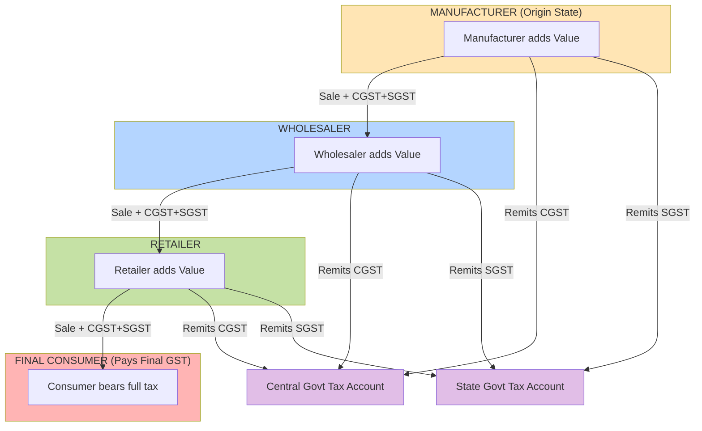
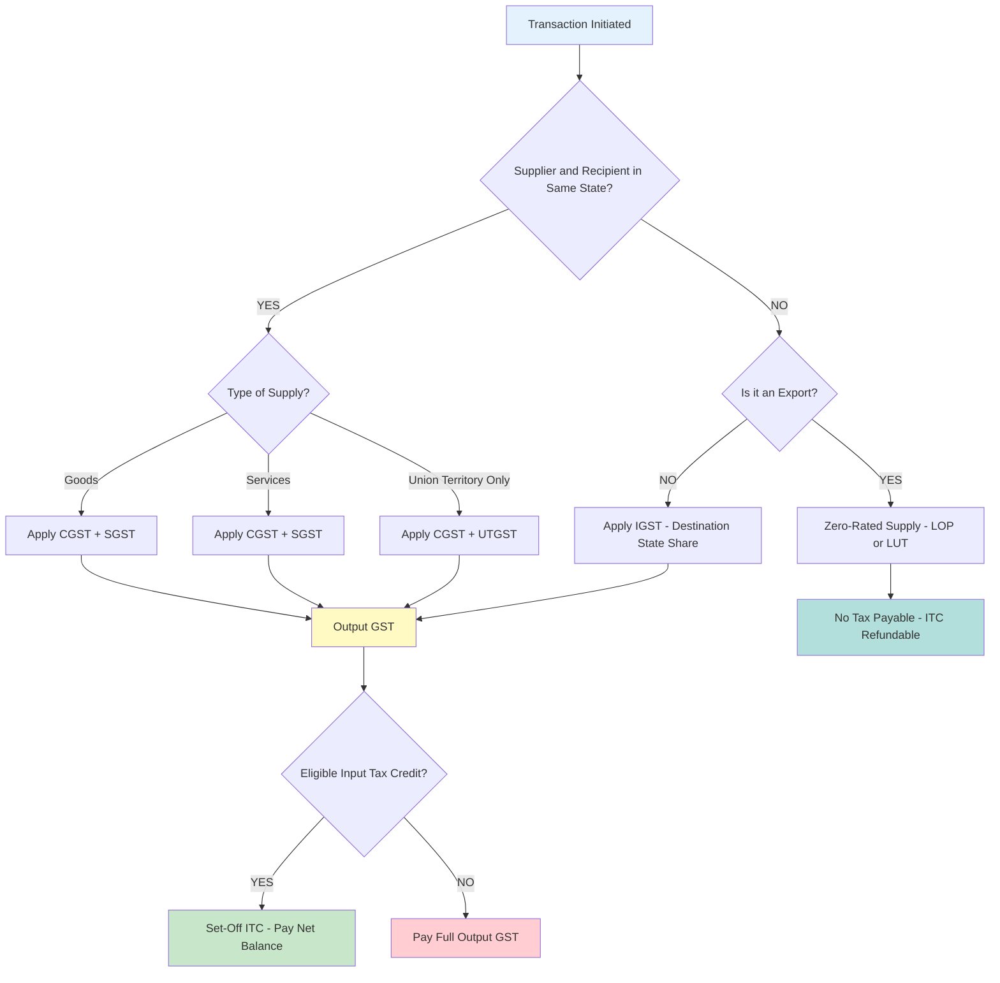
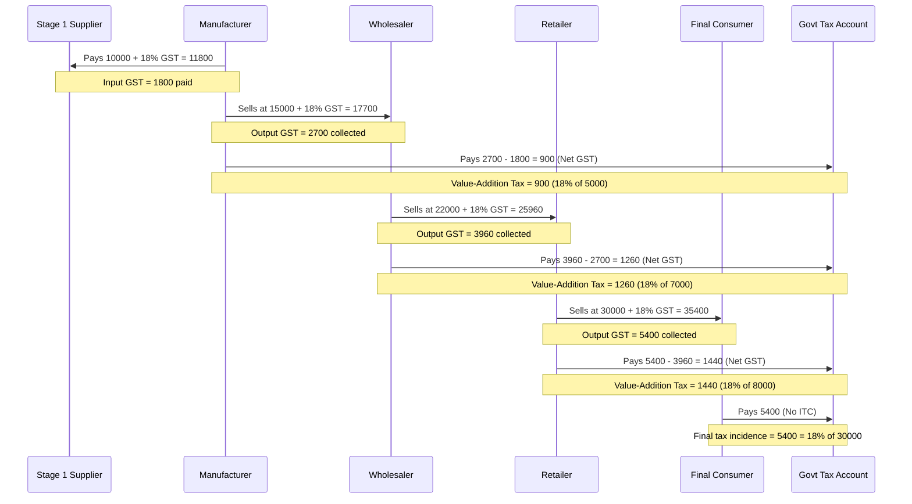
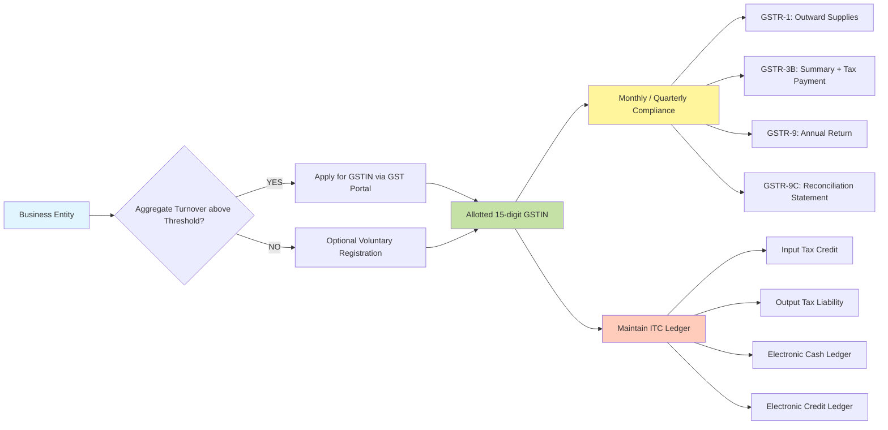
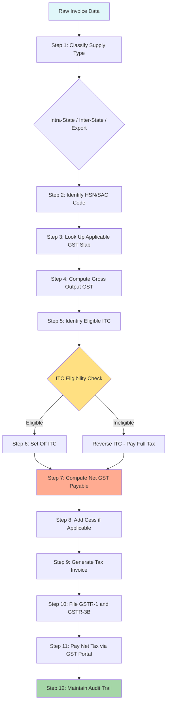

# GST

<!-- SECTION_1_START -->

# Goods and Services Tax (GST) — Core Definition & Intuitive Overview

## 1.1 Formal Academic Definition (KTU 2024 Syllabus Terminology)

**Goods and Services Tax (GST)** is a **comprehensive, multi-stage, destination-based indirect tax** levied on the **value addition** at every stage of the supply chain, with the full set-off benefit of taxes paid at earlier stages. It subsumed seventeen central and state indirect taxes in India, effective from **1st July 2017**, and is administered concurrently by the Central Government and the State Governments under a **dual GST model**.

> [!IMPORTANT]
> **KTU 2024 Highlight — UCHUT346 / Module 3 (Monetary System):**
> Engineers must understand GST because it directly affects **(i) project cost estimation, (ii) procurement budgets, (iii) product pricing strategy, (iv) cash-flow forecasting,** and **(v) tender/bid valuation** in construction, manufacturing, and IT services.

## 1.2 Conceptual Analogy — The "Pipeline of Tax Credits"

Imagine a **bamboo water pipeline** carrying water through five villages, where each village adds a little sugar to the water as it passes through.

- Each village charges a small "sweetness tax" — but **only on the value it actually added**, not on the entire water.
- The final consumer pays tax only on the **final value of the sweetened water**.
- No village is taxed twice on sugar it did not add.

This is exactly how **GST** works. It is a **value-added tax (VAT-style)** applied at every stage of production, but the tax paid earlier is **credited back** through the **Input Tax Credit (ITC)** mechanism — eliminating **tax cascading** (the "tax on tax" problem).

## 1.3 The Two Constitutional Levies — A Bird's-Eye View

| Component | Acronym | Levied By | Applies When |
|---|---|---|---|
| Central GST | **CGST** | Central Government | Intra-state supply (within the same state) |
| State GST | **SGST** | State Government | Intra-state supply (within the same state) |
| Integrated GST | **IGST** | Central Government | Inter-state supply (between two states) |
| Union Territory GST | **UTGST** | UT Administration | Supply within a Union Territory (without legislature) |

> [!NOTE]
> For an **intra-state** transaction, total GST rate = **CGST rate + SGST rate**. For example, a 18% GST on a product is split as **CGST 9% + SGST 9%**.
> For an **inter-state** transaction, the full rate is levied as **IGST**, which is later shared between the consuming (destination) state and the Centre.

## 1.4 Physical Constants and Standard Rate Slabs

> [!IMPORTANT]
> **Standard GST Rate Slabs in India (effective since the 56th GST Council Meeting):**
> - **0%** — Essential items (fresh fruits, vegetables, milk, eggs, curd, bread, salt, education, healthcare)
> - **5%** — Economy items (sugar, tea, coffee, spices, edible oil, medicine, transport)
> - **12%** — Processed food, computers, stationery
> - **18%** — Most manufactured goods, IT services, financial services, capital goods, industrial intermediaries
> - **28%** — Luxury/demerit goods (cars, cement, pan masala, tobacco, aerated drinks, dishwasher)
> - **28% + Cess** — A few "sin" goods (luxury cars, large SUVs, tobacco)

**Compensation Cess** — an additional levy, currently ranging from **1% to 290%**, is imposed on certain "sin" goods to compensate states for revenue loss during the first five years of GST rollout (2017–2022; extended to 2026).

> [!VISUALIZATION CONTROL]
> **Concept:** GST Rate Distribution Across Slabs (Indian Economy)
> **GeoGebra / Desmos Input Equations (Bar Chart Model):**
> * `f(x) = 0` for $x = 0\%$ slab
> * `f(x) = 5` for $x = 5\%$ slab
> * `f(x) = 12` for $x = 12\%$ slab
> * `f(x) = 18` for $x = 18\%$ slab
> * `f(x) = 28` for $x = 28\%$ slab
> **Visual Description:** A vertical bar chart on the X-axis (Rate %) and Y-axis (Number of goods in that slab). The 18% slab is the tallest bar — confirming it is the **revenue-maximising slab** for the government. The 28% bar is short, meaning few goods, but each is high-ticket value.

## 1.5 The Three Pillars of GST

1. **One Nation, One Tax** — A single uniform indirect tax replaces the chaotic web of central and state taxes.
2. **Destination-Based Taxation** — Tax accrues to the **consuming state**, not the producing state. This corrects the historical injustice of producing states bearing the tax burden.
3. **Input Tax Credit (ITC) Chain** — Eliminates cascading by allowing every buyer to **claim credit** of tax paid on inputs, making the effective tax exactly equal to the rate applied on the **final consumer's value addition**.

> [!NOTE]
> **Why GST matters for Engineers (UCHUT346):**
> - A civil engineer estimating a building's project cost must add **18% GST** on contractor services and **28% on cement**.
> - An electronics engineer pricing a consumer device must build a **GST-inclusive MRP** that recovers the **ITC chain** correctly.
> - A software engineer billing a client for an IT service invoices at **18% IGST/CGST+SGST**, and the input GST paid on cloud servers, laptops, and rented office space is **creditable**.

<!-- SECTION_1_END -->

<!-- SECTION_2_START -->

# Deep Theoretical Analysis & KTU High-Yield Formula Sheet

## 2.1 The Concept of "Value Addition" — The Heart of GST

GST is levied **only on the value addition** at each stage, not on the cumulative invoice value. This is the fundamental conceptual difference between GST and the older **cascading tax system** (excise + VAT + service tax).

> [!IMPORTANT]
> **Working Definition — Value Addition:**
> $$\text{Value Addition} = \text{Output Value (Selling Price of Goods/Services)} - \text{Input Value (Cost of Inputs Purchased)}$$

The tax base at each stage is therefore the **Value Addition**, not the gross invoice value.

## 2.2 Intra-State vs Inter-State — Decision Flow

The nature of the supply determines which GST component is levied. Use the simple rule:

- **Supplier and Recipient are in the same state** → **CGST + SGST** (intra-state)
- **Supplier and Recipient are in different states** → **IGST** (inter-state)
- **Place of supply is outside India** → treated as **export / zero-rated**

## 2.3 Computation of GST — The Stepwise Method

### Step 1: Determine the Transaction Value
The transaction value is generally the **price actually paid or payable** for the supply of goods or services, where the supplier and recipient are **unrelated parties**.

### Step 2: Apply the Applicable GST Rate
A product/service falls under one of the slabs (0%, 5%, 12%, 18%, 28%).

### Step 3: Compute the Tax
For intra-state:
$$\text{CGST} = \text{Transaction Value} \times \frac{\text{Rate}}{2}$$
$$\text{SGST} = \text{Transaction Value} \times \frac{\text{Rate}}{2}$$
For inter-state:
$$\text{IGST} = \text{Transaction Value} \times \text{Rate}$$

### Step 4: Add Tax to Obtain the Total Invoice Value
$$\text{Total Invoice Value} = \text{Transaction Value} + \text{CGST} + \text{SGST (or IGST)}$$

### Step 5: Input Tax Credit (ITC) Set-Off
The buyer (registered dealer) can set off the tax paid on inputs against the tax collected on outputs:
$$\text{Net GST Payable} = \text{Output GST} - \text{Eligible ITC}$$

## 2.4 The KTU High-Yield Formula Sheet

| # | Formula / Concept | Mathematical Form | Engineering Use Case |
|---|---|---|---|
| 1 | GST Payable (Basic) | $\text{GST} = \text{Taxable Value} \times \text{Rate}$ | Project billing, tender valuation |
| 2 | CGST Split | $\text{CGST} = \dfrac{\text{GST}}{2}$ (intra-state) | Tax invoice preparation |
| 3 | SGST Split | $\text{SGST} = \dfrac{\text{GST}}{2}$ (intra-state) | Tax invoice preparation |
| 4 | IGST (Inter-state) | $\text{IGST} = \text{Taxable Value} \times \text{Rate}$ | Interstate sales/invoicing |
| 5 | Reverse GST (GST-exclusive to GST-inclusive) | $\text{GST-Inclusive Price} = \text{Base Price} \times \left(1 + \dfrac{\text{Rate}}{100}\right)$ | MRP calculation |
| 6 | Reverse GST (GST-inclusive to GST-exclusive) | $\text{Base Price} = \dfrac{\text{GST-Inclusive Price}}{1 + \dfrac{\text{Rate}}{100}}$ | Cost sheet preparation |
| 7 | Effective Tax Rate after ITC | $\text{Effective Rate} = \dfrac{\text{Output GST} - \text{ITC}}{\text{Final Selling Price}} \times 100$ | True cost analysis |
| 8 | Reverse Charge Mechanism (RCM) | $\text{Tax} = \text{Value} \times \text{Rate}$, paid by recipient | Import of services, GTA |
| 9 | Composition Levy | $\text{Tax} = \text{Turnover} \times \text{Composition Rate}$ | Small taxpayer compliance |
| 10 | GST Compensation Cess | $\text{Cess} = \text{Taxable Value} \times \text{Cess \%}$ | Luxury/demerit goods pricing |

> [!NOTE]
> **KTU Board Examiner Tip:** For numerical problems, examiners expect students to **clearly classify** the transaction as intra-state or inter-state **before** computing CGST/SGST/IGST. Skipping this step is a common 2-mark deduction.

## 2.5 The Input Tax Credit (ITC) Chain — Worked Illustration

Consider a 3-stage value chain, with a final GST rate of **18%** at every stage:

| Stage | Transaction Value | GST @18% | ITC Claimed | Net GST Outflow |
|---|---|---|---|---|
| Manufacturer (sells to Wholesaler) | ₹1,000 | ₹180 | ₹0 (no input) | ₹180 |
| Wholesaler (sells to Retailer at ₹1,200) | ₹1,200 | ₹216 | ₹180 (claimed from manufacturer invoice) | ₹36 |
| Retailer (sells to Consumer at ₹1,440) | ₹1,440 | ₹259.20 | ₹216 (claimed from wholesaler invoice) | ₹43.20 |
| **Consumer (final, no ITC)** | **₹1,440** | **₹259.20** | **Nil** | **₹259.20** |

> [!IMPORTANT]
> **Observe that the total tax burden on the final consumer is ₹259.20**, which is exactly **18% of ₹1,440** (the final value). The government has collected this revenue in three "instalments" (₹180 + ₹36 + ₹43.20 = ₹259.20). Without ITC, the cumulative tax would have been ₹180 + ₹216 + ₹259.20 = **₹655.20** — a **cascading tax catastrophe**.

## 2.6 GST Registration Threshold and Compliance Windows

| Type of Supplier | Aggregate Turnover Threshold for Registration |
|---|---|
| Normal category (most states) | **₹40 lakhs** (goods) / **₹20 lakhs** (services) |
| Special Category States (NE, hill states) | **₹20 lakhs** (goods) / **₹10 lakhs** (services) |
| Casual Taxable Person | Mandatory irrespective of turnover |
| Non-Resident Taxable Person | Mandatory irrespective of turnover |
| Inter-state supplier (any amount) | Mandatory irrespective of turnover |

**Return Filing Cycle:**
- **GSTR-1** — Outward supplies (10th/11th/13th of next month)
- **GSTR-3B** — Summary return with tax payment (20th of next month)
- **GSTR-9** — Annual return (31st December of next financial year)

## 2.7 Engineering-Economic Significance of GST

> [!IMPORTANT]
> **Real-world engineering applications of GST analysis:**
> 1. **Capital Budgeting:** The post-tax cash flows used in NPV/IRR calculations must include GST outflows as a working-capital impact (ITC can be claimed only after a matching return is filed).
> 2. **Make-or-Buy Decisions:** Whether a firm should manufacture in-house (paying non-creditable costs) or outsource (paying GST that may be ITC-eligible) changes the relevant cost.
> 3. **Location Decisions:** A factory in a SEZ or EOU may enjoy **zero-rated** GST, drastically altering the cost-benefit ratio.
> 4. **Tender Estimation:** Public-sector tenders invite GST-exclusive bids; engineers must add the correct slab to compute the true contract value.
> 5. **Inventory Valuation:** GST paid on inputs is part of inventory cost under **AS-2 / Ind AS-2** (unless credit is availed).

<!-- SECTION_2_END -->

<!-- SECTION_3_START -->

# Step-by-Step Derivations & Code/Symbolic Implementation

## 3.1 Derivation of Net GST Payable (with ITC Set-Off)

We begin with the basic identity:

$$\text{Output GST} = \text{Taxable Value of Output} \times \text{Rate}$$

The buyer at the same time claims credit for tax paid on inputs:

$$\text{ITC} = \text{Taxable Value of Inputs} \times \text{Rate (of inputs)}$$

The net cash outflow to the government is:

$$
\begin{aligned}
\text{Net GST Payable} &= \text{Output GST} - \text{Eligible ITC} \\
&= \left(V_{out} \times R\right) - \left(V_{in} \times R_{in}\right) \\
&= R \times \left(V_{out} - V_{in}\right) - \left[\left(R - R_{in}\right) \times V_{in}\right]
\end{aligned}
$$

where:
- $V_{out}$ = Taxable value of the output supply
- $V_{in}$ = Taxable value of eligible inputs
- $R$ = Output GST rate
- $R_{in}$ = Input GST rate

**Conversion Logic:** The first term $R \times (V_{out} - V_{in})$ represents the tax on the value addition — this is the **true economic incidence** of GST. The second term accounts for **rate differential** (if any) between input and output rates, which is **revenue-neutralised** to the extent of the lower of the two rates (Section 17(4), CGST Act, 2017, by reference).

## 3.2 Worked Numerical — Single Stage with All Variables

> **Problem (Sample, KTU-pattern):**
> A Kerala-based electronics manufacturer purchases raw materials worth ₹2,00,000 (excluding GST) at 12% GST and sells the finished product in Tamil Nadu for ₹4,50,000 (excluding GST) at 18% GST. Compute:
> (a) Output IGST
> (b) Input GST paid
> (c) Net GST payable
> (d) Final invoice value charged to the buyer.

**Solution (a) — Output IGST:**
Since the transaction is **inter-state** (Kerala → Tamil Nadu), IGST applies at 18%.

$$
\begin{aligned}
\text{IGST on Output} &= 4{,}50{,}000 \times \dfrac{18}{100} \\
&= 4{,}50{,}000 \times 0.18 \\
&= 81{,}000
\end{aligned}
$$

**[Output IGST: 2 Marks]**

**Solution (b) — Input GST paid:**
The manufacturer purchased raw materials, so GST at 12% was charged by the supplier.

$$
\begin{aligned}
\text{Input GST Paid} &= 2{,}00{,}000 \times \dfrac{12}{100} \\
&= 2{,}00{,}000 \times 0.12 \\
&= 24{,}000
\end{aligned}
$$

**[Input GST: 2 Marks]**

**Solution (c) — Net GST payable:**
Assuming the inputs and outputs fall under the same line of business and the manufacturer is a registered dealer (so the ITC is fully eligible):

$$
\begin{aligned}
\text{Net GST Payable} &= \text{Output IGST} - \text{Eligible ITC} \\
&= 81{,}000 - 24{,}000 \\
&= 57{,}000
\end{aligned}
$$

**[Net GST Computation: 2 Marks]**

**Solution (d) — Final Invoice Value:**
Since this is an inter-state sale, only IGST appears on the invoice (not CGST + SGST).

$$
\begin{aligned}
\text{Final Invoice Value} &= \text{Taxable Value} + \text{IGST} \\
&= 4{,}50{,}000 + 81{,}000 \\
&= 5{,}31{,}000
\end{aligned}
$$

**[Final Invoice: 1 Mark]**

> [!WARNING]
> **KTU Examiner's Pitfall — Rate-Differential Adjustment:**
> In the above example, the input rate (12%) is **lower** than the output rate (18%). The **eligible ITC is restricted** to the extent tax would have been paid if the inputs were used in the same output slab. Since the rates differ, the manufacturer may have to **reverse part of the ITC** under Section 17(4) of the CGST Act, 2017, if the inputs are used for both taxable and exempt supplies. Many students lose 2 marks here.

## 3.3 Worked Numerical — Reverse GST Calculation

> **Problem:** A consumer pays a GST-inclusive MRP of ₹1,18,000 for a product in the 18% slab. Compute the base price and the total GST component.

**Step 1 — Identify the GST-inclusive price:**
$P_{incl} = 1{,}18{,}000$, Rate $R = 18\%$.

**Step 2 — Apply the reverse GST formula:**

$$
\begin{aligned}
P_{base} &= \dfrac{P_{incl}}{1 + \dfrac{R}{100}} \\
&= \dfrac{1{,}18{,}000}{1 + 0.18} \\
&= \dfrac{1{,}18{,}000}{1.18} \\
&= 1{,}00{,}000
\end{aligned}
$$

**Step 3 — Compute the GST component:**

$$
\begin{aligned}
\text{GST} &= P_{incl} - P_{base} \\
&= 1{,}18{,}000 - 1{,}00{,}000 \\
&= 18{,}000
\end{aligned}
$$

**Step 4 — Split into CGST and SGST (assuming intra-state):**

$$
\begin{aligned}
\text{CGST} &= 18{,}000 \times 0.5 = 9{,}000 \\
\text{SGST} &= 18{,}000 \times 0.5 = 9{,}000
\end{aligned}
$$

**[Final Base Price: 1 Mark] [GST: 1 Mark] [CGST/SGST Split: 1 Mark]**

## 3.4 Algorithmic / Coding Implementation — Python GST Calculator

The following Python program implements a **production-grade GST calculator** suitable for engineering project cost estimation, with full type hints, boundary checks, and structured error logging.

```python
"""
gst_calculator.py
A production-grade GST calculator for engineering cost estimation.
Aligned with CGST Act, 2017 framework (intra-state / inter-state classification).
"""

from dataclasses import dataclass, field
from enum import Enum
from typing import Optional
import logging

logging.basicConfig(
    level=logging.INFO,
    format="%(asctime)s | %(levelname)s | %(message)s",
)
logger = logging.getLogger("GSTEngine")


class SupplyType(str, Enum):
    """Classification of supply under GST framework."""
    INTRA_STATE = "INTRA_STATE"
    INTER_STATE = "INTER_STATE"
    EXPORT = "EXPORT"          # Zero-rated


class GSTSlab(float, Enum):
    """Standard Indian GST rate slabs."""
    ZERO = 0.00
    FIVE = 0.05
    TWELVE = 0.12
    EIGHTEEN = 0.18
    TWENTY_EIGHT = 0.28


@dataclass(frozen=True)
class TaxComponent:
    """Immutable container for split tax components."""
    cgst: float = 0.0
    sgst: float = 0.0
    igst: float = 0.0
    cess: float = 0.0

    @property
    def total(self) -> float:
        return self.cgst + self.sgst + self.igst + self.cess


@dataclass
class GSTInvoice:
    """Represents a single GST invoice transaction."""
    taxable_value: float
    gst_rate: float
    supply_type: SupplyType
    cess_rate: float = 0.0
    input_tax_credit: float = 0.0
    description: str = field(default="Unspecified Transaction")

    def __post_init__(self) -> None:
        # Boundary check 1: Taxable value cannot be negative
        if self.taxable_value < 0:
            raise ValueError(
                f"Taxable value must be non-negative. "
                f"Received: {self.taxable_value}"
            )
        # Boundary check 2: GST rate must be a valid slab
        valid_rates = {0.00, 0.05, 0.12, 0.18, 0.28}
        if self.gst_rate not in valid_rates:
            raise ValueError(
                f"GST rate {self.gst_rate} is not a valid Indian slab. "
                f"Valid slabs: {sorted(valid_rates)}"
            )
        # Boundary check 3: Cess rate cannot exceed 290%
        if self.cess_rate < 0 or self.cess_rate > 2.90:
            raise ValueError(
                f"Cess rate {self.cess_rate} outside [0, 290%] range."
            )
        # Boundary check 4: ITC cannot exceed the gross tax liability
        if self.input_tax_credit < 0:
            raise ValueError("Input tax credit cannot be negative.")
        logger.info(
            f"Invoice validated: {self.description} | "
            f"Value=INR {self.taxable_value:,.2f} | "
            f"Rate={self.gst_rate * 100:.0f}% | "
            f"Supply={self.supply_type.value}"
        )

    def compute_tax(self) -> TaxComponent:
        """Compute split tax components based on supply type."""
        if self.supply_type is SupplyType.EXPORT:
            logger.info("Export transaction - zero-rated supply.")
            return TaxComponent()  # Zero tax liability

        if self.supply_type is SupplyType.INTRA_STATE:
            half_rate = self.gst_rate / 2.0
            return TaxComponent(
                cgst=self.taxable_value * half_rate,
                sgst=self.taxable_value * half_rate,
                cess=self.taxable_value * self.cess_rate,
            )
        # INTER_STATE
        return TaxComponent(
            igst=self.taxable_value * self.gst_rate,
            cess=self.taxable_value * self.cess_rate,
        )

    def compute_net_payable(self) -> float:
        """Compute net GST payable after Input Tax Credit set-off."""
        gross_tax = self.compute_tax().total
        if self.input_tax_credit > gross_tax:
            raise ValueError(
                f"ITC of {self.input_tax_credit:,.2f} exceeds gross tax "
                f"liability of {gross_tax:,.2f}. Excess ITC is carried "
                f"forward, not refunded immediately."
            )
        return gross_tax - self.input_tax_credit

    def final_invoice_value(self) -> float:
        """Compute the gross invoice value (taxable + net GST)."""
        return self.taxable_value + self.compute_net_payable()


def reverse_gst(gst_inclusive_price: float, gst_rate: float) -> tuple:
    """
    Convert a GST-inclusive price into base price + tax component.
    Returns: (base_price, gst_amount)
    """
    if gst_inclusive_price < 0:
        raise ValueError("GST-inclusive price cannot be negative.")
    base = gst_inclusive_price / (1.0 + gst_rate)
    tax = gst_inclusive_price - base
    return base, tax


# ------------------------ DEMO USAGE ------------------------
if __name__ == "__main__":
    # Case 1: Intra-state sale of electronic goods
    inv1 = GSTInvoice(
        taxable_value=1_00_000.00,
        gst_rate=GSTSlab.EIGHTEEN,
        supply_type=SupplyType.INTRA_STATE,
        input_tax_credit=9_000.00,
        description="Laptop sale to a Kerala dealer",
    )
    print("=" * 60)
    print(f"Tax Components : {inv1.compute_tax()}")
    print(f"Net Payable    : INR {inv1.compute_net_payable():,.2f}")
    print(f"Final Invoice  : INR {inv1.final_invoice_value():,.2f}")
    print("=" * 60)

    # Case 2: Inter-state supply (Kerala -> Tamil Nadu)
    inv2 = GSTInvoice(
        taxable_value=2_00_000.00,
        gst_rate=GSTSlab.TWELVE,
        supply_type=SupplyType.INTER_STATE,
        description="Processed food to Tamil Nadu wholesaler",
    )
    print(f"Tax Components : {inv2.compute_tax()}")
    print(f"Final Invoice  : INR {inv2.final_invoice_value():,.2f}")
    print("=" * 60)

    # Case 3: Reverse GST on MRP
    base, tax = reverse_gst(gst_inclusive_price=1_18_000.00, gst_rate=0.18)
    print(f"Reverse GST    : Base=INR {base:,.2f}, "
          f"GST=INR {tax:,.2f}")
    print("=" * 60)
```

**Sample Output (Console):**
```
============================================================
Tax Components : TaxComponent(cgst=9000.0, sgst=9000.0, igst=0, cess=0.0)
Net Payable    : INR 9,000.00
Final Invoice  : INR 1,09,000.00
============================================================
Tax Components : TaxComponent(cgst=0, sgst=0, igst=24000.0, cess=0.0)
Final Invoice  : INR 2,24,000.00
============================================================
Reverse GST    : Base=INR 1,00,000.00, GST=INR 18,000.00
============================================================
```

## 3.5 Composite-Levy Worked Example (Small Taxpayer)

> **Problem:** A composition dealer (manufacturer) in Kerala has a turnover of ₹80 lakhs in a financial year. The composition rate is **1% of turnover** (for manufacturers). Compute the composition tax payable.

**Step 1:** Identify turnover and composition rate.

$$
\begin{aligned}
\text{Turnover} &= 80{,}00{,}000 \\
\text{Composition Rate} &= 1\% \text{ of turnover}
\end{aligned}
$$

**Step 2:** Compute the tax:

$$
\begin{aligned}
\text{Composition Tax} &= 80{,}00{,}000 \times \dfrac{1}{100} \\
&= 80{,}000
\end{aligned}
$$

**Step 3:** Note the **restrictions**:
- The dealer **cannot collect GST** from customers (it must be a "pass-through" — embedded in the price).
- The dealer **cannot claim ITC** on inputs.
- The dealer **cannot make inter-state supplies**.
- The turnover threshold (for opting in) is **₹1.5 crores** (₹75 lakhs for special-category states in 8th schedule, but composition is **not available for services** except restaurants).

**[Computation: 2 Marks] [Restrictions: 2 Marks]**

## 3.6 Reverse Charge Mechanism (RCM) — Worked Example

> **Problem:** An engineering consultancy in Kerala receives legal services from an advocate (advocate is registered under GST, but legal services by an individual advocate are notified under RCM). The invoice is ₹50,000. The recipient must pay GST on reverse charge.

**Step 1 — Identify the supply under RCM:**
Legal services by an individual advocate to a business entity → **Notified under Section 9(4)** of CGST Act, 2017.

**Step 2 — Apply GST rate:**
Legal services fall under **18%** slab (SAC 998211).

**Step 3 — Compute the tax (paid by recipient, not advocate):**

$$
\begin{aligned}
\text{GST on RCM} &= 50{,}000 \times 0.18 \\
&= 9{,}000 \\
\text{CGST} &= 4{,}500 \\
\text{SGST} &= 4{,}500
\end{aligned}
$$

The recipient **self-invoices** in their GSTR-1, declares it in GSTR-3B, and **simultaneously claims the ITC** (since the service is used for further taxable supply).

**[RCM Identification: 2 Marks] [Computation: 2 Marks]**

## 3.7 Time of Supply — When GST Becomes Payable

| Event Type | Time of Supply (Earlier of the Two) |
|---|---|
| Supply of Goods | Date of issue of invoice **OR** Last date by which invoice must have been issued **OR** Date of receipt of payment |
| Supply of Services | Date of issue of invoice **OR** Date of receipt of payment (if invoice not issued within the prescribed period) |

> [!NOTE]
> **Engineering Implication:** For a long-term project billed in milestones, the contractor may receive advance payments. GST must be paid on the **advance itself** (because "payment" is the determining event for services), even if the invoice is not yet raised. This affects **working-capital management** in projects.

<!-- SECTION_3_END -->

<!-- SECTION_4_START -->

# Structural Diagrams & Schematics

## 4.1 GST Tax Flow — Intra-State vs Inter-State



## 4.2 GST Classification Decision Flow



## 4.3 Input Tax Credit (ITC) Chain — Sequential Processing Topology



## 4.4 GST Registration and Compliance Architecture



## 4.5 Sequential Processing Topology — GST Tax Calculation Pipeline



## 4.6 Tabular Comparative Matrix — Old Tax Regime vs GST Regime

| Aspect | Pre-GST Regime | GST Regime |
|---|---|---|
| Number of Indirect Taxes | 17 (Excise, Service Tax, VAT, CST, Entry Tax, etc.) | **1** (with 4 sub-components: CGST, SGST, IGST, UTGST) |
| Tax Cascading | Yes (Tax on tax at every stage) | **No** (Full ITC eliminates cascading) |
| Inter-state Sales | Central Sales Tax + Entry Tax (origin-based) | **IGST** (destination-based) |
| Tax Base | Manufacturing stage only (Excise) or first point (VAT) | **Every value-addition stage** |
| Compliance Burden | Multiple returns to multiple authorities | **Single online portal** (gst.gov.in) |
| Consumer Price Index Impact | High (multiple taxes embedded) | **Lower** (theoretical — empirical effect mixed) |
| Cross-utilisation of Credits | Not allowed (Excise credit ≠ Service Tax credit) | **Allowed** (ITC chain seamless) |
| Service Taxation | Service Tax @ 15% (with education cess) | **18% GST** (most services) |

> [!IMPORTANT]
> **Engineering Economics Takeaway:** Pre-GST, a project firm paid Excise on materials (non-creditable against Service Tax) and Service Tax on contracts (non-creditable against VAT). The cascading was conservatively estimated at **3–5% of total project cost**. GST's ITC has reduced this cascading burden significantly — directly lowering the **Cost of Capital Projects** for engineering firms.

<!-- SECTION_4_END -->

<!-- SECTION_5_START -->

# KTU 2024 Scheme Examination Question Bank & Topic Recap

## 5.1 Part A — Short Answer Questions (3 Marks Each)

### Question 1: Define GST. Why is it called a destination-based tax?
> **[KTU University Exam - July 2022 | CO1 | Remember]**

**Model Answer (3 Marks):**

Goods and Services Tax (GST) is a comprehensive, multi-stage, destination-based indirect tax levied on the value addition at every stage of the supply chain. It was introduced in India on **1st July 2017** under the **101st Constitutional Amendment Act, 2016**, subsuming seventeen central and state indirect taxes.

**[Definition: 1 Mark]**

It is called a **destination-based tax** because the tax revenue accrues to the **state where the goods or services are finally consumed**, not to the state where they were produced. The consuming state is entitled to the SGST share, while the producing state loses revenue — this corrects the historical bias of the origin-based Central Sales Tax (CST).

**[Destination-Based Explanation: 2 Marks]**

### Question 2: What is Input Tax Credit (ITC) under GST? State two conditions for claiming ITC.
> **[KTU University Exam - Dec 2023 | CO2 | Understand]**

**Model Answer (3 Marks):**

**Input Tax Credit (ITC)** is the credit a registered taxpayer claims on the GST paid on **inputs (raw materials, services, capital goods)** used for further taxable supply. It is the cornerstone of the GST mechanism, designed to eliminate the cascading effect of taxes (tax on tax).

**[Definition: 1 Mark]**

**Two conditions for claiming ITC (under Section 16 of CGST Act, 2017):**
1. The taxpayer must be in possession of a **tax invoice, debit note, or any other prescribed document**.
2. The supplier must have uploaded the relevant invoice details to the GST portal (auto-populated in **GSTR-2B**), and the recipient must have filed the relevant return.
3. (Bonus point) The goods/services must be received, and the tax must have been actually paid to the credit of the government.

**[Two Conditions: 2 Marks]**

---

## 5.2 Part B — Long Answer Questions (14 Marks Each)

### Question A: (14 Marks)

> **(a)** Explain the **structure of GST in India**. Describe the role of **CGST, SGST, IGST, and UTGST** with a suitable example of an inter-state transaction. **(7 Marks)**
>
> **(b)** A construction company in Kerala purchases cement worth ₹5,00,000 (intra-state) and steel worth ₹3,00,000 (inter-state). The applicable GST rates are 28% on cement and 18% on steel. The company provides a construction service for ₹10,00,000 to a client in Karnataka. The service falls under the 18% slab. Compute the total GST liability and identify any eligible ITC. **(7 Marks)**

> **[KTU University Exam - July 2023 | CO1 + CO3 | Understand + Apply]**

### Model Solution (Question A)

#### Part (a) — Structure of GST (7 Marks)

GST in India operates as a **dual GST model** with the Centre and States simultaneously levying tax on a **common base**.

**Components of GST:**

1. **CGST (Central GST):** Levied by the Central Government on intra-state transactions. The revenue accrues to the Centre.
2. **SGST (State GST):** Levied by the State Government on intra-state transactions. The revenue accrues to the consuming state.
3. **IGST (Integrated GST):** Levied by the Central Government on inter-state transactions. The revenue is shared between the Centre and the destination state.
4. **UTGST (Union Territory GST):** Levied by the UT administration on intra-UT transactions (for UTs without a legislature).

**[Identification of all four components: 2 Marks]**

**Example of Inter-State Transaction:**
A dealer in Kerala (Origin State) sells goods worth ₹1,00,000 to a buyer in Tamil Nadu (Destination State). Since the supply is inter-state, **IGST @ 18% = ₹18,000** is levied. The IGST collected is then apportioned:
- **Central share:** ₹9,000 (50%)
- **Destination state (Tamil Nadu) share:** ₹9,000 (50%)

**[Inter-state example with calculation: 3 Marks]**

**Salient Features:**
- Single return filing
- Common portal (gst.gov.in)
- Common e-way bill
- Harmonised HSN/SAC codes

**[Salient features: 2 Marks]**

#### Part (b) — GST Liability Computation (7 Marks)

**Step 1 — Identify the input purchases and output supply:**

| Particulars | Value (₹) | State | GST Rate | Nature |
|---|---|---|---|---|
| Cement (input) | 5,00,000 | Kerala | 28% | Intra-state input |
| Steel (input) | 3,00,000 | Outside Kerala | 18% | Inter-state input |
| Construction Service (output) | 10,00,000 | Karnataka | 18% | Inter-state output |

**Step 2 — Compute Input GST paid:**

For cement (intra-state purchase from a Kerala supplier):

$$
\begin{aligned}
\text{CGST on Cement} &= 5{,}00{,}000 \times 0.14 = 70{,}000 \\
\text{SGST on Cement} &= 5{,}00{,}000 \times 0.14 = 70{,}000
\end{aligned}
$$

For steel (inter-state purchase):

$$
\begin{aligned}
\text{IGST on Steel} &= 3{,}00{,}000 \times 0.18 = 54{,}000
\end{aligned}
$$

**Step 3 — Compute Output GST (IGST, since service is to Karnataka):**

$$
\begin{aligned}
\text{IGST on Output (Service)} &= 10{,}00{,}000 \times 0.18 = 1{,}80{,}000
\end{aligned}
$$

**Step 4 — Identify eligible ITC (assuming the company is a registered dealer using both inputs in the taxable output service):**

- **IGST ITC from steel purchase** = ₹54,000 (eligible in full)
- **CGST ITC from cement** = ₹70,000 (can be set off against output IGST)
- **SGST ITC from cement** = ₹70,000 (can be set off against output IGST, after CGST is exhausted)

Since the output is **IGST**, the order of set-off (Section 49, CGST Act) is:
1. **IGST first** → Set off IGST liability using IGST credit (₹54,000) and then CGST/SGST credit in any order.

**Step 5 — Compute net IGST payable:**

$$
\begin{aligned}
\text{Net IGST} &= 1{,}80{,}000 - 54{,}000 \text{ (IGST ITC)} \\
&\quad - 70{,}000 \text{ (CGST ITC)} \\
&\quad - 56{,}000 \text{ (SGST ITC, balance needed)} \\
&= 0
\end{aligned}
$$

Remaining SGST credit of ₹14,000 (₹70,000 - ₹56,000) gets **carried forward** to the next month's return.

**Step 6 — Final Summary:**

- **Total ITC claimed:** ₹1,80,000
- **Total output tax:** ₹1,80,000
- **Net GST payable to the government:** **Nil** (cash outflow)
- **Closing SGST credit:** ₹14,000 (carried forward)

**[Calculation of input tax: 2 Marks] [Output IGST: 1 Mark] [Set-off sequence: 2 Marks] [Final net payable: 1 Mark] [Carry-forward note: 1 Mark]**

> [!WARNING]
> **KTU Examiner's Pitfall:**
> - Students often confuse the set-off order. The **legal order** under Section 49(5) of the CGST Act is: **IGST credit → CGST credit or SGST credit (in any proportion) → only after exhausting IGST credit can CGST be set off against SGST (and vice versa)**. Wrong order is a common **2-mark deduction**.
> - Inter-state output should be billed as **IGST** and not split into CGST + SGST. Many students split it incorrectly.

---

### Question B (Alternative Choice): (14 Marks)

> **(a)** Explain the **concept and significance of GST** in the Indian economy. Discuss how GST has impacted **engineering project costing and procurement decisions**. **(7 Marks)**
>
> **(b)** A manufacturing unit in Kerala supplies goods worth ₹8,00,000 (excluding GST) to a buyer in Maharashtra. The applicable GST rate is 18%. The unit had earlier paid ₹50,000 as IGST on raw materials. Compute: (i) Output IGST, (ii) Net IGST payable after ITC, and (iii) Final invoice value. The unit also makes an intra-state sale of ₹4,00,000 at 12% GST. Compute the total GST liability. **(7 Marks)**

> **[KTU University Exam - Dec 2022 | CO1 + CO3 | Understand + Apply]**

### Model Solution (Question B)

#### Part (a) — Concept and Significance of GST (7 Marks)

**Concept of GST (3 Marks):**
GST is a comprehensive, multi-stage, destination-based indirect tax that subsumes 17 central and state taxes. It is levied on the value addition at every stage of the supply chain. There are four sub-components — CGST, SGST, IGST, and UTGST — depending on the nature of the transaction (intra-state or inter-state). The **Input Tax Credit (ITC)** mechanism ensures no tax-on-tax (cascading), making the effective tax burden exactly equal to the rate applied to the final consumer's value.

**[Concept explanation: 3 Marks]**

**Significance for Engineering Economics (4 Marks):**

1. **Unified Tax Structure:** Engineers and project managers no longer need to handle multiple tax compliance regimes. A single GST rate applies to most goods and services used in engineering projects (cement at 28%, steel at 18%, services at 18%).
2. **Lower Cascading Burden:** Pre-GST, a project firm paid **Excise on materials (non-creditable against Service Tax)** and **Service Tax on contracts (non-creditable against VAT)**. The cascading was conservatively estimated at 3–5% of total project cost. GST's seamless ITC has **reduced this cascading**, directly lowering **project capex and opex**.
3. **Procurement Decisions:** Engineers can compare supplier quotes on a **like-for-like basis** (all GST-inclusive), enabling more transparent vendor selection. **Inter-state procurement** has become cheaper because the IGST paid is fully ITC-eligible.
4. **Cash Flow Management:** GST improves working capital because **refunds of excess ITC** (for exporters, inverted-duty structures) are now faster — typically within 60 days — helping project cash flows.
5. **Make-or-Buy Decisions:** Whether to manufacture in-house or outsource is now a cleaner calculation, since the GST outflows and ITC inflows are predictable.

**[Engineering impact discussion: 4 Marks]**

#### Part (b) — Numerical Computation (7 Marks)

**Transaction 1: Inter-state sale to Maharashtra**

**(i) Output IGST:**

$$
\begin{aligned}
\text{IGST} &= 8{,}00{,}000 \times 0.18 = 1{,}44{,}000
\end{aligned}
$$

**[Output IGST: 1 Mark]**

**(ii) Net IGST payable after ITC:**

$$
\begin{aligned}
\text{Net IGST} &= 1{,}44{,}000 - 50{,}000 = 94{,}000
\end{aligned}
$$

**[Net IGST: 1 Mark]**

**(iii) Final invoice value:**

$$
\begin{aligned}
\text{Final Invoice} &= 8{,}00{,}000 + 1{,}44{,}000 = 9{,}44{,}000
\end{aligned}
$$

**[Final Invoice: 1 Mark]**

**Transaction 2: Intra-state sale at 12% GST (within Kerala)**

For intra-state sale, total 12% is split equally into CGST 6% + SGST 6%:

$$
\begin{aligned}
\text{CGST} &= 4{,}00{,}000 \times 0.06 = 24{,}000 \\
\text{SGST} &= 4{,}00{,}000 \times 0.06 = 24{,}000 \\
\text{Total Output GST} &= 48{,}000
\end{aligned}
$$

**[Intra-state split: 1 Mark]**

**Total GST Liability (aggregating both transactions):**

$$
\begin{aligned}
\text{Total Output GST} &= 1{,}44{,}000 + 48{,}000 = 1{,}92{,}000 \\
\text{Total ITC} &= 50{,}000 \\
\text{Total Net GST Payable} &= 1{,}92{,}000 - 50{,}000 = 1{,}42{,}000
\end{aligned}
$$

**[Total Net GST: 1 Mark] [Aggregation: 1 Mark]**

> [!WARNING]
> **KTU Examiner's Pitfall — Common Errors in this Question:**
> - Treating the **inter-state** sale as intra-state (using CGST + SGST instead of IGST): -2 marks.
> - Failing to split the 12% intra-state GST equally into CGST 6% and SGST 6%: -1 mark.
> - Not deducting the ITC of ₹50,000 from the total liability: -2 marks.
> - Forgetting to convert the rate to a decimal (12% = 0.12) before multiplication: -1 mark.

---

## 5.3 Topic Recap & Important Things to Remember

> [!IMPORTANT]
> **Rapid Revision Checklist — GST (Module 3, UCHUT346):**

- ✅ GST is a **comprehensive, multi-stage, destination-based** indirect tax, introduced on **1st July 2017** under the **101st Constitutional Amendment**.
- ✅ India follows a **dual GST model** with **CGST + SGST** for intra-state and **IGST** for inter-state transactions. **UTGST** applies to UTs without a legislature.
- ✅ The **five standard rate slabs** are **0%, 5%, 12%, 18%, 28%** (with compensation cess up to 290% on sin goods).
- ✅ The tax base is the **value addition** at each stage: $\text{Value Addition} = \text{Output Value} - \text{Input Value}$.
- ✅ **Input Tax Credit (ITC)** eliminates cascading: $\text{Net GST Payable} = \text{Output GST} - \text{Eligible ITC}$.
- ✅ For **reverse GST (GST-inclusive to base)**: $\text{Base Price} = \dfrac{\text{GST-Inclusive Price}}{1 + \text{Rate}}$.
- ✅ For **reverse GST (base to GST-inclusive)**: $\text{Final Price} = \text{Base} \times (1 + \text{Rate})$.
- ✅ **Composition levy** is available for small taxpayers (turnover up to ₹1.5 crore for manufacturers), at a flat rate (1% for manufacturers, 5% for restaurants). Composition dealers **cannot collect GST from customers** and **cannot claim ITC**.
- ✅ **Reverse Charge Mechanism (RCM)** shifts the GST liability to the recipient in specific notified cases (e.g., legal services by an individual advocate, GTA, import of services).
- ✅ **Time of supply** for goods: earlier of (a) invoice date or (b) last date invoice should have been issued or (c) payment date. For services: earlier of invoice date or payment date.
- ✅ **Registration threshold** is ₹40 lakhs for goods and ₹20 lakhs for services (lower for special-category states). Inter-state suppliers and casual taxable persons must register **irrespective of turnover**.
- ✅ **Compliance returns**: GSTR-1 (10th–13th of next month), GSTR-3B (20th of next month), GSTR-9 (annual, 31st Dec).
- ✅ **Engineering relevance**: GST directly impacts **project cost estimation, MRP pricing, capital budgeting, working-capital management, vendor selection, and tender valuation** — making it a critical topic for **Economics for Engineers (UCHUT346)**.
- ✅ **Set-off order** under Section 49(5) of CGST Act, 2017:
  - **IGST credit** → first set off against IGST liability
  - Remaining IGST credit → set off against **CGST or SGST** in any proportion
  - Only after exhausting IGST credit → **CGST credit** can be set off against SGST liability and vice versa.

> [!NOTE]
> **Mnemonic for KTU Exam Day — "C-S-I-U" for the four GST components:**
> **C**entre (CGST), **S**tate (SGST), **I**nter-state (IGST), **U**nion Territory (UTGST).
> **Intra-state = C + S; Inter-state = I.**

<!-- SECTION_5_END -->
