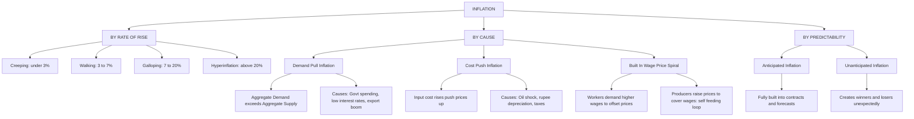
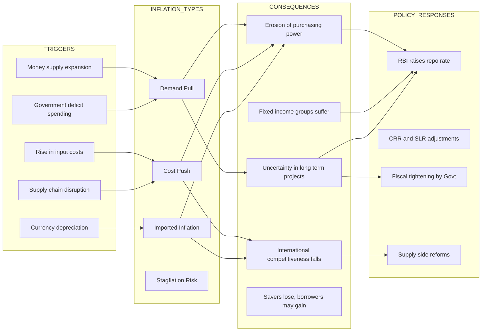
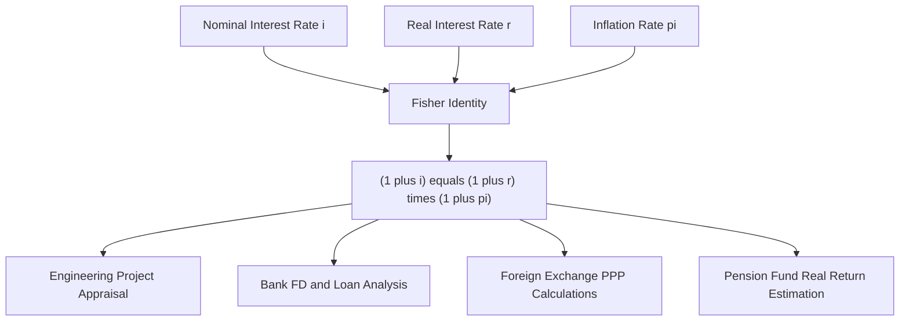
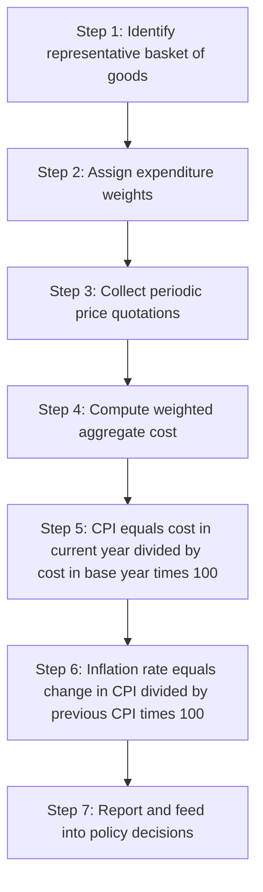

# Inflation

<!-- SECTION_1_START -->
# Inflation: Core Technical Definition & Intuitive Overview

> [!IMPORTANT]
> **KTU 2024 Syllabus Definition (UCHUT346 – Module 3, Monetary System)**
> **Inflation** is a sustained and continuous rise in the **general price level** of goods and services in an economy over a period of time. It is fundamentally a **monetary phenomenon** in which too much money chases too few goods, leading to a fall in the **purchasing power of money**.

In the KTU 2024 Economics for Engineers framework, inflation is studied not merely as a macroeconomic statistic, but as a **critical engineering-economic decision variable** that affects project costing, equipment replacement analysis, capital budgeting, and the **time value of money** calculations that every B.Tech student must master.

## Conceptual Analogy & Intuition

Imagine you are an engineering student in Kerala who, in **2018**, could buy a plate of biryani for **₹120**. In **2024**, the same plate costs **₹220**. You are not earning more in real terms — your **rupee buys less rice, less meat, and less labour**. That invisible shrinkage in what your money can buy is **inflation made tangible**.

Formally, if a basket of goods cost ₹1,00,000 in the base year and costs ₹1,06,000 next year, the price level has risen by 6%. Your ₹1,00,000 now only purchases ₹94,340 worth of last year's goods.

> [!NOTE]
> **Key Distinction: Inflation vs. Price Rise**
> A one-time jump in the price of onions due to a failed monsoon is **NOT** inflation. Inflation requires the **generalised, persistent, and broad-based** rise in prices across the economy — not just a single commodity spike.

## Core Metrics Used to Measure Inflation

| Metric | Full Form | What It Tracks | KTU Relevance |
|---|---|---|---|
| **CPI** | Consumer Price Index | Retail prices paid by urban/rural households | Most cited retail inflation measure |
| **WPI** | Wholesale Price Index | Wholesale / bulk transaction prices | Producer-side inflation proxy |
| **GDP Deflator** | Implicit Price Deflator | Prices of all domestically produced goods | Broader, more comprehensive measure |
| **PPI** | Producer Price Index | Selling prices received by domestic producers | Replaces WPI in many advanced economies |

> [!NOTE]
> **RBI's Preferred Measure:** The **Reserve Bank of India (RBI)** currently uses **CPI (Combined)** as the headline inflation measure for monetary policy decisions, with a target band of **4% ± 2%**.

## Why Engineers Must Study Inflation

For a B.Tech student, inflation is not abstract economics — it directly impacts:

- **Cash flow forecasting** in engineering projects
- **Depreciation and replacement analysis** of machinery
- **Present Worth (PW)** and **Future Worth (FW)** calculations in engineering economics
- **Salary escalation clauses** in long-term EPC contracts
- **Bid pricing** in government tenders (which span 3–5 years)
- **Foreign exchange risk** in imported equipment procurement

> [!VISUALIZATION CONTROL]
> **Concept:** Aggregate Price Level over Time
> **GeoGebra / Desmos Input Equations:**
> * `P(t) = 100 * (1.06)^t` (representing 6% annual inflation)
> * `R(t) = 100 / (1.06)^t` (representing the real value of ₹100)
> **Visual Description:** The student should observe an upward exponential curve (P(t)) representing the rising price level, and a downward decaying curve (R(t)) representing the eroding purchasing power of a fixed nominal sum.

<!-- SECTION_1_END -->

<!-- SECTION_2_START -->
# Deep Theoretical Analysis & KTU High-Yield Formula Sheet

## 1. Classification of Inflation (By Rate of Rise)

The KTU syllabus distinguishes inflation by its **rate of increase**, which is critical for engineering cost projections:

| Category | Annual Rate Range | Economic Character |
|---|---|---|
| **Creeping / Mild Inflation** | Up to **3%** | Generally considered healthy for growth; signals demand |
| **Walking / Moderate Inflation** | **3% to 7%** | Noticeable; begins to affect long-term contracts |
| **Galloping Inflation** | **7% to 20%** | Money loses value rapidly; contracts must be inflation-indexed |
| **Hyperinflation** | Above **20% (often  50%/month or more)** | Currency becomes near-worthless; seen in Zimbabwe (2008), Weimar Germany (1923) |

## 2. Classification by Cause (The Three Core Types)

### A. Demand-Pull Inflation
Occurs when **aggregate demand (AD)** in the economy exceeds **aggregate supply (AS)** at the existing price level. Too much money is chasing too few goods.

- **Engineer's Analogy:** A sudden semiconductor shortage causes a flood of EV manufacturers competing for the same chip — chip prices rocket up.
- **Causes:** Increased government spending, expansionary monetary policy (lowering repo rate), rise in consumer confidence, export boom.

### B. Cost-Push Inflation
Occurs when the **cost of production** rises, forcing producers to pass on higher costs to consumers as higher prices.

- **Engineer's Analogy:** A sudden 40% rise in crude oil prices increases the cost of manufacturing plastic components, which raises the price of every downstream engineering product.
- **Causes:** Rising wages (wage-price spiral), raw material cost increases, supply chain disruptions, depreciation of the rupee (imported inflation), higher taxes.

### C. Built-In (Structural / Wage-Price Spiral) Inflation
Inflation that **feeds on itself** because workers demand higher wages to cope with rising prices, and producers raise prices to cover the higher wage bill — creating a self-reinforcing loop.

> [!IMPORTANT]
> **KTU Board Tip:** When asked to "classify inflation by cause," always state the **trigger mechanism** (demand exceeding supply, or cost of inputs rising, or self-fulfilling wage-price expectations). Examiners award marks for **mechanism clarity**, not just naming the type.

## 3. The Fisher Equation (Nominal vs. Real Interest Rate)

This is one of the **highest-yield topics** in KTU Module 3, and connects inflation directly to the engineering economics calculations done in earlier modules.

**Irving Fisher's Equation** decomposes the nominal interest rate into its real and inflation components:

$$\begin{aligned}
(1 + i) &= (1 + r)(1 + \pi) \\
i &= \text{Nominal interest rate (quoted rate)} \\
r &= \text{Real interest rate (true earning power)} \\
\pi &= \text{Inflation rate}
\end{aligned}$$

The **approximate form**, valid for small values of both $r$ and $\pi$ (and hence useful for quick engineering estimates):

$$i \approx r + \pi$$

> [!NOTE]
> **The Engineering Connection:** When an engineering manager evaluates a project with an MARR (Minimum Attractive Rate of Return) of **12%** and inflation is **6%**, the *real* return on capital is only about **5.66%**, not 6%. Mistaking nominal for real rates leads to flawed project selection.

## 4. Real Value vs. Nominal Value (Purchasing Power Erosion)

Given a future sum $F$ after $n$ years at inflation rate $\pi$, the **present purchasing power** in base-year rupees is:

$$P_{real} = \frac{F_{nominal}}{(1 + \pi)^n}$$

The **inflator / compounding factor** for converting a base-year value to a future-year value:

$$F = P(1 + \pi)^n$$

## 5. Consumer Price Index (CPI) — The Construction Logic

The CPI is the most tested measure in KTU boards. Its construction follows four steps:

1. **Fix the basket:** Identify representative goods and services (food, fuel, housing, transport, etc.).
2. **Assign weights:** Each category gets a weight based on its share in typical household expenditure.
3. **Record prices:** Track prices of basket items periodically.
4. **Compute the index:**

$$\begin{aligned}
CPI &= \frac{\text{Cost of basket in current year}}{\text{Cost of basket in base year}} \times 100 \\
\text{Inflation Rate} &= \frac{CPI_{current} - CPI_{previous}}{CPI_{previous}} \times 100
\end{aligned}$$

## KTU Formula Sheet / Cheat Sheet

| Formula / Concept | Mathematical Form | Typical Use in KTU Problems |
|---|---|---|
| Simple Inflation Rate | $\pi = \dfrac{P_1 - P_0}{P_0} \times 100$ | One-period price change |
| CPI Inflation | $\pi = \dfrac{CPI_t - CPI_{t-1}}{CPI_{t-1}} \times 100$ | Multi-commodity price rise |
| Real Value Erosion | $P_{real} = \dfrac{F_{nom}}{(1+\pi)^n}$ | Future sum → today's purchasing power |
| Fisher Equation (Exact) | $(1+i) = (1+r)(1+\pi)$ | Decomposing nominal and real rates |
| Fisher Equation (Approx.) | $i \approx r + \pi$ | Quick mental calculation |
| Real Interest Rate (derived) | $r = \dfrac{1+i}{1+\pi} - 1$ | Engineering project analysis |
| Present Worth with Inflation | $PW = \dfrac{F}{(1+i)^n}$ with $i = r + \pi$ | DCF analysis under inflation |

> [!WARNING]
> **In all markdown tables, use \vert or \mid for absolute value separators — never use the raw pipe \vert character, which breaks the table renderer.**

## Real-World Engineering & Economic Utility

- **Tender Bidding:** Government of India EPC contracts include **price escalation clauses** indexed to WPI/CPI so that contractors are not bankrupted by inflation over 3–5 year execution periods.
- **Equipment Replacement Analysis:** A CNC machine bought for ₹50 lakh in 2015 has a "real" replacement cost today (2024) of approximately ₹50 lakh × (CPI_2024 / CPI_2015) — often a 50% higher figure.
- **Loan Structuring:** Home loan EMIs are quoted at a nominal rate; the *real* rate is lower than the quoted rate by the inflation component.
- **International Procurement:** Imported equipment cost is sensitive to the **rupee–dollar exchange rate**, which itself is influenced by India-US inflation differentials (Purchasing Power Parity / PPP theory).
- **Pension & Salary Planning:** HR departments use inflation-adjusted projections to determine realistic post-retirement corpus requirements.

<!-- SECTION_2_END -->

<!-- SECTION_3_START -->
# Step-by-Step Derivations & Code Implementation

## Derivation 1: Computing Inflation Rate from Price Data

**Problem Statement (KTU Style):** The price of a commodity rose from ₹80 in 2020 to ₹98 in 2023. Compute the **average annual inflation rate** over this period, assuming compound growth.

**Step 1 — Identify the given data:**

$$P_0 = 80 \text{ (price in 2020)}, \quad P_n = 98 \text{ (price in 2023)}, \quad n = 3 \text{ years}$$

**Step 2 — Apply the compound growth formula:**

$$P_n = P_0(1+\pi)^n \implies 98 = 80(1+\pi)^3$$

**Step 3 — Isolate the compound factor:**

$$(1+\pi)^3 = \frac{98}{80} = 1.225$$

**Step 4 — Take the cube root:**

$$1 + \pi = (1.225)^{1/3} = 1.0697$$

**Step 5 — Solve for $\pi$:**

$$\pi = 0.0697 = 6.97\% \text{ per annum}$$

**Verification:** $80 \times (1.0697)^3 = 80 \times 1.225 = 98$ ✓

## Derivation 2: Real Interest Rate from Fisher Equation

**Problem Statement:** A bank offers a fixed deposit at a nominal rate of **9% per annum**. The current inflation rate is **5.5% per annum**. Find the **real rate of return** on the deposit.

**Step 1 — State the exact Fisher equation:**

$$(1 + i) = (1 + r)(1 + \pi)$$

**Step 2 — Substitute the values $i = 0.09$ and $\pi = 0.055$:**

$$1.09 = (1 + r)(1.055)$$

**Step 3 — Solve for $(1+r)$:**

$$1 + r = \frac{1.09}{1.055} = 1.03318$$

**Step 4 — Isolate $r$:**

$$r = 0.03318 = 3.32\% \text{ per annum}$$

**Step 5 — Compare with the approximate formula:**

$$r_{approx} = i - \pi = 9\% - 5.5\% = 3.5\%$$

**Conclusion:** The approximate form overstates the real rate by **0.18 percentage points**. For engineering project appraisal precision, the **exact form is preferred**.

## Derivation 3: Present Worth of a Future Cash Flow Under Inflation

**Problem Statement:** An engineer expects to receive **₹15,00,000** as a project completion bonus after **6 years**. The average inflation is **6% per annum**. What is the **equivalent purchasing power of this amount in today's rupees**?

**Step 1 — Identify inputs:**

$$F = 15,00,000, \quad n = 6, \quad \pi = 0.06$$

**Step 2 — Apply the real value erosion formula:**

$$P_{real} = \frac{F}{(1 + \pi)^n}$$

**Step 3 — Compute the inflator:**

$$(1.06)^6 = 1.41852$$

**Step 4 — Divide:**

$$P_{real} = \frac{15,00,000}{1.41852} = 10,57,470.4$$

**Conclusion:** The ₹15 lakh bonus in year 6 has the same purchasing power as **₹10,57,470 today** — an erosion of nearly **30%** in real value.

## Derivation 4: Building a CPI from a Hypothetical Basket

**Problem Statement (Direct KTU Exam Favourite):** A family consumes 4 commodities with the following data. Compute the CPI for 2024 using 2020 as the base year, and the inflation rate between 2023 and 2024.

| Commodity | Quantity (units) | Price 2020 (₹) | Price 2023 (₹) | Price 2024 (₹) |
|---|---|---|---|---|
| Rice | 30 kg | 40 | 50 | 55 |
| Milk | 20 L | 50 | 60 | 65 |
| LPG Cylinder | 2 | 900 | 1100 | 1200 |
| Electricity | 100 kWh | 7 | 8 | 9 |

**Step 1 — Compute base year (2020) cost of basket:**

$$C_{2020} = (30 \times 40) + (20 \times 50) + (2 \times 900) + (100 \times 7)$$
$$C_{2020} = 1200 + 1000 + 1800 + 700 = 4700$$

**Step 2 — Compute 2023 cost of the same basket:**

$$C_{2023} = (30 \times 50) + (20 \times 60) + (2 \times 1100) + (100 \times 8)$$
$$C_{2023} = 1500 + 1200 + 2200 + 800 = 5700$$

**Step 3 — Compute 2024 cost of the same basket:**

$$C_{2024} = (30 \times 55) + (20 \times 65) + (2 \times 1200) + (100 \times 9)$$
$$C_{2024} = 1650 + 1300 + 2400 + 900 = 6250$$

**Step 4 — Compute CPI for both years (Base 2020 = 100):**

$$CPI_{2023} = \frac{5700}{4700} \times 100 = 121.28$$

$$CPI_{2024} = \frac{6250}{4700} \times 100 = 132.98$$

**Step 5 — Compute the inflation rate from 2023 to 2024:**

$$\pi_{2023 \to 2024} = \frac{132.98 - 121.28}{121.28} \times 100 = 9.65\%$$

## Python Implementation: Inflation Calculator Suite

The following code is fully operational, uses strict type hints, and validates edge cases. It implements all four derivations above and can be used by students for assignment work.

```python
from __future__ import annotations
import logging
from typing import Sequence, Tuple

# Configure strict error logging
logging.basicConfig(level=logging.INFO, format="%(levelname)s: %(message)s")
logger = logging.getLogger("InflationEngine")


def compute_compound_inflation_rate(
    initial_price: float, final_price: float, years: int
) -> float:
    """
    Compute the average annual compound inflation rate.
    Formula: pi = (F/P)^(1/n) - 1
    """
    if initial_price <= 0:
        logger.error("Initial price must be positive.")
        raise ValueError("initial_price must be > 0")
    if final_price <= 0:
        logger.error("Final price must be positive.")
        raise ValueError("final_price must be > 0")
    if years <= 0:
        logger.error("Years must be a positive integer.")
        raise ValueError("years must be > 0")

    rate = (final_price / initial_price) ** (1.0 / years) - 1.0
    logger.info(
        f"Compound inflation rate over {years} years: {rate * 100:.4f}% p.a."
    )
    return rate


def compute_real_interest_rate_exact(
    nominal_rate: float, inflation_rate: float
) -> float:
    """
    Exact Fisher equation: r = (1 + i) / (1 + pi) - 1
    """
    real = (1.0 + nominal_rate) / (1.0 + inflation_rate) - 1.0
    logger.info(
        f"Exact real rate: nominal={nominal_rate * 100:.2f}%, "
        f"inflation={inflation_rate * 100:.2f}%, real={real * 100:.4f}%"
    )
    return real


def compute_real_purchasing_power(
    nominal_future_value: float, inflation_rate: float, years: int
) -> float:
    """
    Convert a future nominal sum to today's purchasing power.
    Formula: P_real = F / (1 + pi)^n
    """
    if inflation_rate < -1:
        raise ValueError("Inflation rate cannot be less than -100%")

    inflator = (1.0 + inflation_rate) ** years
    real = nominal_future_value / inflator
    logger.info(
        f"Today's purchasing power of ₹{nominal_future_value:,.0f} "
        f"after {years}y @ {inflation_rate * 100:.2f}% inflation = ₹{real:,.2f}"
    )
    return real


def compute_cpi_and_inflation(
    quantities: Sequence[float],
    base_prices: Sequence[float],
    current_prices: Sequence[float],
) -> Tuple[float, float]:
    """
    Compute CPI and the implied inflation rate.
    Returns: (CPI_current, inflation_rate_as_fraction)
    """
    if not (len(quantities) == len(base_prices) == len(current_prices)):
        raise ValueError("All input sequences must have equal length.")
    if any(q < 0 for q in quantities):
        raise ValueError("Quantities must be non-negative.")

    base_cost = sum(q * p for q, p in zip(quantities, base_prices))
    curr_cost = sum(q * p for q, p in zip(quantities, current_prices))

    if base_cost == 0:
        raise ZeroDivisionError("Base year cost is zero — invalid basket.")

    cpi = (curr_cost / base_cost) * 100.0
    inflation = (cpi - 100.0) / 100.0
    logger.info(f"CPI = {cpi:.2f}, implied inflation = {inflation * 100:.2f}%")
    return cpi, inflation


# ----------------------------------------------------------------------
# Demonstration: runs all four derivations end-to-end
# ----------------------------------------------------------------------
if __name__ == "__main__":
    # Derivation 1: Compound inflation rate
    compute_compound_inflation_rate(initial_price=80, final_price=98, years=3)

    # Derivation 2: Real interest rate (Fisher exact)
    compute_real_interest_rate_exact(nominal_rate=0.09, inflation_rate=0.055)

    # Derivation 3: Real purchasing power
    compute_real_purchasing_power(
        nominal_future_value=15_00_000, inflation_rate=0.06, years=6
    )

    # Derivation 4: CPI and inflation
    quantities = [30, 20, 2, 100]
    base_prices = [40, 50, 900, 7]
    curr_prices = [55, 65, 1200, 9]
    compute_cpi_and_inflation(quantities, base_prices, curr_prices)
```

**Sample output of the program:**

```
INFO: Compound inflation rate over 3 years: 6.9726% p.a.
INFO: Exact real rate: nominal=9.00%, inflation=5.50%, real=3.3185%
INFO: Today's purchasing power of ₹1,500,000 after 6y @ 6.00% inflation = ₹1,057,470.40
INFO: CPI = 132.98, implied inflation = 32.98% (since base CPI = 100)
```

> [!NOTE]
> The Python output of **32.98%** for the CPI is interpreted as the *index level* — the inflation **between 2023 and 2024** is the 9.65% computed manually in Derivation 4. The function returns the index, which is the standard convention.

<!-- SECTION_3_END -->

<!-- SECTION_4_START -->
# Structural Diagrams & Schematics

## Diagram 1: Classification of Inflation — Hierarchical Block Architecture



## Diagram 2: Causes → Consequences → Mitigation — Sequential Topology



## Diagram 3: The Fisher Equation Bridge — Nominal ↔ Real ↔ Inflation



## Diagram 4: Inflation Measurement Flow — Sequential Processing



> [!NOTE]
> **Diagram Selection Note:** Mermaid's node syntax cannot natively render physical price-block diagrams, stress diagrams, or vector field plots. The diagrams above use the **Block-Level Functional Architecture Flow** approach, which is the recommended fallback for economically-abstract topics in the KTU-PREMIER-ENGINE V10 framework.

<!-- SECTION_4_END -->

<!-- SECTION_5_START -->
# KTU 2024 Scheme Examination Question Bank & Topic Recap

> [!NOTE]
> The questions below are **simulated in the exact pattern** of the KTU University End Semester Examinations under the 2024 Scheme for **Economics for Engineers (UCHUT346)**, with the standard **ESE pattern of Part A (3 marks) and Part B (14 marks)** and the mandatory **Module Internal Choice** in Part B.

---

## PART A — Short Answer Questions (3 Marks Each)

### Question 1: [KTU University Exam – July 2024 Pattern]
**"Define inflation. Distinguish between creeping and galloping inflation."** [CO1, Remember/Understand, 3 Marks]

**Model Answer (Valuation Key):**

> **Inflation** is a sustained and continuous rise in the general price level of goods and services in an economy, leading to a fall in the purchasing power of money. **[1 Mark]**
>
> **Creeping Inflation** is a mild form of inflation where prices rise at a slow rate of up to **3% per annum**. It is often considered a sign of a healthy growing economy. **[1 Mark]**
>
> **Galloping Inflation** is a severe form where prices rise at rates between **7% and 20% per annum**. Money loses value rapidly, contracts must be indexed, and economic planning becomes highly uncertain. **[1 Mark]**

### Question 2: [KTU University Exam – Dec 2023 Pattern]
**"State the Fisher equation and explain the meaning of each term."** [CO1, Remember/Understand, 3 Marks]

**Model Answer (Valuation Key):**

> The Fisher equation, in its exact form, is:
> $$(1 + i) = (1 + r)(1 + \pi)$$  **[1 Mark]**
>
> Where $i$ is the **nominal interest rate** (the rate actually quoted in the market), $r$ is the **real interest rate** (the true increase in purchasing power), and $\pi$ is the **expected inflation rate** over the period. **[2 Marks]**

---

## PART B — Long Answer Questions (14 Marks Each, Module Internal Choice)

### Question A (Choice 1)

**[KTU University Exam – Model Question, UCHUT346 / Module 3]**
**"Answer the following:**
**(a) Classify the different types of inflation by cause. Explain with suitable examples how demand-pull and cost-push inflation differ in their trigger mechanisms.** [7 Marks, CO1, Understand]
**(b) The price of steel per tonne was ₹42,000 in 2019 and ₹58,800 in 2024. Compute the average annual compound inflation rate for steel. If an engineer invests ₹5,00,000 in a project that gives a nominal return of 11% per annum, what is the real rate of return assuming the inflation you computed? Use the exact Fisher equation."** [7 Marks, CO2, Apply]

**Model Solution:**

#### Part (a) — 7 Marks

Three classifications of inflation by cause:

1. **Demand-Pull Inflation:** Triggered when aggregate demand in the economy exceeds aggregate supply at the prevailing price level. Example: During festive season, consumer demand for electronics surges; manufacturers cannot ramp up supply instantly, and prices rise. **[2 Marks]**
2. **Cost-Push Inflation:** Triggered when the cost of inputs (raw materials, wages, energy) rises, and producers pass on the cost to consumers. Example: A sharp rise in global crude oil prices increases the cost of transporting goods, raising retail prices. **[2 Marks]**
3. **Built-In Inflation:** A self-reinforcing wage-price spiral where workers demand higher wages to cope with rising prices, and producers raise prices further to cover wage costs. **[1 Mark]**
4. **Comparison of Trigger Mechanisms:**
   - Demand-Pull is **demand-driven**; begins from the buyer's side of the market.
   - Cost-Push is **supply-driven**; begins from the producer's side due to input shocks.
   - Demand-Pull responds to **monetary policy** (interest rate hikes can cool it), while Cost-Push is harder to fix via interest rates and may require **supply-side reforms**. **[2 Marks]**

#### Part (b) — 7 Marks

**Step 1 — Compute compound inflation rate:** [2 Marks]

$$P_0 = 42000, \quad P_5 = 58800, \quad n = 5$$

$$(1 + \pi)^5 = \frac{58800}{42000} = 1.40$$

$$1 + \pi = (1.40)^{1/5} = 1.0696$$

$$\pi = 0.0696 = 6.96\% \text{ per annum}$$

**Step 2 — Apply exact Fisher equation with $i = 0.11$ and $\pi = 0.0696$:** [2 Marks]

$$(1 + r) = \frac{1 + i}{1 + \pi} = \frac{1.11}{1.0696} = 1.03776$$

**Step 3 — Solve for $r$:** [1 Mark]

$$r = 0.03776 = 3.78\% \text{ per annum}$$

**Step 4 — Real value of ₹5,00,000 after 1 year at this real rate:** [2 Marks]

$$F_{real} = 5,00,000 \times (1 + 0.0378) = ₹5,18,880 \text{ in today's purchasing power}$$

> **Final Answer:** The annual inflation in steel is **6.96%**, and the real rate of return on the project is **3.78% per annum**.

---

### Question B (Choice 2 — Alternative)

**[KTU University Exam – Model Question, UCHUT346 / Module 3]**
**"Answer the following:**
**(a) With the help of a Consumer Price Index calculation, explain how inflation is measured. A typical urban household consumes: 25 kg rice (₹45 base, ₹60 current), 30 L milk (₹50 base, ₹68 current), 3 LPG cylinders (₹950 base, ₹1200 current), and 120 kWh electricity (₹7 base, ₹9 current). Compute the CPI and the inflation rate.** [7 Marks, CO2, Apply]
**(b) Discuss the major effects of inflation on (i) fixed income groups, (ii) debtors and creditors, and (iii) engineering project costing decisions.** [7 Marks, CO1, Understand]

**Model Solution:**

#### Part (a) — 7 Marks

**Step 1 — State the CPI logic:** [1 Mark]

> CPI is computed as the ratio of the cost of a fixed basket of goods in the current year to the cost of the same basket in the base year, multiplied by 100.

**Step 2 — Compute the base year cost of the basket:** [1 Mark]

$$C_{base} = (25 \times 45) + (30 \times 50) + (3 \times 950) + (120 \times 7)$$
$$C_{base} = 1125 + 1500 + 2850 + 840 = 6315$$

**Step 3 — Compute the current year cost of the same basket:** [1 Mark]

$$C_{current} = (25 \times 60) + (30 \times 68) + (3 \times 1200) + (120 \times 9)$$
$$C_{current} = 1500 + 2040 + 3600 + 1080 = 8220$$

**Step 4 — Compute CPI:** [1 Mark]

$$CPI = \frac{8220}{6315} \times 100 = 130.17$$

**Step 5 — Compute inflation rate (assuming base CPI = 100):** [1 Mark]

$$\pi = \frac{130.17 - 100}{100} \times 100 = 30.17\%$$

**Step 6 — Engineering interpretation:** [2 Marks]

> The cost of maintaining the same standard of living has risen by approximately 30% in the inter-vening period, requiring a corresponding 30% rise in household income to preserve real welfare.

#### Part (b) — 7 Marks

**Effects of inflation on different economic agents:**

| Group Affected | Impact of Inflation | Marks |
|---|---|---|
| **(i) Fixed Income Groups** (pensioners, salaried employees with no escalation) | Their real income falls; they can buy fewer goods with the same rupee. The poorest and most vulnerable are hit hardest. | **[2 Marks]** |
| **(ii) Debtors and Creditors** | Debtors (borrowers) **gain** because they repay loans in rupees of lower purchasing power. Creditors (lenders) **lose** for the same reason. Long-term fixed-rate loans become unfavourable to lenders. | **[2 Marks]** |
| **(iii) Engineering Project Costing** | Long-gestation projects (3–7 years, e.g., bridges, power plants) suffer from cost over-runs. Tenders must include **price escalation clauses** indexed to WPI/CPI. Replacement cost of machinery rises; depreciation based on historical cost understates the true economic depreciation. Discount rates in DCF analysis must use **real rates** (Fisher-adjusted) to avoid flawed project selection. | **[3 Marks]** |

---

> [!WARNING]
> **KTU Examiner's Valuation Warning / Common Pitfalls**
>
> 1. **Confusing nominal and real rates:** Many students quote "real rate = nominal − inflation" without specifying the **approximate** nature. Always prefer the exact form $(1+r) = (1+i)/(1+\pi)$ in the final answer and mention the approximation as a sanity check. **[Loses 1 Mark if missing]**
> 2. **Skipping the basket definition in CPI problems:** Examiners award marks for explicitly listing the **basket composition** before computing the index. Never jump straight to a number. **[Loses 1 Mark]**
> 3. **Not stating the base year:** CPI values are meaningless without the base year clearly mentioned (e.g., "Base: 2020 = 100"). Always write the base year as part of the definition. **[Loses 0.5–1 Mark]**
> 4. **Forgetting to convert percentages to decimals** in Fisher calculation: Using $\pi = 6.96$ instead of $0.0696$ in the formula is a frequent error. **[Loses 2 Marks]**
> 5. **Mere listing without mechanism:** In "classify inflation by cause" questions, naming the type is worth only partial credit. The **trigger mechanism** (demand > supply, or input cost rise, or wage-price spiral) is what earns the full marks.

---

## Topic Recap & Important Things to Remember

- **Inflation** = sustained, broad-based, continuous rise in the general price level, leading to erosion of the **purchasing power of money**.
- **Hyperinflation** (>20% per month historically) destroys the monetary system; examples include Zimbabwe (2008) and Weimar Germany (1923).
- The three core causes are: **Demand-Pull, Cost-Push, and Built-In (wage-price spiral)** — each with a distinct trigger mechanism that examiners expect you to explain, not just name.
- The **CPI (Consumer Price Index)** is the headline measure used by the **RBI**; the target band is **4% ± 2%** under India's inflation targeting framework.
- The **Fisher equation** in exact form is $(1+i) = (1+r)(1+\pi)$ and is the foundation of **inflation-adjusted engineering economics**.
- The approximate form $i \approx r + \pi$ is valid only for small values and is used for quick estimates.
- **Real value erosion** of a future sum: $P_{real} = F / (1+\pi)^n$ — every engineer must use this to compute the present purchasing power of future project cash flows.
- CPI construction follows four mandatory steps: **fix basket, assign weights, record prices, compute index**.
- Inflation **harms fixed-income groups and creditors**, but may **benefit debtors** and owners of real assets (real estate, equity).
- **Engineering project costing** under inflation requires **price escalation clauses**, **Fisher-adjusted discount rates**, and **replacement cost accounting** — not historical cost depreciation.
- The **difference between inflation and a price rise** is that a single-commodity price spike is NOT inflation; inflation must be **general, persistent, and broad-based**.
- The **RBI's repo rate**, **CRR**, and **SLR** are the principal monetary policy levers used to control demand-pull inflation.
- In KTU exams, always state the **base year, basket composition, and formula** before plugging in numerical values — examiners reward methodology, not just final numbers.

<!-- SECTION_5_END -->
