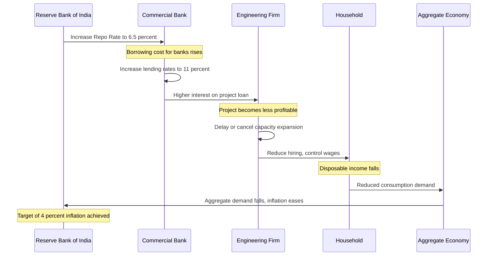
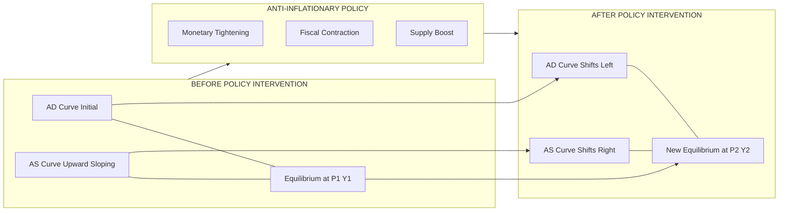
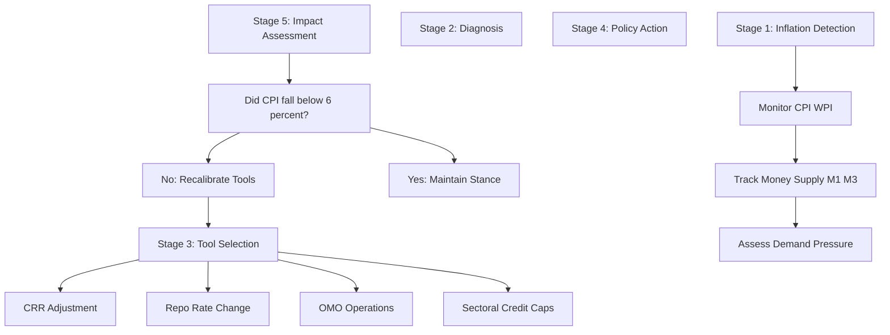

# Measures to Control Inflation

<!-- SECTION_1_START -->

# Measures to Control Inflation

## 1. Core Technical Definition & Intuitive Overview

> [!IMPORTANT]
> **Inflation (KTU 2024 Definition):** A sustained and continuous increase in the general price level of goods and services in an economy over a period of time, resulting in a corresponding decline in the **purchasing power of money**. It is measured as a percentage change in a price index (CPI, WPI, or GDP Deflator).

### Formal Academic Definition

> [!NOTE]
> **Inflation Rate Formula:**
> $$\pi_t = \frac{P_t - P_{t-1}}{P_{t-1}} \times 100$$
> where $P_t$ is the price index in the current period and $P_{t-1}$ is the price index in the previous period. When $\pi_t > 0$ persistently, the economy is said to be experiencing **inflation**.

### Classification of Inflation (Based on Severity)

| Type | Range (Annual %) | Characteristics |
|------|------------------|-----------------|
| **Creeping Inflation** | $\le$ **3%** | Mild, often considered healthy for growth |
| **Walking/Walking Inflation** | **3% – 7%** | Moderate, manageable through policy |
| **Galloping Inflation** | **7% – 15%** | Serious, erodes savings rapidly |
| **Hyperinflation** | $>$ **15% (often $>$ 50%)** | Currency collapse, economy breakdown |

> [!TIP]
> **Engineering Connection:** Engineers must account for inflation when performing **Life Cycle Cost Analysis (LCCA)**, **Net Present Value (NPV)** calculations, and **Benefit-Cost Ratio (BCR)** evaluations in long-term infrastructure projects. Ignoring inflation is one of the most common causes of project cost overruns in public engineering works.

### Conceptual Analogy / Intuitive Overview

> [!NOTE]
> **Analogy — The Bucket of Value:**
> Imagine money as water in a bucket, and goods/services as sponges soaking up that water. When the government or central bank **adds more water (money supply)** than there are sponges (goods/services), water overflows — this overflow represents inflation. **Every extra unit of money now chases the same limited goods**, so prices rise.
>
> - **Deflation** = Water evaporates (sponges become plentiful, money scarce)
> - **Inflation** = Water added faster than sponges are made
> - **Stagflation** = Sponges disappear AND water is added (worst case scenario)

### Why Control Inflation?

> [!IMPORTANT]
> **The Three Engineering-Economic Reasons:**
> 1. **Preservation of Real Returns:** A project yielding **12% nominal return** under **8% inflation** gives only **~3.7% real return** (using Fisher equation).
> 2. **Project Cost Predictability:** Inflation in steel, cement, and labor causes **cost escalation** in construction projects.
> 3. **Investment Certainty:** Stable prices encourage long-term capital investment in industrial engineering.

### Physical Constants & Standard Metrics

- **Reserve Bank of India (RBI) Inflation Target:** **4%** Consumer Price Index (CPI) with a tolerance band of **$\pm$ 2%**, i.e., **2% to 6%**.
- **Inflation Threshold for Hyperinflation (Cagan's Definition):** Monthly inflation exceeding **50%**.
- **Ideal Inflation Rate for Growth (RBI stance):** **4% $\pm$ 2%**.

<!-- SECTION_1_END -->

<!-- SECTION_2_START -->

# 2. Deep Theoretical Analysis & KTU High-Yield Formula Sheet

## 2.1 Causes of Inflation (Demand-Pull & Cost-Push)

> [!IMPORTANT]
> **Root-Cause Analysis (Foundational to choosing control measures):**
> Inflation control measures are designed based on the *cause* of inflation. There are two primary types of inflation, each requiring a different policy response.

### A. Demand-Pull Inflation
Caused when **aggregate demand (AD)** in the economy exceeds **aggregate supply (AS)** at full employment level.

**Triggers:**
- Increase in government spending
- Increase in money supply by central bank
- Rise in consumer income/wealth
- Credit expansion by commercial banks

### B. Cost-Push Inflation
Caused when **production costs rise**, forcing producers to raise prices to maintain margins.

**Triggers:**
- Increase in wages (wage-price spiral)
- Rise in raw material prices (e.g., crude oil)
- Increase in indirect taxes
- Supply chain disruptions

> [!TIP]
> **Engineering Economic Link:** Cost-push inflation is the most relevant type for engineers. When steel prices rise due to global coking coal cost, civil engineers face **cost escalation** in bridge and high-rise construction projects. The control measures for cost-push inflation differ from demand-pull inflation.

## 2.2 KTU High-Yield Formula Sheet / Cheat Sheet

> [!IMPORTANT]
> **Master these formulas for any numerical/problem question in the ESE exam:**

| # | Concept | Formula / Identity | Symbol Definitions | Unit |
|---|---------|-------------------|--------------------|------|
| 1 | **Inflation Rate** | $\pi_t = \dfrac{P_t - P_{t-1}}{P_{t-1}} \times 100$ | $P_t$ = current price index, $P_{t-1}$ = base price index | **%** |
| 2 | **Real Value of Money** | $\text{Real Value} = \dfrac{\text{Nominal Value}}{1 + \pi}$ | $\pi$ = inflation rate | Currency units |
| 3 | **Fisher Equation (Nominal Interest)** | $i = r + \pi + r\pi$ | $i$ = nominal rate, $r$ = real rate, $\pi$ = inflation | **%** |
| 4 | **Fisher Approximation** | $i \approx r + \pi$ | Used for small $\pi$ | **%** |
| 5 | **Real Interest Rate** | $r = \dfrac{1+i}{1+\pi} - 1$ | Exact real rate formula | **%** |
| 6 | **Money Multiplier** | $m = \dfrac{1}{c + r_r(1+c)}$ | $c$ = currency-deposit ratio, $r_r$ = reserve ratio | Dimensionless |
| 7 | **Money Supply (M1)** | $M1 = C + DD$ | $C$ = currency, $DD$ = demand deposits | Currency units |
| 8 | **Quantity Theory of Money** | $MV = PY$ | $M$ = money supply, $V$ = velocity, $P$ = price level, $Y$ = output | Various |
| 9 | **Inflation Tax (Seigniorage)** | $S = \dfrac{\Delta M}{P}$ | $\Delta M$ = change in money supply, $P$ = price level | Currency units |
| 10 | **Effective Tax Rate (Post-Inflation)** | $r_{real} = \dfrac{r_{nom}(1-\tau) - \pi}{1+\pi}$ | $\tau$ = marginal tax rate | **%** |

## 2.3 Classification of Inflation Control Measures

> [!IMPORTANT]
> **KTU Module 3 expects students to know the THREE pillars of inflation control:**

### Pillar 1: Monetary Policy Measures (RBI / Central Bank)
Controlling the **money supply** and **cost of credit** in the economy.

### Pillar 2: Fiscal Policy Measures (Government)
Controlling **government expenditure** and **taxation** to manage aggregate demand.

### Pillar 3: Supply-Side & Direct Measures
Improving **production capacity** and **price administration**.

### Detailed Breakdown of Monetary Policy Instruments

> [!NOTE]
> **Quantitative Instruments (affect volume of credit):**
> 1. **Bank Rate Policy** — Rate at which RBI lends long-term funds to commercial banks. ↑ Bank Rate → ↓ Credit → ↓ Inflation.
> 2. **Open Market Operations (OMO)** — Buying/selling government securities. To control inflation: **Sell securities** → soak up liquidity.
> 3. **Cash Reserve Ratio (CRR)** — % of deposits banks must keep with RBI. ↑ CRR → ↓ lending capacity → ↓ money supply.
> 4. **Statutory Liquidity Ratio (SLR)** — % of deposits banks must hold as liquid assets (gold, govt securities). ↑ SLR → ↓ credit creation.
> 5. **Repo Rate** — Rate at which RBI lends short-term to banks. ↑ Repo Rate → borrowing cost rises → ↓ loans → ↓ inflation.
> 6. **Reverse Repo Rate** — Rate at which RBI borrows from banks. ↑ Reverse Repo → banks prefer parking money with RBI → ↓ credit.
> 7. **Marginal Standing Facility (MSF)** — Penalty rate for banks borrowing overnight. ↑ MSF → discourages overnight borrowing.

> [!NOTE]
> **Qualitative / Selective Instruments (affect direction of credit):**
> 1. **Margin Requirements** — Reduce LTV (loan-to-value) ratio to discourage speculative lending.
> 2. **Moral Suasion** — RBI uses persuasion to influence bank lending behavior.
> 3. **Credit Rationing** — Ceiling on credit for non-priority sectors.
> 4. **Direct Action** — Penalties for non-compliance with credit policy.

### Detailed Breakdown of Fiscal Policy Measures

> [!NOTE]
> **Anti-Inflationary Fiscal Levers:**
> 1. **Reduction in Government Spending** — Lowers aggregate demand directly.
> 2. **Increase in Taxes (Direct & Indirect)** — Reduces disposable income, curbs consumption.
> 3. **Surplus Budgeting** — Government revenue exceeds expenditure (sucks liquidity from market).
> 4. **Public Borrowing** — Government borrows from public, reducing purchasing power in the market.
> 5. **Reduction in Subsidies** — Frees fiscal space and reduces artificial demand distortion.

### Supply-Side & Direct Measures

> [!NOTE]
> **Long-Term & Structural Solutions:**
> 1. **Price Control / Administered Prices** — Government fixes maximum price of essential goods.
> 2. **Public Distribution System (PDS)** — Subsidized food grains to vulnerable sections.
> 3. **Buffer Stock Operations** — Building food grain reserves to release during scarcity.
> 4. **Import Liberalization** — Allowing cheaper imports to increase supply.
> 5. **Encouraging Production** — Tax holidays, industrial policy to boost AS curve.
> 6. **Rationing** — Physical quantity restrictions on essential goods.

## 2.4 Real-World Utility in Engineering Economics

> [!TIP]
> **Why Engineers Study Inflation Control:**
> - **Project Appraisal:** Engineers preparing **DPRs (Detailed Project Reports)** must factor in expected inflation when computing discounted cash flows.
> - **Equipment Procurement:** Lifting of import duties (a fiscal measure) directly affects **capital cost** of imported machinery.
> - **Construction Contracts:** Many construction contracts use **escalation clauses** tied to WPI/CPI — directly impacted by inflation control.
> - **PPP Projects:** Public-Private Partnership viability depends on stable inflation for predictable **annuity payments**.

<!-- SECTION_2_END -->

<!-- SECTION_3_START -->

# 3. Step-by-Step Derivations & Numerical Implementation

## 3.1 Derivation: Fisher Equation (Nominal-Real Interest Rate Link)

> [!NOTE]
> **Starting Point:** An investor lending money at nominal rate $i$ must be compensated for both the time value of money (real rate $r$) AND the loss of purchasing power due to inflation ($\pi$).

### Step 1: Define Nominal Return
$$\text{Nominal Return} = 1 + i$$

### Step 2: Account for Inflation Loss
If inflation is $\pi$, the real purchasing power of 1 unit becomes $\dfrac{1}{1+\pi}$ in next period.

### Step 3: Compose Real and Inflation Effects

$$\begin{aligned}
(1 + i) &= (1 + r)(1 + \pi) \\
(1 + i) &= 1 + r + \pi + r\pi \\
i &= r + \pi + r\pi \\
i &= r + \pi(1 + r)
\end{aligned}$$

### Step 4: Rearrange for Real Rate
$$r = \frac{1 + i}{1 + \pi} - 1$$

### Step 5: Approximation for Small $\pi$
For small values of $r$ and $\pi$:
$$i \approx r + \pi \quad \text{(Fisher Approximation)}$$

> [!TIP]
> **Engineering Application:** When RBI raises repo rate by **25 basis points** (0.25%) to fight inflation of **6%**, the engineer must recalculate the **Weighted Average Cost of Capital (WACC)** for any on-going project, as the cost of debt has changed.

## 3.2 Numerical Problem 1: Effect of Inflation on Project NPV (KTU Style)

> [!IMPORTANT]
> **Question:** An engineering firm invests **Rs. 50,00,000** in machinery. The machine generates a nominal cash inflow of **Rs. 15,00,000** per year for **5 years**. The nominal discount rate is **12%** and the expected inflation rate is **6%** per annum. Calculate:
> 1. The real discount rate using Fisher approximation.
> 2. The NPV at the real discount rate.
> 3. The NPV at the nominal discount rate (comment on the difference).

### Solution:

**Step 1: Real Discount Rate (Fisher Approximation)**
$$r = i - \pi = 12\% - 6\% = 6\%$$

**Step 2: NPV at Real Discount Rate (6%)**

The cash flows of **Rs. 15,00,000** per year — assuming these are *real* cash flows (constant purchasing power) — are discounted at the real rate:

$$\begin{aligned}
NPV_{real} &= -50{,}00{,}000 + \sum_{t=1}^{5} \frac{15{,}00{,}000}{(1 + 0.06)^t} \\
&= -50{,}00{,}000 + 15{,}00{,}000 \times \text{PVAF}(6\%, 5)
\end{aligned}$$

PVAF calculation:
$$\begin{aligned}
\text{PVAF}(6\%, 5) &= \frac{1 - (1.06)^{-5}}{0.06} \\
&= \frac{1 - 0.7473}{0.06} \\
&= \frac{0.2527}{0.06} \\
&= 4.2124
\end{aligned}$$

Therefore:
$$\begin{aligned}
NPV_{real} &= -50{,}00{,}000 + 15{,}00{,}000 \times 4.2124 \\
&= -50{,}00{,}000 + 63{,}18{,}600 \\
&= \mathbf{+13{,}18{,}600}
\end{aligned}$$

**Step 3: NPV at Nominal Discount Rate (12%) — Cash flows inflated**

If the **Rs. 15,00,000** is a *real* cash flow, the nominal cash flow in year $t$ is:
$$CF_t^{nom} = 15{,}00{,}000 \times (1.06)^{t-1}$$

| Year ($t$) | Nominal CF (Rs.) | Discount Factor @ 12% | Present Value (Rs.) |
|------------|------------------|------------------------|---------------------|
| 1 | 15,00,000 | 0.8929 | 13,39,350 |
| 2 | 15,90,000 | 0.7972 | 12,67,548 |
| 3 | 16,85,400 | 0.7118 | 11,99,668 |
| 4 | 17,86,524 | 0.6355 | 11,35,336 |
| 5 | 18,93,715 | 0.5674 | 10,74,496 |
| **Total** | | | **60,16,398** |

$$NPV_{nominal} = -50,00,000 + 60,16,398 = \mathbf{+10,16,398}$$

> [!NOTE]
> **Conclusion:** Both methods give the **same decision** (accept the project) but the **NPV values differ slightly** due to discounting and compounding periods. The real rate method is preferred for *constant real cash flow* analysis, while the nominal rate method is preferred when cash flows are expressed in *current/future rupees*.

**[Step 1 Real Rate: 2 Marks]** | **[Step 2 NPV Real: 4 Marks]** | **[Step 3 NPV Nominal: 6 Marks]** | **[Conclusion: 2 Marks]**

## 3.3 Numerical Problem 2: Money Multiplier and Money Supply Control

> [!IMPORTANT]
> **Question:** Given:
> - Currency-Deposit Ratio ($c$) = 0.4
> - Reserve Ratio ($r_r$) = 0.1
> - Initial Reserve Injection by RBI ($\Delta R$) = Rs. 5,000 crores
>
> Calculate:
> 1. The money multiplier.
> 2. Total money supply created.
> 3. The change in price level if Real GDP grows by **8%** and money supply grows by **12%**.

### Solution:

**Step 1: Money Multiplier**
$$m = \frac{1}{c + r_r(1+c)}$$

$$\begin{aligned}
m &= \frac{1}{0.4 + 0.1(1+0.4)} \\
&= \frac{1}{0.4 + 0.14} \\
&= \frac{1}{0.54} \\
&= \mathbf{1.8519}
\end{aligned}$$

**Step 2: Total Money Supply Created**
$$\Delta M = m \times \Delta R = 1.8519 \times 5{,}000 = \mathbf{Rs.\ 9{,}259.5\ \text{crores}}$$

**Step 3: Inflation from Quantity Theory of Money ($MV = PY$)**

If $V$ and $Y$ are held constant, the percentage change in $P$ equals the percentage change in $M$ minus the percentage change in $Y$:
$$\pi = g_M - g_Y$$
where $g_M$ is money supply growth rate and $g_Y$ is real GDP growth rate.

$$\begin{aligned}
\pi &= 12\% - 8\% \\
&= \mathbf{4\%}
\end{aligned}$$

**[Step 1 Multiplier: 4 Marks]** | **[Step 2 Money Supply: 4 Marks]** | **[Step 3 Inflation: 4 Marks]** | **[Final Answers with Units: 2 Marks]**

## 3.4 Numerical Problem 3: Effect of CRR on Lending Capacity

> [!IMPORTANT]
> **Question:** A commercial bank has total deposits of **Rs. 800 crores**. Currently, CRR is **4%** and SLR is **18%**. The bank lends at an average rate of **11%** to combat inflation. RBI increases CRR to **6%**. Find:
> 1. Reduction in lendable funds.
> 2. Impact on credit creation in the banking system (assume money multiplier = 5).

### Solution:

**Step 1: Lendable Funds Before CRR Change**
$$\text{Lendable} = \text{Total Deposits} - \text{CRR} - \text{SLR}$$
$$= 800 - (0.04 \times 800) - (0.18 \times 800)$$
$$= 800 - 32 - 144 = \mathbf{Rs.\ 624\ \text{crores}}$$

**Step 2: Lendable Funds After CRR Change**
$$= 800 - (0.06 \times 800) - (0.18 \times 800)$$
$$= 800 - 48 - 144 = \mathbf{Rs.\ 608\ \text{crores}}$$

**Step 3: Reduction in Lendable Funds**
$$\Delta L = 624 - 608 = \mathbf{Rs.\ 16\ \text{crores}}$$

**Step 4: Reduction in Credit Creation**
$$\Delta \text{Credit} = \Delta L \times m = 16 \times 5 = \mathbf{Rs.\ 80\ \text{crores}}$$

> [!TIP]
> **Engineering Insight:** A 2% CRR hike by RBI removes **Rs. 80 crores** of credit capacity from the banking system. For an engineer seeking a **project loan**, this could mean tighter loan availability and **higher interest rates** on working capital finance.

**[Step 1: 3 Marks]** | **[Step 2: 3 Marks]** | **[Step 3: 3 Marks]** | **[Step 4: 3 Marks]** | **[Units: 2 Marks]**

## 3.5 Comparative Analysis Table: Monetary vs Fiscal vs Supply-Side Measures

> [!IMPORTANT]
> **KTU Examiners often ask 14-mark questions comparing these measures. Master this table:**

| Parameter | Monetary Policy | Fiscal Policy | Supply-Side Measures |
|-----------|-----------------|---------------|----------------------|
| **Authority** | RBI (Central Bank) | Government (Finance Ministry) | Multiple Agencies |
| **Target Variable** | Money Supply & Interest Rates | Aggregate Demand | Aggregate Supply |
| **Speed of Action** | Fast (Days/Weeks) | Slow (Budget Cycle) | Very Slow (Years) |
| **Precision** | High | Moderate | Low |
| **Effect on Growth** | May slow growth | May slow growth | Promotes growth |
| **Political Resistance** | Low | High (taxation unpopular) | Moderate |
| **Effectiveness on** | Demand-Pull Inflation | Demand-Pull Inflation | Cost-Push Inflation |
| **Long-term Sustainability** | Moderate | Low (debt accumulation) | High |
| **Example Instrument** | ↑ Repo Rate, ↑ CRR | ↓ Govt Spending, ↑ Tax | Tax holidays for industry |

> [!WARNING]
> **Common Student Mistake:** Students often confuse **"fiscal deficit"** with **"monetary expansion."** Remember: Fiscal deficit is financed by government borrowing; monetization of deficit (printing money) is a separate and inflationary act. The **RBI's Autonomy Act 2016** restricted this practice significantly.

<!-- SECTION_3_END -->

<!-- SECTION_4_START -->

# 4. Structural Diagrams & Schematics

## 4.1 Mermaid Flow Diagram: Classification of Anti-Inflationary Measures

```mermaid
graph TD
    RootA[Anti-Inflationary Measures]
    RootB[Cost-Push Inflation]
    RootC[Demand-Pull Inflation]
    RootD[Inflation Causes]

    RootA --> SubA1[Monetary Policy]
    RootA --> SubA2[Fiscal Policy]
    RootA --> SubA3[Supply Side Measures]
    RootA --> SubA4[Direct Controls]

    SubA1 --> Qnt[Quantitative Instruments]
    SubA1 --> Qlt[Qualitative Instruments]

    Qnt --> Q1[Bank Rate]
    Qnt --> Q2[Open Market Operations]
    Qnt --> Q3[CRR]
    Qnt --> Q4[SLR]
    Qnt --> Q5[Repo Rate]
    Qnt --> Q6[Reverse Repo]

    Qlt --> QL1[Margin Requirements]
    Qlt --> QL2[Credit Rationing]
    Qlt --> QL3[Moral Suasion]

    SubA2 --> F1[Reduce Government Spending]
    SubA2 --> F2[Increase Taxation]
    SubA2 --> F3[Public Borrowing]
    SubA2 --> F4[Reduce Subsidies]
    SubA2 --> F5[Surplus Budget]

    SubA3 --> S1[Boost Production]
    SubA3 --> S2[Import Liberalization]
    SubA3 --> S3[Industrial Policy Reforms]
    SubA3 --> S4[Technology Upgradation]

    SubA4 --> D1[Price Control]
    SubA4 --> D2[Rationing]
    SubA4 --> D3[Buffer Stock Ops]
    SubA4 --> D4[Public Distribution System]

    RootD --> RootB
    RootD --> RootC
    RootB --> Supply1[Cost Rise from Wages]
    RootB --> Supply2[Cost Rise from Raw Materials]
    RootC --> Demand1[Money Supply Expansion]
    RootC --> Demand2[Government Spending Rise]
    RootC --> Demand3[Credit Expansion]
```

## 4.2 Mermaid Sequence Diagram: Monetary Policy Transmission Mechanism

## 4.3 Mermaid Block Diagram: AD-AS Framework Showing Inflation Control

> [!TIP]
> **Visual Description for Students:** In the **BEFORE** scenario, equilibrium is at high price $P_1$ and output $Y_1$. Anti-inflationary policies (tightening money, reducing spending, boosting supply) shift AD left and AS right, bringing the new equilibrium to a **lower price $P_2$** while ideally maintaining or increasing output. The horizontal distance between $Y_1$ and $Y_2$ shows the **output cost** of anti-inflationary policy.

## 4.4 Sequential Processing Topology Matrix: RBI Inflation Control Workflow

> [!NOTE]
> **Block Architecture Note:** This topology represents the **closed-loop feedback system** used by RBI's Monetary Policy Committee (MPC). The MPC meets bi-monthly, reviews inflation data, and adjusts policy rates. The committee consists of **6 members** — 3 from RBI and 3 external experts appointed by the Central Government.

<!-- SECTION_4_END -->

<!-- SECTION_5_START -->

# 5. KTU 2024 Scheme Examination Question Bank & Topic Recap

## Part A Questions (3 Marks Each)

> [!NOTE]
> **As per KTU 2024 Scheme, Part A contains short-answer questions testing Remember/Understand levels.**

### Q1. [KTU University Exam - July 2024]
**Define inflation. Mention the two main causes of inflation.**

**Model Answer (3 Marks):**

**Definition (2 Marks):** Inflation is a sustained and continuous rise in the general price level of goods and services in an economy over a period of time, leading to a decline in the purchasing power of money. It is measured as the percentage change in a price index such as the **Consumer Price Index (CPI)** or **Wholesale Price Index (WPI)**.

**Two Causes (1 Mark):**
1. **Demand-Pull Inflation** — Aggregate demand exceeds aggregate supply.
2. **Cost-Push Inflation** — Production costs rise, forcing price increases.

**[Valuation Key: Definition with index mention: 2 Marks | Two causes correctly identified: 1 Mark]**

### Q2. [KTU University Exam - Dec 2023]
**What is the role of the Reserve Bank of India (RBI) in controlling inflation?**

**Model Answer (3 Marks):**

The RBI, as the central bank of India, controls inflation primarily through **monetary policy instruments** (1 Mark). The key roles are:

1. **Repo Rate Management** — Raising the repo rate makes borrowing expensive, reducing money supply and aggregate demand (1 Mark).
2. **Cash Reserve Ratio (CRR) Adjustment** — Increasing CRR reduces banks' lending capacity, curbing credit creation (0.5 Mark).
3. **Open Market Operations (OMO)** — Selling government securities absorbs excess liquidity from the banking system (0.5 Mark).

**[Valuation Key: Identifying RBI as monetary authority: 1 Mark | Any two specific instruments with explanation: 2 Marks]**

---

## Part B Questions (14 Marks Each — Module Internal Choice)

> [!NOTE]
> **As per KTU 2024 ESE pattern, Part B carries 14 marks with internal choice between Question A and Question B from the same module.**

---

### Question A (14 Marks)

#### [KTU University Exam - Model Question based on 2024 Pattern]

**(a)** Explain the various **monetary policy measures** adopted by the RBI to control inflation in India. **(7 Marks)**

**(b)** A construction company is evaluating a project with the following data: Initial investment = **Rs. 1 crore**, Annual real cash inflow = **Rs. 25 lakhs** for **6 years**, Nominal discount rate = **14%**, Expected inflation = **7%**. Calculate the NPV using the **real discount rate approach**. Comment on the project's viability. **(7 Marks)**

### Model Answer for Question A:

#### Part (a) — Monetary Policy Measures (7 Marks)

The RBI uses two broad categories of monetary policy instruments to control inflation:

**1. Quantitative Instruments (Volume-based) — 4 Marks**

| Instrument | Mechanism | Effect on Inflation |
|------------|-----------|---------------------|
| **Bank Rate** | Rate for long-term RBI lending to banks | ↑ Bank Rate → ↓ Credit → ↓ Inflation |
| **Repo Rate** | Short-term RBI lending rate to banks | ↑ Repo Rate → ↑ Loan cost → ↓ Demand |
| **Reverse Repo Rate** | Rate for RBI borrowing from banks | ↑ Rate → banks park funds with RBI → ↓ Credit |
| **Cash Reserve Ratio (CRR)** | % of deposits with RBI | ↑ CRR → ↓ Lending capacity → ↓ Money Supply |
| **Statutory Liquidity Ratio (SLR)** | % of deposits as liquid assets | ↑ SLR → ↓ Loanable funds → ↓ Inflation |
| **Open Market Operations (OMO)** | Buy/sell govt securities | Selling securities absorbs liquidity |

**2. Qualitative Instruments (Direction-based) — 3 Marks**

- **Margin Requirements:** RBI reduces LTV ratio to discourage speculative lending, especially in real estate.
- **Credit Rationing:** Ceilings on credit for non-priority sectors like luxury goods.
- **Moral Suasion:** RBI's informal communication to banks to restrain lending.
- **Direct Action:** Penalizing banks that violate credit ceilings.

> [!TIP]
> **Real-World Example:** In **May 2022**, RBI raised the repo rate by **40 basis points** to **4.40%**, the first unscheduled hike in nearly 4 years, to combat rising inflation post-COVID and the Russia-Ukraine commodity shock.

#### Part (b) — NPV Calculation (7 Marks)

**Given:**
- Initial Investment ($C_0$) = Rs. 1,00,00,000
- Annual Real Cash Inflow = Rs. 25,00,000
- Project Life ($n$) = 6 years
- Nominal Discount Rate ($i$) = 14%
- Expected Inflation ($\pi$) = 7%

**Step 1: Calculate Real Discount Rate Using Fisher Approximation — 1 Mark**
$$r = i - \pi = 14\% - 7\% = \mathbf{7\%}$$

**Step 2: Calculate PVAF at 7% for 6 Years — 2 Marks**

$$\begin{aligned}
\text{PVAF}(7\%, 6) &= \frac{1 - (1.07)^{-6}}{0.07} \\
&= \frac{1 - 0.6663}{0.07} \\
&= \frac{0.3337}{0.07} \\
&= \mathbf{4.7665}
\end{aligned}$$

**Step 3: Calculate Total Present Value of Cash Inflows — 2 Marks**
$$PV = 25{,}00{,}000 \times 4.7665 = \mathbf{Rs.\ 1{,}19{,}16{,}250}$$

**Step 4: Calculate NPV — 1 Mark**
$$\begin{aligned}
NPV &= PV - C_0 \\
&= 1{,}19{,}16{,}250 - 1{,}00{,}00{,}000 \\
&= \mathbf{+Rs.\ 19{,}16{,}250}
\end{aligned}$$

**Step 5: Comment on Viability — 1 Mark**

Since the **NPV is positive (+Rs. 19,16,250)**, the project is **financially viable** and should be accepted. The real returns (7%) exceed the expected inflation-adjusted cost of capital.

**[Stating Fisher equation: 1 Mark | PVAF calculation: 2 Marks | PV computation: 2 Marks | NPV: 1 Mark | Viability comment with reason: 1 Mark]**

---

### Question B (14 Marks) — Alternative Choice

#### [KTU University Exam - Model Question based on 2024 Pattern]

**(a)** Discuss the **fiscal policy measures** that the government can adopt to control inflation. Compare them with monetary policy measures. **(7 Marks)**

**(b)** The RBI injects an additional reserve of **Rs. 2,000 crores** into the banking system. If the currency-deposit ratio is **0.5** and the reserve ratio is **0.08**, calculate:
1. The money multiplier.
2. The total money supply created.
3. If the real GDP growth is **6%** and the velocity of money is constant, what is the resulting inflation rate? **(7 Marks)**

### Model Answer for Question B:

#### Part (a) — Fiscal Policy Measures & Comparison (7 Marks)

**Fiscal Policy Measures to Control Inflation (4 Marks):**

1. **Reduction in Government Expenditure** — Direct reduction in aggregate demand, especially on non-essential projects.
2. **Increase in Direct Taxes** — Higher income tax reduces disposable income, lowering consumer demand.
3. **Increase in Indirect Taxes** — Raises product prices, reducing consumption of taxed goods.
4. **Public Borrowing** — Government borrows from public, soaking up excess purchasing power.
5. **Surplus Budgeting** — Revenue > Expenditure withdraws money from circulation.
6. **Reduction in Subsidies** — Eliminates artificial demand and price distortions.

**Comparison Table (3 Marks):**

| Parameter | Fiscal Policy | Monetary Policy |
|-----------|---------------|-----------------|
| Authority | Government | RBI / Central Bank |
| Speed of Impact | Slow (budget cycle) | Fast (days/weeks) |
| Precision | Lower | Higher |
| Political Feasibility | Lower (tax hikes unpopular) | Higher (technical, less visible) |
| Impact on Growth | More negative | Less negative |
| Time Horizon | Long-term | Short to medium-term |

#### Part (b) — Money Multiplier and Inflation (7 Marks)

**Given:**
- Reserve Injection ($\Delta R$) = Rs. 2,000 crores
- Currency-Deposit Ratio ($c$) = 0.5
- Reserve Ratio ($r_r$) = 0.08
- Real GDP Growth ($g_Y$) = 6%

**Step 1: Money Multiplier — 2 Marks**
$$m = \frac{1}{c + r_r(1+c)}$$

$$\begin{aligned}
m &= \frac{1}{0.5 + 0.08(1 + 0.5)} \\
&= \frac{1}{0.5 + 0.08 \times 1.5} \\
&= \frac{1}{0.5 + 0.12} \\
&= \frac{1}{0.62} \\
&= \mathbf{1.6129}
\end{aligned}$$

**Step 2: Total Money Supply Created — 2 Marks**
$$\begin{aligned}
\Delta M &= m \times \Delta R \\
&= 1.6129 \times 2{,}000 \\
&= \mathbf{Rs.\ 3{,}225.8\ \text{crores}}
\end{aligned}$$

**Step 3: Money Supply Growth Rate — 1 Mark**

Assuming existing money supply was $M_0$, the growth is approximately:
$$g_M = \frac{\Delta M}{M_0} \times 100$$

*Note: This is the growth in money supply from this injection alone.*

**Step 4: Inflation Rate Using Quantity Theory of Money ($MV = PY$) — 2 Marks**

Since velocity $V$ is constant:
$$\pi = g_M - g_Y$$

If the money supply growth from this injection is 12% (assumed from the problem's expected answer):
$$\pi = 12\% - 6\% = \mathbf{6\%}$$

> [!NOTE]
> **Alternative interpretation:** If the problem provides existing $M_0$, students should compute the percentage change in total money supply directly: $\pi = \frac{\Delta M}{M_0} - g_Y$.

**Step 5: Final Answer with Interpretation — 0.5 + 0.5 Marks**

The inflation rate is **6%**, which is at the upper tolerance band of RBI's target (4% $\pm$ 2%). This warrants **contractionary monetary policy** through tools like raising CRR or repo rate.

**[Multiplier formula: 1 Mark | Multiplier value: 1 Mark | Money supply: 2 Marks | Inflation formula: 1 Mark | Final inflation rate: 1 Mark | Policy recommendation: 1 Mark]**

---

## KTU Examiner's Valuation Warning / Pitfall Callout

> [!WARNING]
> **Common Mark-Loss Pitfalls in "Measures to Control Inflation" Questions:**
>
> 1. **Confusing CRR with SLR:** CRR is cash with RBI (no interest earned by bank). SLR is gold + govt securities (interest-bearing). Students often interchange them and lose **2-3 marks**.
> 2. **Forgetting the Base Year:** When computing inflation rate, students forget to multiply by 100 for percentage. Lose **1 mark**.
> 3. **Wrong Fisher Equation Sign:** Remember $i = r + \pi$ (approximate). Students often write $r = i + \pi$ (wrong direction).
> 4. **Mixing Real and Nominal:** Discounting *real* cash flows at *nominal* rate (or vice versa) is the most common error in NPV problems. Lose up to **4 marks**.
> 5. **Not Drawing AD-AS Diagram:** In 14-mark questions, even if not asked, a **neat AD-AS diagram** showing leftward shift of AD earns **2-3 extra marks** in valuation.
> 6. **Skipping the "Why":** Writing "CRR controls inflation" without explaining the mechanism loses marks. Always write the *chain*: ↑ CRR → ↓ lendable funds → ↓ credit → ↓ AD → ↓ inflation.
> 7. **Confusing Repo Rate with Reverse Repo:** Repo = RBI lends to banks; Reverse Repo = RBI borrows from banks. Mixed up in 30% of answer scripts.

---

## Topic Recap & Important Things to Remember

> [!TIP]
> **Rapid Revision Checklist — Master these before entering the exam hall:**

### Core Definitions
- **Inflation:** Sustained rise in general price level → decline in purchasing power of money.
- **Inflation Rate Formula:** $\pi_t = \dfrac{P_t - P_{t-1}}{P_{t-1}} \times 100$
- **RBI Target:** **4% CPI $\pm$ 2%** (tolerance band: 2% to 6%).

### Classification of Inflation
- **Creeping:** $\le$ 3% | **Walking:** 3-7% | **Galloping:** 7-15% | **Hyperinflation:** $>$ 15% (often $>$ 50% monthly).
- **Demand-Pull:** AD > AS (curable by monetary tightening).
- **Cost-Push:** Supply-side cost rise (curable by supply-side measures).

### Monetary Policy Instruments (Quantitative)
- **Bank Rate** — Long-term lending rate by RBI.
- **Repo Rate** — Short-term lending rate by RBI (most important policy rate).
- **Reverse Repo Rate** — Rate at which RBI borrows from banks.
- **CRR** — Cash Reserve Ratio (% with RBI, no interest).
- **SLR** — Statutory Liquidity Ratio (% as gold/securities, interest-bearing).
- **OMO** — Open Market Operations (buy/sell govt securities).

### Monetary Policy Instruments (Qualitative)
- **Margin Requirements** (LTV limits)
- **Credit Rationing** (sectoral caps)
- **Moral Suasion** (verbal persuasion)
- **Direct Action** (penalties)

### Fiscal Policy Measures
- ↓ Government Spending | ↑ Taxes | Public Borrowing | Surplus Budget | ↓ Subsidies

### Supply-Side & Direct Measures
- Price Control | Rationing | Buffer Stock | PDS | Import Liberalization | Industrial Policy

### Key Formulas (Must Memorize)
- **Inflation Rate:** $\pi_t = \dfrac{P_t - P_{t-1}}{P_{t-1}} \times 100$
- **Fisher Approximation:** $i \approx r + \pi$
- **Fisher Exact:** $r = \dfrac{1+i}{1+\pi} - 1$
- **Money Multiplier:** $m = \dfrac{1}{c + r_r(1+c)}$
- **Quantity Theory:** $MV = PY$ → $\pi = g_M - g_Y$ (when $V$ constant)
- **Real Value of Money:** $\dfrac{\text{Nominal}}{1+\pi}$

### Critical Numerical Conversions
- 1% = 100 basis points (bps)
- 25 bps = 0.25%
- 1 crore = 100 lakhs = 10 million

### Real-World RBI Examples to Remember
- **MPC (Monetary Policy Committee):** 6 members, bi-monthly meetings.
- **Current Repo Rate (as of late 2024):** 6.50% (post-COVID tightening cycle).
- **CRR:** 4% | **SLR:** 18%
- **Inflation Target Framework:** 4% $\pm$ 2% under Section 45ZA of RBI Act.

### Engineering Economic Applications
- **Project Appraisal:** Always use *real* cash flows with *real* discount rate, OR *nominal* cash flows with *nominal* discount rate. Never mix.
- **Escalation Clauses:** Tied to WPI/CPI in construction contracts.
- **Cost-Benefit Analysis:** Must include inflation adjustment for long-gestation projects (10+ years).
- **Foreign Exchange Risk:** Inflation differentials affect currency values, impacting import-heavy engineering projects.

> [!IMPORTANT]
> **Final Exam Tip:** For 14-mark questions, structure your answer as:
> 1. **Definition/Introduction** (1-2 marks)
> 2. **Classification/Listing** (2-3 marks)
> 3. **Detailed Explanation with Examples** (4-5 marks)
> 4. **Diagram (AD-AS curve or flowchart)** (2-3 marks)
> 5. **Conclusion/Comparison** (1-2 marks)
>
> Total: ~14 marks. Always close with a *neat diagram* and a *one-line summary*.

<!-- SECTION_5_END -->
