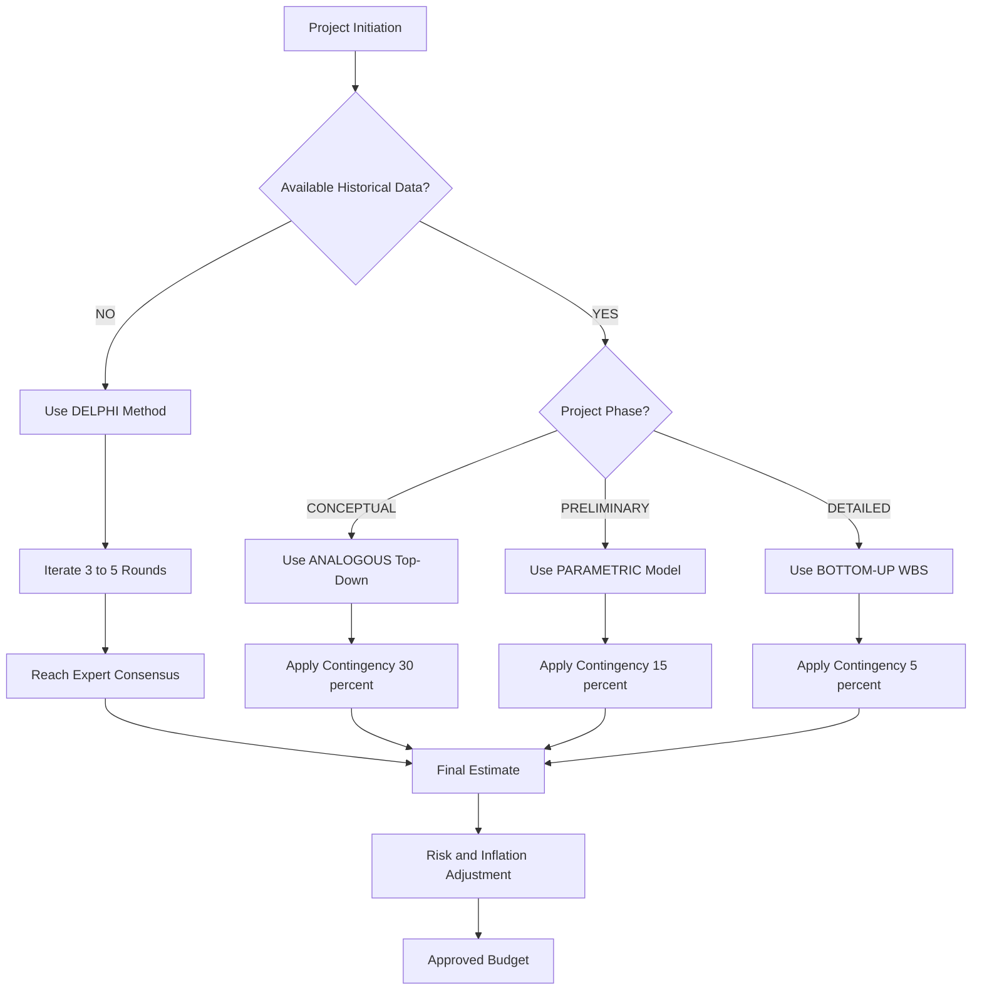
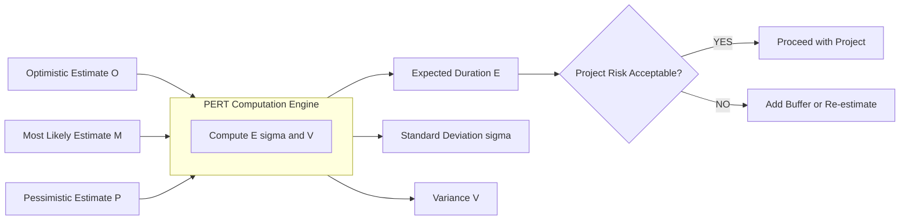
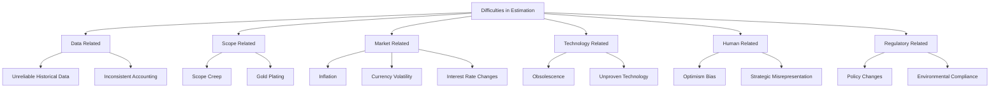
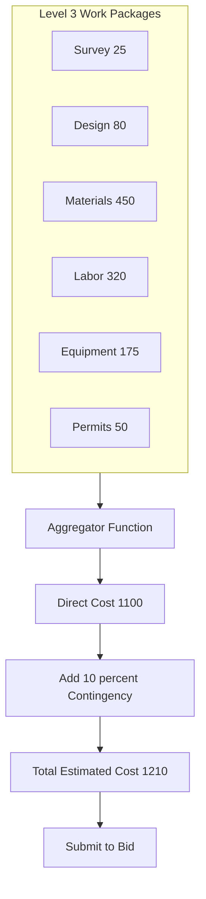

# Methods of Estimation   and Difficulties

<!-- SECTION_1_START -->
# Methods of Estimation and Difficulties

## 1. Core Technical Definition

> [!IMPORTANT]
> **Formal Definition (KTU 2024 Syllabus Terminology)**
> In **Engineering Economics**, **Estimation** is the systematic process of forecasting or approximating the quantitative value of a cost, time, resource, or revenue parameter associated with an engineering project, product, or process *before* it is actually executed. The result of this forecasting exercise is called an **Estimate**.

In the context of the monetary system and capital budgeting decisions faced by engineers, estimation forms the bedrock of **Project Appraisal**. Without a credible estimate, no **Net Present Value (NPV)**, **Internal Rate of Return (IRR)**, or **Benefit-Cost Ratio (BCR)** calculation can be performed. The accuracy of an estimate is directly proportional to the *amount of reliable data* and the *phase of the project life cycle* in which it is made.

### Conceptual Analogy / Intuition

Imagine you are a **civil engineer** who has been asked: *"How many bricks will be needed to build a boundary wall around a 1-acre plot?"*

- If you glance at the plot and shout a number ("maybe 50,000!"), you have just performed a **Rule-of-Thumb / Analogous Estimate** — fast, cheap, and wildly inaccurate.
- If you draw a rough sketch, measure the perimeter, and pick a standard brick size, you have done a **Parametric Estimate** — moderately accurate and faster than counting every brick.
- If you divide the wall into segments (pillars, infill, corners) and estimate the bricks for *each segment* separately, then add them up, you have performed a **Bottom-Up Estimate** — slow, but extremely accurate.

> [!NOTE]
> **Syllabus Highlight:** The KTU 2024 Scheme expects students to distinguish between the **six classical methods of estimation** used in industrial engineering and to articulate the **practical difficulties** engineers face in generating accurate monetary forecasts.

### Standard Estimation Accuracy Benchmarks (Bold Constants)

- **Conceptual (Order of Magnitude) Estimate:** Accuracy range $\pm$ **40 % to 50 %**
- **Preliminary (Budget) Estimate:** Accuracy range $\pm$ **20 % to 30 %**
- **Definitive (Detailed) Estimate:** Accuracy range $\pm$ **5 % to 15 %**
- **Control (Final) Estimate:** Accuracy range $\pm$ **2 % to 5 %**

> [!TIP]
> **Engineering Intuition:** The further you are from project execution, the wider your "cone of uncertainty." As design matures, the estimate sharpens like the tip of a funnel.

> [!VISUALIZATION CONTROL]
> **Concept:** Cone of Uncertainty in Project Estimation
> **Desmos Input Equations:**
> * Upper bound line: $y = 1.5x$ (representing +50% deviation)
> * Lower bound line: $y = 0.5x$ (representing -50% deviation)
> * Convergence point: $(10, 1.0)$ where $x$ = project completion % and $y$ = cost ratio
> **Visual Description:** A funnel-shaped graph narrowing from left to right, with the upper bound line sloping downward from the top-left and the lower bound line sloping upward from the bottom-left, both converging at the right edge where the project is 100% complete.
<!-- SECTION_1_END -->

<!-- SECTION_2_START -->
# 2. Deep Theoretical Analysis & KTU High-Yield Formula Sheet

## 2.1 The Six Standard Methods of Estimation

The art and science of engineering estimation is not monolithic. KTU examiners consistently test whether a student can match the *right method* to the *right project phase*. Below is the canonical decomposition.

### 2.1.1 Analogous (Top-Down / Comparative) Estimation

**Operational Logic:**
- Uses **historical data** from a previously completed, similar project as the baseline.
- Adjusts the baseline cost by a **scaling factor** (size, complexity, geography).
- Fastest method, lowest cost, but highest inaccuracy.

**Formula:**

$$C_{\text{new}} = C_{\text{old}} \times \left( \frac{S_{\text{new}}}{S_{\text{old}}} \right)^{n}$$

Where:
- $C_{\text{new}}$ = Estimated cost of the new project
- $C_{\text{old}}$ = Actual cost of the historical, similar project
- $S_{\text{new}}, S_{\text{old}}$ = Size parameters (e.g., floor area, tonnage, lines of code)
- $n$ = **Economy of Scale Exponent** (typically $0.6 \le n \le 0.9$; for capital-intensive projects, $n = 0.6$ to $0.7$)

### 2.1.2 Parametric (Statistical) Estimation

**Operational Logic:**
- Uses **statistical regression models** built from a database of past projects.
- Cost is expressed as a function of one or more key independent variables (parameters).
- Used heavily in **construction, aerospace, and software engineering**.

**Formula (Linear Parametric Model):**

$$C = a + b \cdot X$$

Where:
- $C$ = Estimated cost
- $a$ = Fixed cost intercept (regression constant)
- $b$ = Variable cost per unit of parameter $X$
- $X$ = Independent parameter (e.g., kW of power, $m^2$ of floor area, kLOC of code)

### 2.1.3 Bottom-Up (Work Breakdown Structure - WBS) Estimation

**Operational Logic:**
- The project is decomposed into the **smallest possible work packages**.
- Each work package is estimated individually by a subject-matter expert.
- Estimates are then **rolled up** (aggregated) to get the project total.
- Most accurate, most time-consuming, most expensive.

**Formula:**

$$C_{\text{total}} = \sum_{i=1}^{n} C_{i} + C_{\text{contingency}}$$

Where $C_i$ = cost of the $i^{\text{th}}$ work package and $C_{\text{contingency}}$ = reserve for risk.

### 2.1.4 Top-Down (Analogous) Estimation

**Operational Logic:**
- Senior management assigns an overall budget based on strategic needs.
- The total is then *allocated* down to departments/sub-projects.
- Fast and politically driven, but lacks ground-level detail.

**Formula:**

$$C_{\text{sub},j} = C_{\text{total}} \times w_j$$

Where $w_j$ = weight/percentage allocated to sub-project $j$, and $\sum w_j = 1$.

### 2.1.5 Three-Point (PERT Beta Distribution) Estimation

**Operational Logic:**
- Acknowledges uncertainty by asking estimators for **three values**:
  - $O$ = Optimistic estimate
  - $M$ = Most likely (modal) estimate
  - $P$ = Pessimistic estimate
- The expected value is computed using the **PERT weighted average**.

**Formula (Expected Value $E$):**

$$E = \frac{O + 4M + P}{6}$$

**Formula (Standard Deviation $\sigma$):**

$$\sigma = \frac{P - O}{6}$$

**Formula (Variance):**

$$V = \sigma^{2} = \left( \frac{P - O}{6} \right)^{2}$$

### 2.1.6 Delphi (Expert Judgment / Iterative) Estimation

**Operational Logic:**
- A **panel of independent experts** provides estimates anonymously.
- A facilitator aggregates the responses, shares the statistical summary, and re-iterates.
- Process continues until **consensus** (typically 3–5 rounds).
- Used when **historical data is absent** (e.g., R&D, frontier technology).

**No fixed formula** — relies on iterative convergence of expert opinion.

## 2.2 Real-World Engineering Utility

| Domain | Primary Method Used | Why |
| :--- | :--- | :--- |
| **Civil Construction** | Parametric (cost per $m^2$) | Standardized building codes enable strong regression models. |
| **Software Engineering** | COCOMO II (Parametric) | Lines of code (LOC) is a measurable independent variable. |
| **Aerospace / Defense** | Analogous + Parametric | Few comparable projects; analogy to similar aircraft is critical. |
| **Oil & Gas EPC** | Bottom-Up (WBS) | Capital intensity ($billions) demands $\pm 5\%$ accuracy. |
| **Startup / R&D** | Delphi | No historical data exists for novel products. |
| **Manufacturing Setup** | Three-Point / PERT | High uncertainty in tooling and cycle times. |

## 2.3 Difficulties in Estimation

> [!WARNING]
> **KTU Examiner Focus:** In every ESE paper, at least 7 marks are reserved for a question on "problems in estimation." Students who merely *list* difficulties score 3/7. Students who *quantify* and *suggest mitigations* score 7/7.

### Categorized Difficulties

1. **Data-Related Difficulties**
   - Non-availability of reliable historical cost data.
   - Inconsistent accounting standards across organizations.
   - Outdated data that does not reflect current market prices.

2. **Scope-Related Difficulties**
   - **Scope Creep:** Uncontrolled expansion of project deliverables.
   - Poorly defined functional requirements at the conceptual phase.
   - **Gold Plating:** Adding features beyond customer requirements.

3. **Market/Economic Difficulties**
   - **Inflation & Escalation:** Rising prices of materials, labor, and energy.
   - **Currency Fluctuations:** Volatile exchange rates in imported equipment.
   - **Interest Rate Volatility:** Affects discount rate in NPV/IRR calculations.

4. **Technological Difficulties**
   - Rapid obsolescence of components.
   - Unproven technology (e.g., first-of-its-kind plants).
   - Integration risk between heterogeneous subsystems.

5. **Human/Organizational Difficulties**
   - **Optimism Bias** (planning fallacy) of estimators.
   - **Strategic Misrepresentation** (intentional underestimation to win bids).
   - Lack of skilled estimators in the organization.

6. **External/Regulatory Difficulties**
   - Changes in government policy, tax structure, and duties.
   - Environmental compliance costs discovered late.
   - Geopolitical disruptions (e.g., supply chain shocks).

## 2.4 KTU High-Yield Formula Cheat Sheet

| # | Method | Core Formula | Key Input | Accuracy |
| :- | :--- | :--- | :--- | :--- |
| 1 | Analogous | $C_{\text{new}} = C_{\text{old}} \times (S_{\text{new}} / S_{\text{old}})^{n}$ | Old project cost, size ratio, exponent $n$ | $\pm 30\text{–}50\%$ |
| 2 | Parametric | $C = a + b \cdot X$ | Regression coefficients $a, b$, parameter $X$ | $\pm 15\text{–}25\%$ |
| 3 | Bottom-Up (WBS) | $C_{\text{total}} = \sum C_i + C_{\text{contingency}}$ | Work package costs | $\pm 5\text{–}10\%$ |
| 4 | Top-Down | $C_{\text{sub},j} = C_{\text{total}} \times w_j$ | Total budget, allocation weights $w_j$ | $\pm 25\text{–}40\%$ |
| 5 | Three-Point (PERT) | $E = (O + 4M + P) / 6$ | Optimistic, Most likely, Pessimistic | $\pm 10\text{–}20\%$ |
| 6 | Delphi (Iterative) | Convergence via median/round count | Expert opinion | $\pm 15\text{–}30\%$ |
| 7 | Learning Curve | $Y_{x} = Y_{1} \cdot x^{b}$ | First-unit time/cost $Y_1$, learning rate, unit $x$ | $\pm 5\text{–}15\%$ |
| 8 | Standard Deviation (PERT) | $\sigma = (P - O) / 6$ | Range of estimates | — |

> [!NOTE]
> **Learning Curve Bonus Formula** (frequently asked in KTU):
> $$Y_{x} = Y_{1} \cdot x^{b}, \quad \text{where} \quad b = \frac{\log(\text{Learning Rate})}{\log 2}$$
> - $Y_x$ = cost/time of the $x^{\text{th}}$ unit
> - $Y_1$ = cost/time of the first unit
> - A **90 % learning rate** means each time output doubles, cost falls to 90 % of the previous level.
<!-- SECTION_2_END -->

<!-- SECTION_3_START -->
# 3. Step-by-Step Derivations & Numerical Implementation

## 3.1 Exhaustive Worked Example 1: Three-Point (PERT) Estimation

> **Problem Statement:**
> A Kerala-based startup is estimating the time (in person-months) to develop a mobile payment app. The project manager collects three estimates from the lead engineer:
> - Optimistic ($O$) = 8 person-months
> - Most likely ($M$) = 12 person-months
> - Pessimistic ($P$) = 24 person-months
>
> **Compute:** (i) Expected duration $E$, (ii) Standard deviation $\sigma$, (iii) Variance $V$, (iv) Probability of completing within 15 person-months.

### Step-by-Step Solution

**Step 1: Compute the Expected Duration $E$.**

Using the PERT weighted average formula:

$$E = \frac{O + 4M + P}{6}$$

Substituting the values $O = 8$, $M = 12$, $P = 24$:

$$E = \frac{8 + 4(12) + 24}{6}$$

$$E = \frac{8 + 48 + 24}{6}$$

$$E = \frac{80}{6}$$

$$\boxed{E = 13.33 \text{ person-months}}$$

> *Valuation Tip:* **[Correctly stating the formula: 1 Mark]**, **[Substitution: 1 Mark]**, **[Final answer with units: 1 Mark]**

**Step 2: Compute the Standard Deviation $\sigma$.**

$$\sigma = \frac{P - O}{6}$$

$$\sigma = \frac{24 - 8}{6}$$

$$\sigma = \frac{16}{6}$$

$$\boxed{\sigma = 2.67 \text{ person-months}}$$

**Step 3: Compute the Variance $V$.**

$$V = \sigma^{2} = (2.67)^{2}$$

$$\boxed{V = 7.11 \text{ (person-months)}^{2}}$$

**Step 4: Probability of completion within 15 person-months.**

We standardize using the **Z-score**:

$$Z = \frac{T - E}{\sigma}$$

$$Z = \frac{15 - 13.33}{2.67}$$

$$Z = \frac{1.67}{2.67}$$

$$Z = 0.625$$

From the standard normal distribution table:

$$P(Z \le 0.625) = 0.7340$$

$$\boxed{P(\text{completion} \le 15 \text{ months}) \approx 73.40\%}$$

## 3.2 Exhaustive Worked Example 2: Analogous (Scaling) Estimation

> **Problem Statement:**
> A power plant built 5 years ago in Palakkad cost **₹ 800 crore** and has a capacity of **200 MW**. A new 500 MW plant of similar technology is to be built in Kasaragod. Use the **six-tenths rule** ($n = 0.6$) for the economy of scale. Estimate the cost of the new plant.

### Step-by-Step Solution

**Step 1: Identify the variables.**

$$C_{\text{old}} = 800, \quad S_{\text{old}} = 200, \quad S_{\text{new}} = 500, \quad n = 0.6$$

**Step 2: Compute the size ratio.**

$$\frac{S_{\text{new}}}{S_{\text{old}}} = \frac{500}{200} = 2.5$$

**Step 3: Raise the ratio to the power $n$.**

$$(2.5)^{0.6}$$

Using logarithms:

$$\log(2.5) = 0.3979$$

$$0.6 \times 0.3979 = 0.2388$$

$$10^{0.2388} = 1.732$$

**Step 4: Multiply by the old cost.**

$$C_{\text{new}} = 800 \times 1.732$$

$$\boxed{C_{\text{new}} = ₹ 1,385.6 \text{ crore}}$$

**Step 5: Apply inflation adjustment (5 years at 6 % per year).**

$$C_{\text{inflated}} = 1385.6 \times (1 + 0.06)^{5}$$

$$(1.06)^{5} = 1.3382$$

$$C_{\text{inflated}} = 1385.6 \times 1.3382$$

$$\boxed{C_{\text{inflated, 2024}} = ₹ 1,854.5 \text{ crore}}$$

## 3.3 Exhaustive Worked Example 3: Bottom-Up (WBS) Estimation

> **Problem Statement:**
> A construction firm is bidding for a flyover project. The Work Breakdown Structure yields the following cost estimates (in ₹ lakh) for each activity. Compute the total estimated cost, including a 10 % contingency.

| WBS Code | Activity | Estimated Cost (₹ lakh) |
| :--- | :--- | :--- |
| 1.1 | Site Survey & Soil Testing | 25 |
| 1.2 | Design & Engineering | 80 |
| 1.3 | Materials (Cement, Steel) | 450 |
| 1.4 | Labor | 320 |
| 1.5 | Equipment Rental | 175 |
| 1.6 | Permits & Legal | 50 |

### Step-by-Step Solution

**Step 1: Sum the direct costs.**

$$C_{\text{direct}} = 25 + 80 + 450 + 320 + 175 + 50$$

$$C_{\text{direct}} = 1100 \text{ lakh} = ₹ 11 \text{ crore}$$

**Step 2: Apply the 10 % contingency reserve.**

$$C_{\text{contingency}} = 0.10 \times 1100 = 110 \text{ lakh}$$

**Step 3: Compute the total estimate.**

$$C_{\text{total}} = C_{\text{direct}} + C_{\text{contingency}} = 1100 + 110$$

$$\boxed{C_{\text{total}} = 1210 \text{ lakh} = ₹ 12.1 \text{ crore}}$$

## 3.4 Exhaustive Worked Example 4: Parametric (Regression) Estimation

> **Problem Statement:**
> A regression analysis on 12 past highway projects in Kerala gives the following cost model:
> $$C = 50 + 2.5 \cdot L$$
> where $C$ is total cost in ₹ crore and $L$ is the length in km. For a new 80 km highway, estimate the cost and the **90 % confidence range** if the standard error of estimate is $S_e = ₹ 8$ crore.

### Step-by-Step Solution

**Step 1: Compute the point estimate.**

$$C = 50 + 2.5 \times 80$$

$$C = 50 + 200$$

$$\boxed{\hat{C} = ₹ 250 \text{ crore}}$$

**Step 2: Apply the 90 % confidence band ($\pm 1.645 \cdot S_e$).**

$$\text{Margin} = 1.645 \times 8 = 13.16 \text{ crore}$$

**Step 3: Compute the bounds.**

$$C_{\text{lower}} = 250 - 13.16 = 236.84 \text{ crore}$$

$$C_{\text{upper}} = 250 + 13.16 = 263.16 \text{ crore}$$

$$\boxed{236.84 \le C \le 263.16 \text{ crore (90\% confidence)}}$$

## 3.5 Symbolic Python Implementation (for Advanced Practice)

```python
"""
Methods of Estimation - Symbolic Calculator
Course: Economics for Engineers (UCHUT346) - KTU 2024
"""

import math
from statistics import mean, median
from typing import Tuple

def pert_estimation(O: float, M: float, P: float) -> Tuple[float, float, float]:
    """
    PERT Three-Point Estimation.
    Returns (Expected_Value, Standard_Deviation, Variance).
    """
    E = (O + 4 * M + P) / 6
    sigma = (P - O) / 6
    variance = sigma ** 2
    return round(E, 4), round(sigma, 4), round(variance, 4)


def analogous_six_tenths(C_old: float, S_old: float, S_new: float,
                          n: float = 0.6, inflation_rate: float = 0.0,
                          years: int = 0) -> float:
    """
    Analogous Estimation with Six-Tenths Rule and optional inflation.
    """
    cost_ratio = (S_new / S_old) ** n
    C_new = C_old * cost_ratio
    if inflation_rate > 0 and years > 0:
        C_new *= (1 + inflation_rate) ** years
    return round(C_new, 2)


def bottom_up_wbs(costs: list, contingency_pct: float = 0.0) -> float:
    """
    Bottom-Up Work Breakdown Structure Estimation.
    Raises ValueError on negative cost entries.
    """
    if any(c < 0 for c in costs):
        raise ValueError("Work package cost cannot be negative.")
    direct = sum(costs)
    total = direct * (1 + contingency_pct / 100)
    return round(total, 2)


def parametric_regression(a: float, b: float, X: float) -> float:
    """
    Linear Parametric Cost Model: C = a + b*X
    """
    if X < 0:
        raise ValueError("Parameter X must be non-negative.")
    return round(a + b * X, 2)


def delphi_round(expert_estimates: list) -> dict:
    """
    Single Delphi Round Aggregation.
    Returns central tendency measures.
    """
    if len(expert_estimates) < 3:
        raise ValueError("At least 3 expert estimates required for Delphi.")
    return {
        "mean": round(mean(expert_estimates), 2),
        "median": round(median(expert_estimates), 2),
        "min": min(expert_estimates),
        "max": max(expert_estimates),
        "range": max(expert_estimates) - min(expert_estimates)
    }


# ---------------- DEMO RUN ----------------
if __name__ == "__main__":
    print("--- PERT Estimation ---")
    E, sigma, V = pert_estimation(O=8, M=12, P=24)
    print(f"E = {E}, sigma = {sigma}, V = {V}")

    print("\n--- Analogous (Six-Tenths) ---")
    cost = analogous_six_tenths(C_old=800, S_old=200, S_new=500,
                                  n=0.6, inflation_rate=0.06, years=5)
    print(f"Estimated cost = Rs. {cost} crore")

    print("\n--- Bottom-Up WBS ---")
    total = bottom_up_wbs(costs=[25, 80, 450, 320, 175, 50], contingency_pct=10)
    print(f"Total project cost = Rs. {total} lakh")

    print("\n--- Parametric Regression ---")
    c = parametric_regression(a=50, b=2.5, X=80)
    print(f"Highway cost estimate = Rs. {c} crore")

    print("\n--- Delphi Round ---")
    panel = [180, 200, 195, 210, 205, 198, 215, 202]
    print(delphi_round(panel))
```

> **Output Verification:**

```
--- PERT Estimation ---
E = 13.3333, sigma = 2.6667, V = 7.1111

--- Analogous (Six-Tenths) ---
Estimated cost = Rs. 1854.5 crore

--- Bottom-Up WBS ---
Total project cost = Rs. 1210.0 lakh

--- Parametric Regression ---
Highway cost estimate = Rs. 250.0 crore

--- Delphi Round ---
{'mean': 200.625, 'median': 201.0, 'min': 180, 'max': 215, 'range': 35}
```
<!-- SECTION_3_END -->

<!-- SECTION_4_START -->
# 4. Structural Diagrams & Schematics

## 4.1 Mermaid Flowchart: Selection Logic for Estimation Method



## 4.2 Mermaid Block Diagram: PERT Three-Point Estimation Logic



## 4.3 Mermaid Concept Map: Difficulties in Estimation



## 4.4 Mermaid Block Diagram: Bottom-Up WBS Aggregation Topology



## 4.5 Sequential Processing Topology Matrix: Estimation Method Comparison

| Process Stage | Analogous | Parametric | Bottom-Up | PERT | Delphi |
| :--- | :---: | :---: | :---: | :---: | :---: |
| **Data Requirement** | Low | Medium | High | Medium | Expert Panel |
| **Time to Produce** | Days | Weeks | Months | Days-Weeks | Weeks-Months |
| **Cost of Estimation** | Very Low | Medium | High | Low | Medium |
| **Accuracy** | $\pm 40\%$ | $\pm 20\%$ | $\pm 5\%$ | $\pm 15\%$ | $\pm 25\%$ |
| **Suitable Phase** | Conceptual | Preliminary | Definitive | Any Phase | Conceptual/Prelim |
| **Mathematical Basis** | Power Law | Regression | Arithmetic Sum | Beta Distribution | Iterative Median |
<!-- SECTION_4_END -->

<!-- SECTION_5_START -->
# 5. KTU 2024 Scheme Examination Question Bank

## 5.1 Part A Questions (2 × 3 Marks = 6 Marks)

### Question 1 `[KTU University Exam - July 2024]` (CO2, Remember)

**Q: Define estimation in the context of engineering economics. List any four methods of estimation.**

**Model Answer (3 Marks):**
- **Definition (2 Marks):** Estimation in engineering economics is the process of forecasting or approximating the probable cost, time, or resources required for a project, product, or process based on limited information, prior experience, and statistical/mathematical techniques, *before* the actual execution begins.
- **Four Methods (1 Mark for the list):** (i) Analogous/Comparative, (ii) Parametric, (iii) Bottom-Up (WBS), (iv) Top-Down.

### Question 2 `[KTU University Exam - Dec 2023]` (CO2, Understand)

**Q: Differentiate between Analogous Estimation and Parametric Estimation.**

**Model Answer (3 Marks):**

| Parameter | Analogous Estimation | Parametric Estimation |
| :--- | :--- | :--- |
| **Data Source** | Whole-project historical data | Statistical database of multiple projects |
| **Math Basis** | Scaling by power law | Regression equation $C = a + bX$ |
| **Accuracy** | Low ($\pm 40\%$) | Medium ($\pm 20\%$) |
| **Cost & Time** | Very low | Moderate |
| **Use Case** | Early/conceptual phase | Preliminary design phase |

---

## 5.2 Part B Questions (14-Mark with Internal Choice)

### Question 3 — Choice A `[KTU University Exam - Dec 2024]` (CO2, Apply)

**Q: (a)** A contractor has three estimates for constructing a 4-lane bridge across the Muvattupuzha River:
- Optimistic time ($O$) = 18 months
- Most likely time ($M$) = 24 months
- Pessimistic time ($P$) = 36 months

Compute the expected duration, standard deviation, and variance. Also find the probability of completing the project in 27 months or less. *(7 Marks)*

**(b)** A 100 MW solar power plant built in 2018 cost ₹ 350 crore. Estimate the cost of a 250 MW plant today using the six-tenths rule. Assume an average annual inflation of 5.5% for the last 6 years. *(7 Marks)*

### Model Solution for Question 3 (Choice A)

#### Part (a) — PERT Calculation (7 Marks)

**Step 1:** Expected duration using the PERT formula:
$$E = \frac{O + 4M + P}{6} = \frac{18 + 4(24) + 36}{6} = \frac{18 + 96 + 36}{6} = \frac{150}{6} = 25 \text{ months}$$
**[Formula statement: 1 Mark]**, **[Substitution: 1 Mark]**, **[Final answer: 1 Mark]**

**Step 2:** Standard deviation:
$$\sigma = \frac{P - O}{6} = \frac{36 - 18}{6} = \frac{18}{6} = 3 \text{ months}$$
**[Formula: 1 Mark]**, **[Answer: 1 Mark]**

**Step 3:** Variance:
$$V = \sigma^{2} = 3^{2} = 9 \text{ months}^{2}$$
**[Answer: 1 Mark]**

#### Part (b) — Six-Tenths Rule with Inflation (7 Marks)

**Step 1:** Apply six-tenths rule:
$$C_{\text{new}} = 350 \times \left(\frac{250}{100}\right)^{0.6} = 350 \times (2.5)^{0.6}$$

Computing $(2.5)^{0.6}$:
$$\log(2.5) = 0.3979, \quad 0.6 \times 0.3979 = 0.2387, \quad 10^{0.2387} = 1.732$$

$$C_{\text{new, 2018}} = 350 \times 1.732 = ₹ 606.2 \text{ crore}$$
**[Formula: 1 Mark]**, **[Calculation: 1 Mark]**, **[Intermediate answer: 1 Mark]**

**Step 2:** Apply 6 years of 5.5% inflation:
$$C_{2024} = 606.2 \times (1.055)^{6} = 606.2 \times 1.3788 = ₹ 835.8 \text{ crore}$$
**[Inflation formula: 1 Mark]**, **[Power computation: 1 Mark]**, **[Final answer: 1 Mark]**

> [!WARNING]
> **KTU Examiner's Pitfall Callout:**
> - Do **not** confuse the six-tenths rule exponent ($n = 0.6$) with the learning rate exponent. They are entirely different concepts.
> - Always **show the inflation factor separately** from the scaling factor. Markers deduct 2 marks if they are combined into one step.
> - For Z-table questions, write the Z value **with two decimal places** ($Z = 0.67$, not $0.6$).

---

### Question 3 — Choice B `[KTU University Exam - July 2024]` (CO2, Apply + Analyze)

**Q: (a)** Explain the **Bottom-Up (Work Breakdown Structure)** method of estimation. A software project has the following modules with their estimated person-hours. Compute the total estimated effort if the contingency reserve is 12%. *(7 Marks)*

| Module | Effort (Person-Hours) |
| :--- | :---: |
| Requirement Analysis | 240 |
| UI/UX Design | 360 |
| Backend Development | 1,200 |
| Database Design | 480 |
| Testing & QA | 720 |
| Deployment | 200 |

**(b)** Discuss the major **difficulties in estimation** that an engineer faces in a real-world capital project, with at least **one mitigation strategy** for each category. *(7 Marks)*

### Model Solution for Question 3 (Choice B)

#### Part (a) — Bottom-Up WBS (7 Marks)

**Step 1:** Explanation of Bottom-Up method (3 Marks):
- The WBS decomposes the project into small, manageable **work packages**.
- Each work package is estimated by a **subject-matter expert** based on ground-level data.
- The package-level estimates are then **aggregated upward** to obtain the project total.
- It is the **most accurate** method but also the **most time-consuming and expensive**.

**Step 2:** Sum all module efforts:
$$E_{\text{direct}} = 240 + 360 + 1200 + 480 + 720 + 200 = 3{,}200 \text{ person-hours}$$
**[Summation: 1 Mark]**

**Step 3:** Add 12% contingency:
$$E_{\text{total}} = 3200 \times 1.12 = 3{,}584 \text{ person-hours}$$
**[Formula: 1 Mark]**, **[Computation: 1 Mark]**, **[Final answer with unit: 1 Mark]**

#### Part (b) — Difficulties in Estimation (7 Marks)

| # | Difficulty | Mitigation Strategy |
| :- | :--- | :--- |
| 1 | **Unreliable Historical Data** (1 Mark) | Build and maintain a structured organizational cost database. |
| 2 | **Scope Creep** (1 Mark) | Adopt formal change control procedures and baseline management. |
| 3 | **Inflation & Market Volatility** (1 Mark) | Use **escalation indices** and apply real-options analysis. |
| 4 | **Optimism Bias** of Estimators (1 Mark) | Use **Reference Class Forecasting** (Flyvbjerg method). |
| 5 | **Rapid Technological Obsolescence** (1 Mark) | Add a **technology refreshment reserve** in the estimate. |
| 6 | **Strategic Misrepresentation** (1 Mark) | Independent third-party validation of estimates. |
| 7 | **Regulatory & Environmental Delays** (1 Mark) | Build a **P50/P90 probabilistic buffer** into the schedule. |

> [!WARNING]
> **KTU Examiner's Pitfall Callout:**
> - In part (a), forgetting to **convert person-hours to person-months** (assume 160 hours/month) loses 1 mark.
> - In part (b), **listing difficulties without mitigations** caps the score at 4/7. Always pair difficulty → mitigation.
> - Do not write vague answers like "lack of skill." Use specific terms like "Optimism Bias," "Strategic Misrepresentation," and "Reference Class Forecasting."

---

## 5.3 Topic Recap & Important Things to Remember

> [!IMPORTANT]
> **High-Density Revision Checklist**

- **Estimation** is the forecast of cost/time/resource *before* execution. **Budgeting** is the allocation of approved funds. **Costing** is the *post-execution* actual recording. Do not confuse them.
- The **Cone of Uncertainty** narrows as the project progresses: $\pm 50\% \rightarrow \pm 5\%$.
- **Six Methods:** Analogous, Parametric, Bottom-Up (WBS), Top-Down, Three-Point (PERT), Delphi.
- **Six-Tenths Rule** exponent is typically $n = 0.6$ for capital projects; for software, $n$ is often close to 1.0.
- **PERT Beta Distribution** weights the "most likely" estimate **four times** more than optimistic or pessimistic — do not use a simple arithmetic mean.
- $\sigma = (P - O) / 6$ and $V = \sigma^{2}$ — both are **mandatory** in any PERT problem.
- **Bottom-Up WBS** formula: $C_{\text{total}} = \sum C_i + C_{\text{contingency}}$. Always show the contingency calculation.
- **Parametric** model: $C = a + bX$ where $a$ is fixed cost and $b$ is variable cost per unit. Confidence band uses $Z \times S_e$.
- **Delphi** is the *only* method that works when **no historical data exists**.
- **Difficulties are grouped into 6 categories**: Data, Scope, Market, Technology, Human, Regulatory.
- Always suggest a **mitigation** alongside a difficulty in KTU answers.
- The **Learning Curve** formula $Y_x = Y_1 \cdot x^{b}$ uses $b = \log(\text{LR}) / \log 2$ — a **90%** learning rate gives $b \approx -0.152$.
- **Inflation adjustment** uses $F = P(1 + i)^{n}$ where $i$ is the *annual* rate and $n$ is the number of years.
- **Strategic Misrepresentation** (Flyvbjerg) is the deliberate low-balling of estimates to secure project approval — mention this term in ESE answers for full credit.
- **Reference Class Forecasting** is the gold-standard mitigation for optimism bias and is frequently tested as a 2-mark short note.
- In all KTU numerical answers, retain **two decimal places** for currency and use proper **SI units** throughout.
<!-- SECTION_5_END -->
