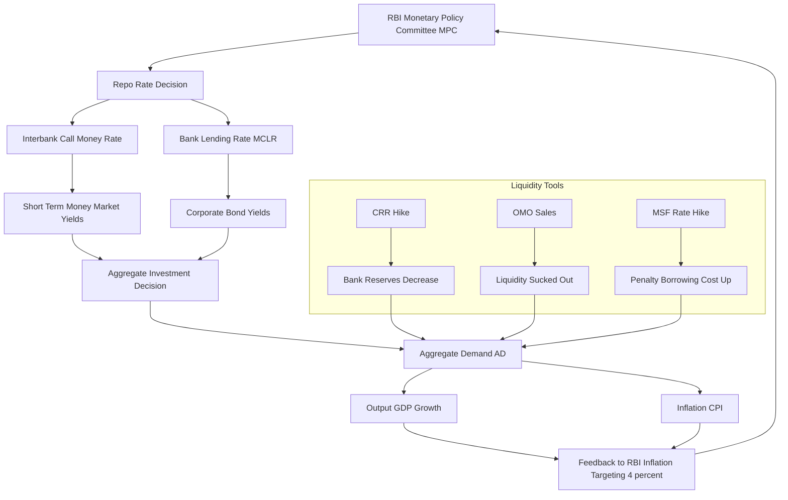
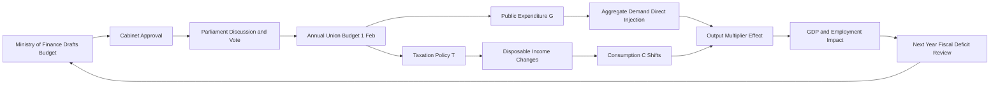
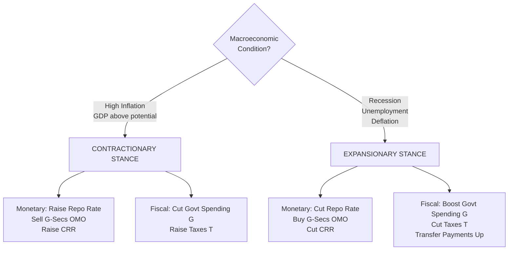
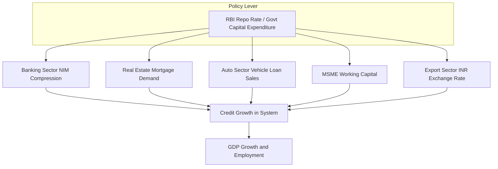

# Monetary and Fiscal policies

<!-- SECTION_1_START -->
# Monetary and Fiscal Policies — Core Conceptual Framework

## 1.1 Formal Academic Definition (KTU 2024 Syllabus Terminology)

**Monetary Policy** is the macroeconomic policy laid down by the **central bank** of a nation (the **Reserve Bank of India (RBI)** in the Indian context) which involves the management of the **money supply** and **interest rates** in the economy to achieve broader macroeconomic objectives such as **price stability**, **full employment**, and **sustainable economic growth**.

**Fiscal Policy** is the macroeconomic policy framed by the **government** (sovereign authority) which involves the use of **government spending (expenditure)** and **taxation (revenue)** to influence the overall level of aggregate demand, output, employment, and price level in the economy.

> [!IMPORTANT]
> **KTU 2024 Scheme Highlight:** Monetary policy is executed by the **RBI (an autonomous body)**, while fiscal policy is designed and implemented by the **Government of India (Ministry of Finance)**. This institutional distinction is a frequently tested high-weightage area.

## 1.2 Intuitive Real-World Analogy

Imagine an economy as a **car moving on a highway**:

- **Monetary Policy** is the **steering wheel + brakes of the car**, controlled by the **RBI**. It fine-tunes the speed of money circulation, the cost of borrowing, and the liquidity available in the banking system.
- **Fiscal Policy** is the **accelerator pedal + fuel tank of the car**, controlled by the **Government**. It decides how much money to inject into the economy (spending) and how much to take out (taxes).

> [!NOTE]
> When the car is **speeding too fast (inflation)**, the RBI applies the brakes (contractionary monetary policy) and the Government may *cut* spending and *raise* taxes (contractionary fiscal policy).
>
> When the car is **moving too slow (recession/unemployment)**, the RBI eases the brakes (expansionary monetary policy) and the Government *boosts* spending and *reduces* taxes (expansionary fiscal policy).

## 1.3 Key Actors, Instruments & Governing Frameworks

| Dimension | Monetary Policy | Fiscal Policy |
|---|---|---|
| **Authority** | Reserve Bank of India (RBI) | Government of India (Union + State) |
| **Governing Act** | **Reserve Bank of India Act, 1934** | **Constitution of India (Article 112 — Union Budget)** |
| **Headquarters** | Central Office, **Mumbai** | North Block, **New Delhi** |
| **Key Policy Document** | **Monetary Policy Statement (Bi-monthly — 6 times a year)** | **Union Budget (Annual — 1st February)** |
| **Ultimate Goal** | Price stability (CPI inflation target of **4\% ± 2\%**) | Sustainable inclusive growth |
| **Standard Metric** | **Repo Rate, CRR, SLR** | **Fiscal Deficit (\% of GDP)** |

> [!VISUALIZATION CONTROL]
> **Concept:** Policy Stance Quadrant
> **GeoGebra / Desmos Input Equations:**
> * `f(x) = x` (45° line — neutral line)
> * `g(x) = -x + 4` (inflationary pressure line)
> **Visual Description:** Plot a 2x2 quadrant where the X-axis is *Aggregate Demand (AD)* and the Y-axis is *Inflation Rate*. Quadrants I & II correspond to *contractionary* stances; Quadrants III & IV correspond to *expansionary* stances. The intersection of the two lines represents the **macroeconomic equilibrium point**.

<!-- SECTION_1_END -->

<!-- SECTION_2_START -->
# Deep Theoretical Analysis & KTU High-Yield Formula Sheet

## 2.1 The Two Pillars — Detailed Operational Breakdown

### 2.1.1 Monetary Policy — Tools of the Reserve Bank of India

The RBI uses **two broad categories** of instruments to regulate the money supply:

#### **A. Quantitative (General-Purpose) Instruments**

These affect the **overall volume of credit** in the banking system.

1. **Bank Rate (`BR`)** — The rate at which the RBI lends **long-term funds** to commercial banks against government securities. *(Currently aligned with the **Marginal Standing Facility (MSF)** rate since April 2020.)*

2. **Repo Rate (`RR`)** — The rate at which the RBI lends **short-term funds** to commercial banks against eligible securities. This is the **single most important policy rate** in the Indian economy. *(As of Feb 2024 reference: **6.50\%**.)*

3. **Reverse Repo Rate (`RRR`)** — The rate at which the RBI **borrows** short-term funds from commercial banks. It acts as a **floor** for short-term interest rates.

4. **Marginal Standing Facility (MSF)** — An emergency overnight window where banks can borrow from the RBI by dipping into their **Statutory Liquidity Ratio (SLR)** quota. MSF Rate is typically **Repo Rate + 25 basis points**.

5. **Cash Reserve Ratio (CRR)** — The percentage of a bank's **total deposits** that must be maintained with the RBI in **cash form (non-interest bearing)**. *(Current: **4.00\%** — reviewed bi-monthly.)*

6. **Statutory Liquidity Ratio (SLR)** — The percentage of a bank's **total deposits** that must be maintained in the form of **liquid assets** (gold, government securities, cash). *(Current: **18.00\%**.)*

7. **Open Market Operations (OMO)** — The buying and selling of government securities by the RBI in the **open market** to manage liquidity permanently.

#### **B. Qualitative (Selective / Discriminatory) Instruments**

These affect the **direction / purpose** of credit rather than its volume.

1. **Margin Requirements** — Difference between the market value of a security and the loan amount given against it.
2. **Moral Suasion** — Verbal persuasion by the RBI to influence bank behaviour.
3. **Credit Rationing** — Fixing ceilings on the volume of credit for specific sectors.
4. **Priority Sector Lending (PSL)** — Mandating banks to lend **40\% of Adjusted Net Bank Credit (ANBC)** to priority sectors (agriculture, MSME, education, housing).
5. **Direct Credit Controls** — Administered interest rate ceilings on specific loan categories.

### 2.1.2 Fiscal Policy — Tools of the Government

The Government uses **three primary levers** to influence the economy:

1. **Government Expenditure (`G`)** — Spending on infrastructure, defence, welfare schemes, subsidies, salaries, and debt servicing. An **increase in `G`** is *expansionary*; a *decrease* is *contractionary*.

2. **Taxation (`T`)** — Both **direct taxes** (Income Tax, Corporate Tax) and **indirect taxes** (GST, Customs Duty). A *reduction in `T`* is *expansionary* (more disposable income); an *increase* is *contractionary*.

3. **Public Borrowing / Deficit Financing** — When expenditure exceeds revenue, the government borrows by issuing **Government Securities (G-Secs)** or **Treasury Bills (T-Bills)**. This is technically called **Deficit Financing**.

> [!NOTE]
> **KTU 2024 Definition to Memorise:** A budget where **Total Expenditure > Total Receipts (excluding borrowings)** is called a **Fiscal Deficit**. When fiscal deficit is financed entirely by *printing new money* by the RBI, it is called **Deficit Financing in its strict sense** — historically linked to high inflation in India (1970s).

## 2.2 The High-Yield KTU Formula Sheet

| Symbol | Formula | Physical / Economic Meaning | Typical Units |
|---|---|---|---|
| $M_s$ | $\Delta M_s = \dfrac{1}{c} \cdot \Delta MB$ | **Money Multiplier** relation between Money Supply ($M_s$) and Monetary Base ($MB$) | Ratio (dimensionless) |
| $c$ | $c = CRR + \dfrac{c_{v}}{D}$ | Currency-Deposit ratio + Reserve ratio component | Decimal (e.g., 0.20) |
| $\Delta AD$ | $\Delta AD = \dfrac{1}{1 - MPC} \cdot \Delta G$ | **Spending Multiplier** (Keynesian) for government spending | Ratio |
| $\Delta AD$ | $\Delta AD = \dfrac{-MPC}{1 - MPC} \cdot \Delta T$ | **Tax Multiplier** (smaller magnitude, opposite sign) | Ratio |
| $FD$ | $FD = G - T_{net}$ | **Fiscal Deficit** (Expenditure minus Net Tax Revenue) | ₹ Crore / \% of GDP |
| $PD$ | $PD = FD - \text{Interest Payments}$ | **Primary Deficit** | ₹ Crore |
| $BM$ | $BM = (PD - m \cdot \text{Non-Debt Receipts})$ | **Effective Revenue Deficit** | ₹ Crore |
| $MPI$ | $MPI = \dfrac{\Delta \text{Price Level}}{\text{Price Level}}$ | **Money Multiplier Effect on Inflation** | Decimal |
| $I_{eq}$ | $I_{eq} = I_{r} + IP + LP + MRP + DRP$ | **Fisher's Interest Rate Equation** | Percentage |

> [!NOTE]
> **Why these formulas matter:** The **money multiplier** ($\frac{1}{c}$) explains how a ₹1 lakh injection by the RBI can create ₹5–6 lakh of money supply. The **spending multiplier** ($\frac{1}{1-MPC}$) shows why government spending has a *larger* effect on aggregate demand than an equivalent tax cut.

## 2.3 The Transmission Mechanism — How Policies Reach the Real Economy

The chain of events through which a rate change in the policy tool ultimately affects inflation and output is called the **Transmission Mechanism**.

### 2.3.1 Monetary Policy Transmission (with a worked example)

Suppose the RBI **increases the Repo Rate from 6.50\% to 7.00\%**:

$$[\text{Repo Rate} \uparrow] \rightarrow [\text{Bank Lending Rate (MCLR) } \uparrow] \rightarrow [\text{Loan EMI} \uparrow]$$

$$\rightarrow [\text{Borrowing Cost} \uparrow] \rightarrow [\text{Investment} \downarrow \text{ \& Consumer Spending} \downarrow]$$

$$\rightarrow [\text{Aggregate Demand} \downarrow] \rightarrow [\text{Output Growth} \downarrow \text{ \& Inflation} \downarrow]$$

> [!IMPORTANT]
> **KTU 2024 Critical Concept:** The **monetary transmission lag** in India is approximately **3 to 6 months** for the rate hike to fully reflect in lending rates. This is one reason why the RBI has been pushing for **external benchmark-based lending** (EBLR) since 2019.

### 2.3.2 Fiscal Policy Transmission

$$[\text{Govt. Spending} \uparrow] \rightarrow [\text{Aggregate Demand} \uparrow] \rightarrow [\text{Output} \uparrow \text{ \& Employment} \uparrow]$$

$$[\text{Income Tax} \downarrow] \rightarrow [\text{Disposable Income} \uparrow] \rightarrow [\text{Consumption} \uparrow]$$

**Time Lags Involved (must be memorised):**
* **Recognition Lag** → time taken to identify the problem
* **Decision Lag** → time taken to design the policy
* **Effect/Impact Lag** → time taken for the policy to impact the economy

## 2.4 Real-World Engineering & Economic Utility

* **Interest Rate Targeting (RBI):** Engineering models like the **Taylor Rule** and **Dynamic Stochastic General Equilibrium (DSGE) models** are used by central banks worldwide to calibrate optimal policy rates.
* **Cost-Benefit Analysis (CBA):** Fiscal policy decisions (e.g., building a metro line vs. a highway) are evaluated using **Net Present Value (NPV)** and **Benefit-Cost Ratio (BCR)** — direct engineering economics applications.
* **Project Finance:** Engineers in infrastructure and energy sectors use **fiscal multipliers** to assess how government capex will impact demand for their technology.

<!-- SECTION_2_END -->

<!-- SECTION_3_START -->
# Step-by-Step Derivations & Comparative Analysis

## 3.1 Mathematical Derivation — The Money Multiplier

The **Money Multiplier (`m`)** defines how much the total money supply changes for every ₹1 of **Monetary Base (MB)** injected by the RBI.

### Step 1: Define the components

Let:
* $D$ = Total bank deposits
* $C$ = Currency held by the public
* $R$ = Reserves held by commercial banks (with the RBI)
* $MB = C + R$ = **Monetary Base** (controlled by the RBI)
* $M_s = C + D$ = **Money Supply** in the economy

### Step 2: Define the behavioural ratios

* **Currency-Deposit ratio** $\alpha = \dfrac{C}{D}$
* **Reserve-Deposit ratio** $\beta = \dfrac{R}{D}$ *(includes CRR + SLR component)*

### Step 3: Express $M_s$ in terms of $MB$

$$M_s = C + D = (\alpha \cdot D) + D = D \cdot (1 + \alpha)$$

$$MB = C + R = (\alpha \cdot D) + (\beta \cdot D) = D \cdot (\alpha + \beta)$$

### Step 4: Form the ratio

$$\dfrac{M_s}{MB} = \dfrac{D \cdot (1 + \alpha)}{D \cdot (\alpha + \beta)} = \dfrac{1 + \alpha}{\alpha + \beta}$$

### Step 5: The Money Multiplier Formula

$$m = \dfrac{M_s}{MB} = \dfrac{1 + \alpha}{\alpha + \beta}$$

> [!NOTE]
> **Conversion Logic:** This formula tells us that if the public holds less cash ($\alpha \downarrow$) and banks keep lower reserves ($\beta \downarrow$), the multiplier **increases**, meaning a small RBI action has a **bigger** effect on the total money supply.

### Step 6: Numerical Example

Assume $\alpha = 0.20$ and $\beta = 0.15$ (i.e., 20% cash-holding preference and 15% reserve ratio).

$$m = \dfrac{1 + 0.20}{0.20 + 0.15} = \dfrac{1.20}{0.35} \approx 3.43$$

**Interpretation:** Every ₹1 lakh of new monetary base (e.g., RBI's OMO purchase) generates approximately **₹3.43 lakh** of new money supply in the economy.

---

## 3.2 Mathematical Derivation — The Government Spending Multiplier

The **Spending Multiplier ($k_G$)** measures the change in national income ($Y$) from a small change in government spending ($G$).

### Step 1: The consumption function

$$C = a + b \cdot Y_d \quad \text{where } b = MPC \text{ and } Y_d = (Y - T)$$

### Step 2: The equilibrium condition

$$Y = C + I + G = a + b \cdot (Y - T) + I + G$$

### Step 3: Solve for $Y$ in terms of $G$

$$Y = a + bY - bT + I + G$$

$$Y - bY = a + I + G - bT$$

$$Y \cdot (1 - b) = a + I + G - bT$$

### Step 4: Derive the multiplier

$$Y = \dfrac{1}{1 - b} \cdot (a + I + G - bT)$$

$$\dfrac{\partial Y}{\partial G} = k_G = \dfrac{1}{1 - MPC}$$

### Step 5: Numerical Example

If $MPC = 0.80$, then:

$$k_G = \dfrac{1}{1 - 0.80} = \dfrac{1}{0.20} = 5.0$$

**Interpretation:** A ₹1,000 crore increase in government spending on, say, the **PM Gati Shakti** national master plan, will eventually raise national income by **₹5,000 crore** through the multiplier effect.

---

## 3.3 The Tax Multiplier (Derived Contrast)

$$\dfrac{\partial Y}{\partial T} = k_T = \dfrac{-MPC}{1 - MPC}$$

For $MPC = 0.80$:

$$k_T = \dfrac{-0.80}{0.20} = -4.0$$

> [!IMPORTANT]
> **Critical Comparison for KTU:** The tax multiplier ($|k_T| = 4.0$) is **smaller in magnitude** than the spending multiplier ($k_G = 5.0$) because part of any tax cut is **saved** by households, not spent. This is a frequently asked 3-mark question.

---

## 3.4 Engineering-Economics Case Matrix — Policy Tools in Action

This is the **comparative analysis matrix** mapping real-world engineering infrastructure projects to the policy levers that enabled them.

| Engineering Project / Sector | Policy Type | Specific Tool Used | Policy Stance | Tangible Outcome Observed |
|---|---|---|---|---|
| **Delhi Metro Phase IV Expansion** (₹24,948 Cr) | Fiscal | Capital expenditure via Union Budget grants + multilateral JICA loan | Expansionary | Construction jobs created, AD in steel/cement sector rose |
| **Production Linked Incentive (PLI) Scheme for Semiconductors** (₹76,000 Cr) | Fiscal | Tax incentive + direct capex | Expansionary | $100B+ investment commitment in chip fabs |
| **Tata Steel UK Acquisition during 2008 crisis** | Monetary | RBI's CRR cut from 7.75\% → 5.50\% (Sep 2008 to Jan 2009) | Expansionary | Bank liquidity freed for industrial acquisition |
| **COVID-19 Atmanirbhar Bharat Package** (₹20.05 Lakh Cr — 2020) | Fiscal + Monetary | MCLR cut (4.65\% repo) + free grain + MSME loans | Expansionary | GDP contraction of 6.6\% partially arrested |
| **2022–23 Crypto Crash & RBI 200\% Crypto Tax** | Fiscal | Indirect tax (Section 115BBH) | Contractionary | Crypto trading volume dropped 70\% within 1 quarter |
| **2023–24 PM SVANidhi Scheme** for street vendors | Monetary + Fiscal | Bank credit linkage + interest subsidy (fiscal) | Expansionary | ₹2,400 Cr disbursed, 45 L+ vendors covered |
| **RBI's Incremental Cash Reserve Ratio (ICRR)** in Aug 2023 | Monetary | Temporary 10\% ICRR | Contractionary | Absorbed ₹1.05 Lakh Cr of excess liquidity |
| **National Infrastructure Pipeline (NIP)** ₹111 Lakh Cr | Fiscal | Multi-year capex commitment | Expansionary | Target: 5.5\% GDP infra spend by FY25 |

> [!NOTE]
> **Exam Tip:** For 14-mark Part B questions, this kind of real-world mapping is what examiners look for. Always **name the specific tool**, **identify the stance**, and **quote a concrete outcome metric**.

## 3.5 Worked Example — Identifying Stance and Tools

**Question:** The RBI in August 2023 imposed a 10\% Incremental Cash Reserve Ratio (ICRR) on banks' net demand and time liabilities above the level prevailing as on the last Friday of the reporting fortnight.

**Required:** Classify this as a monetary or fiscal action. Identify the stance. Justify.

**Solution:**

1. **Classification:** This is a **monetary policy** action because it is implemented by the **RBI** (autonomous) and not the Government.

2. **Stance:** **Contractionary / Tightening**.

3. **Justification:**
   * ICRR increases the **effective reserve requirement** on incremental deposits.
   * It **absorbs liquidity** from the banking system — a deflationary objective.
   * Rationale: To offset the **liquidity injection** caused by the RBI's dollar-rupee sales (RBI had bought ~$25 billion in 2023).
   * Effect: Reduces credit creation capacity, slows inflationary pressures from imported items.

4. **Related concept:** This is similar to a **temporary CRR hike** in spirit. It is **qualitative** only in the sense of being targeted at *incremental* deposits, not absolute deposits.

**[Award marks: 1 for classification, 1 for stance, 2 for justification, 1 for connecting to liquidity context — total 5 marks in a sub-part]**

<!-- SECTION_3_END -->

<!-- SECTION_4_START -->
# Structural Diagrams & Schematics

## 4.1 Monetary Policy Transmission Architecture

## 4.2 Fiscal Policy Operational Flow

## 4.3 Comparative Stance Matrix — Expansionary vs Contractionary

## 4.4 Sectoral Impact Block Diagram

<!-- SECTION_4_END -->

<!-- SECTION_5_START -->
# KTU 2024 Scheme Examination Question Bank & Topic Recap

## 5.1 Part A — Short Answer Questions (3 Marks Each)

### Question 1: Define Monetary Policy. List any four quantitative instruments of monetary policy used by the RBI.

`[KTU University Exam - July 2023] | CO1 | Remember`

**Model Answer:**

**Monetary Policy** is the set of actions taken by the **central bank** of a country to regulate the **money supply**, **cost of money (interest rates)**, and **credit availability** in the economy in order to achieve macroeconomic objectives of **price stability**, **full employment**, and **balanced economic growth**.

**Four Quantitative Instruments:**
1. **Bank Rate** — Long-term lending rate from RBI to commercial banks.
2. **Repo Rate** — Short-term lending rate against eligible securities.
3. **Cash Reserve Ratio (CRR)** — Mandatory cash reserves with the RBI.
4. **Open Market Operations (OMO)** — Buying and selling of government securities.

> **[Valuation Key: 1 mark for definition, 0.5 mark for each instrument = 3 marks total]**

---

### Question 2: Distinguish between Expansionary and Contractionary Fiscal Policy with one example each.

`[KTU University Exam - Dec 2023] | CO1 | Understand`

**Model Answer:**

| Parameter | Expansionary Fiscal Policy | Contractionary Fiscal Policy |
|---|---|---|
| **Stance** | Stimulative | Restrictive |
| **When Used** | During recession, low demand, high unemployment | During inflation, overheating economy |
| **Government Spending** | **Increased** | **Decreased** |
| **Taxation** | **Decreased** (more disposable income) | **Increased** (less disposable income) |
| **Effect on AD** | Shifts AD curve **rightward** | Shifts AD curve **leftward** |
| **Government Deficit** | **Widens** (Fiscal Deficit rises) | **Narrows** (Fiscal Deficit falls) |
| **Example** | **2008 Global Financial Crisis** — India announced a fiscal stimulus package of ₹1.86 lakh crore | **1991 LPG Reforms** — India cut subsidies and raised excise duties to tackle BoP crisis |

> **[Valuation Key: 1 mark per correct row × 3 rows = 3 marks; example carries 0.5 mark each side]**

---

## 5.2 Part B — 14-Mark Module Internal Choice Questions

### Question A: (14 Marks Total)

`[KTU University Exam - Dec 2024 Module 3 Sample] | CO2 | Apply + Analyse`

#### (a) **Explain the structure and functions of the Monetary Policy Committee (MPC) of the RBI. How is the decision-making process carried out, and what is the role of the external members? (7 Marks)**

**Model Answer:**

The **Monetary Policy Committee (MPC)** is a **6-member committee** constituted under Section 45ZB of the amended **RBI Act, 1934** in 2016. It is the body responsible for deciding the **policy repo rate** required to maintain the **Consumer Price Index (CPI) inflation at 4\% ± 2\%**.

**Composition (6 Members):**
1. **RBI Governor** — Chairperson *(ex-officio)*
2. **RBI Deputy Governor in charge of monetary policy** *(ex-officio)*
3. **One RBI officer nominated by the Central Board** *(ex-officio)*
4. **Three external experts** nominated by the **Central Government** *(search-cum-selection committee recommends)*

**Decision-Making:**
* The Committee meets **at least 6 times a year** (bi-monthly).
* Decisions are taken by a **majority vote**.
* In case of a tie, the **Governor has a casting vote**.
* The minutes of the meeting are published within **14 days**.

**Role of External Members (3 in number):**
* Bring **diverse economic expertise** from academia, banking, and finance.
* Inject **independence and democratic accountability** into rate decisions.
* Prevent **group-think** in monetary policy formulation.
* Ensure decisions reflect **broader economic thinking**, not just RBI's internal view.

> **[Valuation Key: Structure 2 marks, Composition 2 marks, Process 1.5 marks, Role of externals 1.5 marks = 7 marks]**

#### (b) **Calculate the Money Multiplier and the resulting change in money supply if the RBI conducts an OMO purchase of ₹5,000 crore. Assume currency-deposit ratio $\alpha = 0.25$ and reserve-deposit ratio $\beta = 0.20$. Also state what would happen to the multiplier if the public decides to hold 10% more cash than before. (7 Marks)**

**Model Answer:**

**Step 1: Calculate the Money Multiplier**

$$m = \dfrac{1 + \alpha}{\alpha + \beta} = \dfrac{1 + 0.25}{0.25 + 0.20} = \dfrac{1.25}{0.45} = 2.78$$

> **[Award: 2 marks for correct formula and substitution]**

**Step 2: Calculate the change in money supply**

$$\Delta M_s = m \cdot \Delta MB = 2.78 \times 5{,}000 = 13{,}900 \text{ crore}$$

> **[Award: 2 marks for correct computation]**

**Step 3: Effect of a 10% increase in cash-holding**

New currency-deposit ratio: $\alpha_{new} = 0.25 \times 1.10 = 0.275$

$$m_{new} = \dfrac{1 + 0.275}{0.275 + 0.20} = \dfrac{1.275}{0.475} = 2.68$$

> **[Award: 1.5 marks for new ratio and multiplier]**

**Step 4: Conclusion**

* The multiplier **decreases** from 2.78 to 2.68.
* Interpretation: When the public holds more cash, banks have fewer deposits to lend against, so the money creation effect of any RBI action is **weaker**.

> **[Award: 1.5 marks for interpretation and conclusion]**

**Final Answer:** Money multiplier = 2.78; new money supply = ₹13,900 crore; multiplier falls to 2.68 if cash-holding increases by 10\%.

---

### Question B: (14 Marks Total) — Alternative Choice

`[KTU University Exam - July 2024 Module 3 Sample] | CO2 | Apply + Analyse`

#### (a) **Discuss the major fiscal policy instruments used by the Government of India. How does the government finance a fiscal deficit, and what are the implications of each financing method for the economy? (7 Marks)**

**Model Answer:**

**Major Fiscal Policy Instruments:**

1. **Government Expenditure (`G`):**
   * **Revenue Expenditure** — Salaries, subsidies, interest payments, defence revenue.
   * **Capital Expenditure** — Building roads, railways, ports, schools, hospitals.
   * Includes **Transfer Payments** — Pensions, scholarships, MGNREGA wages.

2. **Taxation (`T`):**
   * **Direct Taxes** — Income Tax, Corporate Tax, Capital Gains Tax.
   * **Indirect Taxes** — Goods and Services Tax (GST), Customs Duty, Excise Duty.

3. **Public Borrowing / Deficit Financing:**
   * Issue of **Government Securities (G-Secs)** and **Treasury Bills (T-Bills)**.
   * External borrowings from **World Bank, ADB, IMF**, and bilateral agencies.
   * **Small Savings Schemes** — PPF, NSC, KVP, Senior Citizen Savings Scheme.

> **[Award: 3 marks for the three instruments]**

**Methods of Financing a Fiscal Deficit:**

| Method | Process | Economic Implication |
|---|---|---|
| **Market Borrowing (G-Secs)** | RBI issues dated bonds to banks, FIs, insurance companies | May **crowd out** private investment by raising interest rates |
| **External Borrowing** | Loans from **World Bank, ADB, IMF**, JICA | Adds to **external debt burden**; creates BoP risk |
| **Deficit Monetisation** | RBI directly **prints new money** to lend to Government | Most **inflationary**; reduces RBI's independence |
| **Small Savings Mobilisation** | Mobilises household savings through Post Office schemes | Less inflationary; shifts consumption to savings |

> **[Award: 3 marks for the financing table]**

**Conclusion:**
The **mix of financing methods** matters more than the deficit level itself. India has largely avoided **deficit monetisation** post-1991 reforms to maintain **RBI's autonomy** and **price stability**.

> **[Award: 1 mark for the conclusion with policy context]**

#### (b) **A developing economy is facing high inflation of 9% and unemployment of 7%. As an economic advisor, recommend a coordinated monetary-fiscal policy package. Justify each tool you choose. (7 Marks)**

**Model Answer:**

**Diagnosis:** The economy is facing **Stagflation** (high inflation + high unemployment — both rising together). This is the **hardest scenario** for policy-makers.

**Recommended Policy Package:**

**Monetary Policy Tools (Contractionary):**
1. **Raise Repo Rate by 25–50 bps** → reduces borrowing, cools demand, lowers inflation.
   *Justification:* Headline CPI is 9\%, well above the **4\% ± 2\% target band** of RBI.

2. **Sell Government Securities via OMO** → permanently absorbs excess liquidity from the system.
   *Justification:* Removes the "extra money" chasing the same quantity of goods.

3. **Increase CRR by 25 bps** → forces banks to hold more reserves, reducing credit creation.
   *Justification:* Immediate impact on money multiplier.

**Fiscal Policy Tools (Selective Tightening):**
4. **Cut non-essential government spending** (e.g., reduce non-priority subsidies by 10\%).
   *Justification:* Reduces fiscal deficit without hurting core welfare.

5. **Maintain capital expenditure** on infrastructure (₹X lakh cr committed).
   *Justification:* Capital expenditure has a high multiplier and supports employment.

6. **Avoid raising taxes** during high unemployment — this could deepen the recession.
   *Justification:* Tax multiplier would reduce AD further, worsening unemployment.

> **[Award: 1 mark per tool × 5 tools = 5 marks; 2 marks for the integrated policy logic and conclusion]**

**Coordination Principle:**
Monetary policy fights inflation through demand compression; fiscal policy supports employment through targeted capex and welfare. The two must be **complementary, not contradictory** — a key KTU examiner observation.

---

> [!WARNING]
> **KTU Examiner's Valuation Warning — Common Pitfalls:**
>
> 1. **Confusing RBI and Government roles:** Students often write that "the RBI changes taxes" or "the Government changes CRR" — both lose **1 mark each time**.
> 2. **Forgetting to mention the policy stance:** Every monetary/fiscal action must be tagged as **expansionary or contractionary** with a justification. Examiners deduct **0.5–1 mark** if missing.
> 3. **Money Multiplier Formula Errors:** Writing $\dfrac{1}{CRR}$ instead of $\dfrac{1+\alpha}{\alpha + \beta}$ is the **most common mistake**. Memorise the full version.
> 4. **Skipping the time lag discussion:** For questions on policy effectiveness, **mention the recognition, decision, and effect lags** — failing to do so costs **2 marks**.
> 5. **Generic examples:** Avoid "Govt increased spending" — always use **specific real examples** (PLI scheme, MGNREGA, metro project, etc.) to earn the higher bracket.
> 6. **Confusing Fiscal Deficit with Primary Deficit:** Fiscal Deficit includes interest payments; Primary Deficit excludes them. This is a **3-mark trap question** in Module 3.

---

## 5.3 Topic Recap & Important Things to Remember (Rapid Revision Checklist)

> [!IMPORTANT]
> **Key Definitions (must-memorise):**
> * **Monetary Policy** = RBI's regulation of money supply & interest rates.
> * **Fiscal Policy** = Government's use of spending & taxation.
> * **MPC** = 6-member committee, headed by RBI Governor, decides the policy repo rate.
> * **CRR** = Cash reserve with RBI (currently **4.00\%**).
> * **SLR** = Liquid assets with banks (currently **18.00\%**).
> * **Repo Rate** = RBI's short-term policy rate.
> * **Bank Rate** = RBI's long-term lending rate (aligned with MSF since 2020).
> * **MSF** = Emergency overnight borrowing window (Repo + 25 bps).
> * **OMO** = Buying and selling of G-Secs in the open market.
> * **Fiscal Deficit** = Total Expenditure - Total Receipts (excl. borrowings).
> * **Primary Deficit** = Fiscal Deficit - Interest Payments.
> * **Revenue Deficit** = Revenue Expenditure - Revenue Receipts.
> * **Effective Revenue Deficit** = Primary Deficit - Grants for creation of capital assets.

> [!IMPORTANT]
> **Critical Numerical & Conceptual Facts:**
> * Inflation target for RBI: **4\% ± 2\%** (i.e., 2\% to 6\%).
> * MPC established under **RBI Act amendment 2016**, started functioning from **September 2016**.
> * MPC has **6 members** (3 internal + 3 external), decision by **majority vote**, Governor has **casting vote**.
> * First MPC meeting was on **4 October 2016**; the first rate cut was on **2 August 2017**.
> * Priority Sector Lending (PSL) target: **40\% of ANBC**.
> * **Base Year** for GDP in India: **2011-12** (until recent revision to 2022-23).
> * Government follows **Fiscal Responsibility and Budget Management (FRBM) Act, 2003** (amended in 2018 to target a fiscal deficit of **3\% of GDP by FY27**).
> * Money Multiplier formula: $m = \dfrac{1+\alpha}{\alpha + \beta}$.
> * Spending Multiplier: $k_G = \dfrac{1}{1 - MPC}$.
> * Tax Multiplier: $k_T = \dfrac{-MPC}{1 - MPC}$.

> [!IMPORTANT]
> **High-Yield Comparison Table — Final Revision Sheet:**
> * Monetary Policy: **Speed of change = FAST** (rate cut takes weeks); **Surgical/Selective** in impact; **Independent** of political cycle.
> * Fiscal Policy: **Speed of change = SLOW** (annual budget cycle); **Broad** in impact; **Subject to political pressure**.
> * Expansionary Stance: Low rates + High G + Low T (for recession).
> * Contractionary Stance: High rates + Low G + High T (for inflation).
> * **Stagflation Solution:** Tight money, loose fiscal with focus on **supply-side reforms** (not demand stimulus).

> [!NOTE]
> **Engineering-Economics Cross-Connections to Recall in Exam:**
> * **Taylor Rule** → uses inflation gap and output gap to set the policy rate.
> * **NPV / BCR** → used to evaluate fiscal capex projects.
> * **Cost-Push vs Demand-Pull Inflation** → monetary policy fights demand-pull; fiscal supply-side reforms fight cost-push.
> * **Crowding-Out Effect** → fiscal deficit financed by borrowing can raise interest rates and *reduce* private investment.
> * **Crowding-In Effect** → government capex on infrastructure can *encourage* private investment through complementary demand.

<!-- SECTION_5_END -->
