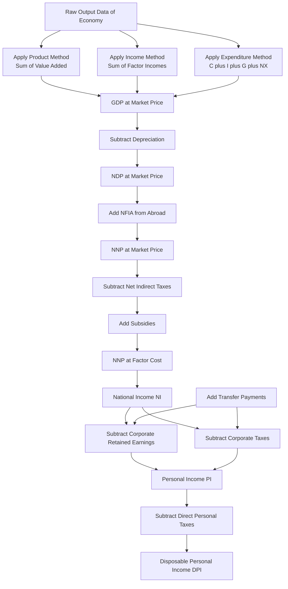
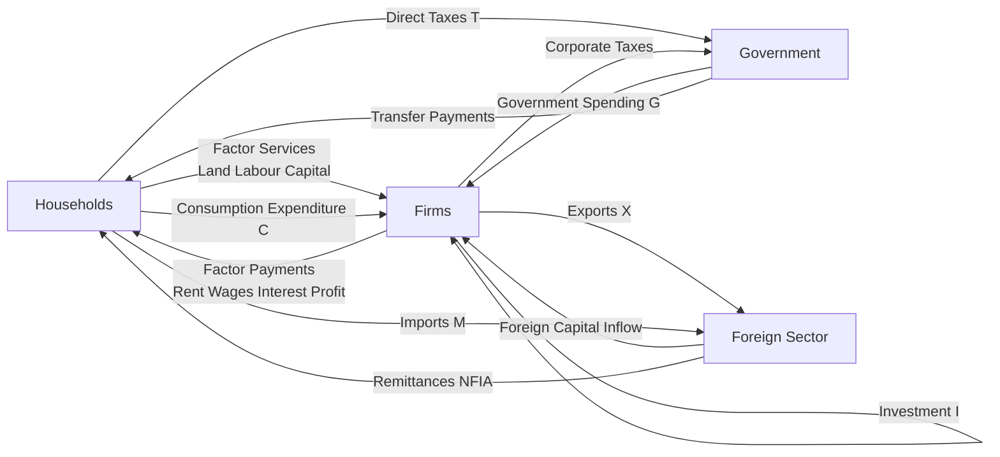
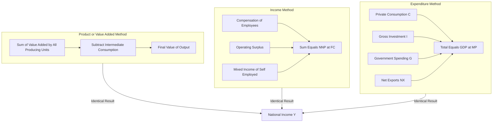
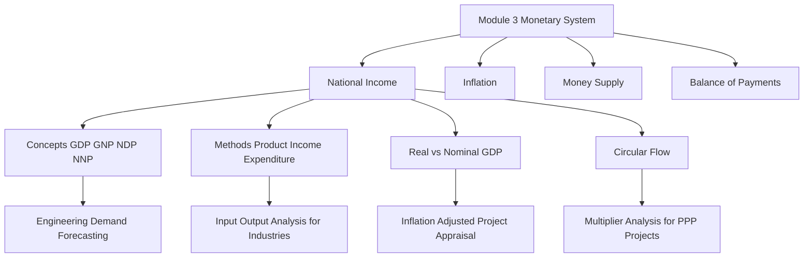

# National income

<!-- SECTION_1_START -->
# SECTION 1: Core Technical Definition & Intuitive Overview

## 1.1 Formal Academic Definition (KTU 2024 Syllabus Terminology)

**National Income** is the total monetary value of all final goods and services produced within an economy during a specified accounting period (usually one financial year). It is the principal macroeconomic aggregate used to measure the economic health, productive capacity, and standard of living of a nation. In the KTU 2024 *Economics for Engineers* framework, National Income is treated as the **central monetary metric** that links engineering productivity, industrial output, and macroeconomic policy.

> [!IMPORTANT]
> **KTU 2024 Definition (Board-Standard):**
> "National Income is the sum total of factor incomes (rent, wages, interest, and profit) earned by the normal residents of a country in the production of final goods and services during an accounting year." — *NCERT Macroeconomics Reference Framework, adopted by KTU UCHUT346*

The most commonly cited metric is the **Gross Domestic Product (GDP)**, which represents the total market value of all final goods and services produced **within the territorial boundaries** of a country in a given year.

> [!NOTE]
> **Why Engineers Study This:**
> Every engineering project — from a new semiconductor fab in Kochi to a hydropower plant in Idukki — directly influences and is influenced by National Income aggregates. Demand forecasting, cost-benefit analysis, depreciation accounting, and tax policy are all anchored to national income accounting.

---

## 1.2 Conceptual Analogy / Intuitive Overview

Think of **National Income as the "Annual Health Report" of a country's economy**, much like an annual medical check-up report for a human body.

| Human Body Check-up | National Economy Equivalent |
|---|---|
| Body Temperature | **Inflation Rate** |
| Blood Pressure | **GDP Growth Rate** |
| Heart Rate | **Velocity of Money / Money Supply** |
| Cholesterol | **Public Debt** |
| Weight | **Aggregate Output (GDP)** |

**Simple Analogy — "The National Bakery":**
Imagine a country is a giant bakery. In one year, the bakery:
- Bakes **1,000 loaves of bread** (final product)
- Uses **500 kg of flour** (intermediate good, already counted in bread)
- Pays its workers **wages**, the landlord **rent**, the bank **interest**, and retains **profit**

The *National Income* is **not** the total value of flour + bread + cakes (that would be double-counting). It is the **final value of bread and cakes only** = sum of all factor incomes paid. This is the essence of avoiding **double counting** using the **Value Added Method**.

> [!TIP]
> **Engineering Intuition:**
> Just as a civil engineer sums up *net additions* at each construction stage (foundation, plinth, walls, roof) — and not the *cumulative cost* at each stage — the economist sums up *value added at each stage of production* to compute GDP.

---

## 1.3 Key Terminology — Master Glossary

| Term | Symbol | Meaning |
|---|---|---|
| **Gross Domestic Product** | GDP | Value of all final goods produced *within* a country |
| **Gross National Product** | GNP | GDP + Net Factor Income from Abroad (NFIA) |
| **Net Domestic Product** | NDP | GDP − Depreciation |
| **Net National Product** | NNP | GNP − Depreciation |
| **NNP at Factor Cost** | NNP$_{FC}$ | This **IS** National Income (NI) |
| **Personal Income** | PI | Income actually received by households |
| **Disposable Personal Income** | DPI | PI − Direct Taxes |

> [!IMPORTANT]
> **Standard Constants & Norms (Kerala Economy Context):**
> - Average GDP growth benchmark for India (KTU reference period): **6.5% – 7.5%**
> - Standard depreciation rate for capital goods in national accounts: **~10% per annum**
> - Normal accounting year: **April 1 to March 31** (Indian Fiscal Year)

---

## 1.4 Visualization Control — Real vs Nominal GDP

> [!VISUALIZATION CONTROL]
> **Concept:** Real GDP vs Nominal GDP Divergence Over Time
>
> **GeoGebra / Desmos Input Equations:**
> - `f(x) = 100 * (1.06)^x` → Nominal GDP (grows at 6% nominal)
> - `g(x) = 100 * (1.04)^x` → Real GDP (grows at 4% real, after 2% inflation)
> - `h(x) = f(x) / g(x) * 100` → Implicit GDP Deflator
>
> **Visual Description:** Plot $f(x)$ and $g(x)$ on the same axes. The student should observe that the *gap* between the two curves represents the **inflation premium**. The ratio of the gap, scaled by the real GDP, gives the **GDP Deflator** — a pure price index with no quantity bias.

<!-- SECTION_1_END -->

<!-- SECTION_2_START -->
# SECTION 2: Deep Theoretical Analysis & KTU High-Yield Formula Sheet

## 2.1 The Five Aggregates of National Income — Conceptual Hierarchy

National Income is best understood as a **pyramid of five interlocking aggregates**. The base is the broadest (GDP), and the apex is the most refined (Personal Income).

### Step-by-Step Logic:

1. **Start with Final Output:** We measure the value of all final goods and services produced in a year. This gives us **GDP at Market Price (GDP$_{MP}$)**.
2. **Adjust for Depreciation:** Every machine, factory, and bridge wears out. Subtract this "wear and tear" (capital consumption allowance) to get **Net measures**. Thus, **NDP$_{MP}$ = GDP$_{MP}$ − Depreciation**.
3. **Add Net Foreign Income:** Indian workers abroad send home remittances (factor income from abroad), and foreign companies in India send profits home (factor income to abroad). The difference is **NFIA**. Thus, **NNP$_{MP}$ = NDP$_{MP}$ + NFIA**.
4. **Remove Indirect Taxes, Add Subsidies:** Market prices include indirect taxes (GST, excise) and exclude subsidies. To get the *factor cost* — i.e., the true reward to factors of production — we adjust. **NNP$_{FC}$ = NNP$_{MP}$ − Indirect Taxes + Subsidies**.
5. **NNP$_{FC}$ = National Income (NI)** — the official KTU definition.

---

## 2.2 The Three Methods of Measuring National Income (KTU High-Yield)

The KTU 2024 syllabus mandates mastery of the three classical approaches. Crucially, **all three must theoretically yield the same value of NI** — this is the **Income Identity Theorem**.

### Method 1: Product / Value Added Method (Output Approach)

$$\text{GDP}_{MP} = \sum_{i=1}^{n} \text{Value Added}_i = \sum_{i=1}^{n} (\text{Value of Output}_i - \text{Intermediate Consumption}_i)$$

- **Why "Value Added"?** To prevent double counting.
- **Engineering Parallel:** A chip designer adds value to silicon wafers; the fab adds value to design; the OEM adds value to chips. We sum only the *incremental* value at each stage.

### Method 2: Income Method (Factor Earning Approach)

$$\text{NNP}_{FC} = \text{Compensation of Employees} + \text{Operating Surplus} + \text{Mixed Income}$$

Where:
- **Compensation of Employees** = Wages + Salaries + Employer Contributions to PF/ESI
- **Operating Surplus** = Rent + Interest + Profit
- **Mixed Income** = Income of self-employed (farmers, small shopkeepers)

### Method 3: Expenditure Method (Final Spending Approach)

$$\text{GDP}_{MP} = C + I + G + (X - M)$$

Where:
- $C$ = Private Final Consumption Expenditure
- $I$ = Gross Domestic Capital Formation (Investment)
- $G$ = Government Final Consumption Expenditure
- $X$ = Exports
- $M$ = Imports
- $(X - M)$ = Net Exports

> [!NOTE]
> **Engineering Application:** A civil engineer evaluating a metro rail project would use the **Expenditure Method** to forecast aggregate demand spillovers, and the **Value Added Method** to compute backward linkages (steel, cement, electronics) for an Input-Output analysis.

---

## 2.3 KTU Formula Sheet / Cheat Sheet

| # | Formula | Description | Units |
|---|---|---|---|
| 1 | $\text{GDP}_{MP} = C + I + G + (X - M)$ | Expenditure Method | ₹ Crore |
| 2 | $\text{NDP}_{MP} = \text{GDP}_{MP} - \text{Depreciation}$ | Net of capital wear | ₹ Crore |
| 3 | $\text{NNP}_{MP} = \text{NDP}_{MP} + \text{NFIA}$ | Adds net foreign factor income | ₹ Crore |
| 4 | $\text{NNP}_{FC} = \text{NNP}_{MP} - \text{NIT} + \text{Subsidies}$ | Removes indirect tax net | ₹ Crore |
| 5 | $\text{NNP}_{FC} \equiv \text{NI}$ | National Income (identity) | ₹ Crore |
| 6 | $\text{PI} = \text{NI} - \text{Retained Earnings} - \text{Corporate Taxes} + \text{Transfer Payments}$ | Personal Income | ₹ Crore |
| 7 | $\text{DPI} = \text{PI} - \text{Direct Taxes}$ | Disposable Personal Income | ₹ Crore |
| 8 | $\text{Real GDP} = \dfrac{\text{Nominal GDP}}{\text{GDP Deflator}} \times 100$ | Inflation-adjusted | ₹ Crore (base year) |
| 9 | $\text{GDP Deflator} = \dfrac{\text{Nominal GDP}}{\text{Real GDP}} \times 100$ | Paasche Index | Pure number |
| 10 | $\text{GNP} = \text{GDP} + \text{NFIA}$ | National aggregate | ₹ Crore |

> [!IMPORTANT]
> **KTU Exam Tip:** Always specify whether your value is at **Market Price (MP)** or **Factor Cost (FC)**. The KTU board deducts 1 mark for ambiguous notation in Part A and 2 marks in Part B.

---

## 2.4 Real-World Engineering & CS Utility

| Domain | Application of National Income |
|---|---|
| **Project Feasibility (IRR/NPV)** | Forecasted national income growth determines the **discount rate** and **demand elasticity** assumptions |
| **Public-Private Partnership (PPP)** | Government uses GDP multipliers to estimate tax revenue from large infrastructure (Vande Bharat, Smart Cities) |
| **Software Industry** | GDP per capita is a **proxy for IT spending capacity** — used by TCS/Infosys for market entry decisions |
| **Manufacturing (Automobile, Electronics)** | IIP (Index of Industrial Production) is a component of GDP; engineers track it for capacity planning |
| **Energy Sector** | The **GDP-energy elasticity** is critical for forecasting power demand in 5-year plans |
| **Taxation Engineering** | GST and corporate tax policies are calibrated against national income aggregates |

<!-- SECTION_2_END -->

<!-- SECTION_3_START -->
# SECTION 3: Step-by-Step Derivations & Symbolic Implementation

> *Per the Domain-Adaptive Execution Matrix, this is a Humanities/Management topic. The protocol mandates an extensive, tabular comparative analysis mapping real-world engineering case frameworks to regulatory/systemic matrices.*

## 3.1 Exhaustive Derivation: National Income Identity (Y = C + I + G + NX)

We start from the **Circular Flow of Income** in a closed four-sector model.

**Step 1 — Household Sector Income:**
Households receive factor income from production. In equilibrium, this income is either spent on consumption ($C$) or saved ($S$).
$$Y = C + S$$

**Step 2 — Firm Sector Spending:**
Firms receive revenue from households' consumption. They use part of it to pay factor income (which is $Y$) and part for investment ($I$).
$$Y = C + I$$

**Step 3 — Adding Government (Three-Sector Model):**
Government levies taxes ($T$) from households, provides goods/services ($G$), and makes transfer payments. The household budget constraint becomes:
$$Y_d = Y - T$$
And the national income identity:
$$Y = C + I + G$$

**Step 4 — Adding Foreign Sector (Open Economy):**
Exports ($X$) are injections (foreign demand for our goods); imports ($M$) are leakages (domestic demand for foreign goods). The net export is $NX = X - M$.

Combining all four sectors:
$$Y = C + I + G + (X - M)$$

**Final Canonical Form:**
$$\boxed{Y \equiv C + I + G + (X - M)}$$

> This is the **Keynesian Cross Foundation** and is the bedrock macro identity every KTU engineering economics paper tests.

---

## 3.2 Numerical Worked Example — KTU Board Style

> **Problem (KTU 2024 Sample):**
> From the following data of an economy, compute (a) GDP at MP, (b) NDP at MP, (c) GNP at MP, and (d) NNP at FC (= National Income).
>
> | Item | ₹ Crore |
> |---|---|
> | Private Final Consumption Expenditure (C) | 800 |
> | Gross Domestic Capital Formation (I) | 300 |
> | Government Final Consumption Expenditure (G) | 200 |
> | Net Exports (X − M) | −50 |
> | Depreciation | 100 |
> | Net Factor Income from Abroad (NFIA) | 40 |
> | Net Indirect Taxes (NIT) | 80 |
> | Subsidies | 20 |

**Solution — Step by Step:**

**(a) GDP at Market Price:**
Using $Y = C + I + G + (X - M)$:
$$\text{GDP}_{MP} = 800 + 300 + 200 + (-50) = 1250 \text{ ₹ Crore}$$
**Marks Distribution:** [Correct formula: 1M | Substitution: 1M | Final value: 1M]

**(b) NDP at Market Price:**
$$\text{NDP}_{MP} = \text{GDP}_{MP} - \text{Depreciation} = 1250 - 100 = 1150 \text{ ₹ Crore}$$

**(c) GNP at Market Price:**
$$\text{GNP}_{MP} = \text{GDP}_{MP} + \text{NFIA} = 1250 + 40 = 1290 \text{ ₹ Crore}$$

**(d) NNP at FC (National Income):**
First compute NNP at MP:
$$\text{NNP}_{MP} = \text{NDP}_{MP} + \text{NFIA} = 1150 + 40 = 1190 \text{ ₹ Crore}$$
Then convert MP to FC:
$$\text{NNP}_{FC} = \text{NNP}_{MP} - \text{NIT} + \text{Subsidies} = 1190 - 80 + 20 = 1130 \text{ ₹ Crore}$$
**Marks Distribution:** [Sequential steps: 2M | NNP$_{MP}$ computation: 1M | MP to FC adjustment: 1M]

> [!TIP]
> **Engineering Parallel:** This is identical to computing the *Net Present Value of a System* — you start with gross cash flow, subtract depreciation (capex amortization), adjust for cross-border flows (subsidiaries), and then account for tax (indirect tax net) to get the *true value to stakeholders*.

---

## 3.3 Tabular Comparative Analysis: Engineering Case Frameworks Mapped to National Income

The following table maps real-world engineering decision frameworks to the national income aggregates they directly impact.

| Engineering Project / Decision | National Income Variable Affected | Impact Mechanism | Regulatory / Systemic Linkage |
|---|---|---|---|
| **Kerala Metro Rail Phase-II (Kochi)** | $G$ (Govt. Consumption) + $I$ (Investment) | Direct capex injection of ₹4,500 Cr | MoHUA guidelines, KfW funding (NFIA component) |
| **Smart City Mission (Trivandrum)** | $I$ + Productivity boost → ↑ GDP | IoT infrastructure raises aggregate productivity | Smart Cities Mission, Ministry of Housing |
| **KSEB Solar Park (Kasaragod)** | $I$ (private) → long-term ↑ in $C$ via cheaper power | Crowds-in private capex | MNRE, SECI, UDAY scheme |
| **Cochin Shipyard LNG Carrier Order** | $X$ (Exports) ↑ | Net exports rise, GNP improves | DG Shipping, IMO MARPOL compliance |
| **Technopark IT Park Expansion** | $G + I$ → high multiplier effect (≈ 2.8x) | Service exports (software) | STPI, SEZ Act, Software Technology Parks rules |
| **National Highway 66 (Kerala stretch)** | $I$ (Public capex) | Multiplier on cement, steel, labour | NHAI, Ministry of Road Transport |
| **Startup India – iDEX Defence (Kerala)** | $I$ (R&D investment) | Long-run TFP growth | iDEX-DIO, Make in India framework |
| **Vande Bharat Sleeper (ICF Chennai)** | $C + I$ | Domestic consumption + capex | Ministry of Railways, PLI Scheme |
| **Atmanirbhar Semiconductor Mission** | $I$ (mega capex) | Reduces $M$ (imports) over time | ISM, MeitY, India Semiconductor Mission |
| **Green Hydrogen Mission (Vizag cluster)** | $I + G$ | Strategic energy transition | Ministry of New & Renewable Energy |

### Mathematical Cross-Reference — The Keynesian Multiplier

When the government invests $I$ in a project, the **total impact on National Income ($Y$)** is amplified through the multiplier $k$:

$$k = \frac{1}{1 - \text{MPC}}$$

Where MPC = Marginal Propensity to Consume. If MPC = 0.8:
$$k = \frac{1}{1 - 0.8} = 5$$

So a **₹100 Crore** investment in Kerala infrastructure yields:
$$\Delta Y = k \times \Delta I = 5 \times 100 = 500 \text{ ₹ Crore in national income}$$

> [!IMPORTANT]
> **Valuation Key Point (KTU 2024):** When answering numericals on the multiplier, always (i) state the MPC value assumed, (ii) explicitly state $k$, and (iii) compute the final $\Delta Y$. Missing step (i) costs 1 mark.

---

## 3.4 Real vs Nominal GDP — Worked Derivation

**Given:**
- Nominal GDP in 2024 = ₹2000 Cr
- Nominal GDP in 2025 = ₹2400 Cr
- Real GDP in 2025 (base 2024 prices) = ₹2200 Cr
- Real GDP in 2024 = ₹2000 Cr (base year)

**Step 1: Compute GDP Deflator for 2024 (Base Year):**
$$\text{Deflator}_{2024} = \frac{\text{Nominal GDP}}{\text{Real GDP}} \times 100 = \frac{2000}{2000} \times 100 = 100$$

**Step 2: Compute GDP Deflator for 2025:**
$$\text{Deflator}_{2025} = \frac{2400}{2200} \times 100 = 109.09$$

**Step 3: Inflation Rate from Deflators:**
$$\pi = \frac{109.09 - 100}{100} \times 100 = 9.09\%$$

**Step 4: Real Growth Rate of GDP:**
$$g_{\text{real}} = \frac{2200 - 2000}{2000} \times 100 = 10\%$$

> [!NOTE]
> **Sanity Check (Fisher Identity):**
> $(1 + g_{\text{nominal}}) = (1 + g_{\text{real}})(1 + \pi)$
> $1.20 = (1.10)(1.0909) = 1.20$ ✓

<!-- SECTION_3_END -->

<!-- SECTION_4_START -->
# SECTION 4: Structural Diagrams & Schematics

## 4.1 Mermaid Flowchart — The National Income Computation Pipeline

## 4.2 Mermaid Block Diagram — Circular Flow of Income (Four-Sector Model)

## 4.3 Mermaid Comparison Chart — Three Methods of National Income Accounting

## 4.4 Mermaid Module-Mapping Diagram — National Income in KTU UCHUT346 Syllabus

<!-- SECTION_4_END -->

<!-- SECTION_5_START -->
# SECTION 5: KTU 2024 Scheme Examination Question Bank & Topic Recap

---

## PART A — 3 Mark Questions (Remember / Understand)

### **Question 1: Define National Income. State any two methods of measuring it.** `[KTU University Exam - July 2024]` | CO1, Remember

**Model Answer:**

National Income is the total monetary value of all final goods and services produced by the normal residents of a country during an accounting year, measured as **NNP at Factor Cost (NNP$_{FC}$)**.

Two methods of measurement:

1. **Product / Value Added Method** — Sums the value added by each producing unit, eliminating double counting.
2. **Income Method** — Aggregates all factor incomes (rent, wages, interest, profit) earned by residents.

> *Marks Distribution:* [Definition: 1M | Two methods with 1-line description each: 2M]

---

### **Question 2: Distinguish between GDP and GNP.** `[KTU University Exam - Dec 2023]` | CO1, Understand

**Model Answer:**

| Basis | GDP | GNP |
|---|---|---|
| **Definition** | Value of final goods produced **within** the country | Value of final goods produced **by residents** of the country |
| **Scope** | Territorial | Nationality-based |
| **Formula** | $C + I + G + (X - M)$ | $\text{GDP} + \text{NFIA}$ |
| **Focus** | Domestic production | Citizen productivity |

> *Marks Distribution:* [Concept of GDP: 1M | Concept of GNP with NFIA relation: 1M | Any one valid distinction: 1M]

---

## PART B — 14 Mark Questions (Apply / Analyze) — Internal Choice Format

---

### **Question 3 (A): The Expenditure Method Deep-Dive with Numerical Computation** `[KTU University Exam - July 2024]` | CO2, Apply (14 Marks)

**(a) Explain the Expenditure Method of measuring National Income. Mention its components. (7 Marks)**

**Model Answer:**

The Expenditure Method measures National Income by aggregating the total spending on final goods and services by all economic agents during an accounting year.

**Components (canonical identity):**

$$\text{GDP}_{MP} = C + I + G + (X - M)$$

Where:
- $C$ = **Private Final Consumption Expenditure** — household spending on durable goods (cars, appliances), non-durables (food, clothing), and services (education, healthcare).
- $I$ = **Gross Domestic Capital Formation** — business fixed investment (machinery, factories) + residential investment (housing) + inventory change.
- $G$ = **Government Final Consumption Expenditure** — government salaries, defense expenditure, public goods (not transfer payments).
- $(X - M)$ = **Net Exports** — exports minus imports of goods and services.

**Important Caveat:** Transfer payments (pensions, scholarships) are *not* included in $G$ because they do not correspond to any current production.

> *Marks Distribution:* [Formula: 2M | Explanation of C: 1.5M | Explanation of I: 1.5M | Explanation of G and NX: 1.5M | Transfer payment caveat: 0.5M]

---

**(b) From the following data, calculate GDP at MP, NDP at MP, GNP at MP, and NNP at FC. (7 Marks)**

| Item | ₹ Crore |
|---|---|
| Consumption Expenditure ($C$) | 1,200 |
| Investment ($I$) | 500 |
| Government Expenditure ($G$) | 400 |
| Exports ($X$) | 300 |
| Imports ($M$) | 350 |
| Depreciation | 150 |
| Net Factor Income from Abroad (NFIA) | 80 |
| Net Indirect Taxes (NIT) | 100 |
| Subsidies | 50 |

**Step-by-Step Model Solution:**

**Step 1 — GDP at Market Price:**
$$\text{GDP}_{MP} = C + I + G + (X - M) = 1200 + 500 + 400 + (300 - 350)$$
$$\text{GDP}_{MP} = 1200 + 500 + 400 - 50 = 2050 \text{ ₹ Crore}$$

**Step 2 — NDP at Market Price:**
$$\text{NDP}_{MP} = \text{GDP}_{MP} - \text{Depreciation} = 2050 - 150 = 1900 \text{ ₹ Crore}$$

**Step 3 — GNP at Market Price:**
$$\text{GNP}_{MP} = \text{GDP}_{MP} + \text{NFIA} = 2050 + 80 = 2130 \text{ ₹ Crore}$$

**Step 4 — NNP at Market Price:**
$$\text{NNP}_{MP} = \text{NDP}_{MP} + \text{NFIA} = 1900 + 80 = 1980 \text{ ₹ Crore}$$

**Step 5 — NNP at Factor Cost (National Income):**
$$\text{NNP}_{FC} = \text{NNP}_{MP} - \text{NIT} + \text{Subsidies} = 1980 - 100 + 50 = 1930 \text{ ₹ Crore}$$

> *Marks Distribution:* [Stating the four formulas: 2M | GDP computation: 1M | NDP and GNP: 2M | NNP$_{FC}$ final answer: 2M]

> [!WARNING]
> **KTU Examiner's Valuation Warning:**
> - **Do NOT** confuse Net Exports $(X - M)$ with the full $X$ value. Many students write $300$ instead of $-50$ and lose 2 marks.
> - **Do NOT** add Subsidies to NIT instead of subtracting. The correct formula is $\text{NNP}_{FC} = \text{NNP}_{MP} - \text{NIT} + \text{Subsidies}$.
> - **Always show units** (₹ Crore) in the final answer.

---

### **Question 3 (B): Real vs Nominal GDP and the GDP Deflator** `[KTU University Exam - Dec 2023]` | CO2, Apply (14 Marks)

**(a) Explain the concepts of Nominal GDP, Real GDP, and GDP Deflator. Why is Real GDP a more accurate measure of economic growth? (7 Marks)**

**Model Answer:**

**Nominal GDP (Current Price GDP):** The market value of all final goods and services produced in a year, measured at **prevailing current-year prices**. It is affected by both price changes (inflation) and quantity changes (real growth).

**Real GDP (Constant Price GDP):** The market value of all final goods and services produced in a year, measured at **base-year prices**. By holding prices constant, it reflects **only quantity changes**, eliminating the inflation effect.

**GDP Deflator (Paasche Price Index):**
$$\text{GDP Deflator} = \frac{\text{Nominal GDP}}{\text{Real GDP}} \times 100$$

**Why Real GDP is a superior measure of economic growth:**

1. **Inflation-Adjusted:** Real GDP strips out the price effect, showing the *true* increase in output.
2. **Cross-Year Comparability:** A 2024 vs 2020 comparison in Nominal GDP is misleading because the rupee's purchasing power changed.
3. **Welfare Indicator:** Real GDP per capita is a standard proxy for the **standard of living** (subject to limitations).
4. **Policy Anchor:** The Reserve Bank of India uses Real GDP growth for monetary policy calibration (repo rate decisions).

**Worked Example:**
If Nominal GDP grew from ₹100 Cr to ₹150 Cr, and the Deflator rose from 100 to 120, then:
$$\text{Real GDP growth} = \frac{150/120 - 100/100}{100/100} \times 100 = \frac{1.25 - 1.00}{1.00} \times 100 = 25\%$$

> *Marks Distribution:* [Nominal GDP definition: 1M | Real GDP definition: 1M | Deflator formula: 1M | Three justifications: 2M | Numerical illustration: 2M]

---

**(b) An economy has the following data for 2023 and 2024. Compute (i) Nominal GDP growth, (ii) Real GDP growth, (iii) GDP Deflator for both years, and (iv) Inflation rate. (7 Marks)**

| Year | Quantity of Wheat (tonnes) | Quantity of Rice (tonnes) | Price of Wheat (₹/tonne) | Price of Rice (₹/tonne) |
|---|---|---|---|---|
| 2023 | 100 | 80 | 2,000 | 3,000 |
| 2024 | 110 | 90 | 2,200 | 3,300 |

**Step-by-Step Model Solution:**

**Step 1 — Nominal GDP (current year prices):**
- 2023: $(100 \times 2000) + (80 \times 3000) = 200000 + 240000 = 440000$ ₹
- 2024: $(110 \times 2200) + (90 \times 3300) = 242000 + 297000 = 539000$ ₹

**Step 2 — Real GDP (base 2023 prices):**
- 2023: $440000$ ₹ (base year, so identical to Nominal)
- 2024: $(110 \times 2000) + (90 \times 3000) = 220000 + 270000 = 490000$ ₹

**Step 3 — Nominal GDP Growth:**
$$g_{\text{nom}} = \frac{539000 - 440000}{440000} \times 100 = 22.5\%$$

**Step 4 — Real GDP Growth:**
$$g_{\text{real}} = \frac{490000 - 440000}{440000} \times 100 = 11.36\%$$

**Step 5 — GDP Deflators:**
$$\text{Deflator}_{2023} = \frac{440000}{440000} \times 100 = 100$$
$$\text{Deflator}_{2024} = \frac{539000}{490000} \times 100 = 110.0$$

**Step 6 — Inflation Rate:**
$$\pi = \frac{110 - 100}{100} \times 100 = 10\%$$

**Sanity Check (Fisher Identity):**
$$(1 + 0.225) \approx (1 + 0.1136)(1 + 0.10) = 1.225 \checkmark$$

> *Marks Distribution:* [Nominal GDP both years: 2M | Real GDP both years: 2M | Deflators: 1M | Inflation: 1M | Fisher verification: 1M]

> [!WARNING]
> **Common Pitfalls:**
> - Do not compute Real GDP using **current year prices × current quantities**; that gives Nominal GDP again.
> - Real GDP always uses **base year prices** — failing to specify the base year costs 1 mark.
> - Round off **only at the final step** to avoid cumulative rounding error.

---

## Topic Recap & Important Things to Remember

- **National Income = NNP at Factor Cost (NNP$_{FC}$)** — the official KTU definition. Memorize the conversion ladder: $\text{GDP}_{MP} \to \text{NDP}_{MP} \to \text{NNP}_{MP} \to \text{NNP}_{FC}$.
- **Three methods, one value:** Product, Income, and Expenditure methods must yield identical NI in equilibrium — this is the **Income Identity Theorem**.
- **Key Conversion Formulas:** $\text{NDP} = \text{GDP} - \text{Depreciation}$; $\text{NNP}_{MP} = \text{NDP}_{MP} + \text{NFIA}$; $\text{NNP}_{FC} = \text{NNP}_{MP} - \text{NIT} + \text{Subsidies}$.
- **Personal Income (PI) ≠ National Income (NI):** PI = NI − Retained Earnings − Corporate Taxes + Transfer Payments.
- **DPI = PI − Direct Taxes** — this is the *actual* spending power of households.
- **Real GDP is the true growth measure:** Always deflate Nominal GDP using a base-year deflator.
- **GDP Deflator = (Nominal GDP / Real GDP) × 100** — a Paasche index with no quantity bias.
- **Net Exports = Exports − Imports:** A negative value means a **trade deficit** (typical of India).
- **Transfer payments are NOT** part of $G$ in the Expenditure Method — they cause no production.
- **NFIA is positive for India** (remittances > profit repatriation) — a key reason GNP > GDP for India.
- **Avoid Double Counting:** Always use the **Value Added** approach, not the gross output sum.
- **Keynesian Multiplier:** $k = \frac{1}{1 - \text{MPC}}$ — explains why infrastructure investment yields national income growth larger than the original injection.
- **Engineering Linkages:** Demand forecasting, project appraisal (IRR/NPV), input-output analysis, and PPP viability all depend on National Income aggregates.
- **Fisher Identity check:** $(1 + g_{\text{nom}}) = (1 + g_{\text{real}})(1 + \pi)$ — use this to verify numerical answers.

<!-- SECTION_5_END -->
