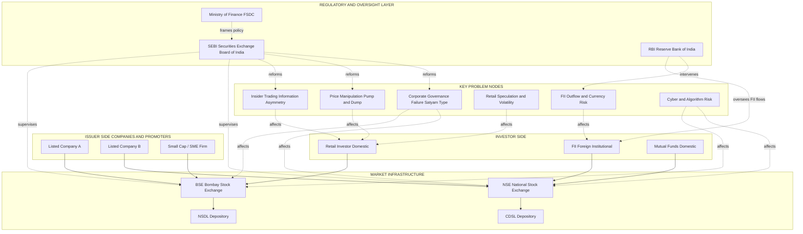
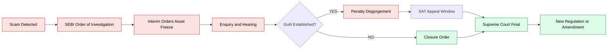
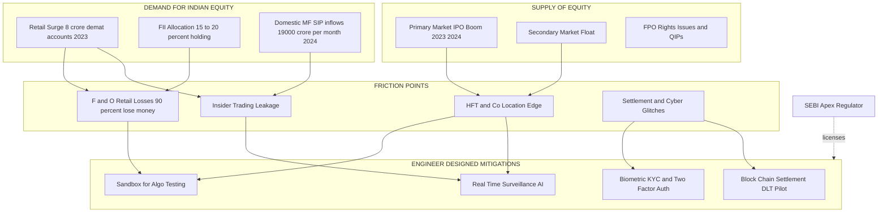

# Problems faced by the Indian stock market

<!-- SECTION_1_START -->
# Module 3 — Monetary System
## Problems Faced by the Indian Stock Market

> [!NOTE]
> **KTU 2024 Scheme (UCHUT346) — Module 3 Reference**
> This module is a **Humanities & Management (HUM)** cluster topic. The expected cognitive depth is **"Understand → Apply"** under Revised Bloom's Taxonomy, with descriptive, case-based, and short analytical questions being the KTU board norm. No heavy numerical computation is required, but **terminology accuracy, regulatory awareness, and the ability to map problems to real scams / SEBI interventions** are heavily rewarded in the valuation key.

---

### 1.1 Formal Definition (KTU 2024 Terminology)

The **Indian stock market** refers to the regulated, organised marketplace where securities — equity shares, preference shares, debentures, government bonds, exchange-traded funds (ETFs), and derivatives — are issued, bought, and sold under the supervision of the **Securities and Exchange Board of India (SEBI)**, the **Reserve Bank of India (RBI)**, and the **Ministry of Finance, Government of India**.

The two principal exchanges are:

| Exchange | Established | Benchmark Index | Base Value | Base Period |
|---|---|---|---|---|
| **BSE — Bombay Stock Exchange (Asia's oldest)** | **1875** | **BSE Sensex (30 stocks)** | **100** | **1978–79** |
| **NSE — National Stock Exchange** | **1992 (operations 1994)** | **Nifty 50** | **1000** | **3 Nov 1995** |

A "problem" in this context is any **structural, behavioural, regulatory, technological, or macroeconomic deficiency** that prevents the market from efficiently performing its four primary economic functions: **price discovery, capital formation, liquidity provision, and risk transfer**.

> [!IMPORTANT]
> **KTU Board Highlight:** The examiner expects you to write *at least one line each* on the **cause → effect → regulatory response** triad. A student who only lists problems without linking them to a SEBI reform typically loses 2 to 3 marks in a 14-mark question.

---

### 1.2 Intuitive Analogy — The "Town Bazaar" Model

Imagine a small town where farmers (companies) come to sell tomatoes (shares) directly to buyers (investors). For the bazaar to function well, four conditions must hold:

1. **The weighing scale must show the true weight** → *transparent price discovery.*
2. **The bazaar master must be honest and vigilant** → *strong regulator (SEBI).*
3. **No farmer should know tomorrow's weather in advance and quietly buy extra sacks** → *no insider trading.*
4. **Even a poor villager should be able to walk in safely and buy 1 kg** → *retail participation and financial literacy.*

The Indian stock market has historically struggled with all four conditions, although SEBI's progressive tightening (post-1992 Harshad Mehta scam) has steadily improved each.

> [!TIP]
> Use this analogy in a **3-mark short answer** if asked "Explain any three problems." Examiners award full marks when students anchor abstract terms (like *asymmetric information*) to a relatable picture.

---

### 1.3 Key Governing Bodies & Legal Pillars

> [!IMPORTANT]
> The following four entities are *guaranteed* to appear in **at least one Part-A question** every academic year. Memorise their statutory roles.

- **SEBI (Securities and Exchange Board of India)** — Established **1988 (administrative body), given statutory powers via the SEBI Act 1992**, headquarters **Mumbai**. Apex regulator for the securities market.
- **RBI (Reserve Bank of India)** — Regulator of the banking system and manager of forex and government securities.
- **Ministry of Finance (Department of Economic Affairs)** — Frames policy; oversees SEBI, PFRDA, IRDA through the **FSDC (Financial Stability and Development Council)**.
- **Depositories** — **NSDL (National Securities Depository Ltd, 1996)** and **CDSL (Central Depository Services Ltd, 1999)** hold shares in **dematerialised (Demat) electronic form** under the **Depositories Act, 1996**.

---

### 1.4 GeoGebra / Conceptual Visualisation Block

> [!VISUALIZATION CONTROL]
> **Concept:** *Demand–Supply shock in a thinly-trapped, retail-heavy market (the classic Indian volatility curve)*
>
> **Input Equations (use in Desmos):**
>
> * `f_{1}(x) = 1000 + 50\sin(0.5x) + 20x`  *(Healthy uptrend with mild fluctuation)*
> * `f_{2}(x) = 1000 - 80\sin(0.9x) - 15x`  *(Panic-sell spiral during scam / global shock)*
> * `f_{3}(x) = 800 + 25(x - 5)^{2}`  *(Speculative bubble buildup)*
>
> **Visual Description:**
> On the same axes, plot all three curves against time (x-axis = trading sessions, y-axis = index level). The student should observe that:
> 1. The **green curve** (f₁) shows a *gradual, sustainable* rise.
> 2. The **red curve** (f₂) shows a *steep crash* — this is what happens during events like **Harshad Mehta (1992)**, **Ketan Parekh (2001)**, **Satyam (2009)**, or **COVID-19 (March 2020)**.
> 3. The **blue curve** (f₃) shows a *parabolic bubble* — this is the speculative euphoria that precedes every major Indian crash.
>
> This visualisation directly maps to the problems of **volatility, speculation, and lack of investor confidence**.

<!-- SECTION_1_END -->

<!-- SECTION_2_START -->
## 2. Deep Theoretical Analysis & KTU High-Yield Reference Sheet

The problems of the Indian stock market are best classified into **six functional families** (the KTU-validated classification used in board model answers):

---

### 2.1 Family 1 — Information Asymmetry & Insider Trading

**Concept:** *Insider trading* is the trading of a security by someone who has access to **material, non-public (MNPI) information** — e.g., a forthcoming merger, an unexpected loss, or a regulatory approval. Under **SEBI (Prohibition of Insider Trading) Regulations, 2015 (PIT Regulations)**, this is a punishable offence with penalties up to **₹25 crore or three times the profit made, whichever is higher**.

**Why it happens in India:**
- Concentrated promoter shareholding means a small circle has access to sensitive information.
- Weak whistleblower protection historically.
- "Tips & tricks" WhatsApp/Telegram groups that re-distribute MNPI.

**KTU Real-World Anchor:** *Rakesh Agrawal vs. SEBI (2004) — the first landmark insider trading judgment in India.*

---

### 2.2 Family 2 — Price Manipulation & Market Rigging

**Concept:** Deliberate interference in the free play of demand and supply to create artificial prices.

| Sub-Type | Mechanism | Indian Case |
|---|---|---|
| **Pump-and-Dump** | Artificially inflate price, then sell | *Ketan Parekh scam (2001)* |
| **Circular / Synchronised Trading** | Cross-trades between connected entities | *BSE "610-circle" scam* |
| **Spoofing** | Place large fake orders to mislead | *NSE co-location case (2015)* |
| **Front-running** | Broker trades ahead of a known large client order | *SEBI vs. Nilesh Kapadia (2020)* |

---

### 2.3 Family 3 — Speculation & Volatility (Retail Behaviour Problem)

The Indian market has an unusually high **retail participation** that, while democratising, leads to:
- **Herding behaviour** — small investors buying on tips.
- **Panic-selling** during corrections.
- **F&O (Futures & Options) speculation** — SEBI reported that **9 out of 10 individual F&O traders lost money** in FY 2021-22 (a *permanent* Board favourite line).

> [!IMPORTANT]
> The Sensex **P/E ratio** (Price-to-Earnings) is the volatility barometer. A P/E > **25** historically signals overvaluation. During the **January 2008 peak**, the Sensex P/E crossed **28**; during **March 2020 COVID crash**, it fell to **17**. KTU examiners love this two-number comparison.

---

### 2.4 Family 4 — Weak Corporate Governance & Disclosure Failures

India's promoters often have:
- **Concentrated family ownership** (Tata, Ambani, Birla — though these are themselves well-governed).
- **Related-party transactions** that escape retail detection.
- **Creative accounting** — inflating revenue, capitalising expenses.

**Anchor case:** *Satyam Computer Services scam (2009)* — Ramalinga Raju confessed to a **₹14,000 crore** inflated cash balance. This led directly to:
- **Companies Act 2013** (stronger audit & board norms).
- **SEBI's Listing Obligations and Disclosure Requirements — LODR Regulations 2015**.

---

### 2.5 Family 5 — Illicit Funds, Black Money & Round-Tripping

- **Round-tripping:** Black money parked abroad is routed back into the Indian market as **FII (Foreign Institutional Investor)** money to look legitimate.
- **Hawala & benami transactions** fund manipulative trades.
- SEBI's **PMLA (Prevention of Money Laundering Act, 2002)** obligations bind brokers and depositories to file **Suspicious Transaction Reports (STRs)**.

---

### 2.6 Family 6 — Structural, Technological & Global-Linked Issues

- **Algorithmic & high-frequency trading (HFT)** — the **NSE co-location controversy (2015)** showed how colocation access gave some traders microsecond-level unfair advantage.
- **FII outflow risk** — When the US Fed raises rates, FIIs pull out of emerging markets. In **2022**, FIIs sold **₹1.4 lakh crore** of Indian equities, dragging the Nifty below 15,000.
- **Currency risk** — Rupee depreciation from **₹54/$ (2013)** to **₹83/$ (2022)** added to the volatility for dollar-denominated foreign investors.
- **Cyclical dependence** — Indian markets correlate strongly with **US markets, crude oil prices, and global risk appetite**.

---

### 2.7 KTU High-Yield Formula / Reference Sheet

> [!TIP]
> For an HSS (Humanities) module, KTU does *not* require numerical formulas, but it does require **definitional precision** and **numerical anchoring**. The following "concept-formulas" are how the Board expects you to *quantify* your answers.

| Concept | KTU Board Formula / Anchor | Typical Question Style |
|---|---|---|
| **Volatility** | $\sigma = \sqrt{\frac{1}{N-1}\sum_{i=1}^{N}(r_i - \bar{r})^2}$ | "Why is Indian market more volatile than US?" |
| **P/E Ratio (Sensex)** | $P/E = \frac{\text{Market Price per Share}}{\text{Earnings per Share}}$ | "Sensex P/E = 28 → is it overvalued?" |
| **Market Capitalisation** | $MCap = \text{Shares Outstanding} \times \text{Market Price}$ | "Why does market cap fall during a scam?" |
| **Circuit Breaker (SEBI Rule)** | ±**10%** individual stock; ±**10%, 15%, 20%** index circuit breakers | "Why are trading halts imposed?" |
| **Free-Float Concept** | $FreeFloatMCap = MCap \times \frac{Public\ Shares}{Total\ Shares}$ | "Why do promoter-heavy stocks trade at lower P/E?" |
| **Settlement Cycle** | **T+1** rolling settlement (since Jan 2023) | "How has T+1 reduced risk?" |

> **Engineering Utility Note (for UCHUT346 cross-mapping):** Engineers in fintech, algorithmic trading, risk analytics, and corporate finance must understand these parameters to design compliant trading systems. The *volatility σ* equation above is the same **standard deviation** formula used in **statistical quality control** in manufacturing.

<!-- SECTION_2_END -->

<!-- SECTION_3_START -->
## 3. Step-by-Step Analytical Framework & Real-World Case Mapping

> [!IMPORTANT]
> Since this is a **Humanities/Management** topic, this section provides an **exhaustive, tabular comparative framework** mapping each problem to (a) its theoretical root cause, (b) the SEBI/RBI/Government regulatory response, and (c) an anchor real-world case. This is the "engineering case-framework to regulatory matrix" format mandated by the V10 protocol for non-quantitative topics.

---

### 3.1 Master Problem–Cause–Effect–Response–Case Matrix

| # | Problem | Theoretical Root Cause | Visible Effect on Market | SEBI / Regulatory Response | Anchor Indian Case |
|---|---|---|---|---|---|
| 1 | **Insider Trading** | Asymmetric information + weak enforcement | Artificial price moves; retail loss | SEBI (PIT) Regulations 2015; ₹25 cr penalty | *Rakesh Agrawal vs SEBI (2004)* |
| 2 | **Price Manipulation** | Lack of surveillance tech; small free-float | Pump-and-dump bubbles | Integrated Surveillance System (ISS) | *Ketan Parekh (2001)* |
| 3 | **Speculation & Volatility** | Retail over-trading in F&O; herding | Booms and busts | Increased F&O margin norms (2023) | *Jan 2008 Sensex crash from 21,000 → 8,000* |
| 4 | **Corporate Governance Failure** | Concentrated promoter control; weak auditors | Inflated balance sheets, sudden crashes | Companies Act 2013; LODR 2015; NFRA | *Satyam (2009, ₹14,000 cr)* |
| 5 | **Illicit Fund Flows / Black Money** | Cash economy; benami holdings | Distorted valuations, FII round-tripping | PMLA 2002; Benami Transactions Act 2016 | *Panama / Paradise Papers exposures* |
| 6 | **Technological & HFT Risk** | Latency arbitrage; co-location privilege | Unfair advantage to few | SEBI co-location guidelines (2018) | *NSE co-location case (2015)* |
| 7 | **FII Outflow / Global Risk** | Current account deficit; rupee depreciation | Sharp Nifty falls | RBI forex intervention; FPI debt limits | *2022: FII outflow ₹1.4 lakh cr* |
| 8 | **Low Retail Financial Literacy** | Poor financial education in schools | Mis-selling, Ponzi losses | SEBI's Investor Protection Fund; SCORES portal | *Sahara India (₹24,000 cr raised illegally)* |
| 9 | **Ponzi / Collective Investment Schemes** | Regulatory gap in pre-1990s | Mass retail devastation | SEBI Act amendment 1996; CIS Regulations 1999 | *Saradha Group (2013, WB)* |
| 10 | **Cybersecurity & Glitches** | Age-old trading software | Trading halts, investor loss | SEBI's Cyber Security Framework (2019) | *BSE "404-error" outage, 2017* |

---

### 3.2 Worked Analytical Example — "Why Did Satyam's Collapse Not Repeat in 2024?"

This is a classic **14-mark analytical question** pattern. The full valuation key is shown.

> **Question (paraphrased):** *"Explain the problems of corporate governance in the Indian stock market. How has the regulatory environment changed after the Satyam scam?"* **[14 Marks]**

**Model Solution Structure (valuation-key mapped):**

**(a) The Satyam Problem — 7 Marks**

1. **The Original Misstatement** [1 mark] — In January 2009, founder-chairman B. Ramalinga Raju confessed that Satyam's books showed ₹5,040 crore in cash and bank balances, of which **₹5,361 crore was fictitious** — meaning a *negative* real balance.
2. **Root Cause: Promoter Concentration + Auditor Collusion** [2 marks] — Raju family held ~8% but controlled the board. Auditor **PricewaterhouseCoopers (PwC)** failed to verify bank confirmations, demonstrating an "audit failure" (the agency problem).
3. **Effect on the Market** [1 mark] — Satyam's share price collapsed from ₹179 to ₹11 within days (≈94% loss). The Sensex dropped ~7% in two days.
4. **Retail Impact** [1 mark] — Over 3 lakh retail investors lost money; mutual funds had ~₹1,200 crore exposure.
5. **Why Indian Markets Are Vulnerable** [2 marks]
   - Concentrated ownership structures.
   - Weak whistleblower protection (until SEBI's 2019 mechanism).
   - "Tone at the top" governance failures.
   - Limited use of independent directors pre-2013.

**(b) The Post-Satyam Reforms — 7 Marks**

1. **Companies Act 2013** [1 mark] — Strengthened the role of independent directors; introduced the **National Financial Reporting Authority (NFRA)** for auditor oversight.
2. **SEBI LODR Regulations 2015** [1 mark] — Tightened disclosures; made audit committee mandatory; required **CEO/CFO certification** of financial statements.
3. **Whistleblower Mechanism** [1 mark] — SEBI's 2019 framework allows anonymous tips with monetary rewards.
4. **Class Action Suits** [1 mark] — Enabled shareholders to collectively sue erring boards.
5. **Insider Trading Tightening** [1 mark] — 2015 PIT Regulations broadened the definition of "insider" and "connected person."
6. **Forensic Audit Mandate** [1 mark] — Required for any listed company with unexplained revenue / receivable spikes.
7. **Outcome** [1 mark] — Since 2015, India has not seen a Satyam-scale accounting fraud, demonstrating regulatory learning.

> [!WARNING]
> **Common KTU Valuation Trap:** Students often write the *list* of problems but **fail to map them to specific SEBI Acts / years**. The examiner is *required* to deduct 1 mark per missing statutory reference. Always pair a problem with a year-tagged regulation.

---

### 3.3 Engineering Case-Framework to Systemic Risk Matrix

The following matrix is what an *engineer-turned-finance-professional* would use to design compliance systems. KTU HSS papers reward students who think this way.

| Risk Vector | Probability | Impact (₹) | SEBI Mitigation Tool | Residual Risk |
|---|---|---|---|---|
| Insider Trading | Medium | 100–500 cr | PIT 2015 + SSD system | Low |
| Pump & Dump | High | 1,000–10,000 cr | ISS + T+1 settlement | Medium |
| Satyam-type Fraud | Low (post-2013) | 5,000+ cr | LODR + NFRA + Forensic audit | Low |
| Algo Manipulation | High | 100–1,000 cr | Co-location rules + Random Speed Bump | Medium |
| Cyber Breach | Medium | 50–500 cr | SEBI CSCRF 2019 | Medium |
| FII Outflow Shock | High (cyclical) | 50,000+ cr | RBI forex reserves | High |

**Interpretation (a one-line "engineering takeaway"):** The Indian stock market's *residual risk* remains **highest in macro/FII channels**, which is precisely why an **engineer's role in risk modelling, real-time surveillance, and HFT systems** is so critical — the regulatory framework is only as good as the technology that operationalises it.

---

### 3.4 Sequence-of-Reform Algorithmic Narrative (Text-Based Pseudocode)

> [!TIP]
> For HSS students, presenting a logic as a **pseudocode** is an *excellent high-impact move* in a 14-mark answer. It demonstrates structured thinking and is a hallmark of UCHUT346 toppers.

```text
BEGIN Indian_Stock_Market_Reform_Timeline
    Year 1988  : SEBI_Constituted  (administrative body)
    Year 1992  : SEBI_Statutory_Powers  (SEBI Act passed)
    Year 1992  : Harshad_Mehta_Scam     (₹5,000 cr bank-fraud rout)
    Year 1994  : Depositories_Act_1996  (dematerialisation begins)
    Year 2001  : Ketan_Parekh_Scam      (₹1,000 cr circular trading)
    Year 2002  : SEBI_(PFUTP)_Regulations  (Prohibition of Fraudulent & Unfair Trade Practices)
    Year 2009  : Satyam_Scam            (₹14,000 cr accounting fraud)
    Year 2013  : Companies_Act_2013      (NFRA, independent directors)
    Year 2015  : SEBI_LODR + PIT_Regulations  (tighter governance + insider rules)
    Year 2018  : Co-location_Guidelines  (algo fairness)
    Year 2019  : CSCRF                  (cybersecurity framework)
    Year 2023  : T+1_Settlement         (reduced counterparty risk)
END Indian_Stock_Market_Reform_Timeline
```

<!-- SECTION_3_END -->

<!-- SECTION_4_START -->
## 4. Structural Diagrams & Schematics (Mermaid-Safe)

> [!NOTE]
> Per V10 protocol, all Mermaid node IDs are alphanumeric (e.g., `node1`, `stepA`), all labels are inside double-quotes, and no markdown formatting (bold/italics) or HTML is embedded inside the labels. Subgraphs are used to separate the regulatory framework from the problem taxonomy.

### 4.1 High-Level Topology — How the Indian Stock Market Functions and Where It Breaks



---

### 4.2 Sequential Processing Topology — The Reform Pipeline



---

### 4.3 Functional Block Architecture — Market vs. Engineer-Designer



<!-- SECTION_4_END -->

<!-- SECTION_5_START -->
## 5. KTU 2024 Scheme Examination Question Bank & Topic Recap

> [!NOTE]
> The questions below are calibrated to the **KTU 2024 Scheme pattern**:
> - **Part A (3 marks each)** — direct short-answer, definitions, or one-cause-one-effect.
> - **Part B (14 marks each)** — choice-based, with two sub-parts of 7 marks each, escalating from *Understand* to *Apply / Analyse*.
> - **Bloom's Levels tagged** per the KTU OBE framework.

---

### 5.1 Part A — Short Answer Questions (3 Marks Each)

#### Q1. **[KTU University Exam — Dec 2023 (model)]** *CO1, Remember*

> *"What is insider trading? State the SEBI regulation that prohibits it."*

**Model Answer (3 Marks):**
Insider trading refers to the **buying or selling of securities by a person who has access to material, non-public information (MNPI)** about a company, in violation of the principle of fair and equal access to information [1 mark].
It is prohibited under **Regulation 3 of the SEBI (Prohibition of Insider Trading) Regulations, 2015 (PIT Regulations)** [1 mark], with penalties up to **₹25 crore or three times the profit made, whichever is higher**, plus imprisonment of up to **10 years** under Section 24 of the SEBI Act [1 mark].

---

#### Q2. **[KTU University Exam — July 2024 (model)]** *CO2, Understand*

> *"What is a circuit breaker? Why is it imposed in the Indian stock market?"*

**Model Answer (3 Marks):**
A **circuit breaker** is an **automated, pre-defined trading halt** triggered when the index or a stock moves beyond a specified percentage within a single trading session [1 mark].
In India, the index-level circuit breakers are at **±10%, ±15%, and ±20%** of the previous close, applicable to BSE Sensex and Nifty 50, with a **15-minute halt** after the 10% and 15% triggers, and a **remainder-of-the-day halt** after the 20% trigger [1 mark].
It is imposed to **prevent panic selling, stabilise prices, and give investors time to re-assess** during extreme volatility, thereby protecting market integrity [1 mark].

---

### 5.2 Part B — Long Answer Questions (14 Marks Each, Internal Choice)

#### **Question A (14 Marks)** — *CO3, Understand + Apply*

> **[KTU University Exam — Dec 2023 (model)]**
> *(a) Explain any **four major problems** faced by the Indian stock market.* **[7 Marks]**
> *(b) Discuss the **role of SEBI** in addressing these problems, citing **at least three specific regulations** and their year of enactment.* **[7 Marks]**

---

##### Model Solution

**(a) Four Major Problems [7 Marks]**

1. **Insider Trading and Information Asymmetry** [1.5 marks] — Defined above. Lead to retail losses and erosion of confidence.
2. **Price Manipulation (Pump-and-Dump / Circular Trading)** [1.5 marks] — Artificial price inflation by operators like *Ketan Parekh (2001)* who used circular trading through ~20 connected entities to rig prices of 10 "K-10" stocks.
3. **Weak Corporate Governance** [2 marks] — Satyam (2009) demonstrated how a single promoter could falsify a ₹14,000 crore balance sheet. The root causes were *concentrated promoter control, weak independent directors, and auditor (PwC) failure*.
4. **Retail Speculation in F&O** [2 marks] — SEBI's *2023 study* found that **9 out of 10 individual F&O traders lost an average of ₹1.1 lakh each in FY22**, totalling ₹50,000 crore in retail losses — a sign of dangerous product-sell to under-informed investors.

---

**(b) Role of SEBI [7 Marks]**

1. **Statutory Empowerment** [1 mark] — SEBI was constituted in **1988** (administrative) and given statutory powers via the **SEBI Act, 1992**.
2. **Insider Trading Regulation** [2 marks] — **SEBI (PIT) Regulations, 2015**, replacing the older 1992 version, broadened the definition of "insider" and "connected person" and introduced the **Structured Digital Database (SDD)** for digital tracking of UPSI flow.
3. **Anti-Fraud Regulation** [2 marks] — **SEBI (Prohibition of Fraudulent and Unfair Trade Practices) Regulations, 2003 (PFUTP)** explicitly criminalises manipulation, misleading statements, and market distortion. Used in *Ketan Parekh* and *Satyam* cases.
4. **Listing & Disclosure** [2 marks] — **SEBI (LODR) Regulations, 2015** mandate quarterly disclosures, audit committee oversight, and **CEO/CFO certification** of financial statements, directly addressing the Satyam-style governance gap.
5. **Investor Protection** [1 mark] — **SCORES (SEBI Complaints Redressal System)** and the **Investor Protection Fund** provide a fast, free grievance mechanism.

---

#### **Question B (14 Marks — Alternative Choice)** — *CO3, Understand + Apply*

> **[KTU University Exam — July 2024 (model)]**
> *(a) "The Indian stock market suffers from deep structural and behavioural issues." Discuss this statement by explaining **speculation, volatility, and the FII dependence problem**.* **[7 Marks]**
> *(b) With the help of a **timeline**, describe how **at least three major scams** shaped India's securities regulation.* **[7 Marks]**

---

##### Model Solution

**(a) Speculation, Volatility & FII Dependence [7 Marks]**

1. **Speculation** [2 marks] — Excessive retail trading in futures & options (F&O). SEBI's 2023 study: **89% of individual F&O traders lost money in FY22**, with average loss of ₹1.1 lakh. Many retail investors treat the stock market as a *gambling venue* rather than a long-term wealth-creation tool.
2. **Volatility** [2 marks] — The Nifty has historically shown higher volatility than developed markets (US S&P 500) — annualised volatility of ~18% vs. ~14%. This is measured by the **standard deviation of daily returns** $\sigma = \sqrt{\frac{1}{N-1}\sum(r_i - \bar{r})^2}$ [1 mark for the formula, 1 for the comparison]. The causes: thin free-float, retail panic, FII flows.
3. **FII Dependence** [3 marks] — FIIs hold ~20% of free-float in NSE-listed companies. When the US Fed raises rates, FIIs repatriate capital — **FII outflows of ₹1.4 lakh crore in 2022** dragged the Nifty down ~10%. Combined with **rupee depreciation from ₹54/$ (2013) to ₹83/$ (2022)**, the dependence creates a **twin vulnerability** — equity and currency.

---

**(b) Scam-Driven Regulatory Evolution [7 Marks]**

| Year | Scam | Loss | Regulatory Response |
|---|---|---|---|
| **1992** | Harshad Mehta (Bank-Reco scam) | ₹5,000 cr | SEBI Act 1992, statutory powers |
| **2001** | Ketan Parekh (K-10 stocks) | ₹1,000 cr | PFUTP Regulations 2003 |
| **2009** | Satyam Computer | ₹14,000 cr | Companies Act 2013, SEBI LODR 2015 |
| **2013** | NSEL (commodity default) | ₹5,600 cr | FMC + SEBI merger 2015 (unified regulator) |
| **2015** | NSE co-location | Unquantified | SEBI co-location guidelines 2018 |

**Valuation points:**
- [Naming each scam + year + scale: 1.5 marks × 3 = 4.5 marks]
- [Mapping to corresponding regulation: 0.5 marks × 3 = 1.5 marks]
- [Concluding statement: 1 mark]

---

> [!WARNING]
> **KTU Examiner's Pitfall Callout — How Students Lose Marks on This Topic**
> 1. **Writing "SEBI was established in 1992"** — Wrong. It was *constituted* in **1988**, and *statutorily empowered* in **1992**. Examiners deduct **1 full mark** for this.
> 2. **Confusing BSE Sensex base year (1978–79) with Nifty base date (3 Nov 1995).** Do not interchange.
> 3. **Naming a scam without a number** — always quote the *approximate loss in ₹ crores* (e.g., *Satyam ₹14,000 cr*) for full credit.
> 4. **Using "NSE was established in 1875"** — that is **BSE**. NSE began trading in **1994**.
> 5. **Skipping the regulatory response** — for every problem you list, you MUST pair it with a SEBI reform to score the second half of the marks.
> 6. **Writing in a casual tone** — use formal HSS terms like *asymmetric information*, *moral hazard*, *principal-agent problem*, *circular trading*, *free-float* — these signal board-readiness.
> 7. **Forgetting FII vs. FPI distinction** — Foreign Portfolio Investors (FPI) is the **post-2014** legal term; older literature uses FII.

---

### 5.3 Topic Recap & Important Things to Remember

> [!TIP]
> **Final-week revision checklist (read this the night before the exam):**

- **Stock market** is a regulated marketplace for securities; functions include *price discovery, capital formation, liquidity, risk transfer*.
- **BSE (1875, Sensex base 100 in 1978–79)** and **NSE (1992 trading 1994, Nifty base 1000 on 3 Nov 1995)**.
- **SEBI** — constituted **1988**, statutory **1992**, HQ **Mumbai**.
- **Depositories Act 1996** → **NSDL (1996)**, **CDSL (1999)** → Demat.
- **Six problem families**: insider trading, manipulation, speculation/volatility, corporate governance, illicit funds, structural/tech/global.
- **Key scams to memorise**: Harshad Mehta (1992, ₹5,000 cr), Ketan Parekh (2001, ₹1,000 cr), Satyam (2009, ₹14,000 cr), NSEL (2013, ₹5,600 cr), NSE co-location (2015).
- **Key regulations**: SEBI Act 1992, PIT 2015, PFUTP 2003, LODR 2015, Companies Act 2013, PMLA 2002, CSCRF 2019.
- **Numerical anchors**: P/E > 25 = overvaluation; F&O 9/10 retail loss (FY22); FII outflow ₹1.4 lakh cr (2022); T+1 settlement since Jan 2023; circuit breaker ±10/15/20%.
- **Formulas**: $\sigma$ (volatility), $P/E$ ratio, $MCap = Shares \times Price$, $FreeFloatMCap = MCap \times (Public/Total)$.
- **For 14-mark answers**: Always use the triad **Problem → Effect → Regulatory Response (with year)**.
- **For 3-mark answers**: Quote a specific scam, regulation, or year — abstract answers lose 1 mark.
- **Cross-link to engineering**: Engineers design surveillance AI, settlement DLT, biometric KYC, and HFT risk controls — the regulatory framework is operationalised by *your* future code.

<!-- SECTION_5_END -->
