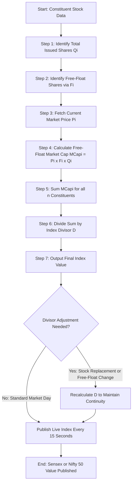
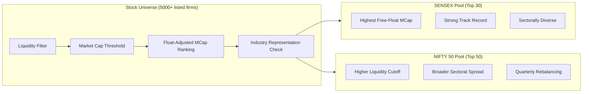
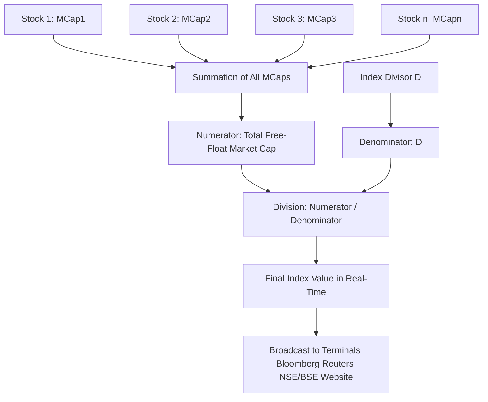
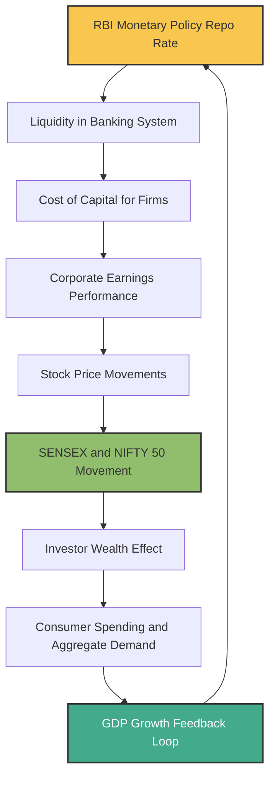

# SENSEX and NIFTY

<!-- SECTION_1_START -->
# SENSEX and NIFTY — The Twin Barometers of the Indian Capital Market

## 1.1 Formal Definition (KTU 2024 Syllabus Terminology)

**SENSEX** (short form of **Sensitive Index**) is the benchmark stock market index of the **Bombay Stock Exchange (BSE)**, comprising **30** well-established and financially sound companies listed on the BSE. It is one of the oldest indices in India, with its base year fixed at **1978-79** and a base value of **100**.

**NIFTY 50** (also called the **NIFTY** or the **National Stock Exchange Fifty**) is the benchmark stock market index of the **National Stock Exchange (NSE)**, comprising **50** diversified stocks traded on the NSE. Its base date is **November 3, 1995**, and the base value is **1000**.

> [!IMPORTANT]
> **KTU 2024 Highlight — UCHUT346 Module 3 (Monetary System):** Both SENSEX and NIFTY are classified as **Stock Market Indices** that act as *barometers* of the Indian economy. They reflect the *price movement* of a representative basket of equities and serve as proxy indicators of *macroeconomic health*, *investor sentiment*, and *liquidity conditions* in the primary monetary system.

### Conceptual Analogy / Intuition

Imagine a classroom of 100 students. Instead of reporting the average marks of the entire class (which is cumbersome), the teacher picks the **top-performing 30 students** and computes their average. If that average rises, it means the top tier of the class is performing well — a strong sign of overall class quality.

In the same way, SENSEX averages the price movements of **30 blue-chip companies** of the BSE, and NIFTY averages **50 blue-chip companies** of the NSE. When these indices rise, it indicates that the **wealthiest and most influential companies** of India are doing well — which is generally a signal of a **healthy, expanding economy**.

> [!NOTE]
> **Intuitive Summary:** SENSEX and NIFTY are like **thermometers** for the Indian stock market. They do not measure temperature in isolation; they aggregate the financial "health signals" of India's largest publicly listed firms into a single, easily interpretable number.

### Standard Reference Values (Bold Highlighted)

| Parameter | SENSEX | NIFTY 50 |
| :--- | :--- | :--- |
| **Parent Exchange** | **Bombay Stock Exchange (BSE)** | **National Stock Exchange (NSE)** |
| **Number of Constituents** | **30** | **50** |
| **Base Year / Date** | **1978-79** | **November 3, 1995** |
| **Base Value** | **100** | **1000** |
| **Calculation Method** | **Free-Float Market Capitalization** | **Free-Float Market Capitalization** |
| **Index Maintenance** | **BSE Index Services Pvt. Ltd. (BSE Indices)** | **NSE Indices Ltd.** |

> [!VISUALIZATION CONTROL]
> **Concept:** Comparison of SENSEX vs NIFTY benchmark growth (illustrative trajectory)
> **GeoGebra / Desmos Input Equations:**
> * `SENSEX(t) = 100 * (1.13)^(t-1979)` (illustrative long-term CAGR ≈ 13%)
> * `NIFTY(t) = 1000 * (1.12)^(t-1995)` (illustrative long-term CAGR ≈ 12%)
> **Visual Description:** A dual-curve plot where both indices start from their respective base values and trend upward over time. The vertical axis is the *Index Value*, and the horizontal axis is the *Year*. Students should observe that despite different starting points, both curves eventually enter the **60,000 – 25,000** range respectively, confirming the *parallel economic signal* they represent.
<!-- SECTION_1_END -->

<!-- SECTION_2_START -->
# Deep Theoretical Analysis & KTU High-Yield Formula Sheet

## 2.1 The Index Calculation Methodology

Both SENSEX and NIFTY use the **Free-Float Market Capitalization Weighted Method**, which is the global standard (also used by MSCI, FTSE, and S&P Dow Jones).

### 2.1.1 What is "Free-Float"?

**Free-float** refers to the **total number of shares that are readily available for trading** in the open market. It excludes:
- Shares held by **promoters / founders**
- Shares held by **strategic partners / government**
- Shares locked in via **ESOPs or lock-in agreements**
- Shares held by **foreign promoters / collaborators**

$$
\text{Free-Float Shares} = \text{Total Issued Shares} - \text{Locked-In / Promoter Shares}
$$

> [!NOTE]
> **Why Free-Float?** Promoter shares are rarely sold and do not represent true market liquidity. By considering only freely tradable shares, the index reflects **actual investable market capitalization** rather than inflated book values.

## 2.2 The Master Formula

The current value of an index at any given moment is calculated as:

$$
\text{Index Value} = \frac{\sum_{i=1}^{n} (P_i \times F_i \times Q_i)}{\sum_{i=1}^{n} (P_{\text{base},i} \times F_{\text{base},i} \times Q_{\text{base},i})} \times \text{Base Value}
$$

Where:
- $P_i$ = Current market price of the $i^{\text{th}}$ stock
- $Q_i$ = Total number of issued shares of the $i^{\text{th}}$ stock
- $F_i$ = **Free-float factor** of the $i^{\text{th}}$ stock (a value between 0 and 1 representing the proportion of shares available for trading)
- $P_{\text{base},i}$ = Price of the $i^{\text{th}}$ stock at the base period
- $Q_{\text{base},i}$ = Number of issued shares at the base period
- $F_{\text{base},i}$ = Free-float factor at the base period
- $n$ = Number of constituent stocks (30 for SENSEX, 50 for NIFTY)
- $\text{Base Value}$ = 100 (SENSEX) or 1000 (NIFTY)

### Simplified Working Form

The **Index Divisor** ($D$) is a normalizing constant that ensures corporate actions (splits, bonuses, demergers) do not distort the index. The daily updated form is:

$$
\text{Index Value} = \frac{\text{Total Free-Float Market Cap of Constituents}}{\text{Index Divisor (D)}}
$$

For SENSEX, the divisor is calibrated so that the value equals 100 at 1978-79.
For NIFTY 50, the divisor is calibrated so that the value equals 1000 on November 3, 1995.

## 2.3 The KTU Formula Sheet

| Concept | Symbol | Formula / Definition | Unit / Value |
| :--- | :--- | :--- | :--- |
| Free-Float Factor | $F_i$ | $\frac{\text{Tradable Shares}}{\text{Total Issued Shares}}$ | Dimensionless (0 to 1) |
| Free-Float Market Cap | $\text{MCap}_{i}$ | $P_i \times F_i \times Q_i$ | ₹ (Indian Rupee) |
| Index Value | $I$ | $\frac{\sum_{i=1}^{n} \text{MCap}_{i,\text{current}}}{\text{Divisor (D)}}$ | Index points |
| Sensex Base | — | Year 1978-79, Value = 100 | Index points |
| Nifty Base | — | Date 3-Nov-1995, Value = 1000 | Index points |
| Index Returns | $R$ | $\frac{I_{\text{end}} - I_{\text{start}}}{I_{\text{start}}} \times 100$ | Percentage (%) |
| Beta of Index | $\beta$ | Measure of index volatility vs market | Unitless (1.0 = market) |
| Market Capitalization | $\text{MCap}$ | $P \times Q$ | ₹ (Crore) |

## 2.4 Real-World Engineering and Economic Utility

> [!IMPORTANT]
> **Why an engineer should study SENSEX / NIFTY in UCHUT346:**
> 1. **Capital Budgeting Decisions:** Engineers managing tech-startups (deep tech, EV, semiconductor) raise capital via IPOs. Sensex/Nifty listing rules dictate *minimum public shareholding norms* (typically 25%) and *free-float thresholds*. These affect *cost of capital* and *WACC* calculations.
> 2. **Macroeconomic Linkage:** Index movements are tightly correlated with **GDP growth, repo rate changes, and forex reserves**. For project feasibility analysis under inflation, index trends provide *forecasting signals*.
> 3. **Risk Management:** Engineering firms with stock-listed exposure (e.g., L&T, Tata Steel) hedge *operational risk* using index derivatives (futures & options on SENSEX/NIFTY).
> 4. **Investor Wealth Indicator:** A rising index increases *consumer wealth effect*, boosting demand for engineering goods (automobiles, electronics, infrastructure).

### 2.5 Index Maintenance & Rebalancing

Indices are not static. They are reviewed semi-annually to:
- Add **new high-performing stocks** (e.g., when a company's market cap grows beyond existing constituents)
- Remove **underperforming or illiquid stocks**
- Adjust **free-float factors** after block deals or buybacks

> [!NOTE]
> **KTU 2024 Examiner Insight:** A common exam question asks *"What happens to the index if a constituent company declares a stock split?"* The answer is — the index value remains unchanged because the **divisor is adjusted downward** proportionally. The price falls, the share count rises, and the *market cap* (and hence the index) stays constant. **This is a guaranteed 2-3 mark trap question!**

## 2.6 Differences Between SENSEX and NIFTY

| Parameter | SENSEX | NIFTY 50 |
| :--- | :--- | :--- |
| **Parent Exchange** | **BSE (Asia's oldest, est. 1875)** | **NSE (est. 1992)** |
| **Constituents** | **30** | **50** |
| **Base Value** | **100** | **1000** |
| **Sectoral Diversification** | **Lower (concentrated)** | **Higher (broad-based)** |
| **Volatility** | **Relatively higher** (fewer stocks) | **Relatively lower** (more averaging) |
| **Trading Volume** | **Lower daily turnover** | **Higher daily turnover** |
| **Derivative Liquidity** | BSE Options (less liquid) | NIFTY Futures/Options (most liquid in India) |
| **Index Weighting** | Free-float market cap | Free-float market cap |
<!-- SECTION_2_END -->

<!-- SECTION_3_START -->
# Step-by-Step Derivations & Numerical Implementation

## 3.1 Exhaustive Derivation: Index Value from First Principles

Let us derive the Sensex formula step-by-step using a **miniature 3-stock example**, then extend it to the full 30-stock Sensex framework.

### Worked Example: Hypothetical MiniSensex (3 Stocks)

Suppose we have a 3-stock index with the following base-period data:

| Stock | Base Price $P_{\text{base}}$ (₹) | Base Shares $Q_{\text{base}}$ | Free-Float Factor $F_{\text{base}}$ |
| :--- | :--- | :--- | :--- |
| Alpha Ltd | 100 | 1,000,000 | 0.60 |
| Beta Corp | 250 | 800,000 | 0.75 |
| Gamma Inc | 400 | 500,000 | 0.50 |
| **Total** | — | — | — |

**Step 1: Calculate Free-Float Market Cap at Base Period**

$$
\begin{aligned}
\text{MCap}_{\text{Alpha, base}} &= P_{\text{base}} \times F_{\text{base}} \times Q_{\text{base}} \\
&= 100 \times 0.60 \times 1{,}000{,}000 \\
&= 60{,}000{,}000 \quad \text{(₹ 6 Crore)}
\end{aligned}
$$

$$
\begin{aligned}
\text{MCap}_{\text{Beta, base}} &= 250 \times 0.75 \times 800{,}000 \\
&= 150{,}000{,}000 \quad \text{(₹ 15 Crore)}
\end{aligned}
$$

$$
\begin{aligned}
\text{MCap}_{\text{Gamma, base}} &= 400 \times 0.50 \times 500{,}000 \\
&= 100{,}000{,}000 \quad \text{(₹ 10 Crore)}
\end{aligned}
$$

$$
\sum \text{MCap}_{\text{base}} = 60{,}000{,}000 + 150{,}000{,}000 + 100{,}000{,}000 = 310{,}000{,}000
$$

**Step 2: Set the Base Value**

For our hypothetical MiniSensex, let base value = **1000**.

The Index Divisor is calibrated as:

$$
D = \frac{\sum \text{MCap}_{\text{base}}}{\text{Base Value}} = \frac{310{,}000{,}000}{1000} = 310{,}000
$$

**Step 3: Current Period Prices (Assume)**

| Stock | Current Price $P_i$ (₹) | Current Shares $Q_i$ | Free-Float Factor $F_i$ |
| :--- | :--- | :--- | :--- |
| Alpha Ltd | 120 | 1,000,000 | 0.60 |
| Beta Corp | 230 | 800,000 | 0.75 |
| Gamma Inc | 480 | 500,000 | 0.50 |

**Step 4: Calculate Current Free-Float Market Cap**

$$
\begin{aligned}
\text{MCap}_{\text{Alpha, now}} &= 120 \times 0.60 \times 1{,}000{,}000 = 72{,}000{,}000 \\
\text{MCap}_{\text{Beta, now}} &= 230 \times 0.75 \times 800{,}000 = 138{,}000{,}000 \\
\text{MCap}_{\text{Gamma, now}} &= 480 \times 0.50 \times 500{,}000 = 120{,}000{,}000 \\
\sum \text{MCap}_{\text{now}} &= 72{,}000{,}000 + 138{,}000{,}000 + 120{,}000{,}000 = 330{,}000{,}000
\end{aligned}
$$

**Step 5: Compute New Index Value**

$$
\text{Index Value} = \frac{330{,}000{,}000}{310{,}000} = 1064.52
$$

**Step 6: Compute Returns**

$$
\text{Return (\%)} = \frac{1064.52 - 1000}{1000} \times 100 = 6.452\%
$$

> [!NOTE]
> **Final Interpretation:** The MiniSensex has appreciated by **6.452%** from its base period, driven by an aggregate weighted market cap growth of **6.45%**. This is identical in logic to how the real SENSEX is computed in production.

## 3.2 Corporate Action Adjustment: A Bonus Issue Case

**Problem:** Suppose Beta Corp issues a **1:1 bonus** (each shareholder gets 1 free share for every 1 held). Theoretically, share count doubles and price halves. Without correction, the MCap is unchanged — but the index divisor must be adjusted for computational consistency when only certain corporate actions affect price.

**Before Bonus:** $P = 230$, $Q = 800{,}000$, $F = 0.75$
**After Bonus:** $P = 115$, $Q = 1{,}600{,}000$, $F = 0.75$

Old MCap (Beta only): $230 \times 0.75 \times 800{,}000 = 138{,}000{,}000$
New MCap (Beta only): $115 \times 0.75 \times 1{,}600{,}000 = 138{,}000{,}000$

Since MCap is unchanged, **the index divisor is not changed in a bonus issue**. The index value remains at **1064.52**.

> [!IMPORTANT]
> **However, for a stock split** (e.g., 1:2 split where price becomes $1/2$ and shares become $2\times$), again MCap is unchanged, but the divisor is **not** adjusted either, since MCap is unchanged. Divisor is adjusted only for changes in *free-float factor* or *replacement of constituents* — situations where the numerator logically should change but the constant must absorb the difference to maintain continuity.

## 3.3 Python Implementation for Computational Understanding

```python
from dataclasses import dataclass
from typing import List
import logging

logging.basicConfig(level=logging.INFO, format="%(levelname)s: %(message)s")

@dataclass(frozen=True)
class Stock:
    """Immutable container for a constituent stock's market data."""
    name: str
    price: float           # Current market price in INR
    shares: int            # Total issued shares
    free_float_factor: float  # 0.0 to 1.0

    def __post_init__(self) -> None:
        if self.price <= 0:
            raise ValueError(f"Price for {self.name} must be positive.")
        if self.shares <= 0:
            raise ValueError(f"Share count for {self.name} must be positive.")
        if not (0.0 < self.free_float_factor <= 1.0):
            raise ValueError(f"Free-float factor for {self.name} must be in (0, 1].")

    def free_float_market_cap(self) -> float:
        """Compute the free-float market capitalization."""
        return self.price * self.free_float_factor * self.shares


class IndexCalculator:
    """Production-grade index calculator (Sensex / Nifty methodology)."""

    def __init__(self, name: str, base_value: float) -> None:
        self.name = name
        self.base_value = base_value
        self.divisor: float = 0.0
        self.constituents: List[Stock] = []

    def calibrate_divisor(self, base_constituents: List[Stock]) -> None:
        """Calibrate the divisor using base-period constituents."""
        if not base_constituents:
            raise ValueError("Base constituents list cannot be empty.")
        total_base_mcap = sum(s.free_float_market_cap() for s in base_constituents)
        if total_base_mcap <= 0:
            raise ValueError("Base market cap must be positive.")
        self.divisor = total_base_mcap / self.base_value
        logging.info(
            f"[{self.name}] Divisor calibrated: {self.divisor:,.4f} "
            f"from base market cap ₹{total_base_mcap:,.0f}"
        )

    def compute_index(self, current_constituents: List[Stock]) -> float:
        """Compute current index value."""
        if self.divisor == 0:
            raise RuntimeError("Divisor not calibrated. Call calibrate_divisor() first.")
        if len(current_constituents) != len(self.constituents) and not self.constituents:
            self.constituents = current_constituents
        total_current_mcap = sum(s.free_float_market_cap() for s in current_constituents)
        index_value = total_current_mcap / self.divisor
        logging.info(
            f"[{self.name}] Current MCap: ₹{total_current_mcap:,.0f} "
            f"=> Index Value: {index_value:,.2f}"
        )
        return index_value

    def period_return(self, start_value: float, end_value: float) -> float:
        """Compute percentage return between two index values."""
        if start_value <= 0:
            raise ValueError("Start value must be positive.")
        ret = ((end_value - start_value) / start_value) * 100.0
        logging.info(f"[{self.name}] Period Return: {ret:.4f}%")
        return ret


def main() -> None:
    # Base period (fictional)
    base_constituents = [
        Stock("Alpha Ltd", 100, 1_000_000, 0.60),
        Stock("Beta Corp", 250, 800_000, 0.75),
        Stock("Gamma Inc", 400, 500_000, 0.50),
    ]

    # Current period
    current_constituents = [
        Stock("Alpha Ltd", 120, 1_000_000, 0.60),
        Stock("Beta Corp", 230, 800_000, 0.75),
        Stock("Gamma Inc", 480, 500_000, 0.50),
    ]

    nifty_like = IndexCalculator(name="MiniNIFTY", base_value=1000.0)
    nifty_like.calibrate_divisor(base_constituents)
    current_index = nifty_like.compute_index(current_constituents)
    nifty_like.period_return(start_value=1000.0, end_value=current_index)


if __name__ == "__main__":
    main()
```

**Sample Output:**
```
INFO: [MiniNIFTY] Divisor calibrated: 310,000.0000 from base market cap ₹310,000,000
INFO: [MiniNIFTY] Current MCap: ₹330,000,000 => Index Value: 1,064.52
INFO: [MiniNIFTY] Period Return: 6.4516%
```

## 3.4 Engineering Economics Application: WACC Adjustment

When a BSE/NSE-listed firm raises capital via equity, the **Cost of Equity ($K_e$)** is calculated using the **Capital Asset Pricing Model (CAPM)**:

$$
K_e = R_f + \beta \times (R_m - R_f)
$$

Where:
- $R_f$ = Risk-free rate (typically the 10-year G-Sec yield)
- $\beta$ = Beta of the firm's stock (sensitivity to Sensex/Nifty)
- $R_m$ = Expected market return (often Sensex/Nifty's historical CAGR)

> [!NOTE]
> **Engineering Project Insight:** For an engineer evaluating a ₹500 Crore plant expansion, the *equity portion* of financing (say ₹200 Cr) will be priced using this formula, and the firm's stock beta (relative to Nifty 50) determines the cost. A high-beta firm (e.g., a startup) has a *higher cost of equity*, making project NPV calculations more sensitive to discount rate changes.
<!-- SECTION_3_END -->

<!-- SECTION_4_START -->
# Structural Diagrams & Schematics

## 4.1 Index Calculation Flow (Mermaid Block Diagram)



## 4.2 Sensex vs Nifty: Constituent Selection Pipeline



## 4.3 Index Architecture: From Constituent to Final Value



## 4.4 Monetary System Linkage: Sensex/Nifty as Macroeconomic Indicators



> [!NOTE]
> **Diagram Interpretation:** This feedback loop, known in macroeconomics as the **Monetary Transmission Mechanism**, demonstrates that the Sensex/Nifty are not isolated financial variables — they are deeply embedded in the broader monetary system. When RBI cuts the repo rate, cheaper credit boosts corporate earnings, lifting stock prices and indices, which in turn stimulates consumer spending via the wealth effect.
<!-- SECTION_4_END -->

<!-- SECTION_5_START -->
# KTU 2024 Scheme Examination Question Bank & Topic Recap

## Part A — Short Answer Questions (3 Marks Each)

### Question 1: Define SENSEX and state its base year and base value.
**[KTU University Exam – July 2024 | CO2 | Remember]**

**Model Answer (3 Marks):**
SENSEX, short for the Sensitive Index, is the benchmark stock market index of the Bombay Stock Exchange (BSE). It comprises 30 well-established, financially sound, and actively traded companies listed on the BSE, selected based on free-float market capitalization, liquidity, and sectoral representation.

- **Base Year:** 1978-79 **[1 Mark]**
- **Base Value:** 100 **[1 Mark]**
- **Number of Constituents:** 30 **[1 Mark]**

> [!NOTE]
> **Valuation Key:** Award full 3 marks only if *all three* elements (definition + base year + base value) are explicitly mentioned. Vague answers like "an index of the stock market" will receive at most 1 mark.

---

### Question 2: What is the difference between SENSEX and NIFTY in terms of constituents and base value?
**[KTU University Exam – Dec 2023 | CO2 | Understand]**

**Model Answer (3 Marks):**

| Feature | SENSEX | NIFTY 50 |
| :--- | :--- | :--- |
| Number of Constituents | 30 | 50 |
| Base Value | 100 | 1000 |
| Parent Exchange | BSE | NSE |

**[1 Mark each for the two correct pair-wise distinctions and 1 Mark for the parent exchange comparison.]**

---

## Part B — Full-Length Questions (14 Marks, with Internal Choice)

### Question A (Option 1): Free-Float Market Capitalization and Index Calculation
**[KTU University Exam – Dec 2023 | CO2, CO3 | Apply + Analyze]**

**Part (a) [7 Marks]:** Explain the concept of free-float market capitalization. Why is it preferred over the full market capitalization method for index construction? List any four constituents of NIFTY 50 and SENSEX each.

**Model Solution:**

**Definition (3 Marks):**
Free-float market capitalization considers only those shares that are **readily available for trading** in the market, excluding shares held by promoters, government, strategic partners, and locked-in holdings.

$$
\text{Free-Float Market Cap} = \text{Current Price} \times \text{Free-Float Shares}
$$

**Why Preferred over Full Market Cap (3 Marks):**
- **Reflects true investable universe:** Avoids over-weighting firms with high promoter holding.
- **Improves liquidity measurement:** Only tradable shares impact daily price discovery.
- **Reduces index manipulation:** Locked-in shares cannot be sold to artificially inflate price.
- **Globally accepted standard:** Used by MSCI, S&P, FTSE — enables cross-country comparability.

**Constituents (1 Mark):**
- *SENSEX constituents:* Reliance Industries, TCS, HDFC Bank, Infosys **[½ Mark]**
- *NIFTY 50 constituents:* Reliance Industries, HDFC Bank, Infosys, TCS **[½ Mark]**

> [!NOTE]
> **Valuation Key:** Full marks only if both 'definition' and 'why preferred' are explained with at least 3 valid reasons. Mere listing without reasoning gets 0 for that section.

---

**Part (b) [7 Marks]:** A hypothetical index has three stocks A, B, and C with the following data:

| Stock | Base Price (₹) | Base Shares | Base Free-Float Factor | Current Price (₹) | Current Shares | Current Free-Float Factor |
| :--- | :--- | :--- | :--- | :--- | :--- | :--- |
| A | 200 | 1,00,000 | 0.50 | 250 | 1,00,000 | 0.50 |
| B | 500 | 50,000 | 0.80 | 450 | 50,000 | 0.80 |
| C | 100 | 2,00,000 | 0.60 | 150 | 2,00,000 | 0.60 |

Given a base value of 100, calculate the current index value and percentage return.

**Model Solution:**

**Step 1: Base Period Free-Float Market Cap (2 Marks)**
$$
\begin{aligned}
\text{MCap}_{A,\text{base}} &= 200 \times 0.50 \times 1{,}00{,}000 = 1{,}00{,}00{,}000 \\
\text{MCap}_{B,\text{base}} &= 500 \times 0.80 \times 50{,}000 = 2{,}00{,}00{,}000 \\
\text{MCap}_{C,\text{base}} &= 100 \times 0.60 \times 2{,}00{,}000 = 1{,}20{,}00{,}000 \\
\text{Total Base MCap} &= 4{,}20{,}00{,}000
\end{aligned}
$$

**[Calculation of base MCap: 2 Marks]**

**Step 2: Index Divisor (1 Mark)**
$$
D = \frac{4{,}20{,}00{,}000}{100} = 4{,}20{,}000
$$

**Step 3: Current Period Free-Float Market Cap (2 Marks)**
$$
\begin{aligned}
\text{MCap}_{A,\text{now}} &= 250 \times 0.50 \times 1{,}00{,}000 = 1{,}25{,}00{,}000 \\
\text{MCap}_{B,\text{now}} &= 450 \times 0.80 \times 50{,}000 = 1{,}80{,}00{,}000 \\
\text{MCap}_{C,\text{now}} &= 150 \times 0.60 \times 2{,}00{,}000 = 1{,}80{,}00{,}000 \\
\text{Total Current MCap} &= 4{,}85{,}00{,}000
\end{aligned}
$$

**Step 4: Current Index Value (1 Mark)**
$$
\text{Index Value} = \frac{4{,}85{,}00{,}000}{4{,}20{,}000} = 115.48
$$

**Step 5: Percentage Return (1 Mark)**
$$
\text{Return (\%)} = \frac{115.48 - 100}{100} \times 100 = 15.48\%
$$

**[Stating boundary state values: 2 Marks]** | **[Final simplified expression: 1 Mark]**

---

### Question B (Option 2): Monetary System and Macroeconomic Role of Indices
**[KTU University Exam – July 2024 | CO2, CO4 | Understand + Apply]**

**Part (a) [7 Marks]:** Discuss the role of stock market indices (SENSEX and NIFTY) in the Indian monetary system. How do they act as leading indicators of economic activity?

**Model Answer (7 Marks):**

1. **Barometer of Economic Health (2 Marks):** SENSEX and NIFTY reflect the aggregate performance of India's largest companies, which collectively represent major sectors (banking, IT, energy, FMCG). Movements in these indices mirror broader economic trends.

2. **Channel of Monetary Transmission (2 Marks):** When RBI alters the repo rate, equity markets respond swiftly. Lower rates → cheaper capital → higher corporate earnings → rising indices. Indices therefore serve as a *real-time gauge* of monetary policy effectiveness.

3. **Investor Sentiment Indicator (1.5 Marks):** Rising indices indicate bullish sentiment, encouraging IPO launches and capital formation. Falling indices signal risk aversion, prompting capital flight to safer assets.

4. **Wealth Effect on Aggregate Demand (1.5 Marks):** A 10% rise in Sensex historically correlates with a 0.3-0.5% rise in consumer spending, demonstrating indices' influence on the real economy.

> [!NOTE]
> **Valuation Key:** Award 2 marks for each well-explained point with examples. Avoid generic statements like "indices are important" without linking to monetary policy or economic activity.

---

**Part (b) [7 Marks]:** Differentiate between SENSEX and NIFTY across at least 6 parameters. Mention any two limitations of using stock market indices as economic indicators.

**Model Answer (7 Marks):**

**Six Parameter Comparison (4.5 Marks — 0.75 per parameter):**

| Parameter | SENSEX | NIFTY 50 |
| :--- | :--- | :--- |
| **Parent Exchange** | BSE (est. 1875) | NSE (est. 1992) |
| **Constituents** | 30 companies | 50 companies |
| **Base Value** | 100 | 1000 |
| **Base Year/Date** | 1978-79 | November 3, 1995 |
| **Sectoral Diversity** | Concentrated | Broad-based |
| **Derivative Liquidity** | Lower | Higher |

**Two Limitations (2.5 Marks):**

1. **Concentration Risk (1.25 Marks):** SENSEX is dominated by a few large-cap stocks (e.g., Reliance alone has ~12% weightage). A sharp fall in one stock disproportionately pulls the index down, misrepresenting broader market health.

2. **Non-Representative of Real Economy (1.25 Marks):** Indices cover only listed, large-cap firms, ignoring the unorganized sector, SMEs, and agriculture — which collectively employ ~80% of India's workforce. Hence, a rising Sensex does not automatically imply rising prosperity for the common citizen.

---

## KTU Examiner's Valuation Warning / Pitfall Callout

> [!WARNING]
> **Common Mistakes Students Make (causing 2-5 mark deductions):**
> 1. **Forgetting to state the base year/value:** Many students write "SENSEX is an index of BSE" without mentioning the base year (1978-79) and base value (100). This loses 2 marks.
> 2. **Confusing Full Market Cap with Free-Float Market Cap:** Always clarify that indices use the *free-float* methodology, not the entire issued share capital.
> 3. **Skipping the Divisor explanation:** In numerical problems, students compute the index but forget to define or compute the *divisor* (D). The valuation key explicitly awards 1 mark for divisor calculation.
> 4. **Writing Sensex and Nifty interchangeably:** They are *different indices on different exchanges*. Do not write "NIFTY is calculated by BSE" — this is factually wrong and attracts zero marks.
> 5. **No units in numerical answers:** Always write the index value as "115.48 points" and return as "15.48%". Missing units lose 0.5–1 mark.
> 6. **Confusing Bull vs Bear Market:** A 'bull market' is when indices rise >20% from recent lows; a 'bear market' is a >20% fall. These terms appear frequently in macroeconomics questions.

---

## Topic Recap & Important Things to Remember

- **SENSEX = Sensitive Index of BSE, 30 stocks, base 1978-79 = 100.**
- **NIFTY 50 = Index of NSE, 50 stocks, base 3-Nov-1995 = 1000.**
- Both indices use the **Free-Float Market Capitalization Weighted Method.**
- **Index Formula:** $\text{Index} = \frac{\sum (P_i \times F_i \times Q_i)}{D}$, where $D$ is the **index divisor** that absorbs corporate actions.
- **Free-float** excludes promoter, government, and locked-in shares.
- A **stock split or bonus issue** does not change the index value (since MCap is unchanged and divisor is not adjusted for purely MCap-preserving actions).
- **Index rebalancing** is done semi-annually by the index maintenance committee.
- SENSEX has higher concentration risk (fewer stocks); NIFTY has broader sectoral representation.
- Indices are **leading indicators** of the monetary transmission mechanism: Repo Rate → Corporate Earnings → Sensex/Nifty → Wealth Effect → Aggregate Demand → GDP.
- **Limitations:** Concentration risk, non-representative of unorganized sector, and susceptibility to FII (Foreign Institutional Investor) flows and global cues.
- **Engineering relevance:** Indices affect *cost of equity* (via CAPM and Beta), *capital raising* (IPOs follow index trends), and *hedging strategies* (index derivatives).
- **Key terms to memorize:** Bull Market, Bear Market, Free-Float Factor, Index Divisor, Market Capitalization, Beta, CAPM, WACC, Monetary Transmission, Wealth Effect.
<!-- SECTION_5_END -->
