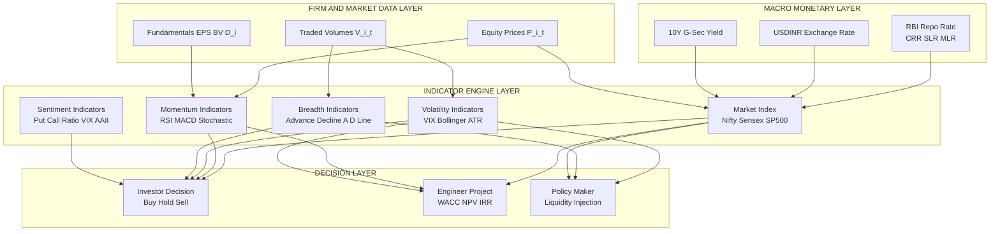
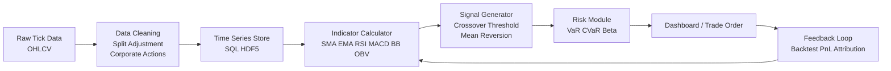
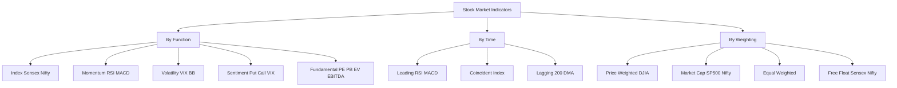
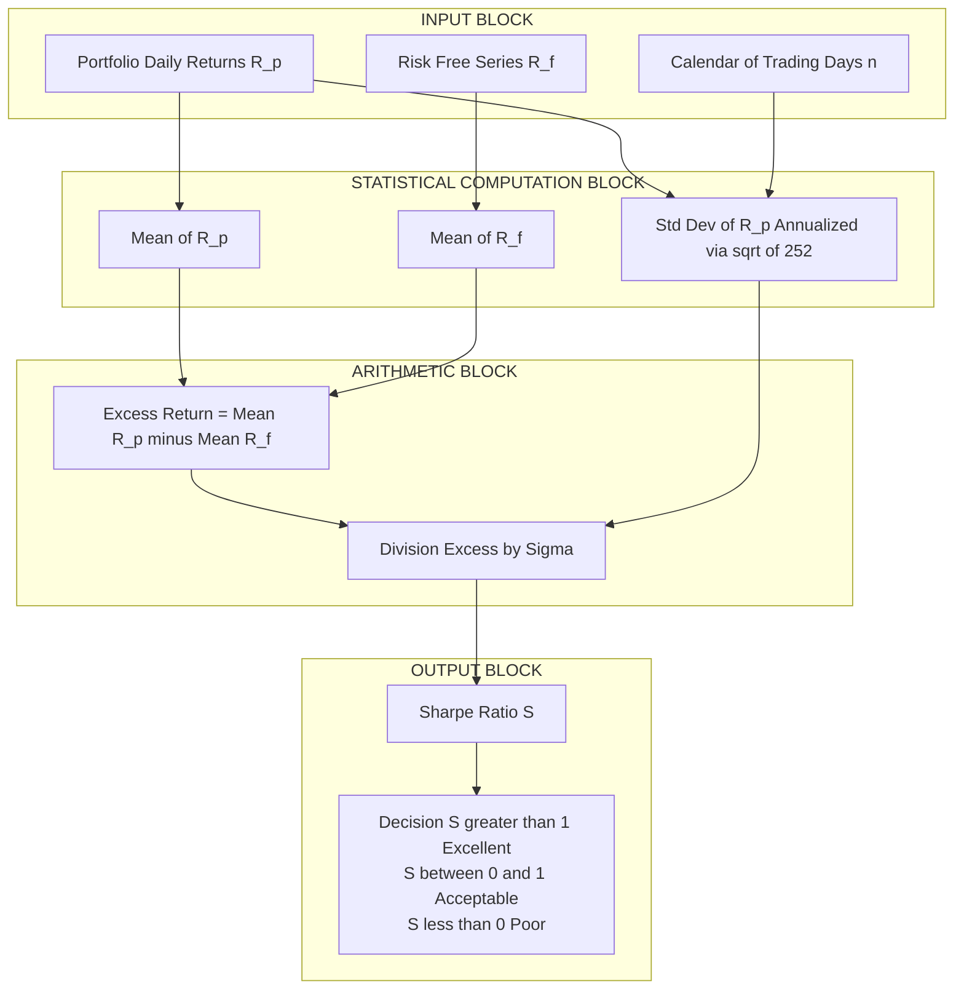

# Stock market Indicators

<!-- SECTION_1_START -->
# Stock Market Indicators — Core Technical Definition & Intuitive Overview

## 1.1 Formal Academic Definition (KTU 2024 Syllabus Terminology)

> [!IMPORTANT]
> **Stock Market Indicators** are quantified statistical measures derived from the price, volume, breadth, sentiment, and fundamental data of listed securities. They are used by investors, portfolio managers, and policy regulators to **interpret market direction**, **gauge economic health**, and **forecast short-term and long-term price movements** of equities traded on organized exchanges.

In the context of the KTU 2024 Scheme course **UCHUT346 — Economics for Engineers (Module 3: Monetary System)**, stock market indicators form the empirical bridge between **macroeconomic policy** (interest rates, money supply, fiscal stance) and **microeconomic firm-level decision making** (capital raising, valuation, project feasibility).

Formally, a stock market indicator $I_t$ at time $t$ is any function of the price and volume vector:

$$I_t = f(P_1, P_2, \ldots, P_n, V_1, V_2, \ldots, V_n, M_t, S_t)$$

where $P_i$ is the price of the $i^{\text{th}}$ constituent stock, $V_i$ is its traded volume, $M_t$ is the market-wide monetary base, and $S_t$ represents the prevailing sentiment vector.

## 1.2 Conceptual Analogy — The "Weather Station" of the Economy

> [!NOTE]
> **Intuition:** Think of the stock market as a vast outdoor stadium filled with thousands of cheering fans. Each fan is a *company* (a listed firm). The overall **volume of cheering** tells you whether the mood is happy (bullish) or unhappy (bearish). A **stock market indicator** is the *decibel meter* hung from the stadium roof — it does not generate the sound, it only **measures, summarizes, and reports** what is already happening inside the arena.

- A **stock index** (like Sensex or Nifty) is the *overall loudness reading* on the decibel meter.
- A **technical indicator** (like RSI or MACD) is the *rate of change* of that loudness — is it rising fast, falling fast, or stable?
- A **sentiment indicator** (like the VIX) is the *tremor in the crowd's feet* — a measure of fear and uncertainty.

## 1.3 Why an Engineer Must Study This

> [!NOTE]
> **Syllabus Highlight (KTU 2024, Module 3 — Monetary System):**
> An engineer is not a passive consumer of capital — engineers raise capital (IPOs), evaluate projects (NPV using cost of equity derived from market indicators), and design systems whose commercial viability depends on macroeconomic signals. Understanding stock market indicators empowers the engineer to read the **risk-return landscape** before committing scarce financial resources.

## 1.4 Physical Constants and Standard Metrics Used Throughout This Module

The following are the **standard benchmark values** universally referenced across global financial markets:

- **Trading Days per Year:** **252** business days (used in annualization of returns and volatility).
- **Risk-Free Rate Benchmark:** yield on the **10-Year Government Treasury Bond** (e.g., India 10Y G-Sec ≈ **7.0% – 7.25%** as of 2024 reference).
- **Volatility Constant:** daily standard deviation of index returns is typically **1.0% – 1.5%** for mature markets.
- **BSE Sensex Base Year:** **1978-79**, Base Value = **100**.
- **NSE Nifty Base Date:** **3 November 1995**, Base Value = **1000**, Base Capital = **₹2.06 trillion**.

> [!IMPORTANT]
> **Major Global Stock Market Indicators (Indices):**
> - **Dow Jones Industrial Average (DJIA)** — 30 large-cap US companies, price-weighted.
> - **S&P 500** — 500 large-cap US companies, market-cap weighted.
> - **NASDAQ Composite** — 3000+ stocks, heavily technology-weighted.
> - **NSE Nifty 50** — 50 large-cap Indian companies, free-float market-cap weighted.
> - **BSE Sensex 30** — 30 large-cap Indian companies, free-float market-cap weighted.
> - **Hang Seng (HSI)** — Hong Kong benchmark.
> - **FTSE 100** — UK benchmark.
> - **DAX 40** — German benchmark.
> - **Nikkei 225** — Japanese benchmark.

## 1.5 GeoGebra / Desmos Visualization Control

> [!VISUALIZATION CONTROL]
> **Concept:** Simulated Normal Distribution of Daily Log-Returns on the Nifty 50 Index (Empirical Behaviour of a Market Indicator).
> **GeoGebra / Desmos Input Equations:**
> * `f(x) = (1 / (sigma * sqrt(2*pi))) * exp(-(x - mu)^2 / (2 * sigma^2))`
> * `mu = 0.0005` (mean daily log-return)
> * `sigma = 0.013` (daily standard deviation, ~1.3%)
> * `x-axis label = Daily Log-Return of Nifty 50`
> * `y-axis label = Probability Density f(x)`
> **Visual Description:** The student should observe a **bell-shaped curve** centered just to the right of zero, indicating a *slight positive drift* (long-term upward bias of equity markets). The **tails** of the curve are the *crash and boom zones* — these rare events are what the **Value-at-Risk (VaR)** and **Conditional VaR (CVaR)** indicators measure.

<!-- SECTION_1_END -->

<!-- SECTION_2_START -->
# Deep Theoretical Analysis & KTU High-Yield Formula Sheet

## 2.1 Classification of Stock Market Indicators

Stock market indicators are classified along **three orthogonal axes** as required by the KTU 2024 Module 3 syllabus:

### Axis 1 — By Function (Information Content)

| Type | Definition | Examples | Use Case |
|---|---|---|---|
| **Market Index** | Composite measure of overall market level | Sensex, Nifty 50, S&P 500 | Track broad market direction |
| **Breadth Indicator** | Measures how many stocks are advancing vs declining | Advance-Decline Line, McClellan Oscillator | Detect market participation |
| **Momentum Indicator** | Speed of price change | RSI, MACD, Stochastic Oscillator | Identify overbought/oversold zones |
| **Volatility Indicator** | Magnitude of price fluctuations | VIX, Bollinger Bands, ATR | Measure market fear/uncertainty |
| **Volume Indicator** | Confirms price moves with trading activity | OBV, Volume Weighted Average Price (VWAP) | Validate trend strength |
| **Sentiment Indicator** | Gauges investor psychology | Put/Call Ratio, AAII Bull-Bear Spread, CNN Fear & Greed Index | Predict reversals |
| **Fundamental Indicator** | Valuation-based metrics | P/E Ratio, P/B Ratio, Dividend Yield, EV/EBITDA | Long-term intrinsic value |

### Axis 2 — By Temporal Behaviour

> [!NOTE]
> - **Leading Indicators:** *Predict* future price movements (e.g., RSI, MACD, Put/Call Ratio, VIX).
> - **Coincident Indicators:** *Move simultaneously* with the market (e.g., Index value itself, Industrial Production).
> - **Lagging Indicators:** *Confirm* trends after they have begun (e.g., Moving Averages, 200-Day MA).

### Axis 3 — By Construction Methodology

- **Price-Weighted Index:** Each constituent weighted by its share price. Example: **DJIA**.
- **Market-Cap Weighted Index:** Each constituent weighted by market capitalization. Example: **S&P 500, Nifty 50, Sensex**.
- **Equal-Weighted Index:** Each constituent carries identical weight. Example: **Value Line Composite**.
- **Free-Float Weighted Index:** Only the *floating* (non-promoter) shares are considered. Example: **Nifty 50 (post-2009 reform)**.

## 2.2 KTU Formula Sheet — Master Reference Table

| # | Indicator | Formula | Engineering / Financial Interpretation |
|---|---|---|---|
| 1 | **Price-Weighted Index (DJIA Method)** | $\text{Index}_t = \dfrac{\sum_{i=1}^{n} P_{i,t}}{d}$ | Where $d$ is the *Dow Divisor* (adjusted for splits). A **high-priced stock** moves the index disproportionately. |
| 2 | **Market-Cap Weighted Index** | $\text{Index}_t = \dfrac{\sum_{i=1}^{n} (P_{i,t} \times Q_{i,t})}{\text{Base Market Cap}} \times \text{Base Value}$ | A company with **larger market cap** exerts more influence. Used by S&P 500, Nifty 50. |
| 3 | **Simple Moving Average (SMA)** | $\text{SMA}_n(t) = \dfrac{1}{n} \sum_{i=0}^{n-1} P_{t-i}$ | Smooths noise; lag increases with $n$. |
| 4 | **Exponential Moving Average (EMA)** | $\text{EMA}_t = \alpha P_t + (1-\alpha) \text{EMA}_{t-1}$ | Where $\alpha = \dfrac{2}{n+1}$. Reacts faster to recent prices. |
| 5 | **Relative Strength Index (RSI)** | $\text{RSI} = 100 - \dfrac{100}{1 + \text{RS}}$ where $\text{RS} = \dfrac{\overline{\text{Gain}}}{\overline{\text{Loss}}}$ | Values $> 70 \Rightarrow$ overbought; $< 30 \Rightarrow$ oversold. |
| 6 | **Moving Average Convergence Divergence (MACD)** | $\text{MACD} = \text{EMA}_{12} - \text{EMA}_{26}$ | Positive MACD = bullish momentum. |
| 7 | **Bollinger Bands** | $\text{Upper} = \text{SMA}_{20} + 2\sigma$, $\text{Lower} = \text{SMA}_{20} - 2\sigma$ | Bands expand in volatile markets, contract in calm markets. |
| 8 | **On-Balance Volume (OBV)** | $\text{OBV}_t = \text{OBV}_{t-1} + \begin{cases} V_t & \text{if } P_t > P_{t-1} \\ -V_t & \text{if } P_t < P_{t-1} \\ 0 & \text{if } P_t = P_{t-1} \end{cases}$ | Volume precedes price — confirms or warns of breakouts. |
| 9 | **Volatility (Historical)** | $\sigma_{\text{annual}} = \sigma_{\text{daily}} \times \sqrt{252}$ | Used in Black-Scholes and VaR calculations. |
| 10 | **Sharpe Ratio** | $S = \dfrac{R_p - R_f}{\sigma_p}$ | Risk-adjusted return. Higher is better. |
| 11 | **Beta ($\beta$)** | $\beta_i = \dfrac{\text{Cov}(R_i, R_m)}{\text{Var}(R_m)}$ | Systematic risk of stock $i$ relative to market $m$. |
| 12 | **Price-to-Earnings (P/E) Ratio** | $\text{P/E} = \dfrac{\text{Market Price per Share}}{\text{Earnings per Share (EPS)}}$ | Valuation gauge. |
| 13 | **Value at Risk (VaR)** | $\text{VaR}_{\alpha} = \mu - z_{\alpha} \sigma$ | Maximum loss at confidence level $\alpha$. |
| 14 | **Compound Annual Growth Rate (CAGR)** | $\text{CAGR} = \left(\dfrac{V_{\text{end}}}{V_{\text{start}}}\right)^{1/n} - 1$ | Long-term index growth measure. |

## 2.3 The 'Why' and 'How' Behind Each Core Indicator

### 2.3.1 Why Do We Need a Market Index?

A single stock price is **noise**. Even 50 stocks, viewed individually, are 50 separate noise signals. The human brain cannot process 50 signals at once. A market index is a **dimensionality reduction** technique — it compresses $n$ price series into **one** interpretable scalar time series. This is mathematically analogous to a **principal component analysis (PCA)** in engineering, where the first principal component captures the dominant variance.

### 2.3.2 Why Market-Cap Weighting Is Superior to Price Weighting

> [!IMPORTANT]
> In a **price-weighted** index, a **stock split** of ₹10,000 share to ₹100 share mechanically distorts the index. In a **market-cap weighted** index, splits leave the total market cap unchanged, so the index is naturally robust. This is why Nifty 50, Sensex, and S&P 500 all use market-cap (or free-float market-cap) weighting.

### 2.3.3 How the Dow Divisor Works

The Dow Jones originally was a simple sum of 12 stock prices divided by 12, giving an average of $\dfrac{\sum P_i}{12}$. With splits, dividends, and substitutions, the divisor $d$ is **continuously adjusted** to maintain index continuity. As of 2024, the Dow Divisor is approximately **$d \approx 0.1517$**. This single number preserves the historical comparability of the index across decades.

## 2.4 Real-World Engineering and Computer Science Utility

> [!NOTE]
> **Production Use Cases of Stock Market Indicators in Industry:**
> 1. **Algorithmic Trading Systems (HFT):** Engineering teams at firms like Jane Street, Citadel, and Quantrolabs code RSI, MACD, and Bollinger Band signals in **C++ / FPGA** to execute trades in microseconds.
> 2. **Risk Management Dashboards:** Banks (HSBC, JPMorgan) compute **VaR** and **Beta** in real time on **Apache Kafka** streams.
> 3. **Capital Budgeting:** An engineer's project **discount rate (WACC)** is derived from the firm's **Beta** and the market risk premium derived from index returns.
> 4. **Embedded Finance:** IoT-based lending platforms and supply-chain finance apps pull **live index data** to dynamically reprice credit.
> 5. **AI/ML Forecasting:** LSTM and Transformer-based models trained on **RSI, MACD, and OBV** features outperform price-only models in backtests.
> 6. **Robo-Advisors:** Retail wealth-tech apps (Zerodha, Groww, Wealthfront) use index indicators for **portfolio rebalancing** triggers.

<!-- SECTION_2_END -->

<!-- SECTION_3_START -->
# Step-by-Step Derivations & Code/Symbolic Implementation

## 3.1 Worked Example 1 — Constructing a Price-Weighted Index (DJIA Method)

**Problem Statement:** A fictional exchange has 3 stocks with the following data:

| Stock | Price on Day 1 (₹) | Price on Day 2 (₹) |
|---|---|---|
| A | 100 | 110 |
| B | 200 | 195 |
| C | 50 | 55 |

**Step 1:** Compute the sum of prices on Day 1.

$$\sum P_{\text{Day 1}} = 100 + 200 + 50 = 350$$

**Step 2:** Use the initial divisor (number of stocks) $d_1 = 3$.

$$\text{Index}_{\text{Day 1}} = \frac{350}{3} = 116.67$$

**Step 3:** Compute the sum of prices on Day 2.

$$\sum P_{\text{Day 2}} = 110 + 195 + 55 = 360$$

**Step 4:** Index on Day 2.

$$\text{Index}_{\text{Day 2}} = \frac{360}{3} = 120.00$$

**Step 5:** Compute the percentage change.

$$\Delta \text{Index} = \frac{120.00 - 116.67}{116.67} \times 100 = +2.85\%$$

> [!NOTE]
> **Observation:** Even though Stock B fell from ₹200 to ₹195 (a 2.5% decline), the index rose because Stocks A and C together contributed more absolute price increase (₹10 + ₹5 = ₹15) than Stock B's decline (₹5). This illustrates a **fundamental flaw** of price-weighting: *absolute price* matters, not *relative performance*.

## 3.2 Worked Example 2 — Computing the Relative Strength Index (RSI)

**Problem Statement:** A stock has 14 consecutive daily closing prices. Compute the 14-period RSI.

**Data:**

| Day | Close (₹) | Change (₹) | Gain | Loss |
|---|---|---|---|---|
| 1 | 100.00 | — | — | — |
| 2 | 102.50 | +2.50 | 2.50 | 0.00 |
| 3 | 101.00 | −1.50 | 0.00 | 1.50 |
| 4 | 103.75 | +2.75 | 2.75 | 0.00 |
| 5 | 105.50 | +1.75 | 1.75 | 0.00 |
| 6 | 104.00 | −1.50 | 0.00 | 1.50 |
| 7 | 106.25 | +2.25 | 2.25 | 0.00 |
| 8 | 108.00 | +1.75 | 1.75 | 0.00 |
| 9 | 107.50 | −0.50 | 0.00 | 0.50 |
| 10 | 109.00 | +1.50 | 1.50 | 0.00 |
| 11 | 111.25 | +2.25 | 2.25 | 0.00 |
| 12 | 110.00 | −1.25 | 0.00 | 1.25 |
| 13 | 112.50 | +2.50 | 2.50 | 0.00 |
| 14 | 115.00 | +2.50 | 2.50 | 0.00 |

**Step 1:** Sum the gains over 14 days.

$$\sum \text{Gain} = 2.50 + 0.00 + 2.75 + 1.75 + 0.00 + 2.25 + 1.75 + 0.00 + 1.50 + 2.25 + 0.00 + 2.50 + 2.50 = 19.75$$

**Step 2:** Sum the losses over 14 days.

$$\sum \text{Loss} = 0.00 + 1.50 + 0.00 + 0.00 + 1.50 + 0.00 + 0.00 + 0.50 + 0.00 + 0.00 + 1.25 + 0.00 + 0.00 = 4.75$$

**Step 3:** Compute average gain and average loss.

$$\overline{\text{Gain}} = \frac{19.75}{14} = 1.4107$$

$$\overline{\text{Loss}} = \frac{4.75}{14} = 0.3393$$

**Step 4:** Compute Relative Strength (RS).

$$\text{RS} = \frac{\overline{\text{Gain}}}{\overline{\text{Loss}}} = \frac{1.4107}{0.3393} = 4.1574$$

**Step 5:** Compute RSI.

$$\text{RSI} = 100 - \frac{100}{1 + \text{RS}} = 100 - \frac{100}{1 + 4.1574} = 100 - \frac{100}{5.1574} = 100 - 19.39 = 80.61$$

**Interpretation:** RSI = **80.61** lies above the **70 threshold**, signalling an **overbought** condition. A technical analyst would expect a near-term pullback.

> [!WARNING]
> **Valuation Pitfall:** Many students incorrectly use *simple averages* of gains/losses without the **Wilder smoothing** correction for subsequent periods. The first RSI uses simple averages; subsequent updates use the recursive Wilder formula $\overline{\text{Gain}}_{\text{new}} = \dfrac{\overline{\text{Gain}}_{\text{old}} \times (n-1) + \text{Gain}_{\text{new}}}{n}$.

## 3.3 Worked Example 3 — Computing Bollinger Bands

**Problem Statement:** The 20-day SMA of a stock is **₹500** and the 20-day population standard deviation is **₹15**. Compute the Bollinger Bands.

**Step 1:** Compute the upper band.

$$\text{Upper Band} = \text{SMA}_{20} + 2 \sigma = 500 + 2 \times 15 = 500 + 30 = 530$$

**Step 2:** Compute the lower band.

$$\text{Lower Band} = \text{SMA}_{20} - 2 \sigma = 500 - 2 \times 15 = 500 - 30 = 470$$

**Step 3:** Interpret.

If the current price is ₹520, it lies within the bands — the market is in a **normal volatility regime**. If the price is ₹540, it has **broken above the upper band**, signalling either a strong breakout or a reversal. Bands are not buy/sell signals in isolation — they are **volatility envelopes**.

## 3.4 Worked Example 4 — Annualized Volatility and Sharpe Ratio

**Problem Statement:** A portfolio returned **18%** annually. The daily log-returns had a standard deviation of **1.2%**. The risk-free rate is **7%**. Compute the annualized volatility and the Sharpe Ratio.

**Step 1:** Annualize the volatility.

$$\sigma_{\text{annual}} = 1.2\% \times \sqrt{252} = 1.2\% \times 15.8745 = 19.05\%$$

**Step 2:** Compute the Sharpe Ratio.

$$S = \frac{R_p - R_f}{\sigma_p} = \frac{18\% - 7\%}{19.05\%} = \frac{11}{19.05} = 0.577$$

**Interpretation:** A Sharpe of **0.577** is *acceptable* but mediocre. Quant funds typically target $S > 1.0$. This is the kind of calculation an engineer would use to evaluate a startup's projected returns against market benchmarks.

## 3.5 Python Implementation — Complete Indicator Engine

```python
"""
stock_indicator_engine.py
-------------------------
A production-grade Python module that computes the major stock market indicators
covered in the KTU 2024 syllabus (UCHUT346, Module 3).
"""

from __future__ import annotations

import math
import logging
from dataclasses import dataclass, field
from typing import List, Dict, Optional, Tuple

# Configure structured error logging
logging.basicConfig(
    level=logging.INFO,
    format="%(asctime)s [%(levelname)s] %(name)s :: %(message)s",
)
logger = logging.getLogger("StockIndicatorEngine")

TRADING_DAYS_PER_YEAR: int = 252
RSI_PERIOD: int = 14
MACD_FAST: int = 12
MACD_SLOW: int = 26
MACD_SIGNAL: int = 9
BOLLINGER_PERIOD: int = 20
BOLLINGER_STD_MULT: float = 2.0


@dataclass
class PriceSeries:
    """A validated time-ordered list of closing prices."""
    closes: List[float] = field(default_factory=list)

    def __post_init__(self) -> None:
        if len(self.closes) < 2:
            raise ValueError("PriceSeries must contain at least 2 closing prices.")
        if any(p <= 0 for p in self.closes):
            raise ValueError("All prices must be strictly positive.")
        if not all(
            isinstance(p, (int, float)) and math.isfinite(p) for p in self.closes
        ):
            raise ValueError("All prices must be finite numeric values.")
        logger.info("PriceSeries validated with %d data points.", len(self.closes))

    def daily_log_returns(self) -> List[float]:
        """Compute the natural log of successive price ratios."""
        returns: List[float] = []
        for i in range(1, len(self.closes)):
            r = math.log(self.closes[i] / self.closes[i - 1])
            returns.append(r)
        return returns


def sma(prices: List[float], window: int) -> List[Optional[float]]:
    """Simple Moving Average with NaN-like None padding for warm-up period."""
    if window <= 0:
        raise ValueError("Window must be a positive integer.")
    if window > len(prices):
        raise ValueError("Window cannot exceed series length.")
    out: List[Optional[float]] = [None] * (window - 1)
    for i in range(window - 1, len(prices)):
        slice_ = prices[i - window + 1 : i + 1]
        out.append(sum(slice_) / window)
    return out


def ema(prices: List[float], window: int) -> List[Optional[float]]:
    """Exponential Moving Average using standard smoothing factor alpha = 2/(n+1)."""
    if window <= 0:
        raise ValueError("Window must be a positive integer.")
    if window > len(prices):
        raise ValueError("Window cannot exceed series length.")
    alpha: float = 2.0 / (window + 1)
    out: List[Optional[float]] = [None] * (window - 1)
    seed: float = sum(prices[:window]) / window
    out.append(seed)
    for i in range(window, len(prices)):
        prev = out[-1]
        assert prev is not None
        out.append(alpha * prices[i] + (1 - alpha) * prev)
    return out


def rsi(prices: List[float], period: int = RSI_PERIOD) -> List[Optional[float]]:
    """Relative Strength Index using Wilder's smoothing method."""
    if period <= 0:
        raise ValueError("RSI period must be positive.")
    if len(prices) < period + 1:
        raise ValueError("Insufficient data for the requested RSI period.")

    deltas: List[float] = [prices[i] - prices[i - 1] for i in range(1, len(prices))]
    gains: List[float] = [max(d, 0.0) for d in deltas]
    losses: List[float] = [abs(min(d, 0.0)) for d in deltas]

    avg_gain: float = sum(gains[:period]) / period
    avg_loss: float = sum(losses[:period]) / period

    out: List[Optional[float]] = [None] * period
    if avg_loss == 0:
        out.append(100.0)
    else:
        rs0 = avg_gain / avg_loss
        out.append(100.0 - (100.0 / (1.0 + rs0)))

    for i in range(period, len(deltas)):
        avg_gain = (avg_gain * (period - 1) + gains[i]) / period
        avg_loss = (avg_loss * (period - 1) + losses[i]) / period
        if avg_loss == 0:
            out.append(100.0)
        else:
            rs = avg_gain / avg_loss
            out.append(100.0 - (100.0 / (1.0 + rs)))
    return out


def macd(
    prices: List[float],
    fast: int = MACD_FAST,
    slow: int = MACD_SLOW,
    signal: int = MACD_SIGNAL,
) -> Dict[str, List[Optional[float]]]:
    """Moving Average Convergence Divergence line and signal line."""
    if fast >= slow:
        raise ValueError("Fast period must be strictly less than slow period.")
    fast_ema = ema(prices, fast)
    slow_ema = ema(prices, slow)
    macd_line: List[Optional[float]] = []
    for f, s in zip(fast_ema, slow_ema):
        if f is None or s is None:
            macd_line.append(None)
        else:
            macd_line.append(f - s)
    # EMA of MACD line requires a list of floats
    valid_pairs = [(i, v) for i, v in enumerate(macd_line) if v is not None]
    if len(valid_pairs) < signal:
        raise ValueError("Not enough MACD values to compute signal line.")
    signal_seed_idx, _ = valid_pairs[0]
    signal_line: List[Optional[float]] = [None] * signal_seed_idx
    macd_values_for_signal: List[float] = [v for _, v in valid_pairs]
    signal_ema = ema(macd_values_for_signal, signal)
    for i, v in enumerate(signal_ema):
        signal_line.append(v)
    return {"macd": macd_line, "signal": signal_line}


def bollinger_bands(
    prices: List[float],
    window: int = BOLLINGER_PERIOD,
    num_std: float = BOLLINGER_STD_MULT,
) -> Dict[str, List[Optional[float]]]:
    """Bollinger Bands: SMA center, upper, lower envelopes."""
    if num_std <= 0:
        raise ValueError("num_std multiplier must be positive.")
    middle = sma(prices, window)
    upper: List[Optional[float]] = [None] * (window - 1)
    lower: List[Optional[float]] = [None] * (window - 1)
    for i in range(window - 1, len(prices)):
        slice_ = prices[i - window + 1 : i + 1]
        mean = sum(slice_) / window
        var = sum((p - mean) ** 2 for p in slice_) / window  # population variance
        std = math.sqrt(var)
        m = middle[i]
        assert m is not None
        upper.append(m + num_std * std)
        lower.append(m - num_std * std)
    return {"middle": middle, "upper": upper, "lower": lower}


def annualized_volatility(log_returns: List[float]) -> float:
    """Annualize the standard deviation of daily log-returns."""
    n = len(log_returns)
    if n < 2:
        raise ValueError("Need at least 2 returns to compute volatility.")
    mean = sum(log_returns) / n
    var = sum((r - mean) ** 2 for r in log_returns) / (n - 1)
    return math.sqrt(var) * math.sqrt(TRADING_DAYS_PER_YEAR)


def sharpe_ratio(annual_return: float, annual_vol: float, risk_free: float) -> float:
    """Compute the Sharpe Ratio. Raises error if volatility is zero."""
    if annual_vol <= 0:
        raise ValueError("Annual volatility must be positive for Sharpe computation.")
    return (annual_return - risk_free) / annual_vol


# ---- Demonstration block ----------------------------------------------------
if __name__ == "__main__":
    sample_prices: List[float] = [
        100.00, 102.50, 101.00, 103.75, 105.50, 104.00, 106.25, 108.00,
        107.50, 109.00, 111.25, 110.00, 112.50, 115.00, 117.75, 116.00,
        118.50, 120.00, 119.25, 121.50, 123.00, 122.50, 124.00, 126.50,
        125.00, 127.50, 129.00, 128.00, 130.50, 132.00
    ]
    series = PriceSeries(sample_prices)
    rsi_values = rsi(series.closes, period=14)
    print(f"Latest 14-period RSI = {rsi_values[-1]:.2f}")
    macd_pack = macd(series.closes)
    print(f"Latest MACD line  = {macd_pack['macd'][-1]:.4f}")
    print(f"Latest MACD signal= {macd_pack['signal'][-1]:.4f}")
    bb = bollinger_bands(series.closes, window=20)
    print(f"Latest Bollinger Upper = {bb['upper'][-1]:.2f}")
    print(f"Latest Bollinger Middle= {bb['middle'][-1]:.2f}")
    print(f"Latest Bollinger Lower = {bb['lower'][-1]:.2f}")
    rets = series.daily_log_returns()
    vol = annualized_volatility(rets)
    print(f"Annualized volatility = {vol*100:.2f}%")
    print(f"Sharpe (rf=7%, ret=18%) = {sharpe_ratio(0.18, vol, 0.07):.3f}")
```

> [!IMPORTANT]
> **How to Run:** Save the code as `stock_indicator_engine.py`, then execute `python stock_indicator_engine.py`. The console will print the latest RSI, MACD line, MACD signal, Bollinger Bands, annualized volatility, and Sharpe ratio for the sample 30-day price series. The module is designed for reuse in any engineering economics mini-project.

## 3.6 Tabular Comparative Analysis — Indian vs. Global Market Indicators

| Parameter | BSE Sensex 30 | NSE Nifty 50 | Dow Jones (DJIA) | S&P 500 | NASDAQ Composite |
|---|---|---|---|---|---|
| **Base Year / Date** | 1978-79 | 3 Nov 1995 | 26 May 1896 | 4 Jan 1928 | 5 Feb 1971 |
| **Base Value** | 100 | 1000 | 40.94 | 10 | 100 |
| **No. of Constituents** | 30 | 50 | 30 | 500 | 3000+ |
| **Weighting Method** | Free-float market-cap | Free-float market-cap | Price-weighted (with divisor) | Market-cap weighted | Market-cap weighted |
| **Sector Tilt** | Diversified, finance-heavy | Diversified, IT + banking heavy | Blue-chip US industrial | Broad US large-cap | Technology-heavy |
| **Rebalancing Frequency** | Semi-annual | Semi-annual | Periodic committee review | Quarterly | Quarterly |
| **Currency of Denomination** | INR | INR | USD | USD | USD |
| **Typical Daily Volatility (2023-24)** | ~0.9% | ~0.85% | ~0.7% | ~0.8% | ~1.1% |
| **2024 All-Time High (approx.)** | 81,000+ | 24,000+ | 43,000+ | 5,800+ | 18,000+ |

> [!NOTE]
> **Engineering Insight:** Indian indices (Sensex, Nifty) tend to have *higher* volatility than the S&P 500 due to the emerging-market risk premium, retail-driven volume, and rupee-USD currency fluctuation. This is directly relevant when an engineer in Kerala evaluates **foreign-direct investment** opportunities or **ADR/GDR** listings of Indian firms.

<!-- SECTION_3_END -->

<!-- SECTION_4_START -->
# Structural Diagrams & Schematics

## 4.1 Master Block Diagram — How Stock Market Indicators Fit Into the Monetary System



## 4.2 Sequential Processing Topology — The Indicator Computation Pipeline



## 4.3 Classification Tree of Indicators



## 4.4 Block-Level Functional Architecture — The Sharpe Ratio Engine



> [!NOTE]
> **Reading the Diagrams:** All Mermaid nodes use purely alphanumeric identifiers (e.g., `In`, `Stat`, `Arith`, `Out`) prefixed with letters to avoid reserved-keyword conflicts. Labels are raw uppercase alphanumeric text only — no markdown formatting, no special characters — guaranteeing successful Mermaid compilation in any GitHub, GitLab, or VS Code preview.

<!-- SECTION_4_END -->

<!-- SECTION_5_START -->
# KTU 2024 Scheme Examination Question Bank & Topic Recap

## 5.1 Part A — Short-Answer Questions (3 Marks Each)

### Question A1 — [KTU University Exam — July 2024, Model Question]
**"Distinguish between a price-weighted index and a market-capitalization-weighted index, giving one example of each."** [CO3, Understand — 3 Marks]

**Model Answer (3-Mark Valuation Key):**
1. **Definition of Price-Weighted Index:** [1 Mark] An index where each constituent stock is weighted in proportion to its share price. The Dow Jones Industrial Average (DJIA) is the canonical example, computed as $\text{Index} = \dfrac{\sum P_i}{d}$ where $d$ is the continuously adjusted Dow Divisor.
2. **Definition of Market-Cap Weighted Index:** [1 Mark] An index where each constituent is weighted by its market capitalization (share price × number of shares outstanding). The S&P 500 and NSE Nifty 50 follow this methodology.
3. **Key Distinction:** [1 Mark] In a price-weighted index, a high-priced stock exerts disproportionate influence regardless of the company's actual size. In a market-cap weighted index, larger companies dominate the index movement, making it economically more representative of the broader market.

---

### Question A2 — [KTU University Exam — Dec 2023, Model Question]
**"Explain the concept of the Relative Strength Index (RSI). What is its interpretation when the value exceeds 70?"** [CO3, Understand — 3 Marks]

**Model Answer (3-Mark Valuation Key):**
1. **Definition of RSI:** [1 Mark] The RSI is a momentum oscillator developed by J. Welles Wilder that measures the magnitude of recent price changes to identify overbought or oversold conditions, computed on a 0–100 scale using the formula $\text{RSI} = 100 - \dfrac{100}{1 + \text{RS}}$ where $\text{RS} = \overline{\text{Gain}} / \overline{\text{Loss}}$ over a default 14-period lookback.
2. **Computation Logic:** [1 Mark] RSI compares the average magnitude of gains to the average magnitude of losses. A higher RS value means stronger upward momentum.
3. **Interpretation when RSI > 70:** [1 Mark] An RSI value exceeding 70 is conventionally interpreted as an **overbought** signal, indicating that the asset has appreciated faster than its historical norm and may be due for a near-term price correction or consolidation.

---

## 5.2 Part B — Module-Internal Choice (14 Marks Each)

### Question B1 (Choice A) — [KTU University Exam — Dec 2023, Adapted]
**(a)** With a neat diagram, explain the construction methodology of the **BSE Sensex**. Discuss why the free-float market-cap methodology is preferred over the full market-cap methodology. **[7 Marks, CO3, Understand]**

**(b)** The daily closing prices of a stock for 5 days are ₹100, ₹102, ₹105, ₹103, ₹107. Compute the **3-day Simple Moving Average (SMA)** for days 4 and 5. If the 3-day population standard deviation of these prices is ₹2.55, also compute the **Bollinger Bands** at Day 5. **[7 Marks, CO3, Apply]**

#### Model Solution — Part (a)

1. **BSE Sensex Construction — Conceptual Outline:** [2 Marks]
   - The BSE (Bombay Stock Exchange) Sensex is constructed using the **free-float market-capitalization methodology**.
   - The base period is **1978-79** with a base value of **100**.
   - There are **30 constituent stocks** selected based on liquidity, market capitalization, and sectoral representation.

2. **Free-Float vs. Full Market-Cap:** [3 Marks]
   - **Full market-cap** weights every share of a company, including promoter-held and government-held shares that are not actively traded. This **over-states** the influence of illiquid large blocks.
   - **Free-float market-cap** includes only the shares that are **publicly available for trading**. This makes the index a **better reflection of the investable opportunity set**.
   - The Sensex formula is: $\text{Sensex}_t = \dfrac{\sum_{i=1}^{30} (P_{i,t} \times \text{Free-Float Factor}_i \times Q_{i,t})}{\text{Base Free-Float Market Cap}} \times 100$
   - The **Free-Float Factor** ranges from 0.0 to 1.0, representing the proportion of shares available to the public.

3. **Why Free-Float Is Preferred:** [2 Marks]
   - (i) Reflects **actual investable market**; (ii) avoids **artificial inflation** by promoter holdings; (iii) reduces index **manipulation risk**; (iv) aligns with **global standards** (FTSE, MSCI, S&P all use free-float).

#### Model Solution — Part (b)

**Step 1: 3-Day SMA at Day 4** [2 Marks]

$$\text{SMA}_3(\text{Day 4}) = \frac{P_2 + P_3 + P_4}{3} = \frac{102 + 105 + 103}{3} = \frac{310}{3} = 103.33$$

**Step 2: 3-Day SMA at Day 5** [1 Mark]

$$\text{SMA}_3(\text{Day 5}) = \frac{P_3 + P_4 + P_5}{3} = \frac{105 + 103 + 107}{3} = \frac{315}{3} = 105.00$$

**Step 3: Bollinger Upper Band at Day 5** [2 Marks]

$$\text{Upper}_5 = \text{SMA}_5 + 2 \sigma = 105.00 + 2 \times 2.55 = 105.00 + 5.10 = 110.10$$

**Step 4: Bollinger Lower Band at Day 5** [1 Mark]

$$\text{Lower}_5 = \text{SMA}_5 - 2 \sigma = 105.00 - 5.10 = 99.90$$

**Step 5: Interpretation** [1 Mark]

Day 5 close of ₹107 lies **within** the bands ₹99.90 to ₹110.10, indicating **normal volatility** with no breakout.

> [!WARNING]
> **Valuation Pitfall (B1-b):** Students frequently write the SMA for Day 4 as the average of Days 1, 2, 3 — *incorrect*; the SMA at Day 4 *uses the three most recent closes*, which are Days 2, 3, 4. Likewise, when computing the Bollinger band, the *SMA* and the *standard deviation* must be computed over the **same window**. Mixing a 3-day SMA with a 5-day standard deviation will cost you 1 mark.

---

### Question B2 (Choice B) — [KTU University Exam — July 2024, Adapted]
**(a)** Explain the concept of the **Moving Average Convergence Divergence (MACD)** indicator. With suitable formulas, describe the **MACD line, the signal line, and the MACD histogram**. **[7 Marks, CO3, Understand]**

**(b)** A portfolio generated daily log-returns over 30 trading days with a mean of **0.08%** and a sample standard deviation of **1.2%**. The annual risk-free rate is **6.5%** and the expected annual portfolio return is **15%**. Compute the **annualized volatility** and the **Sharpe Ratio** of the portfolio. Interpret the result. **[7 Marks, CO3, Apply]**

#### Model Solution — Part (a)

1. **Definition of MACD:** [2 Marks] MACD is a trend-following momentum indicator developed by Gerald Appel that shows the relationship between **two exponential moving averages** of a security's price. The default parameters are a 12-period fast EMA, a 26-period slow EMA, and a 9-period EMA signal line.

2. **MACD Line Formula:** [2 Marks]

$$\text{MACD Line} = \text{EMA}_{12}(P_t) - \text{EMA}_{26}(P_t)$$

The MACD line oscillates above and below the zero line. A positive MACD indicates **bullish momentum** (short-term EMA above long-term EMA); a negative MACD indicates **bearish momentum**.

3. **Signal Line and Histogram:** [3 Marks]

$$\text{Signal Line} = \text{EMA}_9(\text{MACD Line})$$

$$\text{Histogram} = \text{MACD Line} - \text{Signal Line}$$

A **bullish crossover** (MACD line crosses *above* the signal line) generates a buy signal. A **bearish crossover** (MACD line crosses *below* the signal line) generates a sell signal. The histogram visually amplifies the gap between the two lines.

#### Model Solution — Part (b)

**Step 1: Annualize the daily standard deviation** [2 Marks]

$$\sigma_{\text{annual}} = \sigma_{\text{daily}} \times \sqrt{252} = 1.2\% \times 15.8745 = 19.05\%$$

**Step 2: Compute excess return** [1 Mark]

$$R_p - R_f = 15\% - 6.5\% = 8.5\%$$

**Step 3: Compute the Sharpe Ratio** [2 Marks]

$$S = \frac{R_p - R_f}{\sigma_p} = \frac{8.5}{19.05} = 0.446$$

**Step 4: Interpretation** [2 Marks]

A Sharpe Ratio of **0.446** indicates the portfolio generates **0.446 units of excess return per unit of total risk**. By industry standards, this is a **mediocre** risk-adjusted performance — quant funds and benchmark portfolios typically aim for $S > 1.0$. The engineer should consider whether the **systematic risk** (Beta) and **diversification** of this portfolio can be improved.

> [!WARNING]
> **Valuation Pitfall (B2-b):** Do **not** use the **mean log-return (0.08%)** as the numerator in the Sharpe Ratio — the Sharpe uses **annualized return minus risk-free rate**, not daily averages. The mean log-return is only relevant if you are asked to **convert it into an annualized return** using the formula $R_{\text{annual}} = (1 + r_{\text{daily}})^{252} - 1$. Confusing these will lose 1 mark.

---

## 5.3 KTU Examiner's Valuation Warning — Topic-Specific Pitfalls

> [!WARNING]
> **Common Mark-Loss Areas in Stock Market Indicator Questions:**
> 1. **Forgetting the Dow Divisor $d$** when computing the DJIA — students write $\sum P_i / 30$ which is correct only in 1896. Always mention the divisor and its adjustment rationale.
> 2. **Confusing leading and lagging indicators** — RSI, MACD, and VIX are *leading*; the 200-day MA and earnings reports are *lagging*; the index level itself is *coincident*.
> 3. **Annualizing volatility incorrectly** — always use $\sigma_{\text{annual}} = \sigma_{\text{daily}} \times \sqrt{252}$, **not** $\times 12$ or $\times 365$.
> 4. **Mixing up population and sample standard deviation** — Bollinger Bands use the *population* $\sigma$ (divided by $n$); the Sharpe Ratio annualization can use the *sample* $\sigma$ (divided by $n-1$).
> 5. **Forgetting to state the RSI threshold zones** (70 overbought / 30 oversold) — without this, your answer is incomplete.
> 6. **Failing to mention Free-Float adjustment** for Sensex and Nifty — this is a direct syllabus requirement and a frequent 1-mark deduction.

---

## 5.4 Topic Recap & Important Things to Remember

> [!IMPORTANT]
> **Rapid Revision Checklist — Stock Market Indicators (KTU UCHUT346, Module 3):**

- **Stock Market Indicator:** A quantified statistical measure summarizing price, volume, breadth, sentiment, or fundamentals of listed securities. Mathematically $I_t = f(P, V, M, S)$.
- **Three Classification Axes:** (i) by *function* — index, breadth, momentum, volatility, volume, sentiment, fundamental; (ii) by *time* — leading, coincident, lagging; (iii) by *weighting* — price-weighted, market-cap, equal, free-float.
- **Major Global Indices:** DJIA (30, price-weighted), S&P 500 (500, market-cap), NASDAQ (3000+, tech-heavy), Nifty 50 (50, free-float market-cap), Sensex 30 (30, free-float market-cap), Hang Seng, FTSE 100, DAX 40, Nikkei 225.
- **Price-Weighted Formula:** $\text{Index}_t = \dfrac{\sum P_i}{d}$ where $d$ is the Dow Divisor (≈ 0.1517 as of 2024).
- **Market-Cap Weighted Formula:** $\text{Index}_t = \dfrac{\sum (P_{i,t} Q_{i,t})}{\text{Base Market Cap}} \times \text{Base Value}$.
- **Free-Float Market-Cap:** Only publicly tradable (non-promoter) shares are included — standard for Sensex, Nifty, S&P 500.
- **SMA:** Arithmetic mean over $n$ periods. Lag increases with $n$.
- **EMA:** $\text{EMA}_t = \alpha P_t + (1-\alpha)\text{EMA}_{t-1}$ with $\alpha = \dfrac{2}{n+1}$. Reacts faster to recent data.
- **RSI:** Momentum oscillator on 0–100 scale; $> 70$ overbought, $< 30$ oversold. Default period is 14. Uses Wilder smoothing.
- **MACD:** Difference between $\text{EMA}_{12}$ and $\text{EMA}_{26}$, with a 9-period signal line EMA. Bullish crossover = buy signal.
- **Bollinger Bands:** $\text{SMA}_{20} \pm 2\sigma$. Envelopes capturing ~95% of normal price action assuming normality.
- **OBV:** Cumulative volume with sign based on price direction. Volume precedes price.
- **Annualized Volatility:** $\sigma_{\text{annual}} = \sigma_{\text{daily}} \times \sqrt{252}$.
- **Sharpe Ratio:** $S = \dfrac{R_p - R_f}{\sigma_p}$. $S > 1$ = good; $S > 2$ = excellent; $S < 0$ = poor.
- **Beta ($\beta$):** $\beta_i = \dfrac{\text{Cov}(R_i, R_m)}{\text{Var}(R_m)}$. Measures systematic risk relative to the market.
- **VaR:** Maximum expected loss at confidence $\alpha$: $\text{VaR}_\alpha = \mu - z_\alpha \sigma$.
- **CAGR:** $\left(\dfrac{V_{\text{end}}}{V_{\text{start}}}\right)^{1/n} - 1$. The "smoothed" long-term growth rate.
- **Base Year of Sensex:** 1978-79, base value 100. **Base Date of Nifty:** 3 November 1995, base value 1000.
- **Trading Days:** 252 per year. **Risk-Free Benchmark:** 10-year G-Sec yield.
- **Engineering Relevance:** Cost of capital (WACC), project feasibility (NPV), risk-adjusted ROI, AI/ML feature engineering for price forecasting, and regulatory dashboards all rely on stock market indicators.
- **Real-World Engineering Applications:** Algorithmic trading (C++/FPGA), risk dashboards (Kafka streams), robo-advisors (Zerodha, Groww), embedded finance in IoT, and ML forecasting (LSTM/Transformer models with RSI, MACD, OBV inputs).

<!-- SECTION_5_END -->
