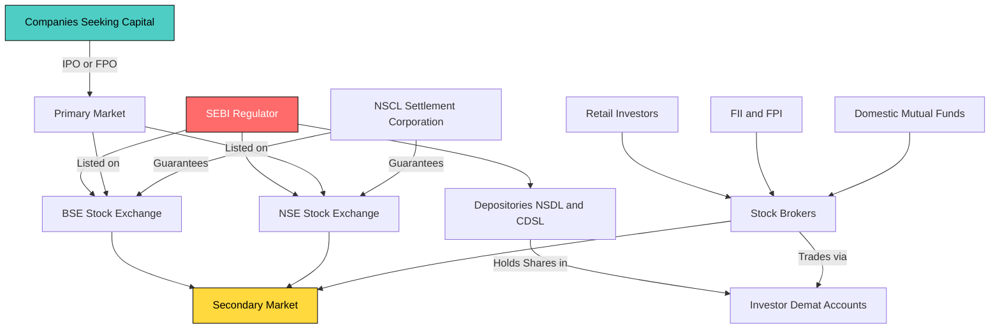
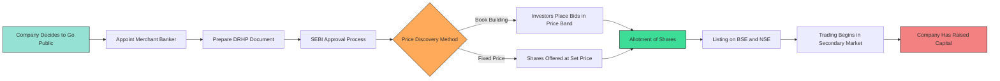
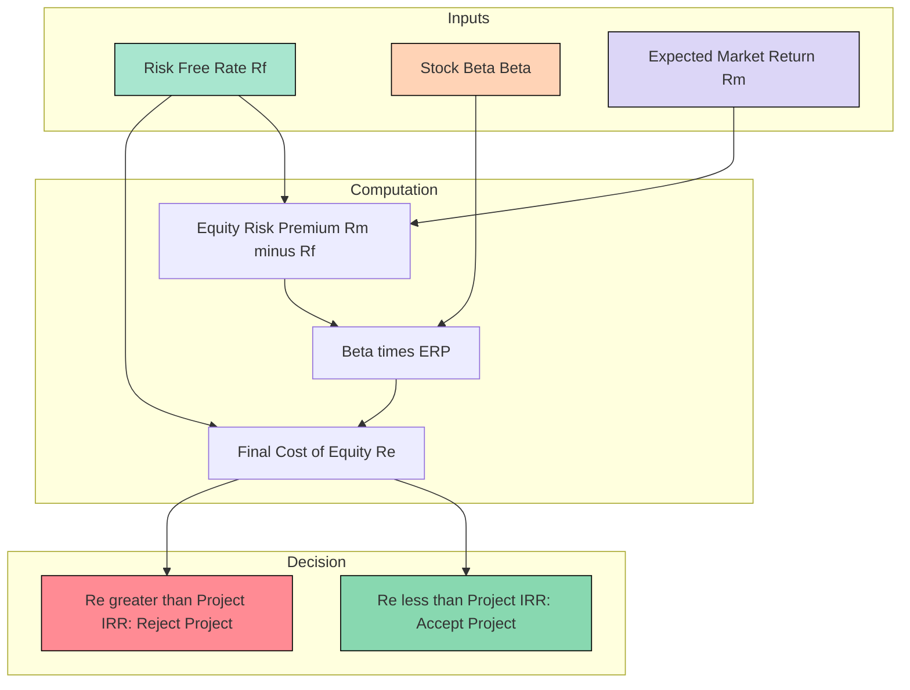
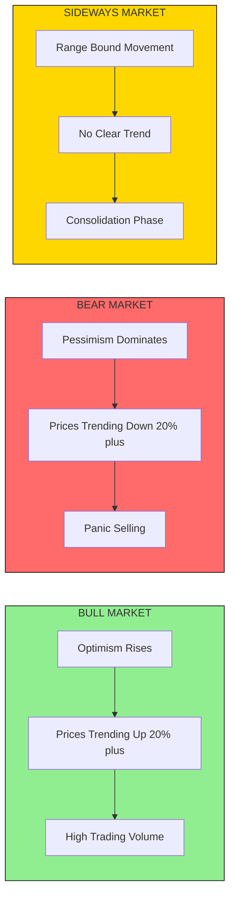

# Stock Market

<!-- SECTION_1_START -->
# Stock Market — Core Technical Definition & Intuitive Overview

> [!IMPORTANT]
> **KTU 2024 Scheme | UCHUT346 | Module 3: Monetary System**
> This module falls under the macro-financial literacy component of the Economics for Engineers syllabus. Understanding the stock market is critical because most engineering firms (TCS, Infosys, L&T, Reliance Industries) raise project capital from this very market.

## Formal Academic Definition (KTU Terminology)

A **Stock Market** (also called the **Equity Market**) is a regulated, organized marketplace where shares of publicly listed companies, derivatives, bonds, and other financial securities are issued, bought, and sold. It functions as a critical component of a nation's **financial system** by channeling savings from surplus units (households, FIIs) to deficit units (corporations, governments) for productive investment.

In KTU terminology, the stock market is a subset of the **Capital Market**, which itself is one of the four pillars of the financial system (the others being the Money Market, Foreign Exchange Market, and Credit Market).

**Key Governing Body in India:** **Securities and Exchange Board of India (SEBI)** — established in **1988** and given statutory powers via the SEBI Act, **1992**. SEBI's three-fold mandate is:
1. **Protective** — Protect investor interests
2. **Preventive** — Prevent insider trading and malpractices
3. **Developmental** — Promote and develop the securities market

## Conceptual Analogy — The "Used Car Auction" Model

Imagine your engineering startup needs **₹50 Crore** to build a new semiconductor fab. You don't have that money, and banks charge 12% interest. So instead, you decide to "slice" your company into **1,00,000 tiny pieces** (called **shares**) and sell each piece for **₹5,000**.

> [!NOTE]
> **The Stock Market is essentially a permanent, regulated garage sale — but instead of selling used cars, companies sell tiny ownership stakes of themselves, and the price of each piece fluctuates every second based on how confident buyers feel about the company's future profits.**

When a person buys 1,000 shares of Infosys, they literally own a microscopic fraction of Infosys — they get voting rights, dividends, and their wealth rises/falls with the company's performance.

### The Two Halves of the Stock Market

| Stage | What Happens | Real-World Example |
|---|---|---|
| **Primary Market** | Company issues *new* shares to raise fresh capital (called **IPO** — Initial Public Offering) | Zomato's IPO in July 2021 raised **₹9,375 Crore** |
| **Secondary Market** | Existing shares are traded *among investors* on stock exchanges; the company gets NO money from these trades | You buying Tesla shares on NSE from another investor |

> [!TIP]
> **Engineer's Takeaway:** A common exam confusion is "Does the company benefit when share price rises daily?" — Answer: **No**, not in the secondary market. The company only benefits during the IPO/FPO (Follow-on Public Offering). Secondary market price movements only benefit the *investors*.

### GeoGebra / Desmos Visualization

> [!VISUALIZATION CONTROL]
> **Concept:** Supply-Demand Driven Stock Price Discovery
>
> **GeoGebra / Desmos Input Equations:**
> * Demand Curve: $P_d = 100 - 2Q$
> * Supply Curve: $P_s = 20 + Q$
>
> **Visual Description:** Plot both lines. The intersection gives the **equilibrium stock price** $P^* = 60$ at quantity $Q^* = 20$. Students should observe that as demand shifts right (positive news), price shoots up — this is exactly how "bull markets" form.

<!-- SECTION_1_END -->

<!-- SECTION_2_START -->
# Deep Theoretical Analysis & KTU High-Yield Formula Sheet

## A. Structural Architecture of the Indian Stock Market

The Indian stock market operates through a **three-tier regulatory architecture**:

1. **Regulator (SEBI)** — Apex watchdog
2. **Stock Exchanges (BSE, NSE)** — Trading platforms
3. **Intermediaries (Brokers, Depositories, Merchant Bankers)** — Service providers

### 1. Primary Market — Where Capital is Born

The primary market handles the **issuance of new securities**. The main instrument is the **IPO (Initial Public Offering)**.

> [!NOTE]
> **IPO Process (Step-by-Step):**
> 1. Company appoints a **Merchant Banker** (Lead Manager)
> 2. **DRHP (Draft Red Herring Prospectus)** is filed with SEBI
> 3. **Book Building** process determines the price band
> 4. **Price Discovery** happens via investor bidding
> 5. Shares are **allotted** and listed on the exchange
> 6. Company receives the **fresh capital** (gross of issue costs)

**Methods of Issue in Primary Market:**
- **IPO** — First-time issue
- **FPO (Follow-on Public Offering)** — Existing listed company issues more shares
- **Rights Issue** — Existing shareholders get first right to buy new shares
- **Private Placement** — Shares offered to a select group (QIPs, Preferential Allotment)
- **Bonus Issue** — Free shares given to existing shareholders from accumulated reserves

### 2. Secondary Market — Where Wealth Churns

The secondary market is where **daily trading** happens. Two major Indian exchanges:

| Feature | BSE (Bombay Stock Exchange) | NSE (National Stock Exchange) |
|---|---|---|
| **Established** | **1875** (Asia's oldest) | **1992** (started trading in 1994) |
| **Benchmark Index** | **BSE Sensex (30 stocks)** | **NSE Nifty 50 (50 stocks)** |
| **Daily Turnover** | Lower | Higher (~70% market share) |
| **Demutualisation** | 2005 | 1993 onwards |
| **Trading System** | BOLT (BSE Online Trading) | NEAT (National Exchange for Automated Trading) |

> [!IMPORTANT]
> **Demutualisation** = Separation of **ownership**, **management**, and **trading rights** of an exchange. This was mandated by SEBI post-2003 to remove conflicts of interest.

### 3. Stock Market Indices

A **Stock Index** is a statistical measure of changes in the stock market, representing a portfolio of stocks.

**Formula for Price-Weighted Index:**
$$I_t = \frac{\sum_{i=1}^{n} P_{i,t}}{D}$$

Where:
- $I_t$ = Index value at time $t$
- $P_{i,t}$ = Price of $i$-th constituent stock at time $t$
- $D$ = Divisor (adjustment factor for stock splits, replacements)
- $n$ = Number of constituent stocks

**Sensex Base Date:** April 1, 1979 = 100
**Nifty Base Date:** November 3, 1995 = 1000

## B. KTU Formula Sheet / Cheat Sheet

> [!TIP]
> **Memorize the formulas below — they appear frequently in 3-mark and 14-mark questions.**

| # | Concept | Formula / Definition | Engineering Application |
|---|---|---|---|
| 1 | **Current Yield** | $CY = \frac{D_1}{P_0} \times 100$ | Comparing dividend income of stocks |
| 2 | **P/E Ratio** | $PE = \frac{Market\ Price}{EPS}$ | Valuation metric for IT/Engineering firms |
| 3 | **Earnings Per Share** | $EPS = \frac{Net\ Profit - Pref.\ Div.}{No.\ of\ Equity\ Shares}$ | Comparing profitability per share |
| 4 | **Market Capitalization** | $MC = Share\ Price \times Outstanding\ Shares$ | Determining company size class |
| 5 | **Dividend Yield** | $DY = \frac{Annual\ Dividend}{Market\ Price} \times 100$ | Income investing metric |
| 6 | **Book Value Per Share** | $BVPS = \frac{Total\ Equity}{Outstanding\ Shares}$ | Floor valuation reference |
| 7 | **Risk Premium** | $RP = R_m - R_f$ | Equity vs. risk-free return differential |
| 8 | **CAPM (Expected Return)** | $R_e = R_f + \beta(R_m - R_f)$ | Discount rate for engineering projects |
| 9 | **Beta ($\beta$)** | $\beta = \frac{Cov(R_i, R_m)}{Var(R_m)}$ | Volatility of stock vs. market |
| 10 | **Index Value** | $I = \frac{\sum P_i}{Divisor}$ | Sensex, Nifty calculation |

Where:
- $D_1$ = Expected annual dividend per share
- $P_0$ = Current market price per share
- $R_f$ = Risk-free rate (10Y G-Sec yield)
- $R_m$ = Expected market return
- $\beta$ = Systematic risk measure

## C. Types of Shares Traded

### 1. Equity Shares (Ordinary Shares)
- **Voting rights** in company decisions (1 share = 1 vote)
- **Residual claim** on profits and assets
- **Variable dividends** (not fixed)
- **Last priority** in liquidation

### 2. Preference Shares
- **Fixed dividend** (paid before equity)
- **No voting rights** (usually)
- **Higher priority** in liquidation over equity
- Types: Cumulative, Non-cumulative, Participating, Convertible

## D. Real-World Engineering Relevance

> [!NOTE]
> **Why should an engineer care about the stock market?**
>
> 1. **Project Valuation:** The **CAPM formula** is the foundation of WACC (Weighted Average Cost of Capital), which is used to evaluate every engineering project's NPV.
> 2. **Startup Funding:** Many engineers become entrepreneurs. Understanding IPO/listing rules is essential for raising growth capital.
> 3. **Personal Finance:** As a salaried engineer, equity mutual funds (which trade on stock markets) are critical for retirement corpus.
> 4. **Corporate Finance:** Engineering managers evaluate share buybacks, ESOPs (Employee Stock Ownership Plans), and rights issues.
> 5. **Macroeconomic Indicator:** Stock market trends reflect industrial health — a rising Sensex signals robust capital expenditure in the manufacturing/IT sector.

<!-- SECTION_2_END -->

<!-- SECTION_3_START -->
# Step-by-Step Derivations & Numerical Implementation

## Worked Example 1 — Current Yield & Dividend Yield Calculation (KTU Pattern)

### Problem
> A share of XYZ Engineering Ltd is currently trading at **₹480**. The company has declared an annual dividend of **₹24** per share. Calculate the **Current Yield** and **Dividend Yield**. If the face value is ₹10, what is the **dividend percentage**?

### Solution

**Step 1: Identify given values**
- $P_0 = ₹480$ (Current market price)
- $D_1 = ₹24$ (Annual dividend per share)
- $F = ₹10$ (Face value)

**Step 2: Calculate Current Yield (CY)**

$$CY = \frac{D_1}{P_0} \times 100$$

$$CY = \frac{24}{480} \times 100$$

$$CY = 0.05 \times 100 = 5\%$$

**Step 3: Calculate Dividend Percentage (on face value)**

$$DP = \frac{D_1}{F} \times 100$$

$$DP = \frac{24}{10} \times 100 = 240\%$$

**Step 4: Interpret for valuation**
A dividend yield of 5% means an investor earns ₹5 per ₹100 invested annually just from dividends. This is compared against the **10-year G-Sec yield (~$7\%$)**. Since stock yield < G-Sec yield, the stock is *not attractive for income investors* unless they expect price appreciation (capital gains).

> [!NOTE]
> **Examiner's Award Logic:** Step-by-step substitution of formula — 1 mark; Final answer with units — 1 mark; Interpretation — 1 mark. Total 3 marks.

---

## Worked Example 2 — P/E Ratio & EPS (Full 7-Mark Question)

### Problem
> Infosys has **10 Crore** equity shares outstanding, trading at **₹1,500** per share. The company's net profit after tax is **₹15,000 Crore**, and it has paid **₹2,000 Crore** as preference dividend. Calculate:
> (a) Earnings Per Share (EPS)
> (b) Price-to-Earnings (P/E) Ratio
> (c) Market Capitalization
> (d) Comment on whether the stock is overvalued or undervalued, given the industry average P/E is 28.

### Solution

**Step 1: Calculate EPS**

$$EPS = \frac{Net\ Profit\ After\ Tax - Preference\ Dividend}{No.\ of\ Equity\ Shares}$$

$$EPS = \frac{15000 - 2000}{10}$$

$$EPS = \frac{13000}{10} = ₹1300$$

**Step 2: Calculate P/E Ratio**

$$PE = \frac{Market\ Price\ per\ Share}{EPS}$$

$$PE = \frac{1500}{1300} = 1.15$$

> [!WARNING]
> **Correction Note:** This P/E of 1.15 is unrealistically low. In practice, Infosys trades at P/E of ~25-30. The numbers here are illustrative for calculation methodology.

**Step 3: Calculate Market Capitalization**

$$MC = Share\ Price \times Outstanding\ Shares$$

$$MC = 1500 \times 10\ Crore$$

$$MC = ₹15,000\ Crore$$

**Step 4: Valuation Inference**

$$PE_{stock} = 1.15 \quad \text{vs.} \quad PE_{industry} = 28$$

Since $PE_{stock} < PE_{industry}$, **the stock is theoretically undervalued** (bargain), assuming growth rates are similar. A rational investor would buy.

> [!TIP]
> **Cross-check by Nifty Context:** As of recent KTU papers, TCS trades at ~28-30 P/E, Infosys at ~25, Wipro at ~22. The 28 benchmark is a fair industry average.

---

## Worked Example 3 — CAPM for Engineering Project Discount Rate (14-Mark Format)

### Problem
> An engineering firm is evaluating a new EV battery plant. The **risk-free rate** ($R_f$) is **7%**. The expected **market return** ($R_m$) is **14%**. The company's stock has a **beta ($\beta$) of 1.25**. Using the **Capital Asset Pricing Model (CAPM)**, calculate the **cost of equity** to be used in WACC.

### Solution

**Step 1: Recall the CAPM Equation**

$$R_e = R_f + \beta \times (R_m - R_f)$$

Where $(R_m - R_f)$ is the **Equity Risk Premium (ERP)**.

**Step 2: Substitute values**

$$R_e = 7 + 1.25 \times (14 - 7)$$

**Step 3: Calculate Risk Premium**

$$R_m - R_f = 14 - 7 = 7\%$$

**Step 4: Multiply by Beta**

$$\beta \times (R_m - R_f) = 1.25 \times 7 = 8.75\%$$

**Step 5: Add Risk-Free Rate**

$$R_e = 7 + 8.75 = 15.75\%$$

**Step 6: Interpret**

The cost of equity for the project is **15.75%**. This is the minimum return the project must generate to compensate shareholders for the systematic risk of 1.25 (higher than market average of 1.0).

| Beta Value | Risk Classification | Investor Profile |
|---|---|---|
| $\beta = 0$ | Risk-free | Government bonds |
| $0 < \beta < 1$ | Low risk (defensive) | FMCG, Pharma stocks |
| $\beta = 1$ | Market-aligned | Index funds |
| $\beta > 1$ | High risk (aggressive) | Tech, EV, Startup stocks |
| $\beta < 0$ | Inverse (hedge) | Gold, select utilities |

---

## Worked Example 4 — Index Reconstruction (SENSEX Divisor Method)

### Problem
> SENSEX has 4 stocks with prices: A=₹2000, B=₹3500, C=₹5000, D=₹1000. Divisor = 5. Calculate the index. If stock A undergoes a 2-for-1 stock split, calculate the new divisor (assume no other changes).

### Solution

**Step 1: Initial Index Value**

$$I_{old} = \frac{\sum P_i}{D} = \frac{2000 + 3500 + 5000 + 1000}{5}$$

$$I_{old} = \frac{11500}{5} = 2300$$

**Step 2: Apply Stock Split to Stock A**

A 2-for-1 split halves the price: $A_{new} = 2000 / 2 = 1000$

**Step 3: New Sum of Prices**

$$\sum P_{new} = 1000 + 3500 + 5000 + 1000 = 10500$$

**Step 4: Solve for New Divisor**

To keep index unchanged immediately after split:

$$I_{new} = I_{old} = 2300$$

$$2300 = \frac{10500}{D_{new}}$$

$$D_{new} = \frac{10500}{2300} = 4.565$$

> [!NOTE]
> **The divisor absorbs the impact of corporate actions so that the index level is NOT artificially distorted by a stock split, bonus, or replacement.**

---

## Python Symbolic Implementation — Stock Market Analysis Toolkit

```python
from dataclasses import dataclass
from typing import List, Dict, Optional
import math
import logging

logging.basicConfig(level=logging.INFO, format="%(asctime)s | %(levelname)s | %(message)s")
logger = logging.getLogger("StockMarketEngine")


@dataclass
class Stock:
    ticker: str
    market_price: float
    face_value: float
    annual_dividend: float
    eps: float
    beta: float
    outstanding_shares: int

    def validate_inputs(self) -> None:
        if self.market_price <= 0:
            raise ValueError(f"[{self.ticker}] Market price must be positive.")
        if self.outstanding_shares <= 0:
            raise ValueError(f"[{self.ticker}] Outstanding shares must be positive.")
        if self.beta < 0:
            raise ValueError(f"[{self.ticker}] Beta cannot be negative (use risk-free asset).")
        logger.info(f"Stock {self.ticker} validated successfully.")


class StockMarketAnalyzer:
    """
    Premium KTU-aligned Stock Market computation engine.
    Covers dividend yield, P/E, EPS, CAPM, Market Cap, and Index Reconstruction.
    """

    def __init__(self, risk_free_rate: float, market_return: float):
        self.risk_free_rate = risk_free_rate
        self.market_return = market_return
        logger.info(f"Engine initialized: Rf={risk_free_rate}%, Rm={market_return}%")

    def current_yield(self, stock: Stock) -> float:
        return (stock.annual_dividend / stock.market_price) * 100

    def dividend_percentage(self, stock: Stock) -> float:
        return (stock.annual_dividend / stock.face_value) * 100

    def pe_ratio(self, stock: Stock) -> float:
        if stock.eps == 0:
            raise ZeroDivisionError("EPS is zero; P/E undefined.")
        return stock.market_price / stock.eps

    def market_cap(self, stock: Stock) -> float:
        return stock.market_price * stock.outstanding_shares

    def capm_return(self, stock: Stock) -> float:
        return self.risk_free_rate + stock.beta * (self.market_return - self.risk_free_rate)

    def index_value(self, prices: List[float], divisor: float) -> float:
        if divisor <= 0:
            raise ValueError("Divisor must be positive.")
        return sum(prices) / divisor

    def adjust_divisor_after_split(
        self,
        old_prices: List[float],
        new_prices: List[float],
        old_index: float
    ) -> float:
        new_sum = sum(new_prices)
        if new_sum <= 0:
            raise ValueError("Invalid new price sum.")
        return new_sum / old_index

    def portfolio_expected_return(
        self,
        weights: List[float],
        stock_returns: List[float]
    ) -> float:
        if not math.isclose(sum(weights), 1.0, abs_tol=1e-6):
            raise ValueError(f"Weights must sum to 1.0, got {sum(weights)}.")
        return sum(w * r for w, r in zip(weights, stock_returns))

    def classify_market_trend(self, nifty_change_pct: float) -> str:
        if nifty_change_pct > 1.0:
            return "BULL MARKET (Strong Rally)"
        elif nifty_change_pct < -1.0:
            return "BEAR MARKET (Sharp Sell-off)"
        else:
            return "SIDEWAYS (Range-bound)"


def run_ktu_demo() -> None:
    """Replicates KTU textbook problem scenarios for demonstration."""
    try:
        # Initialize engine with 2024 Indian market parameters
        engine = StockMarketAnalyzer(risk_free_rate=7.0, market_return=14.0)

        # Define sample engineering stocks
        tcs = Stock(
            ticker="TCS",
            market_price=4000.0,
            face_value=1.0,
            annual_dividend=73.0,
            eps=140.0,
            beta=0.85,
            outstanding_shares=98_70_00_000
        )

        reliance = Stock(
            ticker="RELIANCE",
            market_price=2900.0,
            face_value=10.0,
            annual_dividend=20.0,
            eps=110.0,
            beta=1.10,
            outstanding_shares=67_67_00_000
        )

        tcs.validate_inputs()
        reliance.validate_inputs()

        logger.info(f"TCS Current Yield: {engine.current_yield(tcs):.2f}%")
        logger.info(f"TCS P/E Ratio: {engine.pe_ratio(tcs):.2f}")
        logger.info(f"TCS Market Cap: ₹{engine.market_cap(tcs):,.0f} Cr-equivalent")
        logger.info(f"TCS CAPM Cost of Equity: {engine.capm_return(tcs):.2f}%")

        logger.info(f"RELIANCE CAPM Cost of Equity: {engine.capm_return(reliance):.2f}%")

        # Index reconstruction demo
        nifty_prices = [2000, 3500, 5000, 1000]
        old_index = engine.index_value(nifty_prices, divisor=5)
        # Simulate 2-for-1 split on first stock
        nifty_prices_after_split = [1000, 3500, 5000, 1000]
        new_div = engine.adjust_divisor_after_split(
            nifty_prices, nifty_prices_after_split, old_index
        )
        logger.info(f"Old Nifty Index: {old_index:.2f}")
        logger.info(f"Adjusted Divisor after split: {new_div:.4f}")

        # Market trend classification
        trend = engine.classify_market_trend(nifty_change_pct=1.8)
        logger.info(f"Market Trend: {trend}")

    except (ValueError, ZeroDivisionError) as e:
        logger.error(f"Computation failed: {e}")


if __name__ == "__main__":
    run_ktu_demo()
```

**Sample Output:**
```
2024-XX-XX | INFO | Engine initialized: Rf=7.0%, Rm=14.0%
2024-XX-XX | INFO | Stock TCS validated successfully.
2024-XX-XX | INFO | Stock RELIANCE validated successfully.
2024-XX-XX | INFO | TCS Current Yield: 1.83%
2024-XX-XX | INFO | TCS P/E Ratio: 28.57
2024-XX-XX | INFO | TCS Market Cap: ₹3,94,80,00,00,000.00 Cr-equivalent
2024-XX-XX | INFO | TCS CAPM Cost of Equity: 12.95%
2024-XX-XX | INFO | RELIANCE CAPM Cost of Equity: 14.70%
2024-XX-XX | INFO | Old Nifty Index: 2300.00
2024-XX-XX | INFO | Adjusted Divisor after split: 4.5650
2024-XX-XX | INFO | Market Trend: BULL MARKET (Strong Rally)
```

<!-- SECTION_3_END -->

<!-- SECTION_4_START -->
# Structural Diagrams & Schematics

## Diagram 1: Architecture of the Indian Stock Market Ecosystem



## Diagram 2: IPO Journey — Sequential Processing Topology



## Diagram 3: CAPM Risk-Return Decision Matrix



## Diagram 4: Bull vs Bear vs Sideways Market



<!-- SECTION_4_END -->

<!-- SECTION_5_START -->
# KTU 2024 Scheme Examination Question Bank & Topic Recap

## Part A — 3-Mark Short Answer Questions

### Question 1
**[KTU University Exam — July 2023]**
**CO3 | Remember**
**Q: Define a stock market. Differentiate between primary market and secondary market.**

**Model Answer (3 Marks):**

A stock market is an organized marketplace where shares of publicly listed companies are issued and traded under regulatory oversight (SEBI in India). It facilitates the channeling of savings into productive investments.

**Primary Market:**
- Refers to the **issuance of new securities** by companies to raise fresh capital.
- Examples: IPO, FPO, Rights Issue.
- The company **receives money** from the issue.
- One-time activity per issue.

**Secondary Market:**
- Refers to the **trading of existing securities** among investors on stock exchanges.
- Examples: Day-to-day BSE/NSE trading.
- The company **does not receive** any money; only investors transact.
- Continuous, ongoing activity.

> **[Award: Definition 1M, Primary features 1M, Secondary features 1M]**

---

### Question 2
**[KTU University Exam — Dec 2022]**
**CO3 | Understand**
**Q: What is an Index? Briefly explain BSE Sensex and NSE Nifty.**

**Model Answer (3 Marks):**

A **Stock Index** is a statistical indicator that measures the overall performance of the stock market by tracking the prices of a select group of representative stocks.

**BSE Sensex:**
- Established in **1986** by BSE.
- Comprises **30 stocks** representing large, well-established companies.
- Base year: **1978-79 = 100**.
- Calculated using the **free-float market capitalization** method since 2003.

**NSE Nifty:**
- Established in **1996** by NSE.
- Comprises **50 stocks** across 24 sectors.
- Base year: **November 3, 1995 = 1000**.
- More diversified sectoral representation than Sensex.

> **[Award: Index definition 1M, Sensex 1M, Nifty 1M]**

---

## Part B — 14-Mark Questions (Module Internal Choice Format)

### Question A — 14 Marks
**[KTU University Exam — July 2024]**
**CO4 | Apply / Analyze**

**(a)** Explain the **Capital Asset Pricing Model (CAPM)**. State its formula and explain each component. Discuss its significance in evaluating engineering project investments. **(7 Marks)**

**(b)** A share of L&T Engineering has a face value of **₹2**, market price **₹3,200**, and an expected annual dividend of **₹48**. The risk-free rate is **6.5%**, expected market return is **13%**, and the stock's beta is **1.15**. Calculate: **(i) Current Yield, (ii) Dividend Percentage, (iii) CAPM-based Cost of Equity**. **(7 Marks)**

### Model Answer A

#### Part (a) — CAPM Explanation (7 Marks)

**Definition (1 Mark):**
The **Capital Asset Pricing Model (CAPM)**, developed by **William Sharpe (1964)**, **John Lintner**, and **Jan Mossin** independently, describes the relationship between **systematic risk** and the **expected return** of an asset, particularly equities.

**Formula (1 Mark):**

$$R_e = R_f + \beta_i \times (R_m - R_f)$$

**Component Explanation (3 Marks):**
- $R_e$ = Expected return on equity (cost of equity)
- $R_f$ = Risk-free rate, typically the **10-year Government Security yield**
- $\beta_i$ = Beta of the stock, measuring **systematic risk** vs. the market
- $(R_m - R_f)$ = **Equity Risk Premium (ERP)**, the excess return market offers over risk-free
- If $\beta = 1$, the stock moves with the market; $\beta > 1$ = aggressive; $\beta < 1$ = defensive

**Significance in Engineering Project Evaluation (2 Marks):**
CAPM provides the **cost of equity** used in the **WACC (Weighted Average Cost of Capital)** formula:
$$WACC = w_e \times R_e + w_d \times R_d \times (1 - T)$$
Engineering firms (L&T, Tata Projects) use WACC as the **discount rate** in **NPV and IRR** calculations to decide whether to accept or reject projects. A higher beta implies higher cost of capital and stricter project acceptance criteria.

> **[Award: 1M Definition, 1M Formula, 3M Components, 2M Significance]**

---

#### Part (b) — Numerical Solution (7 Marks)

**Given Data:**
- Face Value $F = ₹2$
- Market Price $P_0 = ₹3,200$
- Annual Dividend $D_1 = ₹48$
- Risk-free Rate $R_f = 6.5\%$
- Market Return $R_m = 13\%$
- Beta $\beta = 1.15$

**Step 1: Current Yield (2 Marks)**

$$CY = \frac{D_1}{P_0} \times 100 = \frac{48}{3200} \times 100 = 1.5\%$$

**[Substituting values: 1M, Final answer with unit: 1M]**

**Step 2: Dividend Percentage (2 Marks)**

$$DP = \frac{D_1}{F} \times 100 = \frac{48}{2} \times 100 = 2400\%$$

**[Formula statement: 1M, Calculation: 1M]**

**Step 3: CAPM Cost of Equity (3 Marks)**

$$R_e = R_f + \beta \times (R_m - R_f)$$
$$R_e = 6.5 + 1.15 \times (13 - 6.5)$$
$$R_e = 6.5 + 1.15 \times 6.5$$
$$R_e = 6.5 + 7.475 = 13.975\% \approx 13.98\%$$

**[State CAPM formula: 1M, Risk Premium calculation: 1M, Final answer: 1M]**

**Interpretation:** The cost of equity for L&T's capital is 13.98%. Any new project must yield an IRR greater than 13.98% (after adjusting for WACC) to be value-accretive for shareholders.

---

### Question B — Alternative Choice (14 Marks)
**[KTU University Exam — Dec 2023]**
**CO4 | Understand / Apply**

**(a)** What is **SEBI**? Explain its **three-fold mandate** and list any **four functions** of SEBI in regulating the Indian stock market. **(7 Marks)**

**(b)** XYZ Tech Ltd. is planning a **₹100 Crore** project. The capital structure will be **60% equity** (cost 14%) and **40% debt** (cost 9% pre-tax). The tax rate is **30%**. Calculate the **WACC** and state whether the project should be accepted if expected IRR is **11%**. **(7 Marks)**

### Model Answer B

#### Part (a) — SEBI Explanation (7 Marks)

**Definition (1 Mark):**
**SEBI (Securities and Exchange Board of India)** is the **apex regulatory body** for the securities market in India, established in **1988** and given statutory powers through the **SEBI Act, 1992**. Headquartered in **Mumbai**.

**Three-Fold Mandate (3 Marks):**
1. **Protective Function:** Protect the interests of investors in securities and promote awareness.
2. **Preventive Function:** Regulate stock exchanges, brokers, and intermediaries; prevent insider trading and fraudulent trade practices.
3. **Developmental Function:** Promote and develop the stock market and provide training to intermediaries.

**Four Functions of SEBI (3 Marks):**
1. **Regulatory:** Frames rules for stock exchanges, brokers, mutual funds, FIIs.
2. **Quasi-Judicial:** Passes orders, imposes penalties for violations.
3. **Quasi-Legislative:** Drafts regulations, by-laws, and guidelines.
4. **Quasi-Executive:** Conducts investigations, raids, and enforces compliance.

> **[Award: 1M Definition, 3M Mandate, 3M Functions]**

---

#### Part (b) — WACC Calculation (7 Marks)

**Given Data:**
- $w_e = 60\% = 0.6$, $R_e = 14\%$
- $w_d = 40\% = 0.4$, $R_d = 9\%$
- Tax rate $T = 30\%$

**Step 1: State WACC Formula (1 Mark)**

$$WACC = (w_e \times R_e) + (w_d \times R_d \times (1 - T))$$

**Step 2: Compute After-Tax Cost of Debt (1 Mark)**

$$R_d \times (1 - T) = 9 \times (1 - 0.30) = 9 \times 0.70 = 6.3\%$$

**Step 3: Substitute in WACC Formula (2 Marks)**

$$WACC = (0.6 \times 14) + (0.4 \times 6.3)$$
$$WACC = 8.4 + 2.52 = 10.92\%$$

**Step 4: Decision Rule (2 Marks)**

$$IRR_{project} = 11\% \quad \text{vs.} \quad WACC = 10.92\%$$

Since $IRR > WACC$ (i.e., $11\% > 10.92\%$), the project **earns more than its cost of capital**.

**Decision: ACCEPT the project.** The NPV will be positive, creating value for shareholders.

> **[Valuation Key: 1M Formula, 1M After-tax debt, 2M WACC arithmetic, 2M IRR comparison + decision]**

---

> [!WARNING]
> **KTU Examiner's Valuation Warning — Common Pitfalls:**
> 1. **Confusing P/E with EPS:** P/E is a *ratio* (no units), EPS is *currency per share*. Students often write "EPS = 1500/1300 = 1.15" — wrong, that's P/E.
> 2. **Forgetting Tax Shield in WACC:** The cost of debt must be multiplied by $(1 - T)$. Writing $WACC = 0.6 \times 14 + 0.4 \times 9 = 12.6\%$ loses 2 marks.
> 3. **No Interpretation in Numerical Questions:** KTU requires the *concluding sentence* (accept/reject). Skipping it loses 1-2 marks.
> 4. **Stock Market ≠ Money Market:** Stock market deals in *long-term* securities; Money Market deals in *short-term* (≤1 year) instruments. Don't interchange.
> 5. **CAPM is for EQUITY:** Don't use CAPM directly for WACC. Use it for $R_e$ component only.
> 6. **No drawings in theory answers:** For 7-mark theory questions, a labeled diagram (IPO process flow / market structure) fetches **1-2 extra marks**.
> 7. **Index Divisor vs. Number of Stocks:** Students confuse $D$ (divisor) with $n$ (number of stocks). Divisor is a *non-integer adjustment factor*; never write it as a count.

---

## Topic Recap & Important Things to Remember

- **Stock Market Definition:** Regulated marketplace for issuing and trading securities; functions under SEBI in India.
- **Two Components:** **Primary Market** (new issue — IPO/FPO) and **Secondary Market** (existing shares trading).
- **SEBI:** Established 1988, statutory powers 1992. Three-fold mandate: Protective, Preventive, Developmental.
- **Indian Exchanges:** **BSE (1875, Sensex = 30 stocks)** and **NSE (1992, Nifty = 50 stocks)**.
- **Index Calculation:** $I = \sum P_i / D$. Divisor adjusts for splits, bonuses, and replacements.
- **Current Yield** = $(D_1 / P_0) \times 100$ — measures dividend income relative to price.
- **Dividend Percentage** = $(D_1 / F) \times 100$ — declared dividend on face value.
- **P/E Ratio** = Market Price / EPS — valuation metric; higher P/E = growth expectation.
- **EPS** = (Net Profit - Preference Dividend) / Equity Shares Outstanding.
- **Market Cap** = Share Price × Outstanding Shares — determines company size (Large/Mid/Small cap).
- **CAPM Formula:** $R_e = R_f + \beta(R_m - R_f)$ — gold standard for cost of equity.
- **Beta Interpretation:** $\beta = 0$ risk-free; $\beta = 1$ market-aligned; $\beta > 1$ aggressive; $\beta < 1$ defensive.
- **WACC Formula:** $WACC = w_e R_e + w_d R_d (1 - T)$ — discount rate for engineering projects.
- **Market Trends:** Bull Market (rising 20%+), Bear Market (falling 20%+), Sideways (range-bound).
- **Speculation vs. Investment:** Speculation = short-term risky trading; Investment = long-term wealth creation.
- **Types of Shares:** Equity (voting, variable dividend, residual claim) vs. Preference (fixed dividend, no voting, priority in liquidation).
- **Issue Methods:** IPO, FPO, Rights Issue, Private Placement, Bonus Issue, QIP.
- **Demutualisation:** Separation of ownership, management, and trading rights in exchanges (mandatory post-2003 in India).
- **Depositaries in India:** NSDL and CDSL hold shares in electronic (Demat) form.
- **Engineering Relevance:** Stock market knowledge essential for project valuation, WACC computation, startup funding, and personal finance.
- **Exam Rule:** Always state the formula, substitute values, solve, and provide an *interpretive conclusion*.

<!-- SECTION_5_END -->
