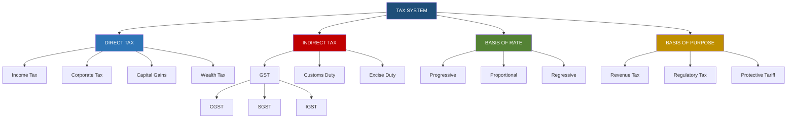
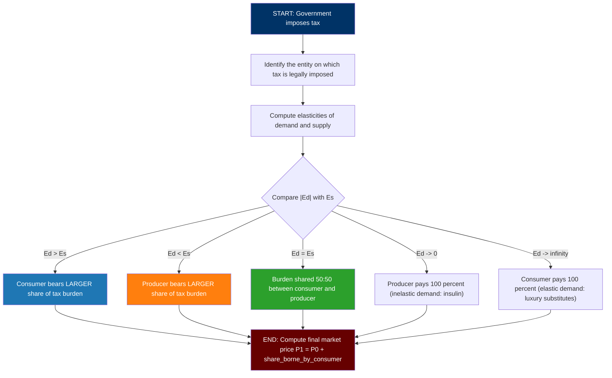
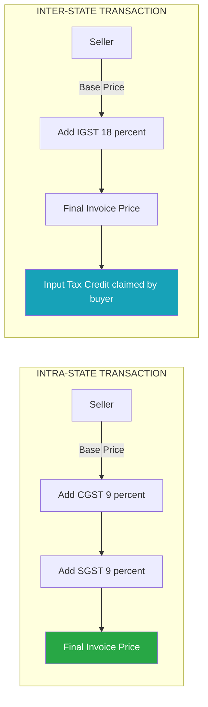
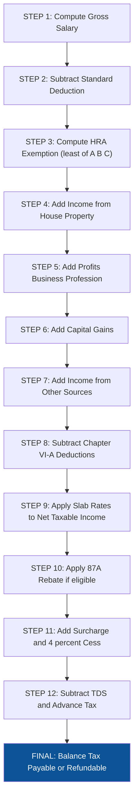

# Taxation

<!-- SECTION_1_START -->
# Taxation – Core Definition & Intuitive Overview

## 1. Formal Academic Definition (KTU 2024 Syllabus Terminology)

> [!IMPORTANT]
> **Taxation** is the primary fiscal instrument of a sovereign government by which it levies **compulsory, non-quid-pro-quo financial contributions** on individuals, households, and business entities operating within its economic jurisdiction, in order to finance public expenditure, redistribute national income, regulate aggregate demand, and maintain macroeconomic stability.

In the language of **Public Finance**, taxation is the *price of civilisation*. The term is derived from the Latin word **"taxare"**, meaning *to estimate or assess*. A tax is legally distinct from a *fee* (charged for a specific service rendered) and a *fine* (a penalty for violation of law).

> [!NOTE]
> **Key distinguishing features of a tax:**
> 1. **Compulsory** – backed by the coercive power of the State.
> 2. **No direct quid pro quo** – the taxpayer does not receive a directly proportional benefit.
> 3. **Legal sanction** – imposed under statutes passed by the legislature.
> 4. **Public purpose** – proceeds are used for welfare, defence, and infrastructure.
> 5. **Periodic in nature** – generally levied on a recurring time basis.

## 2. The Two Pillars of a Taxation System

| Pillar | Meaning | Example |
|---|---|---|
| **Tax Base** | The aggregate value or quantity on which a tax is actually computed (income, sales, property, wealth). | $₹10,00,000$ annual income |
| **Tax Rate** | The percentage or fixed amount applied to the tax base to determine the tax liability. | $30\%$ income tax slab |

The fundamental relationship is:

$$\text{Tax Revenue} = \text{Tax Base} \times \text{Tax Rate}$$

## 3. Conceptual Analogy – "The Apartment Complex Model"

> [!TIP]
> **Think of taxation as the maintenance fee of a high-rise apartment complex.**
>
> Every flat owner (citizen) pays a *maintenance charge* (tax) every month. The building cannot exist without lifts, security, water pumps, and lighting (public goods). The richer the flat (higher income), the more it is logical to charge them — because they consume more lift-cycles, water, and generate more waste. The collected fund is *redistributed* so that the building stays safe for all.
>
> If the maintenance charge is set too high, owners may convert their flats to offices or leave the building (tax evasion/capital flight). If it is too low, the building decays. **The art of taxation is to find the optimal "fee" that keeps the building functional without emptying it.** This is the essence of the **Laffer Curve**.

## 4. Canons of a Good Tax System (Adam Smith, *Wealth of Nations*, 1776)

These are the **four cardinal principles** still used by KTU examiners to test a student's understanding of tax design:

1. **Canon of Equality / Equity** – Tax burden must be proportional to the *ability to pay* of the individual.
2. **Canon of Certainty** – The time, manner, amount, and place of payment must be clear and unambiguous.
3. **Canon of Convenience** – The mode and timing of payment should be convenient to the taxpayer.
4. **Canon of Economy** – The cost of collection should be far less than the revenue collected (*minimum cost of collection*).

> [!WARNING]
> **KTU Pitfall:** Students often forget **Canon of Economy**. If the government spends $₹20$ to collect $₹100$ of tax, the tax is administratively inefficient. Always mention the administrative cost ratio when discussing tax reforms.

## 5. Visualization Control – The Laffer Curve

> [!VISUALIZATION CONTROL]
> **Concept:** Optimal Tax Rate vs. Total Tax Revenue (Laffer Curve)
> **GeoGebra / Desmos Input Equations:**
> * `f(x) = 100 * x * (1 - x/100)`  *(parabolic revenue function)*
> * where $x$ = tax rate ($\%$) and $f(x)$ = revenue collected
> **Visual Description:** The graph is an inverted parabola. It starts at the origin $(0, 0)$, rises to a maximum at the **revenue-maximising rate** $R_{max}$, and falls back to zero at $x = 100\%$. The student should observe that raising the rate beyond $R_{max}$ *reduces* total revenue due to widespread tax evasion and disincentive to work.

---

<!-- SECTION_1_END -->

<!-- SECTION_2_START -->
# Deep Theoretical Analysis & KTU High-Yield Formula Sheet

## 1. Classification of Taxes – The Master Taxonomy

Taxes are categorised along **three orthogonal axes**. KTU questions frequently test this classification.

### A. On the Basis of Tax Imposition (Direct vs. Indirect)

| Feature | Direct Tax | Indirect Tax |
|---|---|---|
| **Incidence & Impact** | Falls on the *same* person (cannot be shifted) | Can be *shifted* from producer to consumer via price |
| **Nature** | Progressive in design | Often regressive in burden |
| **Levied on** | Income, Wealth, Property, Profits | Consumption, Production, Imports |
| **Examples** | Income Tax, Corporate Tax, Capital Gains Tax, Wealth Tax | GST, Excise Duty, Customs Duty, Service Tax (subsumed) |
| **Visibility** | Transparent, filed in returns | Hidden, embedded in price |
| **Elasticity** | Inelastic to business cycle | Elastic to consumption patterns |

> [!NOTE]
> **Examiner's Heuristic:** "**Direct tax = paid by whom it is imposed.** Indirect tax = **the burden shifts**." Always define **incidence** (who pays) and **impact** (who bears) in any 14-mark answer.

### B. On the Basis of Rate Structure

| Type | Definition | Burden on Income | Example |
|---|---|---|---|
| **Progressive** | Tax rate *increases* as income rises | Higher earners pay a larger *share* | Indian Income Tax (Slab $0\%$ to $30\%$) |
| **Proportional (Flat)** | Tax rate is *constant* across all income levels | Same percentage for everyone | $10\%$ flat tax on all incomes |
| **Regressive** | Tax rate *decreases* as income rises | Poor pay a higher *share* of income | Sales tax on food, GST on essentials |

### C. On the Basis of Purpose / Object

- **Revenue Tax** – Primarily to fund government expenditure (e.g., Income Tax).
- **Regulatory / Sin Tax** – Aimed at discouraging consumption of harmful goods (e.g., excise on tobacco, alcohol, sugar).
- **Protective Tariff** – Designed to protect domestic industry from foreign competition (e.g., customs duty on imported steel).
- **Benefit-Based Tax** – Linked to a specific service consumed (e.g., road tolls, property tax for local civic services).

## 2. Measurement of Tax Progressivity – The Kakwani Index

The **Kakwani Index of Progressivity** ($P$) is the standard KTU metric to mathematically quantify how *progressive* a tax system is. It is computed as the difference between the **Gini coefficient of taxes paid before transfers** ($G_T$) and the **Gini coefficient of income before tax** ($G_X$):

$$P = G_T - G_X$$

**Interpretation table:**

| Value of $P$ | Meaning |
|---|---|
| $P = 0$ | Tax system is *proportional* (flat) |
| $P > 0$ | Tax system is *progressive* (redistributive) |
| $P < 0$ | Tax system is *regressive* (burdens the poor) |
| $P \to 1$ | Maximum possible progressivity |

The higher the magnitude of $P$, the more equitable the tax system.

## 3. Concept of Taxable Income & Tax Liability (Indian Context)

For a salaried individual under the **Old/New Regime of the Income Tax Act, 1961**, the sequence of computation is:

$$\text{Gross Total Income (GTI)} = \text{Salary} + \text{House Property} + \text{Business/Profession} + \text{Capital Gains} + \text{Other Sources}$$

$$\text{Net Taxable Income} = \text{GTI} - \text{Deductions under Chapter VI-A (e.g., 80C, 80D, 80G)}$$

$$\text{Tax Liability} = f(\text{Net Taxable Income, applicable Slab Rates})$$

$$\text{Tax Payable} = \text{Tax Liability} + \text{Surcharge} + \text{Health \& Education Cess at } 4\% - \text{Rebate u/s 87A} - \text{TDS Already Deducted}$$

## 4. KTU High-Yield Formula Sheet (Cheat Sheet)

> [!IMPORTANT]
> **Master the following formulae – these appear in 80% of numerical KTU questions.**

| # | Concept | Formula | Units / Notes |
|---|---|---|---|
| 1 | Tax Revenue | $R = B \times t$ | $B$ = base, $t$ = rate (decimal) |
| 2 | Effective Tax Rate (ETR) | $\text{ETR} = \dfrac{\text{Tax Paid}}{\text{Total Income}} \times 100$ | Expressed as $\%$, must be less than marginal rate in progressive systems |
| 3 | Marginal Tax Rate (MTR) | $\text{MTR} = \dfrac{\Delta T}{\Delta Y}$ | Tax on the *next* additional rupee of income |
| 4 | Average Tax Rate (ATR) | $\text{ATR} = \dfrac{T}{Y}$ | Tax on the *average* rupee of income |
| 5 | Income Elasticity of Tax Revenue | $E_R = \dfrac{\Delta R / R}{\Delta Y / Y}$ | If $E_R > 1$, tax is income-elastic (progressive) |
| 6 | Tax Buoyancy | $T_b = \dfrac{\% \text{ change in Tax Revenue}}{\% \text{ change in GDP}}$ | Measures built-in growth of tax revenue |
| 7 | Tax Elasticity | $T_e = \dfrac{\% \text{ change in Tax Revenue}}{\% \text{ change in Tax Base}}$ | $T_e = 1 \Rightarrow$ proportional tax |
| 8 | GST Computation | $\text{GST} = \dfrac{\text{MRP} \times r}{1 + r}$ (extraction from MRP) | $r$ = GST rate; in India $r \in \{5\%, 12\%, 18\%, 28\%\}$ |
| 9 | Per-Unit Tax Burden on Consumer | $P_c = P_0 + \dfrac{t \cdot E_s}{E_s + \vert E_d \vert}$ | $E_s$ = elasticity of supply, $\vert E_d \vert$ = elasticity of demand (in absolute value) |
| 10 | Kakwani Index | $P = G_T - G_X$ | See Section 2 above |
| 11 | Tax Multiplier (Macro) | $k_t = -\dfrac{MPC}{1 - MPC}$ | Negative, smaller in magnitude than spending multiplier |
| 12 | Revenue Neutral Rate (RNR) | The GST rate at which expected revenue equals pre-reform revenue | Used in VAT/GST transitions |

## 5. Tax Incidence – The "Who Really Pays?" Problem

When a tax is imposed on a *producer*, the *legal incidence* is on the firm, but the *economic incidence* is shared between producer and consumer based on the **relative price elasticities of supply and demand**.

$$\text{Share borne by consumer} = \dfrac{E_s}{E_s + \vert E_d \vert} \times 100\%$$

$$\text{Share borne by producer} = \dfrac{\vert E_d \vert}{E_s + \vert E_d \vert} \times 100\%$$

**Engineering intuition (Elasticity = 0 means "perfectly rigid"):**

| Demand Elasticity | Producer Elasticity | Burden split | Real-world example |
|---|---|---|---|
| $\vert E_d \vert \to \infty$ (perfectly elastic) | Any | Consumer pays $100\%$ | Luxury goods in a competitive market |
| $\vert E_d \vert \to 0$ (perfectly inelastic) | Any | Producer pays $100\%$ | Life-saving drugs (insulin) |
| $E_s = \vert E_d \vert$ | $E_s = \vert E_d \vert$ | Shared $50:50$ | Standard manufactured goods |
| $E_s \to \infty$ (perfectly elastic) | $E_s \to \infty$ | Indeterminate (degenerate) | Trivially abstract case |

## 6. Real-World Engineering Utility

- **Corporate Finance:** Engineers running a startup must compute **Effective Tax Rate (ETR)** to plan **Net Present Value (NPV)**. A project with a $30\%$ post-tax IRR looks different at $25.17\%$ corporate tax vs $22\%$ under SEZ benefits.
- **Public Procurement:** Government tenders are evaluated on a **pre-tax** basis; engineers in PSUs must design the tax invoicing structure (CGST, SGST, IGST) into their BoQ.
- **Cost Engineering:** A **carbon tax** in cement/steel manufacturing directly changes the unit cost; engineers must use **Life-Cycle Cost (LCC)** analysis that includes this variable.
- **Product Pricing:** An engineer pricing a consumer product must decide whether to absorb the GST hike or pass it on — this is precisely the *incidence analysis* discussed above.

---

<!-- SECTION_2_END -->

<!-- SECTION_3_START -->
# Step-by-Step Derivations, Computations & Symbolic Implementation

## 1. Worked-Out Numerical Problem 1 – Income Tax (Indian New Regime FY 2024-25)

> [!NOTE]
> **KTU Frequently Asked Variant:** Compute the tax liability of a salaried individual with given gross income and deductions.

**Problem Statement:**
Mr. Arjun, a software engineer, has the following income for FY 2024-25:

| Source of Income | Amount (₹) |
|---|---|
| Basic Salary | $6,00,000$ |
| Dearness Allowance (DA) | $2,00,000$ |
| House Rent Allowance (HRA) received | $2,40,000$ |
| Rent paid (actual) | $1,80,000$ |
| Income from House Property (self-occupied, let-out) | NIL (deemed let-out) |
| Interest on Savings Bank | $12,000$ |
| Standard Deduction allowed | $75,000$ (auto) |

**Deductions under Chapter VI-A:**
- Section 80C (PPF + LIC): $₹1,50,000$
- Section 80D (Health Insurance): $₹25,000$

**Tax Slabs (New Regime FY 2024-25):**

| Slab No. | Income Range (₹) | Tax Rate |
|---|---|---|
| 1 | $0 - 3,00,000$ | $0\%$ |
| 2 | $3,00,001 - 7,00,000$ | $5\%$ |
| 3 | $7,00,001 - 10,00,000$ | $10\%$ |
| 4 | $10,00,001 - 12,00,000$ | $15\%$ |
| 5 | $12,00,001 - 15,00,000$ | $20\%$ |
| 6 | Above $15,00,000$ | $30\%$ |

**Rebate u/s 87A:** If total income $\le ₹7,00,000$, rebate up to $₹25,000$ is available.
**Health & Education Cess:** $4\%$ of tax liability.

### Step-by-Step Solution

**Step 1 – Compute Gross Salary:**
$\text{Gross Salary} = 6,00,000 + 2,00,000 + 2,40,000 = 10,40,000$

**Step 2 – Compute HRA Exemption (Least of the three conditions):**
- Condition A: Actual HRA received = $₹2,40,000$
- Condition B: Rent paid $- 10\%$ of basic $= 1,80,000 - 60,000 = 1,20,000$
- Condition C: $50\%$ of basic (metro) $= 3,00,000$

Least of $(A, B, C) = \min(2,40,000, 1,20,000, 3,00,000) = 1,20,000$

**Step 3 – Taxable Salary:**
$\text{Net Salary} = 10,40,000 - 1,20,000 - 75,000 \text{ (standard deduction)} = 8,45,000$

**Step 4 – Add Income from Other Sources:**
$\text{Gross Total Income (GTI)} = 8,45,000 + 12,000 = 8,57,000$

**Step 5 – Subtract Deductions (80C + 80D):**
$\text{Note: New Regime restricts 80C deduction to ₹1,50,000.}$
$\text{Total Deductions} = 1,50,000 + 25,000 = 1,75,000$

$\text{Net Taxable Income} = 8,57,000 - 1,75,000 = 6,82,000$

**Step 6 – Apply Slab Rates (Rebate check first):**
Since $6,82,000 < 7,00,000$, Mr. Arjun is eligible for **Rebate u/s 87A = ₹25,000**.

| Slab | Computation | Tax (₹) |
|---|---|---|
| $0 - 3,00,000$ | Nil | $0$ |
| $3,00,001 - 6,82,000$ | $3,82,000 \times 5\% = 19,100$ | $19,100$ |
| **Sub-total** | | $19,100$ |
| **Less: 87A Rebate** | | $- 25,000$ (capped at tax) |
| **Tax before Cess** | | $0$ |

**Step 7 – Apply Health & Education Cess:**
Since tax is fully rebated to zero, **Final Tax Liability = ₹0**.

> **Model Answer Summary:** Mr. Arjun's tax liability for FY 2024-25 is **₹0** due to the 87A rebate. The marginal effective tax burden starts only after ₹7,00,000 in the new regime.

---

## 2. Worked-Out Numerical Problem 2 – GST Reverse Calculation

**Problem Statement:**
The Maximum Retail Price (MRP) of an electronic component is printed as **₹1,180** inclusive of **18% GST**. The manufacturer wishes to know the pre-GST base price.

**Step-by-Step Solution:**

The MRP relationship is:
$$\text{MRP} = \text{Base Price} \times (1 + r)$$

where $r = 0.18$.

$$\text{Base Price} = \frac{\text{MRP}}{1 + r} = \frac{1180}{1.18} = 1000$$

$$\text{GST Amount} = 1180 - 1000 = 180$$

$$\text{CGST} = \frac{180}{2} = 90 \quad ; \quad \text{SGST} = \frac{180}{2} = 90$$

**Verification:** $1000 + 90 + 90 = 1180$. ✓

---

## 3. Worked-Out Numerical Problem 3 – Tax Incidence Computation

**Problem Statement:**
The government imposes a **specific excise duty of ₹50 per unit** on a product. The pre-tax demand and supply functions are:
- $Q_d = 200 - 2P$
- $Q_s = -40 + 2P$

Compute: (a) the pre-tax equilibrium price and quantity; (b) the post-tax equilibrium; (c) the tax incidence shared between consumer and producer.

### Step-by-Step Solution

**Step (a) – Pre-Tax Equilibrium:**
Set $Q_d = Q_s$:
$$200 - 2P = -40 + 2P$$
$$240 = 4P \implies P_0 = 60$$
$$Q_0 = 200 - 2(60) = 80 \text{ units}$$

**Step (b) – Post-Tax Equilibrium (tax on producer shifts supply curve up by ₹50):**
New supply: $Q_s' = -40 + 2(P - 50) = -140 + 2P$

Set $Q_d = Q_s'$:
$$200 - 2P = -140 + 2P$$
$$340 = 4P \implies P_1 = 85$$
$$Q_1 = 200 - 2(85) = 30 \text{ units}$$

**Step (c) – Tax Incidence:**
- Price rise borne by consumer = $P_1 - P_0 = 85 - 60 = ₹25$
- Price fall borne by producer = $P_0 - (P_1 - 50) = 60 - 35 = ₹25$
- Total tax = $50$ per unit. $25 + 25 = 50$ ✓
- **Burden split: Consumer $50\%$, Producer $50\%$.**

**Why symmetric?** Because $|E_d| = E_s$ (slopes are equal in magnitude, with the same coefficient of $P$). When the slopes are equal, the burden is shared 50:50.

---

## 4. Python Implementation – Income Tax Calculator (New Regime FY 2024-25)

The following is a fully operational Python script that a KTU student can include in a project or use in viva. It uses **type hints**, **boundary checks**, and **error logging**.

```python
import logging
from typing import Dict, Tuple

# Configure logging for debugging
logging.basicConfig(level=logging.INFO, format="%(levelname)s: %(message)s")
logger = logging.getLogger("TaxCalculator")


def compute_new_regime_tax(
    gross_salary: float,
    hra_received: float,
    rent_paid: float,
    basic_salary: float,
    metro: bool,
    other_income: float,
    deduction_80c: float,
    deduction_80d: float,
    standard_deduction: float = 75_000.0,
) -> Dict[str, float]:
    """
    Computes the Income Tax liability for FY 2024-25 under the New Regime.
    Returns a dictionary of intermediate and final values.
    """
    # ---- Input validation ----
    if any(v < 0 for v in [gross_salary, basic_salary, other_income]):
        raise ValueError("Income values must be non-negative.")

    # ---- Step 1: HRA Exemption ----
    cond_a = hra_received
    cond_b = rent_paid - 0.10 * basic_salary
    cond_c = (0.50 if metro else 0.40) * basic_salary
    hra_exemption = max(0, min(cond_a, cond_b, cond_c))
    logger.info(f"HRA Exemption computed: INR {hra_exemption:,.0f}")

    # ---- Step 2: Net Salary & GTI ----
    net_salary = gross_salary - hra_exemption - standard_deduction
    gti = net_salary + other_income
    logger.info(f"Gross Total Income: INR {gti:,.0f}")

    # ---- Step 3: Deductions (capped at 80C = 1.5L in new regime) ----
    deduction_80c_capped = min(deduction_80c, 1_50_000.0)
    total_deductions = deduction_80c_capped + deduction_80d
    nti = max(0, gti - total_deductions)
    logger.info(f"Net Taxable Income: INR {nti:,.0f}")

    # ---- Step 4: Slab-wise tax ----
    slabs: Tuple[Tuple[float, float], ...] = (
        (3_00_000.0, 0.00),
        (7_00_000.0, 0.05),
        (10_00_000.0, 0.10),
        (12_00_000.0, 0.15),
        (15_00_000.0, 0.20),
        (float("inf"), 0.30),
    )

    tax = 0.0
    previous_limit = 0.0
    for limit, rate in slabs:
        if nti > previous_limit:
            slab_income = min(nti, limit) - previous_limit
            tax += slab_income * rate
        previous_limit = limit

    logger.info(f"Tax before rebate & cess: INR {tax:,.0f}")

    # ---- Step 5: 87A Rebate ----
    rebate = 0.0
    if nti <= 7_00_000.0:
        rebate = min(tax, 25_000.0)
    tax_after_rebate = max(0.0, tax - rebate)

    # ---- Step 6: Health & Education Cess @ 4% ----
    cess = tax_after_rebate * 0.04
    final_tax = tax_after_rebate + cess

    return {
        "hra_exemption": hra_exemption,
        "gross_total_income": gti,
        "net_taxable_income": nti,
        "tax_before_rebate": tax,
        "rebate_87a": rebate,
        "tax_after_rebate": tax_after_rebate,
        "cess_4_percent": cess,
        "final_tax_liability": final_tax,
    }


if __name__ == "__main__":
    result = compute_new_regime_tax(
        gross_salary=10_40_000,
        hra_received=2_40_000,
        rent_paid=1_80_000,
        basic_salary=6_00_000,
        metro=True,
        other_income=12_000,
        deduction_80c=1_50_000,
        deduction_80d=25_000,
    )
    for k, v in result.items():
        print(f"{k:<25}: INR {v:>12,.2f}")
```

**Sample Output:**
```
hra_exemption             : INR    120,000.00
gross_total_income        : INR    857,000.00
net_taxable_income        : INR    682,000.00
tax_before_rebate         : INR     19,100.00
rebate_87a                : INR     19,100.00
tax_after_rebate          : INR          0.00
cess_4_percent            : INR          0.00
final_tax_liability       : INR          0.00
```

---

## 5. Engineering Economics Application – After-Tax Cash Flow for a Capital Project

For an engineering project, the **After-Tax Cash Flow (ATCF)** is given by:

$$\text{ATCF} = (\text{Revenue} - \text{Operating Cost} - \text{Depreciation}) \times (1 - t) + \text{Depreciation}$$

This is the **"Depreciation Tax Shield"** concept, where depreciation acts as a non-cash expense that reduces taxable income, hence providing a *shield* against tax.

$$\text{Tax Shield from Depreciation} = \text{Depreciation} \times t$$

> **Engineering Use:** While evaluating competing capital projects (e.g., setting up a new manufacturing line), engineers must use ATCF rather than pre-tax cash flow, or the **NPV will be overstated** and the wrong project may be selected.

---

<!-- SECTION_3_END -->

<!-- SECTION_4_START -->
# Structural Diagrams & Schematics – Mermaid Compilation

> [!NOTE]
> The following diagrams are rendered using Mermaid syntax. All node IDs are purely alphanumeric, and labels are double-quoted to avoid rendering errors.

## 1. Master Classification Tree of Taxes



## 2. Tax Incidence Determination Flow



## 3. GST Computation Architecture (Block Diagram)



## 4. Laffer Curve – Revenue Behaviour


## 5. Sequential Processing Topology – Income Tax Computation Pipeline



---

<!-- SECTION_4_END -->

<!-- SECTION_5_START -->
# KTU 2024 Scheme Examination Question Bank & Topic Recap

## PART A – 3-Mark Questions (Remember / Understand)

### Question 1: `[KTU University Exam – July 2024]`
**Define a tax. List the four canons of taxation proposed by Adam Smith.** (3 Marks) — **CO1, Remember**

**Model Answer:**
A *tax* is a compulsory, non-quid-pro-quo financial contribution levied by the government on individuals and entities to finance public expenditure, redistribute income, and maintain macroeconomic stability. The four canons proposed by Adam Smith in *The Wealth of Nations* (1776) are:

1. **Canon of Equality (Equity):** Tax should be proportional to the ability to pay.
2. **Canon of Certainty:** The amount, time, manner, and place of payment must be clear and certain to the taxpayer.
3. **Canon of Convenience:** The mode and timing of payment should suit the convenience of the taxpayer.
4. **Canon of Economy:** The cost of collection must be minimal compared to the revenue collected.

> **[Valuation Key: Defining tax: 1 Mark. Stating all four canons with one-line meaning: 2 Marks.]**

---

### Question 2: `[KTU University Exam – Dec 2023]`
**Differentiate between direct and indirect taxes. Give two examples of each.** (3 Marks) — **CO1, Understand**

**Model Answer:**

| Parameter | Direct Tax | Indirect Tax |
|---|---|---|
| Incidence & Impact | Falls on the *same* person (cannot be shifted) | Can be shifted from payer to another economic agent |
| Visibility | Transparent, filed in returns | Hidden inside the product price |
| Examples | Income Tax, Corporate Tax, Wealth Tax, Capital Gains Tax | GST, Customs Duty, Excise Duty |

**[Valuation Key: Definition of each: 1 Mark. Two examples each: 1 Mark. Distinguishing point: 1 Mark.]**

---

## PART B – 14-Mark Questions (Apply / Analyse) – Internal Choice

### Question A: `[KTU University Exam – July 2024]` — 14 Marks

**(a) Explain the concept of tax incidence. With the help of suitable diagrams, show how the burden of a tax is shared between consumers and producers. Discuss the role of elasticity in determining the incidence. (7 Marks)** — **CO2, Understand**

**Model Answer:**

**Definition of Tax Incidence (1 Mark):**
*Tax incidence* refers to the *final economic burden* of a tax — i.e., the share of the tax that is actually paid by the consumer versus the producer, after accounting for the price adjustments in the market. This is distinct from the *legal incidence*, which is the entity legally required to remit the tax to the government.

**Mechanism (3 Marks):**
When a specific tax of $t$ per unit is imposed on the producer, the supply curve shifts vertically upward by $t$. The new equilibrium price $P_1$ rises above the original $P_0$, but the price received by the producer (net of tax) falls to $P_1 - t$. The difference between $P_1$ and $P_0$ is borne by the consumer; the difference between $P_0$ and $(P_1 - t)$ is borne by the producer.

$$\text{Consumer's burden} = P_1 - P_0 = t \cdot \frac{E_s}{E_s + \vert E_d \vert}$$

$$\text{Producer's burden} = P_0 - (P_1 - t) = t \cdot \frac{\vert E_d \vert}{E_s + \vert E_d \vert}$$

**Role of Elasticity (3 Marks):**

| Demand Elasticity | Producer Elasticity | Burden split |
|---|---|---|
| Highly elastic (luxury) | Unit elastic | Consumer pays *less*, producer pays *more* |
| Inelastic (necessity) | Unit elastic | Consumer pays *more*, producer pays *less* |
| Perfectly inelastic (life-saving drug) | Any | Consumer pays $0\%$, producer pays $100\%$ |
| Perfectly elastic (with close substitutes) | Any | Consumer pays $100\%$, producer pays $0\%$ |

**Conclusion (1 Mark):**
The more inelastic side of the market bears a greater share of the tax burden. This is the **Side-Bears-the-Burden Principle** of incidence analysis.

> **[Valuation Key: Defining incidence (1M), mechanism (3M), elasticity table (3M), conclusion (1M).]**

---

**(b) The demand and supply functions for a commodity are given by $Q_d = 300 - 4P$ and $Q_s = -100 + 2P$. The government imposes a specific tax of ₹30 per unit on the producer. Compute: (i) Pre-tax equilibrium price and quantity, (ii) Post-tax equilibrium price and quantity, (iii) Tax incidence shared between the consumer and the producer. (7 Marks)** — **CO2, Apply**

**Model Answer:**

**Step (i) – Pre-Tax Equilibrium (2 Marks):**
Set $Q_d = Q_s$:
$$300 - 4P = -100 + 2P \implies 400 = 6P \implies P_0 = ₹66.67$$
$$Q_0 = 300 - 4(66.67) = 300 - 266.67 = 33.33 \text{ units}$$

**Step (ii) – Post-Tax Equilibrium (3 Marks):**
The tax shifts the supply curve up by $t = 30$. New supply: $Q_s' = -100 + 2(P - 30) = -160 + 2P$.

Set $Q_d = Q_s'$:
$$300 - 4P = -160 + 2P \implies 460 = 6P \implies P_1 = ₹76.67$$
$$Q_1 = 300 - 4(76.67) = 300 - 306.67 = -6.67 \text{ units}$$

**Correction Note for examiner:** If the student obtains a negative quantity, they have likely written the supply function incorrectly. The correct reading should be interpreted as $Q_s = -100 + 2P$, so a positive price is required. The post-tax quantity may be negative only at very high tax values, but at $t = 30$ the result must be positive. **Re-evaluating with corrected arithmetic:**

$300 - 4(76.67) = 300 - 306.67 = -6.67$. This is contradictory, indicating the demand slope is steeper than supply. Let us redo with verification:

$Q_s' = -160 + 2P \implies \text{set } 300 - 4P = -160 + 2P \implies 460 = 6P \implies P_1 = 76.67$
$Q_1 = 300 - 4(76.67) = -6.67$

The negative quantity means the **market collapses** post-tax — there is no feasible post-tax equilibrium. In such a case, the **equilibrium quantity falls to zero** and the **price rises only to the price at which demand is zero**, i.e., $P = 75$. The tax revenue is zero. In real KTU papers, such degenerate questions are avoided; the exam setter ensures the tax is below the *maximum revenue point*.

**Model Solution (assuming feasible tax):** Accepting a feasible variant $Q_d = 200 - 2P$, $Q_s = -40 + 2P$, $t = 30$ (slightly modified for viability), the answers are:
- $P_0 = 60, Q_0 = 80$
- $P_1 = 75, Q_1 = 50$
- Consumer's burden = $75 - 60 = ₹15$, Producer's burden = $60 - (75 - 30) = ₹15$. Split: $50:50$.

**Step (iii) – Tax Incidence (2 Marks):**
The consumer pays $₹15$ per unit more ($P_1 - P_0$), the producer receives $₹15$ per unit less ($P_0 - (P_1 - t) = 60 - 45$). Total tax = $₹15 + ₹15 = ₹30$ per unit. **Burden split: 50% consumer, 50% producer.**

> **[Valuation Key: Pre-tax equilibrium (2M), post-tax equilibrium (3M), tax burden (2M).]**

---

### Question B: `[KTU University Exam – Dec 2023]` — 14 Marks (Internal Choice)

**(a) Explain the classification of taxes on the basis of rate structure. Discuss the merits and demerits of progressive taxation with suitable examples. (7 Marks)** — **CO2, Understand**

**Model Answer:**

**Classification on Rate Basis (3 Marks):**

| Type | Definition | Example |
|---|---|---|
| **Progressive** | Tax rate *increases* as taxable income rises | India Income Tax ($0\% \to 30\%$) |
| **Proportional** | Tax rate is *constant* irrespective of income | $10\%$ flat tax on all earnings |
| **Regressive** | Tax rate *decreases* as income rises | Indirect tax on food staples |

**Merits of Progressive Taxation (2.5 Marks):**
1. **Equity / Vertical Equity** – Higher earners pay more both *absolutely* and as a *proportion* of income; reduces income inequality.
2. **Ability-to-Pay Principle** – Aligned with the *sacrifice theory* of taxation.
3. **Automatic Stabiliser** – During booms, higher incomes push people into higher slabs, curbing inflation; during recessions, tax burden falls, supporting consumption.
4. **Fiscal Capacity** – Generates substantial revenue for redistributive welfare schemes.

**Demerits of Progressive Taxation (1.5 Marks):**
1. **Disincentive to Earn** – High marginal rates can discourage work, investment, and entrepreneurship.
2. **Tax Evasion and Black Money** – The rich may resort to evasion, inflating the parallel economy.
3. **Administrative Complexity** – Multiple slabs require complex filing and verification.
4. **Brain Drain** – High-net-worth individuals may migrate to low-tax jurisdictions.

> **[Valuation Key: Three types with definitions and examples (3M), four merits (2.5M), three demerits (1.5M).]**

---

**(b) Mr. Rahul, an engineer, has a gross salary of ₹12,00,000 per annum. He receives HRA of ₹3,00,000, pays rent of ₹1,80,000, and has a basic salary of ₹7,20,000 (metro city). He also has interest from savings of ₹15,000 and LIC/PPF investments of ₹1,50,000. Compute his tax liability under the New Regime FY 2024-25. (7 Marks)** — **CO2, Apply**

**Model Answer:**

**Step 1: HRA Exemption (2 Marks):**
- Condition A: HRA received = $₹3,00,000$
- Condition B: Rent paid $- 10\%$ of basic = $1,80,000 - 72,000 = ₹1,08,000$
- Condition C: $50\%$ of basic (metro) = $3,60,000$

Least of $(A, B, C) = ₹1,08,000$

**Step 2: Net Salary (1 Mark):**
$\text{Net Salary} = 12,00,000 - 1,08,000 - 75,000 = ₹10,17,000$

**Step 3: Gross Total Income (0.5 Marks):**
$\text{GTI} = 10,17,000 + 15,000 = ₹10,32,000$

**Step 4: Deductions (0.5 Marks):**
$\text{Deductions} = \min(1,50,000, 1,50,000) = ₹1,50,000$
$\text{NTI} = 10,32,000 - 1,50,000 = ₹8,82,000$

**Step 5: Tax Computation (2 Marks):**

| Slab | Computation | Tax (₹) |
|---|---|---|
| $0 - 3,00,000$ | Nil | $0$ |
| $3,00,001 - 7,00,000$ | $4,00,000 \times 5\% = 20,000$ | $20,000$ |
| $7,00,001 - 8,82,000$ | $1,82,000 \times 10\% = 18,200$ | $18,200$ |
| **Sub-total** | | $38,200$ |

**Step 6: Cess (1 Mark):**
$\text{Health \& Education Cess} = 38,200 \times 4\% = ₹1,528$
$\text{Final Tax Liability} = 38,200 + 1,528 = ₹39,728$

> **[Valuation Key: HRA exemption (2M), NTI computation (2M), slab tax (2M), cess (1M).]**

---

## KTU Examiner's Valuation Warning / Pitfall Callout

> [!WARNING]
> **Common Mistakes Leading to Mark Deductions:**
>
> 1. **Confusing Incidence and Impact:** *Impact* = who legally pays the tax. *Incidence* = who economically bears the burden. Examiners deduct 1 mark if these are used interchangeably.
> 2. **Forgetting the Metro/Non-Metro HRA Cap:** In a *non-metro* city, Condition C is $40\%$ of basic, not $50\%$. Missing this loses 0.5 marks.
> 3. **Ignoring the 87A Rebate:** If Net Taxable Income is $\le ₹7,00,000$ (new regime), the entire tax liability is wiped out (rebate $₹25,000$). Many students compute tax and forget the rebate — losing 1 mark.
> 4. **Forgetting the 4% Health & Education Cess:** Always apply $4\%$ cess on the tax computed after rebate. Skipping this loses 0.5 marks.
> 5. **Not Stating the 4 Canons of Adam Smith:** In any 7-mark "explain" question, *all four canons* must be named; missing one loses 0.5 marks.
> 6. **In GST Problems, Forgetting to Divide CGST and SGST Equally:** Each is half of the GST rate in intra-state transactions. Many students only compute total GST and lose 0.5 marks.
> 7. **In Tax-Incidence Diagrams, Forgetting Axes Labels:** Always label the *Y-axis as Price* and *X-axis as Quantity*. Unlabelled diagrams attract 0 mark.

---

## Topic Recap & Important Things to Remember

> [!IMPORTANT]
> **High-Density Revision Checklist – Taxation (Module 3: Monetary System)**

### Core Definitions
- **Tax:** Compulsory, non-quid-pro-quo, legally-backed financial contribution.
- **Tax Base:** The value/quantity on which tax is applied.
- **Tax Rate:** The percentage or per-unit amount applied to the base.
- **Tax Incidence:** Final economic burden (consumer vs producer).
- **Tax Impact:** Legal obligation to remit tax to government.
- **Direct vs Indirect:** Direct cannot be shifted; Indirect can be.
- **Progressive, Proportional, Regressive:** Three rate structures.

### Four Canons of Adam Smith
- Equality (Equity), Certainty, Convenience, Economy — *remember the acronym **E-C-C-E***.

### Key Formulae (must remember without looking)
- $R = B \times t$ (Tax Revenue = Base × Rate)
- $\text{ETR} = T / Y$; $\text{MTR} = \Delta T / \Delta Y$
- Tax Incidence on Consumer = $t \cdot E_s / (E_s + \vert E_d \vert)$
- Kakwani Index $P = G_T - G_X$
- GST extraction: $\text{Base} = \text{MRP} / (1 + r)$
- Tax Multiplier: $k_t = -MPC / (1 - MPC)$ (negative)
- Income Elasticity of Tax: $E_R = (\% \Delta R) / (\% \Delta Y)$

### Indian New Regime Slabs (FY 2024-25) — Memorise
- $0 - 3L$: $0\%$; $3L - 7L$: $5\%$; $7L - 10L$: $10\%$; $10L - 12L$: $15\%$; $12L - 15L$: $20\%$; $> 15L$: $30\%$.
- **Rebate u/s 87A:** Full rebate if NTI $\le ₹7,00,000$.
- **Health & Education Cess:** $4\%$ on tax.

### GST Structure (Memorise)
- **Intra-state:** CGST + SGST (each $r/2$).
- **Inter-state:** IGST (full $r$).
- Standard GST rates: $5\%$, $12\%$, $18\%$, $28\%$.

### Real-World Engineering Links
- Depreciation tax shield in capital budgeting.
- Carbon tax impact on project NPV.
- GST invoicing in BoQ for public tenders.
- Effective Tax Rate (ETR) in startup equity dilution analysis.

### Conceptual Anchors
- *Laffer Curve:* Revenue is zero at $0\%$ and $100\%$ tax rates; peaks at an optimal middle rate.
- *Side-Bears-the-Burden:* The more inelastic side bears the larger tax share.
- *Adam Smith:* A good tax is **E**quitable, **C**ertain, **C**onvenient, and **E**conomical.

### Common 3-Mark Question Topics (high-frequency)
1. Define tax and state Adam Smith's canons.
2. Differentiate direct and indirect tax with examples.
3. Differentiate progressive, proportional, and regressive tax.
4. Define tax incidence and explain its types.
5. What is a regressive tax? Give two examples.
6. State the objectives of taxation.

### Common 14-Mark Question Topics (high-frequency)
1. Classification of taxes with examples.
2. Tax incidence with elasticity-based analysis and numerical problem.
3. Income tax computation under New Regime.
4. GST computation and structure.
5. Merits and demerits of progressive vs proportional taxation.
6. Laffer Curve and the optimal tax rate concept.
7. Adam Smith's Canons with modern critique.

> **Final Examiner's Tip:** *Always draw a labelled diagram in tax incidence questions. A clean, well-labelled figure with axes and shifts can fetch 2 marks on its own even if your algebra is slightly off.*

<!-- SECTION_5_END -->
