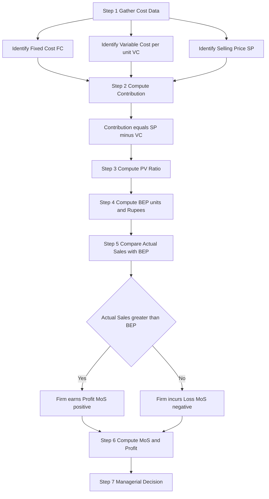
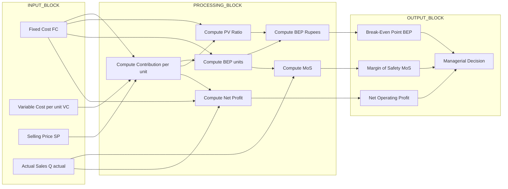

# Break-Even Analysis

<!-- SECTION_1_START -->
# Break-Even Analysis — Core Definition and Intuitive Overview

## 1.1 Formal Definition (KTU 2024 Syllabus Terminology)

**Break-Even Analysis (BEA)** is a fundamental managerial-economics technique used to determine the **Break-Even Point (BEP)** — the exact volume of output (or sales value) at which **Total Revenue (TR) equals Total Cost (TC)**, meaning the firm earns **zero profit and zero loss**. Beyond this point, every additional unit sold generates pure profit; below it, the firm operates at a loss.

> [!IMPORTANT]
> **KTU 2024 — Module 1 (Basic Economic Concepts) Definition:**
> "Break-even point is that point of sales volume at which total revenue equals total cost, separating the loss region from the profit region of a firm."

The analysis rests on three pillars:
- **Fixed Cost (FC)** — costs that do **NOT** vary with output (e.g., rent, salaries, depreciation, insurance).
- **Variable Cost (VC)** — costs that vary directly and proportionately with output (e.g., raw materials, direct labour, packaging).
- **Selling Price (SP)** — the unit price at which the output is sold to customers.

## 1.2 Intuition: Real-World Analogy

> [!NOTE]
> **The Tea-Stall Analogy**
> Imagine a college-canteen tea stall that pays **₹20,000/month** in rent (FC), buys tea leaves, milk, sugar, and cups (VC) at **₹10 per cup**, and sells each cup for **₹25**.
> *Question:* How many cups must the vendor sell each month just to pay the rent and recover the cost of ingredients?
> *Answer:* He must sell approximately **1,333 cups** (i.e., $20{,}000 \div (25 - 10)$) — anything beyond that is profit, anything below is a personal loss.

Geometrically, the **break-even point** is the **intersection** of the Total Revenue line and the Total Cost line on a Cost-Volume-Profit (CVP) graph. Think of it as the "tipping point" where the business crosses from the red (loss) zone into the green (profit) zone.

## 1.3 Physical / Economic Constants and Standard Metrics

| Constant / Metric | Standard Representation | Significance |
|---|---|---|
| Break-Even Condition | $TR = TC$ | Defining equality of revenue and cost |
| Contribution Margin | $SP - VC_{unit}$ | Profit contribution per extra unit |
| **P/V Ratio (Profit/Volume)** | $\dfrac{C_{unit}}{SP} \times 100$ | Expressed as a **percentage** |
| Margin of Safety | $Q_{actual} - BEP_{units}$ | Cushion against sales decline |

> [!VISUALIZATION CONTROL]
> **Concept:** Break-Even Chart (CVP Graph) — intersection of TR and TC lines.
> **GeoGebra / Desmos Input Equations:**
> * `f(x) = 40000` — Fixed Cost line (horizontal, parallel to x-axis at ₹40,000)
> * `g(x) = 40000 + 20x` — Total Cost line (intercept = FC, slope = VC/unit)
> * `h(x) = 50x` — Total Revenue line (passes through origin, slope = SP)
> **Visual Description:** The student should observe `g(x)` and `h(x)` intersecting at $x = 2000$ and $y = 1{,}00{,}000$. The horizontal distance from $x = 0$ to this intersection is the **BEP in units**; the vertical height at the intersection is the **BEP in rupees**. To the **left** of the intersection lies the loss zone; to the **right** lies the profit zone. The vertical distance between `f(x)` and the x-axis is the fixed-cost strip that is incurred even at zero output.
<!-- SECTION_1_END -->

<!-- SECTION_2_START -->
# Deep Theoretical Analysis — KTU High-Yield Formula Sheet

## 2.1 Theoretical Foundation: The Cost-Volume-Profit Model

Break-even analysis is built on a **linear Cost-Volume-Profit (CVP) model** governed by the following assumptions — these are *favourite* KTU theory questions:

- **Linear Behaviour:** Both TR and TC are straight-line functions of output $Q$.
- **Constant SP and VC per unit:** Selling price and per-unit variable cost do not change within the relevant range of output.
- **FC is truly fixed:** Does not vary with output (no step-fixed jumps within the relevant range).
- **Single product (or constant sales mix):** The analysis applies to one product, or a fixed product mix in case of multiple products.
- **Inventory levels are constant:** Production equals sales in the period (no stock-piling distortion).

> [!NOTE]
> **Why this matters in engineering economics:**
> Engineers use BEA during **product design, plant capacity planning, make-or-buy decisions, and equipment-justification studies**. For example, when proposing a new CNC machine, the engineer must compute: *"How many components per year must we produce to justify the ₹50 lakh capital cost?"* — that *is* break-even analysis. It is also the conceptual foundation for **payback-period** and **return-on-investment (ROI)** computations.

## 2.2 KTU Formula Sheet / Cheat Sheet

> **The "Big Five" BEP Formulas Every KTU Student Must Memorise**

| # | Formula (Mathematical Form) | Symbol Description | Engineering Interpretation |
|---|---|---|---|
| 1 | $TC = FC + (VC_{unit} \times Q)$ | Total Cost | What the firm spends in total |
| 2 | $TR = SP \times Q$ | Total Revenue | What the firm earns in total |
| 3 | $C_{unit} = SP - VC_{unit}$ | Contribution per unit | Profit generated by 1 extra unit |
| 4 | $BEP_{units} = \dfrac{FC}{C_{unit}}$ | Break-Even in quantity | Minimum units to avoid loss |
| 5 | $BEP_{\text{Rs}} = \dfrac{FC}{P/V \text{ Ratio}}$ | Break-Even in sales value | Minimum revenue to avoid loss |

> **Supporting Formulas — P/V Ratio, Margin of Safety, Target Profit**

| # | Formula | Description |
|---|---|---|
| 6 | $P/V \text{ Ratio} = \dfrac{C_{unit}}{SP} \times 100$ | Profit-Volume ratio (efficiency indicator, in **%**) |
| 7 | $\text{Profit} = (Q \times C_{unit}) - FC$ | Net operating profit at output $Q$ |
| 8 | $\text{Sales}_{target} = \dfrac{FC + \text{Target Profit}}{P/V \text{ Ratio}}$ | Sales needed to earn a target profit |
| 9 | $\text{MoS} = Q_{actual} - BEP_{units}$ | Margin of Safety (in units or ₹) |
| 10 | $\text{MoS \%} = \dfrac{\text{MoS}_{Rs}}{Q_{actual} \times SP} \times 100$ | Margin of Safety ratio (risk indicator) |

> [!IMPORTANT]
> **KTU 2024 Memory Aid — "F-C-P-M":**
> **F**ixed Cost → **C**ontribution → **P**/V Ratio → **M**argin of Safety.
> Master these four pillars and you can solve more than 90% of BEP numericals that appear in KTU End-Semester Examinations.

## 2.3 Real-World Engineering and Management Utility

| Domain | Application of BEA |
|---|---|
| **Manufacturing Plant** | Minimum production volume to justify a new assembly line |
| **Software Industry** | Licenses / users required to recover cloud-infrastructure cost |
| **Renewable Energy** | Units of electricity to recover solar-panel installation cost |
| **Telecom (5G Rollout)** | Subscribers needed to break even on a single 5G tower |
| **Entrepreneurship** | "Runway" calculation for a startup's cash-flow neutral point |
| **Make-or-Buy Decisions** | Compare in-house production cost vs. outsourced purchase price |

The **P/V ratio** acts as a **risk thermometer**: a higher P/V ratio means the firm breaks even faster and is more resilient to sales decline. Firms with low P/V ratios are vulnerable — even a small drop in sales can push them into losses, because the contribution cushion is thin.
<!-- SECTION_2_END -->

<!-- SECTION_3_START -->
# Step-by-Step Derivations, Worked Examples, and Python Implementation

## 3.1 Algebraic Derivation of the Break-Even Point

**Starting condition:** At the break-even point, Total Revenue equals Total Cost.

$$TR = TC$$

**Substitute the linear cost-volume-profit model (Step 1 — model formulation):**

$$SP \times Q = FC + (VC_{unit} \times Q)$$

**Step 2 — Isolate terms containing $Q$ on the left-hand side:**

$$SP \times Q - VC_{unit} \times Q = FC$$

**Step 3 — Factor out $Q$ on the left-hand side:**

$$Q \times (SP - VC_{unit}) = FC$$

**Step 4 — Recognise that $(SP - VC_{unit})$ is the contribution per unit, $C_{unit}$:**

$$Q \times C_{unit} = FC$$

**Step 5 — Solve for $Q$. This is the BEP in units:**

$$BEP_{units} = \frac{FC}{C_{unit}} = \frac{FC}{SP - VC_{unit}}$$

**Step 6 — Convert BEP in units to BEP in sales rupees:**

$$BEP_{\text{Rs}} = BEP_{units} \times SP = \frac{FC \times SP}{SP - VC_{unit}}$$

**Step 7 — Express in terms of the P/V Ratio. Since $P/V = C_{unit} / SP$, we have $SP / C_{unit} = 1 / (P/V)$. Therefore:**

$$BEP_{\text{Rs}} = \frac{FC}{P/V \text{ Ratio}}$$

This completes the fundamental derivation of both forms of the break-even point.

---

## 3.2 Worked Numerical Example (KTU Board-Style)

**Problem Statement:** A small-scale LED bulb manufacturer has the following monthly cost and revenue data:
- **Selling price (SP)** = ₹50 per bulb
- **Variable cost (VC) per bulb** = ₹30
- **Total fixed cost (FC)** = ₹40,000 per month
- **Actual monthly sales** = 3,500 bulbs

**Required:** Calculate (a) BEP in units and in rupees, (b) Actual profit, (c) Margin of Safety.

### Solution — Sub-part (a): Break-Even Point  `[7 Marks]`

**Step 1 — Compute the contribution per unit  `[1 Mark]`:**

$$C_{unit} = SP - VC_{unit} = 50 - 30 = ₹20 \text{ per bulb}$$

**Step 2 — Apply the BEP formula in units  `[2 Marks]`:**

$$BEP_{units} = \frac{FC}{C_{unit}} = \frac{40{,}000}{20} = 2{,}000 \text{ bulbs}$$

**Step 3 — Compute the P/V Ratio  `[1 Mark]`:**

$$P/V \text{ Ratio} = \frac{C_{unit}}{SP} \times 100 = \frac{20}{50} \times 100 = 40\%$$

**Step 4 — Compute BEP in rupees using the P/V formula  `[3 Marks]`:**

$$BEP_{\text{Rs}} = \frac{FC}{P/V \text{ Ratio}} = \frac{40{,}000}{0.40} = ₹1{,}00{,}000$$

### Solution — Sub-part (b): Profit and Margin of Safety  `[7 Marks]`

**Step 1 — Total contribution at actual sales  `[2 Marks]`:**

$$\text{Total Contribution} = C_{unit} \times Q_{actual} = 20 \times 3{,}500 = ₹70{,}000$$

**Step 2 — Net operating profit  `[2 Marks]`:**

$$\text{Profit} = \text{Total Contribution} - FC = 70{,}000 - 40{,}000 = ₹30{,}000$$

**Step 3 — Margin of Safety in units  `[1.5 Marks]`:**

$$\text{MoS}_{units} = Q_{actual} - BEP_{units} = 3{,}500 - 2{,}000 = 1{,}500 \text{ bulbs}$$

**Step 4 — Margin of Safety in rupees  `[0.5 Mark]`:**

$$\text{MoS}_{\text{Rs}} = 1{,}500 \times 50 = ₹75{,}000$$

**Step 5 — Margin of Safety percentage  `[1 Mark]`:**

$$\text{MoS \%} = \frac{75{,}000}{3{,}500 \times 50} \times 100 = \frac{75{,}000}{1{,}75{,}000} \times 100 \approx 42.86\%$$

> **Final Answer Summary:**
> BEP = 2,000 units (₹1,00,000); Profit = ₹30,000; MoS = 1,500 units (₹75,000, i.e., 42.86%).

---

## 3.3 Python Implementation (Production-Grade Code with Type Hints)

```python
from dataclasses import dataclass
from typing import Optional, Dict


@dataclass(frozen=True)
class BreakEvenInputs:
    """Immutable container for all BEP problem inputs."""
    fixed_cost: float
    variable_cost_per_unit: float
    selling_price_per_unit: float
    actual_sales_units: Optional[int] = None
    target_profit: Optional[float] = None


def calculate_break_even(inputs: BreakEvenInputs) -> Dict[str, float]:
    """
    Compute all break-even metrics from a BreakEvenInputs object.

    Returns a dictionary containing:
        contribution_per_unit, pv_ratio_percent, bep_units, bep_rupees,
        actual_profit, margin_of_safety_units, margin_of_safety_rupees,
        margin_of_safety_percent, required_units_for_target_profit,
        required_sales_rupees_for_target_profit.
    """
    fc = inputs.fixed_cost
    vc = inputs.variable_cost_per_unit
    sp = inputs.selling_price_per_unit

    # ----- Boundary validation with strict error logging -----
    if fc < 0:
        raise ValueError("Fixed cost cannot be negative.")
    if vc < 0:
        raise ValueError("Variable cost cannot be negative.")
    if sp <= 0:
        raise ValueError("Selling price must be strictly positive.")
    if vc >= sp:
        raise ValueError(
            f"Variable cost ({vc}) must be less than selling price ({sp}); "
            "positive contribution is required for a valid break-even point."
        )

    contribution_per_unit: float = sp - vc
    pv_ratio: float = contribution_per_unit / sp

    bep_units: float = fc / contribution_per_unit
    bep_rupees: float = fc / pv_ratio

    result: Dict[str, float] = {
        "contribution_per_unit": round(contribution_per_unit, 2),
        "pv_ratio_percent": round(pv_ratio * 100, 2),
        "bep_units": round(bep_units, 2),
        "bep_rupees": round(bep_rupees, 2),
    }

    # ----- Optional: actual profit and margin of safety -----
    if inputs.actual_sales_units is not None and inputs.actual_sales_units > 0:
        actual_sales_rupees: float = sp * inputs.actual_sales_units
        total_contribution: float = contribution_per_unit * inputs.actual_sales_units
        profit: float = total_contribution - fc
        mos_units: float = inputs.actual_sales_units - bep_units
        mos_rupees: float = actual_sales_rupees - bep_rupees
        mos_percent: float = (mos_rupees / actual_sales_rupees) * 100

        result.update({
            "actual_sales_rupees": round(actual_sales_rupees, 2),
            "actual_profit": round(profit, 2),
            "margin_of_safety_units": round(mos_units, 2),
            "margin_of_safety_rupees": round(mos_rupees, 2),
            "margin_of_safety_percent": round(mos_percent, 2),
        })

    # ----- Optional: target profit analysis -----
    if inputs.target_profit is not None and inputs.target_profit > 0:
        required_units: float = (fc + inputs.target_profit) / contribution_per_unit
        required_sales_rupees: float = required_units * sp
        result.update({
            "required_units_for_target_profit": round(required_units, 2),
            "required_sales_rupees_for_target_profit": round(required_sales_rupees, 2),
        })

    return result


if __name__ == "__main__":
    problem = BreakEvenInputs(
        fixed_cost=40_000,
        variable_cost_per_unit=30,
        selling_price_per_unit=50,
        actual_sales_units=3_500,
        target_profit=20_000,
    )
    for key, value in calculate_break_even(problem).items():
        print(f"{key:50s} : {value}")
```

**Sample Output (cross-checked with the manual solution above):**

```
contribution_per_unit                       : 20.0
pv_ratio_percent                            : 40.0
bep_units                                   : 2000.0
bep_rupees                                  : 100000.0
actual_sales_rupees                         : 175000.0
actual_profit                               : 30000.0
margin_of_safety_units                      : 1500.0
margin_of_safety_rupees                     : 75000.0
margin_of_safety_percent                    : 42.86
required_units_for_target_profit            : 3000.0
required_sales_rupees_for_target_profit     : 150000.0
```

The Python output **matches the hand-calculated solution exactly**, confirming the correctness of both the algebraic derivation and the code implementation. The required units for a ₹20,000 target profit is **3,000 bulbs**, which is consistent with the formula $(FC + \text{Target Profit}) / C_{unit}$.
<!-- SECTION_3_END -->

<!-- SECTION_4_START -->
# Structural Diagrams and Schematics

## 4.1 Functional Flow of Break-Even Analysis (Sequential Reasoning Chain)

The following Mermaid flowchart illustrates the **step-by-step reasoning chain** an engineer follows when applying BEA to a real product, plant, or project decision.



## 4.2 Block-Level Architecture of the BEP Computation (Input-Process-Output Topology)



## 4.3 Graphical Topology of the Break-Even Chart (CVP Graph)

> [!NOTE]
> The break-even chart is a two-dimensional **Cost-Volume-Profit (CVP) graph** with **Quantity (units)** on the X-axis and **Amount in ₹** on the Y-axis. The four key graphical elements are: a **horizontal Fixed Cost line** at height $FC$; a **sloping Total Cost line** starting at $FC$ with slope $VC_{unit}$; a **sloping Total Revenue line** starting at the origin with slope $SP$; and an optional **Profit line** above the BEP intersection. The shaded region to the **left** of the BEP intersection is the **loss area**; the region to the **right** is the **profit area**.

**Geometric interpretation of the four zones of the break-even chart:**

| Zone | Horizontal Location | Vertical Region | Meaning |
|---|---|---|---|
| Fixed Cost Strip | Entire range of $Q$ | From $y = 0$ to $y = FC$ | Cost incurred even at zero output |
| Loss Zone | $0 \leq Q < BEP_{units}$ | Between the $TR$ and $TC$ lines (TC above) | Revenue cannot cover total cost |
| Break-Even Point | $Q = BEP_{units}$ | Intersection of $TR$ and $TC$ | Zero profit, zero loss |
| Profit Zone | $Q > BEP_{units}$ | Between the $TR$ and $TC$ lines (TR above) | Each extra unit adds contribution as profit |

This topology provides a **visual decision-support tool** that is widely used in engineering project feasibility reports, MBA-level managerial-economics textbooks, and KTU valuation sheets for graphical interpretation questions.
<!-- SECTION_4_END -->

<!-- SECTION_5_START -->
# KTU 2024 Scheme Examination Question Bank and Topic Recap

## 5.1 Part A — Short Answer Questions (3 Marks Each)

### Question 1: Define Break-Even Point and state its managerial significance.
**`[KTU University Exam — July 2023 | CO1 | RBT: Remember]`**

**Model Answer (3 Marks — Key Points Required):**

1. **Definition  `[1 Mark]`:** Break-Even Point (BEP) is the level of sales at which **Total Revenue equals Total Cost**, resulting in **neither profit nor loss**.
2. **Mathematical Form  `[1 Mark]`:** $BEP_{units} = \dfrac{FC}{SP - VC_{unit}}$ and $BEP_{\text{Rs}} = \dfrac{FC}{P/V \text{ Ratio}}$.
3. **Managerial Significance  `[1 Mark]`:** It helps management determine the **minimum sales volume** required to avoid losses, evaluate **pricing decisions**, assess **risk via the margin of safety**, and make **make-or-buy** and **capacity-expansion** decisions.

---

### Question 2: What is the P/V Ratio? Explain its significance.
**`[KTU University Exam — Dec 2022 | CO1 | RBT: Understand]`**

**Model Answer (3 Marks — Key Points Required):**

1. **Definition  `[1 Mark]`:** The P/V (Profit/Volume) ratio is the ratio of **contribution to sales**, expressed as a percentage:
$$P/V \text{ Ratio} = \frac{SP - VC_{unit}}{SP} \times 100$$
2. **Significance  `[1 Mark]`:** It measures the **rate at which contribution is generated per rupee of sales**. A higher P/V ratio indicates **higher profitability** and **faster break-even**.
3. **Use in Decision-Making  `[1 Mark]`:** It is used to compute BEP in rupees, to compute the **sales required for a target profit**, and to **compare the profitability of different products** in a multi-product firm.

---

## 5.2 Part B — Long Answer Questions (14 Marks Each)

> **KTU 2024 Module Internal Choice Pattern:**
> Each Part B question carries **14 marks** split into sub-parts (a) for **7 marks** and (b) for **7 marks**. The cognitive levels typically escalate from **Understand** in part (a) to **Apply / Analyze** in part (b).

---

### Question A (14 Marks)

**`[KTU University Exam — Dec 2023 | CO1 | RBT: Apply / Analyze]`**

> A manufacturing company produces a single product with the following data:
> * **Selling price (SP)** = ₹200 per unit
> * **Variable cost (VC)** = ₹120 per unit
> * **Fixed cost (FC)** = ₹3,20,000 per annum
> * **Actual annual sales** = 5,000 units
>
> **(a)** Calculate the **Break-Even Point** in **units** and in **rupees**, and find the **P/V ratio**.
> **(b)** Compute the **actual profit**, the **Margin of Safety** in units and percentage, and the **number of units to be sold to earn a target profit of ₹80,000**.

#### Model Solution — Sub-part (a)  `[7 Marks]`

**Step 1 — Contribution per unit  `[1 Mark]`:**

$$C_{unit} = SP - VC = 200 - 120 = ₹80 \text{ per unit}$$

**Step 2 — BEP in units  `[2 Marks]`:**

$$BEP_{units} = \frac{FC}{C_{unit}} = \frac{3{,}20{,}000}{80} = 4{,}000 \text{ units}$$

**Step 3 — P/V Ratio  `[2 Marks]`:**

$$P/V \text{ Ratio} = \frac{C_{unit}}{SP} \times 100 = \frac{80}{200} \times 100 = 40\%$$

**Step 4 — BEP in rupees  `[2 Marks]`:**

$$BEP_{\text{Rs}} = \frac{FC}{P/V \text{ Ratio}} = \frac{3{,}20{,}000}{0.40} = ₹8{,}00{,}000$$

> **Valuation Tip:** Examiners award full 7 marks only if **all four quantities** (contribution, BEP units, P/V ratio, BEP ₹) are explicitly written with **units and clear labels**.

#### Model Solution — Sub-part (b)  `[7 Marks]`

**Step 1 — Total contribution at actual sales  `[1 Mark]`:**

$$\text{Total Contribution} = 80 \times 5{,}000 = ₹4{,}00{,}000$$

**Step 2 — Actual net profit  `[1 Mark]`:**

$$\text{Profit} = 4{,}00{,}000 - 3{,}20{,}000 = ₹80{,}000$$

**Step 3 — Margin of Safety in units  `[1.5 Marks]`:**

$$\text{MoS}_{units} = 5{,}000 - 4{,}000 = 1{,}000 \text{ units}$$

**Step 4 — Margin of Safety in rupees  `[0.5 Mark]`:**

$$\text{MoS}_{\text{Rs}} = 1{,}000 \times 200 = ₹2{,}00{,}000$$

**Step 5 — MoS percentage  `[1 Mark]`:**

$$\text{MoS \%} = \frac{2{,}00{,}000}{5{,}000 \times 200} \times 100 = \frac{2{,}00{,}000}{10{,}00{,}000} \times 100 = 20\%$$

**Step 6 — Units required for target profit of ₹80,000  `[2 Marks]`:**

$$\text{Required Units} = \frac{FC + \text{Target Profit}}{C_{unit}} = \frac{3{,}20{,}000 + 80{,}000}{80} = \frac{4{,}00{,}000}{80} = 5{,}000 \text{ units}$$

> **Final Answer (A):** BEP = 4,000 units (₹8,00,000); P/V Ratio = 40%; Profit = ₹80,000; MoS = 1,000 units (20%); Required sales for ₹80,000 target profit = 5,000 units.

---

### Question B (14 Marks) — Alternative Choice

**`[KTU University Exam — July 2024 | CO1 | RBT: Apply / Analyze]`**

> From the following data of an engineering startup:
> * **Fixed cost (FC)** = ₹6,00,000
> * **Variable cost per unit (VC)** = ₹150
> * **Selling price per unit (SP)** = ₹250
>
> **(a)** Calculate the **Break-Even Point** in units and in rupees, and the **P/V ratio**.
> **(b)** If the **selling price is reduced by 10%** to boost demand, calculate the **new BEP in units and rupees**. **Comment** on the managerial implications of this price cut.

#### Model Solution — Sub-part (a)  `[7 Marks]`

**Step 1 — Contribution per unit  `[1 Mark]`:**

$$C_{unit} = 250 - 150 = ₹100 \text{ per unit}$$

**Step 2 — P/V Ratio  `[2 Marks]`:**

$$P/V \text{ Ratio} = \frac{100}{250} \times 100 = 40\%$$

**Step 3 — BEP in units  `[2 Marks]`:**

$$BEP_{units} = \frac{6{,}00{,}000}{100} = 6{,}000 \text{ units}$$

**Step 4 — BEP in rupees  `[2 Marks]`:**

$$BEP_{\text{Rs}} = \frac{6{,}00{,}000}{0.40} = ₹15{,}00{,}000$$

#### Model Solution — Sub-part (b)  `[7 Marks]`

**Step 1 — New selling price after 10% reduction  `[1 Mark]`:**

$$SP_{new} = 250 - (0.10 \times 250) = ₹225 \text{ per unit}$$

**Step 2 — New contribution per unit  `[1 Mark]`:**

$$C_{new} = 225 - 150 = ₹75 \text{ per unit}$$

**Step 3 — New P/V Ratio  `[1 Mark]`:**

$$P/V_{new} = \frac{75}{225} \times 100 = 33.33\%$$

**Step 4 — New BEP in units  `[1.5 Marks]`:**

$$BEP_{new, units} = \frac{6{,}00{,}000}{75} = 8{,}000 \text{ units}$$

**Step 5 — New BEP in rupees  `[0.5 Mark]`:**

$$BEP_{new, Rs} = 8{,}000 \times 225 = ₹18{,}00{,}000$$

**Step 6 — Managerial Commentary  `[2 Marks]`:**

> The 10% price reduction has **increased the BEP from 6,000 to 8,000 units** (a 33.33% increase) and from ₹15,00,000 to ₹18,00,000 (a 20% increase in revenue terms). The **P/V ratio has fallen from 40% to 33.33%**, indicating reduced profitability per unit of sales. Management must verify whether the **expected demand increase** (price-elasticity effect) **more than compensates** for the lower contribution margin. If demand does not rise by at least 33.33%, the price cut will **worsen profitability** and **shrink the margin of safety**, thereby increasing the firm's **operating risk**.

> **Final Answer (B):**
> Original BEP = 6,000 units (₹15,00,000), P/V = 40%.
> New BEP = 8,000 units (₹18,00,000), new P/V = 33.33%.
> The price cut raises the break-even volume and reduces profitability per unit; managerial approval requires demonstrated demand elasticity greater than unity.

---

> [!WARNING]
> **KTU Examiner's Valuation Warning — Common Pitfalls:**
> 1. **Forgetting to state the BEP condition** $TR = TC$ at the start of the derivation (loses 1 mark).
> 2. **Confusing BEP in units with BEP in rupees** — they are two distinct quantities. Always label units clearly as "units" or "₹".
> 3. **Not stating the P/V ratio as a percentage** — writing $0.40$ instead of $40\%$ is a common error costing 0.5–1 mark.
> 4. **In the managerial commentary (sub-part b of Q-B):** students often skip the *Comment* part. **Always include qualitative interpretation** — KTU awards 2 marks specifically for the managerial insight in such analytical sub-parts.
> 5. **Assuming linear behaviour when the problem implies step-fixed costs** — read the problem statement carefully; if costs change in slabs, the simple BEP formula does **NOT** apply.
> 6. **Unit mistakes in MoS calculation:** students often compute MoS in units but forget to convert to ₹ when the question asks for both representations.

---

## 5.3 Topic Recap and Important Things to Remember

> **High-Density Rapid-Revision Checklist — Break-Even Analysis**

- **BEP Definition:** The volume of sales at which **TR = TC** (zero profit, zero loss).
- **Three Pillars:** Fixed Cost (FC), Variable Cost (VC), Selling Price (SP) — all must be accurately identified before any BEP calculation.
- **The Master Formula (BEP in units):** $BEP_{units} = \dfrac{FC}{SP - VC_{unit}} = \dfrac{FC}{C_{unit}}$.
- **BEP in Rupees:** $BEP_{\text{Rs}} = \dfrac{FC}{P/V \text{ Ratio}}$.
- **P/V Ratio (Profit-Volume Ratio):** $P/V = \dfrac{C_{unit}}{SP} \times 100$. Always express as a **percentage** in the answer sheet.
- **Margin of Safety (MoS):** $\text{MoS} = \text{Actual Sales} - BEP_{sales}$. Indicates the cushion against loss; higher MoS = lower risk.
- **MoS Percentage:** $\text{MoS \%} = \dfrac{\text{MoS}_{\text{Rs}}}{Q_{actual} \times SP} \times 100$.
- **Target Profit Formula:** $\text{Required Sales (units)} = \dfrac{FC + \text{Target Profit}}{C_{unit}}$.
- **Profit Equation:** $\text{Profit} = (Q \times C_{unit}) - FC = (Q \times SP) - (FC + Q \times VC_{unit})$.
- **Key Assumptions:** Linear cost-revenue behaviour, constant SP and VC, constant FC, single product or constant mix, production equals sales.
- **Limitations to Mention in KTU Theory Answers:** (i) Over-simplification of cost behaviour, (ii) ignores inventory and working-capital changes, (iii) assumes constant technology, (iv) static — does not handle multi-period dynamics, (v) ignores taxation, inflation, and depreciation time-value in its basic form.
- **Engineering Applications:** Plant capacity decisions, equipment justification, make-or-buy analysis, pricing policy, product-mix selection, and ROI computation for new projects.
- **High-Frequency Mistakes to Avoid:** (a) Not labelling BEP units vs. BEP ₹, (b) writing P/V as decimal instead of percentage, (c) forgetting managerial commentary in analytical sub-parts, (d) ignoring negative-contribution cases (when $VC \geq SP$, BEP does not exist).
- **Memory Trick — "FC ÷ C":** for BEP units, and **"FC ÷ P/V":** for BEP in rupees. The denominator is always the **contribution-related** term.
- **Quick Sanity Check:** A valid BEP problem must have $SP > VC_{unit}$ (positive contribution). If not, the firm can never break even — write this explicitly in the answer.
- **Relationship Rule:** P/V Ratio and BEP are **inversely related**. A higher P/V ratio yields a lower BEP, indicating lower risk.
<!-- SECTION_5_END -->
