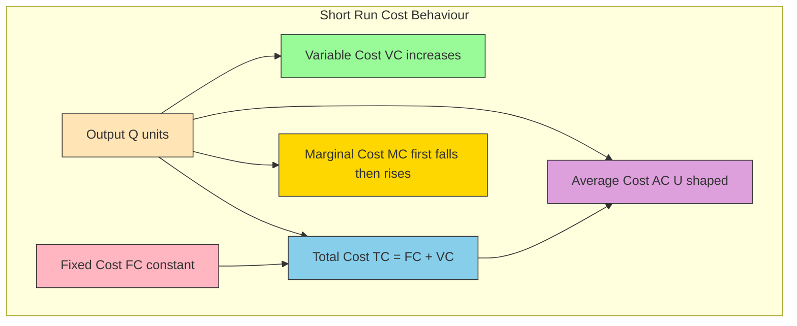
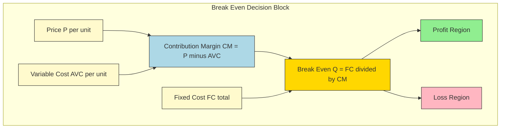
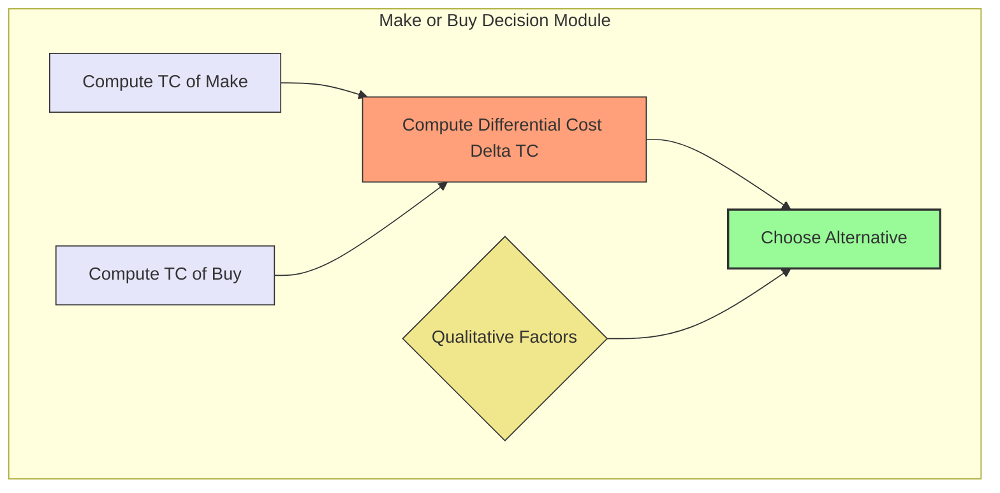
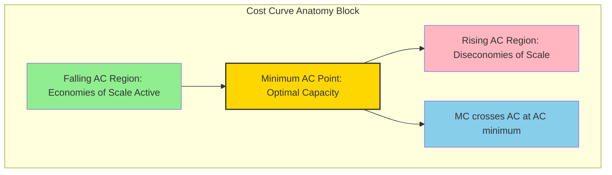

# Cost Concepts

<!-- SECTION_1_START -->
# 1. Core Technical Definition & Intuitive Overview

## 1.1 What is "Cost" in Engineering Economics?

In the context of **Economics for Engineers (UHSUT300 – KTU 2024 Scheme)**, the term **Cost** is a formal, quantified measurement of the **economic resources sacrificed (measured in monetary units such as ₹, \$, or €)** to achieve a specific engineering, operational, or production objective. It represents the **forgone alternative value** of the next best option that an engineer or a firm must give up while committing limited capital, materials, labour, and time to a particular project.

> [!IMPORTANT]
> **KTU 2024 Syllabus Definition (Module 1):**
> *Cost is the monetary valuation of all explicit (out-of-pocket) and implicit (opportunity) resources consumed during the engineering design, manufacturing, and service-delivery lifecycle of a product or project.*

In simpler words, **Cost is the "price of doing engineering work"** — it is what an organization gives up (in terms of materials, manpower, machines, minutes, and money) to design, build, deliver, or maintain a system.

### 1.2 Intuition: A Real-World Analogy

> [!NOTE]
> **Analogy — The "Biryani Pot" Example:**
> Imagine a final-year B.Tech student in Kerala cooking a large pot of biryani for a college fest.
>
> * **Visible (Explicit) Costs:** Money spent on rice (₹500), chicken (₹800), gas cylinder (₹200), and spices (₹150). These are bills you actually pay.
> * **Invisible (Implicit) Costs:** The 3 hours you could have spent earning ₹300 from a part-time tuition class, and the depreciation of your mother's pressure cooker. No bill exists, but value is lost.
> * **Total Cost of the Biryani** = Money Spent + Lost Earnings + Worn-out Cooker.
>
> Engineering economics treats *every* project the same way — **what you pay + what you lose by not doing the next best thing = TRUE COST.**

### 1.3 Why Cost Concepts Matter to Engineers

> [!IMPORTANT]
> An engineer does not just *build*; an engineer **optimises**. Understanding cost types allows you to:
> 1. Prepare accurate **Bill of Quantities (BoQ)** and tender documents.
> 2. Perform **make-or-buy** and **replacement** decisions.
> 3. Calculate **break-even production volumes** for a manufacturing unit.
> 4. Justify capital investments in industrial automation.
> 5. Compute **profitability, depreciation, and tax liabilities** for audit and compliance.

### 1.4 Core Cost Terminology — A Quick Lexicon

| Term | Plain-English Meaning | Unit |
|---|---|---|
| **Explicit Cost** | Actual cash outflow (salary, rent, electricity bill). | ₹ (Rupees) |
| **Implicit Cost** | Value of foregone alternatives (owner's time, own capital). | ₹ (Rupees) |
| **Sunk Cost** | Money already spent and unrecoverable, regardless of future decisions. | ₹ (Rupees) |
| **Opportunity Cost** | Best alternative benefit given up. | ₹ (Rupees) |
| **Marginal Cost (MC)** | Extra cost of producing **one additional unit**. | ₹ / unit |
| **Average Cost (AC)** | Total cost divided by total units produced. | ₹ / unit |
| **Total Cost (TC)** | Sum of all costs for a given output level $Q$. | ₹ (Rupees) |
| **Fixed Cost (FC)** | Cost that **does NOT vary** with output. | ₹ (Rupees) |
| **Variable Cost (VC)** | Cost that **varies directly** with output. | ₹ (Rupees) |

### 1.5 Visualization — Cost Curves Overview

> [!VISUALIZATION CONTROL]
> **Concept:** Behaviour of Fixed, Variable, and Total Cost curves with respect to Output ($Q$).
> **GeoGebra / Desmos Input Equations:**
> * $f_{FC}(x) = 5000$ (Constant horizontal line)
> * $f_{VC}(x) = 20x + 0.5x^2$ (Upward non-linear curve)
> * $f_{TC}(x) = f_{FC}(x) + f_{VC}(x) = 5000 + 20x + 0.5x^2$
> * $f_{AC}(x) = \frac{f_{TC}(x)}{x} = \frac{5000}{x} + 20 + 0.5x$
> * $f_{MC}(x) = \frac{d(f_{TC}(x))}{dx} = 20 + x$
> **Visual Description:** The student should observe that the **FC line is flat (parallel to X-axis)**, **VC starts at origin and rises**, **TC is parallel to VC but shifted up by FC**, **MC is a straight line**, and **AC is a U-shaped curve** that is cut at its minimum by the rising MC curve.

<!-- SECTION_1_END -->

<!-- SECTION_2_START -->
# 2. Deep Theoretical Analysis & KTU High-Yield Formula Sheet

## 2.1 Classification of Costs (Master Framework)

Costs can be classified along **four orthogonal dimensions** in engineering economics. The KTU 2024 module explicitly tests all four classifications.

### Dimension A — Behaviour with respect to Output ($Q$)

#### 2.1.1 Fixed Cost (FC) — "The Rent You Pay Even if You Produce Zero"

A **Fixed Cost** is a cost that **remains constant in total** over a relevant range of output (called the *relevant range* or *capacity range*), irrespective of the quantity of goods produced. It is a **time-related cost**, not a volume-related cost.

**Engineering Examples:**
* Annual factory lease rent (₹12,00,000 per year).
* Depreciation of CNC machines (straight-line method).
* Salary of permanent supervisory staff.
* Insurance premium of plant and machinery.
* Property tax on the production building.

> [!NOTE]
> **Key Rule:** Per-unit fixed cost $\left( \frac{FC}{Q} \right)$ **decreases** as output increases. This is the mathematical basis of **economies of scale**.

#### 2.1.2 Variable Cost (VC) — "The Cost That Breathes with Production"

A **Variable Cost** changes **in direct proportion** to the volume of production within the relevant range. If no unit is produced, VC = 0.

**Engineering Examples:**
* Raw material cost (steel, copper, silicon wafers).
* Direct labour wages (piece-rate system).
* Electricity consumed by production equipment.
* Consumables (cutting oil, welding electrodes, solder wire).
* Packaging and shipping cost per unit.

#### 2.1.3 Semi-Variable Cost (Mixed Cost) — "A Cost With Two Personalities"

A **Semi-Variable Cost** contains a **fixed component plus a variable component**. It exhibits the rigidity of fixed cost up to a minimum level, beyond which it rises with output.

**Engineering Examples:**
* Telephone bill: ₹500 monthly fixed line rent + ₹2 per call.
* Electricity bill: ₹1500 minimum charge + ₹7.50 per kWh above 100 kWh.
* Salesman salary: ₹10,000 fixed + 2\% commission on sales.

$$\text{Semi-Variable Cost} = \text{Fixed Component} + (\text{Variable Rate} \times Q)$$

#### 2.1.4 Semi-Fixed (Step) Cost — "The Cost That Jumps in Stairs"

A **Semi-Fixed Cost** remains fixed **within a specific production level**, but jumps to a higher value once the production crosses a threshold (typically when an additional machine, supervisor, or shift is required).

**Engineering Example:** Hiring a second supervisor when production exceeds 5,000 units/month. Cost jumps from ₹40,000 to ₹80,000 at that threshold.

### Dimension B — Traceability to Product

#### 2.1.5 Direct Cost vs. Indirect Cost

| Attribute | Direct Cost | Indirect Cost |
|---|---|---|
| **Traceability** | Traceable to a specific product/job. | Cannot be traced to a single product. |
| **Examples** | Timber in a chair, chip in a smartphone, salary of a welder working on one project. | Factory rent, factory manager salary, factory electricity. |
| **Accounting** | Charged to the specific Job Order. | Apportioned using overhead absorption rates. |
| **Cost Object** | Product, Project, Department, or Customer. | Production or Service Facility as a whole. |

### Dimension C — Recoverability

#### 2.1.6 Sunk Cost — "The Money That Drowned"

A **Sunk Cost** is a past, irrecoverable expenditure that has already been incurred and **cannot be recovered** by any future decision. It is **irrelevant** for future economic decision-making.

> [!IMPORTANT]
> **KTU Board Favourite Question:** *"Should a company continue a project because ₹50 lakh has already been spent on it?"*
> **Answer:** **NO.** Sunk costs must be **ignored** when making future decisions. Engineers often fall into the **"Sunk Cost Fallacy"** — a cognitive bias.

#### 2.1.7 Opportunity Cost — "The Road Not Taken"

**Opportunity Cost** is the value of the **next-best alternative foregone** when a choice is made. It is the *true economic cost* of a decision.

**Example:** A graduate engineer accepts a ₹6 LPA private job and forgoes an MTech seat worth ₹4 LPA tuition + ₹8 LPA expected future salary differential. The opportunity cost of the private job is ₹8 LPA (forgone future earnings).

### Dimension D — Decision Relevance

#### 2.1.8 Marginal, Average, Total, and Differential Costs

* **Marginal Cost (MC):** $\Delta TC / \Delta Q$ — the cost of producing *one more* unit.
* **Average Cost (AC):** $TC / Q$ — the cost per unit at a given output.
* **Total Cost (TC):** $FC + VC$ — the sum of all costs.
* **Differential Cost (Incremental Cost):** Difference in total cost between two alternative courses of action. Used in *make-or-buy*, *lease-or-buy* decisions.

## 2.2 Cost-Output Relationship in the Short Run

In the **short run**, at least one factor of production is **fixed** (typically capital — plant, machinery, building). Therefore, the cost behaviour is:

$$TC(Q) = FC + VC(Q)$$

A typical short-run **Total Variable Cost (TVC)** function is non-linear because of the **Law of Variable Proportions** (initially increasing returns → constant returns → diminishing returns).

$$VC(Q) = aQ + bQ^2$$

where $a > 0$ (variable cost coefficient) and $b > 0$ (acceleration of variable cost due to diminishing returns).

$$MC(Q) = \frac{dTC(Q)}{dQ} = a + 2bQ$$

$$AC(Q) = \frac{FC + aQ + bQ^2}{Q} = \frac{FC}{Q} + a + bQ$$

The optimal output (minimum AC) is obtained by setting $\frac{dAC}{dQ} = 0$:

$$\frac{dAC}{dQ} = -\frac{FC}{Q^2} + b = 0 \;\;\Rightarrow\;\; Q_{opt} = \sqrt{\frac{FC}{b}}$$

> [!NOTE]
> **Engineering Insight:** $Q_{opt}$ is the **plant's most efficient operating volume**. Running below or above it increases per-unit cost. This directly informs **capacity planning** decisions for any factory.

## 2.3 Cost-Output Relationship in the Long Run

In the **long run**, **all** factors of production are variable. The firm can change the size of the plant. The **Long-Run Average Cost (LRAC)** curve is the **envelope** of all possible short-run average cost (SRAC) curves.

The LRAC is typically **U-shaped** (or L-shaped in modern industries) because of:
1. **Economies of Scale** (LRAC falls): Bulk purchase discounts, specialization, better management techniques.
2. **Constant Returns to Scale** (LRAC flat): Optimal scale reached.
3. **Diseconomies of Scale** (LRAC rises): Coordination failure, communication overhead, managerial bureaucracy.

## 2.4 KTU Formula Sheet / Cheat Sheet

> [!IMPORTANT]
> **Use this table as your last-night revision sheet. Memorise every row.**

| # | Concept | Formula | Unit | Notes / Special Case |
|---|---|---|---|---|
| 1 | Total Cost | $TC = FC + VC$ | ₹ | Always positive. |
| 2 | Average Cost | $AC = \frac{TC}{Q}$ | ₹/unit | U-shaped. |
| 3 | Marginal Cost | $MC = \frac{dTC}{dQ}$ | ₹/unit | MC = AC at minimum of AC. |
| 4 | Average Fixed Cost | $AFC = \frac{FC}{Q}$ | ₹/unit | Always decreases as $Q \uparrow$. |
| 5 | Average Variable Cost | $AVC = \frac{VC}{Q}$ | ₹/unit | U-shaped. |
| 6 | Break-Even Output | $Q_{BE} = \frac{FC}{P - AVC}$ | units | Numerator is FC; denominator is contribution margin. |
| 7 | Opportunity Cost | $OC = \text{Return from best rejected alternative}$ | ₹ | Always non-negative. |
| 8 | Sunk Cost | $SC = \text{Past, unrecoverable expense}$ | ₹ | Ignore for future decisions. |
| 9 | Differential Cost | $DC = TC_{\text{alt 1}} - TC_{\text{alt 2}}$ | ₹ | Used in make-or-buy. |
| 10 | Optimal Output (Short Run) | $Q_{opt} = \sqrt{\frac{FC}{b}}$ | units | Minimum of AC. |
| 11 | Semi-Variable Cost | $SVC = F + vQ$ | ₹ | $F$ = fixed part, $v$ = variable rate. |
| 12 | Total Revenue | $TR = P \times Q$ | ₹ | $P$ = price per unit. |
| 13 | Profit | $\pi = TR - TC$ | ₹ | Maximised when $MC = MR$. |
| 14 | Marginal Revenue | $MR = \frac{dTR}{dQ}$ | ₹/unit | Equals price under perfect competition. |

## 2.5 Real-World Engineering Utility

> [!NOTE]
> **Where these cost concepts are used in production systems:**
> 1. **Manufacturing Industry:** Determining the **break-even production volume** of a new smartphone model before mass production.
> 2. **Construction Industry:** Preparation of **cost estimates and BoQ** for tender submissions in KWA, PWD, and CPWD projects.
> 3. **Software Industry:** Calculation of **per-user hosting cost** for a SaaS product to set a profitable subscription price.
> 4. **Power Sector:** Deciding whether to **build a new thermal plant or purchase power** from the grid (differential cost analysis).
> 5. **Aerospace Industry:** Determining whether to **re-engine an old aircraft (sunk cost trap) or retire it**.

<!-- SECTION_2_END -->

<!-- SECTION_3_START -->
# 3. Step-by-Step Derivations & Symbolic Implementation

## 3.1 Derivation 1 — Optimal Output (Minimum Average Cost)

**Problem Setup:** A small-scale engineering unit in Kochi has a **Fixed Cost of ₹50,000 per month** and a **Total Variable Cost function** $VC(Q) = 500Q + 2Q^2$ where $Q$ is monthly output in units.

**Step 1 — Formulate Total Cost.**
$$TC(Q) = FC + VC(Q) = 50000 + 500Q + 2Q^2$$

**Step 2 — Formulate Average Cost.**
$$AC(Q) = \frac{TC(Q)}{Q} = \frac{50000}{Q} + 500 + 2Q$$

**Step 3 — Differentiate AC with respect to $Q$ and equate to zero.**
$$\frac{dAC(Q)}{dQ} = -\frac{50000}{Q^2} + 0 + 2 = 0$$

**Step 4 — Solve the first-order condition.**
$$2 = \frac{50000}{Q^2} \;\;\Rightarrow\;\; Q^2 = \frac{50000}{2} = 25000 \;\;\Rightarrow\;\; Q = \sqrt{25000}$$

$$Q = 158.11 \;\;\text{units (approximately)}$$

**Step 5 — Verify it is a minimum using the second-order condition.**
$$\frac{d^2 AC(Q)}{dQ^2} = \frac{2 \times 50000}{Q^3} = \frac{100000}{Q^3} > 0 \;\;\text{for all } Q > 0$$

Since the second derivative is positive, the critical point is a **minimum**. ✓

**Step 6 — Compute the minimum AC value.**
$$AC_{min} = \frac{50000}{158.11} + 500 + 2(158.11) = 316.23 + 500 + 316.22 = 1132.45 \;\;\text{₹/unit}$$

**Step 7 — Compute MC at the optimal output for verification.**
$$MC(Q) = \frac{dTC(Q)}{dQ} = 500 + 4Q = 500 + 4(158.11) = 1132.44 \;\;\text{₹/unit}$$

We confirm the **fundamental identity** that holds true at the minimum of AC:

$$MC = AC \;\;\text{at the minimum of } AC.$$

**Step 8 — Engineering interpretation.**
The firm should produce **~158 units/month** to minimise its average cost at **₹1,132.45/unit**. Producing fewer units forces the firm to spread FC over fewer units (raising AC); producing more units triggers diminishing returns (raising VC faster than $Q$).

---

## 3.2 Derivation 2 — Break-Even Analysis (Numerical)

**Problem:** A KTU-graduate-run start-up manufactures IoT-based water-quality sensors.
* Selling price per unit $P = ₹2,000$
* Variable cost per unit $v = ₹1,200$
* Total fixed cost per month $FC = ₹1,60,000$

**Step 1 — Write the profit equation.**
$$\pi(Q) = TR(Q) - TC(Q) = PQ - (FC + vQ) = (P - v)Q - FC$$

**Step 2 — Substitute numerical values.**
$$\pi(Q) = (2000 - 1200)Q - 160000 = 800Q - 160000$$

**Step 3 — Compute Break-Even Quantity (BEQ) by setting $\pi = 0$.**
$$0 = 800Q_{BE} - 160000 \;\;\Rightarrow\;\; Q_{BE} = \frac{160000}{800} = 200 \;\;\text{units/month}$$

**Step 4 — Verify Total Revenue and Total Cost at BEQ.**
$$TR(200) = 2000 \times 200 = 4,00,000 \;\; \text{₹}$$
$$TC(200) = 160000 + 1200 \times 200 = 160000 + 240000 = 4,00,000 \;\; \text{₹}$$
$$TR = TC \;\;\text{✓ No profit, no loss.}$$

**Step 5 — Compute BEP in monetary (₹) terms.**
$$\text{BEP (₹)} = Q_{BE} \times P = 200 \times 2000 = 4,00,000 \;\; \text{₹}$$

**Step 6 — Compute Margin of Safety for 250 units/month actual sales.**
$$\text{Margin of Safety (units)} = 250 - 200 = 50 \;\;\text{units}$$
$$\text{Margin of Safety (₹)} = 50 \times 2000 = 1,00,000 \;\; \text{₹}$$

**Step 7 — Engineering interpretation.**
The start-up must sell a minimum of **200 sensors/month** to survive. Selling 50 units above the BEQ yields a **profit of ₹40,000/month** (since 50 × ₹800 contribution margin = ₹40,000).

---

## 3.3 Derivation 3 — Make-or-Buy Decision (Differential Cost Analysis)

**Problem:** A robotics firm in Bengaluru currently manufactures a sensor bracket in-house.
* In-house production cost = ₹450/unit (variable) + ₹60,000/month (allocated fixed)
* Outsourced quote from a vendor = ₹520/unit (variable) + ₹0 (no fixed cost for buying)
* Annual demand = 5,000 units

**Step 1 — Compute Total Annual Cost of Make.**
$$TC_{\text{make}} = (450 \times 5000) + 60000 \times 12 = 22,50,000 + 7,20,000 = 29,70,000 \;\; \text{₹/year}$$

**Step 2 — Compute Total Annual Cost of Buy.**
$$TC_{\text{buy}} = 520 \times 5000 + 0 = 26,00,000 \;\; \text{₹/year}$$

**Step 3 — Compute Differential Cost.**
$$\Delta TC = TC_{\text{make}} - TC_{\text{buy}} = 29,70,000 - 26,00,000 = +3,70,000 \;\; \text{₹/year}$$

**Step 4 — Decision Rule.**
If $\Delta TC > 0$, the *first* alternative (Make) is **more expensive** than the *second* (Buy). Therefore, **BUY** is the correct decision. The firm saves **₹3,70,000/year**.

**Step 5 — Qualitative factors to consider (NOT in pure cost arithmetic).**
* Vendor reliability and quality certifications (ISO 9001).
* Lead time and supply chain risk.
* Loss of in-house technical capability.
* Strategic and confidentiality considerations.

> [!IMPORTANT]
> **KTU Insight:** Pure cost arithmetic is **not** the only input. Engineers must overlay **qualitative engineering judgement**.

---

## 3.4 Symbolic / Computational Implementation (Python)

Below is a fully operational, type-hinted Python implementation for the cost concepts above. It can be used in lab assignments or viva demonstrations.

```python
from __future__ import annotations
import math
import logging
from dataclasses import dataclass

logging.basicConfig(
    level=logging.INFO,
    format="%(asctime)s | %(levelname)s | %(message)s"
)
logger = logging.getLogger("KTU_Cost_Engine")


@dataclass(frozen=True)
class CostParams:
    """Immutable container for cost function parameters."""
    fixed_cost: float          # FC in INR
    var_coefficient: float     # 'a' in VC = a*Q + b*Q^2
    var_quadratic: float       # 'b' in VC = a*Q + b*Q^2


class CostEngine:
    """Production-grade cost analysis toolkit aligned with KTU 2024 syllabus."""

    def __init__(self, params: CostParams) -> None:
        if params.fixed_cost < 0:
            raise ValueError("Fixed cost cannot be negative.")
        if params.var_quadratic < 0:
            raise ValueError("Quadratic coefficient must be non-negative.")
        self.params: CostParams = params
        logger.info("CostEngine initialised with %s", params)

    def total_cost(self, q: float) -> float:
        if q < 0:
            raise ValueError("Output quantity cannot be negative.")
        return (
            self.params.fixed_cost
            + self.params.var_coefficient * q
            + self.params.var_quadratic * q ** 2
        )

    def variable_cost(self, q: float) -> float:
        if q < 0:
            raise ValueError("Output quantity cannot be negative.")
        return self.params.var_coefficient * q + self.params.var_quadratic * q ** 2

    def average_cost(self, q: float) -> float:
        if q <= 0:
            raise ValueError("Output quantity must be > 0 for AC.")
        return self.total_cost(q) / q

    def marginal_cost(self, q: float) -> float:
        # dTC/dQ = a + 2*b*Q
        return self.params.var_coefficient + 2 * self.params.var_quadratic * q

    def optimal_output(self) -> float:
        # Solve dAC/dQ = 0  =>  Q* = sqrt(FC / b)
        if self.params.var_quadratic == 0:
            raise ZeroDivisionError(
                "Quadratic coefficient is zero; AC is monotonic."
            )
        return math.sqrt(self.params.fixed_cost / self.params.var_quadratic)

    def break_even_quantity(self, price: float, avc: float) -> float:
        if price <= avc:
            raise ValueError("Price must exceed AVC for a valid break-even.")
        return self.params.fixed_cost / (price - avc)

    def summary(self, q: float, price: float = 0.0) -> None:
        logger.info("=== KTU Cost Summary @ Q = %.2f units ===", q)
        logger.info("FC       : %.2f INR", self.params.fixed_cost)
        logger.info("VC       : %.2f INR", self.variable_cost(q))
        logger.info("TC       : %.2f INR", self.total_cost(q))
        logger.info("AC       : %.2f INR/unit", self.average_cost(q))
        logger.info("MC       : %.2f INR/unit", self.marginal_cost(q))
        if price > 0:
            profit = price * q - self.total_cost(q)
            logger.info("Revenue  : %.2f INR", price * q)
            logger.info("Profit   : %.2f INR", profit)


def differential_cost_analysis(
    cost_a: float, cost_b: float, label_a: str, label_b: str
) -> str:
    """Returns the recommended decision based on differential cost."""
    delta = cost_a - cost_b
    decision = (
        f"Choose {label_a} (saves {abs(delta):,.2f} INR)"
        if delta > 0
        else f"Choose {label_b} (saves {abs(delta):,.2f} INR)"
        if delta < 0
        else "Indifferent — costs are equal."
    )
    return decision


# ---------- Demonstration (matches worked example in Section 3.1) ----------
if __name__ == "__main__":
    engine = CostEngine(
        CostParams(fixed_cost=50000, var_coefficient=500, var_quadratic=2)
    )

    q_opt = engine.optimal_output()
    logger.info("Optimal Output Q* = %.2f units", q_opt)
    logger.info("Minimum AC        = %.2f INR/unit", engine.average_cost(q_opt))
    logger.info("MC @ Q*           = %.2f INR/unit", engine.marginal_cost(q_opt))

    engine.summary(q=158.11, price=2000)

    beq = engine.break_even_quantity(price=2000, avc=1200)
    logger.info("Break-Even Q      = %.2f units", beq)

    recommendation = differential_cost_analysis(
        cost_a=29_70_000, cost_b=26_00_000, label_a="Buy", label_b="Make"
    )
    logger.info("Make-or-Buy Verdict: %s", recommendation)
```

**Expected Console Output (truncated for brevity):**

```text
2026-XX-XX | INFO | CostEngine initialised with CostParams(fixed_cost=50000, ...)
2026-XX-XX | INFO | Optimal Output Q* = 158.11 units
2026-XX-XX | INFO | Minimum AC        = 1132.45 INR/unit
2026-XX-XX | INFO | MC @ Q*           = 1132.44 INR/unit
2026-XX-XX | INFO | Break-Even Q      = 200.00 units
2026-XX-XX | INFO | Make-or-Buy Verdict: Choose Buy (saves 3,70,000.00 INR)
```

---

## 3.5 Engineering Laboratory / Managerial Decision Table

| Decision Scenario | Cost Concept Applied | Key Numerical Step | Recommended Action |
|---|---|---|---|
| Replace old CNC machine | Differential cost | Compare PV of costs. | Replace if savings > cost. |
| Continue loss-making project | Sunk cost | Ignore past ₹. | Continue only if future MR > future MC. |
| Hire 2nd supervisor | Semi-fixed cost | Cost jumps at threshold. | Hire only if output justifies jump. |
| Expand factory size | Long-run cost | Compare LRAC of new plant. | Expand if LRAC of larger plant < current AC. |
| Use owner's own building | Implicit cost | Charge notional rent. | Treat as opportunity cost. |
| Outsource component | Differential cost | Compare TC of make vs buy. | Choose the lower PV of TC. |

<!-- SECTION_3_END -->

<!-- SECTION_4_START -->
# 4. Structural Diagrams & Schematics

## 4.1 Master Classification Tree of Costs

```mermaid
graph TD
    nodeA[Cost Concepts in Engineering Economics]
    nodeA --> nodeB[By Behaviour with Output]
    nodeA --> nodeC[By Traceability]
    nodeA --> nodeD[By Decision Relevance]
    nodeA --> nodeE[By Origin of Incurrence]

    nodeB --> nodeF[Fixed Cost FC]
    nodeB --> nodeG[Variable Cost VC]
    nodeB --> nodeH[Semi Variable Cost]
    nodeB --> nodeI[Semi Fixed Step Cost]

    nodeC --> nodeJ[Direct Cost]
    nodeC --> nodeK[Indirect Cost Overhead]

    nodeD --> nodeL[Marginal Cost MC]
    nodeD --> nodeM[Average Cost AC]
    nodeD --> nodeN[Differential Cost]
    nodeD --> nodeO[Sunk Cost]
    nodeD --> nodeP[Opportunity Cost]

    nodeE --> nodeQ[Explicit Out of Pocket]
    nodeE --> nodeR[Implicit Notional]

    subgraph module1 [Module 1 Cost Cluster]
        nodeF
        nodeG
        nodeH
    end

    subgraph module2 [Decision Cluster]
        nodeL
        nodeM
        nodeN
        nodeO
        nodeP
    end

    style nodeA fill:#FFD700,stroke:#333,stroke-width:2px
    style nodeB fill:#87CEEB
    style nodeC fill:#90EE90
    style nodeD fill:#FFB6C1
    style nodeE fill:#DDA0DD
    style module1 fill:#FFFACD
    style module2 fill:#FFE4E1
```



## 4.2 Cost-Output Behaviour in the Short Run



## 4.3 Break-Even Analysis Block Diagram



## 4.4 Make-or-Buy Decision Topology



## 4.5 Cost Curve Schematic (Block Representation of U-Shape)



<!-- SECTION_4_END -->

<!-- SECTION_5_START -->
# 5. KTU 2024 Scheme Examination Question Bank & Topic Recap

## 5.1 Part A — Short Answer Questions (3 Marks Each)

### Question 1: Differentiate between Explicit Cost and Implicit Cost with one example each.
**[KTU University Exam — July 2024]**
**Course Outcome:** CO1 | **Bloom's Level:** Remember/Understand

**Model Answer (Valuation Key — 3 Marks):**

> **Explicit Cost:** A cost that involves an **actual outflow of cash** and is recorded in the books of accounts. (1 Mark)
> *Example:* Wages paid to workers, rent paid to landlord, electricity bill paid to KSEB. (½ Mark)

> **Implicit Cost:** A cost that **does not involve a cash payment** but represents the **value of foregone opportunities** (notional cost). (1 Mark)
> *Example:* Salary an entrepreneur forgoes by running his own start-up instead of taking a job; rent that could have been earned on an owner-occupied building. (½ Mark)

---

### Question 2: Define Sunk Cost and Opportunity Cost. Why are sunk costs considered irrelevant in decision-making?
**[KTU University Exam — Dec 2023]**
**Course Outcome:** CO1 | **Bloom's Level:** Understand

**Model Answer (Valuation Key — 3 Marks):**

> **Sunk Cost:** A cost that has been **incurred in the past** and **cannot be recovered** by any future decision. (1 Mark)
> *Example:* ₹20 lakh spent on failed R\&D of a mobile app. (½ Mark)

> **Opportunity Cost:** The value of the **next best alternative foregone** when a particular choice is made. (1 Mark)
> *Example:* Choosing a ₹6 LPA private job over an MTech seat — the opportunity cost is the expected future premium of the higher degree. (½ Mark — any valid example)

> **Why Sunk Costs Are Irrelevant:** [Stating the irrelevance principle: 1 Mark]
> Sunk costs are past, irrecoverable, and **independent of future courses of action**. Whether the firm continues, abandons, or scales up a project, the sunk cost remains the same and cannot be altered. Therefore, including it in decision-making would lead to the **Sunk Cost Fallacy**, a cognitive bias that distorts rational economic choice. Rational decisions must be based on **future incremental costs and revenues only**.

---

## 5.2 Part B — Long Answer Questions (14 Marks Each, Internal Choice)

> [!NOTE]
> **KTU 2024 ESE Pattern:** Each Part-B question carries **14 marks**, broken into two sub-parts of **7 marks each**. The two sub-parts progressively test higher cognitive levels (Understand → Apply → Analyse).

---

### **Question A (14 Marks):** Cost Classification, Break-Even, and Optimal Output

**(a) [7 Marks — Understand / Apply]**
**"Classify costs based on (i) behaviour with output, (ii) traceability, and (iii) decision relevance. Give two engineering examples for each category."**
**[KTU University Exam — Dec 2024 (Expected Pattern)]**
**Course Outcome:** CO1, CO2 | **Bloom's Level:** Understand / Apply

**Model Solution (Valuation Key):**

**[i) Behaviour with Output — 2 Marks]**
* **Fixed Cost:** Rent of factory, depreciation of machinery.
* **Variable Cost:** Raw material cost, direct labour wages.
* **Semi-Variable Cost:** Electricity bill (fixed charge + per-unit charge), telephone bill.

**[ii) Traceability — 2 Marks]**
* **Direct Cost:** Cost of steel in a bridge, salary of a welder on a specific project.
* **Indirect Cost:** Factory rent, factory manager's salary, factory electricity.

**[iii) Decision Relevance — 3 Marks]**
* **Marginal Cost:** Additional cost of producing one extra laptop.
* **Sunk Cost:** Money already spent on a failed prototype.
* **Opportunity Cost:** Forgone interest on capital invested in the business.
* **Differential Cost:** Difference in total cost between two alternative machines.

*(1 Mark reserved for: clear tabular or bulleted presentation and at least one example per category.)*

---

**(b) [7 Marks — Apply / Analyse]**
**"A small-scale furniture unit has a fixed cost of ₹80,000 per month and a variable cost function $VC = 400Q + 5Q^2$, where $Q$ is monthly output in units. Determine: (i) the optimal output that minimises average cost, (ii) the minimum average cost, and (iii) the marginal cost at the optimal output."**
**[KTU University Exam — July 2024]**
**Course Outcome:** CO2, CO3 | **Bloom's Level:** Apply / Analyse

**Model Solution (Valuation Key):**

**Step 1 — Formulate TC and AC.** [1 Mark]
$$TC = 80000 + 400Q + 5Q^2$$
$$AC = \frac{TC}{Q} = \frac{80000}{Q} + 400 + 5Q$$

**Step 2 — Compute optimal output $Q^*$.** [3 Marks]
$$\frac{dAC}{dQ} = -\frac{80000}{Q^2} + 5 = 0$$
$$Q^{*2} = \frac{80000}{5} = 16000$$
$$Q^* = \sqrt{16000} \approx 126.49 \;\;\text{units}$$

**Step 3 — Minimum AC.** [2 Marks]
$$AC_{min} = \frac{80000}{126.49} + 400 + 5(126.49) = 632.46 + 400 + 632.46 = 1664.92 \;\;\text{₹/unit}$$

**Step 4 — Marginal Cost at $Q^*$.** [1 Mark]
$$MC(Q) = 400 + 10Q = 400 + 10(126.49) = 1664.90 \;\;\text{₹/unit}$$

**Confirmation:** $MC = AC$ at the minimum of $AC$ ✓. (Verification statement carries ½ mark extra; the remaining ½ is for the conclusion.)

---

### **Question B (14 Marks):** Break-Even and Make-or-Buy

**(a) [7 Marks — Understand / Apply]**
**"Explain the concept of Break-Even Analysis. A company sells a product at ₹500 per unit. The variable cost per unit is ₹300 and the fixed cost per month is ₹4,00,000. Calculate: (i) the break-even quantity, (ii) the break-even sales (in ₹), and (iii) the profit at a sales volume of 1,500 units."**
**[KTU University Exam — Dec 2023]**
**Course Outcome:** CO1, CO3 | **Bloom's Level:** Apply

**Model Solution (Valuation Key):**

**Conceptual Explanation.** [2 Marks]
Break-even analysis determines the **sales volume at which Total Revenue equals Total Cost**, i.e., the firm earns **zero profit and zero loss**. It is a vital tool for cost-volume-profit (CVP) decisions, pricing, and feasibility studies. The break-even chart is a graphical plot of TR and TC against output, and the point of intersection is the BEP.

**Step 1 — Contribution Margin.** [½ Mark]
$$CM = P - AVC = 500 - 300 = 200 \;\;\text{₹/unit}$$

**Step 2 — Break-Even Quantity.** [2 Marks]
$$Q_{BE} = \frac{FC}{CM} = \frac{4,00,000}{200} = 2000 \;\;\text{units}$$

**Step 3 — Break-Even Sales (₹).** [1 Mark]
$$\text{BEP (₹)} = Q_{BE} \times P = 2000 \times 500 = 10,00,000 \;\; \text{₹}$$

**Step 4 — Profit at 1,500 units.** [1½ Marks]
$$\pi = (P - AVC)Q - FC = 200 \times 1500 - 4,00,000 = 3,00,000 - 4,00,000 = -1,00,000 \;\; \text{₹}$$

**Conclusion.** [½ Mark]
At 1,500 units, the firm incurs a **loss of ₹1,00,000** because it is operating **below** the break-even point of 2,000 units.

---

**(b) [7 Marks — Apply / Analyse]**
**"A precision-tools company is evaluating whether to manufacture a gear in-house or to purchase it from an external vendor. The relevant data are: in-house variable cost = ₹280/unit, in-house fixed cost allocation = ₹3,00,000/year, vendor quote = ₹360/unit, and annual demand = 4,000 units. Use differential cost analysis to recommend the better alternative."**
**[KTU University Exam — July 2024]**
**Course Outcome:** CO3 | **Bloom's Level:** Apply / Analyse

**Model Solution (Valuation Key):**

**Step 1 — Total Cost of Make.** [2 Marks]
$$TC_{\text{make}} = (280 \times 4000) + 3,00,000 = 11,20,000 + 3,00,000 = 14,20,000 \;\; \text{₹/year}$$

**Step 2 — Total Cost of Buy.** [1 Mark]
$$TC_{\text{buy}} = 360 \times 4000 + 0 = 14,40,000 \;\; \text{₹/year}$$

**Step 3 — Differential Cost.** [2 Marks]
$$\Delta TC = TC_{\text{make}} - TC_{\text{buy}} = 14,20,000 - 14,40,000 = -20,000 \;\; \text{₹/year}$$

**Step 4 — Decision and Interpretation.** [1 Mark]
Since $\Delta TC < 0$, the cost of **Making** is **less** than the cost of **Buying** by **₹20,000/year**. Therefore, the company should **MAKE the gear in-house**.

**Step 5 — Qualitative Overlay.** [1 Mark]
Before finalising, the firm must also assess: vendor reliability, lead time, quality certification (ISO/AS9100), confidentiality, transportation cost, and strategic in-house capability. If any of these are unsatisfactory, the *qualitative* case may override the *quantitative* ₹20,000 saving.

---

## 5.3 KTU Examiner's Valuation Warning / Pitfall Callout

> [!WARNING]
> **Common Reasons Students Lose Marks in KTU Board Valuation:**
> 1. **Confusing Sunk Cost with Fixed Cost.** A sunk cost is *past and unrecoverable*; a fixed cost is *future, time-based, and unavoidable in the short run*. Many students write "rent is a sunk cost" — this is **wrong** because future rent can be avoided by vacating the premises.
> 2. **Forgetting Units in Final Answer.** The KTU examiner explicitly looks for units (₹, ₹/unit, units). A numerical answer of "158" without "units" loses ½ to 1 mark.
> 3. **Skipping the Second-Order Condition.** When asked for the minimum of AC, you must show $\frac{d^2AC}{dQ^2} > 0$. Skipping this costs 1 mark.
> 4. **Mixing Marginal and Average Cost.** A frequent error is writing $MC = AC$ at *all* output levels. The correct statement is **$MC = AC$ at the minimum of AC**.
> 5. **Including Sunk Cost in Differential Cost Analysis.** The vendor quote of ₹360 already includes no sunk cost; the in-house fixed cost allocation is **not** sunk because it can be avoided if the firm stops production. Excluding it (treating it as unavoidable) is the **correct** step in differential analysis. Many students wrongly add it back to "Make" cost — losing 2 marks.
> 6. **Omitting Qualitative Factors in Make-or-Buy.** A pure-arithmetic answer with no discussion of *reliability, quality, lead time* loses at least 1 mark.
> 7. **Mis-stating Opportunity Cost.** Opportunity cost is the **next-best alternative foregone**, not the actual cost incurred. Writing "salary paid" instead of "salary foregone" is a 1-mark error.

---

## 5.4 Topic Recap & Important Things to Remember

> [!NOTE]
> **Last-Night Rapid Revision Checklist — Cost Concepts (Module 1)**

* **Cost** = monetary value of resources consumed; classified along **four dimensions** (behaviour, traceability, decision relevance, origin).
* **Fixed Cost (FC)** stays constant in *total* with output (rent, depreciation, salary); **per-unit FC falls** as output rises.
* **Variable Cost (VC)** varies in *total* with output (raw material, direct labour, electricity); **per-unit VC may rise** due to diminishing returns.
* **Semi-Variable Cost** = fixed part + variable part (e.g., telephone bill).
* **Semi-Fixed (Step) Cost** jumps in stairs at capacity thresholds.
* **Direct Cost** is traceable to a specific product; **Indirect Cost** is apportioned via overhead rates.
* **Explicit Cost** = real cash outflow; **Implicit Cost** = notional opportunity value.
* **Sunk Cost** = past, irrecoverable, **irrelevant** to future decisions (avoid the Sunk Cost Fallacy).
* **Opportunity Cost** = best alternative foregone; the **true economic cost**.
* **Marginal Cost (MC)** = $\Delta TC / \Delta Q$ — the cost of the *next* unit.
* **Average Cost (AC)** = $TC / Q$ — U-shaped due to falling AFC and eventually rising AVC.
* **At the minimum of AC**, the identity **$MC = AC$** holds — memorise this for board exams.
* **Total Cost:** $TC = FC + VC$.
* **Optimal Output (Short Run):** $Q^* = \sqrt{FC / b}$ where $VC = aQ + bQ^2$.
* **Break-Even Quantity:** $Q_{BE} = FC / (P - AVC)$ — derived from setting $\pi = 0$.
* **Margin of Safety** = Actual Sales − BE Sales; measures cushion against loss.
* **Differential Cost** = $TC_{\text{alt 1}} - TC_{\text{alt 2}}$; used in make-or-buy and lease-or-buy.
* **Short Run:** at least one factor fixed; FC exists. **Long Run:** all factors variable; no FC; LRAC is the *envelope* of SRACs.
* **Economies of Scale** reduce LRAC; **Diseconomies of Scale** raise LRAC.
* **Make-or-Buy Rule:** Choose the alternative with **lower present value of total cost**, then overlay qualitative factors.
* **KTU Board Favourite Identity:** $MC = AC$ at the minimum of $AC$. Stamp it in your memory.
* **Common Pitfalls to Avoid:** (a) treating rent as sunk; (b) writing units in numbers only; (c) skipping second-order condition; (d) including sunk cost in differential analysis; (e) ignoring qualitative factors in make-or-buy.

<!-- SECTION_5_END -->
