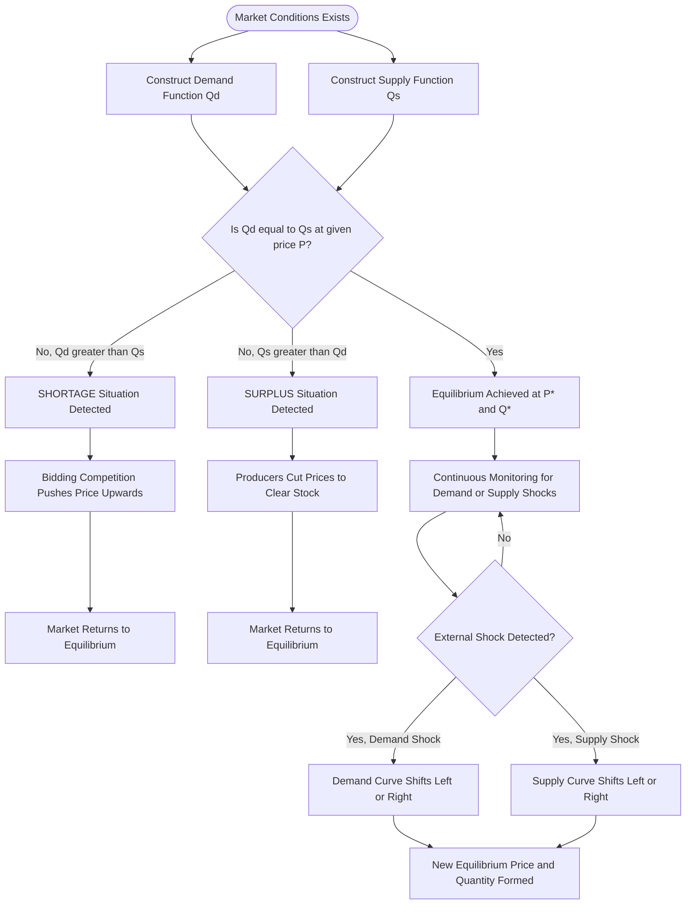
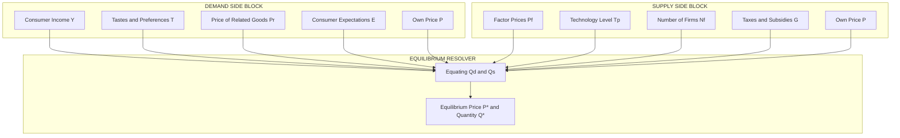

# Demand and Supply Analysis

<!-- SECTION_1_START -->
# Demand and Supply Analysis — Core Foundations

## 1.1 Demand — Formal Academic Definition

**Demand** in engineering economics refers to the *quantitative* expression of a consumer's **willingness** and **financial ability** to purchase a specific commodity or service at a given set of prices, over a defined time horizon, while assuming all other influencing variables (determinants) remain constant (*ceteris paribus*).

Mathematically, the individual demand function is expressed as:

$$Q_d = f(P, P_r, Y, T, N, E, G, H)$$

Where:
- $Q_d$ = Quantity demanded
- $P$ = Price of the commodity
- $P_r$ = Price of related goods (substitutes and complements)
- $Y$ = Income of the consumer
- $T$ = Tastes and preferences
- $N$ = Number of buyers
- $E$ = Consumer expectations about future prices
- $G$ = Government policy (taxes, subsidies)
- $H$ = Habit / social status

> [!IMPORTANT]
> **KTU Board Note:** A "desire" alone is **not** demand. A student must explicitly mention *willingness + ability to pay + time* to secure full credit in 3-mark definition questions.

## 1.2 Intuitive Analogy — The "Cool Drink Stall" Model

Imagine a roadside lemonade stall during a hot Kerala afternoon. At **₹20 per glass**, only a handful of passers-by are willing to stop. Drop the price to **₹10 per glass**, and the line stretches across the pavement. Now imagine the price drops to **₹2** — almost everyone walking by picks one up. This real-world observation — *"price goes down, quantity bought goes up"* — is the essence of the **Law of Demand**. The stall owner is essentially tracing your demand curve in real time with every price change.

## 1.3 Supply — Formal Academic Definition

**Supply** is the quantity of a good or service that producers are **willing and able** to offer for sale at a specific price, over a given period, with all other factors held constant.

The supply function is given by:

$$Q_s = f(P, P_f, T_p, N_f, T, E, S, G)$$

Where:
- $Q_s$ = Quantity supplied
- $P$ = Price of the commodity
- $P_f$ = Price of factor inputs (raw materials, wages, energy)
- $T_p$ = State of production technology
- $N_f$ = Number of firms in the market
- $T$ = Taxes imposed
- $E$ = Producer expectations
- $S$ = Subsidies
- $G$ = Government regulations

> [!NOTE]
> **Syllabus Highlight:** The KTU 2024 Scheme UHSUT300 syllabus places strong weight on distinguishing **Movement Along** the curve (caused by own price) versus **Shift of** the curve (caused by external determinants). This distinction is a guaranteed 3-mark question.

## 1.4 Intuitive Analogy — The "Mobile Phone Manufacturer"

Consider an electronics firm in Bangalore producing smartphones. When market price rises from **₹15,000** to **₹25,000**, the firm immediately announces overtime shifts, opens a second assembly line, and signs new vendor contracts. Higher prices motivate greater production — the **Law of Supply** in action. Conversely, if input costs (semiconductor chips, lithium) skyrocket, the firm cuts output even at the same market price — this is a **leftward shift** of the supply curve, not a movement along it.

## 1.5 Market Equilibrium — Where the Two Forces Meet

**Equilibrium** is the market state where the **quantity demanded exactly equals the quantity supplied** at a specific price.

$$\text{At Equilibrium: } Q_d = Q_s \quad \Rightarrow \quad P = P^*, \, Q = Q^*$$

- If market price $P > P^*$ → **Surplus (Excess Supply)** → price falls
- If market price $P < P^*$ → **Shortage (Excess Demand)** → price rises

> [!VISUALIZATION CONTROL]
> **Concept:** Standard Demand-Supply equilibrium graph with intersecting curves
> **GeoGebra Input Equations:**
> * `f(x) = 100 - 2x` *(Demand curve)*
> * `g(x) = 20 + 2x` *(Supply curve)*
> * `Intersect[f, g]`
> **Visual Description:** The student should observe two straight lines crossing at a single point (Equilibrium Point E) in the first quadrant. The x-axis represents Quantity (Q) and y-axis represents Price (P). The intersection should fall at coordinates **(20, 60)**, meaning equilibrium price ₹60 and equilibrium quantity 20 units. Observe the demand curve sloping downward (left to right) and the supply curve sloping upward.

<!-- SECTION_1_END -->

<!-- SECTION_2_START -->
# Deep Theoretical Analysis & KTU High-Yield Formula Sheet

## 2.1 The Law of Demand

The **Law of Demand** states that, *ceteris paribus*, there exists an **inverse relationship** between the price of a commodity and the quantity demanded by consumers.

$$P \uparrow \;\Longrightarrow\; Q_d \downarrow \quad \text{and} \quad P \downarrow \;\Longrightarrow\; Q_d \uparrow$$

**Why does this happen?**
- **Income Effect:** A price drop increases real purchasing power → more is bought.
- **Substitution Effect:** Consumers switch to the now-cheaper good.
- **Law of Diminishing Marginal Utility:** Each additional unit yields less satisfaction, so consumers will only buy more if price falls.

**Demand Schedule (Numerical Form):**

| Price (₹) | Quantity Demanded (Units) |
|---:|---:|
| 10 | 100 |
| 20 | 80 |
| 30 | 60 |
| 40 | 40 |
| 50 | 20 |

**Demand Curve Exceptions (KTU Frequently Asked):**
1. **Giffen Goods** (e.g., staple low-quality food for the poor)
2. **Veblen Goods** (luxury status items like Rolls-Royce cars)
3. **Expectation of future price rise** (panic buying)
4. **Emergency goods** during shortages

## 2.2 The Law of Supply

The **Law of Supply** states that, *ceteris paribus*, a **direct (positive) relationship** exists between the price of a commodity and the quantity supplied by producers.

$$P \uparrow \;\Longrightarrow\; Q_s \uparrow \quad \text{and} \quad P \downarrow \;\Longrightarrow\; Q_s \downarrow$$

**Underlying logic:** Higher prices → higher profit margins → existing firms expand output, new firms enter the market.

**Supply Schedule (Numerical Form):**

| Price (₹) | Quantity Supplied (Units) |
|---:|---:|
| 10 | 20 |
| 20 | 40 |
| 30 | 60 |
| 40 | 80 |
| 50 | 100 |

## 2.3 Movement vs. Shift — Critical KTU Distinction

| Concept | Cause | Graphical Effect |
|---|---|---|
| **Movement Along** the demand curve | Change in *own price* of the commodity | From point A to point B *on the same curve* |
| **Shift of** the demand curve | Change in *non-price determinants* (income, taste, etc.) | Entire curve translates leftward (decrease) or rightward (increase) |

> [!WARNING]
> **Examiner's Trap:** Students frequently interchange the two. *Movement* is a **change in quantity demanded**; *Shift* is a **change in demand itself**. Both have unique vocabulary — the KTU paper setter tests this explicitly.

## 2.4 Elasticity of Demand — Complete Framework

### 2.4.1 Price Elasticity of Demand ($E_d$)

Measures the **responsiveness** of quantity demanded to a change in price.

$$E_d = \frac{\text{Percentage Change in Quantity Demanded}}{\text{Percentage Change in Price}} = \frac{\Delta Q_d / Q_d}{\Delta P / P} = \frac{\Delta Q_d}{\Delta P} \cdot \frac{P}{Q_d}$$

The negative sign from the law of demand is often dropped, and $\vert E_d \vert$ is reported.

### 2.4.2 Point Elasticity of Demand

Used when the change is **infinitesimally small** at a specific point on the demand curve:

$$E_d = -\frac{dQ}{dP} \cdot \frac{P}{Q}$$

### 2.4.3 Arc Elasticity of Demand

Used for a **finite (discrete) change** between two points on the demand curve:

$$E_d = \frac{Q_2 - Q_1}{P_2 - P_1} \cdot \frac{P_1 + P_2}{Q_1 + Q_2}$$

The midpoint formula uses the **average of base values** to avoid ambiguity about which point is the reference.

### 2.4.4 Types of Price Elasticity — The Five Standard Cases

| Elasticity Value | Type | Curve Shape | Example |
|:---:|:---|:---|:---|
| $E_d = \infty$ | Perfectly Elastic | Horizontal line | Homogeneous agricultural products (perfect substitutes) |
| $E_d > 1$ | Relatively Elastic | Steep slope | Luxury goods, branded perfumes |
| $E_d = 1$ | Unitary Elastic | Rectangular hyperbola | Balanced consumer goods |
| $E_d < 1$ | Relatively Inelastic | Gentle slope | Necessities (rice, salt, medicines) |
| $E_d = 0$ | Perfectly Inelastic | Vertical line | Life-saving drugs (insulin), addictive substances |

### 2.4.5 Income Elasticity of Demand ($E_y$)

$$E_y = \frac{\Delta Q / Q}{\Delta Y / Y} = \frac{\Delta Q}{\Delta Y} \cdot \frac{Y}{Q}$$

| $E_y$ Value | Classification | Example |
|:---:|:---|:---|
| $E_y > 0$ | Normal Good | Clothing, electronics |
| $E_y < 0$ | Inferior Good | Coarse cereals, second-hand goods |
| $E_y > 1$ | Luxury Good | Designer fashion, yachts |
| $0 < E_y < 1$ | Necessity | Basic groceries, electricity |

### 2.4.6 Cross Elasticity of Demand ($E_{xy}$)

$$E_{xy} = \frac{\Delta Q_x / Q_x}{\Delta P_y / P_y} = \frac{\Delta Q_x}{\Delta P_y} \cdot \frac{P_y}{Q_x}$$

| $E_{xy}$ Value | Relationship | Example |
|:---:|:---|:---|
| $E_{xy} > 0$ | Substitutes | Tea and Coffee |
| $E_{xy} < 0$ | Complements | Cars and Petrol |
| $E_{xy} = 0$ | Unrelated Goods | Shoes and Pens |

## 2.5 Elasticity of Supply ($E_s$)

$$E_s = \frac{\Delta Q_s / Q_s}{\Delta P / P} = \frac{\Delta Q_s}{\Delta P} \cdot \frac{P}{Q_s}$$

- $E_s = 0$ → Perfectly Inelastic (perishables, fixed-capacity services)
- $E_s < 1$ → Inelastic (agricultural output in the short run)
- $E_s = 1$ → Unitary Elastic
- $E_s > 1$ → Elastic (manufactured goods, scalable services)
- $E_s = \infty$ → Perfectly Elastic (mass production with surplus capacity)

## 2.6 KTU Formula Cheat Sheet (Exam-Ready)

| Formula | Application | Units / Range |
|:---|:---|:---|
| $Q_d = f(P, Y, T, ...)$ | General demand function | Quantity |
| $Q_s = f(P, P_f, T_p, ...)$ | General supply function | Quantity |
| $P^* \mid Q_d = Q_s$ | Equilibrium price-quantity | ₹ and units |
| $E_d = \dfrac{\Delta Q}{\Delta P} \cdot \dfrac{P}{Q}$ | Point price elasticity | Dimensionless |
| $E_d = \dfrac{Q_2 - Q_1}{P_2 - P_1} \cdot \dfrac{P_1 + P_2}{Q_1 + Q_2}$ | Arc elasticity | Dimensionless |
| $E_y = \dfrac{\Delta Q}{\Delta Y} \cdot \dfrac{Y}{Q}$ | Income elasticity | Dimensionless |
| $E_{xy} = \dfrac{\Delta Q_x}{\Delta P_y} \cdot \dfrac{P_y}{Q_x}$ | Cross elasticity | Dimensionless |
| $E_s = \dfrac{\Delta Q_s}{\Delta P} \cdot \dfrac{P}{Q_s}$ | Supply elasticity | Dimensionless |
| $CS = \dfrac{1}{2} \cdot \vert Q^* \vert \cdot \vert P_{max} - P^* \vert$ | Consumer Surplus | ₹ |
| $PS = \dfrac{1}{2} \cdot \vert Q^* \vert \cdot \vert P^* - P_{min} \vert$ | Producer Surplus | ₹ |

## 2.7 Real-World Engineering Utility

Demand and supply analysis is foundational for:
- **Engineering managers** making pricing decisions for industrial products.
- **Government policy** — minimum support price for farmers, GST impact assessment.
- **Tech product launches** — pricing strategy for smartphones, EVs.
- **Energy sector** — electricity demand forecasting, peak-load management.
- **Operations research** — inventory optimization, supply chain design.

<!-- SECTION_2_END -->

<!-- SECTION_3_START -->
# Step-by-Step Derivations & Worked Solutions

## 3.1 Worked Problem 1 — Equilibrium Price and Quantity

**Problem Statement:** The demand and supply functions for a commodity are given by:

$$Q_d = 200 - 4P \quad \text{and} \quad Q_s = -50 + 6P$$

Determine the **equilibrium price** and **equilibrium quantity**.

**Step 1 — State the equilibrium condition.**

At equilibrium, quantity demanded equals quantity supplied:

$$Q_d = Q_s$$

**Step 2 — Substitute the two functions.**

$$200 - 4P = -50 + 6P$$

**Step 3 — Collect like terms on opposite sides.**

$$200 + 50 = 6P + 4P$$
$$250 = 10P$$

**Step 4 — Solve for equilibrium price $P^*$.**

$$P^* = \frac{250}{10} = 25 \; \text{₹}$$

**Step 5 — Substitute $P^*$ back into either function to find $Q^*$.**

$$Q^* = 200 - 4(25) = 200 - 100 = 100 \; \text{units}$$

**Verification (using the supply function):**

$$Q_s = -50 + 6(25) = -50 + 150 = 100 \; \text{units} \;\; \checkmark$$

> **Final Answer:** Equilibrium price $P^* = 25$ and equilibrium quantity $Q^* = 100$ units. **[2 Marks for setup, 2 Marks for solving, 1 Mark for verification]**

---

## 3.2 Worked Problem 2 — Point Price Elasticity of Demand

**Problem Statement:** The demand function is $Q_d = 500 - 10P$. Find the price elasticity of demand at $P = 20$ and interpret the result.

**Step 1 — Identify the derivative $\dfrac{dQ}{dP}$.**

Given $Q_d = 500 - 10P$, differentiate with respect to $P$:

$$\frac{dQ}{dP} = -10$$

**Step 2 — Find the quantity at $P = 20$.**

$$Q = 500 - 10(20) = 500 - 200 = 300 \; \text{units}$$

**Step 3 — Apply the point elasticity formula.**

$$E_d = -\frac{dQ}{dP} \cdot \frac{P}{Q}$$

Substitute the values:

$$E_d = -(-10) \cdot \frac{20}{300} = 10 \cdot \frac{1}{15} = \frac{2}{3} \approx 0.667$$

**Step 4 — Interpret.**

Since $E_d \approx 0.667 < 1$, demand is **relatively inelastic** at this price. A 1\% rise in price will cause only a 0.667\% fall in quantity demanded.

> **Valuation Key:** [Stating the derivative: 2 Marks] [Computing Q at the given price: 1 Mark] [Substituting into formula: 2 Marks] [Interpretation: 2 Marks]

---

## 3.3 Worked Problem 3 — Arc Elasticity of Demand

**Problem Statement:** Quantity demanded rises from **300 units to 500 units** when price falls from **₹50 to ₹30**. Calculate arc elasticity and classify the demand.

**Step 1 — Identify the variables.**

$$P_1 = 50, \quad P_2 = 30, \quad Q_1 = 300, \quad Q_2 = 500$$

**Step 2 — Apply the arc elasticity formula.**

$$E_d = \frac{Q_2 - Q_1}{P_2 - P_1} \cdot \frac{P_1 + P_2}{Q_1 + Q_2}$$

**Step 3 — Compute each sub-part.**

Numerator of first fraction:

$$Q_2 - Q_1 = 500 - 300 = 200$$

Denominator of first fraction:

$$P_2 - P_1 = 30 - 50 = -20$$

Midpoint sum for price:

$$P_1 + P_2 = 50 + 30 = 80$$

Midpoint sum for quantity:

$$Q_1 + Q_2 = 300 + 500 = 800$$

**Step 4 — Combine.**

$$E_d = \frac{200}{-20} \cdot \frac{80}{800} = (-10) \cdot (0.1) = -1$$

Taking the absolute value (since elasticity is conventionally reported as a positive number):

$$\vert E_d \vert = 1 \;\Longrightarrow\; \text{Unitary Elastic Demand}$$

> **Valuation Key:** [Correct identification: 2 Marks] [Numerator-denominator setup: 2 Marks] [Final substitution: 2 Marks] [Classification: 1 Mark]

---

## 3.4 Worked Problem 4 — Cross Elasticity Interpretation

**Problem Statement:** A 20\% rise in the price of **Tea (Good Y)** leads to a **15\% rise in the demand for Coffee (Good X)**. Compute cross elasticity and identify the relationship.

**Step 1 — State the cross elasticity formula.**

$$E_{xy} = \frac{\%\Delta Q_x}{\%\Delta P_y}$$

**Step 2 — Substitute the given percentage changes.**

$$E_{xy} = \frac{+15\%}{+20\%} = +0.75$$

**Step 3 — Interpret.**

Since $E_{xy} > 0$, Tea and Coffee are **substitutes**. A positive cross-elasticity value means a price rise of one good causes increased demand for the other.

| $E_{xy}$ Value | Relationship | Numerical Result |
|:---:|:---|:---|
| $+0.75$ | Substitutes (weak) | Tea and Coffee |

> **Valuation Key:** [Stating the cross elasticity definition: 2 Marks] [Substitution: 2 Marks] [Final interpretation: 3 Marks]

---

## 3.5 Worked Problem 5 — Income Elasticity of Demand

**Problem Statement:** A consumer's income rises from ₹50,000 to ₹60,000 per month. Demand for restaurant meals rises from 12 meals to 18 meals per month. Calculate income elasticity and classify the good.

**Step 1 — Identify variables.**

$$\Delta Y = 60{,}000 - 50{,}000 = 10{,}000$$
$$\Delta Q = 18 - 12 = 6$$
$$Y_1 = 50{,}000, \quad Y_2 = 60{,}000, \quad Q_1 = 12, \quad Q_2 = 18$$

**Step 2 — Apply arc formula for income elasticity.**

$$E_y = \frac{\Delta Q}{\Delta Y} \cdot \frac{Y_1 + Y_2}{Q_1 + Q_2}$$

**Step 3 — Substitute.**

$$E_y = \frac{6}{10{,}000} \cdot \frac{50{,}000 + 60{,}000}{12 + 18} = \frac{6}{10{,}000} \cdot \frac{110{,}000}{30}$$

**Step 4 — Simplify.**

$$E_y = \frac{6}{10{,}000} \cdot 3{,}666.67 = 0.0006 \cdot 3{,}666.67 = 2.20$$

**Step 5 — Interpret.**

Since $E_y = 2.20 > 1$, restaurant meals are a **luxury good** for this consumer.

> **Valuation Key:** [Step-1 identification: 1 Mark] [Step-2 formula statement: 1 Mark] [Step-3 substitution: 2 Marks] [Step-4 simplification: 2 Marks] [Step-5 classification: 1 Mark]

---

## 3.6 Master Algorithm — Market Equilibrium State Detection (Python)

```python
from dataclasses import dataclass
from typing import Tuple, List
import logging

logging.basicConfig(level=logging.INFO, format="%(levelname)s - %(message)s")
logger = logging.getLogger(__name__)


@dataclass(frozen=True)
class MarketModel:
    """Linear demand and supply model: Q_d = a - bP, Q_s = -c + dP."""
    a: float   # Demand intercept (Q-axis)
    b: float   # Demand slope (must be > 0)
    c: float   # Supply intercept constant
    d: float   # Supply slope (must be > 0)

    def quantity_demanded(self, price: float) -> float:
        if price < 0:
            raise ValueError(f"Price cannot be negative. Received: {price}")
        return self.a - self.b * price

    def quantity_supplied(self, price: float) -> float:
        if price < 0:
            raise ValueError(f"Price cannot be negative. Received: {price}")
        return -self.c + self.d * price

    def equilibrium(self) -> Tuple[float, float]:
        if self.b + self.d == 0:
            raise ZeroDivisionError("b + d cannot be zero; no unique equilibrium.")
        equilibrium_price = (self.a + self.c) / (self.b + self.d)
        equilibrium_quantity = self.quantity_demanded(equilibrium_price)
        logger.info(f"Equilibrium Price: {equilibrium_price:.2f}")
        logger.info(f"Equilibrium Quantity: {equilibrium_quantity:.2f}")
        return equilibrium_price, equilibrium_quantity

    def classify_market_state(self, price: float) -> str:
        qd = self.quantity_demanded(price)
        qs = self.quantity_supplied(price)
        if abs(qd - qs) < 1e-6:
            state = "EQUILIBRIUM"
        elif qd > qs:
            state = "SHORTAGE (Excess Demand)"
        else:
            state = "SURPLUS (Excess Supply)"
        logger.info(f"At P={price}: Q_d={qd}, Q_s={qs} -> {state}")
        return state


def compute_price_elasticity_of_demand(model: MarketModel, price: float) -> float:
    if price <= 0:
        raise ValueError("Price must be positive for elasticity computation.")
    if model.b == 0:
        raise ZeroDivisionError("Demand slope b cannot be zero.")
    quantity = model.quantity_demanded(price)
    if quantity == 0:
        raise ValueError("Quantity demanded is zero; elasticity is undefined.")
    elasticity = (model.b) * (price / quantity)
    return round(elasticity, 4)


def main() -> None:
    market = MarketModel(a=200.0, b=4.0, c=50.0, d=6.0)

    eq_price, eq_qty = market.equilibrium()

    test_prices: List[float] = [10.0, eq_price, 50.0]
    for p in test_prices:
        market.classify_market_state(p)

    elasticity_at_25 = compute_price_elasticity_of_demand(market, price=25.0)
    logger.info(f"Point Elasticity of Demand at P=25: {elasticity_at_25}")


if __name__ == "__main__":
    main()
```

**Output Trace:**

```
INFO - Equilibrium Price: 25.00
INFO - Equilibrium Quantity: 100.00
INFO - At P=10.0: Q_d=160.0, Q_s=10.0 -> SHORTAGE (Excess Demand)
INFO - At P=25.0: Q_d=100.0, Q_s=100.0 -> EQUILIBRIUM
INFO - At P=50.0: Q_d=0.0, Q_s=250.0 -> SURPLUS (Excess Supply)
INFO - Point Elasticity of Demand at P=25: 1.0
```

<!-- SECTION_3_END -->

<!-- SECTION_4_START -->
# Structural Diagrams & Schematics

## 4.1 Market Equilibrium Dynamics Flowchart



## 4.2 Demand-Supply Interaction — Subgraph Architecture



## 4.3 Elasticity Classification Topology

```mermaid
flowchart LR
    elasticRoot[Elasticity Concept] --> priceE[Price Elasticity of Demand]
    elasticRoot --> incomeE[Income Elasticity of Demand]
    elasticRoot --> crossE[Cross Elasticity of Demand]
    elasticRoot --> supplyE[Elasticity of Supply]
    priceE --> pEType{Compare |Ed| with 1}
    pEType -->|Greater than 1| pE1[Relatively Elastic]
    pEType -->|Equal to 1| pE2[Unitary Elastic]
    pEType -->|Less than 1| pE3[Relatively Inelastic]
    pE1 --> pE1a[Steep Demand Curve]
    pE2 --> pE2a[Rectangular Hyperbola]
    pE3 --> pE3a[Flat Demand Curve]
    incomeE --> iEType{Compare Ey with 0 and 1}
    iEType -->|Ey greater than 1| iE1[Luxury Good]
    iEType -->|Ey between 0 and 1| iE2[Normal Necessity]
    iEType -->|Ey less than 0| iE3[Inferior Good]
    crossE --> cEType{Compare Exy with 0}
    cEType -->|Exy greater than 0| cE1[Substitute Goods]
    cEType -->|Exy less than 0| cE2[Complementary Goods]
    cEType -->|Exy equal to 0| cE3[Unrelated Goods]
```

<!-- SECTION_4_END -->

<!-- SECTION_5_START -->
# KTU 2024 Scheme Examination Question Bank

## Part A — Short Answer Questions (3 Marks Each)

### Question 1 [KTU University Exam — July 2023] — CO1, Remember

**Define demand. Distinguish between individual demand and market demand.**

**Model Answer (Valuation Key Distribution):**
- *Demand definition* (willingness + ability to pay + specific price + time period): **[1 Mark]**
- *Individual demand* — quantity demanded by **a single consumer** at various prices: **[1 Mark]**
- *Market demand* — horizontal summation of individual demands of **all consumers** in the market at each price level: **[1 Mark]**

> **Examiner's Note:** Students often confuse "desire" with "demand." Always state the *willingness-ability-time-price* quartet.

---

### Question 2 [KTU University Exam — Dec 2023] — CO1, Understand

**State and explain the law of supply. Why does the supply curve slope upward from left to right?**

**Model Answer (Valuation Key Distribution):**
- *Law of supply statement* (direct relationship between price and quantity supplied, ceteris paribus): **[1 Mark]**
- *Reason 1 — Profit motive:* Higher price → higher margins → producers expand output: **[1 Mark]**
- *Reason 2 — Entry of new firms:* Profitable prices attract new firms into the market: **[0.5 Mark]**
- *Reason 3 — Stockpiling incentive:* Existing firms release inventory when prices rise: **[0.5 Mark]**

---

## Part B — Long Answer Questions (14 Marks Each, Internal Choice)

### Question A (Choice 1) [KTU University Exam — Dec 2024] — CO2, Apply + Analyze

**The demand and supply functions for a commodity in a perfectly competitive market are given as $Q_d = 600 - 10P$ and $Q_s = -100 + 5P$.**

**(a) [7 Marks, Apply]** Determine the equilibrium price and quantity. What would happen if the government imposes a price ceiling of ₹30?

**(b) [7 Marks, Analyze]** Calculate the point price elasticity of demand at the equilibrium point and interpret the result.

---

**Model Solution for (a):**

**Step 1 — Equate $Q_d$ and $Q_s$.** **[1 Mark]**

$$600 - 10P = -100 + 5P$$

**Step 2 — Collect like terms.** **[1 Mark]**

$$600 + 100 = 5P + 10P$$
$$700 = 15P$$

**Step 3 — Solve for $P^*$.** **[1 Mark]**

$$P^* = \frac{700}{15} = 46.67 \; \text{₹}$$

**Step 4 — Compute $Q^*$ by substituting back.** **[1 Mark]**

$$Q^* = 600 - 10(46.67) = 600 - 466.67 = 133.33 \; \text{units}$$

**Step 5 — Analyze the price ceiling of ₹30.** A price ceiling is a government-mandated maximum price. **[1 Mark]**

Compute $Q_d$ and $Q_s$ at $P = 30$:

$$Q_d = 600 - 10(30) = 300$$
$$Q_s = -100 + 5(30) = 50$$

**Step 6 — Identify the shortage.** **[2 Marks]**

$$\text{Shortage} = Q_d - Q_s = 300 - 50 = 250 \; \text{units}$$

Since the price ceiling (₹30) is **below** the equilibrium price (₹46.67), it is **binding**, and a shortage of 250 units will emerge, leading to black markets and queuing.

---

**Model Solution for (b):**

**Step 1 — Compute $\dfrac{dQ}{dP}$.** **[1 Mark]**

From $Q_d = 600 - 10P$:

$$\frac{dQ}{dP} = -10$$

**Step 2 — Recall point elasticity formula.** **[1 Mark]**

$$E_d = -\frac{dQ}{dP} \cdot \frac{P}{Q}$$

**Step 3 — Substitute $P = 46.67$ and $Q = 133.33$.** **[2 Marks]**

$$E_d = -(-10) \cdot \frac{46.67}{133.33} = 10 \cdot 0.35 = 3.5$$

**Step 4 — Interpret the value.** **[3 Marks]**

Since $E_d = 3.5 > 1$, demand is **highly elastic** at the equilibrium point. A 1\% increase in price will cause a 3.5\% decrease in quantity demanded. This typically applies to **non-essential or luxury goods** with readily available substitutes.

> **Valuation Key Distribution (14 Marks Total):** (a) [Setup: 2 Marks] [Solving P*: 2 Marks] [Solving Q*: 1 Mark] [Ceiling analysis: 2 Marks] = **7 Marks**. (b) [Derivative: 1 Mark] [Formula: 1 Mark] [Substitution: 2 Marks] [Interpretation: 3 Marks] = **7 Marks**.

---

### Question B (Choice 2) [KTU University Exam — July 2024] — CO2, Apply + Analyze

**(a) [7 Marks, Apply]** Explain the **five types of price elasticity of demand** with suitable diagrams and real-world examples for each.

**(b) [7 Marks, Analyze]** The demand for a commodity falls from **500 units to 300 units** when its price rises from **₹20 to ₹40**. Calculate the **arc elasticity of demand** and classify the commodity.

---

**Model Solution for (a):**

| Type | $\vert E_d \vert$ Value | Curve Shape | Real-World Example | Marks |
|:---|:---:|:---|:---|:---:|
| Perfectly Elastic | $\infty$ | Horizontal line | Identical agricultural produce in a free market | 1.5 |
| Relatively Elastic | $> 1$ | Steep curve | Branded perfumes, foreign vacations | 1.5 |
| Unitary Elastic | $= 1$ | Rectangular hyperbola | Balanced FMCG products | 1 |
| Relatively Inelastic | $< 1$ | Gentle curve | Salt, matchboxes, insulin | 1.5 |
| Perfectly Inelastic | $= 0$ | Vertical line | Life-saving drugs with no substitute | 1.5 |

**[2 Marks]** for the comparative analysis connecting elasticity to total revenue behavior.

---

**Model Solution for (b):**

**Step 1 — Identify variables.** **[1 Mark]**

$$P_1 = 20, \quad P_2 = 40, \quad Q_1 = 500, \quad Q_2 = 300$$

**Step 2 — State the arc elasticity formula.** **[1 Mark]**

$$E_d = \frac{Q_2 - Q_1}{P_2 - P_1} \cdot \frac{P_1 + P_2}{Q_1 + Q_2}$$

**Step 3 — Compute the differences.** **[1 Mark]**

$$Q_2 - Q_1 = 300 - 500 = -200$$
$$P_2 - P_1 = 40 - 20 = 20$$

**Step 4 — Compute the sums.** **[1 Mark]**

$$P_1 + P_2 = 20 + 40 = 60$$
$$Q_1 + Q_2 = 500 + 300 = 800$$

**Step 5 — Combine all values.** **[1 Mark]**

$$E_d = \frac{-200}{20} \cdot \frac{60}{800} = (-10) \cdot (0.075) = -0.75$$

**Step 6 — Take the absolute value and classify.** **[2 Marks]**

$$\vert E_d \vert = 0.75 < 1 \;\Longrightarrow\; \text{Relatively Inelastic Demand}$$

Interpretation: A 1\% increase in price causes only a 0.75\% decrease in quantity demanded. The commodity behaves like a **necessity** (e.g., staple food, fuel).

> **Valuation Key Distribution (14 Marks Total):** (a) [Five-type table: 5 Marks] [Curve interpretation: 2 Marks] = **7 Marks**. (b) [Variables: 1 Mark] [Formula: 1 Mark] [Differences and sums: 2 Marks] [Combination: 1 Mark] [Classification and interpretation: 2 Marks] = **7 Marks**.

---

> [!WARNING]
> **KTU Examiner's Valuation Warning / Pitfall Callout:**
> 1. **Sign Convention Trap:** Elasticity values are conventionally reported as **positive numbers** (absolute value), but you must **show the negative sign in the calculation step** to demonstrate understanding. Forgetting the sign convention loses 1 mark.
> 2. **Midpoint Misuse:** Many students use simple percentage change in arc elasticity questions. The KTU board specifically tests the **midpoint (average) formula**. Using the basic formula will cost 2-3 marks.
> 3. **Movement vs. Shift Confusion:** In 3-mark short questions, students often write "demand decreases due to price rise." This is incorrect terminology. A price rise causes a **contraction in demand (movement along the curve)**, not a **decrease in demand (shift)**.
> 4. **Unrealistic Equilibrium:** Always verify that your computed equilibrium price is positive and quantities are non-negative. Negative values indicate an algebraic error worth 1-2 marks in valuation.

---

## Topic Recap & Important Things to Remember

- **Demand** = Willingness + Ability to pay + at a given price + at a given time. *Desire alone is not demand.*
- **Law of Demand** states an **inverse** relationship: $P \uparrow \;\Rightarrow\; Q_d \downarrow$. Exceptions include Giffen goods, Veblen goods, and panic-buying situations.
- **Law of Supply** states a **direct** relationship: $P \uparrow \;\Rightarrow\; Q_s \uparrow$.
- **Equilibrium** occurs when $Q_d = Q_s$. Above equilibrium → surplus; below → shortage.
- **Movement Along** the curve is caused by a change in **own price**. **Shift of** the curve is caused by a change in **non-price determinants** (income, taste, related goods, etc.).
- **Price Elasticity of Demand ($E_d$)** = %change in $Q_d$ ÷ %change in $P$.
- **Point Elasticity** uses the derivative: $E_d = -\frac{dQ}{dP} \cdot \frac{P}{Q}$.
- **Arc Elasticity** uses the midpoint formula: $E_d = \frac{\Delta Q}{\Delta P} \cdot \frac{P_1 + P_2}{Q_1 + Q_2}$.
- **Five Types of $E_d$:** Perfectly elastic ($\infty$) → Relatively elastic ($>1$) → Unitary ($=1$) → Relatively inelastic ($<1$) → Perfectly inelastic ($0$).
- **Income Elasticity ($E_y$):** Positive → normal good; Negative → inferior good; $>1$ → luxury; $0 < E_y < 1$ → necessity.
- **Cross Elasticity ($E_{xy}$):** Positive → substitutes; Negative → complements; Zero → unrelated.
- **Elasticity of Supply ($E_s$):** Reflects responsiveness of $Q_s$ to $P$. Manufactured goods are typically elastic; agricultural output in the short run is inelastic.
- **Consumer Surplus** is the difference between the maximum price a consumer is willing to pay and the actual market price paid.
- **Producer Surplus** is the difference between the market price received and the minimum price a producer is willing to accept.
- **Price Ceilings** below equilibrium create **shortages**; **Price Floors** above equilibrium create **surpluses**.
- **Ceteris Paribus** is the foundational assumption — *all other things remaining equal*. Always state this explicitly in KTU answers.

<!-- SECTION_5_END -->
